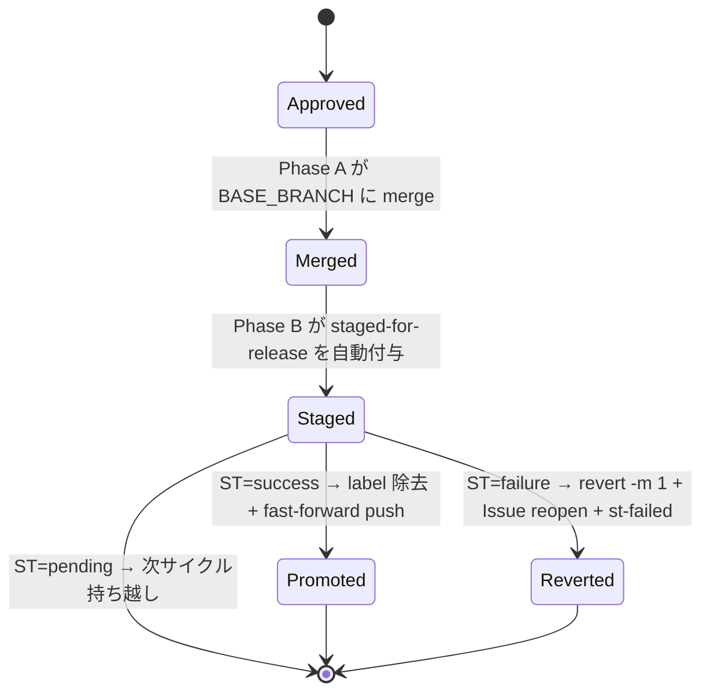
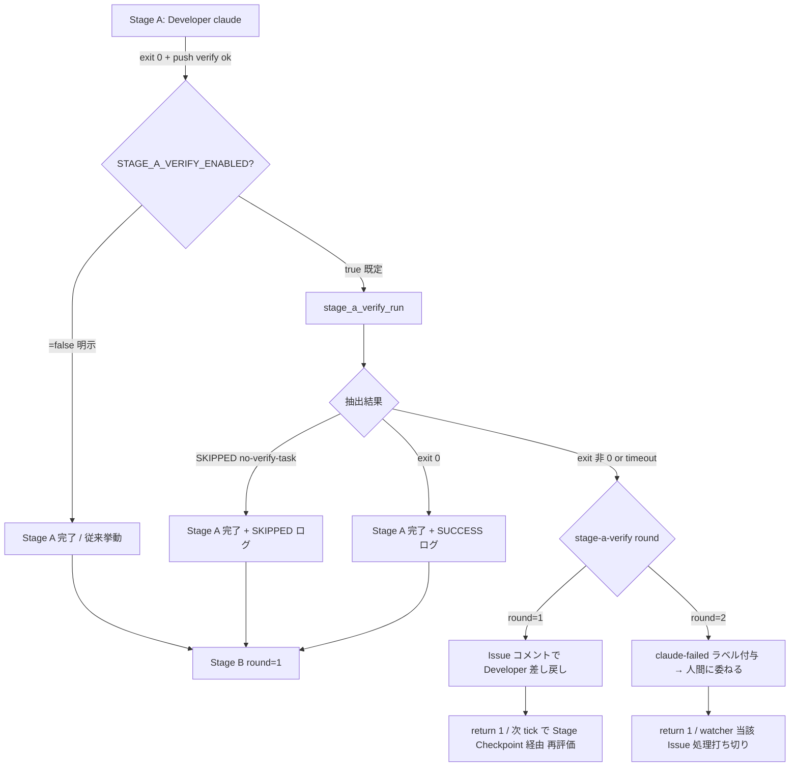

# idd-claude

**I**ssue-**D**riven **D**evelopment with **Claude** Code — GitHub Issue を起点に、
PM / Architect / 開発者 / PjM の 4 サブエージェント体制で自動開発を行うためのテンプレート一式。
Architect は Triage フェーズで「影響範囲が広い／設計判断が必要」と判定された Issue でのみ
自動起動し、軽微な修正ではスキップされる。

Architect が発動した Issue は **設計 PR ゲート**を経由する 2 PR フローで進行する
（`docs/specs/<N>-<slug>/` に要件・設計・タスクをまとめた設計 PR → 人間が merge → 実装 PR）。
Triage フェーズで人間判断が必要な論点を自動抽出し、Issue コメントで確認を取ってから
実装着手する、人間レビュー付き（Human-in-the-Loop）ワークフローを実現する。

> **既存リポジトリにとにかく入れて動かしたい人は [QUICK-HOWTO.md](./QUICK-HOWTO.md) へ。**
> ローカル watcher + 単一 repo の最短手順（約 15 分）に絞った導入ガイドです。本 README は
> 包括的なリファレンスとして、複数 repo 運用 / GitHub Actions 版 / 詳細仕様を扱います。

---

## 特徴

- **Issue 駆動**: `auto-dev` ラベルが付いた Issue を検出すると、自動でブランチを切り、実装、テスト、PR 作成まで実施
- **人間レビュー内蔵**: 致命的な判断が必要な場合は Issue にコメントで質問を投稿し、人間の回答を待つ
- **ラベルによる状態機械**: 状態遷移はすべて GitHub ラベルで表現され、監査証跡がそのまま残る
- **Triage と実装の二段構え**: 軽量モデルで Triage、Opus 4.7（1M context）で本実装、とコストを最適化
- **規模連動の設計フェーズ**: Triage 時に「新規 API / スキーマ変更 / 複数モジュール影響」などを検出すると Architect が自動で起動し、`docs/specs/<N>-<slug>/{requirements,design,tasks}.md` を生成。軽微な修正ではスキップしてコストと時間を抑える
- **設計 PR ゲート（cc-sdd 風）**: Architect 発動 Issue は、まず spec ディレクトリ（requirements / design / tasks のみ）だけの **設計 PR** を作成して人間レビューを通し、merge されてから初めて実装 PR が別途作られる。GitHub PR レビュー機能（line コメント / suggest-edit）で設計段階の修正が可能
- **Kiro / cc-sdd 互換の記法**: 受入基準は **EARS** 形式（`When [event], the [system] shall ...`）、要件 ID は numeric 階層（`1`, `1.1`, `2.3`）、tasks.md は `_Requirements:_` / `_Boundary:_` / `_Depends:_` / `(P)` アノテーション付き。エージェントは `.claude/rules/` のルールを参照して一貫した記法で生成する
- **テスト規約による品質ガードレール**: Developer は AC 起点の Red → Green → Refactor を遵守。異常系・境界値の必須化、モック方針、カバレッジ観点を `CLAUDE.md` で全エージェントに強制し、「テストは通るが受入基準を検証していない」落とし穴を防ぐ
- **2 つのデプロイ形態**:
  - **Local watcher**（推奨）: Claude Max サブスクリプションでローカル実行。Opus 4.7 の 1M context が利用可能
  - **GitHub Actions**: チーム・本番運用向け。API Key / Bedrock / Vertex AI で認証

---

## ディレクトリ構成

```
idd-claude/
├── README.md                        # 本ファイル（包括的リファレンス）
├── QUICK-HOWTO.md                   # 既存 repo 導入の最短手順（約 15 分）
├── setup.sh                         # `curl | bash` 対応の bootstrap インストーラ
├── install.sh                       # セットアップ支援スクリプト（clone 後に使う）
├── .gitignore
│
├── repo-template/                   # 開発対象リポジトリに配置するファイル
│   ├── CLAUDE.md                    # プロジェクト全体ガイド（全エージェント共通）
│   ├── .claude/
│   │   ├── agents/
│   │   │   ├── product-manager.md       # PM サブエージェント
│   │   │   ├── architect.md             # Architect サブエージェント（条件付き起動）
│   │   │   ├── developer.md             # Developer サブエージェント
│   │   │   ├── reviewer.md              # Reviewer サブエージェント（impl 系で自動起動 / #20 Phase 1）
│   │   │   ├── project-manager.md       # PjM サブエージェント
│   │   │   └── qa.md                    # QA サブエージェント（定義のみ・ワークフロー未統合）
│   │   └── rules/                       # エージェントが参照する共通ルール（cc-sdd adapt）
│   │       ├── ears-format.md           # AC の EARS 記法
│   │       ├── requirements-review-gate.md  # PM 自己レビューゲート
│   │       ├── design-principles.md     # design.md 記述原則
│   │       ├── design-review-gate.md    # Architect 自己レビューゲート
│   │       └── tasks-generation.md      # tasks.md アノテーション規約
│   └── .github/
│       ├── ISSUE_TEMPLATE/
│       │   └── feature.yml          # 自動開発用 Issue テンプレート
│       ├── scripts/
│       │   └── idd-claude-labels.sh # ラベル一括作成スクリプト（冪等）
│       └── workflows/
│           └── issue-to-pr.yml      # GitHub Actions 版ワークフロー
│
└── local-watcher/                   # ローカル PC に配置するファイル
    ├── bin/
    │   ├── issue-watcher.sh         # Issue 監視＋Claude Code 起動シェル（本体）
    │   ├── modules/                 # issue-watcher.sh が起動時に source するモジュール群
    │   │   ├── core_utils.sh        #   低レベル共通ユーティリティ・ロガー（#177 Part 1）
    │   │   ├── quota-aware.sh       #   クォータ待機制御プロセッサ（#180 Part 2）
    │   │   ├── merge-queue.sh       #   マージキュー制御＋再チェックプロセッサ（#180 Part 2）
    │   │   ├── auto-rebase.sh       #   自動 Rebase プロセッサ（#180 Part 2）
    │   │   ├── promote-pipeline.sh  #   Promote Pipeline ＋ Path Overlap プロセッサ（#181 Part 3）
    │   │   ├── pr-iteration.sh      #   PR Iteration プロセッサ（#181 Part 3）
    │   │   └── stage-a-verify.sh    #   Stage A Verify ゲート（#181 Part 3）
    │   └── triage-prompt.tmpl       # Triage フェーズ用プロンプト
    └── LaunchAgents/
        └── com.local.issue-watcher.plist   # macOS launchd 設定
```

> **モジュール構成について**: `issue-watcher.sh` は約 1 万行を超えたため、責務単位で
> `modules/*.sh` に段階的に分割している（#177 Part 1 で `core_utils.sh`、#180 Part 2 で
> 3 プロセッサ、#181 Part 3 で `promote-pipeline.sh` / `pr-iteration.sh` /
> `stage-a-verify.sh` の 3 プロセッサ）。本体は起動時にスクリプトディレクトリ基準（`BASH_SOURCE`）で
> `modules/` 配下を `source` する。`install.sh` が `local-watcher/bin/modules/*.sh` を
> `$HOME/bin/modules/` へ冪等配置する。必須モジュールが欠落していると本体は起動時に
> 欠落名を stderr に出して `exit 1` で安全停止する（silent fail させない）。
> 環境変数名・exit code・ログ書式・ラベル遷移・cron 登録文字列は分割前と完全に同一の
> 差分等価リファクタリングであり、運用者の cron / launchd 設定変更は不要。

---

## 前提条件

### 共通

- GitHub リポジトリへの push 権限
- `gh` CLI（GitHub CLI）のインストールと `gh auth login` 済み
- `jq` のインストール
- Node.js 18 以上
- Claude Code CLI のインストール（`npm install -g @anthropic-ai/claude-code`）
  - **最低バージョン要件**: 基本動作は **v2.0.0 以上**、PM / Architect の self-review-gate で
    `/goal` 自動ループ運用（[`.claude/rules/requirements-review-gate.md`](repo-template/.claude/rules/requirements-review-gate.md)
    および [`.claude/rules/design-review-gate.md`](repo-template/.claude/rules/design-review-gate.md)
    の「`/goal` による自動ループ運用」節）を利用する場合は **v2.1.139 以上**が必要です
  - v2.1.139 未満の環境では `/goal` 節は自動的にスキップされ、従来どおりの「Mechanical Checks
    → 判断レビュー → 最大 2 パス」手順がそのまま適用されます（後方互換）。バージョンは
    `claude --version` で確認できます

> **migration note**: 既存ユーザに対する破壊的変更はありません。本変更で
> `.claude/rules/requirements-review-gate.md` および `.claude/rules/design-review-gate.md` に
> 追加された「`/goal` による自動ループ運用」節は、従来の「最大 2 パス」表現を **撤廃せず
> 併記** する方針で記述されており、`/goal` 利用時のターン上限としても引き続き機能します。
> Claude Code v2.1.139 未満の環境では `/goal` 節のみがスキップされ、従来の手動 2 パス運用が
> そのまま継続します。

### Local watcher 方式

- **Claude Max サブスクリプション**（Opus 4.7 の 1M context を利用するため）
- 常時稼働可能な macOS / Linux マシン
- ローカルで `claude /login` 済み
- `flock` コマンド（Linux では標準、macOS は `brew install util-linux` で `flock` を導入）
- `timeout` コマンド（Linux では標準、macOS は `brew install coreutils` で `gtimeout` を導入。
  `timeout` 不在時は watcher が `gtimeout` を自動検出してフォールバックするため、手動シンボリックリンク作成は不要）

### GitHub Actions 方式

- 以下のいずれかの認証情報
  - `ANTHROPIC_API_KEY`（Console で発行）
  - `CLAUDE_CODE_OAUTH_TOKEN`（`claude setup-token` で発行、1 年有効、Opus 4.6 までの 200k context まで）
  - AWS Bedrock の OIDC 設定（エンタープライズ推奨）
  - Google Vertex AI の OIDC 設定（エンタープライズ推奨）

---

## セットアップ

### クイックインストール（curl ワンライナー）

`setup.sh` が idd-claude を `$HOME/.idd-claude` にクローンし、同梱の `install.sh` を起動します。
非対話・対話のどちらでも使えます。

**対話モード**（推奨、ターミナル直実行）:

```bash
bash <(curl -fsSL https://raw.githubusercontent.com/hitoshiichikawa/idd-claude/main/setup.sh)
```

**非対話モード**（引数で一気に配置）:

```bash
# 対象ディレクトリに cd してからワンライナー実行（--repo 省略時はカレント = ./）
cd /path/to/your-project
curl -fsSL https://raw.githubusercontent.com/hitoshiichikawa/idd-claude/main/setup.sh \
  | bash -s -- --all

# あるいはパス明示
curl -fsSL https://raw.githubusercontent.com/hitoshiichikawa/idd-claude/main/setup.sh \
  | bash -s -- --all --repo /path/to/your-project

# 対象リポジトリへの配置のみ（カレントディレクトリ）
curl -fsSL https://raw.githubusercontent.com/hitoshiichikawa/idd-claude/main/setup.sh \
  | bash -s -- --repo

# ローカル watcher のみ
curl -fsSL https://raw.githubusercontent.com/hitoshiichikawa/idd-claude/main/setup.sh \
  | bash -s -- --local
```

`--repo` に値を渡さなかった場合や `--all` を `--repo` なしで使った場合は、
**カレントディレクトリ (`./`)** にテンプレートを配置します。対話モードでも
プロンプトで Enter のみ入力すると同じくカレントがデフォルトです。

#### GitHub ラベルの自動セットアップ (#85)

`install.sh --repo` または `install.sh --all` で対象リポジトリに配置した直後、
同梱の `.github/scripts/idd-claude-labels.sh` を **自動実行**して、idd-claude が
状態遷移に使う必須ラベル（`auto-dev` / `claude-claimed` / `ready-for-review` 等）を
冪等作成します。これにより初回 cron / Actions 起動時に watcher が claim ラベル付与に
失敗する事故を防げます。

- **opt-out**: `--no-labels` フラグまたは `IDD_CLAUDE_SKIP_LABELS=true` 環境変数で
  ラベル処理を完全に skip できます。CI / 別ツールでラベルを自前管理しているリポジトリで
  推奨します
- **fail-soft**: `gh` 未インストール / `gh auth login` 未実施 / 権限なし / API 失敗時は
  ラベル処理だけを skip し、install 全体は exit 0 で完走します。skip 時は手動 fallback の
  完全コマンドが出力されるので、それをコピペで実行してください
- **冪等**: 既存ラベルは name / color / description ともに変更されません（既存値は保護）。
  色や説明を上書きしたい場合は手動で `bash .github/scripts/idd-claude-labels.sh --force`
- **新ラベルの再 install 伝播 (#185)**: template にラベルが追加された後で `install.sh` を
  再実行すると、最新の `idd-claude-labels.sh` が対象リポジトリへ再配置され、`setup_repo_labels`
  が全ラベルをループして **未存在のラベルだけを新規作成**します（既存ラベルは skip）。
  そのため `awaiting-slot` のような後から追加されたラベルも、再 install するだけで既存
  リポジトリへ確実に伝播します（NFR 1.1 冪等性は維持され、既存ラベルの削除・改名・color 変更は
  行われません）
- **`--local` 単独時は走りません**: 対象リポジトリ配置がない場合はラベル処理も発生しません
- **`--dry-run`**: 実 API 呼び出しせず、これから実行されるコマンドだけを表示します

```bash
# 通常: 配置 + ラベル自動作成（既存ラベルは保護）
./install.sh --repo /path/to/your-project

# ラベル処理を完全に skip（自前管理する運用向け）
./install.sh --repo /path/to/your-project --no-labels
# あるいは env で
IDD_CLAUDE_SKIP_LABELS=true ./install.sh --repo /path/to/your-project
```

`gh auth login` 未実施・private fork で権限が無い等で skip 扱いになった場合は、認証等を
解消してから手動 fallback として後述の [ラベル一括作成（推奨）](#ラベル一括作成推奨) を
実行してください。自動実行が成功している場合、手動 step を改めて実行する必要はありません
（再実行しても既存ラベルが保護されるため、害はありません）。

#### fork / mirror clone から導入するときの注意（履歴持ち込み警告 #115）

GitHub の fork や `git push --mirror` で別 repo の履歴ごと持ち込んだリポジトリに
`install.sh --repo` を流すと、引き継がれた古い `docs/specs/<番号>-<slug>/` ディレクトリや
`claude/issue-<番号>-*` ブランチが **新しい Issue 番号と衝突して watcher が誤った spec を
resume 対象に選ぶ**事故が発生し得ます。これを未然に防ぐため、`install.sh` は配置完了直後に
3 種類の検出を行い、該当があれば警告を表示します（**install 自体は止めません。exit 0 で
完走します**）。

| カテゴリ | 検出対象 |
|---|---|
| `[docs-specs]` | `docs/specs/<数字>-*/` 形式のディレクトリが 1 件以上存在する |
| `[claude-branches]` | `origin` リモートに `claude/issue-<数字>-(design\|impl)-*` ブランチが 1 件以上存在する |
| `[orphan-branches]` | 上記ブランチの `<数字>` の **過半数**が対象 repo の現存 Issue 番号（open + closed）と一致しない（fork/mirror 由来の可能性が高い） |

- **fail-soft**: `git ls-remote` / `gh issue list` が失敗（origin 未設定 / ネットワーク不通 /
  `gh` 未認証 / private repo で権限なし等）した場合、検出処理だけを skip して install 全体は
  exit 0 で完走します。`origin` remote が未設定のクリーンな新規 repo では skip 理由も含めて
  本機能由来の出力は **0 件**（false positive ゼロ保証）
- **`--dry-run` 対応**: 検出処理自体は dry-run でも実施され、警告行は `[DRY-RUN] WARNING:`
  プレフィックスで出力されます
- **`--local` 単独時は走りません**: 対象リポジトリ配置がない場合は検出処理も発生しません
- **D-1 と D-2 / D-3 は独立**: `gh` 未認証で D-3 が skip されても、D-1 / D-2 は機能します

警告が出た場合の推奨対応（クリーンアップ手順）:

```bash
# 1. 古い docs/specs/ を一覧（先頭が数字 - のディレクトリ）
ls -d docs/specs/[0-9]*-*/

# 2. 不要なものを削除（対応 Issue が無いことを `gh issue view <番号>` 等で確認してから）
rm -rf docs/specs/<番号>-<slug>/

# 3. 古い claude/issue-* ブランチを一覧
git ls-remote --heads origin 'claude/issue-*'

# 4. 不要な remote ブランチを削除
git push origin --delete claude/issue-<番号>-<slug>

# 5. ローカル追跡ブランチもまとめて掃除（任意）
git remote prune origin
```

**警告を無視した場合の影響**: install 自体は正常完了します。ただし watcher を起動すると、
古い `docs/specs/` を新規 Issue の resume 対象として誤検出したり、古い `claude/issue-*`
ブランチに対して force push / `--rebase` をかけて fork 元の作業を破壊する可能性があります。
fork から始める場合は本機能の警告を確認してからクリーンアップを行い、その後 cron / watcher を
有効化してください（QUICK-HOWTO.md の「fork / mirror clone から導入するときの注意」節も参照）。

環境変数で挙動を調整できます（特定タグの検証や fork からのインストール向け）:

| 変数 | デフォルト | 用途 |
|---|---|---|
| `IDD_CLAUDE_REPO_URL` | `https://github.com/hitoshiichikawa/idd-claude.git` | クローン元。fork を使う場合に上書き |
| `IDD_CLAUDE_BRANCH` | `main` | チェックアウトするブランチ／タグ |
| `IDD_CLAUDE_DIR` | `$HOME/.idd-claude` | クローン先 |

> **セキュリティ**: `curl \| bash` は実行前の監査が難しいため、信頼できる接続先でのみ利用してください。
> 内容を確認したい場合は `curl -fsSL <URL> -o setup.sh` でダウンロードし、`bash setup.sh` で実行してください。
>
> **sudo は不要**: idd-claude は `$HOME` 配下（`~/.idd-claude` / `~/bin` / `~/Library/LaunchAgents` 等）
> にユーザースコープで配置します。`sudo` で実行するとファイル所有者が root になり、
> 通常ユーザーで更新・削除できなくなるため、setup.sh / install.sh とも root 実行を検知したら
> 警告または停止します。cron 登録もユーザー crontab（`crontab -e`）で行うため sudo 不要です。
>
> **`$HOME/.idd-claude` は直接編集しないでください**: setup.sh は再実行時に
> `git reset --hard origin/<branch>` で upstream 状態に上書きするため、このディレクトリ内の
> ローカル編集は告知なく失われます。idd-claude の挙動を調整したい場合は、設置先 repo
> （`repo-template/` のコピー先）か `~/bin/` 配下に配置された watcher スクリプトを編集して
> ください。なお、clone が中断されるなどして `.git` の無い不完全な状態になった場合、setup.sh
> は安全のため停止します（自動回復しません）。`rm -rf ~/.idd-claude` で削除してから setup.sh
> を再実行してください。

### 冪等性ポリシーと再実行時の挙動 (#36)

`install.sh` は何度再実行しても安全に冪等動作するよう設計されています。再実行時の各ファイル
カテゴリの扱いは以下のとおりです。

#### `CLAUDE.md` の `.org` 並置 (#87)

`CLAUDE.md` は技術スタック・規約・プロジェクト固有メタを利用者が手で書き込む
プロジェクト憲章であるため、**install.sh は既存 `CLAUDE.md` を上書きしません**。
代わりに最新 template を `CLAUDE.md.org` として並置します（差分があるときのみ）。
`--force` 単体では `CLAUDE.md` を template 上書きせず、agents / rules のみ force 同期します
（#208）。`CLAUDE.md` を template で上書きしたい場合は `--force-claude-md` を明示してください。

| 対象 repo の状態 | 既定挙動（`--force` の有無に関わらず） | `--force-claude-md` 指定時 |
|---|---|---|
| `CLAUDE.md` 不在 | `NEW` `CLAUDE.md`（template をそのまま配置、`.org` は作らない） | `NEW`（同上） |
| `CLAUDE.md` ありかつ template と同一 | `SKIP`（`.org` も `.bak` も作らない） | `SKIP`（同上） |
| `CLAUDE.md` ありかつ差分あり、`.org` 不在 | `SKIP CLAUDE.md` + `NEW CLAUDE.md.org`（既存据え置き、template を並置） | `BACKUP CLAUDE.md → CLAUDE.md.bak` + `OVERWRITE CLAUDE.md`（`.org` は触らない） |
| `CLAUDE.md` ありかつ差分あり、`.org` 既存 + 内容同一 | `SKIP CLAUDE.md` + `SKIP CLAUDE.md.org` | `OVERWRITE CLAUDE.md`（`.bak` 既存は once-only で温存、`.org` は触らない） |
| `CLAUDE.md` ありかつ差分あり、`.org` 既存 + 差分あり | `SKIP CLAUDE.md` + `OVERWRITE CLAUDE.md.org`（最新 template に追従） | `OVERWRITE CLAUDE.md`（`.org` は触らない） |

> **`--force` と `--force-claude-md` の違い（#208）**: `--force` は `.claude/agents/` /
> `.claude/rules/` の差分ありファイルを `.bak` once-only 退避して上書きしますが、`CLAUDE.md`
> には一切触れません（既存据え置き + `.org` 並置 = `--force` なしと同一）。consumer が
> 編集したプロジェクト憲章を agents / rules 同期のたびに失わないための保護です。`CLAUDE.md`
> を template で上書きしたいときだけ `--force-claude-md` を指定します。両者を併用すると
> agents / rules も `CLAUDE.md` も上書きされます。

**`CLAUDE.md.org` の merge 手順**: install 直後にこのファイルが新規作成・更新された
場合、`install.sh` がコンソール末尾に merge ガイドを表示します。基本フロー:

```bash
# 差分確認
diff CLAUDE.md CLAUDE.md.org

# 対話的に merge
vimdiff CLAUDE.md CLAUDE.md.org

# 必要な箇所を CLAUDE.md に取り込んだら .org は削除して構いません。
# 次回 install で template が更新されていれば再作成されます。
rm CLAUDE.md.org
```

**`CLAUDE.md.bak` の once-only 保護（`--force-claude-md` 経路）**:

- `--force-claude-md` 指定時のみ、既存 `CLAUDE.md` を `CLAUDE.md.bak` に退避してから template で
  上書きします
- 既存 `CLAUDE.md.bak` は **`--force-claude-md` 経路でも上書きしません**（once-only 規律）。これに
  よりオリジナルの自分の `CLAUDE.md` を後から参照・復元できます
- `--force-claude-md` なしの経路（`--force` 単体を含む）では `.bak` を作成・更新しません
  （既存 `.bak` も触りません）

> **過去バージョンからの Migration**:
> - #208 以前は `--force` 指定時に `CLAUDE.md` も template で上書きされる挙動でした。本改修
>   以降は **`--force` 単体では `CLAUDE.md` を据え置き + 差分時 `CLAUDE.md.org` 並置**（`--force`
>   なしと同一）になり、agents / rules のみが force 同期されます。consumer 固有の `CLAUDE.md`
>   が agents / rules 同期のたびに失われることを防ぐための変更です。`CLAUDE.md` を template
>   で上書きしたい場合は新フラグ `--force-claude-md` を指定してください（従来の `--force` の
>   CLAUDE.md 上書き挙動はこちらに移設されました）。
> - #87 以前は `--force` なしでも `CLAUDE.md` が template で上書きされる挙動でした。
>   再 install 時に `.bak` once-only に退避はされていましたが、本体側はカスタム編集が
>   毎回 template に置き換わる UX でした。#87 以降は **既定で既存 `CLAUDE.md` を据え置き**、
>   `CLAUDE.md.org` を参照用に並置する形に変更されました。
> - #36 以前の `install.sh` は再実行のたびに `.bak` をテンプレ由来内容で書き換えていました。
>   当該バージョンで複数回 install を回した既存利用者は、初回のオリジナル `CLAUDE.md` が
>   `.bak` から失われている可能性があります（`git log` から復元してください）。#36 以降は
>   発生しません
> - 既存 `CLAUDE.md.bak` は `CLAUDE.md.org` に **自動マイグレーションしません**。`.bak` の
>   内容を `.org` に取り込みたい場合は手動でコピーしてください

#### `.claude/agents/` / `.claude/rules/` のハイブリッド safe-overwrite

`install.sh` 再実行時、各 `*.md` テンプレートは以下の 5 パスで処理されます:

| dest の状態 | 既定挙動（`--force` なし） | `--force` 指定時 |
|---|---|---|
| ファイル不在 | `NEW`（無条件配置、template 進化に追従） | `NEW`（同上） |
| 内容が template と完全一致 | `SKIP`（`.bak` を作らない） | `SKIP`（同上） |
| 差分あり、`<file>.bak` 不在 | `BACKUP` `<file>.bak` を once-only 退避してから `OVERWRITE` | 同左（`--force` でも once-only） |
| 差分あり、`<file>.bak` 既存 | `SKIP`（`use --force to overwrite` 警告） | `OVERWRITE`（`.bak` は再退避せず温存） |

**設計意図**: 初回退避された `.bak` を「カスタム編集の最も貴重な世代」として扱うため、`--force`
指定時でも既存 `.bak` は保護されます。`.bak` を更新したい場合は、自分で `<file>.bak` を削除して
から再実行してください。

> **CLAUDE.md は別経路**: `CLAUDE.md` は #87 以降 **`.org` 並置方式**で扱われます。
> `--force` の有無に関わらず既存 `CLAUDE.md` を据え置き、template を `CLAUDE.md.org` として
> 並置します（#208 で `--force` 単体は CLAUDE.md を上書きしなくなりました）。`--force-claude-md`
> 指定時のみ従来の上書き挙動（`.bak` once-only 退避＋ template で上書き）に切り替わります。
> 詳細は本節先頭の「`CLAUDE.md` の `.org` 並置 (#87)」を参照してください。

#### `--dry-run` モード

`--dry-run` を付けると、ファイルシステムを変更せずに**予定操作のみを列挙**します。出力例:

```text
$ ./install.sh --repo /path/to/your-project --dry-run
[DRY-RUN] SKIP      /path/to/your-project/CLAUDE.md (existing kept, template placed as CLAUDE.md.org)
[DRY-RUN] NEW       /path/to/your-project/CLAUDE.md.org
[DRY-RUN] NEW       /path/to/your-project/.claude/agents/reviewer.md
[DRY-RUN] SKIP      /path/to/your-project/.claude/agents/developer.md (identical to template)
[DRY-RUN] BACKUP    /path/to/your-project/.claude/rules/ears-format.md → ears-format.md.bak (custom edits detected)
[DRY-RUN] OVERWRITE /path/to/your-project/.claude/rules/ears-format.md
```

`--force` 単体では CLAUDE.md は据え置かれます（agents / rules のみ force 同期）。`CLAUDE.md`
を template 上書きしたい場合は `--force-claude-md` を付けると従来挙動（`.bak` 退避 + 上書き）
になります:

```text
$ ./install.sh --repo /path/to/your-project --dry-run --force-claude-md
[DRY-RUN] BACKUP    /path/to/your-project/CLAUDE.md → CLAUDE.md.bak
[DRY-RUN] OVERWRITE /path/to/your-project/CLAUDE.md (--force-claude-md)
```

| Prefix | 意味 |
|---|---|
| `NEW` | 配置先にファイルが存在しない。新規作成 |
| `OVERWRITE` | 既存ファイルを template 内容で上書き（差分あり、`--force`（agents/rules）または `--force-claude-md`（CLAUDE.md）） |
| `SKIP` | 既存ファイルが template と同一、もしくは `.bak` 既存で上書き抑止 |
| `BACKUP` | `<file>.bak` を作成（`OVERWRITE` 直前にのみ発生） |

**保証**: `--dry-run` で `NEW` / `OVERWRITE` と分類されたファイルは、`--dry-run` を外して同じ
引数で再実行すれば**必ず実際に配置されます**（ファイル状態が変化しない限り）。これにより、
影響範囲を事前確認してから実適用を判断できます。

`--dry-run` は `setup.sh` 経由（`curl | bash`）でも透過されます:

```bash
curl -fsSL https://raw.githubusercontent.com/hitoshiichikawa/idd-claude/main/setup.sh \
  | bash -s -- --all --dry-run
```

#### `--force` の使いどころ

既存利用者が再 install するときの推奨フローは以下のとおりです:

1. まず `./install.sh --repo /path --dry-run` で影響範囲を確認
2. 必要なら `<file>.bak` をコミットして自分のカスタム編集を保護
3. `./install.sh --repo /path` を実行（既定挙動でカスタム編集は `.bak` once-only 退避される）
4. **agents / rules の最新 template を強制適用したい**ときは `--force` で再実行（`.bak` 既存は
   尊重される。`CLAUDE.md` は据え置かれ、差分時のみ `.org` が並置される）
5. **`CLAUDE.md` も template で上書きしたい**ときだけ `--force-claude-md` を併用（`CLAUDE.md`
   を `.bak` once-only 退避してから template で上書き）

通常の運用では `--force` / `--force-claude-md` は不要です。`--force` を付けても consumer 固有の
`CLAUDE.md` は保護されます（#208）。

#### 既存利用者向け Migration Note

本改修で必要な追加手順は**ありません**。既存の `install.sh --repo` / `--local` / `--all` 起動は
そのまま動作し、再実行時に自動的に新しい冪等性ガードが適用されます。env var 名・cron / launchd
登録文字列・ラベル名・配置先パスは一切変わりません。

---

手動セットアップ（Git clone 経由）の手順は以下のとおりです。

### Step 1. 対象リポジトリへの配置

開発対象リポジトリに `repo-template/` の中身をコピーする。

```bash
cd /path/to/your-project
cp -r ~/.idd-claude/repo-template/CLAUDE.md ./
cp -r ~/.idd-claude/repo-template/.claude ./
cp -r ~/.idd-claude/repo-template/.github ./

git add CLAUDE.md .claude .github
git commit -m "chore: introduce idd-claude workflow templates"
git push
```

### Step 2. GitHub 側の準備

#### ラベル一括作成（推奨）

Step 1 で同梱される `.github/scripts/idd-claude-labels.sh` を実行すると、必要なラベルを
冪等に作成できます（既存ラベルはスキップ、`--force` で color / description を上書き）。

> **既に `install.sh --repo` を使った場合は手動実行は不要です** — install.sh は配置直後に
> 同じスクリプトを `--repo owner/name` 付きで自動実行します
> （[GitHub ラベルの自動セットアップ (#85)](#github-ラベルの自動セットアップ-85) 参照）。
> ここに記載する手動実行は、(a) 手動セットアップ（`cp -r` 経由）を選んだ場合、
> (b) 自動実行が `gh` 未認証等で skip された場合、(c) 既存リポジトリで `--force` 指定の
> color / description 更新を行いたい場合の fallback として残しています。

```bash
cd /path/to/your-project
bash .github/scripts/idd-claude-labels.sh

# 既存ラベルの color / description を更新したい場合
bash .github/scripts/idd-claude-labels.sh --force

# repo 外から実行する場合
bash .github/scripts/idd-claude-labels.sh --repo owner/repo
```

作成されるラベル:

| 名前 | 色 | 用途 |
|---|---|---|
| `auto-dev` | 青 | 自動開発対象 |
| `needs-decisions` | 黄 | 人間の判断が必要 |
| `awaiting-design-review` | 橙 | 設計 PR レビュー待ち（Architect 発動時） |
| `claude-claimed` | 紫(淡) | Claude Code が claim 済（Triage 実行中） |
| `claude-picked-up` | 紫 | Claude Code 実行中（Triage 通過後の実装フェーズ） |
| `ready-for-review` | 緑 | 実装 PR 作成完了 |
| `claude-failed` | 赤 | 自動実行が停止（[手動復旧手順](#claude-failed-状態の-issue-から手動復旧する手順) を参照） |
| `skip-triage` | 灰 | Triage をスキップ |
| `needs-rebase` | 黄 | approved PR で base 古い／conflict 発生済（Phase A Merge Queue Processor が付与） |
| `needs-iteration` | 紫 | PR レビューコメントの反復対応待ち（PR Iteration Processor #26 が処理） |
| `needs-quota-wait` | 雪 | Claude Max quota 超過で reset 待ち（Quota-Aware Watcher #66 / Quota Resume Processor が自動除去） |
| `staged-for-release` | 薄緑 | `develop` に merge 済み、`main` 到達待ち（multi-branch 運用専用 / 人間 または future automation が付与） |
| `st-failed` | 赤系 (`d73a4a`) | ST failure 検知後に revert 済み（Phase B Promote Pipeline が付与）。Issue に適用 |
| `awaiting-slot` | 薄水色 (`c5def5`) | hot file 競合予防で同サイクル dispatch を見送り中（Phase E Path Overlap Checker が付与・自動除去）。Issue に適用 |
| `blocked` | 濃赤 (`b60205`) | 依存 Issue 未 merge により auto-dev 進行不能（PM phase の Dependency Resolver Gate #146 が付与）。Issue に適用 |
| `hotfix` | 橙赤 (`d93f0b`) | hotfix 優先処理対象。Dispatcher が候補を Issue 番号昇順（FIFO）で処理する際、本ラベル付き Issue を非 hotfix より先に投入する（#200）。人間が手動付与。Issue に適用 |

#### 手動で作成する場合

```bash
gh label create auto-dev                --repo owner/repo --color 1f77b4 --description "自動開発対象"
gh label create needs-decisions         --repo owner/repo --color f1c40f --description "人間の判断が必要"
gh label create awaiting-design-review  --repo owner/repo --color e67e22 --description "設計 PR レビュー待ち（Architect 発動時）"
gh label create claude-claimed          --repo owner/repo --color c39bd3 --description "Claude Code が claim 済（Triage 実行中）"
gh label create claude-picked-up        --repo owner/repo --color 9b59b6 --description "Claude Code 実行中"
gh label create ready-for-review        --repo owner/repo --color 2ecc71 --description "PR 作成完了"
gh label create claude-failed           --repo owner/repo --color e74c3c --description "自動実行が失敗（復旧時は ready-for-review を先に付与してから外す）"
gh label create skip-triage             --repo owner/repo --color 95a5a6 --description "Triage をスキップ"
gh label create needs-rebase            --repo owner/repo --color fbca04 --description "approved PR で base が古い／conflict 発生済（Phase A: Merge Queue Processor が付与）"
gh label create needs-iteration         --repo owner/repo --color d4c5f9 --description "PR レビューコメントの反復対応待ち（#26 PR Iteration Processor が処理）"
gh label create needs-quota-wait        --repo owner/repo --color c5def5 --description "Claude Max quota 超過で reset 待ち（Quota Resume Processor が自動除去）"
gh label create staged-for-release      --repo owner/repo --color b8e0d2 --description "develop に merge 済み、main 到達待ち（multi-branch 運用専用）"
gh label create st-failed               --repo owner/repo --color d73a4a --description "ST failure 検知後 revert 済み（Phase B Promote Pipeline が付与）"
gh label create awaiting-slot           --repo owner/repo --color c5def5 --description "hot file 競合予防で同サイクル dispatch を見送り中（Phase E Path Overlap Checker が付与・除去）"
gh label create blocked                 --repo owner/repo --color b60205 --description "【Issue 用】 依存 Issue 未 merge により auto-dev 進行不能"
gh label create hotfix                  --repo owner/repo --color d93f0b --description "【Issue 用】 hotfix 優先処理対象（Dispatcher が非 hotfix より先に投入）"
```

#### Branch protection（任意）

```bash
gh api -X PUT repos/owner/repo/branches/main/protection \
  -f required_pull_request_reviews.required_approving_review_count=1 \
  -F enforce_admins=false
```

### Step 3-A. Local watcher をセットアップ（推奨）

同梱の `install.sh` を使うか、手動で以下を実施する。

```bash
# 手動の場合
mkdir -p ~/bin ~/bin/modules ~/.issue-watcher/logs
cp ~/.idd-claude/local-watcher/bin/issue-watcher.sh  ~/bin/
cp ~/.idd-claude/local-watcher/bin/triage-prompt.tmpl ~/bin/
# モジュール（#177 Part 1 以降）: issue-watcher.sh は同階層 modules/ から
# core_utils.sh 等を source する。欠落すると起動時に exit 1 で停止するため必ずコピーする。
cp ~/.idd-claude/local-watcher/bin/modules/*.sh ~/bin/modules/
chmod +x ~/bin/issue-watcher.sh
```

スクリプト自体は編集不要。`REPO` / `REPO_DIR` は **環境変数で上書きできる** ため、
cron / launchd 側でリポジトリを指定する運用にします（単一 repo でも複数 repo でも同じ手順）。
必要に応じて `$EDITOR ~/bin/issue-watcher.sh` で `TRIAGE_MODEL` / `DEV_MODEL` / `MAX_TURNS`
のデフォルトを調整してください。

#### macOS: launchd に登録

```bash
cp ~/.idd-claude/local-watcher/LaunchAgents/com.local.issue-watcher.plist \
   ~/Library/LaunchAgents/

# plist 内の EnvironmentVariables の REPO / REPO_DIR を自分のリポジトリに書き換える
$EDITOR ~/Library/LaunchAgents/com.local.issue-watcher.plist

launchctl load  ~/Library/LaunchAgents/com.local.issue-watcher.plist
launchctl start com.local.issue-watcher

# 停止したいとき
# launchctl unload ~/Library/LaunchAgents/com.local.issue-watcher.plist
```

#### Linux / WSL: cron に登録

単一リポジトリの場合:

```bash
(crontab -l 2>/dev/null; cat <<'CRON'
*/2 * * * * REPO=owner/your-repo REPO_DIR=$HOME/work/your-repo $HOME/bin/issue-watcher.sh >> $HOME/.issue-watcher/cron.log 2>&1
CRON
) | crontab -
```

複数リポジトリの場合は [複数リポジトリ運用](#複数リポジトリ運用) を参照。

#### 複数リポジトリ運用

`issue-watcher.sh` は **`REPO` / `REPO_DIR` 環境変数で対象を切り替えられる**ため、スクリプトを
コピーせずに 1 ファイルで複数リポジトリを面倒見られます。衝突しやすい下記要素は `REPO`
から自動派生するため、env var を分けるだけで分離されます:

| 項目 | 派生先 |
|---|---|
| `LOCK_FILE` | `/tmp/issue-watcher-<owner>-<repo>.lock`（repo ごとに独立した `flock`） |
| `LOG_DIR` | `$HOME/.issue-watcher/logs/<owner>-<repo>/` |
| Triage 一時 JSON | `/tmp/triage-<owner>-<repo>-<N>-<TS>.json` |

##### cron で複数 repo を回す例

```bash
(crontab -l 2>/dev/null; cat <<'CRON'
# 2 分ごと：repo-a
*/2 * * * * REPO=owner/repo-a REPO_DIR=$HOME/work/repo-a $HOME/bin/issue-watcher.sh >> $HOME/.issue-watcher/cron.log 2>&1
# 3 分ごと：repo-b（時刻をずらすと Claude Max のクォータスパイクを平準化できる）
*/3 * * * * REPO=owner/repo-b REPO_DIR=$HOME/work/repo-b $HOME/bin/issue-watcher.sh >> $HOME/.issue-watcher/cron.log 2>&1
CRON
) | crontab -
```

##### macOS launchd で複数 repo を回す例

plist は **repo ごとに 1 ファイル**用意します（`Label` と `EnvironmentVariables` を
書き換えるだけ）。

```bash
# repo-a 用
cp ~/Library/LaunchAgents/com.local.issue-watcher.plist \
   ~/Library/LaunchAgents/com.local.issue-watcher-repo-a.plist

# repo-b 用（同様にコピーして編集）
cp ~/Library/LaunchAgents/com.local.issue-watcher.plist \
   ~/Library/LaunchAgents/com.local.issue-watcher-repo-b.plist
```

各 plist の編集ポイント:

- `<key>Label</key>` の `<string>` を `com.local.issue-watcher-<repo-slug>` に変更
- `<key>EnvironmentVariables</key>` の dict に下記を追加:
  ```xml
  <key>REPO</key>
  <string>owner/repo-a</string>
  <key>REPO_DIR</key>
  <string>/Users/you/work/repo-a</string>
  ```
- `<key>StandardOutPath</key>` / `<key>StandardErrorPath</key>` も repo ごとに別パスに

すべて編集したら:

```bash
launchctl load  ~/Library/LaunchAgents/com.local.issue-watcher-repo-a.plist
launchctl load  ~/Library/LaunchAgents/com.local.issue-watcher-repo-b.plist
```

##### 運用上の注意

- **Claude Max クォータはアカウント単位で共有**: 複数 repo を同時に回すと 5 時間ウィンドウを
  早く使い切る可能性。`StartInterval` / cron 時刻を repo ごとにずらすとスパイクを抑えられる
- **GitHub API のレート制限も共有**（`gh auth` のトークン単位）: 通常は Issue ポーリング程度では問題ないが、repo が 10+ になるなら別トークン検討
- **個別停止**: launchd は `launchctl unload <plist>` で、cron は該当行をコメントアウトするだけで個別に止められる

##### 複数リポ運用時の cron.log grep 例

複数の repo が `$HOME/.issue-watcher/cron.log` を共有しているとき、watcher の
processor 系ログ行（`pr-iteration:` / `merge-queue:` / `merge-queue-recheck:` /
`design-review-release:` / `quota-aware:`）には repo 識別子 `[<REPO>]` が
時刻 prefix の直後に挿入されます（Issue #119 で導入）。これにより、特定 repo の
サイクル全体や、全 repo 横断の失敗イベントだけを grep で抽出できます。

ログ行の構造（例）:

```
[2026-05-20 12:00:00] [owner/repo-a] pr-iteration: サイクル開始 ...
[2026-05-20 12:00:01] [owner/repo-a] merge-queue: 対象 PR=2 件
[2026-05-20 12:00:02] [owner/repo-a] watcher: [owner/repo-a] dirty working tree blocks BASE_BRANCH checkout
```

代表的な grep 例:

```bash
# 1. 特定 repo（owner/repo-a）のサイクルだけ抽出（pr-iteration / merge-queue / merge-queue-recheck /
#    design-review-release / quota-aware / 後述の watcher 構造化エラーを横断的に取得）
grep '\[owner/repo-a\]' $HOME/.issue-watcher/cron.log

# 2. 全 repo を通じて pr-iteration の失敗・skip 系イベント（WARN/ERROR/skip）を抽出
grep -E 'pr-iteration: (WARN|ERROR|skip)' $HOME/.issue-watcher/cron.log

# 3. cycle 冒頭 checkout 失敗イベント（dirty working tree による中断）を抽出
#    Issue #119 で導入された構造化ログ。後続 4 行（current_branch / dirty_files /
#    head / action）も連続行として隣接する。
grep 'watcher: \[.*\] dirty working tree blocks BASE_BRANCH checkout' $HOME/.issue-watcher/cron.log
#    あるいは 4 行サマリも含めて見たい場合は `-A 4`:
grep -A 4 'watcher: \[.*\] dirty working tree blocks BASE_BRANCH checkout' $HOME/.issue-watcher/cron.log

# 4. 特定 repo の checkout 失敗だけに絞る
grep 'watcher: \[owner/repo-a\] dirty working tree' $HOME/.issue-watcher/cron.log
```

> `$REPO_DIR` 直下に dirty な変更が放置されていると、cycle 冒頭の
> `git checkout $BASE_BRANCH` が失敗して processor ステージに到達しないまま
> exit 1 で抜けます。上記 `3.` の grep でこの状況を検知できます。auto-recover
> （自動 commit & push）は別 Issue で扱う方針です。

### Step 3-B. GitHub Actions をセットアップ（代替）

ワークフローファイル `.github/workflows/issue-to-pr.yml` は **デフォルトで無効**です。
repo 配置直後は何もしないので、ローカル watcher のみで運用する場合は **この Step 全体をスキップしてください**
（ファイルが repo に残っていても問題ありません）。

Actions 経由で自動開発を動かしたい場合のみ、以下を設定します。

#### 1. Repository variable で opt-in

Settings → Secrets and variables → Actions → **Variables** タブ → "New repository variable"

| 名前 | 値 | 意味 |
|---|---|---|
| `IDD_CLAUDE_USE_ACTIONS` | `true` | ワークフロー発火を許可 |
| `IDD_CLAUDE_BASE_BRANCH` | `develop` 等 | base ブランチを切替（未設定時は `main`、詳細は後述「ブランチ運用と `BASE_BRANCH`」節） |

`IDD_CLAUDE_USE_ACTIONS` が未設定（または `true` 以外）だと、Issue イベントでワークフローの
job が `if:` 条件でスキップされるため何も走りません。ローカル watcher と Actions の二重起動を
防ぐ保険にもなっています。

#### 2. Secrets に認証情報を追加

Settings → Secrets and variables → Actions → **Secrets** タブ

- `ANTHROPIC_API_KEY`（Console で発行）
- または `CLAUDE_CODE_OAUTH_TOKEN`（`claude setup-token` で発行）

`.github/workflows/issue-to-pr.yml` は両方に対応する形でコメントアウトを切り替えるだけで使えます。

---

## ブランチ運用と `BASE_BRANCH`

idd-claude は **base branch を表す `BASE_BRANCH` env var**（Actions 経路では repository
variable `IDD_CLAUDE_BASE_BRANCH`）で base を切り替える単一の真実源を持ちます。`develop`
起点（gitflow）など `main` 以外の base に対しても auto-dev フローを完走させられます。

### 基本

- **既定値**: `main`（`BASE_BRANCH` 未設定時は本機能導入前と完全に同一の挙動）
- **対象**: watcher 経路（local cron）と GitHub Actions 経路の双方
- **影響範囲**: 新規ブランチ派生 / per-slot worktree 最新化 / Reviewer に渡す diff / PR base
  指定 / agent prompt 文面のすべてが解決値を参照する

### 設定方法

#### Local watcher（cron / launchd）

cron entry に `BASE_BRANCH=develop` を追加します（`REPO` / `REPO_DIR` と同じ env 渡し方）。

```cron
*/2 * * * * REPO=owner/myrepo REPO_DIR=$HOME/work/myrepo BASE_BRANCH=develop $HOME/bin/issue-watcher.sh
```

watcher は次サイクル（次 cron tick）で env を読み直すため、明示的な再起動は不要です。
起動時 log の 1 行目に `base-branch=develop merge-queue-base=develop` が出ることで設定値を
確認できます。

launchd（macOS）の場合は `EnvironmentVariables` に `BASE_BRANCH` キーを追加してください。

#### GitHub Actions

Settings → Secrets and variables → Actions → **Variables** タブ → "New repository variable"
で `IDD_CLAUDE_BASE_BRANCH=develop` を追加します。`IDD_CLAUDE_USE_ACTIONS` opt-in gate は
別変数なので、本変数の追加では opt-in 状態は変わりません。

### gitflow 移行手順（既存 `main` 運用 → `develop` 起点）

1. **`develop` ブランチを作成・push**（手動・1 度だけ）
   ```bash
   git checkout main && git pull
   git checkout -b develop
   git push -u origin develop
   ```
2. **cron に `BASE_BRANCH=develop` を追加**（`crontab -e` で env 行を編集）
3. **watcher の再起動は不要** — 次 tick で env を読み直す
4. **dogfood test issue で動作確認**（後述「dogfood 確認手順」）

`setup.sh` への自動化は本 PR の対象外です（次 Issue 化候補。手動手順で十分カバーできるため）。

### `BASE_BRANCH` と `MERGE_QUEUE_BASE_BRANCH` の関係

`MERGE_QUEUE_BASE_BRANCH` は Phase A Merge Queue Processor が rebase / merge 試行する base
branch を表す既存 env です。idd-claude は両者を **連鎖 default** で結合します。

| `BASE_BRANCH` | `MERGE_QUEUE_BASE_BRANCH` | 解決後の base | 解決後の merge queue base |
|---|---|---|---|
| 未設定 | 未設定 | `main` | `main` |
| `develop` | 未設定 | `develop` | `develop` |
| 未設定 | `master` | `main` | `master` |
| `develop` | `master` | `develop` | `master` |
| `develop` | `develop` | `develop` | `develop` |

**つまり通常は `BASE_BRANCH` だけ設定すれば merge queue も同じ base を使います**。merge
queue だけ別 base にしたい超レアケース（main → develop の merge を別ジョブで自動化したい等）
だけ `MERGE_QUEUE_BASE_BRANCH` を明示してください。

### dogfood 確認手順（self-hosting で `develop` 運用に切り替えた後）

1. test issue（軽微な docs 変更でよい）を立てる: 例 `chore: tweak readme typo`
2. `auto-dev` ラベルを付与
3. 次 cron tick（既定 2 分）以内に watcher が pickup → Triage → impl モードに進む
4. 設計 PR / 実装 PR が **`develop` を base に作成** されることを GitHub UI で観測
5. PR 本文の「自動 Triage 結果」「進捗確認」セクションに `develop` 起点の commit が並ぶ
6. watcher log を `tail -f $HOME/.issue-watcher/logs/<repo-slug>/dispatcher.log` で観測し、
   `base-branch=develop` がサイクル開始時に出ているか確認

### 訳語選定

prompt / template / docs では以下の用語が同義で使われます:

- **「base ブランチ」** / **「base branch」** — 一般語（読者が任意の branch 名を当てはめて読める）
- **`<BASE_BRANCH>`** — 技術参照表記（実際の env 解決値）
- **`${BASE_BRANCH}`** — bash 変数参照（watcher heredoc 内）
- **`${{ env.BASE_BRANCH }}`** — GitHub Actions YAML 内の参照

### 既 installed consumer repo の保護

- `BASE_BRANCH` を設定していないリポジトリは、本機能導入前と完全に同一の挙動を継続します
- `install.sh` 再実行時、template 配布物のデフォルトは引き続き `main` 相当
- consumer repo に対して `BASE_BRANCH` 設定を強制することはありません（任意）

### PR base の明示と検証（Issue #96）

`BASE_BRANCH=develop` 等を設定したリポジトリで PR が誤って `main` を base に作成される事故を
防ぐため、idd-claude は PjM サブエージェント起動プロンプトに「解決済み base ブランチの **実値**」
を埋め込み、`gh pr create --base <resolved-base>` の明示を必須とします。

- **Stage C プロンプト** / **design-review プロンプト** / **GitHub Actions workflow prompt** の
  すべてに「PR の base ブランチ（必ず明示）」セクションが含まれ、当該サイクルの解決済み
  `BASE_BRANCH` 値がリテラル文字列として記載されます
- PjM サブエージェントは PR 作成後に `gh pr view <PR> --json baseRefName` で実際の `baseRefName`
  を取得し、解決済み base 値と一致するか検証します。不一致なら `gh pr edit --base` で修正、
  修正不能なら `claude-failed` を付与して人間にエスカレートします
- `BASE_BRANCH` を未設定（既定 `main`）のままにしているリポジトリでは、PR は引き続き `main` を
  base に作成されます（後方互換、Req 4.1）

---

## 使い方

### 基本フロー

1. リポジトリに Issue を起票する（`.github/ISSUE_TEMPLATE/feature.yml` テンプレートを使うと `auto-dev` ラベルが自動で付く。既存 Issue にあとから付けても良い）
2. 数分以内に Claude Code が Triage を実施する
3. 次のいずれかの結果になる
   - **要決定事項あり**: Issue に決定事項コメントが投稿され、`needs-decisions` ラベルが付く
   - **要決定事項なし・Architect 不要**: PM → Developer → PjM が走り、実装 PR が作成される（1 PR 直行）
   - **要決定事項なし・Architect 必要**: PM → Architect → PjM が走り、**設計 PR** が作成される。Issue に `awaiting-design-review` ラベルが付く
4. 決定事項コメントが付いた場合、人間が Issue コメントで回答し、すべて結論が出たら **`needs-decisions` を外す** → 次回ポーリングで再 Triage
5. 設計 PR が作成された場合、人間が PR をレビュー（必要なら line コメント / suggest-edit / 直接編集）して **merge** する
6. merge 後、Issue から **`awaiting-design-review` ラベルを外す** → 次回ポーリングで Developer が自動起動し、実装 PR が別途作成される
7. 実装 PR が作成されたら人間がレビューして merge する

### Issue の書き方（PM を誤解させないコツ）

`.github/ISSUE_TEMPLATE/feature.yml` は、PM エージェントが誤解なくキャッチできる順序でフィールドを並べています。
自由記述欄でも以下の原則に沿って書くと Triage 精度が上がります。

**書き方の 3 原則**:

- **問題（WHY）を先に書く**: 「何を実装したいか」ではなく「何が困っているか」を先に。PM は問題を起点に最善の解を探します。解決策先行で書くと書かれた案に PM が引きずられがち（別のより良い解を検討しなくなる）
- **観察可能な結果で書く**: 「〜を実装する」ではなく「この操作でこう返る / こう見える」と**ユーザや呼び出し側の視点**で書く。受入基準（EARS 形式）に変換しやすく、粒度も揃います
- **迷ったら "判断を委ねたい点" に書く**: 作成者が決めきれない選択肢は、PM に推測させず「どう迷っているか」を書く。PM が `needs-decisions` ラベルを付けて、人間と合意を取ってから実装に入ります（推測で進めるより安全で速い）

**テンプレートのフィールド**:

| フィールド | 必須 | 目的 |
|---|---|---|
| 種別 | ✓ | 機能追加 / 不具合修正 / リファクタ等。PM のアプローチを切り替える |
| 背景・課題 | ✓ | 解決したい問題（WHY） |
| 現状の挙動 | 不具合/変更時は必須 | 今の動き・再現手順・ログ |
| 期待する挙動・ゴール | ✓ | 観察可能な完了状態 |
| 受入基準の候補 | ✓ | EARS 変換前の原案（PM が整形） |
| スコープ外 | 任意 | 今回含めたくない事項（scope creep 予防） |
| 影響範囲のヒント | 任意 | 触りそうなファイル・モジュール |
| 制約・非機能要件 | 任意 | 後方互換性・性能・セキュリティ等 |
| 参考資料 | 任意 | 関連 Issue/PR/外部 URL |
| 仮案・判断を委ねたい点 | 任意 | 作成者の案（参考）と迷い |
| 優先度 | ✓ | 参考値（実際の着手順は PjM 判断） |

### 緊急時・強制着手

Triage をスキップしたい場合は Issue に `skip-triage` ラベルを付ける。

### 失敗時

Claude が連続で失敗した場合は `claude-failed` ラベルが付き、それ以降自動処理の対象外になる。
問題を解決してから、このラベルを外して手動で再実行キューに戻す。

**⚠️ 復旧時のラベル操作順序に注意**: 既に PR が作成済みの状態で `claude-failed` を付け
られた Issue を復旧する場合、ラベル操作の順序を間違えると watcher が次サイクルで再
pickup し、既存 PR が `force-push` で破壊される事故（PR #62 orphan 化, 2026-04-29）
が起こります。詳細手順は次節 [`claude-failed` 状態の Issue から手動復旧する手順](#claude-failed-状態の-issue-から手動復旧する手順) を参照してください。

### `claude-failed` 状態の Issue から手動復旧する手順

`claude-failed` 状態の Issue から手動で復旧するときの正しい手順です。**操作は Issue
に紐付いた PR の有無で分岐します**。

#### ケース 1: PR が既に作成済みの場合（impl-resume 履歴あり）

事故耐性のため、ラベル操作の順序を必ず守ってください:

1. **`ready-for-review` ラベルを先に付与する**
2. その後で `claude-failed` ラベルを除去する

順序を逆にすると（= `claude-failed` を先に外すと）`auto-dev` のみが残った状態に
なり、watcher が次サイクルで再 pickup → impl-resume が起動して既存 PR を
`force-push` で破壊する可能性があります（過去事例: PR #62 orphan 化, Issue #65）。

**watcher 側の自動ガード**: 本リポジトリの watcher（Issue #65 以降）は claim 直前
に GitHub GraphQL で linked impl PR を確認し、OPEN/MERGED の PR が紐付いている
Issue を当該サイクルで skip する Pre-Claim Filter を備えています。これにより
ラベル順序を間違えた場合でも構造的にガードされますが、二重ガードのために運用上の
順序も厳守してください。skip ログは `pre-claim-probe:` prefix で確認できます。

**open design PR ガード（Issue #191 以降）**: claim 直前の Pre-Claim Filter は、上記
impl PR の確認に加えて、対象 Issue 番号の head ブランチ `claude/issue-<N>-design-*` に
**OPEN な design PR** が存在する場合も当該サイクルを skip します（skip ログは同じく
`pre-claim-probe:` prefix、`reason=open-design-pr-exists`）。これは保護ラベル
（`awaiting-design-review` / `blocked`）が外れた状態の Issue が再 pickup され、design
モード再実行で PjM が人間レビュー済みの design PR をクローズして作り直す事故（#180 /
PR #184）を防ぐための「最後の砦」です。

ただしこのガードは二重防御の片方にすぎません。**open な design PR を持つ Issue の保護
ラベル（`awaiting-design-review` / `blocked`）は、当該 design PR が merge されるまで
外さないでください**。ラベルを先に外すと（ガードの GitHub API 検出が一時的に失敗した
場合などに）保護が効かなくなる余地が残ります。標準では Design Review Release Processor
（[後述](#design-review-release-processor-40)）が design PR の **merge を検知してから**
`awaiting-design-review` を自動除去するため、手動でラベルを操作する場合も「PR merge →
ラベル除去」の順序を厳守してください。なお design PR 検出が失敗・タイムアウト・レート
制限で完了しない場合、ガードは安全側（skip）に倒れます。

#### ケース 2: PR が無い場合（Triage / 設計段階で失敗）

- `claude-failed` を除去すると watcher が次サイクルで再 pickup し、Triage / 設計 /
  実装が再起動されます
- これ以上自動再実行を望まない場合は `claude-failed` を残したまま `auto-dev` も
  外してください

#### ラベルの説明・状態遷移との対応

- ラベル一覧は [GitHub ラベル設定](#github-ラベル設定) と
  [ラベル状態遷移まとめ](#ラベル状態遷移まとめ) を参照
- escalation コメント（`claude-failed` 付与時に Issue へ自動投稿）にも本節と同等の
  手順が記載されているので、Issue ページからも参照できます

---

## ラベル状態遷移まとめ

「適用先」列は、そのラベルを **Issue / PR のどちらに付与するか** を示す。レビュワーがラベルを
誤った対象（特に PR 専用の `needs-iteration` を Issue に付ける事故）に貼るのを防ぐためのガイド。

| ラベル | 適用先 | 意味 | 付与主 |
|---|---|---|---|
| `auto-dev` | Issue | 自動開発対象 | 人間（起票時） |
| `needs-decisions` | Issue | 人間判断が必要 | Claude（Triage 後） |
| `awaiting-design-review` | Issue | 設計 PR レビュー待ち（Architect 発動時） | Claude（Architect 後） |
| `claude-claimed` | Issue | Claude Code が claim 済 / Triage 実行中（Dispatcher claim 時に付与、Triage 通過時に impl 系では `claude-picked-up` へ、design 系では `awaiting-design-review` へ付け替え） | Claude（Dispatcher） |
| `claude-picked-up` | Issue | Claude Code 実行中（impl 系では Stage A → Reviewer round=1 → 必要なら Stage A' → Reviewer round=2 → PjM の全 stage で維持） | Claude |
| `ready-for-review` | Issue | 実装 PR 作成完了 | Claude（PjM implementation モード後 / impl 系では Reviewer の approve を経て初めて遷移） |
| `skip-triage` | Issue | Triage をスキップ | 人間（任意） |
| `claude-failed` | Issue | 自動実行停止中（impl 系では Stage A 失敗 / Stage A' 失敗 / Reviewer 異常終了 / Reviewer round=2 reject も含む）／**手動復旧時の手順**: [`claude-failed` 状態の Issue から手動復旧する手順](#claude-failed-状態の-issue-から手動復旧する手順) | Claude（エラー連続時） |
| `needs-rebase` | PR | approved PR で base 古い／conflict 発生済 | Claude（Phase A Merge Queue Processor）／解除は人間が conflict 解消後に手動で除去 |
| `needs-iteration` | PR | PR レビューコメントの反復対応待ち | 人間（レビュワー）が **PR に** 付与／解除は PR Iteration Processor (#26) が成功時 `ready-for-review` に、上限到達時 `claude-failed` に切り替え |
| `needs-quota-wait` | Issue | Claude Max quota 超過で reset 待ち（claude CLI の `rate_limit_event` 検知時） | Claude（Quota-Aware Watcher #66）／解除は Quota Resume Processor が `reset 予定時刻 + QUOTA_RESUME_GRACE_SEC` 経過後に自動除去（人間の手動除去でも即時再開可能） |
| `staged-for-release` | Issue | `develop` merge 済み、`main` 到達待ち（multi-branch 運用専用。`main` 到達 = GitHub auto-close が発火して Issue は close される前提） | 人間（もしくは Phase B Promote Pipeline の自動付与）／解除は ST success → Phase B が自動除去（`PROMOTE_PIPELINE_ENABLED=true` 時）、または `main` merge 時に GitHub auto-close で Issue が閉じることで実質的に意味を失う |
| `st-failed` | Issue | ST failure 検知後に revert 済み（Phase B Promote Pipeline が付与） | Claude（Phase B Promote Pipeline）／解除は ST failure を修正する PR を merge した運用者が手動で除去 |
| `awaiting-slot` | Issue | hot file 競合予防で同サイクル dispatch を見送り中（Phase E Path Overlap Checker 付与） | Claude（Phase E Path Overlap Checker）／解除は同 Phase が次サイクルで自動除去（先行 Issue PR merge で in-flight 集合縮小 → overlap empty）、または運用者が手動除去 |
| `blocked` | Issue | 依存 Issue 未 merge により auto-dev 進行不能（PM phase の Dependency Resolver Gate #146 が付与） | Claude（PM Phase Orchestrator / Dependency Resolver Gate）／解除は人間が依存先 Issue を merge した後に手動除去（auto-unblock は提供しない） |
| `hotfix` | Issue | hotfix 優先処理対象。Dispatcher が候補を FIFO（番号昇順）で処理する際、本ラベル付き Issue を非 hotfix より先に投入する（#200） | 人間が手動付与（自動付与なし）／緊急対応の完了後に運用者が手動除去 |

ポーリングクエリ:
```
label:auto-dev
  -label:needs-decisions
  -label:awaiting-design-review
  -label:claude-claimed
  -label:claude-picked-up
  -label:ready-for-review
  -label:claude-failed
  -label:needs-iteration
  -label:needs-quota-wait
  -label:staged-for-release
  -label:blocked
state:open
```

`-label:needs-iteration` は、PR 専用ラベルの `needs-iteration` を Issue 側に誤付与した場合の
事故防止ガード（Issue #54）。この除外があることで、impl-resume が誤起動して既存 PR を
壊す事故を防げる。

`-label:needs-quota-wait` は、Claude Max quota 超過で reset 待ち中の Issue を再 claim しない
ためのガード（Issue #66）。`QUOTA_AWARE_ENABLED`（#112 以降デフォルト `true`、`=false` で
無効化）が有効な場合のみ、Quota Resume Processor が reset+grace 経過後に自動除去する。

`-label:staged-for-release` は、`develop` に merge 済みで `main` 到達待ちの Issue（multi-branch
運用）を Triage / Dispatcher / PR Iteration が誤って再 pickup しないためのガード（Issue #100）。
GitHub Issue 一覧画面で `label:staged-for-release` のみを指定すれば、`develop` 到達済み・`main`
未到達の Issue 集合を 1 クエリで取得できる。本ラベルは multi-branch 運用（`BASE_BRANCH=develop`
等）でのみ意味を持ち、single-branch（`main` only）運用では使う必要がない（auto-close が
`main` merge で直接発火するため）。

`-label:blocked` は、依存 Issue 未 merge により auto-dev 進行不能な Issue（PM phase の
Dependency Resolver Gate #146 が付与）を pickup 候補から除外するためのガード。Issue 本文に
[`.claude/rules/issue-dependency.md`](repo-template/.claude/rules/issue-dependency.md) で定義する
依存記法（canonical `Depends on: #N` / alias `前提依存: #N` / alias `Blocked by: #N`）を書くと、
PM phase で依存先 Issue の merge 状態が自動的にチェックされ、未解決依存が 1 件でもあれば
本ラベルが付与される。依存先を merge してから本ラベルを **手動除去**すれば、次 cron tick で
依存チェックが再実行され、解消済みなら通常 Triage / 実装フローに合流する（auto-unblock は
提供しない / Out of Scope）。`blocked` と `needs-decisions` の意味的差分: `blocked` は **依存
Issue 未 merge 専用**、`needs-decisions` はそれ以外の汎用人間判断要求。両ラベルは独立した
状態遷移を持ち、将来統合しない方針（Req 8.5, 9.4）。

状態遷移図:

```
auto-dev (起票)
   ↓ Path Overlap Gate (Phase E / PATH_OVERLAP_CHECK=true 時のみ)
   ├─ overlap 検出 → + awaiting-slot (sticky comment 投稿、当該 tick の claim を skip)
   │                       ↓ 次 cron tick で再評価
   │                       ├─ overlap 継続 → awaiting-slot 維持・claim 見送り
   │                       └─ overlap 解消 → − awaiting-slot → 通常 dispatch に合流
   ↓ Dispatcher claim
claude-claimed (Triage 実行中)
   ↓ Dependency Resolver Gate (Issue #146) — 本文に `Depends on:` / `前提依存:` / `Blocked by:` がある場合のみ発火
   ├─ 依存未解決 → + blocked − claude-claimed (エスカレーションコメント 1 件)
   │                       ↓ 人間が依存解消 + blocked 手動除去
   │                       ↓ 次 cron tick で再評価
   │                       └─ 依存解消済 → 通常 Triage に合流（auto-unblock は提供しない）
   ↓ Triage
   ├─ needs-decisions       ─(人間がラベル除去)─→ 再 Triage
   ├─ awaiting-design-review ─(人間が設計 PR merge & ラベル除去)─→ impl-resume
   │   ※ design ルートでは claude-picked-up を経由せず claude-claimed から直接遷移
   │                                                                       ↓
   │                                                              claude-picked-up
   │                                                                       ↓
   │                                                              Stage A (Developer)
   │                                                                       ↓
   │                                                              Stage B (Reviewer round=1)
   │                                                                       ├─ approve → Stage C (PjM) → ready-for-review
   │                                                                       └─ reject  → Stage A' (Developer 再実行)
   │                                                                                          ↓
   │                                                                                 Stage B' (Reviewer round=2)
   │                                                                                          ├─ approve → Stage C → ready-for-review
   │                                                                                          └─ reject  → claude-failed
   └─ claude-picked-up (impl ルート)
                ─→ Stage A → Stage B → ... 同上 ... → ready-for-review / claude-failed
```

> **Phase E の `awaiting-slot` がポーリングクエリに現れない理由**: `awaiting-slot` は
> **次 cron tick で再評価して自動解消する必要がある中間状態**のため、上記ポーリング除外
> リスト（`-label:claude-claimed` 等）に含めていません。Path Overlap Gate が候補列挙の
> 段階ではなく **claim 直前** で評価される設計のため、`awaiting-slot` 付き Issue は毎 tick
> 再度 gate にかかり、in-flight 集合の縮小と同時に `awaiting-slot` 自動除去 → 通常 dispatch
> に合流します（Req 6.1〜6.4）。`PATH_OVERLAP_CHECK` 未設定環境ではそもそも本 gate が
> no-op なので、`awaiting-slot` が付くこと自体がありません。

Multi-branch（gitflow 系: `BASE_BRANCH=develop` 等）運用での補助フロー:

```
ready-for-review (PR 作成済)
   ↓ 人間が PR を develop に merge（GitHub auto-close は default branch でしか発火しないため Issue は open のまま）
   ↓ 人間 もしくは future automation が staged-for-release を付与
staged-for-release (develop merge 済 / main 到達待ち)
   ↓ release PR で develop → main を merge
   ↓ GitHub auto-close が発火して Issue は close（staged-for-release は実質的に意味を失う）
closed
```

`staged-for-release` は既存の main 系遷移（`auto-dev` → `claude-claimed` → … → `ready-for-review`）
とは独立した中間状態で、本ラベルが付いている間 watcher のポーリングクエリは当該 Issue を
auto-dev 候補から除外する（`-label:staged-for-release`）。single-branch（`main` only）運用では
GitHub auto-close が PR merge と同時に発火するため、本ラベルは使う必要がない。なお
`develop` への merge 検知に伴う **自動付与** / `main` 到達時の **自動除去** は、Issue #100 では
Out of Scope だったが、**[Phase B Promote Pipeline (#15)](#promote-pipeline-processor-phase-b)** で
`PROMOTE_PIPELINE_ENABLED=true` 明示時に自動付与・自動除去・自動 revert を実装している
（次節「Phase B: Promote Pipeline 補助フロー」を参照）。

### Phase B: Promote Pipeline 補助フロー（`PROMOTE_PIPELINE_ENABLED=true` 時のみ）

`BASE_BRANCH` への merge 後、以下の状態遷移を Promote Pipeline Processor が自動で進めます。
**`PROMOTE_PIPELINE_ENABLED=true` を明示していないリポジトリでは本フローは起動しません**
（既存挙動完全保持 / NFR 1.1）。

| 前ラベル | トリガー | 後ラベル | 副作用 |
|---|---|---|---|
| なし | Phase A の `BASE_BRANCH` merge | + `staged-for-release` | 自動付与（人間付与 #100 と同一ラベルを共有） |
| + `staged-for-release`（既付与） | 自動付与 attempt | 変更なし | 重複付与抑止（Req 2.1.3） |
| + `staged-for-release` | ST = success（PROMOTE_MODE != on-demand） | − `staged-for-release` | promote 候補集合へ |
| + `staged-for-release` | ST = success（PROMOTE_MODE = on-demand） | 変更なし | 人間トリガー待ち（Req 3.2.5） |
| + `staged-for-release` | ST = failure | − `staged-for-release` + `st-failed` | revert commit を push、Issue を reopen + コメント投稿 |
| + `staged-for-release` | ST = pending/in_progress | 変更なし | 次サイクルへ持ち越し |
| + `staged-for-release` | `ST_CHECK_RUN_NAME` 未設定 / check-run 不在 | 変更なし | WARN ログのみ |

状態遷移俯瞰図:



**既存 `staged-for-release`（#100）との共存**: 運用者が手で付与した `staged-for-release`
ラベルと、Phase B が自動付与した `staged-for-release` ラベルは**同一ラベル**を共有します。
Phase B 有効化前から手動で `staged-for-release` を付与していた Issue は、有効化後の最初の
サイクルから自動的に ST polling 対象に組み込まれます（source の区別は行わない設計 / Req 2.1.2）。
手動運用を維持したい場合は `ST_CHECK_RUN_NAME` を未設定のままにすれば、自動付与（Req 2.1）
は発生しますが ST 判定は行われず、ラベル除去・revert・promote のいずれも起きません
（`skip-warn` 状態として WARN log のみ）。

Quota-Aware Watcher (#66) が有効化されている場合（#112 以降デフォルト `true`。
`QUOTA_AWARE_ENABLED=false` で無効化可）、いずれの Stage（Triage / Stage A / Stage A' /
Reviewer round=1/2 / Stage C / design）でも、claude CLI が `rate_limit_event
(status=exceeded)` を出力すると以下の遷移が起こる:

```
claude-claimed   ──(Triage で quota 超過)─────────→ needs-quota-wait
                                                       ↓ Quota Resume Processor が
                                                       ↓ reset+grace 経過後に
                                                       ↓ ラベル自動除去
                                                    auto-dev (再 pickup 候補)
                                                       ↓ 次サイクル Dispatcher
                                                    claude-claimed
claude-picked-up ──(Stage A/A'/B/B'/C で quota 超過)─→ needs-quota-wait
                                                       ↓ ... 同上 ...
```

`needs-quota-wait` 中は `claude-failed` を付与しないため、quota 起因の停止と
他失敗を分離できる（運用者がラベルだけで原因切り分け可能）。

`claude-claimed` は Dispatcher が Issue を claim した時点で付与され、Triage が走っている
間維持されます。Triage 通過後に impl / impl-resume モードでは `claude-picked-up` に、
design モードでは（PjM design-review が走った後に）`awaiting-design-review` に
付け替えられ、いずれの場合も `claude-claimed` は残置されません。

`claude-picked-up` は impl 系モードで Triage 通過後に付与され、PjM が `ready-for-review`
に付け替えるまで（または失敗時に `claude-failed` へ切り替えるまで）維持されます。
Reviewer ステージ実行中もラベルは `claude-picked-up` のまま保持されます。

---

## オプション機能（標準有効 / 常時有効）一覧

idd-claude は基本フロー（Triage → 実装 → PR 作成）以外の機能を、十分な dogfooding を
経て **デフォルト有効** へ段階的に昇格させています。無効化したい機能は env で
`=false` を明示することでコードパスを skip でき、挙動は本機能導入前と一致します。

> **Migration Note (#112, 2026-05-18)**: 旧バージョンでは下記 8 種の env var が
> opt-in（既定 `false`）でしたが、Issue #112 で **デフォルト `true` に反転**しました。
> 既存環境で `=true` を明示している cron / launchd エントリは挙動が変わりません
> （NFR 1.1）。明示的に opt-out したい場合は `=false` を渡してください（Req 2.1〜2.9）。
> 値の解釈は「**`=false` 以外はすべて有効**」となり、空文字 / `0` / `False` / typo
> はすべて `true` として扱われます（Req 2.10）。env var 名 / ラベル名 / exit code /
> log prefix `base-branch=` は不変（Req 3.3〜3.5 / NFR 1.3）。
>
> 対象 8 種: `MERGE_QUEUE_ENABLED` / `MERGE_QUEUE_RECHECK_ENABLED` /
> `PR_ITERATION_ENABLED` / `PR_ITERATION_DESIGN_ENABLED` /
> `DESIGN_REVIEW_RELEASE_ENABLED` / `STAGE_CHECKPOINT_ENABLED` /
> `QUOTA_AWARE_ENABLED` / `IMPL_RESUME_PRESERVE_COMMITS`。
> `IMPL_RESUME_PROGRESS_TRACKING` は #67 導入時から `true` 既定で据え置き。

> **Migration Note (#161, 2026-05-23)**: 下記 2 表に **「正規化規則」列**と
> **「追加 env（必須/推奨）」列**を追加しました。`PROMOTE_PIPELINE_ENABLED=true` を有効化しても
> `ST_CHECK_RUN_NAME` 未設定で Phase B が静かに skip される、`AUTO_REBASE_MODE=on` と書いて
> OFF に正規化されるといった **サイレント失敗事故**を一覧表だけで防げるようにすることが目的です。
> 各 env の完全仕様（既定値・許容値範囲・ログ識別語）は引き続き Phase 別詳細セクションが正本
> であり、一覧表側はその要約に留めます（NFR 1.2）。一覧表と詳細セクションの記述が食い違って
> いる場合は **詳細セクションを正本** として読んでください（Req 4.3）。

### デフォルト有効（無効化する場合のみ `=false` 明示）

| 機能 | 制御変数 | 既定 | 正規化規則 | 追加 env（必須/推奨） | 詳細 | 関連 |
|---|---|---|---|---|---|---|
| **Phase A: Merge Queue Processor**（出口 conflict 検知 + stale base 自動 rebase） | `MERGE_QUEUE_ENABLED` | `true` | `=false` 厳密一致のみ無効。それ以外（空文字 / `0` / `False` / typo）はすべて有効 | 推奨: `MERGE_QUEUE_HEAD_PATTERN`（既定 `^claude/`）、`MERGE_QUEUE_MAX_PRS`（既定 `5`） | [Merge Queue Processor (Phase A)](#merge-queue-processor-phase-a) | #14, #112 |
| **`needs-rebase` 自動再評価ループ**（conflict 解消後のラベル自動除去） | `MERGE_QUEUE_RECHECK_ENABLED` | `true` | `=false` 厳密一致のみ無効。それ以外（空文字 / `0` / `False` / typo）はすべて有効 | — | [`needs-rebase` ラベルの自動解除](#needs-rebase-ラベルの自動解除-re-check-processor-opt-in) | #27, #112 |
| **PR Iteration Processor**（PR レビューコメント駆動の自動反復） | `PR_ITERATION_ENABLED` | `true` | `=false` 厳密一致のみ無効。それ以外（空文字 / `0` / `False` / typo）はすべて有効 | — | [PR Iteration Processor (#26)](#pr-iteration-processor-26) | #26, #112 |
| **PR Iteration 設計 PR 拡張**（設計 PR にも `needs-iteration` 反復を適用） | `PR_ITERATION_DESIGN_ENABLED` | `true` | `=false` 厳密一致のみ無効。それ以外（空文字 / `0` / `False` / typo）はすべて有効 | — | [設計 PR 拡張 (#35)](#設計-pr-拡張-35) | #35, #112 |
| **Design Review Release Processor**（設計 PR merge 時の `awaiting-design-review` 自動除去） | `DESIGN_REVIEW_RELEASE_ENABLED` | `true` | `=false` 厳密一致のみ無効。それ以外（空文字 / `0` / `False` / typo）はすべて有効 | — | [Design Review Release Processor (#40)](#design-review-release-processor-40) | #40, #112 |
| **Quota-Aware Watcher**（Claude Max quota 超過の検知と reset 経過後の自動 resume） | `QUOTA_AWARE_ENABLED` | `true` | `=false` 厳密一致のみ無効。それ以外（空文字 / `0` / `False` / typo）はすべて有効 | — | [Quota-Aware Watcher (#66)](#quota-aware-watcher-66) | #66, #112 |
| **impl-resume Branch Protection**（既存 origin branch resume + force-push 抑制 + tasks.md 進捗追跡） | `IMPL_RESUME_PRESERVE_COMMITS` | `true` | `=false` 厳密一致のみ無効。それ以外（`Yes` / `1` / 空文字 / typo / 不正値）はすべて有効 | 推奨: `IMPL_RESUME_PROGRESS_TRACKING`（既定 `true`。`=false` で進捗追跡指示の注入のみ抑制。`IMPL_RESUME_PRESERVE_COMMITS=false` 時は値に関わらず注入されない） | [impl-resume Branch Protection (#67)](#impl-resume-branch-protection-67) | #67, #112 |
| **impl-resume tasks.md 進捗追跡**（Developer がタスク完了ごとに `- [ ]` → `- [x]` を専用 commit） | `IMPL_RESUME_PROGRESS_TRACKING` | `true` | `=false` 厳密一致のみ無効。それ以外（空文字含む）は有効 | 必須前提: `IMPL_RESUME_PRESERVE_COMMITS=true`（既定）。`IMPL_RESUME_PRESERVE_COMMITS=false` の状態では本機能は **常に未注入**（サイレント no-op） | [impl-resume Branch Protection (#67)](#impl-resume-branch-protection-67) | #67 |
| **Stage Checkpoint Resume**（impl 系 Stage 単位の checkpoint で Reviewer / PjM 失敗時の Developer 再実行回避。#212 Stage C 直前冪等ガード / #219 Stage A 越境観測・spec 成果物完全性保証を相乗りで内包） | `STAGE_CHECKPOINT_ENABLED` | `true` | `=false` 厳密一致のみ無効。それ以外（空文字 / `0` / `False` / typo）はすべて有効 | — | [Stage Checkpoint (#68)](#stage-checkpoint-68) | #68, #112, #212, #219 |
| **Stage A Verify Gate**（tasks.md 末尾 verify タスク（build/test/lint）の独立再実行で自己申告ガード） | `STAGE_A_VERIFY_ENABLED` | `true` | `=false` 厳密一致のみ無効。それ以外（空文字 / `0` / `False` / typo）はすべて有効 | 推奨: `STAGE_A_VERIFY_TIMEOUT`（既定 `600` 秒）、`STAGE_A_VERIFY_COMMAND`（未対応言語向け escape hatch） | [Stage A Verify Gate (#125)](#stage-a-verify-gate-125) | #125 |
| **Tasks Count Gate**（Architect 完了直後の tasks.md 件数を harness で再評価し、8〜10 件で警告コメント / ≥11 件で `needs-decisions` + Developer 自動起動抑止） | `TC_ENABLED` | `true` | `=false` 厳密一致のみ無効。それ以外（空文字 / `0` / `False` / typo）はすべて有効 | 推奨: `TC_WARN_LOWER`（既定 `8`）、`TC_WARN_UPPER`（既定 `10`）、`TC_ESCALATE_LOWER`（既定 `11`）。非整数は warning ログ + 既定値にフォールバック | [Tasks Count Gate (#147)](#tasks-count-gate-147) | #147 |

### opt-in（既定 OFF、明示的に有効化が必要）

| 機能 | 制御変数 | 既定 | 正規化規則 | 追加 env（必須/推奨） | 詳細 | 関連 |
|---|---|---|---|---|---|---|
| **Phase B: Promote Pipeline Processor**（`BASE_BRANCH` merge 後の ST 結果連動 + fast-forward 昇格 + revert） | `PROMOTE_PIPELINE_ENABLED` | `false` | `=true` 厳密一致のみ有効。それ以外（未設定 / `on` / `True` / `1` / typo）はすべて OFF | **必須**: `ST_CHECK_RUN_NAME`（ST check-run 名。未設定だと ST 連動停止 + WARN で**サイレント skip**）。推奨: `PROMOTION_TARGET_BRANCH`（既定 `main`。`BASE_BRANCH` と等しいと no-op）、`PROMOTE_MODE`（`on-demand` / `continuous` / `batched`、既定 `on-demand`） | [Promote Pipeline Processor (Phase B)](#promote-pipeline-processor-phase-b) | #15 |
| **Phase C: Issue 入口並列化**（複数 auto-dev Issue を slot 単位で並列処理） | `PARALLEL_SLOTS` | `1`（直列） | 整数。`1` で直列（本機能導入前と同一挙動）、`>=2` で並列。`0` / 負数 / 非数値 / 空文字 / 先頭ゼロは ERROR ログ + `exit 1`（サイクル中断） | 推奨: `SLOT_INIT_HOOK`（言語ランタイム / 依存ツール準備が必要な repo のみ。絶対パス指定）、`WORKTREE_BASE_DIR`（既定 `$HOME/.issue-watcher/worktrees`） | [並列実行 (Phase C, #16)](#並列実行-phase-c-16) | #16 |
| **Phase D: Auto Rebase Processor**（`needs-rebase` + approved PR を Claude で rebase し、allowlist 内なら approve 維持・allowlist 外なら approve 剥がし） | `AUTO_REBASE_MODE` | `off` | `=claude` 厳密一致のみ有効。それ以外（未設定 / `off` / `on` / `true` / 大文字小文字違い / typo）はすべて OFF に正規化 | 推奨: `MECHANICAL_PATHS`（mechanical 扱いする path allowlist。カンマ区切り bash glob。**空のままだと全件 semantic 扱い**で approve が dismiss される） | [Auto Rebase Processor (Phase D)](#auto-rebase-processor-phase-d) | #17 |
| **Phase E: Path Overlap Checker**（Triage で推定した編集見込み path を in-flight Issue 集合と突合し、重複時は `awaiting-slot` で dispatch を見送り） | `PATH_OVERLAP_CHECK` | `off` | `=true` 厳密一致のみ有効。それ以外（未設定 / `off` / `on` / `1` / `True` / 大文字小文字違い / typo）はすべて OFF に正規化 | 連動: `MECHANICAL_PATHS`（Phase D と共有。Phase E では top-level path 突合の補助知識として参照） | [Path Overlap Checker (Phase E)](#path-overlap-checker-phase-e) | #18 |
| **Phase 2: Per-task TDD Implementation Loop**（tasks.md の task 1 件ごとに fresh Implementer + fresh Reviewer を起動し、`### Task <id>` learnings を後続 task に前方伝播） | `PER_TASK_LOOP_ENABLED` | `false` | `=true` 厳密一致のみ有効。それ以外（未設定 / `True` / `1` / typo）はすべて `false` 等価 | 推奨: `PER_TASK_MAX_TASKS`（暴走防止 knob。既定 `0` = 無制限。正の整数で task 件数上限を設定すると上限超過時に `claude-failed` で停止） | [Per-task TDD Implementation Loop (#21)](#per-task-tdd-implementation-loop-21) | #21 |
| **Phase 3: Debugger Subagent**（Reviewer Round 2 reject 直前 / Developer BLOCKED 宣言時に fresh Debugger を web search 権限付きで起動し、Fix Plan markdown を後続 Developer 再起動 prompt に注入） | `DEBUGGER_ENABLED` | `false` | `=true` 厳密一致のみ有効。それ以外（未設定 / `True` / `1` / typo）はすべて `false` 等価 | 任意: `DEBUGGER_MODEL`（既定 `claude-opus-4-7`）、`DEBUGGER_MAX_TURNS`（既定 `40`） | [Debugger Subagent (Phase 3, #22)](#debugger-subagent-phase-3-22) | #22 |
| **Feature Flag Protocol**（未完成機能を flag 裏で main にマージできる規約。Implementer / Reviewer が宣言を読んで挙動切替） | `CLAUDE.md` の `## Feature Flag Protocol` 節（**env var ではない**） | 宣言なし = `opt-out` | `CLAUDE.md` の宣言節で `**採否**: opt-in` を **lowercase 厳密一致**で記述。`Opt-In` / `opt_in` / `enabled` 等の typo は opt-out として解釈（安全側に倒す） | — | [Feature Flag Protocol (#23 Phase 4)](#feature-flag-protocol-23-phase-4) | #23 |
| **GitHub Actions ワークフロー**（local watcher の代替実行基盤） | `IDD_CLAUDE_USE_ACTIONS`（GitHub Repository Variable。**env var ではない**） | 未設定 = 無効 | Repository Variable に `true` を厳密一致で設定。未設定 / `true` 以外（`on` / `True` / `1` 等）はワークフロー発火を停止 | — | [Step 3-B. GitHub Actions をセットアップ](#step-3-b-github-actions-をセットアップ代替) | #10 |

各機能は**互いに独立**に制御できます。例えば `MERGE_QUEUE_RECHECK_ENABLED=false` だけを
明示して Re-check Processor だけ無効化、といった構成も可能です。

#112 以降の cron 設定では env を列挙しなくても上記 9 機能はすべて有効です（最小例）:

```cron
*/2 * * * * REPO=owner/your-repo REPO_DIR=$HOME/work/your-repo \
  $HOME/bin/issue-watcher.sh >> $HOME/.issue-watcher/cron.log 2>&1
```

特定機能だけ無効化したい場合（例: Merge Queue のみ無効化）:

```cron
*/2 * * * * REPO=owner/your-repo REPO_DIR=$HOME/work/your-repo \
  MERGE_QUEUE_ENABLED=false \
  $HOME/bin/issue-watcher.sh >> $HOME/.issue-watcher/cron.log 2>&1
```

### 常時有効（opt-out 不可）

| 機能 | 起動条件 | 詳細 | 関連 |
|---|---|---|---|
| **Reviewer Gate**（Developer 完了後の独立レビュー subagent） | impl / impl-resume / skip-triage 経由 impl の **すべて**で常時起動 | [Reviewer Gate (#20 Phase 1)](#reviewer-gate-20-phase-1) | #20 |
| **Developer Partial Status Codes**（Developer の `STATUS: partial_blocked` / `partial_overrun` 自己宣言を Stage A 完了直後に検出して Reviewer skip + `needs-decisions` 自動付与） | Developer が `impl-notes.md` 末尾に `STATUS: partial_*` を出力した場合のみ発火（status 行不在 / `complete` は既存挙動と等価） | [Developer Partial Status Codes (#148)](#developer-partial-status-codes-148) | #148 |

問題発生時は `REVIEWER_MAX_TURNS=0` 等での無効化ではなく、原因究明と Issue 起票で対処してください。

### install.sh の runtime フラグ（参考）

機能 opt-in ではなく installer の挙動制御フラグ。詳細は[冪等性ポリシー](#冪等性ポリシーと再実行時の挙動-36)を参照。

| フラグ | 既定 | 用途 |
|---|---|---|
| `--dry-run` | 無効 | ファイルシステムを変更せず予定操作のみ表示 |
| `--force` | 無効 | `.claude/agents/` / `.claude/rules/` の `.bak` ガードを飛び越えて差分ありファイルを上書き（既存 `.bak` は温存）。`CLAUDE.md` には触れない（#208） |
| `--force-claude-md` | 無効 | `CLAUDE.md` を `.bak` once-only 退避してから template で上書き（#208）。`--force` と併用すると agents/rules も CLAUDE.md も上書き |

---

## Merge Queue Processor (Phase A)

local watcher は各サイクルの冒頭（Issue 処理ループに入る前）で **approved 済み open PR の
mergeability を能動的にチェック**し、機械的に解消可能な stale base はその場で rebase + 安全な
force push し、conflict が発生するものには `needs-rebase` ラベルと状況コメントを付けて人間判断に
回します。これにより、approve 後に「base が古いだけ」で待たされたり、merge 直前に conflict が
発覚して再レビューが必要になるケースを早期に検知できます。

> **注**: 親 Issue [#13](https://github.com/hitoshiichikawa/idd-claude/issues/13) の Phase A 実装
> （[#14](https://github.com/hitoshiichikawa/idd-claude/issues/14)）。staging branch（Phase B）や
> Claude Code を起動した semantic conflict 解決（Phase D）はスコープ外です。

> ⚠️ **Branch protection で approve を dismiss する repo では明示 opt-out 推奨**:
> GitHub の Branch protection で「Dismiss stale pull request approvals when new commits are pushed」を
> 有効にしている場合、Phase A の自動 rebase + force push が既存の approve を飛ばします
> （=「approve 後の merge 待ち短縮」という目的と逆行します）。
> 当該設定がある repo では `MERGE_QUEUE_ENABLED=false` を cron / launchd に明示して無効化するか、
> Branch protection 設定を解除してから #112 のデフォルト有効化を利用してください。Phase D
> （semantic conflict 解決、[#17](https://github.com/hitoshiichikawa/idd-claude/issues/17)）の導入後は、
> この挙動を前提とした再レビュー誘導が入る予定です。

### 対象 PR の判定

- 1 件以上の approving review が付いている open PR
- `needs-rebase` / `claude-failed` ラベルが付いていない
- draft 状態ではない
- **head branch が `MERGE_QUEUE_HEAD_PATTERN` に合致**（デフォルト `^claude/`、自動生成 PR のみ）
- **head repo owner が base repo owner と同一**（fork PR を除外）

### 挙動

| `mergeable` 判定 | base 状態 | アクション |
|---|---|---|
| `MERGEABLE` | base が main HEAD の祖先 | スキップ（ログのみ） |
| `MERGEABLE` | base が古い | ローカルで rebase → `git push --force-with-lease`（成功時） |
| `MERGEABLE` | rebase 中 conflict 発生 | `git rebase --abort` → `needs-rebase` ラベル + 状況コメント |
| `CONFLICTING` | — | `needs-rebase` ラベル + 状況コメント（既に付与済なら重複抑止） |
| `UNKNOWN` / 未確定 | — | スキップ（次回サイクルで再判定） |

サイクル終了時に `merge-queue: サマリ: rebase+push=N, conflict=N, skip=N, fail=N, overflow=N`
が watcher ログに出力されます（`grep 'merge-queue:' $HOME/.issue-watcher/logs/...`）。

### 環境変数

| 変数 | デフォルト | 推奨 | 用途 |
|---|---|---|---|
| `MERGE_QUEUE_ENABLED` | `true`（#112） | 無効化する場合のみ `false` | Merge Queue Processor の有効化 / 無効化（**デフォルト有効**） |
| `MERGE_QUEUE_MAX_PRS` | `5` | watcher 実行間隔と PR 平均量に応じて調整 | 1 サイクルで処理する PR 数の上限。超過分は次回に持ち越し |
| `MERGE_QUEUE_GIT_TIMEOUT` | `60`（秒） | watcher 最短実行間隔の半分以内 | 各 git / gh 操作の個別タイムアウト |
| `MERGE_QUEUE_BASE_BRANCH` | `main` | レガシー repo で `master` の場合のみ上書き | 自動 rebase の対象とする base ブランチ名 |
| `MERGE_QUEUE_HEAD_PATTERN` | `^claude/` | 既存のブランチ命名規則に合わせる | 自動 rebase 対象とする head branch の正規表現。人間が手書きした PR を巻き込まないためのフィルタ（jq `test()` 互換） |
| `MERGE_QUEUE_RECHECK_ENABLED` | `true`（#112） | 無効化する場合のみ `false` | `needs-rebase` 付き PR の自動再評価ループ（Re-check Processor）の有効化 / 無効化（**デフォルト有効**）。Phase A 本体（`MERGE_QUEUE_ENABLED`）とは独立に制御可能 |
| `MERGE_QUEUE_RECHECK_MAX_PRS` | `20` | watcher 実行間隔と needs-rebase 滞留量に応じて調整 | Re-check Processor が 1 サイクルで処理する PR 数の上限。超過分は次回に持ち越し |

cron 例（明示 opt-out したい場合）:

```bash
*/2 * * * * REPO=owner/your-repo REPO_DIR=$HOME/work/your-repo MERGE_QUEUE_ENABLED=false $HOME/bin/issue-watcher.sh >> $HOME/.issue-watcher/cron.log 2>&1
```

`MERGE_QUEUE_ENABLED=false` を渡すと Phase A 機能は完全に無効化され、Issue 処理フローは
Phase A 導入前と完全に一致します（NFR 1.1）。デフォルトは `true`（#112 以降）です。

### `needs-rebase` ラベル

| 項目 | 内容 |
|---|---|
| 意味 | approved PR で base が古い／conflict が発生済（自動 rebase で解消できなかった） |
| 付与主体 | Phase A Merge Queue Processor（自動）。手動付与も可 |
| 付与契機 | (1) `mergeable=CONFLICTING` を検知時、(2) `MERGEABLE` だが自動 rebase 中に conflict 発生時 |
| 解除主体 | **人間**（手動 rebase / Phase D 自動解消後） |
| 解除タイミング | conflict が解消し PR が再度 mergeable になった後、ラベルを手動で除去 → 次回サイクルで再判定 |
| 重複抑止 | 既にラベルが付いている PR には再付与・重複コメントを行わない（API call と通知ノイズの抑制） |

ラベル一括作成スクリプト（`.github/scripts/idd-claude-labels.sh`）には Phase A で `needs-rebase`
ラベルが追加されています。既存 repo に対しては再実行で冪等に追加されます:

```bash
bash .github/scripts/idd-claude-labels.sh
```

#### `needs-rebase` ラベルの自動解除（Re-check Processor, デフォルト有効）

Phase A の Merge Queue Processor 本体は対象 PR 検索クエリに `-label:"needs-rebase"` を含めて
除外しますが、**`MERGE_QUEUE_RECHECK_ENABLED`（#112 以降デフォルト `true`）**が有効な場合、
**watcher サイクル冒頭で `needs-rebase` 付き approved PR を別レーンで再評価**し、
`mergeable=MERGEABLE` に戻った PR のラベルを自動除去します（[#27](https://github.com/hitoshiichikawa/idd-claude/issues/27) で導入）。

これにより以下のケースが自動で解消されます:

- 人間が手動で conflict 解消した後、`needs-rebase` ラベルを外し忘れた
- base branch の進行で transient な conflict が自然解消した

##### Re-check Processor の挙動サマリ

| mergeable 判定 | アクション |
|---|---|
| `MERGEABLE` | `needs-rebase` ラベルを除去（次回サイクルで Phase A 本体が再評価） |
| `CONFLICTING` | 状態変更なし（再ラベル付与・コメント追記は行わない） |
| `UNKNOWN` / `null` | スキップして次回サイクルに委ねる |

- 対象範囲は Phase A 本体と同じフィルタ（approved / 非 draft / `claude-failed` 無し /
  `MERGE_QUEUE_HEAD_PATTERN` 合致 / fork PR 除外）に **`needs-rebase` 付き** の条件を加えたもの
- 副作用は `needs-rebase` ラベルの除去のみ。再 rebase / コメント投稿 / merge は Phase A 本体に委譲
- ログは `merge-queue-recheck:` プレフィックス（Phase A 本体の `merge-queue:` とは別 grep 可能）
- 1 サイクルあたりの処理上限は `MERGE_QUEUE_RECHECK_MAX_PRS`（デフォルト `20`）

##### 制御方法

#112 以降は env を列挙しなくても Phase A 本体・Re-check ともデフォルト有効です:

```bash
*/2 * * * * REPO=owner/your-repo REPO_DIR=$HOME/work/your-repo $HOME/bin/issue-watcher.sh >> $HOME/.issue-watcher/cron.log 2>&1
```

Re-check だけ無効化したい場合（Phase A 本体は有効）:

```bash
*/2 * * * * REPO=owner/your-repo REPO_DIR=$HOME/work/your-repo MERGE_QUEUE_RECHECK_ENABLED=false $HOME/bin/issue-watcher.sh >> $HOME/.issue-watcher/cron.log 2>&1
```

##### 手動でラベルを外したい場合

`MERGE_QUEUE_RECHECK_ENABLED=false` を明示した環境では、conflict 解消後は **人間が手動で
ラベルを外す**運用を継続してください:

```bash
gh pr edit <PR番号> --repo owner/your-repo --remove-label needs-rebase
```

### Migration Note（既存ユーザー向け）

Phase A 導入による後方互換性は以下のとおり保証されます:

- **既存環境変数は不変**: `REPO`, `REPO_DIR`, `LOG_DIR`, `LOCK_FILE`, `TRIAGE_MODEL`,
  `DEV_MODEL`, `TRIAGE_MAX_TURNS`, `DEV_MAX_TURNS`, `TRIAGE_TEMPLATE` の名前・意味・デフォルトは変更なし
- **既存ラベルは不変**: `auto-dev` / `claude-picked-up` / `awaiting-design-review` /
  `ready-for-review` / `claude-failed` / `needs-decisions` / `skip-triage` の名前・意味・付与契約は変更なし
- **lock ファイル / ログ出力先 / exit code の意味は不変**: `LOCK_FILE` パス、`LOG_DIR` 配下への
  ログ出力先、watcher の exit code は Phase A 導入前と同一
- **Phase A 機能は #112 以降デフォルト有効**: `MERGE_QUEUE_ENABLED` のデフォルトは `true`。
  従来通り無効化したい場合は `MERGE_QUEUE_ENABLED=false` を cron / launchd に明示する
- **新規追加コマンド**: Phase A は `timeout` コマンドに依存します（Linux 標準 / macOS は `coreutils`）。
  既存環境で利用可能か確認してください。macOS で `brew install coreutils` を実行すると
  `timeout` は `gtimeout` という名前で導入されますが、watcher は `timeout` 不在かつ `gtimeout`
  存在の環境を自動検出し、`timeout` 呼び出しを透過的に `gtimeout` へフォールバックします
  （手動シンボリックリンク作成や PATH 調整は不要）。`timeout` も `gtimeout` も無い環境では
  起動時に明示エラーで停止します
- **新規ラベル `needs-rebase` は冪等追加**: `idd-claude-labels.sh` を再実行すれば既存環境にも追加されます
- **head branch / fork PR フィルタを追加**: `MERGE_QUEUE_HEAD_PATTERN`（デフォルト `^claude/`）に合致する
  head branch かつ、head repo owner が base repo owner と同一の PR のみが対象。既存の自動生成 PR 命名
  （`claude/issue-<N>-...`）はそのままマッチするので、追加設定不要。自作 PR に適用したい場合のみ上書き
- **Re-check Processor も #112 以降デフォルト有効**: `MERGE_QUEUE_RECHECK_ENABLED` のデフォルトは
  `true`。`MERGE_QUEUE_ENABLED` とは独立した env var として扱われ、互いの値が他方の挙動に影響
  しません。`MERGE_QUEUE_RECHECK_ENABLED=false` を明示した状態では Re-check のコードパスは
  完全に skip され、本機能導入前と一致する挙動（Phase A 本体ループのみが `MERGE_QUEUE_ENABLED`
  に従って動作）になります

依存追加・既存挙動への影響は上記のみで、`MERGE_QUEUE_ENABLED=false` / `MERGE_QUEUE_RECHECK_ENABLED=false`
を明示した状態では Phase A コードパスは完全に skip されます（NFR 1.1）。

### ⚠️ merge 後の再配置が必要

`local-watcher/bin/issue-watcher.sh` を変更する PR を merge しただけでは、**cron / launchd が実行する
`$HOME/bin/issue-watcher.sh` は古いまま**です。反映するには以下のどちらかを実施してください:

```bash
# 方法1: install.sh の --local を再実行（推奨、triage-prompt.tmpl も同期される）
cd ~/.idd-claude && git pull && ./install.sh --local

# 方法2: 手動コピー（idd-claude clone がある場合）
cp /path/to/idd-claude/local-watcher/bin/issue-watcher.sh $HOME/bin/issue-watcher.sh
```

この手順は **Phase A に限らず watcher を変更するすべての PR 共通**です。

---

## Promote Pipeline Processor (Phase B)

multi-branch（例: `BASE_BRANCH=develop` / リリースブランチ=`main`）運用のリポジトリで、
Phase A により `BASE_BRANCH` に merge された変更を System Test（ST）結果に応じて
リリースブランチへ自動昇格、または revert する Processor です。**`PROMOTE_PIPELINE_ENABLED=true`
を明示したリポジトリでのみ起動**し、未設定 / `false` のリポジトリは導入前と完全に同一の挙動
を維持します（NFR 1.1）。

> **注**: 親 Issue [#13](https://github.com/hitoshiichikawa/idd-claude/issues/13) の Phase B 実装
> （[#15](https://github.com/hitoshiichikawa/idd-claude/issues/15)）。本フェーズは 2-branch model
> （`BASE_BRANCH != PROMOTION_TARGET_BRANCH`）限定で、独立した `STAGING_BRANCH` を介した
> 3-branch model や semantic conflict の Claude 自動解決（Phase D / #17）はスコープ外です。

### 目的

- approved PR の `BASE_BRANCH` merge 後 → `staged-for-release` 自動付与
- `staged-for-release` 付き Issue の ST check-run を watcher サイクル内でポーリング
- ST success → ラベル除去 + 昇格対象集合へ（`PROMOTE_MODE` に応じて昇格タイミング制御）
- ST failure → `git revert -m 1` + Issue reopen + `st-failed` 付与（fail-continue 維持）

### 対象

- `BASE_BRANCH != PROMOTION_TARGET_BRANCH` の 2-branch model リポジトリのみ
- single-branch（`BASE_BRANCH` 未設定 = `main` のみ）リポジトリでは no-op
- fork PR は自動 promote / 自動 revert 対象から除外（NFR 2.4）

### タイミング

- watcher サイクル冒頭、Phase A `process_merge_queue` の直後
- 1 サイクル = `BASE_BRANCH` への自動付与 → ST 判定 → revert / promote の一括処理

### 環境変数

| 変数 | デフォルト | 用途 |
|---|---|---|
| `PROMOTE_PIPELINE_ENABLED` | `false` | Phase B 全体の opt-in gate。`=true` 明示時のみ起動（Req 1.1.1） |
| `PROMOTION_TARGET_BRANCH` | `main` | 昇格先ブランチ。`BASE_BRANCH` と等しいなら no-op（Req 1.1.3, 1.2.1） |
| `ST_CHECK_RUN_NAME` | `""` | ST check-run 名（単一文字列）。未設定なら ST 連動停止 + WARN（Req 2.2.2, 2.2.3） |
| `PROMOTE_MODE` | `on-demand` | `continuous` / `batched` / `on-demand` のいずれか（Req 3.2.1, 3.2.2） |
| `PROMOTE_CRON` | `""` | `PROMOTE_MODE=batched` のときの標準 5 フィールド cron 式（Req 3.2.4, 3.2.6） |
| `PROMOTE_FAIL_NOTIFY_ISSUE` | `""` | promote 失敗時の通知先 Issue 番号（数値、未設定なら log のみ / Req 3.3.2, 3.3.3） |
| `PROMOTE_GIT_TIMEOUT` | `${MERGE_QUEUE_GIT_TIMEOUT:-60}` | git / gh サブプロセスの個別 timeout（秒、NFR 3.2） |

### 利用方法（opt-in 手順）

cron / launchd 側の env に最低限 2 行を追加します（multi-branch 運用の前提として `BASE_BRANCH`
は既に設定済みと仮定）:

```cron
*/2 * * * * REPO=owner/your-repo REPO_DIR=$HOME/work/your-repo \
  BASE_BRANCH=develop \
  PROMOTE_PIPELINE_ENABLED=true \
  ST_CHECK_RUN_NAME="System Test" \
  $HOME/bin/issue-watcher.sh >> $HOME/.issue-watcher/cron.log 2>&1
```

`PROMOTE_MODE` は既定 `on-demand`（人間トリガー待ち。ST success してもラベル除去せず、
release PR を手動で作る運用と衝突しない）。即時 fast-forward 昇格したい場合は
`PROMOTE_MODE=continuous`、cron 式での時刻ウィンドウのみ昇格したい場合は
`PROMOTE_MODE=batched PROMOTE_CRON="0 9 * * *"` 等を追加します。

### `st-failed` ラベル

| 項目 | 値 |
|---|---|
| ラベル名 | `st-failed` |
| 色 | `d73a4a`（GitHub 既定の error 系赤系） |
| 適用先 | Issue |
| 付与主体 | Phase B Promote Pipeline Processor（自動）。手動付与も可 |
| 付与条件 | ST check-run が `failure` / `cancelled` / `timed_out` / `action_required` のいずれか |
| 除去 | 運用者が ST failure を修正する PR を merge した後に手動で除去 |

ラベル一括作成スクリプト（`.github/scripts/idd-claude-labels.sh`）には Phase B で `st-failed`
が追加されています。スクリプト再実行で冪等に追加されます（Req 4.1.4）。

### ログ識別語

Phase B の判断・操作結果は `[$REPO] promote-pipeline:` prefix と以下の識別語で grep 集計
できます（NFR 4.1, Req 5.1.5）:

| 識別語 | 意味 |
|---|---|
| `promote-pipeline: サマリ:` | サイクル終了時のサマリ行 |
| `issue=#N action=label-add label=staged-for-release source=auto` | 自動付与（Req 2.1.1） |
| `issue=#N ST=success action=label-remove+promote-queued` | ST success による除去 |
| `issue=#N ST=success mode=on-demand action=hold-label-await-human-trigger` | on-demand mode の hold |
| `issue=#N ST=failure action=revert+label-add+label-remove+reopen+comment` | ST failure による revert |
| `issue=#N ST=pending action=skip-next-cycle` | pending による次サイクル持ち越し |
| `promote-success:` | fast-forward 昇格成功 |
| `promote-failed:` | fast-forward 不可 / fetch / push 失敗 |

### Migration Note（既存ユーザー向け）

Phase B 導入による後方互換性は以下のとおり保証されます:

- **既定挙動の保持**: `PROMOTE_PIPELINE_ENABLED` を設定しない／`=true` 以外の値にしたリポジトリは、
  既存 env var の意味・既存ラベル契約・既存 lock ファイルパス・既存ログ出力先・既存 exit code を
  含めて Phase B 導入前と完全に同一の挙動を継続します（NFR 1.1, 1.2, 1.3）
- **2-branch model 限定**: `BASE_BRANCH == PROMOTION_TARGET_BRANCH` の single-branch リポジトリでは
  no-op として終了します（誤起動防止 / Req 1.1.3）
- **Branch Protection 確認**: revert commit を `BASE_BRANCH` に直接 push するため、Branch Protection
  ルール（PR 必須等）が設定されている場合は admin bypass / 適切な PAT の用意が必要になる場合
  があります。opt-in 前に `BASE_BRANCH` の Branch Protection 設定を確認してください
- **既存 `staged-for-release`（#100）との互換性**: 手動付与と自動付与で同一ラベルを共有します
  （Req 2.1.2）。source 区別を必要とする運用は本フェーズの対象外です
- **Force push の不使用**: revert は `--force-with-lease`、promote は fast-forward push のみ。
  `--force`（無条件）は一切使用しません（NFR 2.1, 2.2）
- **新ラベル `st-failed` 追加**: 既存 12 ラベルの定義（名前・色・description）は変更しません
  （Req 4.2.1）。`idd-claude-labels.sh` 再実行で `st-failed` のみが冪等に追加されます

### ⚠️ merge 後の再配置が必要

Phase A と同様、`local-watcher/bin/issue-watcher.sh` および `.github/scripts/idd-claude-labels.sh`
を変更する PR を merge しただけでは、cron / launchd が実行する `$HOME/bin/issue-watcher.sh` /
consumer repo の labels スクリプトは古いままです。反映するには以下を実施してください:

```bash
# watcher 本体の同期（推奨: install.sh --local 再実行）
cd ~/.idd-claude && git pull && ./install.sh --local

# st-failed ラベルを consumer repo に配布
cd /path/to/consumer/repo && bash .github/scripts/idd-claude-labels.sh
```

---

## Auto Rebase Processor (Phase D)

Phase D は、`needs-rebase` ラベルが付いた approved PR を **Claude による rebase** で
自動解消する opt-in 機能です。`MECHANICAL_PATHS` 環境変数で「機械的に安全」と運用者が
宣言した path（lockfile 等）に変更が閉じている場合のみ既存 approve を維持して
auto-merge に到達させ、それ以外の変更（= semantic 判断含む）が出た場合は approving
review を dismissal API で剥がして `ready-for-review` に戻し、人間レビューを誘導します。

> **注**: 親 Issue [#13](https://github.com/hitoshiichikawa/idd-claude/issues/13) の Phase D
> 実装（[#17](https://github.com/hitoshiichikawa/idd-claude/issues/17)）。予防的 overlap
> 検知（Phase E / #18）や AST diff による semantic 判定は本機能のスコープ外です。

> ⚠️ **必要な token 権限**: approve dismissal API（`PUT /repos/.../reviews/{id}/dismissals`）
> は他者の review を取り消す権限を要求します。watcher 用 PAT / `gh auth` token が
> **admin / maintain ロール相当**を持つことを事前に確認してください。403 が返った
> 場合は `claude-failed` で人間にエスカレートされます。

### 対象 PR の判定

- 1 件以上の approving review が付いている open PR
- `needs-rebase` ラベルが付いており、`claude-failed` は付いていない
- draft 状態ではない
- head branch が `MERGE_QUEUE_HEAD_PATTERN` に合致（既定 `^claude/`）
- head repo owner が base repo owner と同一（fork PR を除外）

### 動作フロー

| 判定 | 条件 | 副作用 | 残るラベル |
|---|---|---|---|
| `mechanical` | rebase 後の変更ファイルが **すべて** `MECHANICAL_PATHS` に一致 | `needs-rebase` 除去のみ。approve 維持・追加コメント無し | （元の approve がそのまま残り、auto-merge へ） |
| `semantic` | 1 ファイルでも `MECHANICAL_PATHS` 外 / `MECHANICAL_PATHS` 未設定 | approve 全件 dismissal + `needs-rebase` 除去 + `ready-for-review` 付与 + 説明コメント 1 件 | `ready-for-review` |
| `failed` | Claude が conflict を解消できない / timeout / push 失敗 / dismissal API 失敗 | `claude-failed` 付与 + 原因種別コメント 1 件。`needs-rebase` は **残置** | `needs-rebase` + `claude-failed` |

### 環境変数

| 変数名 | 既定値 | 用途 |
|---|---|---|
| `AUTO_REBASE_MODE` | `off` | Phase D の opt-in 制御。`claude` で有効化、それ以外（未設定 / `off` / `on` / `true` / typo）はすべて `off` に正規化 |
| `MECHANICAL_PATHS` | （空） | mechanical と看做す path allowlist（カンマ区切り bash glob）。空なら全件 semantic 扱い（保守的判定） |
| `AUTO_REBASE_MODEL` | `claude-opus-4-7` | Claude モデル ID。`PR_ITERATION_DEV_MODEL` と独立 |
| `AUTO_REBASE_MAX_TURNS` | `30` | Claude `--max-turns` 値 |
| `AUTO_REBASE_MAX_TURNS_SEC` | `600` | Claude rebase 試行の外側 timeout（秒） |
| `AUTO_REBASE_GIT_TIMEOUT` | `60` | git / gh の個別 timeout（秒）。`MERGE_QUEUE_GIT_TIMEOUT` と同既定 |
| `AUTO_REBASE_MAX_PRS` | `3` | 1 サイクルで処理する PR 数の上限（残りは次サイクル持ち越し） |
| `AUTO_REBASE_TEMPLATE` | `$HOME/bin/auto-rebase-prompt.tmpl` | prompt template の配置先（`install.sh` が自動配置） |

### `MECHANICAL_PATHS` 構文

- **カンマ区切り**で複数 pattern を列挙する（`a,b,c`）
- 各 pattern は **bash glob 構文**（`*` / `?` / `[abc]` / `**`）に従う。正規表現は使えない
- 各 path は bash `[[ $path == $pattern ]]` で照合され、いずれかの pattern に一致すれば
  当該 path は mechanical 扱い
- 前後空白は自動で除去される（`a , b` と `a,b` は等価）

### 言語別設定例

idd-claude は **既定値として特定言語の lockfile 名を内蔵しません**（NFR 3.2、言語非依存性）。
以下は典型的な設定例で、運用者がプロジェクト構成に合わせて選択してください。

| 言語 / エコシステム | `MECHANICAL_PATHS` 例 |
|---|---|
| JavaScript / TypeScript | `package-lock.json,yarn.lock,pnpm-lock.yaml` |
| Python | `poetry.lock,Pipfile.lock,uv.lock` |
| Go | `go.sum` |
| Rust | `Cargo.lock` |
| モノレポ（任意のサブディレクトリの lockfile も許可） | `**/package-lock.json,**/yarn.lock,**/Cargo.lock` |

### 利用方法（opt-in 手順）

最小例（JavaScript プロジェクトで lockfile-only conflict を自動解消したい場合）:

```cron
*/2 * * * * REPO=owner/your-repo REPO_DIR=$HOME/work/your-repo \
  AUTO_REBASE_MODE=claude \
  MECHANICAL_PATHS=package-lock.json,yarn.lock \
  $HOME/bin/issue-watcher.sh >> $HOME/.issue-watcher/cron.log 2>&1
```

### Branch protection との相互作用

GitHub の Branch protection で **「Dismiss stale pull request approvals when new commits are
pushed」** が有効な repo では、Phase D の `mechanical` rebase 後の force-with-lease push に
よっても既存 approve が dismiss されます（= mechanical 判定が実質 semantic と同じ結果に
なります）。本機能の目的（lockfile-only conflict の停滞を approve 維持で解消する）と
逆行するため、当該 protection 設定がある repo では次のいずれかで対応してください:

- Branch protection の "Dismiss stale pull request approvals when new commits are pushed"
  を解除する（推奨。Phase D の挙動が要件通りになる）
- Branch protection は維持しつつ Phase D を有効化し、`mechanical` 判定後の auto-merge
  到達には人間の再 approve を必要とする運用にする（半分の効果になる）
- `AUTO_REBASE_MODE=off` のままにする（Phase D 不使用）

### ログ観測

`auto-rebase:` prefix で全 Phase D ログが grep 可能です:

```bash
# 直近の Phase D サイクル要約
grep 'auto-rebase: サマリ:' $HOME/.issue-watcher/logs/<repo-slug>/*.log | tail -n 20

# 特定 PR の判定結果
grep 'auto-rebase: PR #N:' $HOME/.issue-watcher/logs/<repo-slug>/*.log

# mechanical 判定だけ抽出
grep 'auto-rebase: PR #[0-9]\+: classification=mechanical' $HOME/.issue-watcher/logs/<repo-slug>/*.log
```

各サイクルで以下の 1 行サマリが必ず出力されます（NFR 2.2）:

```
auto-rebase: サマリ: mechanical=N, semantic=N, failed=N, skip=N, overflow=N
```

### `claude-failed` の復旧手順

Phase D が `claude-failed` を付けた PR は、watcher が自動再試行しません（Req 8.4）。
コメントに記載された原因種別（`conflict-unresolved` / `timeout` / `push-failed` /
`dismissal-failed` / `fetch-failed`）と復旧手順に従って手動対応し、復旧後に
`claude-failed` ラベルを手動で外してください（次サイクルから再度 Phase D の候補に
入ります）。

### ⚠️ merge 後の再配置が必要

Phase A / Phase B / PR Iteration と同様、`local-watcher/bin/issue-watcher.sh` および
`local-watcher/bin/auto-rebase-prompt.tmpl` を変更する PR を merge しただけでは、
cron / launchd が実行する `$HOME/bin/issue-watcher.sh` / `$HOME/bin/auto-rebase-prompt.tmpl`
は古いままです。反映するには以下を実施してください:

```bash
# watcher 本体の同期（推奨: install.sh --local 再実行で *.tmpl も自動配置される）
cd ~/.idd-claude && git pull && ./install.sh --local
```

---

## Path Overlap Checker (Phase E)

Phase E は、Phase C で並列化された slot 上で複数 auto-dev Issue が同時開発される運用において、
`package.json` / 共通 util / `local-watcher/bin/issue-watcher.sh` のような **hot file での
merge conflict を入口側で予防** します。Triage 段階で Claude に当該 Issue が編集する見込みの
top-level path 配列（`edit_paths`）を列挙させ、Dispatcher が slot に投入する直前に in-flight
の他 Issue の `edit_paths` と突合し、重複があれば `awaiting-slot` ラベルで dispatch を見送り
ます。先行 Issue の PR が merge されて in-flight 集合から外れた次サイクルで `awaiting-slot`
が自動除去され、対象 Issue は通常 dispatch に戻ります。

> **注**: 親 Issue [#13](https://github.com/hitoshiichikawa/idd-claude/issues/13) の Phase E
> 実装（[#18](https://github.com/hitoshiichikawa/idd-claude/issues/18)）。
> Phase A（出口側の自動 rebase）/ Phase D（semantic 解析を伴う Claude rebase）が
> **出口側の自己修復**であるのに対し、Phase E は **入口側の予防策**として直交配置されます。
> top-level 粒度の path 突合のみで、AST レベル / 関数単位の overlap 解析はスコープ外です。

### 概要

- Triage Claude が Issue ごとに `edit_paths`（編集見込み top-level path 配列）を出力
- watcher が Triage 直後に Issue へ sticky comment として永続化（人間可読 md リスト +
  機械可読 hidden JSON marker の 2 段構成）
- Dispatcher の claim 直前 gate が、候補と in-flight 集合の path union 積を計算
- overlap 非空: `awaiting-slot` ラベル + 説明 sticky comment を付与し dispatch を見送り
- overlap 空: 既存 `awaiting-slot` を自動除去し通常 dispatch に進む

### 環境変数

| 変数 | 既定 | 用途 |
|---|---|---|
| `PATH_OVERLAP_CHECK` | `off` | Phase E の opt-in 制御。`true` で有効化、それ以外（未設定 / `off` / `False` / `1` / typo）はすべて off として扱う |

opt-in 例（cron / launchd 側で設定）:

```cron
*/2 * * * * REPO=owner/your-repo REPO_DIR=$HOME/work/your-repo \
  PATH_OVERLAP_CHECK=true \
  $HOME/bin/issue-watcher.sh >> $HOME/.issue-watcher/cron.log 2>&1
```

### in-flight 集合の定義

Path Overlap Checker は、以下のいずれかのラベルを持つ open Issue を **in-flight** と判定
します（Req 4.1）:

- `claude-claimed`
- `claude-picked-up`
- `awaiting-design-review`
- `ready-for-review`
- `needs-iteration`
- `needs-rebase`
- `staged-for-release`

逆に以下のラベルを持つ Issue は in-flight に含めません（Req 4.2）:

- `st-failed`（ST failure 検知後 revert 済み）
- `awaiting-slot`（候補 Issue 自身を含む）

候補 Issue 自身は in-flight 比較集合から除外され（Req 4.3）、同一 repo の Issue のみが
集合対象となります（Req 4.4）。

### 自然解消の流れ

1. 候補 Issue A の `edit_paths` が in-flight Issue B の `edit_paths` と top-level path で重複
2. 当該 cron tick で Issue A に `awaiting-slot` 付与 + 説明 sticky comment 投稿、dispatch を見送り
3. Issue B の PR が merge され、Issue B が in-flight 集合から外れる
4. 次の cron tick で Path Overlap Checker が overlap を再計算 → 空集合 → `awaiting-slot` を
   自動除去 → 同サイクル内で Issue A を通常 dispatch（Req 6.4 手動介入不要）

### 観測ログ

`path-overlap:` prefix で全 Phase E ログが grep 可能です:

```bash
# overlap 検出ログ
grep 'path-overlap: overlap detected' $HOME/.issue-watcher/logs/<repo-slug>/*.log

# awaiting-slot 付与・除去
grep 'path-overlap: awaiting-slot' $HOME/.issue-watcher/logs/<repo-slug>/*.log
```

各イベントで以下の 1 行ログが必ず出力されます（Req 8.1〜8.3）:

```
path-overlap: overlap detected candidate=#<N> paths=<comma-separated>
path-overlap: awaiting-slot added candidate=#<N>
path-overlap: awaiting-slot cleared candidate=#<N> (overlap empty)
```

### dogfood 確認手順

1. watcher 環境で `PATH_OVERLAP_CHECK=true` を設定（cron / launchd の env block / Req 10.1）
2. idd-claude 自身に対し、同じ `local-watcher/bin/issue-watcher.sh` を編集する 2 つの auto-dev
   Issue を立てる（Req 10.2）
3. 1 つ目（先発）が in-flight に入った状態で 2 つ目（後発）の cron tick を観測し、`awaiting-slot`
   ラベルと sticky comment が付与されることを確認（Req 10.3）
4. 1 つ目の PR を merge して in-flight から外れた次 cron tick で 2 つ目の `awaiting-slot` が
   自動除去され、通常 dispatch が再開されることを `cron.log` で確認（Req 10.4）

### Migration Note（後方互換性）

- **既存ユーザーへの影響**: `PATH_OVERLAP_CHECK` 未設定 / `off` の watcher 環境では本機能は
  完全に no-op となり、Dispatcher の挙動は本機能導入前と完全一致します（NFR 1.1）
- **値の解釈**: `=true` を厳密一致で判定するため、`True` / `1` / `enabled` / 空文字 / 未設定
  はすべて off として扱われます（Req 1.3 安全側に倒す設計）
- **opt-out 戻し**: `PATH_OVERLAP_CHECK` を unset または `=off` に戻すと **次サイクルから
  完全に no-op** になります。`awaiting-slot` ラベル付き Issue が残る場合は手動で除去するか、
  人間が `auto-dev` を外すまで dispatch されません
- **既存 Triage 結果との互換性**: 旧 prompt で生成された Triage 結果（`edit_paths` 欠落）は
  watcher 側 parser が空配列扱いで graceful degrade するため、本機能を後から有効化しても
  既存 Issue の dispatch を阻止しません（Req 2.4 + 5.5 連動）
- **`awaiting-slot` ラベル定義の配布**: `repo-template/.github/scripts/idd-claude-labels.sh`
  に追加済。consumer repo で `install.sh` 再実行 → `bash .github/scripts/idd-claude-labels.sh`
  実行で冪等に追加されます（既存 13 ラベルは無変更）

### ⚠️ merge 後の再配置が必要

Phase A / B / D と同様、`local-watcher/bin/issue-watcher.sh` および
`local-watcher/bin/triage-prompt.tmpl` を変更する PR を merge しただけでは、
cron / launchd が実行する `$HOME/bin/issue-watcher.sh` / `$HOME/bin/triage-prompt.tmpl`
は古いままです。反映するには以下を実施してください:

```bash
# watcher 本体の同期（推奨: install.sh --local 再実行で *.tmpl も自動配置される）
cd ~/.idd-claude && git pull && ./install.sh --local
```

---

## PR Iteration Processor (#26)

local watcher は Phase A の Merge Queue Processor 直後に **`needs-iteration` ラベルが付いた
idd-claude 管理下 PR を fresh context の Claude で反復対応する Processor** を実行します。
人間レビュワーは PR の line コメント / 一般コメント（mention 不要）を残して
`needs-iteration` ラベルを 1 つ付けるだけで、watcher が次サイクルで:

1. 最新 review の line コメントと PR Conversation タブの一般コメントを Claude に渡し
2. 必要なら修正 commit を head branch に **通常 push（force push 禁止）** で積み
3. 各 review thread に「何をどう修正したか / なぜ対応しないか」を 1:1 で返信し
4. ラベルを `needs-iteration` → `ready-for-review` に切り替える

までを 1 round で実施します。Phase A の merge queue 処理と同じ flock 境界内で **直列実行**
されるため、同一ローカル working copy への競合は発生しません。

> **注**: 親 Issue [#26](https://github.com/hitoshiichikawa/idd-claude/issues/26)。
> 各 round は前回の会話履歴を引き継がない fresh context で起動されます（`--resume` / `--continue`
> は使いません）。kind 別 round 上限（impl 既定 `3` / design 既定 `0`=無制限、#122）を超えた
> PR は `claude-failed` に昇格して自動 iteration を停止し、人間に明示的にエスカレーションします。
> 上限を `0`（無制限）に設定した場合でも、`PR_ITERATION_NO_PROGRESS_LIMIT`（既定 3）で
> 無進捗ループを別経路で検知し escalate します（#122 / defense-in-depth）。

> ⚠️ **本機能は private / 信頼できる collaborator のみがレビューする repo で使うこと**:
> 反復対応は line コメント本文をそのまま Claude に prompt として渡します。レビュー権限を
> 持つアカウントが信頼境界内にあることを前提とし、不特定多数からの prompt injection リスクが
> 残らない運用環境（自己ホスト / 社内 repo / 信頼できる contributor のみ）で利用してください。
> 公開 OSS の external contributor PR には適用しません（fork PR は head owner 比較で除外、
> 後述）。

### 対象コメント

watcher が Claude prompt に積むのは以下の 2 種類です。**`@claude` mention は不要** です
（mention の有無に関わらず、PR Conversation タブに残された一般コメントは原則すべて対象）。

- **行コメント (line comment)**: PR の特定ファイル・特定行に紐づくレビューコメント
  （`/repos/.../pulls/<n>/reviews/<id>/comments`）。最新 review の line コメントを対象とする
- **一般コメント (general comment)**: PR の Conversation タブに投稿される、行に紐づかない
  コメント（`/repos/.../issues/<n>/comments`）。watcher が以下を **自動除外** する:

  - **(a) watcher 自身の自動投稿**（着手表明 / エスカレーション等、本文に hidden marker
    `<!-- idd-claude:... -->` を含むコメント）。GitHub user 名一致ではなく marker ベースで
    判定するため、cron 実行アカウントが何であっても確実に除外される
  - **(b) 過去 round で対応済みのコメント**: PR body の hidden round marker
    `<!-- idd-claude:pr-iteration round=N last-run=<ISO8601> -->` の `last-run` TS より前に
    作成されたコメント。これにより 2 回目以降の round で同じ指摘を二重 prompt 化しない
    （初回 round で marker 不在の場合は除外を行わず全件採用）
  - **(c) GitHub system 由来の event-style コメント**: `user.type == "Bot"` または本文が
    空のコメント

  上記除外を経た残数が **`PI_GENERAL_MAX_COMMENTS`（既定 50）** を超える場合は、
  `created_at` の **古い順に drop**（新しい指摘を残す）してコンテキスト圧迫を防ぎます。
  truncate が発動した round では watcher ログに WARN 1 行が出力され、template 側にも
  「未提示分は次 round 以降または人間レビュワーに委ねられる」旨が記載されます。

  本機能の **対象範囲は impl PR / design PR で同一**（kind による条件分岐なし）。
  各 round の集計は watcher ログの 1 行サマリ
  `pr-iteration: PR #N general comments: fetched=F, filtered_self=A, filtered_resolved=B, filtered_event=C, truncated=D, final=E`
  で観測可能です。

### 対象 PR の判定

- `needs-iteration` ラベルが付いている open PR
- `claude-failed` / `needs-rebase` ラベルが付いていない（Phase A と排他）
- draft 状態ではない
- **head branch が `PR_ITERATION_HEAD_PATTERN` に合致**（デフォルト
  `^claude/issue-[0-9]+-impl-`、idd-claude 自動生成の **実装 PR** のみ）
- もしくは `PR_ITERATION_DESIGN_ENABLED`（#112 以降デフォルト `true`）が有効な場合、head
  branch が `PR_ITERATION_DESIGN_HEAD_PATTERN` に合致（デフォルト
  `^claude/issue-[0-9]+-design-`、設計 PR のみ）
- **head repo owner が base repo owner と同一**（fork PR を除外）

> **#35 で既定値を厳格化**: `PR_ITERATION_HEAD_PATTERN` の旧既定値 `^claude/` は
> idd-claude 規約外の `claude/foo` 形式の branch も拾ってしまう恐れがあったため、
> `^claude/issue-[0-9]+-impl-` に絞り込みました。旧挙動に戻したい場合は cron 側で
> `PR_ITERATION_HEAD_PATTERN=^claude/` を指定して override してください
> （Migration Note 参照）。

### 挙動

| 状況 | アクション |
|---|---|
| 候補 PR を検出 → round < MAX | hidden marker 更新 + 着手表明コメント → fresh context で Claude 起動 |
| **実装 PR** Claude 成功（commit+push or reply-only） | `needs-iteration` 除去 + `ready-for-review` 付与 |
| **設計 PR** Claude 成功（`PR_ITERATION_DESIGN_ENABLED` が有効な時、#112 以降デフォルト） | `needs-iteration` 除去 + `awaiting-design-review` 付与 |
| Claude 失敗（exit 非 0、turn 上限、push 失敗等） | `needs-iteration` を残置 + WARN ログ、次サイクルで再試行 |
| 累計 round が kind 別 `MAX_ROUNDS` に到達（**#122 で kind 別**。design は既定 `0` = 無制限） | `needs-iteration` 除去 + `claude-failed` 付与 + エスカレコメント |
| **#122 新設**: head branch への新規 commit が `PR_ITERATION_NO_PROGRESS_LIMIT`（既定 3）round 連続で観測されない | `needs-iteration` 除去 + `claude-failed` 付与 + no-progress 専用エスカレコメント |
| `needs-rebase` 併存 | 本機能は skip（Phase A に処理を委ねる） |
| branch が design / impl 両 pattern に合致（`ambiguous`） | 当該 PR を skip + WARN ログ（運用上は発生しない想定） |
| dirty working tree 検知 | サイクル全体で本機能を skip（ERROR ログ）、後続 Issue 処理は継続 |

サイクル終了時に
`pr-iteration: サマリ: success=N, fail=N, skip=N, escalated=N, overflow=N (design=N, impl=N)`
が watcher ログに出力されます（`grep 'pr-iteration:' $HOME/.issue-watcher/logs/...`）。
個別 PR のログ行には `kind=design|impl` と `round=N/MAX` が含まれるため、
`grep 'pr-iteration:' ... | grep 'kind=design'` のように kind ごとに集計できます。

**#122 で追加された観測点**:

- サイクル開始ログに `max_rounds_impl=N max_rounds_design=N no_progress_limit=N` が含まれる
  ため、解決された round 上限値を `grep 'max_rounds_impl='` で機械抽出できる
- round 終了時に no-progress 連続カウンタが加算されたら
  `kind=K round=N no-progress-streak=K limit=L` が 1 行ログとして出力される
- no-progress 上限到達 escalate には `reason=no-progress` が、round 数超過 escalate には
  `reason=max-rounds` が含まれるため、escalate 原因を `grep 'reason=no-progress'` 等で
  集計できる

### 環境変数

| 変数 | デフォルト | 推奨 | 用途 |
|---|---|---|---|
| `PR_ITERATION_ENABLED` | `true`（#112） | 無効化する場合のみ `false` | PR Iteration Processor の有効化 / 無効化（**デフォルト有効**） |
| `PR_ITERATION_DEV_MODEL` | `claude-opus-4-7` | 既存の `DEV_MODEL` と同じ運用方針 | iteration 用の Claude モデル ID |
| `PR_ITERATION_MAX_TURNS` | `60` | 通常レビュー対応で十分。多い場合は対象 PR が大きすぎる兆候 | 1 iteration の Claude 実行 turn 数上限 |
| `PR_ITERATION_MAX_PRS` | `3` | watcher 実行間隔と PR 平均量に応じて調整 | 1 サイクルで処理する PR 数の上限。超過分は次回に持ち越し |
| `PR_ITERATION_MAX_ROUNDS` | `3` | 試行回数を抑えて自動エスカレを早めに | 1 PR あたりの累計 iteration 上限。**#122 以降は kind 別 env (`_IMPL` / `_DESIGN`) の fallback** として温存（kind 別が未設定のときのみ参照） |
| `PR_ITERATION_MAX_ROUNDS_IMPL` | `3`（未設定時） | impl PR で素早く escalate したい場合に明示 | **#122 新設**。実装 PR (`claude/issue-<N>-impl-<slug>`) の累計 iteration 上限。明示設定時は旧 `PR_ITERATION_MAX_ROUNDS` より優先 |
| `PR_ITERATION_MAX_ROUNDS_DESIGN` | `0`（無制限、未設定時） | 設計レビューが収束しないと判断したら有限値を指定 | **#122 新設**。設計 PR (`claude/issue-<N>-design-<slug>`) の累計 iteration 上限。`0` は **「round 数超過のみによる escalate を行わない」** sentinel（無制限）。`0` でも下記 no-progress 検知は有効 |
| `PR_ITERATION_NO_PROGRESS_LIMIT` | `3` | 進捗が無いまま連続して round を消費し続けるのを 3 round 程度で打ち切る | **#122 新設**。round 終了時に head branch への新規 commit が連続して観測されなかった回数。本値以上に達したら kind 共通で `claude-failed` に escalate（no-progress ループ検知） |
| `PR_ITERATION_HEAD_PATTERN` | `^claude/issue-[0-9]+-impl-` | idd-claude 自動生成の実装 PR のみを対象とする | 実装 PR の自動 iteration 対象とする head branch の正規表現（jq `test()` 互換）。**#35 で既定厳格化**（旧 `^claude/`） |
| `PR_ITERATION_DESIGN_ENABLED` | `true`（#112） | 無効化する場合のみ `false` | 設計 PR 拡張全体の有効化フラグ（**#35 新設**） |
| `PR_ITERATION_DESIGN_HEAD_PATTERN` | `^claude/issue-[0-9]+-design-` | idd-claude 自動生成の設計 PR を対象とする既定値 | 設計 PR の自動 iteration 対象とする head branch の正規表現（**#35 新設**） |
| `ITERATION_TEMPLATE_DESIGN` | `$HOME/bin/iteration-prompt-design.tmpl` | install.sh --local が配置するため通常は変更不要 | 設計 PR 用 iteration prompt template の配置先（**#35 新設**） |
| `PR_ITERATION_GIT_TIMEOUT` | `60`（秒） | watcher 最短実行間隔の半分以内 | 各 git / gh 操作の個別タイムアウト |

cron 例（明示 opt-out したい場合）:

```bash
*/2 * * * * REPO=owner/your-repo REPO_DIR=$HOME/work/your-repo PR_ITERATION_ENABLED=false $HOME/bin/issue-watcher.sh >> $HOME/.issue-watcher/cron.log 2>&1
```

`PR_ITERATION_ENABLED=false` を渡すと本機能は完全に無効化され、Issue 処理フローは導入前と
完全に一致します（NFR 1.1）。#112 以降のデフォルトは `true` です。

### 設計 PR 拡張 (#35)

`PR_ITERATION_ENABLED` と `PR_ITERATION_DESIGN_ENABLED`（#112 以降いずれもデフォルト
`true`）がともに有効な場合、`claude/issue-<N>-design-<slug>` 形式の **設計 PR** にも
`needs-iteration` 反復対応が適用されます。設計 PR iteration では:

- **Architect 役割** で起動され、`docs/specs/<N>-<slug>/` 配下の spec 群（`requirements.md` /
  `design.md` / `tasks.md`）の **書き換えが許容** されます（実装 PR では禁止のまま）
- 編集スコープは `docs/specs/<N>-<slug>/` 配下に限定（scope 外の変更は commit せず
  返信で別 Issue 化を提案するよう template が指示）
- 自己レビューゲート（`.claude/rules/design-review-gate.md` の Mechanical Checks）を
  最大 2 パスで実行
- 成功時は `awaiting-design-review` ラベルに自動遷移（実装 PR は `ready-for-review`）
- 上限到達時は `claude-failed` 昇格 + エスカレコメント（kind 共通）
- **対象コメント範囲は impl PR と同一規約**（kind による条件分岐なし）。前述
  「対象コメント」節の除外規約（自己投稿 / 過去 round 対応済み / system / 大量時 truncate）が
  そのまま適用されます

設計 PR 対応だけを無効化する cron 例（impl PR の iteration は維持）:

```bash
*/2 * * * * REPO=owner/your-repo REPO_DIR=$HOME/work/your-repo PR_ITERATION_DESIGN_ENABLED=false $HOME/bin/issue-watcher.sh >> $HOME/.issue-watcher/cron.log 2>&1
```

`PR_ITERATION_DESIGN_ENABLED=false` を明示すると、設計 PR は対象外として candidate 段階で
除外され、本機能導入前と完全に同一の挙動を保ちます（#35 導入前と等価、NFR 1.1）。
#112 以降のデフォルトは `true` です。

#### 1 PR = design or impl のどちらか（混在禁止）

watcher は branch 名で **kind**（design / impl / 対象外）を判定します:

- `claude/issue-<N>-design-<slug>` → `kind=design`（spec 書き換え許容）
- `claude/issue-<N>-impl-<slug>` → `kind=impl`（spec 書き換え禁止、既存挙動）
- 両 pattern に合致する branch（運用上は発生しない想定の保険） → `kind=ambiguous`、skip + WARN
- どちらにも合致しない branch → `kind=none`、skip + INFO

1 PR の中で spec 編集と実装変更を **同居させない** でください。混在 PR は
ラベル遷移の意味が曖昧になるため、watcher 側で安全側に倒して skip します。

#### review-notes.md (#20) との関係

設計 PR では Reviewer エージェント（#20 Phase 1 Reviewer Subagent Gate）は
**起動しません**（impl 系限定の現状仕様）。設計 PR iteration 中に
`review-notes.md` は生成されません。将来拡張で設計 PR にも Reviewer を
適用する場合は別 Issue で扱います。

### `needs-iteration` ラベル

| 項目 | 内容 |
|---|---|
| 意味 | PR レビューコメントへの自動反復対応待ち |
| 付与主体 | **人間レビュワー**（review コメントを残してから付与）。手動付与のみ |
| 付与契機 | 人間が line コメント / 一般コメント（mention 不要）を残し、Claude に取り込んでほしいタイミング |
| 解除主体 | **PR Iteration Processor**（成功時）／**人間**（自動 iteration を止めたい時） |
| 解除タイミング | (1) iteration 成功 → 自動で `ready-for-review` に付け替え、(2) 上限到達 → 自動で `claude-failed` に付け替え |
| 重複抑止 | 着手中の hidden marker（PR body 末尾）でラウンド数を観測。複数 watcher プロセス間は flock で排他 |

#### iteration カウンタの仕組み（hidden marker）

PR body の末尾に
`<!-- idd-claude:pr-iteration round=N last-run=ISO8601 no-progress-streak=K -->`
形式の HTML コメントを書き込み、累計 round と no-progress 連続カウンタ（#122）を
永続化します。`gh pr view --json body` で読み取り可能、かつ人間が PR body から手動
削除すれば counter が 0 にリセットされる設計です。

#### no-progress ループ検知（#122 / defense-in-depth）

round 上限を `0` で無制限にしても、Claude が空コミットや「対応不要」を連続返答した
場合のコスト暴走を防ぐため、watcher は **head branch への新規 commit が連続で
観測されなかった round 数**（`no-progress-streak`）を marker に記録します。

- round 開始時の `git rev-parse HEAD` と、round 終了時（auto-commit / push 後を含む）の
  HEAD を比較
- 同じ SHA のままなら `no-progress-streak += 1`、変わっていれば `no-progress-streak = 0`
- `PR_ITERATION_NO_PROGRESS_LIMIT`（既定 `3`）以上に達した時点で `claude-failed` に escalate

本機能は kind に依らず impl / design 両方の PR で動作します。escalate コメントには
「no-progress 連続 N round」「現在の連続カウンタ値」「上限値」が明示されるため、
round 数超過と区別できます。

#### hidden marker の後方互換性（#122）

`no-progress-streak` キーは #122 で追加されました。**既存 marker（streak キー無し）が
ある PR を本機能導入後に処理する場合**:

- watcher は streak を `0` として読み込み、ERROR / WARN なしで通常通り round を進める
- 次回 round の終了時に新形式（`no-progress-streak=K`）で marker を更新
- 旧 marker フォーマットからの自動 migration（手動操作不要）

marker コメントのプレフィクス `<!-- idd-claude:pr-iteration ` および既存キー名
（`round` / `last-run`）は変更しないため、既存のスクリプト（marker 削除手順等）も
そのまま動作します。

#### counter リセット手順（上限到達後の再開）

kind 別 round 上限（`PR_ITERATION_MAX_ROUNDS_IMPL` / `PR_ITERATION_MAX_ROUNDS_DESIGN` /
旧 `PR_ITERATION_MAX_ROUNDS`）に到達、または `PR_ITERATION_NO_PROGRESS_LIMIT`（#122）に
到達して `claude-failed` ラベルが付いた PR について、人間が修正の上で自動 iteration を
再開したい場合の手順:

```bash
# 1. PR body から marker 行を削除（GitHub UI でも可）
gh pr view <PR番号> --repo owner/your-repo --json body --jq '.body' \
  | sed -E 's/<!-- idd-claude:pr-iteration round=[0-9]+ [^>]*-->//g' \
  | gh pr edit <PR番号> --repo owner/your-repo --body-file -

# 2. claude-failed ラベルを除去
gh pr edit <PR番号> --repo owner/your-repo --remove-label claude-failed

# 3. needs-iteration を再付与
gh pr edit <PR番号> --repo owner/your-repo --add-label needs-iteration
```

次回 watcher サイクルで round=0 から再開されます。

### Phase A との住み分け

| 状況 | Phase A | PR Iteration Processor |
|---|---|---|
| `needs-rebase` 単独 | 対象（rebase または手動依頼コメント） | 対象外（除外フィルタ） |
| `needs-iteration` 単独 | 対象外（approved 必須） | 対象 |
| `needs-iteration` + `needs-rebase` 併存 | Phase A は通常通り処理を試行 | 本機能は skip（Phase A に委譲） |
| `needs-iteration` + `claude-failed` 併存 | 対象外 | 対象外（自動処理停止） |

両者は **対象 PR 集合が直交** するため、同一 watcher プロセス内の直列実行で安全に共存します。
追加の lock は導入していません。

### Migration Note（既存ユーザー向け）

PR Iteration Processor 導入（#26）および設計 PR 拡張（#35）による後方互換性は
以下のとおり保証されます:

- **既存環境変数名は不変**: `REPO`, `REPO_DIR`, `LOG_DIR`, `LOCK_FILE`, `TRIAGE_MODEL`,
  `DEV_MODEL`, `TRIAGE_MAX_TURNS`, `DEV_MAX_TURNS`, `TRIAGE_TEMPLATE`, `MERGE_QUEUE_*`,
  `PR_ITERATION_ENABLED`, `PR_ITERATION_DEV_MODEL`, `PR_ITERATION_MAX_TURNS`,
  `PR_ITERATION_MAX_PRS`, `PR_ITERATION_MAX_ROUNDS`, `PR_ITERATION_GIT_TIMEOUT`,
  `ITERATION_TEMPLATE` の名前・意味は変更なし。**#122 で `PR_ITERATION_MAX_ROUNDS` は
  kind 別 env (`_IMPL` / `_DESIGN`) の fallback として読み続ける**ため、既存 cron で
  `PR_ITERATION_MAX_ROUNDS=N` を明示している運用者は kind に関係なく従来通り `N` で
  両 PR が制限される（NFR 1.1）
- **既存ラベルは不変**: `auto-dev` / `claude-picked-up` / `awaiting-design-review` /
  `ready-for-review` / `claude-failed` / `needs-decisions` / `skip-triage` / `needs-rebase` /
  `needs-iteration` の名前・意味・付与契約は変更なし
- **lock ファイル / ログ出力先 / exit code の意味は不変**: `LOCK_FILE` パス、`LOG_DIR` 配下への
  ログ出力先、watcher の exit code は導入前と同一
- **本機能は #112 以降デフォルト有効**: `PR_ITERATION_ENABLED` / `PR_ITERATION_DESIGN_ENABLED`
  のデフォルトはいずれも `true`。従来通り無効化したい場合は cron / launchd に `=false` を
  明示する（#26 / #35 当時の opt-in 挙動と等価、NFR 1.1）
- **依存コマンドの追加なし**: 既存の `gh` / `jq` / `git` / `flock` / `timeout` / `claude` のみ
  で動作（Phase A で `timeout` は既に依存）
- **新規ラベル `needs-iteration` は冪等追加**: `idd-claude-labels.sh` を再実行すれば既存環境にも
  追加されます。`awaiting-design-review` / `ready-for-review` / `claude-failed` も冪等維持

`PR_ITERATION_ENABLED=false` を明示した状態では PR Iteration コードパスは完全に skip
されるため、本機能導入前と等価です。

#### #122 で追加された env 変数（既定値ベースで後方互換）

- **`PR_ITERATION_MAX_ROUNDS_IMPL`** / **`PR_ITERATION_MAX_ROUNDS_DESIGN`**: 未設定の
  ままでも従来挙動と互換になるよう、旧 `PR_ITERATION_MAX_ROUNDS` を **両 kind の
  fallback** として読み続けます（明示設定があれば kind 固有 env を優先）。両 env と
  旧 env がすべて未設定の場合のみ impl=3 / design=0（無制限）に倒れます
- **`PR_ITERATION_NO_PROGRESS_LIMIT`**: 既定 `3`。head branch への新規 commit が
  連続して観測されなかった round 数の上限。本機能導入前の watcher も常に commit を
  伴う round で運用されていたため、既定 `3` で挙動が変わる既存 PR は通常無いはず
  ですが、claude が「対応不要」を連続返答していた PR は本機能導入後 3 round で
  escalate されます。round 上限超過と区別するための専用エスカレコメントが投稿されます
- **hidden marker の `no-progress-streak=K` キー**: 既存 marker は streak=0 として
  自動的に読み込まれ、次 round 終了時に新形式で書き換えられます（migration 不要）

#### #35 で変更された既定値（破壊的だが override で救済可能）

- **`PR_ITERATION_HEAD_PATTERN` の既定値変更**: 旧 `^claude/` → 新
  `^claude/issue-[0-9]+-impl-`。idd-claude 規約外の `claude/foo` 形式 branch を誤検知する
  余地を排除しました
- **影響範囲**: idd-claude PjM が自動生成した PR
  （`claude/issue-<N>-impl-<slug>` / `claude/issue-<N>-design-<slug>` 形式）はこれまで通り
  対象。手書き `claude/<slug>` 形式の PR は対象外になります
- **救済方法**: 旧挙動が必要な運用者は cron 行に
  `PR_ITERATION_HEAD_PATTERN=^claude/` を追加して既定値を override してください:

  ```bash
  */2 * * * * REPO=owner/your-repo REPO_DIR=$HOME/work/your-repo PR_ITERATION_HEAD_PATTERN='^claude/' $HOME/bin/issue-watcher.sh >> $HOME/.issue-watcher/cron.log 2>&1
  ```

- **deprecation 期間は設けません**: 影響を受ける運用者は cron 行 1 行追加で旧挙動に戻せるため

#### #35 で新設された env var

- `PR_ITERATION_DESIGN_ENABLED`（#112 以降デフォルト `true`）が有効な場合、設計 PR
  （`claude/issue-<N>-design-<slug>`）にも `needs-iteration` 反復対応が適用されます
  （詳細は前述「設計 PR 拡張 (#35)」節を参照）
- `PR_ITERATION_DESIGN_HEAD_PATTERN` を cron に追加すると、設計 PR の head branch
  pattern を override 可能です
- 設計 PR 対応 Reviewer エージェント（#20 連携）は本 Issue 範囲外のため未実装です

#### #55 で緩和された一般コメントフィルタ（後方互換性 OK）

- **mention フィルタを撤廃**: 旧仕様では一般コメント本文に `@claude` mention を含むコメント
  だけが Claude prompt に積まれていました。本変更後は **mention の有無に関わらず原則すべての
  一般コメントが対象** になります（除外規約は前述「対象コメント」節を参照）
- **後方互換性**: 既存 env var（`PR_ITERATION_*` / `ITERATION_TEMPLATE*` / `LABEL_*` 等）の
  名前・既定値・意味、`needs-iteration` / `ready-for-review` / `awaiting-design-review` /
  `claude-failed` / `needs-rebase` のラベル名・色・意味、cron / launchd 登録文字列、
  PR body hidden round marker（`<!-- idd-claude:pr-iteration round=N last-run=... -->`）の形式・
  キー名・更新タイミング、watcher exit code 規約（0=成功 / 1=失敗 / 2=エスカレ / 3=skip）、
  サマリ 1 行ログ format（`pr-iteration: サマリ: success=N, fail=N, skip=N, escalated=N, overflow=N (design=N, impl=N)`）、
  着手表明コメントの hidden marker（`<!-- idd-claude:pr-iteration-processing round=N -->`）の
  文字列形式は **すべて不変**
- **`@claude` mention 必須挙動を opt-out で復活させる新規 env var は追加しません**。
  `PR_ITERATION_ENABLED=false` を明示した状態では本機能のコードパスは完全に skip されるため、
  当該 env を明示している既存環境は無影響
- **内部定数 `PI_GENERAL_MAX_COMMENTS`（既定 50、env override 可）**: 一般コメント大量時の
  truncate 上限。運用上 default で十分なため通常は変更不要。チューニングが必要になったら
  cron 行で `PI_GENERAL_MAX_COMMENTS=<整数>` を渡して override 可能

### ⚠️ merge 後の再配置が必要

Phase A と同様、watcher 関連ファイルを変更する PR を merge しただけでは
`$HOME/bin/issue-watcher.sh` および `$HOME/bin/iteration-prompt.tmpl` /
`$HOME/bin/iteration-prompt-design.tmpl`（#35 設計 PR 拡張用）は古いままです。
反映するには:

```bash
# 推奨: install.sh の --local 再実行（*.tmpl はワイルドカードで一括同期される）
cd ~/.idd-claude && git pull && ./install.sh --local
```

その後、ラベル一括作成スクリプトを再実行して `needs-iteration` ラベルを冪等追加します:

```bash
cd /path/to/your-project
bash .github/scripts/idd-claude-labels.sh
```

#112 以降は cron / launchd 設定への env 追記なしで本機能はデフォルト有効です。無効化したい
場合のみ `PR_ITERATION_ENABLED=false` を追記してください。

---

## Design Review Release Processor (#40)

local watcher は PR Iteration Processor 直後（Issue 処理ループの直前）に
**`awaiting-design-review` ラベルが付いた Issue について、リンクされた設計 PR が
merged 状態であれば自動でラベルを除去し、ステータスコメントを 1 件投稿する Processor**
を実行します。これにより「設計 PR を merge した後に人間が手動で `awaiting-design-review`
を外し忘れて、Issue が永久に pickup されないまま放置される」事故を防ぎます。

> **注**: 親 Issue [#40](https://github.com/hitoshiichikawa/idd-claude/issues/40)。
> 副作用は **対象 Issue のラベル除去とステータスコメント投稿のみ**（PR 側操作・push・close は
> 一切なし）。Phase A / Re-check / PR Iteration と同じ flock 境界内で **直列実行**
> されるため、既存運用との競合は発生しません。

### 対象 Issue の判定

- `awaiting-design-review` ラベルが付いている open Issue
- `claude-failed` / `needs-decisions` ラベルが付いていない（terminal label と排他）
- リンクされた PR のうち、head branch が `DESIGN_REVIEW_RELEASE_HEAD_PATTERN`
  （デフォルト `^claude/issue-[0-9]+-design-`）にマッチし、かつ body に
  `Refs #<issue-number>` を含み、state が `merged` のものが 1 件以上存在する

設計 PR の検出には GraphQL `closingIssuesReferences` ではなく **REST API + head pattern +
body Refs** を使います。これは PjM テンプレートが設計 PR 本文に `Refs #N` を採用しており、
`Closes #N` ではないため `closingIssuesReferences` が空集合になるためです（GitHub の auto-close
キーワード扱い外）。

### 挙動

| 状況 | アクション |
|---|---|
| 候補 Issue で merged 設計 PR を検出（未処理） | `awaiting-design-review` 除去 + ステータスコメント投稿（hidden marker 付き） |
| 候補 Issue で merged 設計 PR を検出（既処理: hidden marker あり） | skip（ログに `action=skip (already processed)`） |
| 候補 Issue にリンクされた PR 0 件 / merged 0 件 | kept（ラベルそのまま、ログに `action=kept`） |
| ラベル除去 API が失敗 | WARN ログ + コメント投稿せず + 次 Issue へ（次サイクルで再試行） |
| コメント投稿 API が失敗 | WARN ログ + 次 Issue へ（ラベルは除去済み、次サイクルで Issue は impl-resume へ進める） |
| `MAX_ISSUES` 超過 | 先頭 N 件を処理、残りは次回サイクル持ち越し（`overflow=N` ログ） |

サイクル開始時に `design-review-release: 対象候補 N 件...`、各 Issue 処理時に
`design-review-release: Issue #N: merged-design-pr=#P, action=...`、終了時に
`design-review-release: サマリ: removed=N, kept=N, skip=N, fail=N, overflow=N` が
watcher ログに出力されます（`grep 'design-review-release:' $HOME/.issue-watcher/logs/...`）。

### 環境変数

| 変数 | デフォルト | 推奨 | 用途 |
|---|---|---|---|
| `DESIGN_REVIEW_RELEASE_ENABLED` | `true`（#112） | 無効化する場合のみ `false` | Design Review Release Processor の有効化 / 無効化（**デフォルト有効**） |
| `DESIGN_REVIEW_RELEASE_MAX_ISSUES` | `10` | watcher 実行間隔と通常の `awaiting-design-review` 件数に応じて調整 | 1 サイクルで処理する Issue 数の上限。超過分は次回に持ち越し |
| `DESIGN_REVIEW_RELEASE_HEAD_PATTERN` | `^claude/issue-[0-9]+-design-` | PjM テンプレートのブランチ命名規則と合わせる | 設計 PR とみなす head branch の正規表現（jq `test()` 互換） |

タイムアウトは専用 env var を導入せず `DRR_GH_TIMEOUT="${DRR_GH_TIMEOUT:-${MERGE_QUEUE_GIT_TIMEOUT:-60}}"`
で既存 60 秒を流用します。Phase A / PR Iteration が確立した timeout 規律を継承します。

cron 例（明示 opt-out したい場合）:

```bash
*/2 * * * * REPO=owner/your-repo REPO_DIR=$HOME/work/your-repo DESIGN_REVIEW_RELEASE_ENABLED=false $HOME/bin/issue-watcher.sh >> $HOME/.issue-watcher/cron.log 2>&1
```

`DESIGN_REVIEW_RELEASE_ENABLED=false` を渡すと本機能は完全に無効化され、`awaiting-design-review`
ラベルは人間が手動で外す運用に戻ります（#40 導入前と等価、NFR 1.1）。#112 以降のデフォルトは
`true` です。

### 既存手動運用との並存

本機能は既存の「人間が手動で `awaiting-design-review` を外す」運用を妨げません:

- **人間が先に手動でラベルを外した場合**: server-side filter で `label:"awaiting-design-review"`
  必須としているため候補に上がらず、ラベル除去 API もコメント投稿も呼ばれません（AC 4.1, 4.5）
- **二重コメント投稿の防止**: 投稿するステータスコメントの末尾に hidden HTML marker
  `<!-- idd-claude:design-review-release issue=<N> pr=<P> -->` を埋め込み、`gh issue view --json comments`
  でこの marker を持つコメントが既に存在する Issue は skip します（AC 4.2, 4.3）
- **marker の手動削除で再処理可能**: GitHub UI でコメントを delete すれば次サイクルで再処理されます

### ステータスコメントテンプレート

設計 PR `#<P>` を検出した Issue `#<N>` に投稿されるコメント本文:

```markdown
## 自動: 設計 PR merge を検出

設計 PR #<P> が merged されました。
本 Issue から `awaiting-design-review` ラベルを自動除去しました。

次回 cron tick で Developer が **impl-resume モード**で自動起動し、
`docs/specs/<N>-<slug>/` 配下の design.md / tasks.md に従って実装 PR を作成します。

---

_本コメントは `local-watcher/bin/issue-watcher.sh` の Design Review Release Processor が
投稿しました（#112 以降デフォルト有効。`DESIGN_REVIEW_RELEASE_ENABLED=false` で無効化可）。_

<!-- idd-claude:design-review-release issue=<N> pr=<P> -->
```

### Migration Note（既存ユーザー向け）

Design Review Release Processor 導入による後方互換性は以下のとおり保証されます:

- **既存環境変数は不変**: `REPO`, `REPO_DIR`, `LOG_DIR`, `LOCK_FILE`, `TRIAGE_MODEL`,
  `DEV_MODEL`, `MERGE_QUEUE_*`, `PR_ITERATION_*` の名前・意味・デフォルトは変更なし
- **既存ラベルは不変**: `auto-dev` / `claude-picked-up` / `awaiting-design-review` /
  `ready-for-review` / `claude-failed` / `needs-decisions` / `skip-triage` / `needs-rebase` /
  `needs-iteration` の名前・意味・付与契約は変更なし。本機能は **ラベル除去主体**であり、
  `awaiting-design-review` の付与は引き続き PjM の責務（AC 7.6）
- **lock ファイル / ログ出力先 / exit code の意味は不変**: `LOCK_FILE` パス、`LOG_DIR` 配下への
  ログ出力先、watcher の exit code は導入前と同一
- **本機能は #112 以降デフォルト有効**: `DESIGN_REVIEW_RELEASE_ENABLED` のデフォルトは `true`。
  従来通り手動ラベル除去運用を続けたい場合は `DESIGN_REVIEW_RELEASE_ENABLED=false` を
  cron / launchd に明示する（#40 導入前と等価、NFR 1.1）
- **依存コマンドの追加なし**: 既存の `gh` / `jq` / `git` / `flock` / `timeout` のみで動作
- **新規ラベルの追加なし**: 既存 `awaiting-design-review` ラベルを再利用するため
  `idd-claude-labels.sh` の再実行は不要
- **cron / launchd 登録文字列の書き換え不要**: `$HOME/bin/issue-watcher.sh` の起動行は不変
  （#112 以降は env 追記なしで自動有効）

`DESIGN_REVIEW_RELEASE_ENABLED=false` を明示した状態では本機能のコードパスは完全に skip
されるため、本機能導入前と等価です。

### ⚠️ merge 後の再配置が必要

Phase A / PR Iteration と同様、watcher 関連ファイルを変更する PR を merge しただけでは
`$HOME/bin/issue-watcher.sh` は古いままです。反映するには:

```bash
# 推奨: install.sh の --local 再実行
cd ~/.idd-claude && git pull && ./install.sh --local
```

#112 以降は cron / launchd 設定への env 追記なしで本機能はデフォルト有効です。無効化したい
場合のみ `DESIGN_REVIEW_RELEASE_ENABLED=false` を追記してください。

---

## 並列実行 (Phase C, #16)

local watcher は既定では **1 サイクルあたり 1 Issue ずつ直列処理** します（Phase C 導入前と
完全同一の挙動）。`PARALLEL_SLOTS` を `2` 以上に設定すると、watcher が **slot 単位で
複数 auto-dev Issue を時間的に重ねて処理** できるようになり、Claude Max の 5 時間
ウィンドウを有効活用できます。

> **注**: 親 Issue [#13](https://github.com/hitoshiichikawa/idd-claude/issues/13) の Phase C 実装
> （[#16](https://github.com/hitoshiichikawa/idd-claude/issues/16)）。
> 本フェーズは **入口（auto-dev Issue 処理）の並列化のみ** を対象とし、merge queue 側の並列
> rebase（Phase A / #14・Phase D / #17）やホットファイル予防（Phase E / #18）は別 Issue で扱います。

### 仕組みの概要

```
Dispatcher (1 プロセス)
  ├─ gh issue list（既存フィルタ）で対象 Issue 候補を取得（hotfix 優先 + 番号昇順にソート / #200）
  ├─ 各 Issue について空き slot を flock で探索
  ├─ claude-picked-up ラベルを付与（claim atomicity）
  ├─ Slot Worker をバックグラウンド fork
  └─ サイクル末尾で wait（全 Worker 完了まで）

Slot Worker N (PARALLEL_SLOTS 個まで並走)
  ├─ per-slot worktree ($HOME/.issue-watcher/worktrees/<slug>/slot-N/)
  ├─ origin/main に強制リセット + clean -fdx
  ├─ SLOT_INIT_HOOK 起動（opt-in）
  └─ 既存 Triage / Stage A / Reviewer / Stage C パイプライン
```

- **Dispatcher は 1 プロセス**: 既存の `LOCK_FILE` flock で repo 単位の cron 多重起動を引き続き防ぐ
- **claim atomicity**: `claude-picked-up` ラベル付与は Dispatcher が単一プロセスで逐次実行するため、
  同一 Issue が 2 slot に同時投入されることは構造的にありえない
- **物理隔離**: 各 slot は専用の `git worktree` を持つため、同時実行中の slot 同士が同じ
  作業ツリーを書き換える物理競合は構造的に発生しない
- **per-slot lock**: 各 slot は専用 lock ファイル（`$HOME/.issue-watcher/<slug>-slot-N.lock`）
  を持ち、ある slot の処理が他 slot の処理開始をブロックしない

### 候補の処理順: FIFO + hotfix 優先（#200）

Dispatcher が 1 サイクルで候補 Issue を slot へ投入する順序は、次の 2 段優先です:

1. **hotfix ティア優先**: `hotfix` ラベル付き Issue を、非 hotfix Issue より先に投入する
2. **各ティア内は Issue 番号昇順（FIFO）**: 同一ティア内では小さい番号（= 古い Issue）から
   投入する。古い積み残し Issue が新規 Issue に追い越され続けないようにするため

取得件数上限（1 サイクルで評価する候補数 = 既定 5）の意味は従来どおりです。上限切り出しで
最も古い Issue や hotfix Issue を取りこぼさないよう、Dispatcher は hotfix ティアと全候補を
それぞれ `sort:created-asc`（作成日時昇順）で取得してから、Issue 番号で 2 段ソートします。

`hotfix` ラベルは **人間が手動付与**する運用です（自動付与はしません）。ラベル不在時・
ラベル情報欠落時は安全側で非 hotfix 扱いになります。`hotfix` ラベルは
[GitHub ラベル設定](#github-ラベル設定)の一括作成スクリプトに含まれます。

> **migration note（#200・後方互換性）**: 本変更で **複数候補が同サイクルに存在する場合の
> 着手順が「新しい Issue 優先」（GitHub 既定の created-desc）から「古い番号優先（FIFO）」へ
> 変わります**。`hotfix` ラベルを付けると当該 Issue を優先上書きできます。env var 名・
> exit code の意味・ログ出力 prefix・既存ラベル名は一切変わりません。候補が 1 件以下の
> 場合や対象なしの場合の挙動（対象なしメッセージ + exit 0）も従来と同一です。consumer repo で
> `hotfix` 優先を使うには、`idd-claude-labels.sh` を再実行して `hotfix` ラベルを作成して
> ください（既存ラベルは保護されます）。

### 環境変数

| 変数 | デフォルト | 推奨 | 用途 |
|---|---|---|---|
| `PARALLEL_SLOTS` | `1` | 初期推奨は `2`、3 以上は Claude Max 利用枠と相談 | 1 サイクルあたりの並列度（slot 数）。`1` なら直列（本機能導入前と同一挙動） |
| `SLOT_INIT_HOOK` | （未設定） | 言語ランタイム / 依存ツールの準備が必要な repo のみ | 各 slot worktree 初期化（reset 直後・Claude 起動前）に 1 度だけ実行する **絶対パス指定の実行ファイル**。詳細は下記「SLOT_INIT_HOOK」節を参照 |
| `WORKTREE_BASE_DIR` | `$HOME/.issue-watcher/worktrees` | 通常は変更不要 | per-slot worktree の配置先ベースディレクトリ。テスト時のみ override する想定 |
| `SLOT_LOCK_DIR` | `$HOME/.issue-watcher` | 通常は変更不要 | per-slot lock ファイルの配置先 |

`PARALLEL_SLOTS` の値が正の整数として解釈できない（`0` / 負数 / 非数値 / 空文字 / 先頭ゼロ等）
場合、watcher は ERROR ログを出力してそのサイクルを中断します（`exit 1`）。

cron 例（`PARALLEL_SLOTS=2` で opt-in する場合）:

```bash
*/2 * * * * REPO=owner/your-repo REPO_DIR=$HOME/work/your-repo PARALLEL_SLOTS=2 $HOME/bin/issue-watcher.sh >> $HOME/.issue-watcher/cron.log 2>&1
```

### `SLOT_INIT_HOOK`（依存セットアップ用 opt-in フック）

slot worktree を `origin/main` の最新状態にリセットした直後・Claude 起動前のタイミングで、
**任意の依存セットアップスクリプトを差し込む**ためのフックです。例えば各 slot で
`pnpm install` / `bundle install` / Python venv 作成等を行いたい場合に使います。

| 項目 | 仕様 |
|---|---|
| 設定方法 | `SLOT_INIT_HOOK=/absolute/path/to/script.sh`（環境変数で絶対パスを指定） |
| 起動タイミング | per-slot worktree の `git reset --hard origin/main && git clean -fdx` 直後・Claude 起動前 |
| 実行頻度 | **slot に Issue が投入されるたび 1 度ずつ**（worktree が再利用されるたびにフックも再実行される） |
| 渡される env | `IDD_SLOT_NUMBER` / `IDD_SLOT_WORKTREE` / `PARALLEL_SLOTS` / `REPO` / `REPO_DIR` |
| cwd | 当該 slot の worktree path（`$WORKTREE_BASE_DIR/<slug>/slot-N/`） |
| 引数渡し | **未対応**（`SLOT_INIT_HOOK="/path/script.sh --flag"` のような引数渡しはサポート外。引数が必要なら wrapper script を書く） |
| 失敗時挙動 | 当該 Issue を `claude-failed` に遷移し、watcher ログに exit code と stderr 末尾を記録 |

**責任分界**: `SLOT_INIT_HOOK` で実行されるコマンドは **すべてユーザー責任** です。
idd-claude 側は **値を絶対パスとして直接 exec するのみ** で、内容の検査・サンドボックス化・
タイムアウト制御は行いません。フック内のコマンドはユーザーの権限で実行されるため、
信頼できないスクリプトを指定しないでください。

**安全性**: idd-claude は `SLOT_INIT_HOOK` の値を **シェル展開させず**（`eval` / `bash -c` 不使用）、
**絶対パスのままプロセスとして起動** します。これにより、誤って `SLOT_INIT_HOOK="; rm -rf /"`
のような値が設定されても、シェル経由のコマンド注入は構造的に発生しません。

最小例（`/tmp/slot-init.sh`）:

```bash
#!/usr/bin/env bash
set -euo pipefail
echo "[hook] slot=$IDD_SLOT_NUMBER worktree=$IDD_SLOT_WORKTREE" >&2
# 例: pnpm install を実行
# pnpm install --frozen-lockfile
exit 0
```

```bash
chmod +x /tmp/slot-init.sh
SLOT_INIT_HOOK=/tmp/slot-init.sh PARALLEL_SLOTS=2 $HOME/bin/issue-watcher.sh
```

### ログ出力

並列実行中もログを slot 単位で追跡できるよう、Dispatcher と各 Slot Worker は識別 prefix 付きで
ログを出力します（既存 timestamp 書式 `[YYYY-MM-DD HH:MM:SS]` を維持）。

| ログ行の prefix | 出力主体 |
|---|---|
| `dispatcher: <message>` | Dispatcher（Issue 候補取得 / 投入 / wait） |
| `slot-<N>: #<M>: <message>` | Slot Worker N が処理中の Issue M に関する slot 運用ログ |

ログファイル分離（`$LOG_DIR` 配下、`$HOME/.issue-watcher/logs/<owner>-<repo>/`）:

| ファイル | 内容 |
|---|---|
| `issue-<M>-<TS>.log` | Issue 単位の Triage / Claude 起動 / Stage A / Reviewer / Stage C 実行ログ（既存と同じ） |
| `slot-<N>-<M>-<TS>.log` | slot 運用ログ（worktree 初期化・SLOT_INIT_HOOK 結果・Worker ライフサイクル）（新規） |

```bash
# slot-1 が処理中の Issue を追う
grep '^\[.*slot-1:' $HOME/.issue-watcher/logs/<owner>-<repo>/*.log

# 同じ Issue を全 slot 横断で追う
grep '#42' $HOME/.issue-watcher/logs/<owner>-<repo>/*.log
```

### ディスク容量の前提

各 slot worktree は元 repo の `.git/objects` を共有しますが、**作業ツリー（チェックアウトされた
ファイル群）は slot ごとに独立** です。フル clone のサイズが大きい repo（数 GB 級）では、
`$HOME/.issue-watcher/worktrees/<slug>/` 配下に **clone × `PARALLEL_SLOTS` 倍に近い容量**
を要する見込みになります。

- 数百 MB 以下の repo: `PARALLEL_SLOTS=3` 以上でもほぼ気にならない
- 1〜2 GB の repo: `PARALLEL_SLOTS=2`〜`3` で計 3〜8 GB 程度を見込む
- 数 GB 以上の repo: `PARALLEL_SLOTS=2` での opt-in 推奨。空き容量を事前に確認

### 推奨値の指針

`PARALLEL_SLOTS=2` を初期推奨とします。Claude Max（5 時間ウィンドウ制）を使う場合、`3` 以上は
ウィンドウ消費を加速するため利用枠と相談してから設定してください。

| 値 | 想定運用 |
|---|---|
| `1`（既定） | 直列。本機能導入前と完全同一の挙動。**段階導入時はまずこのまま** |
| `2` | 初期推奨。auto-dev Issue が同時に 2 件来ても 2 件目を待たせない |
| `3`〜 | 大量の auto-dev Issue を捌きたい場合のみ。Claude Max 5h ウィンドウ消費に注意 |

### Migration Note（既存ユーザー向け）

Phase C 導入による後方互換性は以下のとおり保証されます:

- **既存環境変数は不変**: `REPO` / `REPO_DIR` / `LOG_DIR` / `LOCK_FILE` / `TRIAGE_MODEL` /
  `DEV_MODEL` / `MERGE_QUEUE_*` / `PR_ITERATION_*` / `DESIGN_REVIEW_RELEASE_*` の名前・意味・
  デフォルトは変更なし
- **既存 cron / launchd 登録文字列は不変**: `$HOME/bin/issue-watcher.sh` の起動行は不変。
  `PARALLEL_SLOTS=2` を有効化したい場合のみ env 1 個を追記する
- **既存ラベルは不変**: `auto-dev` / `claude-picked-up` / `awaiting-design-review` /
  `ready-for-review` / `claude-failed` / `needs-decisions` / `skip-triage` / `needs-rebase` /
  `needs-iteration` の名前・意味・付与契約は変更なし
- **本機能はデフォルト無効（直列動作）**: `PARALLEL_SLOTS` の既定値は `1` で、
  Phase C 導入前と外形的に同一挙動（slot-2 以降の lock / worktree は作成されない）
- **依存コマンドの追加なし**: 既存の `gh` / `jq` / `git` / `flock` / `timeout` のみで動作。
  ただし `wait -n` を使うため **bash 4.3+** が必要（CLAUDE.md の bash 4+ 前提を踏襲、
  macOS 標準 bash 3.2 では別途 `brew install bash` が必要、詳細は下記
  [macOS で bash 4.3+ を導入する手順](#macos-で-bash-43-を導入する手順) を参照）
- **新規ラベルの追加なし**: `idd-claude-labels.sh` の再実行は不要

#### macOS で bash 4.3+ を導入する手順

macOS 標準の `/bin/bash` は GPLv3 ライセンス上の理由で **bash 3.2 のまま据え置かれている**
ため、`PARALLEL_SLOTS=2` 以上で動作させたい macOS ユーザーは **Homebrew で bash 4.3+
を別途導入** する必要があります。`PARALLEL_SLOTS=1`（既定）のままなら本手順は不要です。

```bash
# 1. Homebrew で最新 bash を導入（4.4+ がインストールされる）
brew install bash

# 2. インストール先と version を確認
which -a bash                # /opt/homebrew/bin/bash と /bin/bash の 2 つが出れば OK
/opt/homebrew/bin/bash --version  # GNU bash, version 5.x.x ...

# 3. cron / launchd で issue-watcher.sh を実行する際に Homebrew bash が見えるよう
#    PATH に /opt/homebrew/bin を含める（Apple Silicon の場合）
#    Intel Mac の場合は /usr/local/bin が Homebrew prefix
```

watcher への適用は **以下のいずれか 1 つ** を選びます:

- **推奨**: cron / launchd の `PATH` 環境変数に `/opt/homebrew/bin`（Intel Mac は
  `/usr/local/bin`）を含めれば、`issue-watcher.sh` の shebang `#!/usr/bin/env bash`
  が新しい bash を解決します。launchd plist の `EnvironmentVariables` または crontab
  先頭の `PATH=...` で設定してください
- **明示指定**: launchd plist や cron 行で `/opt/homebrew/bin/bash $HOME/bin/issue-watcher.sh`
  のように bash バイナリを明示的に呼び出す

導入後は `bash --version` の出力が `4.3` 以上であることを確認してから `PARALLEL_SLOTS=2`
を有効化してください。`/usr/bin/env bash` が依然 bash 3.2 を解決していると、`wait -n` を
使う Dispatcher が `wait: -n: invalid option` で失敗します。

> Linux ディストリビューションの大半（Ubuntu / Debian / RHEL 系）は標準で bash 4.3+ が
> 入っているため、追加手順は不要です。

#### PARALLEL_SLOTS を減らした場合の残存リソース

`PARALLEL_SLOTS` を一度大きい値（例: `4`）で起動した後に小さい値（例: `2`）に戻した場合、
**過去に作成した slot-3 / slot-4 用の worktree とロックファイルがディスク上に残ります**
（これは仕様です。watcher は自動削除しません）。

- `$HOME/.issue-watcher/worktrees/<repo-slug>/slot-3/` / `slot-4/` などの worktree ディレクトリ
- `$HOME/.issue-watcher/<repo-slug>-slot-3.lock` / `slot-4.lock` などの lock ファイル

これらが残っていても新しい `PARALLEL_SLOTS=2` の動作には影響しません（Dispatcher は
`1..PARALLEL_SLOTS` の範囲のみを参照するため、slot-3 以降のリソースは利用されない）。
ディスク容量を回収したい場合は **手動で削除** してください:

```bash
# 例: PARALLEL_SLOTS を 4 から 2 に戻した後、slot-3 / slot-4 を回収する
git -C "$REPO_DIR" worktree remove "$HOME/.issue-watcher/worktrees/<repo-slug>/slot-3" --force
git -C "$REPO_DIR" worktree remove "$HOME/.issue-watcher/worktrees/<repo-slug>/slot-4" --force
git -C "$REPO_DIR" worktree prune
rm -f "$HOME/.issue-watcher/<repo-slug>-slot-3.lock"
rm -f "$HOME/.issue-watcher/<repo-slug>-slot-4.lock"
```

> **設計上の判断**: 自動削除しないのは、削除タイミング（次サイクル開始直前 / 終了直後）に
> よっては「他プロセスが当該 slot-N の lock を握っている可能性」を完全には排除できず、
> 安全側に倒すと処理を進められないケースが出るためです。回収責任はユーザー側に委ねます。

#### 初回サイクルの追加遅延

`PARALLEL_SLOTS=2` 以上で起動した最初のサイクルは **slot-N の worktree を新規作成する**
ため、通常より時間がかかります（数 GB の repo では数分〜十数分の追加遅延）。
2 サイクル目以降は既存 worktree を再利用するため通常の所要時間に戻ります。

#### claim タイミングの挙動変更（既存運用への小影響）

Phase C では Dispatcher が **Triage 実行前に** claim ラベルを付与します
（claim atomicity の構造的保証のため）。本機能導入前は Triage 後にラベル付与していたため、
以下の挙動差が発生します:

| シナリオ | 本機能導入前 | Phase C（Issue #52 適用後） |
|---|---|---|
| Triage 結果が `needs-decisions` | `claude-picked-up` は **未付与** のまま `needs-decisions` を付与 | `claude-claimed` を **一度付与した後に除去** + `needs-decisions` 付与 |
| Triage 自体が失敗（Claude crash） | ラベル変更なし、次サイクルで再 Triage | `claude-claimed` → `claude-failed` に遷移、人間判断に委ねる |

`PARALLEL_SLOTS=1`（既定）の場合も同じ挙動になります。GitHub の Issue activity log には
`claude-claimed` ラベルの付与・除去の 2 イベントが残りますが、最終的な Issue ラベルは
従来と同じ集合に収束します。

> **Issue #52 (claude-claimed 導入) の Migration Note**
>
> - `bash .github/scripts/idd-claude-labels.sh` を再実行すると `claude-claimed` ラベルが対象 repo に追加されます（既存ラベルは name / color / description ともに変更されません）
> - 在進行中 Issue（旧 watcher が `claude-picked-up` のみで進行中の Issue）は新版 watcher が pickup せず自然に完走します（exclusion query に `claude-picked-up` も引き続き含まれているため）
> - 既存環境変数（`REPO` / `REPO_DIR` / `LOG_DIR` / `LOCK_FILE` / `TRIAGE_MODEL` / `DEV_MODEL` 等）と cron / launchd 登録文字列は不変
> - 既存 9 ラベル（`auto-dev` / `claude-picked-up` / `needs-decisions` / `awaiting-design-review` / `ready-for-review` / `claude-failed` / `skip-triage` / `needs-rebase` / `needs-iteration`）の name / color / description は不変
> - ⚠️ Triage 通過後の `claude-claimed → claude-picked-up` 付け替えで GitHub API が失敗した場合は `label-handover` stage 失敗として `claude-failed` に遷移します。両系統除去のため通常は `claude-failed` のみ残りますが、ごく稀に API レイテンシ等で `claude-claimed` が残置するケースがあれば、人間が手動で `claude-claimed` も外してください。

### ⚠️ merge 後の再配置が必要

Phase A / PR Iteration / Design Review Release と同様、watcher 関連ファイルを変更する PR を
merge しただけでは `$HOME/bin/issue-watcher.sh` は古いままです。反映するには:

```bash
# 推奨: install.sh の --local 再実行
cd ~/.idd-claude && git pull && ./install.sh --local
```

最後に cron / launchd 設定に `PARALLEL_SLOTS=2` を追加して opt-in します。

---

## Quota-Aware Watcher (#66)

Claude Max サブスクリプションは 5 時間ローリングウィンドウの quota を持っており、
quota 超過時に claude CLI は `rate_limit_event (status=exceeded)` を含む JSON を
出力して非ゼロ exit します。本機能を有効化すると、watcher は当該 Stage の出力を
解析して quota 起因の停止を検知し、`needs-quota-wait` ラベルを付与します。reset
予定時刻が経過したら、cron tick 冒頭の **Quota Resume Processor** が自動的に
ラベルを除去して通常 pickup ループへ戻します。`claude-failed` への一律 escalation を
回避し、quota 起因と他失敗（parse-failed / coverage 不足等）をラベルだけで分離
できます。

> **注**: `QUOTA_AWARE_ENABLED` は #112 以降デフォルト `true`。明示的に opt-out したい
> 場合は `QUOTA_AWARE_ENABLED=false` を渡すと本機能の全コードパスが skip され、本機能
> 導入前と完全に互換です（NFR 2.1 / 2.2）。既存 cron / launchd 登録文字列で `=true` を
> 明示している環境は影響なし、`=false` を明示している環境も影響なし（NFR 1.1）。

### 機能概要

- 6 stage（Triage / Stage A / Stage A' / Reviewer round=1 / Reviewer round=2 /
  Stage C / design）の `claude --print` 実行を `qa_run_claude_stage` ラッパーが
  横断的に包む
- claude CLI の stream-json 出力から `type=="rate_limit_event"` かつ
  `status=="exceeded"` を per-line jq fold で抽出。複数 event 検出時は最新値を採用
- 検知時:
  - `claude-claimed` / `claude-picked-up` を除去 → `needs-quota-wait` 付与（atomic
    1 PATCH）。`claude-failed` は **付与しない**
  - reset 予定時刻を repo slug 単位で分離済みの `LOG_DIR` 配下のローカルファイル
    `quota-reset-times.json`（Issue 番号 keyed JSON）に永続化（1 Issue につき最新値 1 件のみ）。
    Issue body への書き込みは行わない（#169。GitHub UI での人間編集との lost update を解消）
  - escalation コメントを 1 件投稿（Stage 種別 / reset epoch / ISO 8601 / grace 値を含む）
- cron tick 冒頭の **Quota Resume Processor** が `needs-quota-wait` 付き open Issue を
  走査し、現在時刻が `reset 予定時刻 + QUOTA_RESUME_GRACE_SEC` を超えていれば
  ラベルを自動除去（claim や Stage 実行はトリガーしない / 次サイクルの Dispatcher が
  通常 pickup する）

### 環境変数

| 変数 | 既定 | 用途 |
|---|---|---|
| `QUOTA_AWARE_ENABLED` | `true`（#112） | Quota-Aware Watcher の有効化 / 無効化（**デフォルト有効**）。`=false` を明示すると完全 skip し本機能導入前と等価に動作 |
| `QUOTA_RESUME_GRACE_SEC` | `60` | reset 予定時刻 + 本秒数を経過するまで `needs-quota-wait` を除去しない grace 期間（同 cron tick 内の付与/除去往復を構造的に抑止 / NFR 3.3） |

cron 例（明示 opt-out したい場合）:

```cron
*/2 * * * * REPO=owner/your-repo REPO_DIR=$HOME/work/your-repo \
  QUOTA_AWARE_ENABLED=false \
  $HOME/bin/issue-watcher.sh >> $HOME/.issue-watcher/cron.log 2>&1
```

grace を変えたい場合は `QUOTA_RESUME_GRACE_SEC=120` 等を追記。多 repo 運用で同一
Anthropic アカウント token を共有する場合は、reset 直後に複数 repo の Issue が
同時 resume されて再 quota exceeded になる可能性があるため、grace を repo ごとに
ずらすことを推奨。

### reset 時刻の永続化方式

reset 時刻は **`LOG_DIR` 配下のローカルファイル** `quota-reset-times.json` に
Issue 番号 keyed の JSON として永続化される（#169）:

```json
{
  "<issue_number>": <epoch_seconds>,
  "<issue_number>": <epoch_seconds>
}
```

- ファイルパス: `$LOG_DIR/quota-reset-times.json`（`LOG_DIR` は `$HOME/.issue-watcher/logs/<repo_slug>`。
  repo slug 単位で分離済みのため、異なる repo の reset 時刻は同一ファイルに混在しない）
- `<issue_number>`: GitHub Issue 番号（文字列キー）
- `<epoch_seconds>`: UNIX 秒（整数。例: `1745928000`）
- 1 Issue につき最新値 1 件のみ（書き込み時は当該 Issue 番号 key を upsert。`jq` で
  temp file → `mv` のアトミック書込）
- 環境変数 `QUOTA_RESET_STATE_FILE` で永続化先パスを上書き可能（既定は上記）

`jq` でローカルファイルを読み書きする。**Issue body への書き込み（`gh issue edit --body`）は
行わない**ため、人間が GitHub UI で同 Issue 本文を編集しても watcher の永続化処理が
それを上書きする lost update は発生しない（#169 で旧 read-modify-write 方式から移行）。

#### 移行期の本文 marker フォールバック読取

本変更デプロイ前に旧方式（Issue body の hidden marker
`<!-- idd-claude:quota-reset:<epoch>:v1 -->`）で永続化済みの Issue が `needs-quota-wait`
状態で残っている場合に取り残されないよう、**読取はローカルファイルを優先しつつ、ローカルに
当該 Issue の有効な値が無ければ Issue body の旧 marker をフォールバックとして読み取る**。
ローカルファイルと本文 marker の両方に値がある場合はローカルファイルを優先する。
既存 Issue body に残存する旧 marker の能動的な一括削除は行わない（読取互換のため残置）。

### 検知 Stage 一覧

`qa_run_claude_stage` が wrap するのは以下 7 種類の Stage Label:

- `Triage`: Triage 実行
- `StageA`: Stage A（PM + Developer）
- `StageA-redo`: Stage A'（Reviewer reject 後の Developer 再実行）
- `Reviewer-r1`: Reviewer round=1
- `Reviewer-r2`: Reviewer round=2
- `StageC`: Stage C（PjM 実装 PR 作成）
- `design`: design ルート（PM → Architect → PjM）

PR Iteration Processor / Reviewer Gate / Merge Queue Processor 等の **PR 系
Processor 内の claude 呼び出しは本機能の対象外**（Out of Scope）。

### escalation コメントフォーマット

quota 検知時の Issue コメントは以下のテンプレートで投稿される:

```markdown
## ⏸️ Claude Max quota exceeded（quota wait）

watcher が `<StageLabel>` 実行中に Claude CLI から `rate_limit_event (status=exceeded)` を検知しました。
当該 Issue を一時的に **`needs-quota-wait`** 状態にしています。Claude Max の 5 時間ローリング quota
が reset された後、watcher が自動的に通常 pickup ループへ戻します。

### 検知情報

- 検知 Stage: `<StageLabel>`
- reset 予定時刻 (UNIX epoch): `<epoch_seconds>`
- reset 予定時刻 (ISO 8601): `<iso8601_with_tz>`
- 適用 grace 秒数: `<QUOTA_RESUME_GRACE_SEC>` 秒（reset 後この秒数を経過するまで pickup を抑止）

### 自動復帰の条件
... (省略)

### 手動介入したい場合

- 即時再開: `needs-quota-wait` ラベルを手動で外すと次サイクルで pickup されます
- quota 起因でないと判断する場合: `needs-quota-wait` を `claude-failed` に手動付け替えしてください
  （reset 予定時刻は watcher 環境内のローカルファイルに保持されており、Issue body の編集は不要です）
```

### 自動 resume の条件

- Quota Resume Processor が `gh issue list --label needs-quota-wait --state open` で
  対象 Issue を取得し、各 Issue について reset epoch を読み出す（ローカルファイル
  `quota-reset-times.json` を優先し、無ければ移行期フォールバックとして Issue body の
  旧 marker を読む）
- 現在時刻 ≥ `reset_epoch + QUOTA_RESUME_GRACE_SEC` のとき `--remove-label
  needs-quota-wait` で除去
- 除去後はラベル状態のみ変更し、claim や Stage 実行を直接トリガーしない（次サイクルの
  Dispatcher が通常 pickup ループの対象として再選定する）
- 永続化値が読み出せない / 不正値（破損ファイル含む）の場合はラベル維持で人間判断に委ねる
  （自動除去しない）

### Migration Note（既存ユーザー向け）

本機能は **#112 以降デフォルト有効、かつラベル追加のみ** のため、既存 install 済み repo は
ラベル一括作成スクリプト再実行のみで足りる:

```bash
cd /path/to/your-project
bash .github/scripts/idd-claude-labels.sh
# `needs-quota-wait` のみ "created" となる。既存 10 ラベルは "already exists (skipped)"。
```

#112 以降は cron / launchd への env 追記なしで本機能はデフォルト有効です。明示的に
opt-out したい場合は `QUOTA_AWARE_ENABLED=false` を追加してください。
**`=true` を明示している既存環境は影響なし**（NFR 1.1 / 2.1 / 2.2 / 2.3）。

### ⚠️ merge 後の再配置が必要

watcher 関連ファイルを変更する PR を merge しただけでは `$HOME/bin/issue-watcher.sh`
は古いままです。反映するには:

```bash
# 推奨: install.sh の --local 再実行
cd ~/.idd-claude && git pull && ./install.sh --local
```

#112 以降は env 追記なしで本機能はデフォルト有効です。明示的に opt-out したい場合のみ
`QUOTA_AWARE_ENABLED=false` を cron / launchd に追記してください。

---

## Reviewer Gate (#20 Phase 1)

local watcher は impl 系モード（`impl` / `impl-resume` / `skip-triage` 経由 impl）の
Developer 完了直後に **Reviewer サブエージェントを独立 context で 1 回起動** し、
AC（受入基準）/ test / boundary の 3 軸で approve / reject を判定します。reject の場合は
Developer に **最大 1 回だけ自動差し戻し** し、再 reject なら `claude-failed` を付与して
人間判断に委ねます。これにより「実装した本人が自分のコードに OK を出して PR が作られる」
構造を排除し、`ready-for-review` 状態の PR 品質を底上げします。

> **注**: 親 Issue [#20](https://github.com/hitoshiichikawa/idd-claude/issues/20) の Phase 1 実装。
> Per-task implementation loop（Phase 2）/ Debugger サブエージェント（Phase 3）は別 Issue として分離します。
> **Feature Flag Protocol（Phase 4）は実装済み**（[#23](https://github.com/hitoshiichikawa/idd-claude/issues/23)、
> 詳細は [Feature Flag Protocol (#23 Phase 4)](#feature-flag-protocol-23-phase-4) を参照）。
> GitHub Actions 版（`.github/workflows/issue-to-pr.yml`）には組み込みません（local watcher のみ）。

### 機能概要

- 起動条件: impl / impl-resume / skip-triage 経由 impl の **すべて**（env による opt-out 無し）
- design モード（PM → Architect → PjM）は対象外（Reviewer は実装変更のみを判定する）
- Reviewer は新しい `claude --print` プロセスとして起動され、Developer の context は引き継がない
- 判定結果は `docs/specs/<N>-<slug>/review-notes.md` に永続化され、PR にも含まれる

### 判定カテゴリ（reject の理由は 3 つに限定）

| カテゴリ | 検出する状況 |
|---|---|
| **AC 未カバー** | `requirements.md` の numeric ID（例 1.1 / 2.3）に対応する実装またはテストが見つからない |
| **missing test** | 新規追加された AC 対応の挙動について、対応テストケースの追加が確認できない |
| **boundary 逸脱** | `tasks.md` の `_Boundary:_` で許可されていないコンポーネントへの変更が含まれる |

スタイル違反 / 命名 / フォーマット / lint で検出可能な軽微事項は **reject の対象外** です
（lint 系ツールに委ねる領分）。

### 差し戻しループ

```
Stage A (PM + Developer)
   ↓ exit 0
Stage B (Reviewer round=1)
   ├─ approve → Stage C (PjM) → ready-for-review
   ├─ reject  → Stage A' (Developer 再実行)
   │              ↓ exit 0
   │     Stage B' (Reviewer round=2)
   │              ├─ approve → Stage C → ready-for-review
   │              ├─ reject  → claude-failed + Issue コメント
   │              │             （reject 理由 / 対象 ID / review-notes.md パス / log）
   │              └─ error   → claude-failed + Issue コメント (log パス)
   │              ↓ exit !=0 → claude-failed (既存 Developer 失敗遷移)
   └─ error   → claude-failed + Issue コメント (log パス)
   ↓ exit !=0 → claude-failed (既存 Developer 失敗遷移)
Stage C exit !=0 → claude-failed
```

- Reviewer は **1 Issue あたり最大 2 回**（初回 + 再 reject 時の最終回）
- Developer の自動再実行は **1 Issue あたり最大 2 回**（初回 + reject 後 1 回）
- 3 回目以降は自動継続せず、人間判断に委ねます

### 環境変数

| 変数 | デフォルト | 推奨 | 用途 |
|---|---|---|---|
| `REVIEWER_MODEL` | `claude-opus-4-7` | `DEV_MODEL` と揃える運用が無難 | Reviewer サブエージェント用 Claude モデル ID |
| `REVIEWER_MAX_TURNS` | `30` | turn 不足で parse 失敗が出る場合のみ増やす | Reviewer 1 起動あたりの Claude 実行 turn 数上限（NFR 1.1） |

`REVIEWER_MODEL` / `REVIEWER_MAX_TURNS` は **既存環境変数（`TRIAGE_MODEL` / `DEV_MODEL` /
`TRIAGE_MAX_TURNS` / `DEV_MAX_TURNS` 等）と独立** に扱われ、互いの値が他方の挙動に影響しません。

cron 例（モデルや turn 数を override する場合）:

```bash
*/2 * * * * REPO=owner/your-repo REPO_DIR=$HOME/work/your-repo REVIEWER_MODEL=claude-opus-4-7 REVIEWER_MAX_TURNS=30 $HOME/bin/issue-watcher.sh >> $HOME/.issue-watcher/cron.log 2>&1
```

### Reviewer の出力契約（review-notes.md）

Reviewer は `docs/specs/<N>-<slug>/review-notes.md` に以下のフォーマットで判定を書き出し、
最終行に必ず `RESULT: approve` または `RESULT: reject` を出力します。watcher はこの行を
機械抽出して approve / reject を判定します。

**watcher 側の抽出ロジック（Issue #63 緩和パーサ）**:

- ファイル全体を scan して `RESULT: approve` / `RESULT: reject` トークンを探す
- バッククォート / bullet (`-` `*`) / blockquote (`>`) / 引用符 / 末尾プローズ等の
  装飾を **許容** する（Issue #52 事故対応）
- 複数マッチ時は **ファイル順で最後のマッチ**を採用（fail-safe）
- lowercase の `approve` / `reject` のみ受理（`Approve` / `APPROVE` は不採用）
- ファイル不在 / トークン皆無 → 既存 `parse-failed` として扱われる

**Reviewer 出力側の規律（依然として canonical）**:

緩和パーサは **安全網**であり、deviation を許可するものではありません。Reviewer は
引き続き `RESULT:` 行を **最終行の standalone line（装飾なし）** として出力する
canonical フォーマットを守ってください（多層防御）。詳細な OK / NG 例は
[`repo-template/.claude/agents/reviewer.md`](./repo-template/.claude/agents/reviewer.md)
の「RESULT 行の規律」節を参照。

```markdown
# Review Notes

<!-- idd-claude:review round=N model=claude-opus-4-7 timestamp=YYYY-MM-DDTHH:MM:SSZ -->

## Reviewed Scope
- Branch: claude/issue-<N>-impl-<slug>
- HEAD commit: <sha>
- Compared to: main..HEAD

## Verified Requirements
- 1.1 — <該当テスト名 / 実装の 1 行説明>
- ...

## Findings
（reject の場合のみ。approve の場合は "なし"）

### Finding 1
- **Target**: 1.1（または `boundary:<コンポーネント名>`）
- **Category**: AC 未カバー / missing test / boundary 逸脱
- **Detail**: ...
- **Required Action**: ...

## Summary
...

RESULT: approve
```

### Migration Note（既存ユーザー向け）

Reviewer ゲート導入による後方互換性は以下のとおり保証されます:

- **既存環境変数は不変**: `REPO`, `REPO_DIR`, `LOG_DIR`, `LOCK_FILE`, `TRIAGE_MODEL`,
  `DEV_MODEL`, `TRIAGE_MAX_TURNS`, `DEV_MAX_TURNS`, `TRIAGE_TEMPLATE`, `MERGE_QUEUE_*`,
  `PR_ITERATION_*` の名前・意味・デフォルトは変更なし
- **既存ラベルは不変**: `auto-dev` / `claude-picked-up` / `awaiting-design-review` /
  `ready-for-review` / `claude-failed` / `needs-decisions` / `skip-triage` / `needs-rebase` /
  `needs-iteration` の名前・意味・付与契約は変更なし。Reviewer 専用ラベルは新設しません
- **lock ファイル / ログ出力先 / exit code の意味は不変**: `LOCK_FILE` パス、`LOG_DIR` 配下への
  ログ出力先、watcher の exit code は導入前と同一
- **cron / launchd 登録文字列は不変**: 既存の `REPO=... REPO_DIR=... $HOME/bin/issue-watcher.sh`
  形式のままで Reviewer ステージが組み込まれて動作します
- **依存コマンドの追加なし**: 既存の `gh` / `jq` / `git` / `flock` / `timeout` / `claude` のみ
  で動作
- **挙動変化（impl 系のみ）**: PR 作成までの所要時間が **+1 Reviewer turn 分**（既定 30 turn
  上限）増えます。reject 時はさらに **+1 Developer turn 分** が追加されます
- **opt-out env は提供しない**: 本機能は impl 系モード全 Issue で常時起動します。問題が発生した
  場合は watcher を git revert で戻してください
- **新規ファイル `reviewer.md` は冪等追加**: `install.sh --repo` を再実行すれば
  consumer repo にも `.claude/agents/reviewer.md` が配置されます。既存ファイルへの破壊的変更は
  ありません

`REVIEWER_MODEL` / `REVIEWER_MAX_TURNS` を環境変数で渡さなくても既定値（`claude-opus-4-7` /
`30`）で動作するため、既存ユーザは追加設定なしで Reviewer ゲートが有効化されます。

### ⚠️ merge 後の再配置が必要

Phase A / PR Iteration と同様、watcher 関連ファイルを変更する PR を merge しただけでは
`$HOME/bin/issue-watcher.sh` は古いままです。反映するには:

```bash
# 推奨: install.sh の --local 再実行
cd ~/.idd-claude && git pull && ./install.sh --local

# consumer repo 側でも reviewer.md を取り込むため再実行を推奨
./install.sh --repo /path/to/consumer-repo
```

---

## impl-resume Branch Protection (#67)

`impl-resume` モードは既定で worktree を `origin/main` 起点に強制リセット +
`git push --force-with-lease` で push し直すフェイルセーフ設計です。これは Reviewer の
`claude-failed` 後の再 pickup や Claude Max quota 中断後の再開で、過去 Developer commit や
人間が補完 commit した内容を **意図せず破棄してしまう事故** につながっていました
（事例: PR #62 / #64）。

本機能（Issue #67）は環境変数で当該破壊的挙動を抑制し、既存 origin branch を尊重した
resume・`tasks.md` 進捗追跡・force-push 抑止 + 非 fast-forward 検出時の `claude-failed`
安全停止を導入します。**#112 以降デフォルト有効**。`IMPL_RESUME_PRESERVE_COMMITS=false`
を明示すると本機能導入前の force-reset 挙動に戻ります（NFR 1.1）。

> **注**: 親 Issue [#67](https://github.com/hitoshiichikawa/idd-claude/issues/67) の実装。
> 本機能は **`MODE = "impl-resume"`** のときのみ branch 初期化を分岐させます。
> `design` / `impl` モードの挙動は完全に温存されます。

### 環境変数

| 変数 | 既定 | 用途 |
|---|---|---|
| `IMPL_RESUME_PRESERVE_COMMITS` | `true`（#112） | `impl-resume` の保護挙動（既存 origin branch resume + fast-forward push + non-ff 安全停止）の有効化。`=false` を明示すると本機能導入前の force-reset 挙動。**`=false` 以外（`Yes` / `1` / 空文字 / typo / 不正値）はすべて `true` 等価**（Req 2.10） |
| `IMPL_RESUME_PROGRESS_TRACKING` | `true` | Developer 完了タスクごとに `tasks.md` の `- [ ]` → `- [x]` 行内編集 + `docs(tasks): mark <id> as done` commit を行う規約を有効化。`=false` 完全一致のみ無効化、それ以外（空文字含む）は `true` 等価。**ただし `IMPL_RESUME_PRESERVE_COMMITS=false` の状態では本機能は注入されない**（Req 5.3 / NFR 1.1 を構造的に保証） |

### 制御方法

#112 以降は env 追記なしで本機能はデフォルト有効です。明示的に opt-out したい場合は
`IMPL_RESUME_PRESERVE_COMMITS=false` を cron / launchd に渡します:

```cron
*/2 * * * * REPO=owner/your-repo REPO_DIR=$HOME/work/your-repo \
  IMPL_RESUME_PRESERVE_COMMITS=false \
  $HOME/bin/issue-watcher.sh >> $HOME/.issue-watcher/cron.log 2>&1
```

進捗マーカー更新だけを抑制したい場合は `IMPL_RESUME_PROGRESS_TRACKING=false` を追記します
（impl-resume 保護機構自体は維持されたまま、Stage A prompt への進捗追跡指示注入のみ抑止）。

### デフォルト有効時の挙動

`IMPL_RESUME_PRESERVE_COMMITS=true`（#112 以降の既定）で `impl-resume` モードに入った際、
watcher は以下の順序で branch を初期化します:

1. `git ls-remote --exit-code --heads origin refs/heads/<branch>` で対象 branch の origin 存在を判定（タイムアウト 30 秒）
2. 存在する場合: `git checkout -B <branch> origin/<branch>` で **既存 commit を保持したまま resume**。`SLOT_LOG` に `resume-mode=existing-branch branch=... origin_sha=<short>` が記録される
3. 存在しない場合: `git checkout -B <branch> origin/main` で新規 branch 初期化（`resume-mode=fresh-from-main`）
4. push は `git push -u origin <branch>` のみ（`--force-with-lease` を **付けない** fast-forward 制約付き）

push が non-fast-forward で reject された場合（人間が origin に push した commit が watcher
ローカル HEAD の祖先ではないとき）:

- 当該 push をリトライしない
- `_slot_mark_failed "branch-nonff"` で `claude-failed` ラベル付与 + 人間操作手順を含む
  Issue コメントを投稿
- `SLOT_LOG` に `resume-failure=non-ff issue=#N branch=...` と stderr tail を記録

`IMPL_RESUME_PROGRESS_TRACKING=true`（既定）が同時に有効な場合、Stage A prompt 末尾に
「`tasks.md` 進捗追跡」セクションが注入され、Developer が:

- 各タスク完了ごとに `tasks.md` の `- [ ]` → `- [x]` 行内編集を行う
- `docs(tasks): mark <task-id> as done` で **専用 commit** を積む（tasks.md 以外を含めない）
- 全完了時は追加実装をせず `impl-notes.md` に記録する

という規約に従います。詳細は `.claude/agents/developer.md` の「impl-resume / tasks.md
進捗追跡規約」節を参照してください。

### Migration Note（既存ユーザー向け）

本機能導入による後方互換性は以下のとおり保証されます:

- **#112 以降デフォルト有効、明示 opt-out で従来挙動が維持される**: `IMPL_RESUME_PRESERVE_COMMITS=false`
  を明示した状態で、本機能導入前にピックアップ済みの Issue・既存 PR・既存 cron 設定は完全無影響
- **新規 branch（origin にブランチ無し）の挙動は不変**: デフォルト有効化後も origin に branch が
  存在しない Issue では従来通り `origin/main` 起点で初期化されます（resume-mode=fresh-from-base）
- **進行中 Issue は本変更で中断・再 claim されない**: 既存 stage / pipeline は変えていない
- **既存 env var 名は不変**: `REPO`, `REPO_DIR`, `LOG_DIR`, `LOCK_FILE`, `TRIAGE_MODEL`,
  `DEV_MODEL`, `MERGE_QUEUE_*`, `PR_ITERATION_*`, `DESIGN_REVIEW_RELEASE_*`,
  `PARALLEL_SLOTS`, `SLOT_INIT_HOOK` の名前・意味・デフォルトは変更なし
- **既存ラベルは不変**: `auto-dev` / `claude-claimed` / `claude-picked-up` /
  `awaiting-design-review` / `ready-for-review` / `claude-failed` / `needs-decisions` /
  `skip-triage` / `needs-rebase` / `needs-iteration` の名前・意味・遷移契約は変更なし
  （`branch-nonff` は `_slot_mark_failed` の stage 識別子内部値で、新規ラベルではない）
- **既存 exit code / `LOG_DIR` フォーマットは不変**: cron / launchd 文字列の書き換え不要
- **`IMPL_RESUME_PROGRESS_TRACKING=true` 単体では何も起きない**: 本機能の進捗追跡指示は
  `IMPL_RESUME_PRESERVE_COMMITS=true`（#112 以降の既定）でかつ既存 branch から resume したときのみ
  prompt に注入される（Stage A prompt の inline 分岐で gate）。`IMPL_RESUME_PRESERVE_COMMITS=false`
  を明示すると `IMPL_RESUME_PROGRESS_TRACKING` の値に関わらず進捗追跡指示は注入されない
  （impl-resume 保護機構全体の opt-out 意味論を維持、Req 5.3 / 5.4）

### 強制 fresh が必要な場合

特定 Issue だけ既存 origin branch を破棄して `origin/main` 起点でやり直したい場合:

- 一時的に `IMPL_RESUME_PRESERVE_COMMITS=false` を渡して watcher を起動する（cron 周期内
  で OFF を渡す。`unset` は #112 以降は既定有効に倒れるため明示 `=false` が必要）
- または `git push origin :<branch>` で対象 origin branch を削除してから再 pickup する
  （デフォルト有効でも branch 不在なら `fresh-from-base` 経路に倒れる）

### ⚠️ merge 後の再配置が必要

Phase A / PR Iteration / Design Review Release Processor / Reviewer Gate と同様、watcher
関連ファイルを変更する PR を merge しただけでは `$HOME/bin/issue-watcher.sh` は古いままです。
反映するには:

```bash
# 推奨: install.sh の --local 再実行
cd ~/.idd-claude && git pull && ./install.sh --local
```

#112 以降は cron / launchd 設定への env 追記なしで本機能はデフォルト有効です。明示的に
opt-out したい場合のみ `IMPL_RESUME_PRESERVE_COMMITS=false` を追記してください。

---

## Stage Checkpoint (#68)

local watcher の `impl` / `impl-resume` モードは Stage A（PM + Developer）/ Stage B
（Reviewer）/ Stage C（PjM、PR 作成）の 3 Stage 構成です。本機能を有効化すると、
**失敗 Stage の checkpoint を成果物の存在で観測**し、次 watcher tick での
**再開地点を機械的に判定**して未完了 Stage 以降のみを再実行します。これにより、
Stage B（Reviewer 異常終了）や Stage C（PjM PR 作成失敗）で落ちただけで
Developer の重い実装が再走するのを防ぎ、token 消費を削減できます。

> **注**: 親 Issue [#68](https://github.com/hitoshiichikawa/idd-claude/issues/68)。
> 本機能は **#112 以降デフォルト有効**（`STAGE_CHECKPOINT_ENABLED=true`）。
> 明示的に opt-out したい場合は `STAGE_CHECKPOINT_ENABLED=false` を渡すと本機能導入前と
> 完全に一致します（NFR 1.1）。

### Stage と checkpoint の対応

| Stage | 担当 | 完了 checkpoint（成果物） | 観測手段 |
|---|---|---|---|
| Stage A | PM + Developer | `<spec_dir>/impl-notes.md` が当該 Issue branch HEAD で tracked | `git ls-tree --name-only HEAD -- <path>` |
| Stage B | Reviewer | `<spec_dir>/review-notes.md` の最終 RESULT 行（`approve` or `reject`） | `parse_review_result` |
| Stage C | PjM | 当該 Issue branch の impl PR が OPEN / MERGED / CLOSED いずれかで存在 | `gh pr list --head $BRANCH --state all` |

checkpoint の **新鮮度判定** は当該 Issue branch HEAD で tracked かどうかで行うため、
working tree のみに存在する未 commit ファイル / main にしか存在しないファイルは
不採用となります（過去 Issue の残骸を誤採用しない、Req 4.1 / 4.2 / 4.4）。

### 再開判定（decision table）

`STAGE_CHECKPOINT_ENABLED=true`（#112 以降の既定）のとき、`run_impl_pipeline` 冒頭で
各 checkpoint を観測して `START_STAGE` を決定します:

| impl-notes 有? | review-notes 有? | review.RESULT | 既存 PR 有? | START_STAGE | 動作 |
|---|---|---|---|---|---|
| × | × | - | × | A | 通常通り Stage A から実行 |
| × | ○ | (any) | × | A | INCONSISTENT 検出 → 安全側で Stage A 再実行 |
| ○ | × | - | × | B | Stage A スキップ → Reviewer から再実行（NFR 3.1） |
| ○ | ○ | (RESULT 行欠落) | × | B | parse 失敗 → Stage B から再実行 |
| ○ | ○ | `approve` | × | C | Stage A / B スキップ → PjM のみ実行（NFR 3.2） |
| ○ | ○ | `reject` (round=1) | × | A | 中断と判断、Stage A から再実行（D-3 fallback） |
| ○ | ○ | `reject` (round=2) | × | TERMINAL_FAILED | `claude-failed` 化して人間に委ねる |
| (any) | (any) | (any) | ○ | TERMINAL_OK | 自動進行を停止（ラベル不変） |

判定根拠は `stage-checkpoint:` prefix のログに 1 ブロックで出力され、
`grep stage-checkpoint $HOME/.issue-watcher/logs/...` で機械抽出できます。

> **Stage C PR 作成直前の再確認ガード（#212）**: サイクル開始時の上記判定に加え、Stage C が
> PR 作成へ進む直前にも同一 head ブランチの既存 impl PR を再確認します（`STAGE_CHECKPOINT_ENABLED=true`
> 時のみ）。同一サイクル内で Stage A が越境して PR を作成した場合の二重 PR を防ぐ多重防御で、
> OPEN / MERGED 検出時はログのみ残して停止（return 0）、CLOSED 検出時は `needs-decisions` 付与 +
> Issue コメント 1 件で人間判断に委ね、既存 PR が無い通常ケースは従来どおり PR を 1 本作成します。

#### Stage A 越境観測と spec 成果物完全性保証（#219）

#212 の Stage C 直前ガードに加えて、`STAGE_CHECKPOINT_ENABLED=true`（既定）時に以下 2 つの
多重防御が動きます（いずれも #212 ガード `stage_c_existing_pr_guard` を一切変更しない後段の
独立経路）。

- **Stage A 越境観測（`stage-a-crossing:` ログ）**: Stage A（PM + Developer・PR 作成禁止の
  ステージ）の完了直後に、当該 head ブランチの先行 impl PR の有無を read-only で観測します。
  先行 PR を検出した場合は越境とみなし `stage-a-crossing: detected pr=#<N> state=<S>
  branch=<BRANCH> issue=#<NUMBER>` をログに残し、検出結果を後段の完全性保証へ引き継ぎます。
  PR の close / ラベル付与等の副作用は持ちません（検出と記録のみ）。
- **spec 成果物完全性保証（`spec-completeness:` ログ）**: pipeline の最終局面で、main 着地後の
  spec ディレクトリが標準構成（`requirements.md` / `review-notes.md` / `impl-notes.md`）を
  満たすことを保証します。先行 impl PR が **MERGED 済みで `requirements.md` または
  `review-notes.md` が欠落**しているケース（越境で先行 PR が成果物不完全なまま human merge
  された場合に発生）に対し、**impl PR とは別系統の docs-only 補完追従 PR**（head
  `claude/issue-<N>-docs-<slug>`、base は `BASE_BRANCH`）を 1 本だけ作成して欠落を補完します。
  補完 PR には `ready-for-review` を付与しません（人間が内容を確認して merge する前提）。
  `gh pr create` 失敗等で自動補完できない場合のみ `needs-decisions` 付与 + Issue コメント 1 件で
  人間判断に委ねます（補完成功時はログのみ・過剰通知回避）。同一 docs ブランチに既存の補完 PR が
  あれば再作成しません（冪等）。

これらは **新しい env var を追加せず `STAGE_CHECKPOINT_ENABLED` に相乗り**しており、
`STAGE_CHECKPOINT_ENABLED=false`（明示 opt-out）では `stage-a-crossing:` /
`spec-completeness:` ログを **1 行も出さず**、本修正導入前と完全に同一の挙動になります
（NFR 1.1 / 1.2）。標準構成を既に満たしている通常ケースでは追加処理を一切行いません
（design-full impl の通常成功は補完を起動せず即 return）。なお `design.md` / `tasks.md` は
設計 PR で別途 merge される成果物のため本補完の対象外で、検査ログには記録しますが
docs-only PR では再生成しません。

### 環境変数

| 変数 | デフォルト | 推奨 | 用途 |
|---|---|---|---|
| `STAGE_CHECKPOINT_ENABLED` | `true`（#112） | 無効化する場合のみ `false` | Stage Checkpoint Resume の有効化 / 無効化（**デフォルト有効**） |

`=false` 完全一致のみが明示 opt-out。`=false` 以外（空文字 / `0` / `False` / typo 等）は
**すべてデフォルト有効として扱われる**（Req 2.10、安全側で有効化）。

cron 例（明示 opt-out したい場合）:

```bash
*/2 * * * * REPO=owner/your-repo REPO_DIR=$HOME/work/your-repo STAGE_CHECKPOINT_ENABLED=false $HOME/bin/issue-watcher.sh >> $HOME/.issue-watcher/cron.log 2>&1
```

### 影響範囲と既存挙動との互換性

- **`STAGE_CHECKPOINT_ENABLED=false`（明示 opt-out）の挙動は本機能導入前と完全に同一**
  （NFR 1.1）。`stage-checkpoint:` prefix のログ行は 1 行も出ません
- 既存の env var（`REPO` / `REPO_DIR` / `LOG_DIR` / `LOCK_FILE` / `TRIAGE_MODEL` /
  `DEV_MODEL` / `PR_ITERATION_ENABLED` 等）の名前・意味は変更なし（#112 で `PR_ITERATION_ENABLED`
  等のデフォルト値は `true` に反転）
- 既存ラベル名（`claude-claimed` / `claude-picked-up` / `claude-failed` /
  `awaiting-design-review` / `needs-iteration` / `needs-decisions` 等）の名前・遷移契約は変更なし
- 既存の cron / launchd 起動文字列を変更せず、env var を 1 個追加するだけで opt-out 可能（Req 3.6）
- `repo-template/**` のテンプレート規約は本機能のデフォルト反転に追随（agent prompt 注入の挙動は変えない）

### 期待される効果（token 効率）

- **Stage B 単独失敗で再開**: Stage A の Developer claude 呼び出しが 0 回になる（NFR 3.1）
- **Stage C 単独失敗で再開**: Stage A / Stage B の claude 呼び出しが 0 回になる（NFR 3.2）

### 失敗・異常系の安全側設計

- **stale checkpoint の不採用**: working tree のみの未 commit ファイル / main 由来の
  spec ディレクトリは branch HEAD で tracked されないため不採用となり、Stage A から再実行
- **矛盾状態の検出**: `review-notes.md` 有 / `impl-notes.md` 無 など整合しない状況は
  INCONSISTENT として Stage A から再実行（部分実行を許さない、Req 5.1）
- **resolve 内部エラー**: `git ls-tree` / `gh pr list` などの異常終了時は `START_STAGE="A"`
  に safe fallback（Req 5.4）
- **再開後の再失敗**: 既存の `claude-failed` 付与契約に従って人間に委ねる（Req 5.2）

### 既知の制約・限界

- checkpoint の暗号学的署名・改竄検知は行いません。`review-notes.md` を手動で
  編集して RESULT 行を改竄すると誤った Stage skip が発生し得ます（運用上のリスク、
  本規約のスコープ外、Req 改竄検知は対象外）
- `<!-- idd-claude:review round=N -->` コメントの存在を round=1/2 判別に使うため、
  Reviewer agent の出力フォーマットが将来変わるとこの判別が壊れる可能性があります
  （見つからなければ INCONSISTENT 扱いで Stage A 再実行に倒れる、safe fallback）
- Stage A 内部（PM 実行と Developer 実行の分割 checkpoint 化）/ Stage A' / Stage B(round=2)
  の中間状態 / design ルートの checkpoint 化は対象外（要件 Out of Scope）

### Migration Note（既存ユーザー向け）

#112 以降は env 追記なしで本機能はデフォルト有効です。`=true` を明示している既存 cron
エントリは挙動が変わりません（NFR 1.1）。問題発生時は cron / launchd に
`STAGE_CHECKPOINT_ENABLED=false` を明示するだけで完全に旧挙動へロールバックできます
（コード切り戻し不要）。

### ⚠️ merge 後の再配置が必要

Phase A / PR Iteration / Reviewer Gate と同様、watcher 関連ファイルを変更する PR を
merge しただけでは `$HOME/bin/issue-watcher.sh` は古いままです。反映するには:

```bash
cd ~/.idd-claude && git pull && ./install.sh --local
```

---

## Stage A Verify Gate (#125)

local watcher の `impl` / `impl-resume` モードは Stage A（PM + Developer）/ Stage B
（Reviewer）/ Stage C（PjM、PR 作成）の 3 Stage 構成です。本機能を有効化すると、
**Stage A 完了直前に watcher 自身が `tasks.md` 末尾の build/test/lint コマンドを
REPO_DIR で独立再実行**し、exit code が 0 以外であれば Stage B に進ませません。
これにより、Developer が `impl-notes.md` に「ローカル build 失敗だがスコープ外」と
自由記述するだけで Stage A が完了扱いとなり、build 不通のまま PR が出てしまう
事故を構造的に防ぎます。

> **注**: 親 Issue [#125](https://github.com/hitoshiichikawa/idd-claude/issues/125)。
> 本機能は **デフォルト有効**（`STAGE_A_VERIFY_ENABLED=true`）。明示的に opt-out
> したい場合は `STAGE_A_VERIFY_ENABLED=false` を渡すと本機能導入前と完全に一致
> します（NFR 1.1）。

### 状態遷移



### 環境変数

| 変数 | デフォルト | 推奨 | 用途 |
|---|---|---|---|
| `STAGE_A_VERIFY_ENABLED` | `true` | 無効化する場合のみ `false` | Stage A Verify Gate の有効化 / 無効化 |
| `STAGE_A_VERIFY_TIMEOUT` | `600`（秒） | 大規模 repo は延長 | verify 再実行の最大経過秒数 |
| `STAGE_A_VERIFY_COMMAND` | （空） | 未対応言語のみ | tasks.md 解析を bypass して最優先で実行する shell コマンド（escape hatch） |

`STAGE_A_VERIFY_ENABLED` は `=false` 完全一致のみが明示 opt-out。`=false` 以外
（空文字 / `0` / `False` / typo 等）は **すべてデフォルト有効として扱われる**
（安全側で有効化）。

### 抽出対象キーワード（言語非依存）

`tasks.md` を末尾から逆順に走査し、以下の文字列を含む行のうち末尾に最も近い 1 行を
verify コマンドとして抽出します:

- JVM 系: `./gradlew` / `gradle ` / `mvn `
- Node.js 系: `npm test` / `npm run` / `npm ci` / `pnpm ` / `yarn `
- Rust: `cargo `
- Go: `go test` / `go build` / `go vet`
- Python: `pytest` / `python -m pytest` / `python -m unittest` / `tox `
- Make: `make test` / `make build` / `make check` / `make verify`
- Ruby: `bundle exec` / `rake `
- .NET: `dotnet test` / `dotnet build`
- Shell プロジェクト: `shellcheck` / `actionlint`
- Swift: `swift test` / `swift build`

未対応言語は `STAGE_A_VERIFY_COMMAND` env で escape できます（コード変更不要）。

### cron 例

最小例（本機能はデフォルト有効）:

```cron
*/2 * * * * REPO=owner/your-repo REPO_DIR=$HOME/work/your-repo \
  $HOME/bin/issue-watcher.sh >> $HOME/.issue-watcher/cron.log 2>&1
```

opt-out したい場合:

```cron
*/2 * * * * REPO=owner/your-repo REPO_DIR=$HOME/work/your-repo \
  STAGE_A_VERIFY_ENABLED=false \
  $HOME/bin/issue-watcher.sh >> $HOME/.issue-watcher/cron.log 2>&1
```

未対応言語（例: Crystal）で escape hatch を使う場合:

```cron
*/2 * * * * REPO=owner/your-repo REPO_DIR=$HOME/work/your-repo \
  STAGE_A_VERIFY_COMMAND="crystal spec" \
  $HOME/bin/issue-watcher.sh >> $HOME/.issue-watcher/cron.log 2>&1
```

大規模 repo で 600 秒タイムアウトを延長する場合:

```cron
*/2 * * * * REPO=owner/your-repo REPO_DIR=$HOME/work/your-repo \
  STAGE_A_VERIFY_TIMEOUT=1800 \
  $HOME/bin/issue-watcher.sh >> $HOME/.issue-watcher/cron.log 2>&1
```

### 影響範囲と既存挙動との互換性

- **`STAGE_A_VERIFY_ENABLED=false`（明示 opt-out）の挙動は本機能導入前と完全に同一**
  （NFR 1.1）。`stage-a-verify:` prefix のログ行は 1 行も出ません
- 既存の env var（`REPO` / `REPO_DIR` / `LOG_DIR` / `LOCK_FILE` / `TRIAGE_MODEL` /
  `DEV_MODEL` 等）の名前・意味は変更なし（Req 4.5）
- 既存ラベル名（`auto-dev` / `claude-claimed` / `claude-picked-up` / `claude-failed` /
  `needs-iteration` / `awaiting-design-review` 等）の名前・遷移契約は変更なし
  （NFR 1.2）。`needs-iteration` は PR 専用ラベルであり、stage-a-verify 失敗時にも
  Issue 側には付与しません（既存契約踏襲）
- 既存の cron / launchd 起動文字列を変更せず、env var を 1 個追加するだけで opt-out 可能
- 既存 exit code の意味（成功 0 / 失敗非 0）を維持（NFR 1.3）
- Stage Checkpoint Resume (#68) との協調: Stage A skipped path（START_STAGE=B|C）
  でも本 gate が走るため、resume 後の Stage B 開始前にも verify が再評価されます

### 失敗・異常系

- **1 回目失敗 (round=1)**: Issue に差し戻しコメントを投稿し、`needs-iteration` ラベルは
  Issue 側には付けず、watcher は当該 Issue の処理を打ち切ります（return 1）。次 tick
  で Stage Checkpoint 経由 START_STAGE=B が返っても、本 gate が再評価されます
- **2 回目失敗 (round=2)**: `claude-failed` ラベルを付与し、`mark_issue_failed` 経由で
  Issue にエスカレーションコメントを投稿します。recovery hint も自動 append
- **TIMEOUT**: `STAGE_A_VERIFY_TIMEOUT` 超過時は `timeout --kill-after=10` で当該
  プロセスと子孫プロセスを停止し、失敗扱い（exit=124）
- **SKIPPED**: `tasks.md` 内に抽出キーワード集合と一致する行が無ければ SKIPPED
  として Stage A 完了を続行（reason ログ付き）

round counter は `$REPO_DIR/<spec_dir>/.stage-a-verify-round` に整数 1 行で永続化
されます（commit しない設計）。SUCCESS / claude-failed escalate 後に削除されます。

### ログ grep 方法

すべての結果行は `[YYYY-MM-DD HH:MM:SS] [$REPO] stage-a-verify: <body>` の 3 段
prefix で出力されます。`grep` での抽出例:

```bash
grep '\[.*\] stage-a-verify:' $HOME/.issue-watcher/logs/<repo>/cron.log
```

body の形式（grep / awk で個別抽出可能）:

- `DISABLED reason=env-opt-out` — opt-out 時
- `SKIPPED reason=no-verify-task-in-tasks-md` — keyword 一致なし
- `EXEC issue=#<N> timeout=<S>s cmd=<shell-quoted>` — 実行開始
- `SUCCESS exit=0` — 成功
- `FAILED exit=<N>` — 失敗（exit）
- `TIMEOUT timeout=<S>s exit=124` — 失敗（timeout）
- `round=<N> outcome=needs-iteration (Developer 差し戻し)` — round=1 後
- `round=<N> outcome=claude-failed (escalate to human)` — round=2 後

### Migration Note（既存ユーザー向け）

本機能は **初回配置時に既定で有効** になります。`install.sh --local` 再実行で
watcher を更新した直後から、`tasks.md` 末尾に verify コマンドを含む repo では
本 gate が走り始めます。最初の cron tick 後に以下を確認してください:

```bash
grep '\[.*\] stage-a-verify:' $HOME/.issue-watcher/logs/<repo>/cron.log | tail -20
```

- `DISABLED` や `SKIPPED` 行しか出ない場合は keyword 未対応の可能性 → `STAGE_A_VERIFY_COMMAND`
  で escape するか `STAGE_A_VERIFY_ENABLED=false` で完全 opt-out
- `SUCCESS` 行が出れば想定通り稼働中
- `FAILED` / `TIMEOUT` 行が頻発する場合は repo 側 build が実際に不安定な可能性

### ⚠️ merge 後の再配置が必要

Phase A / PR Iteration / Reviewer Gate / Stage Checkpoint と同様、watcher 関連
ファイルを変更する PR を merge しただけでは `$HOME/bin/issue-watcher.sh` は
古いままです。反映するには:

```bash
cd ~/.idd-claude && git pull && ./install.sh --local
```

---

## Tasks Count Gate (#147)

local watcher の `design` モード（PM → Architect → PjM）は Architect が `tasks.md` を
確定した時点で `awaiting-design-review` ラベルを付けて完了します。本機能を有効化すると、
**design モードの Claude 実行 rc=0 直後・Developer pickup 前の時点で watcher 自身が
`tasks.md` のタスク件数を機械的に再カウント**し、件数レンジに応じて 3 段階の運用判定
（通常 / 警告 / Developer 抑止）を適用します。これにより Architect レビューが緩く通過
したり、人間レビュー前に Developer に拾われたりするケースで、過大 Issue が Developer
の turn budget を超過してキャッシュトークンを浪費する事故を事前抑止できます。

> **注**: 親 Issue [#147](https://github.com/hitoshiichikawa/idd-claude/issues/147)。
> 本機能は **デフォルト有効**（`TC_ENABLED=true`）。明示的に opt-out したい場合は
> `TC_ENABLED=false` を渡すと本機能導入前と完全に一致します（Req 4.2 / NFR 2.1）。
> 本機能は Issue [#131](https://github.com/hitoshiichikawa/idd-claude/issues/131) で
> 導入済みの Architect 側 budget overflow 検知（`design.md` の `## Split Proposal`
> セクション生成）を **置き換えるものではなく**、ハーネス側で独立かつ重畳に作用する
> 追加レイヤです。

### 判定レンジ（既定）

| 件数 | レンジ | 挙動 |
|---|---|---|
| 0〜7 件 | `normal` | 追加アクションなし。本機能導入前と同一の挙動（Req 2.1, 4.1） |
| 8〜10 件 | `warn` | Issue に警告コメント 1 件投稿。後続フェーズは通常進行（Req 2.2） |
| 11 件以上 | `escalate` | `needs-decisions` ラベル付与 + エスカレーションコメント投稿。Developer 自動起動が抑止される（Req 2.3, 2.4） |

カウント対象は `tasks.md` の **最上位 numeric ID の未完了タスク行**のみです。具体的には
正準 regex `^- \[ \]\*? [0-9]+\. ` に一致する行 —— 行頭が `- [ ]`（未完了）または
`- [ ]*`（最上位 deferrable）で始まり、整数 ID + `.` + 半角スペースが続く行（例:
`- [ ] 1. ...` / `- [ ]* 3. ...`）—— が計数されます。以下は **計数対象外**です:

- 子タスク（小数階層 ID `- [ ] 1.1 ...` 等）: `[0-9]+\. ` が整数 + `.` + 空白を要求するため不一致
- 完了済みタスク（`- [x]` / `- [x]*`）: 残作業ベースで数えるため除外
- `(P)` 並列マーカーの有無は計数に影響しません

この計数規約の **正準**は Architect 側の
[`.claude/rules/design-review-gate.md`](.claude/rules/design-review-gate.md) の
「Budget overflow check（tasks.md 件数）」節（同一 regex `^- \[ \]\*? [0-9]+\. `）です。
harness（`tc_count_tasks`）はその正準に厳密一致させ、同一 `tasks.md` に対して Architect の
Budget overflow check と同一件数を返します（#216）。両者は別実行基盤（bash / LLM ルール）の
ため共有コードを持てず、同一 regex を双方に明記して相互参照することでドリフトを防いでいます。

> **migration note（#216）**: 旧実装（#147 時点）は全 checkbox 行（子タスク・完了
> `- [x]`・deferrable を含む）をフラット展開して計上していました。#216 で上記正準計数に
> 整合させたため、**子タスクや完了済みタスクを多く含む一部の Issue は判定が escalate →
> warn / normal に移ります**。これは Architect が「budget 内（≤10 最上位）」と確定した
> 設計を harness が「≥11（全 checkbox）」と誤って escalate していた二重計上を解消する
> **意図した挙動変化**です。閾値（`TC_WARN_LOWER`=8 / `TC_WARN_UPPER`=10 /
> `TC_ESCALATE_LOWER`=11）・env var 名・エスカレーションコメントの識別マーカー文字列
> （`<!-- idd-claude:tasks-count-overflow ... -->`）・exit code 意味・ラベル遷移契約は
> **いずれも不変**です。`TC_ENABLED=false`（opt-out）時の挙動も本機能導入前と完全に同一です。

### 環境変数

| 変数 | デフォルト | 推奨 | 用途 |
|---|---|---|---|
| `TC_ENABLED` | `true` | 無効化する場合のみ `false` | Tasks Count Gate の有効化 / 無効化 |
| `TC_WARN_LOWER` | `8` | 既定値推奨 | 警告レンジの下限件数 |
| `TC_WARN_UPPER` | `10` | 既定値推奨 | 警告レンジの上限件数 |
| `TC_ESCALATE_LOWER` | `11` | 既定値推奨 | エスカレーション（Developer 抑止）の下限件数 |

閾値 env var が非整数の場合は warning ログを出して既定値（8 / 10 / 11）にフォールバック
します（fail-safe）。

### cron 例

最小例（本機能はデフォルト有効）:

```cron
*/2 * * * * REPO=owner/your-repo REPO_DIR=$HOME/work/your-repo \
  $HOME/bin/issue-watcher.sh >> $HOME/.issue-watcher/cron.log 2>&1
```

opt-out したい場合:

```cron
*/2 * * * * REPO=owner/your-repo REPO_DIR=$HOME/work/your-repo \
  TC_ENABLED=false \
  $HOME/bin/issue-watcher.sh >> $HOME/.issue-watcher/cron.log 2>&1
```

閾値を緩めたい場合（escalate を 13 件以上に引き上げる例）:

```cron
*/2 * * * * REPO=owner/your-repo REPO_DIR=$HOME/work/your-repo \
  TC_WARN_UPPER=12 TC_ESCALATE_LOWER=13 \
  $HOME/bin/issue-watcher.sh >> $HOME/.issue-watcher/cron.log 2>&1
```

### 影響範囲と既存挙動との互換性

- **`TC_ENABLED=false`（明示 opt-out）の挙動は本機能導入前と完全に同一**（NFR 2.1）。
  `tasks-count:` prefix のログ行は 1 行も出ません
- **7 件以下の正常ケースでは挙動変化なし**（Req 4.1）。警告コメント・ラベル付与は
  発生しません
- 既存の env var（`REPO` / `REPO_DIR` / `LOG_DIR` / `LOCK_FILE` / `BASE_BRANCH` 等）の
  名前・意味は変更なし（NFR 2.1）
- 既存ラベル名・遷移契約（`auto-dev` / `claude-claimed` / `claude-picked-up` /
  `needs-decisions` / `awaiting-design-review` / `ready-for-review` / `claude-failed`）
  は変更なし（NFR 2.2）。新ラベルは追加しません
- `needs-decisions` ラベルは既存運用（PM フェーズの情報不足 / Issue #131 由来の
  Architect side budget overflow）と共有されますが、コメント本文に固定識別文字列
  `<!-- idd-claude:tasks-count-overflow kind=<warning|escalation> ... -->` を含むため
  本機能由来かを後段運用で判別できます（NFR 1.2）
- **resume 経路では skip**: 本機能の hook は design 分岐 rc=0 case にのみ配置され、
  `impl-resume` モード / Stage Checkpoint Resume 経路には差し込まれません。これにより
  進行中パイプラインへの再エスカレーションが構造的に発生しません（Req 3.1, 3.2）
- Issue #131 由来で既に `needs-decisions` ラベルが付与済みの Issue には重複適用しません
  （Req 4.4）

### 失敗・異常系

- **tasks.md 不在 / 読み取り不可**: skip + `tc_log reason=tasks-md-missing` を記録
  （Req 1.5）。design 分岐 rc=0 の元の挙動を継続
- **既に needs-decisions 付与済み**: skip + `tc_log reason=already-needs-decisions`
  （Req 2.6 / 4.4）
- **gh API 失敗（label 確認 / comment 投稿 / label 付与）**: warning ログを出して
  fail-open で続行（watcher 全体は止めない）
- **同一 Issue への重複コメント投稿**: コメント本文末尾の固定マーカーを `gh issue view
  --json comments --jq` で grep して投稿前に検知し、再投稿しません（Req 2.6）

### ログ grep 方法

すべての結果行は `[YYYY-MM-DD HH:MM:SS] [$REPO] tasks-count: <body>` の 3 段 prefix で
出力されます。`grep` での抽出例:

```bash
grep '\[.*\] tasks-count:' $HOME/.issue-watcher/logs/<repo>/cron.log
```

body の主な形式:

- `issue=#<N> skip reason=opt-out TC_ENABLED=...` — opt-out 時
- `issue=#<N> skip reason=tasks-md-missing path=...` — tasks.md 不在
- `issue=#<N> skip reason=already-needs-decisions` — 既存ラベル検出
- `issue=#<N> count=<C> range=normal action=none` — 7 件以下
- `issue=#<N> count=<C> range=warn action=warning-comment` — 8〜10 件
- `issue=#<N> count=<C> range=escalate action=needs-decisions+escalation-comment` — 11 件以上
- `issue=#<N> posted warning-comment count=<C>` — 警告コメント投稿成功
- `issue=#<N> posted escalation-comment count=<C>` — エスカレーション投稿成功
- `issue=#<N> added label=needs-decisions` — ラベル付与成功
- `issue=#<N> already-warned skip duplicate comment` — 冪等 skip

### Migration Note（既存ユーザー向け）

本機能は **初回配置時に既定で有効** になります。`install.sh --local` 再実行で
watcher を更新した直後から、design モード完走時に本 gate が走り始めます。
最初の cron tick 後に以下を確認してください:

```bash
grep '\[.*\] tasks-count:' $HOME/.issue-watcher/logs/<repo>/cron.log | tail -20
```

- `range=normal` 行のみが出る場合 → 7 件以下の Issue が処理されており、本機能による
  追加アクションは発生していない（本機能導入前と user-observable に同一）
- `range=warn` 行が出る → 8〜10 件の Issue で警告コメントが投稿されている。Issue
  分割を検討する余地があるが、自動進行は継続している
- `range=escalate` 行が出る → 11 件以上の Issue が検知され、`needs-decisions` 付与
  により Developer 自動起動が抑止されている。Issue 分割か、回復手順（Issue
  コメントに記載）に従って対応

`TC_ENABLED=false` 明示で完全 opt-out 可能。閾値が repo の実情に合わないと感じた
場合は `TC_WARN_LOWER` / `TC_WARN_UPPER` / `TC_ESCALATE_LOWER` で個別調整できます
（運用上の継続観測フィードバック経路は今後検討、Open Questions 参照）。

### ⚠️ merge 後の再配置が必要

Phase A / PR Iteration / Reviewer Gate / Stage Checkpoint / Stage A Verify Gate と
同様、watcher 関連ファイルを変更する PR を merge しただけでは `$HOME/bin/issue-watcher.sh`
は古いままです。反映するには:

```bash
cd ~/.idd-claude && git pull && ./install.sh --local
```

---

## Per-task TDD Implementation Loop (#21)

local watcher の `impl` / `impl-resume` モードの Stage A（PM + Developer）を、
**`tasks.md` の task 1 件ごとに fresh な Claude session で Implementer + Reviewer を
順次起動するループ** に置換する opt-in 機能です。先行 task が積み上げた learnings
（`### Task <id>` 段落）を後続 task の Implementer プロンプトに前方伝播することで、
fresh context による方針ブレを抑制しつつ、task 単位で AC / `_Boundary:_` 違反を早期検出
できます。

> **注**: 親 Issue [#21](https://github.com/hitoshiichikawa/idd-claude/issues/21)。
> 本機能は **opt-in（既定 OFF）**。`PER_TASK_LOOP_ENABLED` 未指定 / `=true` 以外では
> 本機能導入前と user-observable に完全同一の挙動（単一 Developer + 単一 Reviewer）が
> 維持されます（Req 1.1 / NFR 1.1）。

### opt-in 手順

cron / launchd の `REPO=... REPO_DIR=...` に `PER_TASK_LOOP_ENABLED=true` を 1 つ追加
するだけで有効化されます（cron / launchd 登録文字列は他の env と同じ列挙形式）。

```cron
*/2 * * * * REPO=owner/your-repo REPO_DIR=$HOME/work/your-repo \
  PER_TASK_LOOP_ENABLED=true \
  $HOME/bin/issue-watcher.sh >> $HOME/.issue-watcher/cron.log 2>&1
```

### 環境変数

| 変数 | デフォルト | 推奨 | 用途 |
|---|---|---|---|
| `PER_TASK_LOOP_ENABLED` | `false` | 試運転時のみ `true` | per-task ループの opt-in gate。`=true` 厳密一致のみ有効（`True` / `1` / typo 等は `false` 等価） |
| `PER_TASK_MAX_TASKS` | `0`（無制限） | 異常検知時のみ正の整数 | 1 ループで処理する task 件数の上限（暴走防止用安全装置）。`0` / 空 / 未設定で無制限 |

既存 env var（`DEV_MODEL` / `REVIEWER_MODEL` / `DEV_MAX_TURNS` / `REVIEWER_MAX_TURNS` /
`IMPL_RESUME_*` / `STAGE_CHECKPOINT_*` / `QUOTA_AWARE_*` 等）の名前・既定値・意味は
本機能で **一切変更されません**（Req 1.4 / NFR 1.4）。

### 新挙動（opt-in 時）

opt-in した状態で `impl` / `impl-resume` モードが Stage A に入ると、以下のフローに変わります:

> **tasks.md 不在時のフォールバック (#166)**: `PER_TASK_LOOP_ENABLED=true` でも対象 Issue の
> `docs/specs/<番号>-<slug>/tasks.md` が存在しない場合（Architect 不要 triage を通過した
> Issue 等）、watcher は Issue を `claude-failed` 扱いせず、**従来の単一 Developer Stage A
> 経路（single-shot Implementer + Reviewer round=1 + PR 作成）へフォールバック**します。
> フォールバック発生時は slot ログに `per-task: tasks.md 不在 → Stage A fallback` 行が出力
> されます（Req 1.1 / AC5）。

1. **未完了 task 抽出**: `tasks.md` から `- [ ]` で始まる numeric ID task 行を抽出し、
   `sort -V` で numeric 階層昇順に並べる（`1.10` > `1.2` を保証 / deferrable `- [ ]*` は除外）
2. **task ごとのループ**: 各 task について以下を順次実行:
   - `### Task <id>` learnings を `impl-notes.md` から抽出して prompt に inline 注入
   - fresh Claude session で Implementer 起動（DEV_MODEL / DEV_MAX_TURNS を流用）
   - Implementer は **1 task のみ**実装し、`- [ ]` → `- [x]` 化 + `docs(tasks): mark <id> as done`
     専用 commit を積み、`impl-notes.md` の `## Implementation Notes` 配下に
     `### Task <id>` learning を追記する
   - fresh Claude session で Reviewer 起動（REVIEWER_MODEL / REVIEWER_MAX_TURNS を流用）
   - Reviewer は当該 task の `docs(tasks): mark` commit 範囲のみを `git diff` 対象とし、
     当該 task の `_Requirements:_` AC のみを verify 対象とする（`_Boundary:_` 違反は常に reject）
3. **reject 差し戻し**: Reviewer reject 時は同一 task で Implementer 再起動 1 回 + Reviewer 再起動 1 回
   （既存 #20 規約の round=1/2 を task 単位で適用）。再 reject で `claude-failed` 付与 + 残 task 処理停止
4. **resume**: 中断後 `impl-resume` で再開すると、`- [x]` 済み task は自動的に skip され、`- [ ]`
   未完了 task の先頭から再開（既存 `IMPL_RESUME_PRESERVE_COMMITS` / `IMPL_RESUME_PROGRESS_TRACKING`
   の挙動契約に従う / Req 5.3）
5. **全 task 完了ゲート (#194)**: per-task ループの dispatcher が `return 0` した直後、
   `tasks.md` を再読込して必須未完了 task（deferrable `- [ ]*` を除く `- [ ]`）が残存して
   いないか検証する。`run_per_task_loop` の `return 0` は「全 task 消化成功」だけでなく
   「quota 超過等による中間早期 return」も含むため、戻り値のみでは全 task 完了を保証できない
   ことへの対策。必須未完了 task が 1 件以上残る場合は **`ready-for-review` へ進めず**、
   未完了件数を `$LOG` に記録して resumable な状態で中断する（`claude-failed` は付けない）。
   これにより、後続 task 未完のまま PR が `ready-for-review` 化され main がビルド/実行不能な
   中間状態で merge される事故を防ぐ。
   - **保留 Issue の再 pickup 可能化 (#198)**: 保留時には当該 Issue から `claude-picked-up`
     （および念のため `claude-claimed`）を **除去して bare auto-dev candidate に戻す**。
     dispatcher の候補クエリは `-label:"claude-picked-up"` を除外条件に持つため、ラベルを
     残したまま保留すると当該 Issue が二度と pickup 候補に上がらず impl-resume が再開せず
     stuck になる（#180 Part 2 の事例）。ラベル除去により次 tick の dispatcher が当該 Issue を
     再選択し、mode 判定が既存 spec/branch を検出して impl-resume を起動、残 task を消化する
     （完了済み `- [x]` task は impl-resume の既存 skip 機構で再実行されない）。本保留は quota
     中断パスとは独立で `needs-quota-wait` を一切付与しないため、Quota Resume Processor の
     走査対象には乗らず二重処理は起きない。`gh issue edit` が失敗した場合はラベルが残置され
     当該 Issue は次 tick でも候補に上がらないが、その旨を `$LOG` に記録するため、人間が
     手動で `claude-picked-up` を除去して復旧できる
   - **保留前の完了済み commit の push (#198)**: per-task ループ内では Implementer が commit のみ
     を積み push しない（push は本 Stage A に集約される）。従来この保留経路は `verify_pushed_or_retry`
     より手前にあったため、保留時に完了済み task の commit が **未 push のまま** 次サイクルの
     branch 再初期化（`git checkout -B "$BRANCH" "origin/$BRANCH"`）で失われ、再 pickup されても
     task 1 からやり直す無限空転になっていた（#180 Part 2 実測）。そのため保留する **前に**
     `verify_pushed_or_retry` で完了済み commit を origin に push し、次サイクルの impl-resume が
     `- [x]` skip で task N+1 から継続できるようにする。push リトライにも失敗した場合は
     `claude-failed` 化して人間に委ね、未 push のまま再 pickup して空転が再発するのを防ぐ
     （ラベル除去による再 pickup 可能化とこの push がセットで初めて「中断 → 後続 tick で継続
     → 完了」が成立する）
6. **既存 Stage 経路に合流**: 全 task 完了ゲートを通過（必須未完了 0 件）した場合のみ、
   `verify_pushed_or_retry` / stage-a-verify / Stage B（HEAD 全体 Reviewer）/ Stage C
   （PjM PR 作成）は **従来通り実行**される（NFR 1.4）。`PER_TASK_LOOP_ENABLED` 未指定 /
   `=true` 以外の通常 Developer 経路は本ゲートの影響を一切受けない（Req 2.1 / NFR 1.1）

### learnings 前方伝播

各 Implementer は完了時に `impl-notes.md` の `## Implementation Notes` セクション配下へ
以下の形式で learning を追記します:

```markdown
## Implementation Notes

### Task 1.1
- 採用方針: <短い説明>
- 重要な判断: <理由を含む 1〜3 行>
- 残存課題: <次 task に影響する事項 / なし>

### Task 1.2
- 採用方針: ...
- ...
```

- 後続 task の Implementer プロンプトには `## Implementation Notes` セクション全体が
  inline 埋め込みされ、命名規約・採用ライブラリ・運用判断との一貫性を維持しやすくなります
- 先行 task の `### Task <id>` 見出しは **改変・削除・並び替え禁止**（前方伝播の規律）
- `## Implementation Notes` セクション **外** の既存記述（補足ノート / 確認事項など）には触れません

### 観測可能性

`PER_TASK_LOOP_ENABLED=true` 下では、`$LOG_DIR` 配下のログに以下 4 イベントが各 task ごとに
記録されます（grep prefix: `per-task:`）:

```
[YYYY-MM-DD HH:MM:SS] per-task: task=1.1 implementer start (model=claude-opus-4-7, max-turns=60)
[YYYY-MM-DD HH:MM:SS] per-task: task=1.1 implementer end rc=0
[YYYY-MM-DD HH:MM:SS] per-task: task=1.1 reviewer start round=1 model=claude-opus-4-7 max-turns=30 range=abc1234..def5678
[YYYY-MM-DD HH:MM:SS] per-task: task=1.1 reviewer end round=1 result=approve verified=1.1
```

reject 時のログには `categories=` / `targets=` が含まれ、対応 requirement ID と reject カテゴリを
事後判別可能（NFR 2.3）:

```
[YYYY-MM-DD HH:MM:SS] per-task: task=1.2 reviewer end round=1 result=reject categories=AC未カバー targets=1.2
```

### 累積コスト警告（重要）

⚠️ **per-task ループ有効化により Claude CLI 起動回数は task 件数に比例して増加します。**

参考値:

- **累積コストは現状の 3〜5 倍を想定**（10 task の Issue で claude 起動が約 20〜30 回
  ≒ Implementer 10 回 + per-task Reviewer 10 回 + Stage B Reviewer 1〜2 回 + Stage C 1 回）
- Claude Max の 5 時間ローリング quota 消費が早まる可能性があります（既存 #66 quota-aware watcher が
  `needs-quota-wait` で自動退避するため設計影響なし）
- 異常時の暴走防止: `PER_TASK_MAX_TASKS=N` を設定すると未完了 task が N 件を超えた時点で
  ループ起動前に claude-failed + Issue コメントで停止します

### Migration Note（既存ユーザー向け）

- **既定では従来挙動が維持されます**（Req 1.1 / NFR 1.1）。`PER_TASK_LOOP_ENABLED` を
  設定しない限り、既存 cron / launchd の挙動は一切変化しません
- **opt-in 後も task 数 1 件の Issue は単一 Implementer + 単一 Reviewer で完結します**
  （pending 1 件のループは 1 周で終わるため、外形的な差はほぼなし。Req 4.5）
- **task 単位 Claude CLI 起動の累積により API コストが現状の 3〜5 倍規模になり得る**ため、
  小規模 Issue 中心の運用ではコスト便益が見合わない可能性があります。大きい Issue を
  複数 task に分割した tasks.md で進めている運用者向けの機能です
- 既存 #67（impl-resume Branch Protection / 進捗追跡）/ #20（Reviewer Gate）/ #66
  （Quota-Aware Watcher）/ #68（Stage Checkpoint）の挙動契約は **そのまま流用**されます
  （本機能で再実装しません / Req 5.3 / NFR 1.4）

### ⚠️ merge 後の再配置が必要

Phase A / PR Iteration / Reviewer Gate / Stage Checkpoint / Stage A Verify Gate と同様、
watcher 関連ファイルを変更する PR を merge しただけでは `$HOME/bin/issue-watcher.sh` は
古いままです。反映するには:

```bash
cd ~/.idd-claude && git pull && ./install.sh --local
```

---

## Debugger Subagent (Phase 3, #22)

local watcher の Reviewer Round 2 reject 直前 / Developer の `BLOCKED: <reason>` 宣言時に、
**fresh な Claude CLI セッション + web search 権限**で **Debugger サブエージェント**を 1 回だけ
起動し、Fix Plan markdown（根本原因 / 修正手順 / 検証方法 / 関連参考資料）を
`docs/specs/<番号>-<slug>/debugger-notes.md` に出力する opt-in 機能です。出力された Fix Plan は
後続の Developer 再起動 prompt に inline 注入され、context 汚染なしでの再試行を可能にします。

外部ライブラリ ABI / フレームワーク内部挙動 / CI 環境固有制約など、**Developer 単一 context では
原因不明**な失敗で `claude-failed` 直行する頻度を減らすことが目的です。

> **注**: 親 Issue [#22](https://github.com/hitoshiichikawa/idd-claude/issues/22)。
> 本機能は **opt-in（既定 OFF）**。`DEBUGGER_ENABLED` 未指定 / `=true` 以外では
> 本機能導入前と user-observable に完全同一の挙動（Round 2 reject → `claude-failed` 直行 /
> BLOCKED 行は判定材料に使わず無視）が維持されます（Req 1.1, 1.2 / NFR 1.1）。

### opt-in 手順

cron / launchd の `REPO=... REPO_DIR=...` に `DEBUGGER_ENABLED=true` を 1 つ追加するだけで
有効化されます（cron / launchd 登録文字列は他の env と同じ列挙形式）。

```cron
*/2 * * * * REPO=owner/your-repo REPO_DIR=$HOME/work/your-repo \
  DEBUGGER_ENABLED=true \
  $HOME/bin/issue-watcher.sh >> $HOME/.issue-watcher/cron.log 2>&1
```

### 環境変数

| 変数 | デフォルト | 推奨 | 用途 |
|---|---|---|---|
| `DEBUGGER_ENABLED` | `false` | 試運転時のみ `true` | 本機能の opt-in gate。`=true` 厳密一致のみ有効（`True` / `1` / typo 等は `false` 等価 / Req 1.3） |
| `DEBUGGER_MODEL` | `claude-opus-4-7` | 通常変更不要 | Debugger CLI に渡すモデル ID（既存 `REVIEWER_MODEL` と同様の override 方式 / Req 7.2） |
| `DEBUGGER_MAX_TURNS` | `40` | コスト調整時のみ正の整数 | Debugger CLI の `--max-turns` 値。web search 含む 1 回起動あたりの最大 turn 数（Req 7.3） |

既存 env var（`DEV_MODEL` / `REVIEWER_MODEL` / `DEV_MAX_TURNS` / `REVIEWER_MAX_TURNS` /
`IMPL_RESUME_*` / `STAGE_CHECKPOINT_*` / `PER_TASK_LOOP_ENABLED` 等）の名前・既定値・意味は
本機能で **一切変更されません**（Req 1.4 / NFR 1.4）。新規ラベルも追加されません（Req 1.5）。

### opt-in 時の Stage 遷移

opt-in した状態で `impl` / `impl-resume` モードが実行されると、以下の 2 つの新経路が
追加されます（既存 Stage A → B → A' → B' → Stage C の経路は維持）:

#### (a) Reviewer Round 2 reject 経路（Stage B' reject 直前で Debugger 介在）

```
Stage A → Stage B (Round 1) → Stage A' → Stage B' (Round 2)
  └─ reject → ★Stage D (Debugger) → Stage A'' (Developer + Fix Plan 注入) → Stage B'' (Round 3)
                                                                              ├─ approve → Stage C
                                                                              └─ reject  → claude-failed
```

- Stage B' (Round 2) reject の **直前** に Debugger を 1 回起動（sentinel: `debugger-notes.md` の存在で再起動抑止）
- Debugger 正常終了後、Fix Plan を inline 注入した Stage A''（Developer 再起動）→ Stage B'' (Reviewer Round 3) に進む
- Round 3 approve → 通常 Stage C / Round 3 reject → `claude-failed`（**Debugger 再起動なし** / Req 3.5）
- Debugger 自体が異常終了した場合は `claude-failed`（Stage A'' / B'' は実行しない / Req 3.6）

#### (b) Developer BLOCKED 宣言経路（Stage A 完了直後で Debugger 介在）

```
Stage A → ★impl-notes.md に "BLOCKED: <reason>" 検出
            ↓
          ★Stage D (Debugger) → Stage A' (Developer + Fix Plan 注入) → 通常 Round 1 サイクル合流
```

- Stage A 完了直後・stage-a-verify gate 直前で `impl-notes.md` の行頭 `BLOCKED: <reason>` を検出
- Developer 自身が「単一 context では原因究明不可能」と判断した最終手段として宣言する（regex は `^BLOCKED: (.+)$` 厳密）
- 検出時に **Stage A' 自動再実行を skip し**、代わりに Debugger を 1 回起動
- 成功時は Fix Plan を inline 注入した Stage A' → 通常の Reviewer Round 1 / Round 2 サイクルに合流（Req 4.4）
- 既に Debugger 起動済み（sentinel 存在）の状態で再度 BLOCKED が宣言された場合は `claude-failed` 直行（Req 5.1, 5.2）

### Phase 2 (per-task loop) 統合

`PER_TASK_LOOP_ENABLED=true`（既定 OFF）と組み合わせて使う場合、Debugger は **task 単位**で
1 回ずつ起動します。複数 task で各 1 回ずつの起動を許容し、task scope は `debugger-notes.md`
内の `## Task <id>` 見出しの存在で判定します（Req 6.1〜6.3）。

```
per-task Implementer (task=1.2) → BLOCKED 検出
  → Debugger (trigger=blocked, task=1.2) → per-task Implementer 再起動 → Reviewer Round 1
per-task Implementer (task=2.1) → per-task Reviewer (round=2) reject
  → Debugger (trigger=round2-reject, task=2.1) → Implementer 3 回目 → Reviewer Round 3
```

`PER_TASK_LOOP_ENABLED=false`（既定）の環境では Issue 単位で 1 回のみ起動します（Req 6.4）。

### 観測可能性

`DEBUGGER_ENABLED=true` 下では、`$LOG_DIR` 配下のログに以下 4 イベント（最小）が記録されます
（grep prefix: `debugger:`）:

```
[YYYY-MM-DD HH:MM:SS] [owner/repo] debugger: trigger=round2-reject issue=#22 task=none start (model=claude-opus-4-7, max-turns=40)
[YYYY-MM-DD HH:MM:SS] [owner/repo] debugger: trigger=round2-reject issue=#22 task=none end rc=0
[YYYY-MM-DD HH:MM:SS] [owner/repo] debugger: trigger=round2-reject issue=#22 task=none debugger-notes.md verified (sections=4)
[YYYY-MM-DD HH:MM:SS] [owner/repo] debugger: trigger=round2-reject issue=#22 task=none round3 result=approve
```

BLOCKED 経路 / Phase 2 task 単位 / 既起動 skip 等のイベントも同形式で記録されます
（Issue #119 規約: 時刻 prefix と processor prefix の間に `[$REPO]` を 1 つだけ挿入）。

### 累積コスト警告（重要）

⚠️ **Debugger 1 回起動あたり web search を含む最大 `DEBUGGER_MAX_TURNS`（既定 40）ターンの
Claude CLI 実行コストが追加されます**。

最大コスト（Round 2 reject 経路 1 件あたり）:

- **Debugger 1 回**: 最大 `DEBUGGER_MAX_TURNS` (既定 40) ターン
- **Stage A''（Debugger 経由 Developer 再起動）1 回**: 最大 `DEV_MAX_TURNS` (既定 60) ターン
- **Reviewer Round 3 1 回**: 最大 `REVIEWER_MAX_TURNS` (既定 30) ターン

これら 3 つが本機能で追加される最大コストです（Round 2 reject 経路 1 件あたり、NFR 3.2）。
BLOCKED 経路は Debugger 1 回 + Stage A' 1 回（通常差し戻し相当）の追加コストとなります。

- 起動条件が満たされない Issue（Round 2 reject も BLOCKED 宣言も発生しない）では追加コスト 0
- Claude Max の 5 時間ローリング quota 消費が早まる可能性があります（既存 #66 quota-aware
  watcher が `needs-quota-wait` で自動退避するため設計影響なし）

### Migration Note（既存ユーザー向け）

- **既定では `DEBUGGER_ENABLED=false` で従来挙動が維持されます**（Req 1.1, 1.2 / NFR 1.1）。
  `DEBUGGER_ENABLED` を設定しない限り、既存 cron / launchd の挙動は一切変化しません
- **opt-in 後も Round 2 reject / BLOCKED 宣言が発生しない Issue は挙動不変**です
  （Debugger 起動条件が満たされないため追加コストも 0 / Req 8.5）
- **既存 env var 名 / ラベル名 / cron 登録文字列 / exit code 意味は不変**（Req 1.4, 1.5 / NFR 1.2）。
  `DEBUGGER_*` 名前空間のみが新規追加されます（Req 7.5）
- **Phase 2 (#21) per-task loop との互換性**: `PER_TASK_LOOP_ENABLED=true` と組み合わせると
  task 単位で 1 回ずつ Debugger が起動します（Req 6.1〜6.3）

### ⚠️ merge 後の再配置が必要

Phase A / PR Iteration / Reviewer Gate / Stage Checkpoint / Stage A Verify Gate / Per-task TDD
Implementation Loop と同様、watcher 関連ファイルを変更する PR を merge しただけでは
`$HOME/bin/issue-watcher.sh` は古いままです。反映するには:

```bash
cd ~/.idd-claude && git pull && ./install.sh --local
```

---

## Developer Partial Status Codes (#148)

Developer エージェントの出力契約に「全完了」「全失敗」の中間状態を表現する 1st-class
シグナルとして `partial_blocked` / `partial_overrun` を追加しました。Developer が
`impl-notes.md` の **最終行** に `STATUS: partial_blocked` または `STATUS: partial_overrun`
を出力した場合、watcher は Stage A 完了直後の **Partial Status Gate** で当該行を検出し、
**Reviewer 起動を skip** して `needs-decisions` ラベル付与 + エスカレーションコメント投稿で
人間判断に委ねます。

これにより、Developer が halt せざるを得ない場合に擬似的に「complete」と振る舞って
Reviewer を無駄起動し、Reviewer が DoD 未達成で機械 reject → redo で turn budget が
爆発する従来の浪費パターン（KeyNest #99 で実測 $29）を構造的に排除します。

> **注**: 本機能は **local watcher 経路のみで動作**します（NFR 1.1）。GitHub Actions 経路
> （`IDD_CLAUDE_USE_ACTIONS=true` 配下）では status code の parse / 分岐は行われず、
> 既存挙動が完全に保持されます。

### 新規 status code の意味

| status code | 意味 | Developer の典型的な状況 |
|---|---|---|
| `complete` | 全タスクを完了し Reviewer に渡してよい状態 | 既存と同義（明示推奨） |
| `partial_blocked` | 外部依存（未 merge Issue / 設計矛盾 / 環境不備）で進行不能 | 依存 PR の merge を待つ必要がある等 |
| `partial_overrun` | turn budget 残量が不足し、安全 commit 可能な範囲で停止 | 残 turn 10 未満で halt 判断 |

### 検出規約（厳密）

watcher の `detect_partial_status` は `^STATUS: (.+)$` 固定 regex で grep します:

- 行頭が `STATUS: `（半角コロン + 半角スペース）で始まる行のみ検出対象
- インデント / list marker（`- ` / `* `）/ 引用（`> `）/ バッククォートの prefix は **検出対象外**
- 複数 STATUS 行が存在する場合は **最終行** を採用（Developer 再実行で上書きされた新しい値を優先）
- 値は lowercase 完全一致（`Complete` / `PARTIAL_BLOCKED` 等は不正値として `claude-failed`）

### 既定挙動（opt-in / opt-out env var なし）

本機能は **完全に default-on** で、新規 env var の追加・opt-out gate の追加を **行いません**。
理由:

- partial gate は **status 行不在を `complete` として扱う**設計のため、status 行を出さない
  旧 Developer に対して挙動が変化しません（NFR 1.1 / 1.4 を構造的に保証）
- 新規 Developer が `STATUS: partial_*` を出した時点で初めて新経路に分岐します
- env var 追加は CLAUDE.md の禁止事項「opt-in gate なしで新しい外部サービス呼び出しを
  有効化」に該当しません（partial 経路で呼ぶ GitHub API は既に `mark_issue_failed` /
  `qa_handle_quota_exceeded` で使われている既存 API）

### partial 検出時の watcher 挙動

| 検出値 | Reviewer 起動 | ラベル付与 | コメント投稿 | log prefix |
|---|---|---|---|---|
| `complete` または status 行不在 | される（既存挙動） | 不変（`claude-picked-up` のまま） | なし | なし |
| `partial_blocked` | **skip** | `needs-decisions` を付与 | エスカレーションコメント 1 件 | `partial-status: detected` |
| `partial_overrun` | **skip** | `needs-decisions` を付与 | エスカレーションコメント 1 件 | `partial-status: detected` |
| 不正値（typo 等） | **skip** | `claude-failed` を付与 | 失敗コメント 1 件 | `partial-status: invalid` |

### エスカレーションコメントの構造

partial 検出時に投稿されるコメントは以下を必ず含みます:

1. **識別 HTML コメント**: `<!-- idd-claude:partial-status:partial_blocked -->` または
   `<!-- idd-claude:partial-status:partial_overrun -->` を本文 **先頭** に固定配置
2. h2 タイトル（status code 別の固定文言）
3. 検知情報（status code / branch / Issue 番号）
4. Halt 理由（impl-notes.md の `## Partial Halt Reason` セクションを引用）
5. Push 済み commit 一覧（`git log --oneline ${BASE_BRANCH}..HEAD`）
6. 残タスク一覧（impl-notes.md `## Pending Tasks` 優先、なければ tasks.md の `- [ ]` 行）
7. 推奨アクション（依存 Issue 先行 / Issue 分割 / 手動続行）
8. 次の手順（`needs-decisions` 除去で次サイクル自動 pickup される旨）
9. footer（本コメントが Partial Status Gate (#148) 由来である旨）

`needs-decisions` ラベルは PM フェーズの情報不足 / Architect budget overflow (#131) /
tasks.md 件数 overflow (#147) など複数経路で付与されますが、上記 **識別 HTML コメント**
で由来を機械的に区別できます（NFR 2.2）。

### 人間運用フロー

`needs-decisions` 付き Issue を受け取った場合:

1. Issue コメントの「Halt 理由」「残タスク一覧」「推奨アクション」を読む
2. 識別 HTML コメント `<!-- idd-claude:partial-status:... -->` で由来を判定
3. 推奨アクションのいずれかを選択:
   - **依存 Issue を先に進める** → 当該 Issue を先に解決後、`needs-decisions` を除去
   - **Issue を分割する** → サブ Issue を起票し、本 Issue は close または継続
   - **手動で続行する** → 当該 branch を手動 checkout して残タスクを実装後、
     `needs-decisions` を除去
4. `needs-decisions` 除去後、次の watcher サイクルで通常 pickup 候補として再評価される
   （既存の dispatcher 挙動を再利用）

### Developer エージェント側の規約

Developer の prompt 規約は `.claude/agents/developer.md` の「出力契約（impl-notes.md
末尾の STATUS 行）」節に明記されています:

- **`partial_overrun`**: turn budget 残量が **10 turn 未満** になった時点で、現在進行中の
  タスクの **直前の安全な commit boundary** で停止して `partial_overrun` を報告する
- **`partial_blocked`**: 未 merge の依存 Issue / 設計矛盾 / 環境不備のいずれかを **確信**
  した時点で `partial_blocked` を報告する
- partial 報告時は `## Partial Halt Reason` / `## Pending Tasks` の 2 セクションを必須出力
- **partial は failure ではない**（意図的なエスカレーション）。halt 理由を impl-notes.md に
  書いて疑似的に「Branch is ready for the Reviewer stage」と続行する旧パターンは **禁止**

Reviewer エージェントは partial 検出経路では起動されない旨を `.claude/agents/reviewer.md`
の「partial status との関係（informational）」節で informational に明記しています（既存
3 カテゴリ判定基準は不変 / NFR 1.3）。

### 後方互換性

- 新規 env var 追加なし（opt-in / opt-out 操作不要）
- 既存 env var（`REPO` / `REPO_DIR` / `BASE_BRANCH` / `DEV_MODEL` 等）の意味と互換を破壊しない（NFR 1.2）
- 既存ラベル遷移契約（`auto-dev` → `claude-claimed` → `awaiting-design-review` /
  `claude-picked-up` / `needs-decisions` / `ready-for-review` / `claude-failed`）の他のラベル名・
  意味は本機能で改変しません（NFR 1.3）
- Developer が `complete` を従来通り report したとき、本機能導入前と user-observable に
  同一のフェーズ遷移（Reviewer 起動）を実行します（NFR 1.4）
- 既存 PR / Issue の retroactive 適用は不要（過去 PR への遡及救済は Out of Scope）

### 関連リンク

- Developer 出力契約: `.claude/agents/developer.md` の「出力契約（impl-notes.md 末尾の STATUS 行）」節
- Reviewer 横断参照: `.claude/agents/reviewer.md` の「partial status との関係（informational）」節
- 設計詳細: `docs/specs/148-feat-harness-developer-partial-blocked-p/design.md`
- 起源: [Issue #148](https://github.com/hitoshiichikawa/idd-claude/issues/148)

### ⚠️ merge 後の再配置が必要

他の watcher 機能と同様、本機能の PR を merge しただけでは `$HOME/bin/issue-watcher.sh` は
古いままです。反映するには:

```bash
cd ~/.idd-claude && git pull && ./install.sh --local
```

---

## Feature Flag Protocol (#23 Phase 4)

未完成機能を main にマージしても既存挙動を壊さないようにする実装パターン
（`if (flag) { 新挙動 } else { 旧挙動 }`）を、**プロジェクト単位で opt-in / opt-out できる
規約**として明文化したものです。採用宣言したプロジェクトでのみ Implementer / Reviewer
エージェントがその規約に従って動作します。

> **注**: 親 Issue [#20](https://github.com/hitoshiichikawa/idd-claude/issues/20) の Phase 4
> 実装。本機能は **規約**（書き方の取り決め）であり、LaunchDarkly / Unleash / GrowthBook 等の
> 外部 Feature Flag SaaS との連携は行いません。watcher / install.sh / GitHub Actions
> ワークフローへの flag 反映は **対象外**（本実装はテンプレート規約とエージェント
> プロンプト生成への反映のみ）。

### 採否宣言の方法

各プロジェクトの `CLAUDE.md` に以下の節を追加し、`**採否**:` 行で opt-in / opt-out を宣言します:

```markdown
## Feature Flag Protocol

> **デフォルトは opt-out です**

**採否**: opt-in

<!-- idd-claude:feature-flag-protocol opt-in -->
```

- 値は **lowercase の `opt-in`** のみが有効。`Opt-In` / `opt_in` / `enabled` 等の typo は
  **opt-out として解釈**（安全側に倒す設計）
- 節が存在しない / 値が `opt-in` 以外 → opt-out 扱い（デフォルト）
- 規約詳細は `.claude/rules/feature-flag.md`（opt-in 宣言時のみエージェントが Read）

### opt-in 採用時のエージェント挙動

- **Implementer**: 新規挙動を `if (flag) { 新挙動 } else { 旧挙動 }` パターンで実装し、
  旧パスを温存する。同一テストスイートが flag-on / flag-off の両方で実行可能な状態を維持し、
  flag-off パスの挙動を本機能導入前と等価に保つ
- **Reviewer**: `boundary 逸脱` カテゴリの細目として、旧パス保存・分岐パターン・flag-off 差分等価・
  flag 命名規約を確認。違反があれば reject

### opt-out / 無宣言時のエージェント挙動

通常の単一実装パスで動作し、flag 観点の確認は行いません。**本機能導入前と機能的に完全に等価**
の挙動を保証します（後方互換性最優先）。

### Migration Note（既存 consumer repo 向け）

既 installed の consumer repo は、`./install.sh --repo /path/to/consumer-repo` を再実行しても
`CLAUDE.md` は `.bak` バックアップで保護され上書きされません。Phase 4 への移行は **手動で
`## Feature Flag Protocol` 節を追加する必要があります**。新規 install では `repo-template/CLAUDE.md`
の節がそのまま配置されます（デフォルト値は opt-out のため挙動変化なし）。

### 詳細ドキュメント

- 規約詳細: `repo-template/.claude/rules/feature-flag.md`
- 宣言節テンプレート: `repo-template/CLAUDE.md` の `## Feature Flag Protocol` 節
- Implementer フロー: `repo-template/.claude/agents/developer.md` の Feature Flag 節
- Reviewer フロー: `repo-template/.claude/agents/reviewer.md` の opt-in 観点

---

## サブエージェント構成

| 役割 | 目的 | 主なツール | 推奨モデル | 起動条件 |
|---|---|---|---|---|
| **Product Manager** | Issue → 仕様書化 | Read / Grep / WebSearch / Write | Opus 4.7 | 毎回 |
| **Architect** | 仕様書 → 設計書 | Read / Grep / Glob / Write | Opus 4.7 | Triage で `needs_architect: true` のとき |
| **Developer** | 仕様書（＋設計書） → 動くコード | Edit / Write / Bash / Grep | Opus 4.7 | 毎回 |
| **Reviewer** | Developer 完了後の独立レビュー（AC / test / boundary 3 軸） | Read / Grep / Glob / Bash / Write | Opus 4.7 | impl / impl-resume 系で毎回（local watcher のみ・#20 Phase 1） |
| **Project Manager** | ブランチ push / PR 作成 / ラベル管理 | Bash（`gh` CLI） | Sonnet 4.6 | 毎回 |
| **QA**（未適用） | 実装・テストの独立レビュー | Read / Grep / Glob / Bash / Write | Opus 4.7 | 定義のみ保持・手動起動用（自動ワークフロー未統合） |

### Architect の自動起動判定

Triage フェーズで出力される JSON の `needs_architect` フィールドにより決まります。
以下のいずれかに該当する Issue で `true` となり、設計 PR ゲートを経由する 2 PR フローで進行します。

- 新規 API エンドポイント／公開インターフェースの追加
- データベーススキーマ・永続データ構造の変更
- 3 モジュール以上にまたがる変更
- 新規の外部サービス・ライブラリ連携の追加
- 既存アーキテクチャ（レイヤ構成・認証方式・通信プロトコル等）の変更

軽微な修正（バグ修正・文言変更・既存関数内のロジック改善・テスト追加のみなど）では `false` となり、
`PM → Developer → PjM` の 1 PR 直行で進みます。`skip-triage` ラベルが付いた Issue は判定を
スキップし `false` 扱い（＝ Architect なし）になります。

GitHub Actions 版では Triage ステップを持たないため、PM が requirements.md を書いた直後に
オーケストレーター自身が同じ基準で Architect の要否を自己判定します
（`.github/workflows/issue-to-pr.yml` 参照）。

### 設計 PR ゲート（2 PR フロー）

Architect が発動した Issue は、**設計 PR** と **実装 PR** の 2 つに分けて進行します。

#### フェーズ 1: 設計 PR 作成

1. PM が `docs/specs/<N>-<slug>/requirements.md` を生成
2. Architect が `docs/specs/<N>-<slug>/design.md` と `tasks.md` を生成
3. PjM が **design-review モード**で設計 PR を作成
   - title: `spec(#<N>): <要約>`
   - 含まれるのは spec ディレクトリの 3 ファイルのみ（実装コードなし）
   - Issue ラベル: `claude-picked-up` → `awaiting-design-review`

#### 設計 PR 本文の Issue 参照規約（auto-close 事故防止）

設計 PR 本文では **`Refs #<issue-number>` 形式のみ**を使用してください。
`Closes` / `Fixes` / `Resolves`（および `Close` / `Closed` / `Fix` / `Fixed` /
`Resolve` / `Resolved` の派生 9 キーワード、大文字小文字違いを含む）は **設計 PR では禁止**です。

理由: 設計 PR が merge された際に GitHub の auto-close 機能が発火し、
対応 Issue（実装はまだ完了していないにもかかわらず）が意図せず close される事故が起こるため。
PR #56 → Issue #55 で実際に発生した事故を踏まえた規約です。

PjM agent (design-review モード) は `gh pr create` 前後に PR 本文を grep 検査し、
禁止キーワードを検出した場合は `Refs` に自動置換、置換不能時は設計 PR 作成を中断して
Issue に `claude-failed` を付与します。詳細は `.claude/agents/project-manager.md` の
「設計 PR 本文の遵守事項」「自己点検: auto-close キーワードの禁止」節を参照してください。

> 注: **実装 PR では `Closes #<issue-number>` を引き続き許容**します（impl PR は merge 時に
> Issue を close するのが正しい挙動のため）。本規約は **設計 PR に限定**した抑止です。

#### フェーズ 2: 人間による設計レビュー

- **問題なし**: PR を merge する → `awaiting-design-review` ラベルを Issue から外す（Design Review Release Processor (#40) は #112 以降デフォルト有効で **自動除去** + ステータスコメント投稿。`DESIGN_REVIEW_RELEASE_ENABLED=false` を明示している場合のみ手動でラベル除去が必要）
- **要修正**: PR に直接 commit / suggest-edit / line comment で指摘 → 修正後 merge
- **やり直し**: PR を close し、Issue から `awaiting-design-review` を外すと再 Triage

#### フェーズ 3: 実装 PR 作成（impl-resume モード）

- watcher / Actions が次回発火時、`docs/specs/<N>-*/` が main に存在することを検出し `impl-resume` モードに入る
- Developer が design.md / tasks.md を入力として実装を行う（これらは **書き換えない**）
- PjM が **implementation モード**で実装 PR を作成
   - title: `feat(#<N>): <要約>`
   - PR 本文に関連 PR として設計 PR 番号を記載
   - Issue ラベル: `claude-picked-up` → `ready-for-review`

#### ディレクトリ構造

```
docs/specs/<N>-<slug>/
├── requirements.md   # PM 成果物（設計 PR に含まれる）
├── design.md         # Architect 成果物（設計 PR に含まれる）
├── tasks.md          # Architect 成果物（設計 PR に含まれる）
└── impl-notes.md     # Developer 成果物（実装 PR に含まれる）
```

`<slug>` は Issue タイトルを lowercase / ハイフン区切り / 40 文字以内に正規化した値。
設計 PR merge 後に既存ディレクトリが検出された場合、slug はそのまま再利用されます。

### QA エージェントについて（現時点では未適用）

`qa.md` は、実装コードとテストを spec の受入基準に照らして独立レビューする観点で定義しています。
ただし **現時点では自動ワークフロー（Triage / ローカル watcher / GitHub Actions）には
組み込まれていません**。定義ファイルだけ同梱しているため、認証・決済・スキーマ変更・
外部 API 連携など高リスクな Issue に対して、対話セッションから `qa` サブエージェントを
手動で呼び出してレビューを依頼する運用が可能です。将来的に Triage 判定と連動させて
自動起動する拡張を検討しています。

詳細は `repo-template/.claude/agents/*.md` を参照。

### 共通ルール（`.claude/rules/`）

エージェント横断で参照される記法・レビューゲートのルール群。[cc-sdd](https://github.com/gotalab/cc-sdd)
（MIT License, Copyright gotalab）から adapt しています。

| ルール | 参照元 | 役割 |
|---|---|---|
| `ears-format.md` | PM | AC を EARS 5 パターン（Event / State / Unwanted / Optional / Ubiquitous）で記述 |
| `requirements-review-gate.md` | PM | requirements.md ドラフトの自己レビュー（Mechanical + 判断、最大 2 パス。Claude Code v2.1.139+ では Mechanical Checks を `/goal` 自動ループで収束させる運用ノート付き） |
| `design-principles.md` | Architect | design.md の必須セクションと詳細度の方針 |
| `design-review-gate.md` | Architect | design.md の自己レビュー（Requirements Traceability / File Structure Plan 充填 / orphan 検出 / [Budget overflow check（#131）](#architect-review-gate-の-budget-overflow-check131)。Claude Code v2.1.139+ では Mechanical Checks を `/goal` 自動ループで収束させる運用ノート付き） |
| `tasks-generation.md` | Architect / Developer | tasks.md の numeric 階層 ID とアノテーション（`_Requirements:_` / `_Boundary:_` / `_Depends:_` / `(P)`） |

> `/goal` 運用ノートは Claude Code v2.1.139 以降でのみ有効です。v2.1.139 未満では当該節を
> スキップし、従来の「最大 2 パス」手動運用がそのまま適用されます（[前提条件 / 共通](#共通)
> の最低バージョン要件を参照）。

#### Architect Review Gate の Budget overflow check（#131）

`design-review-gate.md` の Mechanical Checks に **Budget overflow check** が追加されました。
Architect が `tasks.md` を確定する直前に、最上位 numeric ID タスク（`- [ ] 1.` / `- [ ] 2.` …）の
件数を機械的にカウントし、閾値（10 / 11–13 / 14+）に応じて次のように分岐します:

| タスク件数 | 判定 | 動作 |
|---|---|---|
| ≤ 10 件 | pass | 追加アクションなしで確定（**既存挙動と同一**） |
| 11〜13 件 | consolidate → split | タスク統合を試行し、なお減らないなら `design.md` 末尾に `## Split Proposal` セクションを追加し、Issue に `needs-decisions` ラベルを付与 |
| ≥ 14 件 | forced split | consolidate を経由せず `## Split Proposal` セクション追加 ＋ `needs-decisions` ラベル付与 |

> **migration note**: **既存ユーザに対する破壊的変更はありません**。本機能は `tasks.md` の
> 件数が 10 件以下の正常ケース（既存運用の大半）では追加アクションを発生させず、Architect の
> 挙動は本機能導入前と完全に同一です。11 件以上のケースで初めて consolidate / split proposal の
> フローに分岐し、Developer の turn budget（典型 60 turn）超過による自動失敗を未然に防ぎます。
> 既存の `tasks-generation.md` の「3〜10 件目安」ガイドラインと矛盾しない形で統合されており、
> 同ガイドラインの 10 件上限を機械的な enforcement boundary として扱う実装上の取り決めです。

### cc-sdd との関係

idd-claude は [cc-sdd](https://github.com/gotalab/cc-sdd) の仕様記法・レビューゲート・テンプレートを
取り込んでいます（Issue 駆動ワークフロー・ラベル状態機械・設計 PR ゲート等は idd-claude 固有）。
以下は **取り込んでいない**／**将来検討**の要素:

- `/kiro-discovery` / `/kiro-spec-init` 等のスラッシュコマンド体系 → idd-claude は Issue 駆動のため不採用
- steering docs 3 分割（product / tech / structure）→ 現状は `CLAUDE.md` 一本で足りる
- **`/kiro-impl` 相当の per-task TDD 自走ループ**（Implementer / Reviewer / Debugger trio）
  → 別 Issue として分離済。[#3](https://github.com/hitoshiichikawa/idd-claude/issues/3) を参照

---

## 品質ガードレール

自動開発で陥りがちな「テストは通るが受入基準を検証していない」「モックが過剰で本番挙動と乖離する」
といった落とし穴を、エージェント共通ルールとして明示的に防ぎます。
詳細は [`repo-template/CLAUDE.md`](repo-template/CLAUDE.md) と
[`repo-template/.claude/agents/developer.md`](repo-template/.claude/agents/developer.md) を参照してください。

### テスト規約（CLAUDE.md で全エージェントに強制）

- **粒度の使い分け**: 単体 / 結合 / E2E をそれぞれの責務で分離（過剰に E2E で網羅しない）
- **命名と構造**: `describe('対象') > it('<条件>のとき<期待結果>')` 形式、AAA（Arrange / Act / Assert）に分離
- **1 テスト 1 検証**: 1 つの `it` で複数観点をまとめない
- **モック方針**: HTTP / DB / 時刻 / ファイル等の外部副作用のみモック。内部ロジックはモックしない
- **カバレッジ**: 変更箇所の分岐を全カバーを目標（全体カバレッジ率は KPI にしない）
- **異常系の必須化**: 各 AC に対し異常系・境界値・空入力を最低 1 ケース追加
- **flaky テスト**: quarantine せず、修正 or 削除。一時 skip は即 Issue 化

### Developer の実装フロー（developer.md で規定）

1. 対応する AC からテストケース一覧を**先に**書き出す（正常系・異常系・境界値を含める）
2. テストを書き、**いったん失敗することを確認**してから実装で通す（Red → Green → Refactor）
3. 失敗した既存テストを書き換えて通さない → 実装側の問題として調査
4. Snapshot は差分が実装変更の意図と一致するか確認してから更新（盲目的な `-u` 禁止）

### 禁止行為

- テストをコメントアウトして PR を出すこと
- テストを通すために実装ではなくテスト側を弱めること（過剰モック / assert 緩め / snapshot 盲目更新）
- `main` ブランチへの直接 push
- `.env` や Secrets の実値コミット

---

## トラブルシューティング

### `claude` コマンドが見つからない

cron / launchd は対話シェルのプロファイルを読み込まないため、`PATH` が通っていないことが多い。
`issue-watcher.sh` 側で `~/.local/bin` / `/usr/local/bin` / `/opt/homebrew/bin` を冒頭で `PATH` に
追加しているため、標準的なインストール先であれば追加設定は不要。
それ以外の場所に `claude` / `gh` がある場合は、launchd なら plist の `EnvironmentVariables`、
cron なら `crontab -e` の先頭で `PATH=...` を明示する。

### OAuth 認証が切れた

ローカルで `claude /login` を再実行する。1 年程度で切れることがある。

### Max 利用枠を使い切った

深夜に Issue が集中すると 5 時間ウィンドウを消費しきる場合がある。
`issue-watcher.sh` の `MAX_TURNS` を下げるか、Triage を Sonnet 4.6、本実装も Sonnet 4.6 に落とす。

### `/context` が 1M になっていない

`/logout` → `/login` で一度ログインし直す。それでも直らない場合は
Anthropic の既知バグの可能性（[#47019](https://github.com/anthropics/claude-code/issues/47019) 等）。

### 多重起動される（同一 repo）

`issue-watcher.sh` は `flock` で単一インスタンス化している。`LOCK_FILE` は `REPO` から
`/tmp/issue-watcher-<owner>-<repo>.lock` として自動派生するため、**同一 repo での多重起動は
自動で防がれる**。複数 repo を並行稼働させるときは repo ごとに別 lock になるため並列実行される。

効かなくなるケース:
- `/tmp` が消えている（再起動直後のレース）
- 別ユーザーで実行している（lock ファイルの所有者が違う）
- `REPO` env var を渡さずスクリプト内蔵のデフォルト値で走っている（全 repo が同じ lock を取り合う）

常に同じユーザー・一貫した `REPO` env var で実行すること。

---

## 運用フェーズ移行戦略

| フェーズ | 認証方式 | 目的 |
|---|---|---|
| **Phase 1: 個人 PoC** | Local watcher + Claude Max | ワークフロー検証、Opus 4.7 の 1M context 活用 |
| **Phase 2: チーム検証** | GitHub Actions + `ANTHROPIC_API_KEY` | 複数人利用、実行可視化 |
| **Phase 3: 本番展開** | GitHub Actions + Bedrock / Vertex AI OIDC | データ所在地・監査要件・エンタープライズ統制 |

フェーズ間の移行は認証設定を差し替えるだけで、サブエージェント定義・CLAUDE.md・Issue テンプレートは不変で再利用できる。

---

## ライセンス

MIT License（社内利用を想定した雛形。必要に応じて変更してください）

---

## 参考資料

- [Claude Code 公式ドキュメント](https://docs.claude.com/en/docs/claude-code/overview)
- [anthropics/claude-code-action](https://github.com/anthropics/claude-code-action)
- [Claude Code Agent Teams](https://code.claude.com/docs/en/agent-teams)
- [Claude Code Authentication](https://code.claude.com/docs/en/authentication)
- [cc-sdd](https://github.com/gotalab/cc-sdd) — spec-driven development harness（本リポジトリの rules 群の adapt 元）
- [Kiro IDE](https://kiro.dev) / [Kiro's Spec Methodology](https://kiro.dev/docs/specs/) — 設計 PR ゲート・EARS・traceability の出どころ
- [Zenn: cc-sdd の全体フロー](https://zenn.dev/tmasuyama1114/articles/cc_sdd_whole_flow)

## ライセンス・謝辞

- 本リポジトリは MIT License
- `repo-template/.claude/rules/*.md` は [cc-sdd](https://github.com/gotalab/cc-sdd)
  （MIT License, Copyright gotalab）の rules / templates から adapt したもの。
  各ファイル冒頭に SPDX ヘッダと出典を明記
