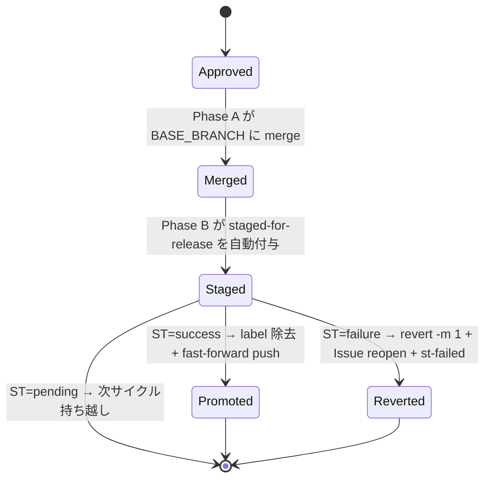
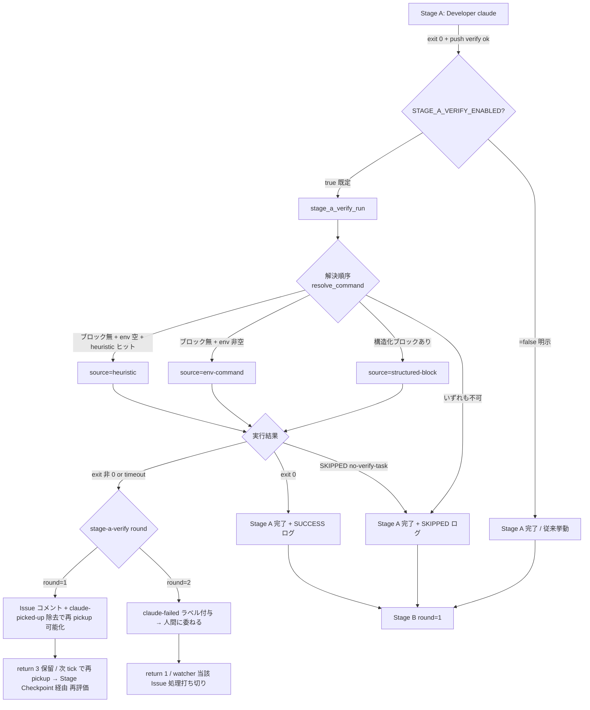
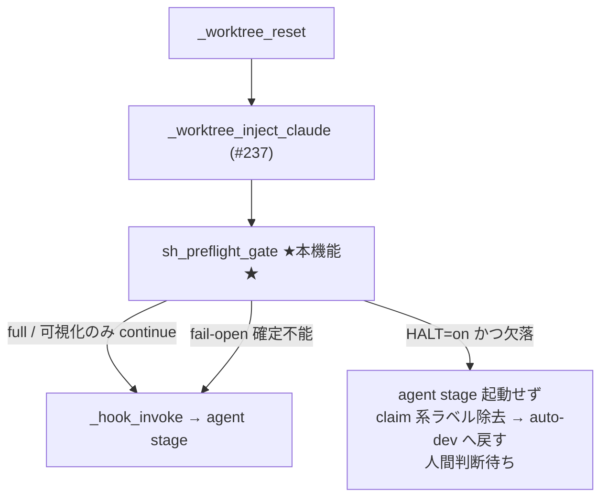

# idd-claude

**I**ssue-**D**riven **D**evelopment with **Claude** Code — GitHub Issue を起点に、
PM / Architect / 開発者 / PjM の 4 サブエージェント体制で自動開発を行うためのテンプレート一式。
Architect は Triage フェーズで「影響範囲が広い／設計判断が必要」と判定された Issue でのみ
自動起動し、軽微な修正ではスキップされる。

Architect が発動した Issue は **設計 PR ゲート**を経由する 2 PR フローで進行する
（`docs/specs/<N>-<slug>/` に要件・設計・タスクをまとめた設計 PR → 人間が merge → 実装 PR）。
Triage フェーズで人間判断が必要な論点を自動抽出し、Issue コメントで確認を取ってから
実装着手する、人間レビュー付き（Human-in-the-Loop）ワークフローを実現する。

> **既存リポジトリにとにかく入れて動かしたい人は [QUICK-HOWTO.md](./QUICK-HOWTO.md) へ。**
> ローカル watcher + 単一 repo の最短手順（約 15 分）に絞った導入ガイドです。本 README は
> 包括的なリファレンスとして、複数 repo 運用 / GitHub Actions 版 / 詳細仕様を扱います。

---

## 特徴

- **Issue 駆動**: `auto-dev` ラベルが付いた Issue を検出すると、自動でブランチを切り、実装、テスト、PR 作成まで実施
- **人間レビュー内蔵**: 致命的な判断が必要な場合は Issue にコメントで質問を投稿し、人間の回答を待つ
- **ラベルによる状態機械**: 状態遷移はすべて GitHub ラベルで表現され、監査証跡がそのまま残る
- **Triage と実装の二段構え**: 軽量モデルで Triage、Opus 4.8（1M context）で本実装、とコストを最適化
- **規模連動の設計フェーズ**: Triage 時に「新規 API / スキーマ変更 / 複数モジュール影響」などを検出すると Architect が自動で起動し、`docs/specs/<N>-<slug>/{requirements,design,tasks}.md` を生成。軽微な修正ではスキップしてコストと時間を抑える
- **設計 PR ゲート（cc-sdd 風）**: Architect 発動 Issue は、まず spec ディレクトリ（requirements / design / tasks のみ）だけの **設計 PR** を作成して人間レビューを通し、merge されてから初めて実装 PR が別途作られる。GitHub PR レビュー機能（line コメント / suggest-edit）で設計段階の修正が可能
- **Kiro / cc-sdd 互換の記法**: 受入基準は **EARS** 形式（`When [event], the [system] shall ...`）、要件 ID は numeric 階層（`1`, `1.1`, `2.3`）、tasks.md は `_Requirements:_` / `_Boundary:_` / `_Depends:_` / `(P)` アノテーション付き。エージェントは `.claude/rules/` のルールを参照して一貫した記法で生成する
- **テスト規約による品質ガードレール**: Developer は AC 起点の Red → Green → Refactor を遵守。異常系・境界値の必須化、モック方針、カバレッジ観点を `CLAUDE.md` で全エージェントに強制し、「テストは通るが受入基準を検証していない」落とし穴を防ぐ
- **2 つのデプロイ形態**:
  - **Local watcher**（推奨）: Claude Max サブスクリプションでローカル実行。Opus 4.8 の 1M context が利用可能
  - **GitHub Actions**: チーム・本番運用向け。API Key / Bedrock / Vertex AI で認証

---

## ディレクトリ構成

```
idd-claude/
├── README.md                        # 本ファイル（包括的リファレンス）
├── QUICK-HOWTO.md                   # 既存 repo 導入の最短手順（約 15 分）
├── setup.sh                         # `curl | bash` 対応の bootstrap インストーラ
├── install.sh                       # セットアップ支援スクリプト（clone 後に使う）
├── .gitignore
│
├── repo-template/                   # 開発対象リポジトリに配置するファイル
│   ├── CLAUDE.md                    # プロジェクト全体ガイド（全エージェント共通）
│   ├── .claude/
│   │   ├── agents/
│   │   │   ├── product-manager.md       # PM サブエージェント
│   │   │   ├── architect.md             # Architect サブエージェント（条件付き起動）
│   │   │   ├── developer.md             # Developer サブエージェント
│   │   │   ├── reviewer.md              # Reviewer サブエージェント（impl 系で自動起動 / #20 Phase 1）
│   │   │   ├── project-manager.md       # PjM サブエージェント
│   │   │   └── qa.md                    # QA サブエージェント（定義のみ・ワークフロー未統合）
│   │   └── rules/                       # エージェントが参照する共通ルール（cc-sdd adapt）
│   │       ├── ears-format.md           # AC の EARS 記法
│   │       ├── requirements-review-gate.md  # PM 自己レビューゲート
│   │       ├── design-principles.md     # design.md 記述原則
│   │       ├── design-review-gate.md    # Architect 自己レビューゲート
│   │       └── tasks-generation.md      # tasks.md アノテーション規約
│   └── .github/
│       ├── ISSUE_TEMPLATE/
│       │   └── feature.yml          # 自動開発用 Issue テンプレート
│       ├── scripts/
│       │   └── idd-claude-labels.sh # ラベル一括作成スクリプト（冪等）
│       └── workflows/
│           └── issue-to-pr.yml      # GitHub Actions 版ワークフロー
│
└── local-watcher/                   # ローカル PC に配置するファイル
    ├── bin/
    │   ├── issue-watcher.sh         # Issue 監視＋Claude Code 起動シェル（本体）
    │   ├── modules/                 # issue-watcher.sh が起動時に source するモジュール群
    │   │   ├── core_utils.sh        #   低レベル共通ユーティリティ・ロガー（#177 Part 1）
    │   │   ├── quota-aware.sh       #   クォータ待機制御プロセッサ（#180 Part 2）
    │   │   ├── merge-queue.sh       #   マージキュー制御＋再チェックプロセッサ（#180 Part 2）
    │   │   ├── auto-rebase.sh       #   自動 Rebase プロセッサ（#180 Part 2）
    │   │   ├── promote-pipeline.sh  #   Promote Pipeline ＋ Path Overlap プロセッサ（#181 Part 3）
    │   │   ├── pr-iteration.sh      #   PR Iteration プロセッサ（#181 Part 3）
    │   │   └── stage-a-verify.sh    #   Stage A Verify ゲート（#181 Part 3）
    │   └── triage-prompt.tmpl       # Triage フェーズ用プロンプト
    └── LaunchAgents/
        └── com.local.issue-watcher.plist   # macOS launchd 設定
```

> **モジュール構成について**: `issue-watcher.sh` は約 1 万行を超えたため、責務単位で
> `modules/*.sh` に段階的に分割している（#177 Part 1 で `core_utils.sh`、#180 Part 2 で
> 3 プロセッサ、#181 Part 3 で `promote-pipeline.sh` / `pr-iteration.sh` /
> `stage-a-verify.sh` の 3 プロセッサ）。本体は起動時にスクリプトディレクトリ基準（`BASH_SOURCE`）で
> `modules/` 配下を `source` する。`install.sh` が `local-watcher/bin/modules/*.sh` を
> `$HOME/bin/modules/` へ冪等配置する。必須モジュールが欠落していると本体は起動時に
> 欠落名を stderr に出して `exit 1` で安全停止する（silent fail させない）。
> 環境変数名・exit code・ログ書式・ラベル遷移・cron 登録文字列は分割前と完全に同一の
> 差分等価リファクタリングであり、運用者の cron / launchd 設定変更は不要。

---

## 前提条件

### 共通

- GitHub リポジトリへの push 権限
- `gh` CLI（GitHub CLI）のインストールと `gh auth login` 済み
- `jq` のインストール
- Node.js 18 以上
- Claude Code CLI のインストール（`npm install -g @anthropic-ai/claude-code`）
  - **最低バージョン要件**: 基本動作は **v2.0.0 以上**、PM / Architect の self-review-gate で
    `/goal` 自動ループ運用（[`.claude/rules/requirements-review-gate.md`](repo-template/.claude/rules/requirements-review-gate.md)
    および [`.claude/rules/design-review-gate.md`](repo-template/.claude/rules/design-review-gate.md)
    の「`/goal` による自動ループ運用」節）を利用する場合は **v2.1.139 以上**が必要です
  - v2.1.139 未満の環境では `/goal` 節は自動的にスキップされ、従来どおりの「Mechanical Checks
    → 判断レビュー → 最大 2 パス」手順がそのまま適用されます（後方互換）。バージョンは
    `claude --version` で確認できます

> **migration note**: 既存ユーザに対する破壊的変更はありません。本変更で
> `.claude/rules/requirements-review-gate.md` および `.claude/rules/design-review-gate.md` に
> 追加された「`/goal` による自動ループ運用」節は、従来の「最大 2 パス」表現を **撤廃せず
> 併記** する方針で記述されており、`/goal` 利用時のターン上限としても引き続き機能します。
> Claude Code v2.1.139 未満の環境では `/goal` 節のみがスキップされ、従来の手動 2 パス運用が
> そのまま継続します。

### Local watcher 方式

- **Claude Max サブスクリプション**（Opus 4.8 の 1M context を利用するため）
- 常時稼働可能な macOS / Linux マシン
- ローカルで `claude /login` 済み
- `flock` コマンド（Linux では標準、macOS は `brew install util-linux` で `flock` を導入）
- `timeout` コマンド（Linux では標準、macOS は `brew install coreutils` で `gtimeout` を導入。
  `timeout` 不在時は watcher が `gtimeout` を自動検出してフォールバックするため、手動シンボリックリンク作成は不要）

### GitHub Actions 方式

- 以下のいずれかの認証情報
  - `ANTHROPIC_API_KEY`（Console で発行）
  - `CLAUDE_CODE_OAUTH_TOKEN`（`claude setup-token` で発行、1 年有効、Opus 4.6 までの 200k context まで）
  - AWS Bedrock の OIDC 設定（エンタープライズ推奨）
  - Google Vertex AI の OIDC 設定（エンタープライズ推奨）

---

## セットアップ

### クイックインストール（curl ワンライナー）

`setup.sh` が idd-claude を `$HOME/.idd-claude` にクローンし、同梱の `install.sh` を起動します。
非対話・対話のどちらでも使えます。

**対話モード**（推奨、ターミナル直実行）:

```bash
bash <(curl -fsSL https://raw.githubusercontent.com/hitoshiichikawa/idd-claude/main/setup.sh)
```

**非対話モード**（引数で一気に配置）:

```bash
# 対象ディレクトリに cd してからワンライナー実行（--repo 省略時はカレント = ./）
cd /path/to/your-project
curl -fsSL https://raw.githubusercontent.com/hitoshiichikawa/idd-claude/main/setup.sh \
  | bash -s -- --all

# あるいはパス明示
curl -fsSL https://raw.githubusercontent.com/hitoshiichikawa/idd-claude/main/setup.sh \
  | bash -s -- --all --repo /path/to/your-project

# 対象リポジトリへの配置のみ（カレントディレクトリ）
curl -fsSL https://raw.githubusercontent.com/hitoshiichikawa/idd-claude/main/setup.sh \
  | bash -s -- --repo

# ローカル watcher のみ
curl -fsSL https://raw.githubusercontent.com/hitoshiichikawa/idd-claude/main/setup.sh \
  | bash -s -- --local
```

`--repo` に値を渡さなかった場合や `--all` を `--repo` なしで使った場合は、
**カレントディレクトリ (`./`)** にテンプレートを配置します。対話モードでも
プロンプトで Enter のみ入力すると同じくカレントがデフォルトです。

#### GitHub ラベルの自動セットアップ (#85)

`install.sh --repo` または `install.sh --all` で対象リポジトリに配置した直後、
同梱の `.github/scripts/idd-claude-labels.sh` を **自動実行**して、idd-claude が
状態遷移に使う必須ラベル（`auto-dev` / `claude-claimed` / `ready-for-review` 等）を
冪等作成します。これにより初回 cron / Actions 起動時に watcher が claim ラベル付与に
失敗する事故を防げます。

- **opt-out**: `--no-labels` フラグまたは `IDD_CLAUDE_SKIP_LABELS=true` 環境変数で
  ラベル処理を完全に skip できます。CI / 別ツールでラベルを自前管理しているリポジトリで
  推奨します
- **fail-soft**: `gh` 未インストール / `gh auth login` 未実施 / 権限なし / API 失敗時は
  ラベル処理だけを skip し、install 全体は exit 0 で完走します。skip 時は手動 fallback の
  完全コマンドが出力されるので、それをコピペで実行してください
- **冪等**: 既存ラベルは name / color / description ともに変更されません（既存値は保護）。
  色や説明を上書きしたい場合は手動で `bash .github/scripts/idd-claude-labels.sh --force`
- **新ラベルの再 install 伝播 (#185)**: template にラベルが追加された後で `install.sh` を
  再実行すると、最新の `idd-claude-labels.sh` が対象リポジトリへ再配置され、`setup_repo_labels`
  が全ラベルをループして **未存在のラベルだけを新規作成**します（既存ラベルは skip）。
  そのため `awaiting-slot` のような後から追加されたラベルも、再 install するだけで既存
  リポジトリへ確実に伝播します（NFR 1.1 冪等性は維持され、既存ラベルの削除・改名・color 変更は
  行われません）
- **`--local` 単独時は走りません**: 対象リポジトリ配置がない場合はラベル処理も発生しません
- **`--dry-run`**: 実 API 呼び出しせず、これから実行されるコマンドだけを表示します

```bash
# 通常: 配置 + ラベル自動作成（既存ラベルは保護）
./install.sh --repo /path/to/your-project

# ラベル処理を完全に skip（自前管理する運用向け）
./install.sh --repo /path/to/your-project --no-labels
# あるいは env で
IDD_CLAUDE_SKIP_LABELS=true ./install.sh --repo /path/to/your-project
```

`gh auth login` 未実施・private fork で権限が無い等で skip 扱いになった場合は、認証等を
解消してから手動 fallback として後述の [ラベル一括作成（推奨）](#ラベル一括作成推奨) を
実行してください。自動実行が成功している場合、手動 step を改めて実行する必要はありません
（再実行しても既存ラベルが保護されるため、害はありません）。

#### fork / mirror clone から導入するときの注意（履歴持ち込み警告 #115）

GitHub の fork や `git push --mirror` で別 repo の履歴ごと持ち込んだリポジトリに
`install.sh --repo` を流すと、引き継がれた古い `docs/specs/<番号>-<slug>/` ディレクトリや
`claude/issue-<番号>-*` ブランチが **新しい Issue 番号と衝突して watcher が誤った spec を
resume 対象に選ぶ**事故が発生し得ます。これを未然に防ぐため、`install.sh` は配置完了直後に
3 種類の検出を行い、該当があれば警告を表示します（**install 自体は止めません。exit 0 で
完走します**）。

| カテゴリ | 検出対象 |
|---|---|
| `[docs-specs]` | `docs/specs/<数字>-*/` 形式のディレクトリが 1 件以上存在する |
| `[claude-branches]` | `origin` リモートに `claude/issue-<数字>-(design\|impl)-*` ブランチが 1 件以上存在する |
| `[orphan-branches]` | 上記ブランチの `<数字>` の **過半数**が対象 repo の現存 Issue 番号（open + closed）と一致しない（fork/mirror 由来の可能性が高い） |

- **fail-soft**: `git ls-remote` / `gh issue list` が失敗（origin 未設定 / ネットワーク不通 /
  `gh` 未認証 / private repo で権限なし等）した場合、検出処理だけを skip して install 全体は
  exit 0 で完走します。`origin` remote が未設定のクリーンな新規 repo では skip 理由も含めて
  本機能由来の出力は **0 件**（false positive ゼロ保証）
- **`--dry-run` 対応**: 検出処理自体は dry-run でも実施され、警告行は `[DRY-RUN] WARNING:`
  プレフィックスで出力されます
- **`--local` 単独時は走りません**: 対象リポジトリ配置がない場合は検出処理も発生しません
- **D-1 と D-2 / D-3 は独立**: `gh` 未認証で D-3 が skip されても、D-1 / D-2 は機能します

警告が出た場合の推奨対応（クリーンアップ手順）:

```bash
# 1. 古い docs/specs/ を一覧（先頭が数字 - のディレクトリ）
ls -d docs/specs/[0-9]*-*/

# 2. 不要なものを削除（対応 Issue が無いことを `gh issue view <番号>` 等で確認してから）
rm -rf docs/specs/<番号>-<slug>/

# 3. 古い claude/issue-* ブランチを一覧
git ls-remote --heads origin 'claude/issue-*'

# 4. 不要な remote ブランチを削除
git push origin --delete claude/issue-<番号>-<slug>

# 5. ローカル追跡ブランチもまとめて掃除（任意）
git remote prune origin
```

**警告を無視した場合の影響**: install 自体は正常完了します。ただし watcher を起動すると、
古い `docs/specs/` を新規 Issue の resume 対象として誤検出したり、古い `claude/issue-*`
ブランチに対して force push / `--rebase` をかけて fork 元の作業を破壊する可能性があります。
fork から始める場合は本機能の警告を確認してからクリーンアップを行い、その後 cron / watcher を
有効化してください（QUICK-HOWTO.md の「fork / mirror clone から導入するときの注意」節も参照）。

環境変数で挙動を調整できます（特定タグの検証や fork からのインストール向け）:

| 変数 | デフォルト | 用途 |
|---|---|---|
| `IDD_CLAUDE_REPO_URL` | `https://github.com/hitoshiichikawa/idd-claude.git` | クローン元。fork を使う場合に上書き |
| `IDD_CLAUDE_BRANCH` | `main` | チェックアウトするブランチ／タグ |
| `IDD_CLAUDE_DIR` | `$HOME/.idd-claude` | クローン先 |

> **セキュリティ**: `curl \| bash` は実行前の監査が難しいため、信頼できる接続先でのみ利用してください。
> 内容を確認したい場合は `curl -fsSL <URL> -o setup.sh` でダウンロードし、`bash setup.sh` で実行してください。
>
> **sudo は不要**: idd-claude は `$HOME` 配下（`~/.idd-claude` / `~/bin` / `~/Library/LaunchAgents` 等）
> にユーザースコープで配置します。`sudo` で実行するとファイル所有者が root になり、
> 通常ユーザーで更新・削除できなくなるため、setup.sh / install.sh とも root 実行を検知したら
> 警告または停止します。cron 登録もユーザー crontab（`crontab -e`）で行うため sudo 不要です。
>
> **`$HOME/.idd-claude` は直接編集しないでください**: setup.sh は再実行時に
> `git reset --hard origin/<branch>` で upstream 状態に上書きするため、このディレクトリ内の
> ローカル編集は告知なく失われます。idd-claude の挙動を調整したい場合は、設置先 repo
> （`repo-template/` のコピー先）か `~/bin/` 配下に配置された watcher スクリプトを編集して
> ください。なお、clone が中断されるなどして `.git` の無い不完全な状態になった場合、setup.sh
> は安全のため停止します（自動回復しません）。`rm -rf ~/.idd-claude` で削除してから setup.sh
> を再実行してください。

### 冪等性ポリシーと再実行時の挙動 (#36)

`install.sh` は何度再実行しても安全に冪等動作するよう設計されています。再実行時の各ファイル
カテゴリの扱いは以下のとおりです。

#### `CLAUDE.md` の `.org` 並置 (#87)

`CLAUDE.md` は技術スタック・規約・プロジェクト固有メタを利用者が手で書き込む
プロジェクト憲章であるため、**install.sh は既存 `CLAUDE.md` を上書きしません**。
代わりに最新 template を `CLAUDE.md.org` として並置します（差分があるときのみ）。
`--force` 単体では `CLAUDE.md` を template 上書きせず、agents / rules のみ force 同期します
（#208）。`CLAUDE.md` を template で上書きしたい場合は `--force-claude-md` を明示してください。

| 対象 repo の状態 | 既定挙動（`--force` の有無に関わらず） | `--force-claude-md` 指定時 |
|---|---|---|
| `CLAUDE.md` 不在 | `NEW` `CLAUDE.md`（template をそのまま配置、`.org` は作らない） | `NEW`（同上） |
| `CLAUDE.md` ありかつ template と同一 | `SKIP`（`.org` も `.bak` も作らない） | `SKIP`（同上） |
| `CLAUDE.md` ありかつ差分あり、`.org` 不在 | `SKIP CLAUDE.md` + `NEW CLAUDE.md.org`（既存据え置き、template を並置） | `BACKUP CLAUDE.md → CLAUDE.md.bak` + `OVERWRITE CLAUDE.md`（`.org` は触らない） |
| `CLAUDE.md` ありかつ差分あり、`.org` 既存 + 内容同一 | `SKIP CLAUDE.md` + `SKIP CLAUDE.md.org` | `OVERWRITE CLAUDE.md`（`.bak` 既存は once-only で温存、`.org` は触らない） |
| `CLAUDE.md` ありかつ差分あり、`.org` 既存 + 差分あり | `SKIP CLAUDE.md` + `OVERWRITE CLAUDE.md.org`（最新 template に追従） | `OVERWRITE CLAUDE.md`（`.org` は触らない） |

> **`--force` と `--force-claude-md` の違い（#208）**: `--force` は `.claude/agents/` /
> `.claude/rules/` の差分ありファイルを `.bak` once-only 退避して上書きしますが、`CLAUDE.md`
> には一切触れません（既存据え置き + `.org` 並置 = `--force` なしと同一）。consumer が
> 編集したプロジェクト憲章を agents / rules 同期のたびに失わないための保護です。`CLAUDE.md`
> を template で上書きしたいときだけ `--force-claude-md` を指定します。両者を併用すると
> agents / rules も `CLAUDE.md` も上書きされます。

**`CLAUDE.md.org` の merge 手順**: install 直後にこのファイルが新規作成・更新された
場合、`install.sh` がコンソール末尾に merge ガイドを表示します。基本フロー:

```bash
# 差分確認
diff CLAUDE.md CLAUDE.md.org

# 対話的に merge
vimdiff CLAUDE.md CLAUDE.md.org

# 必要な箇所を CLAUDE.md に取り込んだら .org は削除して構いません。
# 次回 install で template が更新されていれば再作成されます。
rm CLAUDE.md.org
```

**`CLAUDE.md.bak` の once-only 保護（`--force-claude-md` 経路）**:

- `--force-claude-md` 指定時のみ、既存 `CLAUDE.md` を `CLAUDE.md.bak` に退避してから template で
  上書きします
- 既存 `CLAUDE.md.bak` は **`--force-claude-md` 経路でも上書きしません**（once-only 規律）。これに
  よりオリジナルの自分の `CLAUDE.md` を後から参照・復元できます
- `--force-claude-md` なしの経路（`--force` 単体を含む）では `.bak` を作成・更新しません
  （既存 `.bak` も触りません）

> **過去バージョンからの Migration**:
> - #208 以前は `--force` 指定時に `CLAUDE.md` も template で上書きされる挙動でした。本改修
>   以降は **`--force` 単体では `CLAUDE.md` を据え置き + 差分時 `CLAUDE.md.org` 並置**（`--force`
>   なしと同一）になり、agents / rules のみが force 同期されます。consumer 固有の `CLAUDE.md`
>   が agents / rules 同期のたびに失われることを防ぐための変更です。`CLAUDE.md` を template
>   で上書きしたい場合は新フラグ `--force-claude-md` を指定してください（従来の `--force` の
>   CLAUDE.md 上書き挙動はこちらに移設されました）。
> - #87 以前は `--force` なしでも `CLAUDE.md` が template で上書きされる挙動でした。
>   再 install 時に `.bak` once-only に退避はされていましたが、本体側はカスタム編集が
>   毎回 template に置き換わる UX でした。#87 以降は **既定で既存 `CLAUDE.md` を据え置き**、
>   `CLAUDE.md.org` を参照用に並置する形に変更されました。
> - #36 以前の `install.sh` は再実行のたびに `.bak` をテンプレ由来内容で書き換えていました。
>   当該バージョンで複数回 install を回した既存利用者は、初回のオリジナル `CLAUDE.md` が
>   `.bak` から失われている可能性があります（`git log` から復元してください）。#36 以降は
>   発生しません
> - 既存 `CLAUDE.md.bak` は `CLAUDE.md.org` に **自動マイグレーションしません**。`.bak` の
>   内容を `.org` に取り込みたい場合は手動でコピーしてください

#### `.claude/agents/` / `.claude/rules/` のハイブリッド safe-overwrite

`install.sh` 再実行時、各 `*.md` テンプレートは以下の 5 パスで処理されます:

| dest の状態 | 既定挙動（`--force` なし） | `--force` 指定時 |
|---|---|---|
| ファイル不在 | `NEW`（無条件配置、template 進化に追従） | `NEW`（同上） |
| 内容が template と完全一致 | `SKIP`（`.bak` を作らない） | `SKIP`（同上） |
| 差分あり、`<file>.bak` 不在 | `BACKUP` `<file>.bak` を once-only 退避してから `OVERWRITE` | 同左（`--force` でも once-only） |
| 差分あり、`<file>.bak` 既存 | `SKIP`（`use --force to overwrite` 警告） | `OVERWRITE`（`.bak` は再退避せず温存） |

**設計意図**: 初回退避された `.bak` を「カスタム編集の最も貴重な世代」として扱うため、`--force`
指定時でも既存 `.bak` は保護されます。`.bak` を更新したい場合は、自分で `<file>.bak` を削除して
から再実行してください。

> **CLAUDE.md は別経路**: `CLAUDE.md` は #87 以降 **`.org` 並置方式**で扱われます。
> `--force` の有無に関わらず既存 `CLAUDE.md` を据え置き、template を `CLAUDE.md.org` として
> 並置します（#208 で `--force` 単体は CLAUDE.md を上書きしなくなりました）。`--force-claude-md`
> 指定時のみ従来の上書き挙動（`.bak` once-only 退避＋ template で上書き）に切り替わります。
> 詳細は本節先頭の「`CLAUDE.md` の `.org` 並置 (#87)」を参照してください。

> **Migration note（#327 / `.claude/rules/` の条件ロード化）**: Claude Code は
> `.claude/rules/*.md` を全セッション・全サブエージェントの context に自動注入しますが、
> #327 で各ルールに YAML frontmatter `paths:`（glob）を付与し、**該当パスのファイルに触れる
> セッションにのみ付与される条件ロード**へ切り替えました（例: `ears-format.md` は
> `docs/specs/**/requirements.md` を扱うセッションのみ）。ロール特化ルールが Triage / PjM 等の
> 無関係コンテキストへ毎回載る固定トークン費を削減します。agent 定義内の明示 Read 指示は
> 従来どおり機能し（新規ファイル作成時の主経路）、`feature-flag.md` / `issue-dependency.md` は
> 自己参照スコープ（明示 Read 時のみ）です。挙動を従来に戻したい場合は frontmatter の
> `paths:` ブロックを削除してください（ファイル先頭の注意コメント参照）。

#### `--dry-run` モード

`--dry-run` を付けると、ファイルシステムを変更せずに**予定操作のみを列挙**します。出力例:

```text
$ ./install.sh --repo /path/to/your-project --dry-run
[DRY-RUN] SKIP      /path/to/your-project/CLAUDE.md (existing kept, template placed as CLAUDE.md.org)
[DRY-RUN] NEW       /path/to/your-project/CLAUDE.md.org
[DRY-RUN] NEW       /path/to/your-project/.claude/agents/reviewer.md
[DRY-RUN] SKIP      /path/to/your-project/.claude/agents/developer.md (identical to template)
[DRY-RUN] BACKUP    /path/to/your-project/.claude/rules/ears-format.md → ears-format.md.bak (custom edits detected)
[DRY-RUN] OVERWRITE /path/to/your-project/.claude/rules/ears-format.md
```

`--force` 単体では CLAUDE.md は据え置かれます（agents / rules のみ force 同期）。`CLAUDE.md`
を template 上書きしたい場合は `--force-claude-md` を付けると従来挙動（`.bak` 退避 + 上書き）
になります:

```text
$ ./install.sh --repo /path/to/your-project --dry-run --force-claude-md
[DRY-RUN] BACKUP    /path/to/your-project/CLAUDE.md → CLAUDE.md.bak
[DRY-RUN] OVERWRITE /path/to/your-project/CLAUDE.md (--force-claude-md)
```

| Prefix | 意味 |
|---|---|
| `NEW` | 配置先にファイルが存在しない。新規作成 |
| `OVERWRITE` | 既存ファイルを template 内容で上書き（差分あり、`--force`（agents/rules）または `--force-claude-md`（CLAUDE.md）） |
| `SKIP` | 既存ファイルが template と同一、もしくは `.bak` 既存で上書き抑止 |
| `BACKUP` | `<file>.bak` を作成（`OVERWRITE` 直前にのみ発生） |

**保証**: `--dry-run` で `NEW` / `OVERWRITE` と分類されたファイルは、`--dry-run` を外して同じ
引数で再実行すれば**必ず実際に配置されます**（ファイル状態が変化しない限り）。これにより、
影響範囲を事前確認してから実適用を判断できます。

`--dry-run` は `setup.sh` 経由（`curl | bash`）でも透過されます:

```bash
curl -fsSL https://raw.githubusercontent.com/hitoshiichikawa/idd-claude/main/setup.sh \
  | bash -s -- --all --dry-run
```

#### `--force` の使いどころ

既存利用者が再 install するときの推奨フローは以下のとおりです:

1. まず `./install.sh --repo /path --dry-run` で影響範囲を確認
2. 必要なら `<file>.bak` をコミットして自分のカスタム編集を保護
3. `./install.sh --repo /path` を実行（既定挙動でカスタム編集は `.bak` once-only 退避される）
4. **agents / rules の最新 template を強制適用したい**ときは `--force` で再実行（`.bak` 既存は
   尊重される。`CLAUDE.md` は据え置かれ、差分時のみ `.org` が並置される）
5. **`CLAUDE.md` も template で上書きしたい**ときだけ `--force-claude-md` を併用（`CLAUDE.md`
   を `.bak` once-only 退避してから template で上書き）

通常の運用では `--force` / `--force-claude-md` は不要です。`--force` を付けても consumer 固有の
`CLAUDE.md` は保護されます（#208）。

#### 既存利用者向け Migration Note

本改修で必要な追加手順は**ありません**。既存の `install.sh --repo` / `--local` / `--all` 起動は
そのまま動作し、再実行時に自動的に新しい冪等性ガードが適用されます。env var 名・cron / launchd
登録文字列・ラベル名・配置先パスは一切変わりません。

---

手動セットアップ（Git clone 経由）の手順は以下のとおりです。

### Step 1. 対象リポジトリへの配置

開発対象リポジトリに `repo-template/` の中身をコピーする。

```bash
cd /path/to/your-project
cp -r ~/.idd-claude/repo-template/CLAUDE.md ./
cp -r ~/.idd-claude/repo-template/.claude ./
cp -r ~/.idd-claude/repo-template/.github ./

git add CLAUDE.md .claude .github
git commit -m "chore: introduce idd-claude workflow templates"
git push
```

### Step 2. GitHub 側の準備

#### ラベル一括作成（推奨）

Step 1 で同梱される `.github/scripts/idd-claude-labels.sh` を実行すると、必要なラベルを
冪等に作成できます（既存ラベルはスキップ、`--force` で color / description を上書き）。

> **既に `install.sh --repo` を使った場合は手動実行は不要です** — install.sh は配置直後に
> 同じスクリプトを `--repo owner/name` 付きで自動実行します
> （[GitHub ラベルの自動セットアップ (#85)](#github-ラベルの自動セットアップ-85) 参照）。
> ここに記載する手動実行は、(a) 手動セットアップ（`cp -r` 経由）を選んだ場合、
> (b) 自動実行が `gh` 未認証等で skip された場合、(c) 既存リポジトリで `--force` 指定の
> color / description 更新を行いたい場合の fallback として残しています。

```bash
cd /path/to/your-project
bash .github/scripts/idd-claude-labels.sh

# 既存ラベルの color / description を更新したい場合
bash .github/scripts/idd-claude-labels.sh --force

# repo 外から実行する場合
bash .github/scripts/idd-claude-labels.sh --repo owner/repo
```

作成されるラベル:

| 名前 | 色 | 用途 |
|---|---|---|
| `auto-dev` | 青 | 自動開発対象 |
| `needs-decisions` | 黄 | 人間の判断が必要 |
| `awaiting-design-review` | 橙 | 設計 PR レビュー待ち（Architect 発動時） |
| `claude-claimed` | 紫(淡) | Claude Code が claim 済（Triage 実行中） |
| `claude-picked-up` | 紫 | Claude Code 実行中（Triage 通過後の実装フェーズ） |
| `ready-for-review` | 緑 | 実装 PR 作成完了 |
| `claude-failed` | 赤 | 自動実行が停止（[手動復旧手順](#claude-failed-状態の-issue-から手動復旧する手順) を参照） |
| `skip-triage` | 灰 | Triage をスキップ |
| `needs-rebase` | 黄 | approved PR で base 古い／conflict 発生済（Phase A Merge Queue Processor が付与） |
| `needs-iteration` | 紫 | PR レビューコメントの反復対応待ち（PR Iteration Processor #26 が処理） |
| `needs-quota-wait` | 雪 | Claude Max quota 超過で reset 待ち（Quota-Aware Watcher #66 / Quota Resume Processor が自動除去） |
| `staged-for-release` | 薄緑 | `develop` に merge 済み、`main` 到達待ち（multi-branch 運用専用 / 人間 または future automation が付与） |
| `st-failed` | 赤系 (`d73a4a`) | ST failure 検知後に revert 済み（Phase B Promote Pipeline が付与）。Issue に適用 |
| `awaiting-slot` | 薄水色 (`c5def5`) | hot file 競合予防で同サイクル dispatch を見送り中（Phase E Path Overlap Checker が付与・自動除去）。Issue に適用 |
| `blocked` | 濃赤 (`b60205`) | 依存 Issue 未 merge により auto-dev 進行不能（PM phase の Dependency Resolver Gate #146 が付与）。Issue に適用 |
| `hotfix` | 橙赤 (`d93f0b`) | hotfix 優先処理対象。Dispatcher が候補を Issue 番号昇順（FIFO）で処理する際、本ラベル付き Issue を非 hotfix より先に投入する（#200）。人間が手動付与。Issue に適用 |

#### 手動で作成する場合

```bash
gh label create auto-dev                --repo owner/repo --color 1f77b4 --description "自動開発対象"
gh label create needs-decisions         --repo owner/repo --color f1c40f --description "人間の判断が必要"
gh label create awaiting-design-review  --repo owner/repo --color e67e22 --description "設計 PR レビュー待ち（Architect 発動時）"
gh label create claude-claimed          --repo owner/repo --color c39bd3 --description "Claude Code が claim 済（Triage 実行中）"
gh label create claude-picked-up        --repo owner/repo --color 9b59b6 --description "Claude Code 実行中"
gh label create ready-for-review        --repo owner/repo --color 2ecc71 --description "PR 作成完了"
gh label create claude-failed           --repo owner/repo --color e74c3c --description "自動実行が失敗（復旧時は ready-for-review を先に付与してから外す）"
gh label create skip-triage             --repo owner/repo --color 95a5a6 --description "Triage をスキップ"
gh label create needs-rebase            --repo owner/repo --color fbca04 --description "approved PR で base が古い／conflict 発生済（Phase A: Merge Queue Processor が付与）"
gh label create needs-iteration         --repo owner/repo --color d4c5f9 --description "PR レビューコメントの反復対応待ち（#26 PR Iteration Processor が処理）"
gh label create needs-quota-wait        --repo owner/repo --color c5def5 --description "Claude Max quota 超過で reset 待ち（Quota Resume Processor が自動除去）"
gh label create staged-for-release      --repo owner/repo --color b8e0d2 --description "develop に merge 済み、main 到達待ち（multi-branch 運用専用）"
gh label create st-failed               --repo owner/repo --color d73a4a --description "ST failure 検知後 revert 済み（Phase B Promote Pipeline が付与）"
gh label create awaiting-slot           --repo owner/repo --color c5def5 --description "hot file 競合予防で同サイクル dispatch を見送り中（Phase E Path Overlap Checker が付与・除去）"
gh label create blocked                 --repo owner/repo --color b60205 --description "【Issue 用】 依存 Issue 未 merge により auto-dev 進行不能"
gh label create hotfix                  --repo owner/repo --color d93f0b --description "【Issue 用】 hotfix 優先処理対象（Dispatcher が非 hotfix より先に投入）"
```

#### Branch protection（任意）

```bash
gh api -X PUT repos/owner/repo/branches/main/protection \
  -f required_pull_request_reviews.required_approving_review_count=1 \
  -F enforce_admins=false
```

### Step 3-A. Local watcher をセットアップ（推奨）

同梱の `install.sh` を使うか、手動で以下を実施する。

```bash
# 手動の場合
mkdir -p ~/bin ~/bin/modules ~/.issue-watcher/logs
cp ~/.idd-claude/local-watcher/bin/issue-watcher.sh  ~/bin/
cp ~/.idd-claude/local-watcher/bin/triage-prompt.tmpl ~/bin/
# モジュール（#177 Part 1 以降）: issue-watcher.sh は同階層 modules/ から
# core_utils.sh 等を source する。欠落すると起動時に exit 1 で停止するため必ずコピーする。
cp ~/.idd-claude/local-watcher/bin/modules/*.sh ~/bin/modules/
chmod +x ~/bin/issue-watcher.sh
```

スクリプト自体は編集不要。`REPO` / `REPO_DIR` は **環境変数で上書きできる** ため、
cron / launchd 側でリポジトリを指定する運用にします（単一 repo でも複数 repo でも同じ手順）。
必要に応じて `$EDITOR ~/bin/issue-watcher.sh` で `TRIAGE_MODEL` / `DEV_MODEL` / `PJM_MODEL` /
`MAX_TURNS` のデフォルトを調整してください。

ステージ別モデルの既定値:

| env | 既定 | 適用先 |
|---|---|---|
| `TRIAGE_MODEL` | `claude-sonnet-4-6` | Triage（人間判断要否 / Architect 要否の判定） |
| `DEV_MODEL` | `claude-opus-4-8` | Stage A 系（PM + Developer）/ design モード / Per-Task Impl |
| `PJM_MODEL` | `claude-sonnet-4-6` | **Stage C（PjM / 実装 PR 作成）**。機械的作業のため軽量既定（#328） |
| `REVIEWER_MODEL` | `claude-opus-4-8` | Reviewer（独立レビューゲート）/ Per-Task Reviewer |

> **Migration note（#328 / `PJM_MODEL` 導入）**: #328 以前の Stage C は `DEV_MODEL`
> （既定 Opus）で起動されていました。PR 作成は review-notes の commit / `gh pr create` /
> ラベル付け替えという機械的作業のみのため、既定を Sonnet に変更しています。従来挙動に
> 戻す場合は cron / launchd 側で `PJM_MODEL=claude-opus-4-8` を渡してください。
> design モード（PM → Architect → PjM の単一セッション実行）は本 env の対象外です
> （PjM サブエージェント自体は #326 の `model: sonnet` 固定で軽量化済み）。

> **Migration note（#429 / 既定モデル fallback を最新世代へ更新）**: `*_MODEL` 系の **既定値（fallback）**
> を `claude-opus-4-7` → `claude-opus-4-8` / `claude-sonnet-4-5` → `claude-sonnet-4-6` へ更新しました
> （対象: `DEV_MODEL` / `REVIEWER_MODEL` / `DEBUGGER_MODEL` / `AUTO_REBASE_MODEL` /
> `PR_ITERATION_DEV_MODEL` / `FAILED_RECOVERY_DEV_MODEL` / `PR_REVIEWER_ADJUDICATOR_MODEL` /
> `DESIGN_REVIEWER_MODEL`）。**env を明示 override している環境は影響なし**（`DEV_MODEL=...` 等の
> 明示値は従来通り尊重）。env 未指定の環境のみ、次回 install 以降に実効モデルが最新世代へ切り替わります。
> 旧モデルに固定したい場合は cron / launchd 側で該当 `*_MODEL=claude-opus-4-7` 等を明示してください。

#### macOS: launchd に登録

```bash
cp ~/.idd-claude/local-watcher/LaunchAgents/com.local.issue-watcher.plist \
   ~/Library/LaunchAgents/

# plist 内の EnvironmentVariables の REPO / REPO_DIR を自分のリポジトリに書き換える
$EDITOR ~/Library/LaunchAgents/com.local.issue-watcher.plist

launchctl load  ~/Library/LaunchAgents/com.local.issue-watcher.plist
launchctl start com.local.issue-watcher

# 停止したいとき
# launchctl unload ~/Library/LaunchAgents/com.local.issue-watcher.plist
```

#### Linux / WSL: cron に登録

単一リポジトリの場合:

```bash
(crontab -l 2>/dev/null; cat <<'CRON'
*/2 * * * * REPO=owner/your-repo REPO_DIR=$HOME/work/your-repo $HOME/bin/issue-watcher.sh >> $HOME/.issue-watcher/cron.log 2>&1
CRON
) | crontab -
```

複数リポジトリの場合は [複数リポジトリ運用](#複数リポジトリ運用) を参照。

#### 複数リポジトリ運用

`issue-watcher.sh` は **`REPO` / `REPO_DIR` 環境変数で対象を切り替えられる**ため、スクリプトを
コピーせずに 1 ファイルで複数リポジトリを面倒見られます。衝突しやすい下記要素は `REPO`
から自動派生するため、env var を分けるだけで分離されます:

| 項目 | 派生先 |
|---|---|
| `LOCK_FILE` | `/tmp/issue-watcher-<owner>-<repo>.lock`（repo ごとに独立した `flock`） |
| `LOG_DIR` | `$HOME/.issue-watcher/logs/<owner>-<repo>/` |
| Triage 一時 JSON | `/tmp/triage-<owner>-<repo>-<N>-<TS>.json` |

##### cron で複数 repo を回す例

```bash
(crontab -l 2>/dev/null; cat <<'CRON'
# 2 分ごと：repo-a
*/2 * * * * REPO=owner/repo-a REPO_DIR=$HOME/work/repo-a $HOME/bin/issue-watcher.sh >> $HOME/.issue-watcher/cron.log 2>&1
# 3 分ごと：repo-b（時刻をずらすと Claude Max のクォータスパイクを平準化できる）
*/3 * * * * REPO=owner/repo-b REPO_DIR=$HOME/work/repo-b $HOME/bin/issue-watcher.sh >> $HOME/.issue-watcher/cron.log 2>&1
CRON
) | crontab -
```

##### macOS launchd で複数 repo を回す例

plist は **repo ごとに 1 ファイル**用意します（`Label` と `EnvironmentVariables` を
書き換えるだけ）。

```bash
# repo-a 用
cp ~/Library/LaunchAgents/com.local.issue-watcher.plist \
   ~/Library/LaunchAgents/com.local.issue-watcher-repo-a.plist

# repo-b 用（同様にコピーして編集）
cp ~/Library/LaunchAgents/com.local.issue-watcher.plist \
   ~/Library/LaunchAgents/com.local.issue-watcher-repo-b.plist
```

各 plist の編集ポイント:

- `<key>Label</key>` の `<string>` を `com.local.issue-watcher-<repo-slug>` に変更
- `<key>EnvironmentVariables</key>` の dict に下記を追加:
  ```xml
  <key>REPO</key>
  <string>owner/repo-a</string>
  <key>REPO_DIR</key>
  <string>/Users/you/work/repo-a</string>
  ```
- `<key>StandardOutPath</key>` / `<key>StandardErrorPath</key>` も repo ごとに別パスに

すべて編集したら:

```bash
launchctl load  ~/Library/LaunchAgents/com.local.issue-watcher-repo-a.plist
launchctl load  ~/Library/LaunchAgents/com.local.issue-watcher-repo-b.plist
```

##### 運用上の注意

- **Claude Max クォータはアカウント単位で共有**: 複数 repo を同時に回すと 5 時間ウィンドウを
  早く使い切る可能性。`StartInterval` / cron 時刻を repo ごとにずらすとスパイクを抑えられる
- **GitHub API のレート制限も共有**（`gh auth` のトークン単位）: 通常は Issue ポーリング程度では問題ないが、repo が 10+ になるなら別トークン検討
- **個別停止**: launchd は `launchctl unload <plist>` で、cron は該当行をコメントアウトするだけで個別に止められる

##### 複数リポ運用時の cron.log grep 例

複数の repo が `$HOME/.issue-watcher/cron.log` を共有しているとき、watcher の
processor 系ログ行（`pr-iteration:` / `merge-queue:` / `merge-queue-recheck:` /
`design-review-release:` / `quota-aware:`）には repo 識別子 `[<REPO>]` が
時刻 prefix の直後に挿入されます（Issue #119 で導入）。これにより、特定 repo の
サイクル全体や、全 repo 横断の失敗イベントだけを grep で抽出できます。

ログ行の構造（例）:

```
[2026-05-20 12:00:00] [owner/repo-a] pr-iteration: サイクル開始 ...
[2026-05-20 12:00:01] [owner/repo-a] merge-queue: 対象 PR=2 件
[2026-05-20 12:00:02] [owner/repo-a] watcher: [owner/repo-a] dirty working tree blocks BASE_BRANCH checkout
```

代表的な grep 例:

```bash
# 1. 特定 repo（owner/repo-a）のサイクルだけ抽出（pr-iteration / merge-queue / merge-queue-recheck /
#    design-review-release / quota-aware / 後述の watcher 構造化エラーを横断的に取得）
grep '\[owner/repo-a\]' $HOME/.issue-watcher/cron.log

# 2. 全 repo を通じて pr-iteration の失敗・skip 系イベント（WARN/ERROR/skip）を抽出
grep -E 'pr-iteration: (WARN|ERROR|skip)' $HOME/.issue-watcher/cron.log

# 3. cycle 冒頭 checkout 失敗イベント（dirty working tree による中断）を抽出
#    Issue #119 で導入された構造化ログ。後続 4 行（current_branch / dirty_files /
#    head / action）も連続行として隣接する。
grep 'watcher: \[.*\] dirty working tree blocks BASE_BRANCH checkout' $HOME/.issue-watcher/cron.log
#    あるいは 4 行サマリも含めて見たい場合は `-A 4`:
grep -A 4 'watcher: \[.*\] dirty working tree blocks BASE_BRANCH checkout' $HOME/.issue-watcher/cron.log

# 4. 特定 repo の checkout 失敗だけに絞る
grep 'watcher: \[owner/repo-a\] dirty working tree' $HOME/.issue-watcher/cron.log
```

> `$REPO_DIR` 直下に dirty な変更が放置されていると、cycle 冒頭の
> `git checkout $BASE_BRANCH` が失敗して processor ステージに到達しないまま
> exit 1 で抜けます。上記 `3.` の grep でこの状況を検知できます。auto-recover
> （自動 commit & push）は別 Issue で扱う方針です。

###### `run-summary:` 行（Per-Run Evidence Summary, #239）

watcher は 1 つの auto-dev Issue を処理するごとに、その 1 サイクルの stage / gate 実行実態を
**1 行**の機械可読サマリ `run-summary:` として cron.log に出力します（`RUN_SUMMARY_ENABLED`、
既定 `true`。無効化は後述「オプション機能一覧」参照）。他の processor 系ログ行と同じく
時刻 prefix の直後に repo 識別子 `[<REPO>]` が挿入され、`run-summary:` という固定 prefix を
持つため grep で抽出できます。

出力例（1 行 / key=value は固定順）:

```
[2026-05-26 12:00:00] [owner/repo] run-summary: issue=#239 mode=impl stages=A,B,C reviewer=independent:approve:r1 stage-a-verify=success scaffolding=ok errors=no result=ready-for-review
```

代表的な grep 例:

```bash
# 全 run-summary 行を抽出（サイクルごとの実行実態を一覧）
grep 'run-summary:' $HOME/.issue-watcher/cron.log

# degraded（劣化）サイクルだけ抽出（Reviewer degraded / scaffolding 欠落 / errors 検出）
grep -E 'run-summary:.*(reviewer=degraded|scaffolding=missing|errors=yes)' $HOME/.issue-watcher/cron.log
```

key=value の出現順は固定（`issue mode stages reviewer stage-a-verify scaffolding errors result`）で、
value は空白を含まない ASCII 識別子です。`stages` はカンマ区切りの実行順集合で、`A'`（Stage A
やり直し）は `Ap`、`B'`（round 2）は `Bp` と表記して区切り衝突を避けます。各 key が取りうる
value の語彙は以下のとおりです:

| key | 取りうる value（enum） | 意味 |
|---|---|---|
| `issue` | `#<N>` / `#?`（未確定） | 対象 Issue 番号 |
| `mode` | `impl` / `impl-resume` / `design` / `unknown` | 実行モード |
| `stages` | `none` / `A` / `B` / `A,B,C` 等（実行順カンマ区切り。`A'`→`Ap`、`B'`→`Bp`） | 実行された stage 集合 |
| `reviewer` | `n/a` / `independent:approve:r<n>` / `independent:reject:r<n>` / `independent:quota:r<n>` / `degraded:r<n>` | Reviewer 起動・verdict・round |
| `stage-a-verify` | `success` / `round1` / `round2` / `skip` / `disabled` / `warn-skipped` / `warn-tool-missing` / `n/a` | Stage A Verify Gate の結果・round（`warn-skipped` は #364 で追加: パス不在 `diff` の WARN 降格時に出る。`warn-tool-missing` は #422 で追加: 実行ファイル未検出（exit 127）の WARN 降格時に出る。いずれも `success` と区別される outcome） |
| `scaffolding` | `ok` / `missing` / `unknown` | worktree の `.claude/agents` `.claude/rules` 有無 |
| `errors` | `no` / `yes` | degraded 兆候の検出有無 |
| `result` | `ready-for-review` / `needs-iteration` / `claude-failed` / `hold` / `unknown` | 最終遷移 |

###### `token-usage:` 行（Token Usage Report, #325）

watcher は `qa_run_claude_stage` がラップする各 stage（Stage A / A' / B / C / design 等の
全 12 call site）の claude 実行が完了するたびに、stream-json の最終 `result` イベントから
トークン使用量を抽出した **stage 単位の 1 行**を Issue ログ（`$LOG_DIR/issue-<N>-<TS>.log`）へ
追記します。Issue 処理の終端では stage 横断の **合計 1 行**を cron.log（slot 出力）にも出力します
（`TOKEN_REPORT_ENABLED`、既定 `true`。無効化の正規化規則は `RUN_SUMMARY_ENABLED` と同じく
lowercase の `false` / `0` / `no` / `off` のみ）。

出力例:

```
[2026-06-12 12:00:00] [owner/repo] token-usage: stage=StageA in=1200 cache_read=51000 cache_write=2300 out=3400 turns=17 cost_usd=1.2345 models=claude-opus-4-8
[2026-06-12 12:10:00] [owner/repo] token-usage: issue=#325 total in=2400 cache_read=98000 cache_write=4100 out=6200 turns=29 cost_usd=2.4690 stages=4
```

| key | 意味 |
|---|---|
| `in` / `out` | 非キャッシュ input / output トークン数（`usage.input_tokens` / `usage.output_tokens` の合算） |
| `cache_read` / `cache_write` | prompt cache 読み出し / 書き込みトークン数 |
| `turns` | `num_turns`（agentic loop のターン数） |
| `cost_usd` | `total_cost_usd`（**Claude Max サブスクリプションでは参考値**。API 従量課金時のみ実コスト） |
| `models` | `modelUsage` のモデル ID 一覧（カンマ区切り。不明時 `-`） |

代表的な grep 例:

```bash
# stage 別の消費を Issue ログから一覧（どの stage が重いかの実測）
grep 'token-usage: stage=' $HOME/.issue-watcher/logs/<repo-slug>/issue-*.log

# Issue 単位の合計だけを cron.log から抽出
grep 'token-usage: issue=' $HOME/.issue-watcher/cron.log
```

制約: stream-json を使わない stage（Triage）と、`qa_run_claude_stage` を経由しない claude
呼び出し（PR Iteration / auto-rebase）は計測対象外です（`result` 行が無い stage は行を出力
しません）。

### Step 3-B. GitHub Actions をセットアップ（代替）

ワークフローファイル `.github/workflows/issue-to-pr.yml` は **デフォルトで無効**です。
repo 配置直後は何もしないので、ローカル watcher のみで運用する場合は **この Step 全体をスキップしてください**
（ファイルが repo に残っていても問題ありません）。

Actions 経由で自動開発を動かしたい場合のみ、以下を設定します。

#### 1. Repository variable で opt-in

Settings → Secrets and variables → Actions → **Variables** タブ → "New repository variable"

| 名前 | 値 | 意味 |
|---|---|---|
| `IDD_CLAUDE_USE_ACTIONS` | `true` | ワークフロー発火を許可 |
| `IDD_CLAUDE_BASE_BRANCH` | `develop` 等 | base ブランチを切替（未設定時は `main`、詳細は後述「ブランチ運用と `BASE_BRANCH`」節） |

`IDD_CLAUDE_USE_ACTIONS` が未設定（または `true` 以外）だと、Issue イベントでワークフローの
job が `if:` 条件でスキップされるため何も走りません。ローカル watcher と Actions の二重起動を
防ぐ保険にもなっています。

#### 2. Secrets に認証情報を追加

Settings → Secrets and variables → Actions → **Secrets** タブ

- `ANTHROPIC_API_KEY`（Console で発行）
- または `CLAUDE_CODE_OAUTH_TOKEN`（`claude setup-token` で発行）

`.github/workflows/issue-to-pr.yml` は両方に対応する形でコメントアウトを切り替えるだけで使えます。

---

## per-repo env ファイル（crontab 行長限界の解消 / F8 / Issue #386）

idd-claude watcher は `*_ENABLED` 系の opt-in フラグを crontab 行内に inline 環境変数として
列挙する運用が定着しており、フラグ追加が継続した結果、**crontab 1 行が ~1024 文字の
`command too long` 限界に到達**する事象が複数 repo で発生しています。本機能（F8）は watcher
起動時に **per-repo の env ファイル** を source して flag を供給する経路を追加し、crontab 行を
schedule / `REPO` / `REPO_DIR` / `BASE_BRANCH` といった repo 識別系の最小限に保てるようにします。

### 探索順

watcher は起動時の **REPO_SLUG 算出直後**（`*_ENABLED` 系 default 評価より前）に、以下の順で
env ファイルを 1 度だけ探索します。

1. `WATCHER_ENV_FILE`（絶対パス指定、明示優先）
2. `$HOME/.issue-watcher/<REPO_SLUG>.env`（`<REPO_SLUG>` は `REPO` の `/` を `-` に変換した値）

いずれの候補も読取可能でなければ、本機能導入前と完全に **byte 等価な起動経路**（環境変数集合・
ログ・exit code）を辿ります。opt-in は「ファイルの存在」のみで判定し、新規 gate env は
導入しません。

### 形式（`KEY=VALUE`）

- 1 行 1 件の `KEY=VALUE` 形式
- 行頭 `#` のコメント行・空行・空白のみ行は無視
- `KEY` は bash 識別子規約に従う（`[A-Za-z_][A-Za-z0-9_]*`）
- `VALUE` 中に `$HOME` / `$VAR` / `$(...)` を含めて評価可能（運用者管理ファイル = 信頼境界の
  内側として扱うため、コマンド置換も許可）

例:

```ini
# ~/.issue-watcher/owner-myrepo.env
FULL_AUTO_ENABLED=true
DEP_AUTO_UNBLOCK_ENABLED=true
AUTO_MERGE_ENABLED=true
PROMOTE_PIPELINE_ENABLED=true

# webhook URL は別ファイルから読み込んで env ファイル本体に平文埋め込みしない
SLACK_NOTIFY_ENABLED=true
SLACK_WEBHOOK_URL=$(cat $HOME/.config/idd-claude/slack-webhook)

PARALLEL_SLOTS=2
WORKTREE_BASE_DIR=$HOME/.issue-watcher/worktrees
```

### precedence（inline cron env > env ファイル）

同一 `KEY` が **inline cron env**（crontab 行 / launchd plist の `EnvironmentVariables` /
watcher 起動シェルの環境）と env ファイルの両方に存在する場合、**inline 値が優先** されます。
これにより、一時的な override / 実験的なフラグ調整 / 特定 repo の例外設定を crontab 1 行で
完結できます。

```cron
# inline で FULL_AUTO_ENABLED=false を渡せば、env ファイル側 `FULL_AUTO_ENABLED=true` は無視される
*/2 * * * * REPO=owner/repo REPO_DIR=$HOME/work/repo FULL_AUTO_ENABLED=false $HOME/bin/issue-watcher.sh
```

precedence は全 `KEY` に一貫して適用されます。

### 推奨パーミッション

env ファイルにはコマンド置換経由で機密情報（webhook URL 等）を流すケースがあるため、
**所有者のみ読書可能（`chmod 600`）** を推奨します:

```bash
mkdir -p "$HOME/.issue-watcher"
chmod 700 "$HOME/.issue-watcher"
touch "$HOME/.issue-watcher/owner-myrepo.env"
chmod 600 "$HOME/.issue-watcher/owner-myrepo.env"
```

watcher は env ファイル内の値を log / Issue コメント / PR 本文 / 標準ログへ平文出力しません
（NFR 2.2）。採用したファイルパスのみが起動時に 1 行ログとして出ます:

```
[2026-06-23 09:00:01] [owner/repo] env-loader: env ファイル採用: /home/user/.issue-watcher/owner-repo.env
```

### 異常系

- **読取不能**（権限不足等）: warn を `>&2` に出して当該ファイルを無視し、watcher は継続
- **構文不正行**（`=` 欠落 / `KEY` が識別子として無効）: 当該行のみ skip + warn（パスと行番号を
  含む）、後続行の処理は継続
- **コマンド置換失敗**: 当該 `KEY` を未設定のまま残し、warn + 次行へ継続。inline cron env が
  当該 KEY を定義していれば inline 値で補完される（precedence 維持）

1 行のタイプミスや権限ミスで repo の cron が無音停止する事故を防ぎます。

### 移行ガイド（既存 inline 列挙 → env ファイル）

precedence「inline > env ファイル」を活用して **段階移行** が可能です:

1. **env ファイルを作成**（既存 inline 列挙と同じ値を `KEY=VALUE` で 1 行ずつ並べる）

   ```bash
   cat > "$HOME/.issue-watcher/owner-myrepo.env" <<'EOF'
   FULL_AUTO_ENABLED=true
   DEP_AUTO_UNBLOCK_ENABLED=true
   AUTO_MERGE_ENABLED=true
   # ... 既存 inline 列挙をそのまま転記 ...
   EOF
   chmod 600 "$HOME/.issue-watcher/owner-myrepo.env"
   ```

2. **watcher を 1 サイクル動かし、起動ログで env ファイル採用を確認**（`grep 'env-loader:' $HOME/.issue-watcher/logs/<repo-slug>/dispatcher.log`）。
   この時点では inline 列挙が優先されるため、挙動は不変。

3. **crontab 行から inline 列挙を 1 つずつ削除**（precedence により env ファイル側の値が
   採用されるようになる）。1 つ削除するたびに 1 サイクル動かして観測値を確認。

4. **最終的に crontab 行が `REPO` / `REPO_DIR` / `BASE_BRANCH` + watcher パスのみ**になる:

   ```cron
   */2 * * * * REPO=owner/myrepo REPO_DIR=$HOME/work/myrepo BASE_BRANCH=main $HOME/bin/issue-watcher.sh
   ```

5. **戻したいときは env ファイルから当該行を削るか inline で override**。

### Out of Scope（本機能では実装しない）

- env ファイルを有効化する新規 gate env の導入（opt-in は「ファイルの存在」のみ）
- 既存 crontab 行から env ファイルへの **自動移行スクリプト**（手動 / 上記移行ガイド参照）
- `install.sh` / `setup.sh` 内での **テンプレート展開・scaffold**
- env ファイルの **暗号化 / KMS 連携 / secrets manager 統合**
- 起動後の **hot reload / inotify**（本機能は起動時 1 回限りの source）
- env ファイル内での **他 env ファイルの再帰 source**
- **launchd plist 側**の env ファイル取扱変更（plist の `EnvironmentVariables` は inline cron
  env と同じ precedence 階に置きます）

## ブランチ運用と `BASE_BRANCH`

idd-claude は **base branch を表す `BASE_BRANCH` env var**（Actions 経路では repository
variable `IDD_CLAUDE_BASE_BRANCH`）で base を切り替える単一の真実源を持ちます。`develop`
起点（gitflow）など `main` 以外の base に対しても auto-dev フローを完走させられます。

### 基本

- **既定値**: `main`（`BASE_BRANCH` 未設定時は本機能導入前と完全に同一の挙動）
- **対象**: watcher 経路（local cron）と GitHub Actions 経路の双方
- **影響範囲**: 新規ブランチ派生 / per-slot worktree 最新化 / Reviewer に渡す diff / PR base
  指定 / agent prompt 文面のすべてが解決値を参照する

### 設定方法

#### Local watcher（cron / launchd）

cron entry に `BASE_BRANCH=develop` を追加します（`REPO` / `REPO_DIR` と同じ env 渡し方）。

```cron
*/2 * * * * REPO=owner/myrepo REPO_DIR=$HOME/work/myrepo BASE_BRANCH=develop $HOME/bin/issue-watcher.sh
```

watcher は次サイクル（次 cron tick）で env を読み直すため、明示的な再起動は不要です。
起動時 log の 1 行目に `base-branch=develop merge-queue-base=develop` が出ることで設定値を
確認できます。

launchd（macOS）の場合は `EnvironmentVariables` に `BASE_BRANCH` キーを追加してください。

#### GitHub Actions

Settings → Secrets and variables → Actions → **Variables** タブ → "New repository variable"
で `IDD_CLAUDE_BASE_BRANCH=develop` を追加します。`IDD_CLAUDE_USE_ACTIONS` opt-in gate は
別変数なので、本変数の追加では opt-in 状態は変わりません。

### gitflow 移行手順（既存 `main` 運用 → `develop` 起点）

1. **`develop` ブランチを作成・push**（手動・1 度だけ）
   ```bash
   git checkout main && git pull
   git checkout -b develop
   git push -u origin develop
   ```
2. **cron に `BASE_BRANCH=develop` を追加**（`crontab -e` で env 行を編集）
3. **watcher の再起動は不要** — 次 tick で env を読み直す
4. **dogfood test issue で動作確認**（後述「dogfood 確認手順」）

`setup.sh` への自動化は本 PR の対象外です（次 Issue 化候補。手動手順で十分カバーできるため）。

### `BASE_BRANCH` と `MERGE_QUEUE_BASE_BRANCH` の関係

`MERGE_QUEUE_BASE_BRANCH` は Phase A Merge Queue Processor が rebase / merge 試行する base
branch を表す既存 env です。idd-claude は両者を **連鎖 default** で結合します。

| `BASE_BRANCH` | `MERGE_QUEUE_BASE_BRANCH` | 解決後の base | 解決後の merge queue base |
|---|---|---|---|
| 未設定 | 未設定 | `main` | `main` |
| `develop` | 未設定 | `develop` | `develop` |
| 未設定 | `master` | `main` | `master` |
| `develop` | `master` | `develop` | `master` |
| `develop` | `develop` | `develop` | `develop` |

**つまり通常は `BASE_BRANCH` だけ設定すれば merge queue も同じ base を使います**。merge
queue だけ別 base にしたい超レアケース（main → develop の merge を別ジョブで自動化したい等）
だけ `MERGE_QUEUE_BASE_BRANCH` を明示してください。

### dogfood 確認手順（self-hosting で `develop` 運用に切り替えた後）

1. test issue（軽微な docs 変更でよい）を立てる: 例 `chore: tweak readme typo`
2. `auto-dev` ラベルを付与
3. 次 cron tick（既定 2 分）以内に watcher が pickup → Triage → impl モードに進む
4. 設計 PR / 実装 PR が **`develop` を base に作成** されることを GitHub UI で観測
5. PR 本文の「自動 Triage 結果」「進捗確認」セクションに `develop` 起点の commit が並ぶ
6. watcher log を `tail -f $HOME/.issue-watcher/logs/<repo-slug>/dispatcher.log` で観測し、
   `base-branch=develop` がサイクル開始時に出ているか確認

### 訳語選定

prompt / template / docs では以下の用語が同義で使われます:

- **「base ブランチ」** / **「base branch」** — 一般語（読者が任意の branch 名を当てはめて読める）
- **`<BASE_BRANCH>`** — 技術参照表記（実際の env 解決値）
- **`${BASE_BRANCH}`** — bash 変数参照（watcher heredoc 内）
- **`${{ env.BASE_BRANCH }}`** — GitHub Actions YAML 内の参照

### 既 installed consumer repo の保護

- `BASE_BRANCH` を設定していないリポジトリは、本機能導入前と完全に同一の挙動を継続します
- `install.sh` 再実行時、template 配布物のデフォルトは引き続き `main` 相当
- consumer repo に対して `BASE_BRANCH` 設定を強制することはありません（任意）

### PR base の明示と検証（Issue #96）

`BASE_BRANCH=develop` 等を設定したリポジトリで PR が誤って `main` を base に作成される事故を
防ぐため、idd-claude は PjM サブエージェント起動プロンプトに「解決済み base ブランチの **実値**」
を埋め込み、`gh pr create --base <resolved-base>` の明示を必須とします。

- **Stage C プロンプト** / **design-review プロンプト** / **GitHub Actions workflow prompt** の
  すべてに「PR の base ブランチ（必ず明示）」セクションが含まれ、当該サイクルの解決済み
  `BASE_BRANCH` 値がリテラル文字列として記載されます
- PjM サブエージェントは PR 作成後に `gh pr view <PR> --json baseRefName` で実際の `baseRefName`
  を取得し、解決済み base 値と一致するか検証します。不一致なら `gh pr edit --base` で修正、
  修正不能なら `claude-failed` を付与して人間にエスカレートします
- `BASE_BRANCH` を未設定（既定 `main`）のままにしているリポジトリでは、PR は引き続き `main` を
  base に作成されます（後方互換、Req 4.1）

---

## 使い方

### 基本フロー

1. リポジトリに Issue を起票する（`.github/ISSUE_TEMPLATE/feature.yml` テンプレートを使うと `auto-dev` ラベルが自動で付く。既存 Issue にあとから付けても良い）
2. 数分以内に Claude Code が Triage を実施する
3. 次のいずれかの結果になる
   - **要決定事項あり**: Issue に決定事項コメントが投稿され、`needs-decisions` ラベルが付く
   - **要決定事項なし・Architect 不要**: PM → Developer → PjM が走り、実装 PR が作成される（1 PR 直行）
   - **要決定事項なし・Architect 必要**: PM → Architect → PjM が走り、**設計 PR** が作成される。Issue に `awaiting-design-review` ラベルが付く
4. 決定事項コメントが付いた場合、人間が Issue コメントで回答し、すべて結論が出たら **`needs-decisions` を外す** → 次回ポーリングで再 Triage
5. 設計 PR が作成された場合、人間が PR をレビュー（必要なら line コメント / suggest-edit / 直接編集）して **merge** する
6. merge 後、Issue から **`awaiting-design-review` ラベルを外す** → 次回ポーリングで Developer が自動起動し、実装 PR が別途作成される
7. 実装 PR が作成されたら人間がレビューして merge する

#### 部分実装 PR と最終 PR の `Refs` / `Closes` 使い分け（auto-close 事故防止）

Architect が `tasks.md` を複数タスクに分割した spec では、turn 予算や per-task ループの都合で
**1 つの impl PR がタスクの一部だけを完了させる「部分実装 PR」** になる場合があります。この
ような部分実装 PR の本文に GitHub の close キーワード（`Closes #N` / `Fixes #N` / `Resolves #N`）
を書いてしまうと、merge と同時に Issue が auto-close され、**残タスクが永久に着手不能**に
なります（Issue #273 の事故）。これを避けるため、PjM サブエージェントは impl PR 本文の
「対応 Issue」セクションを以下の規約で使い分けます。

- **部分実装 PR**（`tasks.md` の `- [ ]` 最上位タスクが本 PR の merge 後も残存するケース）:
  PR 本文は `Refs #<issue-number>` で書く。auto-close は発生しない
- **残タスクは追加 impl PR で進める**: 次サイクルで watcher が同じ Issue を再ピックアップし、
  per-task ループ（`PER_TASK_LOOP_ENABLED=true` 既定）が `tasks.md` の次の未完了タスクから
  実装を継続する
- **最終 PR**（`tasks.md` の全最上位タスクが本 PR の merge で完了するケース、または
  design-less impl で単一 PR で完了するケース）: PR 本文は `Closes #<issue-number>` で書く。
  merge と同時に Issue が auto-close される
- **判定根拠の明示**: PjM は判定根拠（残未チェックタスク件数 or design-less impl 判定）を
  PR 本文の「確認事項」セクションに 1 行記載する

**第 2 防御線（watcher ガード）**: 万一 `Closes` で部分 merge されてしまい Issue が
auto-close された場合でも、**人間が当該 Issue を reopen すれば watcher が `tasks.md` の
`- [ ]` 残存を検知し**、当該 MERGED PR を resume 停止根拠として採用せずに残タスク再開を継続
します（Issue #273 で実装した安全網）。reopen 操作だけで残タスクが自動的に進むため、
`Closes` 事故からの復旧手段が確実に存在します。

**観測性**: 判定根拠は `cron.log` から以下の prefix で grep 抽出できます。

- 非 terminal 扱い（OPEN Issue + 未チェック残存）: `stage-checkpoint: find-impl-pr: merged-non-terminal pr=#... issue=#... issue_state=OPEN unchecked=... reason=open-issue-with-unchecked-tasks ...`
- terminal 扱い（CLOSED Issue / 全完了 / design-less / API 失敗等の safe fallback）: `stage-checkpoint: find-impl-pr: merged-terminal pr=#... issue=#... issue_state=... unchecked=... reason=... ...`

### Issue の書き方（PM を誤解させないコツ）

`.github/ISSUE_TEMPLATE/feature.yml` は、PM エージェントが誤解なくキャッチできる順序でフィールドを並べています。
自由記述欄でも以下の原則に沿って書くと Triage 精度が上がります。

**書き方の 3 原則**:

- **問題（WHY）を先に書く**: 「何を実装したいか」ではなく「何が困っているか」を先に。PM は問題を起点に最善の解を探します。解決策先行で書くと書かれた案に PM が引きずられがち（別のより良い解を検討しなくなる）
- **観察可能な結果で書く**: 「〜を実装する」ではなく「この操作でこう返る / こう見える」と**ユーザや呼び出し側の視点**で書く。受入基準（EARS 形式）に変換しやすく、粒度も揃います
- **迷ったら "判断を委ねたい点" に書く**: 作成者が決めきれない選択肢は、PM に推測させず「どう迷っているか」を書く。PM が `needs-decisions` ラベルを付けて、人間と合意を取ってから実装に入ります（推測で進めるより安全で速い）

**テンプレートのフィールド**:

| フィールド | 必須 | 目的 |
|---|---|---|
| 種別 | ✓ | 機能追加 / 不具合修正 / リファクタ等。PM のアプローチを切り替える |
| 背景・課題 | ✓ | 解決したい問題（WHY） |
| 現状の挙動 | 不具合/変更時は必須 | 今の動き・再現手順・ログ |
| 期待する挙動・ゴール | ✓ | 観察可能な完了状態 |
| 受入基準の候補 | ✓ | EARS 変換前の原案（PM が整形） |
| スコープ外 | 任意 | 今回含めたくない事項（scope creep 予防） |
| 影響範囲のヒント | 任意 | 触りそうなファイル・モジュール |
| 制約・非機能要件 | 任意 | 後方互換性・性能・セキュリティ等 |
| 参考資料 | 任意 | 関連 Issue/PR/外部 URL |
| 仮案・判断を委ねたい点 | 任意 | 作成者の案（参考）と迷い |
| 優先度 | ✓ | 参考値（実際の着手順は PjM 判断） |

### 緊急時・強制着手

Triage をスキップしたい場合は Issue に `skip-triage` ラベルを付ける。

### 失敗時

Claude が連続で失敗した場合は `claude-failed` ラベルが付き、それ以降自動処理の対象外になる。
問題を解決してから、このラベルを外して手動で再実行キューに戻す。

**⚠️ 復旧時のラベル操作順序に注意**: 既に PR が作成済みの状態で `claude-failed` を付け
られた Issue を復旧する場合、ラベル操作の順序を間違えると watcher が次サイクルで再
pickup し、既存 PR が `force-push` で破壊される事故（PR #62 orphan 化, 2026-04-29）
が起こります。詳細手順は次節 [`claude-failed` 状態の Issue から手動復旧する手順](#claude-failed-状態の-issue-から手動復旧する手順) を参照してください。

**Claude API 一時混雑エラー (529 Overloaded) の可視化 (#259)**: 失敗ログから Claude API
の 529 Overloaded（一時的な API 過負荷）の痕跡を検出した場合、watcher は失敗通知コメント
に「Claude API 一時混雑エラー (529 Overloaded) が検出されました…時間をおいて再試行して
ください」という警告ブロックを挿入します。PR Iteration Processor (#26) 側も同様に、
round の Claude 実行ログから 529 痕跡を検知した場合は当該 PR に「混雑のため一時処理を
中断しました。進捗（Round数等）は据え置かれ、次回ポーリングサイクルで自動再試行します」
という警告コメントを追記します（進捗メタデータ・ラベル遷移は据え置き）。検出パターン
は `"api_error_status":529` / `"error_status":529` / `"status":529` / `"type":"overloaded_error"` /
単独単語 `Overloaded` のいずれかです。検知に失敗しても既存の `claude-failed` ラベル付与・
needs-iteration 据え置きフローは妨げられません（NFR 1.1 / 4.4）。

### `claude-failed` 状態の Issue から手動復旧する手順

`claude-failed` 状態の Issue から手動で復旧するときの正しい手順です。**操作は Issue
に紐付いた PR の有無で分岐します**。

#### ケース 1: PR が既に作成済みの場合（impl-resume 履歴あり）

事故耐性のため、ラベル操作の順序を必ず守ってください:

1. **`ready-for-review` ラベルを先に付与する**
2. その後で `claude-failed` ラベルを除去する

順序を逆にすると（= `claude-failed` を先に外すと）`auto-dev` のみが残った状態に
なり、watcher が次サイクルで再 pickup → impl-resume が起動して既存 PR を
`force-push` で破壊する可能性があります（過去事例: PR #62 orphan 化, Issue #65）。

**watcher 側の自動ガード**: 本リポジトリの watcher（Issue #65 以降）は claim 直前
に GitHub GraphQL で linked impl PR を確認し、OPEN/MERGED の PR が紐付いている
Issue を当該サイクルで skip する Pre-Claim Filter を備えています。これにより
ラベル順序を間違えた場合でも構造的にガードされますが、二重ガードのために運用上の
順序も厳守してください。skip ログは `pre-claim-probe:` prefix で確認できます。

**open design PR ガード（Issue #191 以降）**: claim 直前の Pre-Claim Filter は、上記
impl PR の確認に加えて、対象 Issue 番号の head ブランチ `claude/issue-<N>-design-*` に
**OPEN な design PR** が存在する場合も当該サイクルを skip します（skip ログは同じく
`pre-claim-probe:` prefix、`reason=open-design-pr-exists`）。これは保護ラベル
（`awaiting-design-review` / `blocked`）が外れた状態の Issue が再 pickup され、design
モード再実行で PjM が人間レビュー済みの design PR をクローズして作り直す事故（#180 /
PR #184）を防ぐための「最後の砦」です。

ただしこのガードは二重防御の片方にすぎません。**open な design PR を持つ Issue の保護
ラベル（`awaiting-design-review` / `blocked`）は、当該 design PR が merge されるまで
外さないでください**。ラベルを先に外すと（ガードの GitHub API 検出が一時的に失敗した
場合などに）保護が効かなくなる余地が残ります。標準では Design Review Release Processor
（[後述](#design-review-release-processor-40)）が design PR の **merge を検知してから**
`awaiting-design-review` を自動除去するため、手動でラベルを操作する場合も「PR merge →
ラベル除去」の順序を厳守してください。なお design PR 検出が失敗・タイムアウト・レート
制限で完了しない場合、ガードは安全側（skip）に倒れます。

#### ケース 2: PR が無い場合（Triage / 設計段階で失敗）

- `claude-failed` を除去すると watcher が次サイクルで再 pickup し、Triage / 設計 /
  実装が再起動されます
- これ以上自動再実行を望まない場合は `claude-failed` を残したまま `auto-dev` も
  外してください

#### ラベルの説明・状態遷移との対応

- ラベル一覧は [GitHub ラベル設定](#github-ラベル設定) と
  [ラベル状態遷移まとめ](#ラベル状態遷移まとめ) を参照
- escalation コメント（`claude-failed` 付与時に Issue へ自動投稿）にも本節と同等の
  手順が記載されているので、Issue ページからも参照できます

---

## ラベル状態遷移まとめ

「適用先」列は、そのラベルを **Issue / PR のどちらに付与するか** を示す。レビュワーがラベルを
誤った対象（特に PR 専用の `needs-iteration` を Issue に付ける事故）に貼るのを防ぐためのガイド。

| ラベル | 適用先 | 意味 | 付与主 |
|---|---|---|---|
| `auto-dev` | Issue | 自動開発対象 | 人間（起票時） |
| `needs-decisions` | Issue | 人間判断が必要 | Claude（Triage 後） |
| `awaiting-design-review` | Issue | 設計 PR レビュー待ち（Architect 発動時） | Claude（Architect 後） |
| `claude-claimed` | Issue | Claude Code が claim 済 / Triage 実行中（Dispatcher claim 時に付与、Triage 通過時に impl 系では `claude-picked-up` へ、design 系では `awaiting-design-review` へ付け替え） | Claude（Dispatcher） |
| `claude-picked-up` | Issue | Claude Code 実行中（impl 系では Stage A → Reviewer round=1 → 必要なら Stage A' → Reviewer round=2 → PjM の全 stage で維持） | Claude |
| `ready-for-review` | Issue | 実装 PR 作成完了 | Claude（PjM implementation モード後 / impl 系では Reviewer の approve を経て初めて遷移） |
| `skip-triage` | Issue | Triage をスキップ | 人間（任意） |
| `claude-failed` | Issue | 自動実行停止中（impl 系では Stage A 失敗 / Stage A' 失敗 / Reviewer 異常終了 / Reviewer round=2 reject も含む）／**手動復旧時の手順**: [`claude-failed` 状態の Issue から手動復旧する手順](#claude-failed-状態の-issue-から手動復旧する手順) | Claude（エラー連続時） |
| `needs-rebase` | PR | approved PR で base 古い／conflict 発生済 | Claude（Phase A Merge Queue Processor）／解除は人間が conflict 解消後に手動で除去 |
| `needs-iteration` | PR | PR レビューコメントの反復対応待ち | 人間（レビュワー）が **PR に** 付与／解除は PR Iteration Processor (#26) が成功時 `ready-for-review` に、上限到達時 `claude-failed` に切り替え |
| `needs-quota-wait` | Issue | Claude Max quota 超過で reset 待ち（claude CLI の `rate_limit_event` 検知時） | Claude（Quota-Aware Watcher #66）／解除は Quota Resume Processor が `reset 予定時刻 + QUOTA_RESUME_GRACE_SEC` 経過後に自動除去（人間の手動除去でも即時再開可能） |
| `staged-for-release` | Issue | `develop` merge 済み、`main` 到達待ち（multi-branch 運用専用。`main` 到達 = GitHub auto-close が発火して Issue は close される前提） | 人間（もしくは Phase B Promote Pipeline の自動付与）／解除は ST success → Phase B が自動除去（`PROMOTE_PIPELINE_ENABLED=true` 時）、または `main` merge 時に GitHub auto-close で Issue が閉じることで実質的に意味を失う |
| `st-failed` | Issue | ST failure 検知後に revert 済み（Phase B Promote Pipeline が付与） | Claude（Phase B Promote Pipeline）／解除は ST failure を修正する PR を merge した運用者が手動で除去 |
| `awaiting-slot` | Issue | hot file 競合予防で同サイクル dispatch を見送り中（Phase E Path Overlap Checker 付与） | Claude（Phase E Path Overlap Checker）／解除は同 Phase が次サイクルで自動除去（先行 Issue PR merge で in-flight 集合縮小 → overlap empty）、または運用者が手動除去 |
| `blocked` | Issue | 依存 Issue 未 merge により auto-dev 進行不能（PM phase の Dependency Resolver Gate #146 が付与） | Claude（PM Phase Orchestrator / Dependency Resolver Gate）／解除は人間が依存先 Issue を merge した後に手動除去（既定）。`DEP_AUTO_UNBLOCK_ENABLED=true` を明示した repo では Dependency Auto-Unblock Sweep #346 が次 cron tick で自動除去する。同 gate 配下に同居する Dependency Cycle Detection #368 が依存グラフの閉路を検出した場合、当該 Issue は `needs-decisions` が付与され auto-unblock 対象から除外される |
| `hotfix` | Issue | hotfix 優先処理対象。Dispatcher が候補を FIFO（番号昇順）で処理する際、本ラベル付き Issue を非 hotfix より先に投入する（#200） | 人間が手動付与（自動付与なし）／緊急対応の完了後に運用者が手動除去 |

ポーリングクエリ:
```
label:auto-dev
  -label:needs-decisions
  -label:awaiting-design-review
  -label:claude-claimed
  -label:claude-picked-up
  -label:ready-for-review
  -label:claude-failed
  -label:needs-iteration
  -label:needs-quota-wait
  -label:staged-for-release
  -label:blocked
state:open
```

`-label:needs-iteration` は、PR 専用ラベルの `needs-iteration` を Issue 側に誤付与した場合の
事故防止ガード（Issue #54）。この除外があることで、impl-resume が誤起動して既存 PR を
壊す事故を防げる。

`-label:needs-quota-wait` は、Claude Max quota 超過で reset 待ち中の Issue を再 claim しない
ためのガード（Issue #66）。`QUOTA_AWARE_ENABLED`（#112 以降デフォルト `true`、`=false` で
無効化）が有効な場合のみ、Quota Resume Processor が reset+grace 経過後に自動除去する。

`-label:staged-for-release` は、`develop` に merge 済みで `main` 到達待ちの Issue（multi-branch
運用）を Triage / Dispatcher / PR Iteration が誤って再 pickup しないためのガード（Issue #100）。
GitHub Issue 一覧画面で `label:staged-for-release` のみを指定すれば、`develop` 到達済み・`main`
未到達の Issue 集合を 1 クエリで取得できる。本ラベルは multi-branch 運用（`BASE_BRANCH=develop`
等）でのみ意味を持ち、single-branch（`main` only）運用では使う必要がない（auto-close が
`main` merge で直接発火するため）。

`-label:blocked` は、依存 Issue 未 merge により auto-dev 進行不能な Issue（PM phase の
Dependency Resolver Gate #146 が付与）を pickup 候補から除外するためのガード。Issue 本文に
[`.claude/rules/issue-dependency.md`](repo-template/.claude/rules/issue-dependency.md) で定義する
依存記法（canonical `Depends on: #N` / alias `前提依存: #N` / alias `Blocked by: #N`）を書くと、
PM phase で依存先 Issue の merge 状態が自動的にチェックされ、未解決依存が 1 件でもあれば
本ラベルが付与される。依存先を merge してから本ラベルを **手動除去**すれば、次 cron tick で
依存チェックが再実行され、解消済みなら通常 Triage / 実装フローに合流する。
**`DEP_AUTO_UNBLOCK_ENABLED=true` を明示した repo**（#346）では Dependency Auto-Unblock
Sweep が `_dispatcher_run` の候補クエリより前段で 1 度起動し、全依存解決時に自動で `blocked`
ラベルを除去 + 自動解除コメントを投稿する。依存マーカーが本文から消失した場合は誤削除を
疑い、安全側で自動解除を見送り「通知コメント 1 件のみ」（マーカー HTML コメントで冪等性
判定）を投稿する。詳細は[Dependency Auto-Unblock Sweep (#346)](#dependency-auto-unblock-sweep-346)
を参照。`DEP_AUTO_UNBLOCK_ENABLED` 未設定 / `false` / typo の場合は本機能導入前と完全に
等価に動作し、`blocked` 除去は手動運用となる。`blocked` と `needs-decisions` の意味的差分:
`blocked` は **依存 Issue 未 merge 専用**、`needs-decisions` はそれ以外の汎用人間判断要求。
両ラベルは独立した状態遷移を持ち、将来統合しない方針（Req 8.5, 9.4）。

状態遷移図:

```
auto-dev (起票)
   ↓ Path Overlap Gate (Phase E / PATH_OVERLAP_CHECK=true 時のみ)
   ├─ overlap 検出 → + awaiting-slot (sticky comment 投稿、当該 tick の claim を skip)
   │                       ↓ 次 cron tick で再評価
   │                       ├─ overlap 継続 → awaiting-slot 維持・claim 見送り
   │                       └─ overlap 解消 → − awaiting-slot → 通常 dispatch に合流
   ↓ Dispatcher claim
claude-claimed (Triage 実行中)
   ↓ Dependency Resolver Gate (Issue #146) — 本文に `Depends on:` / `前提依存:` / `Blocked by:` がある場合のみ発火
   ├─ 依存未解決 → + blocked − claude-claimed (エスカレーションコメント 1 件)
   │                       ↓ 人間が依存解消後（DEP_AUTO_UNBLOCK_ENABLED=false / 未設定 / 不正値 = 既定）→ blocked 手動除去
   │                       ↓ もしくは Dependency Auto-Unblock Sweep（DEP_AUTO_UNBLOCK_ENABLED=true / #346）が次 cron tick で自動除去 + 解除コメント 1 件
   │                       ↓ ※ 依存グラフに閉路がある場合は Dependency Cycle Detection (#368) が needs-decisions を付与し auto-unblock 対象から除外
   │                       ↓ 次 cron tick で再評価
   │                       └─ 依存解消済 → 通常 Triage に合流
   ↓ Triage
   ├─ needs-decisions       ─(人間がラベル除去)─→ 再 Triage
   ├─ awaiting-design-review ─(人間が設計 PR merge & ラベル除去)─→ impl-resume
   │   ※ design ルートでは claude-picked-up を経由せず claude-claimed から直接遷移
   │                                                                       ↓
   │                                                              claude-picked-up
   │                                                                       ↓
   │                                                              Stage A (Developer)
   │                                                                       ↓
   │                                                              Stage B (Reviewer round=1)
   │                                                                       ├─ approve → Stage C (PjM) → ready-for-review
   │                                                                       └─ reject  → Stage A' (Developer 再実行)
   │                                                                                          ↓
   │                                                                                 Stage B' (Reviewer round=2)
   │                                                                                          ├─ approve → Stage C → ready-for-review
   │                                                                                          └─ reject  → claude-failed
   └─ claude-picked-up (impl ルート)
                ─→ Stage A → Stage B → ... 同上 ... → ready-for-review / claude-failed
```

> **Phase E の `awaiting-slot` がポーリングクエリに現れない理由**: `awaiting-slot` は
> **次 cron tick で再評価して自動解消する必要がある中間状態**のため、上記ポーリング除外
> リスト（`-label:claude-claimed` 等）に含めていません。Path Overlap Gate が候補列挙の
> 段階ではなく **claim 直前** で評価される設計のため、`awaiting-slot` 付き Issue は毎 tick
> 再度 gate にかかり、in-flight 集合の縮小と同時に `awaiting-slot` 自動除去 → 通常 dispatch
> に合流します（Req 6.1〜6.4）。`PATH_OVERLAP_CHECK` 未設定環境ではそもそも本 gate が
> no-op なので、`awaiting-slot` が付くこと自体がありません。

Multi-branch（gitflow 系: `BASE_BRANCH=develop` 等）運用での補助フロー:

```
ready-for-review (PR 作成済)
   ↓ 人間が PR を develop に merge（GitHub auto-close は default branch でしか発火しないため Issue は open のまま）
   ↓ 人間 もしくは future automation が staged-for-release を付与
staged-for-release (develop merge 済 / main 到達待ち)
   ↓ release PR で develop → main を merge
   ↓ GitHub auto-close が発火して Issue は close（staged-for-release は実質的に意味を失う）
closed
```

`staged-for-release` は既存の main 系遷移（`auto-dev` → `claude-claimed` → … → `ready-for-review`）
とは独立した中間状態で、本ラベルが付いている間 watcher のポーリングクエリは当該 Issue を
auto-dev 候補から除外する（`-label:staged-for-release`）。single-branch（`main` only）運用では
GitHub auto-close が PR merge と同時に発火するため、本ラベルは使う必要がない。なお
`develop` への merge 検知に伴う **自動付与** / `main` 到達時の **自動除去** は、Issue #100 では
Out of Scope だったが、**[Phase B Promote Pipeline (#15)](#promote-pipeline-processor-phase-b)** で
`PROMOTE_PIPELINE_ENABLED=true` 明示時に自動付与・自動除去・自動 revert を実装している
（次節「Phase B: Promote Pipeline 補助フロー」を参照）。

### Phase B: Promote Pipeline 補助フロー（`PROMOTE_PIPELINE_ENABLED=true` 時のみ）

`BASE_BRANCH` への merge 後、以下の状態遷移を Promote Pipeline Processor が自動で進めます。
**`PROMOTE_PIPELINE_ENABLED=true` を明示していないリポジトリでは本フローは起動しません**
（既存挙動完全保持 / NFR 1.1）。

| 前ラベル | トリガー | 後ラベル | 副作用 |
|---|---|---|---|
| なし | Phase A の `BASE_BRANCH` merge | + `staged-for-release` | 自動付与（人間付与 #100 と同一ラベルを共有） |
| + `staged-for-release`（既付与） | 自動付与 attempt | 変更なし | 重複付与抑止（Req 2.1.3） |
| + `staged-for-release` | ST = success（PROMOTE_MODE != on-demand） | − `staged-for-release` | promote 候補集合へ |
| + `staged-for-release` | ST = success（PROMOTE_MODE = on-demand） | 変更なし | 人間トリガー待ち（Req 3.2.5） |
| + `staged-for-release` | ST = failure | − `staged-for-release` + `st-failed` | revert commit を push、Issue を reopen + コメント投稿 |
| + `staged-for-release` | ST = pending/in_progress | 変更なし | 次サイクルへ持ち越し |
| + `staged-for-release` | `ST_CHECK_RUN_NAME` 未設定 / check-run 不在 | 変更なし | WARN ログのみ |

状態遷移俯瞰図:



**既存 `staged-for-release`（#100）との共存**: 運用者が手で付与した `staged-for-release`
ラベルと、Phase B が自動付与した `staged-for-release` ラベルは**同一ラベル**を共有します。
Phase B 有効化前から手動で `staged-for-release` を付与していた Issue は、有効化後の最初の
サイクルから自動的に ST polling 対象に組み込まれます（source の区別は行わない設計 / Req 2.1.2）。
手動運用を維持したい場合は `ST_CHECK_RUN_NAME` を未設定のままにすれば、自動付与（Req 2.1）
は発生しますが ST 判定は行われず、ラベル除去・revert・promote のいずれも起きません
（`skip-warn` 状態として WARN log のみ）。

Quota-Aware Watcher (#66) が有効化されている場合（#112 以降デフォルト `true`。
`QUOTA_AWARE_ENABLED=false` で無効化可）、いずれの Stage（Triage / Stage A / Stage A' /
Reviewer round=1/2 / Stage C / design）でも、claude CLI が `rate_limit_event
(status=exceeded)` を出力すると以下の遷移が起こる:

```
claude-claimed   ──(Triage で quota 超過)─────────→ needs-quota-wait
                                                       ↓ Quota Resume Processor が
                                                       ↓ reset+grace 経過後に
                                                       ↓ ラベル自動除去
                                                    auto-dev (再 pickup 候補)
                                                       ↓ 次サイクル Dispatcher
                                                    claude-claimed
claude-picked-up ──(Stage A/A'/B/B'/C で quota 超過)─→ needs-quota-wait
                                                       ↓ ... 同上 ...
```

`needs-quota-wait` 中は `claude-failed` を付与しないため、quota 起因の停止と
他失敗を分離できる（運用者がラベルだけで原因切り分け可能）。

`claude-claimed` は Dispatcher が Issue を claim した時点で付与され、Triage が走っている
間維持されます。Triage 通過後に impl / impl-resume モードでは `claude-picked-up` に、
design モードでは（PjM design-review が走った後に）`awaiting-design-review` に
付け替えられ、いずれの場合も `claude-claimed` は残置されません。

`claude-picked-up` は impl 系モードで Triage 通過後に付与され、PjM が `ready-for-review`
に付け替えるまで（または失敗時に `claude-failed` へ切り替えるまで）維持されます。
Reviewer ステージ実行中もラベルは `claude-picked-up` のまま保持されます。

---

## オプション機能（標準有効 / 常時有効）一覧

idd-claude は基本フロー（Triage → 実装 → PR 作成）以外の機能を、十分な dogfooding を
経て **デフォルト有効** へ段階的に昇格させています。無効化したい機能は env で
`=false` を明示することでコードパスを skip でき、挙動は本機能導入前と一致します。

> **Migration Note (#112, 2026-05-18)**: 旧バージョンでは下記 8 種の env var が
> opt-in（既定 `false`）でしたが、Issue #112 で **デフォルト `true` に反転**しました。
> 既存環境で `=true` を明示している cron / launchd エントリは挙動が変わりません
> （NFR 1.1）。明示的に opt-out したい場合は `=false` を渡してください（Req 2.1〜2.9）。
> 値の解釈は「**`=false` 以外はすべて有効**」となり、空文字 / `0` / `False` / typo
> はすべて `true` として扱われます（Req 2.10）。env var 名 / ラベル名 / exit code /
> log prefix `base-branch=` は不変（Req 3.3〜3.5 / NFR 1.3）。
>
> 対象 8 種: `MERGE_QUEUE_ENABLED` / `MERGE_QUEUE_RECHECK_ENABLED` /
> `PR_ITERATION_ENABLED` / `PR_ITERATION_DESIGN_ENABLED` /
> `DESIGN_REVIEW_RELEASE_ENABLED` / `STAGE_CHECKPOINT_ENABLED` /
> `QUOTA_AWARE_ENABLED` / `IMPL_RESUME_PRESERVE_COMMITS`。
> `IMPL_RESUME_PROGRESS_TRACKING` は #67 導入時から `true` 既定で据え置き。

> **Migration Note (#161, 2026-05-23)**: 下記 2 表に **「正規化規則」列**と
> **「追加 env（必須/推奨）」列**を追加しました。`PROMOTE_PIPELINE_ENABLED=true` を有効化しても
> `ST_CHECK_RUN_NAME` 未設定で Phase B が静かに skip される、`AUTO_REBASE_MODE=on` と書いて
> OFF に正規化されるといった **サイレント失敗事故**を一覧表だけで防げるようにすることが目的です。
> 各 env の完全仕様（既定値・許容値範囲・ログ識別語）は引き続き Phase 別詳細セクションが正本
> であり、一覧表側はその要約に留めます（NFR 1.2）。一覧表と詳細セクションの記述が食い違って
> いる場合は **詳細セクションを正本** として読んでください（Req 4.3）。

### デフォルト有効（無効化する場合のみ `=false` 明示）

| 機能 | 制御変数 | 既定 | 正規化規則 | 追加 env（必須/推奨） | 詳細 | 関連 |
|---|---|---|---|---|---|---|
| **Phase A: Merge Queue Processor**（出口 conflict 検知 + stale base 自動 rebase） | `MERGE_QUEUE_ENABLED` | `true` | `=false` 厳密一致のみ無効。それ以外（空文字 / `0` / `False` / typo）はすべて有効 | 推奨: `MERGE_QUEUE_HEAD_PATTERN`（既定 `^claude/`）、`MERGE_QUEUE_MAX_PRS`（既定 `5`） | [Merge Queue Processor (Phase A)](#merge-queue-processor-phase-a) | #14, #112 |
| **`needs-rebase` 自動再評価ループ**（conflict 解消後のラベル自動除去） | `MERGE_QUEUE_RECHECK_ENABLED` | `true` | `=false` 厳密一致のみ無効。それ以外（空文字 / `0` / `False` / typo）はすべて有効 | — | [`needs-rebase` ラベルの自動解除](#needs-rebase-ラベルの自動解除-re-check-processor-opt-in) | #27, #112 |
| **PR Iteration Processor**（PR レビューコメント駆動の自動反復） | `PR_ITERATION_ENABLED` | `true` | `=false` 厳密一致のみ無効。それ以外（空文字 / `0` / `False` / typo）はすべて有効 | — | [PR Iteration Processor (#26)](#pr-iteration-processor-26) | #26, #112 |
| **PR Iteration 設計 PR 拡張**（設計 PR にも `needs-iteration` 反復を適用） | `PR_ITERATION_DESIGN_ENABLED` | `true` | `=false` 厳密一致のみ無効。それ以外（空文字 / `0` / `False` / typo）はすべて有効 | — | [設計 PR 拡張 (#35)](#設計-pr-拡張-35) | #35, #112 |
| **Design Review Release Processor**（設計 PR merge 時の `awaiting-design-review` 自動除去） | `DESIGN_REVIEW_RELEASE_ENABLED` | `true` | `=false` 厳密一致のみ無効。それ以外（空文字 / `0` / `False` / typo）はすべて有効 | — | [Design Review Release Processor (#40)](#design-review-release-processor-40) | #40, #112 |
| **Quota-Aware Watcher**（Claude Max quota 超過の検知と reset 経過後の自動 resume） | `QUOTA_AWARE_ENABLED` | `true` | `=false` 厳密一致のみ無効。それ以外（空文字 / `0` / `False` / typo）はすべて有効 | — | [Quota-Aware Watcher (#66)](#quota-aware-watcher-66) | #66, #112 |
| **impl-resume Branch Protection**（既存 origin branch resume + force-push 抑制 + tasks.md 進捗追跡） | `IMPL_RESUME_PRESERVE_COMMITS` | `true` | `=false` 厳密一致のみ無効。それ以外（`Yes` / `1` / 空文字 / typo / 不正値）はすべて有効 | 推奨: `IMPL_RESUME_PROGRESS_TRACKING`（既定 `true`。`=false` で進捗追跡指示の注入のみ抑制。`IMPL_RESUME_PRESERVE_COMMITS=false` 時は値に関わらず注入されない） | [impl-resume Branch Protection (#67)](#impl-resume-branch-protection-67) | #67, #112 |
| **impl-resume tasks.md 進捗追跡**（Developer がタスク完了ごとに `- [ ]` → `- [x]` を専用 commit） | `IMPL_RESUME_PROGRESS_TRACKING` | `true` | `=false` 厳密一致のみ無効。それ以外（空文字含む）は有効 | 必須前提: `IMPL_RESUME_PRESERVE_COMMITS=true`（既定）。`IMPL_RESUME_PRESERVE_COMMITS=false` の状態では本機能は **常に未注入**（サイレント no-op） | [impl-resume Branch Protection (#67)](#impl-resume-branch-protection-67) | #67 |
| **Stage Checkpoint Resume**（impl 系 Stage 単位の checkpoint で Reviewer / PjM 失敗時の Developer 再実行回避。#212 Stage C 直前冪等ガード / #219 Stage A 越境観測・spec 成果物完全性保証を相乗りで内包） | `STAGE_CHECKPOINT_ENABLED` | `true` | `=false` 厳密一致のみ無効。それ以外（空文字 / `0` / `False` / typo）はすべて有効 | — | [Stage Checkpoint (#68)](#stage-checkpoint-68) | #68, #112, #212, #219 |
| **Stage A Verify Gate**（tasks.md 末尾 verify タスク（build/test/lint）の独立再実行で自己申告ガード） | `STAGE_A_VERIFY_ENABLED` | `true` | `=false` 厳密一致のみ無効。それ以外（空文字 / `0` / `False` / typo）はすべて有効 | 推奨: `STAGE_A_VERIFY_TIMEOUT`（既定 `600` 秒）、`STAGE_A_VERIFY_KILL_AFTER`（既定 `10` 秒 / SIGTERM → SIGKILL までの猶予 / 通常変更不要 / #377）、`STAGE_A_VERIFY_COMMAND`（構造化ブロック不在時に参照する固定 escape hatch / 未対応言語向け）、`STAGE_A_VERIFY_STATE_DIR`（round counter 永続化先 / 既定 `$HOME/.issue-watcher/state/<repo_slug>` / 通常変更不要 / #246） | [Stage A Verify Gate (#125)](#stage-a-verify-gate-125) | #125, #246, #377, #422 |
| **Tasks Count Gate**（Architect 完了直後の tasks.md 件数を harness で再評価し、8〜10 件で警告コメント / ≥11 件で `needs-decisions` + Developer 自動起動抑止） | `TC_ENABLED` | `true` | `=false` 厳密一致のみ無効。それ以外（空文字 / `0` / `False` / typo）はすべて有効 | 推奨: `TC_WARN_LOWER`（既定 `8`）、`TC_WARN_UPPER`（既定 `10`）、`TC_ESCALATE_LOWER`（既定 `11`）。非整数は warning ログ + 既定値にフォールバック | [Tasks Count Gate (#147)](#tasks-count-gate-147) | #147 |
| **Per-Run Evidence Summary**（1 サイクルの stage/gate 実行実態を `run-summary:` 1 行で機械可読出力。前述「複数リポ運用時の cron.log grep 例」節参照） | `RUN_SUMMARY_ENABLED` | `true` | lowercase の `false` / `0` / `no` / `off` のいずれかで無効。それ以外（空文字 / `False` / `OFF` / typo）はすべて有効（#112 系 8 種の「`=false` 厳密一致のみ無効」とは正規化規則が異なる点に注意） | — | Issue #239（専用詳細セクションなし。grep 例・enum 表は本節の上記参照） | #239 |
| **Token Usage Report**（stage 別トークン使用量を `token-usage:` 行で Issue ログへ、Issue 合計を cron.log へ機械可読出力。前述「`token-usage:` 行」節参照） | `TOKEN_REPORT_ENABLED` | `true` | lowercase の `false` / `0` / `no` / `off` のいずれかで無効。それ以外はすべて有効（`RUN_SUMMARY_ENABLED` と同一規則） | — | [`token-usage:` 行（Token Usage Report, #325）](#token-usage-行token-usage-report-325) | #325 |

### opt-in（既定 OFF、明示的に有効化が必要）

| 機能 | 制御変数 | 既定 | 正規化規則 | 追加 env（必須/推奨） | 詳細 | 関連 |
|---|---|---|---|---|---|---|
| **Phase B: Promote Pipeline Processor**（`BASE_BRANCH` merge 後の ST 結果連動 + fast-forward 昇格 + revert） | `PROMOTE_PIPELINE_ENABLED` | `false` | `=true` 厳密一致のみ有効。それ以外（未設定 / `on` / `True` / `1` / typo）はすべて OFF | **必須**: `ST_CHECK_RUN_NAME`（ST check-run 名。未設定だと ST 連動停止 + WARN で**サイレント skip**）。推奨: `PROMOTION_TARGET_BRANCH`（既定 `main`。`BASE_BRANCH` と等しいと no-op）、`PROMOTE_MODE`（`on-demand` / `continuous` / `batched`、既定 `on-demand`） | [Promote Pipeline Processor (Phase B)](#promote-pipeline-processor-phase-b) | #15 |
| **Phase C: Issue 入口並列化**（複数 auto-dev Issue を slot 単位で並列処理） | `PARALLEL_SLOTS` | `1`（直列） | 整数。`1` で直列（本機能導入前と同一挙動）、`>=2` で並列。`0` / 負数 / 非数値 / 空文字 / 先頭ゼロは ERROR ログ + `exit 1`（サイクル中断） | 推奨: `SLOT_INIT_HOOK`（言語ランタイム / 依存ツール準備が必要な repo のみ。絶対パス指定）、`WORKTREE_BASE_DIR`（既定 `$HOME/.issue-watcher/worktrees`） | [並列実行 (Phase C, #16)](#並列実行-phase-c-16) | #16 |
| **Phase D: Auto Rebase Processor**（`needs-rebase` + approved PR を Claude で rebase し、allowlist 内なら approve 維持・allowlist 外なら approve 剥がし） | `AUTO_REBASE_MODE` | `off` | `=claude` 厳密一致のみ有効。それ以外（未設定 / `off` / `on` / `true` / 大文字小文字違い / typo）はすべて OFF に正規化 | 推奨: `MECHANICAL_PATHS`（mechanical 扱いする path allowlist。カンマ区切り bash glob。**空のままだと全件 semantic 扱い**で approve が dismiss される） | [Auto Rebase Processor (Phase D)](#auto-rebase-processor-phase-d) | #17 |
| **Phase D-12: Claude Semantic Resolution**（Phase D の semantic 経路 (`MECHANICAL_PATHS` allowlist 外の差分を含む rebase) に限り、Claude による conflict 解消結果を PR head に追加 commit として push したうえで既存の `codex-review` / `claude-review` ([#261](#pr-reviewer-processor-261) / [#349](#pr-reviewer-commit-status-publishing-349)) を **再発火** させて二重ゲートを通った場合のみ auto-merge が可能となるよう拡張。**Claude の解決結果を無検証で merge することは絶対に行わない**：Claude 解決後も approve は dismissal され続け、再レビュー approve + 既存 approve 復帰を経て初めて auto-merge に到達する。状態ファイル `$HOME/.issue-watcher/auto-rebase-semantic/<repo-slug>/pr-<N>.json` で attempt budget + 直前試行 head SHA を atomic write 永続化。**`AUTO_REBASE_SEMANTIC=claude` AND `FULL_AUTO_ENABLED=true`** の AND 二重 opt-in 配下。gate OFF 時は本機能導入前と完全に等価で旧 semantic 経路（人間レビュー待ち）にフォールバック。通算試行上限（既定 3）到達時は `needs-decisions` で人間判断にエスカレーション（`claude-failed` は付けない / Req 7.6, 8.2）） | `AUTO_REBASE_SEMANTIC` | `off` | `=claude` 厳密一致のみ有効。それ以外（未設定 / 空文字 / `Claude` / `CLAUDE` / `on` / `true` / 大文字小文字違い / typo）はすべて OFF に正規化。さらに `FULL_AUTO_ENABLED=true` との AND 評価で双方 ON のときのみ起動 | **前提**: `FULL_AUTO_ENABLED=true`（#348 kill switch との AND 評価）。**前提**: `AUTO_REBASE_MODE=claude`（Phase D 本体の有効化）+ `PR_REVIEWER_ENABLED=true`（再レビュー再発火）+ `PR_REVIEWER_STATUS_CHECK_ENABLED=true` 推奨（auto-merge ゲート連動）。推奨: `AUTO_REBASE_SEMANTIC_MAX_ATTEMPTS`（既定 `3` / 通算試行上限）、`AUTO_REBASE_SEMANTIC_STATE_DIR`（既定 `$HOME/.issue-watcher/auto-rebase-semantic/<repo-slug>` / 通常変更不要） | [Phase D-12: Claude semantic resolution (#366)](#phase-d-12-claude-semantic-resolution-366) | #366 |
| **Phase E: Path Overlap Checker**（Triage で推定した編集見込み path を in-flight Issue 集合と突合し、重複時は `awaiting-slot` で dispatch を見送り） | `PATH_OVERLAP_CHECK` | `off` | `=true` 厳密一致のみ有効。それ以外（未設定 / `off` / `on` / `1` / `True` / 大文字小文字違い / typo）はすべて OFF に正規化 | 連動: `MECHANICAL_PATHS`（Phase D と共有。Phase E では top-level path 突合の補助知識として参照） | [Path Overlap Checker (Phase E)](#path-overlap-checker-phase-e) | #18 |
| **Triage Bare Mode**（Triage の claude 起動に `--bare` を付与し、CLAUDE.md / `.claude/rules` / hooks / skills / MCP の自動ロードを排除。Triage の固定 context トークンを 6〜8 割削減） | `TRIAGE_BARE` | `false` | `=true` 厳密一致のみ有効。それ以外はすべて OFF | **併用不可**: `IDD_CLAUDE_HOOKS_ENABLED`（guard hook）opt-in 時は hook 注入と衝突しうるため `--bare` を自動で見送り WARN をログに残す（guard 優先） | — | #332 |
| **Phase 2: Per-task TDD Implementation Loop**（tasks.md の task 1 件ごとに fresh Implementer + fresh Reviewer を起動し、`### Task <id>` learnings を後続 task に前方伝播。**標準機能として** 各 task 起動直前に `context-map.md` を決定論的に生成して後段 prompt へ inline embed し広域 grep / glob を抑止する → [Context Map for per-task agents (#313)](#context-map-for-per-task-agents-313)） | `PER_TASK_LOOP_ENABLED` | `false` | `=true` 厳密一致のみ有効。それ以外（未設定 / `True` / `1` / typo）はすべて `false` 等価 | 推奨: `PER_TASK_MAX_TASKS`（暴走防止 knob。既定 `0` = 無制限。正の整数で task 件数上限を設定すると上限超過時に `claude-failed` で停止） | [Per-task TDD Implementation Loop (#21)](#per-task-tdd-implementation-loop-21) | #21, #313 |
| **Phase 3: Debugger Subagent**（Reviewer Round 2 reject 直前 / Developer BLOCKED 宣言時に fresh Debugger を web search 権限付きで起動し、Fix Plan markdown を後続 Developer 再起動 prompt に注入） | `DEBUGGER_ENABLED` | `false` | `=true` 厳密一致のみ有効。それ以外（未設定 / `True` / `1` / typo）はすべて `false` 等価 | 任意: `DEBUGGER_MODEL`（既定 `claude-opus-4-8`）、`DEBUGGER_MAX_TURNS`（既定 `40`） | [Debugger Subagent (Phase 3, #22)](#debugger-subagent-phase-3-22) | #22 |
| **PR Reviewer Processor**（外部 AI レビューツール `codex` / `antigravity`（バイナリ `agy`）に open PR を自動レビューさせ、結果を PR コメント投稿 + 修正要求の `VERDICT` 検出時に `needs-iteration` 付与で PR Iteration Processor #26 へ接続） | `PR_REVIEWER_ENABLED` | `false` | `=true` 厳密一致のみ有効。それ以外（未設定 / 空文字 / `True` / `1` / typo）はすべて OFF | **必須**: `PR_REVIEWER_TOOL`（`codex` / `antigravity`。または alias `PR_REVIEWER_CODEX_ENABLED` / `PR_REVIEWER_ANTIGRAVITY_ENABLED` のいずれか一方。両方有効化は排他エラー）。**前提**: 当該ツールが watcher 実行環境に**インストール・認証済み**であること（セットアップ自動化はスコープ外）。推奨: `PR_REVIEWER_MAX_PRS`（既定 `5`）、`PR_REVIEWER_HEAD_PATTERN`（既定 `^claude/`）、`PR_REVIEWER_EXEC_TIMEOUT`（既定 `600`） | [PR Reviewer Processor (#261)](#pr-reviewer-processor-261) | #261 |
| **PR Reviewer Commit Status Publishing**（codex / antigravity の `VERDICT` と Claude Reviewer の `RESULT` を **GitHub Commit Status API** (`POST /repos/{owner}/{repo}/statuses/{sha}`) 経由で `codex-review` / `claude-review` の安定 context 名で publish し、branch protection の required status checks を required にすれば auto-merge ゲートに組み込める。**`PR_REVIEWER_STATUS_CHECK_ENABLED=true` AND `FULL_AUTO_ENABLED=true`** の AND 二重 opt-in 配下。gate OFF 時は publish 呼び出しゼロで本機能導入前と完全に等価。publish 失敗は WARN log を残しパイプライン継続（silent fail 禁止）。同一 `(sha, context)` への再 POST は GitHub の latest-wins 仕様で最新値に上書きされ、古い head sha への明示削除は行わない） | `PR_REVIEWER_STATUS_CHECK_ENABLED` | `false` | `=true` 厳密一致のみ有効。それ以外（未設定 / 空文字 / `True` / `TRUE` / `1` / `on` / typo）はすべて OFF に正規化。さらに `FULL_AUTO_ENABLED=true` との AND 評価で双方 ON のときのみ publish | **前提**: `FULL_AUTO_ENABLED=true`（#348 kill switch との AND 評価）。**運用設定**: GitHub の repo 設定 → Branches → Branch protection rules で `codex-review` / `claude-review` を **Required status checks** に追加（公開後 1 回 publish されれば候補に出現する）。`PR_REVIEWER_ENABLED=true` で codex 経路、Claude Reviewer ステージ完了で claude 経路がそれぞれ発火 | [PR Reviewer Commit Status Publishing (#349)](#pr-reviewer-commit-status-publishing-349) | #349 |
| **PR Reviewer Adjudicator**（PR Reviewer Processor #261 が投稿した codex 指摘を Claude adjudicator が **legitimate（実害）** と **excessive（過剰）** に裁定し、(1) `needs-iteration` ラベルの付与・解消を legitimate 件数のみで駆動、(2) merge ゲートを `codex-review`（advisory）から `claude-review`（必須相当）へシフトする。impl PR のみスコープ（設計 PR の `claude-review` 永久 BLOCKED 事象は本機能では解消されないため、consumer 側 branch protection で設計 PR の required 解除 / 人間 admin merge が引き続き必要 / 設計 PR は `DESIGN_REVIEWER_ENABLED` #407 が別経路で publish）。`FALLBACK_ON_FAIL=passthrough` 既定で adjudicator 失敗時は既存 catch-up（独立 Reviewer の verdict）が `claude-review` を引き継ぐ SPOF 緩和構造。**#412 で既定反転**: opt-in / 既定 OFF → **opt-out / 既定 ON**） | `PR_REVIEWER_ADJUDICATOR_ENABLED` | `true`（**#412 で既定反転**） | `=false` 厳密一致のみ無効化（opt-out）。それ以外（未設定 / 空文字 / `True` / `TRUE` / `1` / `0` / `on` / typo）はすべて ON に正規化（安全側） | **前提**: `PR_REVIEWER_ENABLED=true`（adjudicator hook は #261 の `pr_run_review_for_pr` 末尾に挟まれるため、#261 OFF では発火しない）。推奨: `PR_REVIEWER_ADJUDICATOR_MODEL`（既定 `claude-sonnet-4-6`）、`PR_REVIEWER_ADJUDICATOR_EXEC_TIMEOUT`（既定 `300` 秒）、`PR_REVIEWER_ADJUDICATOR_PROMPT`（空なら内蔵 default）、`PR_REVIEWER_ADJUDICATOR_FALLBACK_ON_FAIL`（既定 `passthrough` / `legitimate` の 2 値、それ以外は `passthrough` に正規化）、`PR_REVIEWER_ADJUDICATOR_MAX_FINDINGS`（既定 `50`） | [PR Reviewer Adjudicator (#404 / #412)](#pr-reviewer-adjudicator-404) | #404, #412 |
| **Design PR Reviewer**（設計 PR (`claude/issue-<N>-design-<slug>`) に対する独立 Claude 設計レビュアを起動し、`docs/specs/<N>-<slug>/{requirements.md, design.md, tasks.md}` の **3 観点**（AC カバレッジ / design⇄tasks 整合 / Traceability）のみで approve / reject を判定し、`claude-review` commit status を publish + `needs-iteration` ラベルを付与/解消する。`claude-review` を必須 status check 化した consumer repo で発生する「設計 PR が永久 BLOCKED → admin-bypass merge に依存」事象を解消する。impl PR 用 Reviewer / #404 adjudicator とは **完全独立の処理経路** で、pr-reviewer.sh / adjudicator.sh のコード・env・ラベル運用に一切触らない。判定確信度が不足する場合は **保守的に approve に倒し** false-reject による永久 BLOCKED を回避する設計（人間運用の `awaiting-design-review` ラベルゲートと OR 条件で併存）。プロンプトテンプレ未配布（installer 未再実行）の repo では processor 全体を WARN 1 行で no-op return（claude 不起動 / status・ラベル不変 / 冪等再試行 / 永久 BLOCKED を作らない）。gate OFF 時は claude / gh / git 呼び出しゼロ・観測ログ diff ゼロで本変更前の opt-in 既定 OFF と完全に等価。**#432 で既定反転**: opt-in / 既定 OFF → **opt-out / 既定 ON**） | `DESIGN_REVIEWER_ENABLED` | `true`（**#432 で既定反転**） | `=false` 厳密一致のみ無効化（opt-out）。それ以外（未設定 / 空文字 / `True` / `TRUE` / `1` / `0` / `on` / typo）はすべて ON に正規化（安全側） | **前提**: `claude` CLI が watcher 実行環境に**インストール・認証済み**であること（既存必須ツール）。推奨: `DESIGN_REVIEWER_MODEL`（既定 `claude-sonnet-4-6`）、`DESIGN_REVIEWER_EXEC_TIMEOUT`（既定 `300` 秒）、`DESIGN_REVIEWER_PROMPT`（空なら内蔵 default `~/bin/design-review-prompt.tmpl`）、`DESIGN_REVIEWER_HEAD_PATTERN`（既定 `^claude/issue-[0-9]+-design-` / `PR_ITERATION_DESIGN_HEAD_PATTERN` と既定値共有 / 独立 env）、`DESIGN_REVIEWER_MAX_PRS`（既定 `5`）、`DESIGN_REVIEWER_OUTPUT_FORMAT`（`text` / `json` の 2 値、それ以外は `text` に正規化） | [Design PR Reviewer (#407 / #432)](#design-pr-reviewer-407) | #407, #432 |
| **Security Review Processor**（Claude Code 公式 `/security-review` skill を `claude` CLI headless 経由で open PR の diff に適用し、検出結果を PR コメント投稿 + `security-notes.md` 成果物として残す。既定は **advisory 固定**でマージブロックを行わない / strict モードは `SECURITY_REVIEW_MODE=strict` で別途有効化（#281）） | `SECURITY_REVIEW_ENABLED` | `false` | `=true` 厳密一致のみ有効。それ以外（未設定 / 空文字 / `True` / `1` / typo）はすべて OFF | **前提**: `claude` CLI が watcher 実行環境に**インストール・認証済み**であること（既存必須ツール）。推奨: `SECURITY_REVIEW_MODEL`（既定 `claude-opus-4-8`）、`SECURITY_REVIEW_MAX_PRS`（既定 `5`）、`SECURITY_REVIEW_HEAD_PATTERN`（既定 `^claude/issue-`）、`SECURITY_REVIEW_EXEC_TIMEOUT`（既定 `600`） | [Security Review Processor (#279)](#security-review-processor-279) | #279, #281 |
| **Failed Recovery Processor**（`claude-failed` ラベル付き Issue + auto-merge 待ち PR の CI error を fresh Claude session で自動解析・修正する Processor。Issue 単位の **通算 4 回** attempt budget と同原因再発 + 無進捗の **no-progress ガード**で quota 燃焼と多重ループを必ず終端させる。**Reviewer 内部 2/2 試行・pr-iteration 3R との独立カウンタ**（D-19b）。state は `$HOME/.issue-watcher/failed-recovery/<repo-slug>/<issue>.json` に atomic write。**`FAILED_RECOVERY_ENABLED=true` AND `FULL_AUTO_ENABLED=true`** の AND 二重 opt-in 配下。gate OFF 時は gh API 呼び出しゼロで本機能導入前と完全に等価（既存 `claude-failed` 手動運用と等価）。終端時は `claude-failed` ラベル据え置きで手動レビューへエスカレーション） | `FAILED_RECOVERY_ENABLED` | `false` | `=true` 厳密一致のみ有効。それ以外（未設定 / 空文字 / `True` / `TRUE` / `1` / `on` / `yes` / typo）はすべて OFF に正規化。さらに `FULL_AUTO_ENABLED=true` との AND 評価で双方 ON のときのみ起動 | **前提**: `FULL_AUTO_ENABLED=true`（#348 kill switch との AND 評価）。**前提**: `claude` CLI が watcher 実行環境に**インストール・認証済み**であること。推奨: `FAILED_RECOVERY_MAX_ATTEMPTS`（既定 `4` / 通算 attempt 上限）、`FAILED_RECOVERY_MAX_TURNS`（既定 `20` / claude session turn 上限）、`FAILED_RECOVERY_DEV_MODEL`（既定 `claude-opus-4-8`）、`FAILED_RECOVERY_MAX_PRS`（既定 `3` / 1 サイクル走査件数）、`FAILED_RECOVERY_GIT_TIMEOUT`（既定 `60` 秒）、`FAILED_RECOVERY_STATE_DIR`（既定 `$HOME/.issue-watcher/failed-recovery/<repo-slug>` / 通常変更不要） | [Failed Recovery Processor (#359)](#failed-recovery-processor-359) | #359 |
| **Stale Pickup Reaper**（watcher セッションがクラッシュ / OOM / マシン再起動などで異常終了した結果、`claude-picked-up` / `claude-claimed` ラベルが Issue に残り続けて dispatcher が「処理中」とみなして候補から永久除外する停止状態を自動回復させる Processor。3 観点 AND 判定（marker 経過時間が閾値超 + 該当 slot ロック非保持 + watcher セッション不在）で **非アクティブ確定** のときのみ pickup ラベルを除去し `auto-dev` 状態へ戻す。impl branch は触らず温存し、次サイクルで dispatcher が impl-resume として再 pickup する。state は `$HOME/.issue-watcher/stale-pickup/<repo-slug>/<issue>.json` に atomic write。**`STALE_PICKUP_REAPER_ENABLED=true` 単独 opt-in**（`FULL_AUTO_ENABLED` 配下に **入らない** / 二重 opt-in 不要 / ラベル除去のみで claude 起動・コード変更・push を行わないため）。`claude-failed` ラベル付き Issue は対象外（Failed Recovery Processor #359 の領分） / `needs-decisions` / `awaiting-design-review` / `needs-quota-wait` / `blocked` / `hold` / `staged-for-release` 等の人間判断待ち・正当な待機状態ラベル付き Issue は対象外。gate OFF 時は gh API 呼び出しゼロで本機能導入前と完全に等価） | `STALE_PICKUP_REAPER_ENABLED` | `false` | `=true` 厳密一致のみ有効。それ以外（未設定 / 空文字 / `True` / `TRUE` / `1` / `on` / `yes` / typo）はすべて OFF に正規化 | 推奨: `STALE_PICKUP_REAPER_THRESHOLD_MINUTES`（既定 `45` / pickup ラベル滞留閾値・分単位 / 非整数 / `<=0` は既定 45 にフォールバック）、`STALE_PICKUP_REAPER_MAX_ISSUES`（既定 `20` / 1 サイクル走査件数上限）、`STALE_PICKUP_REAPER_GH_TIMEOUT`（既定 `60` / gh 呼び出しごとの timeout 秒）、`STALE_PICKUP_REAPER_STATE_DIR`（既定 `$HOME/.issue-watcher/stale-pickup/<repo-slug>` / 通常変更不要） | [Stale Pickup Reaper (#379)](#stale-pickup-reaper-379) | #379 |
| **needs-decisions Auto-Continue**（Triage / PM が出力した `decisions[].classification` タグに基づき、`needs-decisions` 状態の Issue のうち `safe` 分類（PM 第一推奨あり + 機密 / コンプラ / 不可逆 / 外部影響のいずれにも該当しない）のみを **PM の第一推奨**で自動続行させる Processor。判定順序は **kill switch → mode → classification → recommendation** の 4 段で、auto-continue 時は `claude-claimed` のみ除去（`needs-decisions` ラベル不付与）+ Issue コメント 1 件（採用 recommendation + mode + classification + 監査用 fingerprint）投稿で次サイクル再 pickup に戻す。**`human-only` 分類はモードによらず絶対停止**（NFR 4.2 hard safety boundary）/ 分類欠落 / 混在 / jq 失敗 / Triage JSON 不在もすべて `human-only` 扱いで halt。**`NEEDS_DECISIONS_MODE != all-human` AND `FULL_AUTO_ENABLED=true`** の AND 二重 opt-in 配下。gate OFF 時 / 既定 `all-human` 時は gh API 呼び出しゼロで本機能導入前と完全に等価。既存 `needs-decisions` 付与経路（Partial Status Gate #148 / Spec Completeness #219 / Tasks Count #131 等）の挙動は touch しない（新規 pickup 経路を作らない / NFR 1.3）。pilot 運用先 = altpocket-server） | `NEEDS_DECISIONS_MODE` | `all-human` | `all-human` / `classified` / `all-auto` の 3 値厳密一致のみ有効。それ以外（未設定 / 空文字 / `Classified` / `auto` / 大文字小文字違い / 前後空白付き / typo）はすべて安全側 `all-human` に正規化（=`needs-decisions` 自動続行は発火しない）。さらに `FULL_AUTO_ENABLED=true` との AND 評価で双方 ON のときのみ起動 | **前提**: `FULL_AUTO_ENABLED=true`（[#348 kill switch](#full-auto-kill-switch) との AND 評価）。**前提**: Triage / PM agent が `decisions[].classification` を出力していること（`triage-prompt.tmpl` / `.claude/agents/product-manager.md` で文書化済）。`classified` = `safe` のみ自動続行（推奨）/ `all-auto` = 全 `safe` を自動続行（危険 / 明示 opt-in） | [needs-decisions Auto-Continue (#362)](#needs-decisions-auto-continue-362) | #362, #348 |
| **Security Review strict モード**（#279 advisory 経路を温存したまま、severity 閾値以上の検出時に `needs-security-fix` + `needs-iteration` をペア付与して PR Iteration Processor #26 の自動反復動線に乗せる） | `SECURITY_REVIEW_MODE` | `advisory` | `=strict` 厳密一致のみ有効。それ以外（未設定 / 空文字 / `Strict` / `STRICT` / 前後空白付き / typo）は WARN 1 行 + `advisory` fallback。`SECURITY_REVIEW_STRICT` は deprecated alias で WARN のみ（mode 解決には影響しない） | **前提**: `SECURITY_REVIEW_ENABLED=true`（本機能の起動 gate）。**前提**: `bash .github/scripts/idd-claude-labels.sh --force` で `needs-security-fix` ラベルを作成済みであること。推奨: `SECURITY_REVIEW_BLOCK_LABEL`（既定 `needs-security-fix`、付与ラベル名 override） | [strict モード（#281）](#strict-モード281) | #281 |
| **Security Review strict severity 閾値**（strict モードでマージ阻害ラベルを付与する severity 下限。critical > high > medium > low > info の ordinal） | `SECURITY_REVIEW_BLOCK_SEVERITY` | `high` | 許容値は lowercase 厳密一致の `critical` / `high` / `medium` / `low` / `info` の 5 値。それ以外（大文字混在 / typo / 前後空白付き）は WARN 1 行 + `high` fallback | **前提**: `SECURITY_REVIEW_MODE=strict`（advisory 経路では参照されない） | [strict モード（#281）](#strict-モード281) | #281 |
| **Feature Flag Protocol**（未完成機能を flag 裏で main にマージできる規約。Implementer / Reviewer が宣言を読んで挙動切替） | `CLAUDE.md` の `## Feature Flag Protocol` 節（**env var ではない**） | 宣言なし = `opt-out` | `CLAUDE.md` の宣言節で `**採否**: opt-in` を **lowercase 厳密一致**で記述。`Opt-In` / `opt_in` / `enabled` 等の typo は opt-out として解釈（安全側に倒す） | — | [Feature Flag Protocol (#23 Phase 4)](#feature-flag-protocol-23-phase-4) | #23 |
| **Scaffolding Health Gate の停止挙動**（`.claude/agents` `.claude/rules` 足場欠落検出時に agent stage を止めるか否か。検査・WARN・可視シグナルは常時稼働で、**停止のみ**が opt-in） | `SCAFFOLDING_HEALTH_HALT` | `off`（= 可視化のみ・進行継続） | `=on` 厳密一致のときのみ HALT（claim 系ラベル除去で人間判断待ちへ遷移）。それ以外（未設定 / `off` / `true` / `On` / typo）はすべて既定の可視化のみとして解釈（安全側に倒す） | — | [Scaffolding Health Gate / doctor (#238)](#scaffolding-health-gate--doctor-238) | #238 |
| **Dependency Auto-Unblock Sweep**（Dependency Resolver Gate #146 が付与した `blocked` ラベルを依存全解決時に自動除去する。`_dispatcher_run` の候補クエリより前段で 1 度起動し、(1) 全依存 resolved → `blocked` 除去 + 自動解除コメント、(2) 1 件以上 unresolved → 何もしない、(3) 依存マーカー消失 → 通知コメント 1 件のみ投稿（ラベル維持）の 3 分岐。gate ON 時は #146 付与時のエスカレーションコメント文面も「依存解消後に自動で外れます」相当に分岐する。**同 gate 配下で Dependency Cycle Detection #368 が同居起動**し、依存グラフの閉路（自己ループ + 任意長 N の閉路）を検出した場合に閉路メンバー Issue へ `needs-decisions` + 説明コメントを冪等付与する。閉路メンバーは本スイープの blocked 解除対象から除外され、人間判断にエスカレートされる） | `DEP_AUTO_UNBLOCK_ENABLED` | `false` | `=true` 厳密一致のみ有効。それ以外（未設定 / `True` / `1` / `on` / `False` / typo）はすべて OFF に正規化（gh API 呼び出しゼロで return） | — | [Dependency Auto-Unblock Sweep (#346)](#dependency-auto-unblock-sweep-346) | #146, #346, #368 |
| **Auto-Merge Processor**（実装 PR (head が `^claude/issue-.*-impl` パターン、`ready-for-review` ラベル、draft でない、`mergeable=MERGEABLE`) に対し `gh pr merge --auto --squash --delete-branch` で **GitHub ネイティブの auto-merge** を有効化。必須 status checks (CI + `codex-review` + `claude-review`) が全 green に到達した時点で GitHub 側が squash merge + branch 削除を実行する。watcher 自体は polling せず enable 呼び出しのみ。**`AUTO_MERGE_ENABLED=true` AND `FULL_AUTO_ENABLED=true`** の AND 二重 opt-in 配下。gate OFF 時は gh API 呼び出しゼロで本機能導入前と完全に等価。`mergeable=CONFLICTING` PR は既存 merge-queue / auto-rebase 経路に委譲し本 processor は触らない / `claude-failed` / `needs-decisions` / 既に auto-merge enabled 済み PR も skip（冪等）。enable 失敗は WARN log を残しパイプライン継続（silent fail 禁止 / Req 5.4）） | `AUTO_MERGE_ENABLED` | `false` | `=true` 厳密一致のみ有効。それ以外（未設定 / 空文字 / `True` / `TRUE` / `1` / `on` / `yes` / typo）はすべて OFF に正規化。さらに `FULL_AUTO_ENABLED=true` との AND 評価で双方 ON のときのみ enable | **前提**: `FULL_AUTO_ENABLED=true`（#348 kill switch との AND 評価）。**運用設定**: GitHub の repo 設定 → General → Pull Requests で **Allow auto-merge** を有効化、Branches → Branch protection rules で `codex-review` / `claude-review` + CI を **Required status checks** に追加（[#349](#pr-reviewer-commit-status-publishing-349) で publish 済み）。`PR_REVIEWER_STATUS_CHECK_ENABLED=true` で codex-review / claude-review が publish される。推奨: `AUTO_MERGE_MAX_PRS`（既定 `10`）、`AUTO_MERGE_HEAD_PATTERN`（既定 `^claude/issue-.*-impl`） | [Auto-Merge Processor (#352)](#auto-merge-processor-352) | #352 |
| **Design Auto-Merge Processor**（設計 PR (head が `^claude/issue-.*-design` パターン、draft でない、`mergeable=MERGEABLE`) に対し `gh pr merge --auto --squash --delete-branch` で **GitHub ネイティブの auto-merge** を有効化。必須 status checks (CI + `codex-review` + `claude-review`) が全 green に到達した時点で GitHub 側が squash merge + branch 削除を実行する。watcher 自体は polling せず enable 呼び出しのみ。**`AUTO_MERGE_DESIGN_ENABLED=true` AND `FULL_AUTO_ENABLED=true`** の AND 二重 opt-in 配下。gate OFF 時は gh API 呼び出しゼロで本機能導入前と完全に等価。`mergeable=CONFLICTING` PR は既存 merge-queue / auto-rebase 経路に委譲し本 processor は触らない / `claude-failed` / `needs-decisions` / `needs-iteration` / 既に auto-merge enabled 済み PR も skip（冪等）。impl PR (`^claude/issue-.*-impl`) は head pattern により排他され本 processor は触らない。enable 失敗は WARN log を残しパイプライン継続（silent fail 禁止）。merge 後の `awaiting-design-review` ラベル除去は既存 [Design Review Release Processor (#40)](#design-review-release-processor-40) が引き続き担当） | `AUTO_MERGE_DESIGN_ENABLED` | `false` | `=true` 厳密一致のみ有効。それ以外（未設定 / 空文字 / `True` / `TRUE` / `1` / `on` / `yes` / typo）はすべて OFF に正規化。さらに `FULL_AUTO_ENABLED=true` との AND 評価で双方 ON のときのみ enable | **前提**: `FULL_AUTO_ENABLED=true`（[#348 kill switch](#full-auto-kill-switch) との AND 評価）。**運用設定**: GitHub の repo 設定 → General → Pull Requests で **Allow auto-merge** を有効化、Branches → Branch protection rules で `codex-review` / `claude-review` + CI を **Required status checks** に追加（[#349](#pr-reviewer-commit-status-publishing-349) で publish 済み）。`PR_REVIEWER_STATUS_CHECK_ENABLED=true` で codex-review / claude-review が publish される（head pattern に関わらず設計 PR にも適用される）。推奨: `AUTO_MERGE_DESIGN_MAX_PRS`（既定 `10`）、`AUTO_MERGE_DESIGN_HEAD_PATTERN`（既定 `^claude/issue-.*-design`） | [Design Auto-Merge Processor (#354)](#design-auto-merge-processor-354) | #354 |
| **Slack 通知 emitter**（自動 merge armed / 自動 merge merged 完了 / failed-recovery 終端 / needs-decisions 自動続行 / promote 完了 / impl 着手（claude-pickup）といった人間が能動的に把握すべき重要イベントを Slack Incoming Webhook 経由で push 通知する補助的な観測チャネル（D-18・低優先）。通常運用は `run-summary` + watcher ログで完結し、本機能は「Slack を見ていれば異常終端・自動マージ完了・実装着手に気付ける」程度の補助的可視化を担う。完全な opt-in（gate OFF 時は本機能導入前と完全に等価で gh / git API 呼び出しゼロ・curl 呼び出しゼロ・ラベル遷移ゼロ）。webhook URL は env 経由のみで受け取り、コードベース・ログ・テストフィクスチャに実値を残さない。通知失敗（HTTP 4xx/5xx / curl 非ゼロ exit / payload 整形失敗）はパイプライン本体に伝播せず WARN ログ 1 行のみ残す（fail-open）。payload には event 種別識別子・repo 識別子・Issue/PR 番号・GitHub URL・result status・detail（secret scrub 済）を含み、Slack Block Kit `section` ブロック + フォールバック `text` フィールドで構成される。secret scrub は GitHub token prefix（`ghp_` 等）/ Slack webhook URL / 32 桁以上連続英数字を `[REDACTED]` に置換する best-effort 防御。**通知対象イベント**: auto-merge armed（実装 PR / `result=armed`）/ auto-merge-design armed（設計 PR / `result=armed`）/ **auto-merge-merged**（実装 PR の実 merge 完了 / `SLACK_NOTIFY_MERGED_ENABLED=true` でのみ発火 / #388）/ **auto-merge-design-merged**（設計 PR の実 merge 完了 / 同上 / #388）/ failed-recovery 終端 3 種（recovered / max-attempts / no-progress）/ needs-decisions auto-continue 成功 / promote 完了 / claude-pickup（impl 着手時のラベル付け替え成功 / #390）。**Migration Note (#388)**: 旧バージョンでは auto-merge / auto-merge-design の armed 通知（GitHub auto-merge を有効化した時点）が `result=success` で発火し Slack 上で「merge 完了」と誤読される問題があった。本修正で armed 通知は `result=armed` + detail に `armed (squash on green checks)` 明示に変更され、実際の merge 完了は新規 event_type `auto-merge-merged` / `auto-merge-design-merged` で別途通知される。`SLACK_NOTIFY_ENABLED=true` 既存ユーザは armed 文面が変わる（`result=success` ではなく `result=armed`）点に注意。新規 merged 通知の発火は `SLACK_NOTIFY_MERGED_ENABLED=true` 厳密一致でのみ有効（未設定なら本機能導入前と等価で armed 通知のみ）。merged 検知は GitHub auto-merge enable 成功時に PR 番号を `$HOME/.issue-watcher/auto-merge-pending/<repo-slug>/pr-<N>.json` に積み、後続サイクルで `gh pr view` の `state=MERGED` 観測時に 1 度だけ通知 + state 削除する方式。人間が手動 merge した PR は state に積まれていないため通知されない） | `SLACK_NOTIFY_ENABLED` | `false` | `=true` 厳密一致のみ有効。それ以外（未設定 / 空文字 / `True` / `TRUE` / `1` / `on` / `yes` / typo / 前後空白付き）はすべて OFF に正規化（外部副作用ゼロで sn_notify が早期 return） | **必須**: `SLACK_WEBHOOK_URL`（Slack Incoming Webhook URL。secret 値。リポジトリにコミットしない。`SLACK_NOTIFY_ENABLED=true` かつ本 env が未設定 / 空のときは sn_warn 1 行 + no-op で起動可）。推奨: `SLACK_NOTIFY_TIMEOUT`（秒。curl `--max-time` に渡す HTTP POST タイムアウト上限。既定 `5`。非数値 / 負数 / 空は既定 5 に正規化）。**#388 で追加**: `SLACK_NOTIFY_MERGED_ENABLED`（`=true` 厳密一致で auto-merge-merged / auto-merge-design-merged 通知を有効化。既定 `false` で未設定環境は本機能導入前と等価）、`AUTO_MERGE_MERGED_STATE_DIR`（pending state 配置先。既定 `$HOME/.issue-watcher/auto-merge-pending/<repo-slug>` / 通常変更不要）、`AUTO_MERGE_MERGED_MAX_CHECKS`（1 サイクルあたりの `gh pr view` 呼び出し上限。既定 `50`）、`AUTO_MERGE_MERGED_GH_TIMEOUT`（1 件あたりの gh タイムアウト秒。既定 `60`） | — | #370, #388, #390 |
| **Full-Auto Kill Switch**（full-auto 系 processor の単一 kill switch。**AND セマンティクス**で個別 gate と並列に作用し、`FULL_AUTO_ENABLED=true` かつ個別 gate=true の場合のみ full-auto 系 processor が発火する二重 opt-in。不具合発生時に env 1 つで全 full-auto 挙動を即時 no-op に倒すための運用 knob。**現在の配線対象**は Dependency Auto-Unblock Sweep (#346) + Auto-Merge (#352) + Design Auto-Merge (#354) + PR Reviewer Commit Status (#349) + Failed Recovery (#359) + needs-decisions Auto-Continue (#362) の 6 系統。semantic conflict / blocked cascade は未実装のため将来追加時に同じ kill switch を参照する設計。既存 opt-in 機能（merge-queue / auto-rebase / promote-pipeline / pr-iteration / pr-reviewer / security-review / design-review-release / stage-checkpoint / stage-a-verify / quota-aware / debugger / hooks）は **本フラグ配下に入れず** 個別 gate で独立制御を維持） | `FULL_AUTO_ENABLED` | `false` | `=true` 厳密一致のみ有効。それ以外（未設定 / `True` / `TRUE` / `1` / `on` / `False` / 空文字 / 前後空白付き / typo）はすべて OFF に正規化（外部副作用ゼロで早期 return + suppression ログ 1 行）。本機能導入前と完全に等価（NFR 1.1） | — | (本表の各 full-auto processor 行を参照) | #348 |
| **GitHub Actions ワークフロー**（local watcher の代替実行基盤） | `IDD_CLAUDE_USE_ACTIONS`（GitHub Repository Variable。**env var ではない**） | 未設定 = 無効 | Repository Variable に `true` を厳密一致で設定。未設定 / `true` 以外（`on` / `True` / `1` 等）はワークフロー発火を停止 | — | [Step 3-B. GitHub Actions をセットアップ](#step-3-b-github-actions-をセットアップ代替) | #10 |

各機能は**互いに独立**に制御できます。例えば `MERGE_QUEUE_RECHECK_ENABLED=false` だけを
明示して Re-check Processor だけ無効化、といった構成も可能です。

#112 以降の cron 設定では env を列挙しなくても上記 9 機能はすべて有効です（最小例）:

```cron
*/2 * * * * REPO=owner/your-repo REPO_DIR=$HOME/work/your-repo \
  $HOME/bin/issue-watcher.sh >> $HOME/.issue-watcher/cron.log 2>&1
```

特定機能だけ無効化したい場合（例: Merge Queue のみ無効化）:

```cron
*/2 * * * * REPO=owner/your-repo REPO_DIR=$HOME/work/your-repo \
  MERGE_QUEUE_ENABLED=false \
  $HOME/bin/issue-watcher.sh >> $HOME/.issue-watcher/cron.log 2>&1
```

### 常時有効（opt-out 不可）

| 機能 | 起動条件 | 詳細 | 関連 |
|---|---|---|---|
| **Reviewer Gate**（Developer 完了後の独立レビュー subagent） | impl / impl-resume / skip-triage 経由 impl の **すべて**で常時起動 | [Reviewer Gate (#20 Phase 1)](#reviewer-gate-20-phase-1) | #20 |
| **Developer Partial Status Codes**（Developer の `STATUS: partial_blocked` / `partial_overrun` 自己宣言を Stage A 完了直後に検出して Reviewer skip + `needs-decisions` 自動付与） | Developer が `impl-notes.md` 末尾に `STATUS: partial_*` を出力した場合のみ発火（status 行不在 / `complete` は既存挙動と等価） | [Developer Partial Status Codes (#148)](#developer-partial-status-codes-148) | #148 |
| **Stage C PR Verify Retry**（Stage C 完了報告後に impl PR の実在を retry-with-backoff + List Pulls API fallback で検証。GitHub eventual consistency による false negative を吸収し、PR 不在なら `claude-failed` / `stageC-pr-missing`） | impl 系で Stage C が claude RC=0 を返したとき常時 | [Stage C PR Verify Retry (#108)](#stage-c-pr-verify-retry-108) | #108 #110 |

問題発生時は `REVIEWER_MAX_TURNS=0` 等での無効化ではなく、原因究明と Issue 起票で対処してください。

### install.sh の runtime フラグ（参考）

機能 opt-in ではなく installer の挙動制御フラグ。詳細は[冪等性ポリシー](#冪等性ポリシーと再実行時の挙動-36)を参照。

| フラグ | 既定 | 用途 |
|---|---|---|
| `--dry-run` | 無効 | ファイルシステムを変更せず予定操作のみ表示 |
| `--force` | 無効 | `.claude/agents/` / `.claude/rules/` の `.bak` ガードを飛び越えて差分ありファイルを上書き（既存 `.bak` は温存）。`CLAUDE.md` には触れない（#208） |
| `--force-claude-md` | 無効 | `CLAUDE.md` を `.bak` once-only 退避してから template で上書き（#208）。`--force` と併用すると agents/rules も CLAUDE.md も上書き |

---

## Merge Queue Processor (Phase A)

local watcher は各サイクルの冒頭（Issue 処理ループに入る前）で **approved 済み open PR の
mergeability を能動的にチェック**し、機械的に解消可能な stale base はその場で rebase + 安全な
force push し、conflict が発生するものには `needs-rebase` ラベルと状況コメントを付けて人間判断に
回します。これにより、approve 後に「base が古いだけ」で待たされたり、merge 直前に conflict が
発覚して再レビューが必要になるケースを早期に検知できます。

> **注**: 親 Issue [#13](https://github.com/hitoshiichikawa/idd-claude/issues/13) の Phase A 実装
> （[#14](https://github.com/hitoshiichikawa/idd-claude/issues/14)）。staging branch（Phase B）や
> Claude Code を起動した semantic conflict 解決（Phase D）はスコープ外です。

> ⚠️ **Branch protection で approve を dismiss する repo では明示 opt-out 推奨**:
> GitHub の Branch protection で「Dismiss stale pull request approvals when new commits are pushed」を
> 有効にしている場合、Phase A の自動 rebase + force push が既存の approve を飛ばします
> （=「approve 後の merge 待ち短縮」という目的と逆行します）。
> 当該設定がある repo では `MERGE_QUEUE_ENABLED=false` を cron / launchd に明示して無効化するか、
> Branch protection 設定を解除してから #112 のデフォルト有効化を利用してください。Phase D
> （semantic conflict 解決、[#17](https://github.com/hitoshiichikawa/idd-claude/issues/17)）の導入後は、
> この挙動を前提とした再レビュー誘導が入る予定です。

### 対象 PR の判定

- 1 件以上の approving review が付いている open PR
- `needs-rebase` / `claude-failed` ラベルが付いていない
- draft 状態ではない
- **head branch が `MERGE_QUEUE_HEAD_PATTERN` に合致**（デフォルト `^claude/`、自動生成 PR のみ）
- **head repo owner が base repo owner と同一**（fork PR を除外）

### 挙動

| `mergeable` 判定 | base 状態 | アクション |
|---|---|---|
| `MERGEABLE` | base が main HEAD の祖先 | スキップ（ログのみ） |
| `MERGEABLE` | base が古い | ローカルで rebase → `git push --force-with-lease`（成功時） |
| `MERGEABLE` | rebase 中 conflict 発生 | `git rebase --abort` → `needs-rebase` ラベル + 状況コメント |
| `CONFLICTING` | — | `needs-rebase` ラベル + 状況コメント（既に付与済なら重複抑止） |
| `UNKNOWN` / 未確定 | — | スキップ（次回サイクルで再判定） |

サイクル終了時に `merge-queue: サマリ: rebase+push=N, conflict=N, skip=N, fail=N, overflow=N`
が watcher ログに出力されます（`grep 'merge-queue:' $HOME/.issue-watcher/logs/...`）。

### 環境変数

| 変数 | デフォルト | 推奨 | 用途 |
|---|---|---|---|
| `MERGE_QUEUE_ENABLED` | `true`（#112） | 無効化する場合のみ `false` | Merge Queue Processor の有効化 / 無効化（**デフォルト有効**） |
| `MERGE_QUEUE_MAX_PRS` | `5` | watcher 実行間隔と PR 平均量に応じて調整 | 1 サイクルで処理する PR 数の上限。超過分は次回に持ち越し |
| `MERGE_QUEUE_GIT_TIMEOUT` | `60`（秒） | watcher 最短実行間隔の半分以内 | 各 git / gh 操作の個別タイムアウト |
| `MERGE_QUEUE_BASE_BRANCH` | `main` | レガシー repo で `master` の場合のみ上書き | 自動 rebase の対象とする base ブランチ名 |
| `MERGE_QUEUE_HEAD_PATTERN` | `^claude/` | 既存のブランチ命名規則に合わせる | 自動 rebase 対象とする head branch の正規表現。人間が手書きした PR を巻き込まないためのフィルタ（jq `test()` 互換） |
| `MERGE_QUEUE_RECHECK_ENABLED` | `true`（#112） | 無効化する場合のみ `false` | `needs-rebase` 付き PR の自動再評価ループ（Re-check Processor）の有効化 / 無効化（**デフォルト有効**）。Phase A 本体（`MERGE_QUEUE_ENABLED`）とは独立に制御可能 |
| `MERGE_QUEUE_RECHECK_MAX_PRS` | `20` | watcher 実行間隔と needs-rebase 滞留量に応じて調整 | Re-check Processor が 1 サイクルで処理する PR 数の上限。超過分は次回に持ち越し |

cron 例（明示 opt-out したい場合）:

```bash
*/2 * * * * REPO=owner/your-repo REPO_DIR=$HOME/work/your-repo MERGE_QUEUE_ENABLED=false $HOME/bin/issue-watcher.sh >> $HOME/.issue-watcher/cron.log 2>&1
```

`MERGE_QUEUE_ENABLED=false` を渡すと Phase A 機能は完全に無効化され、Issue 処理フローは
Phase A 導入前と完全に一致します（NFR 1.1）。デフォルトは `true`（#112 以降）です。

### `needs-rebase` ラベル

| 項目 | 内容 |
|---|---|
| 意味 | approved PR で base が古い／conflict が発生済（自動 rebase で解消できなかった） |
| 付与主体 | Phase A Merge Queue Processor（自動）。手動付与も可 |
| 付与契機 | (1) `mergeable=CONFLICTING` を検知時、(2) `MERGEABLE` だが自動 rebase 中に conflict 発生時 |
| 解除主体 | **人間**（手動 rebase / Phase D 自動解消後） |
| 解除タイミング | conflict が解消し PR が再度 mergeable になった後、ラベルを手動で除去 → 次回サイクルで再判定 |
| 重複抑止 | 既にラベルが付いている PR には再付与・重複コメントを行わない（API call と通知ノイズの抑制） |

ラベル一括作成スクリプト（`.github/scripts/idd-claude-labels.sh`）には Phase A で `needs-rebase`
ラベルが追加されています。既存 repo に対しては再実行で冪等に追加されます:

```bash
bash .github/scripts/idd-claude-labels.sh
```

#### `needs-rebase` ラベルの自動解除（Re-check Processor, デフォルト有効）

Phase A の Merge Queue Processor 本体は対象 PR 検索クエリに `-label:"needs-rebase"` を含めて
除外しますが、**`MERGE_QUEUE_RECHECK_ENABLED`（#112 以降デフォルト `true`）**が有効な場合、
**watcher サイクル冒頭で `needs-rebase` 付き approved PR を別レーンで再評価**し、
`mergeable=MERGEABLE` に戻った PR のラベルを自動除去します（[#27](https://github.com/hitoshiichikawa/idd-claude/issues/27) で導入）。

これにより以下のケースが自動で解消されます:

- 人間が手動で conflict 解消した後、`needs-rebase` ラベルを外し忘れた
- base branch の進行で transient な conflict が自然解消した

##### Re-check Processor の挙動サマリ

| mergeable 判定 | アクション |
|---|---|
| `MERGEABLE` | `needs-rebase` ラベルを除去（次回サイクルで Phase A 本体が再評価） |
| `CONFLICTING` | 状態変更なし（再ラベル付与・コメント追記は行わない） |
| `UNKNOWN` / `null` | スキップして次回サイクルに委ねる |

- 対象範囲は Phase A 本体と同じフィルタ（approved / 非 draft / `claude-failed` 無し /
  `MERGE_QUEUE_HEAD_PATTERN` 合致 / fork PR 除外）に **`needs-rebase` 付き** の条件を加えたもの
- 副作用は `needs-rebase` ラベルの除去のみ。再 rebase / コメント投稿 / merge は Phase A 本体に委譲
- ログは `merge-queue-recheck:` プレフィックス（Phase A 本体の `merge-queue:` とは別 grep 可能）
- 1 サイクルあたりの処理上限は `MERGE_QUEUE_RECHECK_MAX_PRS`（デフォルト `20`）

##### 制御方法

#112 以降は env を列挙しなくても Phase A 本体・Re-check ともデフォルト有効です:

```bash
*/2 * * * * REPO=owner/your-repo REPO_DIR=$HOME/work/your-repo $HOME/bin/issue-watcher.sh >> $HOME/.issue-watcher/cron.log 2>&1
```

Re-check だけ無効化したい場合（Phase A 本体は有効）:

```bash
*/2 * * * * REPO=owner/your-repo REPO_DIR=$HOME/work/your-repo MERGE_QUEUE_RECHECK_ENABLED=false $HOME/bin/issue-watcher.sh >> $HOME/.issue-watcher/cron.log 2>&1
```

##### 手動でラベルを外したい場合

`MERGE_QUEUE_RECHECK_ENABLED=false` を明示した環境では、conflict 解消後は **人間が手動で
ラベルを外す**運用を継続してください:

```bash
gh pr edit <PR番号> --repo owner/your-repo --remove-label needs-rebase
```

### Migration Note（既存ユーザー向け）

Phase A 導入による後方互換性は以下のとおり保証されます:

- **既存環境変数は不変**: `REPO`, `REPO_DIR`, `LOG_DIR`, `LOCK_FILE`, `TRIAGE_MODEL`,
  `DEV_MODEL`, `TRIAGE_MAX_TURNS`, `DEV_MAX_TURNS`, `TRIAGE_TEMPLATE` の名前・意味・デフォルトは変更なし
- **既存ラベルは不変**: `auto-dev` / `claude-picked-up` / `awaiting-design-review` /
  `ready-for-review` / `claude-failed` / `needs-decisions` / `skip-triage` の名前・意味・付与契約は変更なし
- **lock ファイル / ログ出力先 / exit code の意味は不変**: `LOCK_FILE` パス、`LOG_DIR` 配下への
  ログ出力先、watcher の exit code は Phase A 導入前と同一
- **Phase A 機能は #112 以降デフォルト有効**: `MERGE_QUEUE_ENABLED` のデフォルトは `true`。
  従来通り無効化したい場合は `MERGE_QUEUE_ENABLED=false` を cron / launchd に明示する
- **新規追加コマンド**: Phase A は `timeout` コマンドに依存します（Linux 標準 / macOS は `coreutils`）。
  既存環境で利用可能か確認してください。macOS で `brew install coreutils` を実行すると
  `timeout` は `gtimeout` という名前で導入されますが、watcher は `timeout` 不在かつ `gtimeout`
  存在の環境を自動検出し、`timeout` 呼び出しを透過的に `gtimeout` へフォールバックします
  （手動シンボリックリンク作成や PATH 調整は不要）。`timeout` も `gtimeout` も無い環境では
  起動時に明示エラーで停止します
- **新規ラベル `needs-rebase` は冪等追加**: `idd-claude-labels.sh` を再実行すれば既存環境にも追加されます
- **head branch / fork PR フィルタを追加**: `MERGE_QUEUE_HEAD_PATTERN`（デフォルト `^claude/`）に合致する
  head branch かつ、head repo owner が base repo owner と同一の PR のみが対象。既存の自動生成 PR 命名
  （`claude/issue-<N>-...`）はそのままマッチするので、追加設定不要。自作 PR に適用したい場合のみ上書き
- **Re-check Processor も #112 以降デフォルト有効**: `MERGE_QUEUE_RECHECK_ENABLED` のデフォルトは
  `true`。`MERGE_QUEUE_ENABLED` とは独立した env var として扱われ、互いの値が他方の挙動に影響
  しません。`MERGE_QUEUE_RECHECK_ENABLED=false` を明示した状態では Re-check のコードパスは
  完全に skip され、本機能導入前と一致する挙動（Phase A 本体ループのみが `MERGE_QUEUE_ENABLED`
  に従って動作）になります

依存追加・既存挙動への影響は上記のみで、`MERGE_QUEUE_ENABLED=false` / `MERGE_QUEUE_RECHECK_ENABLED=false`
を明示した状態では Phase A コードパスは完全に skip されます（NFR 1.1）。

### ⚠️ merge 後の再配置が必要

`local-watcher/bin/issue-watcher.sh` を変更する PR を merge しただけでは、**cron / launchd が実行する
`$HOME/bin/issue-watcher.sh` は古いまま**です。反映するには以下のどちらかを実施してください:

```bash
# 方法1: install.sh の --local を再実行（推奨、triage-prompt.tmpl も同期される）
cd ~/.idd-claude && git pull && ./install.sh --local

# 方法2: 手動コピー（idd-claude clone がある場合）
cp /path/to/idd-claude/local-watcher/bin/issue-watcher.sh $HOME/bin/issue-watcher.sh
```

この手順は **Phase A に限らず watcher を変更するすべての PR 共通**です。

---

## Promote Pipeline Processor (Phase B)

multi-branch（例: `BASE_BRANCH=develop` / リリースブランチ=`main`）運用のリポジトリで、
Phase A により `BASE_BRANCH` に merge された変更を System Test（ST）結果に応じて
リリースブランチへ自動昇格、または revert する Processor です。**`PROMOTE_PIPELINE_ENABLED=true`
を明示したリポジトリでのみ起動**し、未設定 / `false` のリポジトリは導入前と完全に同一の挙動
を維持します（NFR 1.1）。

> **注**: 親 Issue [#13](https://github.com/hitoshiichikawa/idd-claude/issues/13) の Phase B 実装
> （[#15](https://github.com/hitoshiichikawa/idd-claude/issues/15)）。本フェーズは 2-branch model
> （`BASE_BRANCH != PROMOTION_TARGET_BRANCH`）限定で、独立した `STAGING_BRANCH` を介した
> 3-branch model や semantic conflict の Claude 自動解決（Phase D / #17）はスコープ外です。

### 目的

- approved PR の `BASE_BRANCH` merge 後 → `staged-for-release` 自動付与 + `ready-for-review` 除去
  （`BASE_BRANCH` が repo default branch かどうかに依存せず除去経路が発火 / #413）
- `staged-for-release` 付き Issue の ST check-run を watcher サイクル内でポーリング
- ST success → ラベル除去 + 昇格対象集合へ（`PROMOTE_MODE` に応じて昇格タイミング制御）
- ST failure → `git revert -m 1` + Issue reopen + `st-failed` 付与（fail-continue 維持）

### 対象

- `BASE_BRANCH != PROMOTION_TARGET_BRANCH` の 2-branch model リポジトリのみ
- single-branch（`BASE_BRANCH` 未設定 = `main` のみ）リポジトリでは no-op
- fork PR は自動 promote / 自動 revert 対象から除外（NFR 2.4）

### タイミング

- watcher サイクル冒頭、Phase A `process_merge_queue` の直後
- 1 サイクル = `BASE_BRANCH` への自動付与 → ST 判定 → revert / promote の一括処理

### 環境変数

| 変数 | デフォルト | 用途 |
|---|---|---|
| `PROMOTE_PIPELINE_ENABLED` | `false` | Phase B 全体の opt-in gate。`=true` 明示時のみ起動（Req 1.1.1） |
| `PROMOTION_TARGET_BRANCH` | `main` | 昇格先ブランチ。`BASE_BRANCH` と等しいなら no-op（Req 1.1.3, 1.2.1） |
| `ST_CHECK_RUN_NAME` | `""` | ST check-run 名（単一文字列）。未設定なら ST 連動停止 + WARN（Req 2.2.2, 2.2.3） |
| `PROMOTE_MODE` | `on-demand` | `continuous` / `batched` / `on-demand` のいずれか（Req 3.2.1, 3.2.2） |
| `PROMOTE_CRON` | `""` | `PROMOTE_MODE=batched` のときの標準 5 フィールド cron 式（Req 3.2.4, 3.2.6） |
| `PROMOTE_FAIL_NOTIFY_ISSUE` | `""` | promote 失敗時の通知先 Issue 番号（数値、未設定なら log のみ / Req 3.3.2, 3.3.3） |
| `PROMOTE_GIT_TIMEOUT` | `${MERGE_QUEUE_GIT_TIMEOUT:-60}` | git / gh サブプロセスの個別 timeout（秒、NFR 3.2） |

### 利用方法（opt-in 手順）

cron / launchd 側の env に最低限 2 行を追加します（multi-branch 運用の前提として `BASE_BRANCH`
は既に設定済みと仮定）:

```cron
*/2 * * * * REPO=owner/your-repo REPO_DIR=$HOME/work/your-repo \
  BASE_BRANCH=develop \
  PROMOTE_PIPELINE_ENABLED=true \
  ST_CHECK_RUN_NAME="System Test" \
  $HOME/bin/issue-watcher.sh >> $HOME/.issue-watcher/cron.log 2>&1
```

`PROMOTE_MODE` は既定 `on-demand`（人間トリガー待ち。ST success してもラベル除去せず、
release PR を手動で作る運用と衝突しない）。即時 fast-forward 昇格したい場合は
`PROMOTE_MODE=continuous`、cron 式での時刻ウィンドウのみ昇格したい場合は
`PROMOTE_MODE=batched PROMOTE_CRON="0 9 * * *"` 等を追加します。

### `st-failed` ラベル

| 項目 | 値 |
|---|---|
| ラベル名 | `st-failed` |
| 色 | `d73a4a`（GitHub 既定の error 系赤系） |
| 適用先 | Issue |
| 付与主体 | Phase B Promote Pipeline Processor（自動）。手動付与も可 |
| 付与条件 | ST check-run が `failure` / `cancelled` / `timed_out` / `action_required` のいずれか |
| 除去 | 運用者が ST failure を修正する PR を merge した後に手動で除去 |

ラベル一括作成スクリプト（`.github/scripts/idd-claude-labels.sh`）には Phase B で `st-failed`
が追加されています。スクリプト再実行で冪等に追加されます（Req 4.1.4）。

### ログ識別語

Phase B の判断・操作結果は `[$REPO] promote-pipeline:` prefix と以下の識別語で grep 集計
できます（NFR 4.1, Req 5.1.5）:

| 識別語 | 意味 |
|---|---|
| `promote-pipeline: サマリ:` | サイクル終了時のサマリ行 |
| `issue=#N action=label-add label=staged-for-release source=auto` | 自動付与（Req 2.1.1） |
| `issue=#N action=label-remove label=ready-for-review source=auto` | merge 済 Issue からの ready-for-review 除去（#413 / base ブランチが default かどうかに依存しない） |
| `issue=#N ST=success action=label-remove+promote-queued` | ST success による除去 |
| `issue=#N ST=success mode=on-demand action=hold-label-await-human-trigger` | on-demand mode の hold |
| `issue=#N ST=failure action=revert+label-add+label-remove+reopen+comment` | ST failure による revert |
| `issue=#N ST=pending action=skip-next-cycle` | pending による次サイクル持ち越し |
| `issue=#N ready-for-review 除去に失敗（後続 Issue は継続）` | merge 済 Issue からの ready-for-review 除去 API 失敗（WARN） |
| `promote-success:` | fast-forward 昇格成功 |
| `promote-failed:` | fast-forward 不可 / fetch / push 失敗 |

### Migration Note（既存ユーザー向け）

Phase B 導入による後方互換性は以下のとおり保証されます:

- **既定挙動の保持**: `PROMOTE_PIPELINE_ENABLED` を設定しない／`=true` 以外の値にしたリポジトリは、
  既存 env var の意味・既存ラベル契約・既存 lock ファイルパス・既存ログ出力先・既存 exit code を
  含めて Phase B 導入前と完全に同一の挙動を継続します（NFR 1.1, 1.2, 1.3）
- **2-branch model 限定**: `BASE_BRANCH == PROMOTION_TARGET_BRANCH` の single-branch リポジトリでは
  no-op として終了します（誤起動防止 / Req 1.1.3）
- **Branch Protection 確認**: revert commit を `BASE_BRANCH` に直接 push するため、Branch Protection
  ルール（PR 必須等）が設定されている場合は admin bypass / 適切な PAT の用意が必要になる場合
  があります。opt-in 前に `BASE_BRANCH` の Branch Protection 設定を確認してください
- **既存 `staged-for-release`（#100）との互換性**: 手動付与と自動付与で同一ラベルを共有します
  （Req 2.1.2）。source 区別を必要とする運用は本フェーズの対象外です
- **Force push の不使用**: revert は `--force-with-lease`、promote は fast-forward push のみ。
  `--force`（無条件）は一切使用しません（NFR 2.1, 2.2）
- **新ラベル `st-failed` 追加**: 既存 12 ラベルの定義（名前・色・description）は変更しません
  （Req 4.2.1）。`idd-claude-labels.sh` 再実行で `st-failed` のみが冪等に追加されます

### ⚠️ merge 後の再配置が必要

Phase A と同様、`local-watcher/bin/issue-watcher.sh` および `.github/scripts/idd-claude-labels.sh`
を変更する PR を merge しただけでは、cron / launchd が実行する `$HOME/bin/issue-watcher.sh` /
consumer repo の labels スクリプトは古いままです。反映するには以下を実施してください:

```bash
# watcher 本体の同期（推奨: install.sh --local 再実行）
cd ~/.idd-claude && git pull && ./install.sh --local

# st-failed ラベルを consumer repo に配布
cd /path/to/consumer/repo && bash .github/scripts/idd-claude-labels.sh
```

---

## Auto Rebase Processor (Phase D)

Phase D は、`needs-rebase` ラベルが付いた approved PR を **Claude による rebase** で
自動解消する opt-in 機能です。`MECHANICAL_PATHS` 環境変数で「機械的に安全」と運用者が
宣言した path（lockfile 等）に変更が閉じている場合のみ既存 approve を維持して
auto-merge に到達させ、それ以外の変更（= semantic 判断含む）が出た場合は approving
review を dismissal API で剥がして `ready-for-review` に戻し、人間レビューを誘導します。

> **注**: 親 Issue [#13](https://github.com/hitoshiichikawa/idd-claude/issues/13) の Phase D
> 実装（[#17](https://github.com/hitoshiichikawa/idd-claude/issues/17)）。予防的 overlap
> 検知（Phase E / #18）や AST diff による semantic 判定は本機能のスコープ外です。

> ⚠️ **必要な token 権限**: approve dismissal API（`PUT /repos/.../reviews/{id}/dismissals`）
> は他者の review を取り消す権限を要求します。watcher 用 PAT / `gh auth` token が
> **admin / maintain ロール相当**を持つことを事前に確認してください。403 が返った
> 場合は `claude-failed` で人間にエスカレートされます。

### 対象 PR の判定

- 1 件以上の approving review が付いている open PR
- `needs-rebase` ラベルが付いており、`claude-failed` は付いていない
- draft 状態ではない
- head branch が `MERGE_QUEUE_HEAD_PATTERN` に合致（既定 `^claude/`）
- head repo owner が base repo owner と同一（fork PR を除外）

### 動作フロー

| 判定 | 条件 | 副作用 | 残るラベル |
|---|---|---|---|
| `mechanical` | rebase 後の変更ファイルが **すべて** `MECHANICAL_PATHS` に一致 | `needs-rebase` 除去のみ。approve 維持・追加コメント無し | （元の approve がそのまま残り、auto-merge へ） |
| `semantic` | 1 ファイルでも `MECHANICAL_PATHS` 外 / `MECHANICAL_PATHS` 未設定 | approve 全件 dismissal + `needs-rebase` 除去 + `ready-for-review` 付与 + 説明コメント 1 件 | `ready-for-review` |
| `failed` | Claude が conflict を解消できない / timeout / push 失敗 / dismissal API 失敗 | `claude-failed` 付与 + 原因種別コメント 1 件。`needs-rebase` は **残置** | `needs-rebase` + `claude-failed` |

### 環境変数

| 変数名 | 既定値 | 用途 |
|---|---|---|
| `AUTO_REBASE_MODE` | `off` | Phase D の opt-in 制御。`claude` で有効化、それ以外（未設定 / `off` / `on` / `true` / typo）はすべて `off` に正規化 |
| `MECHANICAL_PATHS` | （空） | mechanical と看做す path allowlist（カンマ区切り bash glob）。空なら全件 semantic 扱い（保守的判定） |
| `AUTO_REBASE_MODEL` | `claude-opus-4-8` | Claude モデル ID。`PR_ITERATION_DEV_MODEL` と独立 |
| `AUTO_REBASE_MAX_TURNS` | `30` | Claude `--max-turns` 値 |
| `AUTO_REBASE_MAX_TURNS_SEC` | `600` | Claude rebase 試行の外側 timeout（秒） |
| `AUTO_REBASE_GIT_TIMEOUT` | `60` | git / gh の個別 timeout（秒）。`MERGE_QUEUE_GIT_TIMEOUT` と同既定 |
| `AUTO_REBASE_MAX_PRS` | `3` | 1 サイクルで処理する PR 数の上限（残りは次サイクル持ち越し） |
| `AUTO_REBASE_TEMPLATE` | `$HOME/bin/auto-rebase-prompt.tmpl` | prompt template の配置先（`install.sh` が自動配置） |

### `MECHANICAL_PATHS` 構文

- **カンマ区切り**で複数 pattern を列挙する（`a,b,c`）
- 各 pattern は **bash glob 構文**（`*` / `?` / `[abc]` / `**`）に従う。正規表現は使えない
- 各 path は bash `[[ $path == $pattern ]]` で照合され、いずれかの pattern に一致すれば
  当該 path は mechanical 扱い
- 前後空白は自動で除去される（`a , b` と `a,b` は等価）

### 言語別設定例

idd-claude は **既定値として特定言語の lockfile 名を内蔵しません**（NFR 3.2、言語非依存性）。
以下は典型的な設定例で、運用者がプロジェクト構成に合わせて選択してください。

| 言語 / エコシステム | `MECHANICAL_PATHS` 例 |
|---|---|
| JavaScript / TypeScript | `package-lock.json,yarn.lock,pnpm-lock.yaml` |
| Python | `poetry.lock,Pipfile.lock,uv.lock` |
| Go | `go.sum` |
| Rust | `Cargo.lock` |
| モノレポ（任意のサブディレクトリの lockfile も許可） | `**/package-lock.json,**/yarn.lock,**/Cargo.lock` |

### 利用方法（opt-in 手順）

最小例（JavaScript プロジェクトで lockfile-only conflict を自動解消したい場合）:

```cron
*/2 * * * * REPO=owner/your-repo REPO_DIR=$HOME/work/your-repo \
  AUTO_REBASE_MODE=claude \
  MECHANICAL_PATHS=package-lock.json,yarn.lock \
  $HOME/bin/issue-watcher.sh >> $HOME/.issue-watcher/cron.log 2>&1
```

### Branch protection との相互作用

GitHub の Branch protection で **「Dismiss stale pull request approvals when new commits are
pushed」** が有効な repo では、Phase D の `mechanical` rebase 後の force-with-lease push に
よっても既存 approve が dismiss されます（= mechanical 判定が実質 semantic と同じ結果に
なります）。本機能の目的（lockfile-only conflict の停滞を approve 維持で解消する）と
逆行するため、当該 protection 設定がある repo では次のいずれかで対応してください:

- Branch protection の "Dismiss stale pull request approvals when new commits are pushed"
  を解除する（推奨。Phase D の挙動が要件通りになる）
- Branch protection は維持しつつ Phase D を有効化し、`mechanical` 判定後の auto-merge
  到達には人間の再 approve を必要とする運用にする（半分の効果になる）
- `AUTO_REBASE_MODE=off` のままにする（Phase D 不使用）

### Phase D-12: Claude semantic resolution (#366)

Phase D-12 は、Phase D の **semantic 経路**（変更ファイルが `MECHANICAL_PATHS` allowlist 外を
含む rebase）に限り、Claude による conflict 解消結果を PR head に **追加 commit として** push
したうえで、既存の `codex-review` / `claude-review`（[#261](#pr-reviewer-statuses) /
[#349](#pr-reviewer-commit-status-publishing-349)）を**再発火** させて二重ゲートを通った場合
のみ auto-merge が可能となるよう拡張する opt-in 機能です。**Claude の解決結果を無検証で merge
することは絶対に行わず**、Claude 解決後も approving review は dismissal され続け、再レビュー
パイプラインの approve + 既存 approve 復帰を経て初めて auto-merge に到達します。

| ゲート / 環境変数 | 既定値 | 用途 |
|---|---|---|
| `AUTO_REBASE_SEMANTIC` | `off` | Phase D-12 の opt-in 制御。`claude` で有効化、それ以外（未設定 / 空 / `Claude` / `on` / `true` / typo）はすべて `off` に正規化 |
| `FULL_AUTO_ENABLED` | `false` | AND 二重 opt-in。`true` 厳密一致のときのみ kill switch 解除 |
| `AUTO_REBASE_SEMANTIC_MAX_ATTEMPTS` | `3` | 同一 PR に対する Claude 解決の通算試行上限。0 以下 / 非整数は既定 3 に正規化 |
| `AUTO_REBASE_SEMANTIC_STATE_DIR` | `$HOME/.issue-watcher/auto-rebase-semantic/<repo-slug>` | attempt budget + 直前試行 head SHA の JSON 状態ファイル配置先（CLAUDE.md「機能追加ガイドライン §6」と整合） |

**AND 二重 opt-in**: `AUTO_REBASE_SEMANTIC=claude` AND `FULL_AUTO_ENABLED=true` の双方が
ON のときのみ動作します。いずれかが OFF（既定）なら、本機能導入前と完全に等価な旧 semantic
経路（approve dismiss → 人間レビュー待ち）にフォールバックします。

#### 動作フロー（dual opt-in ON 時）

1. Phase D の `ar_run_claude_rebase` が Claude を起動して conflict を解消し、結果を
   `git push --force-with-lease` で PR head に push する（既存挙動と同じ）
2. classify で `semantic` 判定されたら、**dismiss + ready-for-review** を実行（既存挙動）
3. 「再レビューが新 head SHA に対して再発火する」旨を明記したコメントを 1 件投稿（新経路）
4. 状態ファイルに `last_head_sha = after_sha` / `total_attempts` を atomic write で記録
5. 次サイクル: PR の現在 head SHA が `last_head_sha` と一致すれば **skip-idempotent** で
   Claude を再起動しない（二重実行抑止 / Req 6.1）
6. 通算試行上限到達時は **`needs-decisions` ラベル付与 + 復旧手順コメント** で人間判断に
   エスカレーション（`claude-failed` は付けない / Req 7.6 + 8.2）

#### 利用方法（opt-in 手順）

最小例（JavaScript プロジェクトで semantic conflict も Claude に解消させたい場合）:

```cron
*/2 * * * * REPO=owner/your-repo REPO_DIR=$HOME/work/your-repo \
  AUTO_REBASE_MODE=claude \
  MECHANICAL_PATHS=package-lock.json,yarn.lock \
  AUTO_REBASE_SEMANTIC=claude \
  AUTO_REBASE_SEMANTIC_MAX_ATTEMPTS=3 \
  FULL_AUTO_ENABLED=true \
  PR_REVIEWER_ENABLED=true \
  PR_REVIEWER_STATUS_CHECK_ENABLED=true \
  $HOME/bin/issue-watcher.sh >> $HOME/.issue-watcher/cron.log 2>&1
```

**前提条件**:

- `PR_REVIEWER_ENABLED=true` で `codex-review` / `claude-review` が新 head SHA に対して
  再発火すること（再レビューが通らないと auto-merge ゲートが開かない）
- `PR_REVIEWER_STATUS_CHECK_ENABLED=true` + Branch protection の required status checks に
  `codex-review` / `claude-review` を追加（[#349 のセットアップ](#pr-reviewer-commit-status-publishing-349)）
- watcher token が `PUT /repos/.../reviews/{id}/dismissals` 権限（admin / maintain ロール）を
  持つこと（Phase D 既存要件）

#### `needs-decisions` エスカレーションの復旧手順

`AUTO_REBASE_SEMANTIC_MAX_ATTEMPTS` 回（既定 3）連続で再レビューを通過しなかった PR は
`needs-decisions` ラベル + 復旧手順コメントで人間にエスカレーションされます（`claude-failed`
は付与しません）。復旧手順:

1. 当該 PR の差分を手動で確認し、semantic 解消が妥当か判断する
2. 手動 rebase が必要な場合は `gh pr checkout <N> && git rebase origin/<base>` で解消し
   `git push --force-with-lease` する
3. allowlist の見直しが必要な場合は `MECHANICAL_PATHS` 設定値を更新する
4. 復旧後、`needs-decisions` ラベルを手動で外すと watcher が再試行可能になります

#### 後方互換性

`AUTO_REBASE_SEMANTIC` 未設定 / `off` の repo / `FULL_AUTO_ENABLED!=true` の repo では本機能は
gh API 呼び出しゼロで起動せず、`ar_apply_semantic` は **旧経路**（人間レビュー待ち）にフォール
スルーします。状態ファイルも生成されず、本機能導入前と外形完全等価です。

### ログ観測

`auto-rebase:` prefix で全 Phase D ログが grep 可能です:

```bash
# 直近の Phase D サイクル要約
grep 'auto-rebase: サマリ:' $HOME/.issue-watcher/logs/<repo-slug>/*.log | tail -n 20

# 特定 PR の判定結果
grep 'auto-rebase: PR #N:' $HOME/.issue-watcher/logs/<repo-slug>/*.log

# mechanical 判定だけ抽出
grep 'auto-rebase: PR #[0-9]\+: classification=mechanical' $HOME/.issue-watcher/logs/<repo-slug>/*.log
```

各サイクルで以下の 1 行サマリが必ず出力されます（NFR 2.2）:

```
auto-rebase: サマリ: mechanical=N, semantic=N, failed=N, skip=N, overflow=N
```

### `claude-failed` の復旧手順

Phase D が `claude-failed` を付けた PR は、watcher が自動再試行しません（Req 8.4）。
コメントに記載された原因種別（`conflict-unresolved` / `timeout` / `push-failed` /
`dismissal-failed` / `fetch-failed`）と復旧手順に従って手動対応し、復旧後に
`claude-failed` ラベルを手動で外してください（次サイクルから再度 Phase D の候補に
入ります）。

### ⚠️ merge 後の再配置が必要

Phase A / Phase B / PR Iteration と同様、`local-watcher/bin/issue-watcher.sh` および
`local-watcher/bin/auto-rebase-prompt.tmpl` を変更する PR を merge しただけでは、
cron / launchd が実行する `$HOME/bin/issue-watcher.sh` / `$HOME/bin/auto-rebase-prompt.tmpl`
は古いままです。反映するには以下を実施してください:

```bash
# watcher 本体の同期（推奨: install.sh --local 再実行で *.tmpl も自動配置される）
cd ~/.idd-claude && git pull && ./install.sh --local
```

---

## Path Overlap Checker (Phase E)

Phase E は、Phase C で並列化された slot 上で複数 auto-dev Issue が同時開発される運用において、
`package.json` / 共通 util / `local-watcher/bin/issue-watcher.sh` のような **hot file での
merge conflict を入口側で予防** します。Triage 段階で Claude に当該 Issue が編集する見込みの
top-level path 配列（`edit_paths`）を列挙させ、Dispatcher が slot に投入する直前に in-flight
の他 Issue の `edit_paths` と突合し、重複があれば `awaiting-slot` ラベルで dispatch を見送り
ます。先行 Issue の PR が merge されて in-flight 集合から外れた次サイクルで `awaiting-slot`
が自動除去され、対象 Issue は通常 dispatch に戻ります。

> **注**: 親 Issue [#13](https://github.com/hitoshiichikawa/idd-claude/issues/13) の Phase E
> 実装（[#18](https://github.com/hitoshiichikawa/idd-claude/issues/18)）。
> Phase A（出口側の自動 rebase）/ Phase D（semantic 解析を伴う Claude rebase）が
> **出口側の自己修復**であるのに対し、Phase E は **入口側の予防策**として直交配置されます。
> top-level 粒度の path 突合のみで、AST レベル / 関数単位の overlap 解析はスコープ外です。

### 概要

- Triage Claude が Issue ごとに `edit_paths`（編集見込み top-level path 配列）を出力
- watcher が Triage 直後に Issue へ sticky comment として永続化（人間可読 md リスト +
  機械可読 hidden JSON marker の 2 段構成）
- Dispatcher の claim 直前 gate が、候補と in-flight 集合の path union 積を計算
- overlap 非空: `awaiting-slot` ラベル + 説明 sticky comment を付与し dispatch を見送り
- overlap 空: 既存 `awaiting-slot` を自動除去し通常 dispatch に進む

### 環境変数

| 変数 | 既定 | 用途 |
|---|---|---|
| `PATH_OVERLAP_CHECK` | `off` | Phase E の opt-in 制御。`true` で有効化、それ以外（未設定 / `off` / `False` / `1` / typo）はすべて off として扱う |
| `PATH_OVERLAP_BUSY_WAIT_THRESHOLD` | `5` | 多忙サイクル待ちの可視化閾値（単位 = **cron tick 数** = 見送りが観測された連続サイクル数）。後続 Issue が空き slot 不足でこの tick 数連続して dispatch を見送られたら待機中シグナルを残す。`PATH_OVERLAP_CHECK=true` のときのみ有効。`0` / 空 / 非数値は安全側で既定 `5` にフォールバック（誤設定で連投しない） |
| `PATH_OVERLAP_VISIBILITY_LOCK_FILE` | `$LOG_DIR/flock-skip-visibility.lock` | flock skip 経路の path-overlap 可視化パス（#243）の多重起動を抑止する専用ロックファイル。本サイクルの `$LOCK_FILE`（fd 200）とは **別ファイル・別 fd（201）** で `flock -n` 非ブロッキング取得する。`$LOG_DIR` は repo ごとに分離済みのため repo 間で衝突しない。env で override 可能・既定無害値（`PATH_OVERLAP_CHECK=off` 環境では未参照）。`PATH_OVERLAP_CHECK=true` のときのみ参照される |

opt-in 例（cron / launchd 側で設定）:

```cron
*/2 * * * * REPO=owner/your-repo REPO_DIR=$HOME/work/your-repo \
  PATH_OVERLAP_CHECK=true \
  $HOME/bin/issue-watcher.sh >> $HOME/.issue-watcher/cron.log 2>&1
```

### in-flight 集合の定義

Path Overlap Checker は、以下のいずれかのラベルを持つ open Issue を **in-flight** と判定
します（Req 4.1）:

- `claude-claimed`
- `claude-picked-up`
- `awaiting-design-review`
- `ready-for-review`
- `needs-iteration`
- `needs-rebase`
- `staged-for-release`（**base 相対**。下記「holder ラベル集合の base 相対化」参照）

逆に以下のラベルを持つ Issue は in-flight に含めません（Req 4.2）:

- `st-failed`（ST failure 検知後 revert 済み）
- `awaiting-slot`（候補 Issue 自身を含む）

候補 Issue 自身は in-flight 比較集合から除外され（Req 4.3）、同一 repo の Issue のみが
集合対象となります（Req 4.4）。

### holder ラベル集合の base 相対化（#221）

holder（in-flight 集合）の本質は「dispatch 先の base ブランチにまだ取り込まれていない作業」
です。`staged-for-release` は「`develop` に merge 済み・`main` 到達待ち」（multi-branch 運用専用）
を意味するため、**dispatch base=`develop` の文脈ではその作業は既に `develop` へ統合済み**であり
holder から除外できます。そこで Path Overlap Checker は holder ラベル集合を **呼び出し
コンテキストと branch 設定に応じて決定**します（#221）:

| 文脈 | `BASE_BRANCH` vs `PROMOTION_TARGET_BRANCH` | holder 集合 | `staged-for-release` |
|---|---|---|---|
| dispatch | 異なる（multi-branch / gitflow） | 6 ラベル | **除外**（develop 統合済みは holder から外す） |
| dispatch | 同一（single-branch） | 7 ラベル（full） | 維持（運用上付与されないためゼロ差分） |
| promote target=`main` | （不問） | 7 ラベル（full） | 維持（まだ `main` に無い in-flight 集合） |
| 判定不能（不明 context 等） | （不問） | 7 ラベル（full） | 維持（fail-safe / 安全側） |

- **single-branch（`main` only）運用ではゼロ差分**: `staged-for-release` が運用上付与されない
  ため、`BASE_BRANCH == PROMOTION_TARGET_BRANCH` のとき full 集合を使い、本機能導入前と
  同一の in-flight 集合 / `awaiting-slot` 判定になります（後方互換）。
- **gitflow 運用ガイド**: `BASE_BRANCH=develop`（かつ `PROMOTION_TARGET_BRANCH=main`）の
  multi-branch 運用では、完了して `staged-for-release` を付与したまま open に残った Issue が、
  同一 top-level path を編集する新規 Issue を不要に `awaiting-slot` へ落とすことがなくなります。
  この base 相対化は `BASE_BRANCH` / `PROMOTION_TARGET_BRANCH` の設定にのみ連動し、新規の
  環境変数・フラグは追加しません（Phase B / #89 と同じ 2 変数で multi-branch を判定）。
- `staged-for-release` 自体の付与運用（誰がいつ付けるか）は本機能のスコープ外で、既存運用
  （「Issue ラベル一覧」「staged-for-release 状態遷移」節）を前提とします。

### 自然解消の流れ

1. 候補 Issue A の `edit_paths` が in-flight Issue B の `edit_paths` と top-level path で重複
2. 当該 cron tick で Issue A に `awaiting-slot` 付与 + 説明 sticky comment 投稿、dispatch を見送り
3. Issue B の PR が merge され、Issue B が in-flight 集合から外れる
4. 次の cron tick で Path Overlap Checker が overlap を再計算 → 空集合 → `awaiting-slot` を
   自動除去 → 同サイクル内で Issue A を通常 dispatch（Req 6.4 手動介入不要）

### 多忙サイクル待ちの可視化（#228）

path-overlap とは別の経路で dispatch が見送られるケース（**空き slot 不足**）でも、待機が
一定サイクル継続したら Issue 上に可視化シグナルを残します。これは「先行 Issue を全 slot が
処理中」「別 watcher インスタンス稼働で全 slot が lock 中（cron tick が実質 skip）」といった
状況で、後続 Issue が「黙って止まっている」ように見える問題（#221 で実際に発生）を防ぐ
ためのものです。

- **対象経路**: 候補が path-overlap gate を含む全 gate を通過したが、`_dispatcher_find_free_slot`
  で空き slot を確保できず当該サイクルの dispatch を見送った地点。
- **閾値判定**: 連続見送りサイクル数を **ローカル state ファイル**（`$LOG_DIR/busy-wait-state/issue-<N>.tick`）
  に記録します。GitHub API を一切呼ばずに継続 tick 数を数えるため、in-flight 列挙回数・
  edit_paths 読み出し回数は本機能導入前から増えません（NFR 4）。`PATH_OVERLAP_BUSY_WAIT_THRESHOLD`
  （既定 5 tick）に達したサイクルでのみシグナルを残し、それ未満の一過性（transient）な待機では
  コメントを残さずノイズを抑制します（NFR 1）。
- **可視化シグナル**: 既存の `awaiting-slot` ラベル + 専用 marker `<!-- idd-claude:busy-wait:v1 -->`
  付き sticky comment（既存 `awaiting-slot:v1` / `edit-paths:v1` marker とは別管理で 1 件に集約）。
  既存マーカー契約は変更しません（Req 5.3）。
- **自然解消**: 空き slot が生まれて dispatch に成功した次サイクルで tick state がリセットされ、
  `awaiting-slot` ラベルは既存の overlap 自然解消経路（`po_clear_awaiting_slot`）で自動除去
  されます。busy-wait sticky comment 自体は事後監査用に残置します（Req 3.3 / 4.4）。
- **opt-in / 後方互換**: `PATH_OVERLAP_CHECK=true` のときのみ動作します。未設定 / `off` /
  不正値では state ファイルも作らず GitHub 状態も一切変更しません（本機能導入前と完全に
  同一挙動 / Req 5.1 / 5.2 / NFR 1.1）。

> **別インスタンス稼働（flock skip）時の対象範囲**: 別 watcher インスタンスが flock を
> 握って cron tick 全体が skip される間でも、`PATH_OVERLAP_CHECK=true` であれば **path-overlap
> 可視化パスだけ**は実行され（後述「flock skip 経路の path-overlap 可視化（#243）」節）、
> overlap を検出した候補に `awaiting-slot` ラベルと見送り理由 sticky comment が付与されます。
> ただしこの flock skip 経路は **read＋label/comment のみ**で claim / dispatch を行わないため、
> 空き slot 不足（busy-wait #228）の連続 tick カウントは実行しません。busy-wait の可視化は
> 従来どおり「次に flock を取得して dispatch ループを回せたインスタンス」が、空き slot 不足で
> 見送った候補に対して連続 tick を数え直し、閾値到達時に行います。全 slot を別インスタンスが
> lock している状況（`_dispatcher_find_free_slot` が全 slot で失敗）も同じ busy-wait 経路で
> 可視化されます。`PATH_OVERLAP_CHECK` 未設定 / `off` / 不正値の環境では flock skip 経路は
> 従来どおり完全 no-op で即 `exit 0` します（本機能導入前と同一挙動 / NFR 1.1）。

### flock skip 経路の path-overlap 可視化（#243）

cron 起動された watcher は repo 単位の単一実行ロック（`flock -n 200`）を取得できない場合、
dispatch ステージ全体を丸ごと skip して即 `exit 0` します（別インスタンスが稼働中）。この
skip 経路では Dispatcher が起動しないため path-overlap 評価も一切走らず、別インスタンスが
先行 Issue を長サイクル処理している間、後続候補は `awaiting-slot` ラベルも見送り理由コメントも
付与されず「なぜ動かないのか」が GitHub 上から判別できない死角になっていました。#243 は、
flock を取得できず dispatch を skip する場合でも **path-overlap 可視化パスだけ**は実行し、
待機中候補の見送り理由を Issue 上に残します。

- **opt-in gate**: `PATH_OVERLAP_CHECK=true` のときのみ動作します。未設定 / `off` / 不正値では
  flock skip 経路は従来どおり完全 no-op で即 `exit 0`（本機能導入前と byte 一致 / Req 6.1 / 6.2 /
  NFR 1.1）。flock 取得に **成功**した通常 cron 起動では本可視化パスは追加実行されません
  （フックは `flock -n 200 ||` の失敗ブロック内にのみ置かれ、通常 dispatch 経路には一切介入
  しない / Req 1.4 / NFR 1.2）。
- **read＋label/comment のみ**: 可視化パスは claim / dispatch / worktree・slot・dispatch ロックを
  一切取得しません（Req 2.1 / 2.2）。状態変更操作はラベル付与・除去・sticky comment の
  post/update のみで、in-flight 列挙と overlap 計算は read 専用です（Req 2.3）。
- **処理中 Issue を触らない**: 候補列挙クエリは処理中ラベル（`claude-claimed` / `claude-picked-up`）
  と既存 dispatcher の除外集合を `-label:` で除外するため、走行中の本サイクルが処理中の Issue を
  候補集合に含めません（Req 2.4）。
- **専用ロックによる多重起動抑止**: 本サイクルの `$LOCK_FILE`（fd 200）とは **別ファイル・別 fd
  （201）** で `PATH_OVERLAP_VISIBILITY_LOCK_FILE`（既定 `$LOG_DIR/flock-skip-visibility.lock`）を
  `flock -n` 非ブロッキング取得し、同時に 1 実行のみを許容します（Req 4.1）。取得に失敗した
  起動（別の可視化パスが進行中）は抑止ログを出して候補評価を行わず即 `return 0` します（Req 4.2）。
- **既存 po_* 関数の再利用**: 可視化パスは通常 dispatch 経路と **同一の overlap 判定規約・
  `awaiting-slot` ラベル・見送り理由 sticky comment 出力形式**を再利用します（Req 7.1 / 7.2）。
  marker（`awaiting-slot:v1`）方式の冪等更新により、同一 overlap 状態の連続 tick で新規コメントは
  増えません（Req 5.1 / NFR 2.2）。flock skip 経路が付与した `awaiting-slot` は、通常 dispatch
  サイクルが overlap 解消時に自動除去できる状態に保たれます（Req 3.1 / 3.2）。
- **経路識別子ログ**: flock skip 経路のログは通常経路と区別できるよう、`route=flock-skip` 識別子を
  前置します（NFR 4.2。後述「観測ログ」節参照）。
- **fail-open**: 専用ロックファイルを開けない / `cd "$REPO_DIR"` 失敗 / 候補列挙失敗などが
  起きても watcher を異常終了させず `return 0` し、flock skip 時の `exit 0` を維持します
  （NFR 3.2 / NFR 1.1）。

### 観測ログ

`path-overlap:` prefix で全 Phase E ログが grep 可能です:

```bash
# overlap 検出ログ
grep 'path-overlap: overlap detected' $HOME/.issue-watcher/logs/<repo-slug>/*.log

# awaiting-slot 付与・除去
grep 'path-overlap: awaiting-slot' $HOME/.issue-watcher/logs/<repo-slug>/*.log

# holder 集合の base 相対除外（#221 / NFR 3.1。multi-branch dispatch でのみ出力）
grep 'path-overlap: holder-set' $HOME/.issue-watcher/logs/<repo-slug>/*.log

# 多忙サイクル待ちの可視化（#228。空き slot 不足の連続見送り tick / 閾値判定）
grep 'path-overlap: busy-wait' $HOME/.issue-watcher/logs/<repo-slug>/*.log

# flock skip 経路の path-overlap 可視化（#243。別インスタンス稼働中の見送り可視化）
grep 'route=flock-skip' $HOME/.issue-watcher/logs/<repo-slug>/*.log
```

各イベントで以下の 1 行ログが必ず出力されます（Req 8.1〜8.3）:

```
path-overlap: overlap detected candidate=#<N> paths=<comma-separated>
path-overlap: awaiting-slot added candidate=#<N>
path-overlap: awaiting-slot cleared candidate=#<N> (overlap empty)
```

多忙サイクル待ち（#228）では以下の 1 行ログが出力されます（連続見送り tick / 閾値 / 理由を含む / NFR 3.1）:

```
path-overlap: busy-wait pending candidate=#<N> ticks=<i> threshold=<T> (閾値未満のため可視化なし)
path-overlap: busy-wait visible candidate=#<N> ticks=<i> threshold=<T> reason=<理由>
path-overlap: busy-wait awaiting-slot added candidate=#<N> ticks=<i>
```

flock skip 経路の path-overlap 可視化（#243）では、通常経路と区別できる `route=flock-skip`
識別子を含む以下の 1 行ログが出力されます（NFR 4.2）。`po_log` / `po_warn` の prefix
（`path-overlap:` / `path-overlap WARN:`）に続けて経路識別子と候補番号・overlap を残します:

```
# 可視化パス起動（経路識別子）
path-overlap: route=flock-skip path-overlap visibility 開始

# overlap 検出（候補番号 + 編集 path + holder。NFR 4.1）
path-overlap: route=flock-skip overlap detected candidate=#<N> paths=<comma-separated> holders=<comma-separated>

# 多重起動抑止（別の可視化パスが進行中で当該起動が抑止された / Req 4.2）
path-overlap: route=flock-skip visibility skipped (別の可視化パスが進行中 lock=<lock_file>)
```

dispatch 文脈で holder 集合から `staged-for-release` を除外した場合（multi-branch 運用）は、
除外を判別可能な以下のログが出力されます（#221 / NFR 3.1）。single-branch 運用や除外が
発生しない場合は出力されません（ゼロ差分）:

```
path-overlap: holder-set context=dispatch excluded=staged-for-release base=<BASE_BRANCH>
```

### dogfood 確認手順

1. watcher 環境で `PATH_OVERLAP_CHECK=true` を設定（cron / launchd の env block / Req 10.1）
2. idd-claude 自身に対し、同じ `local-watcher/bin/issue-watcher.sh` を編集する 2 つの auto-dev
   Issue を立てる（Req 10.2）
3. 1 つ目（先発）が in-flight に入った状態で 2 つ目（後発）の cron tick を観測し、`awaiting-slot`
   ラベルと sticky comment が付与されることを確認（Req 10.3）
4. 1 つ目の PR を merge して in-flight から外れた次 cron tick で 2 つ目の `awaiting-slot` が
   自動除去され、通常 dispatch が再開されることを `cron.log` で確認（Req 10.4）

### Migration Note（後方互換性）

- **既存ユーザーへの影響**: `PATH_OVERLAP_CHECK` 未設定 / `off` の watcher 環境では本機能は
  完全に no-op となり、Dispatcher の挙動は本機能導入前と完全一致します（NFR 1.1）
- **値の解釈**: `=true` を厳密一致で判定するため、`True` / `1` / `enabled` / 空文字 / 未設定
  はすべて off として扱われます（Req 1.3 安全側に倒す設計）
- **opt-out 戻し**: `PATH_OVERLAP_CHECK` を unset または `=off` に戻すと **次サイクルから
  完全に no-op** になります。`awaiting-slot` ラベル付き Issue が残る場合は手動で除去するか、
  人間が `auto-dev` を外すまで dispatch されません
- **既存 Triage 結果との互換性**: 旧 prompt で生成された Triage 結果（`edit_paths` 欠落）は
  watcher 側 parser が空配列扱いで graceful degrade するため、本機能を後から有効化しても
  既存 Issue の dispatch を阻止しません（Req 2.4 + 5.5 連動）
- **`awaiting-slot` ラベル定義の配布**: `repo-template/.github/scripts/idd-claude-labels.sh`
  に追加済。consumer repo で `install.sh` 再実行 → `bash .github/scripts/idd-claude-labels.sh`
  実行で冪等に追加されます（既存 13 ラベルは無変更）
- **多忙サイクル待ちの可視化（#228）の後方互換**: `PATH_OVERLAP_BUSY_WAIT_THRESHOLD` は
  新規 env var ですが、本機能全体が `PATH_OVERLAP_CHECK=true` の opt-in gate 配下でのみ
  動作するため、未設定 / `off` の環境では `PATH_OVERLAP_BUSY_WAIT_THRESHOLD` の値に関わらず
  完全に no-op です（state ファイルも作りません / NFR 1.1）。`awaiting-slot` ラベルは
  path-overlap 見送りと多忙サイクル待ちで **共有**しますが、sticky comment は別 marker
  （`busy-wait:v1`）で 1 件に集約するため既存 `awaiting-slot:v1` / `edit-paths:v1` の
  marker 契約は変更しません（Req 5.3）。継続 tick state は `$LOG_DIR/busy-wait-state/`
  配下のローカルファイルのみで管理し、GitHub API 呼び出し回数を増やしません（NFR 4）
- **flock skip 経路の path-overlap 可視化（#243）の後方互換**: `PATH_OVERLAP_VISIBILITY_LOCK_FILE`
  は新規 env var ですが、本機能全体が `PATH_OVERLAP_CHECK=true` の opt-in gate 配下でのみ
  動作するため、未設定 / `off` / 不正値の環境では flock skip 経路は従来どおり完全 no-op で即
  `exit 0` し、ロックファイルも作りません（本機能導入前と exit code・出力 byte が一致 / NFR 1.1）。
  既定値 `$LOG_DIR/flock-skip-visibility.lock` は `$LOG_DIR`（repo ごと分離）配下の空ファイルで、
  本サイクルの `$LOCK_FILE`（fd 200）とは別ファイル・別 fd（201）で `flock -n` 取得するため、
  既存の単一実行ロック契約には一切影響しません。多重起動抑止（別の可視化パスが進行中で当該起動が
  抑止された場合）は以下の 1 行ログで観測でき、`awaiting-slot` ラベル・`awaiting-slot:v1` /
  `edit-paths:v1` marker 契約は通常経路と共有・不変です（Req 4.2 / 6.3 / 6.4）:

  ```
  path-overlap: route=flock-skip visibility skipped (別の可視化パスが進行中 lock=<lock_file>)
  ```

### ⚠️ merge 後の再配置が必要

Phase A / B / D と同様、`local-watcher/bin/issue-watcher.sh` および
`local-watcher/bin/triage-prompt.tmpl` を変更する PR を merge しただけでは、
cron / launchd が実行する `$HOME/bin/issue-watcher.sh` / `$HOME/bin/triage-prompt.tmpl`
は古いままです。反映するには以下を実施してください:

```bash
# watcher 本体の同期（推奨: install.sh --local 再実行で *.tmpl も自動配置される）
cd ~/.idd-claude && git pull && ./install.sh --local
```

---

## Dependency Auto-Unblock Sweep (#346)

`DEP_AUTO_UNBLOCK_ENABLED=true` を明示すると、Dependency Resolver Gate #146 が付与した
`blocked` ラベルを **依存全解決時に自動除去** する opt-in 機能が有効になります。本機能
導入前は `blocked` 除去が完全に手動運用で、運用者が依存先 merge を見落とすと Issue が
滞留し auto-dev pickup から除外され続ける問題がありました。本 sweep を有効化すると、
依存マーカー付与（#146）から解除までを 1 つのライフサイクルとして自動化できます。

### 起動条件と挙動

| 起動条件 | env var | 既定 | 正規化 |
|---|---|---|---|
| 起動 gate | `DEP_AUTO_UNBLOCK_ENABLED` | `false` | `=true` 厳密一致のみ ON。それ以外（未設定 / `True` / `1` / `on` / `False` / typo）は OFF（gh API 呼び出しゼロで return） |

OFF（既定）の場合は本機能導入前と完全に等価な挙動を保ち、`blocked` 除去は従来通り
手動運用です（NFR 1.1）。

### 動作概要（gate ON 時）

`_dispatcher_run` のメイン候補クエリ（`-label:"blocked"` 除外）より **前段** で 1 度だけ
`dr_unblock_sweep` が起動し、`auto-dev` AND `blocked` AND OPEN な Issue を `gh issue list`
で列挙して以下の 3 分岐を実施します:

| 状態 | 動作 |
|---|---|
| 全依存 `resolved`（既存 `dr_resolve_one` 判定） | `gh issue edit --remove-label blocked` で除去 + 自動解除コメント 1 件投稿（マーカー `<!-- idd-claude:dep-unblock-cleared:v1 -->` を含む） |
| 1 件以上 unresolved（`open` / `closed unmerged` / `api error` / 未知 verdict） | ラベル変更なし・コメント投稿なし（既存運用と同等） |
| 依存マーカーが本文から消失（`dr_extract_deps` が空を返す） | ラベル維持 + 通知コメント 1 件のみ投稿（マーカー `<!-- idd-claude:dep-unblock-orphan-marker:v1 -->` を含む。次 tick 以降は通知済とみなして再投稿しない） |

### gate ON 時のエスカレーションコメント文面分岐

`DEP_AUTO_UNBLOCK_ENABLED=true` のとき、Dependency Resolver Gate #146 が新たに `blocked`
を付与する際のエスカレーションコメント文面が「**依存解消後に自動で外れます**」相当に
分岐します（Req 8.1）。OFF の場合は従来文面（「手動で除去してください」案内）が維持
されます（Req 8.2）。

### 冪等性とフェイルセーフ

- `blocked` ラベルが除去された Issue は次 tick で AND クエリ（`-label:blocked`）から外れる
  ため、自動解除コメントは構造上 1 回に収束します（Req 6.1, NFR 5.1）
- 空依存マーカー通知コメントは過去コメント本文を `gh issue view --json comments` で確認し、
  マーカー HTML コメントが既にあれば再投稿しません（Req 5.3, NFR 5.1）
- `gh issue edit --remove-label` 失敗時はコメント投稿せず警告ログを残して次 Issue へ
  進みます（中途半端な状態を残さない / Req 3.4, NFR 3.2）
- ラベル除去成功 + コメント投稿失敗は警告ログ 1 行を残して次 Issue へ進みます（既存
  `dr_apply_block` の寛容方針と整合 / NFR 3.2）
- 対象ゼロ件のときは `gh issue list` の 1 クエリのみで追加 API ゼロ（NFR 2.1）

### 利用方法（opt-in 手順）

cron / launchd 側で `DEP_AUTO_UNBLOCK_ENABLED=true` を渡します:

```bash
*/2 * * * * REPO=owner/your-repo REPO_DIR=$HOME/work/your-repo \
  DEP_AUTO_UNBLOCK_ENABLED=true \
  $HOME/bin/issue-watcher.sh >> $HOME/.issue-watcher/cron.log 2>&1
```

### 後方互換性

- 配布物の変更は `local-watcher/bin/issue-watcher.sh` 内の `dr_unblock_*` 関数群追加のみ
  （Req 9.1。`repo-template/**` / `.claude/` 配下に影響なし）
- 既存 `dr_extract_deps` / `dr_resolve_one` / `dr_apply_block` / `dr_check_dependencies` の
  signature・戻り値契約は不変（NFR 1.2）
- 既存 env var / ラベル名 / exit code / cron 起動文字列はすべて維持（NFR 1.1）

### 構造化ログ

watcher 標準の `dr:` プレフィックス付き構造化ログで各分岐を記録します（NFR 4.1）:

```text
[YYYY-MM-DD HH:MM:SS] dr: dr_unblock_sweep 起動 対象=N 件 gate=on
[YYYY-MM-DD HH:MM:SS] dr: issue=#NNN extracted=#A,#B resolved=#A,#B unresolved= verdict=unblock_cleared
[YYYY-MM-DD HH:MM:SS] dr: issue=#NNN extracted=#A,#B resolved=#A unresolved=#B (open) verdict=unblock_keep
[YYYY-MM-DD HH:MM:SS] dr: issue=#NNN verdict=unblock_orphan_marker
[YYYY-MM-DD HH:MM:SS] dr: issue=#NNN verdict=unblock_orphan_notified (既通知 / 冪等 skip)
[YYYY-MM-DD HH:MM:SS] dr: issue=#NNN verdict=unblock_skip_cycle_member        # cycle 検出 #368 と協調
[YYYY-MM-DD HH:MM:SS] dr: dc_cycle_sweep: cycle=K members=#A #B #C ...        # cycle 検出 #368
[YYYY-MM-DD HH:MM:SS] dr: dc_cycle_sweep: cycles=K targets=N members=...      # cycle 検出 #368 サマリ
[YYYY-MM-DD HH:MM:SS] dr: issue=#NNN verdict=cycle_escalated members=...      # cycle 検出 #368 個別
[YYYY-MM-DD HH:MM:SS] dr: issue=#NNN verdict=cycle_already_notified ...       # cycle 検出 #368 冪等 skip
```

### 同居機能: Dependency Cycle Detection (#368 / D-16)

`DEP_AUTO_UNBLOCK_ENABLED=true` の **同 gate 配下** で Dependency Cycle Detection が同居
起動し、`dr_unblock_sweep` が取得済みの `auto-dev` + `blocked` + OPEN Issue 集合の
依存エッジから有向グラフを構築して **閉路** を検出します。閉路検出のために独立 env var
は追加せず、既存 sweep の前処理として実行されます（Req 1.1〜1.3 / NFR 1.1 後方互換）。

#### 動作概要

| 状態 | 動作 |
|---|---|
| 閉路ゼロ件（DAG のみ / 対象集合空） | サマリログ 1 行のみ。gh API write ゼロ |
| 自己ループ（`A→A`） | A に `needs-decisions` + 説明コメント 1 件投稿（マーカー `<!-- idd-claude:dep-cycle-detected:v1 -->` を含む） |
| 多ノード閉路（`A→B→A` / `A→B→C→A` / 任意長 N） | 閉路メンバー全員に同じ処理 |
| 複数独立閉路（`A↔B` + `C↔D`） | 各閉路を区別してログ + 全メンバーに付与 |
| 閉路メンバーへの auto-unblock（`blocked` 解除） | スキップされる（Req 4.4 / 冪等性確保） |

#### アルゴリズムと性能

- **閉路検出**: Tarjan の強連結成分（SCC）分解を awk で iterative 実装。サイズ >= 2 の SCC を
  閉路、サイズ 1 の SCC で自己ループを持つものを閉路として採用（Req 3.1〜3.5）
- **計算量**: O(V + E)（NFR 2.3 / cron tick 内の他処理を阻害しない）
- **本文取得 API**: `dr_unblock_sweep` が取得済みの `issues_json` をそのまま再利用し、
  cycle 検出のための追加本文取得は 0 回（NFR 2.2）

#### 冪等性

- 説明コメント本文に HTML コメントマーカー（`<!-- idd-claude:dep-cycle-detected:v1 -->`）を
  埋め込み、過去コメント本文を `gh issue view --json comments` で確認して既通知なら再投稿
  しません（Req 5.2, NFR 6.1）
- `needs-decisions` ラベルは GitHub 側で重複付与不可のため、ラベル付与 API は冪等です（Req 5.3）
- 閉路構成が前回 tick から変化していない場合、観測可能な副作用は累積しません（NFR 6.1）

#### フェイルセーフ

- ラベル付与失敗時はコメント投稿せず警告ログを残して次 Issue へ進みます（Req 4.5 / NFR 3.2）
- ラベル付与成功 + コメント投稿失敗時は警告ログ 1 行を残して次 Issue へ進みます（Req 4.6 /
  NFR 3.2 中途半端でも次 tick で冪等補正可能）
- `gh issue view` 取得失敗時は安全側で「投稿済扱い」にして再投稿を抑止します（NFR 3.2）
- 閉路検出側のエスカレーション（`needs-decisions` 付与）と auto-unblock の判定（依存全解決）が
  矛盾する場合、cycle 検出側を **優先** し auto-unblock の `blocked` 解除を実行しません（NFR 3.3）

#### 後方互換性

- 配布物の変更は `local-watcher/bin/modules/dep-cycle-detect.sh` 新規追加 + `dr_unblock_sweep`
  への前処理呼び出し追加のみ（Req 7.1）
- 既存 env var / ラベル / exit code / cron 起動文字列はすべて維持（NFR 1.1, 1.2 / Req 1.4）
- `dr_*` 関数群の signature・戻り値契約は不変（Req 1.4 / NFR 1.2）
- gate OFF（既定）では本機能導入前と完全に等価（Req 1.2 / NFR 1.1）

---

## Auto-Merge Processor (#352)

local watcher は Phase D Auto Rebase の **直後**で、**`AUTO_MERGE_ENABLED=true` AND
`FULL_AUTO_ENABLED=true`（#348 kill switch）の AND 二重 opt-in が双方 ON のときのみ**
起動する Auto-Merge Processor を実行します。実装 PR に対し GitHub ネイティブの auto-merge
を `gh pr merge --auto --squash --delete-branch` で有効化し、必須 status checks
（CI + `codex-review` + `claude-review`）が全 green に到達したタイミングで GitHub 側が
**自動的に squash merge + branch 削除**を行います。watcher は polling せず、enable 呼び出し
のみで実 merge を GitHub の auto-merge state machine に委ねます（Req 3.2, 3.3, NFR 3.2）。

**用語整理 (#388)**: 本 Processor は **GitHub の auto-merge state machine を有効化（armed）**
するだけで、実 merge は GitHub が status checks 全 green を観測した後に実行します。Slack 通知の
`auto-merge` イベント（`result=armed`）は「armed」を意味し、「merge 完了」では**ありません**。
実 merge 完了の通知は、`SLACK_NOTIFY_MERGED_ENABLED=true` opt-in 下で別途
`auto-merge-merged` / `auto-merge-design-merged` event_type として送られます（[Slack 通知
emitter](#オプション機能一覧) 行 / #388 参照）。

### 対象 PR の条件

すべて満たした PR のみが対象です（Req 2.x, 4.x）:

- head branch が `^claude/issue-.*-impl` パターン（`AUTO_MERGE_HEAD_PATTERN` で override 可。
  人間が手書きした PR / 設計 PR は除外 / Req 2.1, 6.3）
- `ready-for-review` ラベルが付与済み（Req 2.2）
- draft でない（Req 2.3）
- `mergeable=MERGEABLE`（`CONFLICTING` は既存 merge-queue / auto-rebase 経路に委譲 / Req 2.4, 2.5、
  `UNKNOWN` は次サイクルで再評価 / Req 2.6）
- `claude-failed` / `needs-decisions` ラベルが付いていない（Req 4.2, 4.3）
- 既に auto-merge enabled 済みではない（重複 enable 抑止 / Req 4.5、冪等 skip）

### 前提となる repo 設定

watcher 側で auto-merge を有効化しても、実際に GitHub が自動 merge してくれるかは
**repo の設定**に依存します。運用者は事前に以下を設定してください:

1. **Settings → General → Pull Requests** で **Allow auto-merge** を有効化
2. **Settings → Branches → Branch protection rules**（または Rulesets）で base branch を
   保護し、以下の **Required status checks** を必須にする:
   - CI（例: `test` / `lint` / `build`）
   - `codex-review`（[#349 PR Reviewer Commit Status Publishing](#pr-reviewer-commit-status-publishing-349) で publish）
   - `claude-review`（同上、Claude Reviewer ステージ完了時に publish）
3. 上記 check が PR の `(sha, context)` に publish される運用が回っていること
   （`PR_REVIEWER_ENABLED=true` + `PR_REVIEWER_STATUS_CHECK_ENABLED=true` +
   `FULL_AUTO_ENABLED=true`）

これらが揃わない状態で `AUTO_MERGE_ENABLED=true` を有効化すると、`gh pr merge --auto` 自体は
成功しても **GitHub が条件を満たさず実 merge は走らない**ため、PR が永遠に open のまま
残ります。

### 有効化方法

```cron
*/2 * * * * REPO=owner/your-repo REPO_DIR=$HOME/work/your-repo \
  AUTO_MERGE_ENABLED=true \
  FULL_AUTO_ENABLED=true \
  PR_REVIEWER_ENABLED=true \
  PR_REVIEWER_STATUS_CHECK_ENABLED=true \
  $HOME/bin/issue-watcher.sh >> $HOME/.issue-watcher/cron.log 2>&1
```

cycle 開始ログに `auto-merge=true` が含まれることで現在の解決値を確認できます（Req 7.4）:

```text
[2026-06-22 12:00:00] base-branch=main merge-queue-base=main auto-rebase=off auto-merge=true full-auto=true
```

### 異常系（API 失敗時のパイプライン継続）

`gh pr merge --auto` 失敗時は WARN log を残してパイプラインを継続します（silent fail 禁止 /
Req 5.4）。失敗種別は stderr 内容から best-effort で 3 分類します:

- `api-error`: 一般 API エラー（HTTP 4xx/5xx 等 / Req 5.1）
- `transport-error`: network / connection / timeout（Req 5.2）
- `repo-config-rejected`: branch protection 設定不備 / 当該 repo で auto-merge 不許可（Req 5.5）

```text
[2026-06-22 12:00:00] [owner/repo] auto-merge: WARN: PR #100: auto-merge enable rejected by GitHub (repo-config-rejected, branch protection or repo-level auto-merge disabled) ...
```

### 観測ログ

```text
[YYYY-MM-DD HH:MM:SS] [owner/repo] auto-merge: サイクル開始 (max=10, head_pattern=^claude/issue-.*-impl, timeout=60s)
[YYYY-MM-DD HH:MM:SS] [owner/repo] auto-merge: 対象候補 N 件、処理対象 M 件
[YYYY-MM-DD HH:MM:SS] [owner/repo] auto-merge: PR #NNN: auto-merge enabled (squash, delete-branch) head=claude/issue-NNN-impl-foo sha=abc123 url=...
[YYYY-MM-DD HH:MM:SS] [owner/repo] auto-merge: PR #MMM: auto-merge already enabled (skip) head=... url=...
[YYYY-MM-DD HH:MM:SS] [owner/repo] auto-merge: PR #LLL: not eligible for auto-merge (skip) head=... url=...
[YYYY-MM-DD HH:MM:SS] [owner/repo] auto-merge: サマリ: enabled=A, skipped=B, already-enabled=C, failed=D, overflow=E
```

gate OFF 時:

```text
[YYYY-MM-DD HH:MM:SS] [owner/repo] auto-merge: suppressed by AUTO_MERGE_ENABLED gate (no-op)
```

`FULL_AUTO_ENABLED` 側 OFF 起因は [#348 kill switch](#full-auto-kill-switch) の既存
suppression ログに委ねて重複させません（Req 7.3）。

### 後方互換 / 不具合時の停止

- 既定 `AUTO_MERGE_ENABLED=false` / `FULL_AUTO_ENABLED=false` のため、未設定環境では
  本機能導入前と完全に等価です（gh API 呼び出しゼロ / Req 1.5, 6.1, NFR 1.1）
- 不具合発生時は `AUTO_MERGE_ENABLED=false` を明示するか `FULL_AUTO_ENABLED=false`
  を倒すことで全 full-auto 系挙動を即時 no-op にできます（#348 AND ゲート）
- 既に auto-merge が enable（arm）された PR が `claude-failed` / `needs-decisions` といった
  terminal ラベルへ遷移した場合、[Auto-Merge Disarm Processor (#434)](#auto-merge-disarm-processor-434)
  が毎サイクル自動で `gh pr merge --disable-auto` を実行して arm を取り消します（#434 で実装）。
  arm 時点判定（#352 本 processor）は arm 後の遷移を追えないため、disarm は専用 processor が
  GitHub 直接クエリで補います

---

## Design Auto-Merge Processor (#354)

local watcher は [Auto-Merge Processor (#352)](#auto-merge-processor-352) の **直後**で、
**`AUTO_MERGE_DESIGN_ENABLED=true` AND `FULL_AUTO_ENABLED=true`（[#348 kill switch](#full-auto-kill-switch)）の
AND 二重 opt-in が双方 ON のときのみ** 起動する Design Auto-Merge Processor を実行します。
**設計 PR**（`docs/specs/<番号>-<slug>/` 配下の `requirements.md` / `design.md` / `tasks.md`
を提案する PR）に対し GitHub ネイティブの auto-merge を `gh pr merge --auto --squash
--delete-branch` で有効化し、必須 status checks（CI + `codex-review` + `claude-review`）が
全 green に到達したタイミングで GitHub 側が **自動的に squash merge + branch 削除**を行います。
watcher は polling せず、enable 呼び出しのみで実 merge を GitHub の auto-merge state machine
に委ねます。これは [#352](#auto-merge-processor-352) の対称拡張であり、実装 PR と設計 PR を
それぞれ独立の env で制御できます。

### 対象 PR の条件

すべて満たした PR のみが対象です:

- head branch が `^claude/issue-.*-design` パターン（`AUTO_MERGE_DESIGN_HEAD_PATTERN` で
  override 可。人間が手書きした PR / 実装 PR (`^claude/issue-.*-impl`) は排他）
- draft でない
- `mergeable=MERGEABLE`（`CONFLICTING` は既存 merge-queue / auto-rebase 経路に委譲、
  `UNKNOWN` は次サイクルで再評価）
- `claude-failed` / `needs-decisions` / `needs-iteration` ラベルが付いていない
  （設計 iteration 中の PR は merge 抑止）
- 既に auto-merge enabled 済みではない（重複 enable 抑止 / 冪等 skip）

> **実装 PR との差分**: 設計 PR には `ready-for-review` ラベルを付与しない運用のため、
> [#352](#auto-merge-processor-352) で必須だった `ready-for-review` 条件は本 processor では
> 不要です。代わりに `needs-iteration` 除外を追加し、設計レビュー結果が修正要求のとき
> auto-merge を一時停止します。head pattern (`-design` vs `-impl`) による client-side filter で
> 両 processor は互いに干渉しません。

### 前提となる repo 設定

watcher 側で auto-merge を有効化しても、実際に GitHub が自動 merge してくれるかは
**repo の設定**に依存します。運用者は事前に以下を設定してください:

1. **Settings → General → Pull Requests** で **Allow auto-merge** を有効化
2. **Settings → Branches → Branch protection rules**（または Rulesets）で base branch を
   保護し、以下の **Required status checks** を必須にする:
   - CI（例: `test` / `lint` / `build`）
   - `codex-review`（[#349 PR Reviewer Commit Status Publishing](#pr-reviewer-commit-status-publishing-349) で publish）
   - `claude-review`（同上、Claude Reviewer ステージ完了時に publish）
3. 上記 check が PR の `(sha, context)` に publish される運用が回っていること
   （`PR_REVIEWER_ENABLED=true` + `PR_REVIEWER_STATUS_CHECK_ENABLED=true` +
   `FULL_AUTO_ENABLED=true`）。[#349](#pr-reviewer-commit-status-publishing-349) の publish
   経路は head pattern を区別せず、設計 PR の head sha にもそのまま適用されます

これらが揃わない状態で `AUTO_MERGE_DESIGN_ENABLED=true` を有効化すると、`gh pr merge --auto`
自体は成功しても **GitHub が条件を満たさず実 merge は走らない**ため、PR が永遠に open のまま
残ります。

### 有効化方法

```cron
*/2 * * * * REPO=owner/your-repo REPO_DIR=$HOME/work/your-repo \
  AUTO_MERGE_DESIGN_ENABLED=true \
  FULL_AUTO_ENABLED=true \
  PR_REVIEWER_ENABLED=true \
  PR_REVIEWER_STATUS_CHECK_ENABLED=true \
  $HOME/bin/issue-watcher.sh >> $HOME/.issue-watcher/cron.log 2>&1
```

cycle 開始ログに `auto-merge-design=true` が含まれることで現在の解決値を確認できます:

```text
[2026-06-22 12:00:00] base-branch=main merge-queue-base=main auto-rebase=off auto-merge=true auto-merge-design=true full-auto=true
```

実装 PR 用 [`AUTO_MERGE_ENABLED`](#auto-merge-processor-352) と本 `AUTO_MERGE_DESIGN_ENABLED`
は **独立に制御**できます。設計 PR だけ auto-merge を試したい場合は `AUTO_MERGE_ENABLED=false`
（既定）のまま `AUTO_MERGE_DESIGN_ENABLED=true` を有効化してください。

### 異常系（API 失敗時のパイプライン継続）

`gh pr merge --auto` 失敗時は WARN log を残してパイプラインを継続します（silent fail 禁止）。
失敗種別は stderr 内容から best-effort で 3 分類します:

- `api-error`: 一般 API エラー（HTTP 4xx/5xx 等）
- `transport-error`: network / connection / timeout
- `repo-config-rejected`: branch protection 設定不備 / 当該 repo で auto-merge 不許可

```text
[2026-06-22 12:00:00] [owner/repo] auto-merge-design: WARN: PR #200: auto-merge enable rejected by GitHub (repo-config-rejected, branch protection or repo-level auto-merge disabled) ...
```

### 観測ログ

すべて `auto-merge-design:` プレフィックスで出力されるため、[#352](#auto-merge-processor-352)
の `auto-merge:` ログとは grep で分離して観測できます:

```text
[YYYY-MM-DD HH:MM:SS] [owner/repo] auto-merge-design: サイクル開始 (max=10, head_pattern=^claude/issue-.*-design, timeout=60s)
[YYYY-MM-DD HH:MM:SS] [owner/repo] auto-merge-design: 対象候補 N 件、処理対象 M 件
[YYYY-MM-DD HH:MM:SS] [owner/repo] auto-merge-design: PR #NNN: auto-merge enabled (squash, delete-branch) head=claude/issue-NNN-design-foo sha=abc123 url=...
[YYYY-MM-DD HH:MM:SS] [owner/repo] auto-merge-design: PR #MMM: auto-merge already enabled (skip) head=... url=...
[YYYY-MM-DD HH:MM:SS] [owner/repo] auto-merge-design: PR #LLL: not eligible for auto-merge (skip) head=... url=...
[YYYY-MM-DD HH:MM:SS] [owner/repo] auto-merge-design: サマリ: enabled=A, skipped=B, already-enabled=C, failed=D, overflow=E
```

gate OFF 時:

```text
[YYYY-MM-DD HH:MM:SS] [owner/repo] auto-merge-design: suppressed by AUTO_MERGE_DESIGN_ENABLED gate (no-op)
```

`FULL_AUTO_ENABLED` 側 OFF 起因は [#348 kill switch](#full-auto-kill-switch) の既存
suppression ログに委ねて重複させません（[#352](#auto-merge-processor-352) と同じ方針）。

### `DESIGN_REVIEW_RELEASE_ENABLED` (#40) との共存

本 processor は **設計 PR の merge を auto 化するだけ**で、merge 完了後の Issue ラベル遷移
（`awaiting-design-review` の除去・Developer 起動条件への接続）には **一切関与しません**。
当該後工程は既存の [Design Review Release Processor (#40)](#design-review-release-processor-40)
が引き続き担当します:

- 本 processor (#354): 設計 PR (`^claude/issue-.*-design`) を `mergeable=MERGEABLE` かつ status
  checks green の条件で auto-merge する（PR 単位）
- Design Review Release Processor ([#40](#design-review-release-processor-40)): merge 後の
  Issue に対して `awaiting-design-review` ラベルを外し、Developer 自動起動の準備を整える
  （Issue 単位）

両 processor は **互いに env / ラベル / コメントを共有せず独立に動作**します。本 processor が
有効でも `DESIGN_REVIEW_RELEASE_ENABLED` を opt-in しない限り `awaiting-design-review` は
そのまま残り Developer は起動しません。逆に本 processor を OFF（既定）にしたまま
`DESIGN_REVIEW_RELEASE_ENABLED=true` を有効化すれば、人間が手動 merge した設計 PR を従来通り
拾い上げます。

### 後方互換 / 不具合時の停止

- 既定 `AUTO_MERGE_DESIGN_ENABLED=false` / `FULL_AUTO_ENABLED=false` のため、未設定環境では
  本機能導入前と完全に等価です（gh API 呼び出しゼロ）
- 不具合発生時は `AUTO_MERGE_DESIGN_ENABLED=false` を明示するか `FULL_AUTO_ENABLED=false`
  を倒すことで全 full-auto 系挙動を即時 no-op にできます（[#348 AND ゲート](#full-auto-kill-switch)）
- 実装 PR 用 [`AUTO_MERGE_ENABLED`](#auto-merge-processor-352) と独立に制御できるため、設計
  PR 経路だけ一時停止することも可能です
- 設計 PR でも、arm 済みの PR が `claude-failed` / `needs-decisions` といった terminal ラベルへ
  遷移した場合は [Auto-Merge Disarm Processor (#434)](#auto-merge-disarm-processor-434) が毎サイクル
  自動で `gh pr merge --disable-auto` を実行して arm を取り消します（#434 で実装。impl / design
  双方の arm 源を共通の disarm processor が補います）

### ⚠️ merge 後の再配置が必要

本機能は新規モジュール `modules/auto-merge-design.sh` を追加します。既存 watcher を使っている
場合は merge 後に以下を再実行して `$HOME/bin/modules/` を更新してください（未配置だと
`REQUIRED_MODULES` のローダが起動時にエラーで停止します）:

```bash
cd ~/.idd-claude && git pull && ./install.sh --local
```

---

## Auto-Merge Disarm Processor (#434)

local watcher は [Auto-Merge Processor (#352)](#auto-merge-processor-352) /
[Design Auto-Merge Processor (#354)](#design-auto-merge-processor-354) の **直後**で、
**`FULL_AUTO_ENABLED=true` AND (`AUTO_MERGE_ENABLED=true` OR `AUTO_MERGE_DESIGN_ENABLED=true`)**
が成立するときのみ起動する Auto-Merge Disarm Processor を実行します。これは、**arm 済み**
（GitHub ネイティブ auto-merge が有効化済み = `autoMergeRequest != null`）の open PR が、その後
`claude-failed` / `needs-decisions` といった **terminal ラベル**へ遷移した場合に、`gh pr merge
--disable-auto` で **arm を取り消す（disarm）** processor です。

### 解決する不具合（#434）

arm 時点判定（[#352](#auto-merge-processor-352) の `am_should_enable_for_pr`）は `claude-failed` /
`needs-decisions` を除外しますが、これは **arm 時点のワンショット**です。arm 後に PR が terminal
ラベルへ遷移しても arm はそのまま残るため、必須 status checks が全 green に到達した瞬間に
「失敗確定済み PR」が GitHub の auto-merge state machine によって誤って merge されてしまいます。
本 processor は毎サイクル GitHub を **直接クエリ**し、「arm 済み かつ terminal ラベル付き かつ
open」な PR を列挙して disarm することでこの不具合を解消します。

加えて、in-flight だった Reviewer が terminal ラベル確定後に `claude-review=success` を publish
して merge gate を緑へ戻すのを防ぐため、claude-review status publisher
（`pr_publish_claude_status`）に **fail-closed ガード**を追加しています。success（approve）の
publish 直前に対象 PR の現在ラベルを再取得し、terminal ラベルがあれば success を publish せず
skip します（required check が pending のまま残り auto-merge は発火しません）。reject（failure）
は gate を閉じる方向のため terminal でもそのまま publish します。ラベル再取得に失敗した場合は
従来どおり publish を継続（fail-open / 可用性優先）し WARN を 1 行残します。

### 設定 env

| env | 既定 | 説明 |
|---|---|---|
| （gate 専用 env なし） | — | opt-in gate は arm 源に相乗りです。`FULL_AUTO_ENABLED=true` AND (`AUTO_MERGE_ENABLED=true` OR `AUTO_MERGE_DESIGN_ENABLED=true`) のときのみ動作します。新規 gate env は追加しません |
| `AUTO_MERGE_DISARM_MAX_PRS` | `10` | 1 サイクルで disarm する PR 数の上限（残りは次回サイクルに持ち越し）。`=数値` 以外は既定 `10` に正規化 |

timeout は既存 `AUTO_MERGE_GIT_TIMEOUT`（既定 `60`）を流用します（新規 timeout env は追加しません）。

### 後方互換 / 不具合時の停止

- gate を arm 源（`AUTO_MERGE_ENABLED` / `AUTO_MERGE_DESIGN_ENABLED`）に相乗りさせているため、
  arm が起きない環境（両 arm 源 OFF / `FULL_AUTO_ENABLED=false`）では disarm も **完全 no-op**
  （gh API 呼び出しゼロ）で本不具合修正導入前と等価です
- claude-review status の fail-closed ガードは既存の claude-review publish opt-in gate
  （`PR_REVIEWER_STATUS_CHECK_ENABLED` 系）の内側で動作し、新たな外部サービス呼び出し用 gate を
  追加しません
- disarm 対象が 0 件のサイクルはサマリ 1 行のみに留め、過剰なログを出しません

### ⚠️ merge 後の再配置が必要

本機能は新規モジュール `modules/auto-merge-disarm.sh` を追加します。既存 watcher を使っている
場合は merge 後に以下を再実行して `$HOME/bin/modules/` を更新してください（未配置だと
`REQUIRED_MODULES` のローダが起動時にエラーで停止します）:

```bash
cd ~/.idd-claude && git pull && ./install.sh --local
```

---

## PR Reviewer Processor (#261)

local watcher は PR Iteration Processor (#26) の **直前**で、**`PR_REVIEWER_ENABLED=true`
を明示的に opt-in したときのみ** 起動する PR Reviewer Processor を実行します。これは
運用者が事前にインストール・認証した**外部 AI レビューツール（[`codex`](https://github.com/openai/codex)
または Google Antigravity の `agy`）**に open PR の差分をレビューさせ、その出力を PR コメント
として残し、修正要求を検出したら `needs-iteration` ラベルを付与して既存 PR Iteration
Processor (#26) のループへ接続する Processor です。

```text
PR Reviewer Processor (#261)         PR Iteration Processor (#26)
┌──────────────────────────┐         ┌──────────────────────────┐
│ open PR の head を checkout│         │ needs-iteration ラベル付き │
│ → codex/agy でレビュー実行 │  付与    │ PR を fresh Claude で反復  │
│ → 結果を PR コメント投稿    │ ──────▶ │ 対応 → ready-for-review    │
│ → VERDICT 検出で           │ needs-  │                          │
│   needs-iteration 付与     │iteration│                          │
└──────────────────────────┘         └──────────────────────────┘
       同一 flock 内で直列実行（PR Reviewer → PR Iteration の順）
```

> **完全な opt-in（後方互換）**: `PR_REVIEWER_ENABLED` が `true` と厳密一致しない限り
> （未設定 / 空文字 / `false` / `0` / `True` 等の typo を含む）、`process_pr_reviewer` は
> 何も列挙せず即 `return 0` します。未設定の既存リポジトリでは**本機能導入前と完全に同一の
> 挙動**（ラベル遷移 / コメント投稿 / 他 Processor の起動順序が等価）を維持します。

> ⚠️ **本機能は private / 信頼できる collaborator のみが PR を出す repo で使うこと**:
> PR Reviewer は対象 PR の **head ブランチをローカル作業ディレクトリに checkout し、その
> コードを外部 AI レビューツールに渡して実行**します。fork からの PR は head owner 比較で
> 除外しますが（後述）、レビュー対象コードを外部ツールに送る性質上、不特定多数からの
> コードを信頼境界外で実行しない運用環境（自己ホスト / 社内 repo / 信頼できる contributor
> のみ）で利用してください。read-only 実行は `--sandbox read-only`（codex）と実行後の
> `git status --porcelain` invariant 検査の二重で担保します（後述）。

### レビューツールの選択と排他制御

使用するツールは以下のいずれかで指定します（解決順序は canonical 単一値 →
alias の順）:

| 指定方法 | 例 | 備考 |
|---|---|---|
| `PR_REVIEWER_TOOL`（canonical 単一値） | `PR_REVIEWER_TOOL=codex` | `codex` / `antigravity` のいずれか。最優先で解決 |
| `PR_REVIEWER_CODEX_ENABLED`（alias） | `PR_REVIEWER_CODEX_ENABLED=true` | `=true` 厳密一致のみ有効 |
| `PR_REVIEWER_ANTIGRAVITY_ENABLED`（alias） | `PR_REVIEWER_ANTIGRAVITY_ENABLED=true` | `=true` 厳密一致のみ有効 |

- `PR_REVIEWER_TOOL` が `codex` / `antigravity` に厳密一致すれば即採用します。
- `PR_REVIEWER_TOOL` が空のときは 2 つの alias を独立評価し、**片方のみ true なら採用**、
  **両方 true なら排他エラー**（対象 PR に「排他エラー」コメントを 1 回投稿してサイクルを中止）、
  **両方 false なら**レビューを実行せずログにその旨を記録して**静かに skip**します。

### 前提（インストール・認証はスコープ外）

`codex` / `agy` 本体の**インストール・セットアップ・認証は運用者が事前に済ませる前提**で、
本機能では自動化しません。watcher 実行環境（cron / launchd のユーザー）の PATH 上に当該
バイナリが存在し、認証済みであることが必要です。未充足時の挙動:

- **未インストール**（`command -v` 失敗）→ 対象 PR に `## 自動レビューエラー` コメントを投稿し、
  当該ツールのレビューを中止（静かに失敗しない）。
- **未認証**（`PR_REVIEWER_CODEX_AUTH_CMD`（既定 `codex login status`）が非ゼロ終了）→ 同様に
  エラーコメントを投稿して中止。`agy` には auth status 相当のコマンドが存在しないため
  `PR_REVIEWER_ANTIGRAVITY_AUTH_CMD` は既定空文字（= 認証チェック skip）。

> **補足**: `codex` には `review` サブコマンドが**存在しない**ため既定コマンドは
> `codex exec`、Antigravity の実バイナリは `antigravity` ではなく **`agy`** です。
> いずれも「review 専用コマンド」ではなくプロンプト駆動の汎用エージェントであり、
> レビュー品質は渡すプロンプトで決まります（内蔵 default prompt は最終行に構造化
> `VERDICT:` token を出力させる規約。後述）。

### 対象 PR の判定

評価対象は「watcher サイクル時点で **open** 状態の PR」に限定します。以下を満たすもののみ:

- **open かつ非 draft**（server-side `--search "-draft:true"` + client-side `isDraft==false`
  の二重防御。draft は既存 PR Iteration と同様に除外）
- **head ブランチが `PR_REVIEWER_HEAD_PATTERN`（既定 `^claude/`）に一致**
- **fork でない**（`headRepositoryOwner.login` が repo owner と一致。external contributor の
  fork PR は除外）

PR を伴わない Issue 単体は `gh pr list` の対象外のため自然に除外されます。1 サイクルで処理する
件数は `PR_REVIEWER_MAX_PRS`（既定 `5`）で上限を設け、超過分は次サイクルに持ち越します。

### 動作フロー（1 PR あたり）

1. **重複判定**: 対象 PR の既存コメントに当該 head SHA の `kind=review` marker（後述）が
   あれば **skip**（同一コミットを二重レビューしない）。
2. **head checkout**: `git fetch origin <head>` → `git checkout -B <head> origin/<head>`
   をサブシェル内で実行。サブシェルの `EXIT` trap で必ず `BASE_BRANCH` へ復帰します。
3. **レビュー実行**: `PR_REVIEWER_<TOOL>_CMD` のプレースホルダ（`{BASE}` / `{HEAD}` / `{PR}` /
   `{PROMPT_FILE}`）を置換し、`timeout $PR_REVIEWER_EXEC_TIMEOUT bash -c "<cmd>"` で実行
   （`eval` 不使用）。プロンプト本体は一時ファイル経由で argv に渡し、コマンド文字列へ注入
   しません。GitHub 由来の値（branch 名 / PR 番号）に shell metacharacter が混入していたら
   当該 PR を skip します。
4. **read-only invariant 検査**: 実行直後に `git status --porcelain` でワークツリー変更を検査し、
   変更があれば `git checkout -- .` で tracked 変更を破棄し、`## 自動レビューエラー`
   （workspace-modified）コメントを投稿します（`.antigravitycli/` 等の untracked 生成物を
   巻き込まないよう `git clean` は使いません）。
5. **コメント投稿**: 成功時はレビュー結果テキストを PR コメントとして 1 回投稿します
   （`agy` は `--output-format json` のため最終 message を `jq` 抽出）。非ゼロ終了 / 空出力は
   `## 自動レビューエラー`（exec-failed、stderr 先頭 1KB 抜粋付き）コメントを投稿します。
6. **VERDICT 検出 → ラベル付与**: レビュー結果テキストを `PR_REVIEWER_ITERATION_PATTERN`
   （既定 `^[[:space:]]*VERDICT:[[:space:]]*needs-iteration[[:space:]]*$`）で `grep -E -i`
   照合し、1 件以上一致したら `needs-iteration` ラベルを付与（既付与なら冪等 no-op）。
   検出件数とパターンはログに記録します。

### `VERDICT:` token による決定論的なラベル判定

内蔵 default prompt は本文の最終行に `VERDICT: needs-iteration` または `VERDICT: approve` を
**単独行で出力させる**規約になっており、`PR_REVIEWER_ITERATION_PATTERN` は line-anchored の
決定論パターンに固定されています。これにより、レビュー本文中に `needs-iteration` という
文字列が偶発的に出現したケースの誤発火を防ぎます。自由文 grep を希望する場合は
`PR_REVIEWER_ITERATION_PATTERN` を override できます（後方互換）。

### 内蔵 default prompt の網羅性要求と spec 文書間整合チェック（#399）

内蔵 default prompt は以下 2 種の指示を本文に含めています。**反復ラウンドを 1〜2 回に
収束させ、drip-feed（小出し）による収束遅延とトークンコスト増を抑える** のが目的です:

- **網羅性要求**: 差分全体を 1 パスで走査し、検出した指摘を **列挙漏れなく一度に**
  出力すること。同一観点で複数箇所に同種の問題がある場合も最初のパスで全件列挙し、
  「他にも同様の箇所がある」等の曖昧な要約で済ませないこと。
- **spec 文書間整合チェック（条件付き適用）**: 差分に `docs/specs/<番号>-<slug>/`
  配下の `requirements.md` / `design.md` / `tasks.md` のいずれかが含まれる **場合に限り**、
  以下の整合性を 1 パス目で突き合わせます。差分に `docs/specs/` 配下が含まれない PR では
  本節は skip されます（通常のレビュー観点を阻害しません）。
  - **requirements ⇄ design**: 各 AC（numeric ID）が `design.md` でカバーされているか
  - **design ⇄ tasks**: Components / Interfaces が `tasks.md` のタスクで実装手順化されているか
  - **tasks ⇄ requirements**: 各タスクの `_Requirements:_` アノテーションが
    `requirements.md` に実在する AC ID を参照しているか

これら指示はあくまで **内蔵 default prompt** に対する追加であり、`PR_REVIEWER_PROMPT`
環境変数で override している運用環境では **流入しません**（override 値がそのまま採用
される後方互換）。既存の出力契約（`## 概要` / `## 指摘事項` / `## 結論` の 3 セクションと
`VERDICT:` 単独行）は変更していません。

### コミット SHA に基づく重複レビュー防止

レビューコメント / エラーコメントの本文末尾には、GitHub UI 上で**非表示**の HTML コメント
marker を埋め込みます:

```html
<!-- idd-claude:pr-reviewer sha=<headRefOid> kind=<review|conflict-tool|not-installed|not-authenticated|exec-failed|workspace-modified> tool=<codex|antigravity|none> -->
```

watcher は対象 PR の既存コメント群を `gh api .../issues/<n>/comments` で取得し、`(sha, kind)`
の組が一致する marker があれば**同種のコメント投稿およびレビュー実行を行いません**（`tool`
属性は照合に使わない）。PR の head コミットが更新され `headRefOid` が変われば、新しい SHA に
対する処理として**新規実行**されます。これにより、同一 PR・同一 SHA に対して watcher を複数回
起動しても観測可能な副作用（コメント / ラベル）は 1 回分に保たれます（冪等性）。

### 環境変数

| env var | 既定値 | 用途 |
|---|---|---|
| `PR_REVIEWER_ENABLED` | `false` | 本機能の opt-in gate。`=true` 厳密一致のみ有効 |
| `PR_REVIEWER_TOOL` | `""` | 使用ツール（`codex` / `antigravity`）。canonical 単一値 |
| `PR_REVIEWER_CODEX_ENABLED` | `false` | codex 有効化 alias。`=true` 厳密一致のみ |
| `PR_REVIEWER_ANTIGRAVITY_ENABLED` | `false` | antigravity 有効化 alias。`=true` 厳密一致のみ |
| `PR_REVIEWER_CODEX_CMD` | `codex exec --sandbox read-only "$(cat '{PROMPT_FILE}')"` | codex 実行コマンドテンプレート |
| `PR_REVIEWER_ANTIGRAVITY_CMD` | `agy -p "$(cat '{PROMPT_FILE}')" --output-format json` | agy 実行コマンドテンプレート |
| `PR_REVIEWER_PROMPT` | `""`（内蔵 default） | レビュー指示プロンプト本体（tool 共通）。空なら内蔵 default |
| `PR_REVIEWER_CODEX_AUTH_CMD` | `codex login status` | codex 認証チェック。終了コード 0 で OK。空文字なら skip |
| `PR_REVIEWER_ANTIGRAVITY_AUTH_CMD` | `""` | agy 認証チェック（相当コマンド不在のため既定 skip） |
| `PR_REVIEWER_ITERATION_PATTERN` | `^[[:space:]]*VERDICT:[[:space:]]*needs-iteration[[:space:]]*$` | needs-iteration 付与トリガ（`grep -E -i`） |
| `PR_REVIEWER_HEAD_PATTERN` | `^claude/` | 対象 head ブランチ pattern（POSIX ERE） |
| `PR_REVIEWER_MAX_PRS` | `5` | 1 サイクルあたりの処理上限 |
| `PR_REVIEWER_GIT_TIMEOUT` | `120` | git / gh 各操作の個別 timeout（秒） |
| `PR_REVIEWER_EXEC_TIMEOUT` | `600` | レビュー実行コマンドの最大経過秒数 |
| `PR_REVIEWER_EXEC_FAIL_LIMIT` | `3` | 同一 head sha での連続 `exec-failed`（非ゼロ終了 / 空出力 / workspace-modified）上限。上限到達後は当該 PR を候補から除外し外部レビューツール呼び出しを抑止する（[#403](#pr-reviewer-exec-failed-リトライ抑止-403)）。1 以上の整数のみ受理し、不正値は既定 3 に正規化 |
| `PR_REVIEWER_STDERR_EXCERPT_BYTES` | `8192` | `exec-failed` エラーコメント本文に埋め込む stderr 抜粋のバイト数（末尾優先）。旧 1KB から拡張し prompt echo に埋もれずに 429 等の真因を確認しやすくする（[#403](#pr-reviewer-exec-failed-リトライ抑止-403)）。不正値は既定 8192 に正規化 |
| `PR_REVIEWER_STDERR_ARTIFACT_DIR` | `$HOME/.issue-watcher/pr-reviewer-artifacts` | `exec-failed` 時の stderr 全文を保存する artifact ディレクトリ。空文字なら保存 skip（[#403](#pr-reviewer-exec-failed-リトライ抑止-403)） |
| `PR_REVIEWER_STDERR_ARTIFACT_MAX_BYTES` | `1048576` | artifact 保存上限（バイト）。これを超える stderr は末尾優先で truncate して保存する。不正値は既定 1MB に正規化 |

### exec-failed リトライ抑止 (#403)

外部レビューツール（`codex` / `antigravity`）の実行失敗（HTTP 429 / rate-limit / timeout 等）が
同一 head sha で繰り返し発生した場合、watcher は次サイクル以降も `PR_REVIEWER_EXEC_TIMEOUT`
秒のレビュー実行を再試行し続け、結果として外部 API の rate-limit を持続させる事故が発生
していました（複数 repo の PR merge が同時停止する報告例: ae-mdm 162 件 / altpocket-server
59 件の `exit=1` ログ観測）。

本機能では:

- **連続失敗カウンタの永続化**: PR body の hidden marker
  `<!-- idd-claude:pr-reviewer-exec-fail-streak sha=<sha> streak=<N> tool=<tool> last-updated=<ISO8601> -->`
  に `(sha, streak)` を記録し、cron / 再起動をまたいで参照可能にする。新しい commit で
  head sha が変化したタイミング、あるいは同一 sha でレビュー成功（コメント投稿到達）した
  タイミングで自動的に 0 にリセットする。
- **上限到達時のリトライ抑止**: 同一 sha の連続失敗が `PR_REVIEWER_EXEC_FAIL_LIMIT`（既定 3）
  に達すると、当該 PR を候補から除外して外部レビューツールを呼び出さない。新しい commit が
  push されて head sha が変わるまで抑止が継続する。
- **エスカレーション通知**: 上限到達を初めて検出したサイクルに限り、当該 PR に **advisory
  コメントを 1 回だけ投稿**する。ラベル付与 (`claude-failed` / `needs-quota-wait` 等) は行わず
  既存のラベル運用と干渉しない。本文には連続失敗回数・推定原因・運用者の復旧手順（新 commit を
  push して head sha を変える / `PR_REVIEWER_*_CMD` を見直す等）を含める。
- **stderr 抜粋拡張と artifact 保存**: `exec-failed` コメント本文に埋め込む stderr 抜粋を
  既定 8KB に拡張（旧 1KB から）し、末尾優先で切り出すことで prompt echo に埋もれずに 429
  等の真因を運用者が直接確認できるようにする。さらに stderr 全文を
  `$HOME/.issue-watcher/pr-reviewer-artifacts/<owner_repo>/pr-<N>-<sha8>-<tool>-<ts>.log` に
  保存し、コメント本文に artifact パスを記載する。1MB 超は末尾優先で truncate される。

**migration note**:

- 本機能は既定 ON ですが、`PR_REVIEWER_ENABLED=true` の opt-in 経路の中でのみ動作するため、
  `PR_REVIEWER_ENABLED` 未設定の運用環境では従来通り何もしません。
- 既存挙動の影響範囲は「同一 sha での連続 `exec-failed` のリトライ回数」が無制限 → 既定 3 回に
  抑制される点のみです。`PR_REVIEWER_EXEC_FAIL_LIMIT=999999` 等を明示すれば実質従来挙動に戻せます。
- 既存の正常系（成功時のレビュー実行・コメント投稿・VERDICT → `needs-iteration` ラベル付与・
  commit status publish）は不変です（同一サイクル内 streak=0 のままなら処理経路は変わりません）。

### 利用方法（opt-in 手順）

cron / launchd の watcher 起動行に `PR_REVIEWER_ENABLED=true` と使用ツール指定を追加します
（`codex` / `agy` は事前にインストール・認証済みであること）:

```cron
*/2 * * * * REPO=owner/your-repo REPO_DIR=$HOME/work/your-repo \
  PR_REVIEWER_ENABLED=true PR_REVIEWER_TOOL=codex \
  $HOME/bin/issue-watcher.sh >> $HOME/.issue-watcher/cron.log 2>&1
```

### Migration Note（既存ユーザー向け）

- **完全な opt-in**: `PR_REVIEWER_ENABLED` 未設定の運用環境では、本機能は env var 一覧を
  読みもせず（`${...:-default}` 解決のみで `process_pr_reviewer` が早期 return）、挙動は
  本機能導入前と等価です。既存 env var（`REPO` / `REPO_DIR` / `BASE_BRANCH` /
  `PR_ITERATION_ENABLED` / `LABEL_NEEDS_ITERATION` 等）の名前・意味・既定値は変更していません。
- **⚠️ merge 後の再配置が必要**: 本機能は新規モジュール `modules/pr-reviewer.sh` を追加します。
  既存 watcher を使っている場合は merge 後に `cd ~/.idd-claude && git pull && ./install.sh --local`
  を再実行して `$HOME/bin/modules/` を更新してください（未配置だと REQUIRED_MODULES の
  ローダが起動時にエラーで停止します）。
- **`needs-iteration` ラベルの共有**: PR Reviewer が付与する `needs-iteration` は既存 PR
  Iteration Processor (#26) と同一ラベルです。PR Reviewer は `needs-iteration` 付与までを
  担当し、その後の反復対応は既存 PR Iteration Processor に委譲します（本機能は PR Iteration
  本体の動作を変更しません）。

---

## PR Reviewer Adjudicator (#404)

local watcher は PR Reviewer Processor (#261) の codex 実行結果に対して、**`PR_REVIEWER_ADJUDICATOR_ENABLED`
が `=false` 厳密一致で明示的に無効化されていない限り起動**する **Claude adjudicator** ステップを
実行します（**#412 で既定反転**: opt-in / 既定 OFF → opt-out / 既定 ON）。これは codex が出力した
各指摘を Claude が **legitimate（実害）** と **excessive（過剰）** に裁定し、`needs-iteration`
ラベルの付与・解消と `claude-review` commit status の publish を adjudicator 側で確定することで、
codex の過剰指摘 / nitpick / exec-failed が merge を永久 block する事象（ae-mdm / altpocket-server
#139 で観測）を解消する Processor です。

```text
PR Reviewer Processor (#261)        Claude adjudicator (#404)              PR Iteration Processor (#26)
┌──────────────────────────┐         ┌────────────────────────────┐         ┌──────────────────────────┐
│ codex でレビュー実行         │  codex   │ codex 指摘を legitimate /     │ legit≥1  │ legitimate 指摘のみで反復   │
│ → codex-review status 投稿   │ ──────▶ │ excessive に分類             │ ──────▶ │ excessive 指摘は除外して     │
│ → 既存 needs-iteration 付与  │ stdout  │ → claude-review publish      │needs-   │ Developer 入力に渡す        │
│ （adj が後発で上書き）       │         │ → needs-iteration add/remove │iteration│                          │
└──────────────────────────┘         └────────────────────────────┘         └──────────────────────────┘
                                同一 flock 内で直列実行（PR Reviewer → adjudicator → PR Iteration）
```

> **スコープ限定（impl PR のみ / Q1 設計 PR ゲート別 Issue）**: 本機能は **impl PR の merge
> gate 問題のみ**を解消します。`claude/issue-<N>-design-*` PR は `review-notes.md` を持たないため
> `claude-review` の catch-up publish 経路（#374）が発火せず、`claude-review` を必須化すると
> 設計 PR が永久 BLOCKED になる事象が ae-mdm で観測されています。**本 Issue では設計 PR ゲートを
> 解消しません**（別 Issue として切り出し推奨）。本 PR merge 後も設計 PR に対しては以下のいずれかの
> 暫定運用を継続する必要があります: (a) consumer repo の branch protection で設計 PR ブランチ
> pattern（`claude/issue-*-design-*`）に対して `claude-review` の required を解除する設定運用、
> (b) 人間 admin merge（ae-mdm の現行暫定）。設計 PR ゲートの正規化（`claude-review` 相当の status
> publish 経路追加 / 軽量な PM 確認 gate 化など）は別 Issue 起票推奨です。

> **opt-out（既定 ON / #412 で反転）**: `PR_REVIEWER_ADJUDICATOR_ENABLED` が `false` と厳密一致
> しない限り（未設定 / 空文字 / `True` / `TRUE` / `1` / `0` / typo を含む）、adjudicator は
> 安全側で **ON に正規化**されます。完全に無効化するには `PR_REVIEWER_ADJUDICATOR_ENABLED=false`
> を cron / launchd entry に明示してください。`=false` 明示時は本機能導入前と完全に同一の挙動
> （adjudicator は claude / gh / git API 呼び出しゼロで早期 return / watcher ログ行も増加なし /
> codex の `VERDICT: needs-iteration` 検出による `needs-iteration` 付与 / `codex-review` status
> publish / catch-up 経路による `claude-review` publish の挙動）を維持します（#412 Req 5.1 /
> NFR 1.1）。

> **`claude-review` publisher 契約**: `claude-review` commit status は **3 つの publisher** を
> 持ち、impl PR / 設計 PR で経路が分離されています:
>
> - **adjudicator (#404 / #412)**: impl PR の `pr_run_review_for_pr` 末尾で起動し、codex 指摘を
>   裁定したうえで `claude-review` を publish。発火順 1（最も先発）。
> - **catch-up (#374)**: impl PR の adjudicator marker が未投稿の場合（adjudicator OFF / exec 失敗 /
>   `passthrough` fallback）に、head branch の `review-notes.md` から RESULT を読んで `claude-review`
>   を publish。発火順 2（adjudicator が `<!-- idd-claude:pr-adjudicator sha=<sha> -->` marker を
>   投稿していない sha のみが対象）。
> - **Design PR Reviewer (#407)**: 設計 PR (`claude/issue-<N>-design-*`) の `claude-review` を独立に
>   publish。impl 系（adjudicator / catch-up）と設計系（#407）は head pattern で structural に分離
>   される。
>
> #412 で adjudicator が default ON になった結果、`PR_REVIEWER_ENABLED=true` かつ codex を運用して
> いる全 consumer repo で adjudicator が impl PR の `claude-review` の **第一 publisher** になります。
> codex を運用していない repo（`PR_REVIEWER_ENABLED=false`）では adjudicator hook が発火しないため、
> impl PR の `claude-review` は catch-up (#374) のみが publish します（従来挙動と等価）。

### 動作概要

gate ON 時、`pr_run_review_for_pr` 末尾（codex 実行・コメント投稿・`codex-review` status publish の
直後）に adjudicator hook が挟まり、以下を確定します:

1. **指摘抽出**: codex 出力本文の `## 指摘事項` 配下 bullet 行（`- [high|medium|low] <file>:<line> — <内容>`）を
   awk で parse し JSON 配列化。bullet 総数と parse 件数を突合する reconciliation check を内蔵し、
   不一致時は fallback モードに従って復旧します（書式ドリフトによる silent 取りこぼし防止）。
2. **裁定**: 内蔵 adjudicator-prompt.tmpl で各指摘を Claude に渡し、**legitimate**（AC 直結 /
   design.md Components 直結 / 後方互換破壊 / security 退行）または **excessive**（AC 非紐付け /
   spec 範囲外 / 重複列挙 / 主観的）に分類させます。確信が持てない場合は **legitimate に倒す**
   保守的判定（後述「トレードオフ」の Req 6.2 緩和策）。
3. **ラベル付与・解消**:
   - legitimate ≥ 1 件 → `needs-iteration` を付与（既付与なら冪等 no-op）
   - legitimate ゼロ かつ excessive のみ → `needs-iteration` を解消（未付与なら冪等 no-op）
   - codex exec-failed（review_text 空）→ `needs-iteration` を codex 失敗のみを理由に付与しない
4. **`claude-review` status publish**:
   - legitimate ≥ 1 件 → `claude-review = failure`
   - legitimate ゼロ かつ Reviewer reject 不検出 → `claude-review = success`
   - **Reviewer reject 先行優先**: publish 直前に head branch 上の `review-notes.md` を読み、
     最終行 `RESULT: reject` を検出した場合は legitimate 件数に依らず `claude-review = failure`
     を publish する（Reviewer 判定の上書き防止 / `claude-review` の semantic 混線解消）
5. **catch-up suppression**: 同一 sha に対する既存 catch-up 経路（`process_claude_review_status_catchup` /
   #374）は、adjudicator marker（`<!-- idd-claude:pr-adjudicator sha=<sha> -->`）の存在を検出した
   場合のみ defer し、adjudicator を `claude-review` の単一 publisher として扱います。
   adjudicator が exec 失敗 / rate-limit / timeout 等で marker を投稿していない sha については
   catch-up suppression は発火せず、`FALLBACK_ON_FAIL=passthrough` 配下では catch-up が
   `claude-review` を引き継ぎます（SPOF 緩和）。
6. **iteration 入力フィルタ**: PR Iteration Processor (#26) は次サイクルで `pi_general_filter_excessive`
   フィルタにより、adjudicator が excessive 個別 marker
   （`<!-- idd-claude:pr-adjudicator-excessive id=<N> sha=<sha> -->`）を含むコメントを Developer
   入力から除外します。legitimate 指摘のみで Developer が反復します。

### 環境変数

| env var | 既定値 | 用途 | 正規化規則 |
|---|---|---|---|
| `PR_REVIEWER_ADJUDICATOR_ENABLED` | `true`（**#412 で既定反転 / opt-out**） | 本機能の有効化 gate | `=false` 厳密一致のみ無効化。それ以外（未設定 / 空文字 / `True` / `TRUE` / `1` / `0` / typo）はすべて ON に正規化（安全側） |
| `PR_REVIEWER_ADJUDICATOR_MODEL` | `claude-sonnet-4-6` | adjudicator 呼び出しモデル | 空文字なら既定にフォールバック |
| `PR_REVIEWER_ADJUDICATOR_EXEC_TIMEOUT` | `300` | claude 実行 timeout（秒） | 非数値 / `<=0` は既定 300 に正規化 |
| `PR_REVIEWER_ADJUDICATOR_PROMPT` | （空） | adjudicator プロンプト本文 override | 空なら内蔵 default（`$HOME/bin/adjudicator-prompt.tmpl`）を使用 |
| `PR_REVIEWER_ADJUDICATOR_FALLBACK_ON_FAIL` | `passthrough` | claude 失敗時 fallback verdict | `legitimate` / `passthrough` の 2 値、それ以外は `passthrough` に正規化 |
| `PR_REVIEWER_ADJUDICATOR_MAX_FINDINGS` | `50` | 1 PR あたり処理する指摘数上限（コスト抑制） | 非数値 / `<=0` は既定 50 に正規化 |

`PR_REVIEWER_ADJUDICATOR_FALLBACK_ON_FAIL` の意味:

- `passthrough`（**既定** / #412 default ON 化後も維持）: claude 失敗時は **adjudicator 自体を
  実行しなかった**かのように扱い、既存 `pr_add_iteration_label` / `pr_publish_codex_status` の
  結果と既存 catch-up（独立 Reviewer verdict）をそのまま残す。adjudicator marker も投稿しない
  ため catch-up suppression は当該 sha で発火せず、catch-up が `claude-review` を引き継いで
  publish する（SPOF 緩和）。**`passthrough` 既定値の根拠（#412 Req 2.5）**: adjudicator が
  default ON で全 consumer repo で常時起動する状態でも、claude exec の SPOF（quota /
  rate-limit / timeout / parse 失敗）を catch-up 経路へ吸収できる構造を残すため。
  「codex の SPOF を Claude の SPOF に付け替えるだけ」になる事態を避ける目的で、#412 default ON
  化後も `passthrough` 既定値は **変更していません**。
- `legitimate`: claude 失敗時は全 finding を legitimate 扱い（`needs-iteration` を維持し
  `claude-review = failure` を publish する徹底安全側）。Reviewer 不在の運用や、codex 失敗を
  即 block 扱いしたい運用向け。

### `claude-review` 必須化シフトの consumer 手順

本機能は watcher 側が `claude-review` を adjudicator の最終 verdict として publish する土台を
提供しますが、**branch protection の必須 status check 切り替えは consumer repo の運用者判断**
です（Req 3.7）。#412 で adjudicator が default ON 化された後の推奨手順:

1. **adjudicator の default ON を確認する**: `PR_REVIEWER_ADJUDICATOR_ENABLED` を cron / launchd
   entry に **明示していない**（または `true` を明示している）状態で、watcher 起動ログに
   `pr-reviewer-adjudicator=true` が含まれることを確認。**OFF にしたい場合のみ**
   `PR_REVIEWER_ADJUDICATOR_ENABLED=false` を明示してください（既存 cron で `=false` を明示済の
   環境は本変更後も同一の opt-out 状態を維持 / #412 Req 5.1）。続いて 1 サイクル流して
   adjudicator marker が PR に投稿されることを確認します。
2. **consumer 側 branch protection を切り替え**: GitHub の repo 設定 → Branches →
   Branch protection rules で、impl PR 対象ブランチ（既定 `main`）の **Required status checks**
   から `codex-review` を外し、`claude-review` を追加する（`claude-review` は #349 と本機能の
   両方で同一 context 名へ publish されるため候補に出現する）。`codex-review` は advisory として
   publish され続けるため、`Restrict deletions` を解除すれば PR チェック欄での可視性は維持される。
3. **設計 PR は別運用**: 上記 1 段目のスコープ警告のとおり、`claude/issue-<N>-design-*` PR には
   impl 系 adjudicator / catch-up の経路が発火しないため、impl PR と同じ branch protection を
   そのまま適用すると永久 BLOCKED 状態となる。設計 PR 用 `claude-review` publisher である
   Design PR Reviewer（#407 / **#432 で既定 ON 化**。`DESIGN_REVIEWER_ENABLED=false` 明示で無効化
   していない限り既定で有効）が `claude-review` を確定するか、GitHub branch protection の rule のブランチ pattern
   マッチ機能を使い、設計 PR ブランチ pattern に対しては `claude-review` の required を外す設定
   運用 / 設計 PR は人間 admin merge とする運用 のいずれかを選択する。
4. **catch-up suppression の動作確認**: `cron.log` で `[adjudicator]` プレフィックスのログ行と、
   既存 `process_claude_review_status_catchup` 側で当該 PR が `defer` されているログを観察し、
   `claude-review` が adjudicator の verdict で確定していることを確認する。`passthrough` モード
   配下では adjudicator 失敗時に catch-up が引き継いだことが観察できる。
5. **停滞 PR 可視化（#412 Req 4）**: `claude-review` を required status に追加した後、
   adjudicator も catch-up も発火せず `claude-review` が publish されない PR は
   `needs-merge-gate-attention` ラベルが付与され、`cron.log` に `merge-gate-visibility:
   PR #<N> 停滞検知` の 1 行ログが残ります。停滞時の推奨対応は次のいずれかです:
   - `PR_REVIEWER_ENABLED=false` のまま `claude-review` を required にしている → `PR_REVIEWER_ENABLED=true`
     を有効化して adjudicator 経路を発火させる
   - `PR_REVIEWER_STATUS_CHECK_ENABLED=true` AND `FULL_AUTO_ENABLED=true` の AND 二重 opt-in が
     成立していない → catch-up 経路を有効化する
   - 当該 PR が設計 PR である → 設計 PR 用の Design PR Reviewer（#407 / #432 で既定 ON）が有効か
     確認する（`DESIGN_REVIEWER_ENABLED=false` を明示していなければ既定で有効）。あるいは
     branch protection の rule を分離する
   - 上記いずれも適用が難しい → admin 権限で手動 merge し、`needs-merge-gate-attention` ラベルは
     adjudicator / catch-up が後発で publish に成功した次サイクルで冪等に除去される

### 推奨設定の組み合わせ（codex 運用時 / #412 default ON 化後）

| 運用シナリオ | `PR_REVIEWER_ENABLED` | `PR_REVIEWER_ADJUDICATOR_ENABLED` | `PR_REVIEWER_ADJUDICATOR_FALLBACK_ON_FAIL` | `claude-review` を branch protection の required に追加するか |
|---|---|---|---|---|
| **codex + adjudicator 推奨運用（既定 / #412 標準）** | `true` | （未設定 = `true`） | （未設定 = `passthrough`） | 推奨（impl PR ブランチ pattern のみ） |
| **adjudicator 一時停止して旧運用に戻したい** | `true` | `false`（明示 opt-out） | （未設定 = `passthrough`） | 任意（catch-up が引き続き publish） |
| **codex 不採用 / Claude Reviewer のみで運用** | `false` | （未設定 = `true` だが hook が発火しない） | （未設定 = `passthrough`） | 推奨（catch-up が impl PR の `claude-review` を独自 publish） |
| **adjudicator 失敗を即 block 扱いしたい徹底安全側** | `true` | `true` | `legitimate` | 推奨（adjudicator 失敗時は `claude-review = failure` で即 block） |

### トレードオフ

本機能の導入に伴うトレードオフを以下に明示します（[Issue #404](https://github.com/hitoshiichikawa/idd-claude/issues/404)
要件 Req 6.1 / 6.2 / 6.3 の文書化要請に対応）。

- **Req 6.1: 独立性希薄化**: 従来、codex はレビューパイプライン上で **独立した別系統の検出主体**
  でした。本機能では codex の指摘を Claude adjudicator が裁定して merge gate の最終決定を握る
  構造に変わるため、「codex と Claude の 2 系統が独立に問題を検出する」という冗長性が薄まり、
  **codex の独立検出価値が adjudicator の判定品質に依存する**形になります。adjudicator が
  excessive と裁定した指摘は merge gate に反映されないため、codex の指摘 100% が gate に通って
  いた旧運用と比較して、**「codex は検出したが adjudicator が excessive と判定して bypass した
  指摘」**が発生する可能性があります。本リスクは構造的なトレードオフであり、本機能 OFF（既定）に
  すれば旧運用と完全に等価です。
- **Req 6.2: 誤 bypass 緩和策**: 独立性希薄化に伴う **誤 bypass**（本来 legitimate な指摘を
  adjudicator が excessive と誤判定して merge gate から外す事故）に対しては、本機能を以下の
  2 本立てで緩和します:
  - **AC 1.4（迷ったら legitimate）**: adjudicator-prompt.tmpl は「分類に確信が持てない場合は
    legitimate に倒す」保守的判定を Claude に明示指示しており、「実害指摘の見落とし（excessive
    誤判定 → merge 後にバグ発覚）」を最悪 outcome、「legitimate 過判定（反復 round が 1 つ増える
    だけ）」を次悪 outcome として優先順位を明示することで、確信度の低い判定で excessive に倒す
    インセンティブを構造的に下げています。さらに JSON parse 失敗 / schema 不整合検出時も
    `adj_validate_decisions` が **全 finding を legitimate に倒す** fail-safe 経路を内蔵します。
  - **AC 4.1（裁定根拠の観測可能性）**: adjudicator は各指摘の分類結果（legitimate / excessive）
    と分類根拠（自然言語の理由）を **PR コメント** と **watcher ログ** の両方に残します。誤
    bypass が事後判明した際に、当該 PR の adjudicator コメントで「なぜ excessive と判定された
    か」を後から監査でき、必要なら adjudicator-prompt.tmpl の指示を改善するフィードバックループに
    回せます（後述「観測可能性」節）。
- **Req 6.3: 100% 精度を目標としない**: LLM 裁定の本質的限界として、adjudicator の判定は
  **100% 精度を目標としません**。誤 bypass / 過剰 legitimate 判定は一定確率で発生する前提で、
  「codex の過剰指摘で merge が永久 block される事態の解消」を主目的とし、「全ての過剰指摘を
  完璧に検出する」精度ではなく **「ae-mdm のような明らかな過剰指摘パターンを大幅に減らす」**
  実用精度を目指す設計です。100% 精度を要求する運用には本機能は適していません（人間レビューを
  必須化する従来運用に留めることを推奨）。

### 観測可能性

adjudicator は以下の経路で運用者が裁定結果を後から監査できる形に観測ログを残します
（Req 4.1 / 4.2 / 4.3 / 4.4）:

- **watcher ログ**: `[YYYY-MM-DD HH:MM:SS] [$REPO] adjudicator:` prefix で `adj_log` / `adj_warn` /
  `adj_error` の 3 関数が既存 watcher ログ規約（`pr_log` / `pi_log` 等と同形式）で出力します。
  1 PR 裁定あたりの観測ログ増加は 10 行以内に収まります（NFR 1.1）。
- **裁定サマリログ（`adj_log_summary`）**: 1 PR 裁定あたり 1 行のサマリログを `adjudicator:
  decision pr=#<N> sha=<sha8> total=<N> legitimate=<N> excessive=<N> fallback=<mode>` 書式で
  出力します（Req 4.2）。`fallback` フィールドは passthrough fallback 発火時に値が入ります。
- **pr-iteration サマリログ**: `pr-iteration:` prefix のサマリ 1 行に `filtered_excessive=<N>`
  が常時出力されます（gate OFF 時は `filtered_excessive=0`。chain 段数固定のため gate 状態に
  依らず観測書式が一貫します / Req 4.4）。`filtered_excessive` は `filtered_resolved` と
  `filtered_event` の間に位置します。運用者は `grep 'pr-iteration:' cron.log | grep
  filtered_excessive=` で adjudicator が iteration 入力から除外した指摘件数を時系列で追えます。
- **PR コメントの hidden marker**:
  - **裁定サマリコメント**: `<!-- idd-claude:pr-adjudicator sha=<sha> kind=decision -->`
    marker を本文に含む裁定結果サマリコメントを PR に投稿します（per-sha で 1 回 / 重複投稿
    抑制）。本文には全 finding の分類（legitimate / excessive）と分類根拠が含まれます。
  - **excessive 個別 marker**: `<!-- idd-claude:pr-adjudicator-excessive id=<N> sha=<sha> -->`
    marker を含むコメントを excessive 判定された finding ごとに投稿します。これは
    `pi_general_filter_excessive` がフィルタキーとして使用し、Developer 入力から当該指摘を
    除外します。
  - **PR Iteration self-filter との非衝突**: 既存 PR Iteration Processor (#26 / #400) の
    self-filter は `idd-claude:pr-iteration` prefix のみを除外対象とするため、本機能の 2 種類の
    marker（`idd-claude:pr-adjudicator` / `idd-claude:pr-adjudicator-excessive`）は self-filter で
    誤除外されません（Req 4.3 / NFR 1.2）。

### FAQ

**Q. adjudicator が SPOF（単一障害点）化しないか?**

A. `PR_REVIEWER_ADJUDICATOR_FALLBACK_ON_FAIL=passthrough`（既定）の配下では、adjudicator が
exec 失敗 / rate-limit / timeout / JSON parse 失敗 / reconciliation mismatch / workspace
modified のいずれかで失敗した場合、adjudicator は marker を投稿せずに skip します。catch-up
suppression は marker 存在判定で gate するため、marker 不在の sha については catch-up が
従来どおり `review-notes.md` の Reviewer verdict から `claude-review` を引き継いで publish
します。これにより adjudicator の SPOF が独立 Reviewer の verdict 経路に吸収されます。
`legitimate` モードは Reviewer 不在の運用 / codex 失敗を即 block 扱いしたい運用向けの
徹底安全側オプションで、adjudicator 失敗時は全 finding を legitimate 扱い + `claude-review =
failure` で `needs-iteration` を維持します。

**Q. 設計 PR (`claude/issue-<N>-design-*`) でも `claude-review` を必須化できるか?**

A. **本 Issue では impl PR の adjudicator 化のみをスコープ**としています。設計 PR には
`review-notes.md` が存在せず、catch-up publish 経路（#374）が発火しないため、`claude-review`
を必須化すると設計 PR が永久 BLOCKED になる事象が ae-mdm で観測されています。設計 PR ゲートの
正規化は別 Issue として切り出し推奨です。本 Issue merge 後の暫定運用は以下のいずれか:

- consumer 側 branch protection で設計 PR ブランチ pattern に対して `claude-review` の required
  解除（GitHub branch protection rule のブランチ pattern マッチ機能を活用）
- 人間 admin merge（ae-mdm の現行暫定）

別 Issue 起票時の論点メモは設計書（`docs/specs/404-feat-pr-reviewer-codex-advisory-claude-a/design.md`
の Open Questions Q1）を参照してください。

**Q. latency / cost への影響は?**

A. 1 cycle あたりの直列実行時間は **codex（最大 1800s）+ adjudicator（最大 300s）で増加**
します。`PR_REVIEWER_MAX_PRS`（既定 `5` / 1 サイクルあたりの PR 件数上限）と
`PR_REVIEWER_ADJUDICATOR_EXEC_TIMEOUT`（既定 `300` 秒）で上限を抑制してください。flock 排他下で
他処理（PR Iteration / Security Review 等）が待機するため、cron tick の間隔（既定 2 分）を超える
ような遅延が定常化する場合は `PR_REVIEWER_MAX_PRS` を下げるか、`PARALLEL_SLOTS`（Phase C, #16）で
slot 並列化を検討してください。adjudicator は Claude CLI を 1 PR あたり 1 回呼び出すため、
Claude Max quota / rate-limit を消費します（既定 model `claude-sonnet-4-6` で消費量は限定的だが、
Opus 系に切り替える場合は cost が増加する点に注意）。

**Q. adjudicator のサマリコメントは PR タイムラインを肥大化させないか?**

A. adjudicator は **per-sha で 1 回**しかサマリコメントを投稿しません（`pr_already_processed`
相当の重複防止 inline 検査で gate）。PR head sha が更新されない限り、cron tick ごとの再投稿は
発生しません。新 commit が push されて head sha が変われば新しい sha に対するサマリコメントが
1 回投稿されます。

**Q. 既存の `codex-review` status はどうなるか?**

A. **従来どおり publish され続けます**（Req 3.1）。adjudicator は `codex-review` status の
publish ロジックを変更せず、`pr_publish_codex_status` を残置しています（advisory として可視性
維持）。consumer 側 branch protection で `codex-review` を **必須から外す**ことで、過剰指摘で
merge が block される事象が解消されます（必須化判断は consumer 運用者の領分 / Req 3.7）。

### Migration Note（既存ユーザー向け）

- **⚠️ #412 で既定反転（opt-in / 既定 OFF → opt-out / 既定 ON）**: `PR_REVIEWER_ADJUDICATOR_ENABLED`
  を未設定 / 空文字 / `true` / `True` / `1` / typo で運用していた環境は、#412 merge 後に
  watcher を再起動した次サイクルから adjudicator が **自動で有効化**されます。`PR_REVIEWER_ENABLED=true`
  を併せて有効化している全 consumer repo で `claude-review` の publisher が adjudicator に
  シフトします（impl PR スコープ / catch-up 経路は adjudicator marker 不在 sha で引き継ぎ続行）。
  **無効化したい場合は `PR_REVIEWER_ADJUDICATOR_ENABLED=false` を cron / launchd entry に明示**
  してください。`=false` 明示は本変更後も本機能導入前と完全に等価な OFF 状態を維持します
  （#412 Req 5.1 / NFR 1.1）。
- **既存 env var / ラベル / status / exit code / log prefix は不変**（#412 Req 5.3, 5.4, 5.5, 5.6 /
  NFR 1.3）: `PR_REVIEWER_ADJUDICATOR_ENABLED` 以外の `PR_REVIEWER_ADJUDICATOR_*` env var
  （`MODEL` / `EXEC_TIMEOUT` / `PROMPT` / `FALLBACK_ON_FAIL` / `MAX_FINDINGS`）の名前・意味・
  既定値・正規化規則、既存ラベル名（`needs-iteration` 等）、既存 commit status context 名
  （`codex-review` / `claude-review`）、既存 exit code 意味・ログ stderr/stdout 契約はすべて
  変更していません。`PR_REVIEWER_ADJUDICATOR_FALLBACK_ON_FAIL` 既定 `passthrough` も維持
  （#412 Req 2.1, 2.5 / 上記「`PR_REVIEWER_ADJUDICATOR_FALLBACK_ON_FAIL` の意味」節参照）。
- **新規ラベル: `needs-merge-gate-attention`**（#412 Req 4）: `claude-review` を required status
  に採用した repo で、adjudicator も catch-up も発火せず merge gate を満たせない PR を可視化する
  ラベルです。watcher が条件解消（adjudicator 発火 / catch-up 発火 / required 設定変更）を
  検知した時点で **冪等に除去**されます。consumer repo で `./install.sh --local` 再実行時に
  `.github/scripts/idd-claude-labels.sh` 経由で `gh label create` されます。
- **⚠️ merge 後の再配置が必要**: 本機能は新規モジュール `modules/adjudicator.sh` と
  `adjudicator-prompt.tmpl` を追加します（#404 時点）。既存 watcher を使っている場合は merge 後に
  `cd ~/.idd-claude && git pull && ./install.sh --local` を再実行して `$HOME/bin/modules/` と
  `$HOME/bin/adjudicator-prompt.tmpl` を更新してください（未配置だと REQUIRED_MODULES のローダが
  起動時にエラーで停止します）。`install.sh` は既存 `*.tmpl` glob で adjudicator-prompt.tmpl を
  自動配布するため、installer 側の手動変更は不要です。#412 では新規ファイルは追加せず、
  既存 `issue-watcher.sh` / `modules/pr-reviewer.sh` / `modules/adjudicator.sh` の更新のみです。
- **`needs-iteration` ラベルの共有**: 本機能が制御する `needs-iteration` ラベルは既存 PR
  Iteration Processor (#26) / PR Reviewer Processor (#261) と同一ラベルです。gate ON 時は
  adjudicator が legitimate 件数のみで add / remove を確定し、既存の codex VERDICT 由来の付与は
  後発で adjudicator が上書きする形になります（最終状態は adjudicator が握る）。
- **adjudicator の独立性希薄化リスク**: 上記「トレードオフ」節を熟読してください。本機能は
  codex の独立検出価値を adjudicator の判定品質に依存させる構造変更を伴います。pilot 運用先で
  誤 bypass の頻度・パターンを観測し、必要なら本機能 OFF への切り戻し（`PR_REVIEWER_ADJUDICATOR_ENABLED=false`
  の明示）で旧運用に完全等価で復帰できます。
- **観測ログ確認**: 起動時 1 行サマリログに `pr-reviewer-adjudicator=<true|false>` が追加されました
  （#412 Req 1.6）。運用者は `grep pr-reviewer-adjudicator= cron.log` で各サイクルの解決値を
  事後に確認できます。

---

## Design PR Reviewer (#407)

local watcher は設計 PR（`claude/issue-<N>-design-<slug>`）に対して、**既定で有効**（#432 で
opt-in / 既定 OFF → **opt-out / 既定 ON** へ反転）の **独立 Claude 設計レビュア** ステップを
実行します。`DESIGN_REVIEWER_ENABLED=false` を明示した場合のみ無効化されます。
これは設計成果物（`docs/specs/<N>-<slug>/{requirements.md, design.md, tasks.md}`）の整合性を
3 観点（AC カバレッジ / design⇄tasks 整合 / Traceability）で判定し、`claude-review` commit
status を publish + `needs-iteration` ラベルを付与/解消することで、`claude-review` を必須
status check 化した consumer repo で発生する「設計 PR が永久 BLOCKED → admin-bypass merge に
依存」事象を解消する Processor です。

> **⚠️ #432 で既定反転（opt-in / 既定 OFF → opt-out / 既定 ON）**: `DESIGN_REVIEWER_ENABLED`
> を未設定 / 空文字 / `true` / `True` / `1` / typo で運用していた環境は、#432 merge 後に
> watcher を再起動した次サイクルから Design PR Reviewer が **自動で有効化**されます。codex の
> PR Reviewer Processor が設計 PR をスキップするため本機能 OFF だと設計 PR のレビュー担い手が
> 不在になる（レビュー空白）問題を、既定 ON で構造的に解消します。**無効化したい場合は
> `DESIGN_REVIEWER_ENABLED=false` を cron / launchd entry に明示**してください。`=false` 明示は
> 本変更後も本機能導入前と完全に等価な OFF 状態を維持します（#432 Req 1.4 / 3.1 / NFR 1.1）。

```text
Design PR open / non-draft         Design PR Reviewer (#407)              PR Iteration Processor (#26)
┌──────────────────────────┐         ┌────────────────────────────┐         ┌──────────────────────────┐
│ Architect が設計 PR 提出     │  poll   │ requirements/design/tasks を │ reject │ 設計 PR を Architect 役割で  │
│ → awaiting-design-review     │ ──────▶ │ 独立 context で評価           │ ──────▶ │ 反復改稿（既存 design 反復経路）│
│ ラベル付与 (人間レビュー待ち) │ open PR │ → claude-review publish      │needs-   │                          │
│                          │         │ → needs-iteration add/remove │iteration│                          │
└──────────────────────────┘         └────────────────────────────┘         └──────────────────────────┘
                            設計 PR は人間 awaiting-design-review ラベルと OR 条件で merge 可能
```

> **#404 adjudicator との対称性**: 本機能（#407）は impl PR の `claude-review` 永久 BLOCKED
> 事象を解消した #404 adjudicator の **設計 PR 側の対称機能** です。impl PR は #404 adjudicator
> が、設計 PR は本機能（#407）がそれぞれ `claude-review` の publisher を担当し、両者は
> **完全独立の処理経路**として実装されています。pr-reviewer.sh / adjudicator.sh のコード・
> env var・ラベル運用に本機能は一切触れません（Req 7.1〜7.4）。

> **opt-out（既定 ON / 後方互換）**: `DESIGN_REVIEWER_ENABLED=false` を明示した場合のみ
> （`=false` 厳密一致）、Design PR Reviewer は claude / gh / git API 呼び出しゼロで早期 return
> し、watcher ログ行も増加しません。`=false` を明示した既存リポジトリでは **本変更前の opt-in
> 既定 OFF と完全に同一の挙動**（設計 PR は `claude-review = pending` のまま据え置かれ、
> 人間運用の `awaiting-design-review` ラベルゲート + admin-merge で merge する既存運用）を
> 維持します（#432 Req 1.4 / 3.1 / NFR 1.1）。未設定 / その他の値はすべて ON に正規化されます
> （#432 で既定反転）。
>
> **runtime 資産不在時の graceful no-op（#432 Req 2）**: 既定 ON 化に伴い installer 未再実行の
> 既存 repo がプロンプトテンプレ不在経路に乗りやすくなるため、gate ON でも `DESIGN_REVIEWER_PROMPT`
> env と `~/bin/design-review-prompt.tmpl` の **いずれも解決できない** 場合は、候補取得・claude
> 起動の前に processor 全体を WARN 1 行で no-op return します（claude 不起動 / `claude-review`
> を `failure` で publish しない / `needs-iteration` を付与しない / dispatcher fail-continue 維持）。
> installer を再実行してテンプレが配布されれば、次サイクルで未処理 head sha に対して冪等に
> 再試行されます。

### 動作概要

gate ON 時、watcher cron tick の dispatcher で `process_claude_review_status_catchup`
直後（impl 経路が一巡した後）に Design PR Reviewer Processor が起動し、以下を確定します:

1. **設計 PR 検出**: `gh pr list --state open --search "-draft:true"` + jq filter で
   open / non-draft / `DESIGN_REVIEWER_HEAD_PATTERN`（既定 `^claude/issue-[0-9]+-design-`）
   一致 / fork 除外の 4 条件で設計 PR 候補を絞り込み、`DESIGN_REVIEWER_MAX_PRS`（既定 5）で
   truncate します。
2. **per-sha dedup**: 同一 (PR, sha) で本 processor が既に判定済みの場合（hidden marker
   `<!-- idd-claude:pr-design-reviewer sha=<sha> kind=decision -->` を `gh pr view --json
   comments` で検出）は重複起動を回避します（Req 1.4）。
3. **判定**: 内蔵 `~/bin/design-review-prompt.tmpl` で設計成果物を Claude に渡し、3 観点
   （AC カバレッジ / design⇄tasks 整合 / Traceability）のみで `approve` / `reject` を判定
   させます。確信が持てない場合は **保守的に `approve` に倒す**（Req 2.4 / false-reject に
   よる永久 BLOCKED を回避）。スタイル違反 / 命名 / typo / 表記揺れを理由とした `reject` は
   absolute prompt 規約で禁止されます（Req 2.6）。
4. **`claude-review` status publish**:
   - `verdict=approve` → `claude-review = success`
   - `verdict=reject` → `claude-review = failure`
   - claude exec 失敗 / parse 失敗 / timeout → `claude-review = pending` のまま据え置き（Req
     3.3 / 次サイクルで再試行）
5. **`needs-iteration` ラベル**:
   - `verdict=reject` → `needs-iteration` を付与（既付与で冪等）
   - `verdict=approve` → `needs-iteration` を解消（未付与で冪等）
6. **判定コメント投稿**: 判定結果サマリ（VERDICT + 3 観点 reason）を hidden marker 付きで
   PR コメントに投稿します。PR Iteration Processor (#26) の self-filter（#400 規約:
   `idd-claude:pr-iteration` prefix のみ除外）からは filter されないため、Architect 反復
   経路の入力に自然に含まれます。

### 環境変数

| env var | 既定値 | 用途 | 正規化規則 |
|---|---|---|---|
| `DESIGN_REVIEWER_ENABLED` | `true`（**#432 で既定反転 / opt-out**） | 本機能の有効化 gate | `=false` 厳密一致のみ無効化。それ以外（未設定 / 空文字 / `True` / `TRUE` / `1` / `0` / `on` / typo）はすべて ON に正規化（安全側） |
| `DESIGN_REVIEWER_MODEL` | `claude-sonnet-4-6` | 設計 Reviewer 呼び出しモデル | 空文字なら既定にフォールバック |
| `DESIGN_REVIEWER_EXEC_TIMEOUT` | `300` | claude 実行 timeout（秒） | 非数値 / `<=0` は既定 300 に正規化 |
| `DESIGN_REVIEWER_PROMPT` | （空） | 設計 Reviewer プロンプト本文 override | 空なら内蔵 default（`$HOME/bin/design-review-prompt.tmpl`）を使用 |
| `DESIGN_REVIEWER_HEAD_PATTERN` | `^claude/issue-[0-9]+-design-` | 候補 head 判定 ERE | `PR_ITERATION_DESIGN_HEAD_PATTERN` と既定値を共有（独立 env） |
| `DESIGN_REVIEWER_MAX_PRS` | `5` | 1 サイクルあたり処理する設計 PR 数上限 | 非数値 / `<=0` は既定 5 に正規化 |
| `DESIGN_REVIEWER_OUTPUT_FORMAT` | `text` | 期待出力形式（`text` または `json`） | `text` / `json` 以外は `text` に正規化 |

### `claude-review` 必須化シフトの consumer 手順

本機能は watcher 側が設計 PR の `claude-review` を本 Reviewer の最終 verdict として publish
する土台を提供しますが、**branch protection の必須 status check 切り替えは consumer repo の
運用者判断**です。推奨手順:

1. **本機能は既定 ON（#432）**: 追加設定なしで Design PR Reviewer が起動します（`claude` CLI が
   watcher 実行環境にインストール・認証済みであることが前提）。明示的に無効化したい場合のみ
   cron / launchd entry に `DESIGN_REVIEWER_ENABLED=false` を追加してください。
2. **GitHub の repo 設定で `claude-review` を Required status check に追加**: Branches →
   Branch protection rules で `claude-review` を Required に設定（impl PR 用に既に Required に
   されている場合は追加作業不要）。本機能 publish 後に 1 度 status が記録されれば候補に出現
   します。
3. **`awaiting-design-review` ラベルゲートとの併存**: 人間運用の `awaiting-design-review`
   ラベルゲートは引き続き維持されます。設計 PR の merge は以下のいずれか **OR 条件** で
   成立します:
   - `claude-review = success`（本 Reviewer の approve 判定で publish される）
   - 人間レビュアによる `awaiting-design-review` ラベル除去（既存運用）
   - 両者の併存により、本機能 OFF への切り戻しや人間判断による override が常に可能です。
4. **動作確認**: 設計 PR で本機能が `claude-review = success` を publish していることを
   `gh pr checks <PR番号>` で確認し、auto-merge の green 待ちに乗ることを観測します。

### `awaiting-design-review` 人間ラベルとの併存説明

本機能（#407）は **設計 PR の `claude-review` status のみを操作**し、`awaiting-design-review`
ラベル（人間レビュー待ちの運用シグナル）には触れません（Req 3.5 / 4.4）。両者の関係:

- `awaiting-design-review` ラベル: **設計 PR が merge された Issue 側** に付与される運用
  シグナル（既存 [Design Review Release Processor (#40)](#design-review-release-processor-40)
  が管理）。PR 側には付与されません。
- `claude-review` status: 本機能（#407）が設計 PR head sha に対して publish。impl PR 用と
  context 名を共有しますが、対象 PR が完全に分離（impl pattern vs design pattern）されている
  ため衝突しません。

両者は **独立に運用**され、merge 経路は OR 条件で成立します:

```
(claude-review = success) OR (awaiting-design-review ラベル除去 + admin-merge)
```

本機能 ON 後の典型運用例:

- 設計 PR が open → 本 Reviewer が即起動 → 3 観点違反なし → `claude-review = success` →
  branch protection 充足 → 通常 merge 経路（auto-merge 含む）で merge 可能
- 本 Reviewer が 3 観点違反を検出 → `claude-review = failure` + `needs-iteration` 付与 →
  PR Iteration Processor が Architect 役割で反復改稿 → 改稿後の新 sha で本 Reviewer が再判定
- 本 Reviewer が claude exec 失敗 / timeout → `claude-review = pending` 据え置き → 次サイクル
  で再試行（人間運用は `awaiting-design-review` ラベルで並行進行）

### トレードオフ・既知の制約

- **判定精度 100% の達成は不可**（LLM 判定の本質的限界）: 本 Reviewer は判定確信度が不足する
  場合に **保守的に approve に倒す** 設計で false-reject による永久 BLOCKED を構造的に回避
  しますが、これにより false-approve（本来 reject すべき設計を approve）のリスクが残ります。
  人間の `awaiting-design-review` ラベルゲートと OR 条件で併存することで、false-approve は
  人間レビュア側で補完します。
- **対象 PR の限定**: 本機能は設計 PR (`claude/issue-<N>-design-<slug>`) のみが対象です。
  impl PR (`claude/issue-<N>-impl-<slug>`) には起動しません（既存 #261 PR Reviewer + #404
  adjudicator の領分）。非 idd-claude PR（外部 contributor の手動 PR 等）も対象外です。
- **判定軸の固定**: 判定軸は 3 観点（AC カバレッジ / design⇄tasks 整合 / Traceability）に
  固定されており、運用者が独自観点（例: 「セキュリティ設計の妥当性」「パフォーマンス目標の
  妥当性」）を追加するには `DESIGN_REVIEWER_PROMPT` env で template 本体を override する
  必要があります（推奨はしません / 保守性が下がるため）。
- **#404 adjudicator との非干渉**: 本機能は #404 adjudicator のコード・env var・ラベル運用に
  一切変更を加えません。impl PR と設計 PR が同時 open の状況でも、両 Processor は head
  pattern により対象 PR を構造的に分離します（Req 7.3, 7.4）。

### FAQ

#### Q: 本機能を有効化した後も `awaiting-design-review` ラベル運用を続けたい

A: 続けて構いません。本機能と人間ラベルゲートは OR 条件で併存しており、本機能 ON でも
`awaiting-design-review` ラベルの付与・解消は既存運用のまま機能します。本機能の `approve`
判定があれば人間ラベル待ちなしでも merge 可能になりますが、人間レビュアが手動で
`awaiting-design-review` ラベルを保持し続ければ、本機能の判定とは独立に merge を遅延させ
られます（通常の人間レビューフローと完全互換）。

#### Q: 本機能が `reject` を返したが Architect 反復が動かない

A: 本機能の `reject` 判定は `needs-iteration` ラベル付与で PR Iteration Processor (#26) に
接続されます。PR Iteration Processor の design 経路（`PR_ITERATION_DESIGN_ENABLED=true`、
#112 以降デフォルト有効）が動作していることを確認してください。design 反復経路 OFF の運用
では、本機能 reject 後に Architect が手動で改稿する必要があります。

#### Q: 本機能を一時的に無効化したい

A: cron / launchd entry に `DESIGN_REVIEWER_ENABLED=false` を**明示**してください（**#432 で
既定 ON 化されたため、env から削除すると逆に有効化されます**。無効化には `=false` の明示が
必須です）。次サイクル以降は本機能が起動しなくなり、設計 PR の `claude-review` は本機能
publish 前と同じ `pending` 据え置き挙動に戻ります（既存 publish 済みの status は GitHub の
latest-wins 仕様で温存されますが、新規 sha への publish は止まります）。

#### Q: 本機能の判定本文 / hidden marker を後から監査したい

A: 設計 PR 上で `gh pr view <PR番号> --json comments` を実行し、本文中に
`idd-claude:pr-design-reviewer sha=<sha> kind=decision` を含むコメントを grep してください。
本機能が投稿した判定本文（VERDICT + 3 観点 reason）が hidden marker 付きで残されています。
watcher ログ側でも `[pr-design-reviewer]` prefix で 1 行サマリ（PR / sha / verdict）が
記録されます。

#### Q: design.md / tasks.md / requirements.md を本機能が書き換えてしまった

A: 本機能の prompt は **read-only 規約**を明示しており、`Edit` / `Write` ツールによる
ファイル書き換えは禁止されています（Req 1.5）。さらに `pdr_invoke_reviewer` が claude
起動直後に `git status --porcelain` で workspace 変更を検出した場合は tracked 変更を破棄
して `claude-review = pending` 据え置きで skip します（design.md「Security Considerations /
read-only 制約」参照）。万が一書き換えが発生した場合は本機能の bug 可能性が高いため、
`DESIGN_REVIEWER_ENABLED=false` で本機能を無効化し、Issue 起票して報告してください。

---

## PR Reviewer Commit Status Publishing (#349)

idd-claude の PR レビューパイプラインでは、**codex / antigravity による自動レビュー**（PR
Reviewer Processor #261）と、**Claude Reviewer の独立判定**（`docs/specs/<N>-<slug>/review-notes.md`
の最終 `RESULT: approve|reject` 行）の二重ゲートで PR の合否を判定しています。本機能は両者の
合否を **GitHub Commit Status API** (`POST /repos/{owner}/{repo}/statuses/{sha}`) 経由で
**`codex-review`** / **`claude-review`** の安定 context 名で publish し、branch protection の
required status checks による auto-merge ゲートに組み込めるようにします（D-03 / D-04 / D-07 補足）。

**完全な opt-in（AND 二重 opt-in）**: `PR_REVIEWER_STATUS_CHECK_ENABLED=true` AND
`FULL_AUTO_ENABLED=true` の双方が成立した場合のみ publish が走ります。いずれか一方でも OFF
（既定）なら publish は呼ばれず、本機能導入前と完全に等価な挙動（コメント / ラベル遷移 /
ログ / exit code すべて同一）を保ちます（NFR 1.1）。不具合発生時は `FULL_AUTO_ENABLED=false`
を 1 つ倒すだけで全 full-auto 系挙動と一緒に停止できます（#348 kill switch との AND 評価）。

### 有効化手順

1. `bash .github/scripts/idd-claude-labels.sh --force` などのラベル準備は不要（本機能は
   追加ラベルを使いません）。
2. cron / launchd の watcher 起動行に AND 二重 opt-in env を追加します:

   ```cron
   */2 * * * * REPO=owner/your-repo REPO_DIR=$HOME/work/your-repo \
     PR_REVIEWER_ENABLED=true PR_REVIEWER_TOOL=codex \
     PR_REVIEWER_STATUS_CHECK_ENABLED=true FULL_AUTO_ENABLED=true \
     $HOME/bin/issue-watcher.sh >> $HOME/.issue-watcher/cron.log 2>&1
   ```

   - `PR_REVIEWER_ENABLED=true` は codex / antigravity 経路を実際に動かすために必要です
     （`codex-review` status を出すのは codex / antigravity による review 完了の延長線上）。
   - Claude Reviewer 経路（`claude-review`）は Issue 実装パイプライン本体の Reviewer ステージ
     が動くたびに発火するため、`PR_REVIEWER_ENABLED` の値に依存しません（claude-review 単独
     有効化も可能）。
3. 初回 publish が 1 度走った後、GitHub の repo 設定 → Branches → Branch protection rules で
   `codex-review` / `claude-review` を **Required status checks** に追加します（context 名は
   一度 publish されると候補に出現します）。auto-merge を有効化した PR は、required status
   checks がすべて `success` になった時点でマージされる挙動になります。

### Publish の発火タイミング

- **`codex-review`**: `pr_run_review_for_pr`（modules/pr-reviewer.sh）が review コメントを投稿
  した直後。`pr_detect_iteration_keyword` の検出件数が 0 件なら `state=success`（VERDICT: approve）、
  > 0 件なら `state=failure`（VERDICT: needs-iteration）。target_url は PR URL。antigravity を
  使う場合も同じ `codex-review` context を共有します（AC 2.5）。
- **`claude-review`**: Claude Reviewer ステージ（`run_reviewer_stage` / `run_per_task_reviewer`）が
  approve / reject を確定し `review-notes.md` を commit / push した直後。`parse_review_result`
  で抽出した `RESULT: approve` → `state=success`、`RESULT: reject` → `state=failure`。
  target_url は review-notes.md の GitHub blob URL（PR head sha 指定）。

  なお per-task ループ運用（`PER_TASK_LOOP_ENABLED=true`）では Reviewer round=1〜3 直後の
  publish 試行が PjM の impl PR 作成より前の時間軸に並ぶため、`gh pr list --head <branch>` が
  PR を解決できず WARN skip で終わるケースが構造的に発生します。これに対する catch-up として、
  watcher サイクル毎に `process_claude_review_status_catchup`（modules/pr-reviewer.sh）が
  AND 二重 opt-in 配下で open PR を scan し、対応する head 側の `review-notes.md` から RESULT
  を読み直して publish します（#374）。GitHub の latest-wins セマンティクスにより、Reviewer
  ステージ直後の publish と catch-up publish が同じ (sha, context) に重なっても最新値に収束
  します（Req 4.3 / 4.5）。catch-up は `PR_REVIEWER_ENABLED` の値に依存せず動作するため、
  claude-review 単独有効化（codex / antigravity を使わない構成）でも catch-up は機能します。

### Publish の挙動と既知の特性

- **同一 (sha, context) への再 POST**: GitHub Commit Status API の latest-wins 仕様により
  最新値で上書きされます。本機能では古い head sha への明示削除 API（`DELETE /...`）は呼ばず、
  head sha が更新された PR では新しい sha に対して新規に publish して **status を「移動」**
  させます（Req 4.1, 4.3）。古い sha の status は履歴として GitHub 側に残るため、運用上の
  混乱を避けたい場合は branch protection の status check は **head sha 単位**で評価される
  ことに留意してください。
- **失敗時のパイプライン継続**: API 呼び出しが HTTP error / network error で失敗した場合でも
  WARN log（PR 番号 / sha / context / state / 終了コード / stderr 抜粋）を残してパイプライン
  は継続します（Req 5.1, 5.3, 5.5）。コメント投稿 / ラベル遷移は通常通り走るため、status が
  出ない場合でも運用者はコメントから verdict を確認できます。
- **観測ログ**: 成功時は `pr-reviewer: commit status published: pr=#N sha=... context=... state=...`
  を 1 行記録。gate OFF 時の suppression ログは cycle あたり最大 1 行（`PR_REVIEWER_STATUS_CHECK_ENABLED`
  OFF 起因のみ。`FULL_AUTO_ENABLED` OFF 起因は #348 既存 suppression ログに委ねて重複させません / Req 7.2, 7.3）。

### 後方互換性

- `PR_REVIEWER_STATUS_CHECK_ENABLED` 未設定 / `=false` / typo の運用環境では、本機能は
  `gh api -X POST .../statuses/<sha>` を 1 度も呼び出しません（NFR 3.1）。
- 既存 env var 名（`PR_REVIEWER_ENABLED` / `PR_REVIEWER_TOOL` / `PR_REVIEWER_CODEX_ENABLED` /
  `PR_REVIEWER_ANTIGRAVITY_ENABLED` / `FULL_AUTO_ENABLED`）、ラベル名、exit code 意味、context
  命名規約は本変更で変えていません（NFR 3.2）。
- 既存関数契約（`pr_post_review_comment` / `pr_detect_iteration_keyword` / `parse_review_result`）
  も変更していません（NFR 3.3）。
- Out of Scope: リッチな Check Run UI（行注釈 / annotation 等は GitHub App 必須のため将来拡張）、
  branch protection 上で `codex-review` / `claude-review` を必須化する設定そのもの（人間の repo
  設定作業）、新しい review tool の追加、Claude Reviewer 判定ロジック変更、bot account 経由
  publish への切替、古い head sha への status 削除 API 呼び出し（latest-wins 仕様に依存）。

---

## Security Review Processor (#279)

local watcher は PR Reviewer Processor (#261) の **直後** で、**`SECURITY_REVIEW_ENABLED=true`
を明示的に opt-in したときのみ** 起動する Security Review Processor を実行します。これは
Claude Code 公式の **`/security-review` skill** を `claude` CLI の headless 起動（`-p` モード）
経由で呼び出し、open PR の diff に対してセキュリティ脆弱性検査（injection / secret leak /
認証認可不備 / XSS / 依存 CVE 等）を 1 回実行し、検出結果を PR コメントとして残す Processor
です。

検出結果は PR コメント（人間が PR タイムライン上で確認）と、対応する spec ディレクトリ配下
の `docs/specs/<番号>-<slug>/security-notes.md`（コミットに乗せて git 履歴に残せる構造化
成果物）の **両方** に書き出されます。

```text
PR Reviewer Processor (#261)         Security Review Processor (#279)         PR Iteration Processor (#26)
┌──────────────────────────┐         ┌──────────────────────────────┐         ┌──────────────────────────┐
│ codex / agy で PR レビュー │         │ claude -p '/security-review'│         │ needs-iteration ラベル付き │
│ → 結果を PR コメント投稿    │ ──────▶ │ で PR diff をセキュリティ検査│ ──────▶ │ PR を fresh Claude で反復  │
│ → VERDICT 検出で           │         │ → 検出結果を PR コメント投稿 │         │ 対応 → ready-for-review    │
│   needs-iteration 付与     │         │ → security-notes.md を出力   │         │                          │
└──────────────────────────┘         └──────────────────────────────┘         └──────────────────────────┘
       同一 flock 内で直列実行（PR Reviewer → Security Review → PR Iteration の順）
```

> **完全な opt-in（後方互換）**: `SECURITY_REVIEW_ENABLED` が `true` と厳密一致しない限り
> （未設定 / 空文字 / `false` / `0` / `True` 等の typo を含む）、`process_security_review` は
> 何も列挙せず即 `return 0` します。未設定の既存リポジトリでは**本機能導入前と完全に同一の
> 挙動**（ラベル遷移 / コメント投稿 / 他 Processor の起動順序 / exit code の意味が等価）を
> 維持します。

> ⚠️ **本機能は private / 信頼できる collaborator のみが PR を出す repo で使うこと**:
> Security Review は対象 PR の **head ブランチをローカル作業ディレクトリに checkout し、
> その diff を `claude` CLI に渡して実行**します。fork PR は head owner 比較で除外しますが、
> diff を外部 AI に送る性質上、不特定多数からのコードを信頼境界外で実行しない運用環境
> （自己ホスト / 社内 repo / 信頼できる contributor のみ）で利用してください。read-only
> 実行は `--permission-mode plan`（claude CLI 側 write 系ブロック）と実行後の
> `git status --porcelain` invariant 検査の二重で担保します（後述）。

### advisory 固定の挙動（マージブロックなし）

本 spec は **advisory 固定** で実装しています。検出された脆弱性の severity が `critical` /
`high` であっても、本 Processor は:

- **マージブロック系ラベル（`needs-iteration` / `needs-rebase` 等）を付与しない**
- **既存ラベルの遷移に一切介入しない**（Reviewer / PR Iteration / Merge Queue の判定論理は不変）
- **PR コメント投稿と `security-notes.md` 書き出しのみ** を副作用とする

運用者は PR タイムライン上のコメントを目視確認して人間判断で対応する想定です。severity 閾値
ベースで `needs-iteration` 等を自動付与する **strict モード**は本 spec では **未実装** で、
[Issue #281](https://github.com/hitoshiichikawa/idd-claude/issues/281) として **別 Issue に
分割** し段階導入されます。`SECURITY_REVIEW_MODE=strict` 等の strict 要求 env を渡しても、
本 spec の `sec_check_strict_request` が WARN を 1 行記録した上で advisory にフォールバック
する設計です（既存運用への影響を最小化する safety net）。

### 前提（インストール・認証はスコープ外）

`claude` CLI 本体の**インストール・セットアップ・認証は運用者が事前に済ませる前提**で、本機能
では自動化しません。`claude` は idd-claude の他 Stage（Triage / Developer / Reviewer 等）でも
既に必須ツールとして PATH 上の存在が前提となっているため、本機能が新規ツール導入を強いる
ことはありません（NFR 2.1 / 2.2）。未充足時の挙動:

- **`claude` 未インストール**（`command -v` 失敗）→ watcher の prerequisite check で起動時に
  失敗（既存挙動を踏襲、本機能特有のエラーパスを追加しない）。
- **`claude` 未認証 / quota 不足**（`claude -p '...'` 実行で非ゼロ終了）→ 対象 PR に
  `## セキュリティレビュー結果（実行エラー）` コメント（`kind=scan-failed`）を 1 回投稿し、
  当該 PR の処理を中止（同一 SHA に対する重複コメントは marker で防止）。

### 対象 PR の判定

評価対象は「watcher サイクル時点で **open** 状態の PR」に限定します。以下を満たすもののみ:

- **open かつ非 draft**（server-side `--search "-draft:true"` + client-side `isDraft==false`
  の二重防御。draft は既存 Reviewer / PR Iteration と同様に除外）
- **head ブランチが `SECURITY_REVIEW_HEAD_PATTERN`（既定 `^claude/issue-`）に一致**
  （idd-claude が生成したブランチに限定）
- **fork でない**（`headRepositoryOwner.login` が repo owner と一致。external contributor の
  fork PR は除外）

1 サイクルで処理する件数は `SECURITY_REVIEW_MAX_PRS`（既定 `5`）で上限を設け、超過分は次サイクル
に持ち越します（既定 `5` は PR Reviewer Processor #261 と同値）。

### 動作フロー（1 PR あたり）

1. **重複判定**: 対象 PR の既存コメントに当該 head SHA の `kind=security-review` または
   `kind=security-review-clean` marker（後述）があれば **skip**（同一コミットを二重スキャン
   しない / NFR 4.1 冪等性）。
2. **head checkout**: `git fetch origin <head>` → `git checkout -B <head> origin/<head>` を
   subshell 内で実行。subshell の `EXIT` trap で必ず `BASE_BRANCH` へ復帰します。
3. **スキャン実行**: `SECURITY_REVIEW_CLAUDE_CMD` のプレースホルダ（`{BASE}` / `{HEAD}` /
   `{PR}` / `{PROMPT_FILE}`）を置換し、`timeout $SECURITY_REVIEW_EXEC_TIMEOUT bash -c "<cmd>"`
   で実行（`eval` 不使用）。プロンプト本体は一時ファイル経由で渡し、コマンド文字列へ注入
   しません。GitHub 由来の値（branch 名 / PR 番号）に shell metacharacter が混入していたら
   当該 PR を skip します。
4. **read-only invariant 検査**: 実行直後に `git status --porcelain` でワークツリー変更を検査し、
   `security-notes.md` 以外の変更があれば `git checkout -- .` で tracked 変更を破棄し、
   `## セキュリティレビュー結果（実行エラー）`（workspace-modified）コメントを投稿します
   （`--permission-mode plan` と本検査の **二重防御**）。
5. **結果分岐**: スキャン出力末尾に `SECURITY_REVIEW_CLEAN` センチネル行があれば **検出 0 件**
   と判定し、`## セキュリティレビュー結果: クリーン` 見出しコメント（`kind=security-review-clean`）
   を投稿します。センチネル不在で出力が非空なら **検出 1 件以上** と判定し、
   `## セキュリティレビュー結果` 見出し + 各検出項目の severity + 修正方針相当の本文を含む
   コメント（`kind=security-review`）を投稿します。
6. **`security-notes.md` 書き出し**: 対象 PR の spec ディレクトリ（ブランチ名から issue 番号を
   抽出し `docs/specs/<番号>-*/` を 1 件マッチで解決）配下に `security-notes.md` を書き出し
   ます。同一 SHA でのリトライは `Last SHA: <oid>` ヘッダー一致で overwrite skip（idempotency
   / NFR 4.1）。spec ディレクトリが特定できない場合（ブランチ名から issue 番号抽出不可 /
   `docs/specs/<番号>-*/` が 0 件 or 2 件以上）は WARN を 1 行記録した上で書き出しを **skip**
   し、PR コメント投稿側は通常どおり実施します（安全側既定）。

### クリーン時にもコメント投稿される

検出 0 件のクリーンなケースでも、本 Processor は `## セキュリティレビュー結果: クリーン`
見出しのコメントを **1 回必ず投稿** します（Req 3.3）。これは「無人パイプラインでスキャンが
本当に走ったのか」を運用者が PR タイムライン上で確認できるようにするためで、二重投稿は
hidden marker（`kind=security-review-clean`）で防止します。同一 SHA に対しては:

- 既に `kind=security-review`（検出 1 件以上）コメントが存在 → 重複扱いで skip
- 既に `kind=security-review-clean`（クリーン）コメントが存在 → 重複扱いで skip
- どちらも未存在 → 結果に応じたコメントを 1 回投稿

head コミットが更新され `headRefOid` が変われば、新しい SHA に対する処理として **新規実行**
されます。

### `security-notes.md` 成果物

検出結果の構造化アーティファクト `security-notes.md` は、対象 PR の **spec ディレクトリ
（`docs/specs/<番号>-<slug>/`）配下** に runtime で書き出されます（Req 3.5）。本 spec 自身
（`docs/specs/279-feat-watcher-security-review-opt-in-pr-d/`）には配置されず、各対象 PR の
ブランチが指す spec ディレクトリ配下に出力される点に注意してください。

フォーマット（design.md 「`security-notes.md` フォーマット」節）:

```markdown
# Security Review Notes

<!-- idd-claude:security-notes pr=<number> sha=<oid> -->

- Last SHA: <oid>
- Last Run: <ISO-8601 timestamp>
- Model: <claude-opus-4-8 等>
- Skill: /security-review
- Finding Count: <N>

## Severity Summary

| Severity | Count |
|---|---|
| Critical | <n> |
| High | <n> |
| Medium | <n> |
| Low | <n> |
| Info | <n> |

## Findings

<review_text 本体をそのまま貼り付け。0 件の場合は「クリーン」見出し + 1〜2 行>
```

本 Processor 自身は `git add` / `git commit` / `git push` を行いません（read-only invariant）。
書き出した `security-notes.md` を git 履歴に残したい場合は、後続の Developer / PR Iteration
等の既存フロー経由で commit に乗せる運用とします。

### コミット SHA に基づく重複スキャン防止

レビューコメント / クリーンコメント / エラーコメントの本文末尾には、GitHub UI 上で**非表示**
の HTML コメント marker を埋め込みます:

```html
<!-- idd-claude:security-review sha=<headRefOid> kind=<security-review|security-review-clean|scan-failed> -->
```

watcher は対象 PR の既存コメント群を `gh api .../issues/<n>/comments` で取得し、`(sha, kind)`
の組が一致する marker があれば**同種のコメント投稿および新規スキャン実行を行いません**。
PR の head コミットが更新され `headRefOid` が変われば、新しい SHA に対する処理として**新規実行**
されます。これにより、同一 PR・同一 SHA に対して watcher を複数回起動しても観測可能な副作用
（コメント / `security-notes.md` 書き出し）は 1 回分に保たれます（NFR 4.1 冪等性）。

既存 PR Reviewer Processor (#261) の marker prefix（`idd-claude:pr-reviewer ...`）とは
**名前空間が分離** されており、相互干渉しません。

### 環境変数

| env var | 既定値 | 用途 |
|---|---|---|
| `SECURITY_REVIEW_ENABLED` | `false` | 本機能の opt-in gate。`=true` 厳密一致のみ有効 |
| `SECURITY_REVIEW_PROMPT` | （内蔵 default、Skill tool 経由 `/security-review` 起動を誘発する英文 + `SECURITY_REVIEW_CLEAN` センチネル出力指示） | `claude -p` に渡すプロンプト本文 |
| `SECURITY_REVIEW_CLAUDE_CMD` | `claude -p "$SECURITY_REVIEW_PROMPT" --output-format text --max-turns $SECURITY_REVIEW_MAX_TURNS --model $SECURITY_REVIEW_MODEL --permission-mode plan` | スキャン実行コマンドテンプレート（プレースホルダ展開後 `bash -c` で実行） |
| `SECURITY_REVIEW_MODEL` | `claude-opus-4-8` | `claude` CLI に渡す `--model` 値。コスト最適化したい場合は `claude-sonnet-4-6` 等への override も可 |
| `SECURITY_REVIEW_MAX_TURNS` | `30` | `claude` CLI に渡す `--max-turns` 値（Skill tool 経由起動 + 解析往復を吸収） |
| `SECURITY_REVIEW_HEAD_PATTERN` | `^claude/issue-` | 対象 head ブランチ pattern（POSIX ERE） |
| `SECURITY_REVIEW_MAX_PRS` | `5` | 1 サイクルあたりの処理上限 |
| `SECURITY_REVIEW_GIT_TIMEOUT` | `120` | git / gh 各操作の個別 timeout（秒） |
| `SECURITY_REVIEW_EXEC_TIMEOUT` | `600` | スキャン実行コマンドの最大経過秒数 |
| `SECURITY_REVIEW_MODE` | `advisory` | strict モード切替の opt-in gate（`=strict` 厳密一致のみ有効、それ以外は WARN + advisory fallback） |
| `SECURITY_REVIEW_BLOCK_SEVERITY` | `high` | ラベル付与判定の severity 閾値（許容値 `critical` / `high` / `medium` / `low` / `info`、不正値は WARN + `high` fallback） |
| `SECURITY_REVIEW_BLOCK_LABEL` | `needs-security-fix` | strict 検出時に PR へ付与するマージ阻害ラベル名（運用者が手動剥がしで override 可） |

strict モード関連 env（`SECURITY_REVIEW_MODE` / `SECURITY_REVIEW_BLOCK_SEVERITY` / `SECURITY_REVIEW_BLOCK_LABEL`）の詳細は本節「strict モード（#281）」サブ節を参照

### 利用方法（opt-in 手順）

cron / launchd の watcher 起動行に `SECURITY_REVIEW_ENABLED=true` を追加します
（`claude` CLI は事前にインストール・認証済みであること）:

```cron
*/2 * * * * REPO=owner/your-repo REPO_DIR=$HOME/work/your-repo \
  SECURITY_REVIEW_ENABLED=true \
  $HOME/bin/issue-watcher.sh >> $HOME/.issue-watcher/cron.log 2>&1
```

複数の opt-in 機能を併用したい場合は env を列挙します（PR Reviewer Processor #261 と併用する例）:

```cron
*/2 * * * * REPO=owner/your-repo REPO_DIR=$HOME/work/your-repo \
  PR_REVIEWER_ENABLED=true PR_REVIEWER_TOOL=codex \
  SECURITY_REVIEW_ENABLED=true \
  $HOME/bin/issue-watcher.sh >> $HOME/.issue-watcher/cron.log 2>&1
```

### strict モード（#281）

#279 で導入された Security Review Processor は **advisory 固定**（検出してもマージブロック
しない）として実装されました。#281 ではこの advisory 経路を温存したまま、severity 閾値ベース
で `needs-iteration` 自動付与によりマージブロックする **strict モード** を opt-in 拡張として
追加しています。

#### 概要 / 有効化

- **既定値は `advisory`**（`SECURITY_REVIEW_MODE` 未設定 / 空文字 / `=advisory` ですべて
  advisory 経路となり、#279 と byte 等価。既存運用への影響ゼロ）。
- **`SECURITY_REVIEW_MODE=strict`**（lowercase 厳密一致）でのみ strict モードが有効化される。
  それ以外の値（`Strict` / `STRICT` / 前後空白付き / typo 等）は WARN 1 行を残した上で
  `advisory` にフォールバックする（safety net）。
- `SECURITY_REVIEW_STRICT`（#279 で導入された defensive env）は **deprecated alias**
  扱いで、非空値が渡されると WARN 1 行が出力されるのみ（mode 解決には影響しない / sudden
  break 回避）。strict 化したい場合は `SECURITY_REVIEW_MODE=strict` を明示すること。

#### severity 閾値（`SECURITY_REVIEW_BLOCK_SEVERITY`）

severity の ordinal は **critical > high > medium > low > info** の 5 段階で、`BLOCK_SEVERITY`
が指定するしきい値 **以上** の検出件数が 1 件でもあるとマージ阻害ラベルが付与されます。

| 閾値 | ラベル付与対象 |
|---|---|
| `critical` | critical のみ |
| `high`（**既定**） | critical / high |
| `medium` | critical / high / medium |
| `low` | critical / high / medium / low |
| `info` | すべて（critical / high / medium / low / info） |

許容値以外（typo / 大文字小文字違い等）は WARN 1 行 + `high` fallback。

#### 付与されるラベル

strict 検出時に open PR へ以下 **2 枚をペア付与**します（既存 PR Iteration Processor #26 の
動線に乗せるため）:

- `needs-security-fix`（既定 / `SECURITY_REVIEW_BLOCK_LABEL` で名称 override 可。strict 検出を
  示すマーカーラベル）
- `needs-iteration`（ハードコード。PR Iteration Processor #26 が拾って Claude 経由で自動反復
  対応する起動条件）

これにより「strict が検出 → 既存の `needs-iteration` 動線で自動反復 → 修正 commit & ラベル
切替」が `/security-review` skill 経由でも回るようになります（#26 / #279 / #281 の連携）。

#### override 手順（誤検出時の手動剥がし）

検出結果が false positive と判断された場合は **GitHub UI から `needs-security-fix` /
`needs-iteration` ラベルを手動で剥がす**ことで PR Iteration の自動反復を停止できます。同一
SHA に対してはマーカーコメントによる重複防止が効くため、**同一 SHA への再付与は行われません**
（NFR 4.2）。新しい commit を head に追加すれば再度 strict 判定が走ります。

#### Migration Note

- **新規ラベル作成**: `bash .github/scripts/idd-claude-labels.sh --force` を 1 回実行して
  `needs-security-fix` ラベルを当該 repo に作成してください（既存ラベル定義は一切変更されません
  / NFR 1.2）。strict モードを利用しない場合は実行不要です（advisory 経路ではこのラベルは
  付与されません）。
- **既存 env / 既存ラベル / cron / exit code は不変**: `SECURITY_REVIEW_MODE` を明示設定しない
  運用環境では #279 と完全に同一の挙動（advisory 固定）を維持します。既存の cron / launchd 登録
  文字列、既存ラベル遷移、既存 exit code の意味はいずれも変更されません（NFR 1.1）。
- 利用方法（opt-in 手順）: 既存の `SECURITY_REVIEW_ENABLED=true` に加えて
  `SECURITY_REVIEW_MODE=strict` を cron に追加します:

```cron
*/2 * * * * REPO=owner/your-repo REPO_DIR=$HOME/work/your-repo \
  SECURITY_REVIEW_ENABLED=true SECURITY_REVIEW_MODE=strict \
  $HOME/bin/issue-watcher.sh >> $HOME/.issue-watcher/cron.log 2>&1
```

しきい値や付与ラベル名を変えたい場合（例: medium 以上で block / 別ラベル名）:

```cron
*/2 * * * * REPO=owner/your-repo REPO_DIR=$HOME/work/your-repo \
  SECURITY_REVIEW_ENABLED=true SECURITY_REVIEW_MODE=strict \
  SECURITY_REVIEW_BLOCK_SEVERITY=medium \
  SECURITY_REVIEW_BLOCK_LABEL=security-block \
  $HOME/bin/issue-watcher.sh >> $HOME/.issue-watcher/cron.log 2>&1
```

### 既知の制約

- **`/security-review` 起動経路の制約**: Claude Code の公式 headless ドキュメントによれば
  `-p` モードで slash command の **直接実行は無効** で、本機能は「タスク記述プロンプト本文
  に `Use the /security-review skill` を含めて Skill tool 経由起動を誘発する」経路を採用
  しています。公式仕様変更や `claude` CLI バージョン差異で Skill tool 経由起動が無効化された
  場合は、`SECURITY_REVIEW_PROMPT` または `SECURITY_REVIEW_CLAUDE_CMD` env を override して
  代替経路を運用者側で構成してください。
- **`security-notes.md` の自動 commit はしない**: 本 Processor は read-only invariant を保つ
  ため `git add` / `git commit` / `git push` を行いません。書き出した `security-notes.md` を
  git 履歴に残したい場合は、後続の Developer / PR Iteration 等の既存フロー経由で commit に
  乗せてください。
- **spec ディレクトリ特定不可時は notes 書き出しを skip**: ブランチ名から issue 番号が抽出
  できないケース（idd-claude 規約外の手動 PR 等）や `docs/specs/<番号>-*/` が 0 件 / 2 件
  以上のケースでは、`security-notes.md` の書き出しは skip され、PR コメント投稿のみが実施
  されます（安全側既定）。

### Migration Note（既存ユーザー向け）

- **完全な opt-in**: `SECURITY_REVIEW_ENABLED` 未設定の運用環境では、本機能は env var 一覧を
  読みもせず（`${...:-default}` 解決のみで `process_security_review` が早期 return）、挙動は
  本機能導入前と等価です。既存 env var（`REPO` / `REPO_DIR` / `BASE_BRANCH` /
  `PR_REVIEWER_*` / `PR_ITERATION_*` / `MERGE_QUEUE_*` / `LABEL_*` 等）の名前・意味・既定値、
  既存ラベル遷移、既存 cron / launchd 登録文字列、既存 exit code の意味は **一切変更して
  いません**（NFR 1.1〜1.3）。
- **⚠️ merge 後の再配置が必要**: 本機能は新規モジュール `modules/security-review.sh` を追加
  します。既存 watcher を使っている場合は merge 後に `cd ~/.idd-claude && git pull &&
  ./install.sh --local` を再実行して `$HOME/bin/modules/` を更新してください（未配置だと
  `REQUIRED_MODULES` のローダが起動時にエラーで停止します）。
- **新規ラベルの追加なし**: 本機能は advisory 固定のため `.github/scripts/idd-claude-labels.sh`
  に新規ラベルを追加しません。既存ラベルセット（`needs-iteration` / `needs-rebase` /
  `claude-failed` 等）への影響もありません。
- **`claude` CLI quota の消費に注意**: 本機能は 1 PR あたり 1 回 `claude -p` を起動するため、
  Claude Max quota を消費します。Quota-Aware Watcher (#66) とは独立に観測されるため、quota
  逼迫時は `SECURITY_REVIEW_ENABLED=false` で一時停止するか、`SECURITY_REVIEW_MAX_PRS` を
  小さい値（例: `1`）に絞って運用してください。

---

## PR Iteration Processor (#26)

local watcher は Phase A の Merge Queue Processor 直後に **`needs-iteration` ラベルが付いた
idd-claude 管理下 PR を fresh context の Claude で反復対応する Processor** を実行します。
人間レビュワーは PR の line コメント / 一般コメント（mention 不要）を残して
`needs-iteration` ラベルを 1 つ付けるだけで、watcher が次サイクルで:

1. 最新 review の line コメントと PR Conversation タブの一般コメントを Claude に渡し
2. 必要なら修正 commit を head branch に **通常 push（force push 禁止）** で積み
3. 各 review thread に「何をどう修正したか / なぜ対応しないか」を 1:1 で返信し
4. ラベルを `needs-iteration` → `ready-for-review` に切り替える

までを 1 round で実施します。Phase A の merge queue 処理と同じ flock 境界内で **直列実行**
されるため、同一ローカル working copy への競合は発生しません。

> **注**: 親 Issue [#26](https://github.com/hitoshiichikawa/idd-claude/issues/26)。
> 各 round は前回の会話履歴を引き継がない fresh context で起動されます（`--resume` / `--continue`
> は使いません）。kind 別 round 上限（impl 既定 `3` / design 既定 `0`=無制限、#122）を超えた
> PR は `claude-failed` に昇格して自動 iteration を停止し、人間に明示的にエスカレーションします。
> 上限を `0`（無制限）に設定した場合でも、`PR_ITERATION_NO_PROGRESS_LIMIT`（既定 3）で
> 無進捗ループを別経路で検知し escalate します（#122 / defense-in-depth）。

> ⚠️ **本機能は private / 信頼できる collaborator のみがレビューする repo で使うこと**:
> 反復対応は line コメント本文をそのまま Claude に prompt として渡します。レビュー権限を
> 持つアカウントが信頼境界内にあることを前提とし、不特定多数からの prompt injection リスクが
> 残らない運用環境（自己ホスト / 社内 repo / 信頼できる contributor のみ）で利用してください。
> 公開 OSS の external contributor PR には適用しません（fork PR は head owner 比較で除外、
> 後述）。

### 対象コメント

watcher が Claude prompt に積むのは以下の 2 種類です。**`@claude` mention は不要** です
（mention の有無に関わらず、PR Conversation タブに残された一般コメントは原則すべて対象）。

- **行コメント (line comment)**: PR の特定ファイル・特定行に紐づくレビューコメント
  （`/repos/.../pulls/<n>/reviews/<id>/comments`）。最新 review の line コメントを対象とする
- **一般コメント (general comment)**: PR の Conversation タブに投稿される、行に紐づかない
  コメント（`/repos/.../issues/<n>/comments`）。watcher が以下を **自動除外** する:

  - **(a) watcher 自身の自動投稿**（着手表明 / エスカレーション等、本文に hidden marker
    `<!-- idd-claude:... -->` を含むコメント）。GitHub user 名一致ではなく marker ベースで
    判定するため、cron 実行アカウントが何であっても確実に除外される
  - **(b) 過去 round で対応済みのコメント**: PR body の hidden round marker
    `<!-- idd-claude:pr-iteration round=N last-run=<ISO8601> -->` の `last-run` TS より前に
    作成されたコメント。これにより 2 回目以降の round で同じ指摘を二重 prompt 化しない
    （初回 round で marker 不在の場合は除外を行わず全件採用）
  - **(c) GitHub system 由来の event-style コメント**: `user.type == "Bot"` または本文が
    空のコメント

  上記除外を経た残数が **`PI_GENERAL_MAX_COMMENTS`（既定 50）** を超える場合は、
  `created_at` の **古い順に drop**（新しい指摘を残す）してコンテキスト圧迫を防ぎます。
  truncate が発動した round では watcher ログに WARN 1 行が出力され、template 側にも
  「未提示分は次 round 以降または人間レビュワーに委ねられる」旨が記載されます。

  本機能の **対象範囲は impl PR / design PR で同一**（kind による条件分岐なし）。
  各 round の集計は watcher ログの 1 行サマリ
  `pr-iteration: PR #N general comments: fetched=F, filtered_self=A, filtered_resolved=B, filtered_event=C, truncated=D, final=E`
  で観測可能です。

### 対象 PR の判定

- `needs-iteration` ラベルが付いている open PR
- `claude-failed` / `needs-rebase` ラベルが付いていない（Phase A と排他）
- draft 状態ではない
- **head branch が `PR_ITERATION_HEAD_PATTERN` に合致**（デフォルト
  `^claude/issue-[0-9]+-impl-`、idd-claude 自動生成の **実装 PR** のみ）
- もしくは `PR_ITERATION_DESIGN_ENABLED`（#112 以降デフォルト `true`）が有効な場合、head
  branch が `PR_ITERATION_DESIGN_HEAD_PATTERN` に合致（デフォルト
  `^claude/issue-[0-9]+-design-`、設計 PR のみ）
- **head repo owner が base repo owner と同一**（fork PR を除外）

> **#35 で既定値を厳格化**: `PR_ITERATION_HEAD_PATTERN` の旧既定値 `^claude/` は
> idd-claude 規約外の `claude/foo` 形式の branch も拾ってしまう恐れがあったため、
> `^claude/issue-[0-9]+-impl-` に絞り込みました。旧挙動に戻したい場合は cron 側で
> `PR_ITERATION_HEAD_PATTERN=^claude/` を指定して override してください
> （Migration Note 参照）。

### 挙動

| 状況 | アクション |
|---|---|
| 候補 PR を検出 → round < MAX | hidden marker 更新 + 着手表明コメント → fresh context で Claude 起動 |
| **実装 PR** Claude 成功（commit+push or reply-only） | `needs-iteration` 除去 + `ready-for-review` 付与 |
| **設計 PR** Claude 成功（`PR_ITERATION_DESIGN_ENABLED` が有効な時、#112 以降デフォルト） | `needs-iteration` 除去 + `awaiting-design-review` 付与 |
| Claude 失敗（exit 非 0、turn 上限、push 失敗等） | `needs-iteration` を残置 + WARN ログ、次サイクルで再試行 |
| 累計 round が kind 別 `MAX_ROUNDS` に到達（**#122 で kind 別**。design は既定 `0` = 無制限） | `needs-iteration` 除去 + `claude-failed` 付与 + エスカレコメント |
| **#122 新設**: head branch への新規 commit が `PR_ITERATION_NO_PROGRESS_LIMIT`（既定 3）round 連続で観測されない | `needs-iteration` 除去 + `claude-failed` 付与 + no-progress 専用エスカレコメント |
| `needs-rebase` 併存 | 本機能は skip（Phase A に処理を委ねる） |
| branch が design / impl 両 pattern に合致（`ambiguous`） | 当該 PR を skip + WARN ログ（運用上は発生しない想定） |
| dirty working tree 検知 | サイクル全体で本機能を skip（ERROR ログ）、後続 Issue 処理は継続 |

サイクル終了時に
`pr-iteration: サマリ: success=N, fail=N, skip=N, escalated=N, overflow=N (design=N, impl=N)`
が watcher ログに出力されます（`grep 'pr-iteration:' $HOME/.issue-watcher/logs/...`）。
個別 PR のログ行には `kind=design|impl` と `round=N/MAX` が含まれるため、
`grep 'pr-iteration:' ... | grep 'kind=design'` のように kind ごとに集計できます。

**#122 で追加された観測点**:

- サイクル開始ログに `max_rounds_impl=N max_rounds_design=N no_progress_limit=N` が含まれる
  ため、解決された round 上限値を `grep 'max_rounds_impl='` で機械抽出できる
- round 終了時に no-progress 連続カウンタが加算されたら
  `kind=K round=N no-progress-streak=K limit=L` が 1 行ログとして出力される
- no-progress 上限到達 escalate には `reason=no-progress` が、round 数超過 escalate には
  `reason=max-rounds` が含まれるため、escalate 原因を `grep 'reason=no-progress'` 等で
  集計できる

### 環境変数

| 変数 | デフォルト | 推奨 | 用途 |
|---|---|---|---|
| `PR_ITERATION_ENABLED` | `true`（#112） | 無効化する場合のみ `false` | PR Iteration Processor の有効化 / 無効化（**デフォルト有効**） |
| `PR_ITERATION_DEV_MODEL` | `claude-opus-4-8` | 既存の `DEV_MODEL` と同じ運用方針 | iteration 用の Claude モデル ID |
| `PR_ITERATION_MAX_TURNS` | `60` | 通常レビュー対応で十分。多い場合は対象 PR が大きすぎる兆候 | 1 iteration の Claude 実行 turn 数上限 |
| `PR_ITERATION_MAX_PRS` | `3` | watcher 実行間隔と PR 平均量に応じて調整 | 1 サイクルで処理する PR 数の上限。超過分は次回に持ち越し |
| `PR_ITERATION_MAX_ROUNDS` | `3` | 試行回数を抑えて自動エスカレを早めに | 1 PR あたりの累計 iteration 上限。**#122 以降は kind 別 env (`_IMPL` / `_DESIGN`) の fallback** として温存（kind 別が未設定のときのみ参照） |
| `PR_ITERATION_MAX_ROUNDS_IMPL` | `3`（未設定時） | impl PR で素早く escalate したい場合に明示 | **#122 新設**。実装 PR (`claude/issue-<N>-impl-<slug>`) の累計 iteration 上限。明示設定時は旧 `PR_ITERATION_MAX_ROUNDS` より優先 |
| `PR_ITERATION_MAX_ROUNDS_DESIGN` | `0`（無制限、未設定時） | 設計レビューが収束しないと判断したら有限値を指定 | **#122 新設**。設計 PR (`claude/issue-<N>-design-<slug>`) の累計 iteration 上限。`0` は **「round 数超過のみによる escalate を行わない」** sentinel（無制限）。`0` でも下記 no-progress 検知は有効 |
| `PR_ITERATION_NO_PROGRESS_LIMIT` | `3` | 進捗が無いまま連続して round を消費し続けるのを 3 round 程度で打ち切る | **#122 新設**。round 終了時に head branch への新規 commit が連続して観測されなかった回数。本値以上に達したら kind 共通で `claude-failed` に escalate（no-progress ループ検知） |
| `PR_ITERATION_HEAD_PATTERN` | `^claude/issue-[0-9]+-impl-` | idd-claude 自動生成の実装 PR のみを対象とする | 実装 PR の自動 iteration 対象とする head branch の正規表現（jq `test()` 互換）。**#35 で既定厳格化**（旧 `^claude/`） |
| `PR_ITERATION_DESIGN_ENABLED` | `true`（#112） | 無効化する場合のみ `false` | 設計 PR 拡張全体の有効化フラグ（**#35 新設**） |
| `PR_ITERATION_DESIGN_HEAD_PATTERN` | `^claude/issue-[0-9]+-design-` | idd-claude 自動生成の設計 PR を対象とする既定値 | 設計 PR の自動 iteration 対象とする head branch の正規表現（**#35 新設**） |
| `ITERATION_TEMPLATE_DESIGN` | `$HOME/bin/iteration-prompt-design.tmpl` | install.sh --local が配置するため通常は変更不要 | 設計 PR 用 iteration prompt template の配置先（**#35 新設**） |
| `PR_ITERATION_GIT_TIMEOUT` | `60`（秒） | watcher 最短実行間隔の半分以内 | 各 git / gh 操作の個別タイムアウト |

cron 例（明示 opt-out したい場合）:

```bash
*/2 * * * * REPO=owner/your-repo REPO_DIR=$HOME/work/your-repo PR_ITERATION_ENABLED=false $HOME/bin/issue-watcher.sh >> $HOME/.issue-watcher/cron.log 2>&1
```

`PR_ITERATION_ENABLED=false` を渡すと本機能は完全に無効化され、Issue 処理フローは導入前と
完全に一致します（NFR 1.1）。#112 以降のデフォルトは `true` です。

### 設計 PR 拡張 (#35)

`PR_ITERATION_ENABLED` と `PR_ITERATION_DESIGN_ENABLED`（#112 以降いずれもデフォルト
`true`）がともに有効な場合、`claude/issue-<N>-design-<slug>` 形式の **設計 PR** にも
`needs-iteration` 反復対応が適用されます。設計 PR iteration では:

- **Architect 役割** で起動され、`docs/specs/<N>-<slug>/` 配下の spec 群（`requirements.md` /
  `design.md` / `tasks.md`）の **書き換えが許容** されます（実装 PR では禁止のまま）
- 編集スコープは `docs/specs/<N>-<slug>/` 配下に限定（scope 外の変更は commit せず
  返信で別 Issue 化を提案するよう template が指示）
- 自己レビューゲート（`.claude/rules/design-review-gate.md` の Mechanical Checks）を
  最大 2 パスで実行
- 成功時は `awaiting-design-review` ラベルに自動遷移（実装 PR は `ready-for-review`）
- 上限到達時は `claude-failed` 昇格 + エスカレコメント（kind 共通）
- **対象コメント範囲は impl PR と同一規約**（kind による条件分岐なし）。前述
  「対象コメント」節の除外規約（自己投稿 / 過去 round 対応済み / system / 大量時 truncate）が
  そのまま適用されます

設計 PR 対応だけを無効化する cron 例（impl PR の iteration は維持）:

```bash
*/2 * * * * REPO=owner/your-repo REPO_DIR=$HOME/work/your-repo PR_ITERATION_DESIGN_ENABLED=false $HOME/bin/issue-watcher.sh >> $HOME/.issue-watcher/cron.log 2>&1
```

`PR_ITERATION_DESIGN_ENABLED=false` を明示すると、設計 PR は対象外として candidate 段階で
除外され、本機能導入前と完全に同一の挙動を保ちます（#35 導入前と等価、NFR 1.1）。
#112 以降のデフォルトは `true` です。

#### 1 PR = design or impl のどちらか（混在禁止）

watcher は branch 名で **kind**（design / impl / 対象外）を判定します:

- `claude/issue-<N>-design-<slug>` → `kind=design`（spec 書き換え許容）
- `claude/issue-<N>-impl-<slug>` → `kind=impl`（spec 書き換え禁止、既存挙動）
- 両 pattern に合致する branch（運用上は発生しない想定の保険） → `kind=ambiguous`、skip + WARN
- どちらにも合致しない branch → `kind=none`、skip + INFO

1 PR の中で spec 編集と実装変更を **同居させない** でください。混在 PR は
ラベル遷移の意味が曖昧になるため、watcher 側で安全側に倒して skip します。

#### review-notes.md (#20) との関係

設計 PR では Reviewer エージェント（#20 Phase 1 Reviewer Subagent Gate）は
**起動しません**（impl 系限定の現状仕様）。設計 PR iteration 中に
`review-notes.md` は生成されません。将来拡張で設計 PR にも Reviewer を
適用する場合は別 Issue で扱います。

### `needs-iteration` ラベル

| 項目 | 内容 |
|---|---|
| 意味 | PR レビューコメントへの自動反復対応待ち |
| 付与主体 | **人間レビュワー**（review コメントを残してから付与）。手動付与のみ |
| 付与契機 | 人間が line コメント / 一般コメント（mention 不要）を残し、Claude に取り込んでほしいタイミング |
| 解除主体 | **PR Iteration Processor**（成功時）／**人間**（自動 iteration を止めたい時） |
| 解除タイミング | (1) iteration 成功 → 自動で `ready-for-review` に付け替え、(2) 上限到達 → 自動で `claude-failed` に付け替え |
| 重複抑止 | 着手中の hidden marker（PR body 末尾）でラウンド数を観測。複数 watcher プロセス間は flock で排他 |

#### iteration カウンタの仕組み（hidden marker）

PR body の末尾に
`<!-- idd-claude:pr-iteration round=N last-run=ISO8601 no-progress-streak=K -->`
形式の HTML コメントを書き込み、累計 round と no-progress 連続カウンタ（#122）を
永続化します。`gh pr view --json body` で読み取り可能、かつ人間が PR body から手動
削除すれば counter が 0 にリセットされる設計です。

#### no-progress ループ検知（#122 / defense-in-depth）

round 上限を `0` で無制限にしても、Claude が空コミットや「対応不要」を連続返答した
場合のコスト暴走を防ぐため、watcher は **head branch への新規 commit が連続で
観測されなかった round 数**（`no-progress-streak`）を marker に記録します。

- round 開始時の `git rev-parse HEAD` と、round 終了時（auto-commit / push 後を含む）の
  HEAD を比較
- 同じ SHA のままなら `no-progress-streak += 1`、変わっていれば `no-progress-streak = 0`
- `PR_ITERATION_NO_PROGRESS_LIMIT`（既定 `3`）以上に達した時点で `claude-failed` に escalate

本機能は kind に依らず impl / design 両方の PR で動作します。escalate コメントには
「no-progress 連続 N round」「現在の連続カウンタ値」「上限値」が明示されるため、
round 数超過と区別できます。

#### hidden marker の後方互換性（#122）

`no-progress-streak` キーは #122 で追加されました。**既存 marker（streak キー無し）が
ある PR を本機能導入後に処理する場合**:

- watcher は streak を `0` として読み込み、ERROR / WARN なしで通常通り round を進める
- 次回 round の終了時に新形式（`no-progress-streak=K`）で marker を更新
- 旧 marker フォーマットからの自動 migration（手動操作不要）

marker コメントのプレフィクス `<!-- idd-claude:pr-iteration ` および既存キー名
（`round` / `last-run`）は変更しないため、既存のスクリプト（marker 削除手順等）も
そのまま動作します。

#### counter リセット手順（上限到達後の再開）

kind 別 round 上限（`PR_ITERATION_MAX_ROUNDS_IMPL` / `PR_ITERATION_MAX_ROUNDS_DESIGN` /
旧 `PR_ITERATION_MAX_ROUNDS`）に到達、または `PR_ITERATION_NO_PROGRESS_LIMIT`（#122）に
到達して `claude-failed` ラベルが付いた PR について、人間が修正の上で自動 iteration を
再開したい場合の手順:

```bash
# 1. PR body から marker 行を削除（GitHub UI でも可）
gh pr view <PR番号> --repo owner/your-repo --json body --jq '.body' \
  | sed -E 's/<!-- idd-claude:pr-iteration round=[0-9]+ [^>]*-->//g' \
  | gh pr edit <PR番号> --repo owner/your-repo --body-file -

# 2. claude-failed ラベルを除去
gh pr edit <PR番号> --repo owner/your-repo --remove-label claude-failed

# 3. needs-iteration を再付与
gh pr edit <PR番号> --repo owner/your-repo --add-label needs-iteration
```

次回 watcher サイクルで round=0 から再開されます。

### Phase A との住み分け

| 状況 | Phase A | PR Iteration Processor |
|---|---|---|
| `needs-rebase` 単独 | 対象（rebase または手動依頼コメント） | 対象外（除外フィルタ） |
| `needs-iteration` 単独 | 対象外（approved 必須） | 対象 |
| `needs-iteration` + `needs-rebase` 併存 | Phase A は通常通り処理を試行 | 本機能は skip（Phase A に委譲） |
| `needs-iteration` + `claude-failed` 併存 | 対象外 | 対象外（自動処理停止） |

両者は **対象 PR 集合が直交** するため、同一 watcher プロセス内の直列実行で安全に共存します。
追加の lock は導入していません。

### Migration Note（既存ユーザー向け）

PR Iteration Processor 導入（#26）および設計 PR 拡張（#35）による後方互換性は
以下のとおり保証されます:

- **既存環境変数名は不変**: `REPO`, `REPO_DIR`, `LOG_DIR`, `LOCK_FILE`, `TRIAGE_MODEL`,
  `DEV_MODEL`, `TRIAGE_MAX_TURNS`, `DEV_MAX_TURNS`, `TRIAGE_TEMPLATE`, `MERGE_QUEUE_*`,
  `PR_ITERATION_ENABLED`, `PR_ITERATION_DEV_MODEL`, `PR_ITERATION_MAX_TURNS`,
  `PR_ITERATION_MAX_PRS`, `PR_ITERATION_MAX_ROUNDS`, `PR_ITERATION_GIT_TIMEOUT`,
  `ITERATION_TEMPLATE` の名前・意味は変更なし。**#122 で `PR_ITERATION_MAX_ROUNDS` は
  kind 別 env (`_IMPL` / `_DESIGN`) の fallback として読み続ける**ため、既存 cron で
  `PR_ITERATION_MAX_ROUNDS=N` を明示している運用者は kind に関係なく従来通り `N` で
  両 PR が制限される（NFR 1.1）
- **既存ラベルは不変**: `auto-dev` / `claude-picked-up` / `awaiting-design-review` /
  `ready-for-review` / `claude-failed` / `needs-decisions` / `skip-triage` / `needs-rebase` /
  `needs-iteration` の名前・意味・付与契約は変更なし
- **lock ファイル / ログ出力先 / exit code の意味は不変**: `LOCK_FILE` パス、`LOG_DIR` 配下への
  ログ出力先、watcher の exit code は導入前と同一
- **本機能は #112 以降デフォルト有効**: `PR_ITERATION_ENABLED` / `PR_ITERATION_DESIGN_ENABLED`
  のデフォルトはいずれも `true`。従来通り無効化したい場合は cron / launchd に `=false` を
  明示する（#26 / #35 当時の opt-in 挙動と等価、NFR 1.1）
- **依存コマンドの追加なし**: 既存の `gh` / `jq` / `git` / `flock` / `timeout` / `claude` のみ
  で動作（Phase A で `timeout` は既に依存）
- **新規ラベル `needs-iteration` は冪等追加**: `idd-claude-labels.sh` を再実行すれば既存環境にも
  追加されます。`awaiting-design-review` / `ready-for-review` / `claude-failed` も冪等維持

`PR_ITERATION_ENABLED=false` を明示した状態では PR Iteration コードパスは完全に skip
されるため、本機能導入前と等価です。

#### #122 で追加された env 変数（既定値ベースで後方互換）

- **`PR_ITERATION_MAX_ROUNDS_IMPL`** / **`PR_ITERATION_MAX_ROUNDS_DESIGN`**: 未設定の
  ままでも従来挙動と互換になるよう、旧 `PR_ITERATION_MAX_ROUNDS` を **両 kind の
  fallback** として読み続けます（明示設定があれば kind 固有 env を優先）。両 env と
  旧 env がすべて未設定の場合のみ impl=3 / design=0（無制限）に倒れます
- **`PR_ITERATION_NO_PROGRESS_LIMIT`**: 既定 `3`。head branch への新規 commit が
  連続して観測されなかった round 数の上限。本機能導入前の watcher も常に commit を
  伴う round で運用されていたため、既定 `3` で挙動が変わる既存 PR は通常無いはず
  ですが、claude が「対応不要」を連続返答していた PR は本機能導入後 3 round で
  escalate されます。round 上限超過と区別するための専用エスカレコメントが投稿されます
- **hidden marker の `no-progress-streak=K` キー**: 既存 marker は streak=0 として
  自動的に読み込まれ、次 round 終了時に新形式で書き換えられます（migration 不要）

#### #35 で変更された既定値（破壊的だが override で救済可能）

- **`PR_ITERATION_HEAD_PATTERN` の既定値変更**: 旧 `^claude/` → 新
  `^claude/issue-[0-9]+-impl-`。idd-claude 規約外の `claude/foo` 形式 branch を誤検知する
  余地を排除しました
- **影響範囲**: idd-claude PjM が自動生成した PR
  （`claude/issue-<N>-impl-<slug>` / `claude/issue-<N>-design-<slug>` 形式）はこれまで通り
  対象。手書き `claude/<slug>` 形式の PR は対象外になります
- **救済方法**: 旧挙動が必要な運用者は cron 行に
  `PR_ITERATION_HEAD_PATTERN=^claude/` を追加して既定値を override してください:

  ```bash
  */2 * * * * REPO=owner/your-repo REPO_DIR=$HOME/work/your-repo PR_ITERATION_HEAD_PATTERN='^claude/' $HOME/bin/issue-watcher.sh >> $HOME/.issue-watcher/cron.log 2>&1
  ```

- **deprecation 期間は設けません**: 影響を受ける運用者は cron 行 1 行追加で旧挙動に戻せるため

#### #35 で新設された env var

- `PR_ITERATION_DESIGN_ENABLED`（#112 以降デフォルト `true`）が有効な場合、設計 PR
  （`claude/issue-<N>-design-<slug>`）にも `needs-iteration` 反復対応が適用されます
  （詳細は前述「設計 PR 拡張 (#35)」節を参照）
- `PR_ITERATION_DESIGN_HEAD_PATTERN` を cron に追加すると、設計 PR の head branch
  pattern を override 可能です
- 設計 PR 対応 Reviewer エージェント（#20 連携）は本 Issue 範囲外のため未実装です

#### #55 で緩和された一般コメントフィルタ（後方互換性 OK）

- **mention フィルタを撤廃**: 旧仕様では一般コメント本文に `@claude` mention を含むコメント
  だけが Claude prompt に積まれていました。本変更後は **mention の有無に関わらず原則すべての
  一般コメントが対象** になります（除外規約は前述「対象コメント」節を参照）
- **後方互換性**: 既存 env var（`PR_ITERATION_*` / `ITERATION_TEMPLATE*` / `LABEL_*` 等）の
  名前・既定値・意味、`needs-iteration` / `ready-for-review` / `awaiting-design-review` /
  `claude-failed` / `needs-rebase` のラベル名・色・意味、cron / launchd 登録文字列、
  PR body hidden round marker（`<!-- idd-claude:pr-iteration round=N last-run=... -->`）の形式・
  キー名・更新タイミング、watcher exit code 規約（0=成功 / 1=失敗 / 2=エスカレ / 3=skip）、
  サマリ 1 行ログ format（`pr-iteration: サマリ: success=N, fail=N, skip=N, escalated=N, overflow=N (design=N, impl=N)`）、
  着手表明コメントの hidden marker（`<!-- idd-claude:pr-iteration-processing round=N -->`）の
  文字列形式は **すべて不変**
- **`@claude` mention 必須挙動を opt-out で復活させる新規 env var は追加しません**。
  `PR_ITERATION_ENABLED=false` を明示した状態では本機能のコードパスは完全に skip されるため、
  当該 env を明示している既存環境は無影響
- **内部定数 `PI_GENERAL_MAX_COMMENTS`（既定 50、env override 可）**: 一般コメント大量時の
  truncate 上限。運用上 default で十分なため通常は変更不要。チューニングが必要になったら
  cron 行で `PI_GENERAL_MAX_COMMENTS=<整数>` を渡して override 可能

### ⚠️ merge 後の再配置が必要

Phase A と同様、watcher 関連ファイルを変更する PR を merge しただけでは
`$HOME/bin/issue-watcher.sh` および `$HOME/bin/iteration-prompt.tmpl` /
`$HOME/bin/iteration-prompt-design.tmpl`（#35 設計 PR 拡張用）は古いままです。
反映するには:

```bash
# 推奨: install.sh の --local 再実行（*.tmpl はワイルドカードで一括同期される）
cd ~/.idd-claude && git pull && ./install.sh --local
```

その後、ラベル一括作成スクリプトを再実行して `needs-iteration` ラベルを冪等追加します:

```bash
cd /path/to/your-project
bash .github/scripts/idd-claude-labels.sh
```

#112 以降は cron / launchd 設定への env 追記なしで本機能はデフォルト有効です。無効化したい
場合のみ `PR_ITERATION_ENABLED=false` を追記してください。

---

## Failed Recovery Processor (#359)

local watcher は PR Iteration Processor の **直後**・Design Review Release Processor の **直前**に、
**`claude-failed` ラベル付き Issue と auto-merge 待ち PR の CI error を fresh Claude session で
自動解析・修正する Processor** を実行します。これにより、Reviewer reject や CI 失敗で停止した
作業を、人手介入なしで開発を再開させます。一方で quota 燃焼と多重ループを防ぐため、Issue 単位
の **通算 4 回** attempt budget と同原因再発 + 無進捗の **no-progress ガード**を強制します
（D-19）。

> **注**: 親 Issue [#359](https://github.com/hitoshiichikawa/idd-claude/issues/359)。
> 本機能は **`FAILED_RECOVERY_ENABLED=true` AND `FULL_AUTO_ENABLED=true`** の AND 二重 opt-in
> 配下です。両方が `=true` 厳密一致のときのみ起動し、それ以外（未設定 / `True` / `1` / typo）は
> すべて OFF として扱われ、gh API 呼び出しゼロで本機能導入前と完全に等価（既存の手動
> `claude-failed` ラベル除去運用と等価）です（NFR 1.1, 1.3）。

### 対象 Issue / PR の判定

- **Issue 経路**: `claude-failed` ラベル + `auto-dev` ラベルが付いている open Issue。
  `needs-decisions` / `needs-quota-wait` / `blocked` / `awaiting-slot` ラベルが付いていない
  （server-side filter で除外）。reviewer-reject 由来の `claude-failed` も label 付与経緯
  非依存で含む（Req 2.2）
- **PR 経路**: `claude-failed` ラベル + 非 draft の PR で、`gh pr view` の `autoMergeRequest`
  が非 null（auto-merge 有効化済み）かつ `statusCheckRollup` に `FAILURE` / `TIMED_OUT` が
  1 件以上（CI error）。head pattern `^claude/` で fork PR を除外

### 二重 opt-in と通算 attempt budget

- **`FAILED_RECOVERY_ENABLED=true` AND `FULL_AUTO_ENABLED=true`** の AND 評価で双方 ON の
  ときのみ起動する。いずれかが OFF / 未設定 / 不正値であれば即 `return 0` で副作用ゼロ
- **通算 attempt 上限 `FAILED_RECOVERY_MAX_ATTEMPTS`（既定 4）**: Issue 単位の通算カウンタを
  唯一の上限 source として扱う。**Reviewer 内部 2/2 試行や pr-iteration 3R 試行と掛け算しない**
  （D-19b の独立カウンタ規約）
- **試行開始時に attempt++ 確定**: claude session を起動する **前** に state JSON へ
  `total_attempts=prev+1, last_status="in-progress"` を atomic write する。これにより
  claude が exit する前に cron が中断しても、次サイクルで `total_attempts` から resume できる
  （二重消費を防ぐ / Req 4.2）

### no-progress ガード

直前試行と今回の失敗 signature（log を timestamp / SHA / URL / 行番号 / `Run #N` を除去後に
sha1sum で hash 化したもの）が **完全一致**し、PR 経路では `head_sha` も同一の場合、
**同原因再発 + 無進捗**と判定して以降の試行を実行せず終端します（Req 5.1, 5.2）。Issue 経路
（branch を持たない）では signature 一致のみで判定します。

### 終端動作と既存 `claude-failed` 手動運用との関係

| 状況 | アクション |
|---|---|
| 試行成功（claude rc=0） | 結果コメント 1 件投稿 + `claude-failed` ラベル除去 + state JSON に `last_status="succeeded"` + `FR_PROCESSED_THIS_CYCLE` 反映（Req 3.4, 6.1, 6.2） |
| 試行失敗（claude rc≠0,99） | 結果コメント 1 件投稿 + `claude-failed` ラベル **据え置き** + state JSON `in-progress` 維持。次サイクル再試行（attempt は加算済み） |
| quota 検出（claude rc=99） | 結果コメント 1 件投稿 + `claude-failed` ラベル **据え置き** + state `in-progress` 維持。次サイクル待ち |
| 通算 attempt 上限到達 (`>= FAILED_RECOVERY_MAX_ATTEMPTS`) | 着手コメント投稿せず終端理由コメント 1 件投稿（通算回数 + 上限値含む）+ `claude-failed` **据え置き** + run-summary `claude-failed` 通知（Req 4.5, 4.6） |
| no-progress 判定（同 signature 再発 + 無進捗） | 着手コメント投稿せず終端理由コメント 1 件投稿（no-progress 含む）+ `claude-failed` **据え置き** + run-summary `claude-failed` 通知（Req 5.3, 5.4） |
| **#411 即時失敗（claude rc≠0,99 + tool_use 未観測 + セッション継続秒 < 閾値）** | attempt カウンタを **加算しない / ロールバックする**（quota 燃焼上界保証を壊さない）+ `immediate_failure_streak` を ++ + 結果コメント 1 件投稿（連続回数表示）+ `claude-failed` **据え置き** + 次サイクル再試行 |
| **#411 即時失敗連続上限到達 (`>= FAILED_RECOVERY_IMMEDIATE_FAIL_MAX_STREAK`)** | 着手コメント投稿せず終端理由コメント 1 件投稿（`immediate-failure-streak` 識別子 + 連続回数 + 上限値含む）+ `claude-failed` **据え置き** + run-summary `claude-failed` 通知。**`max-attempts` と区別可能**（運用者が手動レビュー時に「claude が試行した結果ダメだった」と「claude が動かなかった」を即座に切り分け可能） |

**既存 `claude-failed` 手動運用との関係**:

- **gate OFF（既定）では完全等価**: 既存の「人間が `claude-failed` を見て手動でラベル除去 →
  次サイクル再 pickup」運用が変わらず動く。本機能のコードパスは即 `return 0` で skip
- **gate ON でも手動運用は併存**: 人間が `claude-failed` を手動除去すると当該 Issue は本機能の
  候補集合から自動的に外れる（server-side filter で `label:"claude-failed"` 必須としているため）。
  state JSON は残るが手動除去後の運用には影響しない
- **終端時は手動介入待ち**: max-attempts / no-progress で終端した場合、`claude-failed` ラベルは
  **除去されず** 据え置かれます。終端理由コメントから手動レビュアーが状況を把握し、適切な
  対処（手動修正・依存 Issue 解消・ラベル除去）に進む運用です

### state ファイル

1 Issue / PR = 1 JSON ファイルで `$FAILED_RECOVERY_STATE_DIR/<issue>.json` に永続化されます
（既定 `$HOME/.issue-watcher/failed-recovery/<repo-slug>/`、`mktemp` + `mv -f` で atomic write）。

主なフィールド:
- `total_attempts` — 通算 attempt カウンタ（cron サイクル跨ぎ・watcher 再起動でも継承）
- `last_status` — `in-progress` / `succeeded` / `max-attempts` / `no-progress` / `immediate-failure-streak` (#411)
- `last_failure_signature` — 直前失敗 log の SHA-1 hex（no-progress 判定用）
- `last_head_sha` — PR 経路の直前 head（Issue 経路は空文字）
- `immediate_failure_streak` (#411) — 連続即時失敗回数。通算 attempt budget とは独立カウンタで、quota 燃焼上界保証として機能する。tool_use 観測時 / 通常失敗時 / 成功時に 0 にリセットされる。`FAILED_RECOVERY_IMMEDIATE_FAIL_MAX_STREAK` 到達で `immediate-failure-streak` 終端理由を発火（#411 導入前の state ファイルは本フィールドを持たないが、`load` 時に `0` fallback して読むため後方互換は維持される）
- `history` — 直近 8 件の試行履歴（hot-spot 防止）

### 環境変数

| 変数 | デフォルト | 推奨 | 用途 |
|---|---|---|---|
| `FAILED_RECOVERY_ENABLED` | `false` | 既定 OFF。明示的に `true` で有効化 | 二重 opt-in の 1 つ目（本機能の起動 gate） |
| `FULL_AUTO_ENABLED` | `false` | `true` を明示（[#348 kill switch](#full-auto-kill-switch) と AND 評価） | 二重 opt-in の 2 つ目（既存 kill switch） |
| `FAILED_RECOVERY_MAX_ATTEMPTS` | `4` | 通常変更不要 | 通算 attempt 上限。非整数 / `<=0` は既定 4 にフォールバック |
| `FAILED_RECOVERY_MAX_TURNS` | `20` | 巨大 spec は `30` 程度に上げ可 | 1 試行あたりの claude session turn 上限 |
| `FAILED_RECOVERY_DEV_MODEL` | `claude-opus-4-8` | 必要に応じ最新 Opus | claude session で使うモデル |
| `FAILED_RECOVERY_GIT_TIMEOUT` | `60`（秒） | network 遅延が大きい環境は調整 | gh / git 呼び出しごとの timeout |
| `FAILED_RECOVERY_MAX_PRS` | `3` | watcher 間隔と claude-failed 件数で調整 | 1 サイクルで処理する Issue / PR の上限件数 |
| `FAILED_RECOVERY_STATE_DIR` | `$HOME/.issue-watcher/failed-recovery/<repo-slug>` | 通常変更不要 | state JSON の配置先 |
| `FAILED_RECOVERY_IMMEDIATE_FAIL_SECONDS` (#411) | `10`（秒） | 通常変更不要 | 即時失敗判定の継続時間閾値。claude session が exit code 非ゼロ（quota sentinel 99 除く）+ stream-json 中に tool_use イベントなし + セッション継続時間が本値未満を満たした場合に「実質作業前の即時失敗」と判定し、attempt budget から除外する（非整数 / `<=0` は既定 10 にフォールバック） |
| `FAILED_RECOVERY_IMMEDIATE_FAIL_MAX_STREAK` (#411) | `3`（回） | 通常変更不要 | 同一 Issue / PR の **即時失敗連続上限**（通算 attempt budget とは独立カウンタ）。本上限到達時は `immediate-failure-streak` 終端理由で 1 度だけ運用者にエスカレーション。quota 燃焼上界保証（無限リトライ防止）として有限の正の整数値を必ず持つ（非整数 / `<=0` は既定 3 にフォールバック） |

### cron 例（opt-in する場合）

```bash
*/2 * * * * REPO=owner/your-repo REPO_DIR=$HOME/work/your-repo FULL_AUTO_ENABLED=true FAILED_RECOVERY_ENABLED=true $HOME/bin/issue-watcher.sh >> $HOME/.issue-watcher/cron.log 2>&1
```

`FAILED_RECOVERY_ENABLED` または `FULL_AUTO_ENABLED` が `true` でない場合、本機能は完全に
skip されます（既存運用と等価、NFR 1.1）。

### Reviewer 2/2 / pr-iteration 3R との独立性（D-19b）

本機能の通算 attempt カウンタは **Reviewer 内部 2/2 試行や pr-iteration 3R のラウンド数とは
完全に独立** です:

- Reviewer 内部の 2 回試行（Round 1 → Round 2 → `claude-failed`）の round 数を**読まない**
- pr-iteration の PR body marker（`<!-- idd-claude:pr-iteration round=N -->`）を**読まない**
- Reviewer per-task review-notes を**読まない**

本機能は独自の state JSON（`<issue>.json` の `total_attempts` フィールド）のみを source of
truth とし、他処理のカウンタと**掛け算しない**ことで、上限到達タイミングが予測可能になります
（Req 4.3）。Reviewer や pr-iteration が独自に上限到達して `claude-failed` を付与した後、
本機能がそれを pickup して **通算 4 回まで** 自動復旧試行を行う、というシンプルな関係です。

### Migration Note（既存ユーザー向け）

Failed Recovery Processor 導入による後方互換性は以下のとおり保証されます:

- **既定で OFF**: `FAILED_RECOVERY_ENABLED` 既定 `false`。明示的に `true` AND
  `FULL_AUTO_ENABLED=true` の両方を設定するまで完全に skip
- **既存環境変数は不変**: `REPO`, `REPO_DIR`, `LOG_DIR`, `LOCK_FILE`, `TRIAGE_MODEL`,
  `DEV_MODEL`, `MERGE_QUEUE_*`, `PR_ITERATION_*` の名前・意味・デフォルトは変更なし
- **既存ラベルは不変**: `claude-failed` / `auto-dev` / `needs-decisions` / `needs-quota-wait` 等の
  名前・意味・付与契約は変更なし。本機能は新ラベル追加を行わない
- **新規ラベルの追加なし**: `idd-claude-labels.sh` の再実行は不要
- **既存 `claude-failed` 手動運用と非干渉**: gate OFF では完全 skip。gate ON でも手動除去は
  優先される
- **cron / launchd 登録文字列の書き換え必要**: 有効化する場合のみ `FULL_AUTO_ENABLED=true
  FAILED_RECOVERY_ENABLED=true` を cron 行に追記する（既存 watcher 起動行はそのまま）

#### #411 即時失敗除外 / 専用ログ / worktree 起動 / 独立エスカレーション

altpocket-server #119 で観測された「claude セッションが約 2 秒で rc=1 で即時失敗するケース」に
対応するため、Failed Recovery Processor に以下の挙動が追加されました（後方互換あり / NFR 1.1）:

- **即時失敗の attempt budget 除外**: claude exit code 非ゼロ（quota sentinel 99 除く）+
  stream-json 中に tool use イベントなし + セッション継続時間が
  `FAILED_RECOVERY_IMMEDIATE_FAIL_SECONDS`（既定 10 秒）未満を満たした試行は、通算 attempt
  budget としてカウントせず（既に加算した値をロールバック）、別カウンタ `immediate_failure_streak`
  のみ ++ する。決定論的に即死する状況で 4 attempts を空消費して premature に終端する事故を防ぐ
- **専用ログ保存（discoverable）**: recovery claude session の stdout/stderr を
  `$LOG_DIR/failed-recovery-<kind>-<number>-<TS>.log` に必ず保存（`LOG` 環境変数が未設定でも
  `/dev/null` に逃さず自前で保存先を確定）。一次運用ログ（cron.log に転送される
  `failed-recovery:` prefix 行）にも当該パスを記録するため、運用者は cron.log から該当ログを辿れる
- **対象 repo 作業ツリーでの起動**: recovery claude を `REPO_DIR` 上で起動する（既存 impl 系プロセッサ
  と同一起点）。PR の場合は head branch を、Issue の場合は既存 `claude/issue-<N>-*` branch または
  `BASE_BRANCH` を checkout してから claude を起動。作業ツリー確保失敗時は「即時失敗」扱いに倒して
  attempt budget から除外する（cwd 不在による rc=1 即死の主要候補を排除）
- **独立エスカレーション識別子 `immediate-failure-streak`**: 即時失敗連続上限
  （`FAILED_RECOVERY_IMMEDIATE_FAIL_MAX_STREAK` / 既定 3）到達時に、既存 `max-attempts` /
  `no-progress` とは **別の終端理由識別子**で 1 度だけエスカレーション。一次運用ログ
  `failed-recovery: ... terminated reason=immediate-failure-streak` で grep 抽出可能。
  `claude-failed` ラベルは据え置きで手動レビューへ
- **既存 state JSON との後方互換**: `immediate_failure_streak` フィールドを持たない既存 state
  ファイル（#411 導入前に書かれたもの）は `load` 時に `0` fallback として読まれ、次回 `save` で
  `0` が永続化される。既存呼出側コード（fr_save_state の 5 引数版）も継続動作する
- **既存環境変数は不変**: `FAILED_RECOVERY_ENABLED` / `FAILED_RECOVERY_MAX_ATTEMPTS` 等の名前・
  意味・既定値は変更なし。新規追加の `FAILED_RECOVERY_IMMEDIATE_FAIL_SECONDS` /
  `FAILED_RECOVERY_IMMEDIATE_FAIL_MAX_STREAK` は未設定時に既定値を採用

### ⚠️ merge 後の再配置が必要

Phase A / PR Iteration / Design Review Release と同様、watcher 関連ファイルを変更する PR を
merge しただけでは `$HOME/bin/issue-watcher.sh` は古いままです。反映するには:

```bash
cd /path/to/idd-claude
git pull origin main
./install.sh
```

を再実行してください（`$HOME/bin/modules/failed-recovery.sh` も同時に再配置されます）。

---

## Stale Pickup Reaper (#379)

local watcher は Failed Recovery Processor の **直後**・Design Review Release Processor の **直前**に、
**watcher セッション喪失で `claude-picked-up` / `claude-claimed` ラベルが取り残された Issue を
自動回復させる Processor** を実行します。watcher セッションがクラッシュ / OOM / マシン再起動などで
異常終了すると、処理中だった Issue が pickup 系ラベルのまま取り残され、dispatcher は当該 Issue を
「処理中」とみなして候補から永久除外するため、復旧手段が人間によるラベル手動除去のみとなり無期限
停止につながります（実例: #374 が約 2.7 時間放置）。本機能はアクティブな処理セッションが存在
しないまま閾値を超えて pickup 系ラベルが滞留している Issue を検出し、`claude-picked-up` /
`claude-claimed` を除去して `auto-dev` 状態へ復帰させ、次サイクルでの再 pickup
（`IMPL_RESUME_PRESERVE_COMMITS` による impl-resume 続行）を可能にします。

> **注**: 親 Issue [#379](https://github.com/hitoshiichikawa/idd-claude/issues/379)。
> 本機能は **`STALE_PICKUP_REAPER_ENABLED=true` の単独 opt-in** 配下です。
> `FULL_AUTO_ENABLED` 配下には **入りません**（ラベル除去のみで claude session 起動・
> コード変更・git push のいずれも行わないため、impact 範囲が Failed Recovery #359 等の
> full-auto 系と桁違いに小さい）。既定 `false` では gh API 呼び出しゼロで本機能導入前と
> **完全に等価**です（NFR 1.1, 1.3）。

### Failed Recovery Processor (#359) との領分差分

| ラベル | 担当 Processor | 復旧アクション |
|---|---|---|
| `claude-failed` | Failed Recovery Processor (#359) | fresh claude session で CI error 解析・修正コミット |
| `claude-picked-up` / `claude-claimed` | **Stale Pickup Reaper (#379)** | ラベル除去のみで `auto-dev` 状態へ復帰（claude 起動なし） |

両 Processor はラベル軸で完全分離されており、誤って同一 Issue を二重処理することはありません
（Stale Pickup Reaper は `claude-failed` 付き Issue を server-side filter で除外 / Req 2.4）。
Failed Recovery が Issue 単位の通算 attempt budget を持つのに対し、Stale Pickup Reaper は冪等な
状態復帰のみを担い attempt カウンタを持ちません（branch は一切触らないため、何度復帰させても
副作用は等価）。

### アクティブセッション判定（3 観点 AND / 誤検出ゼロ最優先）

**正当な処理中 Issue を絶対に revert しない**ことを最重要 KPI とし、以下 3 観点を **AND** で
評価して全観点が「非アクティブ」を示す場合に限り当該 Issue を非アクティブと確定します
（Req 3.1）:

1. **marker 経過時間が閾値超**: `$STALE_PICKUP_REAPER_STATE_DIR/<issue>.json` の `first_seen_at`
   から現在までの経過時間が `STALE_PICKUP_REAPER_THRESHOLD_MINUTES`（既定 45 分）を超過
2. **対応 slot ロック非保持**: `$SLOT_LOCK_DIR/<repo-slug>-slot-*.lock` に対して
   `flock -n -x` を試行し、いずれの slot も保持されていない（保持されている slot が 1 つでも
   あれば「アクティブの可能性あり」へ倒す）
3. **watcher セッション不在**: slot ロックを保持していた pid を `fuser` / `lsof` で取得し、
   `kill -0 <pid>` で現存確認。pid 取得不能 / OS 差で観測手段が無い場合は「セッション存在の
   可能性あり」へ倒す（保守的 fallback）

**判定根拠取得失敗時は「アクティブの可能性あり」へ倒す** 保守的 fallback を全関数で徹底し、
誤検出による進行中作業の喪失を構造的に防ぎます（Req 3.4）。判定根拠（age / lock / session）は
`stale-pickup:` prefix の 1 行ログで watcher ログへ記録されます（Req 3.5 / NFR 4.1, 4.2）。

### 復旧アクション

非アクティブ確定 Issue に対し以下を実行します:

1. `gh issue edit <n> --remove-label claude-picked-up --remove-label claude-claimed` を 1 PATCH で発行
2. `gh issue view <n> --json labels` で `auto-dev` 残存を確認し、欠落していれば 2 回目 PATCH で
   `--add-label auto-dev` を付与（Req 5.3）
3. state JSON を `status="reverted"` + `revert_at=<now>` に atomic write し、同サイクル内の
   in-memory set `SR_PROCESSED_THIS_CYCLE` に append（NFR 2.1 / Req 5.5 の冪等性）
4. 終端理由（`stale-pickup orphan`）と経過時間（`age=<分>m`）を含む 1 行ログを記録（Req 5.4）

**impl branch は一切触らない**（`git` を呼ばない / Req 6.2）。次サイクルで dispatcher が再
pickup したときに `IMPL_RESUME_PRESERVE_COMMITS` の規約に従って既存 branch から impl-resume が
継続します。branch 不在ケースでも復旧を中断せず、後段の新規 impl 経路に委ねます（Req 6.1）。

### 復旧候補から除外するラベル

以下のいずれかが付与された Issue は **server-side filter で復旧候補から除外** されます
（Req 2.3, 2.4）:

| 除外ラベル | 除外理由 |
|---|---|
| `claude-failed` | Failed Recovery Processor (#359) の領分 |
| `needs-decisions` | 人間判断待ち（auto-continue されない正当な停止状態） |
| `awaiting-design-review` | 設計 PR レビュー待ち（正当な待機状態） |
| `needs-quota-wait` | Quota-Aware Watcher (#66) による quota reset 待ち |
| `blocked` | Dependency Resolver Gate (#146) による依存待ち |
| `hold` | 人間が能動的に保留した状態 |
| `staged-for-release` | Promote Pipeline (#15) 等の release 待機状態 |

### state ファイル

1 Issue = 1 JSON ファイルで `$STALE_PICKUP_REAPER_STATE_DIR/<issue>.json` に永続化されます
（既定 `$HOME/.issue-watcher/stale-pickup/<repo-slug>/`、`mktemp` + `mv -f` で atomic write）。

主なフィールド:
- `issue` — Issue 番号
- `first_seen_at` — SPR が当該 Issue の pickup ラベル滞留を最初に観測した時刻（= タイムスタンプ marker の起算点）
- `last_seen_at` — 直近の観測時刻（毎サイクル更新）
- `last_known_labels` — 直近に観測したラベル配列（観測ログ用）
- `status` — `observing`（観測中）/ `reverted`（既に SPR が auto-dev へ戻した）
- `revert_at` — revert 実施時刻（`status=reverted` のときのみ非空）

### 環境変数

| 変数 | デフォルト | 推奨 | 用途 |
|---|---|---|---|
| `STALE_PICKUP_REAPER_ENABLED` | `false` | 既定 OFF。明示的に `true` で有効化（単独 opt-in） | 本機能の起動 gate |
| `STALE_PICKUP_REAPER_THRESHOLD_MINUTES` | `45` | watcher の cron 間隔 × 数倍以上を推奨。typical 実装時間 + 30 分マージンが既定値の根拠 | pickup ラベル滞留閾値（分単位）。非整数 / `<=0` は既定 45 にフォールバック |
| `STALE_PICKUP_REAPER_MAX_ISSUES` | `20` | 通常変更不要 | 1 サイクルで走査する候補上限件数 |
| `STALE_PICKUP_REAPER_GH_TIMEOUT` | `60`（秒） | network 遅延が大きい環境は調整 | gh 呼び出しごとの timeout |
| `STALE_PICKUP_REAPER_STATE_DIR` | `$HOME/.issue-watcher/stale-pickup/<repo-slug>` | 通常変更不要 | state JSON の配置先 |

### cron 例（opt-in する場合）

```bash
*/2 * * * * REPO=owner/your-repo REPO_DIR=$HOME/work/your-repo STALE_PICKUP_REAPER_ENABLED=true $HOME/bin/issue-watcher.sh >> $HOME/.issue-watcher/cron.log 2>&1
```

閾値を調整したい場合（例: 30 分に短縮）:

```bash
*/2 * * * * REPO=owner/your-repo REPO_DIR=$HOME/work/your-repo STALE_PICKUP_REAPER_ENABLED=true STALE_PICKUP_REAPER_THRESHOLD_MINUTES=30 $HOME/bin/issue-watcher.sh >> $HOME/.issue-watcher/cron.log 2>&1
```

`STALE_PICKUP_REAPER_ENABLED` が `true` でない場合、本機能は完全に skip されます（既存運用と
等価、NFR 1.1）。Failed Recovery Processor (#359) と異なり、本機能は `FULL_AUTO_ENABLED` の
二重 opt-in を必要としません（単独 gate / 上記 `### 注` 参照）。

### Migration Note（既存ユーザー向け）

Stale Pickup Reaper 導入による後方互換性は以下のとおり保証されます:

- **既定で OFF**: `STALE_PICKUP_REAPER_ENABLED` 既定 `false`。明示的に `true` を設定するまで
  完全に skip
- **既存環境変数は不変**: `REPO`, `REPO_DIR`, `LOG_DIR`, `LOCK_FILE`, `SLOT_LOCK_DIR`,
  `FULL_AUTO_ENABLED` 等の名前・意味・デフォルトは変更なし
- **既存ラベルは不変**: `claude-picked-up` / `claude-claimed` / `auto-dev` / `needs-decisions` /
  `awaiting-design-review` / `needs-quota-wait` / `blocked` / `claude-failed` 等の
  名前・意味・付与契約は変更なし。本機能は新ラベル追加を行わない
- **新規ラベルの追加なし**: `idd-claude-labels.sh` の再実行は不要
- **既存「人間によるラベル手動除去」運用と非干渉**: gate OFF では完全 skip。gate ON でも閾値
  超過前の手動除去は引き続き機能する
- **cron / launchd 登録文字列の書き換え必要**: 有効化する場合のみ `STALE_PICKUP_REAPER_ENABLED=true`
  を cron 行に追記する（既存 watcher 起動行はそのまま）

### ⚠️ merge 後の再配置が必要

Phase A / PR Iteration / Design Review Release / Failed Recovery と同様、watcher 関連ファイルを
変更する PR を merge しただけでは `$HOME/bin/issue-watcher.sh` は古いままです。反映するには:

```bash
cd /path/to/idd-claude
git pull origin main
./install.sh
```

を再実行してください（`$HOME/bin/modules/stale-pickup-reaper.sh` も同時に再配置されます）。

---

## needs-decisions Auto-Continue (#362)

local watcher は Triage 結果ハンドラ内で **`needs-decisions` 状態の Issue について
PM が出力した分類タグ（`safe` / `human-only`）に基づき、`safe` のみを PM 第一推奨で
自動続行させる Processor** を実行します。これにより「明確な推奨デフォルトがあり、機密 /
コンプラ / 不可逆 / 外部影響のいずれにも該当しない論点」が人間判断ボトルネックに張り付く
時間を削減します。一方で `human-only` 分類はモードによらず **絶対停止**し、機密情報の
自動続行リスクを **ゼロ**に保ちます。

> **注**: 親 Issue [#362](https://github.com/hitoshiichikawa/idd-claude/issues/362)。
> 本機能は **`NEEDS_DECISIONS_MODE != all-human` AND `FULL_AUTO_ENABLED=true`** の AND
> 二重 opt-in 配下です。既定 `NEEDS_DECISIONS_MODE=all-human` および `FULL_AUTO_ENABLED=false`
> では gh API 呼び出しゼロで本機能導入前と **完全に等価**です（NFR 1.1, 1.3）。

### 対象 Issue の条件

すべて満たす Issue のみが対象です:

- Triage 出力 JSON の `status = "needs-decisions"` かつ `decisions` 配列が 1 件以上
- `decisions[].classification` フィールドが付与済み（Triage / PM agent が出力）
- 全 `decisions[].classification` が `safe`（`human-only` が 1 件でも混在すれば halt）
- `decisions[0].recommendation` が空文字 / null でなく実体を持つ（PM 第一推奨が存在）

既存 `needs-decisions` 付与経路（Partial Status Gate [#148](#developer-partial-status-codes-148) /
Spec Completeness [#219](#stage-checkpoint-68) / [Tasks Count Gate #147](#tasks-count-gate-147) /
その他の watcher 内部ガード経路）が付与する `needs-decisions` Issue は **本機能の対象外**です
（Triage 出力 JSON ではなく watcher 内部判定で付与されるため、`decisions[].classification`
フィールドが存在しない / NFR 1.3）。

### 3 値モードの意味と挙動

| `NEEDS_DECISIONS_MODE` | 意味 | `safe` 分類の挙動 | `human-only` 分類の挙動 |
|---|---|---|---|
| `all-human`（既定） | 全件人間判断（本機能導入前と等価） | halt（既存 `needs-decisions` 付与経路へ） | halt |
| `classified` | safe のみ自動続行（推奨運用） | **PM 第一推奨で auto-continue** | halt（hard safety boundary） |
| `all-auto` | 全 safe を自動続行（**危険 / 明示 opt-in**） | **PM 第一推奨で auto-continue** | halt（hard safety boundary） |
| 不正値・typo（例: `Classified` / `auto` / 空文字 / 前後空白付き） | 安全側 `all-human` に正規化 | halt | halt |

> **`all-auto` の危険性**: `all-auto` モードでも `human-only` は絶対停止しますが、PM の
> `safe` 誤分類 1 件でも自動続行に流れます。pilot 運用では **`classified` 推奨**で、
> `all-auto` は実運用での誤分類率を観測・許容できた後でのみ検討してください。

### AND 二重 opt-in と判定順序

`needs-decisions` 状態の Issue に対し、watcher は以下の順序で評価します（design.md
「Service Interface」節の `nda_evaluate_auto_continue` 仕様）:

1. `FULL_AUTO_ENABLED=false` → halt（log: `suppressed by FULL_AUTO_ENABLED`）
2. `NEEDS_DECISIONS_MODE=all-human` → halt（log: `mode=all-human action=halt`）
3. 分類が `human-only`（混在 / 欠落 / null / jq 失敗 / file 不在もすべて含む）→ halt
   （log: `classification=human-only action=halt cause=classification-human-only`）
4. `decisions[0].recommendation` が空 / null → halt
   （log: `recommendation=missing action=halt cause=recommendation-missing`）
5. 上記すべて pass → `nda_auto_continue` を実行
   （log: `mode=<mode> classification=safe action=auto-continue`）

判定順序の冒頭で kill switch を評価することで、`FULL_AUTO_ENABLED=false` の状態では
gh API 呼び出しゼロで早期 return します（NFR 1.1 / gate OFF 時の pre-introduction 等価）。

### `human-only` 絶対停止 + fail-safe to human-only

以下はすべて `human-only` 扱いで halt します（NFR 4.2 hard safety boundary / Req 4.4, 4.5）:

- 分類が `human-only` 単独
- 分類に `safe` と `human-only` が **混在**（1 件でも `human-only` を含む）
- 分類フィールド欠落 / null / 空文字 / 不明値
- `decisions` 配列が空 / null / 非配列
- Triage JSON file が parse 不能（jq 失敗 / 不正 JSON）
- Triage JSON file 不在

これらは PM 分類エラー / Triage 出力欠陥 / 環境異常のいずれであっても **必ず人間判断へ
エスカレーション**します。`all-auto` モードでも本動作は **強制**され、env で override
できません（CLAUDE.md「機密情報の扱い」「禁止事項」との整合）。

### 自動続行時の挙動と次サイクル再 pickup

`nda_auto_continue` が rc=0 で完了した場合の副作用:

1. `gh issue comment` で採用 recommendation + mode + classification + 監査用 fingerprint を
   Issue に 1 件投稿（運用監査用 / Req 3.4）
2. **コメント投稿成功時のみ** `gh issue edit --remove-label "$LABEL_CLAIMED"` で
   `claude-claimed` を除去（既存 Triage 後ラベル除去と同方針）
3. `LABEL_NEEDS_DECISIONS`（`needs-decisions`）は **付与しない**ことで「除去」概念を
   不要化する（Req 3.3）

結果として Issue は「`needs-decisions` ラベル不付与 + `claude-claimed` 除去済」の状態と
なり、次サイクルで dispatcher の `gh issue list -label:"$LABEL_NEEDS_DECISIONS"` フィルタ
を通過して **再 pickup**されます。再 Triage では PM が第一推奨を採用した前提で実装フェーズへ
進みます。watcher は新規 pickup 経路を追加せず、既存 `_dispatcher_run` 経路に再合流させる
設計です（NFR 1.2「新規 pickup 経路を作らない」）。

`nda_auto_continue` のコメント投稿が失敗した場合は claude-claimed 除去を skip して return 1
（best-effort）。呼出側は halt fallback で既存 `needs-decisions` 付与経路に流すため、
「コメント不在 + claude-claimed 除去済」というオーファン状態（次サイクルで再 pickup される
が監査ログなし）は **発生しません**。

### 観測ログ grep 例

`cron.log` から本機能の挙動を追跡する grep 例:

```bash
# cycle 開始時の現在モード（`needs-decisions-mode=` で grep）
grep "needs-decisions-mode=" $HOME/.issue-watcher/cron.log | tail

# 本機能の全 1 行 nda_log（mode / classification / action / cause を含む）
grep "needs-decisions-auto:" $HOME/.issue-watcher/cron.log | tail

# auto-continue 発火した Issue だけ抽出
grep "needs-decisions-auto:" $HOME/.issue-watcher/cron.log | grep "action=auto-continue"

# human-only 起因の halt だけ抽出
grep "needs-decisions-auto:" $HOME/.issue-watcher/cron.log | grep "cause=classification-human-only"

# kill switch OFF 起因の suppression
grep "needs-decisions-auto:" $HOME/.issue-watcher/cron.log | grep "suppressed by FULL_AUTO_ENABLED"
```

### cron 設定例（最小有効化）

`classified` モード（pilot 推奨設定）:

```cron
*/2 * * * * REPO=owner/your-repo REPO_DIR=$HOME/work/your-repo \
  FULL_AUTO_ENABLED=true \
  NEEDS_DECISIONS_MODE=classified \
  $HOME/bin/issue-watcher.sh >> $HOME/.issue-watcher/cron.log 2>&1
```

`all-auto` モード（**危険 / 明示 opt-in / 実運用での誤分類率観測後のみ推奨**）:

```cron
*/2 * * * * REPO=owner/your-repo REPO_DIR=$HOME/work/your-repo \
  FULL_AUTO_ENABLED=true \
  NEEDS_DECISIONS_MODE=all-auto \
  $HOME/bin/issue-watcher.sh >> $HOME/.issue-watcher/cron.log 2>&1
```

### 後方互換 / 既定挙動（NFR 1.1）

- 既定 `NEEDS_DECISIONS_MODE=all-human` および `FULL_AUTO_ENABLED=false` のため、未設定環境
  では本機能導入前と完全に等価です（gh API 呼び出しゼロ / Req 5.1, NFR 1.1）
- 既存 `needs-decisions` 付与経路（Partial Status Gate / Spec Completeness / Tasks Count /
  Slug Mismatch 等の watcher 内部ガード経路）の挙動は **変更しません**（NFR 1.3）。本機能は
  Triage 出力 JSON の `status="needs-decisions"` 経路のみを判定し、watcher 内部ガード経路で
  付与された `needs-decisions` Issue は対象外として halt します
- 新ラベル / 新 exit code / 既存 env var 名変更は **行いません**（NFR 1.2）
- 不具合発生時は `NEEDS_DECISIONS_MODE=all-human` または `FULL_AUTO_ENABLED=false` を倒す
  ことで即時に本機能を no-op 化できます（AND ゲート / 即時停止 knob）

### pilot 運用 / Out of Scope

- **pilot 運用先**: altpocket-server。1〜2 週間運用観察した後、本 repo を含む他環境への
  展開を別 Issue で判断します
- **Out of Scope**:
  - 分類精度向上のための Triage / PM プロンプト改善（必要なら別 Issue）
  - 既存 `needs-decisions` 付与経路の挙動変更
  - 分類タグの後付け retrofit（本機能導入前に付与済みの `needs-decisions` Issue は対象外。
    新規付与分から適用）
  - 自動続行時に採用しなかった recommendation 候補の永続化（採用分のみ Issue コメントで記録）
  - `NEEDS_DECISIONS_MODE` 設定変更の hot reload（cron 次サイクル反映で十分）
  - 分類タグの段階化（`safe-low` / `safe-medium` 等）
  - altpocket-server 以外への展開判断（運用ロールアウト計画）

### ⚠️ merge 後の再配置が必要

watcher 関連ファイルを変更する PR を merge しただけでは `$HOME/bin/issue-watcher.sh` は
古いままです。反映するには:

```bash
cd /path/to/idd-claude
git pull origin main
./install.sh
```

を再実行してください（`$HOME/bin/modules/needs-decisions-auto.sh` も同時に再配置されます）。

---

## Design Review Release Processor (#40)

local watcher は PR Iteration Processor 直後（Issue 処理ループの直前）に
**`awaiting-design-review` ラベルが付いた Issue について、リンクされた設計 PR が
merged 状態であれば自動でラベルを除去し、ステータスコメントを 1 件投稿する Processor**
を実行します。これにより「設計 PR を merge した後に人間が手動で `awaiting-design-review`
を外し忘れて、Issue が永久に pickup されないまま放置される」事故を防ぎます。

> **注**: 親 Issue [#40](https://github.com/hitoshiichikawa/idd-claude/issues/40)。
> 副作用は **対象 Issue のラベル除去とステータスコメント投稿のみ**（PR 側操作・push・close は
> 一切なし）。Phase A / Re-check / PR Iteration と同じ flock 境界内で **直列実行**
> されるため、既存運用との競合は発生しません。

### 対象 Issue の判定

- `awaiting-design-review` ラベルが付いている open Issue
- `claude-failed` / `needs-decisions` ラベルが付いていない（terminal label と排他）
- リンクされた PR のうち、head branch が `DESIGN_REVIEW_RELEASE_HEAD_PATTERN`
  （デフォルト `^claude/issue-[0-9]+-design-`）にマッチし、かつ body に
  `Refs #<issue-number>` を含み、state が `merged` のものが 1 件以上存在する

設計 PR の検出には GraphQL `closingIssuesReferences` ではなく **REST API + head pattern +
body Refs** を使います。これは PjM テンプレートが設計 PR 本文に `Refs #N` を採用しており、
`Closes #N` ではないため `closingIssuesReferences` が空集合になるためです（GitHub の auto-close
キーワード扱い外）。

### 挙動

| 状況 | アクション |
|---|---|
| 候補 Issue で merged 設計 PR を検出（未処理） | `awaiting-design-review` 除去 + ステータスコメント投稿（hidden marker 付き） |
| 候補 Issue で merged 設計 PR を検出（既処理: hidden marker あり） | skip（ログに `action=skip (already processed)`） |
| 候補 Issue にリンクされた PR 0 件 / merged 0 件 | kept（ラベルそのまま、ログに `action=kept`） |
| ラベル除去 API が失敗 | WARN ログ + コメント投稿せず + 次 Issue へ（次サイクルで再試行） |
| コメント投稿 API が失敗 | WARN ログ + 次 Issue へ（ラベルは除去済み、次サイクルで Issue は impl-resume へ進める） |
| `MAX_ISSUES` 超過 | 先頭 N 件を処理、残りは次回サイクル持ち越し（`overflow=N` ログ） |

サイクル開始時に `design-review-release: 対象候補 N 件...`、各 Issue 処理時に
`design-review-release: Issue #N: merged-design-pr=#P, action=...`、終了時に
`design-review-release: サマリ: removed=N, kept=N, skip=N, fail=N, overflow=N` が
watcher ログに出力されます（`grep 'design-review-release:' $HOME/.issue-watcher/logs/...`）。

### 環境変数

| 変数 | デフォルト | 推奨 | 用途 |
|---|---|---|---|
| `DESIGN_REVIEW_RELEASE_ENABLED` | `true`（#112） | 無効化する場合のみ `false` | Design Review Release Processor の有効化 / 無効化（**デフォルト有効**） |
| `DESIGN_REVIEW_RELEASE_MAX_ISSUES` | `10` | watcher 実行間隔と通常の `awaiting-design-review` 件数に応じて調整 | 1 サイクルで処理する Issue 数の上限。超過分は次回に持ち越し |
| `DESIGN_REVIEW_RELEASE_HEAD_PATTERN` | `^claude/issue-[0-9]+-design-` | PjM テンプレートのブランチ命名規則と合わせる | 設計 PR とみなす head branch の正規表現（jq `test()` 互換） |

タイムアウトは専用 env var を導入せず `DRR_GH_TIMEOUT="${DRR_GH_TIMEOUT:-${MERGE_QUEUE_GIT_TIMEOUT:-60}}"`
で既存 60 秒を流用します。Phase A / PR Iteration が確立した timeout 規律を継承します。

cron 例（明示 opt-out したい場合）:

```bash
*/2 * * * * REPO=owner/your-repo REPO_DIR=$HOME/work/your-repo DESIGN_REVIEW_RELEASE_ENABLED=false $HOME/bin/issue-watcher.sh >> $HOME/.issue-watcher/cron.log 2>&1
```

`DESIGN_REVIEW_RELEASE_ENABLED=false` を渡すと本機能は完全に無効化され、`awaiting-design-review`
ラベルは人間が手動で外す運用に戻ります（#40 導入前と等価、NFR 1.1）。#112 以降のデフォルトは
`true` です。

### 既存手動運用との並存

本機能は既存の「人間が手動で `awaiting-design-review` を外す」運用を妨げません:

- **人間が先に手動でラベルを外した場合**: server-side filter で `label:"awaiting-design-review"`
  必須としているため候補に上がらず、ラベル除去 API もコメント投稿も呼ばれません（AC 4.1, 4.5）
- **二重コメント投稿の防止**: 投稿するステータスコメントの末尾に hidden HTML marker
  `<!-- idd-claude:design-review-release issue=<N> pr=<P> -->` を埋め込み、`gh issue view --json comments`
  でこの marker を持つコメントが既に存在する Issue は skip します（AC 4.2, 4.3）
- **marker の手動削除で再処理可能**: GitHub UI でコメントを delete すれば次サイクルで再処理されます

### ステータスコメントテンプレート

設計 PR `#<P>` を検出した Issue `#<N>` に投稿されるコメント本文:

```markdown
## 自動: 設計 PR merge を検出

設計 PR #<P> が merged されました。
本 Issue から `awaiting-design-review` ラベルを自動除去しました。

次回 cron tick で Developer が **impl-resume モード**で自動起動し、
`docs/specs/<N>-<slug>/` 配下の design.md / tasks.md に従って実装 PR を作成します。

---

_本コメントは `local-watcher/bin/issue-watcher.sh` の Design Review Release Processor が
投稿しました（#112 以降デフォルト有効。`DESIGN_REVIEW_RELEASE_ENABLED=false` で無効化可）。_

<!-- idd-claude:design-review-release issue=<N> pr=<P> -->
```

### Migration Note（既存ユーザー向け）

Design Review Release Processor 導入による後方互換性は以下のとおり保証されます:

- **既存環境変数は不変**: `REPO`, `REPO_DIR`, `LOG_DIR`, `LOCK_FILE`, `TRIAGE_MODEL`,
  `DEV_MODEL`, `MERGE_QUEUE_*`, `PR_ITERATION_*` の名前・意味・デフォルトは変更なし
- **既存ラベルは不変**: `auto-dev` / `claude-picked-up` / `awaiting-design-review` /
  `ready-for-review` / `claude-failed` / `needs-decisions` / `skip-triage` / `needs-rebase` /
  `needs-iteration` の名前・意味・付与契約は変更なし。本機能は **ラベル除去主体**であり、
  `awaiting-design-review` の付与は引き続き PjM の責務（AC 7.6）
- **lock ファイル / ログ出力先 / exit code の意味は不変**: `LOCK_FILE` パス、`LOG_DIR` 配下への
  ログ出力先、watcher の exit code は導入前と同一
- **本機能は #112 以降デフォルト有効**: `DESIGN_REVIEW_RELEASE_ENABLED` のデフォルトは `true`。
  従来通り手動ラベル除去運用を続けたい場合は `DESIGN_REVIEW_RELEASE_ENABLED=false` を
  cron / launchd に明示する（#40 導入前と等価、NFR 1.1）
- **依存コマンドの追加なし**: 既存の `gh` / `jq` / `git` / `flock` / `timeout` のみで動作
- **新規ラベルの追加なし**: 既存 `awaiting-design-review` ラベルを再利用するため
  `idd-claude-labels.sh` の再実行は不要
- **cron / launchd 登録文字列の書き換え不要**: `$HOME/bin/issue-watcher.sh` の起動行は不変
  （#112 以降は env 追記なしで自動有効）

`DESIGN_REVIEW_RELEASE_ENABLED=false` を明示した状態では本機能のコードパスは完全に skip
されるため、本機能導入前と等価です。

### ⚠️ merge 後の再配置が必要

Phase A / PR Iteration と同様、watcher 関連ファイルを変更する PR を merge しただけでは
`$HOME/bin/issue-watcher.sh` は古いままです。反映するには:

```bash
# 推奨: install.sh の --local 再実行
cd ~/.idd-claude && git pull && ./install.sh --local
```

#112 以降は cron / launchd 設定への env 追記なしで本機能はデフォルト有効です。無効化したい
場合のみ `DESIGN_REVIEW_RELEASE_ENABLED=false` を追記してください。

---

## 並列実行 (Phase C, #16)

local watcher は既定では **1 サイクルあたり 1 Issue ずつ直列処理** します（Phase C 導入前と
完全同一の挙動）。`PARALLEL_SLOTS` を `2` 以上に設定すると、watcher が **slot 単位で
複数 auto-dev Issue を時間的に重ねて処理** できるようになり、Claude Max の 5 時間
ウィンドウを有効活用できます。

> **注**: 親 Issue [#13](https://github.com/hitoshiichikawa/idd-claude/issues/13) の Phase C 実装
> （[#16](https://github.com/hitoshiichikawa/idd-claude/issues/16)）。
> 本フェーズは **入口（auto-dev Issue 処理）の並列化のみ** を対象とし、merge queue 側の並列
> rebase（Phase A / #14・Phase D / #17）やホットファイル予防（Phase E / #18）は別 Issue で扱います。

### 仕組みの概要

```
Dispatcher (1 プロセス)
  ├─ gh issue list（既存フィルタ）で対象 Issue 候補を取得（hotfix 優先 + 番号昇順にソート / #200）
  ├─ 各 Issue について空き slot を flock で探索
  ├─ claude-picked-up ラベルを付与（claim atomicity）
  ├─ Slot Worker をバックグラウンド fork
  └─ サイクル末尾で wait（全 Worker 完了まで）

Slot Worker N (PARALLEL_SLOTS 個まで並走)
  ├─ per-slot worktree ($HOME/.issue-watcher/worktrees/<slug>/slot-N/)
  ├─ origin/main に強制リセット + clean -fdx
  ├─ SLOT_INIT_HOOK 起動（opt-in）
  └─ 既存 Triage / Stage A / Reviewer / Stage C パイプライン
```

- **Dispatcher は 1 プロセス**: 既存の `LOCK_FILE` flock で repo 単位の cron 多重起動を引き続き防ぐ
- **claim atomicity**: `claude-picked-up` ラベル付与は Dispatcher が単一プロセスで逐次実行するため、
  同一 Issue が 2 slot に同時投入されることは構造的にありえない
- **物理隔離**: 各 slot は専用の `git worktree` を持つため、同時実行中の slot 同士が同じ
  作業ツリーを書き換える物理競合は構造的に発生しない
- **per-slot lock**: 各 slot は専用 lock ファイル（`$HOME/.issue-watcher/<slug>-slot-N.lock`）
  を持ち、ある slot の処理が他 slot の処理開始をブロックしない

### 候補の処理順: FIFO + hotfix 優先（#200）

Dispatcher が 1 サイクルで候補 Issue を slot へ投入する順序は、次の 2 段優先です:

1. **hotfix ティア優先**: `hotfix` ラベル付き Issue を、非 hotfix Issue より先に投入する
2. **各ティア内は Issue 番号昇順（FIFO）**: 同一ティア内では小さい番号（= 古い Issue）から
   投入する。古い積み残し Issue が新規 Issue に追い越され続けないようにするため

取得件数上限（1 サイクルで評価する候補数 = 既定 5）の意味は従来どおりです。上限切り出しで
最も古い Issue や hotfix Issue を取りこぼさないよう、Dispatcher は hotfix ティアと全候補を
それぞれ `sort:created-asc`（作成日時昇順）で取得してから、Issue 番号で 2 段ソートします。

`hotfix` ラベルは **人間が手動付与**する運用です（自動付与はしません）。ラベル不在時・
ラベル情報欠落時は安全側で非 hotfix 扱いになります。`hotfix` ラベルは
[GitHub ラベル設定](#github-ラベル設定)の一括作成スクリプトに含まれます。

> **migration note（#200・後方互換性）**: 本変更で **複数候補が同サイクルに存在する場合の
> 着手順が「新しい Issue 優先」（GitHub 既定の created-desc）から「古い番号優先（FIFO）」へ
> 変わります**。`hotfix` ラベルを付けると当該 Issue を優先上書きできます。env var 名・
> exit code の意味・ログ出力 prefix・既存ラベル名は一切変わりません。候補が 1 件以下の
> 場合や対象なしの場合の挙動（対象なしメッセージ + exit 0）も従来と同一です。consumer repo で
> `hotfix` 優先を使うには、`idd-claude-labels.sh` を再実行して `hotfix` ラベルを作成して
> ください（既存ラベルは保護されます）。

### 環境変数

| 変数 | デフォルト | 推奨 | 用途 |
|---|---|---|---|
| `PARALLEL_SLOTS` | `1` | 初期推奨は `2`、3 以上は Claude Max 利用枠と相談 | 1 サイクルあたりの並列度（slot 数）。`1` なら直列（本機能導入前と同一挙動） |
| `SLOT_INIT_HOOK` | （未設定） | 言語ランタイム / 依存ツールの準備が必要な repo のみ | 各 slot worktree 初期化（reset 直後・Claude 起動前）に 1 度だけ実行する **絶対パス指定の実行ファイル**。詳細は下記「SLOT_INIT_HOOK」節を参照 |
| `WORKTREE_BASE_DIR` | `$HOME/.issue-watcher/worktrees` | 通常は変更不要 | per-slot worktree の配置先ベースディレクトリ。テスト時のみ override する想定 |
| `SLOT_LOCK_DIR` | `$HOME/.issue-watcher` | 通常は変更不要 | per-slot lock ファイルの配置先 |

`PARALLEL_SLOTS` の値が正の整数として解釈できない（`0` / 負数 / 非数値 / 空文字 / 先頭ゼロ等）
場合、watcher は ERROR ログを出力してそのサイクルを中断します（`exit 1`）。

cron 例（`PARALLEL_SLOTS=2` で opt-in する場合）:

```bash
*/2 * * * * REPO=owner/your-repo REPO_DIR=$HOME/work/your-repo PARALLEL_SLOTS=2 $HOME/bin/issue-watcher.sh >> $HOME/.issue-watcher/cron.log 2>&1
```

### `SLOT_INIT_HOOK`（依存セットアップ用 opt-in フック）

slot worktree を `origin/main` の最新状態にリセットした直後・Claude 起動前のタイミングで、
**任意の依存セットアップスクリプトを差し込む**ためのフックです。例えば各 slot で
`pnpm install` / `bundle install` / Python venv 作成等を行いたい場合に使います。

| 項目 | 仕様 |
|---|---|
| 設定方法 | `SLOT_INIT_HOOK=/absolute/path/to/script.sh`（環境変数で絶対パスを指定） |
| 起動タイミング | per-slot worktree の `git reset --hard origin/main && git clean -fdx` 直後・Claude 起動前 |
| 実行頻度 | **slot に Issue が投入されるたび 1 度ずつ**（worktree が再利用されるたびにフックも再実行される） |
| 渡される env | `IDD_SLOT_NUMBER` / `IDD_SLOT_WORKTREE` / `PARALLEL_SLOTS` / `REPO` / `REPO_DIR` |
| cwd | 当該 slot の worktree path（`$WORKTREE_BASE_DIR/<slug>/slot-N/`） |
| 引数渡し | **未対応**（`SLOT_INIT_HOOK="/path/script.sh --flag"` のような引数渡しはサポート外。引数が必要なら wrapper script を書く） |
| 失敗時挙動 | 当該 Issue を `claude-failed` に遷移し、watcher ログに exit code と stderr 末尾を記録 |

**責任分界**: `SLOT_INIT_HOOK` で実行されるコマンドは **すべてユーザー責任** です。
idd-claude 側は **値を絶対パスとして直接 exec するのみ** で、内容の検査・サンドボックス化・
タイムアウト制御は行いません。フック内のコマンドはユーザーの権限で実行されるため、
信頼できないスクリプトを指定しないでください。

**安全性**: idd-claude は `SLOT_INIT_HOOK` の値を **シェル展開させず**（`eval` / `bash -c` 不使用）、
**絶対パスのままプロセスとして起動** します。これにより、誤って `SLOT_INIT_HOOK="; rm -rf /"`
のような値が設定されても、シェル経由のコマンド注入は構造的に発生しません。

最小例（`/tmp/slot-init.sh`）:

```bash
#!/usr/bin/env bash
set -euo pipefail
echo "[hook] slot=$IDD_SLOT_NUMBER worktree=$IDD_SLOT_WORKTREE" >&2
# 例: pnpm install を実行
# pnpm install --frozen-lockfile
exit 0
```

```bash
chmod +x /tmp/slot-init.sh
SLOT_INIT_HOOK=/tmp/slot-init.sh PARALLEL_SLOTS=2 $HOME/bin/issue-watcher.sh
```

### gitignore 運用 repo への `.claude/` 注入（auto-detect / Issue #237）

watcher は各 slot worktree を `git reset --hard origin/<branch>` ＋ `git clean -fdx` で
強制リセットしてから agent を起動します。このため `.claude/` を **gitignore して
足場を public repo に出さない運用**の repo では、`.claude/` が commit されておらず
reset 後の worktree に `.claude/agents` `.claude/rules` が現れず、agent がルール・
定義を読めない degraded 状態に陥っていました。

これを解消するため、watcher は **worktree reset 完了後・`SLOT_INIT_HOOK` / agent 起動前**の
タイミングで、`.claude/` の有無を自動判定（auto-detect）して注入します。

| 項目 | 仕様 |
|---|---|
| 起動タイミング | per-slot worktree の `git reset --hard origin/<branch> && git clean -fdx` 直後・`SLOT_INIT_HOOK` / Claude 起動前 |
| 注入条件 | worktree に `.claude/` が **無い** かつ REPO_DIR（`install.sh --repo` が管理するローカルクローン）に `.claude/` が **有る** ときのみ注入する |
| 注入元 | REPO_DIR（`$REPO_DIR/.claude`）。`install.sh --repo` が最新化したローカルの `.claude/` をコピーする |
| 注入手段 | `cp -a`（mode / timestamps / symlink を保持。実行権限・シンボリックリンクを壊さない） |
| 注入対象 | `.claude/` ディレクトリのみ（`.github/scripts/idd-claude-labels.sh` 等の足場ファイルは注入しない） |
| commit 扱い | 注入した `.claude/` は worktree でも gitignore 対象のまま。watcher は git add / commit しない（gitignore 運用の意図を維持） |
| 失敗時挙動 | **fail-open**。注入に失敗しても warn ログを出すのみで reset → agent 起動サイクルは継続し、当該 Issue を注入失敗のみで `claude-failed` にしない |
| env gate | **なし**（auto-detect 方式）。外部サービス呼び出しではなくローカルファイルコピーのため opt-in gate は不要 |

**consumer 側の前提**: gitignore 運用 repo で本機能を活かすには、REPO_DIR
（watcher が処理するローカルクローン）の `.claude/` を **`install.sh --repo /path/to/repo`**
で最新化しておいてください。watcher は注入元 `.claude/` の **内容生成・更新は行いません**
（それは `install.sh` の責務）。注入元に `.claude/` が無い場合は何もしません（NO-OP）。

**後方互換（tracked 運用 repo は NO-OP）**: `.claude/` を commit している tracked 運用 repo
（idd-claude 自身 / feedman / altpocket 等）では、reset 後の worktree に `.claude/` が
**必ず存在する**ため auto-detect により注入は走らず、本機能導入前と外形的に同一の
振る舞い（reset → agent 起動）を保ちます。新規 env var の追加も無く、既存の env var 名・
ラベル遷移・exit code・ログ書式・worktree reset 契約（`reset --hard` → `clean -fdx` の順序、
#180 / #198 の data-loss 防止方針）はいずれも変更していません。

注入の実行・スキップ（NO-OP）・失敗は slot 運用ログ（`slot-<N>-<M>-<TS>.log`）から判別できます:

```bash
# 注入が走ったサイクルを探す
grep '.claude を REPO_DIR から worktree へ注入' $HOME/.issue-watcher/logs/<owner>-<repo>/*.log
# 注入失敗（warn）を探す
grep '.claude の注入に失敗' $HOME/.issue-watcher/logs/<owner>-<repo>/*.log
```

### ログ出力

並列実行中もログを slot 単位で追跡できるよう、Dispatcher と各 Slot Worker は識別 prefix 付きで
ログを出力します（既存 timestamp 書式 `[YYYY-MM-DD HH:MM:SS]` を維持）。

| ログ行の prefix | 出力主体 |
|---|---|
| `dispatcher: <message>` | Dispatcher（Issue 候補取得 / 投入 / wait） |
| `slot-<N>: #<M>: <message>` | Slot Worker N が処理中の Issue M に関する slot 運用ログ |

ログファイル分離（`$LOG_DIR` 配下、`$HOME/.issue-watcher/logs/<owner>-<repo>/`）:

| ファイル | 内容 |
|---|---|
| `issue-<M>-<TS>.log` | Issue 単位の Triage / Claude 起動 / Stage A / Reviewer / Stage C 実行ログ（既存と同じ） |
| `slot-<N>-<M>-<TS>.log` | slot 運用ログ（worktree 初期化・SLOT_INIT_HOOK 結果・Worker ライフサイクル）（新規） |

```bash
# slot-1 が処理中の Issue を追う
grep '^\[.*slot-1:' $HOME/.issue-watcher/logs/<owner>-<repo>/*.log

# 同じ Issue を全 slot 横断で追う
grep '#42' $HOME/.issue-watcher/logs/<owner>-<repo>/*.log
```

### ディスク容量の前提

各 slot worktree は元 repo の `.git/objects` を共有しますが、**作業ツリー（チェックアウトされた
ファイル群）は slot ごとに独立** です。フル clone のサイズが大きい repo（数 GB 級）では、
`$HOME/.issue-watcher/worktrees/<slug>/` 配下に **clone × `PARALLEL_SLOTS` 倍に近い容量**
を要する見込みになります。

- 数百 MB 以下の repo: `PARALLEL_SLOTS=3` 以上でもほぼ気にならない
- 1〜2 GB の repo: `PARALLEL_SLOTS=2`〜`3` で計 3〜8 GB 程度を見込む
- 数 GB 以上の repo: `PARALLEL_SLOTS=2` での opt-in 推奨。空き容量を事前に確認

### 推奨値の指針

`PARALLEL_SLOTS=2` を初期推奨とします。Claude Max（5 時間ウィンドウ制）を使う場合、`3` 以上は
ウィンドウ消費を加速するため利用枠と相談してから設定してください。

| 値 | 想定運用 |
|---|---|
| `1`（既定） | 直列。本機能導入前と完全同一の挙動。**段階導入時はまずこのまま** |
| `2` | 初期推奨。auto-dev Issue が同時に 2 件来ても 2 件目を待たせない |
| `3`〜 | 大量の auto-dev Issue を捌きたい場合のみ。Claude Max 5h ウィンドウ消費に注意 |

### Migration Note（既存ユーザー向け）

Phase C 導入による後方互換性は以下のとおり保証されます:

- **既存環境変数は不変**: `REPO` / `REPO_DIR` / `LOG_DIR` / `LOCK_FILE` / `TRIAGE_MODEL` /
  `DEV_MODEL` / `MERGE_QUEUE_*` / `PR_ITERATION_*` / `DESIGN_REVIEW_RELEASE_*` の名前・意味・
  デフォルトは変更なし
- **既存 cron / launchd 登録文字列は不変**: `$HOME/bin/issue-watcher.sh` の起動行は不変。
  `PARALLEL_SLOTS=2` を有効化したい場合のみ env 1 個を追記する
- **既存ラベルは不変**: `auto-dev` / `claude-picked-up` / `awaiting-design-review` /
  `ready-for-review` / `claude-failed` / `needs-decisions` / `skip-triage` / `needs-rebase` /
  `needs-iteration` の名前・意味・付与契約は変更なし
- **本機能はデフォルト無効（直列動作）**: `PARALLEL_SLOTS` の既定値は `1` で、
  Phase C 導入前と外形的に同一挙動（slot-2 以降の lock / worktree は作成されない）
- **依存コマンドの追加なし**: 既存の `gh` / `jq` / `git` / `flock` / `timeout` のみで動作。
  ただし `wait -n` を使うため **bash 4.3+** が必要（CLAUDE.md の bash 4+ 前提を踏襲、
  macOS 標準 bash 3.2 では別途 `brew install bash` が必要、詳細は下記
  [macOS で bash 4.3+ を導入する手順](#macos-で-bash-43-を導入する手順) を参照）
- **新規ラベルの追加なし**: `idd-claude-labels.sh` の再実行は不要

#### macOS で bash 4.3+ を導入する手順

macOS 標準の `/bin/bash` は GPLv3 ライセンス上の理由で **bash 3.2 のまま据え置かれている**
ため、`PARALLEL_SLOTS=2` 以上で動作させたい macOS ユーザーは **Homebrew で bash 4.3+
を別途導入** する必要があります。`PARALLEL_SLOTS=1`（既定）のままなら本手順は不要です。

```bash
# 1. Homebrew で最新 bash を導入（4.4+ がインストールされる）
brew install bash

# 2. インストール先と version を確認
which -a bash                # /opt/homebrew/bin/bash と /bin/bash の 2 つが出れば OK
/opt/homebrew/bin/bash --version  # GNU bash, version 5.x.x ...

# 3. cron / launchd で issue-watcher.sh を実行する際に Homebrew bash が見えるよう
#    PATH に /opt/homebrew/bin を含める（Apple Silicon の場合）
#    Intel Mac の場合は /usr/local/bin が Homebrew prefix
```

watcher への適用は **以下のいずれか 1 つ** を選びます:

- **推奨**: cron / launchd の `PATH` 環境変数に `/opt/homebrew/bin`（Intel Mac は
  `/usr/local/bin`）を含めれば、`issue-watcher.sh` の shebang `#!/usr/bin/env bash`
  が新しい bash を解決します。launchd plist の `EnvironmentVariables` または crontab
  先頭の `PATH=...` で設定してください
- **明示指定**: launchd plist や cron 行で `/opt/homebrew/bin/bash $HOME/bin/issue-watcher.sh`
  のように bash バイナリを明示的に呼び出す

導入後は `bash --version` の出力が `4.3` 以上であることを確認してから `PARALLEL_SLOTS=2`
を有効化してください。`/usr/bin/env bash` が依然 bash 3.2 を解決していると、`wait -n` を
使う Dispatcher が `wait: -n: invalid option` で失敗します。

> Linux ディストリビューションの大半（Ubuntu / Debian / RHEL 系）は標準で bash 4.3+ が
> 入っているため、追加手順は不要です。

#### PARALLEL_SLOTS を減らした場合の残存リソース

`PARALLEL_SLOTS` を一度大きい値（例: `4`）で起動した後に小さい値（例: `2`）に戻した場合、
**過去に作成した slot-3 / slot-4 用の worktree とロックファイルがディスク上に残ります**
（これは仕様です。watcher は自動削除しません）。

- `$HOME/.issue-watcher/worktrees/<repo-slug>/slot-3/` / `slot-4/` などの worktree ディレクトリ
- `$HOME/.issue-watcher/<repo-slug>-slot-3.lock` / `slot-4.lock` などの lock ファイル

これらが残っていても新しい `PARALLEL_SLOTS=2` の動作には影響しません（Dispatcher は
`1..PARALLEL_SLOTS` の範囲のみを参照するため、slot-3 以降のリソースは利用されない）。
ディスク容量を回収したい場合は **手動で削除** してください:

```bash
# 例: PARALLEL_SLOTS を 4 から 2 に戻した後、slot-3 / slot-4 を回収する
git -C "$REPO_DIR" worktree remove "$HOME/.issue-watcher/worktrees/<repo-slug>/slot-3" --force
git -C "$REPO_DIR" worktree remove "$HOME/.issue-watcher/worktrees/<repo-slug>/slot-4" --force
git -C "$REPO_DIR" worktree prune
rm -f "$HOME/.issue-watcher/<repo-slug>-slot-3.lock"
rm -f "$HOME/.issue-watcher/<repo-slug>-slot-4.lock"
```

> **設計上の判断**: 自動削除しないのは、削除タイミング（次サイクル開始直前 / 終了直後）に
> よっては「他プロセスが当該 slot-N の lock を握っている可能性」を完全には排除できず、
> 安全側に倒すと処理を進められないケースが出るためです。回収責任はユーザー側に委ねます。

#### 初回サイクルの追加遅延

`PARALLEL_SLOTS=2` 以上で起動した最初のサイクルは **slot-N の worktree を新規作成する**
ため、通常より時間がかかります（数 GB の repo では数分〜十数分の追加遅延）。
2 サイクル目以降は既存 worktree を再利用するため通常の所要時間に戻ります。

#### claim タイミングの挙動変更（既存運用への小影響）

Phase C では Dispatcher が **Triage 実行前に** claim ラベルを付与します
（claim atomicity の構造的保証のため）。本機能導入前は Triage 後にラベル付与していたため、
以下の挙動差が発生します:

| シナリオ | 本機能導入前 | Phase C（Issue #52 適用後） |
|---|---|---|
| Triage 結果が `needs-decisions` | `claude-picked-up` は **未付与** のまま `needs-decisions` を付与 | `claude-claimed` を **一度付与した後に除去** + `needs-decisions` 付与 |
| Triage 自体が失敗（Claude crash） | ラベル変更なし、次サイクルで再 Triage | `claude-claimed` → `claude-failed` に遷移、人間判断に委ねる |

`PARALLEL_SLOTS=1`（既定）の場合も同じ挙動になります。GitHub の Issue activity log には
`claude-claimed` ラベルの付与・除去の 2 イベントが残りますが、最終的な Issue ラベルは
従来と同じ集合に収束します。

> **Issue #52 (claude-claimed 導入) の Migration Note**
>
> - `bash .github/scripts/idd-claude-labels.sh` を再実行すると `claude-claimed` ラベルが対象 repo に追加されます（既存ラベルは name / color / description ともに変更されません）
> - 在進行中 Issue（旧 watcher が `claude-picked-up` のみで進行中の Issue）は新版 watcher が pickup せず自然に完走します（exclusion query に `claude-picked-up` も引き続き含まれているため）
> - 既存環境変数（`REPO` / `REPO_DIR` / `LOG_DIR` / `LOCK_FILE` / `TRIAGE_MODEL` / `DEV_MODEL` 等）と cron / launchd 登録文字列は不変
> - 既存 9 ラベル（`auto-dev` / `claude-picked-up` / `needs-decisions` / `awaiting-design-review` / `ready-for-review` / `claude-failed` / `skip-triage` / `needs-rebase` / `needs-iteration`）の name / color / description は不変
> - ⚠️ Triage 通過後の `claude-claimed → claude-picked-up` 付け替えで GitHub API が失敗した場合は `label-handover` stage 失敗として `claude-failed` に遷移します。両系統除去のため通常は `claude-failed` のみ残りますが、ごく稀に API レイテンシ等で `claude-claimed` が残置するケースがあれば、人間が手動で `claude-claimed` も外してください。

### ⚠️ merge 後の再配置が必要

Phase A / PR Iteration / Design Review Release と同様、watcher 関連ファイルを変更する PR を
merge しただけでは `$HOME/bin/issue-watcher.sh` は古いままです。反映するには:

```bash
# 推奨: install.sh の --local 再実行
cd ~/.idd-claude && git pull && ./install.sh --local
```

最後に cron / launchd 設定に `PARALLEL_SLOTS=2` を追加して opt-in します。

---

## Quota-Aware Watcher (#66)

Claude Max サブスクリプションは 5 時間ローリングウィンドウの quota を持っており、
quota 超過時に claude CLI は `rate_limit_event (status=exceeded)` を含む JSON を
出力して非ゼロ exit します。本機能を有効化すると、watcher は当該 Stage の出力を
解析して quota 起因の停止を検知し、`needs-quota-wait` ラベルを付与します。reset
予定時刻が経過したら、cron tick 冒頭の **Quota Resume Processor** が自動的に
ラベルを除去して通常 pickup ループへ戻します。`claude-failed` への一律 escalation を
回避し、quota 起因と他失敗（parse-failed / coverage 不足等）をラベルだけで分離
できます。

> **注**: `QUOTA_AWARE_ENABLED` は #112 以降デフォルト `true`。明示的に opt-out したい
> 場合は `QUOTA_AWARE_ENABLED=false` を渡すと本機能の全コードパスが skip され、本機能
> 導入前と完全に互換です（NFR 2.1 / 2.2）。既存 cron / launchd 登録文字列で `=true` を
> 明示している環境は影響なし、`=false` を明示している環境も影響なし（NFR 1.1）。

### 機能概要

- 6 stage（Triage / Stage A / Stage A' / Reviewer round=1 / Reviewer round=2 /
  Stage C / design）の `claude --print` 実行を `qa_run_claude_stage` ラッパーが
  横断的に包む
- claude CLI の stream-json 出力から `type=="rate_limit_event"` かつ
  `status=="exceeded"` を per-line jq fold で抽出。複数 event 検出時は最新値を採用
- 検知時:
  - `claude-claimed` / `claude-picked-up` を除去 → `needs-quota-wait` 付与（atomic
    1 PATCH）。`claude-failed` は **付与しない**
  - reset 予定時刻を repo slug 単位で分離済みの `LOG_DIR` 配下のローカルファイル
    `quota-reset-times.json`（Issue 番号 keyed JSON）に永続化（1 Issue につき最新値 1 件のみ）。
    Issue body への書き込みは行わない（#169。GitHub UI での人間編集との lost update を解消）
  - escalation コメントを 1 件投稿（Stage 種別 / reset epoch / ISO 8601 / grace 値を含む）
- cron tick 冒頭の **Quota Resume Processor** が `needs-quota-wait` 付き open Issue を
  走査し、現在時刻が `reset 予定時刻 + QUOTA_RESUME_GRACE_SEC` を超えていれば
  ラベルを自動除去（claim や Stage 実行はトリガーしない / 次サイクルの Dispatcher が
  通常 pickup する）

### 環境変数

| 変数 | 既定 | 用途 |
|---|---|---|
| `QUOTA_AWARE_ENABLED` | `true`（#112） | Quota-Aware Watcher の有効化 / 無効化（**デフォルト有効**）。`=false` を明示すると完全 skip し本機能導入前と等価に動作 |
| `QUOTA_RESUME_GRACE_SEC` | `60` | reset 予定時刻 + 本秒数を経過するまで `needs-quota-wait` を除去しない grace 期間（同 cron tick 内の付与/除去往復を構造的に抑止 / NFR 3.3） |

cron 例（明示 opt-out したい場合）:

```cron
*/2 * * * * REPO=owner/your-repo REPO_DIR=$HOME/work/your-repo \
  QUOTA_AWARE_ENABLED=false \
  $HOME/bin/issue-watcher.sh >> $HOME/.issue-watcher/cron.log 2>&1
```

grace を変えたい場合は `QUOTA_RESUME_GRACE_SEC=120` 等を追記。多 repo 運用で同一
Anthropic アカウント token を共有する場合は、reset 直後に複数 repo の Issue が
同時 resume されて再 quota exceeded になる可能性があるため、grace を repo ごとに
ずらすことを推奨。

### reset 時刻の永続化方式

reset 時刻は **`LOG_DIR` 配下のローカルファイル** `quota-reset-times.json` に
Issue 番号 keyed の JSON として永続化される（#169）:

```json
{
  "<issue_number>": <epoch_seconds>,
  "<issue_number>": <epoch_seconds>
}
```

- ファイルパス: `$LOG_DIR/quota-reset-times.json`（`LOG_DIR` は `$HOME/.issue-watcher/logs/<repo_slug>`。
  repo slug 単位で分離済みのため、異なる repo の reset 時刻は同一ファイルに混在しない）
- `<issue_number>`: GitHub Issue 番号（文字列キー）
- `<epoch_seconds>`: UNIX 秒（整数。例: `1745928000`）
- 1 Issue につき最新値 1 件のみ（書き込み時は当該 Issue 番号 key を upsert。`jq` で
  temp file → `mv` のアトミック書込）
- 環境変数 `QUOTA_RESET_STATE_FILE` で永続化先パスを上書き可能（既定は上記）

`jq` でローカルファイルを読み書きする。**Issue body への書き込み（`gh issue edit --body`）は
行わない**ため、人間が GitHub UI で同 Issue 本文を編集しても watcher の永続化処理が
それを上書きする lost update は発生しない（#169 で旧 read-modify-write 方式から移行）。

#### 移行期の本文 marker フォールバック読取

本変更デプロイ前に旧方式（Issue body の hidden marker
`<!-- idd-claude:quota-reset:<epoch>:v1 -->`）で永続化済みの Issue が `needs-quota-wait`
状態で残っている場合に取り残されないよう、**読取はローカルファイルを優先しつつ、ローカルに
当該 Issue の有効な値が無ければ Issue body の旧 marker をフォールバックとして読み取る**。
ローカルファイルと本文 marker の両方に値がある場合はローカルファイルを優先する。
既存 Issue body に残存する旧 marker の能動的な一括削除は行わない（読取互換のため残置）。

### 検知 Stage 一覧

`qa_run_claude_stage` が wrap するのは以下 7 種類の Stage Label:

- `Triage`: Triage 実行
- `StageA`: Stage A（PM + Developer）
- `StageA-redo`: Stage A'（Reviewer reject 後の Developer 再実行）
- `Reviewer-r1`: Reviewer round=1
- `Reviewer-r2`: Reviewer round=2
- `StageC`: Stage C（PjM 実装 PR 作成）
- `design`: design ルート（PM → Architect → PjM）

PR Iteration Processor / Reviewer Gate / Merge Queue Processor 等の **PR 系
Processor 内の claude 呼び出しは本機能の対象外**（Out of Scope）。

### escalation コメントフォーマット

quota 検知時の Issue コメントは以下のテンプレートで投稿される:

```markdown
## ⏸️ Claude Max quota exceeded（quota wait）

watcher が `<StageLabel>` 実行中に Claude CLI から `rate_limit_event (status=exceeded)` を検知しました。
当該 Issue を一時的に **`needs-quota-wait`** 状態にしています。Claude Max の 5 時間ローリング quota
が reset された後、watcher が自動的に通常 pickup ループへ戻します。

### 検知情報

- 検知 Stage: `<StageLabel>`
- reset 予定時刻 (UNIX epoch): `<epoch_seconds>`
- reset 予定時刻 (ISO 8601): `<iso8601_with_tz>`
- 適用 grace 秒数: `<QUOTA_RESUME_GRACE_SEC>` 秒（reset 後この秒数を経過するまで pickup を抑止）

### 自動復帰の条件
... (省略)

### 手動介入したい場合

- 即時再開: `needs-quota-wait` ラベルを手動で外すと次サイクルで pickup されます
- quota 起因でないと判断する場合: `needs-quota-wait` を `claude-failed` に手動付け替えしてください
  （reset 予定時刻は watcher 環境内のローカルファイルに保持されており、Issue body の編集は不要です）
```

### 自動 resume の条件

- Quota Resume Processor が `gh issue list --label needs-quota-wait --state open` で
  対象 Issue を取得し、各 Issue について reset epoch を読み出す（ローカルファイル
  `quota-reset-times.json` を優先し、無ければ移行期フォールバックとして Issue body の
  旧 marker を読む）
- 現在時刻 ≥ `reset_epoch + QUOTA_RESUME_GRACE_SEC` のとき `--remove-label
  needs-quota-wait` で除去
- 除去後はラベル状態のみ変更し、claim や Stage 実行を直接トリガーしない（次サイクルの
  Dispatcher が通常 pickup ループの対象として再選定する）
- 永続化値が読み出せない / 不正値（破損ファイル含む）の場合はラベル維持で人間判断に委ねる
  （自動除去しない）

### Migration Note（既存ユーザー向け）

本機能は **#112 以降デフォルト有効、かつラベル追加のみ** のため、既存 install 済み repo は
ラベル一括作成スクリプト再実行のみで足りる:

```bash
cd /path/to/your-project
bash .github/scripts/idd-claude-labels.sh
# `needs-quota-wait` のみ "created" となる。既存 10 ラベルは "already exists (skipped)"。
```

#112 以降は cron / launchd への env 追記なしで本機能はデフォルト有効です。明示的に
opt-out したい場合は `QUOTA_AWARE_ENABLED=false` を追加してください。
**`=true` を明示している既存環境は影響なし**（NFR 1.1 / 2.1 / 2.2 / 2.3）。

### ⚠️ merge 後の再配置が必要

watcher 関連ファイルを変更する PR を merge しただけでは `$HOME/bin/issue-watcher.sh`
は古いままです。反映するには:

```bash
# 推奨: install.sh の --local 再実行
cd ~/.idd-claude && git pull && ./install.sh --local
```

#112 以降は env 追記なしで本機能はデフォルト有効です。明示的に opt-out したい場合のみ
`QUOTA_AWARE_ENABLED=false` を cron / launchd に追記してください。

---

## Reviewer Gate (#20 Phase 1)

local watcher は impl 系モード（`impl` / `impl-resume` / `skip-triage` 経由 impl）の
Developer 完了直後に **Reviewer サブエージェントを独立 context で 1 回起動** し、
AC（受入基準）/ test / boundary の 3 軸で approve / reject を判定します。reject の場合は
Developer に **最大 1 回だけ自動差し戻し** し、再 reject なら `claude-failed` を付与して
人間判断に委ねます。これにより「実装した本人が自分のコードに OK を出して PR が作られる」
構造を排除し、`ready-for-review` 状態の PR 品質を底上げします。

> **注**: 親 Issue [#20](https://github.com/hitoshiichikawa/idd-claude/issues/20) の Phase 1 実装。
> Per-task implementation loop（Phase 2）/ Debugger サブエージェント（Phase 3）は別 Issue として分離します。
> **Feature Flag Protocol（Phase 4）は実装済み**（[#23](https://github.com/hitoshiichikawa/idd-claude/issues/23)、
> 詳細は [Feature Flag Protocol (#23 Phase 4)](#feature-flag-protocol-23-phase-4) を参照）。
> GitHub Actions 版（`.github/workflows/issue-to-pr.yml`）には組み込みません（local watcher のみ）。

### 機能概要

- 起動条件: impl / impl-resume / skip-triage 経由 impl の **すべて**（env による opt-out 無し）
- design モード（PM → Architect → PjM）は対象外（Reviewer は実装変更のみを判定する）
- Reviewer は新しい `claude --print` プロセスとして起動され、Developer の context は引き継がない
- 判定結果は `docs/specs/<N>-<slug>/review-notes.md` に永続化され、PR にも含まれる
- #329 以降、Reviewer と Stage C（PjM）は `claude --agent reviewer` / `--agent project-manager`
  で agent 定義を**トップレベルセッションとして直接実行**します（従来の「オーケストレーター
  セッション + Task サブエージェント」の 2 層構成を廃止。stage あたり固定 context 1 枚分の
  トークン削減。独立性はプロセス分離のままで判定契約・ログ・ラベル遷移は不変）

### 判定カテゴリ（reject の理由は 3 つに限定）

| カテゴリ | 検出する状況 |
|---|---|
| **AC 未カバー** | `requirements.md` の numeric ID（例 1.1 / 2.3）に対応する実装またはテストが見つからない |
| **missing test** | 新規追加された AC 対応の挙動について、対応テストケースの追加が確認できない |
| **boundary 逸脱** | `tasks.md` の `_Boundary:_` で許可されていないコンポーネントへの変更が含まれる |

スタイル違反 / 命名 / フォーマット / lint で検出可能な軽微事項は **reject の対象外** です
（lint 系ツールに委ねる領分）。

### 差し戻しループ

```
Stage A (PM + Developer)
   ↓ exit 0
Stage B (Reviewer round=1)
   ├─ approve → Stage C (PjM) → ready-for-review
   ├─ reject  → Stage A' (Developer 再実行)
   │              ↓ exit 0
   │     Stage B' (Reviewer round=2)
   │              ├─ approve → Stage C → ready-for-review
   │              ├─ reject  → claude-failed + Issue コメント
   │              │             （reject 理由 / 対象 ID / review-notes.md パス / log）
   │              └─ error   → claude-failed + Issue コメント (log パス)
   │              ↓ exit !=0 → claude-failed (既存 Developer 失敗遷移)
   └─ error   → claude-failed + Issue コメント (log パス)
   ↓ exit !=0 → claude-failed (既存 Developer 失敗遷移)
Stage C exit !=0 → claude-failed
```

- Reviewer は **1 Issue あたり最大 2 回**（初回 + 再 reject 時の最終回）
- Developer の自動再実行は **1 Issue あたり最大 2 回**（初回 + reject 後 1 回）
- 3 回目以降は自動継続せず、人間判断に委ねます

### 環境変数

| 変数 | デフォルト | 推奨 | 用途 |
|---|---|---|---|
| `REVIEWER_MODEL` | `claude-opus-4-8` | `DEV_MODEL` と揃える運用が無難 | Reviewer サブエージェント用 Claude モデル ID |
| `REVIEWER_MAX_TURNS` | `30` | turn 不足で parse 失敗が出る場合のみ増やす | Reviewer 1 起動あたりの Claude 実行 turn 数上限（NFR 1.1） |
| `REVIEWER_SKIP_PATTERN` | （空 = 無効） | アプリ系 repo の docs-only 変更向け（例 `'^docs/'`）。**idd-claude 自身では有効化しない**（markdown が成果物本体のため） | **opt-in（#333）**: 全変更ファイルが本 POSIX ERE に一致する場合のみ Stage B（独立 Reviewer）をスキップし、自動 approve の review-notes.md（hidden marker `idd-claude:reviewer-skip:v1` 付き）を生成。1 件でも不一致 / diff 空 / git 失敗はスキップしない（fail-safe）。スキップ時は run-summary に Stage B を記録しない |

`REVIEWER_MODEL` / `REVIEWER_MAX_TURNS` は **既存環境変数（`TRIAGE_MODEL` / `DEV_MODEL` /
`TRIAGE_MAX_TURNS` / `DEV_MAX_TURNS` 等）と独立** に扱われ、互いの値が他方の挙動に影響しません。

> **Migration note（#326 / agent frontmatter の model ハードコード削除）**:
> #326 以前は `.claude/agents/*.md` の frontmatter に `model: claude-opus-4-7` が固定されており、
> Claude Code のモデル解決順位（`CLAUDE_CODE_SUBAGENT_MODEL` env > 呼び出しパラメータ >
> **frontmatter** > メイン会話のモデル）により、`DEV_MODEL` / `REVIEWER_MODEL` は
> **オーケストレーターセッションにのみ適用され、実作業を行うサブエージェントには届いていません
> でした**。#326 で frontmatter の `model:` 行を削除（= inherit 化）したため、以後は両 env が
> サブエージェント本体まで届きます。**env 未設定環境の有効モデルは従来と同一**
> （`DEV_MODEL` 既定 `claude-opus-4-8` を継承）です。例外として `project-manager.md` のみ
> `model: sonnet`（エイリアス）固定を維持します（design ルートで Opus セッション内サブエージェント
> として起動されるため、PR 作成という機械的作業を軽量モデルに保つ意図）。
> なお全サブエージェントのモデルを一括 override したい場合は、cron / launchd 側で
> `CLAUDE_CODE_SUBAGENT_MODEL=<model-id>` を渡せます（frontmatter / inherit より優先）。

cron 例（モデルや turn 数を override する場合）:

```bash
*/2 * * * * REPO=owner/your-repo REPO_DIR=$HOME/work/your-repo REVIEWER_MODEL=claude-opus-4-8 REVIEWER_MAX_TURNS=30 $HOME/bin/issue-watcher.sh >> $HOME/.issue-watcher/cron.log 2>&1
```

### Reviewer の出力契約（review-notes.md）

Reviewer は `docs/specs/<N>-<slug>/review-notes.md` に以下のフォーマットで判定を書き出し、
最終行に必ず `RESULT: approve` または `RESULT: reject` を出力します。watcher はこの行を
機械抽出して approve / reject を判定します。

**watcher 側の抽出ロジック（Issue #63 緩和パーサ）**:

- ファイル全体を scan して `RESULT: approve` / `RESULT: reject` トークンを探す
- バッククォート / bullet (`-` `*`) / blockquote (`>`) / 引用符 / 末尾プローズ等の
  装飾を **許容** する（Issue #52 事故対応）
- 複数マッチ時は **ファイル順で最後のマッチ**を採用（fail-safe）
- lowercase の `approve` / `reject` のみ受理（`Approve` / `APPROVE` は不採用）
- ファイル不在 / トークン皆無 → 既存 `parse-failed` として扱われる

**Reviewer 出力側の規律（依然として canonical）**:

緩和パーサは **安全網**であり、deviation を許可するものではありません。Reviewer は
引き続き `RESULT:` 行を **最終行の standalone line（装飾なし）** として出力する
canonical フォーマットを守ってください（多層防御）。詳細な OK / NG 例は
[`repo-template/.claude/agents/reviewer.md`](./repo-template/.claude/agents/reviewer.md)
の「RESULT 行の規律」節を参照。

```markdown
# Review Notes

<!-- idd-claude:review round=N model=claude-opus-4-8 timestamp=YYYY-MM-DDTHH:MM:SSZ -->

## Reviewed Scope
- Branch: claude/issue-<N>-impl-<slug>
- HEAD commit: <sha>
- Compared to: main..HEAD

## Verified Requirements
- 1.1 — <該当テスト名 / 実装の 1 行説明>
- ...

## Findings
（reject の場合のみ。approve の場合は "なし"）

### Finding 1
- **Target**: 1.1（または `boundary:<コンポーネント名>`）
- **Category**: AC 未カバー / missing test / boundary 逸脱
- **Detail**: ...
- **Required Action**: ...

## Summary
...

RESULT: approve
```

### Migration Note（既存ユーザー向け）

Reviewer ゲート導入による後方互換性は以下のとおり保証されます:

- **既存環境変数は不変**: `REPO`, `REPO_DIR`, `LOG_DIR`, `LOCK_FILE`, `TRIAGE_MODEL`,
  `DEV_MODEL`, `TRIAGE_MAX_TURNS`, `DEV_MAX_TURNS`, `TRIAGE_TEMPLATE`, `MERGE_QUEUE_*`,
  `PR_ITERATION_*` の名前・意味・デフォルトは変更なし
- **既存ラベルは不変**: `auto-dev` / `claude-picked-up` / `awaiting-design-review` /
  `ready-for-review` / `claude-failed` / `needs-decisions` / `skip-triage` / `needs-rebase` /
  `needs-iteration` の名前・意味・付与契約は変更なし。Reviewer 専用ラベルは新設しません
- **lock ファイル / ログ出力先 / exit code の意味は不変**: `LOCK_FILE` パス、`LOG_DIR` 配下への
  ログ出力先、watcher の exit code は導入前と同一
- **cron / launchd 登録文字列は不変**: 既存の `REPO=... REPO_DIR=... $HOME/bin/issue-watcher.sh`
  形式のままで Reviewer ステージが組み込まれて動作します
- **依存コマンドの追加なし**: 既存の `gh` / `jq` / `git` / `flock` / `timeout` / `claude` のみ
  で動作
- **挙動変化（impl 系のみ）**: PR 作成までの所要時間が **+1 Reviewer turn 分**（既定 30 turn
  上限）増えます。reject 時はさらに **+1 Developer turn 分** が追加されます
- **opt-out env は提供しない**: 本機能は impl 系モード全 Issue で常時起動します。問題が発生した
  場合は watcher を git revert で戻してください
- **新規ファイル `reviewer.md` は冪等追加**: `install.sh --repo` を再実行すれば
  consumer repo にも `.claude/agents/reviewer.md` が配置されます。既存ファイルへの破壊的変更は
  ありません

`REVIEWER_MODEL` / `REVIEWER_MAX_TURNS` を環境変数で渡さなくても既定値（`claude-opus-4-8` /
`30`）で動作するため、既存ユーザは追加設定なしで Reviewer ゲートが有効化されます。

### ⚠️ merge 後の再配置が必要

Phase A / PR Iteration と同様、watcher 関連ファイルを変更する PR を merge しただけでは
`$HOME/bin/issue-watcher.sh` は古いままです。反映するには:

```bash
# 推奨: install.sh の --local 再実行
cd ~/.idd-claude && git pull && ./install.sh --local

# consumer repo 側でも reviewer.md を取り込むため再実行を推奨
./install.sh --repo /path/to/consumer-repo
```

---

## impl-resume Branch Protection (#67)

`impl-resume` モードは既定で worktree を `origin/main` 起点に強制リセット +
`git push --force-with-lease` で push し直すフェイルセーフ設計です。これは Reviewer の
`claude-failed` 後の再 pickup や Claude Max quota 中断後の再開で、過去 Developer commit や
人間が補完 commit した内容を **意図せず破棄してしまう事故** につながっていました
（事例: PR #62 / #64）。

本機能（Issue #67）は環境変数で当該破壊的挙動を抑制し、既存 origin branch を尊重した
resume・`tasks.md` 進捗追跡・force-push 抑止 + 非 fast-forward 検出時の `claude-failed`
安全停止を導入します。**#112 以降デフォルト有効**。`IMPL_RESUME_PRESERVE_COMMITS=false`
を明示すると本機能導入前の force-reset 挙動に戻ります（NFR 1.1）。

> **注**: 親 Issue [#67](https://github.com/hitoshiichikawa/idd-claude/issues/67) の実装。
> 本機能は **`MODE = "impl-resume"`** のときのみ branch 初期化を分岐させます。
> `design` / `impl` モードの挙動は完全に温存されます。

### 環境変数

| 変数 | 既定 | 用途 |
|---|---|---|
| `IMPL_RESUME_PRESERVE_COMMITS` | `true`（#112） | `impl-resume` の保護挙動（既存 origin branch resume + fast-forward push + non-ff 安全停止）の有効化。`=false` を明示すると本機能導入前の force-reset 挙動。**`=false` 以外（`Yes` / `1` / 空文字 / typo / 不正値）はすべて `true` 等価**（Req 2.10） |
| `IMPL_RESUME_PROGRESS_TRACKING` | `true` | Developer 完了タスクごとに `tasks.md` の `- [ ]` → `- [x]` 行内編集 + `docs(tasks): mark <id> as done` commit を行う規約を有効化。`=false` 完全一致のみ無効化、それ以外（空文字含む）は `true` 等価。**ただし `IMPL_RESUME_PRESERVE_COMMITS=false` の状態では本機能は注入されない**（Req 5.3 / NFR 1.1 を構造的に保証） |

### 制御方法

#112 以降は env 追記なしで本機能はデフォルト有効です。明示的に opt-out したい場合は
`IMPL_RESUME_PRESERVE_COMMITS=false` を cron / launchd に渡します:

```cron
*/2 * * * * REPO=owner/your-repo REPO_DIR=$HOME/work/your-repo \
  IMPL_RESUME_PRESERVE_COMMITS=false \
  $HOME/bin/issue-watcher.sh >> $HOME/.issue-watcher/cron.log 2>&1
```

進捗マーカー更新だけを抑制したい場合は `IMPL_RESUME_PROGRESS_TRACKING=false` を追記します
（impl-resume 保護機構自体は維持されたまま、Stage A prompt への進捗追跡指示注入のみ抑止）。

### デフォルト有効時の挙動

`IMPL_RESUME_PRESERVE_COMMITS=true`（#112 以降の既定）で `impl-resume` モードに入った際、
watcher は以下の順序で branch を初期化します:

1. `git ls-remote --exit-code --heads origin refs/heads/<branch>` で対象 branch の origin 存在を判定（タイムアウト 30 秒）
2. 存在する場合: `git checkout -B <branch> origin/<branch>` で **既存 commit を保持したまま resume**。`SLOT_LOG` に `resume-mode=existing-branch branch=... origin_sha=<short>` が記録される
3. 存在しない場合: `git checkout -B <branch> origin/main` で新規 branch 初期化（`resume-mode=fresh-from-main`）
4. push は `git push -u origin <branch>` のみ（`--force-with-lease` を **付けない** fast-forward 制約付き）

push が non-fast-forward で reject された場合（人間が origin に push した commit が watcher
ローカル HEAD の祖先ではないとき）:

- 当該 push をリトライしない
- `_slot_mark_failed "branch-nonff"` で `claude-failed` ラベル付与 + 人間操作手順を含む
  Issue コメントを投稿
- `SLOT_LOG` に `resume-failure=non-ff issue=#N branch=...` と stderr tail を記録

`IMPL_RESUME_PROGRESS_TRACKING=true`（既定）が同時に有効な場合、Stage A prompt 末尾に
「`tasks.md` 進捗追跡」セクションが注入され、Developer が:

- 各タスク完了ごとに `tasks.md` の `- [ ]` → `- [x]` 行内編集を行う
- `docs(tasks): mark <task-id> as done` で **専用 commit** を積む（tasks.md 以外を含めない）
- 全完了時は追加実装をせず `impl-notes.md` に記録する

という規約に従います。詳細は `.claude/agents/developer.md` の「impl-resume / tasks.md
進捗追跡規約」節を参照してください。

### Migration Note（既存ユーザー向け）

本機能導入による後方互換性は以下のとおり保証されます:

- **#112 以降デフォルト有効、明示 opt-out で従来挙動が維持される**: `IMPL_RESUME_PRESERVE_COMMITS=false`
  を明示した状態で、本機能導入前にピックアップ済みの Issue・既存 PR・既存 cron 設定は完全無影響
- **新規 branch（origin にブランチ無し）の挙動は不変**: デフォルト有効化後も origin に branch が
  存在しない Issue では従来通り `origin/main` 起点で初期化されます（resume-mode=fresh-from-base）
- **進行中 Issue は本変更で中断・再 claim されない**: 既存 stage / pipeline は変えていない
- **既存 env var 名は不変**: `REPO`, `REPO_DIR`, `LOG_DIR`, `LOCK_FILE`, `TRIAGE_MODEL`,
  `DEV_MODEL`, `MERGE_QUEUE_*`, `PR_ITERATION_*`, `DESIGN_REVIEW_RELEASE_*`,
  `PARALLEL_SLOTS`, `SLOT_INIT_HOOK` の名前・意味・デフォルトは変更なし
- **既存ラベルは不変**: `auto-dev` / `claude-claimed` / `claude-picked-up` /
  `awaiting-design-review` / `ready-for-review` / `claude-failed` / `needs-decisions` /
  `skip-triage` / `needs-rebase` / `needs-iteration` の名前・意味・遷移契約は変更なし
  （`branch-nonff` は `_slot_mark_failed` の stage 識別子内部値で、新規ラベルではない）
- **既存 exit code / `LOG_DIR` フォーマットは不変**: cron / launchd 文字列の書き換え不要
- **`IMPL_RESUME_PROGRESS_TRACKING=true` 単体では何も起きない**: 本機能の進捗追跡指示は
  `IMPL_RESUME_PRESERVE_COMMITS=true`（#112 以降の既定）でかつ既存 branch から resume したときのみ
  prompt に注入される（Stage A prompt の inline 分岐で gate）。`IMPL_RESUME_PRESERVE_COMMITS=false`
  を明示すると `IMPL_RESUME_PROGRESS_TRACKING` の値に関わらず進捗追跡指示は注入されない
  （impl-resume 保護機構全体の opt-out 意味論を維持、Req 5.3 / 5.4）

### 強制 fresh が必要な場合

特定 Issue だけ既存 origin branch を破棄して `origin/main` 起点でやり直したい場合:

- 一時的に `IMPL_RESUME_PRESERVE_COMMITS=false` を渡して watcher を起動する（cron 周期内
  で OFF を渡す。`unset` は #112 以降は既定有効に倒れるため明示 `=false` が必要）
- または `git push origin :<branch>` で対象 origin branch を削除してから再 pickup する
  （デフォルト有効でも branch 不在なら `fresh-from-base` 経路に倒れる）

### ⚠️ merge 後の再配置が必要

Phase A / PR Iteration / Design Review Release Processor / Reviewer Gate と同様、watcher
関連ファイルを変更する PR を merge しただけでは `$HOME/bin/issue-watcher.sh` は古いままです。
反映するには:

```bash
# 推奨: install.sh の --local 再実行
cd ~/.idd-claude && git pull && ./install.sh --local
```

#112 以降は cron / launchd 設定への env 追記なしで本機能はデフォルト有効です。明示的に
opt-out したい場合のみ `IMPL_RESUME_PRESERVE_COMMITS=false` を追記してください。

---

## Stage Checkpoint (#68)

local watcher の `impl` / `impl-resume` モードは Stage A（PM + Developer）/ Stage B
（Reviewer）/ Stage C（PjM、PR 作成）の 3 Stage 構成です。本機能を有効化すると、
**失敗 Stage の checkpoint を成果物の存在で観測**し、次 watcher tick での
**再開地点を機械的に判定**して未完了 Stage 以降のみを再実行します。これにより、
Stage B（Reviewer 異常終了）や Stage C（PjM PR 作成失敗）で落ちただけで
Developer の重い実装が再走するのを防ぎ、token 消費を削減できます。

> **注**: 親 Issue [#68](https://github.com/hitoshiichikawa/idd-claude/issues/68)。
> 本機能は **#112 以降デフォルト有効**（`STAGE_CHECKPOINT_ENABLED=true`）。
> 明示的に opt-out したい場合は `STAGE_CHECKPOINT_ENABLED=false` を渡すと本機能導入前と
> 完全に一致します（NFR 1.1）。

### Stage と checkpoint の対応

| Stage | 担当 | 完了 checkpoint（成果物） | 観測手段 |
|---|---|---|---|
| Stage A | PM + Developer | `<spec_dir>/impl-notes.md` が当該 Issue branch HEAD で tracked | `git ls-tree --name-only HEAD -- <path>` |
| Stage B | Reviewer | `<spec_dir>/review-notes.md` の最終 RESULT 行（`approve` or `reject`） | `parse_review_result` |
| Stage C | PjM | 当該 Issue branch の impl PR が OPEN / MERGED / CLOSED いずれかで存在 | `gh pr list --head $BRANCH --state all` |

checkpoint の **新鮮度判定** は当該 Issue branch HEAD で tracked かどうかで行うため、
working tree のみに存在する未 commit ファイル / main にしか存在しないファイルは
不採用となります（過去 Issue の残骸を誤採用しない、Req 4.1 / 4.2 / 4.4）。

### 再開判定（decision table）

`STAGE_CHECKPOINT_ENABLED=true`（#112 以降の既定）のとき、`run_impl_pipeline` 冒頭で
各 checkpoint を観測して `START_STAGE` を決定します:

| impl-notes 有? | review-notes 有? | review.RESULT | 既存 PR 有? | START_STAGE | 動作 |
|---|---|---|---|---|---|
| × | × | - | × | A | 通常通り Stage A から実行 |
| × | ○ | (any) | × | A | INCONSISTENT 検出 → 安全側で Stage A 再実行 |
| ○ | × | - | × | B | Stage A スキップ → Reviewer から再実行（NFR 3.1） |
| ○ | ○ | (RESULT 行欠落) | × | B | parse 失敗 → Stage B から再実行 |
| ○ | ○ | `approve` | × | C | Stage A / B スキップ → PjM のみ実行（NFR 3.2） |
| ○ | ○ | `reject` (round=1) | × | A | 中断と判断、Stage A から再実行（D-3 fallback） |
| ○ | ○ | `reject` (round=2) | × | TERMINAL_FAILED | `claude-failed` 化して人間に委ねる |
| (any) | (any) | (any) | ○ | TERMINAL_OK | 自動進行を停止（ラベル不変） |

判定根拠は `stage-checkpoint:` prefix のログに 1 ブロックで出力され、
`grep stage-checkpoint $HOME/.issue-watcher/logs/...` で機械抽出できます。

> **Stage C PR 作成直前の再確認ガード（#212）**: サイクル開始時の上記判定に加え、Stage C が
> PR 作成へ進む直前にも同一 head ブランチの既存 impl PR を再確認します（`STAGE_CHECKPOINT_ENABLED=true`
> 時のみ）。同一サイクル内で Stage A が越境して PR を作成した場合の二重 PR を防ぐ多重防御で、
> OPEN / MERGED 検出時はログのみ残して停止（return 0）、CLOSED 検出時は `needs-decisions` 付与 +
> Issue コメント 1 件で人間判断に委ね、既存 PR が無い通常ケースは従来どおり PR を 1 本作成します。

#### Stage A 越境観測と spec 成果物完全性保証（#219）

#212 の Stage C 直前ガードに加えて、`STAGE_CHECKPOINT_ENABLED=true`（既定）時に以下 2 つの
多重防御が動きます（いずれも #212 ガード `stage_c_existing_pr_guard` を一切変更しない後段の
独立経路）。

- **Stage A 越境観測（`stage-a-crossing:` ログ）**: Stage A（PM + Developer・PR 作成禁止の
  ステージ）の完了直後に、当該 head ブランチの先行 impl PR の有無を read-only で観測します。
  先行 PR を検出した場合は越境とみなし `stage-a-crossing: detected pr=#<N> state=<S>
  branch=<BRANCH> issue=#<NUMBER>` をログに残し、検出結果を後段の完全性保証へ引き継ぎます。
  PR の close / ラベル付与等の副作用は持ちません（検出と記録のみ）。
- **spec 成果物完全性保証（`spec-completeness:` ログ）**: pipeline の最終局面で、main 着地後の
  spec ディレクトリが標準構成（`requirements.md` / `review-notes.md` / `impl-notes.md`）を
  満たすことを保証します。先行 impl PR が **MERGED 済みで `requirements.md` または
  `review-notes.md` が欠落**しているケース（越境で先行 PR が成果物不完全なまま human merge
  された場合に発生）に対し、**impl PR とは別系統の docs-only 補完追従 PR**（head
  `claude/issue-<N>-docs-<slug>`、base は `BASE_BRANCH`）を 1 本だけ作成して欠落を補完します。
  補完 PR には `ready-for-review` を付与しません（人間が内容を確認して merge する前提）。
  `gh pr create` 失敗等で自動補完できない場合のみ `needs-decisions` 付与 + Issue コメント 1 件で
  人間判断に委ねます（補完成功時はログのみ・過剰通知回避）。同一 docs ブランチに既存の補完 PR が
  あれば再作成しません（冪等）。

これらは **新しい env var を追加せず `STAGE_CHECKPOINT_ENABLED` に相乗り**しており、
`STAGE_CHECKPOINT_ENABLED=false`（明示 opt-out）では `stage-a-crossing:` /
`spec-completeness:` ログを **1 行も出さず**、本修正導入前と完全に同一の挙動になります
（NFR 1.1 / 1.2）。標準構成を既に満たしている通常ケースでは追加処理を一切行いません
（design-full impl の通常成功は補完を起動せず即 return）。なお `design.md` / `tasks.md` は
設計 PR で別途 merge される成果物のため本補完の対象外で、検査ログには記録しますが
docs-only PR では再生成しません。

### 環境変数

| 変数 | デフォルト | 推奨 | 用途 |
|---|---|---|---|
| `STAGE_CHECKPOINT_ENABLED` | `true`（#112） | 無効化する場合のみ `false` | Stage Checkpoint Resume の有効化 / 無効化（**デフォルト有効**） |

`=false` 完全一致のみが明示 opt-out。`=false` 以外（空文字 / `0` / `False` / typo 等）は
**すべてデフォルト有効として扱われる**（Req 2.10、安全側で有効化）。

cron 例（明示 opt-out したい場合）:

```bash
*/2 * * * * REPO=owner/your-repo REPO_DIR=$HOME/work/your-repo STAGE_CHECKPOINT_ENABLED=false $HOME/bin/issue-watcher.sh >> $HOME/.issue-watcher/cron.log 2>&1
```

### 影響範囲と既存挙動との互換性

- **`STAGE_CHECKPOINT_ENABLED=false`（明示 opt-out）の挙動は本機能導入前と完全に同一**
  （NFR 1.1）。`stage-checkpoint:` prefix のログ行は 1 行も出ません
- 既存の env var（`REPO` / `REPO_DIR` / `LOG_DIR` / `LOCK_FILE` / `TRIAGE_MODEL` /
  `DEV_MODEL` / `PR_ITERATION_ENABLED` 等）の名前・意味は変更なし（#112 で `PR_ITERATION_ENABLED`
  等のデフォルト値は `true` に反転）
- 既存ラベル名（`claude-claimed` / `claude-picked-up` / `claude-failed` /
  `awaiting-design-review` / `needs-iteration` / `needs-decisions` 等）の名前・遷移契約は変更なし
- 既存の cron / launchd 起動文字列を変更せず、env var を 1 個追加するだけで opt-out 可能（Req 3.6）
- `repo-template/**` のテンプレート規約は本機能のデフォルト反転に追随（agent prompt 注入の挙動は変えない）

### 期待される効果（token 効率）

- **Stage B 単独失敗で再開**: Stage A の Developer claude 呼び出しが 0 回になる（NFR 3.1）
- **Stage C 単独失敗で再開**: Stage A / Stage B の claude 呼び出しが 0 回になる（NFR 3.2）

### 失敗・異常系の安全側設計

- **stale checkpoint の不採用**: working tree のみの未 commit ファイル / main 由来の
  spec ディレクトリは branch HEAD で tracked されないため不採用となり、Stage A から再実行
- **矛盾状態の検出**: `review-notes.md` 有 / `impl-notes.md` 無 など整合しない状況は
  INCONSISTENT として Stage A から再実行（部分実行を許さない、Req 5.1）
- **resolve 内部エラー**: `git ls-tree` / `gh pr list` などの異常終了時は `START_STAGE="A"`
  に safe fallback（Req 5.4）
- **再開後の再失敗**: 既存の `claude-failed` 付与契約に従って人間に委ねる（Req 5.2）

### 既知の制約・限界

- checkpoint の暗号学的署名・改竄検知は行いません。`review-notes.md` を手動で
  編集して RESULT 行を改竄すると誤った Stage skip が発生し得ます（運用上のリスク、
  本規約のスコープ外、Req 改竄検知は対象外）
- `<!-- idd-claude:review round=N -->` コメントの存在を round=1/2 判別に使うため、
  Reviewer agent の出力フォーマットが将来変わるとこの判別が壊れる可能性があります
  （見つからなければ INCONSISTENT 扱いで Stage A 再実行に倒れる、safe fallback）
- Stage A 内部（PM 実行と Developer 実行の分割 checkpoint 化）/ Stage A' / Stage B(round=2)
  の中間状態 / design ルートの checkpoint 化は対象外（要件 Out of Scope）

### Migration Note（既存ユーザー向け）

#112 以降は env 追記なしで本機能はデフォルト有効です。`=true` を明示している既存 cron
エントリは挙動が変わりません（NFR 1.1）。問題発生時は cron / launchd に
`STAGE_CHECKPOINT_ENABLED=false` を明示するだけで完全に旧挙動へロールバックできます
（コード切り戻し不要）。

### ⚠️ merge 後の再配置が必要

Phase A / PR Iteration / Reviewer Gate と同様、watcher 関連ファイルを変更する PR を
merge しただけでは `$HOME/bin/issue-watcher.sh` は古いままです。反映するには:

```bash
cd ~/.idd-claude && git pull && ./install.sh --local
```

---

## Stage A Verify Gate (#125)

local watcher の `impl` / `impl-resume` モードは Stage A（PM + Developer）/ Stage B
（Reviewer）/ Stage C（PjM、PR 作成）の 3 Stage 構成です。本機能を有効化すると、
**Stage A 完了直前に watcher 自身が `tasks.md` 末尾の build/test/lint コマンドを
REPO_DIR で独立再実行**し、exit code が 0 以外であれば Stage B に進ませません。
これにより、Developer が `impl-notes.md` に「ローカル build 失敗だがスコープ外」と
自由記述するだけで Stage A が完了扱いとなり、build 不通のまま PR が出てしまう
事故を構造的に防ぎます。

> **注**: 親 Issue [#125](https://github.com/hitoshiichikawa/idd-claude/issues/125)。
> 本機能は **デフォルト有効**（`STAGE_A_VERIFY_ENABLED=true`）。明示的に opt-out
> したい場合は `STAGE_A_VERIFY_ENABLED=false` を渡すと本機能導入前と完全に一致
> します（NFR 1.1）。

### 状態遷移



> **round=1 差し戻し時の再 pickup 可能化（#219）**: round=1 失敗時、watcher は Issue から
> `claude-picked-up` / `claude-claimed` を除去して bare auto-dev candidate へ戻します。
> dispatcher の候補クエリは `-label:"claude-picked-up"` を除外条件に持つため、これを残すと
> 当該 Issue が二度と再 pickup されず「次 tick で再評価」が成立しないためです（round counter
> は worktree 外に永続化され worktree reset で消えないため温存され、次回失敗で round=2 →
> `claude-failed` に進む。#246）。本経路では
> `claude-failed` は付与されず、`run_impl_pipeline` は「再 pickup 可能な保留」を表す
> 戻り値 3 を返します（slot ログは「保留（stage-a-verify 差し戻し / 次 tick 再評価）」と記録し、
> 誤った「claude-failed 付与済み」は出力しません）。

### 環境変数

| 変数 | デフォルト | 推奨 | 用途 |
|---|---|---|---|
| `STAGE_A_VERIFY_ENABLED` | `true` | 無効化する場合のみ `false` | Stage A Verify Gate の有効化 / 無効化 |
| `STAGE_A_VERIFY_TIMEOUT` | `600`（秒） | 大規模 repo は延長 | verify 再実行の最大経過秒数 |
| `STAGE_A_VERIFY_KILL_AFTER` | `10`（秒） | 通常は変更不要 | timeout 到達後、SIGTERM 送出から SIGKILL 送出までの猶予秒数（GNU `timeout --kill-after` 相当）。`STAGE_A_VERIFY_TIMEOUT + STAGE_A_VERIFY_KILL_AFTER` が verify cmd と子孫プロセスを強制終了する wall-clock 上限となる。既定値は本機能導入前のハードコード `10` と同値（#377） |
| `STAGE_A_VERIFY_COMMAND` | （空） | 未対応言語のみ | 構造化 verify ブロックが無い場合に参照する固定 escape hatch（散文誤認回避用。構造化ブロックがある場合はそちらが優先） |
| `STAGE_A_VERIFY_STATE_DIR` | `$HOME/.issue-watcher/state/<repo_slug>` | 通常は変更不要 | round counter の永続化先ベースディレクトリ（worktree 外）。テスト / 隔離用途で上書き可能（#246） |

`STAGE_A_VERIFY_ENABLED` は `=false` 完全一致のみが明示 opt-out。`=false` 以外
（空文字 / `0` / `False` / typo 等）は **すべてデフォルト有効として扱われる**
（安全側で有効化）。

> **環境変数名・既定値は不変（#224 migration note）**: `STAGE_A_VERIFY_ENABLED` /
> `STAGE_A_VERIFY_TIMEOUT` / `STAGE_A_VERIFY_COMMAND` の **変数名と既定値は変更していません**。
> #224 で変わったのは `STAGE_A_VERIFY_COMMAND` の **位置づけ（用途説明）のみ**です。従来は
> 「tasks.md 解析を bypass して最優先で実行する shell コマンド」でしたが、構造化 verify ブロック
> （後述「解決順序」）の導入により、**構造化ブロックが無い場合に参照する固定 escape hatch** へ
> 再定義されました。構造化ブロックを持たない既存運用（env 未設定 / env 設定済みのいずれも）の
> 挙動は不変です（env を設定済みでブロックを持たない repo は従来どおり env が使われます）。
> ブロックと env の両方が存在する **新規** ケースのみ、構造化ブロックが優先されます。

### 解決順序（fallback 連鎖）

verify コマンドは以下の順序で **決定論的に**解決されます（#224）。最初に解決した手段が採用され、
以降の手段は試されません:

1. **構造化 verify ブロック**（第一手段）: `tasks.md` のセンチネル `<!-- stage-a-verify -->` +
   直後 fenced code block の中身。Architect が設計 PR で人間レビュー済みの **input 契約**であり、
   散文をコマンドと誤認するヒューリスティック推測を構造的に避けます（書式は
   `.claude/rules/tasks-generation.md` の「構造化 verify ブロック」節を参照）
2. **`STAGE_A_VERIFY_COMMAND` env**（固定 escape hatch）: 構造化ブロックが無い場合に参照する、
   運用者が cron / launchd で明示指定する固定コマンド。散文誤認回避や未対応言語向けの逃げ道
3. **ヒューリスティック抽出**（後方互換 fallback）: 構造化ブロックも env も無い場合、`tasks.md` を
   走査して後述「抽出対象キーワード」で末尾に最も近い 1 行をコマンドとして抽出（従来挙動）
4. **SKIPPED**: いずれの手段でも解決できなければ Stage A を続行（verify せず通過）

採用された解決手段は `stage-a-verify: resolve source=<structured-block|env-command|heuristic>` の
ログ 1 行に記録されます。構造化 verify ブロックを持たない既存 spec は手段 1 を素通りし、env
（設定済みなら）またはヒューリスティックに到達するため、**本機能導入前と挙動は変わりません**。

### design-less impl（tasks.md 不在）は gate 対象外（意図された仕様）

`design` モードを経由せず Triage が直接 `impl` / `impl-resume` に振り分ける **design-less impl**
（Architect が起動せず `tasks.md` を生成しないルート。#204 等）では、上記の解決順序のうち
手段 1（構造化ブロック）と手段 3（ヒューリスティック抽出）はいずれも `tasks.md` を入力とするため
**解決に失敗**します。env（手段 2）も設定されていなければ最終的に手段 4 の **SKIPPED** に到達し、
verify を実行せず Stage A を続行します。

この **「tasks.md 不在 → SKIPPED」は未実装の取りこぼしではなく、意図された仕様**です。stage-a-verify
gate は「推測しない」設計思想（#224 / #228）に立っており、`tasks.md` を持たない design-less impl で
verify コマンドを推測すると、過去の散文誤認事故（#160 / #219 / #221）と同根の「任意の repo で正しい
verify コマンドを当てにいく」問題に逆戻りします。よって design-less impl では gate を SKIP し、
コマンドを推測しません。

- design-less impl の SKIP は `SKIPPED reason=no-verify-task-in-tasks-md` ログ行を 1 行以上出力します
  （NFR 4.1）。round counter は増加させず、Issue を差し戻し / `claude-failed` 扱いにしません
- SKIP 判定で `tasks.md` を書き換えることはありません（参照のみ）
- 同一入力（同一 tasks.md 状態・同一 env）に対しては再実行しても常に SKIP と判定します（NFR 4 冪等性）

#### design-less impl の regression 担保

design-less impl で gate が SKIP される分の build/test 退行検出は、以下の 2 段で担保します
（gate に肩代わりさせません）:

1. **Developer が実行するテスト**: Developer は実装フローの中で当該 repo のテスト / lint / build を
   実行し、結果を `impl-notes.md` の Test plan に記録します
2. **Reviewer の AC 判定**: Reviewer は Developer 完了後の独立レビューで、受入基準（AC）未カバー /
   missing test / boundary 逸脱 の 3 カテゴリで判定します（既存挙動。本機能で Reviewer の判定
   カテゴリは追加・変更しません）

#### 構造化 verify ブロックを持つ Architect ルートは gate 対象（SKIP の例外）

design-less impl の SKIP と対照的に、`design` モードで Architect が `tasks.md` に**構造化 verify
ブロック**（センチネル `<!-- stage-a-verify -->` + 直後 fence）を宣言した spec は、手段 1 で
コマンドが解決されるため **gate の対象**です。これは design-less SKIP の例外であり、Architect が
設計 PR で人間レビュー済みの input 契約を watcher が独立再実行します。すなわち
「design-less は SKIP / Architect ルートは構造化ブロックで実行」という 2 系統が、いずれも
「推測しない」設計思想に整合します。

### 検討の上で不採用とした代替案（決定記録）

design-less impl での verify 取りこぼしへの対処として、以下の代替案を検討の上で**不採用**と
しました。同じ議論の蒸し返しを避けるため決定理由を記録します:

- **代替案 (a) 汎用 repo 標準 verifier の自動判定**: 任意の repo を走査して「標準的な verify
  コマンド」（`package.json` の `test` script、`Makefile` の `check` target 等）を自動判定して
  実行する案。**不採用**。「任意の repo で正しい verify コマンドを知る」のは、散文をコマンドと
  誤認するヒューリスティック誤爆（#160 / #219 / #221）と同根の解けない問題であり、推測が外れた
  ときに誤ったコマンドを実行する / 実行すべきコマンドを取りこぼすリスクを構造的に排除できない
- **代替案 (c) PM への verify コマンド AC 必須化**: requirements.md の AC として verify コマンドを
  PM に必須記述させる案。**不採用**。build / lint コマンドは「ユーザー / 運用者から観測可能な
  挙動」という EARS 原則（`.claude/rules/ears-format.md`）からずれた実装詳細であり、AC に混入させると
  requirements-review-gate の「実装語彙の混入チェック」と矛盾する。加えて全 Issue で PM に verify
  コマンドの記述を強制するのは PM の負担増となり、design-less impl の多くで verify が不要な実態とも
  合わない

採用した方針（**Architect ルートは構造化 verify ブロックで明示宣言 / design-less は SKIP**）は、
いずれも「watcher は verify コマンドを推測しない」という #224 / #228 の設計思想と整合します。
構造化ブロックは人間レビュー済みの input 契約として推測を排し、design-less SKIP は推測の余地を
そもそも作らない、という形で同じ原則を 2 系統で実現しています。

### 暫定 escape hatch `STAGE_A_VERIFY_COMMAND` の後始末手順

過去の散文誤認事故（#160 / #219 / #221）への暫定対応として、運用者が cron / launchd 設定へ
`STAGE_A_VERIFY_COMMAND` を入れている場合があります。#224 で構造化 verify ブロックが input 契約
として導入された後は、この暫定 escape hatch は撤去できます。撤去の前提条件・手順は以下のとおりです。

- **撤去できる前提条件**: #224（構造化 verify ブロック）が **マージ・デプロイ・end-to-end 確認**
  まで完了していること（NFR 2.1）。これらが完了する前に撤去すると、構造化ブロックでの解決が
  まだ稼働しておらず、散文誤認の regression に逆戻りする恐れがあります
- **撤去はリポジトリ外のオペレータ作業**: `STAGE_A_VERIFY_COMMAND` の撤去は **cron / launchd の
  ローカル設定に対するオペレータ作業**であり、リポジトリ側で行えるのは撤去可否・前提条件・優先順位の
  明文化に限られます（NFR 2.2）。本リポジトリの PR で cron 行を削除することはできません
- **撤去後の挙動**: escape hatch を撤去すると、Architect ルートの spec は構造化 verify ブロック
  （手段 1）で解決され、design-less impl は手段 1 / 手段 3 がいずれも解決に失敗するため
  **SKIPPED に戻ります**（Req 4.3）。撤去前に「散文誤認回避用に env を入れていた」運用は、
  Architect ルート側が構造化ブロックで代替するため不要になります
- **解決順序における優先度**: 構造化 verify ブロック（手段 1）は `STAGE_A_VERIFY_COMMAND` env
  （手段 2）**より優先**されます（Req 4.4。前述「解決順序（fallback 連鎖）」節と同一）。したがって
  Architect ルートで構造化ブロックを宣言済みの spec では、env が残っていてもブロックが採用され、
  env を撤去しても当該 spec の挙動は変わりません
- **repo-default として残す選択肢**: design-less impl に対して repo 共通の既定 verify を維持したい
  運用者は、`STAGE_A_VERIFY_COMMAND` を**任意の repo-default として残す運用も選択肢**です（Req 4.5）。
  その場合 design-less impl は SKIP ではなく env のコマンドを実行します。撤去は強制ではなく、
  「暫定対応として入れたものを #224 デプロイ後に整理できる」という位置づけです

### 暫定 `STAGE_A_VERIFY_ENABLED=false` の撤去前提（#364 fix リリース後）

過去にパス不在 `diff` の false-fail（#362 等）を回避するため、cron / launchd に暫定で
`STAGE_A_VERIFY_ENABLED=false` を入れて gate を無効化している運用者がいる場合があります。
#364（パス不在 `diff` の WARN 降格 + tasks-generation rule のパス存在前提明文化）が
**マージ・デプロイ・end-to-end 確認**まで完了した後は、この暫定設定は撤去できます。

- **撤去できる前提条件**: #364 の fix が `install.sh --local` 経由で `$HOME/bin/modules/stage-a-verify.sh` へ
  反映されていること。`grep '\[.*\] stage-a-verify: WARN.*reason=verify-path-missing'
  $HOME/.issue-watcher/logs/<repo>/cron.log` で WARN 降格行が観測できれば、`exit=2` +
  `No such file or directory` の `diff` 失敗を受けても gate が `claude-failed` を付与せずに
  Stage A を続行することが確認できます
- **撤去はリポジトリ外のオペレータ作業**: `STAGE_A_VERIFY_ENABLED` の撤去は `STAGE_A_VERIFY_COMMAND`
  と同じく **cron / launchd のローカル設定に対するオペレータ作業**です。本リポジトリの PR で
  cron 行を削除することはできません
- **撤去後の挙動**: 撤去後は gate がデフォルト有効（`true`）に戻ります。tasks-generation rule の
  パス存在前提に従って Architect が verify を書いていれば WARN 降格は発生せず、verify は
  `success` で通過します。万が一 Architect が誤ってパス不在を含めても WARN 降格で実害化せず、
  真の build/test/lint 失敗のみが round1 差し戻し / round2 escalate になります

### 抽出対象キーワード（言語非依存・ヒューリスティック fallback）

構造化 verify ブロックも `STAGE_A_VERIFY_COMMAND` も無い場合の **第 3 手段**として、
`tasks.md` を末尾から逆順に走査し、以下の文字列を含む行のうち末尾に最も近い 1 行を
verify コマンドとして抽出します（散文誤認を避けたい場合は構造化ブロックを第一手段として
宣言してください）:

- JVM 系: `./gradlew` / `gradle ` / `mvn `
- Node.js 系: `npm test` / `npm run` / `npm ci` / `pnpm ` / `yarn `
- Rust: `cargo `
- Go: `go test` / `go build` / `go vet`
- Python: `pytest` / `python -m pytest` / `python -m unittest` / `tox `
- Make: `make test` / `make build` / `make check` / `make verify`
- Ruby: `bundle exec` / `rake `
- .NET: `dotnet test` / `dotnet build`
- Shell プロジェクト: `shellcheck` / `actionlint`
- Swift: `swift test` / `swift build`

未対応言語や散文誤認を避けたい場合は、構造化 verify ブロック（第一手段）で明示宣言するか、
`STAGE_A_VERIFY_COMMAND` env（固定 escape hatch）で指定できます（いずれもコード変更不要）。

### cron 例

最小例（本機能はデフォルト有効）:

```cron
*/2 * * * * REPO=owner/your-repo REPO_DIR=$HOME/work/your-repo \
  $HOME/bin/issue-watcher.sh >> $HOME/.issue-watcher/cron.log 2>&1
```

opt-out したい場合:

```cron
*/2 * * * * REPO=owner/your-repo REPO_DIR=$HOME/work/your-repo \
  STAGE_A_VERIFY_ENABLED=false \
  $HOME/bin/issue-watcher.sh >> $HOME/.issue-watcher/cron.log 2>&1
```

未対応言語（例: Crystal）で escape hatch を使う場合:

```cron
*/2 * * * * REPO=owner/your-repo REPO_DIR=$HOME/work/your-repo \
  STAGE_A_VERIFY_COMMAND="crystal spec" \
  $HOME/bin/issue-watcher.sh >> $HOME/.issue-watcher/cron.log 2>&1
```

大規模 repo で 600 秒タイムアウトを延長する場合:

```cron
*/2 * * * * REPO=owner/your-repo REPO_DIR=$HOME/work/your-repo \
  STAGE_A_VERIFY_TIMEOUT=1800 \
  $HOME/bin/issue-watcher.sh >> $HOME/.issue-watcher/cron.log 2>&1
```

### 影響範囲と既存挙動との互換性

- **`STAGE_A_VERIFY_ENABLED=false`（明示 opt-out）の挙動は本機能導入前と完全に同一**
  （NFR 1.1）。`stage-a-verify:` prefix のログ行は 1 行も出ません
- 既存の env var（`REPO` / `REPO_DIR` / `LOG_DIR` / `LOCK_FILE` / `TRIAGE_MODEL` /
  `DEV_MODEL` 等）の名前・意味は変更なし（Req 4.5）
- 既存ラベル名（`auto-dev` / `claude-claimed` / `claude-picked-up` / `claude-failed` /
  `needs-iteration` / `awaiting-design-review` 等）の名前・遷移契約は変更なし
  （NFR 1.2）。`needs-iteration` は PR 専用ラベルであり、stage-a-verify 失敗時にも
  Issue 側には付与しません（既存契約踏襲）
- 既存の cron / launchd 起動文字列を変更せず、env var を 1 個追加するだけで opt-out 可能
- 既存 exit code の意味（成功 0 / 失敗非 0）を維持（NFR 1.3）
- Stage Checkpoint Resume (#68) との協調: Stage A skipped path（START_STAGE=B|C）
  でも本 gate が走るため、resume 後の Stage B 開始前にも verify が再評価されます

### 失敗・異常系

- **1 回目失敗 (round=1)**: Issue に差し戻しコメントを投稿し、`needs-iteration` ラベルは
  Issue 側には付けず、watcher は当該 Issue の処理を打ち切ります（return 1）。次 tick
  で Stage Checkpoint 経由 START_STAGE=B が返っても、本 gate が再評価されます
- **2 回目失敗 (round=2)**: `claude-failed` ラベルを付与し、`mark_issue_failed` 経由で
  Issue にエスカレーションコメントを投稿します。recovery hint も自動 append
- **TIMEOUT**: `STAGE_A_VERIFY_TIMEOUT` 超過時は `setsid` で確立した独立 session に対して
  `timeout --kill-after=<STAGE_A_VERIFY_KILL_AFTER>` で SIGTERM → SIGKILL の二段で
  当該プロセスと子孫プロセス（pgid 配下）を強制終了し、失敗扱い（exit=124）。
  #377 以降は出力経路を一時ファイルに変更（process substitution を廃止）して pipe
  満杯による signal 伝播阻害を排除しており、孫プロセスが pipe write-end を握り続ける
  ケースでも wall-clock 上限 + grace 秒以内に確実に復帰します。TIMEOUT 強制終了時の
  WARN ログには `timeout=<秒>s kill_after=<秒>s elapsed=<秒>s` 形式で診断情報が記録
  されます（`grep '\[.*\] stage-a-verify: WARN: TIMEOUT'` で抽出可能）
- **SKIPPED**: `tasks.md` 内に抽出キーワード集合と一致する行が無ければ SKIPPED
  として Stage A 完了を続行（reason ログ付き）
- **WARN 降格（パス不在 `diff` 失敗 / #364）**: verify コマンドが `diff` のパス不在
  （`exit=2` + stderr に `diff: <path>: No such file or directory`）**のみ**で終了した場合、
  これを「コード品質失敗」と区別して **WARN に降格**し、`claude-failed` 化も Developer 差し戻しも
  行わず Stage A を続行します。round counter も増加させません。本機能は Architect 側で
  `.claude/rules/tasks-generation.md` の「パス存在前提」節に従って verify からパス不在を排除する
  root-cause fix と対になる **defense-in-depth** であり、Architect が誤ってミラーされていない
  パス（idd-claude の `repo-template/local-watcher/` 等）を verify に含めた場合の false-fail を
  実害化させないための救済ネットです。WARN 降格ログは
  `[YYYY-MM-DD HH:MM:SS] [$REPO] stage-a-verify: WARN: reason=verify-path-missing path=<検出パス> exit=2 cmd=<shell-quoted>`
  形式で 1 行記録され、`grep '\[.*\] stage-a-verify: WARN'` で全件抽出可能です。run サマリの
  `stage-a-verify=` キーは `warn-skipped` outcome として success と区別されます
  （実 cron で WARN 降格が連続発生する spec を運用ログから事後追跡できます）。**real な
  テスト / lint / shellcheck 失敗（exit=1 等）/ `diff` の content 差分（exit=1）/ timeout
  （exit=124）は本機能の対象外**で、従来どおり round1 差し戻し / round2 escalate 経路です
- **WARN 降格（実行ファイル未検出 / tool-missing / #422）**: verify コマンドが `exit 127`
  （POSIX 規約で「command not found」）で終了した場合、これを「コード品質失敗」と区別して
  **WARN に降格**し、`claude-failed` 化も Developer 差し戻しも行わず Stage A を続行します。
  round counter も増加させません。watcher ホストに lint / build ツール（例: `golangci-lint`,
  `node`, `go`, `gradle`）が未インストールという環境要因に過ぎず、コード自体は verify-clean
  であるため、人間を不要に escalate に巻き込まないための救済ネットです。連結コマンド（`&&` /
  `||` / `;`）で全体 exit code が 127 となるケース（先頭・途中・末尾いずれかの未検出コマンド）
  もすべて本経路で処理します。**real fail（exit=1 等）と 127 が混在し最終 exit code が
  real fail のもの（例: 1）となる場合**は従来の round1 → round2 → `claude-failed` 経路を
  維持します（短絡評価で最終 exit code が real fail のものになるため）。WARN 降格ログは
  `[YYYY-MM-DD HH:MM:SS] [$REPO] stage-a-verify: WARN: reason=verify-tool-missing tool=<推定ツール名> exit=127 cmd=<shell-quoted>`
  形式で 1 行記録され、`grep '\[.*\] stage-a-verify: WARN'` で全件抽出可能です。`tool=`
  フィールドには stderr の `bash: line N: <tool>: command not found` から抽出した名前、または
  コマンド断片の先頭 token を best-effort で記録します（取得不能時は `(unknown)`）。run サマリの
  `stage-a-verify=` キーは `warn-tool-missing` outcome として success / `warn-skipped`
  （path-missing）と区別されます。`grep ... | grep 'reason=verify-tool-missing'` で
  「ツール未導入による降格」だけに絞れば、運用者は cron.log から「どのツールを
  watcher ホストに追加インストールすべきか」を集計できます。**timeout（exit=124）/ real fail
  （exit=1 等）/ path-missing `diff`（exit=2 + ENOENT）は本機能の対象外**で、従来どおりの
  各経路です

round counter は **worktree 外**の `$HOME/.issue-watcher/state/<repo_slug>/<NUMBER>-<branch>.stage-a-verify-round`
に整数 1 行で永続化されます（commit しない設計）。SUCCESS / claude-failed escalate 後に削除されます。
保存先は LOG_DIR と同流儀の `$HOME/.issue-watcher/<種別>/<repo_slug>` 配下で、毎サイクル冒頭の
worktree reset（`git reset --hard` + `git clean -fdx`）が走る `$REPO_DIR` の外にあるため、
**worktree reset で消えません**。ファイル名は Issue 番号 + branch（スラッシュは `-` へサニタイズ）で
一意化され、複数 Issue / 複数 slot / 複数 repo（`<repo_slug>` で分離）が衝突しません。

> **#246 migration note**: 旧実装は round counter を worktree 配下
> （`$REPO_DIR/<spec_dir>/.stage-a-verify-round`）に置いていたため、毎サイクルの worktree reset
> で消え、verify が連続失敗しても round が毎回 1 にリセットされて round=2（エスカレーション）へ
> 到達しない無限 round=1 ループが発生していました（#238/#239/#243）。本変更で永続化先を worktree 外へ
> 移しました。**既存 Issue の retrofit は不要**で、次サイクル以降は新永続化先で自然に収束します
> （永続化先不在は round=0＝未失敗として安全に解釈されます）。

### ログ grep 方法

すべての結果行は `[YYYY-MM-DD HH:MM:SS] [$REPO] stage-a-verify: <body>` の 3 段
prefix で出力されます。`grep` での抽出例:

```bash
grep '\[.*\] stage-a-verify:' $HOME/.issue-watcher/logs/<repo>/cron.log
```

body の形式（grep / awk で個別抽出可能）:

- `DISABLED reason=env-opt-out` — opt-out 時
- `SKIPPED reason=no-verify-task-in-tasks-md` — keyword 一致なし
- `EXEC issue=#<N> timeout=<S>s cmd=<shell-quoted>` — 実行開始
- `SUCCESS exit=0` — 成功
- `FAILED exit=<N>` — 失敗（exit）
- `TIMEOUT timeout=<S>s exit=124` — 失敗（timeout）
- `WARN: reason=verify-path-missing path=<path> exit=2 cmd=<shell-quoted>` — パス不在 `diff` の WARN 降格（#364）
- `WARN: reason=verify-tool-missing tool=<tool> exit=127 cmd=<shell-quoted>` — 実行ファイル未検出（tool-missing）の WARN 降格（#422）
- `round=<N> outcome=needs-iteration (Developer 差し戻し)` — round=1 後
- `round=<N> outcome=claude-failed (escalate to human)` — round=2 後

WARN 降格行は `grep '\[.*\] stage-a-verify: WARN'` で全件抽出可能で、`grep ... | grep
'reason=verify-path-missing'` で「パス不在による false-fail 救済」だけに、`grep ... | grep
'reason=verify-tool-missing'` で「実行ファイル未検出による false-fail 救済」（#422）だけに
絞れます。TIMEOUT / FAILED 等の他 WARN（既存）と区別したい場合は本フィルタを使ってください。

### Migration Note（既存ユーザー向け）

本機能は **初回配置時に既定で有効** になります。`install.sh --local` 再実行で
watcher を更新した直後から、`tasks.md` 末尾に verify コマンドを含む repo では
本 gate が走り始めます。最初の cron tick 後に以下を確認してください:

```bash
grep '\[.*\] stage-a-verify:' $HOME/.issue-watcher/logs/<repo>/cron.log | tail -20
```

- `DISABLED` や `SKIPPED` 行しか出ない場合は keyword 未対応の可能性 → `STAGE_A_VERIFY_COMMAND`
  で escape するか `STAGE_A_VERIFY_ENABLED=false` で完全 opt-out
- `SUCCESS` 行が出れば想定通り稼働中
- `FAILED` / `TIMEOUT` 行が頻発する場合は repo 側 build が実際に不安定な可能性

### ⚠️ merge 後の再配置が必要

Phase A / PR Iteration / Reviewer Gate / Stage Checkpoint と同様、watcher 関連
ファイルを変更する PR を merge しただけでは `$HOME/bin/issue-watcher.sh` は
古いままです。反映するには:

```bash
cd ~/.idd-claude && git pull && ./install.sh --local
```

---

## Stage C PR Verify Retry (#108)

Stage C（PjM / PR 作成）で `claude` が return code 0 を返しても、**PjM サブエージェントが
1 turn で空転終了して impl PR を作らなかった**ケースや、**GitHub の eventual consistency
（edge cache lag）で作成直後の PR が一時的に PR 検出クエリ（`gh pr list --head`）から見えない**ケースがあり得ます。
本機能はこれを吸収するため、Stage C 完了報告後に impl PR の実在を **retry-with-backoff で
検証**し、確認できない場合のみ安全側に倒して `claude-failed`（`stageC-pr-missing`）へ遷移
させます。[#110](https://github.com/hitoshiichikawa/idd-claude/issues/110) で、KeyNest #32 で
観測された 73 秒超の edge cache lag に対応して主経路を 6 回 / 合計 135 秒へ延長し、最終
attempt 後に List Pulls API への独立 fallback を 1 ターン追加しています。

> **バグ修正（PR 検出が merged PR を取りこぼす問題）**: 当初の主経路は `gh pr view --head`
> を用いていましたが、`gh pr view` は `--head` フラグを持たず（`gh pr list` 用）常に失敗して
> いました。通常は fallback が救済していましたが、その fallback も `state=open` 固定だったため、
> **PR が verify 窓（最大 135 秒）の途中で merge されると主経路・fallback の両方が PR 不在と
> 誤判定し、merge 済みにもかかわらず `claude-failed` を誤付与**していました。主経路を
> `gh pr list --head <branch> --state all`、fallback を `state=all` に修正し、open / merged
> 双方を確実に検出するようにしています。

### 挙動

1. **主経路**: `gh pr list --head <branch> --state all` を待機系列 `0 5 10 20 40 60` 秒（合計 135 秒）で
   最大 6 回リトライする（`--state all` で open / merged 双方を検出する）
2. **1 回目で即時成功した通常ケースは追加ログを出さず、本機能導入前と外形挙動が完全に同一**
   （2 回目以降で成功したときのみ `SUCCESS attempt=N/M` を記録）
3. 主経路を使い切っても PR 不在なら、**代替経路**（List Pulls API
   `gh api repos/{owner}/{repo}/pulls?head={owner}:<branch>&state=all`）を **1 ターンだけ**
   （リトライなし）呼び、edge cache の独立性で救済を試みる
4. それでも PR が見つからなければ `claude-failed`（`stageC-pr-missing`）へ遷移し、人間が原因を
   特定できる粒度のログを残す

### 環境変数

通常は調整不要です（既定値で #110 の lag 実例を吸収できます）。高 lag 環境や検証用に override
できます:

| env var | 既定値 | 説明 |
|---|---|---|
| `STAGEC_VERIFY_DELAYS` | `0 5 10 20 40 60` | 主経路リトライの待機系列（スペース区切り秒数）。要素数が `STAGEC_VERIFY_MAX_ATTEMPTS` の既定値にもなる |
| `STAGEC_VERIFY_MAX_ATTEMPTS` | `STAGEC_VERIFY_DELAYS` の要素数（既定 6） | 主経路の最大試行回数 |
| `STAGEC_VERIFY_TIMEOUT_SECS` | `15` | 1 試行 / 代替経路あたりの `gh` timeout 秒数（`timeout` コマンドが無い環境では timeout なしで実行） |

> `STAGEC_VERIFY_SLEEP_CMD` はテストで実時間待機を no-op 化するための内部 seam です（`:` 等を
> 注入）。運用での設定は不要です。

### ログ grep 方法

```bash
grep 'stageC PR verify' $HOME/.issue-watcher/logs/<repo>/cron.log
```

- `SUCCESS attempt=N/M` … 主経路のリトライで救済（lag を吸収した）
- `fallback start (List Pulls API)` → `fallback SUCCESS rescued` … 代替 API 経路で救済
- `FAILED after N attempts + fallback ... last_primary_outcome=... fallback_outcome=...` …
  最終的に PR 不在 → `claude-failed`。`outcome` は `empty` / `timeout` / `exit=N` で分類される

### Migration Note（既存ユーザー向け）

本機能は **常時有効（opt-out 不可）** の安全側機構で、無効化する env var はありません。
**1 回目で PR が確認できる通常成功ケースの外形挙動は本機能導入前と完全に同一**のため、
追加の移行作業は不要です。`install.sh --local` 再実行で watcher を更新すれば反映されます。

### ⚠️ merge 後の再配置が必要

Phase A / PR Iteration / Reviewer Gate / Stage Checkpoint / Stage A Verify Gate と同様、
watcher 関連ファイルを変更する PR を merge しただけでは `$HOME/bin/issue-watcher.sh` は
古いままです。反映するには:

```bash
cd ~/.idd-claude && git pull && ./install.sh --local
```

---

## Scaffolding Health Gate / doctor (#238)

idd-claude のワークフローは worktree 内の `.claude/agents/*.md`（エージェント定義）と
`.claude/rules/*.md`（EARS / レビューゲート等の共通ルール）に依存します。これらが worktree に
届かないまま agent stage を起動すると、PM / Architect / Developer / Reviewer がルール非装備の
**degraded 状態**で実行され、外形的には正常に見える成果物を出し続けます（実際に消費 repo が
`.claude/` を gitignore＋tracking 除外したことで数週間 silent に degraded 進行した事故が発生）。

[#237](https://github.com/hitoshiichikawa/idd-claude/issues/237) は `.claude/` を worktree へ
届ける **delivery 側**の対策です。本機能（#238）はその delivery が「実際に届いているか」を
**能動検証・可視化する側**を担い、以下 2 機構を追加します:

1. **preflight scaffolding health gate**: worktree reset ＋ `.claude` 注入（#237）完了直後・
   最初の agent stage 起動前に、worktree 内の `.claude/agents` / `.claude/rules` の非空到達性を
   検査し、欠落時に loud WARN ＋ Issue コメント可視シグナルを残します（read-only）。
2. **`issue-watcher.sh --doctor` サブコマンド**: 各 crontab repo の足場・依存 CLI・必須ラベル・
   base ブランチ解決可否を**副作用なく（read-only）**点検し、full / degraded を一覧でレポートします。

> **注**: 親 Issue [#238](https://github.com/hitoshiichikawa/idd-claude/issues/238)。
> gate の **検査・WARN・可視シグナルは常時稼働**（opt-out 不可）ですが、**既定挙動は「可視化のみ・
> 進行継続」**であり、tracked 運用 repo（`.claude/` が worktree に揃う既存運用）では gate が
> NO-OP で通過し、false positive な WARN を 0 件に保ちます（NFR 1.1）。**停止挙動のみが
> `SCAFFOLDING_HEALTH_HALT=on` で opt-in**です。

### preflight gate の挿入位置

Slot Runner の `_slot_run_issue` 内、`.claude` 注入（`_worktree_inject_claude` / #237）の**直後**・
最初の agent stage（`_hook_invoke` → Triage / claude 起動）の**直前**に挿入されます。これが
要件の「reset ＋注入完了直後・最初の agent stage 起動前」に正確に対応します。



### 既定挙動（可視化のみ）と HALT opt-in

| `SCAFFOLDING_HEALTH_HALT` | 足場欠落（missing）検出時の挙動 |
|---|---|
| `off`（既定 / 未設定 / 空 / `true` / `On` / typo すべて） | loud WARN ＋ Issue コメント可視シグナルを残したうえで**進行継続**（可視化のみ。既存の自動進行フローと user-observable に同一 / NFR 1.1） |
| `on`（厳密一致のみ） | loud WARN ＋ 可視シグナルを残し、agent stage を**起動せず**当該 Issue を当該サイクル終了。claim 系ラベル（`claude-claimed` / `claude-picked-up`）を除去して `auto-dev` へ戻し、人間判断待ちへ遷移（`claude-failed` は**付けない** = 足場欠落は「失敗」ではなく「人間判断待ち」） |

HALT 時に `claude-failed` を付けないのは設計判断です（足場欠落は Issue の失敗ではなく環境側の
degraded であるため）。claim 系ラベルを除去するのは、残置すると dispatcher の in-flight 判定が
誤って次 tick の再 pickup を妨げるためです。人間が足場（`.claude/` delivery）を修復すれば、
次 tick で full 判定となり自然に進行します。

### fail-open（検査の I/O 異常時）

足場検査が真の I/O 異常（`.claude` が通常ファイルとして存在する等）で**存否を確定できない**
場合、gate は `indeterminate` として warn を残したうえで**常に進行を継続**します（fail-open）。
これは **`SCAFFOLDING_HEALTH_HALT=on` の opt-in 時でも停止に倒しません**。検査の I/O 異常で
無実の Issue を誤って止めないための安全側設計です。

### `issue-watcher.sh --doctor`（オンデマンド read-only 点検）

各 repo の装備状態を実行前に一覧把握するサブコマンドです。現行 env で解決された
`REPO` / `REPO_DIR` / `BASE_BRANCH` の 1 組を点検します（複数 repo は cron 同様 env で 1 repo を
表すため、repo ごとに env を渡して呼びます）。**git 作業ツリー・index・refs を変更せず、
Issue / PR / ラベルへの書き込み API を呼びません**（read-only / NFR 4.1）。

起動構文:

```bash
REPO=owner/your-repo REPO_DIR=$HOME/work/your-repo BASE_BRANCH=main \
  $HOME/bin/issue-watcher.sh --doctor
```

`--doctor` は full watcher サイクル（fetch / dispatcher）を回さず、点検レポートを出力して
即終了します（多重起動防止 flock の取得**前**に dispatch されるため、稼働中の watcher が
flock を握っていても即実行できます）。

点検項目（すべて read-only）:

- **scaffolding**: `REPO_DIR/.claude/agents` / `.claude/rules` の非空到達性
- **required CLIs**: `gh` / `jq` / `flock` / `git` / `claude` の存否（`command -v`）
- **required labels**: ワークフロー必須ラベル集合の存否（`gh label list --json name`）。`gh` 不達等で
  点検不能なときは `degraded` ではなく `unknown` 表示
- **base branch**: `origin/$BASE_BRANCH` の解決可否（`git rev-parse --verify`）

> **必須ラベル集合の乖離注意**: doctor が点検する必須ラベル集合は `scaffolding-health.sh` の
> `sh_doctor_check_labels` に明示列挙しています。ラベル定義の正本は
> `.github/scripts/idd-claude-labels.sh` の `LABELS` 配列ですが、doctor は別実行基盤（本体 source
> モジュール）で共有コードを持てないため中核ラベルを再列挙しています。`idd-claude-labels.sh` 側で
> ラベル名を変更・追加した場合は `sh_doctor_check_labels` の `_required` も同期更新してください。

レポート書式（例）:

```
=== idd-claude doctor: owner/repo (REPO_DIR=/home/u/work/repo) ===
  scaffolding (.claude/agents,.claude/rules): ok (agents=ok rules=ok)
  required CLIs (gh/jq/flock/git/claude)    : ok
  required labels                           : degraded (missing: needs-iteration)
  base branch (origin/main)                 : ok
  ----------------------------------------------------------------
  RESULT: degraded
```

1 項目でも `degraded` なら repo 全体を `degraded` と表示します（`unknown` 項目は degraded への
昇格に算入しません）。doctor は診断ツールであり、degraded 検出も `exit 0` を維持します（既存
exit code の意味と衝突させないため。degraded の有無は標準出力のレポートで判別します）。

### ログ grep 方法

gate の結果行は `[YYYY-MM-DD HH:MM:SS] [$REPO] scaffolding-health: <body>` の 3 段 prefix で
出力されます:

```bash
grep '\[.*\] scaffolding-health:' $HOME/.issue-watcher/logs/<repo>/cron.log
```

body の形式（NFR 2.1 / 欠落・継続・停止のどの分岐を取ったか事後判別可能）:

- `outcome=pass scaffolding=full ...` — full（tracked 運用 repo の NO-OP）
- `outcome=continue scaffolding=missing SCAFFOLDING_HEALTH_HALT=off ...` — 欠落 + 可視化のみ継続（既定）
- `outcome=halt scaffolding=missing SCAFFOLDING_HEALTH_HALT=on ...` — 欠落 + HALT（人間判断待ち）
- `outcome=continue scaffolding=indeterminate ...` — 検査確定不能 + fail-open 継続
- `WARN: 足場欠落を検出: agents=... rules=...` — loud WARN（欠落内容含む）

### 影響範囲と既存挙動との互換性

- **tracked 運用 repo（`.claude/` が worktree に揃う既存運用）は gate が full 判定で NO-OP**。
  false positive な WARN は 0 件で、本機能導入前と同一の挙動で agent stage を起動します
  （Req 1.5 / 5.1 / NFR 1.1）
- 既存 env var 名（`REPO` / `REPO_DIR` / `BASE_BRANCH` 等）・ラベル遷移契約・exit code の意味・
  既存ログ書式は変更なし（Req 5.2）。追加したのは `SCAFFOLDING_HEALTH_HALT`（既定 `off`）1 個と
  新 prefix `scaffolding-health:` のみで、新ラベルは追加していません（可視シグナルは Issue コメント）
- doctor は read-only。git / Issue / PR / ラベルへ書き込みません（NFR 4.1）
- 既存 cron / launchd 起動文字列を変更せず、`--doctor` は引数として独立に呼べます

### ⚠️ merge 後の再配置が必要

Phase A / PR Iteration / Reviewer Gate / Stage Checkpoint / Stage A Verify Gate と同様、watcher
関連ファイル（`issue-watcher.sh` / `modules/scaffolding-health.sh`）を変更する PR を merge した
だけでは `$HOME/bin/issue-watcher.sh` は古いままです。反映するには:

```bash
cd ~/.idd-claude && git pull && ./install.sh --local
```

---

## Tasks Count Gate (#147)

local watcher の `design` モード（PM → Architect → PjM）は Architect が `tasks.md` を
確定した時点で `awaiting-design-review` ラベルを付けて完了します。本機能を有効化すると、
**design モードの Claude 実行 rc=0 直後・Developer pickup 前の時点で watcher 自身が
`tasks.md` のタスク件数を機械的に再カウント**し、件数レンジに応じて 3 段階の運用判定
（通常 / 警告 / Developer 抑止）を適用します。これにより Architect レビューが緩く通過
したり、人間レビュー前に Developer に拾われたりするケースで、過大 Issue が Developer
の turn budget を超過してキャッシュトークンを浪費する事故を事前抑止できます。

> **注**: 親 Issue [#147](https://github.com/hitoshiichikawa/idd-claude/issues/147)。
> 本機能は **デフォルト有効**（`TC_ENABLED=true`）。明示的に opt-out したい場合は
> `TC_ENABLED=false` を渡すと本機能導入前と完全に一致します（Req 4.2 / NFR 2.1）。
> 本機能は Issue [#131](https://github.com/hitoshiichikawa/idd-claude/issues/131) で
> 導入済みの Architect 側 budget overflow 検知（`design.md` の `## Split Proposal`
> セクション生成）を **置き換えるものではなく**、ハーネス側で独立かつ重畳に作用する
> 追加レイヤです。

### 判定レンジ（既定）

| 件数 | レンジ | 挙動 |
|---|---|---|
| 0〜7 件 | `normal` | 追加アクションなし。本機能導入前と同一の挙動（Req 2.1, 4.1） |
| 8〜10 件 | `warn` | Issue に警告コメント 1 件投稿。後続フェーズは通常進行（Req 2.2） |
| 11 件以上 | `escalate` | `needs-decisions` ラベル付与 + エスカレーションコメント投稿。Developer 自動起動が抑止される（Req 2.3, 2.4） |

カウント対象は `tasks.md` の **最上位 numeric ID の未完了タスク行**のみです。具体的には
正準 regex `^- \[ \]\*? [0-9]+\. ` に一致する行 —— 行頭が `- [ ]`（未完了）または
`- [ ]*`（最上位 deferrable）で始まり、整数 ID + `.` + 半角スペースが続く行（例:
`- [ ] 1. ...` / `- [ ]* 3. ...`）—— が計数されます。以下は **計数対象外**です:

- 子タスク（小数階層 ID `- [ ] 1.1 ...` 等）: `[0-9]+\. ` が整数 + `.` + 空白を要求するため不一致
- 完了済みタスク（`- [x]` / `- [x]*`）: 残作業ベースで数えるため除外
- `(P)` 並列マーカーの有無は計数に影響しません

この計数規約の **正準**は Architect 側の
[`.claude/rules/design-review-gate.md`](.claude/rules/design-review-gate.md) の
「Budget overflow check（tasks.md 件数）」節（同一 regex `^- \[ \]\*? [0-9]+\. `）です。
harness（`tc_count_tasks`）はその正準に厳密一致させ、同一 `tasks.md` に対して Architect の
Budget overflow check と同一件数を返します（#216）。両者は別実行基盤（bash / LLM ルール）の
ため共有コードを持てず、同一 regex を双方に明記して相互参照することでドリフトを防いでいます。

> **migration note（#216）**: 旧実装（#147 時点）は全 checkbox 行（子タスク・完了
> `- [x]`・deferrable を含む）をフラット展開して計上していました。#216 で上記正準計数に
> 整合させたため、**子タスクや完了済みタスクを多く含む一部の Issue は判定が escalate →
> warn / normal に移ります**。これは Architect が「budget 内（≤10 最上位）」と確定した
> 設計を harness が「≥11（全 checkbox）」と誤って escalate していた二重計上を解消する
> **意図した挙動変化**です。閾値（`TC_WARN_LOWER`=8 / `TC_WARN_UPPER`=10 /
> `TC_ESCALATE_LOWER`=11）・env var 名・エスカレーションコメントの識別マーカー文字列
> （`<!-- idd-claude:tasks-count-overflow ... -->`）・exit code 意味・ラベル遷移契約は
> **いずれも不変**です。`TC_ENABLED=false`（opt-out）時の挙動も本機能導入前と完全に同一です。

### 環境変数

| 変数 | デフォルト | 推奨 | 用途 |
|---|---|---|---|
| `TC_ENABLED` | `true` | 無効化する場合のみ `false` | Tasks Count Gate の有効化 / 無効化 |
| `TC_WARN_LOWER` | `8` | 既定値推奨 | 警告レンジの下限件数 |
| `TC_WARN_UPPER` | `10` | 既定値推奨 | 警告レンジの上限件数 |
| `TC_ESCALATE_LOWER` | `11` | 既定値推奨 | エスカレーション（Developer 抑止）の下限件数 |

閾値 env var が非整数の場合は warning ログを出して既定値（8 / 10 / 11）にフォールバック
します（fail-safe）。

### cron 例

最小例（本機能はデフォルト有効）:

```cron
*/2 * * * * REPO=owner/your-repo REPO_DIR=$HOME/work/your-repo \
  $HOME/bin/issue-watcher.sh >> $HOME/.issue-watcher/cron.log 2>&1
```

opt-out したい場合:

```cron
*/2 * * * * REPO=owner/your-repo REPO_DIR=$HOME/work/your-repo \
  TC_ENABLED=false \
  $HOME/bin/issue-watcher.sh >> $HOME/.issue-watcher/cron.log 2>&1
```

閾値を緩めたい場合（escalate を 13 件以上に引き上げる例）:

```cron
*/2 * * * * REPO=owner/your-repo REPO_DIR=$HOME/work/your-repo \
  TC_WARN_UPPER=12 TC_ESCALATE_LOWER=13 \
  $HOME/bin/issue-watcher.sh >> $HOME/.issue-watcher/cron.log 2>&1
```

### 影響範囲と既存挙動との互換性

- **`TC_ENABLED=false`（明示 opt-out）の挙動は本機能導入前と完全に同一**（NFR 2.1）。
  `tasks-count:` prefix のログ行は 1 行も出ません
- **7 件以下の正常ケースでは挙動変化なし**（Req 4.1）。警告コメント・ラベル付与は
  発生しません
- 既存の env var（`REPO` / `REPO_DIR` / `LOG_DIR` / `LOCK_FILE` / `BASE_BRANCH` 等）の
  名前・意味は変更なし（NFR 2.1）
- 既存ラベル名・遷移契約（`auto-dev` / `claude-claimed` / `claude-picked-up` /
  `needs-decisions` / `awaiting-design-review` / `ready-for-review` / `claude-failed`）
  は変更なし（NFR 2.2）。新ラベルは追加しません
- `needs-decisions` ラベルは既存運用（PM フェーズの情報不足 / Issue #131 由来の
  Architect side budget overflow）と共有されますが、コメント本文に固定識別文字列
  `<!-- idd-claude:tasks-count-overflow kind=<warning|escalation> ... -->` を含むため
  本機能由来かを後段運用で判別できます（NFR 1.2）
- **resume 経路では skip**: 本機能の hook は design 分岐 rc=0 case にのみ配置され、
  `impl-resume` モード / Stage Checkpoint Resume 経路には差し込まれません。これにより
  進行中パイプラインへの再エスカレーションが構造的に発生しません（Req 3.1, 3.2）
- Issue #131 由来で既に `needs-decisions` ラベルが付与済みの Issue には重複適用しません
  （Req 4.4）

### 失敗・異常系

- **tasks.md 不在 / 読み取り不可**: skip + `tc_log reason=tasks-md-missing` を記録
  （Req 1.5）。design 分岐 rc=0 の元の挙動を継続
- **既に needs-decisions 付与済み**: skip + `tc_log reason=already-needs-decisions`
  （Req 2.6 / 4.4）
- **gh API 失敗（label 確認 / comment 投稿 / label 付与）**: warning ログを出して
  fail-open で続行（watcher 全体は止めない）
- **同一 Issue への重複コメント投稿**: コメント本文末尾の固定マーカーを `gh issue view
  --json comments --jq` で grep して投稿前に検知し、再投稿しません（Req 2.6）

### ログ grep 方法

すべての結果行は `[YYYY-MM-DD HH:MM:SS] [$REPO] tasks-count: <body>` の 3 段 prefix で
出力されます。`grep` での抽出例:

```bash
grep '\[.*\] tasks-count:' $HOME/.issue-watcher/logs/<repo>/cron.log
```

body の主な形式:

- `issue=#<N> skip reason=opt-out TC_ENABLED=...` — opt-out 時
- `issue=#<N> skip reason=tasks-md-missing path=...` — tasks.md 不在
- `issue=#<N> skip reason=already-needs-decisions` — 既存ラベル検出
- `issue=#<N> count=<C> range=normal action=none` — 7 件以下
- `issue=#<N> count=<C> range=warn action=warning-comment` — 8〜10 件
- `issue=#<N> count=<C> range=escalate action=needs-decisions+escalation-comment` — 11 件以上
- `issue=#<N> posted warning-comment count=<C>` — 警告コメント投稿成功
- `issue=#<N> posted escalation-comment count=<C>` — エスカレーション投稿成功
- `issue=#<N> added label=needs-decisions` — ラベル付与成功
- `issue=#<N> already-warned skip duplicate comment` — 冪等 skip

### Migration Note（既存ユーザー向け）

本機能は **初回配置時に既定で有効** になります。`install.sh --local` 再実行で
watcher を更新した直後から、design モード完走時に本 gate が走り始めます。
最初の cron tick 後に以下を確認してください:

```bash
grep '\[.*\] tasks-count:' $HOME/.issue-watcher/logs/<repo>/cron.log | tail -20
```

- `range=normal` 行のみが出る場合 → 7 件以下の Issue が処理されており、本機能による
  追加アクションは発生していない（本機能導入前と user-observable に同一）
- `range=warn` 行が出る → 8〜10 件の Issue で警告コメントが投稿されている。Issue
  分割を検討する余地があるが、自動進行は継続している
- `range=escalate` 行が出る → 11 件以上の Issue が検知され、`needs-decisions` 付与
  により Developer 自動起動が抑止されている。Issue 分割か、回復手順（Issue
  コメントに記載）に従って対応

`TC_ENABLED=false` 明示で完全 opt-out 可能。閾値が repo の実情に合わないと感じた
場合は `TC_WARN_LOWER` / `TC_WARN_UPPER` / `TC_ESCALATE_LOWER` で個別調整できます
（運用上の継続観測フィードバック経路は今後検討、Open Questions 参照）。

### ⚠️ merge 後の再配置が必要

Phase A / PR Iteration / Reviewer Gate / Stage Checkpoint / Stage A Verify Gate と
同様、watcher 関連ファイルを変更する PR を merge しただけでは `$HOME/bin/issue-watcher.sh`
は古いままです。反映するには:

```bash
cd ~/.idd-claude && git pull && ./install.sh --local
```

---

## Per-task TDD Implementation Loop (#21)

local watcher の `impl` / `impl-resume` モードの Stage A（PM + Developer）を、
**`tasks.md` の task 1 件ごとに fresh な Claude session で Implementer + Reviewer を
順次起動するループ** に置換する opt-in 機能です。先行 task が積み上げた learnings
（`### Task <id>` 段落）を後続 task の Implementer プロンプトに前方伝播することで、
fresh context による方針ブレを抑制しつつ、task 単位で AC / `_Boundary:_` 違反を早期検出
できます。

> **注**: 親 Issue [#21](https://github.com/hitoshiichikawa/idd-claude/issues/21)。
> 本機能は **opt-in（既定 OFF）**。`PER_TASK_LOOP_ENABLED` 未指定 / `=true` 以外では
> 本機能導入前と user-observable に完全同一の挙動（単一 Developer + 単一 Reviewer）が
> 維持されます（Req 1.1 / NFR 1.1）。

### opt-in 手順

cron / launchd の `REPO=... REPO_DIR=...` に `PER_TASK_LOOP_ENABLED=true` を 1 つ追加
するだけで有効化されます（cron / launchd 登録文字列は他の env と同じ列挙形式）。

```cron
*/2 * * * * REPO=owner/your-repo REPO_DIR=$HOME/work/your-repo \
  PER_TASK_LOOP_ENABLED=true \
  $HOME/bin/issue-watcher.sh >> $HOME/.issue-watcher/cron.log 2>&1
```

### 環境変数

| 変数 | デフォルト | 推奨 | 用途 |
|---|---|---|---|
| `PER_TASK_LOOP_ENABLED` | `false` | 試運転時のみ `true` | per-task ループの opt-in gate。`=true` 厳密一致のみ有効（`True` / `1` / typo 等は `false` 等価） |
| `PER_TASK_MAX_TASKS` | `0`（無制限） | 異常検知時のみ正の整数 | 1 ループで処理する task 件数の上限（暴走防止用安全装置）。`0` / 空 / 未設定で無制限 |
| `DEV_MAX_TURNS` | `60` | 多い場合はタスクが大きすぎる兆候。恒久引き上げより粒度是正を優先 | per-task ループの **1 タスクあたり** Claude 実行 turn 数上限。Issue 全体ではなく **タスク単位** で各 fresh session に適用される。値変更は **次回 watcher 起動時から有効** で、cron / launchd の再登録不要。チューニング指針は [`per-task-implementer-failed` / `error_max_turns` 対応](#per-task-implementer-failed--error_max_turns-対応) を参照（**#289 で項目化** / 既定値・名称・意味は本項目化前後で変更なし） |

既存 env var（`DEV_MODEL` / `REVIEWER_MODEL` / `DEV_MAX_TURNS` / `REVIEWER_MAX_TURNS` /
`IMPL_RESUME_*` / `STAGE_CHECKPOINT_*` / `QUOTA_AWARE_*` 等）の名前・既定値・意味は
本機能で **一切変更されません**（Req 1.4 / NFR 1.4）。

### 新挙動（opt-in 時）

opt-in した状態で `impl` / `impl-resume` モードが Stage A に入ると、以下のフローに変わります:

> **tasks.md 不在時のフォールバック (#166)**: `PER_TASK_LOOP_ENABLED=true` でも対象 Issue の
> `docs/specs/<番号>-<slug>/tasks.md` が存在しない場合（Architect 不要 triage を通過した
> Issue 等）、watcher は Issue を `claude-failed` 扱いせず、**従来の単一 Developer Stage A
> 経路（single-shot Implementer + Reviewer round=1 + PR 作成）へフォールバック**します。
> フォールバック発生時は slot ログに `per-task: tasks.md 不在 → Stage A fallback` 行が出力
> されます（Req 1.1 / AC5）。

1. **未完了 task 抽出**: `tasks.md` から `- [ ]` で始まる numeric ID task 行を抽出し、
   `sort -V` で numeric 階層昇順に並べる（`1.10` > `1.2` を保証 / deferrable `- [ ]*` は除外）
2. **task ごとのループ**: 各 task について以下を順次実行:
   - `### Task <id>` learnings を `impl-notes.md` から抽出して prompt に inline 注入
   - fresh Claude session で Implementer 起動（DEV_MODEL / DEV_MAX_TURNS を流用）
   - Implementer は **1 task のみ**実装し、`- [ ]` → `- [x]` 化 + `docs(tasks): mark <id> as done`
     専用 commit を積み、`impl-notes.md` の `## Implementation Notes` 配下に
     `### Task <id>` learning を追記する
   - fresh Claude session で Reviewer 起動（REVIEWER_MODEL / REVIEWER_MAX_TURNS を流用）
   - Reviewer は当該 task の `docs(tasks): mark` commit 範囲のみを `git diff` 対象とし、
     当該 task の `_Requirements:_` AC のみを verify 対象とする（`_Boundary:_` 違反は常に reject）
3. **reject 差し戻し**: Reviewer reject 時は同一 task で Implementer 再起動 1 回 + Reviewer 再起動 1 回
   （既存 #20 規約の round=1/2 を task 単位で適用）。再 reject で `claude-failed` 付与 + 残 task 処理停止
4. **resume**: 中断後 `impl-resume` で再開すると、`- [x]` 済み task は自動的に skip され、`- [ ]`
   未完了 task の先頭から再開（既存 `IMPL_RESUME_PRESERVE_COMMITS` / `IMPL_RESUME_PROGRESS_TRACKING`
   の挙動契約に従う / Req 5.3）
5. **全 task 完了ゲート (#194)**: per-task ループの dispatcher が `return 0` した直後、
   `tasks.md` を再読込して必須未完了 task（deferrable `- [ ]*` を除く `- [ ]`）が残存して
   いないか検証する。`run_per_task_loop` の `return 0` は「全 task 消化成功」だけでなく
   「quota 超過等による中間早期 return」も含むため、戻り値のみでは全 task 完了を保証できない
   ことへの対策。必須未完了 task が 1 件以上残る場合は **`ready-for-review` へ進めず**、
   未完了件数を `$LOG` に記録して resumable な状態で中断する（`claude-failed` は付けない）。
   これにより、後続 task 未完のまま PR が `ready-for-review` 化され main がビルド/実行不能な
   中間状態で merge される事故を防ぐ。
   - **保留 Issue の再 pickup 可能化 (#198)**: 保留時には当該 Issue から `claude-picked-up`
     （および念のため `claude-claimed`）を **除去して bare auto-dev candidate に戻す**。
     dispatcher の候補クエリは `-label:"claude-picked-up"` を除外条件に持つため、ラベルを
     残したまま保留すると当該 Issue が二度と pickup 候補に上がらず impl-resume が再開せず
     stuck になる（#180 Part 2 の事例）。ラベル除去により次 tick の dispatcher が当該 Issue を
     再選択し、mode 判定が既存 spec/branch を検出して impl-resume を起動、残 task を消化する
     （完了済み `- [x]` task は impl-resume の既存 skip 機構で再実行されない）。本保留は quota
     中断パスとは独立で `needs-quota-wait` を一切付与しないため、Quota Resume Processor の
     走査対象には乗らず二重処理は起きない。`gh issue edit` が失敗した場合はラベルが残置され
     当該 Issue は次 tick でも候補に上がらないが、その旨を `$LOG` に記録するため、人間が
     手動で `claude-picked-up` を除去して復旧できる
   - **保留前の完了済み commit の push (#198)**: per-task ループ内では Implementer が commit のみ
     を積み push しない（push は本 Stage A に集約される）。従来この保留経路は `verify_pushed_or_retry`
     より手前にあったため、保留時に完了済み task の commit が **未 push のまま** 次サイクルの
     branch 再初期化（`git checkout -B "$BRANCH" "origin/$BRANCH"`）で失われ、再 pickup されても
     task 1 からやり直す無限空転になっていた（#180 Part 2 実測）。そのため保留する **前に**
     `verify_pushed_or_retry` で完了済み commit を origin に push し、次サイクルの impl-resume が
     `- [x]` skip で task N+1 から継続できるようにする。push リトライにも失敗した場合は
     `claude-failed` 化して人間に委ね、未 push のまま再 pickup して空転が再発するのを防ぐ
     （ラベル除去による再 pickup 可能化とこの push がセットで初めて「中断 → 後続 tick で継続
     → 完了」が成立する）
6. **既存 Stage 経路に合流**: 全 task 完了ゲートを通過（必須未完了 0 件）した場合のみ、
   `verify_pushed_or_retry` / stage-a-verify / Stage B（HEAD 全体 Reviewer）/ Stage C
   （PjM PR 作成）は **従来通り実行**される（NFR 1.4）。`PER_TASK_LOOP_ENABLED` 未指定 /
   `=true` 以外の通常 Developer 経路は本ゲートの影響を一切受けない（Req 2.1 / NFR 1.1）

### learnings 前方伝播

各 Implementer は完了時に `impl-notes.md` の `## Implementation Notes` セクション配下へ
以下の形式で learning を追記します:

```markdown
## Implementation Notes

### Task 1.1
- 採用方針: <短い説明>
- 重要な判断: <理由を含む 1〜3 行>
- 残存課題: <次 task に影響する事項 / なし>

### Task 1.2
- 採用方針: ...
- ...
```

- 後続 task の Implementer プロンプトには `## Implementation Notes` セクション全体が
  inline 埋め込みされ、命名規約・採用ライブラリ・運用判断との一貫性を維持しやすくなります
- 先行 task の `### Task <id>` 見出しは **改変・削除・並び替え禁止**（前方伝播の規律）
- `## Implementation Notes` セクション **外** の既存記述（補足ノート / 確認事項など）には触れません

### 観測可能性

`PER_TASK_LOOP_ENABLED=true` 下では、`$LOG_DIR` 配下のログに以下 4 イベントが各 task ごとに
記録されます（grep prefix: `per-task:`）:

```
[YYYY-MM-DD HH:MM:SS] per-task: task=1.1 implementer start (model=claude-opus-4-8, max-turns=60)
[YYYY-MM-DD HH:MM:SS] per-task: task=1.1 implementer end rc=0
[YYYY-MM-DD HH:MM:SS] per-task: task=1.1 reviewer start round=1 model=claude-opus-4-8 max-turns=30 range=abc1234..def5678
[YYYY-MM-DD HH:MM:SS] per-task: task=1.1 reviewer end round=1 result=approve verified=1.1
```

reject 時のログには `categories=` / `targets=` が含まれ、対応 requirement ID と reject カテゴリを
事後判別可能（NFR 2.3）:

```
[YYYY-MM-DD HH:MM:SS] per-task: task=1.2 reviewer end round=1 result=reject categories=AC未カバー targets=1.2
```

### Post-marker commit safety net（#304 / #356）

per-task Reviewer 起動前に `pt_detect_post_marker_commits` が `docs(tasks): mark <id> as done`
marker commit より後ろに **未レビュー commit** が積まれていないかをチェックし、idd-codex #14
同型の **silent range truncation**（修正 commit が Reviewer の判定対象から漏れる事故）を
防ぎます（#304）。`POST_MARKER_RECOVERY_MODE` で挙動を切り替えられます:

| 値 | 挙動 |
|---|---|
| `fail-with-diagnostic` (既定) | post-marker commit を検出したら `claude-failed` を付与して停止し、復旧手順付き Issue コメントを投稿 |
| `extend-range` | post-marker commit の内容に関わらず range を HEAD まで拡張して Reviewer を続行（既存 escape hatch） |

#### docs-only auto-refresh（#356）

post-marker commit が **docs-only**（`docs(impl-notes): learning 追記` のような無害な
文書追記のみ）のときは、`fail-with-diagnostic` であっても `claude-failed` を踏まずに marker を
HEAD まで auto-refresh して Reviewer を続行します。発火条件は env `POST_MARKER_DOCS_ALLOWLIST`
の glob パターン（既定: `**/impl-notes.md,docs/specs/**/*.md`）に **全ての** post-marker 変更
ファイルが閉じていることです。コード / テスト / 設定ファイルが 1 件でも混在すれば、従来どおり
`fail-with-diagnostic` 経路で停止します。

- 発火時のログ行（grep 抽出可能 / NFR 2.2）:
  ```
  [YYYY-MM-DD HH:MM:SS] per-task: post-marker-commits-detected task_id=1.2 round=1 marker=<sha> post_marker_shas=<csv> recovery=docs-only-auto-refresh
  ```
- 発火時、当該 Issue に 1 件のみ事実記録コメントが投稿されます（同一 task の再発火は
  重複抑制マーカーで抑止）
- `POST_MARKER_RECOVERY_MODE=extend-range` を明示している repo では、本判定はオーバーライド
  されず既存 extend-range 挙動が温存されます（#356 Req 3.3）
- Developer 契約として `impl-notes` 追記を marker より「前」に積む順序を遵守すれば、本
  auto-refresh は発火せず Issue コメントも増えません（[`developer.md` の Marker contract 順序条項](repo-template/.claude/agents/developer.md) 参照）

### 累積コスト警告（重要）

⚠️ **per-task ループ有効化により Claude CLI 起動回数は task 件数に比例して増加します。**

参考値:

- **累積コストは現状の 3〜5 倍を想定**（10 task の Issue で claude 起動が約 20〜30 回
  ≒ Implementer 10 回 + per-task Reviewer 10 回 + Stage B Reviewer 1〜2 回 + Stage C 1 回）
- Claude Max の 5 時間ローリング quota 消費が早まる可能性があります（既存 #66 quota-aware watcher が
  `needs-quota-wait` で自動退避するため設計影響なし）
- 異常時の暴走防止: `PER_TASK_MAX_TASKS=N` を設定すると未完了 task が N 件を超えた時点で
  ループ起動前に claude-failed + Issue コメントで停止します

### Migration Note（既存ユーザー向け）

- **既定では従来挙動が維持されます**（Req 1.1 / NFR 1.1）。`PER_TASK_LOOP_ENABLED` を
  設定しない限り、既存 cron / launchd の挙動は一切変化しません
- **opt-in 後も task 数 1 件の Issue は単一 Implementer + 単一 Reviewer で完結します**
  （pending 1 件のループは 1 周で終わるため、外形的な差はほぼなし。Req 4.5）
- **task 単位 Claude CLI 起動の累積により API コストが現状の 3〜5 倍規模になり得る**ため、
  小規模 Issue 中心の運用ではコスト便益が見合わない可能性があります。大きい Issue を
  複数 task に分割した tasks.md で進めている運用者向けの機能です
- 既存 #67（impl-resume Branch Protection / 進捗追跡）/ #20（Reviewer Gate）/ #66
  （Quota-Aware Watcher）/ #68（Stage Checkpoint）の挙動契約は **そのまま流用**されます
  （本機能で再実装しません / Req 5.3 / NFR 1.4）

### ⚠️ merge 後の再配置が必要

Phase A / PR Iteration / Reviewer Gate / Stage Checkpoint / Stage A Verify Gate と同様、
watcher 関連ファイルを変更する PR を merge しただけでは `$HOME/bin/issue-watcher.sh` は
古いままです。反映するには:

```bash
cd ~/.idd-claude && git pull && ./install.sh --local
```

---

## Context Map for per-task agents (#313)

per-task Implementer ループ（`PER_TASK_LOOP_ENABLED=true`）配下で、各 task 起動の **直前**に
`tasks.md` の `_Boundary:_` と `design.md` の File Structure Plan から短い構造化 metadata
（`context-map.md`）を **決定論的に**生成し、後段の per-task Developer / Reviewer prompt に
inline embed する **標準機能**です。fresh session で起動される per-task agent が広域 grep / glob
を反復することによる token 消費を抑制し、当たり付け済みの候補ファイル列挙から実装・レビュー
に入れるようにします。

> **注**: 親 Issue [#313](https://github.com/hitoshiichikawa/idd-claude/issues/313)。
> 本機能は per-task ループの **標準機能（常時有効）**です。`PER_TASK_LOOP_ENABLED=true` の
> 実行では追加設定なしで context-map.md が生成・注入されます。`PER_TASK_LOOP_ENABLED` 未設定の
> 単一実装パスでは従来どおり context-map.md は非生成 / prompt 未注入です（Req 1.4 / NFR 1.1）。

> ⚠️ **migration note（#313 標準化）**: 当初 #313 で導入された opt-in gate
> `CONTEXT_MAP_ENABLED` は **削除されました**。以前は `CONTEXT_MAP_ENABLED=true` を明示しないと
> 機能が動作しませんでしたが、現在は `PER_TASK_LOOP_ENABLED=true` だけで常時有効です。
> **後方互換**: cron / launchd に旧 `CONTEXT_MAP_ENABLED=true`（または任意値）を残していても
> watcher はこの env を一切参照しないため **無害な no-op** であり、エラーにはなりません
> （削除は任意 / 急ぎません）。`CONTEXT_MAP_ENABLED=false` を明示して opt-out していた運用は、
> 本変更後 per-task ループ配下で context-map.md が生成されるようになります（これが標準化の
> 意図です）。一時的に無効化したい場合は `PER_TASK_LOOP_ENABLED` 自体を外してください。

### 有効化手順

cron / launchd の `REPO=... REPO_DIR=...` に `PER_TASK_LOOP_ENABLED=true` を追加するだけで、
context-map は標準機能として自動的に動作します（専用の有効化 env は不要）。

```cron
*/2 * * * * REPO=owner/your-repo REPO_DIR=$HOME/work/your-repo \
  PER_TASK_LOOP_ENABLED=true \
  $HOME/bin/issue-watcher.sh >> $HOME/.issue-watcher/cron.log 2>&1
```

### 環境変数

本機能は専用の制御 env を持ちません（標準化により `CONTEXT_MAP_ENABLED` は削除）。動作条件は
`PER_TASK_LOOP_ENABLED=true`（per-task ループ自体の有効化）のみです。

既存 env var（`PER_TASK_LOOP_ENABLED` / `DEBUGGER_ENABLED` / `DEV_MODEL` / `REVIEWER_MODEL` /
`DEV_MAX_TURNS` / `REVIEWER_MAX_TURNS` / `IMPL_RESUME_*` / `STAGE_CHECKPOINT_*` 等）の名前・
既定値・意味は本機能で **一切変更されません**（NFR 1.2 / 1.4）。新規ラベルも追加されません。

### 生成パスとタイミング

- **生成パス**: `docs/specs/<番号>-<slug>/context-map.md`（spec ディレクトリ配下に保存）
- **生成タイミング**: per-task ループの **各 task 開始直前**（Implementer / Reviewer の
  fresh session 起動より前）。task 局所性が高く、prompt 注入の直前で生成されることで
  `_Boundary:_` の鮮度が保たれます（Req 2.1）
- **生成方式**: watcher 本体の `local-watcher/bin/modules/context-map.sh` で **決定論的に**
  bash の `grep` / `awk` パイプライン処理として生成。LLM は一切呼ばず、前段 agent の
  reasoning も含めません（Req 2.8）
- **prompt 注入**: per-task Developer / Reviewer 起動 prompt の末尾に `## Context Map`
  見出しの markdown ブロックとして inline embed されます（Req 3.1, 3.2）。agent はこれを
  「広域 grep / glob を行う前にまず参照する一次情報」として扱います（Req 3.3, 3.4）

### context-map.md の構造

生成される `context-map.md` には以下のセクションが含まれます（Req 2.2〜2.7）:

- `## Task` — 対象 task の numeric ID と名前
- `## Boundary` — tasks.md の `_Boundary:_` から抽出したコンポーネント名一覧
- `## Candidate files` — design.md File Structure Plan から boundary 名で解決した候補ファイル
- `## Candidate tests` — 候補テストファイル一覧
- `## Candidate docs` — 候補 docs / spec ファイル一覧
- `## Search constraints` — 「広域 grep の前にこの一覧を消化」「`_Boundary:_` 外を編集しない」
  等の探索方針（固定 boilerplate）

`_Boundary:_` が未宣言 / 解決不能な task では `(resolution: none — task has no _Boundary:_ or
empty value)` 等の明示を出力して **生成は完遂**します（per-task ループは停止させない / Req 2.9 /
NFR 2.3）。

### 出力サイズ上限

- **行数上限**: 200 行
- **バイト上限**: 8 KB（8192 バイト）
- **超過時の挙動**: 上限以内の行を残し、末尾に
  `> (truncated by cm_truncate_if_oversize: original N lines / M bytes exceeded limit)` を追記
- **見直し予定**: 200 行 / 8 KB は本機能の初期確定値です。per-task prompt 全体に占める割合
  （5〜10 %）を念頭に保守的に設定したもので、**運用後に観測データ（実 spec での占有割合 /
  truncate 発生率 / agent の追加 Read 発生率）を蓄積して見直す**予定です（NFR 4.1）。
  恒久的に固定された値ではなく、Issue / PR で値変更を提案いただいて構いません

### スコープ外

本機能は per-task agent の「広域 grep / glob 抑止」のみを目的としており、以下は **本 spec の
スコープ外**です（必要なら別 Issue で扱います）:

- **reasoning effort 変更**: モデルの reasoning depth / model default の変更は行いません
- **per-task ループの並列度 default 変更**: `PARALLEL_SLOTS` の既定値は変更しません
- **LLM scout agent の新規起動**: context-map は決定論的 bash 生成のみで構成します
  （前段 LLM scout の検討は Out of Scope）
- **完全な repo-wide index の導入**: context-map.md は **1 task 局所の指示書**に留めており、
  リポジトリ全体のシンボル / ファイル索引を構築する用途には使いません

### 後方互換性

- **単一実装パスの挙動は不変です**（NFR 1.1）。`PER_TASK_LOOP_ENABLED=true` でない実行では、
  watcher の prompt 内容・stage 遷移・exit code・ログ出力は本機能導入前と **差分等価**です
  （context-map.md 非生成 / prompt 未注入）
- **per-task ループ配下では context-map が常時有効になります**（#313 標準化）。これは
  `PER_TASK_LOOP_ENABLED=true` の運用に対する意図的な挙動変更です（旧 opt-in 時に
  `CONTEXT_MAP_ENABLED` を未設定 / `=false` にしていた per-task 運用では、本変更後 context-map.md が
  生成されるようになります）。詳細は上記 migration note を参照
- 旧 `CONTEXT_MAP_ENABLED` を参照する処理は削除されました。cron / launchd に旧 env を残しても
  無害な no-op です。`PER_TASK_LOOP_ENABLED` / `DEBUGGER_ENABLED` 等の他 env var 名・ラベル名・
  cron 登録文字列は変更されません
- 過去 spec への retrofit 生成は行いません（Out of Scope）。対象 Issue の新規 per-task 起動でのみ
  生成されます

### ⚠️ merge 後の再配置が必要

Phase A / PR Iteration / Reviewer Gate / Stage Checkpoint / Stage A Verify Gate / Per-task
Loop / Debugger Subagent と同様、watcher 関連ファイルを変更する PR を merge しただけでは
`$HOME/bin/issue-watcher.sh` は古いままです。反映するには:

```bash
cd ~/.idd-claude && git pull && ./install.sh --local
```

---

## Debugger Subagent (Phase 3, #22)

local watcher の Reviewer Round 2 reject 直前 / Developer の `BLOCKED: <reason>` 宣言時に、
**fresh な Claude CLI セッション + web search 権限**で **Debugger サブエージェント**を 1 回だけ
起動し、Fix Plan markdown（根本原因 / 修正手順 / 検証方法 / 関連参考資料）を
`docs/specs/<番号>-<slug>/debugger-notes.md` に出力する opt-in 機能です。出力された Fix Plan は
後続の Developer 再起動 prompt に inline 注入され、context 汚染なしでの再試行を可能にします。

外部ライブラリ ABI / フレームワーク内部挙動 / CI 環境固有制約など、**Developer 単一 context では
原因不明**な失敗で `claude-failed` 直行する頻度を減らすことが目的です。

> **注**: 親 Issue [#22](https://github.com/hitoshiichikawa/idd-claude/issues/22)。
> 本機能は **opt-in（既定 OFF）**。`DEBUGGER_ENABLED` 未指定 / `=true` 以外では
> 本機能導入前と user-observable に完全同一の挙動（Round 2 reject → `claude-failed` 直行 /
> BLOCKED 行は判定材料に使わず無視）が維持されます（Req 1.1, 1.2 / NFR 1.1）。

### opt-in 手順

cron / launchd の `REPO=... REPO_DIR=...` に `DEBUGGER_ENABLED=true` を 1 つ追加するだけで
有効化されます（cron / launchd 登録文字列は他の env と同じ列挙形式）。

```cron
*/2 * * * * REPO=owner/your-repo REPO_DIR=$HOME/work/your-repo \
  DEBUGGER_ENABLED=true \
  $HOME/bin/issue-watcher.sh >> $HOME/.issue-watcher/cron.log 2>&1
```

### 環境変数

| 変数 | デフォルト | 推奨 | 用途 |
|---|---|---|---|
| `DEBUGGER_ENABLED` | `false` | 試運転時のみ `true` | 本機能の opt-in gate。`=true` 厳密一致のみ有効（`True` / `1` / typo 等は `false` 等価 / Req 1.3） |
| `DEBUGGER_MODEL` | `claude-opus-4-8` | 通常変更不要 | Debugger CLI に渡すモデル ID（既存 `REVIEWER_MODEL` と同様の override 方式 / Req 7.2） |
| `DEBUGGER_MAX_TURNS` | `40` | コスト調整時のみ正の整数 | Debugger CLI の `--max-turns` 値。web search 含む 1 回起動あたりの最大 turn 数（Req 7.3） |

既存 env var（`DEV_MODEL` / `REVIEWER_MODEL` / `DEV_MAX_TURNS` / `REVIEWER_MAX_TURNS` /
`IMPL_RESUME_*` / `STAGE_CHECKPOINT_*` / `PER_TASK_LOOP_ENABLED` 等）の名前・既定値・意味は
本機能で **一切変更されません**（Req 1.4 / NFR 1.4）。新規ラベルも追加されません（Req 1.5）。

### opt-in 時の Stage 遷移

opt-in した状態で `impl` / `impl-resume` モードが実行されると、以下の 2 つの新経路が
追加されます（既存 Stage A → B → A' → B' → Stage C の経路は維持）:

#### (a) Reviewer Round 2 reject 経路（Stage B' reject 直前で Debugger 介在）

```
Stage A → Stage B (Round 1) → Stage A' → Stage B' (Round 2)
  └─ reject → ★Stage D (Debugger) → Stage A'' (Developer + Fix Plan 注入) → Stage B'' (Round 3)
                                                                              ├─ approve → Stage C
                                                                              └─ reject  → claude-failed
```

- Stage B' (Round 2) reject の **直前** に Debugger を 1 回起動（sentinel: `debugger-notes.md` の存在で再起動抑止）
- Debugger 正常終了後、Fix Plan を inline 注入した Stage A''（Developer 再起動）→ Stage B'' (Reviewer Round 3) に進む
- Round 3 approve → 通常 Stage C / Round 3 reject → `claude-failed`（**Debugger 再起動なし** / Req 3.5）
- Debugger 自体が異常終了した場合は `claude-failed`（Stage A'' / B'' は実行しない / Req 3.6）

#### (b) Developer BLOCKED 宣言経路（Stage A 完了直後で Debugger 介在）

```
Stage A → ★impl-notes.md に "BLOCKED: <reason>" 検出
            ↓
          ★Stage D (Debugger) → Stage A' (Developer + Fix Plan 注入) → 通常 Round 1 サイクル合流
```

- Stage A 完了直後・stage-a-verify gate 直前で `impl-notes.md` の行頭 `BLOCKED: <reason>` を検出
- Developer 自身が「単一 context では原因究明不可能」と判断した最終手段として宣言する（regex は `^BLOCKED: (.+)$` 厳密）
- 検出時に **Stage A' 自動再実行を skip し**、代わりに Debugger を 1 回起動
- 成功時は Fix Plan を inline 注入した Stage A' → 通常の Reviewer Round 1 / Round 2 サイクルに合流（Req 4.4）
- 既に Debugger 起動済み（sentinel 存在）の状態で再度 BLOCKED が宣言された場合は `claude-failed` 直行（Req 5.1, 5.2）

### Phase 2 (per-task loop) 統合

`PER_TASK_LOOP_ENABLED=true`（既定 OFF）と組み合わせて使う場合、Debugger は **task 単位**で
1 回ずつ起動します。複数 task で各 1 回ずつの起動を許容し、task scope は `debugger-notes.md`
内の `## Task <id>` 見出しの存在で判定します（Req 6.1〜6.3）。

```
per-task Implementer (task=1.2) → BLOCKED 検出
  → Debugger (trigger=blocked, task=1.2) → per-task Implementer 再起動 → Reviewer Round 1
per-task Implementer (task=2.1) → per-task Reviewer (round=2) reject
  → Debugger (trigger=round2-reject, task=2.1) → Implementer 3 回目 → Reviewer Round 3
```

`PER_TASK_LOOP_ENABLED=false`（既定）の環境では Issue 単位で 1 回のみ起動します（Req 6.4）。

### 観測可能性

`DEBUGGER_ENABLED=true` 下では、`$LOG_DIR` 配下のログに以下 4 イベント（最小）が記録されます
（grep prefix: `debugger:`）:

```
[YYYY-MM-DD HH:MM:SS] [owner/repo] debugger: trigger=round2-reject issue=#22 task=none start (model=claude-opus-4-8, max-turns=40)
[YYYY-MM-DD HH:MM:SS] [owner/repo] debugger: trigger=round2-reject issue=#22 task=none end rc=0
[YYYY-MM-DD HH:MM:SS] [owner/repo] debugger: trigger=round2-reject issue=#22 task=none debugger-notes.md verified (sections=4)
[YYYY-MM-DD HH:MM:SS] [owner/repo] debugger: trigger=round2-reject issue=#22 task=none round3 result=approve
```

BLOCKED 経路 / Phase 2 task 単位 / 既起動 skip 等のイベントも同形式で記録されます
（Issue #119 規約: 時刻 prefix と processor prefix の間に `[$REPO]` を 1 つだけ挿入）。

### 累積コスト警告（重要）

⚠️ **Debugger 1 回起動あたり web search を含む最大 `DEBUGGER_MAX_TURNS`（既定 40）ターンの
Claude CLI 実行コストが追加されます**。

最大コスト（Round 2 reject 経路 1 件あたり）:

- **Debugger 1 回**: 最大 `DEBUGGER_MAX_TURNS` (既定 40) ターン
- **Stage A''（Debugger 経由 Developer 再起動）1 回**: 最大 `DEV_MAX_TURNS` (既定 60) ターン
- **Reviewer Round 3 1 回**: 最大 `REVIEWER_MAX_TURNS` (既定 30) ターン

これら 3 つが本機能で追加される最大コストです（Round 2 reject 経路 1 件あたり、NFR 3.2）。
BLOCKED 経路は Debugger 1 回 + Stage A' 1 回（通常差し戻し相当）の追加コストとなります。

- 起動条件が満たされない Issue（Round 2 reject も BLOCKED 宣言も発生しない）では追加コスト 0
- Claude Max の 5 時間ローリング quota 消費が早まる可能性があります（既存 #66 quota-aware
  watcher が `needs-quota-wait` で自動退避するため設計影響なし）

### Migration Note（既存ユーザー向け）

- **既定では `DEBUGGER_ENABLED=false` で従来挙動が維持されます**（Req 1.1, 1.2 / NFR 1.1）。
  `DEBUGGER_ENABLED` を設定しない限り、既存 cron / launchd の挙動は一切変化しません
- **opt-in 後も Round 2 reject / BLOCKED 宣言が発生しない Issue は挙動不変**です
  （Debugger 起動条件が満たされないため追加コストも 0 / Req 8.5）
- **既存 env var 名 / ラベル名 / cron 登録文字列 / exit code 意味は不変**（Req 1.4, 1.5 / NFR 1.2）。
  `DEBUGGER_*` 名前空間のみが新規追加されます（Req 7.5）
- **Phase 2 (#21) per-task loop との互換性**: `PER_TASK_LOOP_ENABLED=true` と組み合わせると
  task 単位で 1 回ずつ Debugger が起動します（Req 6.1〜6.3）

### ⚠️ merge 後の再配置が必要

Phase A / PR Iteration / Reviewer Gate / Stage Checkpoint / Stage A Verify Gate / Per-task TDD
Implementation Loop と同様、watcher 関連ファイルを変更する PR を merge しただけでは
`$HOME/bin/issue-watcher.sh` は古いままです。反映するには:

```bash
cd ~/.idd-claude && git pull && ./install.sh --local
```

---

## Developer Partial Status Codes (#148)

Developer エージェントの出力契約に「全完了」「全失敗」の中間状態を表現する 1st-class
シグナルとして `partial_blocked` / `partial_overrun` を追加しました。Developer が
`impl-notes.md` の **最終行** に `STATUS: partial_blocked` または `STATUS: partial_overrun`
を出力した場合、watcher は Stage A 完了直後の **Partial Status Gate** で当該行を検出し、
**Reviewer 起動を skip** して `needs-decisions` ラベル付与 + エスカレーションコメント投稿で
人間判断に委ねます。

これにより、Developer が halt せざるを得ない場合に擬似的に「complete」と振る舞って
Reviewer を無駄起動し、Reviewer が DoD 未達成で機械 reject → redo で turn budget が
爆発する従来の浪費パターン（KeyNest #99 で実測 $29）を構造的に排除します。

> **注**: 本機能は **local watcher 経路のみで動作**します（NFR 1.1）。GitHub Actions 経路
> （`IDD_CLAUDE_USE_ACTIONS=true` 配下）では status code の parse / 分岐は行われず、
> 既存挙動が完全に保持されます。

### 新規 status code の意味

| status code | 意味 | Developer の典型的な状況 |
|---|---|---|
| `complete` | 全タスクを完了し Reviewer に渡してよい状態 | 既存と同義（明示推奨） |
| `partial_blocked` | 外部依存（未 merge Issue / 設計矛盾 / 環境不備）で進行不能 | 依存 PR の merge を待つ必要がある等 |
| `partial_overrun` | turn budget 残量が不足し、安全 commit 可能な範囲で停止 | 残 turn 10 未満で halt 判断 |

### 検出規約（厳密）

watcher の `detect_partial_status` は `^STATUS: (.+)$` 固定 regex で grep します:

- 行頭が `STATUS: `（半角コロン + 半角スペース）で始まる行のみ検出対象
- インデント / list marker（`- ` / `* `）/ 引用（`> `）/ バッククォートの prefix は **検出対象外**
- 複数 STATUS 行が存在する場合は **最終行** を採用（Developer 再実行で上書きされた新しい値を優先）
- 値は lowercase 完全一致（`Complete` / `PARTIAL_BLOCKED` 等は不正値として `claude-failed`）

### 既定挙動（opt-in / opt-out env var なし）

本機能は **完全に default-on** で、新規 env var の追加・opt-out gate の追加を **行いません**。
理由:

- partial gate は **status 行不在を `complete` として扱う**設計のため、status 行を出さない
  旧 Developer に対して挙動が変化しません（NFR 1.1 / 1.4 を構造的に保証）
- 新規 Developer が `STATUS: partial_*` を出した時点で初めて新経路に分岐します
- env var 追加は CLAUDE.md の禁止事項「opt-in gate なしで新しい外部サービス呼び出しを
  有効化」に該当しません（partial 経路で呼ぶ GitHub API は既に `mark_issue_failed` /
  `qa_handle_quota_exceeded` で使われている既存 API）

### partial 検出時の watcher 挙動

| 検出値 | Reviewer 起動 | ラベル付与 | コメント投稿 | log prefix |
|---|---|---|---|---|
| `complete` または status 行不在 | される（既存挙動） | 不変（`claude-picked-up` のまま） | なし | なし |
| `partial_blocked` | **skip** | `needs-decisions` を付与 | エスカレーションコメント 1 件 | `partial-status: detected` |
| `partial_overrun` | **skip** | `needs-decisions` を付与 | エスカレーションコメント 1 件 | `partial-status: detected` |
| 不正値（typo 等） | **skip** | `claude-failed` を付与 | 失敗コメント 1 件 | `partial-status: invalid` |

### エスカレーションコメントの構造

partial 検出時に投稿されるコメントは以下を必ず含みます:

1. **識別 HTML コメント**: `<!-- idd-claude:partial-status:partial_blocked -->` または
   `<!-- idd-claude:partial-status:partial_overrun -->` を本文 **先頭** に固定配置
2. h2 タイトル（status code 別の固定文言）
3. 検知情報（status code / branch / Issue 番号）
4. Halt 理由（impl-notes.md の `## Partial Halt Reason` セクションを引用）
5. Push 済み commit 一覧（`git log --oneline ${BASE_BRANCH}..HEAD`）
6. 残タスク一覧（impl-notes.md `## Pending Tasks` 優先、なければ tasks.md の `- [ ]` 行）
7. 推奨アクション（依存 Issue 先行 / Issue 分割 / 手動続行）
8. 次の手順（`needs-decisions` 除去で次サイクル自動 pickup される旨）
9. footer（本コメントが Partial Status Gate (#148) 由来である旨）

`needs-decisions` ラベルは PM フェーズの情報不足 / Architect budget overflow (#131) /
tasks.md 件数 overflow (#147) など複数経路で付与されますが、上記 **識別 HTML コメント**
で由来を機械的に区別できます（NFR 2.2）。

### 人間運用フロー

`needs-decisions` 付き Issue を受け取った場合:

1. Issue コメントの「Halt 理由」「残タスク一覧」「推奨アクション」を読む
2. 識別 HTML コメント `<!-- idd-claude:partial-status:... -->` で由来を判定
3. 推奨アクションのいずれかを選択:
   - **依存 Issue を先に進める** → 当該 Issue を先に解決後、`needs-decisions` を除去
   - **Issue を分割する** → サブ Issue を起票し、本 Issue は close または継続
   - **手動で続行する** → 当該 branch を手動 checkout して残タスクを実装後、
     `needs-decisions` を除去
4. `needs-decisions` 除去後、次の watcher サイクルで通常 pickup 候補として再評価される
   （既存の dispatcher 挙動を再利用）

### Developer エージェント側の規約

Developer の prompt 規約は `.claude/agents/developer.md` の「出力契約（impl-notes.md
末尾の STATUS 行）」節に明記されています:

- **`partial_overrun`**: turn budget 残量が **10 turn 未満** になった時点で、現在進行中の
  タスクの **直前の安全な commit boundary** で停止して `partial_overrun` を報告する
- **`partial_blocked`**: 未 merge の依存 Issue / 設計矛盾 / 環境不備のいずれかを **確信**
  した時点で `partial_blocked` を報告する
- partial 報告時は `## Partial Halt Reason` / `## Pending Tasks` の 2 セクションを必須出力
- **partial は failure ではない**（意図的なエスカレーション）。halt 理由を impl-notes.md に
  書いて疑似的に「Branch is ready for the Reviewer stage」と続行する旧パターンは **禁止**

Reviewer エージェントは partial 検出経路では起動されない旨を `.claude/agents/reviewer.md`
の「partial status との関係（informational）」節で informational に明記しています（既存
3 カテゴリ判定基準は不変 / NFR 1.3）。

### 後方互換性

- 新規 env var 追加なし（opt-in / opt-out 操作不要）
- 既存 env var（`REPO` / `REPO_DIR` / `BASE_BRANCH` / `DEV_MODEL` 等）の意味と互換を破壊しない（NFR 1.2）
- 既存ラベル遷移契約（`auto-dev` → `claude-claimed` → `awaiting-design-review` /
  `claude-picked-up` / `needs-decisions` / `ready-for-review` / `claude-failed`）の他のラベル名・
  意味は本機能で改変しません（NFR 1.3）
- Developer が `complete` を従来通り report したとき、本機能導入前と user-observable に
  同一のフェーズ遷移（Reviewer 起動）を実行します（NFR 1.4）
- 既存 PR / Issue の retroactive 適用は不要（過去 PR への遡及救済は Out of Scope）

### 関連リンク

- Developer 出力契約: `.claude/agents/developer.md` の「出力契約（impl-notes.md 末尾の STATUS 行）」節
- Reviewer 横断参照: `.claude/agents/reviewer.md` の「partial status との関係（informational）」節
- 設計詳細: `docs/specs/148-feat-harness-developer-partial-blocked-p/design.md`
- 起源: [Issue #148](https://github.com/hitoshiichikawa/idd-claude/issues/148)

### ⚠️ merge 後の再配置が必要

他の watcher 機能と同様、本機能の PR を merge しただけでは `$HOME/bin/issue-watcher.sh` は
古いままです。反映するには:

```bash
cd ~/.idd-claude && git pull && ./install.sh --local
```

---

## Feature Flag Protocol (#23 Phase 4)

未完成機能を main にマージしても既存挙動を壊さないようにする実装パターン
（`if (flag) { 新挙動 } else { 旧挙動 }`）を、**プロジェクト単位で opt-in / opt-out できる
規約**として明文化したものです。採用宣言したプロジェクトでのみ Implementer / Reviewer
エージェントがその規約に従って動作します。

> **注**: 親 Issue [#20](https://github.com/hitoshiichikawa/idd-claude/issues/20) の Phase 4
> 実装。本機能は **規約**（書き方の取り決め）であり、LaunchDarkly / Unleash / GrowthBook 等の
> 外部 Feature Flag SaaS との連携は行いません。watcher / install.sh / GitHub Actions
> ワークフローへの flag 反映は **対象外**（本実装はテンプレート規約とエージェント
> プロンプト生成への反映のみ）。

### 採否宣言の方法

各プロジェクトの `CLAUDE.md` に以下の節を追加し、`**採否**:` 行で opt-in / opt-out を宣言します:

```markdown
## Feature Flag Protocol

> **デフォルトは opt-out です**

**採否**: opt-in

<!-- idd-claude:feature-flag-protocol opt-in -->
```

- 値は **lowercase の `opt-in`** のみが有効。`Opt-In` / `opt_in` / `enabled` 等の typo は
  **opt-out として解釈**（安全側に倒す設計）
- 節が存在しない / 値が `opt-in` 以外 → opt-out 扱い（デフォルト）
- 規約詳細は `.claude/rules/feature-flag.md`（opt-in 宣言時のみエージェントが Read）

### opt-in 採用時のエージェント挙動

- **Implementer**: 新規挙動を `if (flag) { 新挙動 } else { 旧挙動 }` パターンで実装し、
  旧パスを温存する。同一テストスイートが flag-on / flag-off の両方で実行可能な状態を維持し、
  flag-off パスの挙動を本機能導入前と等価に保つ
- **Reviewer**: `boundary 逸脱` カテゴリの細目として、旧パス保存・分岐パターン・flag-off 差分等価・
  flag 命名規約を確認。違反があれば reject

### opt-out / 無宣言時のエージェント挙動

通常の単一実装パスで動作し、flag 観点の確認は行いません。**本機能導入前と機能的に完全に等価**
の挙動を保証します（後方互換性最優先）。

### Migration Note（既存 consumer repo 向け）

既 installed の consumer repo は、`./install.sh --repo /path/to/consumer-repo` を再実行しても
`CLAUDE.md` は `.bak` バックアップで保護され上書きされません。Phase 4 への移行は **手動で
`## Feature Flag Protocol` 節を追加する必要があります**。新規 install では `repo-template/CLAUDE.md`
の節がそのまま配置されます（デフォルト値は opt-out のため挙動変化なし）。

### 詳細ドキュメント

- 規約詳細: `repo-template/.claude/rules/feature-flag.md`
- 宣言節テンプレート: `repo-template/CLAUDE.md` の `## Feature Flag Protocol` 節
- Implementer フロー: `repo-template/.claude/agents/developer.md` の Feature Flag 節
- Reviewer フロー: `repo-template/.claude/agents/reviewer.md` の opt-in 観点

---

## Guard Hook (PreToolUse) opt-in (#294)

idd-claude の watcher が起動する Claude Code エージェント（Triage / PM / Architect / Developer
/ Reviewer / Iteration / Security Review 等）に対し、Claude Code の `PreToolUse` フック機構を
介して **base ブランチ宛 push**・**無条件 force push**・**guard install dir の自己改変** を
機械的に deny する初版です（G0 + G1 + G2 同一初版）。違反を事後 Reviewer ループで検出する
従来パターン（1 違反 = Developer + Reviewer 1 サイクル分の turn 浪費）を、実行前点で潰します。

> **注**: 本機能は **user-scope 専用配布** の初版です（`~/.idd-claude/hooks/` 等）。
> `repo-template/` 経由で consumer repo に配布する適用は本 Issue では扱わず、**後続の別 Issue
> として起票が必要**です（Req 6.4 / 人間 Decision 2 の承認条件）。下記「Migration Note」
> 節を参照。

### 既定値と opt-in 制

本機能は **既定 OFF** です（`IDD_CLAUDE_HOOKS_ENABLED` 環境変数の値が文字列 `true` と
**完全一致** したときのみ有効。未設定 / 空文字 / `false` / `True` / `1` 等はすべて OFF として
解釈される typo 安全側設計）。OFF のときは watcher が claude CLI を起動するときの引数列・
環境変数集合は本機能導入前と **完全に同一** で、既存 cron 登録文字列・既存 env var 名・
既存ラベル名・既存 exit code 意味は不変です（Req 1.1〜1.3 / NFR 1.1）。

### opt-in 手順

1. **hook 一式を user-scope に配置**: `install.sh --local` を再実行する
   （`local-watcher/hooks/idd-guard.sh` / `idd-guard-settings.json` / `README.md` の 3 ファイルが
   `$HOME/.idd-claude/hooks/` 配下に配置され、`settings.json` の `__IDD_HOOK_PATH__`
   placeholder は絶対パスに sed 置換される）

   ```bash
   cd ~/.idd-claude && git pull && ./install.sh --local
   ```

2. **`claude --version` を確認**: `2.1.167` 以上であること（PoC 検証バージョン。
   `IDD_CLAUDE_HOOKS_MIN_VERSION` env で override 可能）

   ```bash
   claude --version
   ```

   不足する場合は `npm install -g @anthropic-ai/claude-code` 等で更新するか、`IDD_CLAUDE_HOOKS_MIN_VERSION`
   を緩めてください。

3. **cron / launchd の env に `IDD_CLAUDE_HOOKS_ENABLED=true` を追加**

   cron 例:

   ```cron
   */2 * * * * REPO=owner/your-repo REPO_DIR=$HOME/work/your-repo \
     IDD_CLAUDE_HOOKS_ENABLED=true \
     $HOME/bin/issue-watcher.sh >> $HOME/.issue-watcher/cron.log 2>&1
   ```

   launchd の場合は plist の `EnvironmentVariables` に `IDD_CLAUDE_HOOKS_ENABLED=true` を追記。

4. 次サイクルから guard 有効。違反検知時は claude 側に block reason が返り、エージェントが
   別経路を取ります。

### 環境変数一覧

| Var | スコープ | 既定 | 上書き方法 | 用途 |
|---|---|---|---|---|
| `IDD_CLAUDE_HOOKS_ENABLED` | watcher 全体 | （未設定 = 無効） | env / cron / launchd の env に `true` を **lowercase 厳密一致** で記述 | opt-in gate。`True` / `1` / `yes` / typo はすべて無効として解釈される（安全側） |
| `IDD_CLAUDE_HOOKS_DIR` | watcher / install / hook | `$HOME/.idd-claude/hooks` | env で絶対パス指定 | guard hook の install dir。watcher・hook・install.sh が同名 env を共有し、3 経路で一貫した dir 解決を行う |
| `IDD_CLAUDE_HOOKS_MIN_VERSION` | watcher（preflight） | `2.1.167`（PoC 検証バージョン） | env で semver 文字列指定 | preflight が `claude --version` と比較する最低 version。下回ると exit 11 で fail-closed |
| `IDD_HOOK_BASE_BRANCH` | hook（内部用） | `$BASE_BRANCH` の値（watcher が export） | 通常変更不要。watcher が preflight 通過後に 1 度だけ `export` する | G1 で deny 対象とする base ブランチ名。claude プロセス → PreToolUse hook プロセスへ継承される |
| `IDD_HOOK_LOG` | hook（任意） | （未設定 = no-op） | env で絶対パス指定 | 設定時、hook が判定結果を 1 行 append（運用観察用） |

### fail-closed 挙動と exit code

`IDD_CLAUDE_HOOKS_ENABLED=true` の状態で watcher が起動準備するとき、watcher は claude CLI 起動
**前** に preflight を実行します。preflight に失敗した場合は **黙って fallback せず非ゼロ
exit** で watcher を停止します（Req 5.5 / NFR 1.1 の silent fallback 禁止）。

| Exit Code | 理由 | 復旧手順 |
|---|---|---|
| **11** | claude CLI version が `IDD_CLAUDE_HOOKS_MIN_VERSION` 未満 | Claude Code を更新（`npm install -g @anthropic-ai/claude-code`）、または `IDD_CLAUDE_HOOKS_MIN_VERSION` を env で緩める |
| **12** | hook install dir が不完全（`idd-guard.sh` / `idd-guard-settings.json` のいずれかが不在 / 実行不可） | `install.sh --local` を再実行して user-scope 配置を完成させる |
| **13** | smoke test 失敗（hook が固定 fixture JSON に対して期待する allow を返さない） | stderr に hook stdout/stderr 末尾が添えられる。hook script / settings.json の改変を疑い、`install.sh --local` を再実行 |

> 既存 exit code（`run_per_task_implementer` の 0 / 1 / 99 等）の意味は本機能導入により
> **変更しません**（Req 1.3）。新規 exit code 11 / 12 / 13 は guard hook preflight 専用です。

### deny 時のエージェント側挙動

guard が deny したとき、hook は decision JSON `{"decision":"block","reason":"..."}` を返し、
Claude Code は当該 Bash / Edit / Write / NotebookEdit ツール呼び出しを実行前にブロックします。
エージェントは block reason をフィードバックとして受け取り、別経路（例: `git push --force-with-lease`
への切替、別ブランチへの push）を試行します。watcher 自身は停止せず、当該サイクルは継続
します。

deny reason の prefix（運用観察用）:

- `base branch push denied: ...` — G1（base ブランチ宛 push）
- `unconditional force push denied: use --force-with-lease` — G2（無条件 force push）
- `guard install dir self-mutation denied: ...` — G0（install dir 自己改変）

### 既知の限界（NFR 3.1〜3.4）

本初版は **literal 解析ベースの best-effort 機械 deny** であり、以下の限界があります。これらは
意図的なスコープ外として PoC / 設計段階で明示されており、後続 Issue での拡張対象です。

- **top-level Bash 文字列のみ解析する（NFR 3.1）**: `sh -c "git push ..."` / `$(git push ...)` /
  シェル関数 / wrapper script 内部の push は **literal 解析では捕捉できません**。
  エージェントが意図的に隠す経路を作ると bypass できる点を理解してください
- **bare `git push`（引数なし）で現ブランチが偶然 base と一致するケースは literal 解析不可
  （NFR 3.2）**: `git push` に refspec が無い場合、push 先 ref は実行時の current branch /
  `branch.<name>.merge` 設定で動的に決まるため、hook 側では確定的に判定できません。
  運用上は watcher が `claude/issue-*` ブランチで作業する前提のため、通常は base が
  current branch にならない構造で回避できます
- **G0 の Bash 経由 mutation 検出は best-effort（NFR 3.3）**: `rm` / `mv` / `sed -i` / `chmod` /
  リダイレクト / `tee` 等のキーワードと install dir リテラルの両方を含む場合のみ deny
  します。`bash -c "$(echo r m /path)"` のような難読化や、`cd $hooks_dir; rm idd-guard.sh`
  のような複合コマンドは全件捕捉を保証しません。Edit / Write / NotebookEdit 経由の自己改変は
  path 一致で robust に deny されます
- **本初版は role/spec guard / secrets guard / `bypassPermissions` 廃止を含みません（NFR 3.4）**:
  Reviewer の read-only 強制、`.env` / `*.pem` 等の staged path ブロック、`--permission-mode
  bypassPermissions` の廃止と全 tool allowlist 化は **後続 Issue で別途承認・実装**されます。
  本 Issue は guard の最初の機械化レイヤを user-scope 専用で先行検証することが目的です

### ロールバック（即時 opt-out）

`IDD_CLAUDE_HOOKS_ENABLED` を env から外す（または `true` 以外の値に変更する）だけで、
次サイクルから本機能は完全に無効化されます。hook ファイル削除は **不要** です（残置しても
opt-out 時は一切参照されない）。

cron 例（opt-out 戻し）:

```cron
*/2 * * * * REPO=owner/your-repo REPO_DIR=$HOME/work/your-repo \
  $HOME/bin/issue-watcher.sh >> $HOME/.issue-watcher/cron.log 2>&1
```

env var を 1 行外すだけで本機能導入前と user-observable に同一の挙動に戻ります（Req 1.1〜1.3
/ NFR 1.1）。

### Migration Note（consumer repo への配布は後続 Issue）

**本初版は user-scope 専用配布です**（`$HOME/.idd-claude/hooks/` 配下のみ。
`repo-template/.claude/` / consumer repo の `.claude/` 配下には一切ファイルを追加しません /
Req 6.2 / 6.3 / NFR 4.1 / 4.2）。consumer repo の watcher 配下で hook を有効化する適用
（`repo-template/` 経由の自動配布 / consumer 側 settings 合成等）は **後続の別 Issue として
独立に承認・起票される前提** です（Req 6.4 / 人間 Decision 2 Option A の承認条件として明示）。

self-hosting 環境（idd-claude 自身の watcher 配下）では本節の opt-in 手順で本機能を有効化
できますが、**他リポジトリで idd-claude を install している運用者は本機能を有効化しても
当該 consumer repo のエージェントには適用されません**（user-scope の hook は idd-claude
self-hosting の watcher 経由でのみ参照される）。後続 Issue 承認後に consumer 配布経路が
整備されるまで待つか、user-scope での先行検証にとどめてください。

### 詳細ドキュメント

- 配置先・env var 契約・検査範囲の短文: `local-watcher/hooks/README.md`（hook 本体と同梱）
- hook script 本体: `local-watcher/hooks/idd-guard.sh`
- settings テンプレ: `local-watcher/hooks/idd-guard-settings.json`
- watcher 配線モジュール: `local-watcher/bin/modules/guard-hook.sh`
- 設計詳細: `docs/specs/294-feat-watcher-pretooluse-guard-hook-base/design.md`
- 29 件テストマトリクス: `docs/specs/294-feat-watcher-pretooluse-guard-hook-base/test-fixtures/`
- 起源: [Issue #294](https://github.com/hitoshiichikawa/idd-claude/issues/294)

### ⚠️ merge 後の再配置が必要

他の watcher 機能と同様、本機能の PR を merge しただけでは `$HOME/bin/issue-watcher.sh` /
`$HOME/.idd-claude/hooks/` 配下は古いままです。反映するには:

```bash
cd ~/.idd-claude && git pull && ./install.sh --local
```

`install.sh --local` 再実行で watcher 本体・modules・hook 一式が user-scope に同期されます
（既存配置は `.bak` 退避や cmp ベースの SKIP 判定で保護されるため冪等）。

---

## サブエージェント構成

| 役割 | 目的 | 主なツール | 推奨モデル | 起動条件 |
|---|---|---|---|---|
| **Product Manager** | Issue → 仕様書化 | Read / Grep / WebSearch / Write | Opus 4.8 | 毎回 |
| **Architect** | 仕様書 → 設計書 | Read / Grep / Glob / Write | Opus 4.8 | Triage で `needs_architect: true` のとき |
| **Developer** | 仕様書（＋設計書） → 動くコード | Edit / Write / Bash / Grep | Opus 4.8 | 毎回 |
| **Reviewer** | Developer 完了後の独立レビュー（AC / test / boundary 3 軸） | Read / Grep / Glob / Bash / Write | Opus 4.8 | impl / impl-resume 系で毎回（local watcher のみ・#20 Phase 1） |
| **Project Manager** | ブランチ push / PR 作成 / ラベル管理 | Bash（`gh` CLI） | Sonnet 4.6 | 毎回 |
| **QA**（未適用） | 実装・テストの独立レビュー | Read / Grep / Glob / Bash / Write | Opus 4.8 | 定義のみ保持・手動起動用（自動ワークフロー未統合） |

### Architect の自動起動判定

Triage フェーズで出力される JSON の `needs_architect` フィールドにより決まります。
以下のいずれかに該当する Issue で `true` となり、設計 PR ゲートを経由する 2 PR フローで進行します。

- 新規 API エンドポイント／公開インターフェースの追加
- データベーススキーマ・永続データ構造の変更
- 3 モジュール以上にまたがる変更
- 新規の外部サービス・ライブラリ連携の追加
- 既存アーキテクチャ（レイヤ構成・認証方式・通信プロトコル等）の変更

軽微な修正（バグ修正・文言変更・既存関数内のロジック改善・テスト追加のみなど）では `false` となり、
`PM → Developer → PjM` の 1 PR 直行で進みます。`skip-triage` ラベルが付いた Issue は判定を
スキップし `false` 扱い（＝ Architect なし）になります。

GitHub Actions 版では Triage ステップを持たないため、PM が requirements.md を書いた直後に
オーケストレーター自身が同じ基準で Architect の要否を自己判定します
（`.github/workflows/issue-to-pr.yml` 参照）。

### 設計 PR ゲート（2 PR フロー）

Architect が発動した Issue は、**設計 PR** と **実装 PR** の 2 つに分けて進行します。

#### フェーズ 1: 設計 PR 作成

1. PM が `docs/specs/<N>-<slug>/requirements.md` を生成
2. Architect が `docs/specs/<N>-<slug>/design.md` と `tasks.md` を生成
3. PjM が **design-review モード**で設計 PR を作成
   - title: `spec(#<N>): <要約>`
   - 含まれるのは spec ディレクトリの 3 ファイルのみ（実装コードなし）
   - Issue ラベル: `claude-picked-up` → `awaiting-design-review`

#### 設計 PR 本文の Issue 参照規約（auto-close 事故防止）

設計 PR 本文では **`Refs #<issue-number>` 形式のみ**を使用してください。
`Closes` / `Fixes` / `Resolves`（および `Close` / `Closed` / `Fix` / `Fixed` /
`Resolve` / `Resolved` の派生 9 キーワード、大文字小文字違いを含む）は **設計 PR では禁止**です。

理由: 設計 PR が merge された際に GitHub の auto-close 機能が発火し、
対応 Issue（実装はまだ完了していないにもかかわらず）が意図せず close される事故が起こるため。
PR #56 → Issue #55 で実際に発生した事故を踏まえた規約です。

PjM agent (design-review モード) は `gh pr create` 前後に PR 本文を grep 検査し、
禁止キーワードを検出した場合は `Refs` に自動置換、置換不能時は設計 PR 作成を中断して
Issue に `claude-failed` を付与します。詳細は `.claude/agents/project-manager.md` の
「設計 PR 本文の遵守事項」「自己点検: auto-close キーワードの禁止」節を参照してください。

> 注: **実装 PR では `Closes #<issue-number>` を引き続き許容**します（impl PR は merge 時に
> Issue を close するのが正しい挙動のため）。本規約は **設計 PR に限定**した抑止です。

#### フェーズ 2: 人間による設計レビュー

- **問題なし**: PR を merge する → `awaiting-design-review` ラベルを Issue から外す（Design Review Release Processor (#40) は #112 以降デフォルト有効で **自動除去** + ステータスコメント投稿。`DESIGN_REVIEW_RELEASE_ENABLED=false` を明示している場合のみ手動でラベル除去が必要）
- **要修正**: PR に直接 commit / suggest-edit / line comment で指摘 → 修正後 merge
- **やり直し**: PR を close し、Issue から `awaiting-design-review` を外すと再 Triage

#### フェーズ 3: 実装 PR 作成（impl-resume モード）

- watcher / Actions が次回発火時、`docs/specs/<N>-*/` が main に存在することを検出し `impl-resume` モードに入る
- Developer が design.md / tasks.md を入力として実装を行う（これらは **書き換えない**）
- PjM が **implementation モード**で実装 PR を作成
   - title: `feat(#<N>): <要約>`
   - PR 本文に関連 PR として設計 PR 番号を記載
   - Issue ラベル: `claude-picked-up` → `ready-for-review`

#### ディレクトリ構造

```
docs/specs/<N>-<slug>/
├── requirements.md   # PM 成果物（設計 PR に含まれる）
├── design.md         # Architect 成果物（設計 PR に含まれる）
├── tasks.md          # Architect 成果物（設計 PR に含まれる）
└── impl-notes.md     # Developer 成果物（実装 PR に含まれる）
```

`<slug>` は Issue タイトルを lowercase / ハイフン区切り / 40 文字以内に正規化した値。
設計 PR merge 後に既存ディレクトリが検出された場合、slug はそのまま再利用されます。

### Issue / PR コメントのエージェント注入（steer は効く / stale は毒）

Triage・Architect・Developer の各プロンプトは、**Issue 本文に加えて既存コメントを必ず読む**よう
指示されています（`triage-prompt.tmpl` および設計ルート・実装ルートのプロンプトビルダー）。実装
ルートではさらに「人間がコメントで回答済みの決定事項は requirements に反映する」ことを明示しています。

**活用**: Issue コメントに書いた方針・制約・推奨は、Triage / 設計 / 実装に反映されます。人間が
後から steer（方針注入）したいときは Issue にコメントを残せば、次サイクルのエージェントが拾います。
`needs-decisions` への回答や設計方針の指定は、この経路で効きます。

**落とし穴**: コメントは強く重み付けされるため、**stale / 撤回済み / 矛盾するコメントは
エージェントを誤誘導します**。典型的な事故:

- close → reopen した PR に古い指示コメントが残り、iteration エージェントが現行指示と誤読して
  設計が deadlock する
- 解決済みの古い escalation コメントを Triage が未解決の決定として再読し、`needs-decisions`
  ループに陥る

**運用指針**: 用済み・撤回したコメントは削除します。PR を close / reopen する際は古い指示コメントを
必ず消してください。決定が変わった場合は、古いコメントを残したまま新コメントを足すのではなく、
古い方を削除するか、明示的に撤回マークを付けます。

### QA エージェントについて（現時点では未適用）

`qa.md` は、実装コードとテストを spec の受入基準に照らして独立レビューする観点で定義しています。
ただし **現時点では自動ワークフロー（Triage / ローカル watcher / GitHub Actions）には
組み込まれていません**。定義ファイルだけ同梱しているため、認証・決済・スキーマ変更・
外部 API 連携など高リスクな Issue に対して、対話セッションから `qa` サブエージェントを
手動で呼び出してレビューを依頼する運用が可能です。将来的に Triage 判定と連動させて
自動起動する拡張を検討しています。

詳細は `repo-template/.claude/agents/*.md` を参照。

### 共通ルール（`.claude/rules/`）

エージェント横断で参照される記法・レビューゲートのルール群。[cc-sdd](https://github.com/gotalab/cc-sdd)
（MIT License, Copyright gotalab）から adapt しています。

| ルール | 参照元 | 役割 |
|---|---|---|
| `ears-format.md` | PM | AC を EARS 5 パターン（Event / State / Unwanted / Optional / Ubiquitous）で記述 |
| `requirements-review-gate.md` | PM | requirements.md ドラフトの自己レビュー（Mechanical + 判断、最大 2 パス。Claude Code v2.1.139+ では Mechanical Checks を `/goal` 自動ループで収束させる運用ノート付き） |
| `design-principles.md` | Architect | design.md の必須セクションと詳細度の方針 |
| `design-review-gate.md` | Architect | design.md の自己レビュー（Requirements Traceability / File Structure Plan 充填 / orphan 検出 / [Budget overflow check（#131）](#architect-review-gate-の-budget-overflow-check131)。Claude Code v2.1.139+ では Mechanical Checks を `/goal` 自動ループで収束させる運用ノート付き） |
| `tasks-generation.md` | Architect / Developer | tasks.md の numeric 階層 ID とアノテーション（`_Requirements:_` / `_Boundary:_` / `_Depends:_` / `(P)`） |

> `/goal` 運用ノートは Claude Code v2.1.139 以降でのみ有効です。v2.1.139 未満では当該節を
> スキップし、従来の「最大 2 パス」手動運用がそのまま適用されます（[前提条件 / 共通](#共通)
> の最低バージョン要件を参照）。

#### Architect Review Gate の Budget overflow check（#131）

`design-review-gate.md` の Mechanical Checks に **Budget overflow check** が追加されました。
Architect が `tasks.md` を確定する直前に、最上位 numeric ID タスク（`- [ ] 1.` / `- [ ] 2.` …）の
件数を機械的にカウントし、閾値（10 / 11–13 / 14+）に応じて次のように分岐します:

| タスク件数 | 判定 | 動作 |
|---|---|---|
| ≤ 10 件 | pass | 追加アクションなしで確定（**既存挙動と同一**） |
| 11〜13 件 | consolidate → split | タスク統合を試行し、なお減らないなら `design.md` 末尾に `## Split Proposal` セクションを追加し、Issue に `needs-decisions` ラベルを付与 |
| ≥ 14 件 | forced split | consolidate を経由せず `## Split Proposal` セクション追加 ＋ `needs-decisions` ラベル付与 |

> **migration note**: **既存ユーザに対する破壊的変更はありません**。本機能は `tasks.md` の
> 件数が 10 件以下の正常ケース（既存運用の大半）では追加アクションを発生させず、Architect の
> 挙動は本機能導入前と完全に同一です。11 件以上のケースで初めて consolidate / split proposal の
> フローに分岐し、Developer の turn budget（典型 60 turn）超過による自動失敗を未然に防ぎます。
> 既存の `tasks-generation.md` の「3〜10 件目安」ガイドラインと矛盾しない形で統合されており、
> 同ガイドラインの 10 件上限を機械的な enforcement boundary として扱う実装上の取り決めです。

### cc-sdd との関係

idd-claude は [cc-sdd](https://github.com/gotalab/cc-sdd) の仕様記法・レビューゲート・テンプレートを
取り込んでいます（Issue 駆動ワークフロー・ラベル状態機械・設計 PR ゲート等は idd-claude 固有）。
以下は **取り込んでいない**／**将来検討**の要素:

- `/kiro-discovery` / `/kiro-spec-init` 等のスラッシュコマンド体系 → idd-claude は Issue 駆動のため不採用
- steering docs 3 分割（product / tech / structure）→ 現状は `CLAUDE.md` 一本で足りる
- **`/kiro-impl` 相当の per-task TDD 自走ループ**（Implementer / Reviewer / Debugger trio）
  → 別 Issue として分離済。[#3](https://github.com/hitoshiichikawa/idd-claude/issues/3) を参照

---

## 品質ガードレール

自動開発で陥りがちな「テストは通るが受入基準を検証していない」「モックが過剰で本番挙動と乖離する」
といった落とし穴を、エージェント共通ルールとして明示的に防ぎます。
詳細は [`repo-template/CLAUDE.md`](repo-template/CLAUDE.md) と
[`repo-template/.claude/agents/developer.md`](repo-template/.claude/agents/developer.md) を参照してください。

### テスト規約（CLAUDE.md で全エージェントに強制）

- **粒度の使い分け**: 単体 / 結合 / E2E をそれぞれの責務で分離（過剰に E2E で網羅しない）
- **命名と構造**: `describe('対象') > it('<条件>のとき<期待結果>')` 形式、AAA（Arrange / Act / Assert）に分離
- **1 テスト 1 検証**: 1 つの `it` で複数観点をまとめない
- **モック方針**: HTTP / DB / 時刻 / ファイル等の外部副作用のみモック。内部ロジックはモックしない
- **カバレッジ**: 変更箇所の分岐を全カバーを目標（全体カバレッジ率は KPI にしない）
- **異常系の必須化**: 各 AC に対し異常系・境界値・空入力を最低 1 ケース追加
- **flaky テスト**: quarantine せず、修正 or 削除。一時 skip は即 Issue 化

### Developer の実装フロー（developer.md で規定）

1. 対応する AC からテストケース一覧を**先に**書き出す（正常系・異常系・境界値を含める）
2. テストを書き、**いったん失敗することを確認**してから実装で通す（Red → Green → Refactor）
3. 失敗した既存テストを書き換えて通さない → 実装側の問題として調査
4. Snapshot は差分が実装変更の意図と一致するか確認してから更新（盲目的な `-u` 禁止）

### 禁止行為

- テストをコメントアウトして PR を出すこと
- テストを通すために実装ではなくテスト側を弱めること（過剰モック / assert 緩め / snapshot 盲目更新）
- `main` ブランチへの直接 push
- `.env` や Secrets の実値コミット

---

## トラブルシューティング

### `claude` コマンドが見つからない

cron / launchd は対話シェルのプロファイルを読み込まないため、`PATH` が通っていないことが多い。
`issue-watcher.sh` 側で `~/.local/bin` / `/usr/local/bin` / `/opt/homebrew/bin` を冒頭で `PATH` に
追加しているため、標準的なインストール先であれば追加設定は不要。
それ以外の場所に `claude` / `gh` がある場合は、launchd なら plist の `EnvironmentVariables`、
cron なら `crontab -e` の先頭で `PATH=...` を明示する。

### OAuth 認証が切れた

ローカルで `claude /login` を再実行する。1 年程度で切れることがある。

### Max 利用枠を使い切った

深夜に Issue が集中すると 5 時間ウィンドウを消費しきる場合がある。
`issue-watcher.sh` の `MAX_TURNS` を下げるか、Triage を Sonnet 4.6、本実装も Sonnet 4.6 に落とす。

### `/context` が 1M になっていない

`/logout` → `/login` で一度ログインし直す。それでも直らない場合は
Anthropic の既知バグの可能性（[#47019](https://github.com/anthropics/claude-code/issues/47019) 等）。

### 多重起動される（同一 repo）

`issue-watcher.sh` は `flock` で単一インスタンス化している。`LOCK_FILE` は `REPO` から
`/tmp/issue-watcher-<owner>-<repo>.lock` として自動派生するため、**同一 repo での多重起動は
自動で防がれる**。複数 repo を並行稼働させるときは repo ごとに別 lock になるため並列実行される。

効かなくなるケース:
- `/tmp` が消えている（再起動直後のレース）
- 別ユーザーで実行している（lock ファイルの所有者が違う）
- `REPO` env var を渡さずスクリプト内蔵のデフォルト値で走っている（全 repo が同じ lock を取り合う）

常に同じユーザー・一貫した `REPO` env var で実行すること。

### `per-task-implementer-failed` / `error_max_turns` 対応

`PER_TASK_LOOP_ENABLED=true` の per-task Implementer ループ運用で、Issue に **補助ラベル**
`per-task-implementer-failed` が付与され、合わせて `claude-failed` に遷移して停止した場合の
切り分けと復旧手順をまとめます。本節は per-task ループ運用者が独力で原因切り分けから復旧操作
までを完遂できるようにすることを目的としています（**#289 で新設**）。

#### 症状

- Issue / PR に `claude-failed` と補助ラベル `per-task-implementer-failed` が同時に付与され、
  進行が停止している
- watcher の Issue コメントに `per-task ループの Implementer が task=<id> で失敗しました
  （claude 非 0 exit）` の旨が記録されている
- `$HOME/.issue-watcher/logs/<repo-slug>/issue-<番号>-*.log` 末尾付近に
  `error_max_turns` の文字列、または `per-task: task=<id> implementer end rc=<非 0>`
  の行が記録されている

#### 原因（最頻出: `error_max_turns`）

`error_max_turns` は Claude CLI が **許容 turn 上限（`DEV_MAX_TURNS`、既定 60）に到達して exit
した状態**を示すもので、**必ずしも実テスト失敗を意味しません**。per-task ループは各 task で
fresh な Claude session を起動し、turn カウンタはタスク間で独立にリセットされるため、turn が
尽きるのは「1 タスクの実装規模が `DEV_MAX_TURNS` に対して大きすぎる」「frontend / UI / テスト
重めの責務を 1 task に束ねている」「子タスクを親に多重に押し込んでいる」等、設計時点での
タスク粒度の不適合が主因です（詳細な粒度指針は [`.claude/rules/tasks-generation.md`](./repo-template/.claude/rules/tasks-generation.md)
の「turn 予算ガイドライン」節を参照）。

> **fresh session の含意**: 一度 `error_max_turns` で失敗したタスクは、再 pickup で再試行しても
> **同一タスク内で再び 0 turn から開始**します。「前のタスクで余った turn を次のタスクに
> 繰り越す」「Issue 全体の turn 枠を引き上げる」発想は本ループでは **無効**で、turn 予算は
> 常に「1 タスクが `DEV_MAX_TURNS` に収まるか」だけが効きます。

#### 診断手順（原因切り分け）

ログ上のシグナルで以下 3 種類を区別します:

| シグナル | 原因種別 | 一次対応 |
|---|---|---|
| `error_max_turns` 文字列がログ末尾に出る / `rc` が非 0 / 直前まで実装は進んでいた | `DEV_MAX_TURNS` 到達による Implementer 自発 exit | 後述「対応の優先順位」に従う |
| `overloaded_error` / `529` / `quota` 関連の文字列 / `qa-reset` 一時ファイル参照 / 連続再 pickup でも同じ箇所で落ちる | 529 過負荷起因の一時失敗 | **同じ Issue を再 pickup**（`claude-failed` 除去）で回復する可能性あり。連続して同じ箇所で落ちる場合は本要約に該当しないため per-task ループとは別の障害（Anthropic 側障害 / ネットワーク）を疑う |
| Vitest / Jest / pytest 等の **テストフレームワークの fail 出力** がログ中盤に出ている / `RESULT: reject` が `review-notes.md` 末尾にある | Developer 実行内の **実テスト失敗** | 後述「対応の優先順位」の (3) 手動仕上げ、または **Reviewer / Debugger 経路** での再走行を選ぶ（`DEBUGGER_ENABLED=true` 環境のみ） |

> 上記いずれにも明確に該当しない場合は、ログ末尾の Claude CLI exit code および直前 10〜20 行を
> Issue コメントに貼って人間判断にエスカレーションしてください。

#### 対応の優先順位

`error_max_turns` の場合、以下の **3 段階の優先順**で対応してください。安易な (2) の恒久化は
タスク粒度の不適合を覆い隠す対症療法のため避けてください。

##### (1) タスク粒度の是正（最優先）

- **親タスクを細分化**して `DEV_MAX_TURNS=60` 以内に収まる粒度に分割する
- **frontend / UI / テスト重めタスクは細かく切る**（目安: 「UI = 1 component + 1 test = 1 task」）
- **重い子タスクは親に束ねず最上位 task に昇格**させる（独立 commit 単位として消化できる粒度に）
- 具体的な粒度指針は [`.claude/rules/tasks-generation.md`](./repo-template/.claude/rules/tasks-generation.md)
  の「turn 予算ガイドライン」節を参照
- 是正後、（impl PR があれば）後述「復旧手順」のラベル操作順序で watcher に再 pickup させる

##### (2) `DEV_MAX_TURNS` の一時引き上げ（その場限り）

- 「次回 watcher 起動 1 回のみ」を想定した **一時的・その場限り**の措置として位置付ける
- cron / launchd の登録文字列を **恒久的に書き換えるのは非推奨**（タスク粒度の不適合が温存される）
- 一時引き上げの最小手順例（cron 環境で 1 回だけ大きい値で手動実行）:

  ```bash
  REPO=owner/your-repo REPO_DIR=$HOME/work/your-repo PER_TASK_LOOP_ENABLED=true \
    DEV_MAX_TURNS=120 $HOME/bin/issue-watcher.sh
  ```

- `DEV_MAX_TURNS` の **既定値（60）自体は変更しない**ことを推奨。値変更は次回 watcher 起動時
  から有効で、その起動範囲のみに作用する（cron に焼き込むと以降の全 Issue で turn 上限が広がり、
  粒度不適合の検知が遅れる）

##### (3) 手動仕上げ（最終手段）

- 自動経路で **同一タスクが 2 回連続 `error_max_turns` を起こす**等、(1)(2) を経ても解消しない
  場合は手動仕上げに切り替える
- 判断基準の目安: **同一タスクで `per-task-implementer-failed` が 2 回連続観測された**、
  または `DEV_MAX_TURNS` を 1.5〜2 倍に引き上げても通過しない
- 手動仕上げでは、対応するブランチを local checkout して残 task を人間が実装・push し、その後
  ラベル操作で `ready-for-review` に遷移させる（後述「復旧手順」B 参照）

各優先順位の後続挙動への影響:

| 選択 | 次回 watcher 実行への影響 |
|---|---|
| (1) タスク粒度の是正 | `tasks.md` 更新を含む commit を push 後、`claude-failed` 除去で next tick から再 pickup。残未完了 task の先頭から impl-resume が継続する |
| (2) `DEV_MAX_TURNS` 一時引き上げ | 当該手動実行 1 回限り有効。cron の常時実行ジョブには波及しない（cron 文字列を書き換えていない限り） |
| (3) 手動仕上げ | 当該 task / 残 task は人間 commit + push で完結。watcher は `ready-for-review` 遷移後の review / merge フローのみ担当 |

#### ラベルの意味と次アクション

| ラベル | 意味 | 運用者の次アクション |
|---|---|---|
| `claude-failed` | watcher が当該 Issue / PR を停止状態に置いた | 補助ラベル（後述）と合わせて原因種別を判別し、復旧後に **本ラベルを除去**して再 pickup させる |
| `per-task-implementer-failed` | per-task ループの Implementer が `error_max_turns` 等で非 0 exit したことを示す補助ラベル | 上述「診断手順」「対応の優先順位」に従う。**ラベル自体は復旧操作で削除して良い**（記録目的で残しても問題なし） |
| `ready-for-review` | 実装が完了し人間レビュー待ちであることを示す | impl PR が既に存在する場合、復旧時に **先にこのラベルを付与してから** `claude-failed` を除去する（後述「復旧手順 B」参照） |

#### 復旧手順（impl PR の有無別）

> ⚠️ **警告（NFR 3.1, 3.2）**: impl PR が既に存在する状態で `claude-failed` を **先に** 除去すると、
> watcher が次 tick で当該 Issue を resume 候補として再選択し、進行中の PR / ブランチに対して
> 想定外の commit や `--force-with-lease` push を実施する可能性があります。**必ず**
> `ready-for-review` を **先に** 付与してから `claude-failed` を除去してください。

##### A. impl PR がまだ存在しないケース

設計 PR まで作成された / 未だ実装フェーズが始まっていない / Stage A の早期失敗で
PR 未生成のケース:

```bash
gh issue edit <番号> --repo owner/your-repo --remove-label claude-failed
# 必要なら補助ラベルも除去（残置しても無害）
gh issue edit <番号> --repo owner/your-repo --remove-label per-task-implementer-failed
```

復旧後の期待状態:

- ラベル: `auto-dev` のみ（または `claude-picked-up` / `claude-claimed` の通常進行ラベル）
- 次アクション: 次 tick の watcher が再 pickup し、`impl` または `impl-resume` モードを再起動

##### B. impl PR が既に存在するケース

per-task ループの途中で失敗したが、`claude/issue-<番号>-impl-<slug>` ブランチおよび実装途中の
PR が既に push 済みのケース。**ラベル操作順序を必ず守ってください**:

```bash
# 1. 先に ready-for-review を付与
gh issue edit <番号> --repo owner/your-repo --add-label ready-for-review

# 2. その後に claude-failed を除去
gh issue edit <番号> --repo owner/your-repo --remove-label claude-failed

# 3. 補助ラベルも除去（残置しても無害）
gh issue edit <番号> --repo owner/your-repo --remove-label per-task-implementer-failed
```

復旧後の期待状態:

- ラベル: `ready-for-review`（impl PR は人間レビュー待ち）
- 次アクション: 人間レビュアーが impl PR をレビューし、必要なら部分的に手動仕上げして merge
  する。watcher は当該 Issue を再 pickup せず、PR レビューフロー側に処理が移る

> 本節は **運用者が実行する操作（ラベル付与・除去の順序）として記述**しており、watcher
> 内部の関数名・コードパスには踏み込んでいません（NFR 1.3 / Req 4.5）。watcher の状態遷移
> 全体図は「ラベル状態遷移まとめ」節を参照してください。

#### 分割復旧手順（turn-heavy 親タスクが溢れたときの tasks.md フラット化手順）

前述「対応の優先順位」(1) **タスク粒度の是正**に該当する具体操作手順です。turn-heavy な
親タスク（`UI = 1 component + 1 test` の目安を超えた束ね / 子タスクを親に多重押し込みした
構造 / frontend や snapshot が混ざる responsibility）が `error_max_turns` で詰まったとき、
`tasks.md` を **フラット化**して未完了タスクを最上位 ID へ細分化し、watcher に再 pickup
させて impl-resume で続行する流れを 6 ステップで提示します（**#291 で新設**）。検索キーワード:
`turn-heavy` / `分割復旧` / `tasks.md フラット化`。

> このサブセクションは「対応の優先順位」(1) の具体実行手順として接続します。(2) の
> `DEV_MAX_TURNS` 一時引き上げや (3) 手動仕上げを選択した場合は対象外です。

##### 粒度のみ変更で済むケース vs 設計まで作り直すケース（分岐基準）

操作に入る前に、**in-branch 編集で済むのか / design iteration（Architect 再起動）が
必要なのか** を見極めます。誤った分岐は不要な design iteration を起動するか、逆に設計
影響のある変更を in-branch 編集だけで黙って通してしまう事故につながります。

| 分岐 | 該当条件（観測可能） | 次アクション |
|---|---|---|
| **in-branch 編集で対応可能**（粒度のみ） | 親タスクを子タスク単位に分割する / 1 task を 2〜3 task に細分化する / `_Boundary:_` が指す既存 Components や design.md の File Structure Plan・Interfaces を **一切変更しない** / アノテーション (`_Requirements:_` / `_Boundary:_` / `_Depends:_` / `(P)`) を温存できる | 本サブセクションの 6 ステップに従い、impl ブランチ上で `tasks.md` を直接編集して push |
| **design iteration が必要**（設計変更） | 新規 Components の追加が必要 / File Structure Plan の改訂が必要 / Components 間の Interfaces・契約変更が必要 / 既存 `_Boundary:_` の範囲を逸脱する / requirements.md 側に AC 追加が要る | impl ブランチでの編集はせず、Issue に `needs-decisions` ラベルを付与して人間判断にエスカレーション、または `design` モードでの Architect 再起動を依頼する |

判断に迷うケース（粒度と設計のどちらの寄与が大きいか判定しづらい場合・両者にまたがる
場合）は **推測で進めず**、PR 本文の「確認事項」セクションに当該迷いを明記して人間
レビュアーに判断を委ねるか、Issue にコメントで PjM / Architect への差し戻しを提案して
ください。

##### ステップ 1: 診断（観測すべき入力）

`error_max_turns` で詰まった親タスクの **どの責務が turn を食い潰したか** を切り分けます。
本ステップに新規操作はなく、既存「診断手順（原因切り分け）」「対応の優先順位」節の
判断材料を踏まえつつ、以下を確認します:

- **ログ**: `$HOME/.issue-watcher/logs/<repo-slug>/issue-<番号>-*.log` 末尾の
  `error_max_turns` 行直前 50〜100 行をスキャンし、turn を最も消費した責務（component の
  描画 / state 配線 / snapshot test / lint・型エラーの応酬 等）を特定する
- **ラベル**: `claude-failed` と補助ラベル `per-task-implementer-failed` が同時に付いて
  いることを確認する。`per-task-implementer-failed` が無い場合は本サブセクションの対象外
- **git 履歴**: `git log --oneline origin/<base>..origin/claude/issue-<番号>-impl-<slug>`
  で当該 impl ブランチに既存 commit が積まれているかを確認する。`docs(tasks): mark <id>
  as done` 系の進捗 commit がある場合、それより前の `- [x]` 行は **不変として保持**する

##### ステップ 2: 分割設計（粒度の再設計）

特定した turn-heavy 親タスクを、`DEV_MAX_TURNS=60` 以内に収まる粒度へ分割設計します。
本ステップは在宅作業（紙 / メモ）で完結し、`tasks.md` への書き込みは次ステップで行います:

- **目安**: 「UI = 1 component + 1 test = 1 task」「重い子タスクは親に束ねず最上位 task
  に昇格」（[「対応の優先順位」(1)](#対応の優先順位) 参照）
- **アノテーション温存方針**: 分割後の各タスクが元タスクの `_Requirements:_` /
  `_Boundary:_` / `_Depends:_` / `(P)` をどう分配するかを **事前に紙上で決めておく**
  （後段で機械的に編集を流し込むため）
- **粒度のみで済むか再確認**: 分割設計の途中で「Components 追加が必要だ」「Interfaces
  契約を変えないと分割できない」と判明した場合、in-branch 編集での対応を **諦めて**
  上述「分岐基準」表の design iteration 側へ切り替える

##### ステップ 3: tasks.md フラット化編集（書き換え規約）

分割設計に従い、impl ブランチをローカル checkout して `tasks.md` を編集します。本ステップ
には **進捗追跡・トレーサビリティ・並列マーカーを壊さないための規約** があり、これに
従わないと impl-resume の進捗追跡（`- [ ]` ↔ `- [x]` を正本とする運用）や Architect が
付与したアノテーションが破壊されます:

- **`done 済み [x]` 行は不変**: `- [x]` で始まるタスク行は **一切編集対象に含めない**
  （行の追加・削除・並び替え・ID 変更すべて禁止）。誤って削除すると impl-resume の進捗
  追跡が当該タスクを未完了と誤認し、再実装してコンフリクトを起こす恐れがある
- **アノテーション温存**: フラット化後の各タスク行は元タスクの `_Requirements:_` /
  `_Boundary:_` / `_Depends:_` / `(P)` を **すべて保持**する（分配の場合も漏れなく分配）。
  `_Boundary:_` の指す Components 名は design.md と整合させる
- **numeric ID 採番方針**: 既存 ID（`1` / `1.1` / `1.2` / `2` 等）は温存する。フラット化で
  **新規追加するタスクは最上位 ID として追番**する（既存最後の最上位 ID が `5` なら
  新規分割タスクは `6` / `7` / `8` …）。途中 ID への割り込みや小数階層の引き直しは
  避ける（impl-resume の TaskCreate / TaskUpdate と既存 commit メッセージの `mark <id>
  as done` 参照を壊さないため）
- **checkbox 形式の必須化**: 新規追加タスクも `- [ ] <numeric ID>. <タスク名>` 形式
  （deferrable の場合は `- [ ]* <numeric ID> <タスク名>`）で記述する。markdown header
  のみのタスク表現は禁止
- **`tasks-generation.md` 既存規約との整合**: フラット化編集後の `tasks.md` は
  [`repo-template/.claude/rules/tasks-generation.md`](./repo-template/.claude/rules/tasks-generation.md)
  の checkbox 必須化・Budget overflow check（≤10 件 / 11〜13 件 / ≥14 件の閾値）・numeric
  ID 階層規約と矛盾しないこと。Budget overflow check の最上位件数が 10 件を超える場合、
  本手順を踏むこと自体が「設計まで作り直すケース」に該当する可能性が高いため上述
  「分岐基準」表へ戻り再判定する
- **design.md File Structure Plan との齟齬警告**: フラット化により tasks.md と design.md
  の File Structure Plan の間で **記述粒度や責務の表現に齟齬が出る可能性がある**。粒度
  のみの分割であれば File Structure Plan の改訂は不要のはずだが、編集中に「あれ、これは
  Plan も書き換えないと辻褄が合わない」と感じた時点で design iteration 側へ切り替える
  判断を行う

> ⚠️ **警告**: `- [x]` 行や既存アノテーションを誤って削除すると、impl-resume の進捗追跡
> が破壊されて **既に done のタスクが再実装対象に戻る**、または `_Boundary:_` 喪失で
> Implementer が触れてよい境界を見失うといった事故が起きます。編集前に `git diff` で
> `- [x]` 行・アノテーション行が変更対象に含まれていないかを必ず確認してください。

##### ステップ 4: commit & push（進捗追跡コミット運用の継続）

tasks.md フラット化編集の commit と、必要に応じた追加実装 commit を impl ブランチへ push
します:

- **編集 commit**: `docs(tasks): split turn-heavy parent task <id> into flat subtasks`
  等の Conventional Commits 準拠の commit メッセージで、`tasks.md` のみを 1 commit に
  まとめる（他ファイルを混ぜない）
- **進捗追跡コミット（既存運用との継続性）**: 分割後の各タスクが完了した際、引き続き
  `docs(tasks): mark <id> as done` を 1 タスク = 1 commit として積む運用は本サブセクション
  経由後も **継続**する。フラット化前に既に積まれていた `docs(tasks): mark <id> as done`
  commit は **rebase・squash・amend で書き換えない**こと
- **push**: `git push origin claude/issue-<番号>-impl-<slug>`（`--force` / `--force-with-lease`
  は不要。新規 commit を積むだけのため fast-forward push）

##### ステップ 5: ラベル復旧（impl PR の有無別）

ラベル操作は上述の **「復旧手順（impl PR の有無別）」と同一の順序規約**に従ってください
（本サブセクションが固有のラベル契約を追加することはなく、既存 A / B を再利用します）。
impl PR の有無で分岐します:

- **impl PR が存在しないケース**: 上述「復旧手順 A」を参照。`claude-failed` を除去する
  だけで次 tick の watcher が再 pickup する
- **impl PR が既に存在するケース**: 上述「復旧手順 B」を参照。**必ず**
  `ready-for-review` を **先に** 付与してから `claude-failed` を除去する。順序を誤ると
  進行中の PR / ブランチに対して watcher が想定外の commit や `--force-with-lease` push を
  実施する破壊事象のリスクがある

> ⚠️ **警告（順序の重要性）**: impl PR 存在下で `claude-failed` を先に除去した場合、
> watcher が次 tick で当該 Issue を impl-resume 候補として再選択し、進行中 PR に対して
> 想定外の追加 commit や push を実施する可能性があります。**順序は必ず**
> `ready-for-review` 先付与 → `claude-failed` 後除去 です。詳細は上述「復旧手順 B」の
> 警告ブロックを参照。

##### ステップ 6: 監視（復旧後の期待状態）

ラベル復旧後の挙動を監視します。impl PR の有無別に期待状態を確認してください:

- **impl PR が存在しないケース**: ラベルは `auto-dev` のみ（または `claude-picked-up`
  / `claude-claimed`）。次 tick で watcher が `impl-resume` モードを起動し、フラット化
  済み `tasks.md` の未完了 `- [ ]` 行の先頭から実装を継続する。完了済み `- [x]` 行は
  そのまま温存される（#270 / #263 で確立された per-task ループ運用と整合）
- **impl PR が既に存在するケース**: ラベルは `ready-for-review`。watcher は当該 Issue
  を再 pickup せず、人間レビュアーが impl PR をレビュー / 部分的手動仕上げ / merge する
  フローへ処理が移る
- **再失敗時**: 分割後の最初の 1〜2 タスクで再び `error_max_turns` を観測した場合、
  上述「対応の優先順位」(3) 手動仕上げへ切り替える判断基準（同一タスクで 2 回連続観測
  / 1.5〜2 倍引き上げても通過しない）を適用する

---

## 運用フェーズ移行戦略

| フェーズ | 認証方式 | 目的 |
|---|---|---|
| **Phase 1: 個人 PoC** | Local watcher + Claude Max | ワークフロー検証、Opus 4.8 の 1M context 活用 |
| **Phase 2: チーム検証** | GitHub Actions + `ANTHROPIC_API_KEY` | 複数人利用、実行可視化 |
| **Phase 3: 本番展開** | GitHub Actions + Bedrock / Vertex AI OIDC | データ所在地・監査要件・エンタープライズ統制 |

フェーズ間の移行は認証設定を差し替えるだけで、サブエージェント定義・CLAUDE.md・Issue テンプレートは不変で再利用できる。

---

## ライセンス

MIT License（社内利用を想定した雛形。必要に応じて変更してください）

---

## 参考資料

- [Claude Code 公式ドキュメント](https://docs.claude.com/en/docs/claude-code/overview)
- [anthropics/claude-code-action](https://github.com/anthropics/claude-code-action)
- [Claude Code Agent Teams](https://code.claude.com/docs/en/agent-teams)
- [Claude Code Authentication](https://code.claude.com/docs/en/authentication)
- [cc-sdd](https://github.com/gotalab/cc-sdd) — spec-driven development harness（本リポジトリの rules 群の adapt 元）
- [Kiro IDE](https://kiro.dev) / [Kiro's Spec Methodology](https://kiro.dev/docs/specs/) — 設計 PR ゲート・EARS・traceability の出どころ
- [Zenn: cc-sdd の全体フロー](https://zenn.dev/tmasuyama1114/articles/cc_sdd_whole_flow)

## ライセンス・謝辞

- 本リポジトリは MIT License
- `repo-template/.claude/rules/*.md` は [cc-sdd](https://github.com/gotalab/cc-sdd)
  （MIT License, Copyright gotalab）の rules / templates から adapt したもの。
  各ファイル冒頭に SPDX ヘッダと出典を明記
