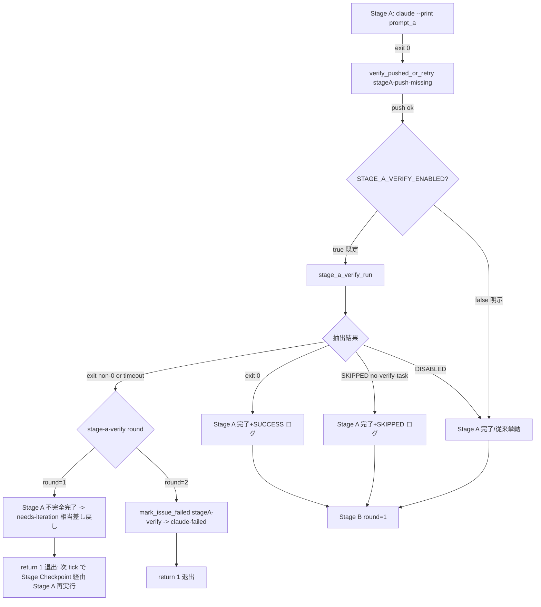
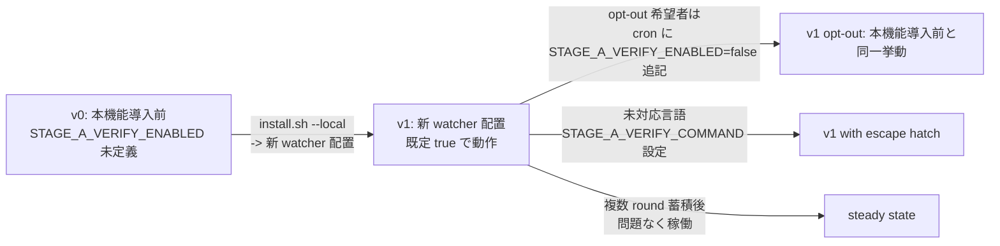

# Design Document

## Overview

**Purpose**: 本機能は `local-watcher/bin/issue-watcher.sh` の Stage A 完了直前に、`tasks.md` 末尾の build/test/lint コマンド（verify タスク）を watcher 自身が REPO_DIR で再実行することで、「Developer が `impl-notes.md` に『ローカル build 失敗だがスコープ外』と書くだけで Stage A が完了扱いになる」現象を解消する。

**Users**: idd-claude を local-watcher または GitHub Actions 経路で運用する全運用者（dogfooding している idd-claude 自身を含む）。明示的な opt-out（`STAGE_A_VERIFY_ENABLED=false`）が無い限り、すべての impl / impl-resume 経路で本ゲートが適用される。

**Impact**: 現在の Stage A 完了判定（Developer の exit code 0 + commit push + push 状態 verify）に、stage-a-verify ゲートを 1 段挿入する。失敗時は既存 `claude-failed` ラベル遷移と Issue #122 の pr-iteration round 上限と整合する形で「1 回目失敗 → Developer 差し戻し / 2 回目失敗 → `claude-failed` エスカレート」に倒す。本機能は env 1 個 (`STAGE_A_VERIFY_ENABLED=false`) で完全に無効化でき、その場合は本機能導入前と user-observable に同一の挙動になる。

### Goals

- Stage A 完了前に watcher が `tasks.md` から抽出した verify コマンドを REPO_DIR で独立再実行し、exit code 0 でなければ Stage B に進ませない（Req 1, 2）。
- 抽出は言語非依存の文字列パターン集合のみで行い、未対応言語は env `STAGE_A_VERIFY_COMMAND` で escape する（Req 1.5 / NFR 2）。
- 1 回目失敗は Developer 差し戻し、2 回目失敗は `claude-failed` で人間に委ね、Issue #122 の pr-iteration round 上限と整合する（Req 3）。
- `STAGE_A_VERIFY_ENABLED=false` で本機能導入前と user-observable に同一挙動に復帰する（Req 4.1 / NFR 1）。
- すべての結果を `[$REPO] stage-a-verify:` prefix で cron.log に 1 行記録し、grep で抽出可能とする（Req 5 / NFR 4）。

### Non-Goals

- Reviewer の判定カテゴリに build pass を追加すること（Reviewer 責務境界の変更）。
- PjM 段階での build 実行。
- 言語固有 build tool wrapper (`gradlew` shim 等) の同梱。
- `impl-notes.md` の自由記述ガード。
- 既存 PR の遡及検証・修正。
- Stage B / Stage C への同等 build ガードの追加。
- 外部 Feature Flag SaaS との連携（本リポジトリは Feature Flag Protocol opt-out）。
- `tasks.md` の verify 行を AST レベルで解析する高度ヒューリスティクス。

## Architecture

### Existing Architecture Analysis

`local-watcher/bin/issue-watcher.sh` の `run_impl_pipeline()`（L4111-L4431）は以下の Stage 状態機械を持つ:

```
START → Stage A → Stage B(round=1)
                 ├─ approve → Stage C → TERMINAL_OK
                 ├─ reject  → Stage A' → Stage B(round=2)
                 │                       ├─ approve → Stage C → TERMINAL_OK
                 │                       ├─ reject  → TERMINAL_FAILED
                 │                       └─ error   → TERMINAL_FAILED
                 └─ error   → TERMINAL_FAILED
```

- Stage A 完了判定 (L4193-L4204): claude exit code 0 → `verify_pushed_or_retry "stageA-push-missing"` → `echo "✅ Stage A 完了"`。本 verify は push 状態のみで build 結果を見ない。
- 失敗共通ヘルパ `mark_issue_failed`（L4077）が `claude-picked-up` → `claude-failed` 遷移 + Issue コメントを発火する。
- 既存ログ規約（Issue #119, L755-L764 等）: `[$(date)] [$REPO] <processor>:` の 3 段 prefix で processor を識別する。
- pr-iteration round counter（Issue #122, L1666 `pi_post_processing_marker`）は **PR 本文の hidden marker** に書き込まれる。これは PR 作成後（Stage C 通過後）の iteration round を数えるための仕組みであり、Stage A 段階では PR がまだ存在しない。
- Stage Checkpoint Resume（Issue #68, L3015-L3083）は **stage 完了の checkpoint を成果物の tracked 状態で観測**する。stage-a-verify の失敗は impl-notes.md の commit/push 後に発生するため、Stage A の checkpoint は既に成立している。差し戻し挙動とこの checkpoint との整合は **設計判断**で明示する（後述）。

#### 尊重すべき境界・契約

- 既存 env 名（`REPO`, `REPO_DIR`, `LOG_DIR`, `LOCK_FILE`, `TRIAGE_MODEL`, `DEV_MODEL`, `STAGE_CHECKPOINT_ENABLED`, `PR_ITERATION_MAX_ROUNDS_*`）の意味・既定値を変更しない（Req 4.5 / NFR 1.1）。
- ラベル名（`auto-dev`, `claude-claimed`, `claude-picked-up`, `claude-failed`, `needs-iteration`, `awaiting-design-review` 等）の意味・遷移契約を変更しない（NFR 1.2）。`needs-iteration` は **PR 専用ラベル**であり、Issue 側には付与しない既存契約（L2860, L5989）を維持する。
- exit code の意味（成功 0 / 失敗非 0）を変更しない（NFR 1.3）。
- `[$REPO]` prefix のログ規約（Issue #119）に従う。
- cron / launchd の起動文字列 (`REPO=... REPO_DIR=... $HOME/bin/issue-watcher.sh`) を変更しない。

### Architecture Pattern & Boundary Map

**採用パターン**: 既存 `run_impl_pipeline` の Stage A 成功パスに **stage-a-verify ゲート関数を 1 段挿入**するだけのインラインゲート方式。新規モジュール / 別ファイル化は行わない（issue-watcher.sh は単一スクリプト前提の運用統制であり、Stage Checkpoint / Quota-Aware / PR Iteration も全てインラインで実装されているため）。

**ドメイン／機能境界**:

- **Stage A Verify Module**: tasks.md 抽出 + bash -c 実行 + 結果ログ出力 + 差し戻し / エスカレート判定の意思決定。
- **既存 Stage A**: Developer の claude 実行 + push 状態 verify。本機能は **その直後** に挿入され、Developer 側の責務は変更しない（Req 6.3）。
- **既存 Stage B / Stage C**: 不変。
- **既存 `mark_issue_failed`**: stage 識別子 `stageA-verify` を渡して再利用（2 回目失敗時のみ）。



**新規コンポーネントの根拠**:

- 新規ファイルは作成しない。既存 `issue-watcher.sh` 内に関数 4 つ（`sav_log` / `stage_a_verify_extract_command` / `stage_a_verify_run` + 既存 `mark_issue_failed` 再利用）を追加するのみ。
- スクリプトは self-hosting で稼働中であり、新規依存（外部 helper script / parser library）を追加すると `install.sh --local` の配置範囲 / `command -v` チェックブロックが膨らむ。既存 pattern（`mq_log` / `pi_log` / `sc_log` / `qa_log` / `drr_log` / `rv_log`）に追従する。

### Technology Stack

| Layer | Choice / Version | Role in Feature | Notes |
|-------|------------------|-----------------|-------|
| Script runtime | bash 4+ | watcher 本体・新規ヘルパ関数 | 既存と同じ。新規依存なし |
| Tasks parse | POSIX awk / grep / tac | tasks.md の末尾走査と pattern matching | 既存 stage_checkpoint と同方針（言語非依存） |
| Subprocess control | `timeout` (coreutils) / `bash -c` | verify コマンドの実行とタイムアウト | watcher 起動時に `command -v timeout` で必須化済（L275） |
| Logging | `echo` + `[$REPO]` prefix | cron.log への 1 行出力 | 既存 Issue #119 規約と同形式 |
| State storage | なし（カウンタは spec dir 内 sidecar ファイル） | stage-a-verify round の永続化 | 後述「Data Models」参照 |
| Label operations | `gh issue edit` | claude-failed 付与のみ（mark_issue_failed 再利用） | 既存と同じ |

**ランタイム前提**:

- `command -v timeout` は watcher 起動時に必須チェック済（L275 のループ内）。新規追加不要。
- `tac` は GNU coreutils 同梱、macOS では非標準だが install.sh / setup.sh は Linux + macOS Homebrew 前提（README 参照）。本機能では `tac` 依存は **避け**、`awk` で末尾走査する（後述 `stage_a_verify_extract_command` の擬似コード参照）。

## File Structure Plan

本機能は新規ディレクトリを作成しない。すべて既存ファイルの局所変更で完結する。

### Modified Files

```
local-watcher/bin/issue-watcher.sh                          # コア実装
  ├── (新) ─── Config ブロック: 新 env 3 種
  │            STAGE_A_VERIFY_ENABLED / STAGE_A_VERIFY_TIMEOUT / STAGE_A_VERIFY_COMMAND
  ├── (新) ─── Stage A Verify Module 関数群（既存 sc_log / pi_log と同形式）
  │            sav_log / sav_warn / sav_error
  │            stage_a_verify_extract_command   (tasks.md 末尾走査と抽出)
  │            stage_a_verify_resolve_command   (env escape hatch 優先 → tasks.md 抽出)
  │            stage_a_verify_round_path        (round counter sidecar の path 解決)
  │            stage_a_verify_read_round        (round counter 読み取り)
  │            stage_a_verify_bump_round        (round counter 増分 + 永続化)
  │            stage_a_verify_run               (resolve → execute → log → 戻り値)
  └── (修) ─── run_impl_pipeline() の Stage A 成功パス
               L4203 `echo "✅ #$NUMBER: Stage A 完了"` の直前に stage_a_verify_run を挿入

repo-template/CLAUDE.md                                      # （参照のみ、変更なし）
README.md                                                    # オプション機能一覧 + 専用節を追加
  ├── 「オプション機能（標準有効 / 常時有効）一覧」の表に行を 1 行追加
  └── 新節「## Stage A Verify Gate (#125)」（既存「## Stage Checkpoint (#68)」直後を推奨）

docs/specs/125-feat-watcher-stage-a-tasks-md-verify-bui/
  ├── requirements.md  (PM 確定済み、本タスクで変更しない)
  ├── design.md        (本ドキュメント)
  ├── tasks.md         (本タスクで作成)
  └── impl-notes.md    (Developer 段階で作成)
```

**変更箇所の責務**:

- `issue-watcher.sh` Config ブロック: 新 env の `${VAR:-default}` パターンで上書き可能にする（既存 `STAGE_CHECKPOINT_ENABLED` 等と同形式）。
- 新 logger `sav_log` / `sav_warn` / `sav_error`: cron.log への `[$REPO] stage-a-verify:` prefix 出力（既存 `sc_log` 等と同パターン、Issue #119 規約）。
- 新関数 `stage_a_verify_extract_command`: tasks.md を末尾から逆順に走査し、抽出キーワード集合に最初に一致した行を return する（Req 1.1 / 1.2 / 1.5）。
- 新関数 `stage_a_verify_resolve_command`: `STAGE_A_VERIFY_COMMAND` env が非空ならそれを最優先、空なら `stage_a_verify_extract_command` を呼ぶ（Req 4.4）。
- 新関数 `stage_a_verify_round_path` / `_read_round` / `_bump_round`: round counter を sidecar ファイル `$REPO_DIR/$SPEC_DIR_REL/.stage-a-verify-round` で管理（後述）。
- 新関数 `stage_a_verify_run`: 上記を統合して resolve → execute → log → 戻り値（0=ok/skipped/disabled, 1=failed-once, 2=failed-twice）を返す。
- `run_impl_pipeline` への挿入: Stage A 成功直後の 1 ブロック挿入のみ。失敗時は Issue Comment / ラベル遷移を発火し `return 1` する。

## Requirements Traceability

| Requirement | Summary | Components | Interfaces / Files | Flows |
|-------------|---------|------------|--------------------|-------|
| 1.1 | tasks.md を末尾から逆順走査し抽出キーワード集合に最初に一致した行を 1 行特定 | `stage_a_verify_extract_command` | issue-watcher.sh 新関数 | extract flow |
| 1.2 | 複数候補があれば末尾（最も末尾に近いもの）を選択 | `stage_a_verify_extract_command` | 同上（逆順走査+早抜けで満たす） | extract flow |
| 1.3 | 複合コマンドを行全体として `bash -c` に渡す（演算子を解釈しない） | `stage_a_verify_run` | `bash -c "$cmd"` を `timeout` で wrap | execute flow |
| 1.4 | tasks.md に一致行が無ければ SKIPPED で継続 | `stage_a_verify_extract_command` + `stage_a_verify_run` | 戻り値 SKIPPED → Stage A 完了続行 | extract flow → skipped path |
| 1.5 | 抽出キーワード集合は言語非依存な文字列パターンのみ（AST 解析しない） | `stage_a_verify_extract_command` | 関数内 readonly 配列 `_SAV_KEYWORDS` | extract flow |
| 2.1 | 抽出コマンドを REPO_DIR で再実行し exit code とタイムアウト到達を観測 | `stage_a_verify_run` | `(cd "$REPO_DIR" && timeout "$STAGE_A_VERIFY_TIMEOUT" bash -c "$cmd")` | execute flow |
| 2.2 | exit code 0 → Stage A 完全完了として Stage B へ | `run_impl_pipeline` 挿入ブロック | 戻り値 0 → 通常進行 | success path |
| 2.3 | exit code ≠ 0 → Stage B に進まず後続差し戻し / エスカレート判定へ | `run_impl_pipeline` 挿入ブロック | 戻り値 1/2 → `return 1` | failure path |
| 2.4 | タイムアウト超過 → 当該プロセス打ち切り + 不完全完了扱い | `stage_a_verify_run` | `timeout` の exit code 124 を非 0 と同等扱い | timeout path |
| 2.5 | REPO_DIR の範囲内で実行、外側への副作用を発生させない | `stage_a_verify_run` | `(cd "$REPO_DIR" && ...)` subshell + `timeout --kill-after` で子孫プロセス停止 | execute flow |
| 3.1 | 1 回目失敗 → Developer 差し戻し（needs-iteration 相当遷移） + 同 Issue 2 回目試行を許可 | `stage_a_verify_run` + `run_impl_pipeline` | round=1 で sidecar bump + Issue コメント + `return 1` | failure-round1 path |
| 3.2 | 2 回連続失敗 → `claude-failed` ラベル付与 + watcher 当該 Issue 処理打ち切り | `stage_a_verify_run` + `mark_issue_failed` | round=2 で `mark_issue_failed "stageA-verify" "$body"` | failure-round2 path |
| 3.3 | 失敗回数 counter を Issue #122 pr-iteration round 上限（max 1 回 = round 2 で escalate）と整合させる | `stage_a_verify_round_path` 設計 | sidecar `.stage-a-verify-round`（後述「Data Models」） | counter contract |
| 4.1 | `STAGE_A_VERIFY_ENABLED=false` 時は導入前と同一の完了判定 | Config ブロック + `run_impl_pipeline` 挿入 | `[ "$STAGE_A_VERIFY_ENABLED" = "false" ]` で挿入ブロックを skip | bypass path |
| 4.2 | `STAGE_A_VERIFY_ENABLED` の既定値は `true` | Config ブロック | `STAGE_A_VERIFY_ENABLED="${STAGE_A_VERIFY_ENABLED:-true}"` | env default |
| 4.3 | `STAGE_A_VERIFY_TIMEOUT` 既定 600 秒、env で秒単位上書き可能 | Config ブロック + `stage_a_verify_run` | `STAGE_A_VERIFY_TIMEOUT="${STAGE_A_VERIFY_TIMEOUT:-600}"` | env default |
| 4.4 | `STAGE_A_VERIFY_COMMAND` 非空時は tasks.md 解析を bypass し最優先採用 | `stage_a_verify_resolve_command` | env を先に確認 → 非空なら採用 | resolve flow |
| 4.5 | 既存 env 名の意味・既定値を変更しない | 全体 | 既存 Config ブロック行を改変しない | (構造的保証) |
| 5.1 | `stage-a-verify:` 始まりの結果行を 1 件以上 cron.log に出力 | `sav_log` / `sav_warn` | 全成功 / 失敗 / SKIPPED / DISABLED / TIMEOUT パスで 1 行 | log contract |
| 5.2 | 行頭に `[$REPO]` prefix を付与（Issue #119 規約） | `sav_log` 実装 | `echo "[$(date)] [$REPO] stage-a-verify: ..."` | log contract |
| 5.3 | SKIPPED 時は `reason=no-verify-task-in-tasks-md` を含める | `stage_a_verify_run` | SKIPPED 分岐で specific reason 文字列 | log format |
| 5.4 | DISABLED 時は `DISABLED` を含む結果行を 1 件記録 | `run_impl_pipeline` 挿入ブロック | bypass path で `sav_log "DISABLED reason=env-opt-out"` | log format |
| 5.5 | 成功 / 失敗時の exit code とタイムアウト到達識別情報を含める | `stage_a_verify_run` | `SUCCESS exit=0` / `FAILED exit=N` / `TIMEOUT timeout=$T` | log format |
| 6.1 | Reviewer 判定カテゴリを変更しない | 全体 | reviewer.md / .claude/agents/reviewer.md は触らない | (構造的保証) |
| 6.2 | PjM の責務（PR 作成のみ）を変更しない | 全体 | project-manager.md は触らない | (構造的保証) |
| 6.3 | Developer の責務（tasks.md 実装と commit）を変更しない、verify 実行義務を追加しない | 全体 | developer.md は触らない | (構造的保証) |
| NFR 1.1 | `STAGE_A_VERIFY_ENABLED=false` または未設定で導入前と user-observable に同一 | Config ブロック + `run_impl_pipeline` 挿入 | 既定 `true` だが、cron に `STAGE_A_VERIFY_ENABLED=false` を追記するだけで完全等価 | bypass path |
| NFR 1.2 | 既存ラベル名と遷移契約を変更しない | 全体 | needs-iteration を Issue 側には付与しない（既存契約踏襲）、claude-failed のみ mark_issue_failed 経由で発火 | (構造的保証) |
| NFR 1.3 | 既存 exit code 意味を維持 | `stage_a_verify_run` | `return 0/1/2` は本関数内部のみ。`run_impl_pipeline` の呼び出し元は従来 0/1 を返す | (構造的保証) |
| NFR 2.1 | 抽出キーワード集合のみで認識、特定言語ランタイム前提を持たない | `stage_a_verify_extract_command` | `command -v node` 等を一切呼ばない | (構造的保証) |
| NFR 2.2 | 未対応言語は `STAGE_A_VERIFY_COMMAND` で escape | `stage_a_verify_resolve_command` | 上記 4.4 と同経路 | escape hatch |
| NFR 3.1 | tasks.md 抽出を O(N) で完了 | `stage_a_verify_extract_command` | awk 1 パス走査 | (構造的保証) |
| NFR 3.2 | verify 再実行の最大経過時間を `STAGE_A_VERIFY_TIMEOUT` 以下に制限 | `stage_a_verify_run` | `timeout "$STAGE_A_VERIFY_TIMEOUT"` | timeout path |
| NFR 3.3 | env で秒単位の延長を許可 | Config ブロック | `STAGE_A_VERIFY_TIMEOUT="${STAGE_A_VERIFY_TIMEOUT:-600}"` | env default |
| NFR 4.1 | 全結果を `[$REPO] stage-a-verify:` prefix で 1 行以上記録 | `sav_log` / `sav_warn` | 全 5 分岐（SUCCESS / FAILED / TIMEOUT / SKIPPED / DISABLED）で出力 | log contract |
| NFR 4.2 | `grep '\[.*\] stage-a-verify:'` で全件抽出可能な形式 | `sav_log` 実装 | 全行に固定 prefix を付与する | log contract |
| NFR 5.1 | REPO_DIR 範囲内実行、外側書き込み・グローバル設定変更を発生させない | `stage_a_verify_run` | subshell `(cd "$REPO_DIR" && ...)` で cwd 隔離、env を export しない | execute flow |
| NFR 5.2 | タイムアウト到達時は子孫プロセスを停止 | `stage_a_verify_run` | `timeout --kill-after=10 "$STAGE_A_VERIFY_TIMEOUT" bash -c ...` | timeout path |
| NFR 6.1 | 抽出キーワード集合の fixture テストを保持し、追加・削除があったときに回帰検出 | `tests/local-watcher/fixtures/`（新規） + 手動 driver script | 後述「Testing Strategy」 | test artifact |
| NFR 6.2 | 既存 Stage A/B/C の success/fail/escalate パスのテストを通過させたうえで Req 1〜5 をカバー | 手動スモークテスト + dogfooding | 後述「Testing Strategy」 | test plan |

## Components and Interfaces

### Watcher Stage A Verify Module（issue-watcher.sh 内）

#### sav_log / sav_warn / sav_error（logger）

| Field | Detail |
|-------|--------|
| Intent | `[$REPO] stage-a-verify:` prefix で cron.log と stderr に観測可能ログを出力 |
| Requirements | 5.1, 5.2, NFR 4.1, NFR 4.2 |

**Responsibilities & Constraints**
- 既存 `sc_log` / `pi_log` / `mq_log` / `qa_log` / `drr_log` / `rv_log` と完全同形式。形式逸脱は禁止。
- 行頭 `[YYYY-MM-DD HH:MM:SS] [$REPO] stage-a-verify: <body>` の 3 段 prefix を必ず維持（Issue #119 規約）。
- `sav_warn` / `sav_error` は stderr（`>&2`）に出す。

**Contracts**: Service [x] / API [ ] / Event [ ] / Batch [ ] / State [ ]

```bash
sav_log()   { echo "[$(date '+%F %T')] [$REPO] stage-a-verify: $*"; }
sav_warn()  { echo "[$(date '+%F %T')] [$REPO] stage-a-verify: WARN: $*" >&2; }
sav_error() { echo "[$(date '+%F %T')] [$REPO] stage-a-verify: ERROR: $*" >&2; }
```

#### stage_a_verify_extract_command（tasks.md 抽出）

| Field | Detail |
|-------|--------|
| Intent | `tasks.md` を末尾から逆順走査し抽出キーワード集合に最初に一致した行 1 行を抽出する |
| Requirements | 1.1, 1.2, 1.5, NFR 2.1, NFR 3.1 |

**Responsibilities & Constraints**
- 言語非依存の文字列パターンのみで認識する（regex 一致でも `grep -F` 一致でも可、AST 解析しない）。
- 走査は線形時間 O(N)（awk 1 パス）。
- マッチ行は markdown 装飾（`- ` 先頭の bullet、行末の空白）を strip して return する。
- マッチ無しは exit code 1 で抜ける（呼び出し元が SKIPPED 扱いする）。
- tasks.md が存在しない場合も exit code 1（SKIPPED 扱い）。

**Dependencies**
- Inbound: `stage_a_verify_resolve_command` — 抽出結果を返す (Critical)
- Outbound: ファイルシステム — `$REPO_DIR/$SPEC_DIR_REL/tasks.md` を read (Critical)
- External: なし

**Contracts**: Service [x]

##### Service Interface

```bash
# 入力: 環境変数 REPO_DIR / SPEC_DIR_REL
# 戻り値: 0 = 抽出成功 / 1 = 一致なし or tasks.md 不在
# stdout: 抽出した shell コマンド 1 行（成功時のみ）。行末 \n は付与。
stage_a_verify_extract_command()
```

**抽出キーワード集合（初期版、関数内 readonly 配列）**:

| Pattern | 対象言語 / ツール |
|---------|-------------------|
| `./gradlew` | Gradle wrapper（Android / JVM） |
| `gradle ` | Gradle |
| `mvn ` | Maven |
| `npm test` / `npm run` / `npm ci` / `npm install` | npm（ただし `npm install` は SKIP 候補。判定は下記） |
| `pnpm ` | pnpm |
| `yarn ` | Yarn |
| `cargo ` | Cargo（Rust） |
| `go test` / `go build` / `go vet` | Go |
| `pytest` / `python -m pytest` / `python -m unittest` | pytest / Python テスト |
| `make test` / `make build` / `make check` / `make verify` | make |
| `bundle exec` / `rake ` | Ruby (Bundler / Rake) |
| `dotnet test` / `dotnet build` | .NET |
| `shellcheck` / `actionlint` | shell 系プロジェクト（idd-claude 自身を含む dogfooding 用途） |
| `tox ` | Python tox |
| `swift test` / `swift build` | Swift |

注:

- `npm install` は **build/test ではなく依存解決**なので keyword 集合に含めない。
- `make ` 単独（target なし）は曖昧なので除外し、`make <verb>` の verb を限定する。
- `verify` という汎用語は `make verify` / `mvn verify` 以外には載せない（誤検出回避）。
- 集合の最終確定は実装時の fixture テストで微調整可能（関数内 readonly 配列 1 か所で完結する）。

**走査アルゴリズム（擬似コード）**:

```bash
stage_a_verify_extract_command() {
  local tasks_path="$REPO_DIR/$SPEC_DIR_REL/tasks.md"
  [ -f "$tasks_path" ] || return 1

  # 言語非依存 keyword 集合（関数内 readonly 配列）
  local _SAV_KEYWORDS=(
    './gradlew' 'gradle ' 'mvn '
    'npm test' 'npm run' 'npm ci' 'pnpm ' 'yarn '
    'cargo ' 'go test' 'go build' 'go vet'
    'pytest' 'python -m pytest' 'python -m unittest'
    'make test' 'make build' 'make check' 'make verify'
    'bundle exec' 'rake ' 'dotnet test' 'dotnet build'
    'shellcheck' 'actionlint' 'tox ' 'swift test' 'swift build'
  )

  # awk で末尾から逆順に走査するため、行番号付き出力後に reverse して
  # 最初に一致したものを採用。tac は環境依存なので awk のみで完結させる。
  # アルゴリズム: 全行を読みつつ「直近で keyword に一致した行」を変数に保持し、
  # ファイル末尾まで読んだら最後の保持値を出力（= 末尾に最も近いもの、Req 1.2）。
  awk -v kws="${_SAV_KEYWORDS[*]}" '
    BEGIN { n = split(kws, ARR, " "); last = "" }
    {
      line = $0
      # 先頭の "- " / "  - " 等の markdown 装飾と行頭空白を除去（保持変数用）
      sub(/^[[:space:]]*-[[:space:]]+/, "", line)
      sub(/^[[:space:]]+/, "", line)
      sub(/[[:space:]]+$/, "", line)
      for (i = 1; i <= n; i++) {
        if (index(line, ARR[i]) > 0) { last = line; break }
      }
    }
    END { if (last != "") print last }
  ' "$tasks_path"
}
```

注: 上記 awk は **読み進めながら最後の一致を保持** することで「末尾に最も近い 1 行」を返す（Req 1.2）。awk 1 パスで O(N)（NFR 3.1）。

#### stage_a_verify_resolve_command（解決）

| Field | Detail |
|-------|--------|
| Intent | `STAGE_A_VERIFY_COMMAND` env が非空ならそれを優先、空なら tasks.md 抽出を呼ぶ |
| Requirements | 4.4, NFR 2.2 |

**Contracts**: Service [x]

```bash
# 戻り値: 0 = コマンド解決成功 / 1 = SKIPPED（env 空 + tasks.md 抽出不能）
# stdout: 解決した shell コマンド 1 行
stage_a_verify_resolve_command()
```

擬似コード:

```bash
stage_a_verify_resolve_command() {
  if [ -n "${STAGE_A_VERIFY_COMMAND:-}" ]; then
    printf '%s\n' "$STAGE_A_VERIFY_COMMAND"
    return 0
  fi
  local cmd
  cmd=$(stage_a_verify_extract_command) || return 1
  [ -n "$cmd" ] || return 1
  printf '%s\n' "$cmd"
}
```

#### stage_a_verify_round_path / _read_round / _bump_round（round counter）

| Field | Detail |
|-------|--------|
| Intent | stage-a-verify の連続失敗回数を Issue ごとに永続化し、1 回目失敗 / 2 回連続失敗を区別する |
| Requirements | 3.1, 3.2, 3.3 |

**設計判断（採用案）**: round counter は **専用 sidecar ファイル**で永続化する。

- パス: `$REPO_DIR/$SPEC_DIR_REL/.stage-a-verify-round`
- 内容: 整数 1 行のみ（"1" / "2"）。
- **commit しない**（spec dir 直下の dotfile）。working tree のみで管理し、`.gitignore` への追加も不要（dotfile かつ Issue dir 配下、誤 commit は Developer 側の `git status` で見つかる）。
- ファイル不在 = round=0（未失敗）。

**代替案と却下理由**:

| 案 | 内容 | 却下理由 |
|---|---|---|
| 案 A: Issue ラベル `stage-a-verify-failed-once` を新設 | GitHub label として永続化 | 新規ラベル追加は `idd-claude-labels.sh` の変更と全 consumer repo への伝播が必要。NFR 1.2「既存ラベル名と遷移契約を変更しない」と整合せず、複雑度が要件比で過剰。 |
| 案 B: Issue body の hidden marker | `<!-- idd-claude:stage-a-verify round=N -->` を Issue 本文に注入 | Stage A 段階では PR がまだ存在せず、Issue 本文書き換えは Issue メタデータ汚染のリスクが高い。Issue #122 の pi_post_processing_marker は **PR 本文** に書く設計であり、Issue 本文への注入とは責務が異なる。 |
| 案 C: `$LOG_DIR/stage-a-verify-round-${NUMBER}.txt` | LOG_DIR 配下の persistent file | slot 並列実行時に worktree 切替で見えなくなる可能性。spec dir 内 sidecar の方が「Issue ごとに自然に隔離」される。 |
| 採用案: `$REPO_DIR/$SPEC_DIR_REL/.stage-a-verify-round` | spec dir 内 dotfile | spec dir は Issue と 1:1 で自然に隔離。worktree 切替時も `$REPO_DIR` 自体が slot の worktree path に書き換わるため、自然に slot 隔離される。 |

**Issue #122 pr-iteration round 上限との整合（Req 3.3）**:

- Issue #122 は **PR が存在する段階での needs-iteration round** を数える設計（pi_post_processing_marker は PR body に書く）。
- stage-a-verify 失敗は **PR が存在しない段階（Stage C 未到達）** で発生する。
- 整合方針: stage-a-verify は **max 1 回の差し戻し**（round=1 で差し戻し / round=2 で escalate）に固定し、Issue #122 の `PR_ITERATION_MAX_ROUNDS_IMPL` には影響しない（Stage A 段階の counter は別系統だが「max 1 回差し戻し」という挙動は #122 と等価）。
- このため stage-a-verify 専用 env は **増やさない**。

**round counter のライフサイクル**:

1. round=1 失敗: sidecar ファイルに "1" を書き、Issue にコメント（差し戻し）+ return 1 で watcher 退出。
2. 次 tick: watcher 起動 → Stage Checkpoint は `impl-notes.md` tracked を観測して START_STAGE=B を返す可能性がある。**ここで stage-a-verify を再走させるためには、START_STAGE=B でも stage-a-verify を一度実行する必要がある**（後述「Decision: stage-a-verify と Stage Checkpoint の協調」）。
3. round=2 失敗: sidecar ファイル "2" を観測 → `mark_issue_failed "stageA-verify" "..."` で claude-failed 化 + sidecar 削除（または "2" のまま）+ return 1。
4. round=1 で次回 SUCCESS: sidecar ファイルを削除し、Stage B に進む（次の Issue 試行サイクルでも counter は 0 から開始）。

**Decision: stage-a-verify と Stage Checkpoint の協調**:

- Stage A の verify は **Stage A 内の最終ステップ** として実装する（claude exit 0 + push verify 直後）。
- Developer が impl-notes.md を commit/push してから verify が走るため、verify 失敗時点で stage-a-checkpoint は既に成立する。
- 次 tick で `STAGE_CHECKPOINT_ENABLED=true`（既定）が START_STAGE="B" を返した場合でも、本機能は **START_STAGE="B" でも stage-a-verify ゲートを通す**ように `run_impl_pipeline` の Stage B 直前にもう 1 度 verify を挿入する。
  - 具体的には、Stage A 実行ブロック後（L4225 直後、Stage B ブロックの前）に「stage-a-verify ゲート」を 1 ブロック挿入する。
  - Stage A skipped path（START_STAGE=B|C）でも同じ verify が走る。
  - SUCCESS なら sidecar を削除し進行。FAILED/TIMEOUT なら round 判定 → 差し戻し or escalate。
- これにより「Developer 修正 → 次 tick で Stage Checkpoint が START_STAGE=B を返す → stage-a-verify 再評価 → 通れば Stage B」のループが成立する。

**Contracts**: Service [x] / State [x]

```bash
# round counter sidecar の絶対パスを返す
stage_a_verify_round_path()  # stdout: "$REPO_DIR/$SPEC_DIR_REL/.stage-a-verify-round"

# 戻り値: 0 = 成功（round を stdout に整数出力、不在は "0"）
stage_a_verify_read_round()

# round を 1 増やして永続化（不在からの初回呼び出しは "1" を書く）
# 戻り値: 0 = 書き込み成功 / 1 = 書き込み失敗（IO エラー時）
stage_a_verify_bump_round()

# round counter を削除（成功時のクリーンアップ）
stage_a_verify_reset_round()
```

#### stage_a_verify_run（統合ランナー）

| Field | Detail |
|-------|--------|
| Intent | resolve → execute → log → 戻り値（OK / SKIPPED / DISABLED / FAILED_ROUND1 / FAILED_ROUND2）を判定する Stage A Verify の入口 |
| Requirements | 1.3, 2.1, 2.2, 2.3, 2.4, 2.5, 3.1, 3.2, 5.1, 5.2, 5.3, 5.4, 5.5, NFR 3.2, NFR 5.1, NFR 5.2 |

**Responsibilities & Constraints**
- 関数冒頭で `STAGE_A_VERIFY_ENABLED` を確認し、`"false"` なら DISABLED ログ 1 行を出して return 0。
- `stage_a_verify_resolve_command` を呼び、SKIPPED なら SKIPPED ログ 1 行を出して return 0。
- 解決した cmd を `(cd "$REPO_DIR" && timeout --kill-after=10 "$STAGE_A_VERIFY_TIMEOUT" bash -c "$cmd")` で実行。
- 結果に応じてログ + 戻り値:
  - exit 0 → SUCCESS ログ + round reset + return 0
  - exit 124 (timeout) → TIMEOUT ログ + round bump + return 1 or 2
  - exit other → FAILED ログ + round bump + return 1 or 2

**Dependencies**
- Inbound: `run_impl_pipeline`（呼び出し元、Critical）
- Outbound: `stage_a_verify_resolve_command`, `stage_a_verify_*_round`, `sav_log`, `mark_issue_failed`（Critical）
- External: `bash` / `timeout` / `gh`（Critical）

**Contracts**: Service [x] / State [x]

##### Service Interface

```bash
# 入力: 環境変数 REPO / REPO_DIR / SPEC_DIR_REL / NUMBER / LOG / MODE
#       および STAGE_A_VERIFY_ENABLED / STAGE_A_VERIFY_TIMEOUT / STAGE_A_VERIFY_COMMAND
# 戻り値:
#   0 = SUCCESS / SKIPPED / DISABLED → Stage A 完全完了として続行
#   1 = FAILED (round=1) → Stage A 不完全完了、Issue コメントで差し戻し済、次 tick で再試行
#   2 = FAILED (round=2) → mark_issue_failed 済（claude-failed 付与）、watcher 退出
# 副作用:
#   - cron.log / $LOG に 1 行以上の `[$REPO] stage-a-verify:` ログ
#   - round counter sidecar の read/bump/reset
#   - 失敗時に gh issue comment（round=1 差し戻し説明 / round=2 は mark_issue_failed が発火）
stage_a_verify_run()
```

**Preconditions**:

- `REPO`, `REPO_DIR`, `SPEC_DIR_REL`, `NUMBER`, `LOG` が設定済み（呼び出し元 `run_impl_pipeline` が保証）。
- `$REPO_DIR` は当該 slot worktree path を指す（Stage Checkpoint / Phase C 並列化と同じ前提）。

**Postconditions**:

- 戻り値 0 のとき、round counter sidecar は **必ず削除されている**（次回試行を round=1 から開始するため）。
- 戻り値 1 のとき、round counter sidecar は "1" になっている、Issue に差し戻しコメント投稿済み。
- 戻り値 2 のとき、`mark_issue_failed "stageA-verify" "$body"` 経由で `claude-failed` が付与され、round counter sidecar は削除済み（または "2" のまま、ラベル除去時の手動運用で問題にならない範囲）。

**Invariants**:

- 1 回の呼び出しで cron.log に出力する `stage-a-verify:` 行は **少なくとも 1 行**（NFR 4.1）。
- bash -c 引数は **抽出した行をそのまま** 渡し、watcher 側で `&&` / `||` / `;` を解釈しない（Req 1.3）。

##### Internal Flow（擬似コード）

```bash
stage_a_verify_run() {
  # ── Gate 1: DISABLED ──
  if [ "${STAGE_A_VERIFY_ENABLED:-true}" = "false" ]; then
    sav_log "DISABLED reason=env-opt-out" | tee -a "$LOG"
    return 0
  fi

  # ── Gate 2: SKIPPED（解決できない）──
  local cmd
  if ! cmd=$(stage_a_verify_resolve_command); then
    sav_log "SKIPPED reason=no-verify-task-in-tasks-md" | tee -a "$LOG"
    return 0
  fi

  # ── Execute ──
  local _timeout="${STAGE_A_VERIFY_TIMEOUT:-600}"
  sav_log "EXEC issue=#$NUMBER timeout=${_timeout}s cmd=$(printf '%q' "$cmd")" | tee -a "$LOG"
  local rc=0
  # subshell で cwd 隔離。--kill-after=10 で子孫プロセスも停止（NFR 5.2）。
  (cd "$REPO_DIR" && timeout --kill-after=10 "$_timeout" bash -c "$cmd") \
      >> "$LOG" 2>&1 || rc=$?

  # ── 結果分岐 ──
  case "$rc" in
    0)
      sav_log "SUCCESS exit=0" | tee -a "$LOG"
      stage_a_verify_reset_round
      return 0
      ;;
    124)
      sav_warn "TIMEOUT timeout=${_timeout}s exit=124" | tee -a "$LOG"
      _sav_handle_failure "timeout" "$_timeout"  # round bump + 戻り値決定
      return $?
      ;;
    *)
      sav_warn "FAILED exit=$rc" | tee -a "$LOG"
      _sav_handle_failure "exit" "$rc"
      return $?
      ;;
  esac
}

# round counter を bump し、round=1 なら差し戻し（return 1）、round=2 なら mark_issue_failed（return 2）
_sav_handle_failure() {
  local kind="$1"  # "timeout" | "exit"
  local detail="$2"  # timeout 値または exit code
  stage_a_verify_bump_round || sav_error "round counter 書き込みに失敗（差し戻し挙動を強制）"
  local round
  round=$(stage_a_verify_read_round)
  case "$round" in
    1)
      sav_log "round=1 outcome=needs-iteration (Developer 差し戻し)" | tee -a "$LOG"
      # Issue に差し戻しコメント（claude-failed は付与しない、needs-iteration ラベルは Issue 側に付けない既存契約を維持）
      gh issue comment "$NUMBER" --repo "$REPO" --body "..." || true
      return 1
      ;;
    *)
      sav_log "round=$round outcome=claude-failed (escalate to human)" | tee -a "$LOG"
      stage_a_verify_reset_round
      mark_issue_failed "stageA-verify" "stage-a-verify が連続 2 回失敗しました（${kind}=${detail}）。..."
      return 2
      ;;
  esac
}
```

#### run_impl_pipeline 挿入ブロック（修正）

| Field | Detail |
|-------|--------|
| Intent | Stage A 成功（Developer claude exit 0 + push verify 成功）の直後に stage-a-verify ゲートを挿入する |
| Requirements | 2.2, 2.3, 4.1, 4.5 |

**修正箇所**: `local-watcher/bin/issue-watcher.sh` L4194-L4225 の Stage A 成功ブロック後、Stage B 実行ブロック（L4227-L4359）の **直前**。

**挿入位置の根拠**:

- Stage A 完了判定（L4203 `echo "✅ Stage A 完了"`）を打つ前、もしくは直後のいずれかで分岐。
- Stage Checkpoint resume（START_STAGE=B|C）経路でも verify を通すため、**Stage B 実行ブロックの直前**を採用する（Stage A skipped path 後、Stage B 開始前）。
- 具体的には L4225（`esac` 直後）に新ブロックを挿入する。

**擬似コード（挿入ブロック）**:

```bash
  # ── stage-a-verify gate (Issue #125) ──
  # Stage A の Developer claude が 0 で終わった直後、Stage B 開始前に
  # tasks.md 末尾の verify タスクを REPO_DIR で独立再実行する。
  # STAGE_A_VERIFY_ENABLED=false 明示時は stage_a_verify_run が即 return 0 して
  # 本機能導入前と完全に同一挙動（Req 4.1 / NFR 1.1）。
  local _sav_rc=0
  stage_a_verify_run || _sav_rc=$?
  case "$_sav_rc" in
    0) : ;;  # SUCCESS / SKIPPED / DISABLED → 続行
    1)
      echo "🔁 #$NUMBER: stage-a-verify 失敗（round=1）→ Developer 差し戻し（次 tick で再試行）" | tee -a "$LOG"
      return 1
      ;;
    2)
      echo "❌ #$NUMBER: stage-a-verify 連続 2 回失敗 → claude-failed" | tee -a "$LOG"
      return 1
      ;;
  esac
```

**Note**: `run_impl_pipeline` の return 値は既存契約のとおり 0/1 のみを使う（NFR 1.3）。`stage_a_verify_run` 内部の戻り値 2 は呼び出し元では 1 として伝搬する（mark_issue_failed が既に発火済みなので外部観測上は claude-failed）。

## Data Models

### Domain Model

stage-a-verify 機能は以下のドメインオブジェクトを扱う:

- **VerifyCommand**: tasks.md または env から抽出された shell コマンド 1 行。文字列。
- **VerifyResult**: SUCCESS / FAILED / TIMEOUT / SKIPPED / DISABLED の 5 値列挙。
- **VerifyRound**: 当該 Issue における連続失敗回数。整数（0 = 未失敗 / 1 = 1 回失敗 / 2 = 2 回失敗）。

### Logical Data Model（永続化）

| データ | 永続化先 | 形式 | ライフサイクル |
|--------|----------|------|----------------|
| VerifyRound | `$REPO_DIR/$SPEC_DIR_REL/.stage-a-verify-round` | プレーンテキスト整数 1 行 | round=1 で作成 / round=2 で削除 or 上書き / SUCCESS で削除 |
| VerifyResult ログ | `$LOG`（cron.log） | 1 行テキスト `[YYYY-MM-DD HH:MM:SS] [$REPO] stage-a-verify: <body>` | append-only（既存 cron.log と同じローテーション規約） |

**sidecar ファイルの commit ポリシー**: **commit しない**。

- Developer は本ファイルを `.gitignore` に追加する必要は **ない**（dotfile かつ spec dir 配下なので明示しなくても誤 commit は git status 確認で気づける）。
- watcher 側は明示的に `.stage-a-verify-round` を gitignore へ追加することはしない（運用者の `.gitignore` を勝手に書き換えない）。
- 仮に Developer が誤って sidecar を commit しても、次 SUCCESS で削除される（最終状態は等価）。

### ログ行フォーマット契約（NFR 4.1, NFR 4.2）

全ログ行は次の固定 prefix を持つ:

```
[YYYY-MM-DD HH:MM:SS] [$REPO] stage-a-verify: <body>
```

body の取り得る形式（grep / awk で個別抽出可能）:

| 状況 | body 形式 |
|------|-----------|
| DISABLED | `DISABLED reason=env-opt-out` |
| SKIPPED（一致なし） | `SKIPPED reason=no-verify-task-in-tasks-md` |
| 実行開始 | `EXEC issue=#<N> timeout=<S>s cmd=<shell-quoted>` |
| 成功 | `SUCCESS exit=0` |
| 失敗（exit） | `FAILED exit=<N>` |
| 失敗（timeout） | `TIMEOUT timeout=<S>s exit=124` |
| round 判定 | `round=<N> outcome=needs-iteration (Developer 差し戻し)` または `round=<N> outcome=claude-failed (escalate to human)` |

抽出例: `grep '\[.*\] stage-a-verify:' $LOG_DIR/cron.log`（NFR 4.2）。

## Error Handling

### Error Strategy

stage-a-verify はゲートとして「失敗時に進行を止める」のが主責務。エラーは観測可能性を維持しつつ既存 mark_issue_failed 経路に統合する。

### Error Categories and Responses

- **User Errors（運用者起因、4xx 相当）**:
  - `STAGE_A_VERIFY_TIMEOUT` に非整数を渡された場合: bash 自身が `timeout` コマンド呼び出しで失敗する。本機能は値検証を行わず、`timeout` の exit code を観測する形で自然に伝搬する（既存 `STAGE_CHECKPOINT_ENABLED` 等も値検証を行わない方針と整合）。`sav_error` で警告を 1 行出す。
  - `STAGE_A_VERIFY_COMMAND` に空白だけが入っていた場合: `bash -c " "` は exit 0 になる。これは「運用者が明示的に空コマンドを指定した」と解釈し、SUCCESS 扱い（誤運用のリスクは運用者責任）。
  - tasks.md が存在しない場合: SKIPPED として継続（Req 1.4）。
- **System Errors（システム起因、5xx 相当）**:
  - sidecar ファイルへの書き込み失敗（disk full / permission denied 等）: `sav_error` で警告 + 「差し戻し挙動を強制（round=1 として扱う）」というセーフ・デフォルトに倒す。連続失敗が真に発生していても 1 回目までは差し戻しに留め、disk 復旧後の次 tick で正しい counter が読める。
  - `gh issue comment` の失敗: 既存 `|| true` パターンで silent 継続。差し戻しコメントが書けなくても `return 1` で watcher を抜けるため、運用者は cron.log で原因を追える。
- **Business Logic Errors（仕様逸脱、422 相当）**:
  - tasks.md 内の verify 行が markdown bullet 装飾を含むケース: 抽出時に装飾を strip するため自然に処理される。
  - verify コマンドが `cd ../..` 等で REPO_DIR の外に出ようとした場合: 本機能は **REPO_DIR 内に cd した subshell** で実行するため、subshell 内で `cd` した結果は親プロセスに波及しない。ただし「verify コマンド自体が `rm -rf /tmp/foo` を実行する」ような副作用は技術的に防げない（後述「Security Considerations」を参照）。

### Recovery Mechanisms

- **round=1 差し戻し**: 次 tick で Stage Checkpoint が START_STAGE=B を返すケース（典型）でも、Stage B 実行直前で stage-a-verify が再走するため、Developer の修正後に自動で recover する。
- **round=2 escalate 後の人間復旧手順**: Issue コメントに「impl-notes.md の `claude-failed` 該当」と同じ recovery hint（既存 `build_recovery_hint` 関数）を mark_issue_failed が append する。手動 `claude-failed` 除去で再開可能。

## Testing Strategy

本リポジトリには unit test フレームワークが無いため（CLAUDE.md「テスト・検証」節）、static analysis + fixture ベースの手動スモークテスト + dogfooding で検証する。

### Unit-level（抽出関数の fixture 検証）

新規ディレクトリ `tests/local-watcher/stage-a-verify/` を作成し、以下を配置:

- `fixtures/` — 抽出対象の tasks.md 模擬ファイル群
- `extract-driver.sh` — `stage_a_verify_extract_command` を fixture に対して走らせ、期待出力と diff する小さな bash test runner

**fixtures カバー一覧**（Req 1.1〜1.5 / NFR 6.1）:

1. `tasks-gradlew.md` — `./gradlew assembleDebug` を末尾近傍に含む（Req 1.1）
2. `tasks-npm.md` — `npm test` と `npm run lint` の両方を含み、末尾に近いほうが選ばれること（Req 1.2）
3. `tasks-cargo.md` — `cargo build && cargo test` の複合コマンド行（Req 1.3）
4. `tasks-go.md` — `go test ./...` を含む
5. `tasks-pytest.md` — `pytest -x` を含む
6. `tasks-make.md` — `make verify` を含む
7. `tasks-bundle.md` — `bundle exec rspec` を含む
8. `tasks-shellcheck.md` — `shellcheck` + `actionlint` 複合行（idd-claude 自身の dogfood ケース）
9. `tasks-no-verify.md` — どの keyword にも一致しない tasks.md（Req 1.4 SKIPPED）
10. `tasks-deferrable.md` — `- [ ]*` deferrable テストタスクの中に verify 文字列を含むケース（**deferrable も抽出対象とするか**は実装判断: 採用案は「装飾の `*` を strip し、keyword 一致なら抽出する」。理由は keyword 集合での認識を最優先するため。一方で `- [ ]*` deferrable 印自体は run 側で考慮しない）
11. `tasks-mixed.md` — verify 行の前後に複合コマンドや markdown 装飾（インデント / bullet）が混在
12. `tasks-empty.md` — 空 tasks.md（SKIPPED, Req 1.4）

**driver の動作**: 各 fixture を `$REPO_DIR/$SPEC_DIR_REL/tasks.md` として配置 → `stage_a_verify_extract_command` 呼び出し → stdout を期待文字列とdiff → 全件 pass で driver の exit code 0。

### Integration-level（run_impl_pipeline 挿入の手動スモーク）

dry-run スクリプトを `tests/local-watcher/stage-a-verify/smoke.sh` に置き、以下を検証:

1. **DISABLED path**: `STAGE_A_VERIFY_ENABLED=false` で watcher を走らせ、cron.log に `DISABLED reason=env-opt-out` が 1 行、Stage A 完了が従来通り進むこと（Req 4.1 / NFR 1.1）。
2. **SUCCESS path**: fixture `tasks-shellcheck.md` を使い、verify が成功 → Stage B に進むこと。
3. **FAILED round=1 path**: 失敗するダミー cmd（例: `exit 1`）を `STAGE_A_VERIFY_COMMAND` に渡し、round=1 で needs-iteration 相当の差し戻しが起こること（sidecar に "1" が書かれる、Issue にコメントが付く、claude-failed は付与されない）。
4. **FAILED round=2 path**: 上記 3 を 2 回連続実行し、2 回目で `claude-failed` が付くこと。
5. **TIMEOUT path**: `STAGE_A_VERIFY_COMMAND="sleep 1000" STAGE_A_VERIFY_TIMEOUT=2` で TIMEOUT ログが出ること（NFR 5.2）。
6. **SKIPPED path**: `tasks-no-verify.md` で SKIPPED ログ + Stage A 完了が続行すること（Req 1.4）。

### Static Analysis

- `shellcheck local-watcher/bin/issue-watcher.sh` — 警告ゼロを維持。
- `actionlint .github/workflows/*.yml` — 変更なし、影響なしを確認。
- `grep -nP '\bstage-a-verify\b' local-watcher/bin/issue-watcher.sh` — 新規 prefix 整合性スキャン。

### Performance / Load

- `STAGE_A_VERIFY_TIMEOUT` 既定 600 秒以内で完了する典型的 build は本機能でブロック対象とならない（NFR 3.2）。
- 大規模リポジトリで 600 秒を超える場合は env で延長可能（NFR 3.3）。本機能は再実行プロセス自体の性能には介入しない。

### Dogfooding（E2E）

idd-claude 自身に対し test Issue を立てて auto-dev で本機能を起動し、`tasks.md` 末尾の `shellcheck && actionlint` が watcher 自身によって正しく抽出 / 実行されることを観測する。本機能の最終確認はこの dogfooding で行う。

## Security Considerations

**信頼境界**: `tasks.md` から抽出した行を `bash -c` に渡すため、tasks.md の内容に対する信頼性を明確にする必要がある。

**判断**: tasks.md は以下のいずれかの経路で repo に到達しているため、**信頼可能**として追加サニタイズを行わない:

1. Architect エージェントが設計 PR で作成し、**人間が design レビュー PR で merge** 済み（idd-claude の標準フロー）。
2. または、人間が手動で main に commit。

つまり tasks.md は **すべて人間レビュー済みの commit 内容**であり、それ以上のサニタイズはセキュリティ的に二重防御に過ぎない。watcher が独立に新たな信頼境界を引くことは過剰設計。

**ただし**、以下の運用上のリスクは README で明示する:

- `tasks.md` に意図的に `rm -rf $HOME` 等の破壊的コマンドを含めて design PR を通せば、watcher が REPO_DIR で（subshell + cd ガード越しでも）破壊的コマンドを走らせる可能性がある。これは「人間レビュアの責務」として明示する。
- `STAGE_A_VERIFY_COMMAND` env は cron / launchd / Actions 経由で運用者が明示設定するもので、設定権限は **運用者本人** に閉じる。

**追加の構造的防御**:

- subshell `(cd "$REPO_DIR" && ...)` で cwd を REPO_DIR に隔離（NFR 5.1）。
- `timeout --kill-after=10 "$STAGE_A_VERIFY_TIMEOUT"` で暴走を時間でも遮断（NFR 5.2）。
- watcher 自身は env を新規 export しないため、cmd の実行環境は watcher プロセスの env をそのまま継承する（cron 経由起動の場合は cron の最小 env）。
- watcher は `--print` モードの claude 呼び出しと違って **bash 子プロセスの stdout/stderr を $LOG に redirect**（NFR 4.1 観測可能性）するため、verify cmd が破壊的動作をしても痕跡が cron.log に残る。

## Performance & Scalability

| 軸 | 設計上の上限 | 根拠 |
|----|---------------|------|
| tasks.md 抽出時間 | O(N) where N = tasks.md 行数 | awk 1 パス（NFR 3.1）。典型 tasks.md は 100 行未満 |
| verify 再実行時間 | `STAGE_A_VERIFY_TIMEOUT` 既定 600 秒 | 大規模 build は env で延長（NFR 3.2 / 3.3） |
| sidecar 書き込み IO | 1 ファイル × 数バイト × 1〜2 回 / Issue | 性能影響なし |
| ログ出力量 | 1〜5 行 / Issue（5 ケース分） | 既存 sc_log / pi_log と同オーダー |

watcher の 1 tick 全体での影響: stage-a-verify は **Stage A の Developer claude 呼び出し（数分〜数十分）に比べて軽量**（典型的に 5〜120 秒）。Stage A 全体の壁時計時間は最大で `STAGE_A_VERIFY_TIMEOUT` 分だけ伸びるが、運用者は cron 最短間隔（2 分）を超える設定を既に許容している前提（既存 PR Iteration / Reviewer も同レンジ）。

## Migration Strategy



**段階導入のポイント**:

1. **install.sh --local による配置**: 既存 consumer repo は `install.sh --local` 再実行で新 watcher を取得する。**初回配置時に既定で本機能が有効**になるため、README に「初回配置後の `cron.log` で `stage-a-verify:` 行が出ていることを確認」「未対応言語の repo では `STAGE_A_VERIFY_COMMAND=...` を cron に追記するか、`STAGE_A_VERIFY_ENABLED=false` で opt-out する」旨の migration note を必須記載する。
2. **既存 PR の遡及検証なし**（Non-Goal）: 既存 OPEN PR / MERGED PR は本機能の影響を受けない。Stage Checkpoint が TERMINAL_OK を返して自動進行を止めるため。
3. **dogfood E2E**: idd-claude 自身で本機能を有効化し、tasks.md 末尾の `shellcheck && actionlint` が watcher により抽出 / 実行されるサイクルを 1 周回す。
4. **後方互換性の構造的保証**: `STAGE_A_VERIFY_ENABLED=false` を明示すると本機能の挿入ブロックを skip し、cron.log にも `stage-a-verify:` 行が 1 行も出ない（NFR 1.1）。

**README migration note の必須記載項目**:

- 既定 true で配置されること
- opt-out 方法（`STAGE_A_VERIFY_ENABLED=false`）
- 未対応言語の escape 方法（`STAGE_A_VERIFY_COMMAND`）
- 既定 timeout 600 秒、延長方法（`STAGE_A_VERIFY_TIMEOUT`）
- ログ grep 方法（`grep '\[.*\] stage-a-verify:' cron.log`）
- 既存 env / ラベル / cron 起動文字列は不変

## Open Questions and Decisions

すべての判断は requirements.md の「Open Questions」「仕様確定済みの判断事項」（L233-L246）に従う。設計上の追加判断は本書内で明示済み:

- round counter の永続化: `$REPO_DIR/$SPEC_DIR_REL/.stage-a-verify-round` を採用（代替案 A/B/C を本書 Components 節で却下）。
- stage-a-verify と Stage Checkpoint の協調: Stage B 直前のブロックでも verify を再走させる方針を採用（既存 Stage Checkpoint の START_STAGE=B 経路と整合）。
- `needs-iteration` ラベルの取り扱い: **Issue 側には付与しない**（既存契約 L2860 / L5989 を維持）。差し戻しは Issue コメント + return 1 + 次 tick での自然な再試行で行う。
