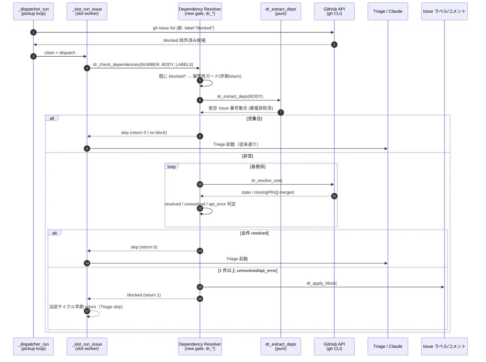

# Design Document

## Overview

**Purpose**: 本機能は idd-claude harness の PM phase（Triage 段階）で Issue 本文に記された
前提依存（`Depends on: #N` / `前提依存: #N` / `Blocked by: #N`）を機械的に検証し、依存先 Issue が
未 merge のままの場合は新規追加ラベル `blocked` を付与して auto-dev pickup を抑止する能力を
idd-claude 運用者に提供する。これにより、依存解消待ちで Developer が halt したり Reviewer が
未完成成果物を reject するムダな再実行コスト（1 Issue あたり数十ドル規模で観測）を未然に
回避できる。

**Users**: idd-claude を self-hosting で運用する開発者・consumer repo の運用者が、Issue を
起票するワークフローで利用する。新規 Issue を `auto-dev` で開く際、Issue 本文に依存記法を
書いておけば自動でブロック判定される。検出パターンを書かない既存 Issue は従来通り処理される
（後方互換）。

**Impact**: 現状の `_slot_run_issue`（Triage 段階）と `_dispatcher_run`（pickup 段階）は
Issue 本文の前提依存を無視しているため依存未解決の Issue がそのまま Developer に渡る。本機能は
(1) Triage 直前に依存抽出 → merge 状態判定 → `blocked` 付与 を 1 関数として挟み、
(2) `_dispatcher_run` の `--search` クエリに `-label:"blocked"` を追加し、
(3) `.github/scripts/idd-claude-labels.sh` 両系統に `blocked` 定義を追加することで、
既存挙動を一切壊さずに依存解決前の Issue を pickup から外す。

### Goals

- PM phase 起動直後に Issue 本文の依存記法（canonical + alias）を機械抽出する
- 各依存先 Issue の `state` と「Issue を close した PR の merged 状態」を GitHub API から
  確認し、未解決依存が 1 件でもあれば `blocked` ラベルを付与 + エスカレーションコメント
  1 件投稿 + claim 系ラベル除去で人間判断へ委ねる
- watcher dispatcher の `gh issue list --search` 除外クエリに `blocked` を加えて、ブロック中
  Issue を auto-dev pickup 候補から外す
- `.github/scripts/idd-claude-labels.sh` の self-hosting / consumer 両系統に `blocked` ラベル
  定義を追加して標準ラベルセットの一部として配布する
- README.md / QUICK-HOWTO.md のラベル一覧・ラベル状態遷移節に `blocked` を追記し、運用手順
  （依存解消 → `blocked` 手動除去 → 次サイクル再評価）を明文化する

### Non-Goals

- 依存先 Issue が後に merge されたタイミングでの `blocked` 自動除去（auto-unblock）。本 Issue
  では手動除去のみ
- 循環依存検出（A が B に依存し B が A に依存するケース）。未解決が 1 件でもあれば block 扱い
  で済ませ、循環は判定しない
- 既に in-flight（`claude-claimed` / `claude-picked-up` 等付与済み）Issue への遡及的依存
  チェック（retrofit しない）
- `Parent:` / `Sibling:` / `Related:` / `Split from:` 等、`Depends on:` 以外の関係種別への
  ブロッキング判定（`.claude/rules/issue-dependency.md` のブロッキング性定義に従う）
- `Blocks: #N` の逆方向記法に基づく被ブロッキング側の自動検出
- クロスリポジトリ参照（`owner/repo#N`）への対応。同一リポジトリ内 `#N` のみ
- `needs-decisions` への統合・移行・廃止
- 依存解決状況の可視化ダッシュボード・依存グラフ生成
- Feature flag の opt-in 化（既存 idd-claude `CLAUDE.md` の Feature Flag Protocol は opt-out
  であり、本機能は標準有効として配布する）

## Architecture Pattern & Boundary Map

**Architecture Integration**:

- 採用パターン: 既存の **per-stage label-driven state machine** に新規 stage（Dependency
  Resolver Stage）を挿入する形を採用。Triage 起動直前にゲートとして配置し、ブロック時は
  Triage を起動せず early-return する（ムダな Claude 呼び出しを発生させない）
- ドメイン／機能境界: 「依存抽出（純粋関数）」「merge 状態判定（gh API ラッパ）」「ブロック
  処理（ラベル付与 + コメント投稿）」「dispatcher pickup フィルタ」「labels.sh 配布」の
  5 つを独立した責務として分離し、shellcheck で個別に静的解析可能にする
- 既存パターンの維持: `_slug_mismatch_escalate` と同じ「`claude-claimed` 除去 + エスカレーション
  ラベル付与 + コメント 1 件投稿」のパターンを踏襲。dispatcher の `--search` 除外リスト拡張は
  既存パターン（`-label:"$LABEL_NEEDS_DECISIONS" -label:"..."` の連結）を流用
- 新規コンポーネントの根拠: 「Issue 本文パース」「GitHub API での Issue/PR 状態確認」は
  watcher 既存責務に存在しないため、純粋関数 + gh ラッパとして新規に追加する必要がある



## Technology Stack

| Layer | Choice / Version | Role in Feature | Notes |
|-------|------------------|-----------------|-------|
| Scripting | bash 4+ (`set -euo pipefail`) | 全体実装 | 既存 `issue-watcher.sh` に inline 関数として追加（外部 helper 化はしない: install.sh 配布パス追加を避けるため） |
| Issue 本文パース | `grep -E` / `sed -E` / `tr` / `sort -u` | 依存記法抽出（純粋関数） | regex は POSIX 互換 ERE。日本語 alias `前提依存:` は ASCII バイト列としてマッチ（UTF-8 そのまま `grep -E` で安全） |
| GitHub API | `gh issue view --json state,closedByPullRequestsReferences` | 各依存 Issue の state / merge 済 PR 取得 | `closedByPullRequestsReferences` フィールドが `merged` boolean を含む。`gh` の `--json` で 1 リクエスト/Issue |
| JSON 加工 | `jq` | gh JSON 出力の構造化判定 | watcher 全体で既に依存しているため新規依存なし |
| ラベル付与 | `gh issue edit --add-label / --remove-label` | `blocked` 付与 + `claude-claimed` 除去 | 単一 PATCH で原子的に発行（既存 `_slug_mismatch_escalate` と同パターン） |
| ラベル配布 | `.github/scripts/idd-claude-labels.sh` の `LABELS` 配列 | `blocked` 定義の追加（self-hosting + consumer 双系統） | description prefix `【Issue 用】`（self-hosting 側のみ）/ consumer 側は既存規約に追従 |
| ドキュメント | markdown | README.md / QUICK-HOWTO.md / `repo-template/CLAUDE.md` 周辺の手作業更新 | ラベル一覧・状態遷移節への追記 |

## File Structure Plan

### Modified Files

```
local-watcher/bin/
└── issue-watcher.sh          # （1) LABEL_BLOCKED 定数追加
                              # （2) _dispatcher_run の `--search` 除外に -label:"$LABEL_BLOCKED" 追加
                              # （3) 新規関数群 dr_* を `_slot_run_issue` 起動前後に追加
                              # （4) _slot_run_issue の Triage 起動直前で dr_check_dependencies を呼ぶ

.github/scripts/
└── idd-claude-labels.sh      # LABELS 配列に "blocked|<color>|【Issue 用】..." を追加
                              # （self-hosting 用）

repo-template/.github/scripts/
└── idd-claude-labels.sh      # LABELS 配列に "blocked|<color>|..." を追加
                              # （consumer 配布用、既存 description 規約に追従し prefix なし）

README.md                     # 該当箇所:
                              #  - Step 2 「作成されるラベル」表に blocked 行を追加
                              #  - Step 2 「手動で作成する場合」に gh label create 行を追加
                              #  - 「ラベル状態遷移まとめ」表に blocked 行を追加
                              #  - 状態遷移図のテキスト図に blocked 分岐を追加
                              #  - ポーリングクエリ例の説明文に blocked 注記を追加
                              #  - 「needs-decisions と blocked の意味的差分」1〜2 行を追加

QUICK-HOWTO.md                # 「作成されるラベル」インライン列挙に blocked を追記
```

### Files NOT Modified

- `install.sh` / `setup.sh` — `idd-claude-labels.sh` の配置パス（`.github/scripts/`）は据え置き
  のため変更不要
- `local-watcher/bin/triage-prompt.tmpl` — 依存チェックは Triage 起動前のゲートとして実装する
  ため、Triage プロンプトには触らない
- `.github/workflows/issue-to-pr.yml` — Actions 経路は本 Issue では out of scope
  （Triage ロジックの inline 注入は将来課題）

### 新規関数の `issue-watcher.sh` 内配置先

すべて inline 関数として `_slot_run_issue` の直前ブロック（既存 `_slug_mismatch_escalate`
近傍）に集約配置する。helper スクリプト化はしない（理由: `install.sh` の配布対象拡張を
避けるため／後方互換性の観点で既存 `~/bin/issue-watcher.sh` 単体構成を維持するため）。

```
issue-watcher.sh 内の配置（追加箇所のみ）:
  # ━━━━━━━━━━━━━━━━━━━━━━━━━━━━━━━━━━━━
  # Config 節
  # ━━━━━━━━━━━━━━━━━━━━━━━━━━━━━━━━━━━━
  LABEL_BLOCKED="blocked"                          # ← 追加

  # ─── Dependency Resolver (#146) ───
  dr_log() / dr_warn() / dr_error()                # 既存 mq_log 系と同書式
  dr_extract_deps()                                # 純粋関数（gh 呼ばず）
  dr_resolve_one()                                 # gh issue view ラッパ
  dr_format_unresolved_comment()                   # コメント本文組立て
  dr_apply_block()                                 # ラベル付与 + コメント投稿
  dr_check_dependencies()                          # 上記を組み合わせる orchestrator
  # ↑ _slot_run_issue より上に配置

  _dispatcher_run():
    issues=$(gh issue list ... \
      --search "-label:\"$LABEL_NEEDS_DECISIONS\" ... -label:\"$LABEL_BLOCKED\" ...")   # ← 追加

  _slot_run_issue():
    ... Triage 起動直前で:
    if ! dr_check_dependencies "$NUMBER" "$BODY" "$LABELS"; then
      return 0                                     # ← blocked 早期 return（claim 系ラベルは
                                                   #   dr_apply_block 内で claude-claimed 除去済み）
    fi
    ... Triage 続行 ...
```

## Requirements Traceability

| Requirement | Summary | Components | Interfaces | Flows |
|---|---|---|---|---|
| 1.1 | canonical `Depends on:` の抽出 | dr_extract_deps | 純粋関数: BODY → 番号集合 | Sequence step 5 |
| 1.2 | alias `前提依存:` の抽出 | dr_extract_deps | 同上、regex 列に日本語 alias を加える | Sequence step 5 |
| 1.3 | alias `Blocked by:` の抽出 | dr_extract_deps | 同上 | Sequence step 5 |
| 1.4 | スペース / カンマ区切り複数値の抽出 | dr_extract_deps | regex で行抽出 → `grep -oE '#[0-9]+'` で番号列展開 | Sequence step 5 |
| 1.5 | 重複排除した一意集合 | dr_extract_deps | `sort -u` で uniq 化 | Sequence step 5 |
| 1.6 | 検出ゼロ時の skip | dr_check_dependencies | 空集合判定 → 早期 return 0 | Sequence step 6 (alt 空集合) |
| 1.7 | issue-dependency.md との整合 | dr_extract_deps | 同 rule に列挙された canonical + alias 3 種を実装 | — |
| 2.1 | state + closing PR merged の取得 | dr_resolve_one | `gh issue view --json state,closedByPullRequestsReferences` | Sequence step 8 |
| 2.2 | closed + closing PR merged = 解決済み | dr_resolve_one | `jq` で `.closedByPullRequestsReferences[] \| .merged` を OR 評価 | Sequence step 9 |
| 2.3 | open = 未解決 | dr_resolve_one | state 判定 | Sequence step 9 |
| 2.4 | closed unmerged = 未解決 | dr_resolve_one | merged PR ゼロ時の判定 | Sequence step 9 |
| 2.5 | API エラー = 未解決として扱う | dr_resolve_one | gh 非ゼロ exit / jq parse fail → `api_error` 返却 | Error Handling 節 / NFR 4.2 |
| 2.6 | 1 件でも未解決ならブロック確定 | dr_check_dependencies | 集約判定 | Sequence step 11 |
| 3.1 | `blocked` ラベル付与 | dr_apply_block | `gh issue edit --add-label blocked` | Sequence step 11 |
| 3.2 | エスカレーションコメント 1 件投稿 | dr_apply_block + dr_format_unresolved_comment | `gh issue comment --body` | Sequence step 11 |
| 3.3 | claim 系ラベル除去 | dr_apply_block | `--remove-label claude-claimed`（同 PATCH） | Sequence step 11 |
| 3.4 | 既に blocked なら冪等 skip | dr_check_dependencies | LABELS に `blocked` が含まれていれば早期 return 1（ラベル再付与・コメント再投稿しない） | Sequence step 4 |
| 3.5 | 後続 Developer / Architect 起動を skip | _slot_run_issue | dr_check_dependencies 非 0 で return 0 | Sequence step 12 |
| 3.6 | コメント本文に #N + 判定区分 | dr_format_unresolved_comment | 行ごとに `#N (open)` / `#N (closed unmerged)` / `#N (api error)` を列挙 | Data Models 節 |
| 4.1 | dispatcher pickup から `blocked` を除外 | _dispatcher_run の --search | `-label:"$LABEL_BLOCKED"` を既存除外リストに追加 | Sequence step 1 |
| 4.2 | 手動除去で次サイクル再評価 | _dispatcher_run | ラベル除去で gh issue list の結果に再登場 → 通常の claim フローに合流 | — |
| 4.3 | 既存除外ラベルの意味・挙動は不変 | _dispatcher_run | 既存リスト要素は順序・値とも変更なし | NFR 1.3 |
| 5.1 | 検出ゼロ時の skip | dr_check_dependencies | 空集合早期 return | Sequence step 6 |
| 5.2 | 検出ゼロ時はラベル/コメント無し | dr_check_dependencies | 早期 return で副作用ゼロ | NFR 1.1 |
| 5.3 | 検出ゼロ時の追加処理は本文 parse 1 回のみ | dr_extract_deps | gh API 呼び出しなしで完了（NFR 4.1 にも対応） | — |
| 6.1 | 構造化ログ出力 | dr_check_dependencies | 1 Issue 1 行の構造化ログ（NFR 2.1） | Data Models 節 |
| 6.2 | API 失敗時の理由ログ | dr_resolve_one | gh stderr / jq エラー内容を dr_warn で記録 | Error Handling 節 |
| 6.3 | LOG_DIR 配下に出力 | dr_log | 既存 dispatcher_log / slot_log と同じ tee 経路に乗せる | NFR 2.2 |
| 7.1 | 一括ラベル作成スクリプトで blocked を作成 | idd-claude-labels.sh | LABELS 配列に追加 | — |
| 7.2 | description に意味を含める | idd-claude-labels.sh | `【Issue 用】 依存 Issue 未 merge により auto-dev 進行不能` | — |
| 7.3 | description prefix `【Issue 用】` | idd-claude-labels.sh | 既存規約に整合（self-hosting 側） | — |
| 7.4 | 既存 + force なし = skip | idd-claude-labels.sh | 既存ロジックがそのまま発火 | — |
| 7.5 | 既存 + force = 上書き更新 | idd-claude-labels.sh | 既存ロジックがそのまま発火 | — |
| 7.6 | self-hosting 用 + consumer 用の両系統に追加 | idd-claude-labels.sh × 2 | 2 ファイル両方に同名同 description を追加 | — |
| 8.1 | README ラベル一覧に blocked 追記 | README.md | Step 2 「作成されるラベル」表に行追加 | — |
| 8.2 | README 状態遷移節で pickup 除外を記述 | README.md | 「ラベル状態遷移まとめ」表 + テキスト図 + ポーリングクエリ注記 | — |
| 8.3 | README 運用フローで依存記法を説明 | README.md | 状態遷移節 or 新規節で canonical / alias を説明 | — |
| 8.4 | README 解消手順を明示 | README.md | merge → blocked 手動除去 → 次 cron tick で再評価 | — |
| 8.5 | needs-decisions と blocked の意味的差分 | README.md | 1〜2 行で差分明示 | — |
| 8.6 | QUICK-HOWTO のラベル列挙にも追記 | QUICK-HOWTO.md | 「作成されるラベル: …」インライン列挙に追記 | — |
| 9.1 | blocked 付与時に needs-decisions を付与しない | dr_apply_block | コードで `--add-label "$LABEL_BLOCKED"` のみ（needs-decisions に触れない） | — |
| 9.2 | エスカレーションコメントが needs-decisions テンプレと混在しない | dr_format_unresolved_comment | 専用 markdown テンプレ（依存未解決専用文面） | — |
| 9.3 | dispatcher は blocked / needs-decisions の双方を除外、状態遷移は独立 | _dispatcher_run | `-label:"blocked"` を新規追加し `-label:"needs-decisions"` と並列指定。除去フローは別ラベル別操作 | — |
| 9.4 | README が両ラベルを別ラベルとして列挙 + 統合しない方針 | README.md | 8.5 と同じ追記箇所 | — |
| NFR 1.1 | 検出ゼロ時に既存挙動と完全一致 | dr_check_dependencies | gh API 呼び出しゼロ・ラベル変更ゼロ・コメント投稿ゼロ | — |
| NFR 1.2 | 既存ラベル定義の名前・色・description 不変 | idd-claude-labels.sh | LABELS 配列は追加のみ、既存行は触らない | — |
| NFR 1.3 | dispatcher 既存除外条件の意味・挙動不変 | _dispatcher_run | 既存 `-label:"..."` リストの順序・値を維持 | — |
| NFR 1.4 | コードフェンス内・引用ブロックでの誤検出は運用許容 | dr_extract_deps | 厳密 markdown context 解析は実装しない（誤検出時は人間が手動除去で復旧） | Risk 節 |
| NFR 2.1 | 構造化ログで grep 可能 | dr_check_dependencies | `dr: issue=#N extracted=N1,N2 resolved=A unresolved=B verdict=blocked` 形式 | — |
| NFR 2.2 | LOG_DIR 配下に記録 | dr_log | 既存 stdout/tee 経路に dr: prefix で乗せる | — |
| NFR 3.1 | N 回再実行で blocked / コメント数 1 に収束 | dr_check_dependencies | LABELS チェックで再付与スキップ | — |
| NFR 3.2 | labels.sh の再実行冪等性 | idd-claude-labels.sh | 既存ロジックが既に冪等 | — |
| NFR 4.1 | Triage 時間に対して支配的にならない | dr_resolve_one | 1 依存 = 1 gh issue view（数秒）× 通常 1〜3 件 = cron tick (2 分) 内で完了 | — |
| NFR 4.2 | rate limit 抵触時は安全側 = blocked 扱い | dr_resolve_one + dr_check_dependencies | gh エラー → `api_error` → unresolved 集合に積む → block 確定 | Error Handling 節 |

## Components and Interfaces

### Dependency Resolver Stage（新規）

#### dr_extract_deps（純粋関数 / Pure Function）

| Field | Detail |
|---|---|
| Intent | Issue 本文文字列から依存先 Issue 番号の一意集合を抽出する純粋関数 |
| Requirements | 1.1, 1.2, 1.3, 1.4, 1.5, 1.7, NFR 1.4 |

**Responsibilities & Constraints**

- 入力本文に対して以下 3 つの記法を検出する:
  - canonical: `Depends on: ...`（行頭は `- ` などの list prefix を含んでよい）
  - alias 日本語: `前提依存: ...`
  - alias 英語慣習: `Blocked by: ...`
- 各行から `#[0-9]+` パターンの番号を全列挙し、`sort -u` で重複排除
- gh API 呼び出しは行わない（純粋関数）
- markdown コードフェンス・引用ブロック内の誤検出は本機能のスコープ外（NFR 1.4 で運用者が
  手動除去で復旧する設計）

**Dependencies**

- Inbound: dr_check_dependencies（Critical）
- Outbound: なし（純粋関数）
- External: `grep` / `sed` / `tr` / `sort -u`（POSIX 標準）

**Contracts**: Service [x] / API [ ] / Event [ ] / Batch [ ] / State [ ]

##### Service Interface（疑似シグネチャ）

```bash
# Args:
#   $1 = Issue 本文（多行 string、改行入り）
# Stdout: 重複排除済の Issue 番号集合（改行区切り、各行は数字のみ）
# Return: 0（常に）
# 副作用: なし
dr_extract_deps() { ... }
```

- Preconditions: 入力本文は UTF-8。空文字列でもよい
- Postconditions: stdout は数字のみの行を 0 件以上含む。空集合 = 空 stdout
- Invariants: 同一入力に対する出力は決定的（sort -u によるソート順固定）

#### dr_resolve_one（gh API ラッパ）

| Field | Detail |
|---|---|
| Intent | 単一の依存 Issue 番号を入力に取り、merge 状態を 3 値（resolved / unresolved / api_error）で返す |
| Requirements | 2.1, 2.2, 2.3, 2.4, 2.5, NFR 4.2 |

**Responsibilities & Constraints**

- `gh issue view <N> --repo "$REPO" --json state,closedByPullRequestsReferences` を実行
- state == `OPEN` → unresolved（区分文字列 `open`）
- state == `CLOSED` かつ `closedByPullRequestsReferences[].merged` のいずれか true → resolved
- state == `CLOSED` かつ上記が全て false / 空配列 → unresolved（区分文字列 `closed unmerged`）
- gh 非ゼロ exit / jq parse 失敗 → api_error（区分文字列 `api error`）
- timeout は呼び出し元のサイクル全体タイムアウトに従う（個別 timeout は導入しない: 通常は
  数秒で帰る + watcher 全体 timeout で吸収）

**Dependencies**

- Inbound: dr_check_dependencies（Critical）
- Outbound: なし
- External: `gh issue view`（Critical）, `jq`（Critical）

**Contracts**: Service [x] / API [ ] / Event [ ] / Batch [ ] / State [ ]

##### Service Interface

```bash
# Args:
#   $1 = 依存 Issue 番号（数字のみ）
# Stdout: 区分文字列 1 行（"resolved" | "open" | "closed unmerged" | "api error"）
# Return: 0（常に。判定結果は stdout で返す）
# 副作用: dr_warn でログ（API エラー時のみ）
dr_resolve_one() { ... }
```

- Preconditions: 入力 Issue 番号は当該リポジトリ内の数字 ID
- Postconditions: stdout に 4 区分のいずれか 1 行
- Invariants: 同 Issue 番号に対する出力は GitHub 状態に応じて決定的

#### dr_format_unresolved_comment（純粋関数）

| Field | Detail |
|---|---|
| Intent | エスカレーションコメント本文を組み立てる純粋関数 |
| Requirements | 3.2, 3.6, 8.4, 9.2 |

**Responsibilities & Constraints**

- 未解決依存リスト（`#N|区分` の各行）を受け取り、依存未解決専用の markdown 文面を生成
- 「次の手順」セクションに「依存先 Issue を merge → `blocked` を手動除去 → 次 cron tick で
  再評価」を明記（Req 8.4 と整合）
- `needs-decisions` テンプレの文言（「判断を委ねる」「決定事項」等）は使用しない（Req 9.2）

**Contracts**: Service [x] / API [ ] / Event [ ] / Batch [ ] / State [ ]

##### Service Interface

```bash
# Args:
#   $1 = "#N|区分" の改行区切りリスト
# Stdout: markdown 形式のコメント本文（多行）
dr_format_unresolved_comment() { ... }
```

#### dr_apply_block（副作用関数）

| Field | Detail |
|---|---|
| Intent | `blocked` ラベル付与 + claim 系ラベル除去 + エスカレーションコメント投稿を一括で行う |
| Requirements | 3.1, 3.2, 3.3, 6.1, 6.3, 9.1, 9.2 |

**Responsibilities & Constraints**

- 単一の `gh issue edit --remove-label claude-claimed --add-label blocked` で原子的に付け替え
- `gh issue comment` でコメント 1 件投稿（重複投稿は呼び出し元 dr_check_dependencies の冪等性
  ガードで防ぐ / Req 3.4）
- needs-decisions ラベルには触れない（Req 9.1）

**Dependencies**

- Inbound: dr_check_dependencies（Critical）
- Outbound: GitHub API（Critical）
- External: `gh issue edit` / `gh issue comment`（Critical）

##### Service Interface

```bash
# Args:
#   $1 = Issue 番号
#   $2 = 未解決依存リスト（"#N|区分" 改行区切り、dr_format_unresolved_comment 用）
# Return: 0 = 成功 / 非 0 = 一部失敗（処理続行不能ではないので caller は return 1 で skip）
dr_apply_block() { ... }
```

#### dr_check_dependencies（Orchestrator）

| Field | Detail |
|---|---|
| Intent | 依存抽出 → 各依存判定 → ブロック判定 → ラベル付与までの一連を制御する orchestrator |
| Requirements | 1.6, 2.6, 3.4, 3.5, 5.1, 5.2, 5.3, 6.1, NFR 1.1, NFR 3.1, NFR 4.2 |

**Responsibilities & Constraints**

- 冪等性ガード: 入力 LABELS（改行区切り名前列）に `blocked` を含む場合は何もせず return 1
  （= caller は skip、コメント・ラベル再付与なし / Req 3.4）
- dr_extract_deps を呼び、空集合なら return 0（caller は Triage 続行 / Req 1.6, 5.1, 5.2）
- 非空なら各番号で dr_resolve_one を呼び、resolved / unresolved / api_error を集計
- 1 件以上 unresolved / api_error があれば dr_apply_block を呼んで return 1
- 全件 resolved なら return 0
- 構造化ログ 1 行を必ず出力（Req 6.1, NFR 2.1）

**Contracts**: Service [x] / API [ ] / Event [ ] / Batch [ ] / State [x]

##### Service Interface

```bash
# Args:
#   $1 = Issue 番号
#   $2 = Issue 本文
#   $3 = 既存ラベル名一覧（改行区切り、_slot_run_issue の $LABELS と同じ形式）
# Return: 0 = block しない（Triage 続行可）/ 1 = block 確定（Triage skip して slot return 0）
# 副作用: dr_log によるログ出力。ブロック確定時は dr_apply_block を呼ぶ
dr_check_dependencies() { ... }
```

- Preconditions: 入力 Issue 番号は当該リポジトリ内の数字 ID
- Postconditions: return 1 のときは Issue に `blocked` 付与 + コメント 1 件投稿が完了している
  （NFR 3.1 冪等性込み）
- Invariants: 検出ゼロケースで副作用は dr_log の 1 行のみ（NFR 1.1）

### Watcher Dispatcher（既存変更）

#### _dispatcher_run の `gh issue list --search` 拡張

| Field | Detail |
|---|---|
| Intent | `blocked` ラベル付き Issue を pickup 候補から除外する |
| Requirements | 4.1, 4.2, 4.3, NFR 1.3 |

**Responsibilities & Constraints**

- 既存 `--search` 文字列に `-label:"$LABEL_BLOCKED"` を追加するのみ
- 他の除外条件（`needs-decisions` / `awaiting-design-review` 等）の順序・値は変更しない
- LABEL_BLOCKED は Config 節で定義（`LABEL_BLOCKED="blocked"`）

**Dependencies**

- Inbound: cron / launchd（既存）
- Outbound: `gh issue list`（既存）

### Labels Setup Script（既存変更）

#### `.github/scripts/idd-claude-labels.sh`（self-hosting 用）

| Field | Detail |
|---|---|
| Intent | self-hosting 用のラベル一括作成スクリプトに `blocked` を追加する |
| Requirements | 7.1, 7.2, 7.3, 7.4, 7.5, 7.6, NFR 1.2, NFR 3.2 |

**Responsibilities & Constraints**

- 既存 `LABELS=( ... )` 配列の末尾に 1 行追加: `"blocked|<color>|【Issue 用】 依存 Issue 未 merge により auto-dev 進行不能"`
- color は既存 `needs-decisions`（黄系 `f1c40f`）と視認上区別がつく色を選ぶ。本設計では
  **`d73a4a` 系の赤** を採用候補に挙げる（既存 `st-failed` と同色衝突するためグループ
  代替として `b60205`（濃赤）を採用する。仕様上 color の絶対値は規定しないが、運用者の
  視認性を優先する）
- 既存ラベルの色 / description / 順序は一切変更しない（NFR 1.2）

**Dependencies**

- Inbound: install.sh 自動実行 / 運用者の手動実行
- Outbound: `gh label create`

#### `repo-template/.github/scripts/idd-claude-labels.sh`（consumer 用）

| Field | Detail |
|---|---|
| Intent | consumer repo 配布版にも同名 + 同 description で `blocked` を追加する |
| Requirements | 7.6 |

**Responsibilities & Constraints**

- 既存配布版の description prefix 規約に従う。consumer 用 LABELS の既存行を見ると、
  `needs-quota-wait` 以降の追加行のみ `【Issue 用】` prefix を持ち、それ以前の行は prefix なし
  という混在状態。`blocked` は新規追加なので self-hosting と同じ `【Issue 用】 ...` prefix を
  採用して整合性を取る
- name / color は self-hosting 用と完全一致（Req 7.6）

### Documentation（既存変更）

#### README.md

| Field | Detail |
|---|---|
| Intent | 運用者向けに `blocked` の意味・付与契約・解消手順を明示する |
| Requirements | 8.1, 8.2, 8.3, 8.4, 8.5, 9.4 |

**Responsibilities & Constraints**

- Step 2 「作成されるラベル」表（README.md 行 445 周辺）に `blocked` 行を追加
- Step 2 「手動で作成する場合」（行 464 周辺）に `gh label create blocked` 行を追加
- 「ラベル状態遷移まとめ」表（行 881 周辺）に `blocked` 行を追加
- 状態遷移図（行 930 周辺）の `auto-dev (起票)` 分岐に `Dependency Resolver Gate` 経路を追加
- ポーリングクエリ例（行 900 周辺）の説明文に `blocked` を「依存 Issue 未 merge により
  auto-dev 進行不能を示す PM phase 自動付与ラベル」と注記
- `needs-decisions` と `blocked` の意味的差分節を新設または既存節へ 1〜2 行で追記
  （Req 8.5, 9.4）
- 依存記法（canonical + alias 3 種）への参照リンクを `.claude/rules/issue-dependency.md` で
  辿れる旨を運用者向けに記述（Req 8.3）

#### QUICK-HOWTO.md

- 「作成されるラベル」インライン列挙（行 72-74 周辺）に `blocked` を追記（Req 8.6）

## Data Models

### Domain Model

```
DependencyCheckResult
├── issue_number: int            # 対象 Issue 番号
├── extracted_deps: Set[int]     # 抽出された依存先 Issue 番号集合（重複排除済）
├── resolutions: Map[int → Resolution]
│   └── Resolution = enum { resolved, open, closed_unmerged, api_error }
└── verdict: enum { skip_no_deps, all_resolved, blocked }
```

**判定マトリックス**:

| extracted_deps | resolutions | verdict | 副作用 |
|---|---|---|---|
| 空集合 | — | `skip_no_deps` | dr_log 1 行のみ（Req 6.1） |
| 非空 + 全件 resolved | 全 resolved | `all_resolved` | dr_log 1 行 |
| 非空 + 1 件以上 open/closed_unmerged/api_error | 混在 | `blocked` | dr_log 1 行 + dr_apply_block 実行（Req 3.1〜3.3, 9.1） |

### Log Schema（NFR 2.1）

1 Issue 1 行の構造化ログ（grep で集計可能）:

```
[<timestamp>] dr: issue=#<N> extracted=<n1,n2,...> resolved=<a,b> unresolved=<c (open),d (closed_unmerged)> api_errors=<e> verdict=<blocked|all_resolved|skip_no_deps>
```

例（block 確定時）:
```
[2026-05-22 10:23:45] dr: issue=#200 extracted=#100,#150 resolved=#100 unresolved=#150 (open) api_errors= verdict=blocked
```

例（依存記法非搭載）:
```
[2026-05-22 10:23:46] dr: issue=#201 extracted= verdict=skip_no_deps
```

### Escalation Comment Template（Req 3.2, 3.6, 8.4, 9.2）

```markdown
🛑 依存 Issue 未 merge のため自動処理を中止しました。

### 未解決依存

- #<N1> (open)
- #<N2> (closed unmerged)
- #<N3> (api error)

### 次の手順

1. 上記依存 Issue の解消（merge）を進めてください
2. すべて merge 済みになったら、本 Issue から `blocked` ラベルを手動で除去してください
3. 次回 cron tick (`watcher 起動` 後) で依存チェックが再実行され、解消済みなら通常の
   Triage / 実装フローに合流します

### `blocked` と `needs-decisions` の使い分け

本ラベルは **依存 Issue 未 merge 専用** です。それ以外の人間判断要求（Triage の判断不能 /
スラグ衝突等）は従来通り `needs-decisions` が付与されます。両ラベルは独立した状態遷移を
持ちます（[README.md ラベル状態遷移まとめ](...) 参照）。
```

## Error Handling

### Error Strategy

- **依存抽出（純粋関数）**: 入力本文が空・記法非存在の場合は空集合を返して return 0。
  例外を生成しない
- **gh API 呼び出し（dr_resolve_one）**: 非ゼロ exit / jq parse 失敗 / timeout のすべてを
  `api_error` 区分にマップ → 安全側として未解決扱い（NFR 4.2）。dr_warn でログ
- **ラベル付与（dr_apply_block）**: `gh issue edit` 失敗は warn のみで処理続行（既存
  `_slug_mismatch_escalate` と同じく `|| true` で吸収しない代わりに、失敗時は dr_warn を
  発射した上で return 1 を返して呼び出し元 slot を `_slot_mark_failed` 経由で
  `claude-failed` 化させる）

### Error Categories and Responses

- **User Errors (Issue 本文の記法ミス)**: 番号の typo（`#abc`）・`#0`・存在しない Issue
  番号などは `gh issue view` が non-zero で失敗 → `api_error` 区分。Issue は安全側で
  `blocked` 扱いになり、運用者がコメントを見て本文修正 + ラベル手動除去で復旧
- **System Errors (5xx / rate limit / timeout)**: NFR 4.2 に従い `api_error` → `blocked`
  扱い（誤 pickup 防止）。dr_warn で原因を LOG 出力（Req 6.2）
- **Business Logic Errors (依存解消未済)**: 未解決依存は `blocked` 付与 +
  エスカレーションコメント。状態遷移は手動除去のみ（auto-unblock は out of scope）

### 削除済み Issue / 無効な番号への対処

- `gh issue view #N` が 404 を返す → `api_error` 区分 → 安全側で blocked 扱い
- コメント本文には判定区分が `api error` として表示されるため、運用者は番号 typo か削除済み
  かを Issue ページで判別可能

## Testing Strategy

### Unit Tests（純粋関数を中心に、bash の test harness 不要のスモークで実施）

1. `dr_extract_deps` の canonical 抽出: `Depends on: #12 #34` → `12\n34`
2. `dr_extract_deps` の alias 抽出: `前提依存: #100` → `100`、`Blocked by: #200` → `200`
3. `dr_extract_deps` の重複排除: `Depends on: #1\nBlocked by: #1 #2` → `1\n2`
4. `dr_extract_deps` の空入力 / 記法非存在: 空 stdout
5. `dr_resolve_one` の 4 区分判定: open / closed+merged / closed+unmerged / api_error の
   それぞれをモック JSON 入力で検証（fixture JSON を `--json` 出力差し替えで擬似テスト）

### Integration Tests（手動スモークテスト、CLAUDE.md「テスト・検証」節と整合）

1. **shellcheck**: `shellcheck local-watcher/bin/issue-watcher.sh
   .github/scripts/idd-claude-labels.sh repo-template/.github/scripts/idd-claude-labels.sh`
   が警告ゼロ
2. **dry run（依存非搭載 Issue）**: `auto-dev` 付き + 依存記法なしの test Issue を立て、
   `REPO=owner/test REPO_DIR=/tmp/test-repo $HOME/bin/issue-watcher.sh` で従来通り Triage に
   進むこと（NFR 1.1）
3. **dry run（依存解決済み Issue）**: 依存先 Issue を merge 済み状態にして本 Issue が
   blocked にならず Triage 通過すること
4. **dry run（依存未解決 Issue）**: open な依存 Issue を本文に書いて本 Issue が `blocked`
   付与 + コメント 1 件 + Triage skip となること
5. **冪等性**: 上記 4 の状態で再度 watcher を走らせて、`blocked` 付き Issue が pickup 候補に
   現れず（NFR 3.1）コメント数が 1 のまま増えないこと

### E2E / dogfooding（CLAUDE.md「dogfooding」節に従う）

1. idd-claude 自身に test issue を立て、`Depends on: #9999` を書いて watcher で blocked
   遷移を確認
2. test issue から `blocked` ラベル手動除去 → 次 cron tick で再評価され通常 pickup されること
3. `bash .github/scripts/idd-claude-labels.sh` を idd-claude repo で再実行し、`blocked`
   ラベルが冪等に作成 / skip / `--force` で更新できること
4. `repo-template/.github/scripts/idd-claude-labels.sh` を `/tmp/scratch` repo で実行して
   consumer 配布側でも `blocked` が作成できること

### Performance / Load（NFR 4.1）

- 依存数 1〜3 件の通常運用で `dr_check_dependencies` は 1〜数秒（gh issue view が 1 回数百ms）
- 依存数 10 件以上の極端なケースでも 1 cron tick (デフォルト 2 分) 内で完了
- 検出パターン非存在時は gh API 呼び出しゼロ（NFR 4.1 / Req 5.3）

## Security Considerations

- 依存先 Issue 番号は public な GitHub データのみを参照（特殊な権限不要）
- `gh issue view` は `gh auth login` の既存認証情報を流用するため、本機能で新規 secret は
  発生しない
- Issue 本文の依存記法は public な markdown 表現であり、機密情報は含まれない
- エスカレーションコメントは Issue 本文と同等の可視性（auto-dev 用途で運用される public /
  private リポジトリの既存閲覧権限と整合）

## Performance & Scalability

- 1 Issue あたり最大 N+1 回の gh API 呼び出し（N = 依存先 Issue 数）。通常 1〜3 回
- rate limit ヒット時は `api_error` → 安全側 blocked 扱いで誤 pickup 防止（NFR 4.2）
- 依存数の上限は設けない（実運用で 10 件超は想定されないため）。10 件超の極端ケースでは
  cron tick 内で完了しない可能性はあるが、その場合も timeout で安全側に倒れる
