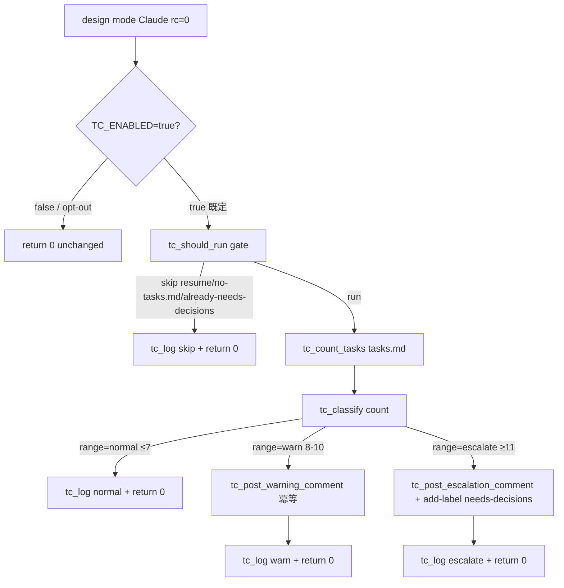
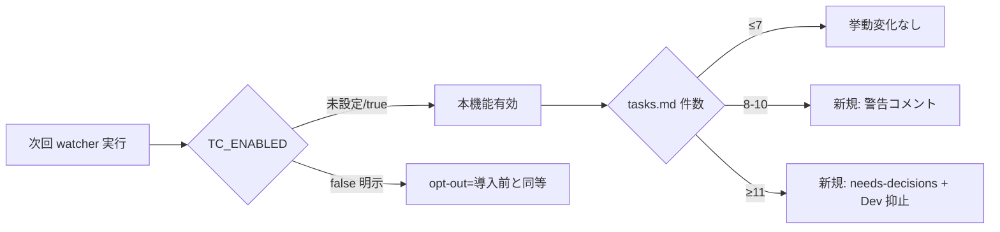

# Design Document

## Overview

**Purpose**: 設計フェーズ（design モード）完了直後・Developer pickup 前の **harness 側ガード** として、
`tasks.md` のタスク件数を機械的にカウントし、件数レンジに応じて 3 段階の運用判定（通常 / 警告 /
抑止）を `local-watcher/bin/issue-watcher.sh` から発火させる。本機能は Issue #131 の Architect 側
内部ガード（design.md の `## Split Proposal` セクション生成）を置き換えるものではなく、
ハーネス側で独立かつ重畳に作用する追加レイヤとして導入し、Architect レビューが緩く通過したり
人間レビュー前に Developer に拾われたりするケースの最終防衛線とする。

**Users**: idd-claude self-hosting および consumer repo（KeyNest 等）の運用者・watcher 利用者。
判定結果はログと Issue コメントで観測でき、過大 Issue の自動着手を未然に防ぐことで turn budget
超過事故と無駄なキャッシュトークン消費を削減する。

**Impact**: 現在の design モードは Architect が `tasks.md` を確定し PjM が設計 PR を作成して終了する
（`awaiting-design-review` 付与）が、件数チェックなしに次サイクルで `impl-resume` に進行する。
本機能導入後は **設計 Claude 実行の rc=0 直後** に harness が tasks.md を再カウントし、
8〜10 件で警告コメントを 1 件投稿、11 件以上で `needs-decisions` ラベル + エスカレーション
コメント投稿 + Developer 自動起動の抑止を行う。7 件以下のケースでは挙動は変化しない（NFR 2 / Req 4.1）。

### Goals

- Architect 完了直後の `tasks.md` 件数を harness で再カウントし、Developer pickup 前にゲートを設ける
- 8〜10 件で運用者警告、11 件以上で人間判断要請による Developer 自動起動抑止を実現する
- 既存の env var / ラベル遷移契約 / cron 起動文字列を破壊しない（後方互換性 NFR 2）
- 既存 Issue #131 / `_resume_*` / Stage Checkpoint Resume と冪等に共存する
- 観測可能性: `tasks-count:` prefix ログ・固定識別文字列付き Issue コメントで grep 可能にする

### Non-Goals

- 既に main に merge 済みの過去 Issue / 過去 `tasks.md` への遡及適用（retrofit）
- 動的閾値（タスク件数の閾値を repo 別・期間別に自動チューニング）
- 内容ベース gating（タスク難易度・diff 規模推定・依存 Issue 推定等による事前判定）
- Developer 側の turn budget そのもの（`DEV_MAX_TURNS`）の動的緩和
- Architect / Developer / Reviewer 等 watcher 以外のエージェント本体の変更
- Issue #131 の Architect 側 budget overflow 検知ロジック（`## Split Proposal` 生成）の置換・改修

## Architecture

### Existing Architecture Analysis

**現在のアーキテクチャパターン**:

- `local-watcher/bin/issue-watcher.sh` は **単一 bash スクリプト** で、関数 prefix（`pi_*` /
  `mq_*` / `pp_*` / `drr_*` / `sav_*` / `sc_*` / `pt_*` / `qa_*` 等）でドメイン境界を表現する
- design モードのフロー（`_slot_run_issue` 内の `if [ "$MODE" = "design" ]` 分岐、行 10001–10106）
  は、PM → Architect → PjM をひとつの Claude 実行（`qa_run_claude_stage "design" ...`）で完結し、
  rc=0 で `awaiting-design-review` 付与済みを前提に return 0 する
- ラベル遷移契約（auto-dev → claude-claimed → awaiting-design-review / claude-picked-up /
  needs-decisions / ready-for-review / claude-failed）は NFR 2.2 で改変禁止
- `pt_extract_pending_tasks`（行 5787–5799）が `^- \[ \] [0-9]+(\.[0-9]+)*\.? ` という近い regex で
  未完了タスクを抽出している既存実装あり（本機能では完了済みも含む広い regex を使うため別関数）
- Issue #131 の Architect 側 budget overflow check は **count regex `^- \[ \]\*? [0-9]+\. `**
  （最上位タスクのみ）で実装され、`docs/specs/131-*/test-count.sh` に fixture 駆動テストがある

**尊重すべきドメイン境界**:

- 既存関数 prefix 規約に従い、本機能は **`tc_*`**（"tasks-count"）prefix で 1 ドメインを形成する
- `_slot_run_issue` 本体には極小の呼び出し点のみを差し込み、判定ロジックは `tc_*` ドメインに閉じる
- ラベル操作（`gh issue edit --add-label`）は既存パターン（`_slot_mark_failed` / `drr_*`）と
  同形式の冪等処理に統一する
- 設計・実装が完了した時点で生成された tasks.md はワークツリー上の `$REPO_DIR/$SPEC_DIR_REL/tasks.md`
  にあり、`stage_a_verify_extract_command` / `pt_extract_pending_tasks` と同じパス解決規約を踏襲する

**維持すべき統合点**:

- `qa_run_claude_stage` の rc=0/99/non-zero 三分岐（本機能は rc=0 ブランチに割り込む）
- `awaiting-design-review` ラベルは PjM がすでに付与済み（本機能はその上に重畳）
- `needs-decisions` ラベルの既存意味（PM / #131 由来）を破壊せず、コメント本文の固定識別
  文字列（NFR 1.2）で本機能由来を判別可能にする

**解消・回避する technical debt**:

- なし（本機能は既存ロジックを書き換えず、純粋な追加レイヤ）

### Architecture Pattern & Boundary Map



**Architecture Integration**:

- **採用パターン**: 既存 `_slot_run_issue` design ブランチ内に **post-stage hook** を挿入する
  単方向データフロー。`tc_*` ドメインは入出力副作用（ファイル read / gh issue edit / gh issue
  comment / LOG 書き込み）を関数境界で閉じる
- **ドメイン／機能境界**:
  - `tc_*` 関数群 = 本機能ロジック（count / classify / log / comment / label）
  - `_slot_run_issue` design 分岐 = 呼び出し点（1 関数 `tc_run_post_architect_check` を呼び出すのみ）
  - 既存 `qa_*` / `drr_*` / `pi_*` 等 = 不変
- **既存パターンの維持**:
  - 関数 prefix 規約（`tc_*` 新設）
  - `${VAR:-default}` による env var override
  - `gh issue edit` / `gh issue comment` の `2>/dev/null || true` 冪等パターン
  - LOG prefix `tasks-count:` で grep 抽出可能（既存 `stage-checkpoint:` / `design-review-release:` と同形式）
- **新規コンポーネントの根拠**:
  - `tc_*` は #131 と count regex を共有しないため（#131 は最上位のみ、本機能は子・deferrable も含む
    flat カウント）独立関数を新設する
  - 既存 `pt_extract_pending_tasks` は **未完了のみ**（`- [ ] ` のみ）を抽出し、本機能の
    完了済みも含む広い regex（`- [ ]` / `- [x]` / `- [ ]*` / `- [x]*`）とは要件が異なる（Req 1.2）

### Technology Stack

| Layer | Choice / Version | Role in Feature | Notes |
|-------|------------------|-----------------|-------|
| Frontend / CLI | — | — | 該当なし |
| Backend / Services | bash 4+ (POSIX 互換、Linux / macOS / WSL) | `tc_*` 関数群の実装言語 | `set -euo pipefail` 既定、grep -cE で件数取得 |
| Data / Storage | `$REPO_DIR/$SPEC_DIR_REL/tasks.md`（既存ファイル） | カウント対象 | 既存パス解決規約を踏襲 |
| Messaging / Events | `gh issue comment` / `gh issue edit --add-label` | Issue 上の判定結果・人間エスカレーション | 既存パターンを踏襲（冪等） |
| Infrastructure / Runtime | cron / launchd（既存）+ flock（既存） | 同時実行制御 | 変更なし |

## File Structure Plan

### Modified Files

- `local-watcher/bin/issue-watcher.sh` — 以下を **既存ファイル末尾近く・関数定義ブロックの慣習に
  従う位置に追加**:
  - Config ブロック（行 269 付近、`STAGE_A_VERIFY_*` 群の近く）に新規 env var 4 件:
    - `TC_ENABLED` — 本機能の有効化フラグ（既定 `true`）
    - `TC_WARN_LOWER` — 警告レンジ下限件数（既定 `8`）
    - `TC_WARN_UPPER` — 警告レンジ上限件数（既定 `10`）
    - `TC_ESCALATE_LOWER` — エスカレーション下限件数（既定 `11`）
  - 新規関数群（既存 `sav_*` / `sc_*` ブロックと同じ慣習で h2 コメントヘッダ付き）:
    - `tc_log` / `tc_warn` / `tc_error` — `tasks-count: $*` prefix ログ
    - `tc_should_run` — gate（既存 needs-decisions 重複検知 / tasks.md 不在検知 / TC_ENABLED 検査）
    - `tc_count_tasks <tasks_md_path>` — Req 1.1〜1.4 の count 抽出 regex を適用
    - `tc_classify <count>` — Req 2.1〜2.3 の閾値に対応する 3 値（`normal` / `warn` / `escalate`）を返す
    - `tc_already_posted_marker_present <issue_number> <kind>` — 既存コメント内の冪等マーカー検知
    - `tc_post_warning_comment <issue_number> <count>` — Req 2.2 の警告コメント投稿
    - `tc_post_escalation_comment <issue_number> <count>` — Req 2.3 / 2.5 / NFR 1.2 のエスカレーション
      コメント投稿（固定識別文字列 `<!-- idd-claude:tasks-count-overflow ... -->` 含む）
    - `tc_add_needs_decisions_label <issue_number>` — Req 2.3 / 2.6 / 4.4 のラベル付与（重複 add 不要）
    - `tc_run_post_architect_check` — design 分岐 rc=0 の単一エントリポイント（上記関数の orchestrator）
  - design 分岐内 rc=0 case（現行行 10086–10091 相当）に **`tc_run_post_architect_check` 呼び出し** を
    追加（1 行差し込み、戻り値は無視。本機能内で副作用を完結させる）

### Read-only References（変更しない）

- `pt_extract_pending_tasks` (行 5787–5799) — count regex 設計の参考にするが共有しない
- `drr_already_processed` 系（行 4993–5036）— コメント冪等マーカーパターンの参考
- 既存 #131 `docs/specs/131-*/test-count.sh` — fixture 駆動テストの参考

### Documentation Updates

- `README.md` — 「オプション機能（標準有効）」一覧近傍（行 1057 付近）に本機能を 1 項目追記し、
  Migration Note 形式で「既存ユーザは次回 watcher 実行時に本機能が standard-on で動き始める。
  7 件以下では挙動変化なし。`TC_ENABLED=false` で opt-out 可」を明記（Req 4.3）
- `CLAUDE.md` — 「禁止事項」「後方互換性」節は既存内容で十分（破壊的変更ではないため新規追記不要）

### 新規追加ファイル

- `tests/local-watcher/tasks-count/extract-driver.sh` — `tc_count_tasks` / `tc_classify` を
  `issue-watcher.sh` から関数抽出して fixture に対して走らせ、期待件数 / 期待 classification と
  diff する fixture 駆動テスト。既存 `tests/local-watcher/stage-a-verify/extract-driver.sh`
  （Issue #125 由来）と同形式
- `tests/local-watcher/tasks-count/fixtures/tasks-7.md` — 境界 fixture（normal レンジ最大）
- `tests/local-watcher/tasks-count/fixtures/tasks-8.md` — 境界 fixture（warn レンジ最小）
- `tests/local-watcher/tasks-count/fixtures/tasks-10.md` — 境界 fixture（warn レンジ最大）
- `tests/local-watcher/tasks-count/fixtures/tasks-11.md` — 境界 fixture（escalate レンジ最小）
- `tests/local-watcher/tasks-count/fixtures/tasks-mixed-checkbox.md` — Req 1.2 の checkbox 形式
  4 種（`- [ ]` / `- [x]` / `- [ ]*` / `- [x]*`）混在 + 子タスク + `(P)` マーカー混在
- `tests/local-watcher/tasks-count/fixtures/tasks-empty.md` — 0 件（normal 扱い）

## Requirements Traceability

| Requirement | Summary | Components | Interfaces | Flows |
|-------------|---------|------------|------------|-------|
| 1.1 | Architect 確定直後にカウント | `tc_run_post_architect_check` | design 分岐 rc=0 hook | post-Architect flow |
| 1.2 | 4 種 checkbox + numeric ID 行を対象 | `tc_count_tasks` | grep -cE regex | count flow |
| 1.3 | 親子フラット展開 1 件 | `tc_count_tasks` | grep -cE regex | count flow |
| 1.4 | `(P)` 等同列 1 件 | `tc_count_tasks` | grep -cE regex | count flow |
| 1.5 | tasks.md 不在で skip + ログ | `tc_should_run` / `tc_log` | gate function | skip flow |
| 1.6 | 件数・閾値レンジを追跡可能形式でログ | `tc_log` | `tasks-count:` prefix | logging |
| 2.1 | ≤7 件で追加アクションなし | `tc_classify` / `tc_run_post_architect_check` | classification dispatch | normal flow |
| 2.2 | 8〜10 件で警告コメント | `tc_post_warning_comment` | gh issue comment | warn flow |
| 2.3 | ≥11 件で needs-decisions + コメント + Dev 抑止 | `tc_post_escalation_comment` / `tc_add_needs_decisions_label` | gh issue edit / comment | escalate flow |
| 2.4 | needs-decisions 付与中は Dev 自動起動抑止 | （既存 watcher Issue 候補抽出 query） | 既存 `is:open is:issue ... -label:needs-decisions` | structural |
| 2.5 | エスカレーションコメント本文 | `tc_post_escalation_comment` | comment body template | escalate flow |
| 2.6 | 既存 needs-decisions に重複しない | `tc_should_run` / `tc_already_posted_marker_present` | gate / marker check | idempotency |
| 3.1 | impl-resume では skip | design 分岐に hook 配置（impl-resume 不到達） | structural | skip flow |
| 3.2 | Stage Checkpoint Resume では skip | design 分岐に hook 配置（impl 系のみ到達） | structural | skip flow |
| 3.3 | skip 理由ログ | `tc_log` | `tasks-count:` prefix | logging |
| 4.1 | ≤7 件で本機能導入前と同一挙動 | `tc_run_post_architect_check` normal branch | no-op | normal flow |
| 4.2 | 有効・無効切替手段 | `TC_ENABLED` env var | config | opt-out |
| 4.3 | README に migration note | README.md 更新 | docs | docs |
| 4.4 | #131 由来 needs-decisions に重複適用しない | `tc_should_run` | label check | idempotency |
| NFR 1.1 | `tasks-count:` prefix で grep 可能 | `tc_log` | log line format | logging |
| NFR 1.2 | コメント本文に固定識別文字列 | `tc_post_escalation_comment` | comment body | logging |
| NFR 2.1 | 既存 env var 名互換 | 新規 `TC_*` のみ追加 | config | compat |
| NFR 2.2 | 既存ラベル遷移契約不改変 | 既存ラベル参照のみ、新規追加なし | config | compat |
| NFR 3.1 | カウント 1 秒以内 | `tc_count_tasks` | grep -cE 単発実行 | performance |

## Components and Interfaces

### Harness Domain: Tasks Count Gate (`tc_*`)

#### `tc_log` / `tc_warn` / `tc_error`

| Field | Detail |
|-------|--------|
| Intent | `tasks-count:` prefix 付きログ出力ヘルパ（既存 `sav_*` / `sc_*` と同形式） |
| Requirements | 1.6, 3.3, NFR 1.1 |

**Responsibilities & Constraints**

- 標準出力に `[<timestamp>] [<REPO>] tasks-count: $*` 形式の 1 行を書く
- `tc_warn` は同形式で `WARN:` プレフィックスを stderr に
- `tc_error` は `ERROR:` プレフィックスを stderr に

**Dependencies**

- Inbound: 同ドメインの他関数すべて (Critical)
- Outbound: none
- External: none

**Contracts**: Service [x]

##### Service Interface

```bash
tc_log <message>     # stdout
tc_warn <message>    # stderr
tc_error <message>   # stderr
```

- Preconditions: `$REPO` が定義済み
- Postconditions: 1 行のログを所定の stream に書き出す
- Invariants: 行頭が `tasks-count:` を含む（grep 抽出キーとして安定）

#### `tc_count_tasks`

| Field | Detail |
|-------|--------|
| Intent | tasks.md 1 ファイルからタスク行件数を整数で返す |
| Requirements | 1.1, 1.2, 1.3, 1.4, NFR 3.1 |

**Responsibilities & Constraints**

- 引数 1 件目を tasks.md の絶対パスとして受け取り、`grep -cE '<COUNT_REGEX>'` 1 回で件数を抽出する
- count regex（POSIX 互換 ERE）: `^- \[[ x]\]\*? [0-9]+(\.[0-9]+)*\.? `
  - 4 種 checkbox（未完了 `- [ ]` / 完了 `- [x]` / deferrable `- [ ]*` / 完了 deferrable `- [x]*`）を許容
  - numeric 階層 ID（`1` / `1.1` / `2.1.3` 等）+ 半角スペースを必須
  - 親タスク末尾 `.` を `\.?` でオプショナル化（`- [ ] 1. ...` / `- [ ] 1.1 ...` 両対応）
  - 既存 `design-review-gate.md` の checkbox enforcement 判定パターンと同一規約
- 子タスク・`(P)` マーカー有無は regex から見て区別されず、それぞれ 1 件として数えられる
  （Req 1.3 / 1.4 を構造的に保証）
- ファイル不在 / 読み取り失敗時は **return 1**（呼び出し元 `tc_should_run` で skip）
- 出力は stdout に整数 1 行（成功時のみ）

**Dependencies**

- Inbound: `tc_run_post_architect_check` (Critical)
- Outbound: none（grep のみ）
- External: GNU/BSD grep -cE

**Contracts**: Service [x]

##### Service Interface

```bash
tc_count_tasks <tasks_md_path>
```

- Preconditions: 第 1 引数が存在するファイルパス（呼び出し側 `tc_should_run` で事前検証）
- Postconditions: stdout に件数（0 以上の整数）を 1 行出力
- Invariants: 同じファイルに対する複数回呼び出しは同じ結果を返す（pure read）

#### `tc_classify`

| Field | Detail |
|-------|--------|
| Intent | 件数を 3 値レンジ（`normal` / `warn` / `escalate`）に分類 |
| Requirements | 2.1, 2.2, 2.3 |

**Responsibilities & Constraints**

- 引数の整数を `TC_WARN_LOWER` / `TC_WARN_UPPER` / `TC_ESCALATE_LOWER` と比較し、以下を stdout に出力:
  - `count < TC_WARN_LOWER` → `normal`（既定で count ≤ 7）
  - `TC_WARN_LOWER ≤ count ≤ TC_WARN_UPPER` → `warn`（既定で 8 ≤ count ≤ 10）
  - `count ≥ TC_ESCALATE_LOWER` → `escalate`（既定で count ≥ 11）
- 閾値 env var は呼び出し時に正の整数であることを `[[ "$x" =~ ^[0-9]+$ ]]` で検証。
  不正値時は警告ログを出し、既定値（8 / 10 / 11）にフォールバック（fail-safe）

**Dependencies**

- Inbound: `tc_run_post_architect_check` (Critical)
- Outbound: none
- External: none

**Contracts**: Service [x]

##### Service Interface

```bash
tc_classify <count>   # echoes one of: normal | warn | escalate
```

- Preconditions: `$1` は整数（呼び出し側で `tc_count_tasks` の正常戻り値を渡す）
- Postconditions: stdout に 3 値のいずれか 1 つを出力

#### `tc_should_run`

| Field | Detail |
|-------|--------|
| Intent | 本機能を実行すべきか判定する gate（opt-out / 不在 / 重複検知） |
| Requirements | 1.5, 2.6, 3.1, 3.2, 3.3, 4.2, 4.4 |

**Responsibilities & Constraints**

- 以下のいずれかが真の場合 return 1（skip）、いずれも偽なら return 0:
  - `TC_ENABLED != "true"` → ログに `reason=opt-out` を記録（Req 4.2）
  - tasks.md が存在しない / 読み取れない → ログに `reason=tasks-md-missing` を記録（Req 1.5）
  - Issue に既に `needs-decisions` ラベルが付与済み → ログに `reason=already-needs-decisions`
    （Req 2.6 / 4.4。#131 由来でも本機能由来でも区別せず skip）
- 入力: 環境変数 `NUMBER` / `REPO` / `REPO_DIR` / `SPEC_DIR_REL` / `TC_ENABLED`
- resume 経路（impl-resume / Stage Checkpoint Resume）の skip は、本機能の hook が **design 分岐
  内側にのみ配置される** ことで構造的に保証される（Req 3.1 / 3.2）。impl-resume / Stage Checkpoint
  Resume はそれぞれ MODE=impl-resume または START_STAGE=B|C で動き、design 分岐に到達しない

**Dependencies**

- Inbound: `tc_run_post_architect_check` (Critical)
- Outbound: gh issue view（label 列挙）, ファイル存在検査
- External: gh CLI

**Contracts**: Service [x]

##### Service Interface

```bash
tc_should_run        # uses env: NUMBER, REPO, REPO_DIR, SPEC_DIR_REL, TC_ENABLED
                     # return: 0 = run / 1 = skip
                     # stdout: なし
                     # stderr/log: skip 時は理由を tc_log で記録
```

- Preconditions: 環境変数群が定義済み（design 分岐内で必ず満たされる）
- Postconditions: skip 時は理由がログに残る
- Invariants: 副作用なし（read only）

#### `tc_already_posted_marker_present`

| Field | Detail |
|-------|--------|
| Intent | Issue コメント履歴に本機能由来の冪等マーカーが既に存在するか検知 |
| Requirements | 2.6 |

**Responsibilities & Constraints**

- `gh issue view <number> --json comments --jq '.comments[].body'` でコメント本文を取得し、
  固定識別文字列 `<!-- idd-claude:tasks-count-overflow kind=<kind> issue=<number> -->`（warn / escalate）
  を grep で検出する
- 既に同種コメントが投稿済みなら return 0（skip 推奨）、未投稿なら return 1
- kind 値: `warning` / `escalation` の 2 値

**Dependencies**

- Inbound: `tc_post_warning_comment` / `tc_post_escalation_comment` (Critical)
- Outbound: gh CLI
- External: gh issue view

**Contracts**: Service [x]

##### Service Interface

```bash
tc_already_posted_marker_present <issue_number> <kind>   # kind: warning | escalation
                                                          # return: 0 = present / 1 = absent
```

#### `tc_post_warning_comment`

| Field | Detail |
|-------|--------|
| Intent | 8〜10 件レンジの警告コメントを冪等に投稿する |
| Requirements | 2.2 |

**Responsibilities & Constraints**

- `tc_already_posted_marker_present <number> warning` が真なら skip し `tc_log already-warned` を記録
- 未投稿なら `gh issue comment` で以下のコメント本文を投稿:
  - 件数と適用閾値（`TC_WARN_LOWER`〜`TC_WARN_UPPER`）の明示
  - 後続フェーズは抑止されず通常進行する旨の明示
  - 固定識別子コメント `<!-- idd-claude:tasks-count-overflow kind=warning issue=<N> count=<C> -->`
- 投稿失敗時は `tc_warn` を出すが、戻り値は 0 を返す（fail-open。watcher 全体を止めない）

**Dependencies**

- Inbound: `tc_run_post_architect_check` (Critical)
- Outbound: `tc_already_posted_marker_present` (Critical), gh CLI (Critical)
- External: gh issue comment

**Contracts**: Service [x]

##### Service Interface

```bash
tc_post_warning_comment <issue_number> <count>
```

#### `tc_post_escalation_comment`

| Field | Detail |
|-------|--------|
| Intent | 11 件以上のエスカレーションコメントを冪等に投稿する |
| Requirements | 2.3, 2.5, 2.6, NFR 1.2 |

**Responsibilities & Constraints**

- `tc_already_posted_marker_present <number> escalation` が真なら skip
- 未投稿なら以下を含むコメント本文を投稿:
  - 件数と適用閾値（`TC_ESCALATE_LOWER`）
  - 抑止された後続フェーズ名（`Developer 自動起動` / `impl-resume`）
  - 人間が取りうる回復手順:
    - 推奨: Issue 分割の検討（PM / Architect に差し戻し）
    - バイパス手段: `needs-decisions` ラベルを人間が外す（次サイクルで再評価され、件数が
      変わらなければ再付与される旨も注記）
    - 完全 opt-out 手段: `TC_ENABLED=false` で watcher を再起動する
  - 固定識別子コメント `<!-- idd-claude:tasks-count-overflow kind=escalation issue=<N> count=<C> -->`
    （NFR 1.2 の本機能由来判別文字列を兼ねる）

**Dependencies**

- Inbound: `tc_run_post_architect_check` (Critical)
- Outbound: `tc_already_posted_marker_present` (Critical), gh CLI (Critical)
- External: gh issue comment

**Contracts**: Service [x]

#### `tc_add_needs_decisions_label`

| Field | Detail |
|-------|--------|
| Intent | `needs-decisions` ラベルを冪等に付与する |
| Requirements | 2.3, 2.4, 2.6, 4.4, NFR 2.2 |

**Responsibilities & Constraints**

- `gh issue edit <number> --add-label "$LABEL_NEEDS_DECISIONS"` で付与する
- `gh issue edit` 自体が `--add-label` で同名ラベルを多重付与しない仕様のため、構造的に冪等
- 付与失敗は `tc_warn` を出すが戻り値は 0（fail-open）
- 既存 `LABEL_NEEDS_DECISIONS` env var 値（`needs-decisions`）を参照（NFR 2.2 既存ラベル名互換）

**Dependencies**

- Inbound: `tc_run_post_architect_check` (Critical)
- Outbound: gh CLI (Critical)
- External: gh issue edit

**Contracts**: Service [x]

#### `tc_run_post_architect_check`

| Field | Detail |
|-------|--------|
| Intent | design 分岐 rc=0 直後に呼ばれる orchestrator。本機能の単一エントリポイント |
| Requirements | 1.1, 1.6, 2.1, 2.2, 2.3, 3.3, 4.1 |

**Responsibilities & Constraints**

- 以下を順に実行:
  1. `tc_should_run` を呼び、skip 判定なら return 0（既存 design 分岐の挙動を維持）
  2. `tc_count_tasks "$REPO_DIR/$SPEC_DIR_REL/tasks.md"` で count を取得
  3. `tc_classify "$count"` でレンジを取得
  4. レンジに応じて分岐:
     - `normal` → `tc_log "count=$count range=normal action=none"` のみ
     - `warn` → `tc_log "count=$count range=warn action=warning-comment"` + `tc_post_warning_comment`
     - `escalate` → `tc_log "count=$count range=escalate action=needs-decisions+escalation-comment"`
       + `tc_post_escalation_comment` + `tc_add_needs_decisions_label`
- 戻り値は常に 0（呼び出し元 design 分岐 rc=0 の挙動を変えない）
- `tc_count_tasks` が return 1 で抜けた場合は `tc_should_run` で先に弾かれる前提だが、
  念のため count コマンド単独でも空文字を 0 として扱う defensive check を入れる

**Dependencies**

- Inbound: `_slot_run_issue` design 分岐 rc=0 case (Critical)
- Outbound: `tc_should_run` / `tc_count_tasks` / `tc_classify` / `tc_post_warning_comment` /
  `tc_post_escalation_comment` / `tc_add_needs_decisions_label` (Critical)
- External: 上記関数が依存する gh CLI / grep

**Contracts**: Service [x]

##### Service Interface

```bash
tc_run_post_architect_check     # uses env: NUMBER, REPO, REPO_DIR, SPEC_DIR_REL,
                                 #          TC_ENABLED, TC_WARN_LOWER, TC_WARN_UPPER,
                                 #          TC_ESCALATE_LOWER, LABEL_NEEDS_DECISIONS, LOG
                                 # return: 0（常に成功扱い、fail-open）
                                 # 副作用: ログ書き込み、gh issue edit/comment
```

- Preconditions: design 分岐内 rc=0 の状態。`SPEC_DIR_REL` 確定済み。
- Postconditions: tasks.md 件数に応じた副作用を発生させ、design 分岐の元の return 0 をそのまま継続させる
- Invariants: 戻り値は常に 0（fail-open）

### Watcher Integration: design 分岐 hook

#### Hook Insertion Point

| Field | Detail |
|-------|--------|
| Intent | `_slot_run_issue` design 分岐 rc=0 case に 1 行追加で `tc_*` ドメインを呼び出す |
| Requirements | 1.1, 3.1, 3.2 |

**Responsibilities & Constraints**

- 既存コード（`local-watcher/bin/issue-watcher.sh` 行 10086–10091 相当）の rc=0 case の
  `echo "✅ ..." | tee -a "$LOG"` と `return 0` の間に 1 行差し込む:

  ```bash
  case "$_qa_rc_design" in
    0)
      echo "✅ #$NUMBER: $MODE 完了" | tee -a "$LOG"
      slot_log "$MODE 完了"
      tc_run_post_architect_check || true   # 新規追加: 戻り値は無視して fail-open
      rm -f "$_qa_reset_file_design"
      return 0
      ;;
    # ... (rc=99 / non-zero は既存のまま)
  ```

- design 分岐の rc=99 (quota) / non-zero (失敗) ブランチには **差し込まない**（Architect 失敗時は
  tasks.md が確定していないため）
- impl / impl-resume 分岐（行 10107 以降）には **一切差し込まない**（Req 3.1 / 3.2 を構造的に保証）

**Dependencies**

- Inbound: `_slot_run_issue` design 分岐 (Critical)
- Outbound: `tc_run_post_architect_check` (Critical)

**Contracts**: State [x]

## Data Models

### Domain Model

- 状態は本機能内に持たない（ステートレス）
- 唯一の永続状態: Issue 上の `needs-decisions` ラベルおよびコメント本文の固定識別文字列
  （冪等性のソース）

### Logical Data Model

| Entity | Attributes | Owner |
|--------|------------|-------|
| tasks.md | path: `$REPO_DIR/$SPEC_DIR_REL/tasks.md`, タスク行件数: integer | Architect が生成・PjM が commit |
| Issue Label `needs-decisions` | 付与状態: bool | PM / Architect / 本機能の三者で共有 |
| Issue Comment Marker | `<!-- idd-claude:tasks-count-overflow kind=<warning|escalation> issue=<N> count=<C> -->` | 本機能のみ |

### Physical Data Model

- tasks.md はディスク上の plain text、grep で読むのみ
- Issue ラベル / コメントは GitHub API 経由（`gh issue view` / `gh issue edit` / `gh issue comment`）
- ローカル一時ファイルは作成しない

## Error Handling

### Error Strategy

- **Fail-open 方針**: 本機能内のエラー（gh CLI 失敗 / regex 不正 / 不明な classification 値）は
  すべて `tc_warn` でログに残し、`tc_run_post_architect_check` は 0 を返す。watcher 全体は止めない
- 唯一の hard fail: `tc_should_run` が return 1（skip）を返した場合のみ後続処理を実行しない
- 既存 `_slot_mark_failed` / `claude-failed` 系には**到達しない**（本機能起因で Issue を failed に
  しない）

### Error Categories and Responses

- **User Errors (運用者)**:
  - tasks.md 不在 → skip + `tc_log reason=tasks-md-missing`（Req 1.5）
  - 既に needs-decisions 付与済み → skip + `tc_log reason=already-needs-decisions`（Req 2.6）
  - `TC_ENABLED != true` → skip + `tc_log reason=opt-out`（Req 4.2）
- **System Errors (gh CLI / grep / file IO)**:
  - `gh issue comment` 失敗 → `tc_warn` + 続行（コメントが投稿されない不利益のみ、Issue 進行は妨げない）
  - `gh issue edit --add-label` 失敗 → `tc_warn` + 続行（次サイクルで再判定して再付与トライ可能）
  - `gh issue view` 失敗（冪等マーカー検知）→ marker absent として扱う（最悪重複コメント投稿）
- **Business Logic Errors**:
  - 閾値 env var が非整数 → `tc_warn` + 既定値（8 / 10 / 11）にフォールバック
  - count 0（空 tasks.md）→ classification `normal` として処理（追加アクションなし）

## Testing Strategy

### Unit Tests

1. `tc_count_tasks` の regex 検証: 4 種 checkbox × numeric ID 階層 × `(P)` マーカー混在 fixture で
   期待件数と一致（Req 1.2, 1.3, 1.4）
2. `tc_classify` の境界値: 0 / 7 / 8 / 10 / 11 / 50 の各入力で期待レンジを返す（Req 2.1, 2.2, 2.3）
3. `tc_should_run` の skip 判定: TC_ENABLED=false / tasks.md 不在 / needs-decisions 既存 の各
   ケースで return 1（Req 1.5, 2.6, 4.2, 4.4）
4. `tc_already_posted_marker_present` の冪等マーカー検知: warning / escalation kind 別に
   識別できる（Req 2.6）
5. `tc_classify` の閾値 env var フォールバック: 非整数値で既定にフォールバック

### Integration Tests

1. **`tests/local-watcher/tasks-count/extract-driver.sh`** で `tc_count_tasks` + `tc_classify` を
   `issue-watcher.sh` から関数抽出して fixture（tasks-7/8/10/11/mixed/empty）に対して走らせ、
   期待 count / classification と一致（既存 `tests/local-watcher/stage-a-verify/extract-driver.sh`
   と同形式）
2. design 分岐 rc=0 直後の hook 呼び出しが正しい順序（log → comment → label）で発火する
   モックテスト（gh コマンドを mock function で hook）
3. 同一 Issue に対する 2 回連続実行で重複コメント・重複ラベルが発生しないこと（冪等性、Req 2.6）

### E2E Tests

1. idd-claude self-hosting test Issue で `tasks.md` を 7 件で確定 → 通常進行（変化なし、Req 4.1）
2. test Issue で `tasks.md` を 9 件で確定 → 警告コメント 1 件投稿、`awaiting-design-review` 維持
3. test Issue で `tasks.md` を 12 件で確定 → `needs-decisions` 付与 + エスカレーションコメント
   投稿 + 次サイクルで Developer 自動起動が抑止される（Req 2.3, 2.4）
4. `TC_ENABLED=false` で再実行 → 全件で挙動変化なし（Req 4.2）

### Performance Tests

1. 1 MB の tasks.md を `tc_count_tasks` で処理し、wall clock 1 秒以内に完了（NFR 3.1）

## Optional Sections

### Migration Strategy

**既存ユーザへの影響**:

- 標準有効（`TC_ENABLED=true` 既定）で配置されるため、既存 watcher の次回実行時から
  本機能が動き始める
- 7 件以下のケースでは挙動は変化しない（Req 4.1 / NFR 2.1）
- 8 件以上の Issue では新規の警告コメントまたは `needs-decisions` 付与が発生する。これは
  「破壊的挙動変更」ではないが、運用者から見て **新規シグナル**として観測されるため、
  README に Migration Note を 1 ブロック追加する（Req 4.3）

**ロールバック手段**:

- `TC_ENABLED=false` を cron / launchd の env var に追加するだけで本機能を完全無効化できる
  （Req 4.2）。watcher 本体の再 install は不要

**段階的有効化（任意）**:

- 必要なら新規 fork repo / 動作検証期間中だけ `TC_ENABLED=false` で運用し、安定確認後に削除（既定の true に戻す）


