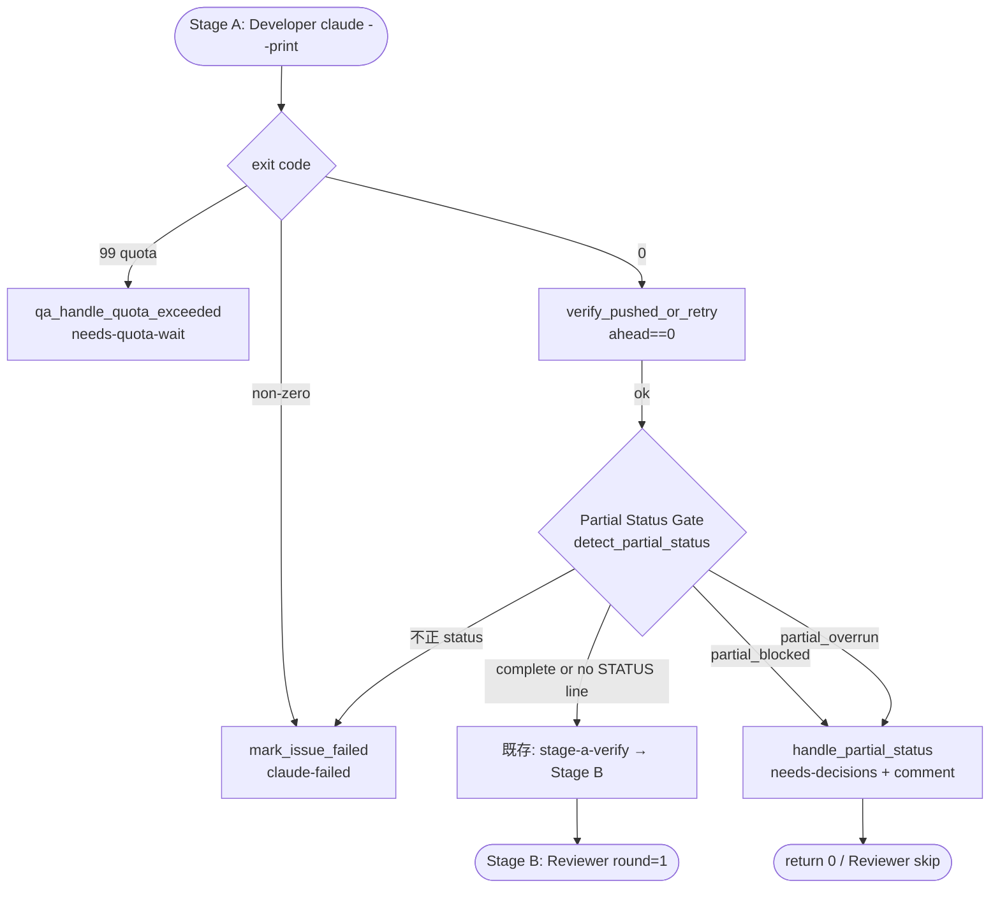
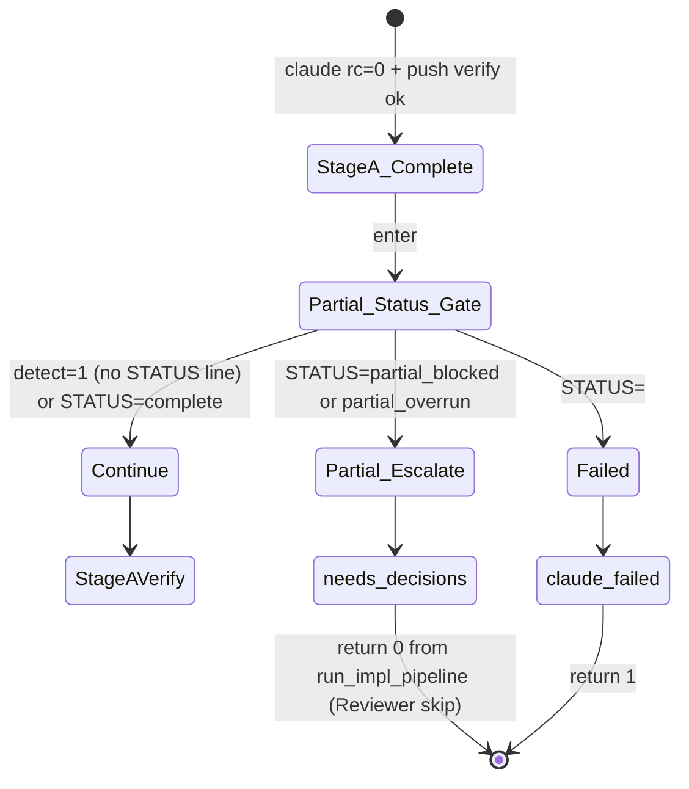
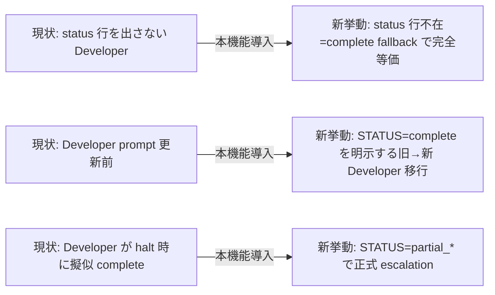

# Design Document

## Overview

**Purpose**: Developer エージェントの出力契約を「全完了 / 全失敗」の 2 値から
「全完了 / 部分完了（ブロック）/ 部分完了（ターン残量不足）/ 全失敗」の 4 値に拡張し、
orchestrator（`local-watcher/bin/issue-watcher.sh`）が部分完了を 1st-class に解釈して
Reviewer 起動を skip した上で人間エスカレーションする経路を確立する。これにより、
Developer が halt せざるを得ない状況でも疑似的に「complete」と振る舞って Reviewer を
無駄起動する現状の浪費パターン（KeyNest #99 で実測 $29）を構造的に排除する。

**Users**: idd-claude harness の運用者と、watcher を install した consumer repo の
auto-dev 利用者。Developer が完了できないケースで自動で `needs-decisions` ラベル付与と
エスカレーションコメント投稿が行われ、人間が手動で残作業（依存解消・分割・続行）を
判断する workflow に乗る。

**Impact**: 現在の Stage A 完了判定（impl-notes.md tracked + ahead==0）は **明示的な
halt 信号を持たない** ため、Developer が `impl-notes.md` に halt 理由を書いて branch を
push しても Reviewer が起動して機械 reject → redo で turn budget が爆発する。本機能は
Developer に明示的な `STATUS:` 行を `impl-notes.md` に出力させ、orchestrator が当該行を
parse して partial 経路へ分岐する 1 つの新規 gate を Stage A 完了直後に挿入する。
既存の Stage A / B / C 状態機械・Stage Checkpoint Resume・ラベル遷移契約・既存 `complete`
（status 行不在を含む）の挙動は完全に保持する。

### Goals

- Developer 出力契約に新規 status code `partial_blocked` / `partial_overrun` を追加し、
  `complete` と互換に運用できる 3 値を 1st-class シグナルとして確立する
- orchestrator が partial を検出した場合に Reviewer 起動を skip し、`needs-decisions`
  ラベル付与とエスカレーションコメント投稿を 1 回ずつ行う
- 既存 `complete`（および明示的な status 行を持たない旧 Developer 出力）に対する
  ユーザー観測挙動を破壊しない（Req 1.3 / NFR 1.1〜1.4）
- Developer 自己判断による turn budget 監視・外部依存検知の prompt 規約を明文化する
  （要件 R2 Option A 確定）

### Non-Goals

- orchestrator 側で残 turn 数を外部観測する新規インフラの導入（Option B / C を不採用）
- 複数 round 跨ぎの partial 蓄積を構造化して引き継ぐ resume protocol の拡張
  （人間がラベルを外して次サイクルで pickup させる現状運用を維持。R5 で吸収）
- Reviewer 側で partial を `iterate` する semantics（Reviewer は partial では起動しない）
- Developer 以外のエージェント（PM / Architect / Reviewer / PjM）の出力契約変更
- consumer repo の過去 PR / Issue への retroactive 適用
- 専用補助ラベル（`harness-partial-blocked` 等）の新設（人間判断論点として Open Question
  に残置）。本 Issue では既存 `needs-decisions` ラベル + コメント本文の識別文字列で由来を
  区別する方針を採用（Req 4.5 / NFR 2.2）

## Architecture

### Existing Architecture Analysis

`local-watcher/bin/issue-watcher.sh` の `run_impl_pipeline()`（L8060〜L8612）は impl /
impl-resume モードの Stage 状態機械を実装する 1 関数で、Stage A（Developer 起動）→
stage-a-verify gate（L8268）→ Stage B（Reviewer round=1）→ Stage A'（Developer 再実行）→
Stage B'（Reviewer round=2）→ Stage C（PjM）の直列パイプラインを構成する。

Stage A の完了判定は以下の 3 段階で行われる（既存挙動）:

1. `claude --print` の exit code（0 = 成功 / 99 = quota 超過 / その他 = 失敗）
2. `verify_pushed_or_retry`（L7615）による ahead==0 verify
3. Stage Checkpoint Resume では `stage_checkpoint_has_impl_notes`（L5503）が
   branch HEAD 上での impl-notes.md tracked を判定して START_STAGE を決定

つまり、**現状の orchestrator は Developer の出力テキストを parse しておらず**、
exit code と branch 上の成果物（impl-notes.md / commit）の状態のみで Stage A 完了を判定
している。本機能はこの判定の **直後** に新しい「STATUS 行検査 gate」を 1 つ挿入する
形で実装する。

既に同様のパターンとして、Debugger Gate（L8174〜L8254 / `DEBUGGER_ENABLED=true` opt-in）
が `detect_blocked_marker`（L6592）で `impl-notes.md` の行頭 `BLOCKED: <reason>` を
grep 検出し、ENABLED 時のみ分岐する実装が既に存在する。本機能は同じ pattern を踏襲し、
**default-on**（後方互換は status 行不在 = `complete` で自然成立）として実装する。

尊重すべきドメイン境界:

- Slot Runner / Dispatcher の責務境界（worktree 隔離・slot lock）は変更しない
- Stage Checkpoint Resume の状態判定（impl-notes.md / review-notes.md / 既存 impl PR）
  は変更しない。本機能は Stage A 完了判定の **末尾** に追加 gate を挿入するだけ
- `mark_issue_failed`（L7858）の責務は `claude-failed` ラベル付与に限定し、本機能の
  partial 経路では別ヘルパー（`mark_issue_needs_decisions`）を新設して責務を分離する
- Reviewer Gate（L5714〜）は触らず、partial 検出時は `run_reviewer_stage` 呼出を
  skip するだけ

維持すべき統合点:

- ラベル遷移契約（CLAUDE.md / `issue-watcher.sh` L13-16 / NFR 1.3）
- env var 名（`REPO`, `REPO_DIR`, `DEV_MODEL`, `STAGE_CHECKPOINT_ENABLED` 等 / NFR 1.2）
- `verify_pushed_or_retry` のセマンティクス（partial でも commit 群は push する / Req 3.5）
- `qa_run_claude_stage` 経由の Quota-Aware Watcher 連携（partial と quota は独立）

解消・回避する technical debt:

- 「Developer の halt 理由が `impl-notes.md` の自由記述部分に埋まる」現状の脆弱性を
  構造化 STATUS 行で置換（grep parseable）

### Architecture Pattern & Boundary Map

**採用パターン**: 既存 `detect_blocked_marker` / Debugger Gate と同じ
「impl-notes.md grep 検出 → ENABLED gate → 分岐」パターンを踏襲する。Stage A 完了判定の
**末尾**（stage-a-verify gate の直前）に新規 gate「Partial Status Gate」を挿入する。



**Architecture Integration**:

- 採用パターン: 既存「impl-notes.md grep 検出 → 分岐」（Debugger Gate と相同）
- ドメイン境界:
  - Developer prompt 規約（`.claude/agents/developer.md`）= status 行出力責務
  - orchestrator parsing（`partial-status-detector.sh` 相当のヘルパー群）= grep + 分岐
  - 副作用（label / comment）= `partial-status-handler.sh` 相当のヘルパー群
- 既存パターンの維持:
  - Quota / failure 経路は分岐の前に評価される（partial は exit code 0 のみで成立）
  - Stage Checkpoint Resume は本 gate の **前** に評価され、A/B/C の選択結果に応じて
    本 gate が起動する（START_STAGE=B|C で Stage A 自体が skip された場合は当然 skip）
- 新規コンポーネントの根拠: 既存 `mark_issue_failed` は `claude-failed` 専用で
  `needs-decisions` を扱わないため、partial 用ヘルパーを独立に切り出す

### Technology Stack

| Layer | Choice / Version | Role in Feature | Notes |
|---|---|---|---|
| Orchestrator | bash 4+（既存 `issue-watcher.sh` 単体内に追記） | 新 gate と分岐ロジックの追加 | 既存関数群と同形式（`function() { ... }` + 行頭固定 grep）|
| Parser | `grep -E '^STATUS: ...'` + `sed` | impl-notes.md からの status 行抽出 | `detect_blocked_marker` と同形式 |
| Agent prompt | markdown（`.claude/agents/developer.md`） | status 行出力規約の明文化 | repo-template 側 (`repo-template/.claude/agents/developer.md`) に同期 |
| GitHub API | `gh issue edit` / `gh issue comment`（既存） | needs-decisions 付与 + escalation コメント投稿 | `mark_issue_failed` と同 pattern |
| Doc | README.md（migration note） | 挙動変更の周知 | デフォルト挙動・opt-out なし・後方互換性の明示 |

## File Structure Plan

### Directory Structure

```
local-watcher/bin/
├── issue-watcher.sh        # 既存単体。本機能の関数群と gate 挿入を追記する
                            # 追加箇所:
                            #   - LABEL_NEEDS_DECISIONS の参照は既存（L62）
                            #   - 新規 helper: detect_partial_status() (Debugger Gate
                            #     の detect_blocked_marker と同セクション付近)
                            #   - 新規 helper: build_partial_escalation_comment()
                            #     (qa_build_escalation_comment と同形式)
                            #   - 新規 helper: mark_issue_needs_decisions() (mark_issue_failed
                            #     と同形式、ただし LABEL_FAILED ではなく LABEL_NEEDS_DECISIONS)
                            #   - 新規 helper: handle_partial_status()
                            #     (partial 検出時の統合フロー: push verify → ラベル付け替え
                            #     → コメント投稿 → ログ)
                            #   - run_impl_pipeline() Stage A 成功直後・stage-a-verify gate
                            #     直前への gate 挿入（L8141 / L8236 / per-task loop 完了後の
                            #     L8114 の 3 箇所、または共通の独立 gate ブロックに集約）

.claude/agents/
└── developer.md            # 既存。「出力契約」セクションに STATUS 行規約を追記
                            # 追加箇所:
                            #   - 「# 出力契約（impl-notes.md 末尾の STATUS 行）」節を新設
                            #   - 「## 自己判断による partial の報告条件」サブセクション
                            #   - 「## 既存『complete』との後方互換」明示

repo-template/.claude/agents/
├── developer.md            # 上記 `.claude/agents/developer.md` と完全同一の追記内容
                            # （consumer repo に install で配布される正本）
└── reviewer.md             # 既存。partial 時に Reviewer は起動されない旨を 1 段落追記
                            # （新規 status code の存在を認知させるためのみ。判定基準は不変）

.claude/agents/
└── reviewer.md             # 同上の追記（idd-claude self-hosting 用）

README.md                   # 既存。「Migration Notes」または同等の節に
                            # 「Developer partial status codes (#148)」項目を追加
                            # （後方互換であること・新 status code の意味・自動ラベル付与
                            # の挙動・運用者が `needs-decisions` を外す手順を明示）

docs/specs/148-feat-harness-developer-partial-blocked-p/
├── requirements.md         # PM 確定済み（入力）
├── design.md               # 本ファイル
└── tasks.md                # 本機能の実装タスク分割
```

### Modified Files

- `local-watcher/bin/issue-watcher.sh`
  - **新規セクション追加**: Partial Status Gate（Debugger Gate と同セクション帯）。
    helper 群 `detect_partial_status` / `build_partial_escalation_comment` /
    `mark_issue_needs_decisions` / `handle_partial_status` の 4 関数を新設
  - **`run_impl_pipeline` 内 gate 挿入**: Stage A 完了直後（per-task loop 完了
    L8114 / 通常 Developer 完了 L8141 / Stage A'(BLOCKED 経路) L8236 / Stage A'
    L8337 / Stage A'' L8432）の **共通後段** として 1 箇所に統合（後述「設計判断:
    gate 挿入位置」参照）
- `.claude/agents/developer.md` / `repo-template/.claude/agents/developer.md`
  - 「# 出力契約（impl-notes.md 末尾の STATUS 行）」セクションを新規追加
  - 既存「# 補足ノート」「# 受入基準の達成確認」セクションとの位置関係を整理
- `.claude/agents/reviewer.md` / `repo-template/.claude/agents/reviewer.md`
  - 「# 入力契約」または「# 行動指針」に「Reviewer は Developer が partial を報告した
    Issue では起動されない」旨を 1 段落追記。判定基準（3 カテゴリ）は不変
- `README.md`
  - 「Migration Notes (#148)」または既存 migration セクションに追記。env var 追加なし・
    opt-out 不要・新ラベル無し・新規挙動の発火条件を明記
- `.github/workflows/issue-to-pr.yml` および `repo-template/.github/workflows/issue-to-pr.yml`
  - **Out of Scope**: 現状の Actions workflow は prompt 1 発で全 stage を完了させる
    単純構造で、status code を parse する orchestrator が存在しない。`IDD_CLAUDE_USE_ACTIONS=true`
    opt-in 経路は本 Issue では変更しない。README migration note にて「local watcher 経路
    のみ実装」を明記する（NFR 1.1 を逆方向に保証 = Actions 経路の挙動は完全に不変）
- `local-watcher/bin/triage-prompt.tmpl`
  - **変更不要**: Triage は Developer 起動の前段であり、status 行とは無関係

### 設計判断: gate 挿入位置

`run_impl_pipeline` には Stage A 成功直後の判定箇所が複数ある（per-task loop /
通常 Developer / Stage A' BLOCKED 経路 / Stage A' 再実行 / Stage A'' Debugger 経由）。
原則として **どの経路でも Developer 自身が `STATUS:` を impl-notes.md に書ける**
ため、partial 検出は全経路で機能させたい。設計案を 2 つ比較:

**案 A（採用）: 各 Stage 成功直後の echo "✅ Stage A 完了" の直後に gate を 1 行で挿入**
- 既存の各経路（per-task loop / 通常 / Stage A' / Stage A'' / BLOCKED 経路）の echo 後に
  `handle_partial_status_or_continue || return 0` を挿入する形で、gate ロジック自体は
  1 関数に集約する
- メリット: gate は完全に同じ関数で 5 箇所に挿入 = 重複コードなし。各経路ごとに最小差分
- デメリット: Stage A' / A'' の再実行経路でも partial が成立し、Reviewer に到達しない
  ケースが発生しうる（ただしこれは要件として正しい挙動 = 再実行後も Developer が halt
  と判断したならエスカレーション）

**案 B（不採用）: Stage A の前段で集約し、stage-a-verify gate と同様に 1 箇所のみで判定**
- 各 Stage 成功直後ではなく、stage-a-verify gate の直前にまとめて 1 箇所で判定
- メリット: gate 挿入箇所が 1 つ
- デメリット: Stage A' / A'' / BLOCKED 経路を通った後の impl-notes.md は **直前ステージ
  の Developer が書いたもの**であり、partial 検出は最終的に問題ない。ただし stage-a-verify
  gate と partial gate の相対順序は要明示（partial を先に評価すべきか、verify を先に
  評価すべきか）

**採用根拠**:

案 A を採用する。理由は (1) 既存 `detect_blocked_marker` も同じ「各経路ごとに gate
ブロックを挿入」pattern であり整合する、(2) gate 関数自体は 1 つにまとめるため重複コード
は発生しない、(3) 「Developer が partial を宣言した時点で Reviewer skip + 人間エスカレーション」
という semantics に最も忠実（stage-a-verify は本来 Developer の自己申告を独立 verify する
ためのものであり、partial 宣言時は verify するまでもなく escalation で良い）。

partial gate と stage-a-verify gate の **相対順序** は **partial → stage-a-verify** とする
（partial 宣言があれば verify せず即 escalation。verify を skip するメリットは turn 浪費
回避 + verify が partial 状態で意図的に失敗するケースの誤判定回避）。

## Requirements Traceability

| Requirement | Summary | Components | Interfaces | Flows |
|---|---|---|---|---|
| 1.1 | `partial_blocked` を新規 status code として定義 | Developer Output Contract | STATUS 行（developer.md） | Stage A → Partial Status Gate |
| 1.2 | `partial_overrun` を新規 status code として定義 | Developer Output Contract | STATUS 行（developer.md） | Stage A → Partial Status Gate |
| 1.3 | 既存 `complete` の意味・互換を改変しない | Developer Output Contract / Partial Status Gate | `detect_partial_status` の戻り値 sentinel | status 行不在 = complete fallback |
| 1.4 | `partial_blocked` 報告時に halt 理由と残タスク一覧を出力 | Developer Output Contract | impl-notes.md `## Partial Halt Reason` / `## Pending Tasks` セクション | Developer prompt 規約 |
| 1.5 | `partial_overrun` 報告時に commit 範囲と残タスク一覧を出力 | Developer Output Contract | impl-notes.md セクション同上 | Developer prompt 規約 |
| 2.1 | turn budget 残量 10 未満で `partial_overrun` を自己判断 | Developer Self-Assessment Rules | developer.md 追加節 | Developer 内部判断 |
| 2.2 | 外部依存で進行不能時に `partial_blocked` を自己判断 | Developer Self-Assessment Rules | developer.md 追加節 | Developer 内部判断 |
| 2.3 | partial 報告は failure ではなく escalation である旨を明記 | Developer Self-Assessment Rules | developer.md 追加節 | prompt 文言 |
| 2.4 | `partial_overrun` 時は安全 commit 可能範囲で停止 | Developer Self-Assessment Rules | developer.md 追加節 | prompt 文言 |
| 3.1 | `partial_blocked` 検出時に Reviewer 起動を skip | Partial Status Gate | `handle_partial_status` return 0 + run_impl_pipeline 制御 | Stage A → Reviewer 起動前で return |
| 3.2 | `partial_overrun` 検出時に Reviewer 起動を skip | Partial Status Gate | 同上 | 同上 |
| 3.3 | `partial_blocked` 検出時に `needs-decisions` ラベル付与 | Needs-Decisions Label Handler | `mark_issue_needs_decisions` | gh issue edit |
| 3.4 | `partial_overrun` 検出時に `needs-decisions` ラベル付与 | Needs-Decisions Label Handler | 同上 | 同上 |
| 3.5 | partial 検出時に local commit を破棄せず remote push | Partial Status Gate | `verify_pushed_or_retry` 既存呼出 | gate 前段で既に push 済 |
| 3.6 | partial 検出時にエスカレーションコメントを 1 件投稿 | Escalation Comment Builder | `build_partial_escalation_comment` + gh issue comment | gate 内で 1 回 |
| 4.1 | コメントに halt 理由を含める | Escalation Comment Builder | impl-notes.md `## Partial Halt Reason` 抽出 | コメント本文構築 |
| 4.2 | コメントに push 済み commit 一覧と branch 名 | Escalation Comment Builder | `git log --oneline ${BASE_BRANCH}..HEAD` | コメント本文構築 |
| 4.3 | コメントに残タスク一覧を含める | Escalation Comment Builder | tasks.md `- [ ]` 行抽出 or impl-notes.md `## Pending Tasks` 引用 | コメント本文構築 |
| 4.4 | コメントに推奨アクション選択肢 | Escalation Comment Builder | 固定テンプレ文字列 | コメント本文構築 |
| 4.5 | コメントに status code 識別固定文字列を含める | Escalation Comment Builder | `<!-- idd-claude:partial-status:STATUS_CODE -->` HTML コメント | コメント本文構築 |
| 5.1 | needs-decisions 付与中は Developer 自動起動なし | 既存 Dispatcher | `_dispatcher_run` の既存除外フィルタ（L2356） | 既存挙動を再利用 |
| 5.2 | needs-decisions 付与中は Reviewer 自動起動なし | 既存 Dispatcher | 同上（Reviewer は Slot Runner 内で起動 = needs-decisions 付き Issue は Slot に入らない） | 既存挙動を再利用 |
| 5.3 | needs-decisions 除去後は通常 pickup 候補へ | 既存 Dispatcher | 同上の inverse | 既存挙動を再利用 |
| NFR 1.1 | `complete` の出力フォーマット破壊なし | Developer Output Contract | status 行不在 = complete fallback | gate 設計で構造的に保証 |
| NFR 1.2 | 既存 env var 名の意味・互換を破壊しない | Partial Status Gate | 新規 env var 追加なし | 設計上 env var 追加なし |
| NFR 1.3 | 既存ラベル遷移契約の意味改変なし | Needs-Decisions Label Handler | 既存 `LABEL_NEEDS_DECISIONS` のみ使用 | 新規ラベル追加なし |
| NFR 1.4 | `complete` 従来通り = 既存挙動と同一 | Partial Status Gate | status 行不在 / `complete` = continue（=既存挙動） | gate の default branch |
| NFR 2.1 | partial 検出を grep 可能なログ行で記録 | Partial Status Gate | `partial-status:` prefix のログ行（既存 `dbg_log` / `sc_log` と同形式） | gate 内で log |
| NFR 2.2 | コメントに本機能由来識別固定文字列 | Escalation Comment Builder | `<!-- idd-claude:partial-status:... -->` HTML コメント | Req 4.5 と同一実装 |
| NFR 3.1 | 不正 status code は `claude-failed` + Reviewer skip | Partial Status Gate | `detect_partial_status` 不正値分岐 → `mark_issue_failed` | gate 内で分岐 |
| NFR 3.2 | parse 失敗は既存失敗時挙動と互換 | Partial Status Gate | parse 失敗 = status 行不在として扱う（= continue） | grep no-match = continue（既存挙動と差分なし）|

## Components and Interfaces

### Orchestrator Layer

#### Partial Status Gate

| Field | Detail |
|---|---|
| Intent | Stage A 完了直後に impl-notes.md の `STATUS:` 行を検出し、partial / complete / 不正で分岐する |
| Requirements | 1.3, 3.1, 3.2, 3.5, NFR 1.1, NFR 1.4, NFR 2.1, NFR 3.1, NFR 3.2 |

**Responsibilities & Constraints**

- 主責務: Stage A 完了直後（exit code 0 + push verify 成功後）に impl-notes.md を grep し、
  `STATUS:` 行の値に応じて continue / partial-escalate / failed のいずれかに分岐する
- ドメイン境界: 「Developer 出力の機械可読化された宣言を 1 つだけ読む」責務に限定。
  impl-notes.md の他のセクションは触らない（halt 理由・残タスク一覧は escalation comment
  builder の責務）
- データ所有権: impl-notes.md の read-only。書き込みは Developer の責務
- invariants:
  - STATUS 行不在 / 空 → continue（既存挙動と外形完全等価 / NFR 1.1）
  - STATUS=complete → continue（明示的）
  - STATUS=partial_blocked / partial_overrun → escalate
  - STATUS=<その他> → claude-failed（NFR 3.1）

**Dependencies**

- Inbound: `run_impl_pipeline()` Stage A 成功直後 — partial 分岐の起点 (Critical)
- Outbound:
  - `detect_partial_status` — STATUS 行 grep (Critical)
  - `handle_partial_status` — partial 検出時の副作用統合 (Critical)
  - `mark_issue_failed` — NFR 3.1 不正値時 (High)
- External: `grep -E` (bash builtin), `impl-notes.md` ファイル (read-only)

**Contracts**: Service [x] / API [ ] / Event [ ] / Batch [ ] / State [x]

##### Service Interface

```bash
# detect_partial_status <impl_notes_path>
# Stdout: status code 値 ("complete" / "partial_blocked" / "partial_overrun" / "<invalid>")
# Return: 0 = STATUS 行検出（複数 = 最終行採用）
#         1 = STATUS 行不在（既存 complete fallback / NFR 1.1）
#         2 = ファイル不在（既存挙動と等価）
detect_partial_status() {
  local impl_notes="$1"
  # 規約: 行頭固定 `^STATUS: (complete|partial_blocked|partial_overrun|.+)$`
  #   - インデント / list marker `- ` / 引用 `> ` の prefix は検出対象外
  #   - 複数マッチ時は **最終行** 採用（Developer 再実行で上書きされた場合に新しい方を採用）
  #   - 値は trim（前後空白を除去）
}
```

- Preconditions: `$1` は実在パスまたは不在パス（不在時 return 2）
- Postconditions: 標準出力に値 1 つ。標準エラー出力は使わない
- Invariants: status 行不在を「complete」に内部 normalize するのは呼び出し側責務。
  本関数は raw 値（または return 1/2）を返すのみ（テスト容易性）

##### State Transitions



---

#### Needs-Decisions Label Handler

| Field | Detail |
|---|---|
| Intent | partial 検出時に `claude-claimed` / `claude-picked-up` を除去して `needs-decisions` を付与する |
| Requirements | 3.3, 3.4, NFR 1.3 |

**Responsibilities & Constraints**

- 主責務: 既存 `LABEL_NEEDS_DECISIONS` の 1 ラベルのみで処理する。新規ラベルは追加しない
- ドメイン境界: `mark_issue_failed` は `claude-failed` 専用なので、別ヘルパー
  `mark_issue_needs_decisions` を新設。両者は構造的に独立
- invariants: 既存 `mark_issue_failed` と同様、`gh issue edit` 失敗は warn 吸収（best-effort）

**Dependencies**

- Inbound: `handle_partial_status` — partial 経路の副作用統合内から呼出 (Critical)
- Outbound: `gh issue edit` (External, Critical)
- External: GitHub REST API（Issue label）

**Contracts**: Service [x] / API [ ] / Event [ ] / Batch [ ] / State [ ]

##### Service Interface

```bash
# mark_issue_needs_decisions <status_code> <comment_body>
# 副作用: (1) claude-claimed / claude-picked-up を除去
#         (2) needs-decisions を付与
#         (3) escalation コメントを 1 件投稿
#         (4) grep 可能なログ行を $LOG に追記（NFR 2.1）
# Return: 0 always (best-effort、既存 mark_issue_failed と同方針)
mark_issue_needs_decisions() {
  local status_code="$1"
  local comment_body="$2"
  # 実装: 既存 mark_issue_failed (L7858) と heredoc 形式まで揃える。
  #   ラベル付け替えは 1 コマンドで原子的に発行（既存 qa_handle_quota_exceeded 参照）
  #   コメント投稿は gh issue comment（既存と同形式）
}
```

- Preconditions: `$NUMBER` / `$REPO` / `$LABEL_NEEDS_DECISIONS` が定義済み（呼出元保証）
- Postconditions: Issue ラベル付け替え + コメント 1 件投稿
- Invariants: `claude-failed` は **付与しない**（Req 3.3 / NFR 1.3）。両ラベル併存を避ける

---

#### Escalation Comment Builder

| Field | Detail |
|---|---|
| Intent | partial 検出時の Issue コメント本文を組み立てる |
| Requirements | 4.1, 4.2, 4.3, 4.4, 4.5, NFR 2.2 |

**Responsibilities & Constraints**

- 主責務: heredoc で markdown コメント本文を組み立て、stdout に出力する純粋関数
- ドメイン境界: 副作用なし（gh issue comment 呼出は呼び出し側 `handle_partial_status`）
- データ所有権: impl-notes.md / tasks.md の read-only 抽出
- invariants:
  - 識別固定文字列 `<!-- idd-claude:partial-status:${STATUS_CODE} -->` を **本文先頭** に
    HTML コメントとして含める（Req 4.5 / NFR 2.2、後段の grep フィルタを容易にする）
  - halt 理由・残タスク一覧・push 済み commit 一覧・推奨アクションを必ず含める

**Dependencies**

- Inbound: `handle_partial_status` — partial 経路から呼出 (Critical)
- Outbound:
  - `git log --oneline ${BASE_BRANCH}..HEAD` — commit 一覧 (High)
  - impl-notes.md grep — halt 理由抽出 (High)
  - tasks.md grep — 残タスク `- [ ]` 行抽出 (Medium)
- External: なし（git CLI と markdown ファイル read-only）

**Contracts**: Service [x] / API [ ] / Event [ ] / Batch [ ] / State [ ]

##### Service Interface

```bash
# build_partial_escalation_comment <status_code> <impl_notes_path> <tasks_md_path> <branch>
# Stdout: 完成した markdown コメント本文（複数行）
# Return: 0 always
build_partial_escalation_comment() {
  local status_code="$1"        # "partial_blocked" or "partial_overrun"
  local impl_notes_path="$2"
  local tasks_md_path="$3"
  local branch="$4"
  # 本文構造（Req 4.1〜4.5 / NFR 2.2 をすべてカバー）:
  #   1. 識別 HTML コメント（先頭。NFR 2.2）
  #   2. h2 タイトル（status code 別の固定文言）
  #   3. ## 検知情報（status code / branch / Issue 番号）
  #   4. ## Halt 理由 — impl-notes.md `## Partial Halt Reason` セクションを引用
  #   5. ## Push 済み commit 一覧 — git log --oneline ${BASE_BRANCH}..HEAD
  #   6. ## 残タスク一覧 — tasks.md の `- [ ]` 行を抽出（impl-notes.md `## Pending Tasks`
  #      が存在すればそれを優先）
  #   7. ## 推奨アクション — 固定リスト（依存 Issue 先行 / Issue 分割 / 手動続行 等）
  #   8. ## 次の手順 — needs-decisions ラベル運用の説明（人間がラベルを外せば次サイクル
  #      で pickup される旨）
  #   9. footer: 「本コメントは Partial Status Gate (#148) が自動投稿しました」
}
```

- Preconditions: `$status_code` は `partial_blocked` または `partial_overrun`
- Postconditions: 1 つの完成 markdown コメント本文を stdout に出力
- Invariants: 識別 HTML コメントは本文 **先頭** 固定。grep フィルタでの誤検出を避ける

---

#### Partial Status Coordinator (`handle_partial_status`)

| Field | Detail |
|---|---|
| Intent | partial 検出時の副作用（push verify 確認 → コメント組立 → label/comment 適用 → ログ）を 1 関数に集約 |
| Requirements | 3.1, 3.2, 3.5, 3.6, 4.1〜4.5, NFR 2.1 |

**Responsibilities & Constraints**

- 主責務: detect_partial_status の戻り値を受けて partial / continue / failed に分岐し、
  partial 経路では Reviewer 起動を skip させる
- ドメイン境界: `run_impl_pipeline` の Stage A 完了直後に 1 行 `handle_partial_status ...`
  で呼べる粒度に集約
- invariants:
  - return 0 = continue（呼出側は通常フロー継続。STATUS 行不在 or `complete`）
  - return 10（独自 exit code）= partial 検出済（呼出側は `return 0` で
    `run_impl_pipeline` を抜けて Reviewer skip。`run_impl_pipeline` 全体の return 0 = 正常終了）
  - return 1 = 不正 status / parse 失敗で `mark_issue_failed` 実行済（呼出側は `return 1`）
  - 既存の return code 0/1 と衝突しないため `10` を採用（quota 99 とも区別）

**Dependencies**

- Inbound: `run_impl_pipeline` 各 Stage A 成功直後の gate 挿入点 (Critical)
- Outbound:
  - `detect_partial_status` (Critical)
  - `build_partial_escalation_comment` (Critical)
  - `mark_issue_needs_decisions` (Critical)
  - `mark_issue_failed`（NFR 3.1 / 不正値時のみ）(High)
- External: なし（内部 helper の coordinator）

**Contracts**: Service [x] / API [ ] / Event [ ] / Batch [ ] / State [x]

##### Service Interface

```bash
# handle_partial_status
# 入力 (環境変数経由): NUMBER, BRANCH, REPO, REPO_DIR, SPEC_DIR_REL, LOG, BASE_BRANCH
# Return: 0  = continue（既存フロー継続。status 行不在 or complete）
#         10 = partial 検出済（呼出側は run_impl_pipeline から return 0 で抜ける）
#         1  = 不正 status / parse 失敗（mark_issue_failed 実行済）
handle_partial_status() {
  local impl_notes="$REPO_DIR/$SPEC_DIR_REL/impl-notes.md"
  local status_code rc
  status_code=$(detect_partial_status "$impl_notes") && rc=0 || rc=$?
  case "$rc" in
    1|2)  # STATUS 行不在 or ファイル不在 → continue（NFR 1.1）
      return 0
      ;;
    0)
      case "$status_code" in
        complete)
          return 0  # 明示的 complete = continue
          ;;
        partial_blocked|partial_overrun)
          # 1. ログ（NFR 2.1）
          echo "[$(date '+%F %T')] partial-status: detected issue=#${NUMBER} status=${status_code} branch=${BRANCH}" | tee -a "$LOG"
          # 2. コメント本文組立
          local body
          body=$(build_partial_escalation_comment "$status_code" \
            "$impl_notes" \
            "$REPO_DIR/$SPEC_DIR_REL/tasks.md" \
            "$BRANCH")
          # 3. ラベル付け替え + コメント投稿
          mark_issue_needs_decisions "$status_code" "$body"
          return 10
          ;;
        *)
          # NFR 3.1: 不正 status code
          echo "[$(date '+%F %T')] partial-status: invalid issue=#${NUMBER} status='${status_code}'" | tee -a "$LOG"
          mark_issue_failed "partial-status-invalid" \
            "Developer 出力の \`STATUS:\` 行が \`${status_code}\` で、契約 (\`complete\` / \`partial_blocked\` / \`partial_overrun\`) のいずれにも該当しません。\`$LOG\` を確認してください。"
          return 1
          ;;
      esac
      ;;
  esac
}
```

- Preconditions: `$NUMBER`, `$BRANCH`, `$REPO`, `$REPO_DIR`, `$SPEC_DIR_REL`, `$LOG`,
  `$BASE_BRANCH` がすべて定義済み
- Postconditions:
  - continue: 副作用なし
  - partial 検出: ラベル付け替え + コメント 1 件 + ログ 1 行 + return 10
  - 不正: `claude-failed` 付与 + コメント + ログ + return 1
- Invariants: 既存 `LABEL_NEEDS_DECISIONS` / `LABEL_CLAIMED` / `LABEL_PICKED` 以外の
  ラベル名を生成しない

### Agent Layer

#### Developer Output Contract

| Field | Detail |
|---|---|
| Intent | Developer が impl-notes.md の **末尾** に `STATUS:` 行を 1 行だけ出力する規約を確立 |
| Requirements | 1.1, 1.2, 1.3, 1.4, 1.5, NFR 1.1 |

**Responsibilities & Constraints**

- 主責務: `.claude/agents/developer.md` の prompt 規約として STATUS 行・halt 理由・残タスク
  一覧の出力形式を明文化する
- ドメイン境界: 規約上のみ。実装コードへの影響なし（prompt が markdown で完結）
- invariants:
  - STATUS 行は impl-notes.md の **最終行** に 1 行のみ出力
  - 値は `complete` / `partial_blocked` / `partial_overrun` のいずれか lowercase 完全一致
  - 行頭装飾（list marker / blockquote / バッククォート）を一切付けない
  - 既存 Developer 出力（status 行を出さない旧 prompt 動作）は status 行不在 = complete
    fallback として後方互換が成立する

##### Output Contract（developer.md に追記する規約）

```markdown
# 出力契約（impl-notes.md 末尾の STATUS 行）

実装完了 / halt 判断後、`impl-notes.md` の **最終行（standalone line）** に以下のいずれかを
1 行だけ出力してください。これは orchestrator が `grep -E '^STATUS: ...'` で機械抽出する
正本です。

- `STATUS: complete` — 全タスクを完了し、Reviewer に渡してよい状態
- `STATUS: partial_blocked` — 外部依存（未 merge Issue / 設計矛盾 / 環境不備）で進行不能
- `STATUS: partial_overrun` — turn budget 残量が不足し、安全 commit 可能な範囲で停止

### partial 報告時の追加出力（必須）

`STATUS: partial_blocked` または `STATUS: partial_overrun` を報告する場合、
impl-notes.md に以下の 2 セクションを **必ず** 含めること:

#### `## Partial Halt Reason`

- partial_blocked: 依存している外部要因の具体 ID（Issue 番号 / Issue タイトル）または事象
  （CI 失敗の具体的なエラー / 設計矛盾の箇所）を 1〜3 段落で記述
- partial_overrun: 残 turn 数の概算と「現在のタスクをこれ以上進めると安全な commit を
  作れない」判断根拠を記述

#### `## Pending Tasks`

- tasks.md の `- [ ]` 行（未完了マーカー）のうち、本サイクルで完了しなかったものを
  そのままコピーする（チェックボックス記法を含む）
- 1 行 = 1 タスク。`(P)` / `_Requirements:_` / `_Boundary:_` のアノテーションは含めなくてよい

### 自己判断による partial の報告条件

- **`partial_overrun`**: turn budget 残量が **10 turn 未満** になった時点で、現在進行中の
  タスクの **直前の安全な commit boundary** で停止して `partial_overrun` を報告する
  - 「安全な commit boundary」= テストが green な状態 / 中途半端な refactor を含まない状態
  - turn 残量の自己観測手段が無い場合は「タスク 1 件あたりの平均 turn 消費」と「ここまでに
    消費した turn 数」から推定する（保守的に多めに見積もる）
- **`partial_blocked`**: 以下のいずれかを **確信** した時点で `partial_blocked` を報告する
  - 未 merge の依存 Issue（例: 設計 PR が未 approve）が当該タスクの前提
  - design.md / tasks.md と requirements.md の間に矛盾があり PM / Architect の判断が必須
  - 環境不備（依存ライブラリのバージョン不整合 / シークレット不在 / CI infra 起因の失敗）

### partial は failure ではない（重要）

`partial_blocked` / `partial_overrun` は **意図的なエスカレーション** であり、Developer の
失敗扱いにはなりません。orchestrator は当該 Issue に `needs-decisions` ラベルを付与し、
人間が判断（依存解消 / Issue 分割 / 手動続行）を下します。**halt 理由を `impl-notes.md` に
書いて疑似的に「Branch is ready for the Reviewer stage」と続行する従来パターンは禁止**です。

### 既存「complete」との後方互換

- `STATUS:` 行を **出さない** 旧 Developer 動作は orchestrator 側で `complete` として扱われ
  ます（status 行不在 = complete fallback）
- 既存 PR / Issue の retroactive 適用は不要
- 全タスク完了時は **必ず** `STATUS: complete` を 1 行 impl-notes.md 末尾に追加してください
  （明示が推奨。fallback はあくまで旧プロンプト互換のため）
```

#### Reviewer Cross-reference

| Field | Detail |
|---|---|
| Intent | Reviewer agent に「partial 経路では起動されない」旨を伝えるための informational 追記 |
| Requirements | 3.1, 3.2 |

**Responsibilities & Constraints**

- 主責務: `.claude/agents/reviewer.md` に「partial 検出時は Reviewer は起動されない」
  旨を informational に追記する（判定基準・3 カテゴリは不変 / NFR 1.3）
- ドメイン境界: 既存 reviewer.md の本文に影響を与えない。1 段落程度の追記のみ
- invariants: 判定基準（AC 未カバー / missing test / boundary 逸脱）は変更しない

##### 追記内容（reviewer.md 既存「# 入力契約」または「# 行動指針」末尾に追加）

```markdown
## partial status との関係（informational）

Developer が `impl-notes.md` 末尾に `STATUS: partial_blocked` または `STATUS: partial_overrun`
を出力した Issue では、Reviewer は **起動されません**。orchestrator が直接 `needs-decisions`
ラベルを付与して人間判断に委ねます。本ファイルの判定基準（AC 未カバー / missing test /
boundary 逸脱）は partial 経路に **適用されません**（partial は Reviewer の責務外）。

Reviewer が起動された時点で対象 Issue は `STATUS: complete`（または status 行不在の旧
Developer 出力）であることが保証されています。
```

## Data Models

### State Model

新規 ER / DB / 永続化スキーマは導入しない。状態は以下の既存リソースに表現される:

| State | Carrier | Format | Owner |
|---|---|---|---|
| status code 値 | `${SPEC_DIR_REL}/impl-notes.md` 末尾の `STATUS:` 行 | `^STATUS: (complete\|partial_blocked\|partial_overrun)$` | Developer |
| halt 理由 | `${SPEC_DIR_REL}/impl-notes.md` の `## Partial Halt Reason` セクション | markdown 自由記述 | Developer |
| 残タスク一覧 | `${SPEC_DIR_REL}/impl-notes.md` の `## Pending Tasks` セクション + `${SPEC_DIR_REL}/tasks.md` の `- [ ]` 行 | markdown checkbox 行 | Developer + Architect |
| pickup 抑止状態 | GitHub Issue ラベル `needs-decisions` | GitHub label | orchestrator |
| 通知履歴 | GitHub Issue コメント（識別 HTML コメント `<!-- idd-claude:partial-status:... -->` 付き） | markdown comment | orchestrator |

partial が複数 round に跨る場合（例: round 1 partial_blocked → 人間が依存解消 → ラベル除去
→ round 2 で続行）は、`needs-decisions` ラベルの存在で次サイクルの自動 pickup が抑止される
（Req 5.1〜5.3、既存挙動の再利用）。round 跨ぎの impl-notes.md / tasks.md 引き継ぎは
**Out of Scope**（人間が手動で次サイクル起動時に状態を解釈する）。

## Error Handling

### Error Strategy

partial gate での失敗は以下のカテゴリで処理する:

1. **STATUS 行不在 / ファイル不在** → continue（既存 complete fallback / NFR 1.1）
2. **STATUS=`complete`** → continue（既存挙動と同一）
3. **STATUS=`partial_blocked` / `partial_overrun`** → partial escalation 経路
4. **STATUS=不正値**（typo / 旧契約） → `claude-failed` + Reviewer skip（NFR 3.1）
5. **`gh issue edit` / `gh issue comment` 失敗** → warn 吸収（既存 `mark_issue_failed`
   と同方針 / best-effort）

### Error Categories and Responses

- **User Errors**:
  - 不正 status code（typo 等） → `claude-failed` + Issue コメントで「契約値以外」を明示
- **System Errors**:
  - GitHub API 失敗（ラベル付与 / コメント投稿） → warn ログ + 副作用は best-effort（既存
    `mark_issue_failed` / `qa_handle_quota_exceeded` と同方針 / Req 5.6 相当）
  - impl-notes.md / tasks.md 読み取り失敗 → STATUS 行不在として扱う（continue / 安全側）
- **Business Logic Errors**:
  - partial と quota が同時発生 → quota 検出が先（Stage A の exit code 99 が partial gate の
    前に評価されるため、構造的に partial gate に到達しない / 既存 quota 経路で
    `needs-quota-wait` 付与）
  - partial と stage-a-verify 失敗が同時発生 → partial gate が先（partial 宣言時は verify
    skip / 設計判断「gate 挿入位置」参照）

## Testing Strategy

idd-claude 本体は bash + markdown + GitHub Actions YAML で構成され unit test framework を
持たないため、検証は (1) shellcheck / actionlint 静的解析、(2) 既存 spec 配下の
`test-fixtures/` + `test-*.sh` パターンでの fixture テスト、(3) dogfooding（本 repo 自身に
test Issue を立てて watcher が拾えるか）で実施する。

### Unit Tests (関数単体)

- **`detect_partial_status`** の status 行抽出を fixture で検証:
  1. STATUS 行不在 → return 1
  2. ファイル不在 → return 2
  3. `STATUS: complete` 行あり → return 0 / stdout=`complete`
  4. `STATUS: partial_blocked` 行あり → return 0 / stdout=`partial_blocked`
  5. `STATUS: partial_overrun` 行あり → return 0 / stdout=`partial_overrun`
  6. 不正値 `STATUS: foo` → return 0 / stdout=`foo`（呼出側が分岐）
  7. 複数 STATUS 行（再実行で上書き）→ 最終行採用
  8. list marker 付き `- STATUS: complete` → 検出対象外（return 1）

### Integration Tests (関数連携)

- **`handle_partial_status`** の分岐を mock 環境で検証:
  1. status 行不在 → return 0、副作用なし
  2. `complete` → return 0、副作用なし
  3. `partial_blocked` → return 10、ラベル付け替え + コメント投稿が呼ばれる（gh CLI mock）
  4. `partial_overrun` → return 10、同上
  5. 不正値 → return 1、`mark_issue_failed` 呼出
- **`build_partial_escalation_comment`** の本文構造検証:
  1. 識別 HTML コメント `<!-- idd-claude:partial-status:partial_blocked -->` が **先頭** にある
  2. Halt 理由 / commit 一覧 / 残タスク / 推奨アクション / status code 識別文字列がすべて含まれる
  3. branch 名 / Issue 番号が埋め込まれている
- **`run_impl_pipeline`** ループでの gate 挿入位置検証（既存 fixture 流用 + 新規 fixture）:
  1. 通常 Developer + STATUS=complete → 既存挙動と同一（Reviewer 起動）
  2. 通常 Developer + STATUS 行不在 → 既存挙動と同一（Reviewer 起動 / NFR 1.4）
  3. 通常 Developer + STATUS=partial_blocked → Reviewer skip / needs-decisions 付与
  4. per-task loop 完了後 STATUS=partial_overrun → 同上
  5. Stage A' / A'' 再実行後の STATUS=partial_blocked → 同上（再実行経路でも検出）

### E2E / dogfooding

- 本 repo（idd-claude self-hosting）に test Issue を立て、Developer に意図的に
  `STATUS: partial_blocked` を出させる prompt を impl-notes.md に書かせて end-to-end を確認
- watcher のログに `partial-status: detected issue=#... status=partial_blocked` が
  記録されることを確認
- Issue に `needs-decisions` ラベルが付き、エスカレーションコメントが投稿されることを確認
- 人間が `needs-decisions` を外すと次サイクルで自動 pickup されることを確認

### 既存テスト整合性 (Regression)

- 既存 Debugger Gate / Stage Checkpoint Resume / stage-a-verify gate / Quota-Aware Watcher
  fixture（`docs/specs/22-*` / `docs/specs/68-*` / `docs/specs/125-*` / `docs/specs/66-*`）が
  そのまま pass することを確認（NFR 1.1〜1.4 の構造的保証）

## Security Considerations

本機能は GitHub API への `gh issue edit` / `gh issue comment` 呼び出しを追加するが、これは
既存 `mark_issue_failed` / `qa_handle_quota_exceeded` と同等の権限スコープ（installed token
で Issue label / comment 操作）であり、新規の secret / 認証経路は導入しない。impl-notes.md /
tasks.md は repo 内既存ファイルであり、機密情報の外部露出経路は追加されない。

エスカレーションコメント本文には Developer が impl-notes.md に書いた halt 理由が含まれる
ため、Developer prompt 規約として **API key / secret を halt 理由に書かないこと** を明記
する（CLAUDE.md の機密情報の扱い節と整合）。本注意は既存 CLAUDE.md の規約で既にカバー
されており、追加の対策は不要。

## Performance & Scalability

- partial gate の追加コストは 1 Stage A 完了あたり以下のみ:
  - `grep -E '^STATUS: ...'` × 1 回（impl-notes.md は通常 数 KB 程度、I/O ms オーダー）
  - partial 検出時のみ追加で `git log --oneline ${BASE_BRANCH}..HEAD` × 1 回
  - partial 検出時のみ追加で `gh issue edit` × 1 回 + `gh issue comment` × 1 回
- watcher 1 cycle あたりの GitHub API call 増加は **partial 検出時のみ 2 call**。既存
  `mark_issue_failed` と同等のオーダーで scalability 影響なし
- partial を頻繁に検出する状況は本機能の **狙い**（人間判断への早期エスカレーション）で
  あり、performance 劣化ではなく workflow の正常動作

## Migration Strategy

本機能は **完全に default-on** で、新規 env var の追加・opt-out gate の追加を **行わない**。
理由:

- partial gate は status 行不在を `complete` として扱う設計のため、既存 Developer の出力
  （status 行を出さない旧 prompt）に対して挙動が変化しない（NFR 1.1 / 1.4 を構造的に保証）
- 新規 Developer が `STATUS: partial_*` を出した時点で初めて新経路に分岐する
- env var 追加は CLAUDE.md の禁止事項「opt-in gate なしで新しい外部サービス呼び出しを
  有効化」に該当しない（partial 経路で呼ぶ GitHub API は既に `mark_issue_failed` で使われて
  いる既存 API）



Migration note を README に追記する（後方互換性・新 status code の意味・運用フロー）。

## Operational Considerations

### Logging / Observability

- partial 検出時: `partial-status: detected issue=#... status=... branch=...` 形式の
  ログ行を `$LOG` および標準出力に出力（NFR 2.1）。grep prefix `partial-status:` で
  後段の運用統計を集計可能
- 不正 status: `partial-status: invalid issue=#... status='...'` 形式（同 prefix）
- 既存 `dbg_log` / `sc_log` / `pi_log` などのロガー命名規約に揃える

### Failure Modes

| Failure | Detection | Recovery |
|---|---|---|
| 不正 status code | `detect_partial_status` の値不正分岐 | `claude-failed` 付与 + Issue コメント |
| `gh issue edit` 失敗 | `gh` exit code 非 0 | warn 吸収（best-effort）。次サイクルで再評価不可（既に partial 検出済 / impl-notes.md 残置） |
| `gh issue comment` 失敗 | 同上 | 同上 |
| impl-notes.md 読み取り失敗 | ファイル不在 / 権限エラー | continue（既存挙動と等価 / NFR 1.1） |
| Developer が partial 検出後に commit を追加（remote が ahead） | `verify_pushed_or_retry` で既に検出済（partial gate の前段） | 既存挙動（既存 push retry）|

### Operational Runbook

人間運用者が `needs-decisions` 付き Issue を受け取った場合:

1. Issue コメントの「Halt 理由」「残タスク一覧」「推奨アクション」を読む
2. partial の種別を識別文字列 `<!-- idd-claude:partial-status:partial_blocked -->` /
   `<!-- idd-claude:partial-status:partial_overrun -->` で判定
3. 推奨アクションのいずれかを選択:
   - 依存 Issue を先に進める → 当該 Issue を先に解決後、`needs-decisions` を除去
   - Issue を分割する → サブ Issue を起票し、本 Issue は close または継続
   - 手動で続行する → 当該 branch を手動 checkout して残タスクを実装後、`needs-decisions` を除去
4. `needs-decisions` 除去後、次の watcher サイクルで通常 pickup 候補として再評価される
   （Req 5.3、既存挙動の再利用）

## Open Design Questions (実装者へのメモ)

以下は要件側（PM）で確定済みのため設計側で追加判断しない。但し実装者が tasks.md を
消化する過程で issue body 「確認事項」に投げ返してよい:

- 専用ラベル `harness-partial-blocked` / `harness-partial-overrun` の新設は本 Issue では
  **行わない**（識別 HTML コメントで吸収。Open Question #1）。将来運用知見を蓄積後に
  別 Issue で再評価可能
- partial 解消後の自動 resume は **Out of Scope**（Open Question #2）
- turn budget 閾値「残 10 turn」は **暫定値**（Open Question #3）。実装後に運用知見と
  突き合わせて再評価可能。本 Issue では prompt 規約として 10 を明記する
