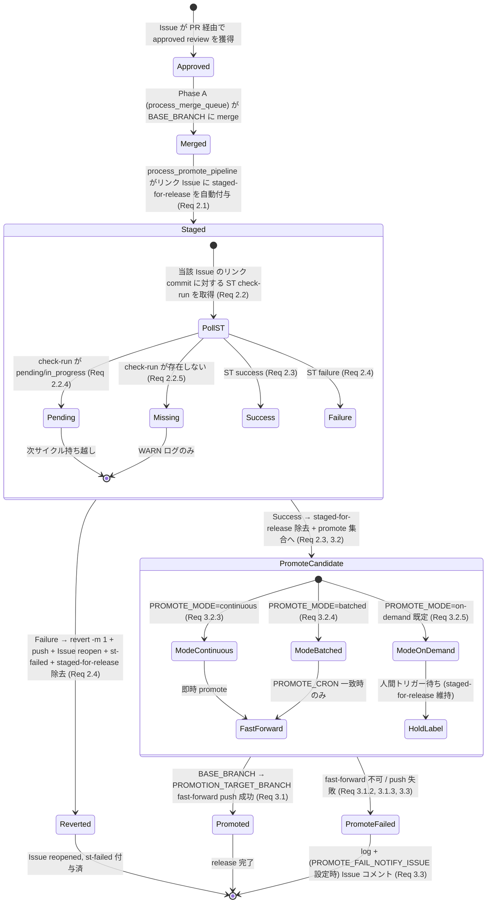
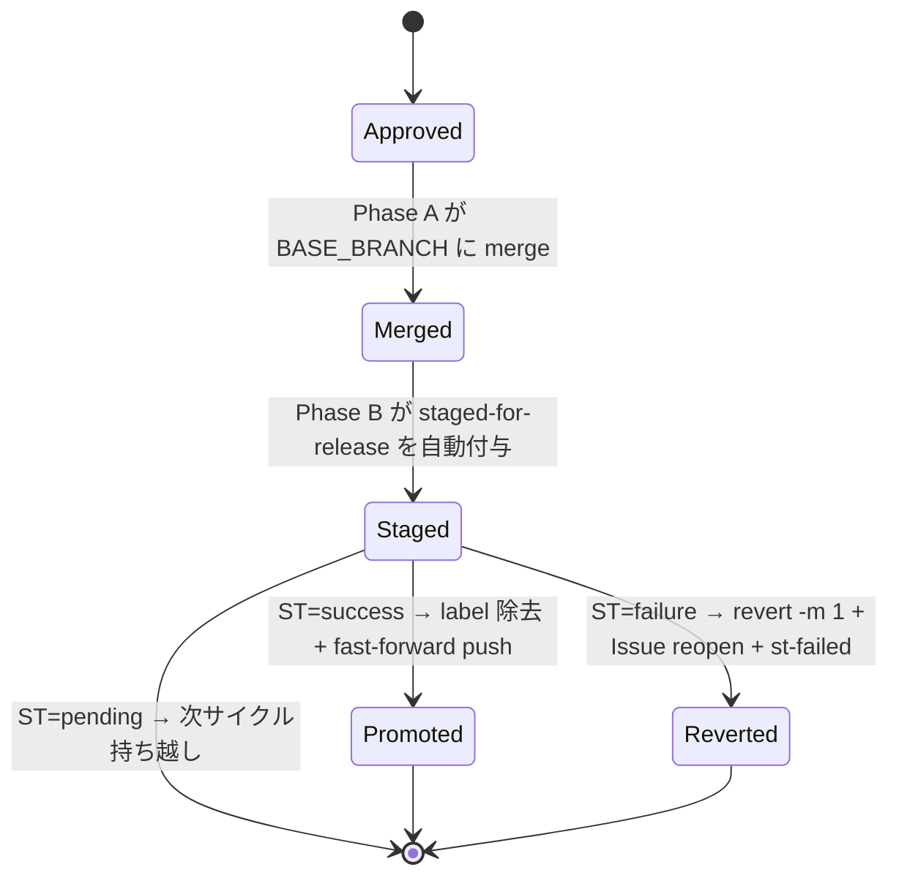
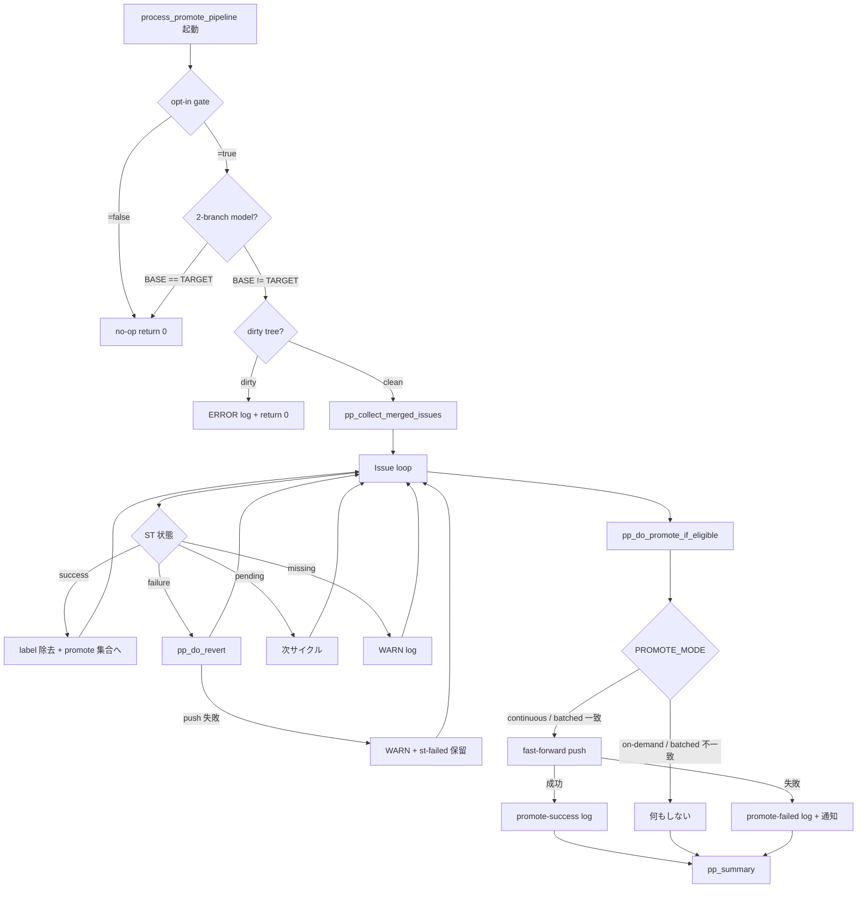
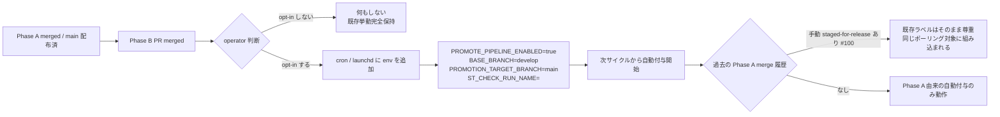

# Design Document

## Overview

**Purpose**: 本機能（Phase B: Promote Pipeline + ST 連携）は、`BASE_BRANCH` と
`PROMOTION_TARGET_BRANCH` を分離して運用する idd-claude consumer リポジトリ（例:
`BASE_BRANCH=develop` / `PROMOTION_TARGET_BRANCH=main`）の release manager に対し、
**`BASE_BRANCH` に merge された変更を System Test（ST）結果に応じて自動でリリースブランチへ
昇格、または revert する** という運用を、watcher サイクル内の処理として提供する。

**Users**: idd-claude を multi-branch 運用しているリポジトリの operator / release manager。
これまで彼／彼女らは Phase A（#14 Merge Queue Processor）で `BASE_BRANCH` に approved PR を
merge した後、(a) ST 結果を Issue 一覧画面で目視確認、(b) success なら release PR を手動作成、
(c) failure なら手動で `git revert -m 1` + Issue reopen を実施していた。Phase B はこれらを
**watcher サイクル内の `process_promote_pipeline()` 単一関数で機械化** する。

**Impact**: 既存の `local-watcher/bin/issue-watcher.sh` は Phase A `process_merge_queue` /
`process_merge_queue_recheck` を持つ「opt-in / opt-out 切替可能な Processor の集合体」として
拡張されており、本機能は **同じ構造に従う 3 つ目の Processor（`process_promote_pipeline`）**
として watcher サイクル冒頭に挿入される。新しい外部サービス呼び出し（GitHub API: check-runs /
Issues / labels / commits）の起動は **環境変数 `PROMOTE_PIPELINE_ENABLED=true` の明示**
かつ **`BASE_BRANCH != PROMOTION_TARGET_BRANCH`** の両方を満たすときだけ走り、それ以外の
リポジトリ（既存の single-branch 運用 / multi-branch 運用で opt-in しない repo）は
**Phase B 導入前と完全に等価な挙動** を維持する（NFR 1.1）。

### Goals

- approved PR が `BASE_BRANCH` に merge された Issue に `staged-for-release` を**自動付与**する
- `staged-for-release` 付き Issue の ST check-run 結果を **watcher サイクル内でポーリング** し、
  success → label 除去 + promote 対象集合に含める、failure → revert + Issue reopen + `st-failed`
  ラベル付与で **fail-continue** に処理する
- ST success 済みの変更を `BASE_BRANCH` → `PROMOTION_TARGET_BRANCH` へ **fast-forward push のみ**
  で昇格する（merge commit / rebase 経由の non-fast-forward 昇格は禁止）
- `PROMOTE_MODE`（`continuous` / `batched` / `on-demand`、既定 `on-demand`）で昇格タイミングを
  制御する
- `PROMOTE_PIPELINE_ENABLED` 未指定または `=false` のリポジトリでは Phase B 導入前と完全に
  同一の挙動を保つ（既存 env / ラベル / lock / exit code / log 出力先を不変に保つ）
- `idd-claude-labels.sh`（local-watcher 用 / repo-template 用の両系統）に `st-failed` ラベル定義を
  追加し、`gh label create` を再実行しても冪等に維持される
- README / repo-template/CLAUDE.md / 本 repo の CLAUDE.md に Phase B の opt-in 手順・ラベル一覧
  追記・migration note を反映する

### Non-Goals

- 独立した `STAGING_BRANCH` を介した 3-branch model（`BASE_BRANCH` + `STAGING_BRANCH` +
  `PROMOTION_TARGET_BRANCH`）の導入。本フェーズは 2-branch model に限定する
- ST check-run 名を正規表現／複数候補で解決する仕組み（`ST_CHECK_RUN_NAME` は単一文字列のみ）
- 人間付与の `staged-for-release` と自動付与の `staged-for-release` を区別するラベル名／属性の
  追加（#100 で定義された同一ラベルを共有する）
- revert された commit に対する自動的な再修正（再 implement / cherry-pick リトライ等）
- fork PR を起点とした自動 promote / 自動 revert
- `.github/workflows/issue-to-pr.yml`（Actions 経路）への Phase B 機能の組み込み
- semantic conflict の Claude による自動解決（Phase D = #17 の範囲）
- 並列 promote worker（複数 PROMOTE_MODE を同時に動かす仕組み）
- `PROMOTE_MODE=batched` における高度なジョブスケジューラ統合（標準 cron 式以外の DSL）

## Architecture

### Existing Architecture Analysis

`local-watcher/bin/issue-watcher.sh` は以下のレイヤ構造で動作している:

| レイヤ | 役割 | 既存実装の場所 |
|---|---|---|
| Config | env var 解決 / 既定値 / 正規化 | `~/bin/issue-watcher.sh` 冒頭 `━━━ Config ━━━` ブロック（〜L270 付近） |
| Quota Resume Processor | `needs-quota-wait` ラベルの自動除去 | `process_quota_resume()`（〜L745 付近） |
| Phase A Recheck | `needs-rebase` 付き PR の再評価とラベル除去 | `process_merge_queue_recheck()`（〜L1066-1182） |
| Phase A 本体 | approved PR の mergeability 検知 → 自動 rebase / `needs-rebase` ラベル付与 | `process_merge_queue()`（〜L911-1042） |
| PR Iteration | `needs-iteration` ラベル付き PR の Claude 自動 iterate | `process_pr_iteration()` 相当 |
| Design Review Release | 設計 PR merge 後の `awaiting-design-review` 自動除去 | `process_design_review_release()` 相当 |
| Issue ピックアップ | `auto-dev` ラベル付き Issue を pickup → Triage → implementation | Issue 処理ループ |

Phase B は **Phase A 本体（process_merge_queue）の直後** に 3 つ目の Processor として挿入する。
これは Phase A が「approved PR を `BASE_BRANCH` に merge する手前」までを担当し、merge 後の
状態管理が Phase B のスコープであるためで、サイクル内の論理順序として merge 後処理を直後に
置くのが自然だからである。

**尊重すべきドメイン境界**:

- `BASE_BRANCH` env の意味は #89 で定義された「watcher 経路の base branch の単一の真実源」のまま。
  Phase B は本変数を **読み取るのみ** で、意味と既定値（`main`）は変更しない（NFR 1.2 / Req 1.1）
- `staged-for-release` ラベル（#100 で定義）の名前・色・description は変更せず、
  **付与・除去契約のみを拡張** する（Req 2.1 / 4.2）
- Phase A の `needs-rebase` ラベル契約は変更しない（Req 4.2）
- 既存 env var 名（`REPO`, `REPO_DIR`, `LOG_DIR`, `LOCK_FILE`, `BASE_BRANCH`,
  `MERGE_QUEUE_*`, `BASE_BRANCH`, `MERGE_QUEUE_BASE_BRANCH` 等）の意味とデフォルト挙動を
  変更しない（NFR 1.2）

**解消・回避する technical debt**:

- 既存の Phase A は `gh pr list` ベースの API call のみで完結していたが、Phase B は
  ST check-run の状態取得に `gh api repos/{owner}/{repo}/commits/{ref}/check-runs` の使用が
  必要になる。これは新規 GitHub API endpoint の利用だが、外部サービス追加ではなく **既存 gh CLI
  経由の同一 GitHub API 内** であるため、CLAUDE.md 「opt-in gate なしで新しい外部サービス呼び出しを
  有効化」禁止事項には抵触しない（opt-in gate `PROMOTE_PIPELINE_ENABLED=true` で gated）

### Architecture Pattern & Boundary Map

採用パターンは **Processor as Function**（既存 Phase A / PR Iteration / Design Review Release と
同じ）。すなわち `process_promote_pipeline()` という単一の bash 関数を `set -euo pipefail` 下の
top-level で 1 回呼び出し、内部は purely 逐次的に Issue 単位の状態判定 → 操作実施 → ログ
出力を行う（並列処理は導入しない / NFR 3.1 fail-continue を保ちながらも 1 サイクル内の処理は逐次）。

#### 状態遷移図（Mermaid）



**Architecture Integration**:

- 採用パターン: **Processor as Function**（Phase A と同一）。fresh context の Claude を呼ばず、
  bash + gh CLI + git で完結する状態機械として実装する
- ドメイン境界: **Promote Pipeline 単一関数** が「ST 判定」「ラベル操作」「revert」「promote」の
  4 つのサブ責務を持つが、これらは状態機械の一連の遷移であり別関数に分離しても凝集度が下がる
  ため、内部ヘルパー関数（`pp_resolve_target_branch`、`pp_get_st_state`、`pp_handle_st_success`、
  `pp_handle_st_failure`、`pp_do_revert`、`pp_do_promote`、`pp_match_cron` 等）でモジュール化する
- 既存パターンの維持: ログ識別子 prefix（`promote-pipeline:` / `promote-failed`）、timestamp
  形式（`[YYYY-MM-DD HH:MM:SS]`）、`[$REPO]` プレフィックス、stdout = 機械可読 / stderr = WARN/ERROR
  の二分契約はすべて Phase A と同一にする
- 新規コンポーネントの根拠: Phase A は「PR の merge 前」、Phase B は「PR の merge 後」を扱うため、
  状態機械が直交しており同一関数に統合する利点はない。サイクル順序として Phase A の直後で呼ぶ
  ことで、`BASE_BRANCH` が clean な状態（Phase A の最終 checkout）から開始できる

### Technology Stack

| Layer | Choice / Version | Role in Feature | Notes |
|-------|------------------|-----------------|-------|
| Runtime | bash 4+ | Processor 本体の実装言語 | 既存 issue-watcher.sh と同一 |
| CLI deps | `gh` / `jq` / `git` / `flock` / `timeout` | API call / JSON 整形 / git 操作 / lock / サブプロセス停止 | 既存依存と同一。新規依存は追加しない |
| GitHub API | check-runs / commits / issues / pull-requests / labels | ST 状態取得 / 関連 Issue 抽出 / ラベル付与・除去 / コメント / reopen | `gh api repos/.../commits/.../check-runs` / `gh issue edit` / `gh issue reopen` / `gh issue comment` / `gh pr list --search "is:merged base:$BASE_BRANCH"` を組み合わせる |
| Storage / State | GitHub Issue ラベル | `staged-for-release` / `st-failed` の状態保持 | ローカル状態ファイルは新規導入しない（既存と同様、状態は GitHub 上に保持） |
| Logging | stdout / stderr（`LOG_DIR` 配下に cron / launchd が redirect） | サマリ・進行状況・ERROR | 新規 `LOG_DIR` を作らず既存パスに集約（Req 5.1, NFR 4.1） |

## File Structure Plan

本機能は新規ファイルを作らず、**既存ファイルへの追記** のみで実現する。watcher 本体・ラベル
スクリプト・ドキュメントの 3 系統に変更を分散させる。

### Directory Structure

```
local-watcher/
└── bin/
    └── issue-watcher.sh                # 既存。Config ブロックに新 env var 追加 +
                                        # process_promote_pipeline() 関数群を追加 +
                                        # サイクル冒頭の呼び出し追加（Phase A の直後）

repo-template/
├── .github/
│   └── scripts/
│       └── idd-claude-labels.sh        # 既存。LABELS 配列に st-failed を追加（冪等性は既存実装に内在）
└── CLAUDE.md                            # 既存。ラベル一覧 / Feature Flag Protocol 節に
                                        # Phase B 機能の opt-in 説明（必要に応じて追記）

.github/                                 # 本リポジトリ self-hosting 用
└── scripts/
    └── idd-claude-labels.sh             # 既存。同様に st-failed を追加（self-hosting 用と
                                        # repo-template 用の両系統で同一定義）

README.md                                # 既存。以下を追記:
                                        #   - 環境変数表に PROMOTE_PIPELINE_ENABLED /
                                        #     PROMOTION_TARGET_BRANCH / ST_CHECK_RUN_NAME /
                                        #     PROMOTE_MODE / PROMOTE_CRON /
                                        #     PROMOTE_FAIL_NOTIFY_ISSUE を追加
                                        #   - ラベル一覧に st-failed を追加
                                        #   - ラベル状態遷移節に Phase B 補助フローを追記
                                        #   - 後方互換性 / migration note を追加

CLAUDE.md                                # 本リポジトリ憲章。「idd-claude 特有の設計上の注意」
                                        # 節に Phase B 関連の留意点（opt-in gate / 2-branch
                                        # model 前提 / 既存 staged-for-release 共存）を追記

QUICK-HOWTO.md                          # 既存（要件 6.2.1）。「作成されるラベル」一覧に
                                        # st-failed を追加（grep で全ドキュメント一致を担保）

docs/specs/
└── 15-phase-b-promote-pipeline-st-base-branch/
    ├── requirements.md                  # PM 成果物（既存）
    ├── design.md                        # 本ファイル
    └── tasks.md                         # 本ファイルと対のタスク分割
```

### Modified Files（実装範囲）

| ファイル | 変更内容 | 対応 Component |
|---|---|---|
| `local-watcher/bin/issue-watcher.sh` | 1. Config ブロック（既存 `BASE_BRANCH` 直後）に 6 つの env var 追加: `PROMOTE_PIPELINE_ENABLED` / `PROMOTION_TARGET_BRANCH` / `ST_CHECK_RUN_NAME` / `PROMOTE_MODE` / `PROMOTE_CRON` / `PROMOTE_FAIL_NOTIFY_ISSUE`<br>2. `PROMOTE_PIPELINE_ENABLED` を「`=true` を明示した場合のみ有効、それ以外は無効」の opt-in セマンティクス（既存 `MERGE_QUEUE_ENABLED` の opt-out とは逆）として正規化（Req 1.1, NFR 1.1）<br>3. `process_promote_pipeline()` 関数群（ロガー pp_log/pp_warn/pp_error、サブ関数 pp_resolve_target_branch / pp_get_st_state / pp_handle_st_success / pp_handle_st_failure / pp_do_revert / pp_do_promote / pp_match_cron / pp_notify_promote_failure 等）を追加<br>4. Phase A 本体（`process_merge_queue`）の直後に `process_promote_pipeline \|\| pp_warn "..."` を 1 行追加 | Promote Pipeline Processor / 全サブコンポーネント |
| `repo-template/.github/scripts/idd-claude-labels.sh` | `LABELS=(...)` 配列に `"st-failed\|d73a4a\|【Issue 用】 ST failure 検知後 revert 済み（Phase B Promote Pipeline が付与）"` を 1 行追加。既存ループが新ラベルも同一処理で作成するため、`st-failed` 追加に伴う冪等性は既存実装に内在（Req 4.1） | Labels Setup Script（consumer 用） |
| `.github/scripts/idd-claude-labels.sh`（self-hosting） | 同上（Req 4.1.3 で「self-hosting と consumer 配布で同一の名前・色・description」を要求しているため、両ファイルに同一行を追加） | Labels Setup Script（self-hosting 用） |
| `README.md` | (a) 環境変数表に Phase B env 6 種を追加（既存 `MERGE_QUEUE_*` 表と同じ書式）<br>(b) ラベル一覧表に `st-failed` を追加（「適用先」「付与主」「意味」3 列）<br>(c) Phase B Promote Pipeline 概要セクション（目的・対象・タイミング）= **利用方法ガイド**<br>(d) ラベル状態遷移節に Phase B 補助フロー（`staged-for-release` 自動付与 → ST polling → revert / promote）を追記（**状態遷移表 + Mermaid 図** の両方を併記）<br>(e) Migration Note（`PROMOTE_PIPELINE_ENABLED` 未設定時は既存挙動完全保持）<br>**具体的な挿入位置と内容スケルトンは「Documentation Set / README 編集ブループリント」節を参照** | README 全般 |
| `CLAUDE.md`（本 repo） | 「idd-claude 特有の設計上の注意」節に Phase B 関連の留意点 1 行追加（opt-in gate / 2-branch model 前提 / 人間付与 `staged-for-release` との共存） | Project Guide |
| `repo-template/CLAUDE.md` | 必要に応じて Phase B 機能の説明を追加（consumer 向けには「opt-in 制」と明記。Feature Flag Protocol 節とは別の文脈） | Consumer Project Guide |
| `QUICK-HOWTO.md` | 「作成されるラベル」一覧に `st-failed` を追加（Req 6.2.1, 6.2.2） | Quick HOWTO |

## Requirements Traceability

| Requirement | Summary | Components | Interfaces | Flows |
|-------------|---------|------------|------------|-------|
| 1.1 | opt-in gate（PROMOTE_PIPELINE_ENABLED） | Promote Pipeline Processor / Config Normalizer | `process_promote_pipeline()` 冒頭の gate / env 正規化ループ | Config block 読み取り → `=true` 比較 → no-op / 実行 |
| 1.2 | PROMOTION_TARGET_BRANCH の解釈 | pp_resolve_target_branch | `pp_resolve_target_branch()` | env 未設定なら `main` / remote 存在チェック → 失敗時 ERROR |
| 2.1 | staged-for-release 自動付与 | pp_collect_merged_issues / pp_label_issue | `gh pr list --search "is:merged base:$BASE_BRANCH"` → `Closes #N` 抽出 → `gh issue edit --add-label` | Phase A merge 後 → merged PR scan → Issue 抽出 → ラベル追加 |
| 2.2 | ST check-run ポーリング | pp_get_st_state | `gh api repos/.../commits/<sha>/check-runs --jq` | リンク Issue → 対応 commit SHA 解決 → check-run 取得 → 状態判定 |
| 2.3 | ST success 時の挙動 | pp_handle_st_success | `gh issue edit --remove-label staged-for-release` / promote 候補集合への追加 | success → label 除去 → promote 集合に push |
| 2.4 | ST failure 時の挙動（revert-and-continue） | pp_handle_st_failure / pp_do_revert | `git revert -m 1 <merge_sha>` / `git push --force-with-lease` / `gh issue reopen` / `gh issue comment` / `gh issue edit --add-label st-failed --remove-label staged-for-release` | failure → revert commit → push → Issue 操作 → 次 Issue へ継続 |
| 3.1 | 昇格手段（fast-forward） | pp_do_promote | `git push origin <BASE_BRANCH>:<PROMOTION_TARGET_BRANCH>` のみ（fast-forward 強制） | `git merge-base --is-ancestor` で fast-forward 可否確認 → push |
| 3.2 | PROMOTE_MODE 制御 | pp_resolve_promote_mode / pp_match_cron | env 解析 / cron 式 match | continuous → 即時 / batched → cron 一致時 / on-demand → 待機 |
| 3.3 | 昇格失敗時の通知 | pp_notify_promote_failure | `gh issue comment $PROMOTE_FAIL_NOTIFY_ISSUE` | promote 失敗時 log + (env 設定時) Issue コメント |
| 4.1 | st-failed ラベル追加 | Labels Setup Script | `LABELS=(...)` 配列拡張 | `gh label create` 冪等 |
| 4.2 | 既存ラベル契約の保持 | Labels Setup Script / Promote Pipeline Processor | 既存ラベル定義の不変性 / staged-for-release の付与・除去契約のみ拡張 | 既存 12 ラベルの diff ゼロ |
| 5.1 | ログ出力契約 | pp_log / pp_warn / pp_error / pp_summary | bash echo with prefix | サイクル開始 / 各 Issue / サマリ |
| 6.1 | README 記載項目 | Documentation Set | README.md 編集 | 環境変数表 / ラベル一覧 / 状態遷移 / migration note |
| 6.2 | 関連ドキュメント整合 | Documentation Set | QUICK-HOWTO.md 編集 | st-failed 完全一致表記 |
| NFR 1.1 | opt-in OFF で既存挙動維持 | Config Normalizer / process_promote_pipeline 冒頭 gate | `[ "$PROMOTE_PIPELINE_ENABLED" != "true" ]` で early return | 既定 false → 何も実行しない |
| NFR 1.2 | 既存 env var 名の意味維持 | Config block | 既存 env 名は読み取りのみ・代入なし | diff 確認 |
| NFR 1.3 | 既存ラベル契約の維持 | Promote Pipeline Processor | 既存ラベル名定数を変更しない | grep 確認 |
| NFR 2.1 | --force-with-lease のみ | pp_do_revert / pp_do_promote | `git push --force-with-lease` 限定 | `--force` 単独使用なし |
| NFR 2.2 | fast-forward のみ | pp_do_promote | `git merge-base --is-ancestor` ガード | non-ff は中止 |
| NFR 2.3 | dirty working tree 検知 | process_promote_pipeline 冒頭 | `git status --porcelain` チェック | dirty → ERROR + 中止 |
| NFR 2.4 | fork PR 除外 | pp_collect_merged_issues | head repo owner == base repo owner フィルタ | 既存 Phase A と同一手法 |
| NFR 3.1 | fail-continue | process_promote_pipeline ループ | per-Issue try-catch 相当（bash `||` chain） | 1 Issue 失敗 → 次 Issue へ |
| NFR 3.2 | timeout | 全 gh / git 呼び出し | `timeout "$PROMOTE_GIT_TIMEOUT"` wrap（既存 MERGE_QUEUE_GIT_TIMEOUT を流用または専用 var） | サブプロセスハング防止 |
| NFR 4.1 | grep 集計可能な識別語 | pp_log | `promote-pipeline:` / `promote-failed` prefix | 既存 merge-queue: と同一構造 |
| NFR 4.2 | 出力契約（stdout / stderr） | pp_log / pp_warn / pp_error | echo / `>&2` 分離 | 既存 mq_log と同一構造 |
| NFR 5.1 | 1 サイクル時間（2 分以内） | 全体タイムバジェット | サブプロセス timeout で担保 | 設計上担保 |
| NFR 5.2 | API call 数（10 回以内 / Issue） | pp_get_st_state / pp_handle_* | API 呼び出し集約 | ST 状態取得 1, label 操作 1-2, comment 1, reopen 1, ＝ 通常 4-5 回 |

## Components and Interfaces

### Promote Pipeline Processor（メイン）

#### process_promote_pipeline

| Field | Detail |
|-------|--------|
| Intent | Phase A 直後に呼ばれ、`BASE_BRANCH` に merge 済みの Issue 集合に対して ST 結果連動と昇格を一括処理する |
| Requirements | 1.1, 1.2, 2.1, 2.2, 2.3, 2.4, 3.1, 3.2, 3.3, 5.1, NFR 1.1, NFR 2.3, NFR 3.1 |

**Responsibilities & Constraints**

- 主責務: opt-in gate チェック → dirty tree チェック → 対象 Issue 集合の収集 → 各 Issue の状態判定と
  アクション実行 → promote 集合の最終昇格 → サマリ出力
- ドメイン境界: 同一 watcher サイクル内で逐次実行（並列なし）。Phase A `process_merge_queue` が
  `BASE_BRANCH` checkout で終了することを前提に、本関数も `BASE_BRANCH` 上で開始する
- データ所有権: 状態は GitHub Issue / GitHub commits / GitHub PR の labels と check-runs に保持。
  ローカル一時状態は使用しない
- invariants: 操作終了時に作業ツリーは `BASE_BRANCH` checkout で clean な状態に戻る（NFR 2.3）

**Dependencies**

- Inbound: top-level watcher 制御フロー — Phase A 直後の呼び出し (Critical)
- Outbound:
  - `pp_resolve_target_branch` — `PROMOTION_TARGET_BRANCH` 解決と存在検証 (Critical)
  - `pp_collect_merged_issues` — merge 済み Issue 集合の構築 (Critical)
  - `pp_get_st_state` — ST 状態取得 (Critical)
  - `pp_handle_st_success` / `pp_handle_st_failure` — 状態別アクション (Critical)
  - `pp_do_promote` — fast-forward push (Critical)
- External: `gh` CLI / `git` / `jq` (Critical)

**Contracts**: Service [x] / API [ ] / Event [ ] / Batch [x] / State [x]

##### Service Interface

```bash
# process_promote_pipeline: Promote Pipeline Processor のエントリポイント
#
# 引数: なし（env var で全制御）
# 戻り値: 常に 0（fail-continue を維持し、後続 Processor / Issue ループを止めない / NFR 3.1）
# 標準出力: 機械可読サマリ（`promote-pipeline:` prefix）
# 標準エラー: 人間向け WARN/ERROR（`promote-pipeline: WARN:` / `promote-pipeline: ERROR:` prefix）
# 副作用:
#   - 対象 Issue へのラベル付与・除去（staged-for-release / st-failed）
#   - 対象 Issue の reopen + コメント投稿（ST failure 時）
#   - $BASE_BRANCH への revert commit + push（ST failure 時）
#   - $BASE_BRANCH → $PROMOTION_TARGET_BRANCH への fast-forward push（promote 成功時）
#   - $PROMOTE_FAIL_NOTIFY_ISSUE への 1 件コメント（promote 失敗時、env 設定時のみ）

process_promote_pipeline() {
  # 1. opt-in gate (Req 1.1.1, 1.1.2, NFR 1.1)
  [ "$PROMOTE_PIPELINE_ENABLED" = "true" ] || return 0
  # 2. 2-branch model gate (Req 1.1.3)
  [ -n "$BASE_BRANCH" ] && [ "$BASE_BRANCH" != "$PROMOTION_TARGET_BRANCH_RESOLVED" ] || return 0
  # 3. dirty working tree gate (NFR 2.3)
  [ -z "$(git status --porcelain 2>/dev/null)" ] || { pp_error "..."; return 0; }
  # 4. PROMOTION_TARGET_BRANCH のリモート存在検証 (Req 1.2.2)
  pp_resolve_target_branch || return 0
  # 5. 対象 Issue 収集と per-Issue 処理
  pp_collect_merged_issues | while read -r issue_num; do
    pp_process_one_issue "$issue_num" || pp_warn "..."  # NFR 3.1 fail-continue
  done
  # 6. promote 集合の昇格（PROMOTE_MODE 分岐）
  pp_do_promote_if_eligible
  # 7. サマリ出力 (Req 5.1.3)
  pp_summary
}
```

- Preconditions: Phase A `process_merge_queue` が直前に呼ばれており、現在 `BASE_BRANCH` を checkout 済
- Postconditions: `BASE_BRANCH` checkout 状態に復帰、Issue 状態が遷移完了、log 出力済
- Invariants: 失敗時も exit code は 0、後続処理を止めない

### Config Normalizer

#### Phase B env var 正規化

| Field | Detail |
|-------|--------|
| Intent | 6 つの新 env var を Config ブロックで宣言し、`PROMOTE_PIPELINE_ENABLED` のみ既存 `MERGE_QUEUE_ENABLED` 等とは逆の opt-in セマンティクス（`=true` を明示した場合のみ有効）で正規化する |
| Requirements | 1.1, 1.2, NFR 1.1, NFR 1.2 |

**Responsibilities & Constraints**

- 主責務: env 読み取り + 既定値適用 + 値正規化
- 既存 env var の意味とデフォルト挙動を変更しない（NFR 1.2）
- `PROMOTE_PIPELINE_ENABLED` は **新規 opt-in 機能** であり、既存 `MERGE_QUEUE_ENABLED` 等の
  デフォルト有効化フラグ群とは扱いを分離する（#112 で反転した「デフォルト有効化フラグの値正規化」
  ループ には含めない）

**Contracts**: Service [ ] / API [ ] / Event [ ] / Batch [ ] / State [x]

##### Config Block 追記内容（疑似コード）

```bash
# ─── Phase B: Promote Pipeline Processor 設定 ───
# 新規 opt-in 機能。既存運用を壊さないため、明示的に `=true` を指定したときだけ
# Phase B 機能が起動する（NFR 1.1）。`=true` 以外（未設定 / 空 / `false` / `0` / typo 等）は
# すべて無効として扱う（opt-in 制）。
PROMOTE_PIPELINE_ENABLED="${PROMOTE_PIPELINE_ENABLED:-false}"

# 昇格先ブランチ。未設定時は既定 `main`（Req 1.2.1）。
PROMOTION_TARGET_BRANCH="${PROMOTION_TARGET_BRANCH:-main}"

# ST check-run 名。単一文字列のみ（Req 2.2.2）。未設定時は ST 連動全体を停止 + WARN（Req 2.2.3）。
ST_CHECK_RUN_NAME="${ST_CHECK_RUN_NAME:-}"

# 昇格タイミング: continuous / batched / on-demand のいずれか（既定 on-demand / Req 3.2.2）。
# 不正値（未列挙の文字列）も既定 on-demand にフォールバック（Req 3.2.2）。
PROMOTE_MODE="${PROMOTE_MODE:-on-demand}"

# batched モードの cron 式（標準 cron 5 フィールド）。未設定 / 不正なら当該サイクル no-op + WARN
# （Req 3.2.6）。
PROMOTE_CRON="${PROMOTE_CRON:-}"

# 昇格失敗時の通知先 Issue 番号（数値）。未設定なら log のみ（Req 3.3.3）。
PROMOTE_FAIL_NOTIFY_ISSUE="${PROMOTE_FAIL_NOTIFY_ISSUE:-}"

# git / gh サブプロセスの個別 timeout。Phase A の MERGE_QUEUE_GIT_TIMEOUT を流用しても良いが、
# 専用 env として分離（運用者が Phase B のみタイムアウト変更したい場合に備えて）。
PROMOTE_GIT_TIMEOUT="${PROMOTE_GIT_TIMEOUT:-${MERGE_QUEUE_GIT_TIMEOUT:-60}}"

# st-failed ラベル名（運用上 override されないが定数として宣言）。
LABEL_ST_FAILED="st-failed"
```

**Note**: `PROMOTE_PIPELINE_ENABLED` を既存の「デフォルト有効化フラグの値正規化」ループ（#112 で
9 種が反転されたあのループ）には含めない。本フラグは **新規追加 = opt-in 制** であり、既定 false
が要件（Req 1.1.1）。

### ST 連携 / 状態取得

#### pp_resolve_target_branch

| Field | Detail |
|-------|--------|
| Intent | `PROMOTION_TARGET_BRANCH` のリモート存在を検証し、`BASE_BRANCH` と異なることを確認する |
| Requirements | 1.2, 1.1.3 |

```bash
# 戻り値: 0 = 検証 OK、1 = 中止すべき状態
pp_resolve_target_branch() {
  # 1. BASE_BRANCH == PROMOTION_TARGET_BRANCH なら no-op として終了 (Req 1.1.3)
  if [ "$BASE_BRANCH" = "$PROMOTION_TARGET_BRANCH" ]; then
    pp_log "BASE_BRANCH と PROMOTION_TARGET_BRANCH が同一、Phase B は no-op"
    return 1
  fi
  # 2. リモートに存在するか検証 (Req 1.2.2)
  if ! timeout "$PROMOTE_GIT_TIMEOUT" git ls-remote --exit-code --heads origin "$PROMOTION_TARGET_BRANCH" >/dev/null 2>&1; then
    pp_error "PROMOTION_TARGET_BRANCH '$PROMOTION_TARGET_BRANCH' がリモートに存在しません。promote を中止します。"
    return 1
  fi
  return 0
}
```

#### pp_collect_merged_issues

| Field | Detail |
|-------|--------|
| Intent | Phase A 直後の状態で「`BASE_BRANCH` に merge 済みかつ `Closes #N` でリンクされている Issue」を抽出し、まだ `staged-for-release` を持たない Issue にはラベル付与、既に持つ Issue は ST 判定対象として返す |
| Requirements | 2.1, NFR 2.4, NFR 5.2 |

```bash
# stdout: 処理対象 Issue 番号を 1 行 1 件で出力（staged-for-release を持つもの = 自動付与済 + 既存付与済）
pp_collect_merged_issues() {
  # 1. is:merged base:$BASE_BRANCH の最近 PR を取得（最新 50 件、fork PR を除外 / NFR 2.4）
  local recent_merged_prs_json
  recent_merged_prs_json=$(timeout "$PROMOTE_GIT_TIMEOUT" gh pr list --repo "$REPO" \
      --state merged --base "$BASE_BRANCH" --limit 50 \
      --json number,body,mergeCommit,headRepositoryOwner,closingIssuesReferences)
  # 2. fork PR を除外（owner 一致のみ通す）
  # 3. closingIssuesReferences から Issue 番号を抽出
  # 4. 各 Issue について `staged-for-release` ラベルの有無を確認
  #    - 未付与 → gh issue edit --add-label staged-for-release で付与（Req 2.1.1）
  #    - 既付与 → 何もしない（Req 2.1.3, 重複付与抑止）
  # 5. 全 staged-for-release 付き Issue（自動 + 人間付与の両方を含む）の番号を stdout に出力
  gh issue list --repo "$REPO" --label "$LABEL_STAGED_FOR_RELEASE" --state open \
    --json number --limit 100 --jq '.[].number'
}
```

**設計判断**: `staged-for-release` 自動付与の source（自動 vs 人間付与）は区別しない（要件 Out
of Scope に明記）。これにより、人間が #100 由来で手動付与した Issue も自動的にポーリング対象に
組み込まれ、Phase A 由来の自動付与 Issue も同様に扱われる。

#### pp_get_st_state

| Field | Detail |
|-------|--------|
| Intent | 1 つの Issue について、リンクされた最新の `BASE_BRANCH` 上 merge commit に対する ST check-run の状態を取得する |
| Requirements | 2.2 |

```bash
# 戻り値（stdout）:
#   "success"     ST check-run が完了 & conclusion=success
#   "failure"     ST check-run が完了 & conclusion=failure/cancelled/timed_out
#   "pending"     ST check-run が in_progress / queued / pending
#   "missing"     ST check-run が見つからない
#   "skip-warn"   ST_CHECK_RUN_NAME 未設定（Req 2.2.3）
# 副作用: なし（純粋関数）
pp_get_st_state() {
  local issue_number="$1"
  if [ -z "$ST_CHECK_RUN_NAME" ]; then
    echo "skip-warn"; return 0
  fi
  # 1. Issue にリンクされた最新の BASE_BRANCH 上 merge commit SHA を解決
  #    GraphQL: issue.timelineItems で ClosedEvent → closer (PR) → mergeCommit.oid
  local merge_sha
  merge_sha=$(pp_resolve_merge_sha "$issue_number") || { echo "missing"; return 0; }
  # 2. check-runs API でその commit に対する check-run を取得
  local check_runs_json
  check_runs_json=$(timeout "$PROMOTE_GIT_TIMEOUT" \
    gh api "repos/$REPO/commits/$merge_sha/check-runs" --jq '.check_runs')
  # 3. ST_CHECK_RUN_NAME に一致する check-run を抽出
  local target
  target=$(echo "$check_runs_json" | jq --arg n "$ST_CHECK_RUN_NAME" \
    '[.[] | select(.name == $n)] | sort_by(.completed_at // "") | last')
  [ "$target" = "null" ] && { echo "missing"; return 0; }
  # 4. status + conclusion で結果判定
  local status conclusion
  status=$(echo "$target" | jq -r '.status')
  conclusion=$(echo "$target" | jq -r '.conclusion // ""')
  case "$status" in
    completed)
      case "$conclusion" in
        success) echo "success" ;;
        failure|cancelled|timed_out|action_required) echo "failure" ;;
        *) echo "missing" ;;
      esac
      ;;
    queued|in_progress|pending|*) echo "pending" ;;
  esac
}
```

#### pp_handle_st_success

| Field | Detail |
|-------|--------|
| Intent | ST success と判定された Issue から `staged-for-release` ラベルを除去し、promote 候補集合に追加する |
| Requirements | 2.3 |

```bash
# 入力: $1 = Issue 番号
# 副作用: ラベル除去 + promote 候補集合への追加（bash 配列 / tmp ファイル）
# 戻り値: 0 = 成功 / 1 = 失敗（fail-continue で呼び出し側がカウントするのみ）
pp_handle_st_success() {
  local issue_number="$1"
  # PROMOTE_MODE=on-demand のときはラベル除去せず人間トリガー待ち（Req 3.2.5）
  if [ "$PROMOTE_MODE" = "on-demand" ]; then
    pp_log "issue=#${issue_number} ST=success mode=on-demand -> hold label, await human trigger"
    return 0
  fi
  # AC 2.3.1: staged-for-release を除去
  timeout "$PROMOTE_GIT_TIMEOUT" gh issue edit "$issue_number" --repo "$REPO" \
    --remove-label "$LABEL_STAGED_FOR_RELEASE" || return 1
  # AC 2.3.2: promote 集合に追加
  PROMOTE_CANDIDATES+=("$issue_number")
  pp_log "issue=#${issue_number} ST=success -> label removed, queued for promote"
}
```

#### pp_handle_st_failure / pp_do_revert

| Field | Detail |
|-------|--------|
| Intent | ST failure と判定された Issue について、対応する merge commit を revert + push、Issue reopen、`st-failed` 付与、ST log URL を含む 1 件のコメント投稿を実施する |
| Requirements | 2.4 |

```bash
# 入力: $1 = Issue 番号
# 副作用: BASE_BRANCH への revert commit push + Issue 操作 4 種
pp_handle_st_failure() {
  local issue_number="$1"
  local merge_sha st_log_url
  merge_sha=$(pp_resolve_merge_sha "$issue_number") || {
    pp_warn "issue=#${issue_number} merge SHA 解決失敗 → ST failure 処理を見送り"
    return 1
  }
  st_log_url=$(pp_resolve_st_log_url "$issue_number" "$merge_sha")

  # AC 2.4.2: revert commit を作成して push（fast-forward 不可 → 中止）
  if ! pp_do_revert "$merge_sha"; then
    # AC 2.4.6: push 失敗 → st-failed 付与を保留、WARN ログ
    pp_warn "issue=#${issue_number} revert push 失敗 → st-failed 付与を保留"
    return 1
  fi
  # AC 2.4.1: st-failed 付与
  gh issue edit "$issue_number" --repo "$REPO" --add-label "$LABEL_ST_FAILED" \
    --remove-label "$LABEL_STAGED_FOR_RELEASE"  # AC 2.4.4: staged-for-release 除去
  # AC 2.4.3: Issue reopen + ST log URL を含む 1 件コメント
  gh issue reopen "$issue_number" --repo "$REPO" || true
  gh issue comment "$issue_number" --repo "$REPO" --body "$(pp_format_st_failure_comment "$merge_sha" "$st_log_url")"
  pp_log "issue=#${issue_number} ST=failure -> reverted (${merge_sha:0:7}), reopened, labeled st-failed"
}

# pp_do_revert: BASE_BRANCH 上で merge commit を revert -m 1 して push（NFR 2.1）
# 戻り値: 0 = 成功 / 1 = push 失敗（リモート先行等） / 2 = revert 自体が失敗
pp_do_revert() {
  local merge_sha="$1"
  (
    set +e
    trap "git revert --abort >/dev/null 2>&1; git checkout '$BASE_BRANCH' >/dev/null 2>&1" EXIT
    timeout "$PROMOTE_GIT_TIMEOUT" git checkout "$BASE_BRANCH" >/dev/null 2>&1 || exit 2
    timeout "$PROMOTE_GIT_TIMEOUT" git pull --ff-only origin "$BASE_BRANCH" >/dev/null 2>&1 || exit 2
    timeout "$PROMOTE_GIT_TIMEOUT" git revert -m 1 --no-edit "$merge_sha" >/dev/null 2>&1 || exit 2
    # NFR 2.1: 安全な force-with-lease のみ。BASE_BRANCH への直接 push だが、
    # PR 経由 merge と異なり revert commit のため Branch Protection 設定によっては
    # admin bypass が必要な場合がある（運用ドキュメントに記載）
    timeout "$PROMOTE_GIT_TIMEOUT" git push --force-with-lease origin "$BASE_BRANCH" >/dev/null 2>&1 || exit 1
    exit 0
  )
}
```

### 昇格処理

#### pp_do_promote / pp_match_cron / pp_notify_promote_failure

| Field | Detail |
|-------|--------|
| Intent | promote 候補集合に対し、`PROMOTE_MODE` に応じて `BASE_BRANCH` → `PROMOTION_TARGET_BRANCH` の fast-forward push を実行する |
| Requirements | 3.1, 3.2, 3.3, NFR 2.1, NFR 2.2 |

```bash
# pp_do_promote_if_eligible: PROMOTE_MODE 分岐の dispatcher
pp_do_promote_if_eligible() {
  case "$PROMOTE_MODE" in
    continuous)
      [ "${#PROMOTE_CANDIDATES[@]}" -gt 0 ] && pp_do_promote ;;  # Req 3.2.3
    batched)
      if pp_match_cron "$PROMOTE_CRON"; then pp_do_promote
      else pp_log "batched mode: PROMOTE_CRON 不一致 / 未設定 → 本サイクルでは promote をスキップ"
      fi ;;  # Req 3.2.4, 3.2.6
    on-demand|*)
      pp_log "on-demand mode: 人間トリガーを待つ（promote は実行しない）"
      ;;  # Req 3.2.5
  esac
}

# pp_do_promote: BASE_BRANCH HEAD を PROMOTION_TARGET_BRANCH に fast-forward push
pp_do_promote() {
  (
    set +e
    trap "git checkout '$BASE_BRANCH' >/dev/null 2>&1" EXIT
    # AC 3.1.1: fast-forward push 直接実行
    # AC 3.1.2: fast-forward 不可なら中止（gh / git は non-fast-forward push を拒否する）
    if ! timeout "$PROMOTE_GIT_TIMEOUT" git fetch origin "$PROMOTION_TARGET_BRANCH" >/dev/null 2>&1; then
      pp_warn "promote-failed: fetch '$PROMOTION_TARGET_BRANCH' 失敗"
      pp_notify_promote_failure "fetch failed"
      exit 1
    fi
    # AC 3.1.2: PROMOTION_TARGET_BRANCH が BASE_BRANCH の祖先か確認（祖先でなければ fast-forward 不可）
    if ! git merge-base --is-ancestor "origin/$PROMOTION_TARGET_BRANCH" "origin/$BASE_BRANCH" 2>/dev/null; then
      pp_warn "promote-failed: '$PROMOTION_TARGET_BRANCH' が '$BASE_BRANCH' の祖先でないため fast-forward 不可"
      pp_notify_promote_failure "non-fast-forward"
      exit 1
    fi
    # NFR 2.1 / 2.2: fast-forward 限定 push（force 系オプションを付けない = 自然な ff push）
    if ! timeout "$PROMOTE_GIT_TIMEOUT" \
        git push origin "refs/remotes/origin/$BASE_BRANCH:refs/heads/$PROMOTION_TARGET_BRANCH" >/dev/null 2>&1; then
      pp_warn "promote-failed: fast-forward push 失敗"
      pp_notify_promote_failure "ff-push failed"
      exit 1
    fi
    pp_log "promote-success: '$BASE_BRANCH' -> '$PROMOTION_TARGET_BRANCH' fast-forward OK"
  )
}

# pp_match_cron: 標準 cron 5 フィールド式と現在時刻を比較
# 戻り値: 0 = 一致、1 = 不一致 / 不正
pp_match_cron() {
  local cron="$1"
  [ -n "$cron" ] || return 1
  # bash 側で標準 cron 式（分 時 日 月 曜日）を date '+%M %H %d %m %u' で取得した値と
  # cron 各フィールド（`*` / `*/N` / `A,B,C` / `A-B` / 整数）でマッチング。
  # 実装詳細は impl で確定（Bash 純粋実装 or python -c）。不正な cron 式は 1 を返す（Req 3.2.6）。
  ...
}

# pp_notify_promote_failure: promote 失敗を log + (PROMOTE_FAIL_NOTIFY_ISSUE 設定時) Issue コメント
pp_notify_promote_failure() {
  local reason="$1"
  # AC 3.3.1: WARN/ERROR ログは必ず出す（呼び出し元で出している）
  # AC 3.3.2: Issue 番号が設定されていれば 1 件コメント投稿
  if [ -n "$PROMOTE_FAIL_NOTIFY_ISSUE" ] && [[ "$PROMOTE_FAIL_NOTIFY_ISSUE" =~ ^[0-9]+$ ]]; then
    gh issue comment "$PROMOTE_FAIL_NOTIFY_ISSUE" --repo "$REPO" --body \
      "Phase B Promote Pipeline で promote 失敗を検知しました: reason=$reason base=$BASE_BRANCH target=$PROMOTION_TARGET_BRANCH"
  fi
  # AC 3.3.3: 未設定 / 不正なら log のみ（何もしない）
}
```

### Labels Setup Script

#### st-failed ラベル追加

| Field | Detail |
|-------|--------|
| Intent | self-hosting 用と consumer 配布用テンプレートの両系統で `st-failed` ラベルを同名・同色・同 description で配布する |
| Requirements | 4.1, 4.2 |

**Responsibilities & Constraints**

- 既存 12 ラベルを変更しない（Req 4.2.1）
- `st-failed` を「【Issue 用】」prefix で description に含める（既存 `needs-quota-wait` /
  `staged-for-release` と整合 / Req 4.1.2）
- 色は GitHub 既定の error 系赤系（例: `d73a4a`、既存 `claude-failed` の `e74c3c` と区別）
- 既存ループ（`gh label list` キャッシュ → `gh label create --force` の二段）はそのまま流用、
  追加に伴う特別処理は不要（Req 4.1.4 = 冪等性は既存実装に内在）

**Contracts**: Service [ ] / API [ ] / Event [ ] / Batch [x] / State [ ]

##### Definition（追記行）

```bash
# repo-template/.github/scripts/idd-claude-labels.sh と
# .github/scripts/idd-claude-labels.sh の LABELS=(...) 配列末尾に同一行を追加。
LABELS=(
  # ...既存 12 行...
  "st-failed|d73a4a|【Issue 用】 ST failure 検知後 revert 済み（Phase B Promote Pipeline が付与）"
)
```

### Documentation Set

#### README / CLAUDE.md / QUICK-HOWTO 更新

| Field | Detail |
|-------|--------|
| Intent | Phase B の opt-in 環境変数・**利用方法**（operator が opt-in 後にどう振る舞うか）・**ラベル状態遷移**（自動付与 → ST polling → success/failure 分岐）・後方互換性方針を operator が README から読み取れるようにする |
| Requirements | 6.1, 6.2 |

**Responsibilities & Constraints**

- 既存 Phase A 記述の書式を踏襲（環境変数表 / ラベル一覧 / 状態遷移 / migration note の 4 セクション構造）
- `st-failed` を全ドキュメントで lowercase / ハイフン区切りで完全一致表記する（Req 6.2.2）
- 既存 `staged-for-release`（#100）と Phase B 自動付与の `staged-for-release` が同一ラベルを
  共有する旨を README に明記する（Req 6.1.5）
- 「README を最新化する」の具体内容は次節「README 編集ブループリント」に確定形で書き出す
  （Architect レビュー時点で抽象表現 "README を更新する" のままにせず、Developer が迷わず
  追記できる粒度まで落とす）

**Contracts**: Service [ ] / API [ ] / Event [ ] / Batch [ ] / State [ ]

##### README 編集ブループリント

Developer が `README.md` を編集するときの具体的な追加・修正位置と内容スケルトンを以下に
示す。本ブループリントは Req 6.1 の AC を 1 対 1 で満たすための骨子であり、文言は実装時に
既存スタイル（敬体／表 / 箇条書きの混在パターン）と整合させて微調整して構わない。

###### 1. 概要（目的・対象・タイミング）セクション追加 — Req 6.1.1

挿入位置: README.md 既存「Merge Queue Processor (Phase A)」セクションの直後 / 新規 h2 として。

```markdown
## Promote Pipeline Processor (Phase B)

multi-branch（例: `BASE_BRANCH=develop` / リリースブランチ=`main`）運用のリポジトリで、
Phase A により `BASE_BRANCH` に merge された変更を System Test（ST）結果に応じて
リリースブランチへ自動昇格、または revert する Processor です。**`PROMOTE_PIPELINE_ENABLED=true`
を明示したリポジトリでのみ起動**し、未設定 / `false` のリポジトリは導入前と完全に同一の挙動です。

### 目的
- approved PR の `BASE_BRANCH` merge 後 → `staged-for-release` 自動付与
- `staged-for-release` 付き Issue の ST check-run を watcher サイクル内でポーリング
- ST success → ラベル除去 + 昇格対象集合へ（PROMOTE_MODE に応じて昇格タイミング制御）
- ST failure → `git revert -m 1` + Issue reopen + `st-failed` 付与（fail-continue）

### 対象
- `BASE_BRANCH != PROMOTION_TARGET_BRANCH` の 2-branch model リポジトリのみ
- single-branch（`BASE_BRANCH` 未設定 = `main` のみ）リポジトリでは no-op

### タイミング
- watcher サイクル冒頭、Phase A `process_merge_queue` の直後
- 1 サイクル = `BASE_BRANCH` への自動付与 → ST 判定 → revert / promote の一括処理
```

###### 2. 環境変数表追記 — Req 6.1.2

挿入位置: README.md 既存「Phase A 環境変数」表のすぐ下、新規小見出し「Phase B 環境変数」として。

```markdown
### Phase B 環境変数

| 変数 | デフォルト | 用途 |
|---|---|---|
| `PROMOTE_PIPELINE_ENABLED` | `false` | Phase B 全体の opt-in gate。`=true` 明示時のみ起動 |
| `PROMOTION_TARGET_BRANCH` | `main` | 昇格先ブランチ。`BASE_BRANCH` と等しいなら no-op |
| `ST_CHECK_RUN_NAME` | `""` | ST check-run 名（単一文字列）。未設定なら ST 連動停止 + WARN |
| `PROMOTE_MODE` | `on-demand` | `continuous` / `batched` / `on-demand` のいずれか |
| `PROMOTE_CRON` | `""` | `PROMOTE_MODE=batched` のときの標準 5 フィールド cron 式 |
| `PROMOTE_FAIL_NOTIFY_ISSUE` | `""` | promote 失敗時の通知先 Issue 番号 |
```

###### 3. ラベル一覧表に `st-failed` を追加 — Req 6.1.3

挿入位置: README.md 既存ラベル一覧表（`needs-rebase` / `staged-for-release` の直後）。

```markdown
| `st-failed` | 赤系 (`d73a4a`) | ST failure 検知後に revert 済み（Phase B Promote Pipeline が付与）。Issue に適用 |
```

加えて既存ラベル一括作成スクリプト例ブロックにも `st-failed` 行を追加:

```bash
gh label create st-failed --repo owner/repo --color d73a4a --description "ST failure 検知後 revert 済み（Phase B Promote Pipeline が付与）"
```

###### 4. ラベル状態遷移節への Phase B 補助フロー追記 — Req 6.1.4 / 6.1.5

挿入位置: README.md 既存「ラベル状態遷移まとめ」セクション内、Phase A `needs-rebase` 状態遷移
の直下に「Phase B 補助フロー」サブセクションとして追加する。

```markdown
### Phase B: Promote Pipeline 補助フロー（`PROMOTE_PIPELINE_ENABLED=true` 時のみ）

`BASE_BRANCH` への merge 後、以下の状態遷移を Promote Pipeline Processor が自動で進めます。
**`PROMOTE_PIPELINE_ENABLED=true` を明示していないリポジトリでは本フローは起動しません**
（既存挙動完全保持）。

| 前ラベル | トリガー | 後ラベル | 副作用 |
|---|---|---|---|
| なし | Phase A の `BASE_BRANCH` merge | + `staged-for-release` | 自動付与（人間付与 #100 と同一ラベルを共有） |
| + `staged-for-release`（既付与） | 自動付与 attempt | 変更なし | 重複付与抑止 |
| + `staged-for-release` | ST = success（PROMOTE_MODE != on-demand） | − `staged-for-release` | promote 候補集合へ |
| + `staged-for-release` | ST = success（PROMOTE_MODE = on-demand） | 変更なし | 人間トリガー待ち |
| + `staged-for-release` | ST = failure | − `staged-for-release` + `st-failed` | revert commit を push、Issue を reopen + コメント |
| + `staged-for-release` | ST = pending/in_progress | 変更なし | 次サイクルへ持ち越し |
| + `staged-for-release` | ST_CHECK_RUN_NAME 未設定 / check-run 不在 | 変更なし | WARN ログのみ |
```

加えて、状態遷移の俯瞰用に Mermaid 図を併記する（design.md 内の状態遷移図と同一の出力を
README にも転載）:

```markdown

```

###### 5. 既存 `staged-for-release` 人間付与運用との共存メモ — Req 6.1.5

挿入位置: 上記 4 のラベル状態遷移節の末尾に補足段落として追加。

```markdown
**既存 `staged-for-release`（#100）との共存**: 運用者が手で付与した `staged-for-release`
ラベルと、Phase B が自動付与した `staged-for-release` ラベルは**同一ラベル**を共有します。
Phase B 有効化前から手動で `staged-for-release` を付与していた Issue は、有効化後の最初の
サイクルから自動的に ST polling 対象に組み込まれます（source の区別は行わない設計）。
手動運用を維持したい場合は `ST_CHECK_RUN_NAME` を未設定のままにすれば、自動付与
（Req 2.1）は発生しますが ST 判定は行われず、ラベル除去・revert・promote のいずれも起きません。
```

###### 6. Migration Note 追記 — Req 6.1.6

挿入位置: README.md 既存「Migration Note（既存ユーザー向け）」セクション末尾に
「Phase B Promote Pipeline 導入時の注意」サブセクションとして追加。

```markdown
### Phase B Promote Pipeline 導入時の注意

- **既定挙動の保持**: `PROMOTE_PIPELINE_ENABLED` を設定しない／`=true` 以外の値にしたリポジトリは、
  既存 env var の意味・既存ラベル契約・既存 lock ファイルパス・既存ログ出力先・既存 exit code を
  含めて Phase B 導入前と完全に同一の挙動を継続します
- **2-branch model 限定**: `BASE_BRANCH == PROMOTION_TARGET_BRANCH` の single-branch リポジトリでは
  no-op として終了します（誤起動防止）
- **Branch Protection 確認**: revert commit を `BASE_BRANCH` に直接 push するため、Branch Protection
  ルール（PR 必須等）が設定されている場合は admin bypass / 適切な PAT の用意が必要になる場合があります
- **既存 `staged-for-release`（#100）との互換性**: 手動付与と自動付与で同一ラベルを共有します。
  source 区別を必要とする運用は本フェーズの対象外です
- **Force push の不使用**: revert は `--force-with-lease`、promote は fast-forward のみ。
  `--force` 単独は一切使用しません
```

###### 7. QUICK-HOWTO.md / CLAUDE.md 同期 — Req 6.2.1 / 6.2.2

- `QUICK-HOWTO.md` の「作成されるラベル」一覧に `st-failed` 行を追加（README と同一の
  名前・色・description）
- 本 repo の `CLAUDE.md` 「idd-claude 特有の設計上の注意」節に「Phase B Promote Pipeline は
  opt-in gate / 2-branch model 前提 / 既存 `staged-for-release` と同一ラベルを共有」を 1 段落で追記
- いずれのドキュメントでもラベル名 `st-failed` は lowercase / ハイフン区切りで完全一致表記
  （grep 全件一致を担保 / Req 6.2.2）

##### Acceptance Criteria → README 追記箇所のトレーサビリティ

| Requirement | README 追記箇所（本ブループリント節） |
|---|---|
| 6.1.1 | 「1. 概要セクション」 |
| 6.1.2 | 「2. 環境変数表追記」 |
| 6.1.3 | 「3. ラベル一覧表に `st-failed` を追加」 |
| 6.1.4 | 「4. ラベル状態遷移節への Phase B 補助フロー追記」 |
| 6.1.5 | 「4」の表 + 「5. 既存 `staged-for-release` 人間付与運用との共存メモ」 |
| 6.1.6 | 「6. Migration Note 追記」 |
| 6.2.1 | 「7. QUICK-HOWTO.md / CLAUDE.md 同期」 |
| 6.2.2 | 「7」末尾の完全一致表記の注 |

## Data Models

### 環境変数定義（Phase B 新規）

| 変数 | デフォルト | 必須? | 用途 | 関連 Req |
|---|---|---|---|---|
| `PROMOTE_PIPELINE_ENABLED` | `false` | yes（明示）| Phase B 全体の opt-in gate。`=true` 明示時のみ起動 | 1.1.1, 1.1.2, NFR 1.1 |
| `PROMOTION_TARGET_BRANCH` | `main` | no | 昇格先ブランチ。`BASE_BRANCH` と等しいなら no-op | 1.1.2, 1.1.3, 1.2.1 |
| `ST_CHECK_RUN_NAME` | `""` | yes（推奨）| ST check-run 名（単一文字列）。未設定なら ST 連動停止 + WARN | 2.2.2, 2.2.3 |
| `PROMOTE_MODE` | `on-demand` | no | `continuous` / `batched` / `on-demand` のいずれか | 3.2.1, 3.2.2 |
| `PROMOTE_CRON` | `""` | no | `PROMOTE_MODE=batched` のときの cron 式（標準 5 フィールド） | 3.2.4, 3.2.6 |
| `PROMOTE_FAIL_NOTIFY_ISSUE` | `""` | no | promote 失敗時の通知先 Issue 番号 | 3.3.2, 3.3.3 |
| `PROMOTE_GIT_TIMEOUT` | `${MERGE_QUEUE_GIT_TIMEOUT:-60}` | no | git / gh 各操作の個別タイムアウト | NFR 3.2 |

### ラベル状態遷移表（Phase B 追加）

| Issue 状態 | 前ラベル | トリガー | 後ラベル | 副作用 |
|---|---|---|---|---|
| `BASE_BRANCH` merge 直後 | `auto-dev`, `ready-for-review`, ... | Phase A による `BASE_BRANCH` merge | + `staged-for-release` | なし（自動付与） |
| 既に人間付与済み（#100） | + `staged-for-release` | 自動付与 attempt | 変更なし（重複付与抑止） | 何もしない（Req 2.1.3） |
| `staged-for-release` 付き | ST = success | promote 成功（非 on-demand） | − `staged-for-release` | promote 集合へ |
| `staged-for-release` 付き | ST = success（on-demand）| 何もしない | 変更なし | 人間トリガー待ち |
| `staged-for-release` 付き | ST = failure | revert + reopen + コメント | − `staged-for-release` + `st-failed` | revert commit が push される、Issue が reopen |
| `staged-for-release` 付き | ST = pending/in_progress | 持ち越し | 変更なし | 次サイクルへ |
| `staged-for-release` 付き | ST_CHECK_RUN 不在 | WARN ログ | 変更なし | log のみ |

### ST check-run 状態と watcher アクションのマッピング

| GitHub check-run status | conclusion | watcher 内部状態 | アクション |
|---|---|---|---|
| `completed` | `success` | `success` | label 除去 + promote 集合へ（PROMOTE_MODE=on-demand 以外）|
| `completed` | `failure` / `cancelled` / `timed_out` / `action_required` | `failure` | revert + Issue reopen + `st-failed` 付与 |
| `completed` | `neutral` / `skipped` / `stale` / unknown | `missing` | WARN ログのみ、状態変更なし |
| `queued` / `in_progress` / `pending` | (任意) | `pending` | 次サイクルへ持ち越し |
| check-run が見つからない | - | `missing` | WARN ログのみ |
| `ST_CHECK_RUN_NAME` 未設定 | - | `skip-warn` | WARN ログ + 当該サイクルでの promote を行わない |

## Error Handling

### Error Strategy

Phase A と同じ「**fail-continue with per-step logging**」戦略を採用する。各 Issue / 各操作で
失敗が発生しても、その 1 件のみをログに記録して次の Issue / 次の操作に進む。サイクル全体としては
exit code 0 で戻り、後続 Processor / Issue ピックアップを止めない（NFR 3.1）。

### Error Categories and Responses

- **Configuration Errors（gate 経路）**:
  - `PROMOTE_PIPELINE_ENABLED != "true"` → 静かに `return 0`（NFR 1.1）
  - `BASE_BRANCH == PROMOTION_TARGET_BRANCH` → INFO ログ + `return 0`（Req 1.1.3）
  - `PROMOTION_TARGET_BRANCH` がリモートに存在しない → ERROR ログ + サイクル中止（Req 1.2.2）
  - `ST_CHECK_RUN_NAME` 未設定 → WARN ログ + 当該サイクルの promote を行わない（Req 2.2.3）
  - `PROMOTE_MODE=batched` かつ `PROMOTE_CRON` 未設定 / 不正 → WARN + 本サイクル no-op（Req 3.2.6）
  - dirty working tree → ERROR ログ + サイクル中止（NFR 2.3）

- **ST Polling Errors**:
  - check-run 取得が timeout → WARN ログ、次サイクルに持ち越し（per-Issue で他 Issue 処理継続）
  - check-run not found → "missing" 状態として WARN ログのみ、状態変更なし（Req 2.2.5）
  - merge commit SHA 解決失敗 → WARN ログ、当該 Issue をスキップ

- **Revert Errors**:
  - `git revert -m 1` 自体が失敗（既に revert 済み等）→ WARN ログ、`st-failed` 付与を保留
    （Req 2.4.6）、次の Issue へ
  - `git push --force-with-lease` がリモート先行で失敗 → WARN ログ、`st-failed` 付与を保留
    （Req 2.4.6）、次の Issue へ
  - revert commit 作成は成功したが Issue 操作（reopen / label / comment）が失敗 → 各 API call ごとに
    WARN ログ、可能な範囲で他の操作を続行

- **Promote Errors**:
  - fast-forward 不可（`PROMOTION_TARGET_BRANCH` 側が `BASE_BRANCH` の祖先でない）→ promote 中止、
    WARN ログ + `promote-failed` 識別語、Issue 側のラベル状態は変更しない（Req 3.1.3）
  - push 失敗 → 同上 + `pp_notify_promote_failure` で（env 設定時のみ）Issue コメント投稿
  - `PROMOTE_FAIL_NOTIFY_ISSUE` の値が数値でない / 不正 → 静かに log のみ（Req 3.3.3）

- **Fork PR / 非対象 PR**:
  - head repo owner != base repo owner（fork PR）→ collect 段階で除外、警告は出さない（NFR 2.4）

### Failure-Mode Diagram



## Testing Strategy

### Unit Tests（bash 関数の dry-run / mock）

- `process_promote_pipeline` opt-in gate: `PROMOTE_PIPELINE_ENABLED=false` で何も実行しないこと
  （stdout 完全に空、exit 0）
- `pp_resolve_target_branch` の `BASE_BRANCH == PROMOTION_TARGET_BRANCH` 判定（Req 1.1.3）と
  リモート存在検証失敗時の ERROR 出力
- `pp_get_st_state` の jq フィルタ: success / failure / pending / missing / skip-warn の 5 状態を
  mock JSON で網羅
- `pp_match_cron` の cron 式 matcher: `*` / `*/15` / `1,15,30` / `0-30` / 不正値の各パターン

### Integration Tests（process_promote_pipeline 関数を harness で起動）

- Phase A 既存 dry-run harness と同等の手法で、`process_promote_pipeline` のみを切り出して
  clean な git repo 上で実行し、各種 env 組み合わせでの挙動を確認:
  1. `PROMOTE_PIPELINE_ENABLED=false` → 完全 no-op
  2. `PROMOTE_PIPELINE_ENABLED=true` + `BASE_BRANCH=main` + `PROMOTION_TARGET_BRANCH=main` →
     "no-op" INFO ログ + return 0（Req 1.1.3）
  3. `PROMOTE_PIPELINE_ENABLED=true` + 2 ブランチ環境 + `ST_CHECK_RUN_NAME=""` → WARN ログ
  4. 全 env 設定済み + 対象 Issue 0 件 → サマリ 0 件、exit 0
- `idd-claude-labels.sh` 再実行で `st-failed` が冪等に作成されること（Req 4.1.4）

### E2E（dogfooding）

- 本リポジトリ自身に対し、`auto-dev` test Issue を立てて Phase B 機能を `PROMOTE_PIPELINE_ENABLED=true`
  かつ `BASE_BRANCH=develop` / `PROMOTION_TARGET_BRANCH=main` で 1 サイクル動かし、サマリログが
  期待値で出ることを確認（Phase A の dogfooding と同手法）
- cron-like 最小 PATH で claude / gh / jq / flock / git / timeout が解決可能であること:
  `env -i HOME=$HOME PATH=/usr/bin:/bin bash -c 'command -v gh jq git flock timeout'`

### Performance / Load

- 1 サイクル内での Promote Pipeline 処理時間が watcher 最短実行間隔（既定 2 分 = 120 秒）以内に
  収まること（NFR 5.1）。各 git / gh 操作に `PROMOTE_GIT_TIMEOUT=60` を適用しているため、Issue 数
  10 件 × 操作 5 件 × 平均 1 秒 = 50 秒程度を見込む
- 1 Issue あたり GitHub API call 数 ≤ 10 回（NFR 5.2）。標準パスでは: check-run 取得 1, label 操作
  1-2, reopen 1, comment 1, merge SHA 解決 1 = 通常 5 回、最大ケースでも 8 回

### Static Analysis

- `shellcheck local-watcher/bin/issue-watcher.sh .github/scripts/idd-claude-labels.sh
  repo-template/.github/scripts/idd-claude-labels.sh` → 警告ゼロを目指す（Phase A 同様）
- `bash -n` で syntax check
- 既存 `actionlint` は workflow を変更しないため対象外

## Security Considerations

- **`--force-with-lease` 限定**: revert commit の `BASE_BRANCH` push と、promote の
  `PROMOTION_TARGET_BRANCH` への fast-forward push の両方で、`--force`（無条件）は使わず、
  fast-forward push（promote）と `--force-with-lease`（revert）のみを使用する（NFR 2.1）。
  これにより、watcher サイクル中に他の operator が同じ branch に push しても安全に検知できる
- **Branch Protection Bypass**: `BASE_BRANCH` への revert commit 直接 push は、Branch Protection
  ルール（PR 必須等）が設定されている場合は admin bypass / PAT が必要になる可能性がある。
  本機能の有効化条件として、README に「`BASE_BRANCH` Branch Protection の設定有無を確認のうえ
  opt-in する」旨を migration note として記載する
- **fork PR の除外**: head repo owner が base repo owner と異なる PR は除外する（NFR 2.4）。
  これは Phase A と同一の防衛機構であり、新規導入の必要はない（既存 Phase A の helper を流用）
- **新しい外部サービスは追加しない**: 利用する API は既存の `gh` CLI 経由の GitHub API のみ。
  本機能の有効化は `PROMOTE_PIPELINE_ENABLED=true` の明示で opt-in 制（CLAUDE.md 禁止事項に整合）

## Migration Strategy



**既存 `staged-for-release` 手動運用との共存**:

- #100 で運用者が手で `staged-for-release` を付与していた Issue は、Phase B 有効化後の最初の
  サイクルで自動的に `pp_collect_merged_issues` の出力に含まれる（`gh issue list --label
  staged-for-release` で抽出されるため）
- ST_CHECK_RUN_NAME が未設定の状態で opt-in した場合、`pp_get_st_state` が `skip-warn` を返し、
  ラベル状態は変更されない。手動 `staged-for-release` 運用を維持したい場合は ST_CHECK_RUN_NAME
  を空のままにすれば、ラベル付与 (Req 2.1) だけが自動化される副作用しか起きない
- `PROMOTE_MODE=on-demand`（既定）にしておけば、ST success 検知後もラベルが除去されないため、
  人間が手動で release PR を作る運用との衝突を最小化できる

**opt-in OFF 時の no-op 保証**:

- `process_promote_pipeline` 関数本体の最初の 1 行が `[ "$PROMOTE_PIPELINE_ENABLED" = "true" ] || return 0`
  であり、env を明示しない限り何も実行しない
- 関数定義自体は無条件で読み込まれるが、bash の関数は呼び出されない限り副作用ゼロ
- 既存 Phase A の `process_merge_queue` / `process_merge_queue_recheck` 関数群とは独立した
  名前空間（`pp_*` prefix）で実装するため、関数名衝突なし

## Optional Sections

### Performance & Scalability

主要なボトルネック候補と対策:

- `gh api repos/.../commits/.../check-runs` は 1 commit あたり 1 回呼び出し（NFR 5.2 範囲内）
- `pp_collect_merged_issues` の `gh pr list --state merged --base $BASE_BRANCH --limit 50` は
  サイクル冒頭 1 回のみ（Issue 件数に依らず一定）
- `pp_resolve_merge_sha` は Issue ごとに 1 回 GraphQL 呼び出し → 10 Issue で 10 回 × 平均 0.5 秒
  = 5 秒程度
- 最終的に 1 サイクルの想定処理時間 = 60 秒以内（NFR 5.1）に収まる見積もり

## まとめ

- 新規ファイルなし。既存 7 ファイル（issue-watcher.sh / labels.sh × 2 / README / CLAUDE.md × 2 /
  QUICK-HOWTO）への追記のみ
- 関数は `pp_*` 名前空間で完全に独立。既存関数を変更しない（差し戻し容易性 / NFR 1.1）
- opt-in 制 + 2-branch model gate + dirty tree gate の三重 guard で誤起動を防ぐ
- すべての破壊的操作（revert push / promote push）は `--force-with-lease` または fast-forward のみで
  安全 push に限定（NFR 2.1, 2.2）
- ログ識別子は `promote-pipeline:` / `promote-failed` / `promote-success` で grep 集計を担保
  （NFR 4.1）
