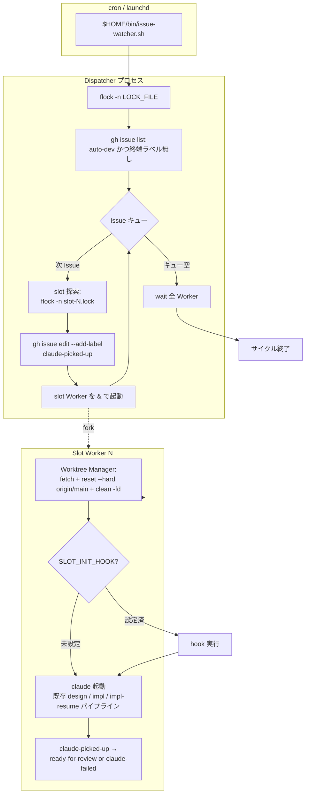
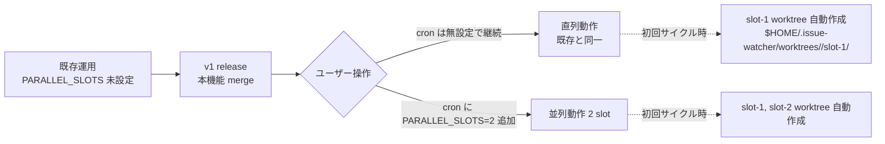

# Design Document

## Overview

**Purpose**: Phase C（親 Issue #13）は、Issue Watcher の「入口（auto-dev Issue 処理）」を
slot 並列化し、複数の `auto-dev` Issue を時間的に重ねて処理できるようにする。これにより
Claude Max の 5 時間ウィンドウを有効活用し、Issue 1 件の処理が Claude セッション中に
他 Issue を待たせる現状の直列ボトルネックを解消する。

**Users**: idd-claude を cron / launchd で常駐させている watcher operator。dogfooding 対象として
idd-claude 自身の repo も同 watcher で運用される。

**Impact**: 現在の `issue-watcher.sh` は `flock` で 1 サイクル全体を直列化し、`git checkout -B`
で同じ作業ツリーを再利用している。本フェーズでは (1) Dispatcher と slot Worker の責務分離、
(2) per-slot 永続 worktree の導入、(3) per-slot flock + Dispatcher 全体 flock の二段化、
(4) `claude-picked-up` ラベル付与による claim atomicity の明示化、(5) opt-in `SLOT_INIT_HOOK`
の追加、を行う。**`PARALLEL_SLOTS=1` がデフォルト**で既存運用は変更不要。

### Goals

- `PARALLEL_SLOTS=N` (N ≥ 2) で N 件の Issue を時間的に重ねて処理できる
- 同一 Issue が 2 slot に同時投入されない（claim atomicity）
- slot 間の作業ツリー干渉を物理隔離（per-slot worktree）で構造的に排除
- 既存 cron 登録文字列・env var・ラベル契約・exit code を一切変更せず opt-in
- `PARALLEL_SLOTS=1` 時は本機能導入前と外形的に同一挙動を維持

### Non-Goals

- ホットファイル（同一ファイルを複数 Issue が同時編集）の予防（Phase E / #18）
- merge queue 側並列 rebase（Phase A / #14・Phase D / #17）
- 複数 repo にまたがる横断 Dispatcher（既存通り cron 側で repo 別エントリ）
- slot 間 Issue 優先度・依存関係スケジューリング
- GitHub Actions 版ワークフロー (`.github/workflows/issue-to-pr.yml`) の並列化
- worktree 配下の依存キャッシュ共有・ホストレベル CPU/Memory 制御
- 動的 `PARALLEL_SLOTS` 増減（サイクル途中での slot 数変更）
- Claude Max 利用枠の自動制御
- Merge Queue / PR Iteration / Design Review Release 等サブプロセッサーの並列化

## Architecture

### Existing Architecture Analysis

現行 `local-watcher/bin/issue-watcher.sh` のサイクル構造（要約）:

1. PATH prepend → Config（`REPO` / `REPO_DIR` / `LOCK_FILE` / `LOG_DIR` 等）
2. `flock -n 200` で **repo 単位の cron 多重起動防止**
3. `cd $REPO_DIR && git fetch && git checkout main && git pull`
4. 各サブプロセッサー（Merge Queue / Merge Queue Re-check / Design Review Release / PR Iteration）
5. **Issue 処理ループ**:
   - `gh issue list` で auto-dev かつ終端ラベル無しの Issue を取得（先頭 5 件）
   - `while read issue` で逐次処理: Triage → mode 判定 → `claude-picked-up` 付与 → branch 作成 → claude 起動 → main に戻る

尊重すべき制約:

- 既存 env var 名（`REPO` / `REPO_DIR` / `LOG_DIR` / `LOCK_FILE` / `TRIAGE_MODEL` / `DEV_MODEL` 等）は壊さない
- 既存ラベル契約（`auto-dev` / `claude-picked-up` / `awaiting-design-review` / `ready-for-review` /
  `claude-failed` / `needs-decisions` / `skip-triage` / `needs-rebase` / `needs-iteration`）を変更しない
- `~/bin/issue-watcher.sh` の単一エントリポイント（cron 登録文字列）を保つ
- `LOCK_FILE` の意味（cron 多重起動防止）は維持
- 各 Issue 処理の終端ガード（`claude-picked-up` 等が付いている Issue を再ピックしない）を維持

解消する technical debt: 「1 サイクル全体を 1 flock + 1 worktree で直列化」という構造的制約。

### Architecture Pattern & Boundary Map

**採用パターン**: **Dispatcher / Worker パターン（単一プロセス内 fork-join）**。
別プロセスメッセージキューは導入せず、Dispatcher が空き slot を非ブロッキング flock で探索し、
取れた slot のバックグラウンドプロセスとして slot Worker を `&` 起動する。
Dispatcher はサイクル終端で `wait` で全 slot 終了を待ち合わせる。

**ドメイン／機能境界**:

- **Dispatcher**: Issue 候補取得・claim（`claude-picked-up` ラベル付与）・slot 投入・全 Worker 待ち合わせ
- **Slot Runner**: 1 件の Issue を 1 つの worktree で処理する Worker。既存「Triage 後の処理ロジック」全体を
  内包（branch 作成・claude 起動・成功/失敗ハンドリング）
- **Worktree Manager**: per-slot worktree の初期化・冪等再利用・最新化・破損検出フォールバック
- **Slot Lock Manager**: per-slot flock の acquire / release・lock 衝突時の skip ログ

**新規コンポーネントの根拠**:

- 別ファイル化せず **単一スクリプト内で関数群として分離** する。理由:
  - 既存 `~/bin/issue-watcher.sh` の単一エントリポイント契約（cron）を壊さない
  - install.sh はファイル単位 copy なので、追加ファイルが増えると配置忘れリスクが上がる
  - 関数命名規約 `_dispatcher_*` / `_slot_*` / `_worktree_*` を導入し責務境界を可視化
  - shellcheck の `source` 解決を避け、依存関係を最小化

**既存パターンの維持**:

- Config ブロック先頭集約 / 環境変数 override 設計 / `*_log` `*_warn` `*_error` ロガー / 終端ラベル
  ガードによる冪等な再ピック防止 / `flock 200>$LOCK_FILE` による cron 多重起動防止



**claim atomicity の保証メカニズム**:

1. Dispatcher は **単一プロセス**で動作する（複数 Dispatcher は `LOCK_FILE` の repo 単位 flock で排除）
2. `gh issue list` 結果を Dispatcher 内のメモリキューとして保持し、1 Issue を pop してから
   `claude-picked-up` ラベルを付与してから slot に投入する
3. ラベル付与は GitHub API 単一呼び出しで完了し、付与成功を確認してから slot 投入する
4. Worker への投入後は同じ Issue を再キューしない（ローカルキュー側の重複排除）
5. 次サイクルでの再ピックは `gh issue list` の `-label:claude-picked-up` フィルタで構造的に防がれる

### Technology Stack

| Layer | Choice / Version | Role in Feature | Notes |
|-------|------------------|-----------------|-------|
| Frontend / CLI | bash 4+ | Dispatcher / Slot Runner / Worktree Manager の関数群 | 既存スクリプトに追記 |
| Backend / Services | gh CLI / git CLI | claim ラベル付与・worktree 管理・PR 操作 | 既存依存のみ |
| Data / Storage | filesystem | per-slot worktree dir / per-slot lock file / per-slot ログファイル | `$HOME/.issue-watcher/` 配下 |
| Messaging / Events | bash プロセス & + wait | Dispatcher と Slot Worker のフォーク・ジョイン | 外部 MQ 不要 |
| Infrastructure / Runtime | flock (util-linux) / git worktree | per-slot 排他・物理隔離 | macOS は `brew install util-linux` 既存前提 |

## File Structure Plan

本機能では **既存ファイル `local-watcher/bin/issue-watcher.sh` への追記**を主体とし、新規ファイルは
作成しない。理由は Architecture セクション「新規コンポーネントの根拠」を参照。

### Directory Structure

```
local-watcher/
└── bin/
    └── issue-watcher.sh           # 本機能の全関数群を追記する単一エントリ
                                   # 既存の Config / Merge Queue / PR Iteration / Issue ループ
                                   # ブロックは温存し、Issue ループ部のみ Dispatcher に置換

$HOME/.issue-watcher/              # 既存運用ディレクトリ（LOG_DIR の親）
├── logs/
│   └── <repo-slug>/
│       ├── issue-<N>-<ts>.log     # 既存。slot Worker の Issue ログ
│       └── slot-<N>-<ts>.log      # 新規。Dispatcher → slot 投入時刻 / hook 実行ログ等の slot 別運用ログ
├── worktrees/                     # 新規。per-slot 永続 worktree 配置先
│   └── <repo-slug>/
│       ├── slot-1/                # PARALLEL_SLOTS>=1 で常に存在
│       ├── slot-2/                # PARALLEL_SLOTS>=2 のときのみ作成
│       └── slot-N/                # 必要分だけ on-demand 作成
└── <repo-slug>-slot-<N>.lock      # 新規。per-slot 排他ロック
```

`<repo-slug>` の決め方は既存 `REPO_SLUG="$(echo "$REPO" | tr '/' '-')"` を流用（例: `owner-repo`）。

### Modified Files

- `local-watcher/bin/issue-watcher.sh` — 以下を追加:
  - Config ブロックに `PARALLEL_SLOTS` / `SLOT_INIT_HOOK` / `WORKTREE_BASE_DIR` の env var 読み取り
  - `_parallel_validate_slots`: `PARALLEL_SLOTS` 検証関数
  - `_worktree_path` / `_worktree_ensure` / `_worktree_reset`: Worktree Manager
  - `_slot_lock_path` / `_slot_acquire` / `_slot_release`: Slot Lock Manager
  - `_hook_invoke`: `SLOT_INIT_HOOK` 起動関数
  - `_slot_run_issue`: Slot Runner（既存 Issue ループ本体を関数化したもの）
  - `_dispatcher_run`: Dispatcher 本体（既存 Issue ループを置換）
  - 既存 Issue 処理ループブロックを `_dispatcher_run` 呼び出しに置換
- `README.md` — 「並列実行（Phase C）」節を追加。`PARALLEL_SLOTS` / `SLOT_INIT_HOOK` の挙動・推奨値・
  ディスク容量上限・Migration Note を記述
- `repo-template/CLAUDE.md` / `CLAUDE.md` — 影響なし（Phase C は watcher 側のみで完結）
- `repo-template/.github/scripts/idd-claude-labels.sh` — 影響なし（ラベル契約変更なし）
- `install.sh` / `setup.sh` — 影響なし（追加ファイルなし。配置先 `~/bin/issue-watcher.sh` のまま）

## Requirements Traceability

| Requirement | Summary | Components | Interfaces / Decisions |
|-------------|---------|------------|------------------------|
| 1.1 | `PARALLEL_SLOTS` 読み取り | Config Block | env var デフォルト `1` |
| 1.2 | 未設定時に直列既定 | Config Block | `${PARALLEL_SLOTS:-1}` |
| 1.3 | 不正値で ERROR + サイクル中断 | `_parallel_validate_slots` | `[[ "$PARALLEL_SLOTS" =~ ^[1-9][0-9]*$ ]]` で検証 |
| 1.4 | `=1` で外形互換 | Dispatcher / Worktree Manager | slot-1 のみ作成・他資源不作成（NFR 4.1） |
| 1.5 | README 明記 | README 並列実行節 | 推奨値・ディスク量・運用上限 |
| 2.1 | 単一プロセス Dispatcher | `_dispatcher_run` | サイクル中 1 プロセス |
| 2.2 | claim → 投入 | Dispatcher | label 付与成功後に Worker fork |
| 2.3 | label 失敗で skip | Dispatcher | gh edit 失敗 → WARN + 次 Issue へ |
| 2.4 | 同一 Issue 二重投入なし | Dispatcher | ローカルキュー pop semantics |
| 2.5 | 空き slot を継続投入 | Dispatcher / Slot Lock Manager | 各 Issue ごと slot 探索ループ |
| 2.6 | サイクル終端 wait | Dispatcher | `wait` で全 PID 待ち合わせ |
| 2.7 | dispatcher 異常終了で再ピック無効 | Existing label-based filter | 既存 `-label:claude-picked-up` ガード |
| 3.1 | per-slot worktree dir | Worktree Manager | `$HOME/.issue-watcher/worktrees/<slug>/slot-N/` |
| 3.2 | 未初期化なら 1 度作成 | `_worktree_ensure` | `git worktree add` 冪等化 |
| 3.3 | 既存なら再利用 | `_worktree_ensure` | `git worktree list --porcelain` 確認 |
| 3.4 | Issue 投入時に reset --hard | `_worktree_reset` | `git fetch && git reset --hard origin/main && git clean -fd` |
| 3.5 | 他 slot ツリー書き込み禁止 | Slot Runner | `cd $WT_PATH` で隔離・元 `REPO_DIR` には触れない |
| 3.6 | 初期化失敗で claude-failed 化 | Worktree Manager / Slot Runner | エラー処理共通フロー |
| 3.7 | `<repo-slug>` で worktree 隔離 | Worktree Manager | 既存 `REPO_SLUG` 流用 |
| 4.1 | per-slot lock path | Slot Lock Manager | `$HOME/.issue-watcher/<slug>-slot-N.lock` |
| 4.2 | 非ブロッキング acquire | `_slot_acquire` | `flock -n` |
| 4.3 | 取得失敗で skip + INFO ログ | `_slot_acquire` | exit non-zero on 失敗 |
| 4.4 | slot 間別ファイル lock | Slot Lock Manager | per-slot fd 番号も別 |
| 4.5 | repo 単位 LOCK_FILE 維持 | Existing | 変更なし |
| 5.1 | `SLOT_INIT_HOOK` 読み取り | Config Block | `${SLOT_INIT_HOOK:-}` |
| 5.2 | 未設定でフック非起動 | `_hook_invoke` | 空文字 / 未設定で early return |
| 5.3 | reset 後・claude 前に 1 度起動 | Slot Runner | reset → hook → claude の順序 |
| 5.4 | env var 引き継ぎ | `_hook_invoke` | export `IDD_SLOT_NUMBER` / `IDD_SLOT_WORKTREE` |
| 5.5 | eval せず直接 exec | `_hook_invoke` | 絶対パス引数のみ受理・`bash -c` 不使用 |
| 5.6 | 存在 / 実行権限失敗で claude-failed | `_hook_invoke` | `[ -x "$hook" ]` 検証 |
| 5.7 | 非ゼロ exit で claude-failed | `_hook_invoke` | exit code + stderr 末尾を記録 |
| 5.8 | README 責任分界 | README | フック内容はユーザー責任 |
| 6.1 | slot 番号 + Issue 番号 prefix | Logger | `[slot-N] #M` |
| 6.2 | slot 別ログファイル | Logger / Slot Runner | `slot-N-<ts>.log` + 既存 `issue-N-<ts>.log` |
| 6.3 | サイクル開始ログ | Dispatcher | `対象 X 件 / 利用可能 slot Y 件` |
| 6.4 | 投入時刻・完了時刻 | Dispatcher | `dispatched / completed` ログ行 |
| 6.5 | timestamp 書式維持 | Logger | `[YYYY-MM-DD HH:MM:SS]` |
| 7.1 | 既存 env var 名維持 | Config Block | 追加のみ |
| 7.2 | 既存 cron 文字列維持 | Entry point | `~/bin/issue-watcher.sh` のまま |
| 7.3 | 既存ラベル契約維持 | Slot Runner / Existing | 変更なし |
| 7.4 | 終端ラベル除外維持 | Existing | 変更なし |
| 7.5 | exit code 維持 | Dispatcher | 0=正常 / cron 多重起動 / 1=不正値 / 既存と同等 |
| 7.6 | `=1` で他 slot 資源を不生成 | Dispatcher / Worktree Manager | slot index ループは `1..PARALLEL_SLOTS` |
| 8.1 | `=1` 同等性 | Dispatcher | 直列パスを保つ |
| 8.2 | `=2` 並列観察可 | Logger | timestamp 重なり |
| 8.3 | 同一 Issue 重複なし | Dispatcher | ローカルキュー + label claim |
| 8.4 | worktree 干渉なし | Worktree Manager | per-slot dir |
| 8.5 | hook 起動可観測 | `_hook_invoke` | hook ログ行 |
| NFR 1.1 | 並列短縮率 | Dispatcher | 50%-70% 目安 |
| NFR 1.2 | 投入オーバーヘッド ≤ 5s | Dispatcher / `_slot_acquire` | label edit + flock + fork |
| NFR 2.1 | 1 slot 失敗で他に伝播せず | Slot Runner | サブシェル独立 |
| NFR 2.2 | label のみで claim 成立 | Dispatcher | Worker stdout 不依存 |
| NFR 2.3 | hook eval 禁止 | `_hook_invoke` | 直接 exec 強制 |
| NFR 3.1 | slot prefix 出力 | Logger | `slot-N:` prefix |
| NFR 3.2 | ログ分離 | Logger | per-slot file |
| NFR 4.1 | 未使用 slot 資源不生成 | Dispatcher / Worktree Manager | `=1` 時 slot-2 以降不在 |
| NFR 4.2 | ディスク量目安を README 明記 | README | フル clone × N 倍 |

## Components and Interfaces

### Configuration Layer

#### Config Block 拡張

| Field | Detail |
|-------|--------|
| Intent | env var 読み取り・デフォルト値定義・前提検査の集約 |
| Requirements | 1.1, 1.2, 5.1, 7.1 |

**Responsibilities & Constraints**

- 既存 Config ブロック末尾（モデル設定後）に追記
- env var 名追加のみ。既存名の意味・デフォルトは変更しない
- 検証は Config 段階では行わず、`_parallel_validate_slots` を Dispatcher 起動直前で呼ぶ

**Dependencies**

- Inbound: 起動時に bash 自身が読み込む (Critical)
- Outbound: Worktree Manager / Slot Lock Manager が参照 (Critical)

**Contracts**: State [x]

```bash
# 新規追加 env var（既存 env var 名は一切変更しない）
PARALLEL_SLOTS="${PARALLEL_SLOTS:-1}"
SLOT_INIT_HOOK="${SLOT_INIT_HOOK:-}"
# 上書き可能だがデフォルトで十分。テスト時のみ override する想定。
WORKTREE_BASE_DIR="${WORKTREE_BASE_DIR:-$HOME/.issue-watcher/worktrees}"
SLOT_LOCK_DIR="${SLOT_LOCK_DIR:-$HOME/.issue-watcher}"
```

#### `_parallel_validate_slots`

| Field | Detail |
|-------|--------|
| Intent | `PARALLEL_SLOTS` を整数として検証し、不正なら ERROR + サイクル中断 |
| Requirements | 1.3 |

```bash
# Returns 0 if valid; logs ERROR and returns 1 if invalid.
_parallel_validate_slots() {
  if [[ ! "$PARALLEL_SLOTS" =~ ^[1-9][0-9]*$ ]]; then
    echo "[$(date '+%F %T')] ERROR: PARALLEL_SLOTS は正の整数を指定してください: '$PARALLEL_SLOTS'" >&2
    return 1
  fi
}
```

- Preconditions: `PARALLEL_SLOTS` が export 済
- Postconditions: 0 → Dispatcher 続行 / 非ゼロ → 上位で `exit 1`（既存 ERROR 時の終了規約と整合）
- Invariants: 副作用なし（読み取りのみ）

### Worktree Manager

#### `_worktree_path`

| Field | Detail |
|-------|--------|
| Intent | slot 番号から worktree ディレクトリの絶対パスを導出 |
| Requirements | 3.1, 3.7 |

```bash
# echo の標準出力で path を返す。引数: $1=slot_number
_worktree_path() {
  local n="$1"
  echo "$WORKTREE_BASE_DIR/$REPO_SLUG/slot-$n"
}
```

#### `_worktree_ensure`

| Field | Detail |
|-------|--------|
| Intent | per-slot worktree が無ければ作成、有れば再利用（冪等） |
| Requirements | 3.1, 3.2, 3.3, 3.6, 3.7 |

**Responsibilities & Constraints**

- `git worktree list --porcelain` で重複検出。既存ならスキップ
- 不在なら親ディレクトリ作成 → `git worktree add <path> origin/main` で初回作成
- worktree dir 自体は存在するが `.git` ファイル参照が壊れている場合（fail-soft）:
  - dir を退避（`mv slot-N slot-N.broken-<ts>`）→ 再作成
- 失敗時は `return 1`、Slot Runner が WARN ログ出力 + claude-failed 化
- **`PARALLEL_SLOTS=1` のときは slot-2 以降を作らない**（NFR 4.1）。slot 番号で gate 済

**Dependencies**

- Inbound: Slot Runner が Issue 受信時に呼び出し (Critical)
- Outbound: `git` (Critical)

**Contracts**: Service [x]

```bash
# 引数: $1=slot_number。返り値: 0=ok / 1=失敗
# 副作用: $WORKTREE_BASE_DIR/<slug>/slot-N/ を作成または再利用
_worktree_ensure() { ... }
```

- Preconditions: `cd $REPO_DIR` で repo を最新化済（`git fetch origin --prune` 実行済）
- Postconditions: 戻り値 0 のとき、worktree path に commit が checkout されている

#### `_worktree_reset`

| Field | Detail |
|-------|--------|
| Intent | Issue 投入時に worktree を `origin/main` の最新状態へ強制リセット |
| Requirements | 3.4, 3.5 |

**Responsibilities & Constraints**

- 操作シーケンス: `git -C "$WT" fetch origin --prune` → `git -C "$WT" reset --hard origin/main` →
  `git -C "$WT" clean -fdx`
- `clean -fdx` は untracked + ignored 共に消す。前回 Issue の build artifact / `node_modules` を残さない
- 失敗時は `return 1` → Slot Runner が claude-failed 化（Req 3.6）

**Contracts**: Service [x]

```bash
# 引数: $1=worktree_path。返り値: 0=ok / 1=失敗
_worktree_reset() { ... }
```

### Slot Lock Manager

#### `_slot_lock_path`

| Field | Detail |
|-------|--------|
| Intent | slot 番号から lock file path を導出 |
| Requirements | 4.1 |

```bash
_slot_lock_path() {
  local n="$1"
  echo "$SLOT_LOCK_DIR/${REPO_SLUG}-slot-${n}.lock"
}
```

#### `_slot_acquire` / `_slot_release`

| Field | Detail |
|-------|--------|
| Intent | per-slot 非ブロッキング flock の取得・解放 |
| Requirements | 4.2, 4.3, 4.4 |

**Responsibilities & Constraints**

- bash の fd は 200 番台を per-slot に割当（200 + slot_number）
- 既存 `LOCK_FILE` の fd 200 と衝突しないよう、slot 用は 210 以降を使用（200 + 10 + N）
- `flock -n` で非ブロッキング、失敗時は INFO ログ + return 1
- Slot Runner はサブシェルで動くため、サブシェル終了で fd は自動解放される
  → 明示 `_slot_release` は不要だが命名上の対称性のため定義（実装は no-op か `flock -u`）

**Contracts**: Service [x]

```bash
# 引数: $1=slot_number
# 戻り値: 0=acquired / 1=他プロセスがロック中
# 副作用: 成功時 fd (210+N) が open 状態
_slot_acquire() {
  local n="$1"
  local lock_file
  lock_file="$(_slot_lock_path "$n")"
  local fd=$((210 + n))
  eval "exec ${fd}>\"\$lock_file\""
  flock -n "$fd" || return 1
}
```

`eval` を使うが入力は **数値 `n` のみ**で外部入力は流入しない（NFR 2.3 と矛盾しない）。
代替案として `exec {fd}>"$lock_file"` の動的 fd allocation も検討したが、bash 4.1+ 限定機能で
macOS 標準 bash 3.2 を想定しないため採用しない。

### Hook Layer

#### `_hook_invoke`

| Field | Detail |
|-------|--------|
| Intent | `SLOT_INIT_HOOK` を絶対パス起動で 1 度だけ実行 |
| Requirements | 5.1, 5.2, 5.3, 5.4, 5.5, 5.6, 5.7, NFR 2.3 |

**Responsibilities & Constraints**

- 未設定 / 空文字なら 0 で early return（hook 不起動）
- 設定値が絶対パスかつ `-x` 実行可能ファイルでなければ ERROR ログ + return 1
  → 上位で claude-failed 化（Req 5.6）
- env 引き継ぎ: `IDD_SLOT_NUMBER` / `IDD_SLOT_WORKTREE` / `PARALLEL_SLOTS` / `REPO` / `REPO_DIR`
- cwd: worktree path（既に `cd "$WT"` 済の前提）
- **直接 exec のみ**: `bash -c "$SLOT_INIT_HOOK"` や `eval` は禁止。引数文字列を空白分割しない
  → 路径に空白を含むケースを許容しない（README に明記）
- 子プロセスの stdout / stderr は slot ログにマージ。stderr 末尾を補足保存し、失敗時にログに転記（Req 5.7）

**Dependencies**

- Inbound: Slot Runner が `_worktree_reset` 成功直後に呼び出し (Critical)
- Outbound: ユーザー定義スクリプト (Optional / 未定義時は no-op)

**Contracts**: Service [x] / Event [x]

```bash
# 引数: $1=slot_number, $2=worktree_path
# 戻り値: 0=success / 1=hook 起動失敗 (path 不在 / 非実行可能 / 非ゼロ exit)
_hook_invoke() {
  local n="$1" wt="$2"
  [ -z "${SLOT_INIT_HOOK:-}" ] && return 0
  [ -x "$SLOT_INIT_HOOK" ] || { echo "ERROR: SLOT_INIT_HOOK 不在/非実行可能: $SLOT_INIT_HOOK" >&2; return 1; }
  IDD_SLOT_NUMBER="$n" IDD_SLOT_WORKTREE="$wt" "$SLOT_INIT_HOOK"
}
```

- Preconditions: `cd "$wt"` 済
- Postconditions: 0 → claude 起動可 / 1 → claude-picked-up を claude-failed に置換し次 Issue へ

### Dispatcher

#### `_dispatcher_run`

| Field | Detail |
|-------|--------|
| Intent | サイクル中 1 度起動され、Issue キューを slot に逐次投入し全 Worker を待ち合わせる |
| Requirements | 2.1, 2.2, 2.3, 2.4, 2.5, 2.6, 2.7, 6.3, 6.4, NFR 1.1, NFR 1.2 |

**Responsibilities & Constraints**

- 既存の `gh issue list` 結果取得を Dispatcher 内に移設
- Issue キューは bash 配列ではなく `<<<` heredoc + `while read` で消費（既存方式互換）
- 各 Issue ループで:
  1. 空き slot 探索: `for n in 1..PARALLEL_SLOTS`、最初に `_slot_acquire` 成功した slot を採用
  2. 全 slot busy なら **busy waiting + sleep 1** で 1 つ完了するまで待機（簡易実装）
     - 代替案: `wait -n` で「いずれか 1 子プロセスの終了を待つ」。bash 4.3+ 必要、macOS 標準 bash 3.2 では未対応
     - **採用案**: Dispatcher 自身が抱えるバックグラウンド PID 配列を保持し、`wait -n PID...` を用いる
       （bash 4.3+ 前提。CLAUDE.md に bash 4+ と記載済なので OK）
  3. slot 取得後、`gh issue edit --add-label claude-picked-up` を実行
     - **失敗時**: WARN ログ + slot lock 解放 + 次 Issue へ（Req 2.3）
  4. 成功時、Slot Runner を `_slot_run_issue ... &` でバックグラウンド起動 + PID を配列に保存
  5. ログに `[YYYY-MM-DD HH:MM:SS] dispatcher: dispatched #<N> -> slot-<n>` を記録（Req 6.4）
- Issue キュー枯渇後、`wait` で残全 Worker を待ち合わせ（Req 2.6）
- サイクル開始時に `対象 Issue X 件 / 利用可能 slot Y 件` ログ（Req 6.3）

**Dependencies**

- Inbound: メインスクリプトのトップレベルから 1 回呼ばれる (Critical)
- Outbound: `_slot_acquire` / Slot Runner / `gh` / `git`

**Contracts**: Service [x] / Batch [x]

```bash
# 引数なし。グローバル env / config を参照。
# 戻り値: 既存 exit code 規約に従う（0=正常 / 異常時は既存と同じ取り扱い）
# 副作用: 各 Issue を slot に dispatch、最終的に全 Worker を wait
_dispatcher_run() { ... }
```

#### Slot Runner: `_slot_run_issue`

| Field | Detail |
|-------|--------|
| Intent | 1 件の Issue を 1 つの slot worktree で処理する Worker。既存 Issue ループ本体の関数化 |
| Requirements | 2.7, 3.4, 3.5, 3.6, 5.3, 5.6, 5.7, 6.1, 6.2, NFR 2.1, NFR 2.2, NFR 3.1, NFR 3.2 |

**Responsibilities & Constraints**

- バックグラウンドサブシェル `( ... ) &` で起動するため、内部での `cd` / 環境変数変更は親に伝播しない（Req 3.5 を構造的に保証）
- 入口で `_slot_acquire` 済を前提（Dispatcher が取得済の lock fd を継承）
- 処理シーケンス:
  1. slot 専用ログファイル `$LOG_DIR/slot-<N>-<TS>.log` を open（Issue 専用ログとは別、Req 6.2）
  2. `_worktree_ensure` → 失敗時 claude-failed 化 + return
  3. `cd "$WT"`
  4. `_worktree_reset` → 失敗時 claude-failed 化 + return
  5. `_hook_invoke` → 失敗時 claude-failed 化 + return（Req 5.6, 5.7）
  6. **既存 Issue 処理ロジック**（Triage / branch 作成 / claude 起動 / mode 別ディスパッチ /
     成功時 ready-for-review or design 移行 / 失敗時 claude-failed）を関数本体としてそのまま呼び出し
  7. 完了時刻ログ記録（Req 6.4）
- すべてのログ出力に `slot-<N>: #<Issue>` prefix を付与（Req 6.1, NFR 3.1）
- ログタイムスタンプ書式は既存 `[YYYY-MM-DD HH:MM:SS]` を維持（Req 6.5）
- **claude-failed 化の仕様**: 既存 `mark_issue_failed` パスを再利用。新規実装はしない

**Dependencies**

- Inbound: Dispatcher がフォーク (Critical)
- Outbound: `git worktree` / `gh` / `claude` / `_hook_invoke` / 既存 `run_impl_pipeline` / 既存 design パイプライン

**Contracts**: Service [x] / State [x]

```bash
# 引数: $1=slot_number, $2=issue_json (gh issue list の 1 行)
# 戻り値: 0=success / 非ゼロ=失敗（既存 mark_issue_failed パスで claude-failed 化済）
_slot_run_issue() { ... }
```

- Preconditions: Dispatcher が `claude-picked-up` ラベルを付与済 / `_slot_acquire` 取得済
- Postconditions: Issue ラベルが `ready-for-review` / `awaiting-design-review` / `claude-failed` の
  いずれかに遷移済（Req 7.3 既存契約維持）
- Invariants: 他 slot の worktree / 元 `REPO_DIR` 直下の作業ツリーには触れない（Req 3.5）

### Logger 拡張

| Field | Detail |
|-------|--------|
| Intent | slot 番号 + Issue 番号を含む grep 可能 prefix を統一書式で出力 |
| Requirements | 6.1, 6.2, 6.5, NFR 3.1, NFR 3.2 |

**ログ書式**:

- Dispatcher: `[YYYY-MM-DD HH:MM:SS] dispatcher: <message>`
- Slot Worker: `[YYYY-MM-DD HH:MM:SS] slot-<N>: #<Issue>: <message>`

**ログファイル分離**:

- Dispatcher のサイクル管理ログは標準出力（既存と同じ stdout / cron mailer 経由）
- Slot Worker は **既存 `$LOG_DIR/issue-<N>-<TS>.log` をそのまま継続使用**し、加えて
  Worker の運用ログ（slot 開始 / 終了 / hook 結果）を `$LOG_DIR/slot-<N>-<TS>.log` に書く
- Slot Worker の stdout を Dispatcher の stdout にもミラーするが、行頭に `slot-<N>:` prefix を付ける
  → cron mailer / `tail -f` 双方で識別可能（NFR 3.1）

## Data Models

### Domain Model

本機能は永続データ（DB）を持たない。状態は filesystem に薄く分散する:

| Entity | Storage | Owner | Lifecycle |
|--------|---------|-------|-----------|
| Slot Lock | `$HOME/.issue-watcher/<slug>-slot-N.lock` | Slot Lock Manager | プロセス終了時 fd close で開放、ファイル自体は永続 |
| Slot Worktree | `$HOME/.issue-watcher/worktrees/<slug>/slot-N/` | Worktree Manager | 一度作ったら再利用。破損時のみ退避 + 再作成 |
| Slot Log | `$LOG_DIR/slot-N-<TS>.log` | Slot Runner | サイクルごと新規。ローテーション既存方針に依存 |
| Issue Log | `$LOG_DIR/issue-N-<TS>.log` | Slot Runner | 既存通り、Issue ごと |
| Repo Lock | `$LOCK_FILE` (既存) | Dispatcher entry | cron 多重起動防止のみ |

### State Transition (Issue ラベル)

既存の Issue ラベル状態機械を **そのまま維持**（Req 7.3 / 7.4）:

```
auto-dev (open Issue 入口)
  └─> Triage 実行
        ├─ needs-decisions → 人間待ち
        ├─ skip-triage / impl-resume / Architect 不要 → claude-picked-up → ...
        └─ Architect 必要 → claude-picked-up → ...
              └─> Slot Runner 完了
                    ├─ design 成功    → awaiting-design-review (claude-picked-up 除去)
                    ├─ impl 成功      → ready-for-review (claude-picked-up 除去)
                    └─ いずれか失敗   → claude-failed (claude-picked-up 除去)
```

**本機能で追加された遷移**: `_worktree_ensure` / `_worktree_reset` / `_hook_invoke` 失敗時は
**既存 `mark_issue_failed` 経路と同じ** `claude-picked-up → claude-failed` 遷移を辿る
（Req 3.6, 5.6, 5.7）。新ラベルや新中間状態は導入しない。

## Error Handling

### Error Strategy

各エラーは原則 **既存パターンに揃える**:

- 既存 `*_log` / `*_warn` / `*_error` ロガー命名規約を踏襲（`dispatcher_log` / `slot_log` / `slot_warn` / `slot_error`）
- 失敗時の Issue ラベル遷移は既存 `mark_issue_failed` パスを再利用（Req 7.3 互換）
- 1 slot の失敗が他 slot を巻き込まない（NFR 2.1）→ 各 Worker が独立サブシェル

### Error Categories and Responses

| カテゴリ | 例 | 対応 |
|----------|-----|------|
| Config Error | `PARALLEL_SLOTS` 不正値 | ERROR ログ + サイクル中断 (Req 1.3) |
| Claim Error | `claude-picked-up` 付与失敗 | WARN ログ + slot lock 解放 + 次 Issue へ (Req 2.3) |
| Worktree Error | `git worktree add` / `git fetch` / `reset` 失敗 | WARN ログ + claude-failed 化 (Req 3.6) |
| Hook Error | path 不在 / 非実行可能 / 非ゼロ exit | ERROR ログ（exit code + stderr 末尾）+ claude-failed 化 (Req 5.6, 5.7) |
| Slot Lock Error | `flock -n` 失敗 = 同一 slot に既存プロセス | INFO ログ「slot 多重起動を回避」+ skip (Req 4.3) |
| Worker Crash | サブシェル内 unhandled error | サブシェル終了 → Dispatcher の `wait` で exit code を捕捉、Issue が claude-failed 化されていなければ Dispatcher 側で fallback（既存パターン） |

## Testing Strategy

本リポジトリには unit test フレームワークがないため、`shellcheck` + 手動スモークテスト + `actionlint`
の組み合わせで検証する（CLAUDE.md 「テスト・検証」節準拠）。

### 静的解析

1. `shellcheck local-watcher/bin/issue-watcher.sh` を warning ゼロでクリア
2. `actionlint .github/workflows/*.yml` でクリア（YAML 変更なしだが念のため）
3. `bash -n local-watcher/bin/issue-watcher.sh` で構文 OK

### 手動スモークテスト

1. **`PARALLEL_SLOTS=1` 回帰テスト**: 既存 cron 設定で `PARALLEL_SLOTS` 未設定のまま 1 サイクル流す
   - 確認: ログ書式・slot-2 lock 不在・slot-2 worktree 不在・既存 Issue ログファイル名一致 (Req 1.4, 7.6)
   - dry run: `REPO=owner/test REPO_DIR=/tmp/test-repo $HOME/bin/issue-watcher.sh` で対象なし状態
2. **`PARALLEL_SLOTS=2` 並列テスト**: 2 件の `auto-dev` Issue を同時に立てる
   - 確認: slot-1 / slot-2 ログのタイムスタンプが時間的に重なる (Req 8.2)
   - 確認: 同一 Issue 番号が 2 slot のログに出ない (Req 8.3)
3. **claim 競合テスト**: Dispatcher 起動中に手動で `gh issue edit --add-label claude-picked-up` で先回り
   - 確認: gh issue list の事前フィルタで除外され、Dispatcher が再投入しない
4. **`SLOT_INIT_HOOK` 動作テスト**: `/tmp/hook.sh` (`#!/bin/bash; echo "hook for slot $IDD_SLOT_NUMBER" >&2; exit 0`)
   - 確認: 各 slot 初期化で 1 度ずつ呼ばれる (Req 8.5)
   - 失敗系: hook 内で `exit 1` → claude-failed 化を確認 (Req 5.7)
   - 不在系: 存在しない path 指定 → ERROR + claude-failed 化を確認 (Req 5.6)
5. **worktree 破損リカバリ**: `slot-1/.git` を破壊 → 次サイクルで自動再作成を確認

### Integration Tests (E2E)

1. dogfooding: idd-claude 自身に test issue を立て、`PARALLEL_SLOTS=2` で 2 件処理が並列に走る
2. 既存 Merge Queue Processor / PR Iteration Processor / Design Review Release Processor が
   Dispatcher 前後の位置で従来通り動作する（Phase C は入口のみ並列化、サブプロセッサーは現状維持）

### Performance Tests

1. **NFR 1.1**: 2 件の Issue を `PARALLEL_SLOTS=1` と `PARALLEL_SLOTS=2` で同条件処理し、総時間が
   並列で 50%-70% に短縮されることをログタイムスタンプから確認
2. **NFR 1.2**: Dispatcher の slot 投入オーバーヘッド（label edit + flock + fork）を計測し、
   1 Issue あたり 5 秒以内に収まることを確認

## Migration Strategy



**dogfooding migration リスク**:

- 本変更が next cron tick で idd-claude 自身に走る
- worktree 初期化は **既存 `$REPO_DIR` を流用しない**ため、初回実行時に `git worktree add` + 全 fetch
  が走る（数 GB の repo では数分の追加遅延）
- 対策: README に「初回サイクルは worktree 作成のため通常より遅い」と明記
- `PARALLEL_SLOTS=1` がデフォルトなので **slot-2 以降の追加コストは opt-in 後にのみ発生**

## Security Considerations

- **`SLOT_INIT_HOOK` のコマンド注入耐性** (NFR 2.3, Req 5.5):
  - hook value は環境変数として運用者が設定する。第三者が任意設定できる経路はないが、
    値そのものをシェル展開せず **絶対パス起動のみ** に制限することで、誤って `; rm -rf /` 等が
    付与されても無害化する
  - 引数文字列の空白分割を許容しないため、`SLOT_INIT_HOOK="/path/to/script.sh --flag"` のような
    引数渡しはサポートしない（README に明記、ユーザーは wrapper script を用意する）
- **lock file path injection 防止**: `REPO_SLUG` は `tr '/' '-'` 後の値のみ受理（既存挙動）
- **worktree path injection 防止**: `<slug>` 同上、slot 番号は `_parallel_validate_slots` 通過済の正整数
- 既存 secrets は変更なし（GH_TOKEN / Anthropic API Key 等の取扱は不変）

## Performance & Scalability

- `PARALLEL_SLOTS` の推奨値: README に「初期推奨は 2、3 以上は Claude Max 5h window と相談」程度の
  抽象表現に留める（Open Question 3 への design 側の判断）。具体モデルプラン依存数値は記載しない
- ディスク容量: フル clone × `PARALLEL_SLOTS` 倍に近い容量が `$HOME/.issue-watcher/worktrees/` 下に必要
  - README に明記（NFR 4.2）
- worktree の `git fetch` は repo 単位 `$REPO_DIR` の fetch とは別経路。サイクル中に
  `_dispatcher_run` 開始前の repo fetch + slot 開始時の worktree fetch で 2 回走るが、
  オブジェクトは重複ダウンロードされない（同一 `.git/objects` を参照する worktree の特性）

## Open Questions（Architect 判断）

requirements.md 末尾の Open Questions に対する design 側の判断:

1. **Dispatcher と Slot を別ファイルに分けるか**: **単一ファイル維持**を採用。理由は「新規コンポーネントの根拠」節を参照
2. **`SLOT_INIT_HOOK` 失敗時の方針**: 要件通り「該当 Issue を `claude-failed` 化して次 Issue へ」を採用。
   サイクル全体 abort は採らない理由は「1 slot 失敗で他 slot を巻き込まない」NFR 2.1 と整合
3. **`PARALLEL_SLOTS` 推奨値の README 記載**: 抽象表現「初期推奨 2、3 以上は Claude Max 枠と相談」を採用
4. **既存サブプロセッサー (Merge Queue / PR Iteration / Design Review Release) の配置**:
   **現状の直列起動位置を維持**（Dispatcher の前で逐次実行）。Phase C は入口並列化のみで本フェーズは
   サブプロセッサー並列化を Out of Scope と requirements で明示済
