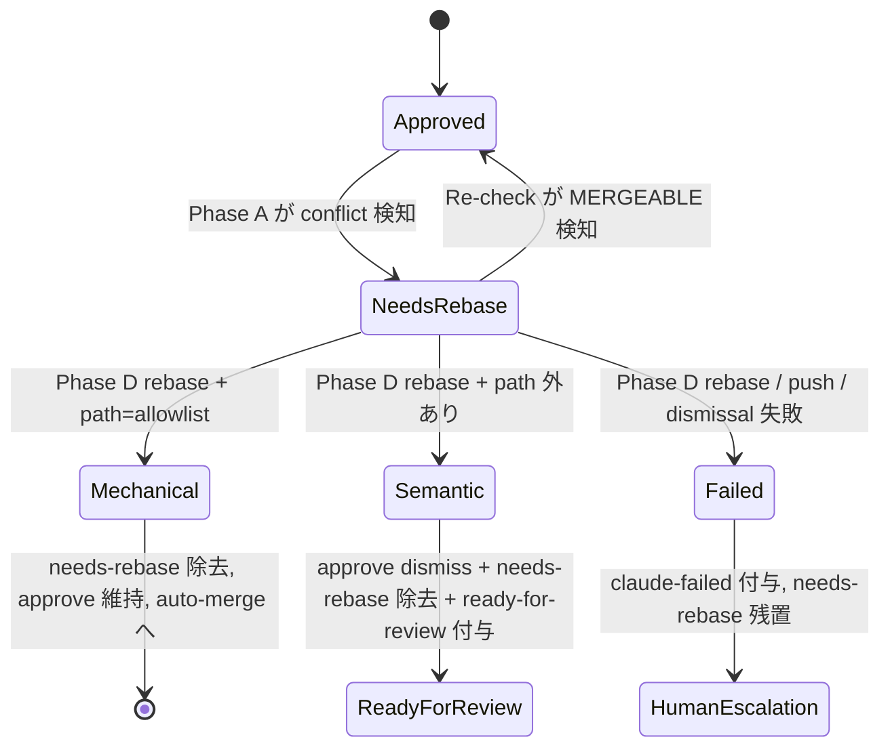
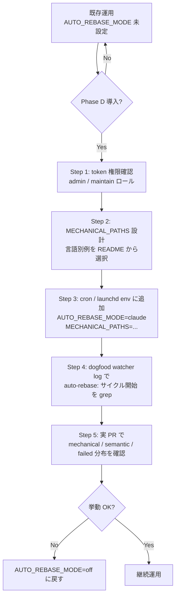

# Design Document

## Overview

**Purpose**: Phase D は、Phase A（#14）と Re-check Processor（#27）が `needs-rebase`
ラベルで人間判断に回している approved PR を、Claude による rebase で機械的に救済する
新しい watcher Processor を導入する。Claude rebase の差分が運用者宣言の allowlist
（`MECHANICAL_PATHS`）に閉じている場合のみ既存 approve を維持して auto-merge へ進め、
allowlist 外の差分が出た場合は approve を dismissal API で剥がし `ready-for-review` で
再レビューを誘導する。本機能は `AUTO_REBASE_MODE` 環境変数による明示 opt-in 制で、
未設定 / `off` / 不正値の場合は本機能導入前と完全に同一の挙動を保つ。

**Users**: idd-claude の watcher 運用者（Phase A 既導入の cron / launchd オペレータ）と、
当該 repo の PR を approve する人間レビュワー。前者は Phase D を有効化することで
lockfile 等の機械的 conflict を自動消化でき、後者は semantic 書き換えが自動 merge を
バイパスしないことの保証を得る。

**Impact**: 現在の watcher は `needs-rebase` を付けた時点で当該 PR を「人間が解消する
までは何も触らない」状態にしていた。Phase D 導入後は、運用者が opt-in した repo に
限り、`needs-rebase` 付き approved PR が新たな Processor に流れ込み、Claude rebase
結果の path filter 判定に基づいて 3 つの結末（`mechanical` / `semantic` / `failed`）
のいずれかに分類される。Phase A / Re-check の挙動・既存ラベル・既存 env var・既存
cron 登録文字列はすべて不変（NFR 1.1〜1.5）。

### Goals

- approved + `needs-rebase` 状態で停滞する PR を、運用者が宣言した範囲で自動解消する
  経路を `AUTO_REBASE_MODE` opt-in で提供する
- `MECHANICAL_PATHS` allowlist で「人間レビュー不要」と宣言された path に閉じる
  rebase だけを `mechanical` 扱いとし、approve を維持して auto-merge に到達させる
- allowlist 外の差分（= semantic 判断含む）が出た場合は approve を確実に dismissal
  し、`ready-for-review` ラベルと再レビュー誘導コメントで人間 gate に戻す
- rebase 失敗（conflict / timeout / push / dismissal API エラー）はすべて
  `claude-failed` ラベルと原因種別コメントで人間エスカレートする
- `AUTO_REBASE_MODE` 未設定 / `off` / 不正値で挙動不変（後方互換性絶対）
- watcher の `shellcheck` 警告ゼロを維持し、log prefix `auto-rebase:` で grep 観測可能

### Non-Goals

- 予防的 overlap 検知（Phase E / #18 のスコープ）
- AST diff による意味的差分判定（言語依存度が高いため対象外。allowlist 方式で start）
- Claude 自己申告方式の `mechanical` / `semantic` 判定（精度・再現性が allowlist より
  劣るため本設計では採用しない。Open Questions Q2 で fallback 余地のみ言及）
- `needs-rebase` ラベルが付かない通常 PR への介入（Phase A の対象外）
- Phase A 本体（#14）/ Re-check Processor（#27）/ PR Iteration（#26）の挙動変更
- `MECHANICAL_PATHS` の既定値として特定言語の lockfile 名を内蔵すること（NFR 3.2）
- 外部 Feature Flag SaaS との連携

## Architecture

### Existing Architecture Analysis

`local-watcher/bin/issue-watcher.sh` は 1 つの bash プロセスが flock で多重起動を防ぎつつ、
複数の Processor を**直列に**実行する単一スクリプト構成。各 Processor は
`process_<name>()` 関数として定義され、グローバル env / ラベル / GitHub API を
共有する。Phase D が尊重すべき既存パターン:

- **Opt-in / opt-out gate**: 各 Processor の冒頭で `[ "$<FLAG>" != "true" ]` または
  `[ "$<FLAG>" == "false" ]` で早期 return（`MERGE_QUEUE_ENABLED` / `PROMOTE_PIPELINE_ENABLED`
  等が両パターンの実例）。Phase D は #15 Promote Pipeline と同じ **opt-in 制**（既定 OFF）
- **Logger 三点セット**: `<prefix>_log` / `<prefix>_warn` / `<prefix>_error`
  （`mq_*` / `mqr_*` / `pi_*` / `drr_*` / `pp_*` / `qa_*` / `sav_*`）
- **Log prefix 規約**: `[YYYY-MM-DD HH:MM:SS] [$REPO] <processor>:` の 3 段 prefix
  （Issue #119）。grep 抽出を機械化するため
- **GitHub API 呼び出し**: `gh pr list --search` で server-side filter、`jq` で
  client-side fail-safe filter、`timeout` でサブプロセスごとに個別 timeout
- **PR ラベル判定**: `mq_pr_has_label` / `drr_already_processed` のように
  `jq -e ... | map(.name) | index($l)` でラベル配列を走査
- **競合排除**: `process_merge_queue_recheck` が `needs-rebase` を除去し終えてから
  `process_merge_queue` が新規付与する**順序依存**で、同一 PR を同サイクルで二重処理
  しない。Phase D もこの直列順序の延長で挿入する
- **dirty working tree 取り扱い**: cycle 冒頭で `git status --porcelain` を check し
  dirty なら `watcher:` prefix で `action=escalate` ログを出し exit 1（Issue #119）
- **rebase 失敗 rollback**: `mq_try_rebase_pr` が `(subshell + trap)` で
  `git rebase --abort` + `git checkout $BASE_BRANCH` を保証
- **強い force push 抑制**: `git push --force-with-lease` のみ使用、`--force` 単独は禁止

解消・回避する technical debt は無し（Phase D は既存実装には触れず、純粋に新規追加）。

### Architecture Pattern & Boundary Map

採用パターン: **Phase A 系列の Processor を 1 段追加する pipeline 拡張**。
新規 Processor `process_auto_rebase()` を Phase A 本体（`process_merge_queue`）の
**直後**に挿入する。順序設計は Req 3.1〜3.3 を構造的に保証するため:

```mermaid
flowchart LR
    A[process_quota_resume] --> B[process_merge_queue_recheck]
    B -->|MERGEABLE な PR から<br/>needs-rebase 除去| C[process_merge_queue]
    C -->|stale base PR を rebase / <br/>conflict PR に needs-rebase 付与| D[process_auto_rebase]
    D -->|needs-rebase + approved PR の<br/>Claude rebase + path 判定| E[process_promote_pipeline]
    E --> F[process_pr_iteration]
    F --> G[process_design_review_release]
    G --> H[Issue 処理ループ]

    classDef new fill:#fef3c7,stroke:#d97706,stroke-width:2px
    class D new
```



**順序根拠（Req 3.1〜3.3）**:

1. **Re-check が最初**: `mergeable=MERGEABLE` に戻った PR の `needs-rebase` を Re-check
   が除去し終えた後で Phase D が候補抽出するため、Phase D は本来 Re-check が解消できる
   PR を二重処理しない（Req 3.2）
2. **Phase A 本体が次**: 新規 `CONFLICTING` PR への `needs-rebase` 付与は Phase D の
   前段で確定する。これにより Phase D の処理結果（`needs-rebase` 除去 / `claude-failed`
   付与）が同一サイクル内で Phase A により上書きされない（Req 3.1）
3. **Phase D が最後の rebase レーン**: 上記 2 段が触らなかった PR のみが Phase D に
   渡るため、ラベル状態遷移は単一 Processor の責務として閉じる（Req 3.3）



**Architecture Integration**:

- 採用パターン: 既存 Processor pipeline への 1 段追加（独立した bash プロセスや
  サブシステムは作らない）
- ドメイン境界: rebase レーン（Phase D）と既存 ラベル付与 / 除去レーン（Phase A 本体 /
  Re-check）を時系列で分離。同一 PR は同サイクルで高々 1 段にのみ触れる
- 既存パターンの維持: opt-in gate / logger 三点セット / log prefix 3 段 / `gh pr list
  --search` + `jq` filter / `timeout` per-subprocess / `(subshell + trap)` rollback /
  `--force-with-lease` 限定
- 新規コンポーネントの根拠: Claude 起動 + path filter 判定 + dismissal API 呼び出しは
  既存のどの Processor とも責務が異なる（Re-check は label 除去のみ、Phase A 本体は
  非 Claude rebase のみ、PR Iteration は head branch への commit を Claude に任せるが
  approve dismissal や path filter は持たない）

### Technology Stack

| Layer | Choice / Version | Role in Feature | Notes |
|-------|------------------|-----------------|-------|
| Runtime | bash 4+ | Processor 関数 / Claude CLI 起動 | 既存と同一。Node.js / Python 等の依存追加なし（NFR 3.1） |
| GitHub API client | `gh` CLI（既存依存） | PR 取得 / ラベル付与・除去 / approve dismissal / コメント投稿 | `gh api -X PUT .../pulls/{n}/reviews/{id}/dismissals` を新規利用 |
| JSON 処理 | `jq` | server filter の保険 / path filter / review id 抽出 | 既存依存 |
| Git 操作 | `git`（local clone） | `git fetch` / `git rebase` / `git push --force-with-lease` / `git diff` | 既存と同一。Phase A の `mq_try_rebase_pr` パターンを踏襲 |
| LLM 実行 | `claude` CLI（既存依存） | conflict 解消の 1 round 試行 | `--print` + `--model` + `--max-turns` + `--permission-mode bypassPermissions` で PR Iteration と同形式 |
| プロセス制御 | `timeout` | Claude 試行 / `gh` / `git` の個別 timeout | `AUTO_REBASE_MAX_TURNS` と `AUTO_REBASE_GIT_TIMEOUT` で制御 |
| 多重起動防止 | `flock`（既存） | 既存 LOCK_FILE 内で直列実行 | 新規ロックは追加しない |

## File Structure Plan

Phase D は新規ファイル 2 件 + 既存ファイル 4 件への追記で構成する。

### Modified Files（追加・拡張）

```
local-watcher/
└── bin/
    ├── issue-watcher.sh             # +Phase D の env / 関数群 / orchestration 呼出
    └── auto-rebase-prompt.tmpl      # NEW: Claude rebase 用 prompt template

repo-template/
└── CLAUDE.md                        # +Phase D 紹介を「オプション機能一覧」相当節へ追加（任意）

.github/scripts/
└── idd-claude-labels.sh             # +needs-rebase ラベルの description 更新（Phase D で再評価される旨を補足、任意）

README.md                            # +オプション機能一覧に AUTO_REBASE_MODE / MECHANICAL_PATHS を追加
                                     #   +言語別 MECHANICAL_PATHS 設定例（JS / Python / Go / Rust）
                                     #   +Branch protection との相互作用注記
                                     #   +Open Questions Q4 (stale approval dismiss) の対処方針

docs/specs/17-phase-d-claude-rebase-semantic/
├── requirements.md                  # 既存（PM 成果物、変更しない）
├── design.md                        # 本ドキュメント
└── tasks.md                         # tasks.md（本設計と同時に作成）
```

**`local-watcher/bin/issue-watcher.sh` への追加領域（実装者向け）**:

| 追加領域 | 配置位置（既存コードとの相対位置） | 責務 |
|---|---|---|
| Phase D Config block | 既存 Phase A Re-check Config (#27) 直後、`# ─── PR Iteration Processor 設定 (#26) ───` の前 | `AUTO_REBASE_MODE` / `MECHANICAL_PATHS` / `AUTO_REBASE_MODEL` / `AUTO_REBASE_MAX_TURNS` / `AUTO_REBASE_GIT_TIMEOUT` / `AUTO_REBASE_MAX_PRS` の env var 解決と既定値 |
| Phase D 起動値正規化 | 既存「デフォルト有効化フラグの値正規化」ループ**外**で `AUTO_REBASE_MODE` のみ別途正規化（既定 OFF の opt-in のため、対象 9 種に含めない） | `off` / `claude` / 不正値 → `off` 統合（Req 1.3） |
| Phase D template 存在チェック | 既存 ITERATION_TEMPLATE check の直後 | `AUTO_REBASE_MODE != off` のときのみ `auto-rebase-prompt.tmpl` の存在を必須化（opt-in gate） |
| Phase D Processor 関数群 | `process_merge_queue` 関数（L959〜L1090）の直後に挿入 | 詳細は下記「Components and Interfaces」参照 |
| Phase D orchestration 呼出 | `process_merge_queue || mq_warn ...`（L1233）の**直後**に 1 行追加 | `process_auto_rebase || ar_warn "..."` の 1 行（後続 Processor を阻害しない） |
| Phase D サイクル開始ログ | `process_auto_rebase` 冒頭で `ar_log "サイクル開始 (mode=..., paths=..., max_prs=..., model=..., max_turns=..., timeout=...s)"` を 1 件出力（Req 1.4） | 運用者が grep `'auto-rebase: サイクル開始'` で確認可 |

**`local-watcher/bin/auto-rebase-prompt.tmpl`（新規 template）**:

- `iteration-prompt.tmpl` と同じプレースホルダ展開方式（`{{KEY}}` を `awk` 置換）。
  install.sh 既存の `copy_glob_to_homebin "$LOCAL_WATCHER_DIR/bin" "*.tmpl" "$HOME/bin"`
  で自動配置される（install.sh 変更不要）
- プレースホルダ: `{{REPO}}` / `{{PR_NUMBER}}` / `{{PR_TITLE}}` / `{{PR_URL}}` /
  `{{HEAD_REF}}` / `{{BASE_REF}}` / `{{BASE_BRANCH}}`
- Claude への指示: 「base ref を head に rebase し、conflict 解消後 working tree
  clean な状態で終了する。force push / dismissal / label 操作は watcher が行う
  ので Claude 側では行わない」
- 禁止事項: `git push` 全般 / `gh pr review` / `gh pr edit --add-label` / `gh pr
  comment` を厳禁とする。Claude の責務は **rebase 実行 + conflict 解消のみ**

## Requirements Traceability

| Req ID | 要件サマリ | 設計上の対応 |
|---|---|---|
| 1.1 | `AUTO_REBASE_MODE` 未設定 / `off` で Phase D 不起動 | `process_auto_rebase` 冒頭の `[ "$AUTO_REBASE_MODE" = "off" ]` 早期 return |
| 1.2 | 有効化値で各サイクル起動 | `process_auto_rebase` の orchestration 呼出（L1233 直後） |
| 1.3 | 不正値 → `off` 等価 | Config block の正規化（`off` / `claude` 以外を `off` に固定） |
| 1.4 | 現在値をサイクル開始時に log | `ar_log "サイクル開始 (mode=${AUTO_REBASE_MODE}, ...)"` + opt-out 時の 1 行 INFO log |
| 2.1 | `needs-rebase` + approved + open のみ対象 | `gh pr list --search "review:approved label:\"needs-rebase\" -label:\"claude-failed\" -draft:true"` |
| 2.2 | `claude-failed` 付き PR を除外 | 上記 search の `-label:"$LABEL_FAILED"` |
| 2.3 | draft 除外 | 上記 search の `-draft:true` + jq client filter |
| 2.4 | fork PR 除外 | jq filter `select((.headRepositoryOwner.login // "") == $owner)`（Phase A と同パターン） |
| 2.5 | head branch pattern 整合 | jq filter `select(.headRefName \| test($pattern))` で `MERGE_QUEUE_HEAD_PATTERN` を再利用 |
| 3.1 | 1 PR を 1 段でしか処理しない | Re-check → Phase A → Phase D の直列順序による構造的排他 |
| 3.2 | Re-check が解消可能なら Phase D 起動しない | Re-check が Phase D の前に走り `needs-rebase` を除去するため、Phase D 候補に上がらない |
| 3.3 | Phase D 処理 PR を Re-check が同サイクルで触らない | Re-check は Phase D より前に 1 回だけ走るため、Phase D 後に Re-check は起動しない |
| 3.4 | サマリログ 1 行出力 | `ar_log "サマリ: mechanical=N, semantic=N, failed=N, skip=N, overflow=N"` |
| 4.1 | rebase を Claude 経由で 1 回試行 | `ar_run_claude_rebase` で `claude --print ... --max-turns ...` を 1 回起動 |
| 4.2 | 前後 SHA 記録 | `git rev-parse HEAD` を rebase 前後で取得しログに出力 |
| 4.3 | 累積 diff（base 比較）取得 | `git diff --name-only "origin/${base_ref}".."${head_ref}"` を判定入力に使用 |
| 4.4 | Claude conflict 解消失敗 → `claude-failed` + コメント 1 件 | `ar_escalate_to_failed` 関数で原因種別 `conflict-unresolved` を渡す |
| 4.5 | Claude タイムアウト → `claude-failed` | `timeout "$AUTO_REBASE_MAX_TURNS_SEC"` で wrap し exit 124 を `timeout` として判定 |
| 4.6 | `--force-with-lease` のみ使用 | `git push --force-with-lease` の 1 系統のみ実装（`--force` 単独は実装しない） |
| 5.1 | rebase 後 diff の変更ファイル一覧を allowlist 照合 | `ar_classify_diff` 関数が `git diff --name-only` と `MECHANICAL_PATHS` を照合 |
| 5.2 | 全 path 一致 → `mechanical` | `ar_classify_diff` で全件 match なら `echo mechanical` |
| 5.3 | 1 件でも一致しない → `semantic` | `ar_classify_diff` で 1 件 unmatch なら `echo semantic`（保守的判定） |
| 5.4 | `MECHANICAL_PATHS` 未設定 / 空 → 全件 `semantic` | `ar_classify_diff` で `[ -z "$MECHANICAL_PATHS" ]` なら早期に `semantic` 返却 |
| 5.5 | 判定結果をログに明示 | `ar_log "PR #${pr_number}: classification=mechanical/semantic ..."` |
| 6.1 | `mechanical` 時 approve 維持 | dismissal API を呼ばない（`ar_apply_mechanical` 関数の責務は label 除去のみ） |
| 6.2 | `mechanical` 時 `needs-rebase` 除去 | `gh pr edit --remove-label "$LABEL_NEEDS_REBASE"` |
| 6.3 | `mechanical` 時 追加コメント無し | `ar_apply_mechanical` はコメント投稿 API を呼ばない |
| 6.4 | Merge Queue 系処理が通常通り扱える状態に戻す | `needs-rebase` 除去後、次サイクルで Re-check / Phase A 本体が当該 PR を再評価可能 |
| 7.1 | `semantic` 時 approving review すべて dismiss | `ar_dismiss_all_approvals` 関数が `gh api -X PUT /repos/.../reviews/{id}/dismissals` を全件 loop |
| 7.2 | `semantic` 時 `needs-rebase` 除去 | `ar_apply_semantic` 関数で `gh pr edit --remove-label "$LABEL_NEEDS_REBASE"` |
| 7.3 | `semantic` 時 `ready-for-review` 付与 | `ar_apply_semantic` 関数で `gh pr edit --add-label "$LABEL_READY"` |
| 7.4 | `semantic` 時 説明コメント 1 件投稿 | `ar_apply_semantic` 関数で heredoc コメント（rebase 実施・semantic 判定・dismissal・再レビュー要求の理由）を投稿 |
| 7.5 | dismissal を review dismissal 機構で行う | `gh api -X PUT .../reviews/{review_id}/dismissals` を使用、`gh pr review --request-changes` は使わない |
| 7.6 | dismissal API 失敗 → `claude-failed` + コメント 1 件 | `ar_dismiss_all_approvals` が non-zero を返したら `ar_escalate_to_failed` を原因種別 `dismissal-failed` で呼ぶ |
| 8.1 | rebase 失敗時 `needs-rebase` 除去しない | `ar_escalate_to_failed` 関数は `needs-rebase` を触らない |
| 8.2 | rebase 失敗時 `claude-failed` 付与 | `ar_escalate_to_failed` 関数の最初の API 呼出 |
| 8.3 | `claude-failed` 付与時 原因種別 + 復旧手順コメント 1 件 | `ar_escalate_to_failed` の heredoc コメント（種別: `conflict-unresolved` / `timeout` / `push-failed` / `dismissal-failed`） |
| 8.4 | `claude-failed` 付き PR は再試行しない | `gh pr list --search` の `-label:"$LABEL_FAILED"` で server 側除外（既存 Phase A と同じ pattern） |
| 9.1 | README に `AUTO_REBASE_MODE` 仕様を記載 | README「オプション機能一覧」節 + 「Auto Rebase Processor (Phase D)」新規節 |
| 9.2 | README に `MECHANICAL_PATHS` 既定空 / 空時挙動を記載 | 同上 |
| 9.3 | 言語別設定例（JS / Python / Go / Rust） | 新規節に 4 言語の typical lockfile pattern を 1 例ずつ列挙 |
| 9.4 | dogfood 検証 | idd-claude 自身に `AUTO_REBASE_MODE=claude` / `MECHANICAL_PATHS=package-lock.json` を設定し、watcher ログを観測 |
| NFR 1.1 | 未設定で挙動不変 | Phase D の env をすべて opt-in（既定 `off` / 空）にし、early return で起動しない |
| NFR 1.2 | 既存 env var 名・既定値不変 | 既存 9 種 + Phase A 系の env var はいっさい改変しない |
| NFR 1.3 | 既存ラベル名・意味不変 | `needs-rebase` / `claude-failed` / `ready-for-review` の semantics は維持 |
| NFR 1.4 | 既存 cron 登録文字列不変 | cron 側で何も追加しなくても起動できる（既定 OFF） |
| NFR 1.5 | 既存 exit code 不変 | Phase D の異常は `ar_warn` で吸収し、watcher 全体の exit code には反映しない |
| NFR 2.1 | 1 PR 1 行 ログ（PR 番号 / 判定 / アクション要約） | `ar_log "PR #${pr_number}: classification=... action=..."` |
| NFR 2.2 | サマリ行 1 件 | `ar_log "サマリ: mechanical=N, semantic=N, failed=N, skip=N, overflow=N"` |
| NFR 3.1 | 言語ランタイム導入なし | bash / `gh` / `jq` / `git` / `claude` のみ。Node.js / Python は導入しない |
| NFR 3.2 | `MECHANICAL_PATHS` 既定空 | Config block で `MECHANICAL_PATHS="${MECHANICAL_PATHS:-}"`（空既定） |
| NFR 4.1 | `shellcheck` 警告ゼロ | 既存 Processor と同パターンの quoting / `command -v` / `>&2` を踏襲 |
| NFR 5.1 | Claude rebase に observable timeout | `AUTO_REBASE_MAX_TURNS_SEC`（既定 600）を `timeout` で wrap |
| NFR 5.2 | 失敗時 working tree / base branch 復帰 | `(subshell + trap)` で `git rebase --abort` + `git checkout "$BASE_BRANCH"`（Phase A `mq_try_rebase_pr` パターン踏襲） |
| NFR 5.3 | force push は `--force-with-lease` のみ | 実装に `--force` 単独は登場させない |

## Components and Interfaces

### Phase D Processor Layer（`local-watcher/bin/issue-watcher.sh` に集約）

#### `process_auto_rebase()`

| Field | Detail |
|-------|--------|
| Intent | Phase D のエントリ関数。1 watcher サイクル内で `needs-rebase` + approved + open な PR を抽出し、Claude rebase 試行 + 判定 + ラベル / dismissal 操作を順次実行する |
| Requirements | 1.1, 1.2, 1.3, 1.4, 2.1, 2.2, 2.3, 2.4, 2.5, 3.1, 3.4, NFR 2.2 |

**Responsibilities & Constraints**

- opt-in gate（`AUTO_REBASE_MODE != off`）で早期 return
- dirty working tree check（Phase A `process_merge_queue` と同 pattern、検知時は ERROR + 0 return）
- 候補 PR 取得（server filter + jq client filter + fork 除外）
- 候補件数を `AUTO_REBASE_MAX_PRS` で上限制御し overflow を次サイクルへ持ち越し
- 各 PR について `ar_handle_pr` を呼び、戻り値で `mechanical` / `semantic` / `failed` / `skip` を集計
- サマリ行を 1 件出力（Req 3.4 / NFR 2.2）

**Dependencies**

- Inbound: orchestration（`process_merge_queue || ...` の直後に呼ばれる）— Critical
- Outbound: `ar_fetch_candidates` / `ar_handle_pr` / `ar_log` / `ar_warn` — Critical
- External: `gh pr list` / `jq` — Critical

**Contracts**: Service [x] / API [ ] / Event [ ] / Batch [x] / State [ ]

##### Service Interface

```bash
process_auto_rebase() {
  # 入力: グローバル env（AUTO_REBASE_MODE / MECHANICAL_PATHS / AUTO_REBASE_* / REPO / LABEL_* / BASE_BRANCH）
  # 出力: stdout に ar_log 形式の運用ログ、stderr に ar_warn / ar_error
  # 戻り値: 常に 0（後続 Processor を阻害しない）。内部失敗は ar_warn で吸収
}
```

- Preconditions:
  - watcher cycle 内で flock 取得済み
  - `BASE_BRANCH` に checkout 済み、working tree clean
- Postconditions:
  - サイクル開始ログ + サマリ行が必ず出力される（mechanical / semantic / failed / skip / overflow の 0 件含む）
  - 各 PR の処理結果に応じて GitHub 側ラベル / approve 状態が遷移している
- Invariants:
  - Phase D で触る PR は `needs-rebase` ラベル + 1 件以上 approving review を持つ open 非 draft PR のみ
  - サブシェル / trap で `git rebase --abort` + `git checkout "$BASE_BRANCH"` を保証

#### `ar_fetch_candidates()`

| Field | Detail |
|-------|--------|
| Intent | Phase D 候補 PR を `gh pr list --search` + jq filter で取得して JSON 配列を stdout に返す |
| Requirements | 2.1, 2.2, 2.3, 2.4, 2.5, 8.4 |

```bash
ar_fetch_candidates() {
  # 出力: jq 配列（headRefName / baseRefName / number / url / labels / isDraft /
  #       reviewDecision / headRepositoryOwner を含む）
  # 戻り値: 0=正常（候補ゼロ件含む） / 1=API エラー（呼び出し側で WARN）
}
```

Server-side filter（既存 Phase A Re-check の踏襲）:

```text
review:approved label:"needs-rebase" -label:"claude-failed" -draft:true
```

Client-side jq filter:

- `isDraft == false` の再確認
- `reviewDecision == "APPROVED"` の再確認
- `headRefName | test($MERGE_QUEUE_HEAD_PATTERN)` で人間 PR 除外
- `headRepositoryOwner.login == $owner` で fork 除外

#### `ar_handle_pr(pr_json)`

| Field | Detail |
|-------|--------|
| Intent | 1 PR の Phase D 処理を実行（rebase 試行 → 分類 → mechanical/semantic 後処理 / 失敗時 escalate） |
| Requirements | 3.4, 4.1〜4.6, 5.1〜5.5, 6.1〜6.4, 7.1〜7.6, 8.1〜8.3, NFR 2.1, NFR 5.2 |

```bash
ar_handle_pr() {
  # 入力: $1 = pr_json（gh pr list の 1 要素）
  # 戻り値:
  #   0  : mechanical 完了
  #   1  : semantic 完了
  #   2  : failed（claude-failed 付与済み）
  #   10 : skip（push 待ち UNKNOWN 等、次サイクルに委ねる）
}
```

処理フロー:

1. PR 情報展開（number / head_ref / base_ref / url）
2. `ar_run_claude_rebase` を呼ぶ — 成功すれば head は rebased 状態、失敗（conflict /
   timeout / push）なら `ar_escalate_to_failed` で原因種別を渡し戻り値 2
3. rebase 成功時、`git diff --name-only "origin/${base_ref}".."${head_ref}"` を取得し
   `ar_classify_diff` に渡して `mechanical` / `semantic` を判定
4. `mechanical` なら `ar_apply_mechanical` を呼ぶ — `needs-rebase` 除去のみ
5. `semantic` なら `ar_apply_semantic` を呼ぶ — approve dismissal + ラベル遷移 +
   コメント投稿。dismissal API 失敗時は `ar_escalate_to_failed` で `dismissal-failed`
   原因種別を渡す
6. 1 行サマリログ `ar_log "PR #${pr_number}: classification=... before_sha=... after_sha=... action=..."` を出力（NFR 2.1）

#### `ar_run_claude_rebase(pr_number, head_ref, base_ref)`

| Field | Detail |
|-------|--------|
| Intent | Claude CLI を 1 回起動して conflict 解消 rebase を試行し、成功すれば force-with-lease push する |
| Requirements | 4.1, 4.2, 4.3, 4.5, 4.6, NFR 5.1, NFR 5.2, NFR 5.3 |

```bash
ar_run_claude_rebase() {
  # 入力: $1=pr_number, $2=head_ref, $3=base_ref
  # 出力（stdout 1 行）: "<before_sha> <after_sha>" 成功時、空文字 失敗時
  # 戻り値:
  #   0 : rebase + push 成功
  #   1 : Claude が conflict を解消できず終了
  #   2 : timeout
  #   3 : push 失敗
  #   4 : その他（fetch / checkout 失敗等）
}
```

実装パターン（Phase A `mq_try_rebase_pr` を踏襲しつつ Claude を組み込む）:

```bash
(
  set +e
  trap "git rebase --abort >/dev/null 2>&1; git checkout '$BASE_BRANCH' >/dev/null 2>&1" EXIT

  timeout "$AUTO_REBASE_GIT_TIMEOUT" git fetch origin "$head_ref" "$base_ref" || exit 4
  timeout "$AUTO_REBASE_GIT_TIMEOUT" git checkout -B "$head_ref" "origin/$head_ref" || exit 4
  before_sha=$(git rev-parse HEAD)

  # Claude prompt を組み立て、--print + --max-turns で起動。
  # AUTO_REBASE_MAX_TURNS_SEC で外側 timeout、AUTO_REBASE_MAX_TURNS で turn 数上限。
  prompt=$(ar_build_prompt "$pr_number" "$head_ref" "$base_ref")
  log_file="$LOG_DIR/auto-rebase-${pr_number}-$(date +%Y%m%d-%H%M%S).log"

  timeout "$AUTO_REBASE_MAX_TURNS_SEC" \
    claude --print "$prompt" \
           --model "$AUTO_REBASE_MODEL" \
           --permission-mode bypassPermissions \
           --max-turns "$AUTO_REBASE_MAX_TURNS" \
           --output-format stream-json \
           --verbose \
      >>"$log_file" 2>&1
  claude_rc=$?

  # exit 124 = timeout（Req 4.5）
  if [ "$claude_rc" -eq 124 ]; then
    git rebase --abort >/dev/null 2>&1 || true
    exit 2
  fi

  # working tree が dirty なら Claude が conflict 解消半端 → conflict-unresolved
  if [ -n "$(git status --porcelain 2>/dev/null)" ]; then
    git rebase --abort >/dev/null 2>&1 || true
    exit 1
  fi

  # before_sha と差分が無い場合は rebase 不要（Re-check が拾うべきケース、skip 扱い）
  after_sha=$(git rev-parse HEAD)
  if [ "$before_sha" = "$after_sha" ] && \
     git merge-base --is-ancestor "origin/$base_ref" "origin/$head_ref"; then
    printf '%s %s\n' "$before_sha" "$after_sha"
    exit 5  # skip code（後段で 10 に正規化）
  fi

  timeout "$AUTO_REBASE_GIT_TIMEOUT" \
    git push --force-with-lease origin "$head_ref" || exit 3

  printf '%s %s\n' "$before_sha" "$after_sha"
  exit 0
)
```

- Preconditions: head_ref が origin に存在、base_ref も origin に存在
- Postconditions: 成功時は origin の head_ref が新しい SHA に進んでいる。失敗時は
  trap で working tree と branch が clean な状態に rollback されている
- Invariants: `git push --force` 単独は呼ばない。timeout / fetch / push の各
  サブプロセスに individual timeout を必ず適用（既存 Phase A と同じ pattern）

#### `ar_classify_diff(pr_number, base_ref, head_ref)`

| Field | Detail |
|-------|--------|
| Intent | rebase 後 head と base 間の累積 diff の path 集合を `MECHANICAL_PATHS` allowlist と照合し `mechanical` / `semantic` を判定 |
| Requirements | 5.1, 5.2, 5.3, 5.4, 5.5 |

```bash
ar_classify_diff() {
  # 入力: $1=pr_number, $2=base_ref, $3=head_ref
  # 出力（stdout 1 行）: "mechanical" or "semantic"
  # 戻り値: 0=正常、1=git diff 失敗（呼び出し側で claude-failed に分岐するかは
  #         要件範囲外。本設計では 1 を「semantic 同等扱い」とし保守的に倒す）
}
```

判定ロジック:

```bash
# 1. MECHANICAL_PATHS が空なら全件 semantic（Req 5.4 保守的判定）
if [ -z "$MECHANICAL_PATHS" ]; then
  echo "semantic"
  return 0
fi

# 2. 変更 path 一覧取得
changed_paths=$(timeout "$AUTO_REBASE_GIT_TIMEOUT" \
  git diff --name-only "origin/${base_ref}".."${head_ref}" 2>/dev/null) || {
  echo "semantic"  # 取得失敗時も保守的に semantic
  return 1
}

# 3. MECHANICAL_PATHS を `,` 区切りで配列展開
IFS=',' read -ra patterns <<< "$MECHANICAL_PATHS"

# 4. 各 path について「いずれかの pattern に一致」を確認
while IFS= read -r path; do
  [ -z "$path" ] && continue
  matched=false
  for pattern in "${patterns[@]}"; do
    # 前後空白除去
    pattern="${pattern# }"; pattern="${pattern% }"
    [ -z "$pattern" ] && continue
    # POSIX bash の path matching（`==` + glob）
    # shellcheck disable=SC2053
    if [[ "$path" == $pattern ]]; then
      matched=true
      break
    fi
  done
  if [ "$matched" = "false" ]; then
    echo "semantic"  # 1 件でも外れたら即 semantic（Req 5.3 保守的判定）
    return 0
  fi
done <<< "$changed_paths"

echo "mechanical"  # 全 path 一致（Req 5.2）
return 0
```

**`MECHANICAL_PATHS` 構文（Open Questions Q3 への設計回答）**:

- カンマ区切り（既存の `MERGE_QUEUE_HEAD_PATTERN` がパイプ区切り正規表現なのに対し、
  本設計では glob を扱うためカンマ区切りとする。改行区切りは cron / launchd の env
  渡しで扱いにくいため不採用）
- 各 pattern は bash `[[ str == glob ]]` の glob 構文（`*` / `?` / `[abc]`）に従う。
  正規表現は使用しない（言語非依存性と既定空（NFR 3.2）の整合を保つため）
- 例: `package-lock.json` / `**/package-lock.json` / `*.lock` / `Cargo.lock,go.sum`

**ログ出力**: `ar_log "PR #${pr_number}: classification=mechanical paths=N"` または
`ar_log "PR #${pr_number}: classification=semantic unmatch=<first_unmatched_path>"`（Req 5.5）

#### `ar_apply_mechanical(pr_number)`

| Field | Detail |
|-------|--------|
| Intent | mechanical 判定後の副作用（`needs-rebase` 除去のみ）を実行 |
| Requirements | 6.1, 6.2, 6.3, 6.4 |

```bash
ar_apply_mechanical() {
  # 入力: $1=pr_number
  # 戻り値: 0=成功、1=label 除去 API 失敗（呼び出し側で WARN）
  timeout "$AUTO_REBASE_GIT_TIMEOUT" gh pr edit "$pr_number" --repo "$REPO" \
    --remove-label "$LABEL_NEEDS_REBASE"
}
```

- approving review への副作用なし（Req 6.1）
- 追加コメント投稿なし（Req 6.3）— 「lockfile-only 等の機械的 rebase は人間 noise を
  最小化する」設計意図
- ラベル除去成功後、次サイクルで Re-check / Phase A 本体が当該 PR を再評価可能（Req 6.4）

#### `ar_apply_semantic(pr_number, pr_url)`

| Field | Detail |
|-------|--------|
| Intent | semantic 判定時の副作用（approve dismissal + ラベル遷移 + 説明コメント）を実行 |
| Requirements | 7.1, 7.2, 7.3, 7.4, 7.5, 7.6 |

```bash
ar_apply_semantic() {
  # 入力: $1=pr_number, $2=pr_url（コメント内引用用）
  # 戻り値: 0=全成功、1=dismissal 失敗（呼び出し側で escalate）、2=label / comment 失敗
  #
  # 1. ar_dismiss_all_approvals を呼ぶ
  # 2. needs-rebase 除去
  # 3. ready-for-review 付与
  # 4. 説明コメント投稿
}
```

コメント本文（heredoc）には以下を含める（Req 7.4）:

- rebase 実施の事実（`before_sha` → `after_sha`）
- semantic 判定の理由（変更 path のうち allowlist 外のもの）
- approve dismissal を行った旨（手動再 approve 推奨）
- `ready-for-review` 付与の意味と次のアクション
- hidden marker `<!-- idd-claude:auto-rebase pr=${pr_number} -->`（将来の重複投稿抑止用）

#### `ar_dismiss_all_approvals(pr_number)`

| Field | Detail |
|-------|--------|
| Intent | PR の approving review を **review dismissal 機構**（`gh api -X PUT .../reviews/{id}/dismissals`）で全件 dismiss する |
| Requirements | 7.1, 7.5, 7.6 |

```bash
ar_dismiss_all_approvals() {
  # 入力: $1=pr_number
  # 戻り値: 0=全 approving review の dismissal が成功、1=1 件でも失敗
  #
  # 1. gh api "/repos/${REPO}/pulls/${pr_number}/reviews" で全 review を取得
  # 2. jq で state == "APPROVED" のものだけ id を抽出
  # 3. 各 id に対して
  #    gh api -X PUT "/repos/${REPO}/pulls/${pr_number}/reviews/{id}/dismissals" \
  #           -f message="Phase D semantic rebase: re-review required"
  #    を呼ぶ（1 件でも失敗したら戻り値 1）
}
```

##### API Contract

| Method | Endpoint | Request | Response | Errors |
|--------|----------|---------|----------|--------|
| GET | `/repos/{owner}/{repo}/pulls/{pull_number}/reviews` | — | `[{id, state, ...}, ...]` | 401, 403, 404, 5xx |
| PUT | `/repos/{owner}/{repo}/pulls/{pull_number}/reviews/{review_id}/dismissals` | `{message: string}` | 200 / dismissed review | 401, 403, 404, 422, 5xx |

- `request_changes` 形式の別レビューを新規投稿する方式は使わない（Req 7.5）
- 1 件でも dismissal が失敗した場合は `ar_escalate_to_failed` で `dismissal-failed`
  原因種別を渡す（Req 7.6）

#### `ar_escalate_to_failed(pr_number, reason)`

| Field | Detail |
|-------|--------|
| Intent | `claude-failed` ラベルを付与し、原因種別と手動復旧手順を含むコメントを 1 件投稿する |
| Requirements | 4.4, 4.5, 7.6, 8.1, 8.2, 8.3, 8.4 |

```bash
ar_escalate_to_failed() {
  # 入力: $1=pr_number, $2=reason
  #   reason ∈ { "conflict-unresolved", "timeout", "push-failed", "dismissal-failed" }
  # 戻り値: 0=成功、1=失敗（WARN）
  #
  # 1. gh pr edit --add-label "$LABEL_FAILED"
  # 2. gh pr comment --body "<heredoc with reason + recovery steps>"
}
```

- `needs-rebase` ラベルには触らない（Req 8.1）— 人間判断が必要なため残置
- 同 PR への再試行は `gh pr list --search "-label:\"$LABEL_FAILED\""` で server 側
  自動除外される（Req 8.4）
- コメント heredoc は原因種別ごとに復旧手順を出し分け:
  - `conflict-unresolved`: 「Claude が conflict を解消できませんでした。手動で
    `git rebase origin/${BASE_BRANCH}` を実施してください」
  - `timeout`: 「Claude rebase が `${AUTO_REBASE_MAX_TURNS_SEC}` 秒を超過しました。
    PR 規模が大きい場合は手動 rebase を推奨します」
  - `push-failed`: 「rebase は成功しましたが force-with-lease push に失敗しました。
    リモートが先行している可能性があります」
  - `dismissal-failed`: 「rebase 後 semantic 判定で approve dismissal を試みましたが
    API が失敗しました。手動で approve を取り消してください」

### Configuration Layer（issue-watcher.sh Config block）

#### Env Var Set

| Env Var | 既定値 | 値域 | 用途 |
|---|---|---|---|
| `AUTO_REBASE_MODE` | `off` | `off` / `claude` | Phase D の opt-in 制御。それ以外は `off` に正規化 |
| `MECHANICAL_PATHS` | （空） | カンマ区切り glob | mechanical と看做す path allowlist。空なら全件 semantic |
| `AUTO_REBASE_MODEL` | `claude-opus-4-7` | Claude モデル ID | rebase 用モデル。`PR_ITERATION_DEV_MODEL` と独立 |
| `AUTO_REBASE_MAX_TURNS` | `30` | 正整数 | Claude `--max-turns` 値 |
| `AUTO_REBASE_MAX_TURNS_SEC` | `600` | 正整数（秒） | Claude rebase の外側 timeout（NFR 5.1） |
| `AUTO_REBASE_GIT_TIMEOUT` | `60` | 正整数（秒） | git / gh の個別 timeout（既存 `MERGE_QUEUE_GIT_TIMEOUT` と同既定） |
| `AUTO_REBASE_MAX_PRS` | `3` | 正整数 | 1 サイクルで処理する PR 数上限。残りは次サイクル持ち越し |
| `AUTO_REBASE_TEMPLATE` | `$HOME/bin/auto-rebase-prompt.tmpl` | path | prompt template の配置先（install.sh が自動配置） |

### Logger 三点セット

```bash
ar_log()   { echo "[$(date '+%F %T')] [$REPO] auto-rebase: $*"; }
ar_warn()  { echo "[$(date '+%F %T')] [$REPO] auto-rebase: WARN: $*" >&2; }
ar_error() { echo "[$(date '+%F %T')] [$REPO] auto-rebase: ERROR: $*" >&2; }
```

既存 `mq_*` / `mqr_*` / `pi_*` の規約に合わせ、grep `'auto-rebase:'` で全件抽出可能（NFR 4.2 同等）。

## Data Models

### Env Var Normalization（`AUTO_REBASE_MODE`）

```
input     | normalized
----------|-----------
off       | off
(unset)   | off
""        | off
on        | off    （Req 1.3: 列挙値 `claude` 以外は off）
true      | off
1         | off
claude    | claude
CLAUDE    | off    （case-sensitive、typo 安全側）
```

Config block 末尾で以下のように正規化:

```bash
case "$AUTO_REBASE_MODE" in
  claude) : ;;
  *)      AUTO_REBASE_MODE="off" ;;
esac
```

既存「デフォルト有効化フラグの値正規化」ループ（L299〜315）には**加えない**。
理由: 既存 9 種は「`=false` を明示した時のみ無効」だが Phase D は「明示有効化値の
時だけ起動」する逆方向の opt-in であり、混在させると保守性が下がる。

### PR 処理状態（Phase D 内）

| 状態 | エントリ条件 | アクション | 終了状態 |
|---|---|---|---|
| Pending | `needs-rebase` + `review:approved` + open + 非 draft + 非 fork | candidate 抽出 | Rebase Trial に進む |
| Rebase Trial | candidate 確定 | Claude CLI 起動 | Success / Conflict / Timeout / PushFailed |
| Success | rebase + push 成功 | `ar_classify_diff` | Mechanical / Semantic |
| Mechanical | classification=mechanical | `needs-rebase` 除去 | `[*]`（auto-merge へ） |
| Semantic | classification=semantic | dismissal + label 遷移 + コメント | DismissalSuccess / DismissalFailed |
| DismissalFailed | dismissal API non-zero | escalate（`dismissal-failed`） | Failed |
| Conflict / Timeout / PushFailed | rebase trial 失敗 | escalate（原因種別） | Failed |
| Failed | `claude-failed` 付与済み | — | `[*]`（次サイクルで `-label:claude-failed` により除外） |

## Error Handling

### Error Strategy

各エラーは `ar_warn` / `ar_error` で stderr に詳細出力し、PR 単位の失敗は `process_auto_rebase`
全体を停止させずに次の PR / 次の Processor に進める（既存 `mq_*` / `pi_*` 系の踏襲）。

### Error Categories and Responses

- **Configuration Errors**
  - `AUTO_REBASE_MODE=claude` で template 未配置 → 起動時に `Error: Auto Rebase
    テンプレートが見つかりません: ...` を stderr に出し exit 1（既存 `ITERATION_TEMPLATE`
    と同 pattern）
  - `MECHANICAL_PATHS` が空文字 → 全件 `semantic` 扱い（要件 5.4 通り、エラーではない）

- **Transient API Errors (4xx-non-422 / 5xx / timeout)**
  - `gh pr list` 失敗 → `ar_warn`、サイクル全体を skip（exit 0）
  - `gh pr edit --add/remove-label` 失敗 → `ar_warn`、次 PR に進む。mechanical 経路で
    ラベル除去失敗時は当該 PR を `failed` 扱いしない（次サイクルで再試行可）
  - `gh pr comment` 失敗 → `ar_warn`、ラベル付与済みの場合はラベル側を残してログのみ

- **Business Logic Errors (422 / 状態遷移エラー)**
  - dismissal API が 422（review が既に dismissed 等） → 当該 review については skip
    して次の review へ進む。全件 422 でも警告を出すが `dismissal-failed` 扱いにはしない
  - `gh pr edit --remove-label` で対象 label が既に無い → 成功扱い

- **Claude / Git Errors**
  - Claude CLI 非 0 exit + dirty working tree → `conflict-unresolved` escalate
  - Claude CLI 非 0 exit + clean working tree → `conflict-unresolved` escalate（保守的）
  - `timeout` 124 exit → `timeout` escalate
  - `git push --force-with-lease` 失敗 → `push-failed` escalate
  - `git fetch` / `git checkout` 失敗 → `conflict-unresolved` escalate（rebase に
    到達できなかった旨をコメントに記載）

- **Idempotency / Reentrancy**
  - 同一サイクル内で同一 PR を 2 度処理しない（`gh pr list` 結果は unique）
  - 次サイクル以降の再処理は、`claude-failed` の存在で抑止（Req 8.4）
  - 1 サイクル内に Phase D が触る PR は最大 `AUTO_REBASE_MAX_PRS` 件、残りは overflow

## Testing Strategy

### Unit Tests（shellcheck + 手動関数単体実行）

1. `ar_classify_diff` が空 `MECHANICAL_PATHS` で常に `semantic` を返す
2. `ar_classify_diff` が単一 pattern（`package-lock.json`）で完全一致 path のみの場合 `mechanical` を返す
3. `ar_classify_diff` が複数 pattern（`*.lock,**/go.sum`）で 1 件 unmatch があれば `semantic` を返す
4. `AUTO_REBASE_MODE` の値正規化（`off` / `claude` / 不正値 → `off`）
5. `ar_fetch_candidates` の jq filter が fork PR / draft / `claude-failed` を除外

### Integration Tests（dogfood scratch repo）

1. `MECHANICAL_PATHS=package-lock.json` 設定下で lockfile-only conflict の test PR を作り、
   `mechanical` 判定 + `needs-rebase` 除去 + approve 維持を観測
2. lockfile + ソースファイルを同時 conflict させた test PR で `semantic` 判定 +
   approve dismissal + `ready-for-review` 付与 + 説明コメント投稿を観測
3. `AUTO_REBASE_MODE` 未設定で従来挙動（Phase A 本体のみが動作、Phase D は完全 skip）
   を確認
4. `AUTO_REBASE_MODE=claude` + `MECHANICAL_PATHS=` 空で全 conflict が `semantic` 扱いに
   なることを観測

### E2E / Dogfood Tests（Req 9.4）

1. idd-claude self repo に `AUTO_REBASE_MODE=claude` / `MECHANICAL_PATHS=package-lock.json`
   を cron / launchd env で追加し、watcher を 24 時間以上稼働
2. 実際の lockfile-only conflict PR が `mechanical` 判定 + auto-merge に到達することを
   `grep 'auto-rebase: PR #[0-9]\+: classification=mechanical'` で確認
3. semantic 判定が 1 件以上発生した場合に approve dismissal が成功し、再レビュー誘導
   コメントが投稿されていることを確認

### Static Analysis（NFR 4.1）

- `shellcheck local-watcher/bin/issue-watcher.sh` が 警告ゼロ
- `shellcheck` の `SC2053`（変数を含む glob match）は意図的な glob 一致のため必要箇所に
  `# shellcheck disable=SC2053` で局所無効化

### Performance（参考）

1. 1 PR あたりの平均処理時間（Claude rebase 試行 + 判定 + ラベル操作）が
   `AUTO_REBASE_MAX_TURNS_SEC + 30s` 以内
2. `AUTO_REBASE_MAX_PRS=3` で 1 サイクル合計 30 分以内に収束
3. cycle 間で overflow が継続的に増えないこと（観測ログのサマリ overflow を grep）

## Security Considerations

### GitHub Token Scopes

- approve dismissal API（`PUT /repos/{owner}/{repo}/pulls/{n}/reviews/{id}/dismissals`）は
  GitHub 公式 docs によれば、**他者の review を dismiss するには Branch protection の
  "Allow specified actors to bypass required pull requests" 設定または書き込み権限が
  必要**。watcher が使用する PAT / `gh auth` token はリポジトリ admin 権限を前提とする
- README に明記する: **「Phase D を有効化するには、watcher 用 token がリポジトリの
  Pull Request review dismissal 権限を持つ必要があります（admin / maintain ロール
  相当）」**
- `gh api` 呼び出しが 403 を返した場合は `dismissal-failed` で escalate される
  （Req 7.6 の経路で人間に通知）

### Claude Permission Boundary

- Claude prompt の禁止事項に以下を明示:
  - `git push` 全般（watcher 側で `--force-with-lease` を行う）
  - `gh pr review` / `gh pr edit` / `gh pr comment`（ラベル操作・dismissal は watcher の責務）
  - rebase 以外のファイル編集（unrelated refactor の禁止）
- `--permission-mode bypassPermissions` を使うため、Claude が任意のシェルコマンドを
  実行できる。**禁止行為を Claude が実行した場合の検知は post-rebase 時の
  `git status --porcelain` で dirty 残置 → `conflict-unresolved` escalate に倒れる**

## Migration Strategy

Phase D は **新規 opt-in** のため、既存ユーザに対する破壊的変更はなく migration は不要。
新規導入者向けの手順を README に追加する:



## Open Questions / 確認事項（PM Open Questions への Architect 回答）

| # | PM Open Question | Architect 回答（design.md で確定） |
|---|---|---|
| Q1 | Phase D Processor のループ起動位置（Phase A 本体の前 / 後 / Re-check の前 / 後） | **Re-check → Phase A 本体 → Phase D の順で確定**。理由は Architecture Pattern & Boundary Map 節「順序根拠」を参照。これにより Req 3.1〜3.3 が直列順序により構造的に保証される |
| Q2 | Claude 自己判定方式（Issue 本文 方式 b）の fallback 余地を残すか | **本設計では完全に Non-Goals**。判定ロジックは `ar_classify_diff` 関数 1 つに閉じており、将来必要なら新規 env `AUTO_REBASE_CLASSIFY_MODE=allowlist/claude-self` を追加して同関数を分岐させる余地はある（コード変更影響は当該関数のみ）。要件への追加は本 PR では行わない |
| Q3 | `MECHANICAL_PATHS` の構文 | **カンマ区切り + bash glob 構文（`*` / `?` / `[abc]`）で確定**。正規表現は使わない（Components and Interfaces `ar_classify_diff` 節を参照）。改行区切りは cron / launchd の env 渡し制約で採用しない |
| Q4 | Branch protection の "Dismiss stale pull request approvals when new commits are pushed" が有効な repo での mechanical rebase 後の挙動 | **README に注記として残す**（Phase D 側では検知しない）。理由: GitHub API では当該 protection 設定の有無を polling で確認するコストが高く、watcher 側で「dismiss された後」を観測しようとすると次サイクルの Re-check 経路と重複する。Phase A の既存注記（README L1134〜1141）と同じトーンで「protection 設定有効の repo では mechanical rebase 後も再 approve が必要になる旨」を Phase D 節に追記する。INFO ログでの能動通知は実装しない |

## 自己レビュー結果

### Mechanical Checks

- **Requirements traceability**: requirements.md の Requirement 1.1〜9.4 / NFR 1.1〜5.3 のすべての numeric ID を Requirements Traceability 表で参照済み（48 件）
- **File Structure Plan の充填**: 具体的なファイルパスのみで構成、"TBD" / プレースホルダ無し
- **Orphan component なし**: 設計上の Components（`process_auto_rebase` / `ar_fetch_candidates` / `ar_handle_pr` / `ar_run_claude_rebase` / `ar_classify_diff` / `ar_apply_mechanical` / `ar_apply_semantic` / `ar_dismiss_all_approvals` / `ar_escalate_to_failed` / Logger 三点セット）はすべて `local-watcher/bin/issue-watcher.sh` への追加領域として File Structure Plan に対応がある。Template `auto-rebase-prompt.tmpl` も同様に列挙済み

### 判断レビュー

- 要件カバレッジ: Phase D 関連の全 numeric ID をマッピング済み。NFR を含めて未参照ゼロ
- アーキテクチャ準備: Components 境界 + bash 関数 signature + GitHub API contract を明示
- 実行可能性: tasks.md（別途生成）で 1 task = 1 commit 単位に分割可能な粒度
