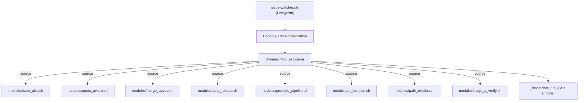

# 設計設計書 (design.md) - feat-watcher-issue-watcher-sh-modularization

本ドキュメントは、巨大な単一シェルスクリプト `issue-watcher.sh` を 100% 後方互換性を保ちながらモジュール分割するための詳細設計を定義します。

---

## 1. Overview

現在、`issue-watcher.sh` は多機能なプロセッサー群（スロット並行制御、Merge Queue、PR Iteration、Quota-Aware 等）を内包し、11,000行を超える単一 Bash ファイルとなっています。本設計は、これらのプロセッサーを責務ごとに独立したスクリプトに分割し、動的に `source` ロードさせることで、コード可読性の向上、デグレの抑止、および AI エージェントによる開発効率（コンテキスト制限の回避）を達成します。

---

## 2. Goals / Non-Goals

### Goals
* `issue-watcher.sh` のコード行数を 1,000行以下にスリム化し、残りのロジックを責務ごとに独立したファイル（`local-watcher/bin/modules/*.sh`）に分割する。
* 既存の `cron` / `launchd` による起動方法、引数、環境変数と 100% の後方互換性を維持する。
* インストーラー（`install.sh`）を拡張し、`modules/` サブディレクトリも自動配置されるようにする。

### Non-Goals
* 各機能プロセッサー（Merge Queue 等）の内部ロジックや振る舞いそのものの変更。
* Bash 以外の言語（Python や Node.js 等）への移行（Bash スクリプトのポータビリティを維持する）。

---

## 3. Architecture Pattern & Boundary Map

メインの `issue-watcher.sh` がエントリポイント（親）となり、起動シーケンスの極めて初期段階で `modules/` サブディレクトリ内の各シェルモジュールをインポート（`source`）します。
インポートされたモジュールは、親のグローバル名前空間（設定された環境変数や共通関数）を共有します。



---

## 4. Technology Stack

| レイヤー | 技術選定 | 備考 |
|---|---|---|
| スクリプト言語 | Bash 4.0+ | macOS/Linux 双方での可搬性を維持 |
| 外部ツール | `git`, `gh`, `jq`, `flock`, `timeout/gtimeout` | 既存の依存要件通り |
| 静的解析 | `shellcheck` | 警告・エラーゼロを強制 |

---

## 5. File Structure Plan

```
local-watcher/bin/
├── issue-watcher.sh                   # エントリポイント。Config・引数・モジュールロード・Dispatcherの起動を担う
└── modules/                           # 責務分割されたモジュール
    ├── core_utils.sh                  # 共通ユーティリティ（ログ出力、タイムスタンプ、Git Worktree操作等の低レイヤロジック）
    ├── quota_aware.sh                 # Claude Max Quota検知、待機・再開プロセッサー (qa_ / process_quota_resume)
    ├── merge_queue.sh                 # Merge Queue プロセッサー (mq_ / process_merge_queue)
    ├── auto_rebase.sh                 # Auto Rebase プロセッサー (ar_ / process_auto_rebase)
    ├── promote_pipeline.sh            # Promote Pipeline プロセッサー (pp_ / process_promote_pipeline)
    ├── pr_iteration.sh                # PR Iteration / Stage C プロセッサー (pi_ / process_pr_iteration)
    ├── path_overlap.sh                # Path Overlap Checker (po_ / po_check_dispatch_gate)
    └── stage_a_verify.sh              # Stage A Verify ゲート (sav_ / stage_a_verify_run)
```

---

## 6. Components and Interfaces

### 6.1 名前空間と命名規則の維持
Bash はネイティブな名前空間をサポートしないため、変数や関数の競合を防ぐために、既存の関数プレフィックス（`qa_`、`mq_`、`ar_`、`pp_`、`pi_`、`po_`、`sav_`）を厳格に維持します。

### 6.2 変数共有の規約
*   **グローバル設定変数**（`REPO`, `REPO_DIR`, `BASE_BRANCH` 等）: `issue-watcher.sh` 側で完全に初期化・正規化を行い、各モジュールはこれを読み取り専用として参照します。
*   **モジュール内変数**: 各関数内では、極力 `local` 修飾子を用いてスコープを関数内に閉じ、グローバル空間を汚染しないようにします。

### 6.3 Shellcheck ディレクティブの活用
モジュールに分割した際、あるファイルで定義された変数が別ファイルで使われる場合に `shellcheck` が `SC2034` (unused variable) などの警告を出す可能性があります。これらは適切な `shellcheck` アノテーション（例: `# shellcheck source=./modules/core_utils.sh`）をエントリポイントやモジュールヘッダーに記述することで、警告ゼロを達成します。

---

## 7. Error Handling

*   **モジュール欠落エラー**: 起動時の動的ロード（L40付近）でファイルが見つからない場合、親プロセスは標準エラー出力にファイルパスを出力し、即座に exit 1 で終了します。
*   **各プロセッサーのエラーハンドリング**: 分割前と同様、各プロセッサー内での非致命的エラーは `|| true` または `|| qa_warn` 等で適切に吸収し、サイクル全体の実行を阻害しない fail-soft な思想をそのまま維持します。

---

## 8. Testing Strategy

### 8.1 既存テストの通過 (回帰防止)
*   `tests/` および `local-watcher/test/` 内の全テストケースが、一切のコード変更なしに `PASS` することを確認します。

### 8.2 モジュール個別ロードテスト (新規)
*   各モジュール（例: `quota_aware.sh`）が単独で `source` された際、不意な副作用（グローバルなコマンド実行など）を引き起こさず、関数定義のみが正常にロードされるかを検証するユニットテストを導入可能です。
