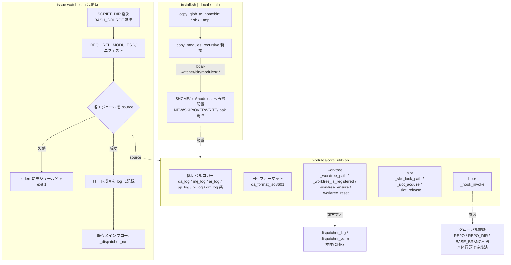

# Design Document

## Overview

**Purpose**: 11,899 行に達した単一 bash スクリプト `local-watcher/bin/issue-watcher.sh` を
段階的にモジュール分割する大規模リファクタリングの **Part 1** として、(1) `install.sh` による
モジュール配置、(2) `issue-watcher.sh` 自身によるモジュール動的ロード基盤、(3) 低レベル共通
ユーティリティの `core_utils.sh` への切り出し、の 3 点を提供する。これにより watcher の保守者は
分割後も従来と同一の呼び出しで共通ユーティリティを再利用できる土台を得る。

**Users**: watcher の運用者（`install.sh` でローカル配置し cron / launchd で稼働させる）と、
watcher の保守者（分割後の `core_utils.sh` を Part 2 / Part 3 のモジュールから再利用する）が
対象。運用者は既存の cron / launchd 登録行を一切変えずに次回 `install.sh` 実行でモジュールを
受け取る。

**Impact**: 現在の「全関数が 1 ファイルに同居する単一スクリプト」を、「本体 + `modules/`
配下のモジュール群を `source` でロードする構成」へ変える。ただし self-hosting（dogfooding）で
本番稼働中であり、外部から観測可能な挙動（env var の意味・exit code・ログ出力先・ラベル遷移・
cron 登録文字列）は一切変えない **差分等価リファクタリング** であることが最優先制約となる。
Part 1 で切り出すのは `core_utils.sh` 単一であり、quota / merge-queue / rebase /
promote-pipeline / pr-iteration / design-review-release などの機能別モジュールは
Part 2（#180）/ Part 3（#181）のスコープであって本 spec では動かさない。

### Goals
- `install.sh` が `local-watcher/bin/modules/` 配下を `$HOME/bin/modules/` へ再帰的・冪等に配置する（既存の `--dry-run` / `--force` / `.bak` 規律と整合）
- `issue-watcher.sh` が `SCRIPT_DIR` 基準で `modules/` 配下を動的 `source` し、必須モジュール欠落時に `exit 1` で安全停止する
- 低レベルロガー・日付フォーマット・worktree / slot / hook の各ユーティリティを `core_utils.sh` へ「移動のみ（cut & paste）」で切り出し、挙動を差分等価に保つ
- 既存スモークテスト（`local-watcher/test/` および `tests/local-watcher/`）が分割後の構成で 1 件も失敗せず通過する

### Non-Goals
- quota / merge-queue / rebase / promote-pipeline / pr-iteration / design-review-release / impl-gates / impl-pipeline / dispatcher など、機能別モジュールの切り出し（Part 2 / Part 3 のスコープ）
- `core_utils.sh` 以外の新規モジュールの設計・追加
- 切り出した関数のリファクタを超えた挙動変更・新機能追加・新規 env var / ラベル / exit code の導入
- GitHub Actions 版ワークフロー（`.github/workflows/issue-to-pr.yml`）への波及、`setup.sh` のクローン挙動変更
- 将来の複数必須モジュールに備えた汎用ローダフレームワーク化（投機的抽象化を避け、Part 1 では `core_utils.sh` 単一を必須集合とする最小実装に留める）

## Architecture

### Existing Architecture Analysis

- **現在のアーキテクチャパターン**: `issue-watcher.sh` は単一ファイルで、冒頭 Config ブロック →
  グローバル変数定義（L390 `WORKTREE_BASE_DIR`、L391 `SLOT_LOCK_DIR` 等）→ 関数定義群
  （L577 `qa_log` 〜 L10276 `_hook_invoke` 等）→ メインフロー即時実行（L11889 `_dispatcher_run`）
  の順で構成される。`source` も `SCRIPT_DIR` 解決も現状一切持たない（完全自己完結）。
- **install.sh の既存配置ロジック**: `copy_glob_to_homebin <src_dir> <pattern> <dest_dir>`
  （install.sh L240-284）が `local-watcher/bin/*.sh` / `*.tmpl` を **単一階層のグロブ**で
  `$HOME/bin` へ配置する。`classify_action`（NEW/SKIP/OVERWRITE 判定）/ `copy_template_file`
  / `log_action`（`[DRY-RUN]` / `[INSTALL]` prefix）/ `ensure_dir`（dry-run 対応 mkdir）が
  既に存在し、冪等性・dry-run・glob 0 件継続が確立済み。ただし**サブディレクトリの再帰配置には
  未対応**（`copy_glob_to_homebin` はファイルのみを列挙する）。
- **尊重すべき境界**: `copy_glob_to_homebin` / `copy_template_file` / `classify_action` の
  既存シグネチャと出力分類（NEW/SKIP/OVERWRITE）を壊さず、新規ヘルパーで再帰配置を**追加**する。
- **維持すべき統合点**: cron / launchd は `$HOME/bin/issue-watcher.sh` を直接起動する。この
  起動行・env var 受け渡し（`REPO` / `REPO_DIR` 等）を変えない。テストは `local-watcher/test/*.sh`
  が `issue-watcher.sh` から関数を `awk` 抽出 + `eval` する方式を採る（後述）。
- **解消する technical debt**: 11,899 行の単一ファイル肥大化。Part 1 は基盤と共通ユーティリティの
  みを切り出す最初の一歩。

### Architecture Pattern & Boundary Map

採用パターン: **Loader + Shared Module**（本体が起動時に `SCRIPT_DIR/modules/*.sh` を
`source` し、共通ユーティリティを 1 モジュールに集約）。関数定義は bash の遅延評価（呼び出し時
解決）であるため、core_utils.sh を本体の関数定義より前に source すれば、core_utils 内の関数が
本体側関数（`dispatcher_log` 等）を前方参照しても、実際の呼び出しはメインフロー実行時（全 source
完了後）に解決され問題ない。



**Architecture Integration**:
- 採用パターン: Loader + Shared Module。理由は、Part 2 / Part 3 で機能別モジュールを追加する
  際の拡張点（マニフェスト配列への追記）を最小コストで用意でき、かつ Part 1 では `core_utils.sh`
  単一の追加で済むため。
- ドメイン／機能境界: 「低レベル共通ユーティリティ（ロガー・日付・worktree・slot・hook）」を
  `core_utils.sh` に集約。機能別ロジック（quota 判定・merge-queue 処理など）は本体に残す。
- 既存パターンの維持: install.sh の NEW/SKIP/OVERWRITE 分類・dry-run・`.bak` once-only 規律、
  watcher の Config ブロック・env var override・メインフロー即時実行順序を維持する。
- 新規コンポーネントの根拠: `core_utils.sh`（保守性向上の切り出し先）、`copy_modules_recursive`
  （install.sh に再帰配置を追加するため）、`ModuleLoader`（本体に source 基盤を追加するため）。
  いずれも要件に直接対応し、将来スコープのためだけの抽象化は導入しない。

### Technology Stack

| Layer | Choice / Version | Role in Feature | Notes |
|-------|------------------|-----------------|-------|
| Frontend / CLI | bash 4+ | `install.sh` の再帰配置 / `issue-watcher.sh` の source 基盤 | `set -euo pipefail` 既定。`BASH_SOURCE` で SCRIPT_DIR 解決 |
| Backend / Services | bash 関数群 | `core_utils.sh` に切り出す共通ユーティリティ | 移動のみ（cut & paste）。シグネチャ・戻り値・副作用を保持 |
| Data / Storage | ファイルシステム | `$HOME/bin/modules/` 配下のモジュール配置先 | ユーザースコープ（sudo 不要） |
| Messaging / Events | なし | — | 本 spec では新規イベント・外部呼び出しを追加しない |
| Infrastructure / Runtime | cron / launchd | `$HOME/bin/issue-watcher.sh` を起動 | 起動行・env 受け渡しを変えない（NFR 1.5） |
| Test | bash + awk + eval | 既存スモークテストの関数抽出方式 | `local-watcher/test/*.sh` / `tests/local-watcher/**` |

## File Structure Plan

### Directory Structure

```
local-watcher/
├── bin/
│   ├── issue-watcher.sh          # 本体。冒頭に ModuleLoader（SCRIPT_DIR 解決 + source ループ）を追加。
│   │                             #   切り出した関数定義を core_utils.sh へ移動した分だけ縮む。
│   │                             #   メインフロー即時実行（_dispatcher_run）は従来どおり末尾。
│   ├── triage-prompt.tmpl        # 既存。変更なし
│   └── modules/
│       └── core_utils.sh         # 新規。低レベルロガー / 日付フォーマット / worktree / slot / hook を集約。
│                                 #   本体より先に source される前提（関数は遅延評価なので順序非依存だが
│                                 #   ロード基盤上は modules/ 配下を一括 source する）
└── test/                         # 既存スモークテスト（関数抽出 + eval 方式）
    ├── repo_prefix_log_test.sh   # 修正対象: qa_log / mq_log / pi_log / drr_log を抽出 → core_utils.sh も抽出元に追加
    ├── verify_pushed_or_retry_test.sh # 修正対象: qa_log / qa_warn / qa_error を抽出 → 同上
    ├── qa_run_claude_stage_test.sh    # 修正対象: qa_log / qa_warn / qa_error を抽出 → 同上
    └── （その他 9 本）            # 抽出対象が core_utils.sh 移動対象を含まないため変更不要

install.sh                        # 修正対象: copy_modules_recursive を追加し、--local / --all 経路で呼ぶ
README.md                         # 修正対象: ディレクトリ構成図 + modules 化 migration note を追記
docs/specs/177-feat-watcher-issue-watcher-sh-part-1/
├── requirements.md               # PM 確定済み（入力）
├── design.md                     # 本ファイル
└── tasks.md                      # 実装タスク分割
```

### Modified Files
- `install.sh` — `copy_modules_recursive <src_dir> <dest_dir>` ヘルパーを新規追加し、`$INSTALL_LOCAL`
  ブロック（L1209 付近）で `copy_glob_to_homebin` 呼び出し直後に `local-watcher/bin/modules/` →
  `$HOME/bin/modules/` を再帰配置する。既存の `classify_action` / `copy_template_file`（または
  `.bak` 規律が必要なら `copy_with_hybrid_overwrite` 相当）を再利用し、新規分類ロジックは作らない。
  glob 0 件時は SKIP ログを出して継続（Req 1.7）。
- `local-watcher/bin/issue-watcher.sh` — 冒頭（PATH prepend 直後、Config ブロック前後の適切な
  位置）に ModuleLoader を追加（`SCRIPT_DIR` 解決 + `REQUIRED_MODULES` マニフェスト + source
  ループ + 欠落時 exit 1 + ロード成否ログ）。切り出し対象関数の定義を削除（core_utils.sh へ移動）。
- `local-watcher/bin/modules/core_utils.sh` — 新規。移動した関数のみを収容（ファイル冒頭に
  用途 / 配置先 / 依存 / セットアップ参照先コメント）。
- `local-watcher/test/repo_prefix_log_test.sh` / `verify_pushed_or_retry_test.sh` /
  `qa_run_claude_stage_test.sh` — 抽出元に `modules/core_utils.sh` を追加（後述「テスト互換方式」）。
- `README.md` — `local-watcher/bin/modules/` を含むディレクトリ構成と modules 化の migration note。

## Requirements Traceability

| Requirement | Summary | Components | Interfaces | Flows |
|-------------|---------|------------|------------|-------|
| 1.1 | modules を `$HOME/bin/modules/` へ配置 | InstallModuleCopier | `copy_modules_recursive` | install --local |
| 1.2 | サブディレクトリ階層を保持して再帰配置 | InstallModuleCopier | `copy_modules_recursive` | install --local |
| 1.3 | 同一内容は SKIP（再コピーしない） | InstallModuleCopier | `classify_action`（SKIP） | install 再実行 |
| 1.4 | `--dry-run` で予定操作を `[DRY-RUN]` 列挙 | InstallModuleCopier | `log_action` / `ensure_dir` | install --dry-run |
| 1.5 | 差分あり + `--force` なし → 保護（上書きしない） | InstallModuleCopier | `.bak` / hybrid overwrite 規律 | install 既存差分 |
| 1.6 | `--force` で `.bak` 退避 or 上書き（規律整合） | InstallModuleCopier | hybrid overwrite 規律 | install --force |
| 1.7 | modules 0 件でもエラー停止せず SKIP 継続 | InstallModuleCopier | nullglob + SKIP ログ | install（modules 不在） |
| 2.1 | `SCRIPT_DIR` 基準で `modules/` を source | ModuleLoader | `SCRIPT_DIR` 解決 | watcher 起動 |
| 2.2 | cron-like 最小 PATH / cwd 非依存でロード成功 | ModuleLoader | `BASH_SOURCE` 解決 | watcher 起動（cron） |
| 2.3 | 必須モジュール欠落時に名前付き stderr + exit 1 | ModuleLoader | source ループ + 欠落判定 | watcher 起動（欠落） |
| 2.4 | 全ロード成功時に分割前と同一の状態遷移を継続 | ModuleLoader / 本体メインフロー | `_dispatcher_run` | watcher 1 サイクル |
| 2.5 | ロード成否をログで判別可能に記録 | ModuleLoader | ロード成否ログ | watcher 起動 |
| 3.1 | 低レベルロガーを集約提供 | CoreUtils.Loggers | `qa_log` / `mq_log` / `ar_log` / `pp_log` / `pi_log` / `drr_log` 系 | 全サイクル |
| 3.2 | ロガーが分割前と同一の出力先・prefix・書式 | CoreUtils.Loggers | 同上 | 全サイクル |
| 3.3 | 日付フォーマット取得を同一書式で提供 | CoreUtils.DateFormat | `qa_format_iso8601` | escalation コメント |
| 3.4 | `_worktree_ensure` を同一仕様で提供 | CoreUtils.Worktree | `_worktree_ensure` | slot 起動 |
| 3.5 | `_worktree_reset` を同一仕様で提供 | CoreUtils.Worktree | `_worktree_reset` | Issue 投入時 |
| 3.6 | `_slot_acquire` を同一仕様で提供 | CoreUtils.Slot | `_slot_acquire` | claim |
| 3.7 | `_slot_release` を同一仕様で提供 | CoreUtils.Slot | `_slot_release` | claim ロールバック |
| 3.8 | `_hook_invoke` を同一仕様で提供 | CoreUtils.Hook | `_hook_invoke` | slot init |
| 3.9 | 各関数を同一シグネチャ・戻り値・副作用で公開 | CoreUtils.* | 上記すべて | Dispatcher 呼び出し |
| 4.1 | 既存スモークテストが分割後も全件通過 | TestCompat | extract + eval | テスト実行 |
| 4.2 | 抽出方式のテストが移動後関数に到達可能 | TestCompat | 抽出元拡張 | テスト実行 |
| 4.3 | 定義位置移動後もテストが定義を解決可能 | TestCompat | 抽出元拡張 | テスト実行 |
| NFR 1.1〜1.6 | env var / exit code / ログ先 / ラベル遷移 / cron 行 / 差分等価を保持 | 全コンポーネント | 移動のみ + 順序保持 | 全サイクル |
| NFR 2.1 | install 再実行で冪等（破壊なし） | InstallModuleCopier | classify_action | install 再実行 |
| NFR 2.2 | modules 配置を `$HOME` ユーザースコープで完結（sudo 不要） | InstallModuleCopier | `$HOME/bin/modules/` | install --local |
| NFR 3.1 | ロード / 配置失敗を silent fail させず exit code / ログで明示 | ModuleLoader / InstallModuleCopier | exit 1 / ログ | 起動 / install |

## Components and Interfaces

### Install Layer

#### InstallModuleCopier

| Field | Detail |
|-------|--------|
| Intent | `local-watcher/bin/modules/` 配下を `$HOME/bin/modules/` へ再帰的・冪等に配置する |
| Requirements | 1.1, 1.2, 1.3, 1.4, 1.5, 1.6, 1.7, NFR 2.1, NFR 2.2, NFR 3.1 |

**Responsibilities & Constraints**
- `local-watcher/bin/modules/` 以下の全ファイルを、サブディレクトリ階層を保持して `$HOME/bin/modules/` へ配置する
- 既存の `classify_action`（NEW/SKIP/OVERWRITE）・`log_action`（`[DRY-RUN]` / `[INSTALL]` prefix）・`ensure_dir`（dry-run 対応）を再利用し、新規分類ロジックを作らない
- `.bak` once-only 退避・`--force` 上書きは既存テンプレート配置（`copy_with_hybrid_overwrite` 相当）と整合する規律で行う。スクリプトは実行ビットを保持して配置する（`*.sh` は `--executable` 相当）
- modules 0 件（ディレクトリ不在または空）の場合は SKIP ログを出して install 全体を継続する（エラー停止しない）
- `$HOME` 配下のみを変更し sudo を要求しない。再実行で破壊しない（冪等）

**Dependencies**
- Inbound: install.sh の `$INSTALL_LOCAL` メインブロック — モジュール配置の起動 (Critical)
- Outbound: `classify_action` / `copy_template_file`（または hybrid overwrite）/ `log_action` / `ensure_dir` — 既存ヘルパー再利用 (Critical)
- External: なし

**Contracts**: Service [x] / API [ ] / Event [ ] / Batch [ ] / State [ ]

##### Service Interface

```bash
# copy_modules_recursive <src_dir> <dest_dir>
#   <src_dir>（例 local-watcher/bin/modules）配下の全ファイルを、サブディレクトリ階層を
#   保持して <dest_dir>（例 $HOME/bin/modules）へ配置する。
#   - 各ファイルに classify_action で NEW/SKIP/OVERWRITE を判定し log_action で記録
#   - DRY_RUN=true なら [DRY-RUN] prefix で予定のみ列挙、FS は変更しない
#   - *.sh は実行ビットを保持して配置する
#   - <src_dir> 不在 / マッチ 0 件は SKIP ログを出して return 0（install 継続）
copy_modules_recursive() {
  # src_dir / dest_dir を受け取り、find ベースで相対パスを保持して走査する想定
  :
}
```
- Preconditions: `DRY_RUN` / `FORCE` がグローバルに設定済み（既存ヘルパーと同じ前提）
- Postconditions: dry-run=false なら `$HOME/bin/modules/` 配下に階層保持で配置済み。dry-run=true なら FS 無変更
- Invariants: 同一内容ファイルは SKIP（再コピーしない）。`.bak` once-only 規律を破らない

### Watcher Runtime Layer

#### ModuleLoader

| Field | Detail |
|-------|--------|
| Intent | 起動時に `SCRIPT_DIR/modules/` 配下を動的 source し、必須モジュール欠落時に exit 1 する |
| Requirements | 2.1, 2.2, 2.3, 2.4, 2.5, NFR 3.1 |

**Responsibilities & Constraints**
- `SCRIPT_DIR="$(cd "$(dirname "${BASH_SOURCE[0]}")" && pwd)"` で自身の配置ディレクトリを cwd 非依存に解決する
- `REQUIRED_MODULES` マニフェスト（配列）に列挙したモジュールを `SCRIPT_DIR/modules/` 基準で source する
- 必須モジュールが欠落していれば、そのモジュール名を含むメッセージを stderr に出し exit 1 する
- ロード成否を運用者がログから判別できる形で記録する（成功時も観測可能な 1 行）
- 既存メインフロー（`_dispatcher_run` 即時実行）の前にロードを完了させる。関数定義は遅延評価のため、core_utils 内関数が本体側関数（`dispatcher_log` 等）を前方参照しても、呼び出しはメインフロー実行時（source 完了後）に解決され問題ない
- Part 1 では `REQUIRED_MODULES=( core_utils.sh )` の単一要素とする（将来の複数モジュールは配列追記で拡張可能だが、Part 1 でフレームワーク化しない）

**Dependencies**
- Inbound: cron / launchd / 手動起動 — watcher プロセス起動 (Critical)
- Outbound: `modules/core_utils.sh` — source 対象 (Critical)
- External: bash の `source` / `BASH_SOURCE` (Critical)

**Contracts**: Service [ ] / API [ ] / Event [ ] / Batch [ ] / State [x]

##### State Transition

| 状態 | 条件 | 次の挙動 |
|------|------|----------|
| ロード開始 | watcher 起動 | `SCRIPT_DIR` 解決 → マニフェスト走査 |
| 必須モジュール存在 | `SCRIPT_DIR/modules/<m>` がファイルとして存在 | source → 成功ログ |
| 必須モジュール欠落 | `SCRIPT_DIR/modules/<m>` 不在 | stderr にモジュール名 + `exit 1`（NFR 3.1） |
| 全ロード成功 | 全必須モジュール source 完了 | 既存メインフロー `_dispatcher_run` へ継続（Req 2.4） |

- Preconditions: `$HOME/bin/modules/core_utils.sh` が配置済み（install で配置される）
- Postconditions: 成功時は core_utils.sh の関数が現シェルに定義済み。失敗時は exit 1
- Invariants: source は冪等（同一サイクル内で 2 重 source しない）。exit code 1 の意味は既存 ERROR 終了と整合（NFR 1.2）

### Core Utils Module

#### CoreUtils.Loggers

| Field | Detail |
|-------|--------|
| Intent | processor 系の低レベルロガー（echo ラッパー）を集約提供する |
| Requirements | 3.1, 3.2, 3.9, NFR 1.3, NFR 1.6 |

**Responsibilities & Constraints**
- `qa_log` / `qa_warn` / `qa_error`（L577-585）、`mq_log` 系（L1160）、`ar_log` 系（L1463）、`pp_log` 系（L2406）、`pi_log` 系（L3715）、`drr_log` 系（L5239）等の echo ラッパーを移動のみで集約する
- 出力先（stdout / stderr）・時刻 prefix・`[$REPO]` 挿入・processor prefix（`quota-aware:` 等）・書式を分割前と完全同一に保つ（差分等価）
- 関数本体は変更しない（cut & paste）。`$REPO` グローバルへの依存も現状どおり

**Dependencies**
- Inbound: 本体の各 processor / メインフロー — ログ出力 (Critical)
- Outbound: `$REPO` グローバル変数（本体冒頭 L53 で定義） (Critical)
- External: `date`（時刻 prefix）

**Contracts**: Service [x] / API [ ] / Event [ ] / Batch [ ] / State [ ]

##### Service Interface

```bash
qa_log()  { echo "[$(date '+%F %T')] [$REPO] quota-aware: $*"; }       # 移動のみ・本体と同一
mq_log()  { :; }  # merge-queue: prefix（移動のみ）
ar_log()  { :; }  # 移動のみ
pp_log()  { :; }  # promote-pipeline: prefix（移動のみ）
pi_log()  { :; }  # pr-iteration: prefix（移動のみ）
drr_log() { :; }  # design-review-release: prefix（移動のみ）
# 各 _warn / _error も同様に移動
```
- Preconditions: `$REPO` が定義済み（本体冒頭で設定）
- Postconditions: 分割前と同一の 1 行ログを所定の出力先へ
- Invariants: 1 イベント 1 行・prefix 不変（既存テスト repo_prefix_log_test.sh が検証）

#### CoreUtils.DateFormat

| Field | Detail |
|-------|--------|
| Intent | epoch → ISO 8601 等の日付フォーマット取得ユーティリティを提供する |
| Requirements | 3.3, 3.9, NFR 1.6 |

**Responsibilities & Constraints**
- `qa_format_iso8601`（L591-606、GNU date / BSD date 両対応 + epoch フォールバック）を移動する
- 分割前と同一書式の文字列を返す（差分等価）

**Dependencies**
- Inbound: escalation コメント生成箇所 — ISO 8601 文字列生成 (Important)
- Outbound: `date` (Critical)

**Contracts**: Service [x]

```bash
qa_format_iso8601() { :; }  # 移動のみ。GNU/BSD date 両対応・epoch フォールバック保持
```
- Preconditions: 引数 = epoch 秒（整数）
- Postconditions: ISO 8601（TZ 付き）文字列、失敗時は epoch をそのまま
- Invariants: 出力書式不変

#### CoreUtils.Worktree

| Field | Detail |
|-------|--------|
| Intent | per-slot git worktree の path 解決・登録判定・確保・リセットを提供する |
| Requirements | 3.4, 3.5, 3.9, NFR 1.6 |

**Responsibilities & Constraints**
- `_worktree_path`（L10098）/ `_worktree_is_registered`（L10105）/ `_worktree_ensure`（L10118）/ `_worktree_reset`（L10173）を一括移動する。`_worktree_ensure` は `_worktree_path` / `_worktree_is_registered` を内部で呼ぶため、この 4 関数は同一モジュール内で完結させる（モジュール内依存を閉じる）
- `_worktree_ensure` / `_worktree_reset` 内の `dispatcher_warn` / `dispatcher_log` 呼び出しは本体に残る関数への**前方参照**。bash の遅延評価により実行時（メインフロー = source 完了後）に解決されるため source 順序に依存しない
- `$REPO_DIR` / `$BASE_BRANCH` / `$WORKTREE_BASE_DIR`（L390）/ `$REPO_SLUG`（L57）グローバルを参照（本体冒頭で定義済み）

**Dependencies**
- Inbound: Dispatcher / Slot Runner — slot 起動・Issue 投入時の worktree 操作 (Critical)
- Outbound: `dispatcher_log` / `dispatcher_warn`（本体に残る、前方参照） / `git` / グローバル変数 (Critical)

**Contracts**: Service [x]

```bash
_worktree_path() { echo "$WORKTREE_BASE_DIR/$REPO_SLUG/slot-$1"; }  # 移動のみ
_worktree_is_registered() { :; }  # 移動のみ
_worktree_ensure() { :; }  # 移動のみ。dispatcher_log/warn を前方参照
_worktree_reset()  { :; }  # 移動のみ
```
- Preconditions: グローバル変数が本体冒頭で設定済み、`git` 利用可能
- Postconditions: 分割前と同一の worktree 状態（確保 / reset）
- Invariants: 冪等な worktree 確保、reset で tracked/untracked/ignored 消去（差分等価）

#### CoreUtils.Slot

| Field | Detail |
|-------|--------|
| Intent | per-slot 非ブロッキング flock の lock path 解決・取得・解放を提供する |
| Requirements | 3.6, 3.7, 3.9, NFR 1.6 |

**Responsibilities & Constraints**
- `_slot_lock_path`（L10215）/ `_slot_acquire`（L10226）/ `_slot_release`（L10252）を一括移動する。`_slot_acquire` は `_slot_lock_path` を呼ぶためモジュール内で完結
- fd 番号規約（210 + slot 番号）・`flock -n` 非ブロッキング・`eval "exec ${fd}>..."`（bash 4.0 互換）を不変に保つ
- `$SLOT_LOCK_DIR`（L391）/ `$REPO_SLUG` グローバルを参照

**Dependencies**
- Inbound: Dispatcher — claim / claim ロールバック (Critical)
- Outbound: `flock` / グローバル変数 (Critical)

**Contracts**: Service [x]

```bash
_slot_lock_path() { echo "$SLOT_LOCK_DIR/${REPO_SLUG}-slot-$1.lock"; }  # 移動のみ
_slot_acquire() { :; }  # 移動のみ。fd 210+N 規約保持
_slot_release() { :; }  # 移動のみ
```
- Preconditions: `$SLOT_LOCK_DIR` / `$REPO_SLUG` 設定済み、`flock` 利用可能、引数は検証済み正整数
- Postconditions: acquire 成功時 fd open（呼び出し側スコープ保持）、release で fd close
- Invariants: 非ブロッキング（flock -n）・claim atomicity の構造的保証を維持（差分等価）

#### CoreUtils.Hook

| Field | Detail |
|-------|--------|
| Intent | `SLOT_INIT_HOOK` 起動の薄い wrapper を提供する |
| Requirements | 3.8, 3.9, NFR 1.6 |

**Responsibilities & Constraints**
- `_hook_invoke`（L10276）を移動する。未設定なら no-op、非実行可能なら stderr + return 1、stderr 同期捕捉（Issue #170 の同期リダイレクト方式）を不変に保つ
- `SLOT_INIT_HOOK` 値をシェル展開しない（直接 exec のみ）安全性を維持。`$PARALLEL_SLOTS` / `$REPO` / `$REPO_DIR` を子プロセスへ export

**Dependencies**
- Inbound: Slot Runner — slot 初期化時の hook 起動 (Important)
- Outbound: `$SLOT_INIT_HOOK` 子プロセス / `mktemp` / グローバル変数 (Critical)

**Contracts**: Service [x]

```bash
_hook_invoke() { :; }  # 移動のみ。直接 exec / stderr 同期捕捉 / no-op 既定を保持
```
- Preconditions: 引数 = slot 番号, worktree 絶対パス
- Postconditions: hook 未設定で return 0、起動成功で return 0、失敗で return 1
- Invariants: シェル展開なし（NFR 2.3 相当の安全性）・差分等価

### Test Compatibility Layer

#### TestCompat

| Field | Detail |
|-------|--------|
| Intent | 既存スモークテストが、移動した関数を分割後構成でも抽出・評価できるようにする |
| Requirements | 4.1, 4.2, 4.3 |

**Responsibilities & Constraints**
- 既存テストは `local-watcher/test/*.sh` が `awk` で `issue-watcher.sh` から `<fn>() {` 〜 単独 `}` を抽出し `eval` する方式（`extract_function`）。`tests/local-watcher/**` 側（`tc_*` / stage-a-verify）は移動対象関数を含まないため影響なし
- core_utils.sh へ移動する関数を抽出する **3 テストのみ**が影響を受ける:
  - `repo_prefix_log_test.sh`（`qa_log`/`qa_warn`/`qa_error`, `mq_log` 系, `pi_log` 系, `drr_log` 系を抽出。なお `mqr_log` 系は Part 1 移動対象外のため本体に残る点に注意）
  - `verify_pushed_or_retry_test.sh`（`qa_log`/`qa_warn`/`qa_error` を抽出）
  - `qa_run_claude_stage_test.sh`（`qa_log`/`qa_warn`/`qa_error` を抽出）
- **互換方式の決定（投機的抽象化の回避）**: 前回設計で検討した共通抽出ヘルパー `local-watcher/test/lib/extract.sh` の新設は **Part 1 では採用しない**。影響を受けるのは 3 テストのみで、各テストの抽出元を「`issue-watcher.sh` に加えて `modules/core_utils.sh` も走査する」よう最小修正すれば足りる。各テストは既に自前の `extract_function`（awk）を持つため、抽出元ファイルのリストを `issue-watcher.sh` と `core_utils.sh` の 2 ファイルに広げる（移動対象関数は core_utils.sh から、本体に残る関数は issue-watcher.sh から抽出）。共通ライブラリ化は Part 2 / Part 3 で抽出元が増えた時点で再評価する
- `repo_prefix_log_test.sh` は加えて `$WATCHER_SH` への source-level grep（Req 3 の dirty working tree イベント検証）を行うが、これらは移動対象でない本体メインフローの文字列を grep するため影響を受けない

**Dependencies**
- Inbound: 手動スモークテスト実行（`bash local-watcher/test/*.sh`） (Critical)
- Outbound: `issue-watcher.sh` + `modules/core_utils.sh`（抽出元） (Critical)

**Contracts**: Service [ ] / API [ ] / Event [ ] / Batch [x] / State [ ]

- Preconditions: `core_utils.sh` が `modules/` に存在する
- Postconditions: 3 テストが移動後関数を抽出・eval して全件 PASS
- Invariants: テストのアサーション内容は変えない（抽出元の解決だけを修正）

## Data Models

### Domain Model
本 spec は新規データモデル・永続化スキーマを導入しない（コード構造のリファクタリングのみ）。
唯一の新規「構造」は ModuleLoader が参照する **モジュールマニフェスト** であり、bash 配列として表現する:

```bash
# 必須モジュール（欠落時 exit 1）。Part 1 は core_utils.sh 単一。
REQUIRED_MODULES=( "core_utils.sh" )
```

- アグリゲート / トランザクション境界: 該当なし
- 不変条件: マニフェストは本体内で定義され、`SCRIPT_DIR/modules/<要素>` を source 対象とする

## Error Handling

### Error Strategy
- install / 起動時の失敗は silent fail させず、exit code またはログで明示する（NFR 3.1）。
- 移動した関数の内部エラーハンドリング（worktree 確保失敗時の return 1、hook 失敗時の return 1 等）は分割前と完全同一に保つ（差分等価）。

### Error Categories and Responses
- **User / Operator Errors**:
  - install で modules ディレクトリが空 / 不在 → エラーにせず SKIP ログを出して継続（Req 1.7）。
  - install で差分ありかつ `--force` なし → 上書きせず保護し、`.bak` 規律と整合する案内を既存ログ書式で出す（Req 1.5）。
- **System Errors**:
  - 起動時に必須モジュール（`core_utils.sh`）が `SCRIPT_DIR/modules/` に欠落 → モジュール名を含む stderr メッセージ + `exit 1`（Req 2.3、NFR 3.1）。exit code 1 は既存 ERROR 終了と同義（NFR 1.2）。
  - source 自体が失敗（構文エラー等）→ bash の `set -e` と `source` の戻り値により非ゼロ終了。ローダはロード成否ログで観測可能にする（Req 2.5）。
- **Business Logic Errors**: 該当なし（ドメインルールを持たない）。

## Testing Strategy

### Unit Tests
- `copy_modules_recursive`: 単一ファイル / サブディレクトリ階層 / 既存同一（SKIP）/ 差分あり（OVERWRITE or 保護）の各分類が `classify_action` と整合すること（Req 1.1, 1.2, 1.3, 1.5）。
- ModuleLoader の `SCRIPT_DIR` 解決: cwd を変えても `BASH_SOURCE` 基準で同一パスに解決されること（Req 2.1, 2.2）。
- `qa_log` / `pi_log` / `drr_log` 等が core_utils.sh から抽出・eval され、分割前と同一の prefix・書式を返すこと（既存 `repo_prefix_log_test.sh` の再利用）（Req 3.1, 3.2）。
- `qa_format_iso8601` が GNU/BSD date 両対応で同一書式を返すこと（Req 3.3）。

### Integration Tests
- `local-watcher/test/repo_prefix_log_test.sh` / `verify_pushed_or_retry_test.sh` / `qa_run_claude_stage_test.sh` が抽出元拡張後に全件 PASS すること（Req 4.1, 4.2, 4.3）。
- 残り 9 本の `local-watcher/test/*.sh` と `tests/local-watcher/**` が無修正で全件 PASS すること（影響なしの確認）（Req 4.1）。
- `install.sh --local --dry-run` が modules 配置を `[DRY-RUN]` 分類で列挙し FS を変更しないこと（Req 1.4, NFR 2.1）。
- `install.sh --local` を 2 回実行し 2 回目が SKIP 中心の冪等出力になること（Req 1.3, NFR 2.1）。

### E2E / Smoke Tests
- cron-like 最小 PATH での起動: `env -i HOME=$HOME PATH=/usr/bin:/bin bash $HOME/bin/issue-watcher.sh` 相当で、`SCRIPT_DIR` 基準のモジュールロードが cwd 非依存に成功すること（Req 2.2）。
- dry run（対象 Issue なし）: `REPO=owner/test REPO_DIR=/tmp/test-repo $HOME/bin/issue-watcher.sh` が `処理対象の Issue なし` で正常終了し、分割前と同一の Triage→PR 状態遷移基盤が成立すること（Req 2.4）。
- 必須モジュール欠落: `$HOME/bin/modules/core_utils.sh` を一時退避して起動し、モジュール名を含む stderr + exit 1 になること（Req 2.3, NFR 3.1）。
- `shellcheck local-watcher/bin/issue-watcher.sh local-watcher/bin/modules/core_utils.sh install.sh` が警告ゼロ（コード規約）。

### Performance / Load
- モジュール追加による起動オーバーヘッドは 1 ファイルの source のみで無視可能。性能目標は新設しない（差分等価）。
