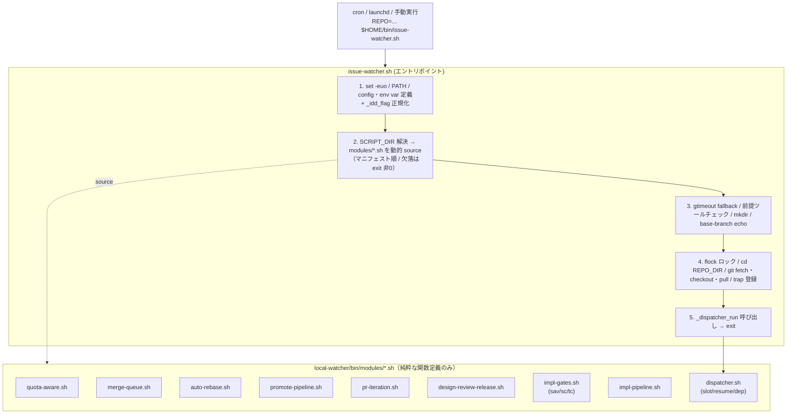
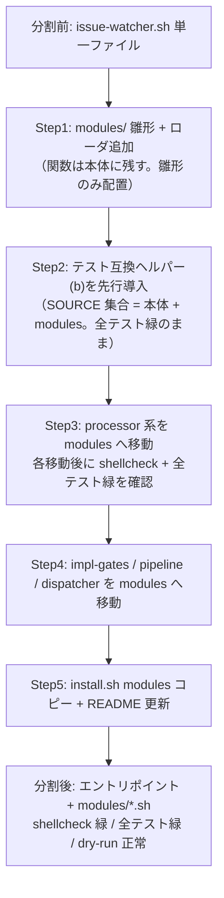

# Design Document

## Overview

`local-watcher/bin/issue-watcher.sh`（約 11,899 行）は単一 Bash スクリプトに肥大化しており、編集時のトークンコスト・デグレリスク・関数単位テストの全てがボトルネックになっている。本設計は、本体を **責務単位のモジュール群**（`local-watcher/bin/modules/*.sh`）へ分割し、`issue-watcher.sh` 本体を「config 定義 → 動的 `source` でモジュールをロード → トップレベル orchestration（lock / git / dispatcher 起動）」を行う薄いエントリポイントに再構成する。

**Purpose**: 約 12,000 行の単一ファイルを責務分割し、AI 協調開発時の編集トークンコストとデグレリスクを下げ、保守性を高める価値を、watcher を保守する開発者に提供する。
**Users**: watcher を保守する開発者（モジュール単位で編集）と、cron / launchd で起動する運用者（起動コマンドは一切変えずに恩恵を受ける）が利用する。
**Impact**: 現在の「単一巨大スクリプト」を「エントリポイント + modules/*.sh の動的ロード構成」に変える。**外部から観測される振る舞い（処理結果・ログ書式の契約・ラベル遷移・exit code）は一切変えない差分等価リファクタリング**であり、機能の追加・削除・バグ修正は行わない。

本リファクタリングは self-hosting（dogfooding）対象であり、この変更自体が次回 cron 実行で idd-claude 自身を動かす。したがって後方互換性（既存 env var 名 / cron 登録文字列 / exit code 意味 / ログ出力先 / ラベル遷移契約）と冪等性が最重要要件となる。

### Goals
- `issue-watcher.sh` を責務単位の `modules/*.sh` に分割し、本体を動的 `source` するエントリポイントにする（Req 1）
- `install.sh` が `modules/` 配下を `$HOME/bin/modules/` へ既存方針（dry-run / `.bak` / 冪等）と矛盾なく配置する（Req 2）
- 既存 env var / 起動コマンド / ログ / ラベル遷移 / exit code の完全な後方互換（Req 3 / NFR 1）
- 既存テスト（`local-watcher/test/` 12 件 + `tests/local-watcher/` 3 件）が分割後も全て成功する（Req 4）
- エントリポイントと全モジュールが `shellcheck` 警告ゼロ（Req 5）
- **成功基準**: 分割後に `shellcheck local-watcher/bin/issue-watcher.sh local-watcher/bin/modules/*.sh` が警告ゼロ、`local-watcher/test/*.sh` と `tests/local-watcher/*/*.sh` が全て exit 0、dry-run スモーク（対象 Issue なし）で `処理対象の Issue なし` 正常終了

### Non-Goals
- モジュール分割を契機とした機能挙動の変更・新機能・バグ修正（純粋な差分等価リファクタリング）
- GitHub Actions 経路（`.github/workflows/issue-to-pr.yml`）のモジュール化
- `repo-template/` 配下テンプレートの分割
- 起動時間短縮等のパフォーマンス最適化目標の数値設定
- 関数を跨いだロジックの再設計・共通化（移動のみ。リファクタは行わない）

## Architecture

### Existing Architecture Analysis

現状の `issue-watcher.sh` は単一ファイルに以下が同居している。実態調査（`grep -n '^[a-zA-Z_]*() {'`）で確認した構造:

- **トップレベル orchestration（行 32〜553、副作用あり）**: `set -euo pipefail` / PATH export / config・env var 定義（行 53〜436）/ `_idd_flag` 正規化ループ（行 417〜433）/ gtimeout フォールバック関数定義（行 451〜455）/ 前提ツールチェック（行 460〜505）/ `mkdir LOG_DIR` / base-branch echo / **flock ロック取得（行 517〜521）/ `cd REPO_DIR` + git fetch/checkout/pull（行 526〜553）**
- **関数定義群（行 556〜11707、副作用なしの純粋定義）**: 約 230 関数。プレフィックス命名規約で責務がほぼ分離済み（`qa_*` / `mq_*` / `ar_*` / `pp_*` / `po_*` / `pi_*` / `drr_*` / `sav_*` / `sc_*` / `tc_*` / `dispatcher_*` / `_slot_*` / `_resume_*` / `dr_*` 等）
- **トップレベル末尾の orchestration（行 11661〜11898）**: `declare -A _DISPATCHER_SLOT_PIDS`（行 11661）/ signal trap 登録（行 11708〜11709）/ `_dispatcher_run` 呼び出し + exit（行 11889〜11898）

**尊重すべき制約**:
- 関数群はプレフィックス命名でドメインがほぼ自明に分かれており、これがモジュール境界の自然な駆動軸になる
- トップレベル副作用（flock / git）は関数定義より**前**に実行されるが、関数定義は純粋（副作用なし）なので、**「全モジュール source → 副作用 orchestration → dispatcher 起動」の順に並べ替えても挙動は等価**（関数は呼ばれた時点で定義済みであればよい）
- 既存テストは本体ファイルから awk で個別関数を抽出 / 文字列を grep する。**抽出元パスが変わると壊れる**（後述「既存テスト互換戦略」が本設計の最重要判断）
- グローバル変数（`LOG` / `WT` / `rc` / `NUMBER` / `BRANCH` / `REPO` 等）は関数間で暗黙共有される。`source` は同一シェルプロセスに読み込むため**変数スコープは共有され、分割しても挙動は不変**。ただし source 順序依存（あるモジュールがトップレベルで別モジュールの関数/変数を参照する）が無いことを確認する必要がある

### Architecture Pattern & Boundary Map

**採用パターン**: Entry-point + Sourced Library Modules（bash の標準的なモジュール分割パターン）。本体は orchestration のみを持ち、ロジックは `source` した modules に委譲する。



**Architecture Integration**:
- **採用パターン**: Entry-point + Sourced Library Modules。bash で外部依存を増やさず（Node/Python 不要）、`source` による同一プロセス読み込みで変数スコープ共有を維持できるため、差分等価を最も安全に達成できる
- **ドメイン／機能境界**: 既存のプレフィックス命名規約（`qa_*` / `mq_*` 等）をそのままモジュール境界に採用する。新しい責務分割を発明せず、既存の暗黙境界を明示化するだけにとどめる（投機的抽象化の排除）
- **既存パターンの維持**: ロガー命名（`*_log` / `*_warn` / `*_error`）/ env var 名 / ラベル定数名 / ログ書式は一切変更しない
- **新規コンポーネントの根拠**: 新規追加するのは「モジュールローダ（エントリポイント内のループ）」「モジュールマニフェスト（ロード順の定義）」「テスト用共通抽出ヘルパー」の 3 点のみ。いずれも分割を成立させる最小限の足場であり、機能追加ではない

### Technology Stack

| Layer | Choice / Version | Role in Feature | Notes |
|-------|------------------|-----------------|-------|
| Frontend / CLI | bash 4+ | エントリポイント / 全モジュール / テスト | 既存と同一。Node/Python 追加なし |
| Backend / Services | `gh` / `git` | GitHub 操作（既存呼び出しを移動するのみ） | 振る舞い不変 |
| Data / Storage | ローカル file（`$LOG_DIR` 配下 JSON）/ `$LOCK_FILE` | quota reset 永続化・多重起動防止（移動のみ） | 出力先・パス不変 |
| Messaging / Events | GitHub ラベル遷移 | 状態機械（移動のみ） | ラベル名・遷移契約不変 |
| Infrastructure / Runtime | cron / launchd / `$HOME/bin/` | 起動経路（不変）/ `$HOME/bin/modules/` 新設 | install.sh が modules/ を配置 |
| 静的解析 | `shellcheck` | エントリ + 全モジュールの警告ゼロ検証 | `source` directive で SC1090/SC1091 を解決 |

## File Structure Plan

### Directory Structure

```
local-watcher/bin/
├── issue-watcher.sh            # エントリポイント。config / env var 定義 + 動的 source +
│                               #   orchestration（flock / git / trap / _dispatcher_run）。
│                               #   関数定義は持たず、modules/ をロードして呼び出すだけにする。
│                               #   配置先 ~/bin/issue-watcher.sh は不変（cron 登録文字列を壊さない）。
├── triage-prompt.tmpl          # 既存。変更なし
├── *.tmpl                      # 既存テンプレート群。変更なし
└── modules/                    # 新設。issue-watcher.sh から動的 source される純粋な関数定義群。
    │                           #   配置先 ~/bin/modules/。各ファイル冒頭に用途/配置先/依存/参照先コメント。
    ├── quota-aware.sh          # qa_* / build_partial_escalation_comment / process_quota_resume（行 577〜1159 相当）
    ├── merge-queue.sh          # mq_* / process_merge_queue / mqr_* / process_merge_queue_recheck（1160〜2405 相当）
    ├── auto-rebase.sh          # ar_* / process_auto_rebase（1463〜2254 相当）
    ├── promote-pipeline.sh     # pp_* / po_* / process_promote_pipeline（path-overlap 含む。2406〜3714 相当）
    ├── pr-iteration.sh         # pi_* / build_recovery_hint / process_pr_iteration（3715〜5238 相当）
    ├── design-review-release.sh# drr_* / process_design_review_release（5239〜5526 相当）
    ├── impl-gates.sh           # sav_* / stage_a_verify_* / sc_* / stage_checkpoint_* / tc_* /
    │                           #   _normalize_slug / slug guard 群（5527〜6470 + slug 系）
    ├── impl-pipeline.sh        # rv_* / pt_* / per-task / debugger / build_*_prompt / run_*_stage /
    │                           #   parse_review_result / verify_pushed_or_retry / verify_stagec_pr_or_retry /
    │                           #   mark_issue_* / run_impl_pipeline（6471〜9829 相当）
    └── dispatcher.sh           # dispatcher_* / pclp_* / check_existing_impl_pr / _worktree_* /
                                #   _slot_* / slot_* / _resume_* / dr_* / _dispatcher_*（9830〜11886 相当）
```

> 注: 行範囲は実態調査時点の目安であり、Developer は関数名（プレフィックス）を移動の正本とする。1 関数は 1 モジュールにのみ属する（重複定義を作らない）。`_dispatcher_run` の呼び出しと `declare -A _DISPATCHER_SLOT_PIDS` / trap 登録は**エントリポイント側**に残す（orchestration のため。dispatcher.sh は関数定義のみ）。

### テスト互換のための新規ファイル

```
local-watcher/test/
├── lib/
│   └── extract.sh              # 新設。共通抽出ヘルパー。エントリポイント + modules/*.sh の
│                               #   全体を走査して関数を抽出 / 文字列を grep する SOURCE_FILES 集合を提供
└── *.sh                        # 既存 12 件。各 extract_function / grep の対象を SOURCE_FILES 経由に置換
tests/local-watcher/
├── stage-a-verify/extract-driver.sh   # 既存。抽出対象を modules/impl-gates.sh に解決
└── tasks-count/extract-driver.sh      # 既存。抽出対象を modules/impl-gates.sh に解決
```

### Modified Files
- `local-watcher/bin/issue-watcher.sh` — 関数定義を全て modules/ へ移動。残すのは config / env var 定義 / `_idd_flag` 正規化 / **モジュールローダ**（新規）/ gtimeout fallback / ツールチェック / flock / git / trap / `_dispatcher_run` 呼び出し / exit。`SCRIPT_DIR` で modules/ を相対解決
- `install.sh` — local watcher インストール節（行 1216〜1221 付近）に `copy_glob_to_homebin "$LOCAL_WATCHER_DIR/bin/modules" "*.sh" "$HOME/bin/modules" --executable` を追加。既存 `copy_glob_to_homebin` / `copy_template_file`（dry-run / `.bak` / 冪等 / ログ書式）をそのまま再利用
- `local-watcher/test/*.sh`（12 件） — `extract_function` / `grep` の対象を共通ヘルパー `lib/extract.sh` の `SOURCE_FILES` 集合経由に変更
- `tests/local-watcher/stage-a-verify/extract-driver.sh` / `tests/local-watcher/tasks-count/extract-driver.sh` — `_WATCHER_SH` 抽出を modules/impl-gates.sh 解決に変更（または SOURCE_FILES 集合走査）
- `README.md` — ディレクトリ構成（行 69〜74）に modules/ を追記、手動コピー手順（行 497〜503）に modules/ コピーを追記、modules 化の migration note を 1 節追加

## Requirements Traceability

| Requirement | Summary | Components | Interfaces | Flows |
|-------------|---------|------------|------------|-------|
| 1.1 | 起動時に modules/ を全ロードしてから処理開始 | Entry Point / Module Loader | `source` ループ | 動的ロード処理フロー |
| 1.2 | 起動経路・cwd 非依存で配置位置基準に解決 | Module Loader | `SCRIPT_DIR` 解決 | 動的ロード処理フロー |
| 1.3 | モジュール欠落/読込不能で非0 exit + 特定可能なエラー | Module Loader | ロード検証 | Error Handling |
| 1.4 | 全ロード成功時に導入前と同一機能セット提供 | 全 modules | （関数群の移動） | 差分等価 |
| 2.1 | install.sh が modules/ を $HOME/bin/modules へ配置 | Installer (Module Copy) | `copy_glob_to_homebin` | install フロー |
| 2.2 | 再実行で冪等 | Installer (Module Copy) | `copy_template_file` | install フロー |
| 2.3 | --dry-run で実コピーせず同一書式で列挙 | Installer (Module Copy) | `log_action` / DRY_RUN | install フロー |
| 2.4 | 各操作を既存ログと同一書式で観測可能 | Installer (Module Copy) | `log_action` | install フロー |
| 3.1 | 全 env var の名称/既定/override を等価維持 | Entry Point (Config) | config ブロック据置 | 差分等価 |
| 3.2 | 既存 cron/launchd 起動で同一処理サイクル | Entry Point | 起動契約据置 | 差分等価 |
| 3.3 | ログ出力先/ラベル遷移/exit code を等価維持 | Entry Point / 全 modules | 文字列・定数据置 | 差分等価 |
| 3.4 | 互換破壊が不可避なら README migration note 明文化 | README | migration note | （後方互換方針） |
| 4.1 | local-watcher/test/ 全テスト成功 | Test Compat (extract.sh) | SOURCE_FILES 集合 | 既存テスト互換戦略 |
| 4.2 | tests/local-watcher/ 全テスト成功 | Test Compat (extract-driver) | modules 解決 | 既存テスト互換戦略 |
| 4.3 | 個別関数抽出が移動先に依らず解決可能 | Test Compat (extract.sh) | 全 SOURCE 走査 | 既存テスト互換戦略 |
| 4.4 | 解決不能を成功扱いで隠さずテスト失敗化 | Test Compat (extract.sh) | 抽出失敗→exit 非0 | Error Handling |
| 5.1 | issue-watcher.sh の shellcheck 警告ゼロ | Entry Point | `# shellcheck source=` directive | 静的解析 |
| 5.2 | 各 module の shellcheck 警告ゼロ | 全 modules | shebang/directive 方針 | 静的解析 |
| NFR 1.1 | 外部観測振る舞いを差分等価維持 | 全コンポーネント | （移動のみ） | 差分等価 |
| NFR 1.2 | self-hosting 次サイクルで同一挙動完走 | Entry Point / 全 modules | （移動のみ） | dogfooding 検証 |
| NFR 2.1 | install.sh 2回実行で結果同一 | Installer (Module Copy) | 冪等コピー | install フロー |
| NFR 2.2 | 既存上書き/退避方針と矛盾しない配置 | Installer (Module Copy) | `.bak` once-only 据置 | install フロー |
| NFR 3.1 | 最小 PATH 環境で $HOME 基準解決・profile 非依存 | Entry Point / Module Loader | PATH prepend 据置 + SCRIPT_DIR | 動的ロード処理フロー |
| NFR 3.2 | cwd / symlink 差異非前提で配置位置から相対解決 | Module Loader | `SCRIPT_DIR` 解決 | 動的ロード処理フロー |

## Components and Interfaces

### Entry Point Layer

#### Module Loader（新規）

| Field | Detail |
|-------|--------|
| Intent | エントリポイント起動時に modules/*.sh を自身の配置位置基準で動的 source し、欠落時は停止する |
| Requirements | 1.1, 1.2, 1.3, NFR 3.1, NFR 3.2 |

**Responsibilities & Constraints**
- `SCRIPT_DIR="$(cd "$(dirname "${BASH_SOURCE[0]}")" && pwd)"` で自身の配置ディレクトリを cwd / symlink 非依存に解決する（NFR 3.2。Issue 本文の設計案を踏襲）
- マニフェスト（モジュール名の固定順配列）を走査し、`"$SCRIPT_DIR/modules/<name>.sh"` を順に `source` する
- ロード対象が 1 件でも不在 / 読込不能なら、欠落モジュールのパスを `>&2` に出して非ゼロ exit（Req 1.3）。`set -e` 下でも黙って通過しないよう、`[ -r "$f" ] || { echo ... >&2; exit 1; }` を source 前に明示チェックする
- **配置位置**: config / env var 定義の後、ツールチェックより前。理由: ツールチェックや orchestration がモジュール内関数を参照しないとしても、ロード失敗を早期に検知して副作用（flock / git）の前に止めるため
- ロード順は固定（後述の source 順序制約）。並べ替えに依存しない設計を維持する

**Dependencies**
- Inbound: cron / launchd / 手動実行 — watcher 起動 (Critical)
- Outbound: 全 modules/*.sh — 関数定義の読み込み (Critical)
- External: なし（bash builtin の `source` / `cd` / `dirname` のみ）

**Contracts**: Service [ ] / API [ ] / Event [ ] / Batch [ ] / State [x]

##### モジュールロード擬似コード（実装はしない / シグネチャのみ）

```bash
SCRIPT_DIR="$(cd "$(dirname "${BASH_SOURCE[0]}")" && pwd)"
MODULES_DIR="$SCRIPT_DIR/modules"
# ロード順は固定（依存の浅い→深い順）。マニフェストはエントリポイントに明示列挙する。
_IDD_MODULES=( quota-aware merge-queue auto-rebase promote-pipeline \
               pr-iteration design-review-release impl-gates impl-pipeline dispatcher )
for _m in "${_IDD_MODULES[@]}"; do
  _f="$MODULES_DIR/${_m}.sh"
  if [ ! -r "$_f" ]; then
    echo "Error: モジュールが見つからない/読込不能: $_f" >&2
    exit 1
  fi
  # shellcheck source=/dev/null
  source "$_f"
done
```
- Preconditions: `SCRIPT_DIR/modules/` に全マニフェストモジュールが存在し読込可能であること
- Postconditions: 全モジュールの関数が現プロセスに定義済み。1 件でも失敗なら exit 非0（処理は開始しない）
- Invariants: ロードは関数定義のみを行い、副作用（flock / git / gh）を発生させない

#### Config / Orchestration（既存。配置据置）

| Field | Detail |
|-------|--------|
| Intent | env var 定義・正規化・ツールチェック・lock・git 同期・dispatcher 起動を行う |
| Requirements | 3.1, 3.2, 3.3, NFR 1.1, NFR 1.2, NFR 3.1 |

**Responsibilities & Constraints**
- 全 env var 定義（`REPO` / `REPO_DIR` / `LOG_DIR` / `LOCK_FILE` / `TRIAGE_MODEL` / `DEV_MODEL` / 各 processor 設定）と `_idd_flag` 正規化ループはエントリポイントに**そのまま残す**（名称・既定値・override 挙動を 1 文字も変えない）
- gtimeout フォールバック関数定義（macOS 互換 / #168）はエントリポイントに残す（`export -f` で子 bash に継承させる契約を維持）。**この関数だけはエントリポイントに残る数少ない関数定義**である点に注意（モジュールに移すと export タイミングが変わるため移さない）
- flock / `cd REPO_DIR` / git fetch・checkout・pull / dirty-tree ガード（行 536〜548）/ trap 登録 / `declare -A _DISPATCHER_SLOT_PIDS` / `_dispatcher_run` 呼び出し / exit はエントリポイントに残す
- **source 順序制約**: モジュールロードは「副作用 orchestration（flock / git）より前」に置く。関数定義は純粋なので、元コードで関数定義が flock の後に並んでいた事実は挙動に影響しない（呼ばれるのは `_dispatcher_run` 以降のため）

**Dependencies**
- Inbound: cron / launchd (Critical)
- Outbound: Module Loader → 全 modules / dispatcher.sh の `_dispatcher_run` (Critical)

**Contracts**: State [x]（ラベル遷移・lock 状態は据置）

### Functional Modules（modules/*.sh）

以下 9 モジュールは全て同一契約を持つ: **純粋な関数定義のみを含み、トップレベル副作用を持たない**。各モジュールは既存のプレフィックス命名規約に従って関数を 1 箇所に集約する。

#### quota-aware.sh

| Field | Detail |
|-------|--------|
| Intent | Claude Max quota 検知・reset 永続化・quota resume の関数群を保持 |
| Requirements | 1.4, 3.3, NFR 1.1 |

**Responsibilities & Constraints**
- `qa_log` / `qa_warn` / `qa_error` / `qa_format_iso8601` / `qa_detect_rate_limit` / `qa_run_claude_stage` / `qa_persist_reset_time` / `qa_load_reset_time` / `qa_build_escalation_comment` / `build_partial_escalation_comment` / `qa_handle_quota_exceeded` / `process_quota_resume` を保持
- 共有グローバル（`$REPO` / `$LOG_DIR` / `$NUMBER` 等）は実行時にエントリポイント由来の値を参照する（source による同一スコープ共有のため不変）

**Dependencies**
- Inbound: impl-pipeline.sh（`qa_run_claude_stage` でステージ実行をラップ）/ dispatcher（quota resume）(Critical)
- Outbound: なし（同一プロセス内の共有変数のみ）

**Contracts**: Service [x]（既存関数シグネチャを変えない）

##### Service Interface（移動のみ。シグネチャ不変の代表例）

```bash
# 既存シグネチャをそのまま維持（引数・exit code・stdout/stderr 契約を変えない）
qa_detect_rate_limit() { :; }          # 入力: claude JSON / 出力: exit code で判定
qa_run_claude_stage() { :; }           # Stage 実行ラッパ。"$@" を素通し、quota 時に副作用
qa_persist_reset_time() { :; }         # $LOG_DIR 配下 JSON に reset 時刻を永続化（#169）
```
- Preconditions: エントリポイントが env var（`$QUOTA_AWARE_ENABLED` 等）を定義済み
- Postconditions: 関数の挙動・副作用は移動前と完全一致
- Invariants: ログ書式 `[date] [REPO] quota-aware: ...` を変えない

#### merge-queue.sh / auto-rebase.sh / promote-pipeline.sh / pr-iteration.sh / design-review-release.sh

| Field | Detail |
|-------|--------|
| Intent | 各 processor の関数群（`mq_*` / `ar_*` / `pp_*` `po_*` / `pi_*` / `drr_*`）を責務単位で保持 |
| Requirements | 1.4, 3.3, NFR 1.1 |

**Responsibilities & Constraints**
- 各モジュールは対応プレフィックスの全関数と `process_*` エントリ関数を保持する（File Structure Plan 参照）
- promote-pipeline.sh は `pp_*`（Promote）と `po_*`（Path Overlap）を同居させる。理由: 両者は Phase B/E として近接配置されており、`po_check_dispatch_gate` は dispatcher から呼ばれるが定義群としては promote 系と隣接しているため、分割粒度を増やさず 1 モジュールに consolidate する
- pr-iteration.sh は `build_recovery_hint`（pi 系から呼ばれる）を含む

**Dependencies**
- Inbound: dispatcher.sh / Slot Runner（各 `process_*` を 1 サイクルで呼ぶ）(Critical)
- Outbound: quota-aware.sh の logger / 共有変数（同一プロセス）(Standard)

**Contracts**: Service [x]（各 `process_*` / ヘルパーのシグネチャ不変）

#### impl-gates.sh

| Field | Detail |
|-------|--------|
| Intent | Stage A Verify / Stage Checkpoint / Tasks Count / slug 正規化・照合の純粋関数群を保持 |
| Requirements | 1.4, 3.3, 4.1, 4.2, 4.3, NFR 1.1 |

**Responsibilities & Constraints**
- `sav_*` / `_sav_*` / `stage_a_verify_*` / `sc_*` / `stage_checkpoint_*` / `tc_*` / `_normalize_slug` / `_slug_mismatch_escalate` / `_stage_checkpoint_assert_slug_match` を保持
- **テスト被参照が最も多いモジュール**: `stage_a_verify_extract_command`（stage-a-verify driver）/ `tc_log` `tc_count_tasks` `tc_classify`（tasks-count driver）/ `_normalize_slug` `_stage_checkpoint_assert_slug_match`（slug_match_guard / normalize_slug test）が抽出対象。テスト互換戦略の主対象
- `_resume_branch_assert_slug_match` は dispatcher.sh 側（resume 系）に配置するが `_normalize_slug` をテストから共有抽出するため、テストは SOURCE_FILES 集合で両モジュールを走査する（後述）

**Dependencies**
- Inbound: impl-pipeline.sh / dispatcher.sh / 既存テスト群 (Critical)
- Outbound: 共有変数（同一プロセス）(Standard)

**Contracts**: Service [x]

#### impl-pipeline.sh

| Field | Detail |
|-------|--------|
| Intent | Stage A/B/C 実装パイプライン本体（Developer/Reviewer/Debugger/per-task ループ）を保持 |
| Requirements | 1.4, 3.3, 4.1, 4.3, NFR 1.1 |

**Responsibilities & Constraints**
- `rv_*` / `pt_*` / per-task（`build_per_task_*` / `run_per_task_*`）/ debugger（`detect_*` / `build_debugger_prompt` / `run_debugger_stage` / `validate_debugger_notes`）/ `build_dev_prompt_*` / `build_reviewer_prompt` / `extract_review_result_token` / `parse_review_result` / `run_reviewer_stage` / `verify_pushed_or_retry` / `verify_stagec_pr_or_retry` / `mark_issue_failed` / `mark_issue_needs_decisions` / `handle_partial_status` / `_sav_handle_failure` / `stage_a_verify_run` / `run_impl_pipeline` / `_assert_base_branch_resolved` を保持
- このモジュールが最大（約 3,000 行相当）。テスト被参照: `verify_pushed_or_retry` / `verify_stagec_pr_or_retry` / `parse_review_result` / `extract_review_result_token`、および grep 対象文字列（`stageA-push-missing` / `stageC-pr-missing` / `verify_stagec_pr_or_retry "$BRANCH" "$NUMBER"` の**呼び出し配線**）を含む

**Dependencies**
- Inbound: dispatcher.sh の Slot Runner（`run_impl_pipeline` を呼ぶ）(Critical)
- Outbound: quota-aware.sh / impl-gates.sh / 共有変数 (Critical)

**Contracts**: Service [x]

#### dispatcher.sh

| Field | Detail |
|-------|--------|
| Intent | Issue 候補取得・claim・worktree slot・並列 dispatch・resume・依存解決の関数群を保持 |
| Requirements | 1.4, 3.3, 4.1, NFR 1.1 |

**Responsibilities & Constraints**
- `dispatcher_*` / `pclp_*` / `check_existing_impl_pr` / `_parallel_validate_slots` / `_worktree_*` / `_slot_*` / `slot_*` / `_resume_*` / `_resume_branch_assert_slug_match` / `dr_*` / `_dispatcher_on_signal` / `_dispatcher_reap_finished_slots` / `_dispatcher_find_free_slot` / `_slot_run_issue` / `_dispatcher_run` を保持（**関数定義のみ**）
- `declare -A _DISPATCHER_SLOT_PIDS` / `trap` 登録 / `_dispatcher_run` の**呼び出し**はエントリポイントに残す。dispatcher.sh は定義のみ
- `_slot_run_issue` は impl-pipeline / 各 processor を呼ぶため、ロード順では最後に source する（後述 source 順序制約）

**Dependencies**
- Inbound: エントリポイント（`_dispatcher_run` 呼び出し）(Critical)
- Outbound: impl-pipeline.sh / 各 processor module / impl-gates.sh (Critical)

**Contracts**: State [x]（ラベル遷移・slot lock）/ Service [x]

### Test Compatibility Layer（既存テスト互換戦略）

#### 既存テスト互換戦略（採用案: (b) 共通抽出ヘルパー）

本リファクタリングの**最重要設計判断**。Req 4 を満たすため 3 案を比較した。

| 案 | 内容 | テスト改変量 | 後方互換 | 保守性 | 評価 |
|----|------|-------------|----------|--------|------|
| (a) テスト側の抽出元を該当 module に変更 | 各テストの `WATCHER_SH` を関数が移動した module に個別 repoint | 中（テストごとに移動先把握が必要） | △（grep 対象が複数 module に跨ると 1 ファイル指定では破綻） | 低（関数を別 module に移すたびテスト修正） | 不採用 |
| **(b) 共通抽出ヘルパーで「本体 + 全 modules」を走査** | `lib/extract.sh` に `SOURCE_FILES` 集合（エントリ + modules/*.sh）を定義し、各テストの抽出/grep をこの集合横断で行う | 中（各テスト冒頭を共通ヘルパー呼び出しに置換） | ◎（関数がどの module に移っても解決可能） | 高（将来の再分割にも追従） | **採用** |
| (c) 抽出対象関数を本体に残す | テスト被抽出関数だけ issue-watcher.sh に残置 | 小 | ◎ | 低（分割粒度が歪む / 「純粋分割」目標に反する / 関数が本体と module に分散） | 不採用 |

**採用案 (b) の根拠**:
- テストは「個別関数の awk 抽出（`extract_function`）」だけでなく「`grep -q` による文字列/呼び出し配線の検証」も行う（例: `stagec_pr_verify_test.sh` は `verify_stagec_pr_or_retry()` 定義・`verify_stagec_pr_or_retry "$BRANCH" "$NUMBER"` 呼び出し・`gh pr view --head` の 3 文字列を grep）。定義と呼び出し配線が**異なる module に分かれる可能性**があるため、(a) の単一ファイル repoint では破綻する。(b) は「エントリ + 全 module を 1 つの仮想ソースとして走査」するため、関数・文字列がどこに移っても解決できる
- (c) は分割の純粋性を損なう（テスト都合で本体に関数を残すと境界が歪み、Goal の「責務分割」に反する）

**(b) の具体方針**（Developer 向け。実装はしない）:
- `local-watcher/test/lib/extract.sh` を新設し、以下を提供する:
  - `IDD_SOURCE_FILES`: エントリポイント + `modules/*.sh` の絶対パス配列（`SCRIPT_DIR` 基準で解決）
  - `extract_function "<fn>"`: `IDD_SOURCE_FILES` 全体から該当関数を awk 抽出して echo（既存の `extract_function(script, fn)` と互換な出力。複数ファイル走査に拡張）。**抽出 0 件なら exit 非0 を返し、テストが失敗を観測できるようにする（Req 4.4: 解決不能を成功で隠さない）**
  - `idd_grep_sources "<pattern>"`: `IDD_SOURCE_FILES` 全体を横断 grep（`grep -q` 相当）。配線検証用
- 既存 12 テストは各自の `extract_function` ローカル定義と `WATCHER_SH` 直接参照を、`lib/extract.sh` の source + 共通関数呼び出しに置換する。**テストのアサーション本体（期待値・ケース）は変更しない**（テストの意図を変えない）
- ヘルパーは関数移動より**前**に導入する（tasks.md タスク 2）。SOURCE 集合はエントリポイントも含むため、関数が本体に残ったままでも移動後でも同一に解決でき、以降の各移動タスクをテスト緑のまま遷移させられる
- `tests/local-watcher/stage-a-verify/extract-driver.sh` / `tasks-count/extract-driver.sh` は、`_WATCHER_SH` の awk 抽出を「modules/impl-gates.sh を対象」に変更するか、`lib/extract.sh` の集合走査に合わせる。これらは impl-gates.sh 内の関数のみ抽出するため単一 module 指定でも成立するが、保守性のため SOURCE 集合走査に揃えることを推奨

| Field | Detail |
|-------|--------|
| Intent | 全テストが関数の移動先に依らず抽出/grep を解決でき、解決不能をテスト失敗として観測する |
| Requirements | 4.1, 4.2, 4.3, 4.4 |

**Contracts**: Service [x]（`extract_function` / `idd_grep_sources` のヘルパー契約）

##### Helper Interface（シグネチャのみ）

```bash
# local-watcher/test/lib/extract.sh
# IDD_SOURCE_FILES: エントリポイント + modules/*.sh の絶対パス配列を定義する
extract_function() {            # $1=fn_name。IDD_SOURCE_FILES を横断して関数本体を stdout に出力
  # 1 件も見つからなければ非0 exit（Req 4.4）
  :
}
idd_grep_sources() {            # $1=pattern。IDD_SOURCE_FILES 横断 grep -q（配線検証用）
  :
}
```
- Preconditions: 分割後の modules/*.sh が存在する（ヘルパー導入時点では本体も SOURCE 集合に含めるため、移動前でも解決可能）
- Postconditions: 抽出成功時は関数本体を出力、不在時は非0 exit（成功扱いで隠さない）
- Invariants: 既存テストのアサーション期待値を変更しない

### Installer Module Copy

| Field | Detail |
|-------|--------|
| Intent | install.sh が modules/ を $HOME/bin/modules/ へ既存方針で配置する |
| Requirements | 2.1, 2.2, 2.3, 2.4, NFR 2.1, NFR 2.2 |

**Responsibilities & Constraints**
- 既存の local watcher インストール節（`copy_glob_to_homebin "$LOCAL_WATCHER_DIR/bin" "*.sh"` 等）に `modules/` 用の 1 行を追加する: `copy_glob_to_homebin "$LOCAL_WATCHER_DIR/bin/modules" "*.sh" "$HOME/bin/modules" --executable`
- `copy_glob_to_homebin` は内部で `ensure_dir "$dest_dir"`（modules/ ディレクトリ自動作成）/ nullglob / `copy_template_file`（NEW / SKIP / OVERWRITE + `.bak` once-only + DRY_RUN prefix + `log_action` 統一書式）を既に持つため、**新規ロジックは追加せず再利用するだけ**で Req 2.2/2.3/2.4 / NFR 2.1/2.2 を満たす
- `--executable` を付ける理由: 既存 `bin/*.sh` 配置と揃える（modules は source されるため実行ビットは必須ではないが、`bin/*.sh` と同一の扱いにして書式・パーミッションの一貫性を保つ）

**Dependencies**
- Inbound: `install.sh --local` (Critical)
- Outbound: `copy_glob_to_homebin` / `copy_template_file` / `ensure_dir` / `log_action`（既存）(Critical)

**Contracts**: Batch [x]（インストール時の一括配置）

## Data Models

### Domain Model

本リファクタリングは**新しいデータモデルを導入しない**。既存の状態（GitHub ラベル遷移・`$LOCK_FILE` の flock 状態・`$LOG_DIR` 配下の quota reset JSON・worktree slot lock）はすべて据え置く。

唯一の構造的変更は「関数定義の物理配置がエントリポイント単一ファイルから modules/*.sh へ分散する」ことのみで、ランタイムの変数スコープ（`source` による同一プロセス共有）・グローバル変数の生存期間・関数の可視性は変わらない。

### 共有グローバル変数の所有契約

| 変数 | 定義元 | 共有方法 | 分割後の扱い |
|------|--------|----------|-------------|
| `REPO` / `REPO_DIR` / `LOG_DIR` / `LOCK_FILE` / 各 processor env | エントリポイント config | source 前に定義済み | エントリポイントに据置（モジュールは参照のみ） |
| `NUMBER` / `BRANCH` / `LOG` / `WT` / `rc` 等（実行時の作業変数） | 各 processor / pipeline 関数内で代入 | 同一プロセスのグローバル | モジュール間で従来どおり暗黙共有（挙動不変） |
| `_DISPATCHER_SLOT_PIDS` | エントリポイント（`declare -A`） | グローバル連想配列 | エントリポイントに据置（trap / dispatcher が参照） |

> 確認事項なし。`source` は同一シェルプロセスにファイルを読み込むため、関数を別ファイルへ移しても `local` 宣言のないグローバル変数の共有は完全に維持される。読み込み順序依存は「関数の**呼び出し**順序」であって「定義順序」ではないため、全モジュールを `_dispatcher_run` 呼び出し前に source すれば充足される。

## Error Handling

### Error Strategy
本リファクタリングは既存のエラーハンドリングを**移動するのみで変更しない**。新規に追加するエラーハンドリングはモジュールローダの 1 点のみ。

### Error Categories and Responses
- **Module Load Errors（新規 / Req 1.3）**: モジュール不在 / 読込不能を `[ -r "$f" ]` で検知し、欠落パスを `>&2` に出力して `exit 1`。`set -e` 下でも黙殺されないよう明示 exit。副作用（flock / git）の**前**に検知する配置とすることで、半端な状態での処理開始を防ぐ
- **Test Resolution Errors（新規 / Req 4.4）**: 共通抽出ヘルパーが関数を 1 件も解決できない場合は非0 exit を返し、テストを失敗として終了させる（成功扱いで隠さない）。既存テストの `if ! declare -F <fn>` ガードと整合する
- **既存 User/System/Business Errors（据置）**: ツールチェック（gh/jq/claude/git/flock/timeout 不在）の exit 1、dirty working tree ガードの exit 1、quota 超過時の `needs-quota-wait` ラベル付与、各 processor の WARN/ERROR ログ、`claude-failed` / `needs-decisions` 昇格はすべて移動のみで挙動不変

### shellcheck 方針（Req 5.1 / 5.2）
- **エントリポイントの `source` 呼び出し**: 動的パス（`$SCRIPT_DIR/modules/...`）のため SC1090（non-constant source）が出る。ループ直前に `# shellcheck source=/dev/null` directive を付与して抑止する（個別 module を辿らせない明示方針）。`disable` ではなく `source=/dev/null` を採用する理由は、shellcheck に「外部 source であり追跡不要」を意図表明するため
- **各 module の shebang**: source 専用ファイルだが、shellcheck が単体検査時に bash として解釈できるよう `#!/usr/bin/env bash` を冒頭に置く。あわせて `# shellcheck shell=bash` を明示し、単体 `shellcheck modules/<name>.sh` で警告ゼロにする
- **module 内で参照する未定義変数（SC2154）**: エントリポイント由来のグローバル（`$REPO` 等）を参照する箇所で SC2154 が出る可能性。元コードが単一ファイルで警告ゼロだった事実から、移動で新たに出る分は `# shellcheck disable=SC2154`（または module 冒頭の `# shellcheck source=../issue-watcher.sh` directive 検討）で個別に解消する。**Developer は分割後に必ず `shellcheck` を実行し、出た警告のみを最小限の directive で解消する**（先回りの一律 disable は禁止）

## Testing Strategy

- **Unit Tests**:
  1. `local-watcher/test/normalize_slug_test.sh` / `slug_match_guard_test.sh` — `_normalize_slug` / `_stage_checkpoint_assert_slug_match` が impl-gates.sh から抽出解決でき従来どおり pass する
  2. `tests/local-watcher/stage-a-verify/extract-driver.sh` — `stage_a_verify_extract_command` が impl-gates.sh から抽出でき全 fixture が pass する
  3. `tests/local-watcher/tasks-count/extract-driver.sh` — `tc_count_tasks` / `tc_classify` が impl-gates.sh から抽出でき全 fixture + 境界ケースが pass する
  4. `parse_review_result_test.sh` / `qa_detect_rate_limit_test.sh` — impl-pipeline.sh / quota-aware.sh からの抽出解決
  5. （新規）共通抽出ヘルパー `lib/extract.sh` の `extract_function` が、存在しない関数名に対して非0 exit を返すこと（Req 4.4 の最小検証）
- **Integration Tests**:
  1. `verify_pushed_or_retry_test.sh` — 関数抽出 + grep 配線検証（`stageA-push-missing` 等が SOURCE 集合横断で解決）が pass する
  2. `stagec_pr_verify_test.sh` / `stagec_pr_verify_retry_test.sh` / `stagec_pr_verify_fallback_test.sh` — 定義・呼び出し配線・`gh pr view`/`gh api` 文字列が複数 module に跨っても `idd_grep_sources` で解決される
  3. `repo_prefix_log_test.sh` — 全 logger の `[REPO]` prefix 抽出 + dirty-tree 文字列の grep（エントリポイント残置部分）が pass する
  4. `pi_max_rounds_kind_test.sh` / `pi_detect_quota_soft_fail_test.sh` — pr-iteration.sh からの複数関数抽出が pass する
- **E2E/Smoke Tests**（CLAUDE.md の手動スモーク準拠）:
  1. cron-like 最小 PATH での依存解決と起動: `env -i HOME=$HOME PATH=/usr/bin:/bin bash -c '$HOME/bin/issue-watcher.sh'` 相当で、modules/ が `SCRIPT_DIR` 基準で解決され起動する（NFR 3.1 / 3.2）
  2. dry run（対象 Issue なし）: `REPO=owner/test REPO_DIR=/tmp/test-repo $HOME/bin/issue-watcher.sh` が `処理対象の Issue なし` で exit 0（差分等価 / NFR 1.1）
  3. モジュール欠落時の停止: `modules/dispatcher.sh` を一時退避して起動すると非0 exit + 欠落パスが stderr に出る（Req 1.3）
  4. install.sh 冪等性: `/tmp` の scratch repo に `./install.sh --repo /tmp/scratch --local` を 2 回実行し、modules/ が `$HOME/bin/modules/` に配置され 2 回目で SKIP 系ログになる（Req 2.2 / NFR 2.1）。`--dry-run` で実コピーされず `[DRY-RUN]` 列挙のみ（Req 2.3）
  5. dogfooding: 本 PR を merge 後、自身の cron 実行で 1 サイクルが従来どおり完走する（NFR 1.2）

## Migration Strategy



- **段階的移動の原則**: 一括移動で全テストが赤になる事故を避けるため、tasks.md は「各タスク完了時点で shellcheck + 全テストが緑」を保てる順序にする。具体的には、**テスト互換ヘルパー(b)を関数移動より前に導入**する（tasks.md タスク 2）。ヘルパーの SOURCE 集合はエントリポイントと modules/ の双方を含むため、関数が本体に残った状態でも移動後でも同一に解決でき、以降の各移動タスク（タスク 3〜6）が抽出元の切替なしにテスト緑のまま遷移できる
- **後方互換性（Req 3.4）**: 本リファクタリングは外部観測振る舞いを変えないため、破壊的変更は発生しない見込み。ただし「`$HOME/bin/` への配置物が増える（modules/ ディレクトリ新設）」点は README に「modules 化の構成変更」note として明文化する。既存 cron / launchd 登録文字列・env var・exit code は不変であることを README に明記する
- **install 再実行の必要性**: 既存運用者は本 PR merge 後に `install.sh --local` 再実行（または手動で modules/ をコピー）が必要。再実行しないと `$HOME/bin/issue-watcher.sh` だけ更新され modules/ が無く Req 1.3 で停止する。この手順は README の既存「反映方法」節と同じ枠で案内する（migration note）

## Security Considerations

- 機密情報の新規取り扱いは無い。API キー・トークンの扱いは据え置き
- `source` の対象は `$SCRIPT_DIR/modules/` 配下の固定マニフェスト名のみ。ユーザー入力や環境変数からパスを組み立てて source しない（任意コード実行リスクを増やさない）
- `SLOT_INIT_HOOK` 等の既存 hook の扱いは変更しない
