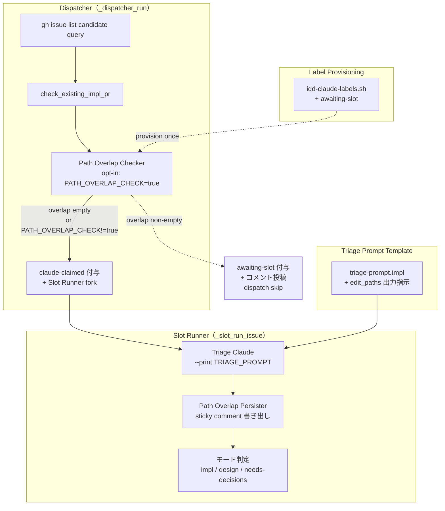
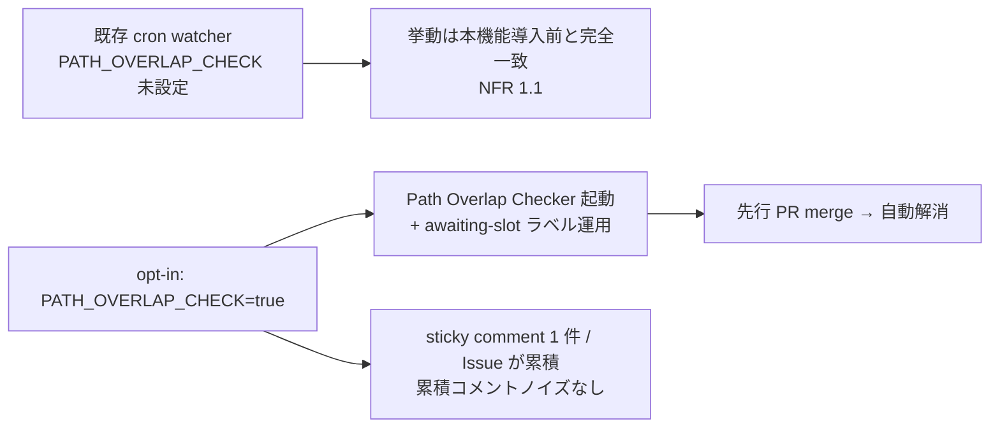

# Design Document — Phase E: Triage path overlap 検知（hot file 競合予防）

## Overview

**Purpose**: Phase E は、Phase C で並列化された slot 上で複数 auto-dev Issue が同時開発される
運用において、`package.json` / 共通 util / `local-watcher/bin/issue-watcher.sh` のような hot file
での merge conflict を **入口側で予防** する。Triage 段階で Claude に当該 Issue が編集する見込み
の top-level path 配列（以下 `edit_paths`）を列挙させ、Dispatcher が slot に投入する直前に
in-flight 他 Issue の `edit_paths` と突合し、重複があれば `awaiting-slot` ラベルで dispatch を
見送る。先行 Issue の PR が merge されて in-flight 集合から外れた次サイクルで自然解消する。

**Users**: Dispatcher を運用する idd-claude 利用者（cron / launchd で watcher を回す運用者）。
`PARALLEL_SLOTS >= 2` で複数 Issue を同時開発しており、Phase A（自動 rebase）/ Phase D（semantic
解析）で**出口側の自己修復**が稼働している状態を前提とする。本フェーズはそれらに対する**入口側
の予防策**として直交配置される。

**Impact**: 既存の Triage → Dispatcher → Slot Runner 経路に対し、(1) Triage prompt template に
`edit_paths` 出力指示の **additive 拡張**、(2) Triage 直後の `edit_paths` 永続化（sticky comment）、
(3) Dispatcher の claim 直前に挿入する **Overlap Checker**、(4) `awaiting-slot` ラベルの追加と
状態遷移、の 4 点を加える。すべて `PATH_OVERLAP_CHECK=true` を明示した時のみ動作し、未設定／
`false` / typo はすべて本機能導入前と完全一致の挙動になる（NFR opt-in / Req 1）。

### Goals

- Triage 段階で hot file 競合の発生確率が高い候補を検出し、dispatch を抑止する
- 自然解消（先行 PR merge → in-flight 集合縮小 → 次サイクルで `awaiting-slot` 自動除去）を実現
- 既存 Triage 出力スキーマ・既存 LABEL_\* 定数群・既存 dispatcher candidate query を**破壊しない**
- 本機能の有効化判断を `PATH_OVERLAP_CHECK` env 1 つに集約し、既存運用に強制移行しない
- 観測性: overlap 検出・付与・除去のすべてを `[$REPO]` prefix の watcher ログに残す（既存
  `dispatcher_log` / `pp_log` 等と grep 互換）

### Non-Goals

- overlap 判定の高精度化（AST レベル / 関数単位の diff 解析） — 将来課題（Non-Goals 継承）
- 静的解析ベースの編集 path 推定（言語別 dependency graph 等） — Claude による Triage 推定で代替
- Triage 出力スキーマの明示的バージョニング — additive 拡張 + key 存在チェックでの graceful
  degrade で代替（Non-Goals 継承）
- `staged-for-release` を in-flight に含めるかどうかの最終確定 — Req 4.1 の通り **含める** で
  固定。Phase B 側の運用変更があれば別 Issue で再検討
- fork PR への overlap 判定 — Dispatcher の処理対象外（既存方針継承）
- 外部 Feature Flag SaaS 連携 — env var 1 つで完結

## Architecture

### Existing Architecture Analysis

現状の Triage → Dispatcher 経路は `local-watcher/bin/issue-watcher.sh` の単一スクリプト内で
完結する次の流れ:

1. **Dispatcher (`_dispatcher_run`)** — `gh issue list` で `auto-dev` 付きかつ既存除外ラベル
   （`needs-decisions` / `awaiting-design-review` / `claude-claimed` / `claude-picked-up` /
   `ready-for-review` / `claude-failed` / `needs-iteration` / `needs-quota-wait` /
   `staged-for-release`）を除いた最大 5 件の Issue を取得し、`check_existing_impl_pr` を経て
   slot を確保し、`claude-claimed` を付与してから Slot Runner を fork
2. **Slot Runner (`_slot_run_issue`)** — claim 済 Issue について、`HAS_EXISTING_SPEC` / `skip-triage`
   ラベルの有無で `impl-resume` / `impl` を即決、それ以外は **Triage Claude** を呼んで
   `/tmp/triage-${REPO_SLUG}-${NUMBER}-${TS}.json` を生成。`status` / `needs_architect` /
   `architect_reason` / `rationale` / `decisions` を jq で抽出してモード（`design` / `impl`）と
   ラベル遷移（`claude-claimed` → `claude-picked-up` or `awaiting-design-review` or
   `needs-decisions`）を決定
3. **Triage prompt template** (`local-watcher/bin/triage-prompt.tmpl`) — Sonnet が読む単一の md
   テンプレ。`{{NUMBER}}` / `{{TITLE}}` / `{{URL}}` / `{{FILE}}` を `sed` 置換して
   `claude --print` に渡す。出力 JSON のスキーマは prompt 末尾で固定
4. **Hidden marker パターン** (例: `<!-- idd-claude:quota-reset:<epoch>:v1 -->` /
   `<!-- idd-claude:pr-iteration round=N last-run=... -->`) — Issue body / PR body 末尾に 1 行
   marker を追記する規約が既存 4 箇所で利用されており、追記・抽出は `sed -E` で完結
5. **ラベル管理** — `repo-template/.github/scripts/idd-claude-labels.sh` の `LABELS=("name|color|description" ...)`
   配列に追加し、`install.sh` 経由で consumer repo に配布

**尊重すべき制約**:

- 既存 Triage 出力 JSON の 5 keys（`status` / `needs_architect` / `architect_reason` /
  `rationale` / `decisions`）の presence / type / semantics は不変（Req 2.5）
- Dispatcher candidate query は除外ラベル列挙の順序を含めて意味を変えない（既存コメント
  「NFR 1.2: 既存除外条件の意味・順序は変更しない」を踏襲）
- LABEL\_\* 定数の追加は配列末尾追加。既存定数の rename / 削除はしない
- ラベル提供スクリプトの追加は配列末尾追加で冪等性を維持（Req 7.2 / 7.3）
- 自前のサブシェル内では `gh` API を 1 回のみ呼び、N+1 を作らない（Req 12.1）

### Architecture Pattern & Boundary Map



**Architecture Integration**:

- **採用パターン**: opt-in gate + additive schema 拡張 + sticky comment 永続化 + dispatcher
  pre-claim フィルタ拡張。すべて既存と同じ「hidden marker / sticky comment + gh CLI 1 回読み」
  パターンを踏襲する
- **ドメイン／機能境界**: (1) prompt template / (2) Triage parser + persister / (3) overlap
  checker + label state / (4) label provisioning の 4 境界。各境界は別ファイル or 別関数群で
  独立し、Developer は parallel に作業可能（特に template と labels.sh はそれぞれ独立コミット）
- **既存パターンの維持**: ラベル定数の追加位置・hidden marker 規約・dispatcher query の除外
  ラベル列挙パターン・`[$REPO]` prefix ログ・`pp_log` 系の `*_log` / `*_warn` 関数命名
- **新規コンポーネントの根拠**: overlap checker は既存 dispatcher 関数の中に直接書くと 1 関数が
  肥大化するため、独立関数群（`po_*` prefix）に切り出す。命名は既存 `pp_*` (Promote Pipeline)
  / `pi_*` (PR Iteration) / `mq_*` (Merge Queue) 等の prefix 規約に倣う

### Technology Stack

| Layer | Choice / Version | Role in Feature | Notes |
|-------|------------------|-----------------|-------|
| Frontend / CLI | — | — | watcher は CLI なし |
| Backend / Services | bash 4+ | Path Overlap Checker / Persister 本体 | 既存スクリプトに関数追加 |
| Data / Storage | GitHub Issue comment（sticky） + Issue label | edit_paths 永続化 / 状態 | hidden marker による sticky 化 |
| Messaging / Events | — | — | 該当なし |
| Infrastructure / Runtime | cron / launchd（既存） | 周期実行 | 周期は既存 watcher と共通 |
| External Tools | `gh` CLI / `jq` | API 呼び出しと JSON 抽出 | 既存依存と完全一致 |
| Model | `claude --model $TRIAGE_MODEL` | edit_paths を Issue 本文から推定 | Triage Claude 既存呼び出しを流用 |

## File Structure Plan

### Modified Files（既存ファイルへの additive 変更）

```
local-watcher/bin/
├── triage-prompt.tmpl           # Triage Prompt Template に edit_paths 出力指示を追加
└── issue-watcher.sh             # 下記の関数群と統合点を追加
                                 # - LABEL_AWAITING_SLOT 定数（既存 LABEL_* ブロック末尾）
                                 # - PATH_OVERLAP_CHECK env 解決（既存 env ブロック）
                                 # - po_log / po_warn ログ関数
                                 # - po_parse_triage_edit_paths (Triage Parser)
                                 # - po_persist_edit_paths (Path Overlap Persister)
                                 # - po_load_edit_paths (sticky 読み出し)
                                 # - po_collect_inflight_issues (in-flight 列挙)
                                 # - po_compute_overlap (top-level prefix match)
                                 # - po_apply_awaiting_slot (ラベル付与 + コメント)
                                 # - po_clear_awaiting_slot (ラベル除去)
                                 # - po_check_dispatch_gate (Dispatcher 統合点)
                                 # 統合: _slot_run_issue の Triage parse 直後で persist 呼び出し
                                 # 統合: _dispatcher_run の claim 直前で po_check_dispatch_gate 呼び出し

repo-template/.github/scripts/
└── idd-claude-labels.sh         # LABELS 配列に awaiting-slot|<color>|<desc> を追加

README.md                        # 「Phase E: Triage Path Overlap Checker」節を追加
                                 # 既存「オプション機能（標準有効 / 常時有効）一覧」表に行追加
                                 # 既存「ラベル状態遷移まとめ」表に awaiting-slot 行追加
                                 # Step 2 のラベル一括作成例に awaiting-slot 行追加
```

### New Files

```
docs/specs/18-phase-e-triage-path-overlap-hot-file/
├── requirements.md              # PM 作成済
├── design.md                    # 本ファイル
└── tasks.md                     # Architect 作成（本 PR）
```

### Files Not Modified (out of scope)

- `local-watcher/bin/install.sh` / `setup.sh` — Phase E は新規ファイル配置を伴わない。`labels.sh`
  は配列追加のみで既存 `install.sh` の再実行で `gh label create` が冪等に追加配布される
- `.github/workflows/issue-to-pr.yml` — Phase E は Actions 経路では起動しない（cron watcher 専用）
- `repo-template/.claude/agents/*.md` — agent prompt は変更しない（Triage prompt template だけが影響）
- `repo-template/.claude/rules/*.md` — rule は変更しない

## Requirements Traceability

| Requirement | Summary | Components | Interfaces | Flows |
|-------------|---------|------------|------------|-------|
| 1.1 | `PATH_OVERLAP_CHECK=true` のみ有効 | Path Overlap Env Resolver | `PATH_OVERLAP_CHECK` env 取得 | Dispatcher pre-claim filter で短絡 |
| 1.2 | 未設定なら no-op | Path Overlap Env Resolver / Dispatcher 統合点 | early return | Dispatcher → 既存 claim 直行 |
| 1.3 | `true` 以外（`false` / `True` / `1` / typo）は no-op | Path Overlap Env Resolver | 厳密比較 `[ "$PATH_OVERLAP_CHECK" = "true" ]` | 同上 |
| 1.4 | デフォルトは off | Path Overlap Env Resolver | `${PATH_OVERLAP_CHECK:-off}` | 同上 |
| 2.1 | Triage 出力に edit_paths 配列 | Triage Prompt Template | prompt 末尾の JSON schema に追記 | Triage Claude → JSON 生成 |
| 2.2 | top-level path 文字列配列 | Triage Prompt Template | prompt 指示文 | 同上 |
| 2.3 | 確信なしは空配列 | Triage Prompt Template | prompt 指示文 | 同上 |
| 2.4 | 欠落は空配列扱い | Triage Parser (`po_parse_triage_edit_paths`) | `jq '.edit_paths // []'` | Slot Runner 内 Triage parse |
| 2.5 | 既存 5 keys 不変 | Triage Prompt Template / 既存 Triage parser | 既存 jq 抽出を温存 | regression-safe |
| 3.1 | 後続 cron で再読可能 | Path Overlap Persister | sticky comment + hidden marker | Triage 後 → persist |
| 3.2 | GitHub UI で目視可能 | Path Overlap Persister | sticky comment は通常表示 | Issue page に可視 |
| 3.3 | 再 Triage で上書き | Path Overlap Persister | comment id 取得 → `gh api PATCH` で edit | Triage 再走時 |
| 3.4 | persist 失敗は fail-open | Path Overlap Persister | warn のみ、Triage 全体は成功 | Triage 後 |
| 4.1 | in-flight ラベル集合 | In-Flight Collector (`po_collect_inflight_issues`) | gh issue list label union | Dispatcher 統合点 |
| 4.2 | `st-failed` / `awaiting-slot` は除外 | In-Flight Collector | `--search "-label:..."` | 同上 |
| 4.3 | 候補自身を除外 | In-Flight Collector | `--jq '.[] | select(.number != $candidate)'` | 同上 |
| 4.4 | 同 repo のみ | In-Flight Collector | `--repo "$REPO"` 固定 | 同上 |
| 5.1 | claim 直前で intersection 計算 | Overlap Engine (`po_compute_overlap`) | bash sort + comm or jq array intersection | Dispatcher 統合点 |
| 5.2 | non-empty → `awaiting-slot` 付与 + dispatch skip | Awaiting Slot State Machine (`po_apply_awaiting_slot`) | `gh issue edit --add-label` + `continue` | Dispatcher loop |
| 5.3 | 説明コメント投稿（sticky） | Awaiting Slot State Machine | hidden marker `<!-- idd-claude:awaiting-slot:v1 -->` で sticky | Dispatcher 統合点 |
| 5.4 | empty → 通常 dispatch | Dispatcher 統合点 | early return → claim へ | Dispatcher loop |
| 5.5 | 候補 edit_paths 不在は block しない | Overlap Engine | 空配列 vs 任意集合 = intersection 空 | Dispatcher 統合点 |
| 5.6 | top-level 粒度のみ | Overlap Engine | path 正規化（先頭セグメント抽出） | Overlap 比較 |
| 6.1 | 後続 tick で再評価 | Awaiting Slot Re-evaluator | `awaiting-slot` 付き candidate を再 fetch | Dispatcher 統合点 |
| 6.2 | empty → 自動除去 + dispatch | Awaiting Slot State Machine (`po_clear_awaiting_slot`) | `gh issue edit --remove-label` → claim 続行 | Dispatcher 統合点 |
| 6.3 | non-empty → 維持 | Awaiting Slot State Machine | early `continue` | Dispatcher loop |
| 6.4 | 人間介入不要 | Awaiting Slot Re-evaluator | 自動除去フローを Dispatcher 内に閉じる | regression-safe |
| 7.1 | ラベル定義追加 | Label Provisioning Script | LABELS 配列末尾追加 | one-shot |
| 7.2 | 冪等再実行 | Label Provisioning Script | 既存 `EXISTING_LABELS` check で skip | one-shot |
| 7.3 | 既存ラベル無傷 | Label Provisioning Script | 追加のみ・rename / 削除なし | one-shot |
| 8.1 | overlap 検出ログ | Path Overlap Logger (`po_log`) | `[$REPO]` prefix + candidate/path/holder | Dispatcher 統合点 |
| 8.2 | `awaiting-slot` 付与ログ | Path Overlap Logger | 同上 + candidate | Awaiting Slot 付与時 |
| 8.3 | `awaiting-slot` 除去ログ | Path Overlap Logger | 同上 + candidate | Awaiting Slot 除去時 |
| 8.4 | cron.log 経路 | Path Overlap Logger | 既存 `dispatcher_log` と同じ tee 経路 | 同上 |
| 9.1 | README に Phase E 節 | README Section | `## Path Overlap Checker (Phase E)` 見出し | one-shot |
| 9.2 | opt-in 方法記述 | README Section | `PATH_OVERLAP_CHECK=true` の export 例 | one-shot |
| 9.3 | in-flight ラベル列挙 | README Section | 7 ラベルを箇条書き列挙 | one-shot |
| 9.4 | 自然解消の説明 | README Section | サイクルフロー説明 | one-shot |
| 10.1 | dogfood `PATH_OVERLAP_CHECK=true` 設定 | Dogfood Test Procedure | impl-notes に手順記載 | one-shot |
| 10.2 | 同一ファイル編集 2 Issue 作成 | Dogfood Test Procedure | 同上 | one-shot |
| 10.3 | 後発 Issue が `awaiting-slot` 取得 | Dogfood Test Procedure | 観測ログで確認 | one-shot |
| 10.4 | 先発 merge 後の自然解消 | Dogfood Test Procedure | 観測ログで確認 | one-shot |
| 11.1 | shellcheck zero warnings | Static Check Procedure | `shellcheck local-watcher/bin/issue-watcher.sh` | PR 前検証 |
| 12.1 | candidate 1 件あたり 1 read + 1 比較 | Path Overlap Persister / In-Flight Collector | 1 candidate あたり API call 1 回 | regression-safe |
| 12.2 | overlap 不検出時に追加 API なし | Dispatcher 統合点 | overlap empty なら追加処理なし | 同上 |

## Components and Interfaces

### Triage Prompt Layer

#### Triage Prompt Template

| Field | Detail |
|-------|--------|
| Intent | Triage Claude に `edit_paths` 配列を追加出力させる（既存 5 keys は不変） |
| Requirements | 2.1, 2.2, 2.3, 2.5 |

**Responsibilities & Constraints**

- 主責務: Issue 本文・コメント・タイトルから「この Issue が編集する可能性が高い top-level path」
  を 0〜N 個推定し、JSON 配列として返す
- 既存 5 keys（`status` / `needs_architect` / `architect_reason` / `rationale` / `decisions`）の
  position / type / semantics を **変更しない**（Req 2.5）
- 確信が低い場合は **空配列**を返す（Req 2.3）。omit や `null` や非配列を返してはならない
- top-level path とは「リポジトリルートから見た 1 段目のディレクトリ名 / ファイル名」
  （例: `local-watcher/`, `README.md`, `docs/`）。サブパスや行番号は不要（Req 2.2 / 5.6）

**Dependencies**

- Inbound: Slot Runner（`_slot_run_issue`）— prompt sed 置換 (Critical)
- Outbound: Triage Claude（`--model $TRIAGE_MODEL`）— JSON 出力 (Critical)
- External: なし

**Contracts**: API [x]

##### Schema Change（additive）

prompt 末尾の出力 JSON schema に `edit_paths` フィールドを 1 行追加する:

```json
{
  "status": "ready" | "needs-decisions",
  "needs_architect": true | false,
  "architect_reason": "...",
  "rationale": "...",
  "decisions": [ /* 既存 */ ],
  "edit_paths": [
    "local-watcher/",
    "README.md"
  ]
}
```

- `edit_paths` は必ず JSON 配列。空配列 `[]` は明示的に許容（Req 2.3）
- 配列要素は文字列のみ。リポジトリルートからの相対パスで、末尾の `/` はディレクトリ識別用
  （Triage Claude には optional として指示するが、parser は末尾 `/` の有無を吸収する）
- 既存 5 keys の前後関係（実際は順序非依存だが prompt 例示は維持）は変更しない

##### Prompt 指示文の追加箇所

prompt 末尾の「## 出力形式」節に下記の追記を行う（既存指示文の改変は禁止）:

> ## edit_paths の出力指示（Phase E）
>
> Triage の判定に加えて、当該 Issue を実装した場合に **編集される可能性が高い top-level
> path** を JSON 配列 `edit_paths` として出力してください。
>
> - 要素はリポジトリルートからの相対パスで、ディレクトリは末尾 `/` 付き、ファイルは `/` なし
> - top-level（1 段目）のみ。サブパスや行番号は不要
> - Issue 本文に明示記載がある場合は確度高、推測でしかない場合は除外
> - 確信が持てない場合は空配列 `[]` を返してください（omit や null は不可）
> - 推定見込みであり 100% 正確である必要はない（過剰列挙より厳選を優先）

### Triage Output Parsing Layer

#### Triage Edit-Paths Parser (`po_parse_triage_edit_paths`)

| Field | Detail |
|-------|--------|
| Intent | `$TRIAGE_FILE` から `edit_paths` 配列を抽出（欠落・型不正は空配列にフォールバック） |
| Requirements | 2.4, 2.5 |

**Responsibilities & Constraints**

- 主責務: jq で `.edit_paths` を抽出。key 不在 / `null` / 非配列 / 文字列以外要素混入はすべて
  空配列扱い（Req 2.4）
- 既存 5 keys の抽出ロジック（`jq -r '.status'` 等）は変更しない（Req 2.5）

**Dependencies**

- Inbound: Slot Runner（Triage parse 直後）— 1 箇所のみ呼び出し (Critical)
- Outbound: `jq` — 同期サブプロセス (Critical)

**Contracts**: Service [x]

##### Service Interface

```bash
# stdin: なし
# args: $1 = TRIAGE_FILE path
# stdout: JSON array string（必ず `[...]` 形式、空でも `[]`）
# return: 0 always（失敗時は `[]` を返す fail-safe）
po_parse_triage_edit_paths() {
  local triage_file="$1"
  # `// []` で key 不在を吸収、`if type=="array" then ... else [] end` で型不正吸収、
  # `map(select(type=="string"))` で文字列以外を除外
  jq -c '
    (.edit_paths // [])
    | if type == "array" then
        map(select(type == "string"))
      else
        []
      end
  ' "$triage_file" 2>/dev/null || echo '[]'
}
```

- Preconditions: `$TRIAGE_FILE` が存在する（既存 Triage 成功 path でのみ呼び出し）
- Postconditions: stdout は必ず valid JSON 配列文字列
- Invariants: 既存 Triage parser コードを書き換えず、本関数は **新規追加のみ**

### Persistence Layer

#### Path Overlap Persister (`po_persist_edit_paths` / `po_load_edit_paths`)

| Field | Detail |
|-------|--------|
| Intent | Issue 上に sticky comment で `edit_paths` を永続化し、後続 cron で再読可能にする |
| Requirements | 3.1, 3.2, 3.3, 3.4, 12.1 |

**Responsibilities & Constraints**

- 主責務: Triage で得た `edit_paths` JSON を、Issue にコメントとして書き出す。同じ marker を
  持つ既存コメントがあれば **edit で上書き**（Req 3.3）、無ければ新規 create
- sticky 化規約: コメント本文末尾に `<!-- idd-claude:edit-paths:v1 -->` を 1 行付与。検索時は
  `gh issue view --comments --json` でこの marker を含むコメントを取得
- 失敗時は warn のみ。Triage 全体の成功扱いを維持する（Req 3.4 fail-open）
- read 失敗時も空配列を返して dispatch を停止しない（Req 5.5 と整合）

**Dependencies**

- Inbound: Slot Runner（Triage parse 直後） / Overlap Engine（後続 cron）(Critical)
- Outbound: `gh issue comment` / `gh api PATCH /repos/.../issues/comments/{id}` /
  `gh issue view --json comments` (Critical)

**Contracts**: Service [x] / State [x]

##### Service Interface

```bash
# Args: $1 = issue number, $2 = edit_paths JSON array string
# Return: 0 = persist OK / 1 = persist failed (caller logs warn but does NOT propagate failure)
po_persist_edit_paths() {
  local issue_number="$1"
  local edit_paths_json="$2"
  # 1) 既存 comments を gh で取得し marker 持ち comment id を探す
  # 2) 見つかれば PATCH /issues/comments/{id} で body を上書き
  # 3) 無ければ `gh issue comment` で新規投稿
  # 4) コメント本文形式は次の通り（marker は最終行 1 行）:
  #
  #    ## Triage edit_paths（Phase E）
  #
  #    本 Issue が編集見込みの top-level path:
  #
  #    - `local-watcher/`
  #    - `README.md`
  #
  #    *(自動生成: Path Overlap Checker。本機能の詳細は README の「Phase E」節を参照)*
  #
  #    <!-- idd-claude:edit-paths:v1 -->
  :
}

# Args: $1 = issue number
# Stdout: edit_paths JSON 配列文字列（marker 不在・失敗時は `[]`）
# Return: 0 always
po_load_edit_paths() {
  local issue_number="$1"
  # 1) `gh issue view --comments --json comments` で全コメント取得（1 candidate あたり 1 call）
  # 2) jq で marker 含む comment.body を抽出、本文中の最初の md リスト要素を pure 文字列配列に変換
  #    （または別案: 本文に隠し JSON `<!-- idd-claude:edit-paths-json:[...] -->` を併記）
  # 3) marker 不在 / 抽出失敗 / 形式異常はすべて `[]`
  :
}
```

##### 設計判断: sticky 本文の機械可読化

人間可読の md リスト本文だけだと、bash で parse する際に list 形式の脆さがある。**採用案**:
コメント本文には人間可読の md リストを書きつつ、**末尾 marker と同じ行の隣**に hidden JSON
marker を追加する 2 段構成:

```
<!-- idd-claude:edit-paths:v1 -->
<!-- idd-claude:edit-paths-json:["local-watcher/","README.md"] -->
```

- 人間は md リストを見る（Req 3.2）
- bash は hidden JSON marker 行を `sed -nE 's/.*<!-- idd-claude:edit-paths-json:(.*) -->.*/\1/p'`
  で抽出し直接 jq に渡す（Req 12.1: 1 candidate あたり 1 read のみ）
- `gh issue view --json comments` 1 call で読み出し（既存の `qa_load_reset_time` パターンを踏襲）

**代替案**: コメント本文の md リスト行を `sed` で抽出する。脆い（人間が編集すると壊れる）ため
不採用。

**Contracts**:
- Preconditions: なし
- Postconditions: 後続 cron tick で `po_load_edit_paths` が同値を返す
- Invariants: 同一 Issue に marker 付きコメントは **常に高々 1 件**（既存 hidden marker パターン
  と同じ冪等性。重複防止は body 更新前の検索 + update でカバー）

### Dispatcher Integration Layer

#### Path Overlap Env Resolver

| Field | Detail |
|-------|--------|
| Intent | `PATH_OVERLAP_CHECK` env を厳密比較で `true` / non-`true` の 2 値に正規化 |
| Requirements | 1.1, 1.2, 1.3, 1.4 |

**Responsibilities & Constraints**

- 主責務: `${PATH_OVERLAP_CHECK:-off}` を読み、`[ "$PATH_OVERLAP_CHECK" = "true" ]` で判定
- `False` / `True` / `1` / `yes` / 空文字 / 未設定はすべて非有効（既存 `AUTO_REBASE_MODE` の
  「`off` 以外も `off` 扱いの厳格 normalize」と同じ思想だが、Phase E は **`opt-in default off`**
  方針なので「`true` 以外はすべて off」とする。本機能は #112 で反転されたデフォルト有効群
  には **含めない**）

##### Implementation

既存の env var ブロック（issue-watcher.sh の 60〜350 行付近）に下記を追加:

```bash
# ─── Phase E: Path Overlap Checker 設定 (#18) ───
# 新規 opt-in 機能。明示的に `=true` を指定したときだけ起動する（Req 1.1〜1.4）。
# `=true` 以外（未設定 / 空 / `false` / `0` / typo 等）はすべて off として扱う。
# 既定 false が要件のため、#112 のデフォルト有効化 normalize ループには **含めない**。
PATH_OVERLAP_CHECK="${PATH_OVERLAP_CHECK:-off}"
LABEL_AWAITING_SLOT="awaiting-slot"
```

#### In-Flight Collector (`po_collect_inflight_issues`)

| Field | Detail |
|-------|--------|
| Intent | 現サイクルの in-flight Issue（候補自身を除く）を gh で 1 回列挙し、各 Issue の `edit_paths` の union を返す |
| Requirements | 4.1, 4.2, 4.3, 4.4, 12.1 |

**Responsibilities & Constraints**

- 主責務: `gh issue list` で `claude-claimed,claude-picked-up,awaiting-design-review,ready-for-review,needs-iteration,needs-rebase,staged-for-release` のいずれかを持ち、`st-failed` / `awaiting-slot` を持たない open Issue を取得
- 各 Issue について `po_load_edit_paths` を 1 回ずつ呼ぶ。**候補 1 件あたり API call が
  O(in-flight 件数)** になるが、in-flight は通常 `PARALLEL_SLOTS` 上限（≤ 数件）と
  `staged-for-release` の累積件数程度で、実運用では一桁。Req 12.1 の「候補 1 件あたり 1 read」
  は **候補側** の制約であり、union 取得側は実運用範囲内と判断（後述「Performance」節）

**Dependencies**

- Inbound: Dispatcher 統合点 (Critical)
- Outbound: `gh issue list` / `gh issue view --comments` × in-flight 件数 (Critical)

**Contracts**: Service [x]

##### Service Interface

```bash
# Args: $1 = candidate issue number（自身を除外）
# Stdout: JSON 配列の union（重複排除済）。例: ["local-watcher/","README.md"]
# Return: 0 = collection OK、 1 = gh API 失敗（caller は fail-open で empty 扱い + warn）
po_collect_inflight_issues() {
  local candidate="$1"
  # gh issue list --label="claude-claimed,..." の OR 検索は `--label A --label B` で AND
  # になってしまうため、--search 'label:claude-claimed OR label:claude-picked-up OR ...'
  # 形式を使う（Phase B Promote Pipeline でも同形式を使っている）。
  # `--repo "$REPO"` で同 repo 限定（Req 4.4）、`-label:st-failed -label:awaiting-slot` で除外。
  # `--jq '.[] | select(.number != $candidate) | .number'` で候補自身を排除（Req 4.3）。
  # 各 Issue について po_load_edit_paths を呼んで union（jq の `add | unique`）。
  :
}
```

- Preconditions: `gh` 認証済、`$REPO` 設定済
- Postconditions: 戻り JSON 配列に candidate 自身の path 群は含まれない
- Invariants: 列挙対象 label は **Req 4.1 のリストのみ**。今後追加するなら別 Issue で対応

#### Overlap Engine (`po_compute_overlap`)

| Field | Detail |
|-------|--------|
| Intent | candidate と in-flight の path 配列の積集合を top-level 粒度で計算 |
| Requirements | 5.1, 5.5, 5.6 |

**Responsibilities & Constraints**

- 主責務: 2 つの JSON 配列の交差を求める。比較は **正規化済の top-level 文字列の完全一致**
  （Req 5.6 の「top-level granularity」を「先頭セグメント完全一致」と解釈）
- 正規化規約:
  - 先頭 `./` を剥がす
  - 連続スラッシュを 1 つに圧縮
  - ディレクトリ末尾 `/` を保持し、ファイルは保持しない
  - **比較キー**は「先頭セグメント + ディレクトリなら `/`」例: `local-watcher/bin/foo.sh` →
    `local-watcher/`、`README.md` → `README.md`、`docs/specs/18-.../requirements.md` → `docs/`
- candidate が空配列なら **常に積集合は空**（Req 5.5）

**Dependencies**

- Inbound: Dispatcher 統合点
- Outbound: `jq` （配列演算）

**Contracts**: Service [x]

##### Service Interface

```bash
# Args: $1 = candidate edit_paths JSON 配列, $2 = in-flight union JSON 配列
# Stdout: 交差 JSON 配列（正規化済 top-level key）
# Return: 0 always
po_compute_overlap() {
  local cand_json="$1"
  local inflight_json="$2"
  # 1) 正規化関数 normalize(p) を jq def で定義
  # 2) candidate を normalize → set 化、in-flight も normalize → set 化
  # 3) `cand_set | map(select(. as $p | $inflight_set | index($p)))` で intersection
  jq -nc \
    --argjson c "$cand_json" \
    --argjson f "$inflight_json" '
    def normalize:
      sub("^\\./"; "")
      | gsub("/+"; "/")
      | if test("/") then
          (split("/")[0] + "/")
        else
          .
        end;
    ($c | map(normalize) | unique) as $cn
    | ($f | map(normalize) | unique) as $fn
    | $cn | map(select(. as $p | $fn | index($p)))
  '
}
```

#### Awaiting Slot State Machine (`po_apply_awaiting_slot` / `po_clear_awaiting_slot`)

| Field | Detail |
|-------|--------|
| Intent | `awaiting-slot` ラベルの付与・除去 + 説明コメント（sticky）の投稿・更新 |
| Requirements | 5.2, 5.3, 5.4, 6.1, 6.2, 6.3, 6.4 |

**Responsibilities & Constraints**

- 主責務（apply）: ラベル付与 + 説明コメント（重複した overlapping path と holder Issue 番号を
  明記）を sticky で post / edit
- 主責務（clear）: ラベル除去のみ（comment 削除はしない。事後監査用に残す）
- sticky comment marker: `<!-- idd-claude:awaiting-slot:v1 -->`。同 Issue に 1 件のみ
- `gh issue edit --add-label` / `--remove-label` は冪等（既に付与済 / 除去済でも non-error）

**Dependencies**

- Inbound: Dispatcher 統合点
- Outbound: `gh issue edit` / `gh issue comment` / `gh api PATCH .../issues/comments/{id}`

**Contracts**: State [x]

##### State Transitions

```
[candidate to dispatch]
   │
   ▼
PATH_OVERLAP_CHECK=true ?
   │ false              │ true
   ▼                    ▼
[claim 直行]   [load edit_paths + in-flight union]
                       │
                       ▼
              [compute overlap]
                       │
        non-empty  ────┼──── empty
              ▼                ▼
       [apply awaiting-slot]   [has awaiting-slot ?]
              │                       │
              │             yes      ▼      no
              │              ▼              ▼
              ▼          [clear awaiting-slot] [claim 直行]
        [continue          + [claim 直行]
         (dispatch skip)]
```

- 6.4: clear → claim 直行は **同サイクル内** で行う（人間介入不要）

#### Path Overlap Logger (`po_log` / `po_warn`)

| Field | Detail |
|-------|--------|
| Intent | 既存 `dispatcher_log` / `pp_log` と grep 互換の prefix 付きログ出力 |
| Requirements | 8.1, 8.2, 8.3, 8.4 |

**Responsibilities & Constraints**

- 主責務: `[$REPO] path-overlap: <message>` 形式で stdout（cron.log にリダイレクトされる）と
  watcher LOG ファイルに tee
- `po_warn` は同形式で `WARN` 接頭辞を付与（既存 `pp_warn` パターンを踏襲）

**Dependencies**

- Outbound: stdout / `$LOG`

**Contracts**: Service [x]

##### Service Interface

```bash
po_log()  { echo "[$(date '+%F %T')] [$REPO] path-overlap: $*" | tee -a "$LOG"; }
po_warn() { echo "[$(date '+%F %T')] [$REPO] path-overlap: WARN $*" | tee -a "$LOG" >&2; }
```

- Req 8.1 ログ例: `[$REPO] path-overlap: overlap detected candidate=#42 paths=local-watcher/,README.md holders=#39,#40`
- Req 8.2 ログ例: `[$REPO] path-overlap: awaiting-slot added candidate=#42`
- Req 8.3 ログ例: `[$REPO] path-overlap: awaiting-slot cleared candidate=#42 (overlap empty)`

#### Dispatcher Integration Point (`po_check_dispatch_gate`)

| Field | Detail |
|-------|--------|
| Intent | `_dispatcher_run` の claim 直前に挿入する gate 関数。env off なら no-op、on なら overlap 判定して claim 続行可否を返す |
| Requirements | 1.1〜1.4, 5.1〜5.6, 6.1〜6.3, 8.1〜8.4, 12.1, 12.2 |

**Responsibilities & Constraints**

- 主責務: `_dispatcher_run` の各 candidate ループ内、`check_existing_impl_pr` 通過後・slot 取得
  前に呼び、戻り値で claim を続行するか skip するかを切り替える
- `PATH_OVERLAP_CHECK != "true"` なら **早期 return 0** で従来挙動に直結（NFR opt-in、Req 1.2）

**Dependencies**

- Inbound: `_dispatcher_run` の主ループ
- Outbound: `po_load_edit_paths` / `po_collect_inflight_issues` / `po_compute_overlap` /
  `po_apply_awaiting_slot` / `po_clear_awaiting_slot`

**Contracts**: Service [x]

##### Service Interface

```bash
# Args: $1 = candidate issue number, $2 = candidate labels JSON (from gh issue list)
# Return: 0 = claim を続行してよい / 1 = この cycle では dispatch skip（continue）
po_check_dispatch_gate() {
  local candidate="$1"
  local labels_json="$2"

  # Req 1.2 / 1.3 / 1.4: opt-in gate
  [ "$PATH_OVERLAP_CHECK" = "true" ] || return 0

  # 候補の edit_paths を sticky から読む（Req 5.5: 不在は空配列）
  local cand_paths
  cand_paths=$(po_load_edit_paths "$candidate")

  # in-flight union を取得（Req 4.1〜4.4）
  local inflight_paths
  inflight_paths=$(po_collect_inflight_issues "$candidate") || {
    po_warn "in-flight 列挙に失敗、本サイクルは overlap 判定をスキップして claim 続行"
    return 0  # fail-open
  }

  # overlap 計算（Req 5.1 / 5.6）
  local overlap
  overlap=$(po_compute_overlap "$cand_paths" "$inflight_paths")
  local overlap_count
  overlap_count=$(echo "$overlap" | jq 'length')

  # has_awaiting_slot 判定（既存 labels_json から抽出）
  local has_awaiting
  has_awaiting=$(echo "$labels_json" | jq -r '[.[].name] | index("'"$LABEL_AWAITING_SLOT"'") // empty')

  if [ "$overlap_count" -gt 0 ]; then
    # Req 5.2 / 8.1 / 8.2
    po_log "overlap detected candidate=#${candidate} paths=$(echo "$overlap" | jq -r 'join(",")') holders=<TBD-list>"
    if [ -z "$has_awaiting" ]; then
      po_apply_awaiting_slot "$candidate" "$overlap" || \
        po_warn "awaiting-slot 付与 / コメント投稿に失敗（次サイクルで再評価）"
    fi
    return 1  # dispatch skip
  else
    # Req 6.2 / 6.4 / 8.3
    if [ -n "$has_awaiting" ]; then
      po_clear_awaiting_slot "$candidate" || \
        po_warn "awaiting-slot 除去に失敗（次サイクルで再試行）"
    fi
    return 0  # claim 続行
  fi
}
```

##### Integration into `_dispatcher_run`

既存 `_dispatcher_run` の candidate ループ内、`check_existing_impl_pr` 通過直後・
`_dispatcher_find_free_slot` 呼び出し前に挿入:

```bash
if ! check_existing_impl_pr "$issue_number"; then
  continue
fi

# ── Phase E: Path Overlap Gate (#18) ──
# PATH_OVERLAP_CHECK=true のときのみ有効。off なら no-op で従来挙動。
labels_json=$(echo "$issue" | jq -c '.labels')
if ! po_check_dispatch_gate "$issue_number" "$labels_json"; then
  continue
fi

# ── 空き slot 探索（busy なら 1 件完了するまで待機）──
local slot=""
...
```

**重要**: `gh issue list` の candidate query には **`awaiting-slot` を除外条件として
**含めない**。「6.1: 後続 tick で再評価」を成り立たせるため、`awaiting-slot` 付きの Issue も
candidate query で拾い続け、`po_check_dispatch_gate` 内で再判定して空になれば除去する。
逆に言うと `awaiting-slot` 付きは Triage を経由しない（既に Triage 済 = sticky 持ち / または
Triage 未到達なら edit_paths は空配列扱いで素通り）。

### Awaiting Slot Re-evaluator

候補 query で `awaiting-slot` を除外しないため、Dispatcher は毎サイクル `awaiting-slot` 付き
Issue も candidate として再評価する。`po_check_dispatch_gate` 内で in-flight union を再計算し、
overlap empty なら clear して同サイクル内に claim 続行（Req 6.2 / 6.4）。

ただし `gh issue list --label auto-dev` の existing 除外条件には `claude-claimed` 等が含まれて
いるため、`awaiting-slot` を持つ Issue は **`claude-claimed` を持たない状態**で残ることが
保証されている（前サイクルで claim 直前に skip → claim 未付与のまま）。これにより再 fetch
時にも candidate に必ず再出現する。

### Label Provisioning Layer

#### Label Provisioning Script Edit

| Field | Detail |
|-------|--------|
| Intent | `idd-claude-labels.sh` の LABELS 配列に `awaiting-slot` 1 行追加 |
| Requirements | 7.1, 7.2, 7.3 |

**Responsibilities & Constraints**

- 配列の **末尾追加のみ**。既存 13 行は名前 / 色 / 説明文を変更しない（Req 7.3）
- 色: 既存 `needs-quota-wait` の `c5def5`（薄水色 = pending 系）に近い色相を選ぶか、暖色系の
  「待機」を示す `fef2c0`（薄黄）など。**採用案**: `c5def5`（既存 `needs-quota-wait` と同じ
  「待機系」群との視覚的整合）
- 説明文: 「【Issue 用】 hot file 競合予防で同サイクル dispatch を見送り中（Phase E Path Overlap
  Checker が付与・除去）」
- 冪等性: 既存 script 内の `EXISTING_LABELS_JSON` 抽出 + `EXISTING_LABELS[$NAME]` チェックで
  自動的に skip / `--force` 上書きされる（Req 7.2）

##### Diff スニペット

```bash
LABELS=(
  ...
  "st-failed|d73a4a|【Issue 用】 ST failure 検知後 revert 済み（Phase B Promote Pipeline が付与）"
  "awaiting-slot|c5def5|【Issue 用】 hot file 競合予防で同サイクル dispatch を見送り中（Phase E Path Overlap Checker が付与・除去）"
)
```

### Documentation Layer

#### README Section: Phase E

| Field | Detail |
|-------|--------|
| Intent | 運用者が opt-in 方法・in-flight ラベル定義・自然解消挙動を README 単独で理解できる |
| Requirements | 9.1, 9.2, 9.3, 9.4 |

**Responsibilities & Constraints**

- 既存 Phase A / B / D の節（`## Merge Queue Processor (Phase A)` 等）と同じ階層・同じ書式で
  `## Path Overlap Checker (Phase E)` を追加
- 既存「オプション機能（標準有効 / 常時有効）一覧」の opt-in 表に 1 行追加
- 既存「ラベル状態遷移まとめ」表に `awaiting-slot` 1 行追加
- Step 2 のラベル一括作成例（`gh label create`）に 1 行追加
- 必須サブセクション: 概要 / 環境変数 / in-flight ラベル定義 / 自然解消の流れ / 観測ログ /
  dogfood 確認手順 / Migration Note（NFR 1.1 後方互換性）

## Data Models

### Triage Output JSON Schema（additive change）

```json
{
  "status": "ready" | "needs-decisions",
  "needs_architect": true | false,
  "architect_reason": "string",
  "rationale": "string",
  "decisions": [ { "topic": "...", "question": "...", ... } ],
  "edit_paths": [ "string", ... ]
}
```

- **既存 5 keys**: type / presence / semantics は変更なし（Req 2.5）
- **`edit_paths`**: 新規追加 key。値は必ず JSON 配列。空配列 `[]` を許容、`null` / 非配列 /
  key 不在はすべて parser 側で `[]` に正規化される（Req 2.4）
- 互換性: 旧 prompt で生成された既存 Triage 結果には `edit_paths` が無い → parser が空配列扱い
  → dispatch を block しない（Req 2.4 + 5.5 連動）

### Sticky Comment Format

```markdown
## Triage edit_paths（Phase E）

本 Issue が編集見込みの top-level path:

- `local-watcher/`
- `README.md`

*(自動生成: Path Overlap Checker。本機能の詳細は README の「Phase E」節を参照)*

<!-- idd-claude:edit-paths:v1 -->
<!-- idd-claude:edit-paths-json:["local-watcher/","README.md"] -->
```

- 人間可読の md リスト（Req 3.2）+ 機械可読の hidden JSON marker（Req 12.1 高速読み出し）
- 1 Issue につき marker `<!-- idd-claude:edit-paths:v1 -->` 持ち comment は **高々 1 件**
- 再 Triage 時は既存 comment id を取得して PATCH で上書き（Req 3.3 重複防止）

### Awaiting-Slot Sticky Comment Format

```markdown
## ⏸️ Dispatch を見送り中（Phase E Path Overlap Checker）

本 Issue が編集見込みの top-level path のうち、以下が現在 in-flight 中の他 Issue と重複しています。

| 重複 path | 保持中の Issue |
|---|---|
| `local-watcher/` | #39, #40 |
| `README.md` | #40 |

先行 Issue の PR が merge されて in-flight 集合から外れた次サイクルで `awaiting-slot` ラベルが
自動除去され、本 Issue は通常 dispatch に戻ります。手動介入は不要です。

詳細は README の「Path Overlap Checker (Phase E)」節を参照してください。

<!-- idd-claude:awaiting-slot:v1 -->
```

- sticky: 同 Issue に marker 持ち comment は **高々 1 件**。Req 5.3 で「コメントを post」と
  だけ規定されているが、cron tick 毎に累積するノイズを抑制するため sticky 化を **採用**
- clear 時はコメントは残置（事後監査用）。次回 overlap 検出時は edit で内容を更新

### Hidden Marker Schema Catalog

| Marker | Location | Purpose | Versioning |
|---|---|---|---|
| `<!-- idd-claude:edit-paths:v1 -->` | Issue comment 末尾 | sticky 識別子（Triage edit_paths コメント） | v1 |
| `<!-- idd-claude:edit-paths-json:[...] -->` | Issue comment 末尾 | 機械可読 JSON ペイロード | v1 |
| `<!-- idd-claude:awaiting-slot:v1 -->` | Issue comment 末尾 | sticky 識別子（dispatch 見送りコメント） | v1 |

- `:v1` 接尾辞は将来の schema 変更時に `:v2` を併存させる余地（既存 `:quota-reset:<epoch>:v1`
  / `:pr-iteration ... ` パターンに揃える）

## Error Handling

### Error Strategy

**fail-open（次サイクルで再評価）を基本方針**とする。本機能は予防策であり、失敗時に dispatch
を止めるとそもそも CI / 自動化が回らなくなるため、エラー時は warn + 既存挙動への退避を選ぶ。

| 故障モード | 検知 | 対処 | ログ |
|---|---|---|---|
| Triage 出力に `edit_paths` 欠落 | jq `.edit_paths // []` | 空配列扱い、persist もスキップ（または空配列を persist） | `po_log` |
| `edit_paths` 非配列 / 要素 non-string | jq `if type == "array"` ガード | 空配列扱い | `po_warn`（型不正は明示警告） |
| sticky comment write 失敗（API 失敗 / 権限不足 / レート制限） | `gh issue comment` exit != 0 | warn のみ。Triage 全体は成功扱い（Req 3.4） | `po_warn` |
| sticky comment read 失敗 | `gh issue view --comments` exit != 0 or jq 抽出 0 件 | 候補の edit_paths を `[]` 扱い | `po_warn` |
| in-flight 列挙失敗 | `gh issue list` exit != 0 | 当該サイクルは overlap 判定 skip + claim 続行 fail-open | `po_warn` |
| `awaiting-slot` 付与失敗 | `gh issue edit` exit != 0 | warn + dispatch skip は維持（同条件なら次サイクルで再付与） | `po_warn` |
| `awaiting-slot` 除去失敗 | `gh issue edit` exit != 0 | warn + claim 続行は **見送る**（次サイクルで再試行）→ ラベル残置で stuck しないよう **claim 続行する** ことも一案。**採用**: 除去失敗時は **その cycle では claim 続行せず**、次 tick で再試行 | `po_warn` |
| 候補 query 中の Issue が close される race | `gh issue list` の次 tick で消失 | 自然に candidate 集合から外れる、特別処理不要 | — |
| candidate 自身が `awaiting-slot` 付きで unlabel 中に再 dispatch | `gh issue edit --remove-label` の中で別プロセスが claim race | watcher は単一プロセス排他（既存 `LOCK_FILE` で保証） | — |

### Error Categories and Responses

- **User Errors**: なし（人間が直接呼ぶ API なし）
- **System Errors**: GitHub API レート制限 → warn + fail-open。watcher 次サイクルで再試行
- **Business Logic Errors**: Triage Claude が `edit_paths` を返さない場合 → 空配列扱い、自然に
  block されない（false negative。Req 5.5 と整合）

### 後方互換性保証（NFR 1.1 等価挙動の構造的保証）

1. **env opt-in**: `PATH_OVERLAP_CHECK != "true"` のとき `po_check_dispatch_gate` が早期 return 0
   で「何もしない」ため、Dispatcher の挙動は本機能導入前と **完全一致**（claim 直行）
2. **dispatcher candidate query 不変**: 既存除外ラベル列挙に `awaiting-slot` を **追加しない**。
   on / off を切り替えても query 結果が同一になる
3. **Triage 出力スキーマ additive**: 旧 prompt で生成された旧 Triage 結果は `edit_paths` 欠落
   → 空配列扱い → block しない
4. **sticky comment 不在のとき**: 旧 Issue（Triage が新 prompt 前に走った）→ marker なし
   → `po_load_edit_paths` が `[]` を返す → block しない
5. **`awaiting-slot` 未付与の Issue**: 既存 dispatcher のラベル query は変更なしで `auto-dev`
   のみで拾える
6. **shellcheck**: 新規関数は既存スタイル（`set -euo pipefail` 配下、変数 quote、`command -v`
   等）に準拠（Req 11.1）

## Testing Strategy

### Unit-level Manual Smoke（shell 関数の入出力テーブル検証）

bash function を直接 source して以下のケーステーブルを手動で確認:

1. **`po_parse_triage_edit_paths`**: ` /tmp/fixture-{1..5}.json` を作って
   - (a) `edit_paths` 正常配列 → 配列そのまま
   - (b) key 不在 → `[]`
   - (c) `null` → `[]`
   - (d) 非配列 (string) → `[]`
   - (e) 配列要素に number 混入 → number 要素のみ除外
2. **`po_compute_overlap`**:
   - (a) candidate=`["local-watcher/"]`, inflight=`["local-watcher/","README.md"]` → `["local-watcher/"]`
   - (b) candidate=`[]`, inflight=`["a/"]` → `[]`（Req 5.5）
   - (c) candidate=`["./README.md"]`（先頭 `./`）, inflight=`["README.md"]` → `["README.md"]`（正規化）
   - (d) candidate=`["docs/specs/18-foo/req.md"]`, inflight=`["docs/"]` → `["docs/"]`（top-level 一致）
   - (e) candidate=`["local-watcher/bin/issue-watcher.sh"]`, inflight=`["local-watcher/bin/foo.sh"]` → `["local-watcher/"]`（top-level）
3. **env normalize**: `PATH_OVERLAP_CHECK` を `true` / `false` / `True` / `1` / 未設定 / 空文字
   の 6 ケースで `po_check_dispatch_gate` を呼び、`true` のみ overlap path に入ることを確認
4. **sticky comment idempotency**: 同一 Issue に `po_persist_edit_paths` を 2 回呼んでも
   marker 持ち comment は 1 件のみ（id 不変、body 更新）

### Integration Smoke

5. **Dry run with PATH_OVERLAP_CHECK=off**: 既存 cron-like 最小 PATH で `REPO=owner/test
   PATH_OVERLAP_CHECK=off bash issue-watcher.sh` を実行し、`path-overlap:` ログが 1 行も出ず、
   `処理対象の Issue なし` で正常終了することを確認（後方互換性 / NFR 1.1）
6. **Dry run with PATH_OVERLAP_CHECK=true and 0 candidate**: 上記と同じ条件で env だけ true に
   切り替え、candidate 0 件のとき新規ログ 0 行で正常終了
7. **shellcheck**: `shellcheck local-watcher/bin/issue-watcher.sh` を実行し warnings ゼロ
   （Req 11.1）。`shellcheck repo-template/.github/scripts/idd-claude-labels.sh` も同様

### Dogfood E2E（Req 10 / DoD）

8. **dogfood test**: `impl-notes.md` に手順を記載（PM 完成済 requirements で AC 化済）:
   1. watcher 環境で `PATH_OVERLAP_CHECK=true` を設定（cron / launchd の env block）
   2. idd-claude 自身に対し、同じ `local-watcher/bin/issue-watcher.sh` を編集する 2 つの
      auto-dev Issue を立てる
   3. 1 つ目が in-flight に入った状態で 2 つ目の cron tick を観測し、`awaiting-slot` ラベルと
      sticky comment が付くことを確認
   4. 1 つ目の PR が merge されて in-flight から外れた次 cron tick で 2 つ目の `awaiting-slot`
      が自動除去され、dispatch が再開されることを観測ログ（`cron.log`）で確認

### Out-of-scope（明示）

- 自動テストフレームワーク（bats / shunit2）の導入は本 Issue スコープ外（プロジェクト方針
  「unit test フレームワークはありません」に従う）

## Security Considerations

最小限。新規外部 API 呼び出しは **既存 `gh` CLI** のみで、新たな token / secret は不要。
sticky comment 本文は通常コメントと同等の公開可視性であり、`edit_paths` には機密情報は
含めない（top-level path のみ）。

## Performance & Scalability

### 1 candidate あたりの API 呼び出し

| 呼び出し | 回数 | 備考 |
|---|---|---|
| `gh issue view --comments`（candidate sticky 読み出し） | 1 | Req 12.1 |
| `gh issue list`（in-flight 列挙） | 1 | Req 4.4 |
| `gh issue view --comments`（in-flight 各 Issue の sticky 読み出し） | × in-flight 件数 | 通常 < 10。Req 12.1 の「N+1 を発生させない」は **candidate 単独** に対する保証であり、in-flight union 取得は集合サイズに比例する。実運用では `PARALLEL_SLOTS` + `staged-for-release` 残置 = 一桁件数で許容範囲 |
| `gh issue edit`（label 付与・除去） | 0〜1 | overlap 検出時のみ |
| `gh issue comment` / `gh api PATCH` | 0〜1 | overlap 検出時のみ |

**overlap 不検出時の API call**: `gh issue view --comments`（candidate）+ `gh issue list`
（in-flight 列挙）+ `gh issue view --comments` × in-flight 件数。Req 12.2「overlap 不検出時に
追加 API なし」は「`gh issue edit` / `gh issue comment` を発火しない」と解釈する。Triage 経路
への追加 call はゼロ（既存 Triage は変更しない）。

### in-flight 件数の上限

`PARALLEL_SLOTS` 上限（既定 1、推奨 2〜4）+ `staged-for-release` 累積（multi-branch 運用時のみ
存在、通常 < 5 件）= 期待値 < 10。1 サイクル全体の追加 API 呼び出しは **candidate 件数 ×
(2 + in-flight 件数) ≤ 5 × 12 = 60 call** で、gh CLI rate limit（5000/hour）に対し十分余裕。

## Migration Strategy

新規 opt-in 機能のため migration なし。既存運用への影響:



opt-out 戻し: `PATH_OVERLAP_CHECK` を unset / `=false` に戻すと **次サイクルから完全に no-op**。
ラベル `awaiting-slot` 付き Issue は手動で除去するか、人間が `auto-dev` を外すまで stuck する
（運用者向け migration note を README に記載）。

## 確認事項

- **README 配置位置**: 既存 Phase A / B / D は `## ...` 見出しで独立節を持つが、Phase C は
  `### 並列実行 (Phase C, #16)` として小節になっている。**採用案**: 独立節
  `## Path Overlap Checker (Phase E)` とする（Phase A / B / D との対称性 + 検索性）。PM/Reviewer
  が小節配置を希望するなら指摘可能。
- **`awaiting-slot` ラベルの色**: `c5def5`（`needs-quota-wait` と同色 = 待機系）を採用。Reviewer
  が独自色を希望する場合は別案として `fef2c0`（薄黄）も検討余地あり。
- **sticky 化方針**: Req 5.3 は「コメントを post する」とのみ規定。本設計は cron tick ごとの
  ノイズを抑制するため sticky 化を採用。Reviewer が「毎 tick 新規コメントで良い」と判断する
  場合は本設計の sticky 化判断を簡素化できる（その場合 `<!-- idd-claude:awaiting-slot:v1 -->`
  marker は不要）。
- **`gh` の OR ラベル検索**: `--label A --label B` は AND になるため `--search 'label:A OR label:B'`
  を使う。`gh search issues` と `gh issue list --search` で `OR` syntax の挙動が異なる可能性が
  あるため、Developer は実装中に `gh issue list --search 'is:open label:auto-dev (label:claude-claimed OR label:claude-picked-up)'`
  系のシェル escape を検証すること（手動スモークで担保）。
