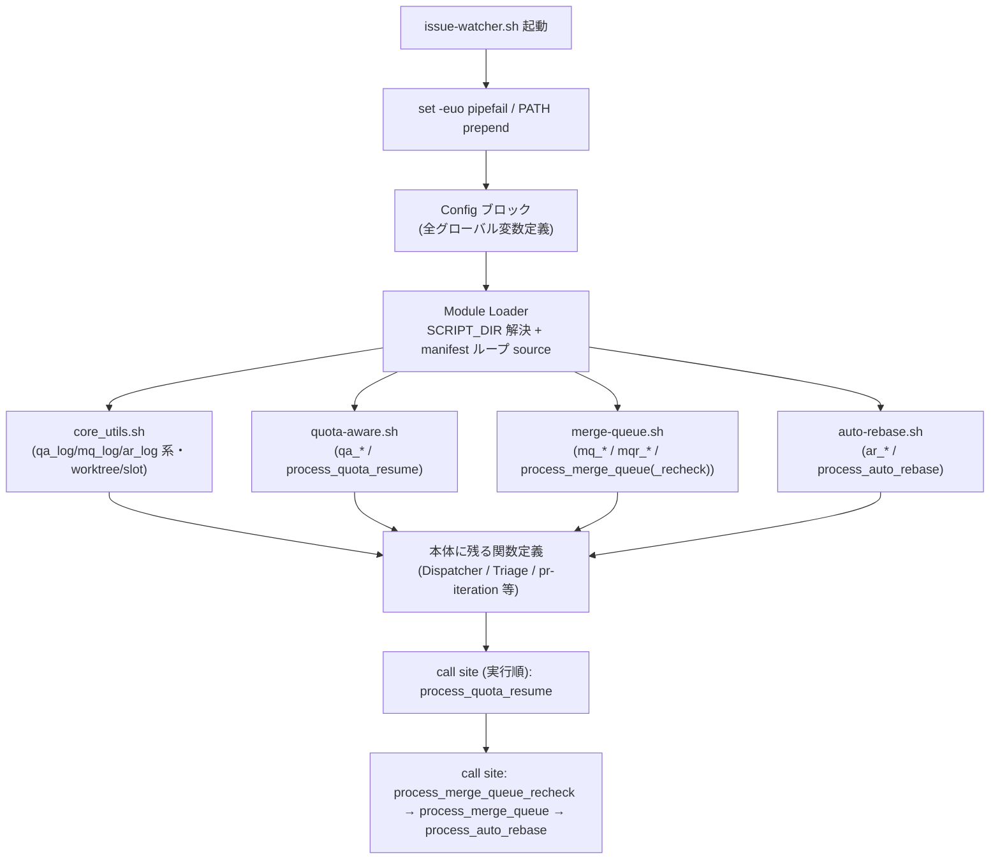
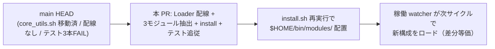

# Design Document

## Overview

**Purpose**: 1 万行超の単一スクリプト `local-watcher/bin/issue-watcher.sh` から、クォータ待機制御・
マージキュー・自動 Rebase の 3 プロセッサを独立モジュールへ切り出し、watcher の保守者がレビュー・
変更を局所化できる状態を提供する。あわせて Part 1（#177）が未配線のまま残した「モジュールロード
基盤」（`source` 配線・`install.sh` の `modules/` 配置・移動済みロガー参照テストの追従）を Part 2 の
スコープで完成させ、main HEAD の壊れた状態（テスト 3 本 FAIL）を回復する。

**Users**: idd-claude の保守者（self-hosting）と、install.sh で watcher をローカル配置する運用者が
対象。保守者は分割後のモジュール単位でレビュー・変更を行い、運用者は `install.sh` 再実行で
`$HOME/bin/modules/` へモジュールを冪等に配置する。

**Impact**: 現在 `issue-watcher.sh` 本体に top-level 定義されている 3 プロセッサ関数群を、本体と
同階層の `modules/*.sh` へ物理移動する。本体は移動済み関数を起動時に `source` で読み込み、各
`process_*` の **呼び出し配線（call site）は本体の従来位置に温存**する。外部から観測可能な挙動
（環境変数・exit code・ログ書式・ラベル遷移・cron 登録文字列）は一切変えない差分等価リファクタリング
であり、これが最優先制約である。

### Goals
- 3 プロセッサの関数群を hyphen 命名のモジュール 3 ファイル（`quota-aware.sh` / `merge-queue.sh` /
  `auto-rebase.sh`）へ集約する（Req 1.1 / 2.1 / 3.1）
- 本体・3 新規モジュール・既存 `core_utils.sh` を本体のスクリプトディレクトリ基準で `source` する
  ロード機構を確立する（Req 4.1〜4.4）
- `install.sh` が `modules/*.sh` を `$HOME/bin/modules/` へ冪等・非特権で配置する（Req 5.1〜5.5）
- main HEAD で FAIL 中の既存テスト 3 本を追従修正し、全スモークテストを通過状態へ戻す（Req 6.1〜6.3）
- **成功基準**: shellcheck 警告ゼロ / `local-watcher/test/` 全テスト PASS / dry-run スモークが
  `処理対象の Issue なし` で正常終了 / `install.sh --dry-run` がモジュール配置を予定操作として列挙

### Non-Goals
- 開発ループ・検証ステージ・昇格パイプライン系の切り出し（Part 3 / #181）
- 3 プロセッサのリファクタを超えた挙動変更・新機能追加・新規 env / ラベル / exit code 導入
- `core_utils.sh` の内容変更（Part 1 で確立済み。ロガー等は二重定義しない）
- Dispatcher 本体・Triage・PR 反復など 3 プロセッサ以外の関数の切り出し
- GitHub Actions 版ワークフロー（`.github/workflows/issue-to-pr.yml`）への波及
- `setup.sh` のクローン挙動変更（install のモジュール配置に必要な範囲を超える変更）

## Architecture

### Existing Architecture Analysis

`issue-watcher.sh` は **単一パス手続きスクリプト**である。「全関数を定義してから `main()` を呼ぶ」
構造ではなく、top-level で関数定義と top-level の実行文（call site）が実行順に交互配置される。
実測した構造（行番号は現 main HEAD）:

| 行 | 種別 | 内容 |
|---|---|---|
| 32 | 宣言 | `set -euo pipefail` |
| 37 | 実行 | `export PATH=...` |
| 52〜 | 実行 | Config ブロック（全グローバル変数定義） |
| 605〜1108 | 定義 | quota-aware 系関数（`qa_*` / `build_partial_escalation_comment` / `process_quota_resume`） |
| 1112 | **実行** | `process_quota_resume || qa_warn ...`（call site） |
| 1123〜1424 | 定義 | merge-queue 系関数（`mq_*` / `process_merge_queue`） |
| 1424〜2181 | 定義 | auto-rebase 系関数（`ar_*` / `process_auto_rebase`） |
| 2195〜2318 | 定義 | merge-queue-recheck 系関数（`mqr_*` / `process_merge_queue_recheck`） |
| 2321 / 2324 / 2330 | **実行** | recheck → merge_queue → auto_rebase の call site |

尊重すべき制約:
- **Config ブロックのグローバル変数は本体に温存**する（`REPO` / `REPO_DIR` / `BASE_BRANCH` /
  各 `LABEL_*` / 各 `*_ENABLED` / 各タイムアウト env 等）。モジュール側で再宣言しない（AC 2.4 /
  NFR 1.2）。bash の遅延束縛により、モジュール内関数が参照するグローバルは「定義時」ではなく
  「呼び出し時」に本体スコープから解決される。
- **call site の実行順序は観測挙動の一部**。`process_quota_resume` を全 Processor 先頭、recheck →
  merge_queue → auto_rebase をその後という順序は Req 5.x / 順序根拠で要件化済み。`repo_prefix_log_test.sh`
  の Req 3.3 が「dirty 検出ブロック < `process_merge_queue` 呼び出し行」のファイル順序を検証する
  ため、call site は本体の従来位置に残す。
- `core_utils.sh` は Part 1 で「本体から `source` される前提」で作られたが配線が無い。本 spec で
  配線を足すことで `core_utils.sh` のロガー（`qa_log` / `mq_log` / `ar_log` は移動済、`mqr_*` は本体
  に残存）が実行時解決される。

技術的負債の解消: main HEAD は `core_utils.sh` 移動後の `source` 欠落により壊れている（テスト 3 本
FAIL）。本設計はこの負債を「ロード配線の確立 + テスト抽出先の追従」で解消する。

### Architecture Pattern & Boundary Map

採用パターン: **Source-time module loading（sourced shell library）**。本体冒頭の Config ブロック
直後・最初の関数定義より前の 1 箇所で、スクリプトディレクトリ基準の相対パスで全モジュールを
`source` する。各モジュールは関数定義のみを持ち、top-level 実行文・`set` 宣言を持たない
（`core_utils.sh` の既存規約を踏襲）。



**Architecture Integration**:
- 採用パターン: source-time module loading。理由は bash の遅延束縛により「source 完了後・call site
  実行前」に全関数・グローバルが揃えばよく、source 順序間の相互依存（前方参照）が許容されるため。
- ドメイン／機能境界: プロセッサ単位（quota-aware / merge-queue / auto-rebase）で 1 モジュール
  1 ファイル。低レベル共通ユーティリティとロガーは `core_utils.sh`（Part 1 既存）に集約済み。
- 既存パターンの維持: Config ブロックのグローバル変数定義位置、call site の実行順序、ログ書式、
  `set -euo pipefail` を本体のみが宣言する規約。
- 新規コンポーネントの根拠: Module Loader は Part 1 が想定しながら未配線だった基盤。3 モジュールの
  関数を実行時解決するために必須（Req 4.3）。

### source 順序の正当性（前方参照の論証）

bash の関数は **呼び出し時**に本体・他モジュールのグローバル/関数を解決する（遅延束縛）。従って
モジュール間に定義時の循環参照があっても、全 `source` 完了後に call site が走る限り未定義参照は
起きない。具体的に保証すべき点:

1. モジュール内関数が参照するグローバル（`$REPO` 等）は Config ブロック（Loader より前）で定義
   済みのため、source 時点で既に存在する。仮に source 時点で未定義でも、関数 **本体は実行され
   ない**ため `set -u` には触れない（`set -u` は実行時の未定義参照のみを致命化する）。
2. モジュール内関数が呼ぶ他モジュール関数・本体残存関数（例: `core_utils.sh` の worktree 系が
   呼ぶ `dispatcher_log`）は、全 `source` 完了後の call site 実行時に解決される。
3. ゆえに **manifest 配列のリスト順は機能的に任意**。可読性のため `core_utils.sh`（最も低レベル）
   → `quota-aware.sh` → `merge-queue.sh` → `auto-rebase.sh` の順を採用する。

### Technology Stack

| Layer | Choice / Version | Role in Feature | Notes |
|-------|------------------|-----------------|-------|
| CLI / Runtime | bash 4+ | watcher 本体・全モジュール | `set -euo pipefail` は本体のみ宣言 |
| Module system | `source`（POSIX `.`） | スクリプトディレクトリ基準のロード | `$(cd "$(dirname "${BASH_SOURCE[0]}")" && pwd)` で解決 |
| Installer | bash（`install.sh`） | `modules/*.sh` の `$HOME/bin/modules/` 配置 | 既存 `copy_glob_to_homebin` を再利用 |
| Test | bash + awk + jq + git | `extract_function` で関数抽出して評価 | 抽出元を本体 / `core_utils.sh` / 各モジュールへ追従 |
| 静的解析 | shellcheck / actionlint | 差分等価の機械検証 | 警告ゼロを目標 |

## File Structure Plan

### Directory Structure

```
local-watcher/bin/
├── issue-watcher.sh        # 本体: Config / Module Loader / Dispatcher / Triage / pr-iteration /
│                           #       promote / design-review-release / verify_pushed_or_retry /
│                           #       3 プロセッサの call site（実行順序温存）を保持
├── modules/
│   ├── core_utils.sh       # Part 1 既存（変更しない）: qa_log/mq_log/ar_log/pp_log/pi_log/drr_log/
│   │                       #   qa_format_iso8601 / worktree・slot・hook ユーティリティ
│   ├── quota-aware.sh      # 新規: quota 待機制御プロセッサ（下記「移す関数」参照）
│   ├── merge-queue.sh      # 新規: マージキュー制御 + recheck プロセッサ
│   └── auto-rebase.sh      # 新規: 自動 Rebase プロセッサ
├── triage-prompt.tmpl      # 既存（変更なし）
└── *.tmpl                  # 既存テンプレート（変更なし）

local-watcher/test/
├── repo_prefix_log_test.sh       # 追従修正: ロガー抽出元を core_utils.sh / merge-queue.sh へ
├── qa_run_claude_stage_test.sh   # 追従修正: qa_log 系→core_utils.sh, qa_* 本体→quota-aware.sh
├── verify_pushed_or_retry_test.sh# 追従修正: qa_log 系→core_utils.sh（verify_* は本体に残存）
└── (他テストは抽出元変更がない限り無変更)
```

#### 各モジュールに移す関数（本体 L 範囲 → 移動先）

| 移動先モジュール | 移す関数 | 現 L 範囲 |
|---|---|---|
| `quota-aware.sh` | `qa_detect_rate_limit` / `qa_run_claude_stage` / `qa_persist_reset_time` / `qa_load_reset_time` / `qa_build_escalation_comment` / `build_partial_escalation_comment` / `qa_handle_quota_exceeded` / `process_quota_resume` | 605〜1108 |
| `merge-queue.sh` | `mq_pr_has_label` / `mq_handle_conflict` / `mq_try_rebase_pr` / `process_merge_queue` / `mqr_log` / `mqr_warn` / `mqr_error` / `process_merge_queue_recheck` | 1123〜1424, 2195〜2318 |
| `auto-rebase.sh` | `ar_fetch_candidates` / `ar_build_prompt` / `ar_run_claude_rebase` / `ar_classify_diff` / `ar_apply_mechanical` / `ar_dismiss_all_approvals` / `ar_apply_semantic` / `ar_escalate_to_failed` / `ar_handle_pr` / `process_auto_rebase` | 1424〜2181 |

注:
- `qa_log` / `mq_log` / `ar_log` 系（及び `qa_format_iso8601`）は **既に `core_utils.sh` にある**ため
  3 新規モジュールでは **二重定義しない**（Non-Goals / AC 1.1 の「集約」は重複生成を意味しない）。
- `mqr_log` 系は現状 **本体に残存**しており `core_utils.sh` には無い。merge-queue プロセッサとの
  凝集性から `merge-queue.sh` へ移す（`core_utils.sh` は変更しない）。
- `verify_pushed_or_retry`（L8525）は quota-aware プロセッサではなく Stage A/B 共通ヘルパーのため
  **本体に残す**（Part 2 のスコープ外。`verify_pushed_or_retry_test.sh` の抽出元は本体のまま）。

### Modified Files
- `local-watcher/bin/issue-watcher.sh` — (1) Config 直後に Module Loader ブロックを追加、(2) 上表の
  関数定義ブロックを削除（モジュールへ移動）、(3) call site（`process_quota_resume` 等）は従来位置
  に温存。`set -euo pipefail` / PATH prepend / Config / Dispatcher / Triage / pr-iteration /
  promote / design-review-release / `verify_pushed_or_retry` は不変。
- `install.sh` — ローカル配置ブロック（L1224 付近）に `modules/*.sh` を `$HOME/bin/modules/` へ
  配置する `copy_glob_to_homebin` 呼び出しを 1 行追加。
- `local-watcher/test/repo_prefix_log_test.sh` — ロガー（`qa_*`/`mq_*` 等）の抽出元を
  `core_utils.sh`、`mqr_*` の抽出元を `merge-queue.sh` に追従。Req 3 の本体 source-level grep
  （dirty event・`process_merge_queue` call site 順序）は本体 `issue-watcher.sh` のまま。
- `local-watcher/test/qa_run_claude_stage_test.sh` — `qa_log`/`qa_warn`/`qa_error` を `core_utils.sh`
  から、`qa_detect_rate_limit`/`qa_run_claude_stage` を `quota-aware.sh` から抽出。
- `local-watcher/test/verify_pushed_or_retry_test.sh` — `qa_log`/`qa_warn`/`qa_error` を
  `core_utils.sh` から、`verify_pushed_or_retry` は本体から抽出（不変）。
- `README.md` — ディレクトリ構成（`modules/` 追加）と migration note（modules 配置）を更新。

## Requirements Traceability

| Requirement | Summary | Components | File / Interface |
|-------------|---------|------------|------------------|
| 1.1 | quota 待機制御を 1 モジュールに集約 | Quota-Aware Processor | `quota-aware.sh` |
| 1.2 | メインサイクルから同一シグネチャで解決・実行 | Module Loader / Quota-Aware | call site L1112 / source-time load |
| 1.3 | Resume 処理から同一シグネチャで解決・実行 | Quota-Aware Processor | `process_quota_resume` |
| 1.4 | quota 検出時の sentinel exit code・reset 永続化結果を維持 | Quota-Aware Processor | `qa_run_claude_stage`(exit 99) / `qa_persist_reset_time` |
| 2.1 | マージキュー制御を 1 モジュールに集約 | Merge-Queue Processor | `merge-queue.sh` |
| 2.2 | 定期サイクルから同一マージ順序判定 | Merge-Queue Processor | `process_merge_queue` |
| 2.3 | 再チェック処理を同一再検証ロジックで実行 | Merge-Queue Processor | `process_merge_queue_recheck` |
| 3.1 | 自動 Rebase を 1 モジュールに集約 | Auto-Rebase Processor | `auto-rebase.sh` |
| 3.2 | allowlist パスベース判定で対象選別 | Auto-Rebase Processor | `ar_classify_diff` / `ar_fetch_candidates` |
| 3.3 | 同一条件で approve 解除 | Auto-Rebase Processor | `ar_dismiss_all_approvals` |
| 3.4 | 解決不能時の escalation 挙動維持 | Auto-Rebase Processor | `ar_escalate_to_failed` |
| 4.1 | スクリプトディレクトリ基準で `source` | Module Loader | `issue-watcher.sh` Loader ブロック |
| 4.2 | 最小 PATH / cwd 非依存で解決 | Module Loader | `BASH_SOURCE` ベース SCRIPT_DIR |
| 4.3 | 3 プロセッサ全関数を未定義参照なく解決 | Module Loader | manifest 配列 source ループ |
| 4.4 | 必須モジュール欠落時 stderr エラー + exit 1 | Module Loader | 欠落チェック分岐 |
| 5.1 | `modules/` 全 *.sh を `$HOME/bin/modules/` へ配置 | Module Installer | `install.sh` 追加呼び出し |
| 5.2 | 再実行で同一内容を SKIP | Module Installer | `copy_glob_to_homebin`→`classify_action` |
| 5.3 | 差分かつ非 force で上書き保護 | Module Installer | `copy_with_hybrid_overwrite` |
| 5.4 | dry-run でファイル未反映・予定操作列挙 | Module Installer | `log_action` / `DRY_RUN` ガード |
| 5.5 | `$HOME` ユーザースコープ・sudo 不要 | Module Installer | 既存 root 実行検知を維持 |
| 6.1 | 既存テスト一式が 1 件も失敗せず通過 | Test Harness | `local-watcher/test/*.sh` |
| 6.2 | 移動後の定義位置から対象関数を解決 | Test Harness | `extract_function` 抽出元追従 |
| 6.3 | 移動済みロガー参照の FAIL テスト 3 本を通過へ | Test Harness | 3 テストの抽出元修正 |
| NFR 1.1 | 既存 env 名を同一意味で受付（差分等価） | 全コンポーネント | グローバル温存 |
| NFR 1.2 | env 初期値・グローバル設定値を維持 | 全コンポーネント | Config ブロック本体温存 |
| NFR 1.3 | exit code の意味を維持 | Quota-Aware / 全 | sentinel(99) ほか不変 |
| NFR 1.4 | ログ出力先・書式・prefix を維持 | core_utils / 全 Processor | ロガー不変 |
| NFR 1.5 | ラベル遷移契約を維持 | Merge-Queue / Auto-Rebase | ラベル運用不変 |
| NFR 1.6 | cron / launchd 登録文字列を維持 | Module Loader / Installer | 起動行不変 |
| NFR 1.7 | 切り出した関数が差分等価な挙動 | 全 Processor | 関数本体不変移動 |
| NFR 2.1 | install 再実行の冪等性 | Module Installer | `classify_action` SKIP |
| NFR 3.1 | ロード/配置失敗を silent fail させない | Module Loader / Installer | exit 1 + stderr / `log_action` |

## Components and Interfaces

### Bootstrap Layer

#### Module Loader

| Field | Detail |
|-------|--------|
| Intent | 本体起動時にスクリプトディレクトリ基準で全モジュールを `source` し、欠落時は安全停止する |
| Requirements | 4.1, 4.2, 4.3, 4.4, NFR 3.1 |

**Responsibilities & Constraints**
- 配置位置: Config ブロック直後・最初の関数定義（現 L605）より前の 1 箇所
- `SCRIPT_DIR="$(cd "$(dirname "${BASH_SOURCE[0]}")" && pwd)"` で cwd 非依存にディレクトリ解決
- manifest 配列（`core_utils.sh` / `quota-aware.sh` / `merge-queue.sh` / `auto-rebase.sh`）をループ
  し、各ファイルの存在を確認してから `source` する
- 欠落時は欠落モジュール名を含むメッセージを `>&2` に出して `exit 1`（silent fail 禁止）
- モジュール側は `set` 宣言を持たない（本体宣言済み規約を踏襲）

**Dependencies**
- Inbound: 本体起動シーケンス — 関数解決の起点（Critical）
- Outbound: 4 モジュールファイル — 関数定義の供給元（Critical）
- External: bash `source` / `BASH_SOURCE` — ディレクトリ解決（Critical）

**Contracts**: Service [x] / State [x]

##### Service Interface（疑似シグネチャ）

```bash
# Config ブロック直後に展開する Loader（疑似コード。実装は Developer 領分）
SCRIPT_DIR="$(cd "$(dirname "${BASH_SOURCE[0]}")" && pwd)"
WATCHER_MODULES=( core_utils.sh quota-aware.sh merge-queue.sh auto-rebase.sh )
for _m in "${WATCHER_MODULES[@]}"; do
  _mp="$SCRIPT_DIR/modules/$_m"
  if [ ! -f "$_mp" ]; then
    echo "ERROR: 必須モジュールが見つかりません: $_mp" >&2   # Req 4.4 / NFR 3.1
    exit 1
  fi
  # shellcheck disable=SC1090
  . "$_mp"
done
```
- Preconditions: Config ブロックでグローバル変数が定義済み
- Postconditions: 全モジュール関数が定義され、call site で未定義参照が起きない（Req 4.3）
- Invariants: source 順序に関わらず遅延束縛で前方参照が解決される

### Processor Layer

#### Quota-Aware Processor

| Field | Detail |
|-------|--------|
| Intent | quota 枯渇検出・待機制御・reset 永続化・Resume を `quota-aware.sh` に集約する |
| Requirements | 1.1, 1.2, 1.3, 1.4 |

**Responsibilities & Constraints**
- 移す関数は File Structure Plan の表のとおり。シグネチャ・戻り値・副作用・exit code（quota 検出
  sentinel = exit 99）を一切変えない差分等価移動
- ロガー `qa_log`/`qa_warn`/`qa_error` と `qa_format_iso8601` は `core_utils.sh` に存在するため
  再定義しない
- 依存グローバル（`$REPO` / `$QUOTA_AWARE_ENABLED` / reset 永続化先パス / `$LABEL_NEEDS_QUOTA_WAIT`
  等）は本体に温存。モジュール内では宣言しない

**Dependencies**
- Inbound: 本体 call site `process_quota_resume`（L1112）— 全 Processor 先頭で起動（Critical）
- Outbound: `core_utils.sh`（`qa_log` 系 / `qa_format_iso8601`）（Critical）
- External: `gh` / `jq` / `date` / `claude`（Critical）

**Contracts**: Service [x] / State [x]

#### Merge-Queue Processor

| Field | Detail |
|-------|--------|
| Intent | approved PR のマージ順序制御・再チェックを `merge-queue.sh` に集約する |
| Requirements | 2.1, 2.2, 2.3 |

**Responsibilities & Constraints**
- 移す関数: `mq_*` / `process_merge_queue` / `mqr_*` / `process_merge_queue_recheck`。`mqr_*` は
  現状本体にあり `core_utils.sh` には無いため本モジュールへ移す（`core_utils.sh` は変更しない）
- マージ順序判定・状態遷移（`needs-rebase` ラベル運用・force-with-lease push）を差分等価で維持
- 依存グローバル（`$MERGE_QUEUE_ENABLED` / `$MERGE_QUEUE_RECHECK_ENABLED` / `$MERGE_QUEUE_GIT_TIMEOUT`
  / `$LABEL_NEEDS_REBASE` 等）は本体温存

**Dependencies**
- Inbound: 本体 call site `process_merge_queue_recheck`（L2321）/ `process_merge_queue`（L2324）（Critical）
- Outbound: `core_utils.sh`（`mq_log` 系）（Critical）
- External: `gh` / `git` / `jq`（Critical）

**Contracts**: Service [x] / State [x]

#### Auto-Rebase Processor

| Field | Detail |
|-------|--------|
| Intent | コンフリクト PR の自動 Rebase ロジックを `auto-rebase.sh` に集約する |
| Requirements | 3.1, 3.2, 3.3, 3.4 |

**Responsibilities & Constraints**
- 移す関数は File Structure Plan の表のとおり。allowlist パスベース判定（`ar_classify_diff`）・
  approve 解除（`ar_dismiss_all_approvals`）・escalation（`ar_escalate_to_failed`、claude-failed 相当）
  を差分等価で維持
- 依存グローバル（`$AUTO_REBASE_MODE`（既定 off）/ allowlist 設定 / `$LABEL_FAILED` 等）は本体温存

**Dependencies**
- Inbound: 本体 call site `process_auto_rebase`（L2330）（Critical）
- Outbound: `core_utils.sh`（`ar_log` 系）（Critical）
- External: `gh` / `git` / `claude` / `jq`（Critical）

**Contracts**: Service [x] / State [x]

### Installer Layer

#### Module Installer

| Field | Detail |
|-------|--------|
| Intent | `install.sh` が `modules/*.sh` を `$HOME/bin/modules/` へ冪等・非特権に配置する |
| Requirements | 5.1, 5.2, 5.3, 5.4, 5.5, NFR 2.1, NFR 3.1 |

**Responsibilities & Constraints**
- 既存 `copy_glob_to_homebin "$LOCAL_WATCHER_DIR/bin/modules" "*.sh" "$HOME/bin/modules" --executable`
  を 1 行追加（L1224 付近、本体 `*.sh` 配置の直後）
- `copy_glob_to_homebin` は内部で `ensure_dir`（modules dir 作成）・`copy_template_file`
  →`copy_with_hybrid_overwrite`→`classify_action` を経由するため、SKIP（内容同一）・差分上書き保護
  （`.bak` once-only）・dry-run（`log_action` + `DRY_RUN` ガード）・実行権限付与が既存実装で担保される
- root 実行検知を外さない（sudo 不要を維持、Req 5.5）

**Dependencies**
- Inbound: `install.sh` ローカル配置ブロック（Critical）
- Outbound: `copy_glob_to_homebin` / `copy_template_file` / `classify_action`（既存・再利用）（Critical）

**Contracts**: Batch [x]

##### 既存呼び出しとの整合（疑似コード）

```bash
copy_glob_to_homebin "$LOCAL_WATCHER_DIR/bin" "*.sh"   "$HOME/bin" --executable
copy_glob_to_homebin "$LOCAL_WATCHER_DIR/bin" "*.tmpl" "$HOME/bin"
# ↓ 追加（Req 5.1）。modules/ サブディレクトリへ配置
copy_glob_to_homebin "$LOCAL_WATCHER_DIR/bin/modules" "*.sh" "$HOME/bin/modules" --executable
```

### Test Layer

#### Test Harness

| Field | Detail |
|-------|--------|
| Intent | `extract_function` の抽出元を移動後の定義位置へ追従させ、FAIL 3 本を通過へ戻す |
| Requirements | 6.1, 6.2, 6.3 |

**Responsibilities & Constraints**
- `extract_function` は `awk` で `<fn>() {` 〜 `}` を切り出す。抽出元ファイルパスをロガーは
  `core_utils.sh`、移動した処理関数は各モジュールへ変更する
- 新規テスト追加より既存テストの抽出元修正を優先（要件 6.3 の「追従」）
- `repo_prefix_log_test.sh` の Req 3 系（dirty event の source-level grep、`process_merge_queue`
  call site のファイル順序チェック）は本体 `issue-watcher.sh` を読むまま（call site が本体に残る
  ため整合する）

**Dependencies**
- Inbound: スモークテスト実行（Critical）
- Outbound: `core_utils.sh` / `quota-aware.sh` / `merge-queue.sh` / `issue-watcher.sh`（抽出元）（Critical）
- External: `awk` / `jq` / `git`（Critical）

**Contracts**: Service [x]

##### 抽出元の追従マッピング

| テスト | 関数 | 追従後の抽出元 |
|---|---|---|
| `repo_prefix_log_test.sh` | `pi_*`/`mq_*`/`drr_*`/`qa_*` ロガー | `core_utils.sh` |
| `repo_prefix_log_test.sh` | `mqr_*` ロガー | `merge-queue.sh` |
| `repo_prefix_log_test.sh` | Req3 dirty event / call site 順序 grep | `issue-watcher.sh`（本体・不変） |
| `qa_run_claude_stage_test.sh` | `qa_log`/`qa_warn`/`qa_error` | `core_utils.sh` |
| `qa_run_claude_stage_test.sh` | `qa_detect_rate_limit`/`qa_run_claude_stage` | `quota-aware.sh` |
| `verify_pushed_or_retry_test.sh` | `qa_log`/`qa_warn`/`qa_error` | `core_utils.sh` |
| `verify_pushed_or_retry_test.sh` | `verify_pushed_or_retry` + stage 識別子 grep | `issue-watcher.sh`（本体・不変） |

## Data Models

本機能はデータモデルを新規導入しない（純粋な物理リファクタリング）。永続化される唯一の状態は
quota reset 時刻ファイル（`qa_persist_reset_time`/`qa_load_reset_time` が読み書き）であり、その
**パス・JSON 形式・キー（Issue 番号）は分割前と完全に同一**（差分等価、NFR 1.7）。グローバル変数の
定義位置・初期値も本体温存で不変（NFR 1.2）。

## Error Handling

### Error Strategy
ロード失敗は致命（fail-fast）、プロセッサ実行失敗は従来どおり fail-soft（`|| *_warn` で吸収して
後続処理継続）という二層戦略を分割前と同一に保つ。

### Error Categories and Responses
- **Module load failure (fatal / NFR 3.1)**: 必須モジュール欠落時、欠落ファイル名を含む ERROR を
  `>&2` に出し `exit 1`。silent fail させない（Req 4.4）。call site 到達前に停止するため、観測挙動の
  汚染を防ぐ。
- **Processor runtime error (fail-soft)**: call site の `process_* || *_warn "..."` を本体に温存し、
  分割前と同一の「1 Processor 失敗で後続 Processor / Issue 処理を阻害しない」挙動を維持（NFR 1.7）。
- **Install placement error (fail-soft on labels, surfaced on copy)**: `copy_glob_to_homebin` の各
  操作は `log_action` で分類列挙され、dry-run では FS 未反映。コピー失敗は既存挙動どおり surface
  され silent fail しない（NFR 3.1）。

## Testing Strategy

- **Unit Tests（関数抽出・eval ロード）**:
  1. `qa_run_claude_stage_test.sh`: `quota-aware.sh` から `qa_run_claude_stage`/`qa_detect_rate_limit`
     を抽出し、rate_limit v1/v2/synthetic 429 で exit 99 + reset_file を維持（Req 1.4 / 6.3）
  2. `repo_prefix_log_test.sh`: `core_utils.sh` の `qa_*`/`mq_*`/`pi_*`/`drr_*`・`merge-queue.sh` の
     `mqr_*` が `[$REPO]` prefix を維持（Req 6.3 / NFR 1.4）
  3. `verify_pushed_or_retry_test.sh`: `core_utils.sh` の `qa_log` 系 + 本体の `verify_pushed_or_retry`
     を抽出し ahead==0 / push retry 成功・失敗を維持（Req 6.3）
- **Integration Tests（ロード配線）**:
  1. cron-like 最小 PATH: `env -i HOME=$HOME PATH=/usr/bin:/bin bash -c 'command -v claude gh jq flock git'`
     を経由し、Loader が `SCRIPT_DIR/modules/` から全モジュールを解決して起動できる（Req 4.1, 4.2）
  2. dry run: `REPO=owner/test REPO_DIR=/tmp/test-repo $HOME/bin/issue-watcher.sh` を対象なし状態で
     流し `処理対象の Issue なし` で正常終了（Req 4.3 / NFR 1.7）
  3. モジュール欠落: `modules/quota-aware.sh` を退避して起動し、欠落名を含む stderr + exit 1 を確認
     （Req 4.4 / NFR 3.1）
- **Install Tests**:
  1. scratch repo で `./install.sh --repo /tmp/scratch`（ローカル配置含む）→ `$HOME/bin/modules/*.sh`
     が実行権限付きで配置（Req 5.1, 5.5）
  2. 2 回目実行で `modules/*.sh` が SKIP `(identical to template)`（Req 5.2 / NFR 2.1）
  3. `--dry-run` でモジュール配置が FS 未反映・予定操作として列挙（Req 5.4）
- **静的解析**: `shellcheck local-watcher/bin/issue-watcher.sh local-watcher/bin/modules/*.sh install.sh`
  警告ゼロ。`source` 行は `# shellcheck disable=SC1090/SC1091` を付与（動的 source の既定対応）

## Security Considerations

新規の外部サービス呼び出し・認証情報の取り扱いを追加しない。`source` するモジュールパスは
`BASH_SOURCE` 由来の固定スクリプトディレクトリ + 静的 manifest 配列であり、外部入力・ユーザー
入力を含まない（任意コード実行経路を新設しない）。`install.sh` は `$HOME` 配下に閉じ sudo 不要を
維持する（Req 5.5）。

## Migration Strategy



- 稼働中 watcher は Part 1 マージ前のデプロイ済みコピーで動いており壊れていない。本 PR merge 後の
  `install.sh` 再実行で初めて新構成が `$HOME/bin/` に反映される。
- 後方互換: env 名・初期値・exit code・ログ書式・ラベル遷移・cron 登録文字列（`$HOME/bin/issue-watcher.sh`
  起動行）を一切変えないため、運用者の cron / launchd 設定変更は不要（NFR 1.1〜NFR 1.6）。
- README に「`modules/` 配置」の migration note を同 PR で追加する。

## 確認事項

- **Part 1 基盤欠落の吸収範囲（最重要・人間レビュー対象）**: 本 spec は requirements.md の確認事項に
  従い「Part 1 を別 Issue で先行修正せず、Part 2 で Loader 配線・install 配置・テスト追従まで吸収
  する」方針（方針 A）で設計した。これはオーケストレーター判断と一致するが、設計 PR レビューで
  最終確認が必要。
- **`mqr_*` ロガーの配置先**: `core_utils.sh` には無く本体に残存しているため、merge-queue
  プロセッサとの凝集性を優先して `merge-queue.sh` へ移した（`core_utils.sh` は変更しない Non-Goal を
  順守）。`core_utils.sh` 側へ集約すべきという代替案もあるが、Part 1 のスコープ（Non-Goal: core_utils.sh
  内容変更）を侵さない判断。レビューで妥当性を確認されたい。
- **call site を本体に残す判断**: `repo_prefix_log_test.sh` Req 3.3 が本体内の `process_merge_queue`
  call site のファイル順序を検証し、かつ call site の実行順序が観測挙動の一部であるため、関数定義
  のみをモジュールへ移し call site は本体温存とした（旧 PR #184 と同方針）。
