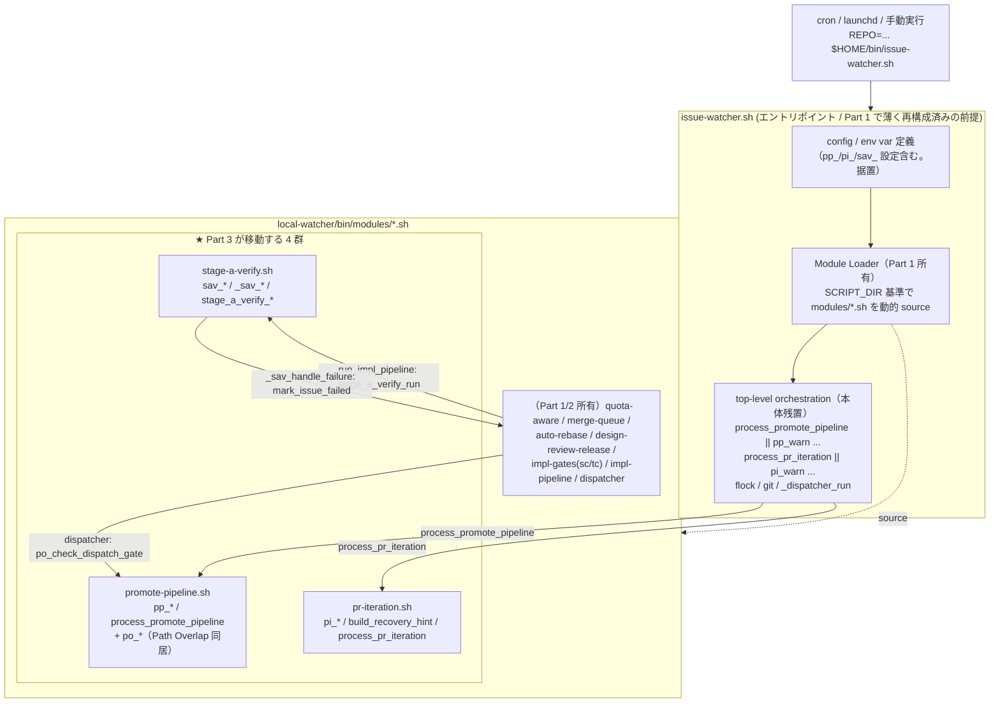
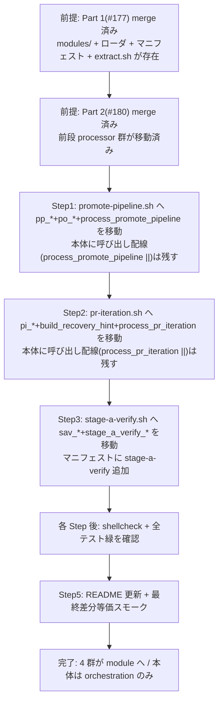

# Design Document

## Overview

`local-watcher/bin/issue-watcher.sh`（約 11,899 行）のモジュール化リファクタリング 3 部作の最終 Part（Part 3）。Part 1（#177）が確定した「Entry-point + Sourced Library Modules」境界マップと後方互換要件、Part 2（#180）の前段切り出しを前提に、本体に残る **4 つの複雑な processor 群** を `local-watcher/bin/modules/` 配下の専用モジュールへ切り出す。対象は (1) PR 反復開発ループ（`process_pr_iteration` / `pi_*`）、(2) Path Overlap 競合予防・待機（`po_*`）、(3) Stage A Verify ゲート（`stage_a_verify_run` / `sav_*`）、(4) Promote Pipeline（`process_promote_pipeline` / `pp_*`）の関数定義群である。

**Purpose**: 4 つの肥大した processor ロジックをモジュール単位で編集できるようにし、編集時のトークンコストとデグレリスクを下げる価値を、watcher を保守する開発者に提供する。
**Users**: watcher を保守する開発者（モジュール単位で編集）と、cron / launchd で起動する運用者（起動コマンド・env var を一切変えずに恩恵を受ける）が利用する。
**Impact**: 現在の「本体に同居する 4 processor 群の関数定義」を「`modules/*.sh` への移動」に変える。**外部から観測される振る舞い（処理結果・ログ書式の契約・ラベル遷移・exit code）は一切変えない差分等価リファクタリング**であり、機能の追加・削除・バグ修正・共通化リファクタは行わない。**移動するのは関数定義のみで、本体に残る top-level orchestration の呼び出し配線（`process_promote_pipeline || ...` / `process_pr_iteration || ...`）は据え置く**。

本リファクタリングは self-hosting（dogfooding）対象であり、この変更自体が次回 cron 実行で idd-claude 自身を動かす。したがって後方互換性（既存 env var 名 / cron 登録文字列 / exit code 意味 / ログ出力先 / ラベル遷移契約）と冪等性が最重要要件となる。

### Goals
- `pi_*` / `po_*` / `sav_*`（+ `stage_a_verify_*`）/ `pp_*` の関数定義を本体から `modules/*.sh` へ移動する（Req 1, 2, 3, 4）
- 移動前後で全 env var・起動コマンド・ログ・ラベル遷移・exit code を完全な後方互換に保つ（Req 5 / NFR 1）
- 既存テスト（`local-watcher/test/` 12 件 + `tests/local-watcher/` 3 件）が移動後も全て成功する（Req 6）
- 移動で生成・編集したモジュールとエントリポイントが `shellcheck` 警告ゼロ（Req 7）
- Part 1 / Part 2 完了時点で本体が 1,000 行以下に集約される一連の流れに本 Part が寄与する（Req 8）
- **成功基準**: 移動後に `shellcheck local-watcher/bin/issue-watcher.sh local-watcher/bin/modules/*.sh` が警告ゼロ、`local-watcher/test/*.sh` と `tests/local-watcher/*/*.sh` が全て exit 0、dry-run スモーク（対象 Issue なし）で `処理対象の Issue なし` 正常終了、4 群の関数定義が本体から除去されている

### Non-Goals
- 本 Issue が切り出す 4 processor 群**以外**の関数群（`qa_*` / `mq_*` / `ar_*` / `drr_*` / `sc_*` / `tc_*` / `stage_checkpoint_*` / impl-pipeline / dispatcher 等）のモジュール化（Part 1 / Part 2 の領分）
- モジュール分割を契機とした機能挙動の変更・新機能・バグ修正（純粋な差分等価リファクタリング）
- 4 群を跨いだロジックの再設計・共通化（移動のみ。リファクタは行わない）
- モジュールローダ（`REQUIRED_MODULES` を走査する source ループ）と install.sh の modules コピー行という **分割基盤そのものの新設**（これらは Part 1 #177 が所有する。本 Part は Part 1 基盤の上に乗る前提依存。後述 Migration Strategy）。ただし `REQUIRED_MODULES` マニフェストへの 3 モジュール（`promote-pipeline.sh` / `pr-iteration.sh` / `stage-a-verify.sh`）の **要素追加**、および関数移動に伴う **各既存テストの抽出元 source 変数（`*_SH`）の repoint** は本 Part のスコープに含む（実態の Part 1/2 に共通テスト互換ヘルパー層は存在せず、各テストが per-test の source 変数で対象ファイルを指す方式のため。後述 File Structure Plan / Testing Strategy）
- GitHub Actions 経路（`.github/workflows/issue-to-pr.yml`）のモジュール化 / `repo-template/` 配下テンプレートの分割
- 起動時間短縮等のパフォーマンス最適化目標の数値設定

## Architecture

### Existing Architecture Analysis

実態調査（`grep -n '^[a-zA-Z_]*() {' local-watcher/bin/issue-watcher.sh`）で本 Part に関わる 4 群の正確な配置を確認した。**重要な発見として、現状の本体は「純粋な関数定義」と「top-level orchestration の呼び出し」が交互に並んでおり、4 群のうち 2 群はエントリ関数が source 時点の top-level で直接呼ばれている**:

- **Promote Pipeline（`pp_*` / `process_promote_pipeline`）**: 関数定義は行 2406〜2419（`pp_log/warn/error`）+ 行 2976〜3697（`pp_resolve_target_branch` 〜 `process_promote_pipeline`）。**top-level 呼び出し配線は行 3701〜3702**（`process_promote_pipeline || pp_warn ...`）
- **Path Overlap（`po_*`）**: 関数定義は行 2420〜2975（`po_log/warn` 〜 `po_check_dispatch_gate`）。**Promote Pipeline の関数定義群の中に挟まれて配置**されている（`pp_log/warn/error` → `po_*` → `pp_resolve_*`〜）。top-level 呼び出しは無く、`po_check_dispatch_gate` は dispatcher（行 11823）から、`po_apply/clear_awaiting_slot` は `po_check_dispatch_gate` 内から呼ばれる
- **PR Iteration（`pi_*` / `build_recovery_hint` / `process_pr_iteration`）**: 関数定義は行 3715〜5238（`pi_log` 〜 `process_pr_iteration`。`build_recovery_hint` は行 4325 に同居）。**top-level 呼び出し配線は行 5497**（`process_pr_iteration || pi_warn ...`）
- **Stage A Verify（`sav_*` / `_sav_*` / `stage_a_verify_*` / `stage_a_verify_run`）**: 関数定義は **2 つの非連続領域に分割**されている。Region 1 = 行 5527〜5845（`sav_log/warn/error`, `_sav_cmd_starts_with_keyword`, `stage_a_verify_extract_command/resolve_command/round_path/read_round/bump_round/reset_round`）。Region 2 = 行 9019〜9184（`_sav_handle_failure`, `stage_a_verify_run`）。`stage_a_verify_run` / `_sav_handle_failure` は `run_impl_pipeline`（行 9440）から呼ばれ、`_sav_handle_failure` は `mark_issue_failed`（impl-pipeline、行 8863）を呼ぶ

**尊重すべき制約・既存パターン**:
- **関数定義の物理順序は挙動に影響しない**: `source` は全関数を同一プロセスに読み込んでから実行が始まるため、関数の定義順・配置ファイルを変えても「呼び出し時点で定義済み」である限り挙動は等価。行 5847〜5848 のコメントが「`stage_a_verify_run` を `mark_issue_failed` 定義後に置く」と説明しているのは **awk 抽出テストや単一ファイル可読性のための配慮**であり、ランタイム要件ではない。よって Region 1 / Region 2 を 1 モジュールへ統合できる
- **top-level orchestration 呼び出し配線は本体に残す**: Part 1 設計の「module = 純粋な関数定義のみ / orchestration は entry point」原則に従い、行 3701 / 5497 の `process_* || ...` 呼び出しは entry point の orchestration として据え置く。本 Part が移動するのは **関数定義のみ**
- **グローバル変数共有・ロガー命名**: `$REPO` / `$NUMBER` / `$BRANCH` / `$LOG` 等の暗黙共有、`pi_log` / `po_log` / `sav_log` / `pp_log`（`[date] [REPO] <prefix>: ...` 形式）は一切変えない
- **既存テストは per-test の source 変数で対象ファイルを指して awk 抽出する**: 各テストは自前に `extract_function()` を定義し、`WATCHER_SH="$SCRIPT_DIR/../bin/issue-watcher.sh"` / `CORE_UTILS_SH="$SCRIPT_DIR/../bin/modules/core_utils.sh"` のような **per-test の source 変数**を持つ（実態の Part 1/2 方式。共通ヘルパー層 `local-watcher/test/lib/extract.sh` / `IDD_SOURCE_FILES` / `idd_grep_sources` は **存在しない**）。例えば `pi_max_rounds_kind_test.sh` は `pi_resolve_max_rounds` / `pi_read_no_progress_streak` を `$WATCHER_SH` から awk 抽出し、`tests/local-watcher/stage-a-verify/extract-driver.sh` は `stage_a_verify_extract_command` を `_WATCHER_SH=.../issue-watcher.sh` から awk 抽出する。**抽出元が本体から module へ移ると当該テストは解決できなくなる**ため、本 Part は関数移動と同時に **各テストへ移動先モジュールを指す source 変数（例: `PR_ITERATION_SH` / `STAGE_A_VERIFY_SH` / `PROMOTE_PIPELINE_SH`）を追加し、`extract_function` の抽出元をその変数へ repoint する**

### Architecture Pattern & Boundary Map

**採用パターン**: Part 1 の Entry-point + Sourced Library Modules を踏襲。本 Part は新パターンを導入せず、本体から該当プレフィックスの関数定義を **本 Part が新規作成する 3 モジュール**（後述 decision で命名・粒度を確定）へ移し、その 3 モジュールを Part 1 のマニフェスト `REQUIRED_MODULES`（実態は `core_utils.sh` / `quota-aware.sh` / `merge-queue.sh` / `auto-rebase.sh` の 4 要素のみ）へ `.sh` 付きで追加登録する。



**Architecture Integration**:
- **採用パターン**: Part 1 と同一の Entry-point + Sourced Library Modules。外部依存を増やさず（Node/Python 不要）、`source` による同一プロセス読み込みで変数スコープ共有を維持し、差分等価を最も安全に達成する
- **ドメイン／機能境界**: 既存プレフィックス命名規約（`pp_*` / `po_*` / `pi_*` / `sav_*`）をそのままモジュール境界に採用する。新しい責務分割を発明しない
- **既存パターンの維持**: ロガー命名（`*_log` / `*_warn` / `*_error`）/ env var 名 / ラベル定数名 / ログ書式 / top-level 呼び出し配線を一切変えない
- **新規コンポーネントの根拠**: 本 Part は分割基盤（モジュールローダ・install.sh コピー行）を新設しない（Part 1 所有）。一方、関数の受け皿となる **3 モジュールファイル（`promote-pipeline.sh` / `pr-iteration.sh` / `stage-a-verify.sh`）は Part 1 の雛形が存在しないため本 Part が新規作成する**（実態の `modules/` には `core_utils.sh` / `quota-aware.sh` / `merge-queue.sh` / `auto-rebase.sh` の 4 本のみ）。さらに新規作成した 3 モジュールを `REQUIRED_MODULES` マニフェストへ `.sh` 付きで追加登録する

### Technology Stack

| Layer | Choice / Version | Role in Feature | Notes |
|-------|------------------|-----------------|-------|
| Frontend / CLI | bash 4+ | エントリポイント / 4 モジュール / テスト | 既存と同一。Node/Python 追加なし |
| Backend / Services | `gh` / `git` | GitHub 操作（既存呼び出しを移動するのみ） | 振る舞い不変 |
| Data / Storage | ローカル file（`$LOG_DIR` 配下 sidecar: stage-a-verify round counter / promote 永続化） | 永続化（移動のみ） | 出力先・パス不変 |
| Messaging / Events | GitHub ラベル遷移（`needs-iteration` / `claude-failed` / `staged-for-release` / promote 系） | 状態機械（移動のみ） | ラベル名・遷移契約不変 |
| Infrastructure / Runtime | cron / launchd / `$HOME/bin/modules/` | 起動経路（不変）/ Part 1 が新設した modules/ 配置 | 本 Part は配置先に既存ファイルを置くだけ |
| 静的解析 | `shellcheck` | エントリ + 移動先 3 モジュールの警告ゼロ検証 | `# shellcheck shell=bash` / SC2154 個別解消 |

## File Structure Plan

### Directory Structure

Part 1 が新設した `local-watcher/bin/modules/` 配下（実態は `core_utils.sh` / `quota-aware.sh` / `merge-queue.sh` / `auto-rebase.sh` の 4 本のみ）に、本 Part が **新規作成する 3 ファイル**を以下に明示する（decision 1〜3 で命名・粒度を確定済み）。`promote-pipeline.sh` は Part 1 の境界マップ（設計ドキュメント）に名前が挙がるモジュールだが **実ファイル・雛形は未存在**のため本 Part が新規作成し、`pp_*` + `po_*` をそこへ集約する。`pr-iteration.sh` も Part 1 マップに名前はあるが実ファイル未存在のため本 Part が新規作成する。`stage-a-verify.sh` は本 Part の decision 2 で Part 1 の `impl-gates.sh` 想定から分離した新規モジュール（後述 decision 参照）。3 ファイルとも作成後に `REQUIRED_MODULES` マニフェストへ追加登録する。

```
local-watcher/bin/
├── issue-watcher.sh            # エントリポイント。本 Part では 4 群の【関数定義】を除去し、
│                               #   top-level orchestration 呼び出し（process_promote_pipeline / 
│                               #   process_pr_iteration の `|| *_warn ...` 配線）は残置する。
│                               #   config の pp_/pi_/sav_ env var 定義も据置。配置先 ~/bin/issue-watcher.sh は不変。
└── modules/                    # Part 1 が新設（実態 4 本）。本 Part は以下 3 ファイルを新規作成し関数定義を移す。
    ├── promote-pipeline.sh     # ★本 Part: pp_*（Promote）+ po_*（Path Overlap）+ process_promote_pipeline。
    │                           #   Path Overlap を独立せず Promote へ同居（decision 3）。Part 1 マップと整合。
    │                           #   po_check_dispatch_gate / po_apply_awaiting_slot / po_clear_awaiting_slot ほか含む。
    ├── pr-iteration.sh         # ★本 Part: pi_*（pi_log〜pi_run_iteration）+ build_recovery_hint + 
    │                           #   process_pr_iteration。Part 1 マップと整合。
    └── stage-a-verify.sh       # ★本 Part: sav_log/warn/error / _sav_cmd_starts_with_keyword / 
                                #   stage_a_verify_extract_command / _resolve_command / _round_path / 
                                #   _read_round / _bump_round / _reset_round / _sav_handle_failure / 
                                #   stage_a_verify_run。Part 1 の impl-gates.sh から独立分離（decision 2）。
```

> 注: 行範囲は実態調査時点の目安であり、Developer は関数名（プレフィックス）を移動の正本とする。1 関数は 1 モジュールにのみ属する（重複定義を作らない）。`stage_a_verify.sh` か `stage-a-verify.sh` かは decision 1（ハイフン規約）で確定。各モジュール冒頭にファイルコメント（用途 / 配置先 `~/bin/modules/<name>.sh` / 依存 / セットアップ参照先）を付与する（CLAUDE.md bash 規約）。

### Part 1 が所有し本 Part が前提依存するファイル（本 Part では新規作成しない）
- `local-watcher/bin/modules/` ディレクトリと **モジュールローダ**（`issue-watcher.sh` の `REQUIRED_MODULES` 配列を走査して各 `modules/*.sh` を source する for ループ。行 488 付近）。マニフェスト `REQUIRED_MODULES` の機構自体は Part 1 所有だが、**本 Part が 3 モジュール要素を追加する**（下記 New / Modified Files 参照）
- `install.sh` の modules コピー行（`copy_glob_to_homebin "$LOCAL_WATCHER_DIR/bin/modules" "*.sh" "$HOME/bin/modules" --executable`。#193 で導入済み）

> 注: Part 1 が共通テスト互換ヘルパー（`local-watcher/test/lib/extract.sh` / `IDD_SOURCE_FILES` / `idd_grep_sources`）を新設する想定だったが、**実態の Part 1/2 にこの層は存在しない**。各テストは自前定義の `extract_function` と per-test の source 変数（`*_SH`）で対象ファイルを指す。したがって関数移動に伴う各テストの source 変数 repoint は本 Part が担う（下記 New / Modified Files / Testing Strategy 参照）。

### New / Modified Files
- `local-watcher/bin/issue-watcher.sh` — 4 群（`pp_*` / `po_*` / `pi_*` + `build_recovery_hint` / `sav_*` + `stage_a_verify_*`）の**関数定義を全て該当 module へ移動**。残すのは config の env var 定義・top-level orchestration 呼び出し配線（`process_promote_pipeline || pp_warn ...` 行 3701 / `process_pr_iteration || pi_warn ...` 行 5497）・Phase 区切りコメント（必要に応じて移動先参照に書き換え可）
- `local-watcher/bin/issue-watcher.sh` の `REQUIRED_MODULES` マニフェスト（行 488 付近）— 現状 `( "core_utils.sh" "quota-aware.sh" "merge-queue.sh" "auto-rebase.sh" )` に **`.sh` 付きで** `"promote-pipeline.sh"` / `"pr-iteration.sh"` / `"stage-a-verify.sh"` を追加する（既存要素と同様に全要素 `.sh` 拡張子付き。3 モジュールはいずれも現状未登録）
- `local-watcher/bin/modules/promote-pipeline.sh` — **新規作成**。`pp_*` + `po_*` + `process_promote_pipeline` を受け入れる（Part 1 の雛形は存在しないため本 Part が作成）
- `local-watcher/bin/modules/pr-iteration.sh` — **新規作成**。`pi_*` + `build_recovery_hint` + `process_pr_iteration` を受け入れる
- `local-watcher/bin/modules/stage-a-verify.sh` — **新規作成**。`sav_*` + `_sav_*` + `stage_a_verify_*` を受け入れる（decision 2）
- 既存テストの抽出元 source 変数の repoint — 移動した関数を awk 抽出する各テストに、移動先モジュールを指す source 変数を追加し `extract_function` の抽出元を repoint する（実態の per-test source 変数方式。下記 Testing Strategy 参照）。主な対象: `local-watcher/test/pi_max_rounds_kind_test.sh` / `pi_detect_quota_soft_fail_test.sh`（→ `PR_ITERATION_SH`）、`tests/local-watcher/stage-a-verify/extract-driver.sh`（→ `stage-a-verify.sh` を指す抽出元へ変更）、`local-watcher/test/repo_prefix_log_test.sh`（`pp_log` / `pi_log` / `sav_log` を移動先 3 module から抽出）

## Requirements Traceability

| Requirement | Summary | Components | Interfaces | Flows |
|-------------|---------|------------|------------|-------|
| 1.1 | PR 反復ループが切り出し後も同一処理結果 | pr-iteration.sh | `process_pr_iteration` 据置シグネチャ | 差分等価 |
| 1.2 | 反復継続条件で同一継続挙動 | pr-iteration.sh | `pi_run_iteration` / `pi_resolve_max_rounds` | 差分等価 |
| 1.3 | 上限到達時の同一停止・後続遷移 | pr-iteration.sh | `pi_escalate_to_failed` / `pi_read_round_counter` | 差分等価 |
| 1.4 | `process_pr_iteration` / `pi_*` のシグネチャ・exit code・出力契約据置 | pr-iteration.sh | 全 `pi_*` シグネチャ不変 | 差分等価 |
| 2.1 | dispatch パス重複時の同一競合検出・待機 | promote-pipeline.sh（po 同居） | `po_check_dispatch_gate` / `po_apply_awaiting_slot` | 差分等価 |
| 2.2 | 競合なし時の同一通常 dispatch | promote-pipeline.sh（po 同居） | `po_clear_awaiting_slot` | 差分等価 |
| 2.3 | `po_*` のシグネチャ・exit code・出力契約据置 | promote-pipeline.sh（po 同居） | 全 `po_*` シグネチャ不変 | 差分等価 |
| 3.1 | Stage A 再実行ゲートが同一検証結果 | stage-a-verify.sh | `stage_a_verify_run` 戻り値 0/1/2 据置 | 差分等価 |
| 3.2 | Stage A 失敗時の同一エスカレーション・ラベル遷移・exit code | stage-a-verify.sh | `_sav_handle_failure`（→ `mark_issue_failed`） | 差分等価 / Error Handling |
| 3.3 | `stage_a_verify_run` / `sav_*` のシグネチャ・exit code・出力契約据置 | stage-a-verify.sh | 全 `sav_*` / `stage_a_verify_*` シグネチャ不変 | 差分等価 |
| 4.1 | 昇格パイプラインが同一昇格制御挙動 | promote-pipeline.sh | `process_promote_pipeline` / `pp_*` | 差分等価 |
| 4.2 | `PROMOTE_PIPELINE_ENABLED` 未設定/false で導入前と同一（起動しない） | promote-pipeline.sh / Entry Point | gate 判定据置 + top-level 呼び出し配線据置 | 差分等価 |
| 4.3 | `process_promote_pipeline` / `pp_*` のシグネチャ・exit code・出力契約据置 | promote-pipeline.sh | 全 `pp_*` シグネチャ不変 | 差分等価 |
| 5.1 | 触れる範囲の全 env var の名称/既定/override 等価維持 | Entry Point (Config) | env var 定義据置 | 差分等価 |
| 5.2 | 既存 cron/launchd 起動で同一処理サイクル | Entry Point | 起動契約 / orchestration 配線据置 | 差分等価 |
| 5.3 | ログ出力先/書式・ラベル遷移・exit code 等価維持 | 3 modules / Entry Point | logger・ラベル定数・exit code 据置 | 差分等価 |
| 5.4 | 機能追加・削除・バグ修正をせず関数移動のみ | 3 modules | （移動のみ） | 差分等価 |
| 5.5 | 互換破壊が不可避なら README migration note 明文化 | README | migration note | 後方互換方針 |
| 6.1 | `local-watcher/test/` 全テスト成功 | 既存テスト（per-test source 変数 repoint） | `extract_function "$<MODULE>_SH" ...` | 既存テスト互換戦略 |
| 6.2 | `tests/local-watcher/` 全テスト成功 | extract-driver（抽出元 repoint） | 抽出元を `stage-a-verify.sh` へ変更 | 既存テスト互換戦略 |
| 6.3 | 個別関数抽出が移動先で解決可能 | 既存テスト（per-test source 変数 repoint） | 各テストの抽出元を移動先 module へ repoint | 既存テスト互換戦略 |
| 6.4 | 解決不能を成功扱いで隠さずテスト失敗化 | 既存テスト（`extract_function` 失敗判定） | 抽出失敗→空出力→関数未定義→exit 非0 | Error Handling |
| 7.1 | `issue-watcher.sh` の shellcheck 警告ゼロ | Entry Point | directive 据置 | 静的解析 |
| 7.2 | 移動先 3 モジュールの shellcheck 警告ゼロ | promote-pipeline / pr-iteration / stage-a-verify | shebang/directive 方針 | 静的解析 |
| 8.1 | Part 1〜3 完了時に本体 1,000 行以下 | Entry Point / 全 modules | 関数定義除去 | サイズ集約 |
| 8.2 | Part 3 単独で 4 群の関数定義を本体から除去（1,000 行は Part 1/2 前提依存） | Entry Point | 関数定義除去 | サイズ集約 / Migration |
| NFR 1.1 | 外部観測振る舞いを差分等価維持 | 全コンポーネント | （移動のみ） | 差分等価 |
| NFR 1.2 | self-hosting 次サイクルで同一挙動完走 | 全 modules / Entry Point | （移動のみ） | dogfooding 検証 |
| NFR 2.1 | 最小 PATH 環境で配置位置基準解決・profile 非依存 | Module Loader（Part 1） | `SCRIPT_DIR` 解決 | 動的ロード（Part 1 前提） |
| NFR 2.2 | cwd / symlink 差異非前提で相対解決 | Module Loader（Part 1） | `SCRIPT_DIR` 解決 | 動的ロード（Part 1 前提） |

## Components and Interfaces

本 Part が移動する 3 モジュールは全て同一の上位契約を持つ: **純粋な関数定義のみを含み、トップレベル副作用を持たない**。各モジュールは既存プレフィックス命名規約に従い、シグネチャ・本文を 1 文字も変えずに移設する。

### Module Boundary Layer（modules/*.sh）

#### promote-pipeline.sh（pp_* + po_* 同居）

| Field | Detail |
|-------|--------|
| Intent | ST base 昇格パイプライン（`pp_*` / `process_promote_pipeline`）と同サイクル dispatch 競合予防・待機（`po_*`）の関数群を保持 |
| Requirements | 2.1, 2.2, 2.3, 4.1, 4.2, 4.3, 5.3, 5.4, NFR 1.1 |

**Responsibilities & Constraints**
- 保持する Promote 関数: `pp_log` / `pp_warn` / `pp_error` / `pp_resolve_target_branch` / `pp_issue_has_label` / `pp_collect_merged_issues` / `pp_resolve_merge_sha` / `pp_get_st_state` / `pp_resolve_st_log_url` / `pp_do_revert` / `pp_handle_st_failure` / `pp_handle_st_success` / `pp_process_one_issue` / `pp_match_cron_field` / `pp_match_cron` / `pp_do_promote_if_eligible` / `pp_do_promote` / `pp_notify_promote_failure` / `pp_summary` / `process_promote_pipeline`
- 保持する Path Overlap 関数: `po_log` / `po_warn` / `po_parse_triage_edit_paths` / `po_persist_edit_paths` / `po_load_edit_paths` / `po_collect_inflight_issues` / `po_resolve_overlap_holders` / `po_format_holders_for_log` / `po_format_holders_table_md` / `po_compute_overlap` / `po_apply_awaiting_slot` / `po_clear_awaiting_slot` / `po_check_dispatch_gate`
- **同居の根拠**（decision 3）: 現状コードで `po_*` は `pp_*` 定義群の物理的内部（行 2420〜2975、`pp_log/warn/error` と `pp_resolve_*` の間）に挟まれており、Part 1 境界マップも `po_*` を `promote-pipeline.sh` 同居としている。独立分離より同居が Part 1 整合・コード近接性の両面で自然
- **トップレベル副作用なし**: `process_promote_pipeline || pp_warn ...`（行 3701）の呼び出しは **本体 orchestration に残す**。本モジュールは関数定義のみ
- `PROMOTE_PIPELINE_ENABLED` の gate 判定（`process_promote_pipeline` 冒頭）は移動先でも不変（Req 4.2）

**Dependencies**
- Inbound: Entry Point（`process_promote_pipeline` を top-level で呼ぶ）/ dispatcher.sh（`po_check_dispatch_gate` を `_dispatcher_run` から呼ぶ）(Critical)
- Outbound: quota-aware 系 logger は使わず自前 `pp_log` / `po_log` / 共有変数（同一プロセス）(Standard)
- External: `gh` / `git`（既存呼び出しの移動のみ） (Critical)

**Contracts**: Service [x]（各 `pp_*` / `po_*` / `process_promote_pipeline` のシグネチャ不変）/ State [x]（ラベル遷移・awaiting-slot 状態据置）

##### Service Interface（移動のみ。シグネチャ不変の代表例）

```bash
process_promote_pipeline() { :; }       # ST base 昇格パイプラインのエントリ。PROMOTE_PIPELINE_ENABLED で gate
po_check_dispatch_gate() { :; }         # $1=issue_number $2=labels_json。overlap 検出時 awaiting-slot 付与し非0
po_apply_awaiting_slot() { :; }         # awaiting-slot ラベル付与 + コメント。既存副作用据置
```
- Preconditions: Entry Point が env var（`PROMOTE_PIPELINE_ENABLED` / `PROMOTION_TARGET_BRANCH` / `BASE_BRANCH` 等）を定義済み
- Postconditions: 関数の挙動・副作用・exit code・stdout/stderr が移動前と完全一致
- Invariants: ログ書式 `[date] [REPO] promote-pipeline: ...` / `[date] [REPO] path-overlap: ...` を変えない

#### pr-iteration.sh

| Field | Detail |
|-------|--------|
| Intent | `needs-iteration` ラベル付き PR を fresh context Claude で反復対応する PR Iteration Processor の関数群を保持 |
| Requirements | 1.1, 1.2, 1.3, 1.4, 5.3, 5.4, NFR 1.1 |

**Responsibilities & Constraints**
- 保持する関数: `pi_log` / `pi_warn` / `pi_error` / `pi_pr_has_label` / `pi_fetch_candidate_prs` / `pi_resolve_max_rounds` / `pi_read_round_counter` / `pi_read_no_progress_streak` / `pi_read_last_run` / `pi_general_filter_self` / `pi_general_filter_resolved` / `pi_general_filter_event_style` / `pi_general_truncate` / `pi_collect_general_comments` / `pi_write_marker` / `pi_post_processing_comment` / `pi_post_processing_marker` / `pi_finalize_labels` / `pi_finalize_labels_design` / `pi_classify_pr_kind` / `pi_select_template` / `build_recovery_hint` / `pi_escalate_to_failed` / `pi_build_iteration_prompt` / `pi_detect_quota_soft_fail` / `pi_branch_is_claude_pr_head` / `pi_auto_commit_and_push` / `pi_run_iteration` / `process_pr_iteration`
- `build_recovery_hint`（行 4325、`pi_*` 命名でないが pi 系から呼ばれる）を本モジュールに含める
- **トップレベル副作用なし**: `process_pr_iteration || pi_warn ...`（行 5497）の呼び出しは **本体 orchestration に残す**
- 反復上限（`PR_ITERATION_MAX_ROUNDS` / kind 別分離 #122）の解決ロジックは移動先でも不変（Req 1.2 / 1.3）

**Dependencies**
- Inbound: Entry Point（`process_pr_iteration` を top-level で呼ぶ）(Critical)
- Outbound: 自前 `pi_log` / 共有変数 / `gh` / `git` / `claude`（既存呼び出しの移動のみ）(Critical)

**Contracts**: Service [x]（各 `pi_*` / `build_recovery_hint` / `process_pr_iteration` のシグネチャ不変）

##### Service Interface（移動のみ。シグネチャ不変の代表例）

```bash
process_pr_iteration() { :; }           # PR Iteration Processor のエントリ。Phase A 直後に 1 回起動
pi_resolve_max_rounds() { :; }          # kind 別 max rounds 解決（#122）。既存テスト被抽出
pi_read_no_progress_streak() { :; }     # no-progress streak 読み出し（#122）。既存テスト被抽出
```
- Preconditions: Entry Point が env var（`PR_ITERATION_ENABLED` / `PR_ITERATION_MAX_ROUNDS*` 等）を定義済み
- Postconditions: 関数の挙動・副作用・exit code・stdout/stderr が移動前と完全一致
- Invariants: ログ書式 `[date] [REPO] pr-iteration: ...` を変えない

#### stage-a-verify.sh（impl-gates.sh から独立分離）

| Field | Detail |
|-------|--------|
| Intent | Stage A 完了直前の build/test/lint verify ゲート（`stage_a_verify_run` / `sav_*`）の関数群を保持 |
| Requirements | 3.1, 3.2, 3.3, 5.3, 5.4, 6.1, 6.2, 6.3, NFR 1.1 |

**Responsibilities & Constraints**
- 保持する関数: `sav_log` / `sav_warn` / `sav_error` / `_sav_cmd_starts_with_keyword` / `stage_a_verify_extract_command` / `stage_a_verify_resolve_command` / `stage_a_verify_round_path` / `stage_a_verify_read_round` / `stage_a_verify_bump_round` / `stage_a_verify_reset_round` / `_sav_handle_failure` / `stage_a_verify_run`
- **2 つの非連続領域を 1 モジュールへ統合**: 現状 Region 1（行 5527〜5845）と Region 2（行 9019〜9184）に分かれているが、`source` は全関数を実行前に読み込むため 1 ファイルへ集約しても挙動は等価。行 5847 の「順序維持のためここに置く」コメントは可読性配慮でランタイム要件ではない
- **被テスト最多モジュールの一翼**: `stage_a_verify_extract_command` は `tests/local-watcher/stage-a-verify/extract-driver.sh` が awk 抽出する。同 driver は抽出元を `_WATCHER_SH=.../issue-watcher.sh` にハードコードしているため、本 Part は **抽出元を移動先 `modules/stage-a-verify.sh` へ repoint** して解決させる（Req 6.3）
- **`_sav_handle_failure` → `mark_issue_failed`（impl-pipeline）/ `stage_a_verify_run` → `_sav_handle_failure` の呼び出し関係**: cross-module 呼び出しになるが、全モジュールが `_dispatcher_run` / `run_impl_pipeline` 実行前に source されるため、呼び出し時点で両関数が定義済みであり挙動不変
- **トップレベル副作用なし**: `stage_a_verify_run` は `run_impl_pipeline`（impl-pipeline.sh）から呼ばれる。本モジュールに呼び出し配線は含まない

**Dependencies**
- Inbound: impl-pipeline.sh の `run_impl_pipeline`（`stage_a_verify_run` を呼ぶ）/ 既存テスト群 (Critical)
- Outbound: impl-pipeline.sh の `mark_issue_failed`（`_sav_handle_failure` から）/ 自前 `sav_log` / 共有変数 (Critical)

**Contracts**: Service [x]（`stage_a_verify_run` の戻り値 0/1/2 契約 / 各 `sav_*` シグネチャ不変）/ State [x]（round counter sidecar / ラベル遷移据置）

##### Service Interface（移動のみ。シグネチャ不変の代表例）

```bash
stage_a_verify_run() { :; }             # 統合ランナー。戻り値 0=pass / 1=差し戻し / 2=claude-failed
_sav_handle_failure() { :; }            # $1=kind("timeout"|"exit") $2=detail。round bump → 差し戻し/escalate
stage_a_verify_extract_command() { :; } # tasks.md 末尾走査 + keyword 一致抽出。既存 driver が awk 抽出
```
- Preconditions: Entry Point が env var（`STAGE_A_VERIFY_ENABLED` / `STAGE_A_VERIFY_COMMAND` 等）を定義済み。`mark_issue_failed` が同一プロセスに定義済み（モジュールロード後）
- Postconditions: 関数の挙動・副作用・exit code・戻り値・stdout/stderr が移動前と完全一致
- Invariants: ログ書式 `[date] [REPO] stage-a-verify: ...` / 戻り値 0/1/2 契約を変えない

### Entry Point Layer（本 Part では呼び出し配線のみ残置）

| Field | Detail |
|-------|--------|
| Intent | 4 群の関数定義を除去した後、config の env var 定義と top-level orchestration 呼び出し配線を据え置く |
| Requirements | 4.2, 5.1, 5.2, 5.3, 8.2, NFR 1.1, NFR 1.2 |

**Responsibilities & Constraints**
- `pp_*` / `pi_*` / `sav_*` 系の env var 定義（`PROMOTE_PIPELINE_ENABLED` / `PR_ITERATION_*` / `STAGE_A_VERIFY_*` 等）は config ブロックに**そのまま残す**（名称・既定値・override 挙動を 1 文字も変えない）
- top-level 呼び出し配線 `process_promote_pipeline || pp_warn ...`（行 3701）/ `process_pr_iteration || pi_warn ...`（行 5497）は orchestration として**残置**する。これらは Part 1 が薄く再構成したエントリの orchestration 節に属する。本 Part は呼び出し配線を移動しない
- マニフェスト `REQUIRED_MODULES`（行 488 付近）に 3 モジュールを **`.sh` 付き**で追加する（`"promote-pipeline.sh"` / `"pr-iteration.sh"` / `"stage-a-verify.sh"`）。現状 `REQUIRED_MODULES` は `core_utils.sh` / `quota-aware.sh` / `merge-queue.sh` / `auto-rebase.sh` の 4 要素のみで、本 Part の 3 モジュールはいずれも未登録のため全て追加する（Part 1 マップに名前がある promote-pipeline / pr-iteration も実マニフェストには未登録）

**Dependencies**
- Inbound: cron / launchd (Critical)
- Outbound: Module Loader → promote-pipeline.sh / pr-iteration.sh / stage-a-verify.sh (Critical)

**Contracts**: State [x]（ラベル遷移・lock 状態据置）

## Data Models

### Domain Model

本リファクタリングは**新しいデータモデルを導入しない**。既存の状態（GitHub ラベル遷移・stage-a-verify の round counter sidecar・promote 永続化ファイル・awaiting-slot ラベル）はすべて据え置く。唯一の構造的変更は「4 群の関数定義の物理配置が本体から `modules/*.sh` へ移る」ことのみで、ランタイムの変数スコープ（`source` による同一プロセス共有）・グローバル変数の生存期間・関数の可視性は変わらない。

### 共有グローバル変数の所有契約（本 Part 関連分）

| 変数 | 定義元 | 共有方法 | 分割後の扱い |
|------|--------|----------|-------------|
| `REPO` / `LOG_DIR` / `PROMOTE_PIPELINE_ENABLED` / `PR_ITERATION_*` / `STAGE_A_VERIFY_*` 等 | エントリポイント config | source 前に定義済み | エントリポイントに据置（3 module は参照のみ） |
| `NUMBER` / `BRANCH` / `LOG` / `candidate` / `overlap_holders_map` 等（実行時作業変数） | 各 processor 関数内で代入 | 同一プロセスのグローバル | module 間で従来どおり暗黙共有（挙動不変） |

> 確認事項なし。`source` は同一シェルプロセスにファイルを読み込むため、関数を別ファイルへ移しても `local` 宣言のないグローバル変数の共有は完全に維持される。読み込み順序依存は「関数の**呼び出し**順序」であって「定義順序」ではないため、全モジュールを `_dispatcher_run` / `run_impl_pipeline` 呼び出し前に source すれば充足される（cross-module 呼び出し `_sav_handle_failure → mark_issue_failed` も同様に保証）。

## Error Handling

### Error Strategy

本 Part は既存のエラーハンドリングを**移動するのみで変更しない**。新規エラーハンドリングは追加しない（モジュールローダ・テスト互換ヘルパーの新規エラーパスは Part 1 所有）。

### Error Categories and Responses
- **既存 Business Logic Errors（据置 / Req 3.2, 4.x）**: Stage A Verify 失敗時の `_sav_handle_failure`（round=1 差し戻し return 1 / round=2 claude-failed return 2）、Promote 失敗時の `pp_handle_st_failure` / revert / `pp_notify_promote_failure`、PR Iteration 上限到達時の `pi_escalate_to_failed`（claude-failed 化）はすべて移動のみで挙動不変。戻り値・ラベル遷移・コメント文言を変えない
- **既存 System Errors（据置）**: `process_* || *_warn "..."` の fail-continue（後続 Processor を止めない）パターンは top-level 呼び出し配線として本体に残るため不変。各 module 内の `|| true` / WARN/ERROR ログも移動のみ
- **Test Resolution Errors（Req 6.4）**: 各テストが自前定義する `extract_function` は対象関数を抽出できない場合に空出力となり、`eval` 後に関数未定義 → テスト失敗（exit 非0）として観測される（成功扱いで隠さない）。本 Part は関数移動と同時に各テストの抽出元 source 変数を移動先 module へ repoint することで Req 6.3 を満たし、repoint 漏れがあれば当該テストが失敗して Req 6.4 が機能する

### shellcheck 方針（Req 7.1 / 7.2）
- **各 module の shebang / directive**: source 専用ファイルだが `#!/usr/bin/env bash` + `# shellcheck shell=bash` を冒頭に置き、単体 `shellcheck modules/<name>.sh` で警告ゼロにする（Part 1 と同方針）
- **module 内で参照する未定義変数（SC2154）**: エントリポイント由来のグローバル（`$REPO` / `$PROMOTE_PIPELINE_ENABLED` 等）を参照する箇所で SC2154 が出る可能性。元コードが単一ファイルで警告ゼロだった事実から、移動で新たに出る分のみを最小限の `# shellcheck disable=SC2154` で解消する（先回りの一律 disable は禁止。Developer は移動後に必ず `shellcheck` を実行し、出た警告のみを解消する）
- **エントリポイントの動的 source**: SC1090 抑止 directive は Part 1 のローダ実装が所有。本 Part が関数定義を除去しても entry point の shellcheck 警告ゼロを維持する

## Testing Strategy

- **Unit Tests**:
  1. `tests/local-watcher/stage-a-verify/extract-driver.sh` — 抽出元を移動先 `modules/stage-a-verify.sh` へ repoint した状態で `stage_a_verify_extract_command` を awk 抽出でき全 fixture が pass する（Req 3.x / 6.2 / 6.3）
  2. `local-watcher/test/pi_max_rounds_kind_test.sh` — `PR_ITERATION_SH` source 変数を追加し `extract_function` の抽出元を `$WATCHER_SH` から pr-iteration.sh へ repoint した状態で `pi_resolve_max_rounds` / `pi_read_no_progress_streak` を抽出解決でき従来どおり pass する（Req 1.x / 6.1）
  3. `local-watcher/test/pi_detect_quota_soft_fail_test.sh` — 同様に抽出元を pr-iteration.sh へ repoint した状態で `pi_detect_quota_soft_fail` を抽出解決でき pass する（Req 1.x / 6.1）
  4. （移動境界の最小確認）移動後に `declare -F process_promote_pipeline` / `process_pr_iteration` / `stage_a_verify_run` が本体単体 source では未定義、module source 後は定義済みになること（関数が本体から除去され module へ移ったことの観測）
- **Integration Tests**:
  1. `local-watcher/test/repo_prefix_log_test.sh` — `pp_log` / `pi_log` / `sav_log` の各抽出元 source 変数を移動先 3 module（promote-pipeline / pr-iteration / stage-a-verify）へ repoint し、`[REPO]` prefix が従来どおり検証される（Req 5.3 / 6.1 / 6.3）
  2. 全テストスイート緑: `local-watcher/test/*.sh`（12 件）+ `tests/local-watcher/*/*.sh`（3 件）が移動後に全て exit 0（Req 6.1 / 6.2）
  3. top-level 呼び出し配線の据置確認: `process_promote_pipeline ||` / `process_pr_iteration ||` が entry point に残り、module には含まれないことを grep で確認（Req 4.2 / 5.2）
- **E2E/Smoke Tests**（CLAUDE.md の手動スモーク準拠）:
  1. dry run（対象 Issue なし）: `REPO=owner/test REPO_DIR=/tmp/test-repo $HOME/bin/issue-watcher.sh` が `処理対象の Issue なし` で exit 0（差分等価 / NFR 1.1）
  2. `PROMOTE_PIPELINE_ENABLED` 未設定で promote が起動しないこと（Req 4.2）— dry-run ログに promote-pipeline の起動ログが出ない
  3. `shellcheck local-watcher/bin/issue-watcher.sh local-watcher/bin/modules/promote-pipeline.sh local-watcher/bin/modules/pr-iteration.sh local-watcher/bin/modules/stage-a-verify.sh` が全緑（Req 7.1 / 7.2）
  4. dogfooding: 本 PR を merge 後（Part 1 / 2 merge 済み前提）、自身の cron 実行で 1 サイクルが従来どおり完走する（NFR 1.2）

## Migration Strategy



- **Part 1 / Part 2 への前提依存（Req 8.2）**: 本 Part は Part 1 が新設する `modules/` ディレクトリ・モジュールローダ（`REQUIRED_MODULES` 走査ループ）・install.sh コピー行が **存在することを前提**とする（テスト互換は共通走査ヘルパーではなく per-test source 変数方式であり、その repoint は本 Part のスコープ）。Part 1 未実装（`modules/` 未存在）の状態で本 Part 単独を merge すると、移動した関数がロードされず watcher が動かない。したがって **本 Part の実装着手は Part 1 merge 後**を前提依存とする（PR 本文の確認事項に明記）。Part 3 単独完了時点では「4 群の関数定義を本体から除去した」状態（Req 8.2）に到達するが、本体 1,000 行以下（Req 8.1）の達成は Part 1 / Part 2 完了を前提とする
- **段階的移動の原則**: 一括移動で全テストが赤になる事故を避けるため、tasks.md は「各タスク完了時点で shellcheck + 全テストが緑」を保てる順序にする。実態のテスト互換は共通走査ヘルパーではなく per-test の source 変数方式のため、**各移動タスクは「関数を module へ移動」と「当該関数を抽出するテストの source 変数を移動先へ repoint」を同一タスク内でセット**にして実施し、タスク完了時点で必ずテスト緑に戻す（移動とテスト repoint を別タスクに割ると中間状態でテストが赤になるため避ける）
- **`REQUIRED_MODULES` マニフェスト追加の取り扱い**: 本 Part は移動先 3 モジュールを `REQUIRED_MODULES` へ **`.sh` 付き**で追加する（`"promote-pipeline.sh"` / `"pr-iteration.sh"` / `"stage-a-verify.sh"`）。実態の `REQUIRED_MODULES`（行 488）は `core_utils.sh` / `quota-aware.sh` / `merge-queue.sh` / `auto-rebase.sh` の 4 要素のみで、Part 1 設計の境界マップに名前がある `impl-gates` 等を含む実装にはなっていない。したがって本 Part の 3 モジュールはいずれも新規追加であり、decision 2 の `stage-a-verify.sh` も他 2 つと同様に新規登録する。**Part 1 設計が `sav_*` を `impl-gates.sh` に集約する想定だった点との整合は Part 1 設計との突合せが必要**であり、PR 本文の確認事項に明記する。なお実装着手時には、Part 1/2 が実際に登録した `REQUIRED_MODULES` の **要素集合と定義順** を確認したうえで 3 要素を追記し、要素の欠落・重複・拡張子の不一致（`.sh` 漏れ）による source ロードエラー（= モジュール未ロード → 関数未定義事故）を起こさないよう同期する。関数定義順そのものは source-before-execution（前述 Architecture / Components 節）によりランタイム挙動へ影響しないが、マニフェスト要素の過不足はロード可否に直結するため、着手時点の実態突合せを必須とする
- **後方互換性（Req 5.5）**: 本 Part は外部観測振る舞いを変えないため破壊的変更は発生しない見込み。modules/ への配置増加・install 再実行の必要性は Part 1 が README へ記載済みの migration note の枠で扱う。本 Part 固有の追記は `stage-a-verify.sh` モジュールが 1 件増える点のみで、README のディレクトリ構成 / 手動コピー対象（`modules/*.sh` glob でカバー済み）に追記する

## 設計判断（Decisions）

requirements.md「Open Questions」の 3 つの食い違いを Architect として確定する。いずれも Part 1（merge 済み・境界マップ確定）との整合を最優先し、選ばなかった案を確認事項として PR 本文に残せるよう根拠を記録する。

### Decision 1: ファイル名規約はハイフン区切りを正本とする

- **食い違い**: Issue #181 はアンダースコア（`pr_iteration.sh` / `path_overlap.sh` / `stage_a_verify.sh` / `promote_pipeline.sh`）、Part 1 境界マップはハイフン（`pr-iteration.sh` / `promote-pipeline.sh` 等）。
- **決定**: **ハイフン区切り**（`promote-pipeline.sh` / `pr-iteration.sh` / `stage-a-verify.sh`）を正本とする。
- **根拠**: (1) Part 1（#177）が既に merge 済みで `modules/` 配下のファイル名規約をハイフンで確定している。同一 `modules/` 配下で命名規約が混在すること（`pr-iteration.sh` と `pr_iteration.sh` の併存）は最も避けるべき不整合であり、一貫性が最優先（requirements.md / Issue 指示の方針）。(2) Part 1 マップの `quota-aware.sh` / `merge-queue.sh` / `auto-rebase.sh` / `design-review-release.sh` / `impl-pipeline.sh` も全てハイフンであり、ハイフンが既存規約として確立している。
- **選ばなかった案（PR 確認事項に残す）**: Issue #181 指定のアンダースコア。Part 1 がまだ実装されておらず `modules/` が物理的に未存在のため、理論上は両規約とも採用可能だが、Part 1 設計ドキュメントが確定済みである以上ハイフンに揃える。**人間レビュアへの確認事項**: Issue #181 本文のアンダースコア指定を Part 1 ハイフン規約に合わせて読み替えた旨。

### Decision 2: Stage A Verify は独立モジュール `stage-a-verify.sh` として分離する

- **食い違い**: Issue #181 は `stage_a_verify.sh` 独立分離を指定、Part 1 マップは Stage A Verify / Stage Checkpoint / Tasks Count を `impl-gates.sh` に集約。
- **決定**: **独立モジュール `stage-a-verify.sh`**（ハイフン規約、decision 1）として分離する。`sc_*`（Stage Checkpoint）/ `tc_*`（Tasks Count）は Part 1 の `impl-gates.sh` に残す。
- **根拠**: (1) Issue #181 のスコープは明示的に `stage_a_verify_run` / `sav_*` のみで、`sc_*` / `tc_*` は本 Issue の切り出し対象外（requirements.md Out of Scope）。本 Part が `impl-gates.sh` 全体を扱うと Part 1 のスコープと衝突する。(2) `sav_*` / `stage_a_verify_*` は独立した責務（Stage A 完了直前の build/test/lint verify ゲート）を持ち、命名プレフィックスも `sav_` / `stage_a_verify_` で明確に分離されている。(3) 独立モジュールにすることで本 Part の移動境界が `impl-gates.sh` と重ならず、Part 1 / Part 3 の作業を疎結合に保てる（self-hosting 下で 3 Part が前後する際の衝突回避）。
- **副作用と Part 1 整合**: Part 1 の設計境界マップは `sav_*` を `impl-gates.sh` に集約する想定だった。本 decision により `sav_*` 群は `impl-gates.sh` ではなく新設の `stage-a-verify.sh` へ移される。なお実態の Part 1/2 には `impl-gates.sh` も `REQUIRED_MODULES` への impl-gates 登録も存在しないため、`stage-a-verify.sh` は他 2 モジュールと並んで `REQUIRED_MODULES` へ `.sh` 付きで新規追加する（本 Part の Task 3.1 で実施）。
- **選ばなかった案（PR 確認事項に残す）**: Part 1 の `impl-gates.sh` 集約。**人間レビュアへの確認事項**: Part 1 設計の `impl-gates.sh` 責務範囲から `sav_*` を分離し独立 module 化した旨と、Part 1 マニフェストへの `stage-a-verify` 追加が本 Part に含まれる旨。Part 1 実装者との突合せが必要なら本 Part 着手前に調整する。

### Decision 3: Path Overlap は独立せず `promote-pipeline.sh` へ同居させる

- **食い違い**: Issue #181 は `path_overlap.sh` 独立分離を指定、Part 1 マップは `po_*` を `promote-pipeline.sh` 同居。
- **決定**: **独立せず `promote-pipeline.sh` へ同居**させる（Part 1 マップ準拠）。
- **根拠**: (1) Part 1（merge 済み）の境界マップが明示的に `po_*` を `promote-pipeline.sh` 同居としており、`path_overlap.sh` は Part 1 マップに存在しない。新規 module を増やすと Part 1 マニフェスト・install.sh コピー・テスト互換集合との整合を本 Part で追加調整する必要が生じる。(2) 実態コードで `po_*` は `pp_*` 定義群の物理的内部（`pp_log/warn/error` と `pp_resolve_*` の間、行 2420〜2975）に挟まれており、Promote 系と近接配置されている。(3) Decision 2（Stage A Verify 独立）と異なり、Path Overlap は Part 1 マップが明示的に同居先を指定している点が決定的（Stage A Verify は Issue 指定と Part 1 集約のどちらも一案だが、Path Overlap は Part 1 が同居を確定済み）。
- **選ばなかった案（PR 確認事項に残す）**: Issue #181 指定の `path_overlap.sh` 独立。**人間レビュアへの確認事項**: Issue #181 のアンダースコア独立指定を Part 1 マップの promote-pipeline 同居に合わせた旨。

### Decision 一貫性まとめ（人間レビュア向け）

| 観点 | Issue #181 指定 | Part 1 マップ | 本 Part の決定 | 整合の優先軸 |
|------|----------------|--------------|---------------|-------------|
| ファイル名規約 | アンダースコア | ハイフン | **ハイフン**（D1） | Part 1 merge 済み・一貫性最優先 |
| Stage A Verify 粒度 | 独立 `stage_a_verify.sh` | `impl-gates.sh` 集約 | **独立 `stage-a-verify.sh`**（D2） | Issue スコープ（sc/tc は対象外）+ 疎結合 |
| Path Overlap 独立性 | 独立 `path_overlap.sh` | `promote-pipeline.sh` 同居 | **同居**（D3） | Part 1 マップが同居を明示確定 |

> D2 のみ Issue #181 指定（独立）を採り、D1 / D3 は Part 1 マップを採る。これは「Part 1 が明示的に確定している事項（命名規約・Path Overlap 同居先）は Part 1 を正本とし、Part 1 が当初想定したが Issue #181 のスコープ分離と衝突する事項（impl-gates への sav_ 集約）は Issue スコープを尊重して分離する」という一貫した方針による。Part 1 の `impl-gates.sh` 責務から `sav_*` を抜く整合（D2 の副作用）と `stage-a-verify` マニフェスト追加は、Part 1 実装者・人間レビュアとの突合せが必要なため PR 本文の確認事項に明記する。
