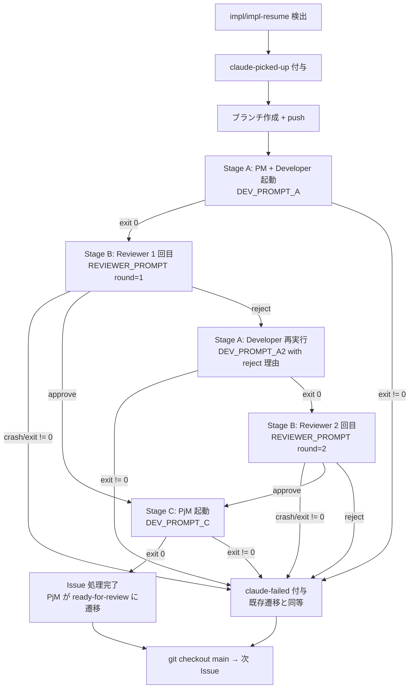
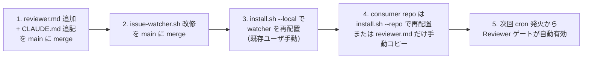

# Design Document

## Overview

**Purpose**: idd-claude の impl 系モード（`impl` / `impl-resume`）に **独立 Reviewer サブエージェント**
を差し込み、Developer 完了後・PjM の PR 作成前に「AC 未カバー / missing test / boundary 逸脱」の 3 軸で
独立レビューを 1 回実施する。reject なら Developer に 1 度だけ自動差し戻し、再 reject で
`claude-failed` に昇格させる。Phase 1 のスコープは「最小変更・高 ROI」を優先し、Per-task ループ
（Phase 2）・Debugger（Phase 3）・Feature Flag（Phase 4）は対象外とする。

**Users**: idd-claude の watcher 運用者（cron / launchd で `issue-watcher.sh` を回す個人 / 小規模チーム）と、
watcher が作成する PR の人間レビュワー。Reviewer ゲート導入後、人間レビュワーが PR を開く前段階で
「実装した本人が自分のコードを評価する」構造を排除でき、`ready-for-review` 状態の PR 品質が底上げされる。

**Impact**: 現在の impl 系モードは `claude --print "$DEV_PROMPT"` 1 回で **PM + Developer + PjM** を
1 セッション内に直列起動している。本機能はこの単一セッションを **stage 分割** し、Developer 完了後に
**新しい Claude プロセス**（独立 context）で Reviewer を起動するよう watcher 側のオーケストレーションを
書き換える。設計 PR ゲート（design モード）には影響を与えない。既存ラベル・env var 名・cron 登録文字列は
すべて不変で、Reviewer は impl 系モード全 Issue で常時起動される（env による opt-out は提供しない）。

### Goals

- impl / impl-resume / skip-triage 経由 impl のすべてで Developer 完了直後に Reviewer を 1 回起動する
- Reviewer の判定（approve / reject / 異常終了）を機械可読な形式で取得し、watcher の bash 制御フローで
  ループを管理する（最大 1 ラウンドの差し戻し = Reviewer 最大 2 回 / Developer 最大 2 回）
- 既存環境変数・ラベル・cron / launchd 登録文字列・lock / log 出力先を一切変更しない
- Reviewer が判定対象とする 3 カテゴリ（AC 未カバー / missing test / boundary 逸脱）を明文化し、
  スタイル / lint 観点での reject を抑止する
- 観測可能性: Reviewer 起動・判定結果・モデル ID・差し戻し理由をすべて watcher ログに 1 行以上記録

### Non-Goals

- Per-task implementation loop（タスク単位の TDD 自走ループ）→ Phase 2 として別 Issue
- Debugger サブエージェント → Phase 3 として別 Issue
- Feature Flag Protocol → Phase 4 として別 Issue
- Reviewer による自動修正 / コード書き換え（本 Phase は判定のみ）
- env による Reviewer の opt-in / opt-out（impl 系モード全 Issue で常時起動）
- 3 回目以降の Developer 再実行 / Reviewer 再判定（最大 1 ラウンドに固定）
- スタイル違反 / lint 観点での reject（lint ツールに委ねる）
- Reviewer 判定結果を PR 本文に整形転載する機能（PjM の責務範囲を変更しない）
- GitHub Actions 版ワークフロー（`.github/workflows/issue-to-pr.yml`）への組み込み
- Reviewer 専用ラベル新設（既存 `claude-picked-up` / `claude-failed` の遷移に乗せる）
- design モード（PM → Architect → PjM）への Reviewer 介入

---

## Architecture

### Existing Architecture Analysis

`local-watcher/bin/issue-watcher.sh` の impl 系モードは現在以下の単一 Claude セッションで実装されている
（`issue-watcher.sh:1262-1363` 周辺）:

1. `MODE` を判定（`design` / `impl` / `impl-resume`）
2. `claude-picked-up` ラベル付与 + 着手コメント
3. `claude/issue-${NUMBER}-impl-${SLUG}` ブランチを切って `git push -u origin --force-with-lease`
4. `DEV_PROMPT` を組み立てて `claude --print "$DEV_PROMPT" --model "$DEV_MODEL" --max-turns "$DEV_MAX_TURNS"` を 1 回実行
   - この 1 回の中で **PM サブエージェント → Developer サブエージェント → PjM サブエージェント**
     が直列に動き、PR 作成までを完結する
5. 失敗時は `claude-picked-up` 削除 + `claude-failed` 付与 + Issue コメント投稿
6. `git checkout main` でループ次へ

尊重すべき制約:

- **単一 flock 境界**: 同一 repo への watcher 多重起動は防がれている。Reviewer も同じ flock 内で動く
- **作業ディレクトリ規律**: 各 Issue 処理の終端で `git checkout main` に必ず戻る
- **ログ出力先統一**: `$LOG_DIR/issue-${NUMBER}-${TS}.log` に集約。Reviewer の出力も同じログに append
- **既存 label / env var / exit code の意味**: 一切変えない（要件 6.x）
- **cron-like 最小 PATH**: 依存 CLI は `command -v` で事前検証される。Reviewer は新規依存なし

解消する technical debt: なし。本機能は既存の `DEV_PROMPT` 単一セッション構造を
**stage 分割パターン**に置き換えることが主要な構造変更となる。

### 主要決定: 既存単一セッション → Stage 分割パターン

要件 2.2「Reviewer を Developer とは独立した Claude セッション（独立 context）として起動する」を
満たすため、現在の `DEV_PROMPT` 1 回実行を **3 stage** に分割する:

| Stage | プロンプト | 起動するサブエージェント | モデル / max-turns |
|---|---|---|---|
| Stage A | `DEV_PROMPT_A`（PM + Developer のみ） | product-manager → developer | `DEV_MODEL` / `DEV_MAX_TURNS` |
| Stage B | `REVIEWER_PROMPT` | reviewer | `REVIEWER_MODEL` / `REVIEWER_MAX_TURNS` |
| Stage C | `DEV_PROMPT_C`（PjM のみ） | project-manager | `DEV_MODEL` / `DEV_MAX_TURNS` |

reject 時は Stage A' (Developer 再実行のみ) → Stage B' (Reviewer 2 回目) を経由してから Stage C に進む。

代替案として「`claude --resume` で同一セッションを継続しサブエージェント切り替え」も検討したが、
要件 2.2 の「独立 context」要件を満たさないため不採用。stage 間で context を完全に分離するため
**毎 stage `claude --print` を新規プロセスで起動**する。

### Architecture Pattern & Boundary Map



**Architecture Integration**:

- 採用パターン: 既存の `DEV_PROMPT` 単一セッションを **stage 分割の bash 制御フロー**に書き換え。
  各 stage は `claude --print` の独立プロセスで起動し、stage 間の状態は **作業ブランチ上の commit と
  `docs/specs/<N>-<slug>/review-notes.md` ファイル**で受け渡す（プロセス間 stdin 連携や
  `--resume` は使わない）
- ドメイン／機能境界:
  - watcher（`issue-watcher.sh`）: stage 分割と reject ループの **bash 制御フロー** を担当
  - Reviewer エージェント定義（`reviewer.md`）: 判定基準と出力フォーマット契約を担当
  - prompt テンプレート群: 各 stage の Claude プロンプト組み立てを担当
- 既存パターンの維持:
  - flock 境界・log 出力先・lock file パス・exit code 意味（要件 6.3）
  - design モード（PM → Architect → PjM）は無変更（要件 2.6）
  - `LABEL_PICKED` → `LABEL_READY` のラベル遷移は最終的に PjM が担当（既存挙動と同等、要件 2.7）
  - 既存サブエージェント（`product-manager.md` / `developer.md` / `architect.md` / `project-manager.md`）の
    定義は無変更（責務分離のみ Reviewer が新規追加）
- 新規コンポーネントの根拠:
  - `reviewer.md` は他サブエージェントと並列の独立定義（要件 1.1〜1.5）。判定基準と出力契約を持つ
  - `review-notes.md` を spec ディレクトリ配下に永続化することで、watcher が判定結果を
    ファイル経由で受け取り、Developer 再実行時のフィードバックとしても使える（Open Questions #3 を解決）

### Technology Stack

| Layer | Choice / Version | Role in Feature | Notes |
|-------|------------------|-----------------|-------|
| Shell | bash 4+ | `issue-watcher.sh` の stage 分割と reject ループ制御 | 既存と同じ。新規依存なし |
| CLI: AI | `claude` (Claude Code) | 各 stage の独立 context 実行 | 既存と同じ。`--print --model --max-turns --output-format stream-json --verbose` を踏襲 |
| CLI: GitHub | `gh` | Issue / PR ラベル操作・コメント投稿 | 既存と同じ |
| CLI: JSON 処理 | `jq` | review-notes.md の JSON ブロック parse | 既存と同じ |
| CLI: 並行制御 | `flock` | 単一 watcher 排他 | 既存と同じ lock file を共有 |
| Agent 定義 | Markdown + YAML frontmatter | `repo-template/.claude/agents/reviewer.md` | 既存サブエージェント（PM / Architect / Developer / PjM）と同じスキーマ |
| Prompt | bash heredoc（インライン） | DEV_PROMPT_A / REVIEWER_PROMPT / DEV_PROMPT_C | 既存 `DEV_PROMPT` と同じ heredoc 方式。テンプレートファイル化はしない（複雑度を増やさないため） |
| 判定結果ストレージ | `docs/specs/<N>-<slug>/review-notes.md` | Reviewer 判定の永続化 / 機械可読 parse 元 | git にコミットして PR にも含める。後続フェーズで監査可能 |
| AI: モデル | `claude-opus-4-7`（既定） | Reviewer 起動時のモデル | `REVIEWER_MODEL` env で override 可（要件 5.1, 5.3） |

---

## File Structure Plan

本機能の追加・変更ファイル一覧（`_Boundary:_` アノテーションのドライバ）:

```
local-watcher/
└── bin/
    └── issue-watcher.sh                # 変更: 既存 DEV_PROMPT 単一実行を 3 stage 分割。
                                        # reject ループ制御 (run_reviewer_stage / run_developer_redo_stage)
                                        # と REVIEWER_MODEL / REVIEWER_MAX_TURNS の Config を追加

repo-template/
└── .claude/
    └── agents/
        └── reviewer.md                 # 新規: Reviewer サブエージェント定義
                                        # （PM / Architect / Developer / PjM と同階層・同スキーマ）

.claude/
└── agents/
    └── reviewer.md                     # 新規: self-host 用に同内容を配置
                                        # （idd-claude 自身も dogfooding 対象 repo）

docs/specs/
└── 20-phase-1-reviewer-subagent-gate/
    ├── requirements.md                 # PM 作成済み
    ├── design.md                       # 本ファイル
    ├── tasks.md                        # 本ファイルと同時に Architect が作成
    ├── impl-notes.md                   # Developer が実装完了後に追記（PR 含む）
    └── review-notes.md                 # ★ 本機能で生成: Reviewer 判定結果（自分自身の Issue で）

CLAUDE.md                               # 変更: 「エージェント連携ルール」節に Reviewer の責務を追記
                                        # （要件・設計・実装の追加 / 書き換えを行わない）

repo-template/CLAUDE.md                 # 変更: 同上（consumer repo 向けテンプレート）

README.md                               # 変更:
                                        # - 「サブエージェント構成」表に Reviewer 行を追加
                                        # - 「impl 系モードでの Reviewer ゲート」セクションを新設
                                        #   （存在・有効化条件・差し戻しループ・REVIEWER_MODEL /
                                        #    REVIEWER_MAX_TURNS の override 例）
                                        # - 「ラベル状態遷移まとめ」に Reviewer 経由の遷移を追記
```

### Directory Structure（本機能の主要コンポーネントとファイル対応）

```
local-watcher/bin/
└── issue-watcher.sh                            # Issue Watcher 本体
    ├── Config block (既存)                     # REVIEWER_MODEL / REVIEWER_MAX_TURNS を新規追加
    ├── 既存関数群 (Phase A / Re-check / PR Iteration) # 変更なし
    ├── build_dev_prompt_a()                    # 新規: PM + Developer 用プロンプト生成
    ├── build_dev_prompt_redo()                 # 新規: reject 後の Developer 再実行用プロンプト生成
    ├── build_reviewer_prompt()                 # 新規: Reviewer 起動用プロンプト生成
    ├── build_dev_prompt_c()                    # 新規: PjM 用プロンプト生成
    ├── run_reviewer_stage()                    # 新規: Reviewer 起動 + review-notes.md parse + RESULT 抽出
    ├── parse_review_result()                   # 新規: review-notes.md から RESULT/カテゴリ/対象 ID を抽出
    ├── run_impl_pipeline()                     # 新規: impl / impl-resume の stage 分割パイプライン本体
    └── 既存 Issue 処理ループ                    # 変更: design モードは既存パス、impl 系は run_impl_pipeline 呼び出し

repo-template/.claude/agents/
└── reviewer.md                                 # フロントマター（name, description, tools, model）
                                                # + 入力契約 / 出力契約 / 判定基準 3 カテゴリ
                                                # + 着手前に読むルール（CLAUDE.md / requirements / tasks）
                                                # + やらないこと（書き換え禁止）
```

### Modified Files（詳細）

- **`local-watcher/bin/issue-watcher.sh`**:
  - Config ブロックに `REVIEWER_MODEL="${REVIEWER_MODEL:-claude-opus-4-7}"` と
    `REVIEWER_MAX_TURNS="${REVIEWER_MAX_TURNS:-30}"` を追加（要件 5.1, 5.2）。既存の
    `TRIAGE_MODEL` / `DEV_MODEL` / `TRIAGE_MAX_TURNS` / `DEV_MAX_TURNS` 命名規約と揃える
  - 既存 `DEV_PROMPT` 単一実行ブロック（impl / impl-resume 系のみ）を `run_impl_pipeline` 呼び出しに置換。
    design モードのパスは無変更（要件 2.6, 6.4）
  - `run_impl_pipeline` 内で stage A → B → (reject なら A' → B') → C を直列実行し、各 stage の exit
    と Reviewer 判定結果に応じてラベル遷移を制御（要件 2.1〜2.7, 4.1〜4.8）
  - 各 stage のログは既存 `$LOG` ファイルに追記（要件 NFR 2.1〜2.3）
- **`repo-template/.claude/agents/reviewer.md`** / **`.claude/agents/reviewer.md`**:
  - フロントマター: `name: reviewer` / `description` / `tools: Read, Grep, Glob, Bash, Write` /
    `model: claude-opus-4-7`（既存サブエージェント定義の YAML スキーマと同形式、要件 1.2）
  - 着手前に読むルール: CLAUDE.md「テスト規約」、`docs/specs/<N>-<slug>/requirements.md` の AC、
    `tasks.md` の `_Requirements:_` 対応表（要件 1.4, 7.5）
  - 出力契約: `docs/specs/<N>-<slug>/review-notes.md` に決まったマークダウン構造で書き込む
    （後述 Data Models）
  - 判定基準 3 カテゴリ（AC 未カバー / missing test / boundary 逸脱）を明示（要件 3.1〜3.6）
  - 「やらないこと」: requirements / design / tasks / 既存実装コードの書き換え（要件 3.9, 7.4）
- **`CLAUDE.md`** / **`repo-template/CLAUDE.md`**:
  - 「エージェント連携ルール」節に Reviewer 行を追加（要件 7.4）。Reviewer は要件・設計・実装の
    追加 / 書き換えを行わず、判定のみを担当する旨を明記
- **`README.md`**:
  - 「サブエージェント構成」表に Reviewer 行を追加（要件 7.1）
  - 新セクション「impl 系モードでの Reviewer ゲート」を追加（要件 7.1, 7.2, 7.3）:
    - 存在・目的（独立 context での AC / test / boundary レビュー）
    - 起動条件（impl / impl-resume / skip-triage 経由 impl の全パス）
    - 差し戻しループ（最大 1 ラウンド、再 reject で `claude-failed`）
    - `REVIEWER_MODEL` / `REVIEWER_MAX_TURNS` のデフォルトと override 例
  - 「ラベル状態遷移まとめ」に Reviewer 経由の `claude-picked-up` 持続と `ready-for-review` 遷移
    タイミングを追記（要件 2.7）

---

## Requirements Traceability

| Requirement | Summary | Components | Data / Flow |
|---|---|---|---|
| 1.1 | reviewer.md を既存サブエージェントと同階層に追加 | Reviewer Agent Definition | `repo-template/.claude/agents/reviewer.md` 配置 |
| 1.2 | フロントマターを既存スキーマで持つ | Reviewer Agent Definition | YAML frontmatter (name/description/tools/model) |
| 1.3 | 役割を「Developer 完了後の独立レビュー、書き換えない」と明記 | Reviewer Agent Definition | reviewer.md 本文「役割」「やらないこと」 |
| 1.4 | 着手前に読むルールを明記 | Reviewer Agent Definition | reviewer.md 本文「必ず先に読むルール」 |
| 1.5 | 出力フォーマット規定 | Reviewer Agent Definition / Review Notes Contract | reviewer.md 本文「出力契約」 + review-notes.md フォーマット |
| 1.6 | installer が reviewer.md を配置 | Installer Path | `install.sh` の既存 `cp -v ... .claude/agents/*.md` で自動配置（変更不要） |
| 2.1 | impl / impl-resume Developer 正常終了後 Reviewer 1 回起動 | run_impl_pipeline | Stage B 起動 |
| 2.2 | Reviewer は独立 Claude セッション | run_reviewer_stage | 新規 `claude --print` プロセス起動 |
| 2.3 | git diff / テスト結果 / tasks.md / CLAUDE.md を提示 | build_reviewer_prompt | プロンプト内に diff / impl-notes.md パス / tasks.md パス / CLAUDE.md パス を inline 埋め込み |
| 2.4 | Triage / skip-triage / impl-resume すべての impl 系で起動 | run_impl_pipeline | impl / impl-resume すべてが run_impl_pipeline を通る |
| 2.5 | Developer 失敗時は Reviewer 起動せず claude-failed | run_impl_pipeline | Stage A 非 0 exit → Failed 既存遷移 |
| 2.6 | design モードでは Reviewer 起動しない | run_impl_pipeline | MODE=design は既存パス、run_impl_pipeline を通らない |
| 2.7 | Reviewer 実行中は claude-picked-up 維持、ready-for-review 遷移は判定後 | run_impl_pipeline / Stage C | Stage C の PjM が既存どおりラベル付け替え |
| 3.1 | requirement ID ごとの AC 全読 → approve/reject | Reviewer Agent Definition | reviewer.md 判定手順 |
| 3.2 | AC 未カバー → reject + カテゴリ「AC 未カバー」 | Reviewer Agent Definition | 判定基準カテゴリ列挙 |
| 3.3 | missing test → reject + カテゴリ「missing test」 | Reviewer Agent Definition | 判定基準カテゴリ列挙 |
| 3.4 | boundary 逸脱 → reject + カテゴリ「boundary 逸脱」 | Reviewer Agent Definition | 判定基準カテゴリ列挙 |
| 3.5 | reject カテゴリは 3 つに限定 | Reviewer Agent Definition | reviewer.md「やらないこと」で他カテゴリへの拡張禁止 |
| 3.6 | スタイル / lint 系は reject しない | Reviewer Agent Definition | reviewer.md 判定指針 |
| 3.7 | reject 時は対象 ID / カテゴリ / 是正アクション 3 要素を記録 | Review Notes Contract | review-notes.md 必須フィールド |
| 3.8 | approve 時は確認した ID とテストケース名を 1 行以上記録 | Review Notes Contract | review-notes.md 必須フィールド |
| 3.9 | requirements / design / tasks / 実装を書き換えない | Reviewer Agent Definition | reviewer.md「やらないこと」+ tools 制限 |
| 4.1 | reject → Developer 再起動、reject 理由をプロンプトへ | run_impl_pipeline / build_dev_prompt_redo | Stage A' プロンプト組み立て |
| 4.2 | 再実装正常終了 → Reviewer 2 回目起動 | run_impl_pipeline | Stage B' 起動 |
| 4.3 | 2 回目 approve → PjM 起動 + ラベル遷移 | run_impl_pipeline | Stage C 起動 |
| 4.4 | 2 回目 reject → PjM 起動せず claude-failed | run_impl_pipeline | Failed 遷移（PjM スキップ） |
| 4.5 | 再 reject 時は reject 理由 + 対象 ID + ログパスを Issue にコメント | run_impl_pipeline | Failed 遷移内のコメント生成 |
| 4.6 | Reviewer 最大 2 回 / Developer 最大 2 回 | run_impl_pipeline | bash カウンタ変数 + 状態機械 |
| 4.7 | 2 回目 Developer 再実装失敗 → claude-failed（既存遷移） | run_impl_pipeline | Stage A' exit != 0 → Failed |
| 4.8 | Reviewer 自体が異常終了 → claude-failed + ログパス Issue コメント | run_reviewer_stage / run_impl_pipeline | Reviewer process exit != 0 / parse 失敗 → Failed |
| 5.1 | REVIEWER_MODEL 既定 `claude-opus-4-7` | Watcher Config | Config ブロック env 既定値 |
| 5.2 | REVIEWER_MAX_TURNS 既定 30 | Watcher Config | Config ブロック env 既定値 |
| 5.3 | Reviewer 起動時に REVIEWER_MODEL を model 指定として使用 | run_reviewer_stage | `claude --model "$REVIEWER_MODEL"` |
| 5.4 | Reviewer 起動時に REVIEWER_MAX_TURNS を turn 数として使用 | run_reviewer_stage | `claude --max-turns "$REVIEWER_MAX_TURNS"` |
| 5.5 | 既存 env と独立扱い | Watcher Config | 既存 env を一切参照しない |
| 6.1 | 既存環境変数の名称・既定値・意味を変更しない | Watcher Config | 新規追加のみ、既存定義を触らない |
| 6.2 | 既存ラベルの名称・付与契約・遷移意味を変更しない | run_impl_pipeline | 既存定数 LABEL_PICKED / LABEL_FAILED / LABEL_READY を流用 |
| 6.3 | lock file / log 出力先 / exit code 意味を変更しない | Watcher Config / run_impl_pipeline | 既存 LOCK_FILE / LOG_DIR を流用、watcher 全体 exit は 0 を維持 |
| 6.4 | cron / launchd 登録文字列を変更しない | Watcher Config | 既存の `REPO=... REPO_DIR=... $HOME/bin/issue-watcher.sh` で動く |
| 6.5 | 正常パスでの PR 作成タイミング・本文・コメント構造を等価に保つ | run_impl_pipeline / Stage C | Stage C は既存の DEV_PROMPT 内 PjM 部と同等の指示を渡す |
| 6.6 | installer 再実行時 reviewer.md 追加以外の破壊的変更なし | Installer Path | `install.sh` は `cp -v` のみ、既存ファイル群への破壊的変更なし |
| 7.1 | README に Reviewer 存在・目的・常時起動を記載 | README Documentation | 新セクション追加 |
| 7.2 | README に env override 例 | README Documentation | env 一覧表に追記 |
| 7.3 | README に差し戻しループ挙動 | README Documentation | 新セクション内で記述 |
| 7.4 | CLAUDE.md「エージェント連携ルール」に Reviewer 追記 | CLAUDE.md / repo-template/CLAUDE.md | 既存節に行追加 |
| 7.5 | reviewer.md は対象 repo の CLAUDE.md テスト規約と整合 | Reviewer Agent Definition | reviewer.md 内で「対象 repo の CLAUDE.md を必ず読む」と明記 |
| NFR 1.1 | Reviewer 1 回 ≤ REVIEWER_MAX_TURNS=30 | run_reviewer_stage | `--max-turns` で機械的に上限 |
| NFR 1.2 | Reviewer 最大 2 回 / Issue | run_impl_pipeline | bash カウンタで保証 |
| NFR 1.3 | Developer 自動再実行最大 2 回 / Issue | run_impl_pipeline | bash カウンタで保証 |
| NFR 2.1 | Reviewer 判定結果 / カテゴリ / 対象 ID をログに記録 | run_reviewer_stage | log 行フォーマット規定 |
| NFR 2.2 | 起動時に REVIEWER_MODEL / REVIEWER_MAX_TURNS をログ記録 | run_reviewer_stage | log 行フォーマット規定 |
| NFR 2.3 | Developer 再実行時「reject 差し戻し」と識別できる文言 | run_impl_pipeline | log 行フォーマット規定（"redo by reviewer reject"）|
| NFR 3.1 | shellcheck 警告 0 | Watcher Implementation | `shellcheck local-watcher/bin/issue-watcher.sh` |
| NFR 3.2 | 正常パス E2E スモーク | Watcher Implementation | dogfooding で auto-dev Issue を 1 件流す |
| NFR 3.3 | reject 経路スモーク | Watcher Implementation | 意図的に AC 未カバー実装で 1 ラウンド回す |

---

## Components and Interfaces

### Reviewer Agent Layer

#### Reviewer Agent Definition

| Field | Detail |
|---|---|
| Intent | Developer 完了後の独立レビューエージェント。AC / test / boundary の 3 軸で approve/reject を出す |
| Requirements | 1.1, 1.2, 1.3, 1.4, 1.5, 3.1, 3.2, 3.3, 3.4, 3.5, 3.6, 3.7, 3.8, 3.9, 7.5 |

**Responsibilities & Constraints**

- 主責務: `git diff` と `docs/specs/<N>-<slug>/requirements.md` / `tasks.md` / `impl-notes.md` を読み、
  3 カテゴリ（AC 未カバー / missing test / boundary 逸脱）の判定を `review-notes.md` に書き出す
- 書き換え禁止対象: `requirements.md` / `design.md` / `tasks.md` / 既存実装コード / テストコード
- スタイル / 命名 / フォーマット / lint 観点での reject は禁止（要件 3.6）
- 出力先は `docs/specs/<N>-<slug>/review-notes.md` ただ 1 ファイル

**Dependencies**

- Inbound: watcher (`run_reviewer_stage`) — Reviewer プロンプトで起動 (Critical)
- Outbound: なし（外部呼び出しなし）
- External: Read / Grep / Glob で repo 内ファイルのみ参照 (Critical)

**Contracts**: Service [x] / API [ ] / Event [ ] / Batch [ ] / State [ ]

##### Service Interface（プロンプト契約として）

```
入力 (プロンプト経由):
  - REPO, ISSUE_NUMBER, SPEC_DIR_REL, BRANCH
  - 最新 commit の git diff（base..HEAD のサマリ + 全文 / プロンプト内 inline）
  - 関連ファイルパス（CLAUDE.md / requirements.md / tasks.md / impl-notes.md）
  - 「再 review か初回か」の round 情報 (ROUND ∈ {1, 2})
  - 前回 review-notes.md の RESULT（再 review のみ。初回は "(none)"）

出力 (副作用):
  - docs/specs/<N>-<slug>/review-notes.md を Write
    - 機械可読ヘッダブロック（後述 Data Models）
    - 末尾に "RESULT: approve" または "RESULT: reject" 行を必ず 1 つだけ含む

副作用禁止:
  - git commit / git push / gh pr / gh issue は一切実行しない
```

- Preconditions: Stage A が成功し、最新 commit が現在の作業ブランチに乗っている
- Postconditions: `review-notes.md` が存在し、末尾の RESULT 行が watcher で grep 可能
- Invariants: `review-notes.md` 以外のファイルを変更しない

##### 出力契約（review-notes.md フォーマット）

```markdown
# Review Notes

<!-- idd-claude:review round=N model=claude-opus-4-7 timestamp=YYYY-MM-DDTHH:MM:SSZ -->

## Reviewed Scope

- Branch: claude/issue-<N>-impl-<slug>
- HEAD commit: <sha>
- Compared to: main..HEAD

## Verified Requirements

- 1.1 — <該当テスト / 実装 1 行>
- 1.2 — <該当テスト / 実装 1 行>
- ...

## Findings

（reject の場合のみ。approve の場合は "なし" と記載）

### Finding 1
- **Target**: 1.1（または `_Boundary:_` 違反のコンポーネント名）
- **Category**: AC 未カバー / missing test / boundary 逸脱
- **Detail**: <観測した問題の説明>
- **Required Action**: <Developer が次に行うべき具体的な是正アクション>

### Finding 2
- ...

## Summary

<approve なら 1〜2 行、reject なら finding の要約 1〜3 行>

RESULT: approve
```

または

```markdown
RESULT: reject
```

最終行は必ず `RESULT: ` で始まる行で終わる。watcher は `tail -n 50` 範囲を grep で `^RESULT: (approve|reject)$`
にマッチさせて結果を取り出す。

---

### Watcher Layer

#### Watcher Config

| Field | Detail |
|---|---|
| Intent | Reviewer 起動に必要な env var の既定値定義と override 受け入れ |
| Requirements | 5.1, 5.2, 5.5, 6.1, 6.3, 6.4 |

**Responsibilities & Constraints**

- `REVIEWER_MODEL`（既定: `claude-opus-4-7`）と `REVIEWER_MAX_TURNS`（既定: `30`）を新規定義
- 既存の `TRIAGE_MODEL` / `DEV_MODEL` / `TRIAGE_MAX_TURNS` / `DEV_MAX_TURNS` の命名と並べる
- 他の env var（`LOG_DIR`, `LOCK_FILE`, `REPO`, `REPO_DIR`）は無変更

**Contracts**: Service [ ] / API [ ] / Event [ ] / Batch [ ] / State [x]（環境変数状態）

##### State Interface

```bash
# Config ブロック内に追加
REVIEWER_MODEL="${REVIEWER_MODEL:-claude-opus-4-7}"
REVIEWER_MAX_TURNS="${REVIEWER_MAX_TURNS:-30}"
```

#### run_impl_pipeline

| Field | Detail |
|---|---|
| Intent | impl / impl-resume の Stage A → B → (reject なら A' → B') → C を直列実行する状態機械 |
| Requirements | 2.1, 2.4, 2.5, 2.6, 2.7, 4.1, 4.2, 4.3, 4.4, 4.5, 4.6, 4.7, 6.2, 6.5, NFR 1.2, NFR 1.3, NFR 2.3 |

**Responsibilities & Constraints**

- Stage 状態機械の中央制御。失敗時の `claude-failed` 遷移を一元化する
- 各 stage で `claude --print` を独立プロセスとして起動。stage 間の context 共有はしない（要件 2.2）
- Reviewer / Developer 再実行のカウンタ上限を bash 変数で保証（NFR 1.2, 1.3）
- design モードからは呼ばれない（要件 2.6）

**Dependencies**

- Inbound: 既存 Issue 処理ループ（impl / impl-resume 分岐から呼び出し）(Critical)
- Outbound:
  - `run_reviewer_stage` (Critical)
  - `parse_review_result` (Critical)
  - `build_dev_prompt_a` / `build_dev_prompt_redo` / `build_reviewer_prompt` / `build_dev_prompt_c` (Critical)
- External: `claude` CLI / `gh` CLI (Critical)

**Contracts**: Service [x] / API [ ] / Event [ ] / Batch [ ] / State [x]

##### Service Interface（bash 関数）

```bash
# 入力 (環境変数経由):
#   NUMBER, TITLE, BODY, URL, BRANCH, MODE, SPEC_DIR_REL, LOG, REPO
# 戻り値:
#   0 = pipeline 成功（Stage C も成功 / PR 作成済み）
#   1 = Stage A / A' / B / B' / C いずれかで失敗 → claude-failed 既に付与済み
run_impl_pipeline()
```

- Preconditions: ブランチが切られて push 済み、`claude-picked-up` ラベル付与済み
- Postconditions:
  - 0 を返す場合: Stage C の PjM が `claude-picked-up` 削除 + `ready-for-review` 付与済み
  - 1 を返す場合: 関数内で `claude-picked-up` 削除 + `claude-failed` 付与 + Issue コメント投稿済み
- Invariants:
  - Reviewer 起動回数は最大 2、Developer 起動回数（初回 + redo）は最大 2
  - 失敗時の `claude-failed` 遷移は既存の Developer 失敗時遷移と同等のメッセージ構造を保つ（要件 6.5）

##### 状態遷移表

| 現在 stage | 結果 | 次 stage | ラベル更新 / 副作用 |
|---|---|---|---|
| START | — | Stage A | （pickup 済み）|
| Stage A | exit 0 | Stage B (round=1) | — |
| Stage A | exit != 0 | TERMINAL_FAILED | claude-picked-up 削除 / claude-failed 付与 / Issue コメント |
| Stage B (round=1) | crash / exit != 0 / parse 失敗 | TERMINAL_FAILED | claude-picked-up 削除 / claude-failed 付与 / Issue コメント（要件 4.8） |
| Stage B (round=1) | RESULT: approve | Stage C | — |
| Stage B (round=1) | RESULT: reject | Stage A' (redo) | log: "redo by reviewer reject"（NFR 2.3）|
| Stage A' | exit 0 | Stage B (round=2) | — |
| Stage A' | exit != 0 | TERMINAL_FAILED | 既存 Developer 失敗時遷移（要件 4.7）|
| Stage B (round=2) | crash / exit != 0 / parse 失敗 | TERMINAL_FAILED | 同上（要件 4.8）|
| Stage B (round=2) | RESULT: approve | Stage C | — |
| Stage B (round=2) | RESULT: reject | TERMINAL_FAILED | claude-picked-up 削除 / claude-failed 付与 + Reviewer reject 理由 + 対象 ID + ログパス を Issue コメントへ投稿（要件 4.4, 4.5） |
| Stage C | exit 0 | TERMINAL_OK | （PjM が claude-picked-up → ready-for-review に遷移済み）|
| Stage C | exit != 0 | TERMINAL_FAILED | claude-picked-up 削除 / claude-failed 付与 / Issue コメント |

#### run_reviewer_stage

| Field | Detail |
|---|---|
| Intent | Reviewer サブエージェントを 1 回起動し、review-notes.md から RESULT を抽出して返す |
| Requirements | 2.2, 2.3, 4.8, 5.3, 5.4, NFR 1.1, NFR 2.1, NFR 2.2 |

**Responsibilities & Constraints**

- `REVIEWER_PROMPT` を組み立て（`build_reviewer_prompt`）→ `claude --print "$REVIEWER_PROMPT"` を独立プロセスで起動
- 起動前に `REVIEWER_MODEL` / `REVIEWER_MAX_TURNS` をログに 1 行出力（NFR 2.2）
- 終了後に `parse_review_result` を呼び、判定 / カテゴリ / 対象 ID をログに 1 行出力（NFR 2.1）
- Reviewer 異常終了（非 0 exit / parse 失敗）は呼び出し元に return code で通知

**Dependencies**

- Inbound: `run_impl_pipeline` (Critical)
- Outbound: `claude` CLI (Critical) / `parse_review_result` (Critical)

**Contracts**: Service [x] / API [ ] / Event [ ] / Batch [ ] / State [ ]

##### Service Interface（bash 関数）

```bash
# 入力:
#   $1 = round (1 | 2)
#   環境変数: NUMBER, BRANCH, SPEC_DIR_REL, LOG, REPO_DIR
# stdout: なし（ログは $LOG に append）
# 戻り値:
#   0 = approve
#   1 = reject
#   2 = 異常終了（claude crash / parse 失敗 / RESULT 行欠落）
run_reviewer_stage <round>
```

- Preconditions: 現在ブランチに少なくとも 1 commit 以上が乗っている（`git diff main..HEAD` が非空）
- Postconditions:
  - 0/1: `docs/specs/<N>-<slug>/review-notes.md` が存在し RESULT 行を含む
  - 2: review-notes.md が無いか RESULT 行が抽出できなかった
- Invariants: 終了後は呼び出し元のブランチ状態を変更しない（Reviewer は Bash tool を持つが、
  reviewer.md で commit / push / gh は禁止と明記）

##### Claude CLI 呼び出し契約

```bash
claude \
  --print "$REVIEWER_PROMPT" \
  --model "$REVIEWER_MODEL" \
  --permission-mode bypassPermissions \
  --max-turns "$REVIEWER_MAX_TURNS" \
  --output-format stream-json \
  --verbose \
  >> "$LOG" 2>&1
```

既存の Stage A / Stage C と同じオプション形式を踏襲（要件 6.5 の「読み手にとって等価な内容」）。

#### parse_review_result

| Field | Detail |
|---|---|
| Intent | review-notes.md から RESULT 行・カテゴリ・対象 requirement ID を抽出 |
| Requirements | 3.7, 3.8, 4.5, 4.8, NFR 2.1 |

**Responsibilities & Constraints**

- 入力ファイルが存在しない / RESULT 行が無い / 不正値の場合は exit 2（呼び出し元で異常扱い）
- 「最後に出現する RESULT 行」を採用（fail-safe。Reviewer が複数書いた場合）

##### Service Interface

```bash
# 入力:
#   $1 = review-notes.md のパス
# stdout (TSV 1 行):
#   <result>\t<categories>\t<target_ids>
#     result      ∈ {approve, reject}
#     categories  = カンマ区切り（reject 時のみ。approve 時は空）
#     target_ids  = カンマ区切り requirement ID または `boundary:<component>` 形式
# 戻り値:
#   0 = 抽出成功
#   2 = ファイル無 / RESULT 行欠落 / 値不正
parse_review_result <path>
```

#### Prompt Builders（4 関数）

| Field | Detail |
|---|---|
| Intent | 各 stage の Claude プロンプトを bash heredoc で組み立てる |
| Requirements | 2.1, 2.3, 2.4, 4.1, 6.5 |

**Responsibilities & Constraints**

- 既存 `DEV_PROMPT` の組み立てパターンを踏襲（heredoc + 変数展開）
- テンプレートファイル（`triage-prompt.tmpl` / `iteration-prompt.tmpl`）方式は **採用しない**。
  本機能は変数注入が少なく、bash 内 heredoc で十分。新規ファイルを増やさない
- 各 builder は stdout に prompt 文字列を出力する単純関数

##### Builder 役割と内容

- **`build_dev_prompt_a`** (Stage A 用)
  - 既存 `DEV_PROMPT` の `STEPS` ブロックから「PjM 起動」を **除外** したもの
  - PM サブエージェント（impl-resume 時はスキップ）→ Developer サブエージェントを起動するよう指示
  - 「Developer 完了後に PR 作成は行わない（Reviewer ゲート経由のため）」と明記
  - 入力: `MODE` / `FLOW_LABEL` / `SPEC_DIR_REL` / `BRANCH` / `NUMBER` / `TITLE` / `URL` / `BODY` / `ARCHITECT_REASON`

- **`build_dev_prompt_redo`** (Stage A' 用)
  - Developer サブエージェントのみを起動するよう指示
  - 「直前の Reviewer reject の理由」をプロンプト内に inline 埋め込み（review-notes.md の Findings ブロックを cat）
  - 「PM は再起動しない（要件は不変）」「Reviewer 指摘の是正のみ実施」と明記
  - 入力: 上記 + 直前 review-notes.md のパス

- **`build_reviewer_prompt`** (Stage B 用)
  - Reviewer サブエージェントを起動
  - 必須参照ファイル: `${SPEC_DIR_REL}/requirements.md`, `${SPEC_DIR_REL}/tasks.md`,
    `${SPEC_DIR_REL}/impl-notes.md`, `CLAUDE.md`
  - `git diff main..HEAD` を inline で添付（要件 2.3）
  - round 番号 (1 / 2) と前回 RESULT (round=2 のみ) を伝達
  - 出力先: `${SPEC_DIR_REL}/review-notes.md` を Write するよう明記
  - 「commit / push / gh は実行しない」と明記

- **`build_dev_prompt_c`** (Stage C 用)
  - 既存 `DEV_PROMPT` の PjM 起動部分のみを抜き出し
  - 「Reviewer の approve は受領済み。PR 作成のみ実施」と明記
  - PR 作成時に `review-notes.md` も含めて push 済みであることを前提化
  - 既存テンプレートの「title / base / body」契約を変更しない（要件 6.5）

---

## Data Models

### Domain Model

主要な状態:

- **Pipeline State**: bash プロセス内の状態機械。永続化はしない（watcher 1 サイクル内で完結）
  - 値: `STAGE_A` / `STAGE_B_ROUND1` / `STAGE_A_REDO` / `STAGE_B_ROUND2` / `STAGE_C` / `TERMINAL_OK` / `TERMINAL_FAILED`
- **Review Notes Document**: `docs/specs/<N>-<slug>/review-notes.md` に永続化（git に commit）
  - Reviewer が Write、watcher が Read（parse のみ、書き換えない）
  - PR にも含まれるため、人間レビュワーが Reviewer 判定を後追いできる
- **Round Counter**: `run_impl_pipeline` 内のローカル変数 `reviewer_round` ∈ {1, 2}

### Logical Data Model（review-notes.md JSON-like ヘッダ）

review-notes.md の冒頭 HTML コメント `<!-- idd-claude:review round=N model=... timestamp=... -->` を hidden marker
として埋め、watcher / 後続フェーズ（Phase 2 以降）が round 数とモデル ID を機械的に確認できるようにする。
PR Iteration Processor の `<!-- idd-claude:pr-iteration ... -->` と同じパターンで命名空間を分離。

watcher は marker 自体は parse しない（最終行 RESULT のみ読む）。後続 Phase の互換性のための予約フィールド。

### ログ書式（NFR 2.x）

`$LOG` への 1 行ログ書式（既存の `[$(date '+%F %T')] ...` 形式を踏襲）:

```
[YYYY-MM-DD HH:MM:SS] reviewer: round=1 start (model=claude-opus-4-7, max-turns=30)         # NFR 2.2
[YYYY-MM-DD HH:MM:SS] reviewer: round=1 result=approve verified=1.1,1.2,2.3                 # NFR 2.1
[YYYY-MM-DD HH:MM:SS] reviewer: round=1 result=reject categories=AC未カバー targets=2.3      # NFR 2.1
[YYYY-MM-DD HH:MM:SS] reviewer: round=1 result=error reason=parse-failed                     # NFR 2.1（要件 4.8）
[YYYY-MM-DD HH:MM:SS] developer: redo by reviewer reject (round=1 categories=AC未カバー)     # NFR 2.3
```

Phase A / PR Iteration の `mq_log` / `pi_log` と同じ prefix 命名規則（`reviewer:` / `developer:`）。

---

## Error Handling

### Error Strategy

各 stage は **独立 fail-safe** を持つ。1 stage が失敗しても残りの Issue 処理ループは継続できる。

### Error Categories and Responses

| Category | 発生条件 | Response |
|---|---|---|
| Stage A 失敗 | PM/Developer サブエージェントの非 0 exit | claude-picked-up 削除 / claude-failed 付与 / Issue コメント（既存挙動と完全同等。要件 2.5）|
| Reviewer crash | `claude --print` プロセスが非 0 exit | run_reviewer_stage が 2 を返す → run_impl_pipeline が TERMINAL_FAILED へ。Issue コメントに `$LOG` パスを含める（要件 4.8）|
| Reviewer parse 失敗 | review-notes.md 不在 / RESULT 行欠落 / 値不正 | 上に同じ。`reviewer: round=N result=error reason=...` をログに記録し人間が判別可能 |
| Reviewer max-turns 超過 | claude が `--max-turns` 上限で終了 | 通常は exit 0 で停止する想定。RESULT 行が無い場合は parse 失敗として TERMINAL_FAILED へ |
| Developer 再実行失敗 | Stage A' の非 0 exit | TERMINAL_FAILED（要件 4.7）。既存 Developer 失敗遷移と同等メッセージ |
| 2 回目 reject | Stage B (round=2) の RESULT: reject | TERMINAL_FAILED + Issue コメントに reject 理由 / 対象 ID / `$LOG` パス（要件 4.4, 4.5）|
| Stage C 失敗 | PjM サブエージェントの非 0 exit | TERMINAL_FAILED（PR 作成未完）。既存パターンと同等 |

### ブランチ運用方針（Open Questions #4 への回答）

**採用: 同一 impl ブランチに追加 commit を積む**

- Stage A の Developer がブランチを進める → Stage B の Reviewer は branch 上の最新 HEAD を見る
- Stage A' (redo) も同じブランチに追加 commit を積む（reset / branch 切り替えはしない）
- Reviewer は副作用禁止（commit / push しない）。review-notes.md の Write は Developer が次回起動時に
  自動的に commit に含める（CLAUDE.md「テスト規約」とは独立で、watcher 自体は commit を作らない）
  - 注意: review-notes.md は Reviewer が Write するが、commit するのは Stage A' (redo) または
    Stage C の PjM。Stage B (round=1) で approve した場合、Stage C の PjM が PR 作成前に
    `git add docs/specs/<N>-<slug>/review-notes.md && git commit` を行うよう Stage C プロンプトで指示する
- 派生ブランチを切る案も検討したが、(a) PR 履歴が分散して人間レビュー時に追いにくい、
  (b) 既存ブランチ命名規則 `claude/issue-<N>-impl-<slug>` を破る、ため不採用

### Reviewer 異常終了時のブランチ取り扱い（Open Questions #5 への回答）

**採用: ブランチは破棄せず、commit 群を残したまま `claude-failed` にする**

- Stage B 異常終了でも、Stage A の Developer が積んだ commit はそのまま残す
- 人間が `claude-failed` を外して手動で続きを進められるよう、ブランチは保持
- Issue コメントに `$LOG` パスを記載し、人間が Reviewer 出力を確認できるようにする（要件 4.5, 4.8）
- ブランチ破棄案も検討したが、Developer の作業が消えると人間の手戻りコストが大きいため不採用

### Reviewer 入力の「テスト実行結果」取得方式（Open Questions #2 への回答）

**採用: Developer が `impl-notes.md` に書いた出力を Reviewer に参照させる（watcher は再実行しない）**

- 既存 `developer.md` の規約で「テスト実行結果は impl-notes.md に記録」と定められている
- watcher が独立にテストコマンドを再実行する案は (a) repo 固有のテストコマンドを watcher が知らない、
  (b) cron 環境でテスト依存（DB / fixture / モック）が揃わない、(c) NFR 1.1 の turn 数バジェットを圧迫
  するため不採用
- Reviewer 自身が `Bash` tool を持つので、必要なら repo の `CLAUDE.md` に書かれたテストコマンド
  （`npm test` など）を Reviewer が判断で再実行できる（reviewer.md にこの選択肢を明記）

### Issue コメントの粒度（Open Questions #1 への回答）

**採用: 要約 + watcher ログパス + review-notes.md パスを記載（逐語転載はしない）**

- 再 reject 時の Issue コメントは以下の構造（要件 4.5）:

```markdown
## ⚠️ 自動開発が Reviewer ゲートで停止しました

Reviewer が 2 回連続で reject を出したため、自動 iteration を打ち切り、人間判断に委ねます。

- 対象 requirement ID: 1.1, 2.3
- reject カテゴリ: AC 未カバー, missing test
- Reviewer 判定詳細: `docs/specs/<N>-<slug>/review-notes.md` を参照
- watcher ログ: `$LOG`

### 次の手順
1. review-notes.md と log を読み、Reviewer 判定が妥当か確認
2. 妥当なら手動で修正 commit を積み、`claude-failed` を外す
3. Reviewer 判定が誤りなら、Issue コメントで Architect 差し戻しを提案
```

- 逐語転載しない理由: review-notes.md が PR にも含まれるため、Issue コメントで重複させると保守困難。
  Issue コメントはあくまで人間誘導役

---

## Testing Strategy

idd-claude には unit test フレームワークが存在しないため、検証は以下の組み合わせで行う（CLAUDE.md
「テスト・検証」節と整合）。

### Static Analysis

- `shellcheck local-watcher/bin/issue-watcher.sh` を警告 0 で通過（NFR 3.1）
- `actionlint .github/workflows/*.yml` は本機能では不要（GitHub Actions 版は対象外）

### Manual Smoke Tests（dogfooding E2E）

- **Smoke 1: 正常パス E2E**（NFR 3.2）
  - 自リポジトリに軽微な auto-dev Issue を 1 件立てる
  - cron 経由で watcher が impl 系モードで処理し、以下を確認:
    1. Stage A → B (round=1, approve) → C の順でログが出る
    2. PR が `ready-for-review` で作成される
    3. PR に `review-notes.md` が含まれている
    4. `REVIEWER_MODEL` / `REVIEWER_MAX_TURNS` の起動ログが出ている

- **Smoke 2: reject 経路 1 ラウンド回復**（NFR 3.3）
  - 意図的に AC 未カバーの実装を Developer が出すケースを再現
    （例: requirements.md に AC を 1 つ追加した状態で skip-triage 経由で起動）
  - 確認:
    1. Stage B (round=1) で reject が出る
    2. Stage A' で Developer 再実行ログが出る（"redo by reviewer reject"）
    3. Stage B (round=2) で approve または reject のいずれかに収束
    4. approve なら PR 作成、reject なら `claude-failed` 付与 + Issue コメント

- **Smoke 3: Reviewer crash**（要件 4.8）
  - `REVIEWER_MAX_TURNS=1` のような極端な値を一時的に設定して Reviewer が RESULT 行を書き終える
    前に止まる状況を作る
  - 確認: `claude-failed` 付与 / Issue コメントに `$LOG` パス記載

- **Smoke 4: design モード非影響**（要件 2.6）
  - 大規模 Issue で `needs_architect: true` 判定される auto-dev Issue を立てる
  - 確認: design モードでは Reviewer が起動せず、既存どおり `awaiting-design-review` 状態の
    設計 PR が作成される

### Idempotence Smoke

- `install.sh --repo /tmp/scratch` を 2 回実行し、reviewer.md が 1 ファイルとして配置されることを確認（要件 6.6）

---

## Migration Strategy

本機能は既存ユーザに対して **opt-in なしで自動有効化** されるため、移行リスクの最小化が必要。

### 既存ユーザへの影響範囲

- **影響なし**: env var 名 / cron / launchd 登録 / 既存ラベル名 / lock / log（要件 6.1〜6.4）
- **挙動変化**: impl 系モードで PR 作成までの所要時間が **+1 Reviewer turn 分**（既定 ~30 turn 上限）増える
- **挙動変化（reject 時）**: PR 作成前に Developer が 1 回追加で起動する（最大 2 倍の発生コスト、NFR 1.3）

### Rollout Steps



### Rollback Strategy

問題が発生した場合の rollback:

1. `git revert` で `issue-watcher.sh` の変更を main に戻す
2. `install.sh --local` を再実行（既存ユーザ）
3. `reviewer.md` は残しても害はない（watcher が呼ばないため）

env var による緊急 opt-out は **提供しない**（要件「Out of Scope」）。問題があれば速やかに watcher を
revert する運用とする。

### Compatibility Notes

- 既に installed の consumer repo: `install.sh --repo` 再実行で reviewer.md が追加される。既存ファイルの
  破壊的変更はない（要件 6.6）
- GitHub Actions 版（`.github/workflows/issue-to-pr.yml`）には組み込まない（Out of Scope）。
  README に「Reviewer ゲートはローカル watcher のみ」と明記する

---

## Confirmations / Open Risks

要件・design レビュワー（人間）に判断を委ねる残論点。design.md 側で勝手に決めず、PR レビューで
確認したい:

1. **Reviewer の `tools` フィールド**: `Read, Grep, Glob, Bash, Write` を提案。Bash を許可するのは
   reviewer.md の判断で `npm test` 等を再実行可能にするため（Open Questions #2 関連）。
   Bash 権限を絞るなら `Read, Grep, Glob, Write` のみとする選択肢もある。レビュワー判断で確定したい
2. **review-notes.md の commit タイミング**: 本設計では「Stage A' (redo) または Stage C の PjM が
   commit する」としたが、Reviewer に Bash + Write 権限を渡すなら Reviewer 自身が
   `git add review-notes.md && git commit -m "docs(review): ..."` を行う案もある。後者の方が
   commit 履歴が綺麗になるが、reviewer.md の「副作用禁止」原則と緊張がある。レビュワー判断
3. **reviewer.md の model 既定**: `claude-opus-4-7`（既定）を採用。Triage と同じ Sonnet 4.6 で十分
   とする見方もあるが、AC 照合は Opus の reasoning 力を活用すべきと判断。実運用コスト次第で
   Sonnet 切り替え可（`REVIEWER_MODEL` で override）
4. **Stage C の PjM プロンプトでの review-notes.md 言及**: Stage C プロンプトに「PR 本文に
   Reviewer judgement を 1 行で言及する」を含めるか否か。要件「Out of Scope」で「Reviewer 判定結果を
   PR 本文に転載する整形機能」は除外されているが、「review-notes.md を参照してください」程度の
   1 行追記は許容範囲か、レビュワー判断
