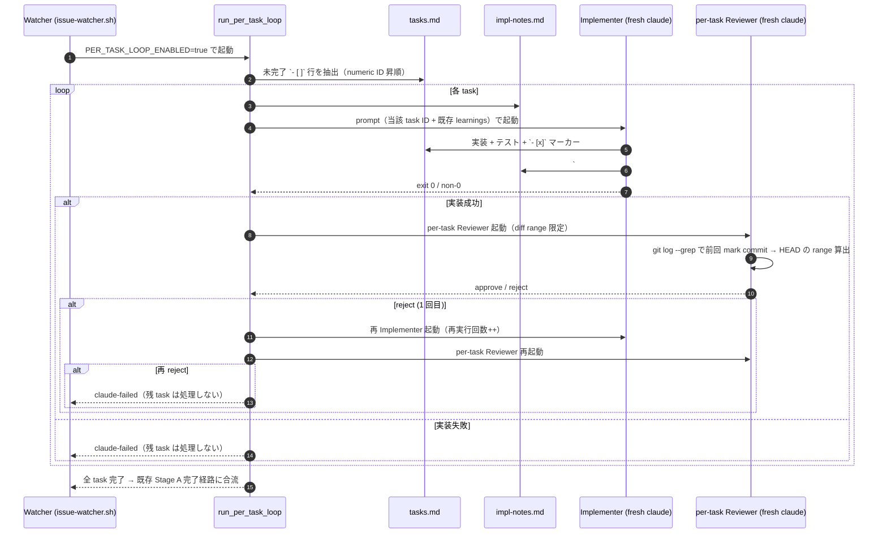
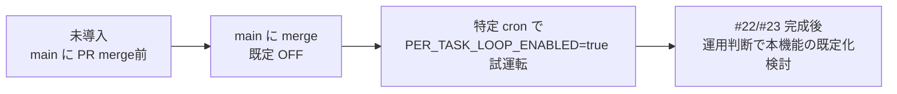

# 21: Phase 2: Per-task TDD implementation loop（tasks.md 単位で Implementer + Reviewer）

## Overview

**Purpose**: 本機能は `tasks.md` の **task 1 件ごとに fresh な Claude CLI session で
Implementer + Reviewer を起動**することによる「context の汚染を回避した小粒度 TDD」を、
既存 impl 系運用者に opt-in でのみ提供する。

**Users**: idd-claude を install 済みの運用者で、大きい Issue を「複数 task に分割した
tasks.md」で進めている開発者が、`PER_TASK_LOOP_ENABLED=true` を cron / launchd に追加して
利用する。既定では従来通り単一 Developer + 単一 Reviewer の挙動が維持される。

**Impact**: 現行の `run_impl_pipeline`（Stage A → Stage B → Stage C）の Stage A 内で
従来「Developer Claude を 1 回起動」していた箇所を、`PER_TASK_LOOP_ENABLED=true` のときに
限り「未完了 task 数だけ Developer + Reviewer ペアを順次起動するループ」に置換する。
Stage A 完了後の stage-a-verify / Stage C / 既存 reject 差し戻し / `IMPL_RESUME_*` /
`STAGE_CHECKPOINT_*` の挙動は維持する（後方互換 / NFR 1.1）。

### Goals

- `tasks.md` の未完了 task を numeric ID 順に 1 件ずつ fresh Claude session で実装し、各 task の
  commit range に絞った fresh Reviewer で AC / boundary 検証する小粒度パイプラインを追加する
- `### Task <id>` 形式で `impl-notes.md` に積み上げる learnings を後続 task の Implementer
  prompt に注入し、context 揮発による方針ブレを抑制する
- 既存 #67（`IMPL_RESUME_PRESERVE_COMMITS` / `IMPL_RESUME_PROGRESS_TRACKING`）と #20
  （Reviewer round=1/2 差し戻し）の規約を **そのまま流用**し、再実装しない
- `PER_TASK_LOOP_ENABLED` 未指定 / `=false` 時は本機能導入前と user-observable に完全同一の
  挙動を維持する

### Non-Goals

- per-task の **並列実行**（task 単位 worktree 分離。Issue 単位の並列は #16 で既出）
- 累積 turn 数による Opus → Sonnet 自動 downgrade（Phase 3 / #22 以降の領分）
- Debugger サブエージェントの起動（Phase 3 / #22）
- Feature Flag Protocol の per-task 統合（Phase 4 / #23）
- `.github/workflows/issue-to-pr.yml`（Actions 版）への per-task 移植
- `IMPLEMENTER_MODEL` / `IMPLEMENTER_MAX_TURNS` 等の新 env var の導入（既存 `DEV_MODEL` /
  `DEV_MAX_TURNS` / `REVIEWER_MODEL` / `REVIEWER_MAX_TURNS` を流用）
- `PER_TASK_LOOP_ENABLED=true` の既定化スケジュール / deprecation 期間設計

## Architecture Pattern & Boundary Map

### Existing Architecture Analysis

- 現行 `run_impl_pipeline`（`local-watcher/bin/issue-watcher.sh` 内）は **Stage A → stage-a-verify →
  Stage B（Reviewer round=1）→ [reject 時 Stage A' → Stage B round=2] → Stage C** の固定線形
  パイプライン
- Stage A は `build_dev_prompt_a` で `claude --print --model "$DEV_MODEL" --max-turns "$DEV_MAX_TURNS"`
  を **1 回**起動。Developer が tasks.md 全件を 1 session で消化する設計
- `IMPL_RESUME_PRESERVE_COMMITS=true` の場合のみ Stage A prompt 末尾に進捗追跡セクションを
  注入し、`docs(tasks): mark <id> as done` commit を Developer 側に書かせる規約
- Reviewer (Stage B) は HEAD 全体（`$BASE_BRANCH..HEAD`）を 1 回でレビュー。task 単位の
  diff range は持たない
- `STAGE_CHECKPOINT_ENABLED=true` で Stage A/B/C の checkpoint resume が走るが、per-task の
  resume 単位ではない

### 採用パターン: Stage A 内サブループ + Strategy 分岐

本機能は **Stage A の内側で per-task loop に分岐する Strategy パターン**を採用する。
パイプライン全体（Stage A → verify → Stage B → Stage C）の段階は維持し、Stage A 1 段の
**実体**を「単一 Developer 起動」と「per-task loop ヘルパー」の 2 系統に切り替える。

**根拠**:

- 既存 Stage B / Stage A' / Stage C / stage-a-verify / Stage Checkpoint resume / `BASE_BRANCH`
  ガード / push verify は **per-task loop の外側でそのまま機能**するため、外側パイプラインを
  改変しない
- per-task loop 内部の Reviewer は **task 単位の独立 Reviewer**（Stage B とは別軸）であり、
  Stage B（HEAD 全体の最終 Reviewer）は **per-task loop の終端で 1 回だけ走る**形に保つことで、
  既存 #20 規約の「Reviewer round=1/2 差し戻し」の意味を温存する
- per-task loop 終了後の HEAD 状態は「単一 Developer 起動」終了後と diff 等価（commit が
  細かく積まれているだけ）なので、stage-a-verify / Stage B / Stage C は変更不要

### per-task loop シーケンス図



## Technology Stack

| Layer | Choice / Version | Role in Feature | Notes |
|---|---|---|---|
| Orchestration / CLI | bash 4+ (`set -euo pipefail`) | per-task dispatcher / launcher / diff range resolver | 既存 watcher と同一実装言語 |
| AI Runtime | `claude` CLI (`--print --model ... --max-turns ...`) | fresh Implementer / Reviewer 起動 | 既存 `DEV_MODEL` / `REVIEWER_MODEL` / `DEV_MAX_TURNS` / `REVIEWER_MAX_TURNS` を流用 |
| VCS / Diff | `git log --grep` / `git diff <prev>..<curr>` | task 単位 diff range 特定 | 既存 commit 規約 `docs(tasks): mark <id> as done`（#67 / #112）に密結合 |
| Issue Coordination | `gh` CLI | `claude-failed` 付与 / Issue コメント | 既存 `mark_issue_failed` を流用 |
| Static Analysis | `shellcheck` / `actionlint` | NFR 4.1, NFR 4.2 | 既存 CI と同一 |
| Storage | `docs/specs/<N>-<slug>/` | `tasks.md` / `impl-notes.md` 配置 | 既存規約 |

## File Structure Plan

### Modified Files

```
local-watcher/bin/issue-watcher.sh
├── 環境変数 config block（行 280 周辺）
│   └── PER_TASK_LOOP_ENABLED / PER_TASK_MAX_TASKS の追加
│       （正規化ループへの追加は行わない。値は受領時に正規化する）
├── Reviewer Gate セクション（行 5676 周辺）
│   └── per-task loop ヘルパー関数群を追加（新セクション）:
│       - pt_log（per-task ロガー、rv_log と同形式）
│       - pt_extract_pending_tasks: tasks.md から未完了 `- [ ]` を numeric ID 順抽出
│       - pt_extract_learnings: impl-notes.md の `## Implementation Notes` セクションを抽出
│       - pt_resolve_diff_range: 直前 `docs(tasks): mark <id> as done` commit hash 解決
│       - build_per_task_implementer_prompt: per-task Implementer 用プロンプト組み立て
│       - build_per_task_reviewer_prompt: per-task Reviewer 用プロンプト組み立て
│       - run_per_task_implementer <task_id>: claude --print で fresh Implementer 起動
│       - run_per_task_reviewer <task_id> <range_start_sha>: fresh Reviewer 起動 + RESULT 抽出
│       - run_per_task_loop: 上記の dispatcher（pending タスクをループ）
├── run_impl_pipeline（行 6721 周辺）
│   └── Stage A 実行直前で PER_TASK_LOOP_ENABLED 判定し、true なら
│       run_per_task_loop を呼ぶ Strategy 分岐を挿入

repo-template/.claude/agents/developer.md
└── 「per-task ループ下での Implementer の責務」節を末尾に追加
    （既存節は改変せず追記のみ）

repo-template/.claude/agents/reviewer.md
└── 「per-task ループ下での Reviewer の責務」節を末尾に追加
    （既存節は改変せず追記のみ）

README.md
└── 「オプション機能（標準有効 / 常時有効）一覧」表の「opt-in（既定 OFF）」サブセクションに
    `PER_TASK_LOOP_ENABLED` 行を追加（行 1092 周辺）
└── 専用解説節「Per-task TDD Implementation Loop (#21)」を追加
    （既存「impl-resume Branch Protection (#67)」/「Stage Checkpoint (#68)」と同一構造）

docs/specs/21-phase-2-per-task-tdd-implementation-loop/
├── requirements.md（PM 完了済み）
├── design.md（本ファイル）
├── tasks.md（次ファイル）
└── impl-notes.md（Developer が実装中に作成。各 task の learnings を `### Task <id>` で蓄積）
```

### 変更しないファイル

- `install.sh` / `setup.sh`（env var の追加は cron / launchd 側で行う運用なので installer 改変不要）
- `.github/workflows/issue-to-pr.yml`（Out of Scope）
- `.github/scripts/idd-claude-labels.sh`（既存ラベルのみ流用）
- `local-watcher/bin/triage-prompt.tmpl`（Triage の挙動は不変）

## Requirements Traceability

| Requirement | Summary | Components | Interfaces / Flow |
|---|---|---|---|
| 1.1 | flag OFF で従来挙動維持 | run_impl_pipeline / Strategy 分岐 | `PER_TASK_LOOP_ENABLED != "true"` で従来 Stage A path |
| 1.2 | flag ON で per-task loop 起動 | run_per_task_loop | Strategy 分岐の true 側 |
| 1.3 | flag 値正規化 `true` / `false` 2 値 | env normalization | `[ "$PER_TASK_LOOP_ENABLED" = "true" ]` のみ true 扱い |
| 1.4 | 既存 env 名の意味不変 | （守る対象） | 新 env は `PER_TASK_*` 名前空間に限定 |
| 1.5 | cron / launchd 文字列不変 | （守る対象） | 既定 OFF で自動的に達成 |
| 2.1 | numeric ID 順で 1 件ずつ抽出 | pt_extract_pending_tasks | `sort -V` で numeric 階層 ID をソート |
| 2.2 | fresh Claude session で起動 | run_per_task_implementer | `claude --print` を新プロセス起動 |
| 2.3 | numeric ID のみ受理 | pt_extract_pending_tasks | regex `^- \[ \] ([0-9]+(\.[0-9]+)*) ` のみマッチ |
| 2.4 | task 完了で `- [x]` + 専用 commit | per-task Implementer prompt | `IMPL_RESUME_PROGRESS_TRACKING` 規約を流用し、prompt に明示注入 |
| 2.5 | 親 task の完了昇格 | per-task Implementer prompt | 既存 #67 規約と同じ親完了判定 |
| 2.6 | Implementer 非 0 exit で claude-failed | run_per_task_loop / mark_issue_failed | 既存 `mark_issue_failed "per-task-implementer"` |
| 2.7 | 全完了状態は no-op | pt_extract_pending_tasks | pending 空なら即 return 0 |
| 3.1 | task 単位 fresh Reviewer 起動 | run_per_task_reviewer | `claude --print` を新プロセス起動 |
| 3.2 | diff range は当該 task の commit のみ | pt_resolve_diff_range | `git log --grep="^docs(tasks): mark <id> as done$"` で SHA 取得 |
| 3.3 | Reviewer の判定カテゴリ流用 | per-task Reviewer prompt | reviewer.md の 3 カテゴリ（AC 未カバー / missing test / boundary 逸脱）を踏襲 |
| 3.4 | reject 時の差し戻しは #20 規約流用 | run_per_task_loop | 同一 task で Implementer 再起動 1 回 → 再 reject で claude-failed |
| 3.5 | approve で次 task | run_per_task_loop | loop continue |
| 3.6 | 再 reject で残 task 処理停止 | run_per_task_loop | 即 return 1（後続 PjM も起動しない） |
| 3.7 | Reviewer 最大 2 回 / task | run_per_task_loop | 局所カウンタで cap |
| 4.1 | Implementer が learnings 追記 | per-task Implementer prompt | 「`### Task <id>` を `## Implementation Notes` 配下に append」を明示注入 |
| 4.2 | 既存 learnings 改変禁止 | per-task Implementer prompt | 「先行 task の `### Task <id>` を改変・削除・並び替えしない」を明示注入 |
| 4.3 | 後続 prompt に learnings 注入 | pt_extract_learnings / build_per_task_implementer_prompt | `## Implementation Notes` セクション全体を heredoc 埋め込み |
| 4.4 | セクション外を改変しない | per-task Implementer prompt | 「`## Implementation Notes` 以外を改変しない」を明示注入 |
| 4.5 | 1 task の Issue でも完結 | run_per_task_loop | pending 1 件のループは 1 周で抜ける（learnings 空でも問題なし） |
| 5.1 | resume で未完了の先頭から | pt_extract_pending_tasks | `- [x]` は抽出されないため自動的に skip |
| 5.2 | resume で全完了なら no-op | run_per_task_loop | 既存 Stage A skip 経路と整合（pending 空で 0 return） |
| 5.3 | `IMPL_RESUME_*` 契約遵守 | （守る対象） | per-task loop は既存 Stage A の中で起動し、Stage Checkpoint resume / RESUME_PRESERVE と直交 |
| 5.4 | 既存 learnings を保持して注入 | pt_extract_learnings | impl-notes.md は base ブランチ / 既存 commit から既に存在しており、Implementer は append のみ |
| 6.1 | README に opt-in 手順 | README.md | オプション機能一覧 + 専用節 |
| 6.2 | README に新挙動説明 | README.md | 専用節「Per-task TDD Implementation Loop (#21)」 |
| 6.3 | developer.md に責務追記 | repo-template/.claude/agents/developer.md | 末尾節追加 |
| 6.4 | reviewer.md に責務追記 | repo-template/.claude/agents/reviewer.md | 末尾節追加 |
| 6.5 | README に Migration Note + コスト記述 | README.md | 専用節内に「累積コスト 3〜5 倍」明記 |
| NFR 1.1 | flag OFF で既存 Issue 不変 | （守る対象） | Strategy 分岐で構造的に保証 |
| NFR 1.2 | 既存ラベル不変 | （守る対象） | 既存 `claude-failed` / `needs-iteration` 等の付与契約のみ流用 |
| NFR 1.3 | exit code / ログ形式不変 | pt_log / run_per_task_loop | 既存 `rv_log` と同フォーマット、戻り値 0/1 のみ |
| NFR 1.4 | #67 / #20 契約不変 | （守る対象） | 流用のみ、再定義しない |
| NFR 2.1 | 4 イベントを LOG に記録 | pt_log | per-task: implementer start / implementer end / reviewer start / reviewer end の 4 行 |
| NFR 2.2 | 各 ログに `task=<id>` | pt_log | `pt_log "task=$id ..."` 形式 |
| NFR 2.3 | reject 時に task ID / カテゴリ / req ID | run_per_task_reviewer | `parse_review_result` 結果を pt_log に出力 |
| NFR 3.1 | README にコスト記述 | README.md | 「累積コスト現状の 3〜5 倍」明記 |
| NFR 4.1 | shellcheck クリーン | issue-watcher.sh | 実装中に `shellcheck` を回す（手動スモーク） |
| NFR 4.2 | actionlint クリーン | （守る対象） | YAML 変更がないため自動的に達成 |

## Components and Interfaces

### Watcher Layer（`local-watcher/bin/issue-watcher.sh`）

#### `run_per_task_loop`（per-task dispatcher）

| Field | Detail |
|---|---|
| Intent | Stage A の代替実体として、未完了 task を 1 件ずつ Implementer + Reviewer で消化する |
| Requirements | 2.1, 2.6, 2.7, 3.4, 3.5, 3.6, 3.7, 5.1, 5.2, NFR 2.1 |

**Responsibilities & Constraints**

- `PER_TASK_LOOP_ENABLED=true` の時のみ呼ばれる（呼び出し側で gate）
- `pt_extract_pending_tasks` で抽出した未完了 task を numeric ID 順に 1 件ずつ処理
- 各 task について `run_per_task_implementer` → `run_per_task_reviewer` を順に起動
- reject 時は同一 task に対して Implementer 再起動 1 回 + Reviewer 再起動 1 回まで（#20 規約準拠）
- 再 reject / Implementer 非 0 exit / Reviewer 異常終了で `mark_issue_failed` → 即 return 1
- pending 空での突入は即 return 0（Stage A 完了相当 / Req 2.7 / 5.2）
- `PER_TASK_MAX_TASKS` が設定されていれば上限超過時に return 1 + claude-failed（暴走防止）

**Dependencies**

- Inbound: `run_impl_pipeline`（Stage A 分岐） — call (Critical)
- Outbound: `pt_extract_pending_tasks` / `run_per_task_implementer` / `run_per_task_reviewer` /
  `pt_resolve_diff_range` / `mark_issue_failed` — call (Critical)
- External: `claude` CLI / `git` / `gh` — process (Critical)

**Contracts**: Service [x] / API [ ] / Event [ ] / Batch [ ] / State [ ]

##### Service Interface

```bash
# 戻り値:
#   0 = 全 task 消化成功（Stage A 完了相当）または pending 0 件で no-op
#   1 = Implementer / Reviewer 失敗で claude-failed 付与済み（呼び出し側は伝搬 return 1）
run_per_task_loop() {
  # 入力 (環境変数経由): NUMBER, BRANCH, SPEC_DIR_REL, LOG, REPO, REPO_DIR,
  #                      DEV_MODEL, DEV_MAX_TURNS, REVIEWER_MODEL, REVIEWER_MAX_TURNS,
  #                      PER_TASK_MAX_TASKS
  ...
}
```

- Preconditions: `cwd == $REPO_DIR`、`tasks.md` が `$SPEC_DIR_REL` 配下に存在
- Postconditions: 成功時は全 task が `- [x]` 化 + `docs(tasks): mark <id> as done` commit
  が積まれている。失敗時は claude-failed 付与済
- Invariants: 既存 Stage B / Stage A' / Stage C を起動しない（Stage A の代替実体）

---

#### `pt_extract_pending_tasks`（pending 抽出）

| Field | Detail |
|---|---|
| Intent | tasks.md から未完了 task の numeric ID を numeric 階層昇順で抽出 |
| Requirements | 2.1, 2.3, 5.1 |

**Responsibilities & Constraints**

- 入力: `$SPEC_DIR_REL/tasks.md` のパス
- regex で `^- \[ \] ([0-9]+(\.[0-9]+)*) ` 行（先頭に `*` のない子・親 task）のみマッチ
- deferrable test task（`- [ ]*`）は本ループの対象外（既存規約と整合）
- 親子混在を許容（親 `1.` と子 `1.1` がどちらも未完了なら子を先に処理）
- numeric 階層 ID 昇順は `sort -V` で実現（`1.10` > `1.2` を保証）

##### Service Interface

```bash
# stdout に未完了 task ID（numeric 階層 ID）を 1 行 1 件で出力
# 戻り値: 0 = 抽出成功（空でもよい） / 1 = tasks.md 不在
pt_extract_pending_tasks <tasks_md_path>
```

---

#### `pt_extract_learnings`（learnings 抽出）

| Field | Detail |
|---|---|
| Intent | `impl-notes.md` の `## Implementation Notes` セクション全体を抽出して Implementer prompt に注入 |
| Requirements | 4.3, 4.4, 4.5, 5.4 |

**Responsibilities & Constraints**

- 入力: `$SPEC_DIR_REL/impl-notes.md` のパス
- `## Implementation Notes` 見出しから「次の `## ` 見出しが現れる直前まで」を抽出
- セクションが存在しない / `impl-notes.md` 自体が無い場合は空文字を返す（Req 4.5 / 単一 task 許容）
- セクション外（補足ノート・確認事項）には触れない

##### Service Interface

```bash
# stdout に `## Implementation Notes` セクション本文（heading 含む）を出力
# 戻り値: 0 = 常に成功（空でもよい）
pt_extract_learnings <impl_notes_path>
```

---

#### `pt_resolve_diff_range`（diff range 特定）

| Field | Detail |
|---|---|
| Intent | per-task Reviewer に渡す diff range の開始 SHA を解決 |
| Requirements | 3.2, NFR 2.3 |

**Responsibilities & Constraints**

- 当該 task の直前に積まれた `docs(tasks): mark <id> as done` commit を「range start」とする
- 当該 task の `mark <task_id> as done` commit を「range end」とする
- 親 task のみが完了済（昇格 commit）の場合も同じ commit 規約で識別される
- 子 task が混在するケース: 子 `1.1` の直前 mark commit は `1.0` または親 `1` 完了 commit 等。
  実用上は「自分自身の直前の `docs(tasks): mark` commit」を range start にすればよい
- 仕様確定: **`git log --grep="^docs(tasks): mark " --format=%H` で時系列 SHA 一覧を取得し、
  当該 task の mark commit 1 つ前を range start、当該 commit 自体を range end**
  - 初回 task（先行 mark commit 無し）の場合は `range start = $BASE_BRANCH` を使う
  - resume 経由で既に origin/branch に mark commit が積まれているケースも `BASE_BRANCH..HEAD`
    範囲を見るため同ロジックで動く

##### Service Interface

```bash
# stdout に "<range_start_sha>\t<range_end_sha>" を 1 行で出力
# range_start_sha: 直前の mark commit、または初回時は $BASE_BRANCH の SHA
# range_end_sha:   当該 task の mark commit SHA（== HEAD 直近の mark commit）
# 戻り値: 0 = 解決成功 / 1 = 当該 task の mark commit が見つからない
pt_resolve_diff_range <task_id>
```

---

#### `run_per_task_implementer`（per-task Implementer launcher）

| Field | Detail |
|---|---|
| Intent | 当該 task 1 件のみを対象に fresh Claude session で Implementer を起動 |
| Requirements | 2.2, 2.3, 2.4, 2.5, 2.6, 4.1, 4.2, 4.4, NFR 1.3, NFR 2.1, NFR 2.2 |

**Responsibilities & Constraints**

- prompt 組み立ては `build_per_task_implementer_prompt <task_id>`
- `claude --print --model "$DEV_MODEL" --max-turns "$DEV_MAX_TURNS" --permission-mode bypassPermissions`
  でサブプロセス起動（既存 Stage A 起動と同形式）
- Quota-Aware Watcher (`qa_run_claude_stage`) を経由（既存 #66 規約を流用 / 99 quota signal も
  従来通り処理）
- 戻り値: 0 = 成功 / 1 = 非 0 exit（claude-failed は呼び出し側で付与） / 99 = quota
- pt_log に開始 / 終了イベントを記録（`task=<id>` 含む / NFR 2.1, 2.2）

##### Service Interface

```bash
# 戻り値: 0=success / 1=claude非0exit / 99=quota-exceeded（既存 Stage 経路と同一）
run_per_task_implementer <task_id>
```

##### Prompt Contract（build_per_task_implementer_prompt の出力）

prompt には以下を含める（heredoc で組み立て）:

1. 対象 Issue / BRANCH / SPEC_DIR_REL の情報（既存 prompt と同形式）
2. **本 task 1 件のみを実装する制約**: 「あなたは tasks.md の `<task_id>` 1 件のみを実装する。
   他の未完了 task に着手しない」
3. 既存 `IMPL_RESUME_PROGRESS_TRACKING=true` と同じ「`- [x]` 化 + `docs(tasks): mark <id> as done`
   commit」の規約（Req 2.4, 2.5）
4. 親 task 完了判定の規約（子全完了で親も `- [x]` 昇格 / Req 2.5）
5. **learnings 追記の規約**（Req 4.1, 4.2, 4.4）:
   - `impl-notes.md` の `## Implementation Notes` セクション配下に `### Task <id>` 見出しを
     追加し、当該 task の learning（採用方針 / 重要な判断 / 残存課題）を記す
   - 先行 task の `### Task <id>` 見出しは **改変・削除・並び替えしない**
   - `## Implementation Notes` セクション外（補足ノート / 確認事項）には触れない
6. **既存 learnings の埋め込み**（Req 4.3）: `pt_extract_learnings` の出力（先行 task の
   `### Task <id>` 群）を markdown block として inline 埋め込み
7. PR 作成禁止 / requirements / design / tasks 本文の改変禁止（既存 Stage A 制約と同等）
8. `IMPL_RESUME_PRESERVE_COMMITS=true` で既存 origin branch から resume している場合の
   既存 commit 温存規約（既存 Stage A prompt と同形）

---

#### `run_per_task_reviewer`（per-task Reviewer launcher）

| Field | Detail |
|---|---|
| Intent | 当該 task の diff range のみを対象に fresh Reviewer を起動 |
| Requirements | 3.1, 3.2, 3.3, 3.4, 3.7, NFR 2.1, NFR 2.2, NFR 2.3 |

**Responsibilities & Constraints**

- `pt_resolve_diff_range <task_id>` で range start / end SHA を解決
- prompt 組み立ては `build_per_task_reviewer_prompt <task_id> <range_start_sha> <range_end_sha>`
- `claude --print --model "$REVIEWER_MODEL" --max-turns "$REVIEWER_MAX_TURNS"` で起動
- Reviewer は `$SPEC_DIR_REL/review-notes.md` に書く（既存と同パス。**上書き許容**で round
  ごとに最新が残る形を踏襲）
- `parse_review_result` で `approve` / `reject` / 異常 を抽出
- 戻り値: 0 = approve / 1 = reject / 2 = 異常 / 99 = quota（既存 `run_reviewer_stage` と同形）

##### Service Interface

```bash
# 戻り値: 0=approve / 1=reject / 2=異常終了 / 99=quota
run_per_task_reviewer <task_id> <round>
```

##### Prompt Contract（build_per_task_reviewer_prompt の出力）

prompt には以下を含める:

1. 対象 Issue / BRANCH / SPEC_DIR_REL / ROUND（1 または 2）
2. **判定対象の diff range の明示**（Req 3.2）:
   - range start commit: `<range_start_sha>` （= 直前の `docs(tasks): mark` commit、または初回時は `$BASE_BRANCH`）
   - range end commit: `<range_end_sha>` （= 当該 task の mark commit、典型的に HEAD）
   - reviewer 自身が Bash で `git diff <range_start>..<range_end>` /
     `git log --oneline <range_start>..<range_end>` を実行する
3. **判定 depth の絞り込み**（Open Question 4 の設計確定）:
   - 「当該 task の `_Requirements:_` に列挙された AC のみを verify 対象とする」
   - 「全 AC verify は最終 Stage B Reviewer（HEAD 全体）で行うため、本 Reviewer では未参照 AC を
     reject 理由にしない」
   - ただし `_Boundary:_` 違反は depth に依らず常に reject 対象（task 単位の境界逸脱検出は本機能の主目的）
4. 既存 reviewer.md の 3 カテゴリ（AC 未カバー / missing test / boundary 逸脱）と RESULT 行
   フォーマットを流用（Req 3.3）
5. PREV_RESULT（round=2 のみ。round=1 は `(none)`）— 既存 Stage B Reviewer と同形

---

#### Strategy 分岐: `run_impl_pipeline` への組み込み

```bash
# run_impl_pipeline 内、Stage A 起動直前に挿入:
case "$START_STAGE" in
  A)
    if [ "${PER_TASK_LOOP_ENABLED:-false}" = "true" ]; then
      echo "--- Stage A 実行（$MODE / per-task loop）---" >> "$LOG"
      run_per_task_loop || return 1
      echo "✅ #$NUMBER: Stage A 完了（per-task loop）" | tee -a "$LOG"
    else
      # 既存の build_dev_prompt_a → qa_run_claude_stage → verify_pushed_or_retry の経路
      ...（既存コード）
    fi
    ;;
  B|C)
    sc_log "Stage A をスキップ ..."
    ...
    ;;
esac
```

**重要な不変条件**:

- per-task loop 内では Implementer が `docs(tasks): mark <id> as done` を **逐次 commit + push**
  する規約。loop 全体終了時点で push 状態は ahead=0 であるべきだが、Implementer の push 漏れに
  備えて既存 `verify_pushed_or_retry "stageA-push-missing" "$BRANCH" "Stage A"` を loop 終了後に
  **そのまま流用**する（追加実装不要）
- `stage-a-verify` は per-task loop 完了後にそのまま走る（既存挙動 / NFR 1.3）

### Agent Layer（`repo-template/.claude/agents/*.md`）

#### Developer Agent（per-task ループ責務）

| Field | Detail |
|---|---|
| Intent | per-task 起動時の Implementer の責務を明文化（既存節は改変せず追記） |
| Requirements | 6.3, 2.4, 2.5, 4.1, 4.2 |

追記節（developer.md 末尾）の骨子:

```markdown
## per-task ループ下での Implementer の責務（PER_TASK_LOOP_ENABLED=true 適用時のみ）

watcher が PER_TASK_LOOP_ENABLED=true で起動した場合、Stage A 内で **task 1 件ごとに fresh な
Claude session** で本 Developer サブエージェントが起動されます。本節は per-task 起動時に
追加で適用される責務であり、既存節と矛盾する場合は本節を優先します。

### 適用範囲
- 1 起動で実装する task は **prompt で指定された 1 件のみ**。他の未完了 task に着手しない
- `tasks.md` の進捗マーカー更新（`- [ ]` → `- [x]`）は当該 task と、子全完了で昇格する親 task のみ
- 進捗 commit は `docs(tasks): mark <id> as done`（既存 #67 規約と同一）

### learning 追記の責務
- 完了時に `impl-notes.md` の `## Implementation Notes` セクション配下へ `### Task <id>` 見出しを
  追加し、当該 task の learning（採用方針 / 重要な判断 / 残存課題）を記す
- 先行 task の `### Task <id>` 見出しは改変・削除・並び替えしない
- `## Implementation Notes` セクション外（補足ノート / 確認事項）には触れない

### 既存 learnings の利用
- prompt に inline 埋め込みされた「これまで完了した task 群の learnings」を必ず参照し、命名
  規約・採用ライブラリ・運用判断との一貫性を維持する
- learnings と矛盾する判断が必要な場合は、`### Task <id>` 内に「先行判断との差異と根拠」を
  明記する（先行 learning の改変はしない）
```

#### Reviewer Agent（per-task ループ責務）

| Field | Detail |
|---|---|
| Intent | per-task 起動時の Reviewer の責務を明文化（既存節は改変せず追記） |
| Requirements | 6.4, 3.3, 3.2 |

追記節（reviewer.md 末尾）の骨子:

```markdown
## per-task ループ下での Reviewer の責務（PER_TASK_LOOP_ENABLED=true 適用時のみ）

watcher が PER_TASK_LOOP_ENABLED=true で起動した場合、Implementer 1 回完了ごとに fresh な
Claude session で本 Reviewer サブエージェントが起動されます。本節は per-task 起動時に
追加で適用される責務であり、既存節と矛盾する場合は本節を優先します。

### 判定対象 diff range の限定
- prompt に渡される `<range_start_sha>` / `<range_end_sha>` の範囲のみを対象に
  `git diff` / `git log` を実行する
- HEAD 全体（`$BASE_BRANCH..HEAD`）は対象外（全体観点は最終 Stage B Reviewer が担当）

### 判定 depth の絞り込み
- 判定対象 AC は **当該 task の `_Requirements:_` で列挙された numeric ID のみ**
- それ以外の AC が当該 diff で未カバーであっても reject 理由にしない
- `_Boundary:_` 違反は depth に関わらず常に reject 対象（task 単位境界の逸脱検出が本機能の主目的）

### 既存規約の流用
- 判定カテゴリは既存の 3 つ（AC 未カバー / missing test / boundary 逸脱）のみ
- RESULT 行フォーマット / 1 ファイル限定（review-notes.md）/ 装飾禁止規律はすべて流用
```

## Data Models

### tasks.md（既存規約を流用）

- `- [ ] <id> <title>` / `- [x] <id> <title>` の 1 行 1 task 形式
- `<id>` は numeric 階層 ID（`1`, `1.1`, `1.10` ...）
- deferrable は `- [ ]*` で先頭にアスタリスク（per-task loop 対象外）
- `_Requirements:_` / `_Boundary:_` / `_Depends:_` アノテーションは既存規約のまま

### impl-notes.md における learnings 構造（本機能で追加）

```markdown
（既存の補足ノート / 確認事項 セクション群）

## Implementation Notes

### Task 1.1
- 採用方針: <短い説明>
- 重要な判断: <理由を含む 1〜3 行>
- 残存課題: <次 task に影響する事項 / なし>

### Task 1.2
- 採用方針: ...
- ...

### Task 2.1
- ...
```

**規約**:

- 見出しは厳密に `### Task <numeric_id>`（半角スペース 1 個、`Task` は大文字始まり、ID は
  numeric 階層）
- 各 `### Task <id>` 配下の本文形式は **自然言語の markdown list**（YAML / 表 / 行単位ログより
  人間レビュー時の可読性が高く、Implementer の自然言語出力と整合 / Open Question 2 の設計確定）
- 既存先行 task の見出し / 本文を改変・削除・並び替えしない（Req 4.2）
- `## Implementation Notes` 見出し自体は Implementer が初回 task で初めて追加してよい
  （impl-notes.md 自体が存在しない場合も初回 Implementer が作成する）

### commit message 規約（既存 #67 / #112 を流用）

- 実装 commit: `feat(scope): ...` / `test(scope): ...` / 等の Conventional Commits（複数可）
- 進捗マーカー commit: `docs(tasks): mark <id> as done`（1 task につき 1 commit、`tasks.md`
  のみを含む）
- 親 task 昇格時も同じ message 形式（`docs(tasks): mark <parent_id> as done`、`<parent_id>` は親 ID）
- learnings commit: 実装 commit と同居して構わない（`impl-notes.md` を含む `feat` / `docs(notes):` 等）。
  diff range 検出は **`docs(tasks): mark ` 完全一致**のみで行うため、learnings commit は range
  境界に影響しない

### diff range 解決アルゴリズム（Open Question 3 の設計確定）

```
# 当該 task <task_id> の Reviewer が見るべき range:
all_marks = git log --grep="^docs(tasks): mark " --format=%H \
              --reverse $BASE_BRANCH..HEAD
# all_marks は時系列昇順の SHA リスト

current_mark = git log --grep="^docs(tasks): mark $task_id as done$" \
                 --format=%H $BASE_BRANCH..HEAD | tail -1

if all_marks の中で current_mark の直前要素が存在:
  range_start = <直前要素 SHA>
else:
  range_start = $BASE_BRANCH

range_end = current_mark
```

**根拠（採用案）**:

- 既存 #67 / #112 で確立した `docs(tasks): mark <id> as done` commit 規約を再利用するため、
  Implementer / 既存規約への変更不要
- commit trailers（`Task-Id: 1.2` 等）案は規約変更を伴うため、本機能では採用しない（既存 prompt
  注入規約と二重管理になる）
- 親 task 昇格 commit も同じ grep で拾えるため、子 → 親順に積まれる commit でも range は連続性を持つ

## Error Handling

### Error Strategy

per-task loop 内のエラーは既存 `mark_issue_failed` 経路に集約し、`claude-failed` ラベル付与 +
Issue コメントで人間にエスカレーションする。`needs-quota-wait` 経路（quota 99）は既存
`qa_handle_quota_exceeded` をそのまま流用し、quota Resume Processor が自動再開する。

### Error Categories and Responses

- **Implementer 非 0 exit (claude crash / max-turns 到達)**:
  - `mark_issue_failed "per-task-implementer-failed" "<body>"` で `claude-failed` 付与
  - Issue コメントに task ID / 失敗理由 / `LOG` パスを含める
  - 残 task の処理は行わない（Req 2.6）

- **Implementer quota exceeded (rc=99)**:
  - 既存 `qa_handle_quota_exceeded` で `needs-quota-wait` 付与 + Issue Watcher は正常終了
  - 次 cron tick で `qa_resume_processor` が解除すれば、impl-resume モードで本 task の続きから再開
  - resume 時は `pt_extract_pending_tasks` が既完了 task を skip するため自然に未完了先頭から再開（Req 5.1）

- **Reviewer reject 初回**:
  - 既存 `build_dev_prompt_redo` と同等の prompt を per-task 用に組み立てて Implementer を再起動
  - 再 reject は次項へ

- **Reviewer reject 再回（round=2 相当）**:
  - `mark_issue_failed "per-task-reviewer-reject2" "<body>"` で `claude-failed` 付与
  - Issue コメントに task ID / reject カテゴリ / 対象 requirement ID（`parse_review_result` 結果）/
    review-notes.md パスを含める
  - 残 task の処理は行わない（Req 3.6）

- **Reviewer 異常終了 (claude crash / parse 失敗)**:
  - `mark_issue_failed "per-task-reviewer-error" "<body>"` で `claude-failed` 付与
  - 残 task の処理は行わない

- **`pt_resolve_diff_range` 失敗**:
  - 当該 task の mark commit が見つからない＝ Implementer の規約違反 → Reviewer 起動前に
    `mark_issue_failed "per-task-diff-range-failed"` で claude-failed 化

- **`PER_TASK_MAX_TASKS` 超過**:
  - 安全装置。N 件目の Implementer 起動前に「上限到達」を Issue コメント + claude-failed で停止
  - 既定値は **無制限**（環境変数未設定 / `0` / 空文字で無制限と解釈）

### 観測可能性（NFR 2.1, 2.2, 2.3）

`pt_log` は以下を `$LOG` に append:

```
[YYYY-MM-DD HH:MM:SS] per-task: task=1.1 implementer start (model=claude-opus-4-7, max-turns=60)
[YYYY-MM-DD HH:MM:SS] per-task: task=1.1 implementer end rc=0
[YYYY-MM-DD HH:MM:SS] per-task: task=1.1 reviewer start (round=1, model=claude-opus-4-7, range=abc1234..def5678)
[YYYY-MM-DD HH:MM:SS] per-task: task=1.1 reviewer end round=1 result=approve verified=1.1
```

reject 時:

```
[YYYY-MM-DD HH:MM:SS] per-task: task=1.2 reviewer end round=1 result=reject categories=AC未カバー targets=1.2
```

## Testing Strategy

### Unit / 関数粒度（手動スモークでカバー）

- `pt_extract_pending_tasks` の numeric ID 順抽出（`1.1` / `1.2` / `1.10` の順序保証 / Req 2.1, 2.3）
- `pt_extract_pending_tasks` が `- [ ]*` を除外する（既存 deferrable 規約）
- `pt_extract_learnings` が `## Implementation Notes` のみ抽出し、他セクションを読み出さない
  （Req 4.3, 4.4）
- `pt_resolve_diff_range` が初回 task で `range_start = $BASE_BRANCH` を返す（Req 3.2 / Req 4.5）
- `pt_resolve_diff_range` が 2 件目以降で直前 mark commit を返す

### Integration（手動 E2E）

- **dry run #1**: `PER_TASK_LOOP_ENABLED` 未設定で従来 impl Issue を再走させ、外形挙動が一切
  変わらないことを確認（Req 1.1 / NFR 1.1）
- **dry run #2**: `PER_TASK_LOOP_ENABLED=true` で 2 task の test Issue を流し、per-task loop が
  Implementer → Reviewer → 次 task の順に起動することを `$LOG` で確認
- **reject 差し戻し**: 意図的に未テスト状態の commit を仕込み、per-task Reviewer が reject →
  Implementer 再起動 → approve に至る経路（Req 3.4, 3.5）
- **再 reject claude-failed**: 同一 task で 2 連続 reject を発生させ、`claude-failed` 付与
  + 残 task が処理されないことを確認（Req 3.6）
- **resume**: 途中で `claude-failed` 解除 → impl-resume 起動。既完了 task が skip され未完了先頭
  から再開すること、既存 `### Task <id>` learnings が保持されることを確認（Req 5.1, 5.4）

### E2E / dogfooding

- 本 idd-claude repo 自身を対象に、`PER_TASK_LOOP_ENABLED=true` を local-watcher 起動時に渡し、
  本 Issue #21 の impl PR 作成までを通す
- 後続の small Issue（task 1-2 件の小機能）を `PER_TASK_LOOP_ENABLED=true` で完走させ、累積
  コスト（claude CLI 起動回数 / 累積 token）と従来挙動との外形差異を比較

### 静的解析

- `shellcheck local-watcher/bin/issue-watcher.sh` で **新規警告 0 件**（NFR 4.1）
- `actionlint .github/workflows/*.yml` — YAML 変更なしで自動的に達成（NFR 4.2）

## Migration Strategy

### 段階的ロールアウト



- **Step 1**: 本 PR merge 後、既定 `PER_TASK_LOOP_ENABLED=false`（unset でも false） → 既存
  install 済み repo の cron 挙動は **完全に不変**（NFR 1.1）
- **Step 2**: 試運転したい運用者は `local-watcher/bin/issue-watcher.sh` を更新（既存 install 手順を
  そのまま流用）し、cron / launchd の `REPO=... REPO_DIR=...` に
  `PER_TASK_LOOP_ENABLED=true` を 1 つ追加するだけで opt-in
- **Step 3**: Phase 3 / 4（Debugger / Feature Flag Protocol per-task 統合）が完成し、累積コスト
  対策（Opus → Sonnet downgrade 等）が運用面で見合うと判断された段階で、既定化を別 Issue で検討

### 既存 cron / launchd への影響

- cron / launchd の登録文字列は変更不要（Req 1.5）
- 既存 env var（`DEV_MODEL` / `REVIEWER_MODEL` / `DEV_MAX_TURNS` / `REVIEWER_MAX_TURNS` /
  `IMPL_RESUME_*` / `STAGE_CHECKPOINT_*` / `QUOTA_AWARE_*` 等）の意味・既定値は不変（Req 1.4 /
  NFR 1.4）
- 進行中の Issue が cron tick 中に走り続けても、`PER_TASK_LOOP_ENABLED` 未指定なら従来の Stage A
  経路に入るため事故にならない

### 累積コスト警告（NFR 3.1）

README の専用節で以下を明記:

- per-task ループ有効化により Claude CLI 起動回数は **task 件数に比例**して増加
- 参考値: **累積コストは現状の 3〜5 倍**を想定（10 task の Issue で claude 起動が約 20〜30 回 ≒
  Implementer 10 回 + per-task Reviewer 10 回 + Stage B Reviewer 1〜2 回 + Stage C 1 回）
- `PER_TASK_MAX_TASKS` で N 件目以降を停止可能（既定無制限）

## Risks & Open Questions

### 設計判断（PM Open Questions への確定回答）

| # | Open Question | 採用案 | 根拠 |
|---|---|---|---|
| 1 | コスト上限の制御方式 | **`PER_TASK_MAX_TASKS` 安全装置のみ追加**（既定無制限）。turn-based downgrade は #22 以降 | 単純さ優先 / 設計判断を 1 つに絞る / NFR 3.1 の運用者可視性は README で担保 |
| 2 | learnings 注入フォーマット | **`### Task <id>` 段落単位の markdown list** | 人間レビュー時の可読性 / Implementer の自然言語出力との整合 / YAML / 表より regex 抽出が容易（`### Task <id>` 行で section 区切り） |
| 3 | task 単位 diff range 特定 | **`git log --grep="^docs(tasks): mark <id> as done$"` で SHA → 時系列前後で range 算出** | 既存 #67 / #112 規約をそのまま流用 / commit trailers 案は規約変更が二重コスト |
| 4 | per-task Reviewer の判定 depth | **当該 task の `_Requirements:_` 列挙 AC のみ verify、ただし `_Boundary:_` 違反は常に reject** | 全 AC verify は最終 Stage B Reviewer で実施 / 早期 reject の過剰検出を抑制 / 境界逸脱は早期検出が本機能の主目的 |
| 5 | Implementer / Reviewer の env var 分離 | **既存 `DEV_MODEL` / `DEV_MAX_TURNS` / `REVIEWER_MODEL` / `REVIEWER_MAX_TURNS` を流用** | env var 爆発抑止 / 将来必要なら別 Issue で `IMPLEMENTER_*` を導入 / Req 1.4 の既存 env 不変原則と整合 |

### 残リスク

- **コスト**: 10 task で claude 起動 20〜30 回。Claude Max の 5 時間 quota 消費が早まる
  → 既存 quota-aware watcher（#66）が `needs-quota-wait` で自動退避。設計影響なし
- **learnings の質**: Implementer が `### Task <id>` 配下に何を書くかは prompt 注入のみで規律
  化。書き忘れや低品質を防ぐ自動検証は本機能スコープ外（将来 `pt_validate_learnings` で
  「直前 task の `### Task <id>` が存在しない場合に warning」程度の防御を別 Issue で検討可能）
- **`pt_resolve_diff_range` の commit 規約依存**: Implementer が `docs(tasks): mark <id> as done`
  を厳密に守れない場合に range 解決が失敗する → `mark_issue_failed` 経路で人間判断に倒す
  （既存 #67 / #112 と同じ failure mode で、本機能で新規に脆弱性を持ち込まない）
- **per-task Reviewer の depth と Stage B Reviewer の二重判定**: per-task が approve でも Stage B
  が reject する可能性は残るが、Stage B は HEAD 全体観点なので「task 単独では問題なし、合算では
  境界逸脱」というケースのみ。設計上の想定挙動

### 確認事項（人間判断を仰ぐ事項）

- なし（PM Open Questions は本節「設計判断」で確定済み）
