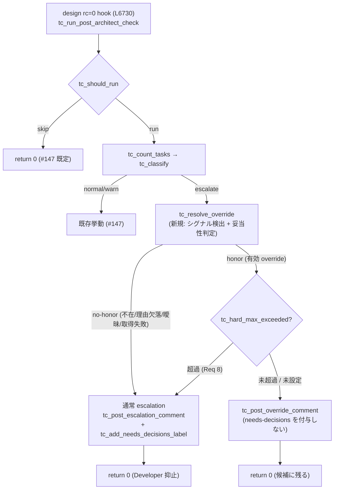

# Design Document

## Overview

**Purpose**: 本機能は **Tasks Count Gate（#147）のエスカレーション判定を、個別 Issue
単位で理由付きに例外続行（override）できる機構** を watcher 運用者に提供する。per-task-loop
（#21）運用では各タスクが独立 turn budget を持つため、1 タスクあたりは小さいまま合計件数だけが
`TC_ESCALATE_LOWER`（既定 11）以上になる正当なケースがあり、現状はガードが誤発火して
Developer 自動起動が抑止される。本機能は人間が明示宣言した override を honor し、その判断を
機械可読な証跡として恒久的に残す。

**Users**: idd-claude を self-host する watcher 運用者・レビュワーが対象。運用者は「件数が
多いが正当なので続行させたい」Issue に対し、専用ラベル `tc-override` と理由マーカーコメント
`<!-- idd-claude:tc-override reason="..." -->` を **人間操作で** 付与する。watcher は次の
design 完了サイクルで override を検出し、`needs-decisions` を付与せずに Developer 続行を許可する。

**Impact**: 現在の Tasks Count Gate は `escalate` レンジで無条件に `needs-decisions` を付与し
Developer を抑止する。本機能はこの escalate 分岐に **override 判定の分岐** を挿入し、有効な
override が存在する場合のみラベル付与をスキップして証跡コメントを残す。override シグナルが
存在しない Issue では #147 既定と **完全に同一**の挙動を維持する（NFR 1.1 / 1.3）。変更は
`local-watcher/bin/issue-watcher.sh` の TC gate 関数群への追加が中心で、新ラベル `tc-override`
を 2 系統の labels script に追加し、README を更新する。

### Goals

- 件数が `TC_ESCALATE_LOWER` 以上でも、有効な override 宣言があれば `needs-decisions` を
  付与せず Developer / impl-resume の候補に残す（Req 1, 5）
- override の honor / 無効化 / ハード上限による無視のすべてを `tasks-count:` prefix ログと
  冪等な証跡コメントで記録する（Req 2, NFR 2）
- 理由欠落・シグナル曖昧・外部情報取得失敗のすべてで安全側（エスカレーション）に倒す
  （Req 3, 4, NFR 3.1）
- watcher 自身が override シグナルを自動生成し得ないことを設計上保証する（Req 7）
- override シグナル不在時は #147 既定と差分等価であること（NFR 1）

### Non-Goals

- override シグナルの動的失効（有効期限・件数連動での自動失効）。本要件では「宣言が残る
  間は有効」のみ規定する（requirements Out of Scope）
- `TC_WARN_LOWER` / `TC_WARN_UPPER` / `TC_ESCALATE_LOWER` の既定値変更
- Architect 側 budget overflow gate（#131）・per-task-loop（#21）自体の挙動変更
- 複数リポジトリ横断での override 共有（per-issue かつ単一 repo スコープに限定）
- warn レンジ（8〜10 件）への override 適用。override は escalate レンジ（≥ `TC_ESCALATE_LOWER`）
  のみに作用する（Req 1.4 により warn / normal は本機能の影響を受けない）

## Architecture

### Existing Architecture Analysis

- **TC gate は `local-watcher/bin/issue-watcher.sh` にインライン実装**（L1314-1663 付近）。
  `local-watcher/bin/modules/` には別出しされておらず、本機能も同一ファイル内に追加する
  （既存パターンの踏襲）。
- **単一エントリポイント**: `tc_run_post_architect_check`（L1631）が design 分岐 rc=0 hook
  （L6730）から呼ばれる唯一の orchestrator。本機能の override 判定はこの orchestrator の
  `escalate` 分岐に挿入する。
- **gate**: `tc_should_run`（L1445）が opt-out / tasks.md 不在 / **既に `needs-decisions`
  付与済み** の 3 条件で skip する。3 番目の条件が override の恒久性（Req 5）に直結する
  ため、本設計で重点的に分析する（後述「override の恒久性と既存 skip 条件の関係」）。
- **候補抽出クエリ**: `_dispatcher_run`（L6899）の `search_filter` が
  `-label:"$LABEL_NEEDS_DECISIONS"` で Developer 自動起動候補を除外する。override が
  「needs-decisions を付与させない」ことで、本クエリの除外対象から自然に外れる
  （= 候補に残る、Req 1.2 / 5.1）。**本クエリ自体の変更は不要**（後述で根拠を明示）。
- **既存マーカー規約**: `<!-- idd-claude:tasks-count-overflow kind=<warning|escalation>
  issue=<N> count=<C> -->`。本機能の override シグナルマーカー（`tc-override`）と証跡マーカー
  （`tasks-count-override kind=honored`）は、この既存規約と整合する命名形式を採用する。
- **fail-open / fail-safe 原則**: 既存 tc_* 関数は `gh` 失敗時に安全側へ倒し、戻り値は常に 0
  で watcher 全体を止めない。本機能も同原則を継承する（NFR 3）。

### override の恒久性と既存 skip 条件の関係（重要な設計分析）

requirements の Req 5（恒久性）は design hook 単体では満たせない可能性があると Triage で
指摘された。以下に経路を分析し、設計の結論を確定する。

| 状況 | design hook の挙動 | 既存 `tc_should_run` 判定 | 候補抽出（L6899） | 結論 |
|---|---|---|---|---|
| 初回 design 完了 + 有効 override あり + 件数 ≥ 閾値 | escalate 分岐で **override honor → `needs-decisions` を付与しない** | run（needs-decisions 未付与） | 除外されない → 候補に残る | Req 1 / 5.1 を design hook 内で達成 |
| 後続サイクル（override 宣言残存、件数据え置き） | **design hook は再実行されない**（rc=0 hook は Architect 完了直後のみ） | — | needs-decisions が付与されていないので除外されない | 候補に残り続ける（Req 5.1） |
| override 宣言が取り除かれ件数 ≥ 閾値で次の design 完了 | escalate 分岐で通常 escalation（`needs-decisions` 付与） | run | 除外される | Req 5.2 を達成 |

**設計の結論**:

1. **design hook の escalate 分岐で「override が有効なら `needs-decisions` を付与しない」
   ことのみで Req 5.1 が成立する**。一度も `needs-decisions` が付かなければ、後続サイクルで
   候補抽出（L6899）から除外されず、Developer / impl-resume の対象に残り続ける。
   後続サイクルで design hook が再実行されなくても、ラベルが付かない状態が維持されるため
   恒久性が保たれる。
2. **候補抽出クエリ（L6899）の変更は不要**。override は「`needs-decisions` を付けさせない」
   ことで作用し、既存の除外フィルタ意味論を一切変えない（NFR 1.4）。これにより他の除外
   ラベル（`awaiting-design-review` 等）の意味も保たれる。
3. **既存 `tc_should_run` の「既に needs-decisions 付与済みなら skip」条件は変更しない**。
   override 成立前に何らかの理由で `needs-decisions` が既に付いている Issue（例: #131 由来 /
   過去サイクルの escalation）は、本機能では **対象外**（運用者がラベルを手動除去してから
   override を宣言し直す運用）。この境界を README に明記する（後述「既存挙動との互換性」）。
   この判断の根拠は「override は escalate 判定そのものへの介入であり、既に付与済みの
   ラベルを剥がす責務までは持たない」こと。ラベルの自動除去は誤動作リスクが高く、Req 7
   （bot 誤発火防止）の精神にも反するため採用しない。

### Architecture Pattern & Boundary Map

採用パターン: 既存 **orchestrator + 純粋判定関数** パターンの拡張。override 判定を独立した
純粋関数群（シグナル検出 / 妥当性判定 / 証跡記録）として追加し、orchestrator
（`tc_run_post_architect_check`）の escalate 分岐から呼ぶ。



**Architecture Integration**:

- 採用パターン: orchestrator への分岐挿入 + 純粋判定関数の追加（既存 tc_classify / tc_should_run
  と同じ「判定は純粋関数・副作用は orchestrator」設計を維持）
- ドメイン／機能境界: シグナル検出（gh API 参照）/ 妥当性判定（純粋ロジック）/ 証跡記録
  （gh comment + ログ）を別関数に分離
- 既存パターンの維持: fail-open（戻り値常に 0）、冪等マーカー、`tasks-count:` prefix ログ、
  `LABEL_*` env var 経由のラベル名参照
- 新規コンポーネントの根拠: escalate 分岐に override の honor/no-honor/hard-max の 3 経路を
  追加するため、判定の凝集度を保つには独立関数化が必要

### Technology Stack

| Layer | Choice / Version | Role in Feature | Notes |
|-------|------------------|-----------------|-------|
| CLI / Runtime | bash 4+ (`set -euo pipefail`) | TC gate 関数群の実行基盤 | 既存 `issue-watcher.sh` に準拠 |
| 外部 CLI | `gh`（Issue ラベル / コメント参照・投稿）、`jq`（JSON 抽出）、`grep`（マーカー検出） | override シグナル検出・証跡投稿 | 既存依存のみ。新規依存なし |
| 設定 | 環境変数（`TC_HARD_MAX` 新規 / `TC_ENABLED` 既存） | ハード上限・opt-out | `"${VAR:-default}"` で override 可能 |
| ラベル定義 | `idd-claude-labels.sh`（2 系統） | `tc-override` ラベルの作成 | ラベル追加のみ。既存削除/改名なし |
| ドキュメント | Markdown（README） | 運用手順・互換性 | 挙動変更と同一 PR で更新 |

## File Structure Plan

本機能は新規ディレクトリ・新規ファイルを作らず、既存ファイルへの追加・修正のみで構成する
（TC gate がインライン実装である既存構造の踏襲）。

### Directory Structure（変更対象の所在）

```
idd-claude/
├── local-watcher/bin/
│   └── issue-watcher.sh                       # TC gate 関数群 + design hook（中核変更）
│       ├── (config L324-327 付近)             # TC_HARD_MAX env var 既定値を追加
│       ├── (L62 付近 LABEL_* 定義)            # LABEL_TC_OVERRIDE="tc-override" を追加
│       ├── tc_resolve_override (新規)         # override シグナル検出 + 妥当性判定
│       ├── tc_hard_max_exceeded (新規)        # TC_HARD_MAX 超過判定（Req 8）
│       ├── tc_post_override_comment (新規)    # override honor 証跡コメント（冪等）
│       ├── tc_already_posted_marker_present   # 既存（kind=override 引数で再利用 / 改修）
│       └── tc_run_post_architect_check        # escalate 分岐に override 経路を挿入（改修）
├── .github/scripts/
│   └── idd-claude-labels.sh                    # LABELS 配列に tc-override 行を追加（idd-claude self）
├── repo-template/.github/scripts/
│   └── idd-claude-labels.sh                    # 同上（consumer repo 配布版）
└── README.md                                   # Tasks Count Gate (#147) 節 + オプション機能一覧表
```

### Modified Files

- `local-watcher/bin/issue-watcher.sh`
  - config ブロック（L324-327 付近）: `TC_HARD_MAX="${TC_HARD_MAX:-}"` を追加（**未設定＝無制限**）
  - LABEL 定義（L62 付近）: `LABEL_TC_OVERRIDE="tc-override"` を追加
  - TC gate セクション（L1314-1663）: 新規関数 3 つを追加し、`tc_run_post_architect_check` の
    `escalate` ケースを override 判定で分岐させる。`tc_already_posted_marker_present` を
    `kind=override` も受理できるよう一般化（既存 `warning` / `escalation` 呼び出しは不変）
  - design hook（L6730 付近）: **呼び出し行は変更しない**（orchestrator 内部で完結）
- `.github/scripts/idd-claude-labels.sh` / `repo-template/.github/scripts/idd-claude-labels.sh`
  - `LABELS` 配列に `tc-override` 行を 1 行追加（color / description 付き）。既存行は不変
- `README.md`
  - 「Tasks Count Gate (#147)」節に override の運用手順・シグナル契約・互換性注記を追記
  - オプション機能一覧表（L1188 付近の `TC_ENABLED` 行）に `TC_HARD_MAX` を追記

## Requirements Traceability

| Requirement | Summary | Components | Interfaces / 契約 | Flows |
|-------------|---------|------------|-------------------|-------|
| 1.1 | escalate + 有効 override で needs-decisions 付与しない | tc_run_post_architect_check, tc_resolve_override | escalate 分岐の honor 経路 | escalate→honor→no-label |
| 1.2 | honor 時に候補から除外しない | tc_run_post_architect_check（needs-decisions 未付与） | 候補抽出クエリ（L6899）を変更しない | no-label→candidate retained |
| 1.3 | 宣言存在中は続行許可 | tc_resolve_override（毎サイクル signal 評価） | ラベル/マーカー存続で honor 継続 | 後続サイクルも no-label |
| 1.4 | 件数 < 閾値は override 不問で従来判定 | tc_classify, tc_run_post_architect_check | classify=normal/warn は override 評価をスキップ | normal/warn→既存挙動 |
| 2.1 | honor 時に件数/actor/理由をログ記録 | tc_resolve_override, tc_log | `tasks-count:` prefix ログ行 | honor→log |
| 2.2 | honor 時に証跡コメント 1 件投稿 | tc_post_override_comment | kind=override マーカー付きコメント | honor→comment |
| 2.3 | 証跡コメントの冪等性 | tc_post_override_comment, tc_already_posted_marker_present | marker 既存なら skip | honor→idempotent |
| 3.1 | 理由欠落の override は無効 | tc_resolve_override（justification 検証） | reason 抽出失敗→no-honor | escalate→no-honor |
| 3.2 | 理由欠落時は通常 escalation 適用 | tc_run_post_architect_check | no-honor→既存 escalate 経路 | no-honor→needs-decisions |
| 3.3 | 理由欠落の事実をログ記録 | tc_resolve_override, tc_log | `reason=missing-justification` ログ | no-honor→log |
| 4.1 | シグナル曖昧/不完全は honor しない | tc_resolve_override | 構成要素判定不能→no-honor | escalate→no-honor |
| 4.2 | 曖昧判定の事実をログ記録 | tc_resolve_override, tc_log | `reason=ambiguous-signal` ログ | no-honor→log |
| 5.1 | 後続サイクルで needs-decisions を再付与しない | tc_run_post_architect_check | honor 時ラベル未付与の恒久性 | 後続も no-label |
| 5.2 | 宣言除去後 + 件数 ≥ 閾値で通常 escalation | tc_resolve_override, tc_run_post_architect_check | signal 不在→no-honor→escalate | 除去後→needs-decisions |
| 6.1 | override 効果を当該 Issue に限定 | tc_resolve_override（NUMBER スコープ） | gh issue view $NUMBER で per-issue 評価 | per-issue 評価 |
| 6.2 | 宣言の無い Issue は従来判定 | tc_resolve_override | signal 不在→no-honor | 宣言なし→既存挙動 |
| 7.1 | watcher が override シグナルを自動付与しない | （設計保証 / 全 tc_* 関数の点検） | watcher は tc-override / reason マーカーを生成しない | 設計上の不変条件 |
| 7.2 | 成立判定を watcher 非生成識別子に依拠 | tc_resolve_override | `tc-override` ラベル + reason マーカーに依拠 | 人間操作前提 |
| 7.3 | watcher 生成のみのシグナルは無効 | tc_resolve_override | 自動生成マーカーは reason 不一致で無効 | bot-only→no-honor |
| 8.1 | hard-max 超過時は override 無視 | tc_hard_max_exceeded, tc_run_post_architect_check | TC_HARD_MAX < count→escalate | honor→hard-max→escalate |
| 8.2 | hard-max 未設定/以下は Req 1 に従う | tc_hard_max_exceeded | 未設定→honor 経路継続 | honor 継続 |
| 8.3 | hard-max 超過の事実と件数をログ記録 | tc_hard_max_exceeded, tc_log | `reason=hard-max-exceeded count=C` ログ | hard-max→log |
| NFR 1.1 | 宣言不在で #147 既定と同一 | tc_resolve_override（no-honor 既定） | signal 不在→既存 escalate | 互換維持 |
| NFR 1.2 | 既存 env var 名/既定値を変更しない | config ブロック | TC_* 既存 env は不変、TC_HARD_MAX のみ追加 | 互換維持 |
| NFR 1.3 | TC_ENABLED != true で本機能全体を実行しない | tc_should_run（既存 opt-out） | opt-out→tc_resolve_override 未到達 | opt-out で全 skip |
| NFR 1.4 | 既存ラベル名/候補抽出を override 非適用時に不変 | 候補抽出クエリ（L6899 不変） | search_filter 変更なし | 互換維持 |
| NFR 2.1 | 全判定結果を grep 可能なログで記録 | tc_log（既存 prefix 流用） | `tasks-count:` prefix 維持 | 全分岐で log |
| NFR 2.2 | 証跡コメントに固定識別子を含める | tc_post_override_comment | `<!-- idd-claude:tasks-count-override kind=honored ... -->` | honor→identifiable comment |
| NFR 3.1 | 外部情報取得失敗時は安全側に倒す | tc_resolve_override | gh 失敗→no-honor（fail-safe） | fetch-fail→escalate |
| NFR 3.2 | 副作用失敗時も watcher を中断しない | tc_post_override_comment, tc_*（戻り値 0） | comment/log 失敗→fail-open | 副作用失敗→続行 |

## Components and Interfaces

### Tasks Count Gate / Override Layer

#### tc_resolve_override（新規）

| Field | Detail |
|-------|--------|
| Intent | 当該 Issue に有効な override 宣言が存在するか判定し、honor 可否と actor/reason を返す純粋寄り関数 |
| Requirements | 1.1, 1.3, 2.1, 3.1, 3.3, 4.1, 4.2, 5.2, 6.1, 6.2, 7.2, 7.3, NFR 1.1, NFR 3.1 |

**Responsibilities & Constraints**

- 主責務: `tc-override` ラベルの有無と、理由マーカーコメント
  `<!-- idd-claude:tc-override reason="..." -->` の有無・reason 抽出を判定し、honor / no-honor を
  決定する
- per-issue スコープ: 評価対象は `$NUMBER` のみ。他 Issue の状態を参照しない（Req 6.1）
- fail-safe: gh API 失敗・ラベル不在・reason 欠落・reason 空文字・曖昧（複数マーカーで reason
  不整合等）はすべて no-honor を返す（Req 3.1 / 4.1 / NFR 3.1）
- 判定理由（reason code）と actor/justification を **ログとして副作用記録**するが、コメント
  投稿は行わない（投稿は orchestrator から `tc_post_override_comment` に委譲）

**Dependencies**

- Inbound: `tc_run_post_architect_check` — escalate 分岐から呼ばれる (Critical)
- Outbound: `tc_log` / `tc_warn` — 判定理由の記録 (Critical)
- External: `gh issue view --json labels,comments`（ラベル・コメント・author 取得）、`jq`、`grep` (Critical)

**Contracts**: Service [x] / API [ ] / Event [ ] / Batch [ ] / State [ ]

##### Service Interface（疑似シグネチャ）

```text
tc_resolve_override(issue_number) -> { rc, stdout }
  入力:
    第1引数 issue_number  : 評価対象 Issue 番号（= $NUMBER）
    参照 env             : REPO, LABEL_TC_OVERRIDE
  戻り値 rc:
    0 = honor 可（有効な override 宣言あり）
    1 = no-honor（不在 / 理由欠落 / 曖昧 / 取得失敗）
  stdout（rc=0 時のみ、後続コメント用に 1 行で受け渡し）:
    "actor=<login|unknown> reason=<sanitized-justification>"
  副作用:
    tc_log で判定結果を記録（reason code: honored / no-override-label /
    missing-justification / ambiguous-signal / fetch-failed のいずれか）
```

- Preconditions: `tc_should_run` を通過済み（opt-out / tasks.md 不在 / needs-decisions 既存で
  ない）。classify が `escalate`
- Postconditions: rc=0 なら honor 可能で actor/reason が stdout に出る。rc!=0 なら orchestrator は
  通常 escalation を継続
- Invariants: watcher 自身が `tc-override` ラベルも reason マーカーも生成しないため、honor 成立は
  人間操作の存在を含意する（Req 7.2 / 7.3）。**honor 成立には「`tc-override` ラベル付与」と
  「非空 reason の理由マーカー」の両方が必要**（どちらか一方のみは no-honor = 安全側）

**判定ロジック（決定表）**

| `tc-override` ラベル | reason マーカー | reason 内容 | 判定 | reason code |
|---|---|---|---|---|
| なし | 不問 | 不問 | no-honor | `no-override-label`（Req 6.2 / NFR 1.1） |
| あり | なし | — | no-honor | `missing-justification`（Req 3.1） |
| あり | あり | 空文字 / 空白のみ | no-honor | `missing-justification`（Req 3.1 / 3.3） |
| あり | 複数 / reason 抽出不能 | 判定不能 | no-honor | `ambiguous-signal`（Req 4.1 / 4.2） |
| あり | 1 件 | 非空 | **honor** | `honored`（Req 1.1） |
| ラベル取得 or コメント取得失敗 | — | — | no-honor | `fetch-failed`（NFR 3.1） |

> **actor 取得（Open Question 5 への回答）**: reason マーカーを含むコメントの `author.login` を
> `gh issue view --json comments` の `.comments[] | select(.body | contains(marker)) | .author.login`
> から取得する。取得不能時は `actor=unknown` として **degrade（証跡は残すが actor は unknown）**
> し、honor 判定自体は reason の有無で決める（actor は証跡用であり honor 条件ではない）。
> watcher は人間トークンで動くため actor 文字列だけでは bot 操作と区別できないが、Req 7 の
> 保証は「watcher が `tc-override` ラベル/マーカーを **生成しない**」ことに依拠しており、
> actor 文字列の真正性には依拠しない（後述「bot 誤発火防止の設計保証」）。

#### tc_hard_max_exceeded（新規、Req 8）

| Field | Detail |
|-------|--------|
| Intent | `TC_HARD_MAX` が設定され、かつ件数がそれを超える場合に true を返す純粋関数 |
| Requirements | 8.1, 8.2, 8.3 |

**Responsibilities & Constraints**

- `TC_HARD_MAX` が **未設定 / 空文字 → 無制限（常に false = 超過しない）**（Req 8.2）
- `TC_HARD_MAX` が非整数 → `tc_warn` で警告し **無制限扱い（false）**（fail-safe。閾値の誤設定で
  正当な override が無効化される事故を避ける。安全側 = override を honれる側だが、誤設定を
  ログで可視化する）
- `count > TC_HARD_MAX` のとき true（超過）。`count <= TC_HARD_MAX` のとき false（Req 8.1 / 8.2）

**Contracts**: Service [x]

```text
tc_hard_max_exceeded(count) -> rc
  入力: 第1引数 count（整数）, 参照 env TC_HARD_MAX
  戻り値: 0 = 超過（override 無視してエスカレーション）/ 1 = 未超過 or 未設定 or 非整数
  副作用: 超過時 / 非整数時に tc_log / tc_warn で記録（Req 8.3）
```

> **TC_HARD_MAX の採否（Open Question 2 への回答）**: **本 PR で実装する**。理由: (1) Req 8 は
> requirements に正式 AC として存在し、override が無制限バイパスになる runaway リスクへの
> 唯一の歯止めである、(2) 実装コストは純粋関数 1 つと escalate 分岐の 1 条件追加で小さく、
> 後続 Issue に分離するほどの境界もない、(3) 未設定＝無制限を既定とするため、設定しない
> 運用者には #147 / 本機能の override 挙動に一切影響しない（NFR 1.1）。env var 名は
> `TC_HARD_MAX`（既定値 = 空文字 = 無制限）。classify との関係: classify は escalate を返す
> だけで、hard-max 判定は orchestrator の honor 経路内でのみ評価される（classify は不変）。

#### tc_post_override_comment（新規）

| Field | Detail |
|-------|--------|
| Intent | override honor 時に件数・actor・理由を含む証跡コメントを冪等に 1 件投稿する |
| Requirements | 2.2, 2.3, NFR 2.2, NFR 3.2 |

**Responsibilities & Constraints**

- 本文に検知件数・actor・理由・「Developer 続行を許可した」旨・適用閾値を含める
- 末尾に固定識別マーカー
  `<!-- idd-claude:tasks-count-override kind=honored issue=<N> count=<C> -->` を付ける
  （NFR 2.2 の本機能由来判別文字列）
- 冪等性: `tc_already_posted_marker_present "$N" "override"` が既存マーカーを検出したら skip
  （Req 2.3）。**count を marker に含めるが、冪等判定は kind+issue prefix で行う**ため、
  同一 Issue で件数が変動しても重複投稿しない（証跡は初回 honor のものを正本とする）
- fail-open: 投稿失敗は `tc_warn` でログのみ、戻り値は常に 0（NFR 3.2）

**Contracts**: Service [x]

```text
tc_post_override_comment(issue_number, count, actor, reason) -> 0 (常に)
  副作用: gh issue comment（冪等）, tc_log / tc_warn
```

#### tc_already_posted_marker_present（既存・改修）

| Field | Detail |
|-------|--------|
| Intent | Issue コメント履歴に本機能由来の冪等マーカーが存在するか検知（kind 引数を一般化） |
| Requirements | 2.3 |

**Responsibilities & Constraints**

- 既存の `kind=warning|escalation` に加え、**`kind=override`** を受理する。marker prefix を
  `kind` に応じて切り替える: `tasks-count-overflow`（warning/escalation 既存）と
  `tasks-count-override`（override 新規）の 2 系統を引数で分岐する
- **既存呼び出し（`warning` / `escalation`）の挙動は不変**（後方互換）

#### tc_run_post_architect_check（既存・改修）

| Field | Detail |
|-------|--------|
| Intent | design rc=0 hook の単一エントリポイント。escalate 分岐に override 経路を挿入 |
| Requirements | 1.1, 1.2, 1.4, 3.2, 5.1, 5.2, 8.1, NFR 1.4 |

**Responsibilities & Constraints**

- `normal` / `warn` 分岐は **完全に不変**（Req 1.4: 件数 < 閾値では override を一切評価しない）
- `escalate` 分岐を以下に改修:
  1. `tc_resolve_override "$NUMBER"` を呼ぶ
  2. rc=0（honor 可）かつ `tc_hard_max_exceeded "$count"` が false なら →
     `tc_post_override_comment` を呼び **`tc_add_needs_decisions_label` を呼ばない**（Req 1.1 / 5.1）
  3. それ以外（no-honor または hard-max 超過）なら → 既存の
     `tc_post_escalation_comment` + `tc_add_needs_decisions_label`（Req 3.2 / 8.1）
- 戻り値は常に 0（fail-open）。escalate 以外の経路は #147 と差分等価
- **候補抽出クエリ（L6899）には触れない**（NFR 1.4）

**Contracts**: Service [x]

```text
変更後 escalate ケースの疑似フロー:
  case escalate)
    if tc_resolve_override "$NUMBER"; then            # rc=0 = honor 可
      ov_line=<stdout>                                # actor= reason=
      if tc_hard_max_exceeded "$count"; then          # Req 8.1: 超過なら override 無視
        tc_log "... override-ignored-by-hard-max ..."
        tc_post_escalation_comment "$NUMBER" "$count"
        tc_add_needs_decisions_label "$NUMBER"
      else
        tc_log "... override honored actor=.. reason=.. count=.. ..."   # Req 2.1
        tc_post_override_comment "$NUMBER" "$count" "$actor" "$reason"   # Req 2.2
        # needs-decisions は付与しない（Req 1.1 / 5.1）
      fi
    else                                              # no-honor
      tc_post_escalation_comment "$NUMBER" "$count"   # Req 3.2 / 4.1 / 5.2 / 6.2
      tc_add_needs_decisions_label "$NUMBER"
    fi
    ;;
```

### bot 誤発火防止の設計保証（Req 7）

Req 7 を満たすため、設計上の不変条件として以下を保証する:

- **watcher が生成し得る識別子の点検**: 既存 tc_* 関数が生成するのは (a) `needs-decisions`
  ラベル（`tc_add_needs_decisions_label`）と (b) `<!-- idd-claude:tasks-count-overflow ... -->`
  マーカー（warning/escalation コメント）の 2 種のみ。本機能で追加するのは (c)
  `<!-- idd-claude:tasks-count-override kind=honored ... -->` マーカー（証跡コメント）。
- **override 成立に必要な識別子はいずれも watcher が生成しない**: 成立条件は `tc-override`
  ラベル（watcher は付与する関数を持たない）+ `<!-- idd-claude:tc-override reason="..." -->`
  マーカー（watcher は投稿する関数を持たない）。証跡マーカー（c）は `kind=honored` であり、
  override 成立判定で参照する `reason="..."` マーカーとは **マーカー名・属性が異なる**ため、
  watcher 自身の証跡コメントが次サイクルで誤って override シグナルと解釈されることはない
  （Req 7.3）。
- **実装タスクで点検を明示**: tasks.md に「watcher が `tc-override` ラベル付与 / reason マーカー
  投稿を行うコードパスが存在しないこと」を確認するタスクを置く。

## Data Models

### ラベル

| ラベル名 | color | description（【Issue 用】） | 付与主体 |
|---|---|---|---|
| `tc-override` | `0e8a16`（緑系。bypass/許可の意味合い、既存色と重複しない範囲で選定） | `【Issue 用】 Tasks Count Gate のエスカレーションを理由付きで例外続行（人間付与のみ）` | **人間のみ**（watcher は付与しない） |

- 2 系統の `idd-claude-labels.sh`（idd-claude self / repo-template）に同名・同 color・同義
  description で追加する。既存ラベルは変更しない（追加のみ）。
- env var: `LABEL_TC_OVERRIDE="tc-override"`（`issue-watcher.sh` の LABEL_* 定義群に追加）

### マーカー文字列フォーマット

| 種別 | フォーマット | 生成主体 | 用途 |
|---|---|---|---|
| override 宣言（入力シグナル） | `<!-- idd-claude:tc-override reason="<理由文>" -->` | **人間** | honor 判定の理由証跡。reason 属性が非空であること |
| override 証跡（出力） | `<!-- idd-claude:tasks-count-override kind=honored issue=<N> count=<C> -->` | watcher | honor 事実の冪等記録（NFR 2.2） |
| 既存（参考・不変） | `<!-- idd-claude:tasks-count-overflow kind=<warning\|escalation> issue=<N> count=<C> -->` | watcher | #147 既存 |

### reason 抽出 grep / regex パターン

- 宣言マーカー検出（存在判定）: 固定 prefix `<!-- idd-claude:tc-override reason=` を `grep -F` で
  検出
- reason 値抽出（POSIX ERE 例）: `idd-claude:tc-override reason="([^"]*)"` の capture group 1。
  実装は `grep -oE` + 後処理、または `sed` で `reason="..."` 内を抽出する。複数行・複数マーカー
  が見つかった場合は `ambiguous-signal`（Req 4.1）として no-honor
- reason 妥当性: 抽出値が空文字 / 空白のみ → `missing-justification`（Req 3.1）
- 証跡コメント本文用に reason を表示する際は、改行・制御文字を sanitize（ログ行の prefix
  構造と markdown を壊さないため。1 行に収める）

### ログ行フォーマット（`tasks-count:` prefix 維持 / NFR 2.1）

すべて既存 `tc_log` / `tc_warn`（`[YYYY-MM-DD HH:MM:SS] [$REPO] tasks-count: ...`）で出力する。
`grep '\[.*\] tasks-count:'` で全件抽出可能。判定別の代表ログ行:

| 判定 | ログ行（本文部分） |
|---|---|
| honor | `issue=#<N> count=<C> range=escalate override=honored actor=<login\|unknown> reason="<sanitized>"` |
| no-honor（ラベルなし） | `issue=#<N> count=<C> range=escalate override=no-honor reason-code=no-override-label` |
| no-honor（理由欠落） | `issue=#<N> count=<C> range=escalate override=no-honor reason-code=missing-justification` |
| no-honor（曖昧） | `issue=#<N> count=<C> range=escalate override=no-honor reason-code=ambiguous-signal` |
| no-honor（取得失敗） | `issue=#<N> count=<C> range=escalate override=no-honor reason-code=fetch-failed` |
| hard-max 超過 | `issue=#<N> count=<C> override-ignored reason-code=hard-max-exceeded hard-max=<TC_HARD_MAX>` |

### 証跡コメント本文（override honor 時 / Open Question 3 への回答）

**override honor 時は警告/エスカレーションコメントを別途残さず、override 証跡コメント 1 件に
集約する**（Req 2.2 と既存 escalation コメントの重複を避ける）。本文に含める要素:

- 検知件数・適用閾値（`TC_ESCALATE_LOWER`）
- override が honor され Developer 続行が許可された旨
- actor（`unknown` の場合はその旨）・理由（人間が宣言した reason）
- override を取り消すには `tc-override` ラベルと reason マーカーを除去する旨（Req 5.2 の運用導線）
- 末尾に `<!-- idd-claude:tasks-count-override kind=honored issue=<N> count=<C> -->`

### override 有効範囲（Open Question 4 への回答）

**Issue クローズ/再オープン時も、`tc-override` ラベルと reason マーカーが残存していれば honor を
継続する**。理由: 案A は「シグナルが存在する間 honor」を自然な不変条件とし（Req 5）、close/reopen
で状態を別管理しない方が単純で誤動作が少ない。watcher はそもそも open Issue のみを候補抽出
（L6899 `--state open`）するため、close 中は評価対象外。reopen 後にシグナルが残っていれば
次の design 完了サイクルで再度 honor される。

## シグナル方式の決定（Open Question 1 への回答）

**案A（専用ラベル `tc-override` trigger + 構造化コメントマーカー `<!-- idd-claude:tc-override
reason="..." -->` で理由証跡化）を採用する。**

| 案 | 概要 | 採否 | 根拠 |
|---|---|---|---|
| **案A**（採用） | ラベル + reason マーカーコメント | **採用** | (1) ラベルは GitHub UI で付与しやすく候補抽出（L6899）の除外ロジックとも親和。(2) reason マーカーが機械可読な理由証跡を兼ね Req 2 / 3 を同時に満たす。(3) ラベルとマーカーの **二要素必須**が「ラベルだけの無条件 bypass」を防ぎ Req 3 / 7 に強い。(4) 既存マーカー規約（`idd-claude:tasks-count-overflow`）と命名形式が整合 |
| 案B | コメントマーカーのみ | 不採用 | ラベルが無いと候補抽出（L6899）除外と無関係になり、運用者が状態を一覧把握しにくい。誤検知時の取り消しもコメント編集/削除が必要で運用負荷が高い |
| 案C | tasks.md 内に宣言ブロック | 不採用 | tasks.md は Architect 成果物であり人間の override 宣言を混在させると責務が曖昧化。設計 PR レビュー対象ファイルの改変が必要になり、bot/人間の境界（Req 7）も曖昧化。Issue 単位スコープ（Req 6）とファイル単位の宣言が一致しない |

**二要素必須の根拠（Req 3 / 7 への効き）**: ラベル単独では「理由なき無条件 bypass」になり Req 3
（理由欠落は無効）に反する。マーカー単独では候補抽出との連動・一覧性に劣る。両方を要求する
ことで「人間が明示的にラベルを付け、かつ理由を構造化マーカーで宣言した」場合のみ honor し、
証跡（理由）が必ず残る。

## Error Handling

### Error Strategy

本機能は **fail-safe（安全側 = エスカレーション）と fail-open（watcher 全体を止めない）の両立**
を基本戦略とする（NFR 3）。override の honor は「明示的に有効と判定できた場合のみ」成立し、
判定に不確実性がある場合は必ず通常エスカレーション（`needs-decisions` 付与）に倒す。

### Error Categories and Responses

- **外部情報取得失敗（NFR 3.1）**: `gh issue view --json labels,comments` が失敗 →
  `tc_resolve_override` は rc=1（no-honor）+ `reason-code=fetch-failed` をログ。orchestrator は
  通常 escalation を適用（既存 `needs-decisions` 付与挙動を維持）。これにより取得失敗時に
  ガードが空洞化することを防ぐ
- **理由欠落 / 曖昧（Req 3.1 / 4.1）**: ラベルはあるが reason マーカーが無い / 空 / 複数で
  不整合 → no-honor + 対応 reason-code をログ + 通常 escalation
- **副作用失敗（NFR 3.2）**: 証跡コメント投稿失敗 / ラベル付与失敗 / ログ書き込み失敗 →
  `tc_warn` でログのみ、各関数の戻り値は常に 0。`tc_run_post_architect_check` 全体も 0 を返し
  watcher の design 分岐 rc=0 を維持（既存 hook 契約 `tc_run_post_architect_check || true` と整合）
- **TC_HARD_MAX 非整数（Req 8 系）**: `tc_warn` で警告し無制限扱い（false）。誤設定で正当な
  override が無効化される事故を避けつつ、ログで可視化
- **count 非整数 / classify 異常**: 既存 `tc_classify` / `tc_run_post_architect_check` の
  defensive フォールバック（normal / unknown 経路）を維持（本機能で変更しない）

## Testing Strategy

idd-claude は unit test フレームワークを持たないため、検証は **静的解析 + 関数単位スモーク +
fixture ベースの分岐確認** で行う（CLAUDE.md「テスト・検証」節準拠）。`docs/specs/214-.../`
配下に override 判定の境界 fixture とスモークスクリプトを置き、#131 / #147 の test-fixtures
方式を踏襲する。

### Unit / 関数スモーク（純粋関数中心）

- `tc_resolve_override`: 決定表の 6 ケース（ラベルなし / ラベル有+マーカーなし / 空 reason /
  曖昧（複数マーカー）/ 有効 honor / 取得失敗）を、`gh` をスタブ化したコメント/ラベル JSON
  fixture に対して評価し、rc と reason-code の対応を確認
- `tc_hard_max_exceeded`: 未設定 / 空 / 非整数 / `count <= max` / `count > max` の 5 ケースで
  rc を確認
- reason 抽出 regex: `reason="..."` の正常抽出・空文字・複数マーカー・制御文字 sanitize を確認

### Integration（orchestrator 分岐の cross-component フロー）

- `tc_run_post_architect_check` escalate 分岐: honor 経路で `needs-decisions` が **付与されない**
  こと、no-honor 経路で従来どおり付与されることを、ラベル付与関数をスタブ化して呼び出し回数で
  確認（Req 1.1 / 3.2 / 5.1）
- hard-max 超過時に honor 可でも escalation が適用されること（Req 8.1）
- `shellcheck local-watcher/bin/issue-watcher.sh .github/scripts/idd-claude-labels.sh` 警告ゼロ

### E2E / 互換性（dogfooding）

- **override 非適用ケースの差分等価**: `tc-override` ラベル不在の escalate Issue で #147 と同一の
  ログ・コメント・ラベル付与が出ること（NFR 1.1）。`TC_ENABLED=false` で `tasks-count:` ログが
  1 行も出ないこと（NFR 1.3）
- idd-claude self に test issue を立て、`tc-override` ラベル + reason マーカーを人間付与した状態で
  design 完了 → `needs-decisions` が付かず Developer 候補に残ることを確認（Req 1 / 2 / 5）
- `./install.sh` 再実行で `tc-override` ラベルが冪等に作成されること（labels script 冪等性）

### 境界 fixture（参照確認）

- `docs/specs/214-.../test-fixtures/comments-honor.json`（有効 override）
- `docs/specs/214-.../test-fixtures/comments-missing-reason.json`（reason 欠落）
- `docs/specs/214-.../test-fixtures/comments-ambiguous.json`（複数マーカー）
- `docs/specs/214-.../test-override.sh`（上記 fixture に対する `tc_resolve_override` 相当の
  判定スモーク）
