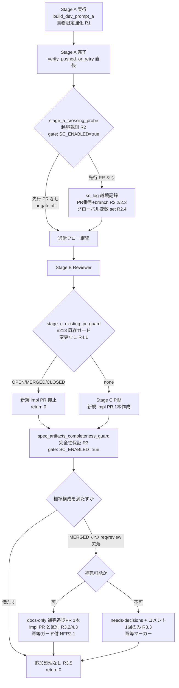

# Design Document

## Overview

**Purpose**: 本機能は「Stage A（PM + Developer・PR 作成禁止のステージ）の worker が制約に反して後段サブエージェント（Reviewer / PjM）へ越境し先行 impl PR を作る事故」を発生源で抑止し、越境が起きても最終的に main の spec ディレクトリが標準構成（`requirements.md` / `review-notes.md` / `impl-notes.md`、design 系を含む Issue では追加で `design.md` / `tasks.md`）を満たすことを、watcher 運用者に observable な結果として提供する。

**Users**: idd-claude self-hosting 環境を含む watcher 運用者が、auto-dev Issue の impl / impl-resume サイクルで利用する。特に tasks.md 不在の design-less impl 経路（Stage A フォールバック）で越境が観測された（#204 / #216）ため、その経路を主対象とする。

**Impact**: 現在の `local-watcher/bin/issue-watcher.sh` は #213 で Stage C 直前の冪等ガード（`stage_c_existing_pr_guard`）を持つが、(a) Stage A 越境そのものの抑止（プロンプト）と (b) 越境で MERGED された先行 PR が spec 成果物欠落のまま着地したときの完全性保証を持たない。本変更は (a) Stage A プロンプトの責務限定強化、(b) Stage A 完了直後の越境観測ログ、(c) spec 成果物完全性チェック + 補完 docs-only 追従 PR（または欠落解消不能時のエスカレーション）の 3 点を、既存 `STAGE_CHECKPOINT_ENABLED` opt-in gate と #213 ガードに干渉しない独立経路として追加する。

### Goals
- Stage A worker の越境（PR 作成 / Reviewer・PjM 起動）をプロンプトレベルで抑止し、design-less impl 経路で「フロー全体完遂を促す表現」を排除する（Req 1）
- Stage A 完了直後に先行 impl PR の有無を観測し、越境を既存ログ書式で記録して後段へ引き継ぐ（Req 2）
- 越境有無やどのステージが PR を作るかに関わらず、main の spec ディレクトリが標準構成を満たす最終状態を保証する（Req 3）
- #213 Stage C 冪等ガードの状態別分岐（OPEN/MERGED/CLOSED）を退行させず、補完を impl PR とは区別される追従処理として扱う（Req 4）
- 成功基準: `STAGE_CHECKPOINT_ENABLED=true`（既定）で #216 相当（MERGED 先行 PR + spec 欠落）を再現した fixture に対し、補完 PR が 1 本だけ作成される（または欠落解消不能時に `needs-decisions` で 1 回だけエスカレーションされる）こと。同一サイクル再実行・複数 slot 同時実行で重複しないこと。`STAGE_CHECKPOINT_ENABLED=false` では本機能導入前と完全同一の挙動になること

### Non-Goals
- 既に MERGED された先行 impl PR 自体の自動 close / 削除 / 本文補正（requirements.md Out of Scope）
- #213 ガードの状態別分岐ロジック（OPEN/MERGED/CLOSED）の変更（退行させない整合のみ）
- `STAGE_CHECKPOINT_ENABLED=false`（明示 opt-out）環境での越境検出・成果物補完
- gh API 以外（Webhook / Actions 連携）による越境検出手段の導入
- サブエージェント起動の物理的ブロック機構（プロンプトによる責務限定と完了後観測に限定）
- 通常の design-full impl（tasks.md ありの impl-resume 経路）の挙動変更

## Architecture

### Existing Architecture Analysis

- **対象は単一 bash スクリプト `local-watcher/bin/issue-watcher.sh`**。アプリケーションコードはなく、論理コンポーネントは関数群として表現される。設計も「関数群を単位」とする。
- **Stage Checkpoint Module（#68/#112）**: `stage_checkpoint_*` ヘルパ（`stage_checkpoint_find_impl_pr` 等）と `sc_log` / `sc_warn` / `sc_error` ロガー（`stage-checkpoint:` prefix）を提供。`STAGE_CHECKPOINT_ENABLED=true`（`:-true` で unset も既定有効）が opt-in gate。
- **#213 Stage C 冪等ガード `stage_c_existing_pr_guard`**: Stage C の PR 作成直前（`run_impl_pipeline` 内 L4930）で呼ばれ、`stage_checkpoint_find_impl_pr` を再利用して既存 PR の state を OPEN/MERGED/CLOSED に分岐する。`return 0` = 作成抑止して停止、`return 1` = 作成へ進む。
- **Stage A プロンプト `build_dev_prompt_a`（L3223〜）**: heredoc。`あなたはこのリポジトリの Claude Code オーケストレーターです`（L3327）という主語と、`Reviewer の approve 後にオーケストレーターが PjM を起動して PR を作成します`（L3242 / L3259）という「フロー全体提示」を含む。これが越境の動機を与えている可能性が高い。
- **Stage A 完了点**: 通常 Developer 経路は L4470〜4473（`verify_pushed_or_retry` 後の `✅ Stage A 完了`）、per-task loop 経路は L4432〜4435。`SPEC_DIR_REL` / `BRANCH` / `NUMBER` / `REPO` / `LOG` / `LABEL_NEEDS_DECISIONS` が利用可能。
- **エスカレーション既存パターン**: `_slug_mismatch_escalate`（L5766）や `stage_c_existing_pr_guard` の CLOSED 分岐（L5791 / L1299）が `gh issue edit --add-label needs-decisions` + `gh issue comment` を `|| true` で fail-open に発射する。冪等性は「同一サイクル再実行で重複コメントを生むか」が論点。
- **尊重すべき制約**: env var 名 / ラベル遷移契約 / exit code（return 0/1）/ ログ書式の後方互換。`STAGE_CHECKPOINT_ENABLED=false` の完全等価性。新規外部サービスを増やさない（gh API のみ）。

### Architecture Integration

- **採用パターン**: 既存 Stage Checkpoint Module の延長として、新規論理関数群を **同一 prefix ロガー `sc_log` を共有**しつつ追加する。新規 env flag は足さず `STAGE_CHECKPOINT_ENABLED` に相乗りする（NFR 1.2 / Req 2.5）。
- **ドメイン境界**: (1) プロンプト責務限定（`build_dev_prompt_a` のテキスト変更のみ）、(2) 越境観測（Stage A 完了直後の read-only 観測関数）、(3) 成果物完全性保証（spec ディレクトリ検査 + 補完 PR / エスカレーション）の 3 境界。境界間は「越境観測結果のグローバル変数引き継ぎ」で疎結合に連携する。
- **既存パターンの維持**: #213 `stage_c_existing_pr_guard` は **一切変更しない**。新規の完全性保証関数は Stage C ガードとは別の呼び出し点（Stage A 完了直後の観測 / pipeline 末尾の完全性チェック）に置き、MERGED ガードの「新規 impl PR 抑止」は維持したまま docs-only 補完を **独立経路**として実行する（Req 4.1〜4.3）。
- **新規コンポーネントの根拠**: 越境観測は #213 の Stage C 直前ガードより「早い時点（Stage A 完了直後）」で必要（Req 2.1）。完全性保証は #213 の MERGED 停止経路が救済 PR を抑止する隙間（#216 で実発生）を埋めるために必要。

### Architecture Pattern & Boundary Map



完全性保証 `spec_artifacts_completeness_guard` は **Stage C ガードの後段かつ pipeline の最終局面**に置く。これにより「Stage C で新規 impl PR を作った通常ケース」「#213 ガードが OPEN/MERGED/CLOSED で停止したケース」の双方を通過点として捕捉でき、#213 ガードのロジックそのものには触れない（Req 4.1）。

### Technology Stack

| Layer | Choice / Version | Role in Feature | Notes |
|-------|------------------|-----------------|-------|
| CLI / Runtime | bash 4+ (`set -euo pipefail`) | watcher 本体 | `local-watcher/bin/issue-watcher.sh` 単一ファイル |
| Backend / Services | GitHub CLI (`gh`) | PR 列挙・作成・コメント・ラベル | **gh API のみ**（新規外部サービス追加なし） |
| Data / Storage | git working tree / branch HEAD | spec 成果物の tracked 判定 | `git -C "$REPO_DIR" ls-tree --name-only HEAD -- <path>` |
| Data parse | `jq` | `gh pr list --json` 結果の整形 | 既存 `stage_checkpoint_find_impl_pr` を踏襲 |
| Messaging / Events | `sc_log` / `sc_warn`（`stage-checkpoint:` prefix） | 観測・補完根拠ログ | 既存ログ書式を流用（NFR 1.5 / NFR 3.1 / 3.2） |
| Infrastructure / Runtime | cron / launchd（ユーザースコープ） | watcher 起動 | env var 追加なし（`STAGE_CHECKPOINT_ENABLED` 相乗り） |

## File Structure Plan

bash 1 ファイルへの変更が主。新規ディレクトリ・新規ファイルは fixture / spec 配下のみ。

### Modified Files

```
local-watcher/bin/issue-watcher.sh   # 本機能の主対象（下記 3 箇所）
├── build_dev_prompt_a (L3223〜)       # [C1] Stage A プロンプト責務限定強化（R1.4）
├── Stage Checkpoint Module 末尾       # [C2] stage_a_crossing_probe 新規関数（R2）
│   (stage_c_existing_pr_guard L1312 の後ろ、L1313 付近に追加)
├── spec 完全性保証関数群 新規          # [C3] spec_artifacts_completeness_guard +
│   (同モジュール内 or 近接位置に追加)  #      _spec_missing_artifacts / _spec_create_docs_pr /
│                                       #      _spec_escalate_incomplete（R3 / R4）
├── run_impl_pipeline                  # [C2/C3] 呼び出し点の挿入
│   ├── Stage A 完了直後 (L4473 / L4435 付近) → stage_a_crossing_probe 呼び出し
│   └── pipeline 末尾 (Stage C 後 / L4933・L4972・L4980 の return 直前) →
│       spec_artifacts_completeness_guard 呼び出し（return 0 を保ったまま）
└── stage_c_existing_pr_guard (L1239)  # 変更しない（Req 4.1 退行防止）

README.md
├── 「Stage Checkpoint (#68)」節 (L3064〜)  # Stage A 越境観測 + spec 完全性保証の追記
│                                            # (#212 ガード説明 L3109 の近傍に新節 or 小節)
└── 「オプション機能一覧」表 (L1186 付近)    # 記述更新（新規 env var を足さない旨を含む）

docs/specs/219-bug-watcher-stage-a-pr-spec-212-213-foll/
├── design.md                          # 本ファイル
├── tasks.md                           # 実装タスク
└── test-fixtures/                     # スモークテスト用 fixture（任意・推奨）
    ├── spec-complete/                 # 標準構成を満たす spec dir（追加処理なしの期待）
    │   ├── requirements.md
    │   ├── review-notes.md
    │   └── impl-notes.md
    └── spec-incomplete-merged/        # impl-notes.md のみ（#216 再現 / 補完対象）
        └── impl-notes.md
```

> 補足: 新規関数 `stage_a_crossing_probe` / `spec_artifacts_completeness_guard` および補助関数 `_spec_missing_artifacts` / `_spec_create_docs_pr` / `_spec_escalate_incomplete` は、既存 Stage Checkpoint Module（L960〜L1312）と同一の `sc_log` ロガー・`STAGE_CHECKPOINT_ENABLED` gate を共有するため、同モジュール内（`stage_c_existing_pr_guard` 直後）に配置して凝集を保つ。

## Requirements Traceability

| Requirement | Summary | Components | Interfaces / Flows |
|-------------|---------|------------|--------------------|
| 1.1 | Stage A は impl PR を作らない | C1 build_dev_prompt_a | プロンプト制約「PR は作成しないこと」維持 + 責務限定強化 |
| 1.2 | Stage A は Reviewer を起動しない | C1 | プロンプト責務限定（後段起動表現の除去） |
| 1.3 | Stage A は PjM を起動しない | C1 | プロンプト責務限定（PjM 起動表現の除去） |
| 1.4 | design-less impl 時に責務を PM+Developer に限定、フロー全体完遂表現を含めない | C1 | `build_dev_prompt_a` heredoc 改修（後述 Decision D1） |
| 2.1 | Stage A 完了時に先行 PR 有無を観測 | C2 stage_a_crossing_probe | `stage_checkpoint_find_impl_pr` 再利用 |
| 2.2 | 越境を既存ログ書式で記録 | C2 | `sc_log "stage-a-crossing: ..."` |
| 2.3 | PR 番号と head ブランチを判定根拠にログ | C2 | ログ行に `pr=#N branch=$BRANCH` |
| 2.4 | 検出結果を Req 3 へ引き継ぐ | C2 → C3 | グローバル変数 `STAGE_A_CROSSING_DETECTED` set |
| 2.5 | `STAGE_CHECKPOINT_ENABLED!=true` で従来と同一 | C2 | 関数冒頭 gate（`:-true` != true → return） |
| 3.1 | 最終状態で spec 標準構成を保証 | C3 spec_artifacts_completeness_guard | pipeline 末尾の検査 |
| 3.2 | MERGED かつ req/review 欠落で欠落解消処理を実行 | C3 _spec_create_docs_pr | docs-only 補完追従 PR（Decision D2） |
| 3.3 | 自動解消不能時に人間判別可能な形でエスカレーション | C3 _spec_escalate_incomplete | `needs-decisions` + Issue コメント（Decision D4） |
| 3.4 | 不足ファイル種別・対象 spec dir を既存ログ書式で出力 | C3 _spec_missing_artifacts | `sc_log "spec-completeness: missing=... dir=..."` |
| 3.5 | 既に標準構成を満たすなら追加処理なし | C3 | 検査結果 empty → return 0（NFR 1.1） |
| 4.1 | #213 状態別分岐を退行させない | C3（配置）+ stage_c_existing_pr_guard（不変） | 完全性保証は Stage C ガードの後段独立経路 |
| 4.2 | MERGED の新規 impl PR 抑止を維持 | C3 | impl PR は作らず docs-only PR のみ |
| 4.3 | 補完を impl PR と区別される追従処理として扱う | C3 _spec_create_docs_pr | `docs(specs): ...` の docs-only PR（Decision D3） |
| NFR 1.1 | design-full impl の user-observable 挙動不変 | C3 | tasks.md あり経路は標準構成充足で return 0（早期）|
| NFR 1.2 | env var 名・既定値不変 | C2/C3 | `STAGE_CHECKPOINT_ENABLED` 相乗り・新規 flag 無し |
| NFR 1.3 | ラベル遷移契約不変 | C3 | `needs-decisions` の意味を変えず付与のみ |
| NFR 1.4 | exit code 意味不変 | C2/C3 | 観測・補完は return 0 を壊さない |
| NFR 1.5 | 既存ログ行書式不変 | C2/C3 | 新規行は `sc_log` で追加するのみ |
| NFR 2.1 | 同一 head ブランチへ 2 回以上到達で重複補完 PR を作らない | C3 _spec_create_docs_pr | 補完前に既存 docs-only PR / 完全性を再観測（冪等ガード） |
| NFR 2.2 | self-hosting 同一サイクル再実行で重複 PR・重複エスカレーション無し | C3 | 冪等マーカー（既存 PR 検知 / Issue ラベル既付与チェック） |
| NFR 3.1 | 越境検出根拠を grep 可能粒度でログ | C2 | `stage-a-crossing:` prefix |
| NFR 3.2 | spec 不足検出/補完根拠を grep 可能粒度でログ | C3 | `spec-completeness:` prefix |

## Components and Interfaces

### Domain: Stage A 責務限定（プロンプト）

#### C1: `build_dev_prompt_a`（既存関数の改修）

| Field | Detail |
|-------|--------|
| Intent | Stage A worker の責務を「PM + Developer の単一ステージ」に限定し、後段（Reviewer / PjM 起動・PR 作成）の完遂を促す表現を排除する |
| Requirements | 1.1, 1.2, 1.3, 1.4 |

**Responsibilities & Constraints**
- heredoc テキストのみを変更する（制御フロー・関数シグネチャ・戻り値は不変）。
- 既存の明示制約（`**PR は作成しないこと**` L3350、`PR 作成（project-manager サブエージェント）を行わないこと` L3240/3257）は **維持**する。
- 後段提示表現（`Reviewer の approve 後にオーケストレーターが PjM を起動して PR を作成します`）を、Stage A 完了が単一ステージのゴールであることを示す表現へ弱める（後述 Decision D1）。
- impl / impl-resume 双方の steps に適用するが、**design-full impl-resume（tasks.md あり）の Developer 実行内容は変えない**（NFR 1.1）。tasks.md の有無による分岐は本関数の呼び出し元（run_impl_pipeline の per-task / 単一 Developer 分岐）が持つため、プロンプト本文の責務限定はどちらの経路でも安全。

**Dependencies**
- Inbound: `run_impl_pipeline`（Stage A / Stage A' 経路）— prompt 構築 (Critical)
- Outbound: なし（純粋な文字列生成）
- External: なし

**Contracts**: Service [ ] / API [ ] / Event [ ] / Batch [ ] / State [ ]（テキスト変更のみ。契約変更なし）

### Domain: 越境観測（Stage A 完了直後）

#### C2: `stage_a_crossing_probe`（新規関数）

| Field | Detail |
|-------|--------|
| Intent | Stage A 完了直後に当該 head ブランチの先行 impl PR を観測し、存在すれば越境として記録して後段へ引き継ぐ |
| Requirements | 2.1, 2.2, 2.3, 2.4, 2.5 |

**Responsibilities & Constraints**
- 副作用は **ログ出力とグローバル変数 set のみ**（read-only 観測）。PR の close / ラベル付与は行わない（Req 2 のスコープ）。
- `STAGE_CHECKPOINT_ENABLED != true`（`:-true` で unset は既定有効）のときは 1 行も実行せず即 return（Req 2.5 / NFR 1.1）。
- `stage_checkpoint_find_impl_pr` を **再利用**し、rc=0（PR あり）/ rc=1（なし）/ rc=2（gh API エラー）を扱う。API エラー時は warn を残し越境未検出として継続（安全側、二重処理を生まない）。
- 検出時のみ `sc_log "stage-a-crossing: detected pr=#<N> state=<S> branch=<BRANCH> issue=#<NUMBER>"` を出力（Req 2.2 / 2.3 / NFR 3.1）。
- グローバル変数 `STAGE_A_CROSSING_DETECTED`（`yes`/`no`）と `STAGE_A_CROSSING_PR`（PR 番号）を set し、C3 が読む（Req 2.4）。

**Dependencies**
- Inbound: `run_impl_pipeline`（Stage A 完了直後、通常 Developer 経路 L4473 / per-task 経路 L4435 の 2 箇所）— 観測トリガ (Critical)
- Outbound: `stage_checkpoint_find_impl_pr`（既存）— PR 観測 (Critical) / `sc_log`（既存）— 記録 (Critical)
- External: `gh pr list`（`stage_checkpoint_find_impl_pr` 経由）(Critical)

**Contracts**: Service [x] / API [ ] / Event [ ] / Batch [ ] / State [x]

##### Service Interface（疑似シグネチャ）

```bash
# 入力: 環境変数 STAGE_CHECKPOINT_ENABLED / NUMBER / BRANCH / REPO / LOG
# 副作用: $LOG への sc_log 出力 / グローバル変数 STAGE_A_CROSSING_DETECTED, STAGE_A_CROSSING_PR の set
# 戻り値: 常に 0（観測は pipeline を止めない / NFR 1.4）
stage_a_crossing_probe() {
  # gate: STAGE_CHECKPOINT_ENABLED != "true" → return 0（何もしない）
  # pr_info=$(stage_checkpoint_find_impl_pr); rc 分岐
  #   rc=0 → STAGE_A_CROSSING_DETECTED=yes; STAGE_A_CROSSING_PR=<N>; sc_log "stage-a-crossing: detected ..."
  #   rc=1 → STAGE_A_CROSSING_DETECTED=no
  #   rc=2 → sc_warn(API エラー); STAGE_A_CROSSING_DETECTED=no（安全側）
}
```
- Preconditions: Stage A が完了（impl commit が push 済み）、`BRANCH` / `NUMBER` 解決済み
- Postconditions: 越境有無がグローバル変数に反映され、検出時は grep 可能なログが残る
- Invariants: PR の状態を変更しない / return 0 を保つ

### Domain: spec 成果物完全性保証

#### C3: `spec_artifacts_completeness_guard`（新規関数・orchestrator）+ 補助関数群

| Field | Detail |
|-------|--------|
| Intent | pipeline 最終局面で main 着地後の spec ディレクトリが標準構成を満たすことを保証し、MERGED 先行 PR + 欠落のケースで docs-only 補完追従 PR を 1 本作成、解消不能なら 1 回だけエスカレーションする |
| Requirements | 3.1, 3.2, 3.3, 3.4, 3.5, 4.1, 4.2, 4.3, NFR 2.1, NFR 2.2, NFR 3.2 |

**Responsibilities & Constraints**
- `STAGE_CHECKPOINT_ENABLED != true` のとき即 return 0（NFR 1.1）。
- **検査対象**: `$REPO_DIR/$SPEC_DIR_REL` 配下の `requirements.md` / `review-notes.md` / `impl-notes.md`、および `design.md` / `tasks.md`（design 系 Issue の判定は後述）。「不足」とは Req 3.2 に従い **`requirements.md` または `review-notes.md` が main（branch HEAD tracked）に欠落**しているケースを主対象とする。
- **補完を起動する条件（Req 3.2）**: 先行 impl PR が **MERGED 済み**（`stage_checkpoint_find_impl_pr` の state=MERGED）かつ req/review 欠落。OPEN/CLOSED の場合は補完しない（OPEN は通常フローで PjM が review-notes を commit、CLOSED は人間判断委譲で #213 ガードが既にエスカレーション済み）。
- **標準構成を既に満たす場合（Req 3.5）**: 何も実行せず return 0。design-full impl の通常成功ケースはここで早期 return（NFR 1.1）。
- **#213 ガードとの非干渉（Req 4.1）**: 本関数は `stage_c_existing_pr_guard` を呼ばず、その後段に置かれる。MERGED ガードの「新規 impl PR 抑止」は維持され、本関数は impl PR を作らず **docs-only PR のみ**作成する（Req 4.2 / 4.3 / Decision D3）。
- **冪等性（NFR 2.1 / 2.2）**: 補完 PR 作成前に「同一 head ブランチ／docs 補完 head ブランチに既存の docs-only PR が無いか」を再観測する。エスカレーションは Issue に `needs-decisions` が既付与なら再投稿しない（既存 `stage_c_existing_pr_guard` CLOSED 分岐と同じ fail-open + 冪等方針）。
- **ログ（Req 3.4 / NFR 3.2）**: `sc_log "spec-completeness: missing=<req|review|...> dir=<SPEC_DIR_REL> action=<docs-pr|escalate|none>"`。

**補助関数**
- `_spec_missing_artifacts <spec_dir>`: branch HEAD tracked で `requirements.md` / `review-notes.md` の欠落種別を stdout に列挙（read-only）。`stage_checkpoint_has_impl_notes` の `git ls-tree` 判定を踏襲。
- `_spec_create_docs_pr <missing_list>`: docs-only の補完追従 PR を作る（Decision D2/D3）。冪等ガード内蔵。
- `_spec_escalate_incomplete <missing_list>`: 補完不能時に `needs-decisions` 付与 + Issue コメント 1 件（冪等）。

**Dependencies**
- Inbound: `run_impl_pipeline`（pipeline 末尾、Stage C ガード停止経路 L4931 直前・Stage C 成功 L4972 直前・PR verify 失敗前は対象外）— 完全性チェックトリガ (Critical)
- Outbound: `_spec_missing_artifacts` / `_spec_create_docs_pr` / `_spec_escalate_incomplete` / `stage_checkpoint_find_impl_pr` / `sc_log` (Critical)
- External: `gh pr list` / `gh pr create` / `gh issue edit` / `gh issue comment`（補完・エスカレーション時のみ）(Critical)

**Contracts**: Service [x] / API [ ] / Event [ ] / Batch [ ] / State [x]

##### Service Interface（疑似シグネチャ）

```bash
# 入力: 環境変数 STAGE_CHECKPOINT_ENABLED / NUMBER / BRANCH / REPO / REPO_DIR /
#       SPEC_DIR_REL / BASE_BRANCH / LOG / LABEL_NEEDS_DECISIONS /
#       STAGE_A_CROSSING_DETECTED（C2 が set / Req 2.4 引き継ぎ）
# 戻り値: 常に 0（pipeline の最終結果を変えない / NFR 1.4）
# 副作用: 補完 PR 1 本 or needs-decisions+コメント or 無し
spec_artifacts_completeness_guard() {
  # gate: STAGE_CHECKPOINT_ENABLED != "true" → return 0
  # missing=$(_spec_missing_artifacts "$SPEC_DIR_REL")
  # [ -z "$missing" ] → return 0（Req 3.5 標準構成充足）
  # pr_info=$(stage_checkpoint_find_impl_pr); state を取得
  # case state in
  #   MERGED) _spec_create_docs_pr "$missing" || _spec_escalate_incomplete "$missing" ;;
  #   *)      _spec_escalate_incomplete "$missing"（補完条件外 → 人間判断 Req 3.3）;;
  # esac
}
```
- Preconditions: pipeline が Stage C 局面に到達済み（PR 作成 or #213 ガード停止のいずれか）
- Postconditions: spec ディレクトリの最終状態が標準構成を満たす、または欠落が人間に観測可能な形で記録・エスカレーションされる
- Invariants: 新規 impl PR を作らない（docs-only のみ）/ #213 ガードの判定を変えない / 重複 PR・重複エスカレーションを作らない

##### docs-only 補完追従 PR の契約（`_spec_create_docs_pr`）

| 項目 | 値 |
|------|----|
| head ブランチ | `claude/issue-<NUMBER>-docs-<SLUG>`（impl ブランチと別系統。impl PR と区別 / Req 4.3） |
| base | `$BASE_BRANCH`（`--base` 明示。#96 踏襲） |
| 内容 | 不足している `requirements.md` / `review-notes.md` のみを補完（最小限の docs commit） |
| commit | `docs(specs): #<NUMBER> の不足成果物を補完（spec-completeness）` |
| 冪等 | 作成前に `gh pr list --head <docs-branch> --state all` で既存 docs PR を確認、あれば作成しない（NFR 2.1） |
| ラベル | impl PR と区別するため `ready-for-review` を付与しない（人間レビュー前提の docs PR） |

## Data Models

### Domain Model（グローバル変数による状態引き継ぎ）

bash スクリプトのためアグリゲートは存在しないが、Req 2.4 の「越境検出結果の後段引き継ぎ」を担う state は以下:

| 変数 | 値 | set 元 | read 元 | 役割 |
|------|----|--------|---------|------|
| `STAGE_A_CROSSING_DETECTED` | `yes` / `no` | C2 stage_a_crossing_probe | C3 / ログ集計 | 越境検出フラグ（Req 2.4） |
| `STAGE_A_CROSSING_PR` | PR 番号 or 空 | C2 | ログ | 検出した先行 PR 番号（Req 2.3） |

これらは `run_impl_pipeline` のスコープ内 local 変数として宣言し、関数間で引数渡しまたは pipeline スコープ共有する（既存 `START_STAGE` と同じパターン）。

### spec ディレクトリ標準構成（検査ルール）

| ファイル | 必須? | 判定 |
|---------|-------|------|
| `requirements.md` | 必須 | branch HEAD tracked |
| `review-notes.md` | 必須（impl 系） | branch HEAD tracked |
| `impl-notes.md` | 必須 | branch HEAD tracked |
| `design.md` / `tasks.md` | design 系 Issue でのみ必須 | 本機能の補完対象外（Req 3.2 は req/review に限定）。検査ログには記録するが補完しない |

> design.md / tasks.md は設計 PR で別途 main に merge される成果物であり、impl 経路の越境補完では再生成しない。Req 3.2 の補完対象を `requirements.md` / `review-notes.md` に限定する根拠（PM/Reviewer 成果物であり docs commit で機械再構築できない design 系と性質が異なる）。

## Error Handling

### Error Strategy

すべての観測・補完・エスカレーション副作用は **fail-open**（既存 `stage_c_existing_pr_guard` / `_slug_mismatch_escalate` と同方針）。`gh` 系コマンド失敗は `|| true` で吸収し、pipeline の return 値（成功 0）を壊さない（NFR 1.4）。失敗は `sc_warn` で grep 可能に記録する（silent fail を作らない / CLAUDE.md コード規約）。

### Error Categories and Responses

- **gh API エラー（観測時 / C2 rc=2）**: 越境未検出として継続（安全側）。`sc_warn "stage-a-crossing: gh API エラー → 越境未検出として継続"`。二重処理を生まない。
- **gh API エラー（完全性チェック時 / C3 の find_impl_pr rc=2）**: state 不明 → 補完を起動せず `sc_warn` を残して return 0（誤補完で二重 PR を作るより安全側）。次サイクルで再評価。
- **補完 PR 作成失敗（`gh pr create` 失敗）**: `sc_warn` 記録 + `_spec_escalate_incomplete` へフォールバック（自動解消不能として人間判断委譲 / Req 3.3）。
- **エスカレーション副作用失敗（`gh issue edit/comment` 失敗）**: `|| true` 吸収 + `sc_warn`。ラベル付与失敗時は次サイクルで再評価される（冪等）。
- **想定外の PR state**: 補完を起動せず `sc_warn` を残して return 0（防御的、`stage_c_existing_pr_guard` の `*)` 分岐と同方針）。

## Testing Strategy

idd-claude には unit test framework が無いため、検証は静的解析 + 手動スモークテスト + fixture（CLAUDE.md「テスト・検証」節準拠）。

### Unit Tests（関数単位スモーク / fixture）
- `_spec_missing_artifacts`: `test-fixtures/spec-complete/`（欠落なし → 空出力）と `test-fixtures/spec-incomplete-merged/`（impl-notes.md のみ → `requirements review` 列挙）で判定を確認
- `stage_a_crossing_probe`: `STAGE_CHECKPOINT_ENABLED=false` で 1 行も出力しないこと（gate 確認）
- `stage_a_crossing_probe`: モック `stage_checkpoint_find_impl_pr` rc=0/1/2 でグローバル変数とログが期待通りか
- `spec_artifacts_completeness_guard`: 標準構成充足時に return 0 + 副作用なし（Req 3.5 / NFR 1.1）

### Integration Tests（cross-component / dry-run）
- dry run（CLAUDE.md 手順）: `REPO=owner/test REPO_DIR=/tmp/test-repo $HOME/bin/issue-watcher.sh` を対象なし状態で流し `処理対象の Issue なし` で正常終了すること（既存挙動退行なし）
- cron-like 最小 PATH 依存解決: `env -i HOME=$HOME PATH=/usr/bin:/bin bash -c 'command -v claude gh jq flock git'` が解決すること
- `STAGE_CHECKPOINT_ENABLED=false` 経路: 越境観測・完全性保証の関数が呼ばれても 1 行も `stage-a-crossing:` / `spec-completeness:` ログを出さないこと（NFR 1.1）
- #213 ガード非干渉: OPEN/MERGED/CLOSED の各 state で `stage_c_existing_pr_guard` の return 値・ログが本変更前と同一であること（Req 4.1）

### E2E Tests（dogfooding）
- 本 repo に #216 相当の test issue（tasks.md 不在の design-less impl + 先行 MERGED PR + spec 欠落）を立て、watcher が docs-only 補完 PR を 1 本だけ作るか
- 同一 test issue で watcher を 2 サイクル連続実行し、補完 PR が重複しない / エスカレーションコメントが重複しないこと（NFR 2.1 / 2.2）
- 通常 design-full impl Issue で挙動（PR 本数・成功ログ）が変わらないこと（NFR 1.1）

### 静的解析（必須）
- `shellcheck local-watcher/bin/issue-watcher.sh` 警告ゼロ
- README 変更後の markdown 整合（h1 単一・コードフェンス言語タグ）

## Security Considerations

- 本機能は新規 secret / 認証を扱わない。`gh` の既存認証を流用。
- Issue コメント / PR 本文に実値の機密情報を埋め込まない（補完 PR 本文は spec パスと不足種別のみ記載）。

## Design Decisions（確認事項への回答）

### D1: 課題 1 の主対策の比重（プロンプト弱化 R1.4 vs 完了直後観測 R2）

**採用**: **両者併用。比重は「観測（R2）を主・プロンプト弱化（R1.4）を従」とする。**

- **根拠**: プロンプト弱化は越境の動機を減らすが、LLM の確率的挙動のため越境を完全には防げない（#204/#216 で実証）。一方、Stage A 完了直後の観測（R2）は決定論的に越境を検出でき、後段の完全性保証（R3）へ確実に引き継げる。よって「検出して救済する」観測を主防御線とし、プロンプト弱化は発生率低減の補助とする。
- **R1.4 の具体的記述変更（C1）**:
  - L3242 / L3259 の `Reviewer の approve 後にオーケストレーターが PjM を起動して PR を作成します。` を **削除または「本ステージのゴールは impl-notes.md の保存までです。後段の Reviewer / PjM 起動・PR 作成は watcher が別ステージで行うため、本ステージでは一切起動・実行しないでください。」へ置換**し、フロー全体提示を排除する。
  - L3327 の主語 `あなたはこのリポジトリの Claude Code オーケストレーターです。` は、Stage A 用には **「あなたは Stage A（PM + Developer）担当のサブオーケストレーターです。本ステージの責務は PM 要件定義と Developer 実装・コミットに限定されます。」** へ弱め、design-less impl 経路（tasks.md 不在で Stage A fallback したケース）でも同一の限定表現が適用されるようにする。
  - 既存の明示制約（`**PR は作成しないこと**` / `project-manager サブエージェントを行わないこと`）は維持し、加えて **「reviewer / project-manager サブエージェントを起動しないこと」** を制約節に明記する（Req 1.2 / 1.3）。
- **代替案（不採用）**: プロンプト弱化のみに依存 → 越境再発時の救済が無く #216 が再発するため不採用。

### D2: 課題 2 の解消手段（補完 docs-only 追従 PR vs Stage A 完了ゲート）

**採用**: **MERGED 後の補完 docs-only 追従 PR 作成。**

- **根拠**:
  - 「Stage A 完了ゲートで push 保証」案は、Stage A が PM/Developer のみで review-notes.md を生成しない設計のため、req/review の push を Stage A で保証することは責務分掌（Reviewer が review-notes を出す）と矛盾する。また越境で **既に MERGED された** ケース（#216）は Stage A 完了ゲートでは事後救済できない（既に着地済み）。
  - 補完 PR 案は #213 MERGED ガードの「新規 impl PR 抑止」を維持したまま、**impl PR とは別系統の docs-only PR** で欠落だけを最小補完でき、事後救済が可能（Req 3.2 / 4.2 / 4.3 を同時に満たす）。
- **代替案（不採用）**: Stage A 完了ゲート単独 → MERGED 後の事後救済ができず #216 再発リスクが残るため不採用。

### D3: 補完 PR 採用時の #213 MERGED ガードとの両立方式（補完専用判定経路 vs docs-only 例外）

**採用**: **補完専用の独立判定経路（`stage_c_existing_pr_guard` に手を入れない）。**

- **根拠**: #213 ガードは impl PR の二重作成防止に責務を限定しており、ここに docs-only 例外を足すと OPEN/MERGED/CLOSED 分岐が複雑化し退行リスク（Req 4.1）が上がる。代わりに完全性保証 `spec_artifacts_completeness_guard` を **Stage C ガードの後段（独立関数）** に置き、docs-only PR は **impl ブランチと別の `claude/issue-<N>-docs-<slug>` head** で作る。これにより #213 の MERGED `--head $BRANCH` 判定とは head が異なるため衝突せず、impl PR の二重作成も構造的に起きない（Req 4.3）。
- **代替案（不採用）**: 既存ガード分岐に docs-only 例外を追加 → #213 ロジックへの侵襲が大きく Req 4.1 退行リスクのため不採用。

### D4: エスカレーション手段の具体（needs-decisions + コメント vs ログのみ）

**採用**: **段階的。補完成功時はログのみ（過剰通知回避）、補完不能時のみ `needs-decisions` 付与 + Issue コメント 1 件（冪等）。**

- **根拠**: #212 の方針（OPEN/MERGED はログのみ・CLOSED はコメント必須）と整合させる。docs-only 補完が成功すれば人間操作は不要なのでログのみ（`spec-completeness: action=docs-pr`）。`gh pr create` 失敗等で **自動解消できない場合のみ** Req 3.3 に従い `needs-decisions` + コメントで人間判断に委ねる。コメントは `needs-decisions` 既付与チェックで冪等化し、同一サイクル再実行・複数 slot で重複しない（NFR 2.2）。
- **代替案（不採用）**: 常に needs-decisions 付与 → 自動補完成功ケースで不要な人間通知が出て #212 の過剰通知回避方針に反するため不採用。
