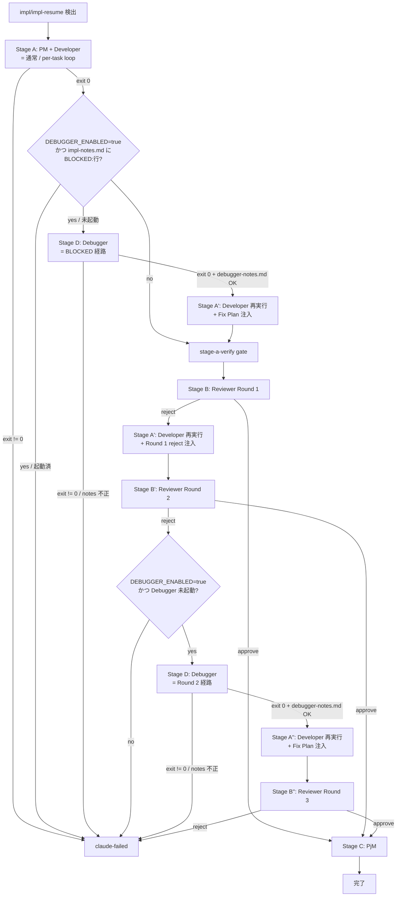
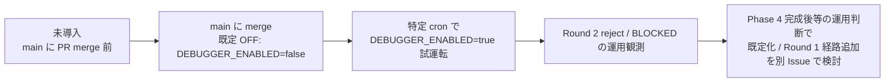

# Design Document — Phase 3: Debugger subagent

## Overview

**Purpose**: 本機能は **Debugger サブエージェント**（PM / Architect / Developer / Reviewer / PjM
と同階層の独立エージェント）を新設し、Reviewer Round 2 reject の直前、または Developer が
`impl-notes.md` に `BLOCKED: <reason>` を宣言した時点で、**fresh な Claude CLI セッション + web
search 権限**で起動して根本原因分析（Fix Plan）のみを出力させる機能を提供する。Fix Plan は
`docs/specs/<番号>-<slug>/debugger-notes.md` に構造化 markdown として書き出され、後続の Developer
再起動プロンプトに inline 注入されることで、context 汚染なしの再試行を実現する。

**Users**: idd-claude を install 済みの運用者で、Issue #20（Reviewer Round 1/2）/ Issue #21
（per-task loop）が稼働している環境において、**外部ライブラリ ABI / フレームワーク内部挙動 / CI
固有制約**などの「Developer 単一 context では原因不明」な失敗で `claude-failed` 直行する頻度を
減らしたい個人 / 小規模チーム。`DEBUGGER_ENABLED=true` の明示 opt-in を cron / launchd に追加する
ことで利用する。

**Impact**: 現行の `run_impl_pipeline`（`local-watcher/bin/issue-watcher.sh`）の **(a) Stage B'
(Reviewer Round 2) reject 直前**と **(b) Stage A 完了直後の BLOCKED 検出**の 2 点に Debugger 起動
分岐を挿入する。Debugger 経由 Developer 再起動（Stage A''）→ Reviewer Round 3（Stage B''）→
最終 `claude-failed` の経路を新設する。`DEBUGGER_ENABLED` 未設定 / `=false` 下では既存 Stage A
→ B → A' → B' → `claude-failed` 経路が**1 行も挙動を変えない**（NFR 1.1 / Req 1.1, 1.2）。

### Goals

- Reviewer Round 2 reject 直前と Developer BLOCKED 宣言の 2 トリガーで Debugger を 1 回起動し、
  Fix Plan markdown を出力させる
- Debugger は **判定もコード書き換えも行わず**、Fix Plan の構造化 markdown 出力のみを責務とする
- 1 Issue（または Phase 2 有効時は 1 task）あたり Debugger を **最大 1 回**に制限し、コスト暴走と
  無限ループを防ぐ
- 既存 env var 名・ラベル名・cron 登録文字列・exit code を一切変更しない（NFR 1.1〜1.3 / Req 1.4,
  1.5）
- `DEBUGGER_ENABLED=true` 下での Debugger 起動・終了・Fix Plan 出力・Round 3 結果を `LOG_DIR` 配下
  ログに `[$REPO]` 識別子付きで記録（NFR 2.1〜2.3）

### Non-Goals

- Reviewer Round 1 reject 直前での Debugger 介入（Round 1 は Developer self-fix で十分）
- Debugger の複数回起動（1 Issue / 1 task あたり最大 1 回固定）
- Debugger 専用のテスト実行（Debugger は Fix Plan 出力のみ）
- web search 結果のキャッシュ機構
- web search のドメイン allowlist / 追加 permission 制約（Claude CLI default を採用）
- Debugger context の Reviewer / Developer 兼任（完全 fresh 起動で独立性確保）
- `.github/workflows/issue-to-pr.yml`（Actions 版）への移植
- `DEBUGGER_ENABLED=true` 既定化 / Round 1 経路追加（将来検討課題）

---

## Architecture

### Existing Architecture Analysis

現行 `run_impl_pipeline`（`local-watcher/bin/issue-watcher.sh` 6721 行〜）は以下の Stage 列で
構成される（#20 Phase 1 で確立）:

| Stage | 役割 | 起動エージェント | 失敗時遷移 |
|---|---|---|---|
| Stage A | 初回実装 | PM + Developer | `claude-failed` |
| Stage A | (stage-a-verify, #125) | watcher | round=1 差し戻し / round=2 で `claude-failed` |
| Stage B | Reviewer Round 1 | Reviewer | reject → Stage A' / error → `claude-failed` |
| Stage A' | 差し戻し再実装 | Developer | `claude-failed` |
| Stage B' | Reviewer Round 2 | Reviewer | reject → **`claude-failed` 直行** / error → `claude-failed` |
| Stage C | PR 作成 | PjM | `claude-failed` |

尊重すべき制約:

- **単一 flock 境界**: 同一 repo の watcher 多重起動は防止済み。Debugger も同じ flock 内で動く
- **ログ統一**: `$LOG_DIR/issue-${NUMBER}-${TS}.log` に append（NFR 2.1〜2.3 はこのログに乗せる）
- **既存 label / env var / exit code の意味**: 一切変えない（Req 1.4, 1.5 / NFR 1.2, 1.3）
- **Quota-Aware Watcher (#66)**: `qa_run_claude_stage` 経由で claude を起動する規約 → Debugger も
  同経路を流用し、quota 99 受領時は `needs-quota-wait` 退避（既存 #66 規約を温存）
- **per-task loop (#21)**: `PER_TASK_LOOP_ENABLED=true` 時は Stage A 内で task 単位 Implementer +
  Reviewer ループが動く。Debugger も task 単位起動に対応する必要がある（Req 6.x）

### 主要決定: Stage D の挿入と「sentinel-file ベースの起動回数上限」

Req 3.x / 4.x / 5.x を満たすため、現行 Stage 列に **Stage D (Debugger)** を 2 箇所に挿入する:

1. **Round 2 reject 経路**: `Stage B' reject` の直後・`claude-failed` 付与直前で Stage D を起動 →
   成功時 Stage A'' → Stage B'' へ進み、Round 3 reject で初めて `claude-failed`
2. **BLOCKED 経路**: `Stage A` 完了後の `impl-notes.md` を watcher が scan し、`BLOCKED: <reason>`
   行を検出したら **Stage A' を実行せず**直接 Stage D を起動 → 成功時 Stage A'（**通常の差し戻し
   Developer 再起動**）→ Stage B（**Round 1 から通常サイクル**）に合流

起動回数上限（1 Issue / 1 task あたり最大 1 回）は **sentinel file ベース**で実装する:

- sentinel path: `$REPO_DIR/$SPEC_DIR_REL/debugger-notes.md`（= Debugger 出力ファイル自身）
- 判定: 当該 task scope（Issue 単位 or per-task）で `debugger-notes.md` が既に存在 / `### Task <id>`
  セクションが既に存在すれば「起動済み」と判定し再起動しない
- 代替案として「ラベル / カウンタ env / 一時ファイル」も検討したが、sentinel file は **branch 上の
  commit に乗るため pickup 再開時も観測可能**（Req 5.5）であり、watcher の状態を branch 外に
  持ち出さない既存規約と整合する

代替案として「`Stage B'` 起動前に Debugger を挟む」「Round 1 reject にも Debugger を介入」も
検討したが、要件 Out of Scope（Reviewer Round 1 reject 直前介入を将来課題扱い）と Open Question 1
（Round 2 + BLOCKED の 2 トリガーに固定）の確定回答に従い、本機能では **Round 2 reject 直前 +
BLOCKED 宣言の 2 経路のみ**を採用する。

### Architecture Pattern & Boundary Map



**Architecture Integration**:

- 採用パターン: 既存 `run_impl_pipeline` の Stage 列に **Stage D の挿入分岐**を `if [ "${DEBUGGER_ENABLED:-false}" = "true" ]` で gate する形で組み込む。`DEBUGGER_ENABLED != "true"` 時は分岐の中身が **構造的に skip** され、本機能導入前と完全等価（Req 1.1, 1.2 / NFR 1.1）
- ドメイン／機能境界:
  - Debugger エージェント: 入力（tasks.md / requirements.md / impl-notes.md / review-notes.md / git diff / web search）→ 出力（`debugger-notes.md` の構造化 markdown）のみを責務とする
  - watcher: Stage D の起動 / Fix Plan の Developer プロンプトへの注入 / 起動回数 sentinel 判定 / ログ記録を責務とする
- 既存パターンの維持: Stage A / A' / B / B' / C の既存契約 / `mark_issue_failed` / `qa_run_claude_stage` / `verify_pushed_or_retry` / `parse_review_result` をすべて流用
- 新規コンポーネントの根拠:
  - `repo-template/.claude/agents/debugger.md` — Debugger エージェントの責務 / 入出力 / 禁止事項を明文化（PM / Architect / Developer / Reviewer / PjM と同階層）
  - `run_debugger_stage` watcher ヘルパ — claude CLI 起動 + `debugger-notes.md` の存在 / 形式 verify を一手に引き受ける（既存 `run_reviewer_stage` と同形）
  - `detect_blocked_marker` watcher ヘルパ — `impl-notes.md` 行頭 `BLOCKED: <reason>` の検出 + reason 抽出
  - `detect_debugger_already_invoked` watcher ヘルパ — sentinel file ベースで「既起動」を判定

### Technology Stack

| Layer | Choice / Version | Role in Feature | Notes |
|---|---|---|---|
| Orchestration / CLI | bash 4+ (`set -euo pipefail`) | Stage D dispatcher / BLOCKED detector / sentinel 判定 | 既存 watcher と同一実装言語 |
| AI Runtime | `claude` CLI (`--print --model ... --max-turns ... --permission-mode bypassPermissions`) | fresh Debugger 起動 | 既存 #66 Quota-Aware Watcher 経由で起動 |
| Web 検索 | Claude CLI の WebSearch / WebFetch ツール | Debugger が web search 結果を Fix Plan に反映 | `bypassPermissions` 配下で行使可能（Req 7.4） |
| Issue Coordination | `gh` CLI | `claude-failed` / Issue コメント | 既存 `mark_issue_failed` を流用 |
| VCS / Diff | `git diff <BASE_BRANCH>..HEAD` / `git log` | Debugger 入力差分 / Fix Plan 検証範囲 | Debugger 自身が Bash で実行 |
| Static Analysis | `shellcheck` / `actionlint` | NFR 4.1, 4.2 | 既存 CI と同一 |
| Storage | `docs/specs/<N>-<slug>/debugger-notes.md` | Fix Plan の永続化 + sentinel | branch 上の commit に乗る |

---

## File Structure Plan

### Modified Files

```
local-watcher/bin/issue-watcher.sh
├── 環境変数 config block（行 280 周辺、既存 Reviewer subagent 設定の直後）
│   └── DEBUGGER_ENABLED / DEBUGGER_MODEL / DEBUGGER_MAX_TURNS の追加
│       （正規化ループには加えない。値は受領時に `[ "$DEBUGGER_ENABLED" = "true" ]` 完全一致で判定）
├── Reviewer Gate セクション（行 5676 周辺）
│   └── Debugger ヘルパ関数群を追加（新セクション「Debugger Gate (#22 Phase 3)」）:
│       - dbg_log: per-task の pt_log / rv_log と同形式の Debugger 専用ロガー
│       - detect_blocked_marker <impl_notes_path>: BLOCKED: <reason> 検出 + reason 抽出
│       - detect_debugger_already_invoked [<task_id>]: sentinel ベースで再起動抑止判定
│       - build_debugger_prompt <trigger> [<task_id>] [<review_notes_path>]: Debugger 起動用 prompt 組立
│       - validate_debugger_notes <debugger_notes_path>: 必須 h2 セクション 4 つの存在検証
│       - run_debugger_stage <trigger> [<task_id>]: claude --print で fresh Debugger 起動 + 結果 verify
│       - build_dev_prompt_redo_with_fix_plan <review_notes_path> <debugger_notes_path>: 既存 build_dev_prompt_redo の Fix Plan 注入版
├── run_impl_pipeline（行 6721 周辺）
│   ├── Stage A 完了直後の BLOCKED 検出分岐（既存 verify_pushed_or_retry の直後）
│   │   └── DEBUGGER_ENABLED=true かつ BLOCKED 検出時に Stage D (BLOCKED) → Stage A' → 通常 Round 1
│   └── Stage B' (Round 2) reject 分岐の中
│       └── DEBUGGER_ENABLED=true かつ Debugger 未起動時に Stage D (Round 2) → Stage A'' → Stage B'' (Round 3)
└── run_per_task_loop（Issue #21 の per-task dispatcher / 該当時のみ）
    ├── task 単位 Reviewer Round 2 reject 分岐に Stage D 経路を追加（Req 6.1, 6.3）
    └── task 単位 Implementer 完了後の BLOCKED 検出分岐（Req 6.2, 6.3）

repo-template/.claude/agents/debugger.md  ← 新規追加
└── Debugger エージェント定義（責務 / 入力 / 出力契約 / 禁止事項 / debugger-notes.md スキーマ）

.claude/agents/debugger.md  ← 新規追加（self-hosting 用、repo-template と同内容コピー）
└── 上記と同内容を idd-claude self-hosting 用に配置（symlink ではなく明示的同一コピー）

repo-template/.claude/agents/developer.md
└── 末尾に「BLOCKED 宣言の規約」節を追加（最終手段の位置付け / reason 部の記載指針 / Req 4.5, 4.6, 8.4）
    既存節は改変しない

repo-template/CLAUDE.md
└── 「エージェント連携ルール」節に Debugger の責務を追記（Req 8.3）
    既存節は改変しない

README.md
└── 「opt-in（既定 OFF）」表に DEBUGGER_ENABLED 行を追加（行 1092 周辺）
└── 専用解説節「Debugger Subagent (Phase 3, #22)」を追加（既存「Stage Checkpoint (#68)」と
    同一構造で、用途 / 既定値 / 有効化方法 / Stage 遷移 / Migration Note / 追加コスト記述を含む）

docs/specs/22-phase-3-debugger-subagent-blocked-2-reje/
├── requirements.md（PM 完了済み）
├── design.md（本ファイル）
├── tasks.md（次ファイル）
└── impl-notes.md（Developer が実装中に作成）
```

### 変更しないファイル

- `install.sh` / `setup.sh`（env var 追加は cron / launchd 側で行う運用、installer 改変不要）
- `.github/workflows/issue-to-pr.yml`（Out of Scope）
- `.github/scripts/idd-claude-labels.sh`（既存ラベルのみ流用、新ラベル追加なし / Req 1.5）
- `local-watcher/bin/triage-prompt.tmpl`（Triage の挙動は不変）
- `repo-template/.claude/agents/{pm,architect,reviewer,project-manager}.md`（責務は不変。
  Developer のみ BLOCKED 宣言規約を追記）

---

## Requirements Traceability

| Requirement | Summary | Components | Interfaces / Flow |
|---|---|---|---|
| 1.1 | flag OFF で既存 Round 1/2 + claude-failed 経路不変 | Stage D 分岐 gate | `[ "${DEBUGGER_ENABLED:-false}" = "true" ]` の外側で skip |
| 1.2 | flag OFF で BLOCKED 行を判定材料に使わない | run_impl_pipeline | BLOCKED 検出ブロックも同 gate 内 |
| 1.3 | DEBUGGER_ENABLED の正規化は `true` 完全一致のみ | env normalization | `[ "$DEBUGGER_ENABLED" = "true" ]` 比較。正規化ループには加えない（既定 OFF opt-in） |
| 1.4 | 既存 env var 名・形式を改変しない | （守る対象） | 新 env は `DEBUGGER_*` 名前空間に限定 |
| 1.5 | 既存ラベル名・契約を改変しない | （守る対象） | 新ラベル追加なし。`claude-failed` / `claude-picked-up` 等の既存契約を流用 |
| 2.1 | repo-template と self-hosting の両方に debugger.md 配置 | `repo-template/.claude/agents/debugger.md` + `.claude/agents/debugger.md` | 内容同期（明示的同一コピー） |
| 2.2 | Debugger は tasks.md / requirements.md / impl-notes.md / review-notes.md / git diff / web search を入力可 | build_debugger_prompt + debugger.md | prompt に必読ファイルパスと Bash 取得方法を明示 / WebSearch 行使可 |
| 2.3 | Debugger は debugger-notes.md に構造化 markdown で Fix Plan を出力 | debugger.md スキーマ / validate_debugger_notes | h2 4 セクション固定 |
| 2.4 | Debugger はコード / ラベル / commit を改変しない | debugger.md 禁止事項 / Bash 制約 | tools 制限と prompt 制約 |
| 2.5 | Debugger は spec md（requirements / design / tasks / review-notes）を改変しない | debugger.md 禁止事項 | prompt 制約 |
| 2.6 | Debugger は fresh Claude CLI セッションで起動 | run_debugger_stage | `claude --print` を新規プロセス起動（`--resume` 不使用） |
| 3.1 | Round 2 reject 直前で Debugger 1 回起動 | run_impl_pipeline / run_debugger_stage | Stage B' reject 分岐内に挿入 |
| 3.2 | Debugger 正常終了 → Stage A''（Developer 再起動 + Fix Plan 注入） | build_dev_prompt_redo_with_fix_plan | Round 2 reject → Stage A'' の prompt に Fix Plan inline 埋め込み |
| 3.3 | Stage A'' 正常終了 → Stage B''（Reviewer Round 3） | run_impl_pipeline | run_reviewer_stage 3 を呼ぶ（既存と同形） |
| 3.4 | Round 3 approve → 通常 approve 経路 | run_impl_pipeline | Stage C に進む（既存 flow と同一） |
| 3.5 | Round 3 reject → 無条件 claude-failed（Debugger 再起動なし） | run_impl_pipeline | sentinel が「起動済み」を判定し再起動を抑止 |
| 3.6 | Debugger 異常終了 → claude-failed（Stage A'' / Stage B'' 実行なし） | run_debugger_stage | 非 0 exit 時に mark_issue_failed |
| 4.1 | BLOCKED 宣言時に Stage A' を実行せず Debugger 直行 | detect_blocked_marker + run_impl_pipeline | Stage A 完了直後・stage-a-verify 前に分岐 |
| 4.2 | BLOCKED 行の検出は行頭 `BLOCKED: ` 固定文字列 | detect_blocked_marker | regex `^BLOCKED: (.+)$` で reason 抽出 |
| 4.3 | BLOCKED 経路の Debugger 正常終了 → Stage A'（通常差し戻し + Fix Plan 注入） | build_dev_prompt_redo_with_fix_plan | review-notes.md 不在時は Fix Plan のみ注入 |
| 4.4 | BLOCKED 経路の Stage A' 正常終了 → 通常 Round 1 サイクル | run_impl_pipeline | Stage B (round=1) に合流 |
| 4.5 | Developer の BLOCKED 宣言は最終手段 | developer.md 追記節 | 「最終手段の位置付け」明記 |
| 4.6 | reason 部に何を試したか / 不明点 / web search 疑問点を平文記載 | developer.md 追記節 | reason 記載指針を明記 |
| 5.1 | 1 Issue / 1 task あたり Debugger 最大 1 回 | detect_debugger_already_invoked | sentinel file（debugger-notes.md）の存在判定 |
| 5.2 | 起動済み状態での後続 Reviewer reject / BLOCKED → 直行 claude-failed | run_impl_pipeline / run_per_task_loop | sentinel 検出時に Stage D 分岐を skip |
| 5.3 | Reviewer 起動上限 Round 1 + 2 + 3 = 最大 3 回 | run_impl_pipeline | run_reviewer_stage の呼び出し回数を構造的に制限 |
| 5.4 | Developer 起動上限 A + A'（or A''）= 最大 3 回 | run_impl_pipeline | 構造的に Stage A / A' / A'' のいずれか 1 系統のみ実行 |
| 5.5 | sentinel は事後判別可能（再 pickup 時も上限遵守） | debugger-notes.md（branch 上の commit） | impl-resume 再開時も同 branch 上で判定可能 |
| 6.1 | Phase 2 有効時 task 単位で Debugger 起動 | run_per_task_loop に Stage D 経路追加 | task scope の sentinel: `### Task <id>` セクション存在で判定 |
| 6.2 | Phase 2 有効時 task 単位の BLOCKED 経路 | run_per_task_loop | per-task Implementer 完了後に同検出を実施 |
| 6.3 | per-task で 1 task あたり最大 1 回 / 複数 task で各 1 回許容 | detect_debugger_already_invoked | task_id 指定の sentinel 判定 |
| 6.4 | Phase 2 未有効時は Issue 単位で 1 回 | run_impl_pipeline | `PER_TASK_LOOP_ENABLED != "true"` 経路で従来通り |
| 6.5 | task 単位起動時の入力対象は当該 task の tasks.md 行 + `_Requirements:_` AC のみ | build_debugger_prompt | task_id 指定時に対象 task 行 + 列挙 AC のみ prompt 注入 |
| 7.1 | DEBUGGER_ENABLED env を新設、既定 false | env config | `DEBUGGER_ENABLED="${DEBUGGER_ENABLED:-false}"` |
| 7.2 | DEBUGGER_MODEL env を新設、既定 `claude-opus-4-7` | env config | `DEBUGGER_MODEL="${DEBUGGER_MODEL:-claude-opus-4-7}"` |
| 7.3 | DEBUGGER_MAX_TURNS env を新設、既定 40 | env config | `DEBUGGER_MAX_TURNS="${DEBUGGER_MAX_TURNS:-40}"` |
| 7.4 | Debugger が web search 行使可能な permission mode | run_debugger_stage | `--permission-mode bypassPermissions` で起動（既存 Reviewer / Developer と同形） |
| 7.5 | 新 env 未指定時に既存 env 契約に影響しない | （守る対象） | `DEBUGGER_*` 名前空間に限定 |
| 8.1 | README に opt-in 手順 | README.md | 「opt-in（既定 OFF）」表 + 専用節 |
| 8.2 | README に opt-in 時の Stage 遷移を運用者視点で記述 | README.md | 専用節「Debugger Subagent (Phase 3, #22)」 |
| 8.3 | repo-template/CLAUDE.md に Debugger 責務追記 | repo-template/CLAUDE.md | エージェント連携ルール節に 1 項目追加 |
| 8.4 | developer.md に BLOCKED 規約追記 | repo-template/.claude/agents/developer.md | 末尾節追加 |
| 8.5 | README に Migration Note + コスト記述 | README.md | 専用節内に明記 |
| NFR 1.1 | flag OFF で既存挙動完全不変 | Stage D gate | 構造的に skip |
| NFR 1.2 | 既存 exit code / ログ出力先不変 | （守る対象） | 既存 mark_issue_failed / `$LOG` を流用 |
| NFR 1.3 | #20 / #21 の挙動契約不変 | （守る対象） | Stage D は #20 / #21 の外側に挿入する分岐 |
| NFR 2.1 | Debugger 起動 / 終了 / Fix Plan 出力 / Round 3 結果をログ記録 | dbg_log | 4 イベントを `$LOG` に append |
| NFR 2.2 | Debugger 関連ログに `[$REPO]` 識別子を 1 つだけ挿入 | dbg_log | 既存 #119 規約を流用（rv_log / pt_log と同形式） |
| NFR 2.3 | ログに Issue 番号（Phase 2 有効時は task ID）を含める | dbg_log | `task=<id>` 付与 |
| NFR 3.1 | README に 1 回起動あたり最大 `DEBUGGER_MAX_TURNS` ターンのコスト記述 | README.md | 専用節 |
| NFR 3.2 | Debugger 1 回 + Stage A'' 1 回 + Round 3 1 回が最大追加コスト | README.md | 専用節 |
| NFR 4.1 | shellcheck 新規警告 0 件 | issue-watcher.sh | 手動スモークで確認 |
| NFR 4.2 | actionlint 新規警告 0 件 | （守る対象） | YAML 変更なし |
| NFR 5.1 | Debugger は Developer / Reviewer の context を共有しない | run_debugger_stage | `claude --print` 新規プロセス起動（既存 #20 規約と同形） |
| NFR 5.2 | Debugger は他エージェントの役割を兼任しない | debugger.md | 責務節で明示 |

---

## Components and Interfaces

### Watcher Layer（`local-watcher/bin/issue-watcher.sh`）

#### `run_debugger_stage`（Debugger launcher）

| Field | Detail |
|---|---|
| Intent | fresh Claude CLI セッションで Debugger を 1 回起動し、`debugger-notes.md` の存在 / 必須セクション形式を verify する |
| Requirements | 2.6, 3.1, 3.6, 4.1, 5.1, 6.1, 6.2, 7.4, NFR 2.1〜2.3, NFR 5.1 |

**Responsibilities & Constraints**

- `DEBUGGER_ENABLED=true` の時のみ呼び出し側 (`run_impl_pipeline` / `run_per_task_loop`) から呼ばれる
- `qa_run_claude_stage` 経由で `claude --print --model "$DEBUGGER_MODEL" --max-turns "$DEBUGGER_MAX_TURNS" --permission-mode bypassPermissions` を新規プロセス起動（既存 Reviewer / Developer と同形）
- 起動前に `dbg_log "trigger=<trigger> task=<id|none> start"`、終了時に結果ログを `$LOG` に append（NFR 2.1）
- claude 非 0 exit / `debugger-notes.md` 不在 / 必須 h2 セクション欠落 / quota 99 をそれぞれ別 exit code で呼び出し側に伝搬

**Dependencies**

- Inbound: `run_impl_pipeline`（Round 2 reject 経路 / BLOCKED 経路）/ `run_per_task_loop` — call (Critical)
- Outbound: `qa_run_claude_stage` / `validate_debugger_notes` / `build_debugger_prompt` / `dbg_log` / `mark_issue_failed` — call (Critical)
- External: `claude` CLI / `gh` CLI — process (Critical)

**Contracts**: Service [x] / API [ ] / Event [ ] / Batch [ ] / State [ ]

##### Service Interface

```bash
# 入力 (環境変数経由): NUMBER, BRANCH, SPEC_DIR_REL, LOG, REPO, REPO_DIR,
#                      DEBUGGER_MODEL, DEBUGGER_MAX_TURNS
#                      ($1) trigger ∈ {round2-reject | blocked}
#                      ($2 / 任意) task_id（Phase 2 有効時のみ。空文字なら Issue 単位）
#                      ($3 / 任意) review_notes_path（trigger=round2-reject のみ。BLOCKED 時は空文字）
# 戻り値:
#   0   = Debugger 正常終了 + debugger-notes.md 形式 verify 成功（呼び出し側は Stage A''/A' を起動）
#   1   = claude 非 0 exit / debugger-notes.md 不在 / 必須セクション欠落
#         （呼び出し側は mark_issue_failed → return 1）
#   99  = quota 超過（呼び出し側は既存 quota 経路に伝搬、needs-quota-wait に退避）
run_debugger_stage <trigger> [<task_id>] [<review_notes_path>]
```

- Preconditions: `cwd == $REPO_DIR`、`DEBUGGER_ENABLED=true`、当該 scope の sentinel が「未起動」
- Postconditions: 成功時は `$REPO_DIR/$SPEC_DIR_REL/debugger-notes.md` が新規作成 / 追記済（必須 h2 セクション 4 つを含む）
- Invariants: コードファイル / spec md / ラベル / commit を改変しない（Debugger 自身が prompt 制約で守る）

---

#### `detect_blocked_marker`（BLOCKED 検出）

| Field | Detail |
|---|---|
| Intent | `impl-notes.md` の行頭 `BLOCKED: <reason>` 行を検出し、reason 部を抽出する |
| Requirements | 4.1, 4.2 |

**Responsibilities & Constraints**

- 入力: `$SPEC_DIR_REL/impl-notes.md` のパス
- regex は **行頭固定の `^BLOCKED: (.+)$`** とし、半角コロン + 半角スペース + 任意の reason 文字列のみマッチ
- `BLOCKED:` の前後に空白 / インデント / list marker（`- `）を許さない（誤検出抑止）
- 検出時は stdout に reason 文字列を出力 + return 0、未検出時は return 1（stdout 空）
- impl-notes.md 不在時も return 1

##### Service Interface

```bash
# stdout に reason 文字列（複数行マッチ時は 1 行目）を出力
# 戻り値: 0 = 検出 / 1 = 未検出 or ファイル無
detect_blocked_marker <impl_notes_path>
```

---

#### `detect_debugger_already_invoked`（起動回数上限判定）

| Field | Detail |
|---|---|
| Intent | sentinel file ベースで「当該 scope（Issue or task）で Debugger が既に 1 回起動済み」を判定する |
| Requirements | 5.1, 5.2, 5.5, 6.3, 6.4 |

**Responsibilities & Constraints**

- 入力: 任意 task_id（Phase 2 有効時のみ）。空文字 / 引数なしなら Issue 単位
- Issue 単位判定: `$REPO_DIR/$SPEC_DIR_REL/debugger-notes.md` が存在すれば「起動済み」
- task 単位判定: `debugger-notes.md` 内に `### Task <task_id>` セクションが存在すれば「起動済み」（grep で行頭マッチ）
- 既存 commit に乗っている sentinel は impl-resume 経由の pickup 再開でも観測可能（Req 5.5）

##### Service Interface

```bash
# 戻り値: 0 = 既起動 / 1 = 未起動（呼び出し側は run_debugger_stage を起動可）
detect_debugger_already_invoked [<task_id>]
```

---

#### `build_debugger_prompt`（Debugger prompt builder）

| Field | Detail |
|---|---|
| Intent | Debugger 起動用 prompt を組み立てる。trigger / task_id / review-notes 有無に応じて入力対象を切り替え |
| Requirements | 2.2, 2.4, 2.5, 6.5 |

**Responsibilities & Constraints**

- 既存 `build_reviewer_prompt` の heredoc 形式を踏襲
- prompt に含める内容:
  1. 対象 Issue 情報（NUMBER / TITLE / URL / REPO / BRANCH / BASE_BRANCH / SPEC_DIR_REL）
  2. trigger 識別（`round2-reject` または `blocked`）+ task_id（Phase 2 有効時）
  3. 必読ファイルパス: `requirements.md` / `tasks.md` / `design.md`（存在時）/ `impl-notes.md` / `review-notes.md`（trigger=round2-reject のみ）
  4. Bash で実行する差分取得コマンド: `git diff <BASE_BRANCH>..HEAD` / `git log --oneline <BASE_BRANCH>..HEAD`
  5. web search を活用してよい旨の明示（外部ライブラリ ABI / フレームワーク内部挙動 / CI 環境固有制約等）
  6. 出力先: `$SPEC_DIR_REL/debugger-notes.md` に**追記モード**で書き出す（Issue 単位は新規作成、Phase 2 有効時は `### Task <id>` 追加）
  7. 出力スキーマ: 必須 h2 セクション 4 つ（後述 Data Models 節）
  8. 禁止事項: コード書き換え / spec md 書き換え / ラベル付け替え / commit 作成 / PR 作成 / 判定（approve / reject）出力
  9. task 単位起動時（Req 6.5）は「対象 task の tasks.md 該当行と `_Requirements:_` で列挙された AC のみ verify 対象」を明示
- BLOCKED 経路の場合（trigger=`blocked`）は `review-notes.md` を必読対象から除外し、代わりに `impl-notes.md` の `BLOCKED: <reason>` 行を重点的に参照させる

##### Service Interface

```bash
# stdout に Debugger 起動用 prompt を出力
build_debugger_prompt <trigger> [<task_id>] [<review_notes_path>]
```

---

#### `validate_debugger_notes`（Fix Plan 形式 verify）

| Field | Detail |
|---|---|
| Intent | Debugger 終了後、`debugger-notes.md` の必須 h2 セクション 4 つが存在することを verify する |
| Requirements | 2.3, 3.6, 4.3 |

**Responsibilities & Constraints**

- 入力: `$REPO_DIR/$SPEC_DIR_REL/debugger-notes.md` のパス
- 必須 h2 セクション: `## 根本原因` / `## 修正手順` / `## 検証方法` / `## 関連参考資料`
- Phase 2 有効時は `### Task <task_id>` 配下に 4 セクションが揃っていることを verify
- 1 つでも欠落していたら return 1（呼び出し側は claude-failed）

##### Service Interface

```bash
# 戻り値: 0 = 必須セクション全揃 / 1 = ファイル不在 or セクション欠落
validate_debugger_notes <debugger_notes_path> [<task_id>]
```

---

#### `build_dev_prompt_redo_with_fix_plan`（Fix Plan 注入版 Developer prompt）

| Field | Detail |
|---|---|
| Intent | Debugger 経由 Developer 再起動（Stage A' / Stage A''）用 prompt を組み立てる。Fix Plan を inline 注入する |
| Requirements | 3.2, 4.3 |

**Responsibilities & Constraints**

- 既存 `build_dev_prompt_redo` の heredoc 形式を踏襲
- prompt 構成:
  1. 既存 build_dev_prompt_redo と同じ Issue / branch / spec dir 情報
  2. `review-notes.md` の Findings（trigger=round2-reject 時のみ。BLOCKED 経路では「(Reviewer 経由ではないため review-notes.md は無し)」と明示）
  3. **`debugger-notes.md` の Fix Plan を inline markdown block で全文埋め込み**
  4. Developer への指示: 「Debugger の Fix Plan に記載された `修正手順` を順に実施し、`検証方法` で挙動を確認する」
  5. 制約: 既存 `build_dev_prompt_redo` と同じ（PR 作成禁止 / spec 改変禁止 / 既存テスト破壊禁止 / `${BASE_BRANCH}` 直 push 禁止）

##### Service Interface

```bash
# stdout に Developer 再起動用 prompt（Fix Plan 注入版）を出力
build_dev_prompt_redo_with_fix_plan <review_notes_path> <debugger_notes_path>
```

---

#### `dbg_log`（Debugger 専用ロガー）

| Field | Detail |
|---|---|
| Intent | Debugger 関連イベントを既存 `rv_log` / `pt_log` と同形式でログ出力 |
| Requirements | NFR 2.1, 2.2, 2.3 |

**Responsibilities & Constraints**

- 形式: `[YYYY-MM-DD HH:MM:SS] [$REPO] debugger: $*`（#119 規約準拠 / 時刻 prefix と processor prefix の間に `[$REPO]` を 1 つだけ挿入）
- 呼び出し側で `>> "$LOG"` する規約（既存 rv_log / pt_log と同じ）
- ログメッセージには `trigger=<round2-reject|blocked>` / `task=<id|none>` / `issue=#<NUMBER>` を含める（NFR 2.3）

---

#### Strategy 分岐: `run_impl_pipeline` への組み込み

**Stage A 完了直後の BLOCKED 検出**:

```bash
# Stage A 完了直後・stage-a-verify gate 直前で挿入:
if [ "${DEBUGGER_ENABLED:-false}" = "true" ]; then
  local blocked_reason
  if blocked_reason=$(detect_blocked_marker "$REPO_DIR/$SPEC_DIR_REL/impl-notes.md"); then
    if detect_debugger_already_invoked; then
      # 既起動 → claude-failed 直行（Req 5.2）
      mark_issue_failed "debugger-blocked-but-invoked" "..."
      return 1
    fi
    # Stage D (BLOCKED) → Stage A' → 通常 Round 1 サイクル
    run_debugger_stage "blocked" "" "" || return 1
    # Stage A' 再起動（Fix Plan 注入版 prompt）
    ...
  fi
fi
```

**Stage B' (Round 2) reject 分岐内**:

```bash
# 既存の Round 2 reject 分岐 (run_impl_pipeline 6921 行周辺) を以下で置換:
1)  # reject (round=2)
  ...
  if [ "${DEBUGGER_ENABLED:-false}" = "true" ] && ! detect_debugger_already_invoked; then
    # Stage D (Round 2 reject) → Stage A'' → Stage B'' (Round 3)
    if run_debugger_stage "round2-reject" "" "$REPO_DIR/$SPEC_DIR_REL/review-notes.md"; then
      # Stage A'' 起動（既存 Stage A' 経路と同形、prompt のみ Fix Plan 注入版）
      ...
      # Stage B'' (Reviewer Round 3) 起動
      run_reviewer_stage 3 || rev_rc=$?
      case $rev_rc in
        0) ... approve → Stage C ;;
        1) mark_issue_failed "reviewer-reject3" "..." ; return 1 ;;
        *) mark_issue_failed "reviewer-error" "..." ; return 1 ;;
      esac
    else
      # Debugger 失敗 → claude-failed（Stage A''/B'' 実行なし / Req 3.6）
      return 1
    fi
  else
    # 既存 reviewer-reject2 経路（claude-failed 直行）
    ...
  fi
```

**重要な不変条件**:

- `DEBUGGER_ENABLED != "true"` のとき、上記分岐の中身は実行されず既存 Round 2 reject → claude-failed 経路がそのまま動く（NFR 1.1）
- BLOCKED 経路の Stage A' は **通常の Round 1 サイクル**に合流するため、Stage B / Stage B' / Round 2 reject 経路で再度 Debugger 起動候補になる。ただし sentinel が「起動済み」を返すため再起動はされず、Round 2 reject → claude-failed 直行（Req 5.1, 5.2）
- per-task loop（`run_per_task_loop`）でも同じ 2 分岐を task 単位で挿入する（Req 6.1, 6.2）。task scope の sentinel は `### Task <id>` 存在で判定（Req 6.3）

### Agent Layer

#### Debugger Agent（新規 `repo-template/.claude/agents/debugger.md` + `.claude/agents/debugger.md`）

| Field | Detail |
|---|---|
| Intent | Reviewer Round 2 reject 直前 / Developer BLOCKED 宣言時に fresh Claude セッションで起動され、Fix Plan markdown のみを出力する独立エージェント |
| Requirements | 2.1〜2.6, 6.5, 7.4, NFR 5.1, 5.2 |

**Responsibilities & Constraints**

- 入力（必読）:
  - `CLAUDE.md`（プロジェクト憲章）
  - `docs/specs/<番号>-<slug>/requirements.md`
  - `docs/specs/<番号>-<slug>/tasks.md`
  - `docs/specs/<番号>-<slug>/design.md`（存在時）
  - `docs/specs/<番号>-<slug>/impl-notes.md`（BLOCKED 経路で重要）
  - `docs/specs/<番号>-<slug>/review-notes.md`（Round 2 reject 経路のみ）
- Bash で取得する差分:
  - `git diff <BASE_BRANCH>..HEAD` / `git log --oneline <BASE_BRANCH>..HEAD`
- 行使可能なツール: Read / Grep / Glob / Bash / Write（debugger-notes.md のみ）/ WebSearch / WebFetch
- 出力: `docs/specs/<番号>-<slug>/debugger-notes.md` のみ書く（Write ツール）
- 禁止事項:
  - コードファイル（実装ファイル / テストファイル）を Edit / Write しない
  - `requirements.md` / `design.md` / `tasks.md` / `review-notes.md` を Edit / Write しない
  - ラベル付け替え（`gh issue edit`）を行わない
  - commit / push（`git add` / `git commit` / `git push`）を行わない
  - PR 作成・コメント投稿（`gh pr create` / `gh issue comment` 等）を行わない
  - `approve` / `reject` 等の判定文字列を出力しない（Reviewer の責務）
  - 他エージェント（PM / Architect / Developer / Reviewer / PjM）の役割を兼任しない

**Contracts**: Service [ ] / API [ ] / Event [ ] / Batch [ ] / State [x]（成果物ファイル経由）

##### 出力スキーマ（debugger-notes.md）

Issue 単位（Phase 2 無効時）:

```markdown
# Debugger Notes (Issue #<N>)

> Trigger: <round2-reject | blocked>  /  起動時刻: <YYYY-MM-DD HH:MM:SS>

## 根本原因

<外部ライブラリ ABI / フレームワーク内部挙動 / CI 環境固有制約等の root cause を簡潔に記述。
web search で参照した一次情報があれば末尾に [n] で番号付け参照する>

## 修正手順

1. <具体的な修正ステップ 1（ファイルパス / 変更概要）>
2. <具体的な修正ステップ 2>
3. ...

## 検証方法

- <修正後に Developer が実行すべきテスト / コマンド>
- <期待される挙動>

## 関連参考資料

- [1] <web search 結果の URL とタイトル> — <要約 1〜2 行>
- [2] ...
```

Phase 2 有効時（task 単位）:

```markdown
# Debugger Notes (Issue #<N>)

## Task <id>

> Trigger: <round2-reject | blocked>  /  起動時刻: <YYYY-MM-DD HH:MM:SS>

### 根本原因
...
### 修正手順
...
### 検証方法
...
### 関連参考資料
...
```

（task 単位は h2 が `## Task <id>`、その配下に h3 で 4 セクション。Issue 単位は h2 で 4 セクション）

**規約**:

- 必須 h2（または h3、task 単位時）の見出し文字列は厳密に `根本原因` / `修正手順` / `検証方法` / `関連参考資料` の 4 つ
- 各セクション内の本文形式は自然言語 markdown（list / 表 / コードブロック使用可）
- 装飾語 / 絵文字は最小限。人間レビュー時の可読性を優先
- 既存 `### Task <id>` セクションは改変・削除・並び替えしない（task 単位の append のみ）

#### Developer Agent（BLOCKED 宣言規約追記）

| Field | Detail |
|---|---|
| Intent | Developer が「単一 context では原因究明不可能」と判断した場合の `BLOCKED: <reason>` 宣言規約を明文化 |
| Requirements | 4.5, 4.6, 8.4 |

追記節（`repo-template/.claude/agents/developer.md` 末尾）の骨子:

```markdown
## BLOCKED 宣言の規約（DEBUGGER_ENABLED=true 適用時のみ意味を持つ）

実装中に「自身の context では原因究明不可能」と判断した場合、`impl-notes.md` の行頭に
`BLOCKED: <reason>` を 1 行追加して終了することで、watcher が Debugger サブエージェントに
処理を委譲します（DEBUGGER_ENABLED=true の運用環境のみ）。

### 適用範囲（最終手段）

- 通常の実装失敗・軽微なエラー・既存テストの破壊では宣言しない
- 以下のような「外部知識が必要」なケースに限り宣言する:
  - 外部ライブラリの ABI / API 仕様が不明 / ドキュメントと挙動が異なる
  - フレームワーク内部の挙動が context 内で再現できない
  - CI / 実行環境固有の制約（OS / version / ネットワーク等）が原因と疑われる

### reason 部の記載指針

reason 部には web search を行う Debugger が手がかりにできる情報を平文で記載する:

- 何を試したか（具体的な commit hash や手順）
- 何が分からなかったか（エラーメッセージ / 期待挙動との差異）
- Debugger が web search すべき疑問点（ライブラリ名 + version / フレームワーク + 内部関数名等）

### 出力例

\`\`\`
BLOCKED: <library>@<version> の <function> 呼び出しが Node 20 で TypeError を返す。Node 18 では再現しない。
\`\`\`

### 行頭規約（厳密）

- 行頭が `BLOCKED: `（半角コロン + 半角スペース）で始まる行のみ検出対象
- インデント / list marker（`- `）/ 引用（`> `）の prefix は付けない
- 検出 regex: `^BLOCKED: (.+)$`

### DEBUGGER_ENABLED=false の環境

`DEBUGGER_ENABLED=false`（未設定含む）の運用環境では、watcher は BLOCKED 行を判定材料に使わず、
現行の `claude-failed` 経路に直行します。本宣言は **DEBUGGER_ENABLED=true の opt-in 環境専用** の
逃げ道です。
```

---

## Data Models

### debugger-notes.md（新規ファイル）

- パス: `$REPO_DIR/$SPEC_DIR_REL/debugger-notes.md`
- 配置: 既存 `impl-notes.md` / `review-notes.md` と同階層（branch 上の commit に乗る）
- Issue 単位スキーマ（Phase 2 無効時）: 上記「出力スキーマ」参照
- Phase 2 有効時スキーマ（task 単位）: 上記参照（h2 `## Task <id>` + h3 4 セクション）
- 文字エンコーディング: UTF-8、改行 LF
- ファイル size 目安: 1〜5 KB 程度（web search 結果次第。長文の URL list は許容）

### impl-notes.md における `BLOCKED:` 行

- 行頭の固定文字列 `BLOCKED: ` で始まる **1 行のみ**
- 例: `BLOCKED: vitest@1.6.0 の inline snapshot が ESM 環境で stale を返す。npm registry の changelog で類似 issue を web search したい`
- impl-notes.md の他のセクションには影響しない（Developer は通常通り「## 補足ノート」「## 確認事項」等を書ける）
- watcher は **行頭固定マッチのみ**で検出（インデント / list marker 付きは検出対象外、誤検出抑止）

### cron.log の Debugger 関連ログ行フォーマット

既存 #119 規約（`rv_log` / `pt_log` と同形式）を踏襲:

```
[2026-05-22 14:30:15] [owner/repo] debugger: trigger=round2-reject issue=#22 task=none start (model=claude-opus-4-7, max-turns=40)
[2026-05-22 14:32:48] [owner/repo] debugger: trigger=round2-reject issue=#22 task=none end rc=0
[2026-05-22 14:32:49] [owner/repo] debugger: trigger=round2-reject issue=#22 task=none debugger-notes.md verified (sections=4)
[2026-05-22 14:35:20] [owner/repo] debugger: trigger=round2-reject issue=#22 task=none round3 result=approve
```

BLOCKED 経路の例:

```
[2026-05-22 15:10:02] [owner/repo] debugger: trigger=blocked issue=#22 task=none reason="..." start
```

Phase 2 有効時:

```
[2026-05-22 15:10:02] [owner/repo] debugger: trigger=blocked issue=#22 task=1.2 reason="..." start
```

### Debugger 起動回数 sentinel

- sentinel 形式 = 出力ファイル `debugger-notes.md` の存在（および Phase 2 有効時は `### Task <id>` セクションの存在）
- Branch 上の commit に乗るため、impl-resume / pickup 再開時にも観測可能（Req 5.5）
- 専用カウンタ / 専用ラベル / 専用 env を新設しない（既存契約を増やさない / Req 1.4, 1.5）

---

## Error Handling

### Error Strategy

Stage D 関連のエラーは既存 `mark_issue_failed` 経路に集約し、`claude-failed` ラベル付与 + Issue
コメントで人間にエスカレーションする。`needs-quota-wait` 経路（quota 99）は既存
`qa_handle_quota_exceeded` をそのまま流用し、quota Resume Processor が自動再開する。

### Error Categories and Responses

- **Debugger 非 0 exit (claude crash / max-turns 到達)**:
  - `mark_issue_failed "debugger-failed" "<body>"` で `claude-failed` 付与
  - Issue コメントに trigger / task ID（Phase 2 時）/ `$LOG` パスを含める
  - Stage A'（BLOCKED 経路）/ Stage A'' / Stage B''（Round 2 経路）は **実行しない**（Req 3.6）

- **Debugger quota exceeded (rc=99)**:
  - 既存 `qa_handle_quota_exceeded` で `needs-quota-wait` 付与 + watcher 正常終了
  - 次 cron tick で resume 処理が自動再開（impl-resume モードで本 Issue 続きから再開）
  - Debugger 自体は完了していないため sentinel は未作成 → resume 時に再起動可能

- **debugger-notes.md 不在 / 必須セクション欠落**:
  - `validate_debugger_notes` が return 1
  - `mark_issue_failed "debugger-notes-invalid" "<body>"` で `claude-failed` 付与
  - Issue コメントに「Debugger が `debugger-notes.md` を期待通り出力しなかった。`$LOG` の Debugger 実行ログを確認してください」を含める

- **既に Debugger 起動済みの状態で Round 2 reject / BLOCKED 再発生**:
  - `detect_debugger_already_invoked` が return 0
  - 「sentinel が起動済みを示す」ログを `dbg_log` で出力し、`mark_issue_failed "reviewer-reject2-after-debugger"` / `"debugger-blocked-but-invoked"` で claude-failed（Req 5.2）

- **Round 3 reject**:
  - 既存 `reviewer-reject2` 経路と同形で `mark_issue_failed "reviewer-reject3" "<body>"` を発火
  - Debugger 再起動は行わない（Req 3.5）

- **Round 3 異常終了**:
  - `mark_issue_failed "reviewer-error" "..."` で claude-failed（既存 Reviewer error 経路と同形）

- **Phase 2 per-task loop で複数 task で同時 BLOCKED 発生**:
  - per-task loop は task を **numeric ID 順に逐次処理**するため「同時」は発生しない
  - 1 task 目で BLOCKED 検出 → Stage D → 当該 task の Implementer 再起動 → 失敗時に loop 全体打ち切り（既存 #21 規約）
  - 2 task 目以降の BLOCKED は当該 task の sentinel（`### Task <id>` 不在）で別途 1 回起動可能（Req 6.3）

### 観測可能性（NFR 2.1, 2.2, 2.3）

`dbg_log` が `$LOG` に append するイベント（最小 4 つ / 必須）:

1. Debugger 起動: `trigger=<...> issue=#<N> task=<id|none> start (model=<...>, max-turns=<...>)`
2. Debugger 終了: `trigger=<...> issue=#<N> task=<id|none> end rc=<0|1|99>`
3. debugger-notes.md verify: `trigger=<...> issue=#<N> task=<id|none> debugger-notes.md verified (sections=4)` または `... validation failed: missing section "<name>"`
4. Round 3 結果（Round 2 経路時のみ）: `trigger=round2-reject issue=#<N> task=<id|none> round3 result=<approve|reject|error>`

---

## Testing Strategy

### Unit / 関数粒度（手動スモークでカバー）

- `detect_blocked_marker` が行頭固定 `BLOCKED: ` のみマッチし、`- BLOCKED: ...` / `> BLOCKED: ...` / `  BLOCKED: ...`（インデント）を検出しない（Req 4.2 / 誤検出抑止）
- `detect_blocked_marker` が `BLOCKED: vitest@1.6.0 ...` のような reason 部の `:` 文字を破壊しない（grep + sed の組み合わせで .+ を貪欲に抽出）
- `detect_debugger_already_invoked` が Issue 単位 / task 単位の sentinel を正しく区別する（Req 5.1, 6.3）
- `validate_debugger_notes` が必須 h2 セクション 4 つの存在を grep ベースで verify し、欠落時に return 1（Req 2.3, 3.6）
- `build_debugger_prompt` の trigger / task_id / review_notes_path 別の prompt 分岐（heredoc 出力比較）

### Integration（手動 E2E）

- **dry run #1**: `DEBUGGER_ENABLED` 未設定で従来 impl Issue を再走させ、外形挙動が一切変わらないことを確認（Req 1.1, 1.2 / NFR 1.1）
- **dry run #2**: `DEBUGGER_ENABLED=false` を明示して上記と同様に確認（typo / 大文字小文字違いの誤検出がないこと / Req 1.3）
- **dogfood Round 2 reject 経路**: idd-claude 自身に故意 reject を発生させる test Issue を立てて、Stage D → Stage A'' → Stage B'' (Round 3) approve に至る経路を確認（Req 3.1〜3.4）
- **dogfood Round 3 reject claude-failed**: Round 3 でも reject になる test Issue で `claude-failed` に escalate し、Debugger 再起動が **行われない**ことを確認（Req 3.5）
- **dogfood BLOCKED 経路**: Developer が意図的に `BLOCKED: <reason>` を出力する test Issue で、Stage A' → 通常 Round 1 サイクル合流を確認（Req 4.1〜4.4）
- **Debugger 異常終了**: Debugger 起動を意図的に失敗させて `claude-failed` 直行を確認（Req 3.6）

### Phase 2 統合（dogfooding / deferrable）

- `DEBUGGER_ENABLED=true` + `PER_TASK_LOOP_ENABLED=true` で 2 task の test Issue を流し、task 1 で BLOCKED → Stage D → 再開 → task 2 で Round 2 reject → Stage D → 完走、を確認（Req 6.1, 6.2, 6.3）
- Phase 2 無効 + Phase 3 有効で従来 Issue 単位 1 回起動が維持されること（Req 6.4）

### 静的解析

- `shellcheck local-watcher/bin/issue-watcher.sh` で **新規警告 0 件**（NFR 4.1）
- `actionlint .github/workflows/*.yml` — YAML 変更なしで自動的に達成（NFR 4.2）

---

## Migration Strategy

### 段階的ロールアウト



- **Step 1**: 本 PR merge 後、既定 `DEBUGGER_ENABLED=false`（unset でも false 等価） → 既存 install 済み repo の cron 挙動は完全に不変（NFR 1.1 / Req 1.1, 1.2）
- **Step 2**: 試運転したい運用者は `local-watcher/bin/issue-watcher.sh` を更新し、cron / launchd の `REPO=... REPO_DIR=...` に `DEBUGGER_ENABLED=true` を 1 つ追加するだけで opt-in
- **Step 3**: Phase 4（Feature Flag Protocol 統合）完成後 / 累積コスト対策が運用面で見合うと判断された段階で、既定化を別 Issue で検討（本 Issue では Out of Scope）

### 既存 cron / launchd への影響

- cron / launchd の登録文字列は変更不要（Req 1.5）
- 既存 env var（`DEV_MODEL` / `REVIEWER_MODEL` / `DEV_MAX_TURNS` / `REVIEWER_MAX_TURNS` / `IMPL_RESUME_*` / `STAGE_CHECKPOINT_*` / `QUOTA_AWARE_*` / `PER_TASK_LOOP_ENABLED` 等）の意味・既定値は不変（Req 1.4 / NFR 1.2）
- 進行中の Issue が cron tick 中に走り続けても、`DEBUGGER_ENABLED` 未指定なら従来経路に入るため事故にならない

### コスト記述（NFR 3.1, 3.2 / Req 8.5）

README 専用節に明記:

- Debugger 起動 1 回あたり web search を含む最大 `DEBUGGER_MAX_TURNS`（既定 40）ターンの Claude CLI 実行コストが追加される
- Debugger 1 回 + Stage A''（Debugger 経由 Developer 再起動）1 回 + Reviewer Round 3 1 回 が本機能で追加される **最大コスト**（Round 2 reject 経路 1 件あたり）
- BLOCKED 経路は Debugger 1 回 + Stage A' 1 回（通常差し戻し相当）の追加コスト
- 起動条件が満たされない（Round 2 reject も BLOCKED 宣言も発生しない）Issue では追加コスト 0

---

## Risks & Open Questions

### 設計判断（要件 Out of Scope の確定回答に基づく）

| # | 論点 | 採用案 | 根拠 |
|---|---|---|---|
| 1 | Debugger 起動トリガー | Round 2 reject + BLOCKED 宣言の 2 経路（Round 1 reject は対象外） | Round 1 は Developer self-fix で十分というコスト効率観点 |
| 2 | Fix Plan のフォーマット | 構造化 markdown（h2 必須 4 セクション） | 人間レビュー時の可読性 / Debugger の自然言語出力との整合 / regex 抽出が容易 |
| 3 | web search の permission | Claude CLI default の `bypassPermissions` を採用、追加 allowlist なし | 設計判断を 1 つに絞る / 将来必要なら別 Issue で domain allowlist を追加 |
| 4 | Debugger context | 完全 fresh（独立 context、Reviewer / Developer の context を継承しない） | NFR 5.1 / 既存 Reviewer の独立 context と同形 |
| 5 | Phase 2 統合タイミング | Phase 2 (#21) 完了後の本 Issue で同時実装（task 単位起動も含む） | per-task loop 有効環境で task scope の sentinel が必要 |
| 6 | 起動回数 sentinel | `debugger-notes.md`（出力ファイル）の存在で判定。専用カウンタ / 専用ラベルを新設しない | 既存契約を増やさない（Req 1.4, 1.5）/ branch 上の commit に乗るため pickup 再開時も観測可能（Req 5.5） |

### 残リスク

- **Debugger の Fix Plan 品質**: Debugger が `debugger-notes.md` の必須 4 セクションを埋めても、実装に活かせる具体性が無い場合は Stage A'' / Stage A' が空転する可能性 → `validate_debugger_notes` は形式 verify のみ。品質保証は将来の Reviewer 拡張で検討（本 Issue スコープ外）
- **web search 結果の信頼性**: 外部 URL の内容が古い / 不正確な場合に誤った Fix Plan を作成する可能性 → Debugger は `関連参考資料` セクションに URL を明示する規約のため、Developer / 人間が後追い検証可能（NFR 5.1 の独立性で context 汚染も防止）
- **コスト**: 1 Issue あたり最大で claude 起動 +3 回（Debugger / Stage A'' / Round 3）。Claude Max の 5 時間 quota 消費が早まる → 既存 quota-aware watcher（#66）が `needs-quota-wait` で自動退避（NFR 3.1 / 3.2 の README 記述）
- **sentinel の脆弱性**: Developer が誤って `debugger-notes.md` を手動 commit すると watcher が「Debugger 起動済み」と誤判定する → 既存 `impl-notes.md` / `review-notes.md` と同じ性質。運用上のリスクは低い（既存規約と同性質）
- **Phase 2 有効時の `### Task <id>` 規約違反**: Debugger が `### Task <id>` 見出しを正しく出力しない場合に sentinel 判定が崩れる → `build_debugger_prompt` の task 単位経路で h2 / h3 構造を明示注入し、`validate_debugger_notes` で task scope 時の h3 4 セクション存在を verify

### 確認事項（人間判断を仰ぐ事項）

- なし（PM Open Questions / Out of Scope はすべて確定済み）
