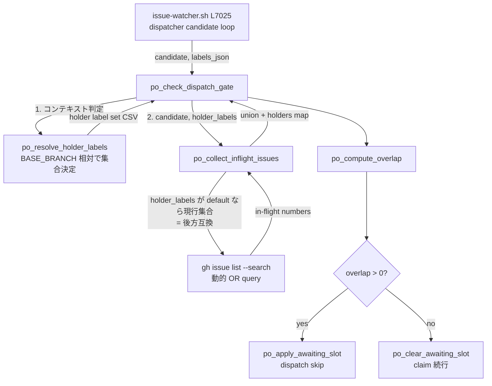

# Design Document

## Overview

**Purpose**: 本機能は Phase E Path Overlap Checker（#18）の dispatch-time gate が in-flight holder
集合を収集する際の「holder ラベル集合」を、固定値から**呼び出しコンテキスト（dispatch base /
promote target）に応じて決定する base 相対の契約**へ変える。これにより、develop へ統合済みで
`staged-for-release` のまま open に残った Issue が、同一 top-level path を編集する新規 Issue を
不要に awaiting-slot へ落とす過剰待機を解消し、gitflow（develop 起点）運用での dispatch 並列度を
回復させる価値を **watcher 運用者** に提供する。

**Users**: gitflow 運用（`BASE_BRANCH=develop`）かつ Phase E（`PATH_OVERLAP_CHECK=true`）を
有効化している watcher 運用者が、cron tick ごとの dispatch 判定 workflow で利用する。single-branch
運用者・Phase E 未使用者には挙動差ゼロで透過する。

**Impact**: 現在 `po_collect_inflight_issues`（`promote-pipeline.sh`）は in-flight 判定ラベル集合を
関数内部のヒアドキュメント `search_query` に**固定で埋め込み**、その中に `staged-for-release` を
含んでいる。本変更は、この固定集合を **関数引数（default = 現行集合）として外部化**し、唯一の
呼び出し元 `po_check_dispatch_gate` が dispatch コンテキストでは `staged-for-release` を除外した
集合を渡す形へ変える。bash の最小変更（引数追加 + default）で後方互換ゼロ差分を担保する。

### Goals

- dispatch base=develop の文脈で `staged-for-release` のみを持つ Issue を holder 集合から除外する（Req 1）
- promote target=main の文脈では `staged-for-release` を holder として維持する（Req 2）
- holder ラベル集合を呼び出しコンテキスト依存の単一契約として共有し、用途間で判定を壊さない（Req 3）
- コンテキスト判定不能・ラベル状態判定不能のときは holder 維持（安全側）へ倒す（Req 4）
- 成功基準: single-branch 運用で holder 集合・awaiting-slot 判定が本変更導入前と完全一致（NFR 1）、
  API 呼び出し回数不変（NFR 2）、dispatch 文脈での除外がログから判別可能（NFR 3）

### Non-Goals

- ready-for-review → staged-for-release への自動遷移実装（Out of Scope。dispatch 除外対象は `staged-for-release` のみ）
- promote-pipeline の main 昇格ロジック本体の変更
- Tasks Count Gate（#216）など他ゲートの変更
- `staged-for-release` の付与運用フロー新設（既存運用前提）
- **将来の promote 用途向け holder ラベルクエリ呼び出しの新設**（後述 Decision D2 の通り過剰抽象化として排除）

## Architecture

### Existing Architecture Analysis

- **対象モジュール**: `local-watcher/bin/modules/promote-pipeline.sh`（issue-watcher.sh 本体から
  `source` される関数定義モジュール。`set -euo pipefail` は本体側で宣言済み）。
- **現行の固定 holder 集合**: `po_collect_inflight_issues`（L233-283）が `search_query`（L241-244）に
  7 ラベル（`claude-claimed` / `claude-picked-up` / `awaiting-design-review` / `ready-for-review` /
  `needs-iteration` / `needs-rebase` / `staged-for-release`）の OR 検索を固定で持ち、`st-failed` /
  `awaiting-slot` を除外。
- **唯一の呼び出し元**: `po_check_dispatch_gate`（L536-600、L550 で呼ぶ）。本体 `issue-watcher.sh`
  L7025 が dispatcher candidate ループ内から `po_check_dispatch_gate` を呼ぶ。
- **promote-pipeline 側の判定経路（重要）**: `pp_collect_merged_issues`（L634 以降）は holder ラベル
  クエリではなく**実 merge 状態**（`is:merged base:$BASE_BRANCH` の PR 列挙）で判定しており、
  `po_collect_inflight_issues` の固定 holder 集合を**共有していない**。Promote 用途は別経路。
- **尊重すべき制約**: 既存 env var 名（`BASE_BRANCH` / `PROMOTION_TARGET_BRANCH` /
  `LABEL_STAGED_FOR_RELEASE` / `PATH_OVERLAP_CHECK`）を壊さない。NFR 2（API 回数不変）のため
  in-flight 列挙 1 回 / candidate ごと edit_paths 読み出し 1 回の構造を変えない。
- **解消する technical debt**: holder 集合がコンテキスト非依存に固定されている点（過剰保守）。

### Architecture Pattern & Boundary Map

**採用パターン**: *Parameterize from Above*（呼び出し側がポリシーを注入する）。holder ラベル集合
という「ポリシー値」を `po_collect_inflight_issues` の引数として外部化し、コンテキストを知る
呼び出し側（`po_check_dispatch_gate`）が決定する。collector は純粋に「与えられたラベル集合で
in-flight を列挙する」責務に純化する。



**Architecture Integration**:
- 採用パターン: *Parameterize from Above*（呼び出し側がコンテキストを知り、collector はポリシー
  非依存。投機的な promote 用呼び出し経路は新設しない＝ design-principles の「投機的抽象化排除」）。
- ドメイン／機能境界: コンテキスト判定（`po_resolve_holder_labels`）と in-flight 列挙
  （`po_collect_inflight_issues`）を分離。前者は「どのラベルを holder とみなすか」、後者は「与えられた
  ラベルで列挙する」を担う。
- 既存パターンの維持: `po_*` 関数群は `promote-pipeline.sh` に同居（#181 decision 3）。gh の OR 検索
  ヒアドキュメント形式（既存 Phase B/D が採用）を維持。
- 新規コンポーネントの根拠: `po_resolve_holder_labels` を新設するのは、コンテキスト判定ロジックを
  collector から独立させ単体テスト可能にするため（fail-safe 分岐の検証単位を作る）。

### Technology Stack

| Layer | Choice / Version | Role in Feature | Notes |
|-------|------------------|-----------------|-------|
| Frontend / CLI | bash 4+ | watcher スクリプトの実行基盤 | `set -euo pipefail` は本体宣言済み |
| Backend / Services | gh CLI | `gh issue list --search` で in-flight 列挙 | API 回数を増やさない（NFR 2） |
| Data / Storage | jq | union / holders map の JSON 構築 | 既存ロジック流用 |
| Messaging / Events | （なし） | — | — |
| Infrastructure / Runtime | cron / launchd（ユーザースコープ） | tick ごとに dispatcher 起動 | env var で BASE_BRANCH / PROMOTION_TARGET_BRANCH を渡す |

## File Structure Plan

### Directory Structure

```
local-watcher/bin/
├── modules/
│   └── promote-pipeline.sh   # 変更: po_collect_inflight_issues の引数化 +
│                             #       po_resolve_holder_labels 新設 +
│                             #       po_check_dispatch_gate からの集合注入 + NFR3 ログ
└── issue-watcher.sh          # 変更なし想定（po_check_dispatch_gate 呼び出し L7025 は
                              # シグネチャ不変。BASE_BRANCH / PROMOTION_TARGET_BRANCH は
                              # 既存 Config ブロック L108 / L118 をそのまま参照）

docs/specs/221-feat-watcher-path-overlap-holder-base-de/
├── requirements.md           # 既存（PM 確定済み、変更しない）
├── design.md                 # 本ファイル
├── tasks.md                  # 実装タスク分割
└── test-fixtures/            # 新規: holder ラベル集合決定のユニット/スモーク fixture
    └── test-holder-labels.sh # po_resolve_holder_labels / 動的 query 構築の回帰検証

README.md                     # 変更: 「Path Overlap Checker (Phase E)」節の
                              # in-flight 集合定義に base 相対の注記を追加 +
                              # 「staged-for-release と Phase E」の関係を追記
```

### Modified Files

- `local-watcher/bin/modules/promote-pipeline.sh` —
  - `po_collect_inflight_issues`: 第 2 引数 `holder_labels`（CSV、default = 現行 7 ラベル集合）を
    追加。`search_query` をその集合から**動的に**組み立てる。default を渡さなければ現行と同一クエリ
    （後方互換ゼロ差分 / NFR 1）。
  - `po_resolve_holder_labels`（新設）: コンテキスト引数（dispatch / promote）と `BASE_BRANCH` /
    `PROMOTION_TARGET_BRANCH` から holder ラベル集合 CSV を返す。判定不能時は full 集合（安全側 / Req 4）。
  - `po_check_dispatch_gate`: `po_resolve_holder_labels "dispatch"` の結果を
    `po_collect_inflight_issues` に渡す。除外発生時に NFR 3 ログを出力。
- `README.md` — 「Path Overlap Checker (Phase E)」節「in-flight 集合の定義」に base 相対化の注記
  （dispatch base=develop では `staged-for-release` を除外、promote target=main では維持）と、
  gitflow 運用ガイド（`staged-for-release` と Phase E holder の関係）を追記。

## Requirements Traceability

| Requirement | Summary | Components | Interfaces | Flows |
|-------------|---------|------------|------------|-------|
| 1.1 | dispatch base=develop で staged-for-release を holder 除外 | po_resolve_holder_labels, po_collect_inflight_issues | resolve → CSV → 動的 search_query | コンテキスト判定 → 除外集合注入 |
| 1.2 | staged-for-release 完了 Issue を path holder に計上しない | po_collect_inflight_issues | 動的 search_query が当該 Issue を列挙しない | in-flight 列挙から脱落 |
| 1.3 | 同一 path 新規 Issue を awaiting-slot に落とさない | po_check_dispatch_gate, po_compute_overlap | overlap 空 → claim 続行 | overlap=0 経路 |
| 1.4 | staged-for-release + 他 in-flight ラベル併存は holder 維持 | po_collect_inflight_issues | OR query が他ラベルでヒット | 併存ラベルで列挙される |
| 2.1 | promote target=main で staged-for-release を holder 維持 | po_resolve_holder_labels | resolve("promote") = full 集合 | promote 文脈は full |
| 2.2 | promote の overlap 判定を導入前と同一に維持 | po_collect_inflight_issues | default 集合 = 現行集合 | Decision D2（promote 別経路 / 挙動不変） |
| 3.1 | holder 集合をコンテキスト依存で決定 | po_resolve_holder_labels | resolve(context) → CSV | 単一の決定関数 |
| 3.2 | 用途共有時に判定を相互に壊さない | po_resolve_holder_labels, po_collect_inflight_issues | 引数注入で副作用なし | 純関数的集合決定 |
| 3.3 | dispatch / promote で staged-for-release 計上有無を独立決定 | po_resolve_holder_labels | context ごとに分岐 | Req1 / Req2 を独立に満たす |
| 4.1 | コンテキスト判定不能 → holder 維持 | po_resolve_holder_labels | 不明 context → full 集合 | fail-safe full |
| 4.2 | ラベル状態判定不能 → holder 維持 | po_collect_inflight_issues | query 構築失敗 → full 集合 fallback | fail-safe full |
| NFR 1.1 | single-branch ゼロ差分 | po_resolve_holder_labels, po_collect_inflight_issues | BASE==TARGET → full / default 集合 | 既存クエリと完全一致 |
| NFR 1.2 | 他 in-flight ラベル計上を不変に保つ | po_collect_inflight_issues | 6 ラベルは常時集合内 | 除外対象は staged-for-release のみ |
| NFR 2.1 | in-flight 列挙 1 回維持 | po_collect_inflight_issues | gh issue list 1 回 | query 文字列のみ変更 |
| NFR 2.2 | edit_paths 読み出し 1 回維持 | po_collect_inflight_issues | po_load_edit_paths 1 回/候補 | 変更なし |
| NFR 3.1 | 除外をログ出力 | po_check_dispatch_gate | po_log で除外ラベル記録 | dispatch 経路で出力 |

## Components and Interfaces

### Path Overlap Checker（dispatch-time gate）

#### po_resolve_holder_labels（新設）

| Field | Detail |
|-------|--------|
| Intent | 呼び出しコンテキストと branch 設定から holder ラベル集合（CSV）を決定する |
| Requirements | 1.1, 2.1, 3.1, 3.2, 3.3, 4.1, NFR 1.1 |

**Responsibilities & Constraints**
- 主責務: `dispatch` / `promote` のコンテキスト文字列を受け、holder とみなすラベルの CSV を返す。
- 判定キー: **multi-branch 運用判定** `BASE_BRANCH != PROMOTION_TARGET_BRANCH`。
  - `dispatch` かつ multi-branch（`BASE_BRANCH != PROMOTION_TARGET_BRANCH`）→ `staged-for-release` を
    **除外**した 6 ラベル集合（develop 統合済みは holder から外す / Req 1.1）。
  - `dispatch` かつ single-branch（`BASE_BRANCH == PROMOTION_TARGET_BRANCH`）→ **full 7 ラベル集合**。
    single-branch では `staged-for-release` が運用上付与されないため、除外しても列挙結果に差は出ない
    が、明示的に full を返すことで「除外集合を渡したことによる予期せぬ差分」をゼロにする（NFR 1.1）。
  - `promote` → **full 7 ラベル集合**（`staged-for-release` を維持 / Req 2.1）。
  - 上記いずれにも一致しない不明な context 値 → **full 7 ラベル集合**（fail-safe / Req 4.1）。
- invariants: 返す CSV は常に `claude-claimed` / `claude-picked-up` / `awaiting-design-review` /
  `ready-for-review` / `needs-iteration` / `needs-rebase` の 6 ラベルを含む（NFR 1.2）。差分は
  `staged-for-release` の有無のみ。

**Dependencies**
- Inbound: `po_check_dispatch_gate` — dispatch 文脈の集合取得 (Critical)
- Outbound: グローバル変数 `$BASE_BRANCH` / `$PROMOTION_TARGET_BRANCH` / `$LABEL_STAGED_FOR_RELEASE` 参照 (Critical)
- External: なし

**Contracts**: Service [x] / API [ ] / Event [ ] / Batch [ ] / State [ ]

##### Service Interface

```bash
# Args:
#   $1 = context（"dispatch" | "promote"）
# Stdout: holder ラベル CSV（例: "claude-claimed,claude-picked-up,...,needs-rebase"
#         dispatch×multi-branch では staged-for-release を含まない）
# Return: 0 always（判定不能でも full 集合を返す fail-safe）
po_resolve_holder_labels() { context="$1"; ...; }
```
- Preconditions: `$BASE_BRANCH` / `$PROMOTION_TARGET_BRANCH` / `$LABEL_STAGED_FOR_RELEASE` が
  本体 Config ブロックで束縛済み（bash 遅延束縛）。
- Postconditions: 6 基本ラベルを必ず含む CSV を stdout に出力。
- Invariants: `staged-for-release` の有無のみがコンテキストで変動する。

#### po_collect_inflight_issues（変更）

| Field | Detail |
|-------|--------|
| Intent | 与えられた holder ラベル集合で in-flight Issue を 1 回列挙し union + holders map を返す |
| Requirements | 1.2, 1.4, 2.2, 3.2, 4.2, NFR 1.1, NFR 1.2, NFR 2.1, NFR 2.2 |

**Responsibilities & Constraints**
- 主責務: 第 2 引数の holder ラベル集合（CSV）から `search_query` を**動的に**組み立て、open Issue を
  1 回列挙して各候補の edit_paths から union + holders map を構築する。
- 後方互換: 第 2 引数 default = 現行 7 ラベル集合。**引数を渡さない呼び出しは現行クエリと完全一致**
  （NFR 1.1）。`st-failed` / `awaiting-slot` 除外は集合非依存で固定維持（既存挙動）。
- データ所有権: holders map のキーは正規化前生 path（既存仕様維持）。
- invariants: NFR 2 — `gh issue list` は 1 回、各候補の `po_load_edit_paths` も 1 回。集合変更は
  クエリ文字列の組み立てのみで API 回数に影響しない。
- fail-safe（Req 4.2）: 渡された CSV が空 / 不正で query 構築に失敗する場合は full 集合へ fallback。

**Dependencies**
- Inbound: `po_check_dispatch_gate` — dispatch 文脈の列挙 (Critical)
- Outbound: `po_load_edit_paths`（候補ごと 1 回） / `gh issue list` / `jq` (Critical)
- External: gh / jq

**Contracts**: Service [x] / API [ ] / Event [ ] / Batch [ ] / State [ ]

##### Service Interface

```bash
# Args:
#   $1 = candidate issue number
#   $2 = holder labels CSV（省略時 default = 現行 7 ラベル集合 / 後方互換）
# Stdout: JSON object {"union": [...], "holders": {path: [issue#, ...]}}
# Return: 0 = 列挙 OK / 1 = gh API 失敗（caller は fail-open）
po_collect_inflight_issues() {
  candidate="$1"
  holder_labels="${2:-claude-claimed,claude-picked-up,awaiting-design-review,ready-for-review,needs-iteration,needs-rebase,staged-for-release}"
  ...
}
```
- Preconditions: candidate は数値。holder_labels は CSV（空なら default fallback）。
- Postconditions: union + holders map の JSON object を返す。
- Invariants: API 呼び出し回数は集合内容に依存しない（NFR 2）。

#### po_check_dispatch_gate（変更）

| Field | Detail |
|-------|--------|
| Intent | dispatch 文脈で holder 集合を解決して in-flight を収集し overlap 判定する gate |
| Requirements | 1.1, 1.3, 3.1, NFR 3.1 |

**Responsibilities & Constraints**
- 主責務: `po_resolve_holder_labels "dispatch"` で集合を解決し、`po_collect_inflight_issues
  "$candidate" "$holder_labels"` を呼ぶ。シグネチャ（`$1 candidate`, `$2 labels_json`）は不変で
  issue-watcher.sh L7025 への影響なし。
- NFR 3.1: 解決した集合が full 集合と異なる（= `staged-for-release` を除外した）場合、
  `po_log` で除外を判別可能に出力する（例: `holder-set context=dispatch excluded=staged-for-release base=develop`）。
- 既存の opt-in gate（`PATH_OVERLAP_CHECK = true` 厳密一致）/ fail-open / overlap ロジックは不変。

**Dependencies**
- Inbound: `issue-watcher.sh` dispatcher loop L7025 — candidate gate (Critical)
- Outbound: `po_resolve_holder_labels` / `po_collect_inflight_issues` / `po_compute_overlap` /
  `po_apply_awaiting_slot` / `po_clear_awaiting_slot` / `po_log` (Critical)
- External: なし（下流が gh / jq を使う）

**Contracts**: Service [x] / API [ ] / Event [ ] / Batch [ ] / State [x]（awaiting-slot 状態遷移は既存維持）

##### Service Interface

```bash
# Args: $1 = candidate issue number, $2 = candidate labels JSON
# Return: 0 = claim 続行 / 1 = dispatch skip（continue）
po_check_dispatch_gate() { candidate="$1"; labels_json="$2"; ... }
```
- Preconditions: `PATH_OVERLAP_CHECK = true`（厳密一致）でなければ早期 return 0（既存）。
- Postconditions: overlap>0 で skip（awaiting-slot 付与）、overlap=0 で claim 続行（awaiting-slot 除去）。
- Invariants: シグネチャ不変。本体呼び出し側の変更不要。

### Decisions（実装方式の選定）

#### D1: 実装方式 = 案A（holder ラベル集合を呼び出し側が引数で渡す）

**採用**: 案A。`po_collect_inflight_issues` に holder ラベル CSV 引数を追加し、default を**現行 7
ラベル集合に固定**。dispatch 文脈の呼び出し側のみ `staged-for-release` 除外集合を渡す。

**根拠**:
- **最小変更で後方互換ゼロ差分が自然成立**: default を現行集合に固定すれば、引数を渡さない既存
  呼び出し（および single-branch 運用）は現行と完全に同一の `search_query` を生成する（NFR 1.1）。
  flag 不要で、パラメータ default だけで互換を担保できる（本 repo CLAUDE.md の Feature Flag
  Protocol は宣言なし＝ opt-out のため、flag ではなく default で担保するのが規約に整合）。
- **NFR 2 を構造的に満たす**: 変更は `search_query` 文字列の組み立てのみで、`gh issue list` 1 回 /
  `po_load_edit_paths` 1 回/候補の構造に手を入れない。API 回数は不変。
- **案B の不採用**: ラベル非依存で実 merge 状態（`is:merged base:` PR 列挙）を holder 判定に使う案は
  label drift に強いが、候補ごとに PR merge 状態を引く追加 API が発生し **NFR 2 に違反するリスク**が
  高い。dispatch gate は cron tick ごとに全 candidate を走るため API コスト増は致命的。不採用。
- **案C の不採用**: dispatch 用 / promote 用で収集関数を分離する案は、現状 promote 側が holder
  ラベルクエリを共有していない（D2）ため、promote 用関数は**呼び出し元のない投機的抽象化**になる。
  design-principles の「投機的抽象化排除」に反する。Req 3（単一契約の共有）も、案A の引数注入で
  既に満たされる。不採用。

#### D2: promote-pipeline は holder ラベルクエリを共有していない → Req 2 は default 集合の固定で満たす

**事実**: オーケストレータ調査と本設計の再確認の通り、promote-pipeline 側（`pp_collect_merged_issues`
L634 以降）は in-flight holder ラベルクエリ（`staged-for-release` を含む固定集合）を**使っておらず**、
実 merge 状態（`is:merged base:$BASE_BRANCH` の PR 列挙）で判定している。`po_collect_inflight_issues`
の holder ラベルクエリを呼ぶのは `po_check_dispatch_gate` ただ 1 箇所（dispatch 文脈）のみ。

**結論（Req 2 / 3.2 / 2.2 の満たし方）**:
- Req 2「promote target=main では `staged-for-release` を holder 維持」は、`po_collect_inflight_issues`
  の **default 集合を現行（`staged-for-release` 含む）に固定**することで「契約上の holder 集合」として
  保全される。`po_resolve_holder_labels("promote")` も full 集合を返す（契約の明示）。
- Req 2.2「promote の overlap 判定を導入前と同一に維持」は、**promote 経路が holder ラベルクエリを
  そもそも通らない別経路**であるため、本変更によって promote の判定結果は一切変化しない（挙動不変
  保証）。すなわち Req 2 は「将来 promote 文脈で holder ラベルクエリを使う場合に備えた契約の保全」と
  「現状 promote 側は別経路なので挙動不変として自動的に満たす」の**両方で**充足される。
- **過剰抽象化の回避**: 上記事実があっても、promote 文脈で `po_collect_inflight_issues` を呼ぶ新規
  経路は**作らない**（呼び出し元のないコードを増やさない / design-principles）。`po_resolve_holder_labels`
  は context="promote" 分岐を持つが、これは Req 3.3（dispatch / promote の独立決定を単一契約で表現）
  を満たすための**契約表現**であり、実呼び出し経路の新設ではない。dispatch からのみ呼ばれる。

#### D3: コンテキスト判定キー = multi-branch 運用判定（`BASE_BRANCH != PROMOTION_TARGET_BRANCH`）

**採用**: dispatch gate からの呼び出しでは、`BASE_BRANCH != PROMOTION_TARGET_BRANCH`（multi-branch /
gitflow 運用）のときのみ `staged-for-release` を除外する。`BASE_BRANCH == PROMOTION_TARGET_BRANCH`
（single-branch、既定 `main`/`main`）のときは full 集合を使う。

**根拠**:
- 要件は「dispatch base=develop」を相対概念として述べるが、実装の判定キーは既存 Config の
  `BASE_BRANCH` / `PROMOTION_TARGET_BRANCH` で表現するのが最も自然かつ既存規約と整合する
  （Phase B / #89 が同じ 2 変数で multi-branch を判定）。新規の env var / フラグを追加しない。
- single-branch では `staged-for-release` が運用上使われない（README L1070）ため、multi-branch
  ガードにより single-branch では full 集合となり**ゼロ差分**（NFR 1.1）。
- fail-safe（Req 4.1）: context 値が未知 / branch 変数が未束縛などで判定不能なら full 集合へ倒す
  （= `staged-for-release` を含む安全側。holder から誤って外して path 衝突を見逃すリスクを避ける）。

```
holder 集合決定の真理値表（po_resolve_holder_labels）
┌────────────┬──────────────────────────────┬──────────────────────────┐
│ context    │ BASE_BRANCH vs TARGET        │ 返す集合                  │
├────────────┼──────────────────────────────┼──────────────────────────┤
│ dispatch   │ != （multi-branch / gitflow）│ 6 ラベル（SfR 除外）      │ Req 1.1
│ dispatch   │ == （single-branch）         │ 7 ラベル（full）          │ NFR 1.1
│ promote    │ （不問）                     │ 7 ラベル（full）          │ Req 2.1
│ 不明な値    │ （不問）                     │ 7 ラベル（full / 安全側） │ Req 4.1
└────────────┴──────────────────────────────┴──────────────────────────┘
  SfR = staged-for-release。6 ラベル = full から SfR を除いた集合。
```

## Data Models

### Domain Model

- 本機能はデータ永続化を持たない（holder 集合はラベルクエリの導出値）。
- ラベル集合の値オブジェクト: CSV 文字列（`gh issue list --search` の OR query 素材）。
- holders map / union JSON object のスキーマは既存（`po_collect_inflight_issues` のヘッダコメント
  L207-214）を変更しない。

## Error Handling

### Error Strategy

fail-safe（holder 維持 = 安全側）と fail-open（dispatch 続行）を文脈で使い分ける既存方針を踏襲する。

### Error Categories and Responses

- **User Errors (4xx 相当)**: 該当なし（env 設定ミスは fail-safe で full 集合に倒す）。
- **System Errors (5xx 相当)**:
  - `gh issue list` 失敗 → `po_collect_inflight_issues` return 1 → `po_check_dispatch_gate` が
    fail-open（warn + claim 続行）。既存挙動を維持。
  - holder ラベル CSV が空 / 不正で query 構築失敗 → full 集合へ fallback（Req 4.2、安全側）。
- **Business Logic Errors (422 相当)**:
  - context 値が `dispatch` / `promote` 以外（判定不能）→ full 集合（Req 4.1、安全側）。
  - branch 変数が想定外（未束縛等）→ full 集合（Req 4.1）。

## Testing Strategy

- **Unit Tests**:
  1. `po_resolve_holder_labels "dispatch"` が `BASE_BRANCH=develop` / `PROMOTION_TARGET_BRANCH=main`
     で `staged-for-release` を含まない 6 ラベル CSV を返す（Req 1.1）。
  2. `po_resolve_holder_labels "dispatch"` が `BASE_BRANCH=main` / `PROMOTION_TARGET_BRANCH=main`
     で full 7 ラベル CSV を返す（NFR 1.1）。
  3. `po_resolve_holder_labels "promote"` が full 7 ラベル CSV を返す（Req 2.1）。
  4. `po_resolve_holder_labels "garbage"`（不明 context）が full 7 ラベル CSV を返す（Req 4.1）。
  5. `po_collect_inflight_issues "<n>"`（第 2 引数省略）が組み立てる `search_query` が現行固定
     クエリと文字列一致（NFR 1.1 ゼロ差分）。
- **Integration Tests**:
  1. dispatch gate（multi-branch）で `staged-for-release` のみ Issue が in-flight 列挙から脱落し
     overlap=0 → claim 続行（Req 1.2 / 1.3）。
  2. `staged-for-release` + `claude-claimed` 併存 Issue が dispatch gate で holder 維持される（Req 1.4）。
  3. single-branch 運用の dispatch gate で本変更導入前と同一の holder 集合 / awaiting-slot 判定（NFR 1.1）。
- **E2E/UI Tests**:
  1. 本 repo で `BASE_BRANCH=develop PATH_OVERLAP_CHECK=true` の dry run / test issue により、
     `staged-for-release` 完了 Issue が新規 Issue を awaiting-slot に落とさないことを観測（Req 1.3）。
  2. NFR 3 ログ（除外を判別可能な `path-overlap:` 行）が cron ログに出力されることを grep 確認。
- **Performance/Load**:
  1. dispatch gate 1 回あたり `gh issue list` 呼び出しが 1 回のままであることを `--debug` ログ /
     呼び出しカウントで確認（NFR 2.1）。
  2. candidate ごとの `po_load_edit_paths` が 1 回のままであることを確認（NFR 2.2）。

## Security Considerations

- 本機能は新規の外部サービス呼び出し・認証情報・機密データを扱わない。既存 gh CLI 認証を流用。
- ラベル CSV はコード内固定文字列とラベル定数（`$LABEL_STAGED_FOR_RELEASE`）から構築され、
  外部入力をクエリへ注入しない（インジェクション面の新規リスクなし）。

## Performance & Scalability

- NFR 2 の通り API 呼び出し回数は不変（in-flight 列挙 1 回 / candidate ごと edit_paths 1 回）。
- 変更はクエリ文字列組み立てのみで、cron tick あたりの計算量・ネットワーク負荷を増やさない。
