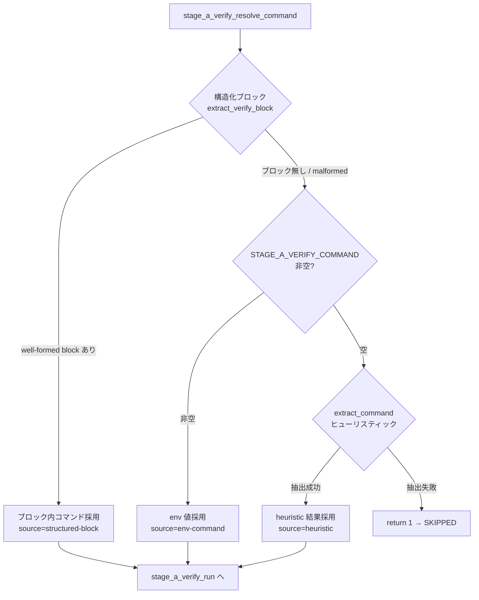

# Design Document

## Overview

**Purpose**: 本機能は stage-a-verify gate (#125) の verify コマンド特定を、ヒューリスティック
推測（output 側の推測）から **Architect が構造化ブロックで明示宣言する input 契約**へ移行する。
ツール名で始まる散文（例: `- shellcheck 警告ゼロを確認`）を誤ってコマンドとして実行する誤発火
（#160 / #219 / #221 で繰り返し発生）を構造的に根絶することを目的とする。

**Users**: Architect は `tasks.md` にセンチネル付きの構造化ブロックで verify コマンドを宣言する。
運用者は `STAGE_A_VERIFY_COMMAND` env を散文誤認回避の固定 escape hatch として引き続き使える。
watcher（自身）は Stage A 完了直前にブロック内コマンドを決定論的に解決・再実行する。

**Impact**: 現在の `stage_a_verify_resolve_command` は `STAGE_A_VERIFY_COMMAND` を最優先 escape
hatch とし、空ならヒューリスティック抽出に倒す 2 段構成である。本変更は、その前段に「構造化
ブロックの厳密パース」を新設し、解決順序を **ブロック → env → ヒューリスティック → SKIPPED**
の 4 段に拡張する。既存ヒューリスティック抽出（`stage_a_verify_extract_command`）の awk は
#160 対応で既に fenced code block 内を keyword マッチ対象から除外しているため、センチネル付き
fence を専用に厳密パースする新経路と **構造的に衝突しない**（既存経路は従来通り fence を無視）。

### Goals

- 構造化 verify ブロックを input 契約の第一手段として導入し、決定論的にコマンドを解決する（Req 1）
- 解決順序を後方互換な fallback 連鎖（ブロック → env → ヒューリスティック → SKIPPED）に拡張する（Req 2）
- 信頼モデル（Architect 定義・Developer 不可侵）を tasks-generation ルールと architect プロンプトに明文化する（Req 3, 4）
- design-review-gate に well-formed 検証 Mechanical Check を追加し、malformed を確定前に検出する（Req 5）
- README に解決順序と escape hatch の位置づけを文書化する（Req 6）
- 既存 spec / env 運用 / ラベル遷移 / exit code / ログ書式の後方互換を一切壊さない（NFR 1〜4）

### Non-Goals

- ヒューリスティック抽出（keyword 集合・awk 走査ロジック）そのものの仕様変更・keyword 追加（Out of Scope）
- `STAGE_A_VERIFY_TIMEOUT` の既定値・タイムアウト機構の変更
- round counter（差し戻し / escalate）の段数・判定ロジックの変更
- 構造化ブロックを採用しない既存 spec の遡及的な書き換え（retrofit）
- 外部 Feature Flag SaaS 連携や verify コマンドの動的出し分け

## Architecture

### Existing Architecture Analysis

- **現アーキテクチャ**: `local-watcher/bin/modules/stage-a-verify.sh` が source される単一モジュール。
  解決責務は `stage_a_verify_resolve_command`（合成）→ `stage_a_verify_extract_command`（ヒューリスティック）
  に分離済み。実行は `stage_a_verify_run`（Gate 1 DISABLED / Gate 2 SKIPPED / Gate 3 keyword 行頭一致 /
  Execute / 結果分岐）。
- **尊重すべき境界**: 解決（resolve）と実行（run）の責務分離。call site（`run_impl_pipeline` 内の
  `stage_a_verify_run`）は本体に残置。新規パース関数も「解決系」に属する純関数として追加し、
  実行系・round counter・失敗ハンドラには手を入れない。
- **維持すべき統合点**: `stage_a_verify_resolve_command` の戻り値契約（0=解決成功で stdout に 1 行 /
  1=SKIPPED）。`stage_a_verify_run` の戻り値 0/1/2 と call site のマッピング（NFR 1.4）。3 段 prefix
  ログ書式（NFR 2.2）。
- **解消する technical debt**: 散文誤認。ただし本 Issue では heuristic 経路は温存（格下げ）し、
  上位に決定論的経路を足すことで段階移行する（heuristic の改修は Out of Scope）。
- **追い風（衝突回避の根拠）**: `stage_a_verify_extract_command` の awk は `^[[:space:]]*```` で
  fence 開閉をトグルし `in_fence` 行を `next` でスキップする（line 202-206）。よって構造化ブロックの
  fence 中身は **既存ヒューリスティックの抽出対象から元々除外されている**。新パース経路が同じ fence
  を「専用に拾う」ことで、両経路が同じ行を二重に解釈する事故が構造的に起きない。

### Architecture Pattern & Boundary Map

**Architecture Integration**:
- 採用パターン: Chain of Responsibility（解決手段の優先順位付き連鎖）。`stage_a_verify_resolve_command`
  が薄いオーケストレータとして、4 つの解決手段を上から順に試す。
- ドメイン／機能境界: 「解決（どのコマンドを実行するか）」と「実行（どう実行し失敗をどう扱うか）」を
  分離する既存境界を維持。新パース関数は解決系の純関数（副作用なし / `tasks.md` を書き換えない、NFR 3.2）。
- 既存パターンの維持: resolve → extract の委譲構造、stdout 1 行返却契約、3 段 prefix ログ。
- 新規コンポーネントの根拠: `stage_a_verify_extract_verify_block`（仮称）は、センチネル直後の fence
  を厳密パースする責務を持つ。heuristic の awk とは抽出基準（行頭 keyword 一致 vs センチネル+fence 構造）
  が根本的に異なるため、既存 awk を拡張せず独立関数として分離する。



> **解決順序の変更点（最重要・確認事項参照）**: 現行は env が最優先（line 292-295）。本変更で
> 構造化ブロックを env の **上** に挿入する。malformed なブロックは「採用せず次の fallback へ」倒す
> ことで、ブロック記述ミスが env / heuristic への安全な後退を妨げない（Req 5 の static 検出とは別レイヤ）。

### Technology Stack

| Layer | Choice / Version | Role in Feature | Notes |
|-------|------------------|-----------------|-------|
| Frontend / CLI | bash 4+ | watcher 実行系（既存） | `set -euo pipefail` は本体側で宣言済み |
| Backend / Services | bash 関数 + awk (POSIX ERE) | センチネル付き fence の厳密パース | 既存 `extract_command` の awk 流儀に合わせる |
| Data / Storage | `tasks.md`（読み取り専用） | 構造化ブロックの入力源 | 解決処理は書き換えない（NFR 3.2） |
| Messaging / Events | gh CLI（既存） | round=1 差し戻しコメント（変更なし） | 失敗ハンドラは不変 |
| Infrastructure / Runtime | cron / launchd（既存） | env 経由の設定（変更なし） | env var 名・既定値不変（NFR 1.3） |
| Docs / Rules | markdown | tasks-generation / design-review-gate / architect / README | 規約・プロンプト・運用文書の整合 |

## File Structure Plan

### Directory Structure

```
local-watcher/bin/modules/
└── stage-a-verify.sh          # [変更] verify ブロック抽出関数を新設 + resolve 順序変更

.claude/rules/
├── tasks-generation.md        # [変更] 構造化 verify ブロック規約の追加（書式・センチネル・実コマンド必須）
└── design-review-gate.md      # [変更] Mechanical Check「verify ブロック well-formed 検証」追加

.claude/agents/
└── architect.md               # [変更] tasks.md テンプレに verify ブロック宣言手順を追記

docs/specs/224-feat-watcher-stage-a-verify-verify-archi/
├── design.md                  # [新規] 本ファイル
├── tasks.md                   # [新規] 実装タスク分割（verify ブロック宣言を含む）
└── test-fixtures/             # [新規] 抽出ロジックの境界 fixture（#131/#160 慣習を踏襲）
    ├── block-well-formed.md       # センチネル + 単一行コマンド fence（well-formed）
    ├── block-multiline.md         # 複数行 / && 連結を含む fence
    ├── block-with-lang-tag.md     # ```sh 言語タグ付き fence
    ├── block-no-fence.md          # センチネルあり / fence 無し（malformed）
    ├── block-unclosed-fence.md    # fence 開いて閉じない（malformed）
    ├── block-empty.md             # fence 中身空（malformed）
    ├── block-multiple.md          # センチネル+fence が複数（最初の 1 つを採用）
    └── no-block-heuristic.md      # ブロック無し（heuristic 経路に倒れる回帰確認）

README.md                      # [変更] STAGE_A_VERIFY_COMMAND 用途追記 + fallback 連鎖説明
```

### Modified Files

- `local-watcher/bin/modules/stage-a-verify.sh` — (1) 新関数 `stage_a_verify_extract_verify_block`
  を追加（センチネル直後 fence の厳密パース、well-formed 判定、stdout 1 行/複数行返却）。(2)
  `stage_a_verify_resolve_command` を 4 段連鎖へ変更し、各分岐で解決手段名（source）をログに残す（NFR 2.1）。
  (3) ヘッダコメント（用途リスト）に新関数を追記。`extract_command` / `_sav_cmd_starts_with_keyword`
  / `stage_a_verify_run` の Gate 構造・round counter・失敗ハンドラは **無変更**。
- `.claude/rules/tasks-generation.md` — 「構造化 verify ブロック」節を追加。センチネル記法・fence
  書式・実行可能コマンド必須・既存 checkbox / numeric ID 規約との非干渉を明記（Req 4.1, 4.3, 4.4）。
- `.claude/rules/design-review-gate.md` — Mechanical Checks に「verify block well-formed check」節を
  既存（Budget overflow / checkbox enforcement）と同じ書式で追加（Req 5）。
- `.claude/agents/architect.md` — tasks.md テンプレに verify ブロック宣言手順を追記（Req 4.2）。
- `README.md` — `STAGE_A_VERIFY_COMMAND` 用途追記 + 構造化ブロックとの fallback 連鎖説明（Req 6）。
- `docs/specs/.../test-fixtures/` + smoke script — 抽出ロジックの境界回帰確認（#131/#160 の fixture
  + smoke script 慣習を踏襲）。

## Requirements Traceability

| Requirement | Summary | Components | Interfaces | Flows |
|-------------|---------|------------|------------|-------|
| 1.1 | ブロック内コマンドのみ解決 | extract_verify_block, resolve_command | parse センチネル+fence | resolve chain 第 1 段 |
| 1.2 | ブロック解決時は heuristic 不実行 | resolve_command | early return | chain 短絡 |
| 1.3 | Architect が実行可能コマンドを記述 | tasks-generation rule, architect.md | ルール明文化 | （設計時規約） |
| 1.4 | 複数行 / && をそのまま実行 | extract_verify_block, stage_a_verify_run | bash -c 既存契約 | 中身保持 → Execute |
| 1.5 | 散文と構造的分離 | extract_verify_block | センチネル+fence 限定パース | 第 1 段 |
| 2.1 | ブロック無→env 参照 | resolve_command | chain 第 2 段 | fallback |
| 2.2 | ブロック無+env 空→heuristic | resolve_command, extract_command | chain 第 3 段 | fallback |
| 2.3 | いずれも不可→SKIPPED | resolve_command | return 1 | Gate 2 |
| 2.4 | ブロック+env 双方存在時の単一順序 | resolve_command | ブロック優先（確認事項） | chain 順序 |
| 2.5 | design-less impl は既存順序 | resolve_command | tasks.md 不在→ブロック無扱い | env/heuristic へ |
| 3.1 | ブロックを設計成果物・人間レビュー対象 | tasks-generation rule, architect.md | ルール明文化 | 設計 PR ゲート |
| 3.2 | Developer はブロック不変 | architect.md, CLAUDE.md 整合 | ルール明文化 | （信頼モデル） |
| 3.3 | 矛盾時は PR「確認事項」で指摘 | （Developer 規約整合） | ルール明文化 | （信頼モデル） |
| 4.1 | センチネル記法・書式の明文化 | tasks-generation rule | 規約節 | （設計時） |
| 4.2 | Architect プロンプトに手順 | architect.md | テンプレ追記 | （設計時） |
| 4.3 | 実コマンドの構造化ブロックを要求 | tasks-generation rule | 規約節 | （設計時） |
| 4.4 | checkbox / numeric ID 規約と非干渉 | tasks-generation rule | 規約節 | （設計時） |
| 5.1 | well-formed 判定（自己レビュー） | design-review-gate rule | Mechanical Check | 確定前 |
| 5.2 | malformed を違反報告 | design-review-gate rule | Mechanical Check | 確定前 |
| 5.3 | verify 対象あり+ブロック/env 両無の検出可能性 | design-review-gate rule | Mechanical Check（warn） | 確定前（確認事項） |
| 5.4 | 既存 spec を遡及違反としない | design-review-gate rule | 適用範囲限定 | 後方互換 |
| 6.1 | ブロックを第一手段として説明 | README | 文書 | — |
| 6.2 | fallback 連鎖の記載 | README | 文書 | — |
| 6.3 | env を固定用途 escape hatch と位置づけ | README | 文書 | — |
| NFR 1.1 | 既存 spec の heuristic 挙動維持 | resolve_command, extract_command | fence 無視で不変 | fallback |
| NFR 1.2 | ENABLED=false 時 skip 不変 | stage_a_verify_run Gate 1 | 無変更 | Gate 1 |
| NFR 1.3 | env var 名・既定値不変 | issue-watcher.sh Config | 無変更 | — |
| NFR 1.4 | ラベル / exit code / round 不変 | stage_a_verify_run, _sav_handle_failure | 無変更 | — |
| NFR 2.1 | 解決手段をログ記録 | resolve_command, stage_a_verify_run | source ログ | EXEC 前 |
| NFR 2.2 | 3 段 prefix ログ書式維持 | sav_log | 無変更 | — |
| NFR 3.1 | 冪等な解決結果 | extract_verify_block | 決定論パース | resolve |
| NFR 3.2 | tasks.md 書き換えない | extract_verify_block | 読み取り専用 | resolve |
| NFR 4.1 | 言語非依存 | extract_verify_block | 任意コマンド文字列 | resolve |

## Components and Interfaces

### Resolution Layer（解決系）

#### stage_a_verify_extract_verify_block（新規）

| Field | Detail |
|-------|--------|
| Intent | `tasks.md` のセンチネル付き構造化ブロックから verify コマンドを決定論的に抽出する純関数 |
| Requirements | 1.1, 1.4, 1.5, 5.1, NFR 3.1, NFR 3.2, NFR 4.1 |

**Responsibilities & Constraints**
- 入力: 環境変数 `REPO_DIR` / `SPEC_DIR_REL`（`tasks.md` パス解決に使用）
- `tasks.md` 不在なら return 1（ブロック無扱い → 上位 fallback へ）
- センチネル行 `<!-- stage-a-verify -->` の **直後に来る最初の fenced code block** の中身のみを抽出
- well-formed 条件: (a) センチネルが存在 / (b) 直後（空行スキップ後）に fence 開始行 ` ``` ` が来る /
  (c) fence が閉じている / (d) fence 中身が非空（空白行のみは空扱い）
- malformed（上記いずれか不成立）なら return 1（**採用せず次の fallback へ**、Req 5 の static 検出とは別レイヤ）
- 複数行 / `&&` 連結は fence 中身を **改行込みでそのまま** 保持して返す（watcher 側で連結記号を解釈しない、Req 1.4）
- センチネル+fence が複数ある場合は **最初の 1 つ** のみ採用（決定論性、NFR 3.1）
- fence 言語タグ（` ```sh ` / ` ```bash ` 等）は許容し、タグ自体は中身に含めない
- 副作用なし（`tasks.md` を書き換えない、NFR 3.2）。同一入力に同一結果（NFR 3.1）

**Dependencies**
- Inbound: `stage_a_verify_resolve_command` — chain 第 1 段として呼ぶ (High)
- Outbound: awk (POSIX ERE) — fence の境界判定とセンチネル直後性の判定 (High)
- External: なし

**Contracts**: Service [x]

##### Service Interface

```bash
# 戻り値: 0 = well-formed ブロック抽出成功 / 1 = ブロック無し or malformed or tasks.md 不在
# stdout: 抽出したコマンド（成功時のみ。複数行は改行込みで保持）
stage_a_verify_extract_verify_block() # 引数なし、env 経由（REPO_DIR / SPEC_DIR_REL）
```
- Preconditions: `REPO_DIR` / `SPEC_DIR_REL` が設定済み（呼び出し側の既存前提と同一）
- Postconditions: 成功時は非空のコマンド文字列を stdout に 1 ブロック分出力。失敗時は stdout 空 + return 1
- Invariants: `tasks.md` を変更しない / 同一入力に同一出力（決定論）

##### パース規約（決定論化の詳細）

- **センチネル**: 行を trim した結果が厳密に `<!-- stage-a-verify -->` に一致する行（前後空白許容、
  行内の他テキストは不可）。これを「アンカー行」とする。
- **直後性**: アンカー行の次行以降で、空行を任意個スキップした後の **最初の非空行が fence 開始**
  （trim 後 ` ``` ` で始まる）であること。fence 以外の非空行が先に来たら malformed（採用しない）。
- **fence 言語タグ**: fence 開始行の ` ``` ` 直後の言語識別子（`sh` / `bash` 等）は読み飛ばす。
- **fence 終了**: 次に現れる trim 後 ` ``` ` 行で閉じる。EOF まで閉じなければ malformed。
- **中身**: fence 開始行と終了行の間の全行。trim 後すべて空なら malformed（空ブロック扱い）。
  非空なら **元の改行・インデントを保持**して返す（`&&` 連結や複数行コマンドの意味を壊さない）。
- **複数ブロック**: 上記を満たす最初のアンカー+fence のみ採用し、以降は無視。

#### stage_a_verify_resolve_command（変更）

| Field | Detail |
|-------|--------|
| Intent | 4 段の解決手段を優先順位順に試し、最初に解決した手段のコマンドと source を返す |
| Requirements | 1.2, 2.1, 2.2, 2.3, 2.4, 2.5, NFR 1.1, NFR 2.1 |

**Responsibilities & Constraints**
- 解決順序（**本変更の核心**）:
  1. `stage_a_verify_extract_verify_block` が成功 → そのコマンドを採用（source=`structured-block`）。
     以降の手段は試さない（Req 1.2 短絡）
  2. `STAGE_A_VERIFY_COMMAND` 非空 → env 値を採用（source=`env-command`）
  3. `stage_a_verify_extract_command` が成功 → heuristic 結果を採用（source=`heuristic`）
  4. いずれも不可 → return 1（SKIPPED、Req 2.3）
- design-less impl（`tasks.md` 不在）: 第 1 段の `extract_verify_block` が return 1（ブロック無扱い）→
  第 2 段の env、第 3 段の heuristic（こちらも tasks.md 不在で return 1）に倒れる。**結果として既存の
  env→SKIPPED 順序に一致**（Req 2.5）
- 解決手段名（source）を呼び出し側がログに出せるよう公開する。実装案: 解決した source を **stderr に
  1 行**（`sav_log` 経由、`source=<手段>` 形式）で出し、stdout はコマンド本体のみに保つ。これにより
  `stage_a_verify_run` の EXEC ログ前に「どの手段で解決したか」が必ず記録される（NFR 2.1）
- 後方互換: 構造化ブロックを持たない既存 spec は第 1 段を素通りし、env（設定済みなら）または heuristic に
  到達 → **本機能導入前と user-observable に同一**（NFR 1.1）

**Dependencies**
- Inbound: `stage_a_verify_run`（Gate 2）— 解決結果でコマンド確定 (High)
- Outbound: `stage_a_verify_extract_verify_block`（第 1 段）/ `stage_a_verify_extract_command`（第 3 段）(High)
- External: env `STAGE_A_VERIFY_COMMAND`（第 2 段）(Medium)

**Contracts**: Service [x]

##### Service Interface

```bash
# 戻り値: 0 = 解決成功（いずれかの手段） / 1 = SKIPPED
# stdout: 解決したコマンド（成功時のみ、1 ブロック分）
# stderr: source=<structured-block|env-command|heuristic> の 1 行（sav_log 経由、NFR 2.1）
stage_a_verify_resolve_command()
```
- Preconditions: 既存と同一
- Postconditions: 解決手段名がログに 1 行残る。stdout はコマンド本体のみ
- Invariants: 同一 `tasks.md` + 同一 env に対し同一結果（NFR 3.1）

#### stage_a_verify_run（無変更・統合点として記載）

| Field | Detail |
|-------|--------|
| Intent | 既存の統合ランナー。Gate 1-3 + Execute + 結果分岐。**本 Issue では変更しない** |
| Requirements | 1.4, NFR 1.2, NFR 1.4, NFR 2.1, NFR 2.2 |

**Responsibilities & Constraints**
- Gate 1 DISABLED（`STAGE_A_VERIFY_ENABLED=false` 厳密一致）/ Gate 2 SKIPPED（resolve 失敗）/
  Gate 3 keyword 行頭一致（env 経路は bypass）の構造を維持
- **Gate 3 と新経路の関係（重要な後方互換考慮）**: Gate 3 は `STAGE_A_VERIFY_COMMAND` 空のときのみ
  `_sav_cmd_starts_with_keyword` で防御する（line 474-479）。構造化ブロック由来のコマンドは Architect が
  設計 PR で人間レビュー済みの input 契約であり、heuristic の defense-in-depth とは前提が異なる。設計判断:
  **構造化ブロック経由（source=structured-block）は env 経路と同様に Gate 3 を bypass する**（人間レビュー
  済みの信頼境界、Req 3.1）。実装上は resolve が返す source を `stage_a_verify_run` が参照できるよう、
  source を共有する最小の仕組み（後述 Decision）で実現する
- `bash -c "$cmd"` に **そのまま**渡し `&&` / `||` / `;` を解釈しない既存契約を維持（Req 1.4）
- 失敗ハンドラ / round counter / ラベル遷移 / exit code は完全無変更（NFR 1.4）

**Dependencies**
- Inbound: `run_impl_pipeline`（call site、本体に残置）(High)
- Outbound: `stage_a_verify_resolve_command` / `_sav_cmd_starts_with_keyword` / `_sav_handle_failure` (High)

##### Decision: source の `stage_a_verify_run` への伝達方法

Gate 3 bypass 判定のために `stage_a_verify_run` が「ブロック由来か env 由来か」を知る必要がある。

- **採用案**: resolve 内で解決時にモジュールスコープ変数（例 `_SAV_RESOLVED_SOURCE`）へ source を
  代入し、`stage_a_verify_run` の Gate 3 判定を「`STAGE_A_VERIFY_COMMAND` 非空 **または**
  `_SAV_RESOLVED_SOURCE=structured-block`」のとき bypass に拡張する。bash の遅延束縛で同一 source 内
  関数間の変数共有は安全（既存 module も `$REPO_DIR` 等をグローバル参照する流儀と一致）。
- **代替案 A（不採用）**: resolve の stdout 1 行目に source、2 行目以降にコマンドを埋める。複数行
  コマンド（Req 1.4）と相性が悪く、パース境界が増える。
- **代替案 B（不採用）**: Gate 3 を全廃。heuristic 経路の defense-in-depth（#160 Req 5.3）を失うため不可。

### Rules / Prompt Layer（規約・プロンプト系）

#### tasks-generation rule 追加（構造化 verify ブロック節）

| Field | Detail |
|-------|--------|
| Intent | 構造化 verify ブロックのセンチネル記法・書式・実コマンド必須を明文化する |
| Requirements | 4.1, 4.3, 4.4, 1.3, 3.1 |

**Responsibilities & Constraints**
- センチネル `<!-- stage-a-verify -->` 直後に fenced code block を置く canonical 書式を定義
- 中身は **散文ではなく実行可能コマンド**（複数行 / `&&` 可）であることを要求（Req 1.3, 4.3）
- 既存 checkbox 規約・numeric ID 階層規約と **矛盾しない** ことを明記（ブロックはタスク行ではなく
  補助ブロックなので checkbox enforcement / budget count regex に **マッチしない**、Req 4.4）
- verify 対象が無い spec はブロックを省略でき、その場合 heuristic / env / SKIPPED に倒れる旨を記載
- 配置場所の推奨（`tasks.md` 末尾の `## Verify` 見出し配下等）を例示。`## Verify` 見出しは任意
  （パースはセンチネル基準で見出し非依存）

**Contracts**: なし（ドキュメント規約）

#### design-review-gate rule 追加（verify block well-formed check）

| Field | Detail |
|-------|--------|
| Intent | Architect 自己レビュー時に構造化 verify ブロックが well-formed かを機械的に判定する |
| Requirements | 5.1, 5.2, 5.3, 5.4 |

**Responsibilities & Constraints**
- 既存 Mechanical Checks（Budget overflow / checkbox enforcement）と同じ節構造で追加
- well-formed 判定パターンを明記（センチネル存在 / 直後 fence / fence 閉じ / 中身非空）。判定 regex /
  手順を参照実装として記載（モジュール側 awk と同一基準を明記し、ドリフト防止の相互参照を置く）
- malformed 検出時は違反として報告し確定前修正を促す（Req 5.2）
- **適用範囲**: Architect が新規生成・編集する `tasks.md` に限定。既存 merge 済み spec は遡及違反と
  しない（Req 5.4、retrofit 不要）
- Req 5.3（verify 対象ありなのにブロック/env 両無）: **warn 止まり**（reject しない）を採用。design-less
  impl や verify 不要 spec を誤 reject しないため（確認事項参照）

**Contracts**: なし（ドキュメント規約）

### Documentation Layer

#### README 更新

| Field | Detail |
|-------|--------|
| Intent | 解決順序（fallback 連鎖）と env の固定用途 escape hatch 位置づけを文書化する |
| Requirements | 6.1, 6.2, 6.3 |

**Responsibilities & Constraints**
- 「Stage A Verify Gate (#125)」節に解決順序「構造化ブロック → `STAGE_A_VERIFY_COMMAND` → heuristic →
  SKIPPED」を追記（Req 6.2）
- 構造化ブロックを第一手段として説明（Req 6.1）。env を「散文誤認回避の固定用途 escape hatch」と
  位置づけ（Req 6.3）。状態遷移 Mermaid に解決手段分岐を追記
- env var 表（line 3262-3266）は名前・既定値を変えず、`STAGE_A_VERIFY_COMMAND` の用途説明を「最優先で
  実行」→「構造化ブロックが無い場合に参照する固定 escape hatch」に文言修正（意味は env→旧仕様で挙動
  変化があるため migration note を併記）

## Data Models

### Domain Model

- アグリゲート: 「verify コマンド解決結果」= { command: string（複数行可）, source: enum
  (`structured-block` | `env-command` | `heuristic`) }。トランザクション境界は 1 回の
  `stage_a_verify_resolve_command` 呼び出し（冪等、NFR 3.1）。
- 値オブジェクト: 構造化 verify ブロック = { sentinel: 固定文字列, fence_lang: optional, body: string }。
- invariants: body は非空（well-formed 条件）。解決は `tasks.md` を書き換えない（NFR 3.2）。

### Physical Data Model

- 入力: `$REPO_DIR/$SPEC_DIR_REL/tasks.md`（読み取り専用）。
- round counter sidecar `.stage-a-verify-round`（既存・無変更）。

## Error Handling

### Error Strategy

malformed なブロックは「実行時（watcher）は安全側に倒して次の fallback へ後退」「設計時
（design-review-gate）は静的に検出して人間に修正を促す」の **2 レイヤで別々に扱う**。両者を
混同しない（実行時に reject はしない / 設計時に fallback はしない）。

### Error Categories and Responses

- **malformed block（実行時）**: `extract_verify_block` が return 1 → resolve は env / heuristic へ後退。
  ログに「ブロックは malformed のため不採用」を残すことは任意だが、source ログで最終採用手段が分かる
  ため必須ではない。SKIPPED まで落ちれば既存の `SKIPPED reason=...` ログが出る（NFR 2.2 書式維持）。
- **malformed block（設計時）**: design-review-gate Mechanical Check が違反報告（Req 5.2）。Architect は
  最大 2 パスで修正 or 要件差し戻し（既存ゲート手順に合流）。
- **verify 対象あり + ブロック/env 両無（設計時）**: warn のみ（Req 5.3、reject しない）。
- **tasks.md 不在（design-less impl）**: 第 1 段・第 3 段が return 1 → env or SKIPPED（既存挙動、Req 2.5）。
- **System Errors**: 既存の round=1 差し戻し / round=2 escalate / timeout 124 は完全無変更（NFR 1.4）。

## Testing Strategy

idd-claude には unit test framework が無いため、fixture + smoke script + shellcheck で検証する
（#125/#160/#131 の慣習踏襲）。

- **Unit (fixture-based) Tests**:
  1. `block-well-formed.md` — センチネル+単一行 fence → 中身を抽出（source=structured-block）
  2. `block-multiline.md` — 複数行 / `&&` 連結 → 改行込みで保持して抽出（Req 1.4）
  3. `block-with-lang-tag.md` — ` ```sh ` タグを読み飛ばし中身のみ抽出
  4. `block-multiple.md` — 複数ブロック → 最初の 1 つのみ採用（NFR 3.1 決定論）
  5. malformed 群（`block-no-fence.md` / `block-unclosed-fence.md` / `block-empty.md`）→ return 1
- **Integration Tests**:
  1. resolve chain: ブロックあり → 第 1 段で短絡し heuristic を呼ばない（Req 1.2）
  2. resolve chain: ブロック無 + env 設定 → env 採用（Req 2.1）
  3. resolve chain: ブロック無 + env 空 + heuristic ヒット → heuristic 採用（Req 2.2、`no-block-heuristic.md`）
  4. design-less impl（tasks.md 不在）→ env or SKIPPED（Req 2.5）
  5. ブロック+env 双方存在 → ブロック優先（Req 2.4 採用順序）
- **E2E / 回帰**:
  1. 既存 #160 fixture 群が引き続き heuristic 経路で同一結果（NFR 1.1）
  2. `STAGE_A_VERIFY_ENABLED=false` → `stage-a-verify:` ログ 0 行（NFR 1.2）
  3. Gate 3 bypass: 構造化ブロック由来のコマンドが keyword 非該当でも実行される（信頼境界）
- **静的検査**:
  1. `shellcheck local-watcher/bin/modules/stage-a-verify.sh` 警告ゼロ
  2. smoke script で 8 fixture の期待結果（抽出コマンド / return code）を assert

## Optional Sections

### Security Considerations

- 構造化ブロックは `bash -c` で REPO_DIR 内実行される。コマンド注入の信頼境界は「Architect 定義 +
  設計 PR の人間レビュー」（Req 3.1）。Developer はブロックを書き換えない（Req 3.2）。これは env
  escape hatch（運用者が cron で明示指定）と同等の信頼モデルであり、新たな攻撃面を増やさない。
- 解決処理は `tasks.md` を読み取るのみで書き換えない（NFR 3.2）。

## 確認事項

設計 PR レビューで人間が判断すべきポイント:

1. **【最重要・Req 2.4】解決順序における構造化ブロックと `STAGE_A_VERIFY_COMMAND` の優先順位**:
   本設計は Issue §4 の指定どおり **構造化ブロックを env の上**（最優先）に置く。これは現行実装で
   `STAGE_A_VERIFY_COMMAND` が「最優先 escape hatch」であった意味を、**「構造化ブロック不在時の固定
   既定」へ実質再定義**する変更である。推奨（採用）案とその後方互換根拠:
   - 構造化ブロックは本 Issue で新設 → **既存 spec はどれもブロックを持たない** → 既存 spec の挙動は
     不変（env または heuristic に落ちる）
   - env を設定済みの既存 repo は、ブロックを持たない限り従来通り env が使われる → 不変
   - ブロックと env の両方が存在する **新規** ケースのみブロックが優先（新挙動・破壊ではない）
   - 反対の選択肢（env を最優先のまま維持）も技術的には可能だが、Issue §4 の input 契約優先思想と
     矛盾し、誤ったブロックを env で上書きする運用は escape hatch の本来用途（未対応言語）から逸脱する。
     **採用案を推奨**するが、env の escape hatch 性を最優先で残したい運用方針があるなら逆順も選べる。

2. **【Req 5.3】verify 対象ありなのにブロックも env も無い場合の Mechanical Check の強度**:
   本設計は **warn 止まり**（reject しない）を採用。design-less impl（#204 等）や verify 不要 spec を
   誤 reject しないため。reject に格上げしたい場合は閾値判断が必要（人間方針確認）。

3. **【Gate 3 bypass】構造化ブロック由来コマンドの keyword 行頭一致チェック免除**:
   ブロック経由は人間レビュー済み input 契約として Gate 3（`_sav_cmd_starts_with_keyword`）を bypass
   する設計。env 経路と同じ信頼境界。heuristic 経路の defense-in-depth は従来どおり維持。
