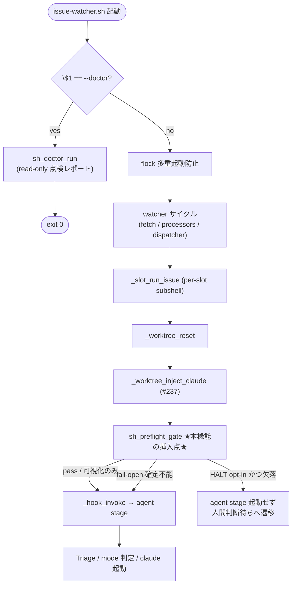

# Design Document

## Overview

**Purpose**: 本機能は worktree 内の `.claude/agents` / `.claude/rules` 足場の到達性を
「実際に届いているか」のレベルで能動検証・可視化する仕組みを idd-claude 運用者に提供する。
#237 は `.claude/` を worktree へ届ける delivery 側の対策だったが、本 Issue は delivery が
届いたかを検証する側を担い、ルール非装備の degraded 実行が silent に agent stage へ進む事故
（2026-05-17 に実際に発生）を構造的に防ぐ。

**Users**: idd-claude 運用者（複数 crontab repo を運用する人間）が、(1) 各 cron tick の Slot
Runner 実行中に自動で走る preflight gate（無人）と、(2) `issue-watcher.sh --doctor` を手動実行
して各 repo の装備状態を実行前に一覧把握する workflow で利用する。

**Impact**: 現在の Slot Runner は worktree reset ＋ `.claude` 注入（#237）の完了直後、検査を
挟まずに hook / agent stage を起動する。本機能はその位置に **read-only な preflight 検査**を
1 ステップ挿入し、欠落検出時に loud WARN ＋ Issue コメントの可視シグナルを残す（既定）。
さらに watcher 本体冒頭に `--doctor` サブコマンドのトップレベルディスパッチを 1 つ追加する。
既定挙動は「可視化のみ」で agent stage への進行は止めない（後方互換）。停止は opt-in env で選択する。

### Goals

- worktree reset ＋ `.claude` 注入完了直後・最初の agent stage 起動前に `.claude/agents` /
  `.claude/rules` の非空到達性を検査する preflight gate を追加する（Req 1）
- 欠落検出時に loud WARN ログ ＋ Issue コメント（人間可視シグナル）を残す（Req 1.2 / 1.3）
- 既定は「可視化のみ・進行継続」とし、停止挙動は opt-in env で選択可能にする（Req 2）
- 検査が確定不能なら warn を残して継続する fail-open（Req 3）
- 各 repo の足場・依存 CLI・必須ラベル・base ブランチ解決可否を副作用なく点検する
  `--doctor` サブコマンドを追加する（Req 4）
- 既存 env var 名・ラベル遷移契約・exit code 意味・ログ書式を一切変えず、tracked 運用 repo で
  false positive WARN を 0 件に保つ（Req 5 / NFR 1）
- 成功基準: tracked 運用 repo で WARN 0 件・既存挙動不変。degraded worktree で 1 行以上の
  loud WARN ＋ Issue コメント。doctor は git/Issue/PR/ラベルへ書き込み 0。

### Non-Goals

- `.claude/` を worktree へ届ける delivery 側の仕組み（#237 の責務）
- 欠落足場の自動修復・再注入（検査と可視化に留め、修復は #237 / 運用者判断に委ねる）
- agents / rules ファイル内容の正当性検証（非空で存在するかの到達性レベルに限定）
- 依存 CLI そのもののインストール・自動セットアップ（doctor は存否点検のみ）
- `.claude/agents` / `.claude/rules` の編集（本 Issue が触るのは `local-watcher/` と `README.md`
  のみ。Triage edit_paths と一致）。したがって root↔repo-template の `.claude` 二重管理規約は
  本 Issue のスコープ外（`.claude/agents` `.claude/rules` を変更しないため diff 検証も発生しない）

## Architecture

### Existing Architecture Analysis

- **モジュール分割パターン**: `issue-watcher.sh` 本体は冒頭で `IDD_MODULE_DIR` を `BASH_SOURCE`
  基準で解決し、`REQUIRED_MODULES` 配列を `for` ループで `source` する（L518-534）。各モジュール
  （`core_utils.sh` / `stage-a-verify.sh` 等）は `set -euo pipefail` を本体側に委ね、関数定義のみを
  持ち、グローバル変数を遅延束縛で参照する。本機能も同パターンに倣う。
- **gate モジュールの規約**（`stage-a-verify.sh` 参照）: 専用 logger（`<prefix>:` 3 段 prefix
  `[YYYY-MM-DD HH:MM:SS] [$REPO] <prefix>:`）/ env opt-out 厳密一致判定 / fail-open 設計 /
  README との二重管理。本機能はこの規約をそのまま踏襲する。
- **worktree reset ＋ `.claude` 注入の実行シーケンス**（`_slot_run_issue` 内、`core_utils.sh`）:
  `_worktree_ensure` → `cd "$WT"` → `SRC_REPO_DIR=$REPO_DIR` 捕捉 → `REPO_DIR="$WT"` 上書き →
  `_worktree_reset` → `_worktree_inject_claude`（#237）→ `_hook_invoke` → mode 判定 → agent stage。
  本機能の preflight gate は **`_worktree_inject_claude` の直後・`_hook_invoke` の直前**（L6820-6822
  の間）に挿入する。これが「reset ＋注入完了直後・最初の agent stage 起動前」に正確に対応する。
- **可視シグナルの既存手段**: `gh issue comment "$NUMBER" --repo "$REPO" --body ... || true` が
  fail-open で多用される（`_slot_mark_failed` L5882 等）。新ラベル追加を避け、Issue コメントを
  可視シグナル手段に採用することで、`idd-claude-labels.sh` のラベルセット変更（後方互換リスク）を
  回避する。
- **トップレベル引数処理の不在**: 現状 `issue-watcher.sh` は引数を取らず単一 watcher サイクルを
  実行する（末尾で `_dispatcher_run` を呼び `exit 0`）。`--doctor` はこの実行フローに入る**前**、
  すなわち `set -euo pipefail` と PATH prepend の直後・flock 取得の前にディスパッチする。

### Architecture Pattern & Boundary Map



**Architecture Integration**:
- 採用パターン: 既存 gate モジュール（`stage-a-verify.sh`）と同型の **独立 source モジュール**
  ＋ 本体 1 箇所の call site 挿入＋本体冒頭のトップレベルディスパッチ 1 箇所。根拠は既存
  `REQUIRED_MODULES` 動的ロード基盤と gate 規約に最小差分で乗せられるため。
- ドメイン／機能境界: scaffolding health の検査ロジック・logger・doctor 点検は新規モジュール
  `scaffolding-health.sh` に集約する。本体には (a) preflight gate の call site 1 行、(b) `--doctor`
  ディスパッチ 1 ブロック、(c) Config ブロックへの env 定義のみを置く。
- 既存パターンの維持: gate logger prefix 規約 / env opt-out 厳密一致 / fail-open / `gh ... || true`
  可視シグナル / `REQUIRED_MODULES` への 1 行追加。
- 新規コンポーネントの根拠: 検査・doctor は複数関数（gate / 検査純関数 / 可視シグナル / doctor
  点検項目群）を持ち、本体直書きは肥大化する。`stage-a-verify.sh` の前例どおりモジュール化が
  保守性・shellcheck 単位検査の点で妥当。

### Technology Stack

| Layer | Choice / Version | Role in Feature | Notes |
|-------|------------------|-----------------|-------|
| CLI / Runtime | bash 4+ | preflight gate / doctor サブコマンド | 既存 watcher と同一。新ランタイム無し |
| Backend / Services | `local-watcher/bin/modules/scaffolding-health.sh`（新規） | 検査・doctor ロジック集約 | `stage-a-verify.sh` パターン踏襲 |
| Data / Storage | なし（read-only） | — | sidecar / 永続状態を持たない（冪等性 Req 5.3 / NFR 5） |
| Messaging / Events | `gh issue comment`（可視シグナル） | 欠落検出時の人間可視痕跡 | fail-open `|| true`。新ラベル不使用 |
| Infrastructure / Runtime | cron / launchd | preflight gate の自動実行契機 | 既存起動文字列を変更しない |

## File Structure Plan

### Directory Structure

```
local-watcher/bin/
├── issue-watcher.sh                 # 本体。3 箇所のみ変更（詳細は Modified Files）
└── modules/
    ├── core_utils.sh                # 変更なし（_worktree_inject_claude の直後に gate を挿す参照点）
    ├── stage-a-verify.sh            # 変更なし（モジュール規約の参照元）
    └── scaffolding-health.sh        # 【新規】scaffolding health gate + doctor の全ロジック
```

`scaffolding-health.sh` の内部構成（関数群）:

```
scaffolding-health.sh
├── sh_log / sh_warn / sh_error                 # `scaffolding-health:` 3 段 prefix logger
├── sh_inspect_scaffolding                      # 純関数: 指定 worktree の agents/rules 非空到達性検査
│                                               #   → 0=full / 1=missing / 2=indeterminate(fail-open)
├── sh_preflight_gate                           # Slot Runner から呼ぶ gate（WARN + 可視シグナル + HALT 分岐）
├── _sh_emit_visibility_signal                  # 欠落時の Issue コメント投稿（冪等・fail-open）
├── sh_doctor_check_scaffolding                 # doctor 点検項目: agents/rules 到達性（Req 4.2）
├── sh_doctor_check_clis                         # doctor 点検項目: gh/jq/flock/git/claude 存否（Req 4.3）
├── sh_doctor_check_labels                       # doctor 点検項目: 必須ラベル存否（Req 4.4 / read-only）
├── sh_doctor_check_base_branch                  # doctor 点検項目: base ブランチ解決可否（Req 4.5）
└── sh_doctor_run                                # doctor 統合: 全項目集約 + full/degraded 一覧レポート（Req 4.1/4.6/4.7）
```

### Modified Files

- `local-watcher/bin/issue-watcher.sh`:
  1. Config ブロック（`STAGE_A_VERIFY_*` 定義の近傍、L281-301 付近）に新規 env var
     `SCAFFOLDING_HEALTH_HALT`（既定 `off`）と doctor 用 `SCAFFOLDING_HEALTH_*`（必要時）を
     `"${VAR:-default}"` で追加する。
  2. `REQUIRED_MODULES` 配列（L523）末尾に `"scaffolding-health.sh"` を 1 要素追加する。
  3. トップレベル `--doctor` ディスパッチを `set -euo pipefail` ＋ PATH prepend の直後・
     Config ブロックの **前** に挿入する（doctor は full cycle を回さず点検のみで `exit 0`）。
     ただし doctor は env 解決とモジュール source を必要とするため、実際の dispatch は
     「Config ブロック ＋ module source 完了後・flock 取得の前」に置き、`sh_doctor_run` を
     呼んで `exit $?`（後述 Decision 2）。
  4. `_slot_run_issue` 内、`_worktree_inject_claude "$SRC_REPO_DIR" "$WT"`（L6820）の直後・
     `_hook_invoke`（L6823）の直前に `sh_preflight_gate "$WT" || return 0`（HALT 時は人間判断
     待ち遷移後 `return 0`、可視化のみ時は内部で継続判定して 0 を返す）を 1 行挿入する。
- `README.md`: 「オプション機能（標準有効 / 常時有効）一覧」節および新規節「Scaffolding Health
  Gate / doctor (#238)」を追加し、`SCAFFOLDING_HEALTH_HALT` env の意味・既定・doctor の起動構文・
  レポート書式・fail-open 仕様を記述する（挙動を変えるため二重管理として同一 PR で更新）。

## Requirements Traceability

| Requirement | Summary | Components | Interfaces | Flows |
|-------------|---------|------------|------------|-------|
| 1.1 | reset+注入後・agent stage 前に agents/rules 非空を検査 | sh_inspect_scaffolding, sh_preflight_gate | `sh_preflight_gate(wt)` | call site = L6820 直後 |
| 1.2 | 欠落時に loud WARN で欠落内容を可視出力 | sh_preflight_gate, sh_warn | `sh_warn(msg)` | gate missing 分岐 |
| 1.3 | 欠落時に Issue 上の可視シグナル（コメント）を残す | _sh_emit_visibility_signal | `_sh_emit_visibility_signal(detail)` | gate missing 分岐 |
| 1.4 | silent に握りつぶして degraded 進行させない | sh_preflight_gate | — | gate 必ず 1 行以上ログ |
| 1.5 | 双方非空なら pass・既存挙動と同一で起動 | sh_inspect_scaffolding, sh_preflight_gate | — | gate full 分岐（NO-OP） |
| 2.1 | 既定（停止無効）は WARN+シグナル後に継続 | sh_preflight_gate | env `SCAFFOLDING_HEALTH_HALT` | missing & halt=off |
| 2.2 | opt-in 停止有効なら agent stage 前で人間判断待ちへ | sh_preflight_gate | env `SCAFFOLDING_HEALTH_HALT=on` | missing & halt=on |
| 2.3 | 停止設定が未指定/無効値/空は既定（可視化のみ）解釈 | sh_preflight_gate | env 厳密一致判定 | 値正規化 |
| 3.1 | 検査確定不能なら warn 残して継続（fail-open） | sh_inspect_scaffolding, sh_preflight_gate | 戻り値 2=indeterminate | gate fail-open 分岐 |
| 3.2 | 確定不能の事実を可視ログに残す | sh_warn | `sh_warn(msg)` | gate fail-open 分岐 |
| 3.3 | 確定不能のみを理由に失敗状態へ遷移させない | sh_preflight_gate | gate は 0 を返す | — |
| 4.1 | doctor が REPO/REPO_DIR の各 repo を点検しレポート | sh_doctor_run | `sh_doctor_run()` | --doctor dispatch |
| 4.2 | doctor が agents/rules 到達性を点検項目に含める | sh_doctor_check_scaffolding | — | doctor 集約 |
| 4.3 | doctor が gh/jq/flock/git/claude 存否を点検 | sh_doctor_check_clis | `command -v` | doctor 集約 |
| 4.4 | doctor が必須ラベル存否を点検 | sh_doctor_check_labels | `gh label list`（read-only） | doctor 集約 |
| 4.5 | doctor が base ブランチ解決可否を点検 | sh_doctor_check_base_branch | `git ... origin/$BASE_BRANCH`（read-only） | doctor 集約 |
| 4.6 | doctor が full/degraded を識別できる一覧でレポート | sh_doctor_run | レポート書式 | doctor 集約 |
| 4.7 | doctor は書き込み/状態変更を一切行わない | sh_doctor_*（全） | read-only 契約 | NFR 4 と同根 |
| 5.1 | tracked repo で pass・false positive WARN なし | sh_inspect_scaffolding | full 判定 | NO-OP |
| 5.2 | 既存 env名/ラベル契約/exit code/ログ書式を維持 | （本体差分の範囲限定） | — | — |
| 5.3 | 同一状態の再実行で同一判定（冪等性） | sh_inspect_scaffolding, sh_doctor_run | 副作用なし | 永続状態を持たない |
| NFR 1.1 | tracked repo で NO-OP・誤検知 WARN 0 件 | sh_inspect_scaffolding | full 判定 | — |
| NFR 2.1 | 欠落/継続/停止のどの分岐を取ったか事後判別可能なログ | sh_log / sh_warn | `outcome=...` ログ | gate 各分岐 |
| NFR 3.1 | doctor は repo 1 件あたり数秒以内・repo 数に線形以下 | sh_doctor_run | — | ローカル検査主体 |
| NFR 4.1 | doctor 実行中 git 作業ツリー/index/refs 不変・書き込み API 不使用 | sh_doctor_*（全） | read-only | — |
| NFR 5.1 | 検査/fail-open/doctor の反復実行で副作用累積なし・同一結果 | sh_inspect_scaffolding, sh_preflight_gate, sh_doctor_run | 副作用なし | — |

## Components and Interfaces

### Scaffolding Health Module

#### sh_log / sh_warn / sh_error

| Field | Detail |
|-------|--------|
| Intent | `scaffolding-health:` 3 段 prefix logger（既存 `sav_*` / `qa_*` と同形式） |
| Requirements | 1.2, 1.4, 3.2, NFR 2.1 |

**Responsibilities & Constraints**
- `[YYYY-MM-DD HH:MM:SS] [$REPO] scaffolding-health: ...` 形式で出力（`grep '\[.*\] scaffolding-health:'`
  で全件抽出可能）。`sh_log` は stdout、`sh_warn` / `sh_error` は `>&2`。
- 既存ログ書式を一切変えない（Req 5.2）。新 prefix の追加のみ。

##### Service Interface

```bash
sh_log()   { echo "[$(date '+%F %T')] [$REPO] scaffolding-health: $*"; }
sh_warn()  { echo "[$(date '+%F %T')] [$REPO] scaffolding-health: WARN: $*" >&2; }
sh_error() { echo "[$(date '+%F %T')] [$REPO] scaffolding-health: ERROR: $*" >&2; }
```

#### sh_inspect_scaffolding

| Field | Detail |
|-------|--------|
| Intent | 指定ディレクトリ配下の `.claude/agents` / `.claude/rules` の非空到達性を判定する純検査関数 |
| Requirements | 1.1, 1.5, 3.1, 5.1, 5.3, NFR 1.1, NFR 5.1 |

**Responsibilities & Constraints**
- 副作用を持たない（read-only）。worktree も Issue も変更しない。同一状態に同一結果（冪等性）。
- 「非空で存在する」を到達性の判定基準とする（内容の正当性は検査しない＝Non-Goals）。
- 判定 3 値: full（両ディレクトリに非空ファイルが 1 つ以上ある）/ missing（いずれかが不在 or 空）/
  indeterminate（I/O エラー等で存否を確定できない）。確定不能は fail-open のため呼び出し側で warn
  継続に倒す（Req 3.1）。

**Dependencies**
- Inbound: sh_preflight_gate — preflight 検査 (Critical); sh_doctor_check_scaffolding — doctor 点検 (Critical)
- External: `find` / test 演算子（`[ -d ]` 等）— ディレクトリ・非空判定 (Critical)

**Contracts**: Service [x]

##### Service Interface

```bash
# 入力: $1 = 検査対象の worktree 絶対パス（その配下の .claude/agents, .claude/rules を見る）
# stdout: 欠落内容の機械可読サマリ（missing 時のみ。例: "agents=missing rules=ok"）
# 戻り値: 0 = full / 1 = missing / 2 = indeterminate(fail-open)
sh_inspect_scaffolding() { :; }
```
- Preconditions: $1 は非空文字列（呼び出し側が `$WT` を渡す）
- Postconditions: worktree / ファイルシステムへ書き込みを行わない
- Invariants: 同一 worktree 状態に対して常に同一戻り値（NFR 5.1）

**判定ロジック（疑似コード）**:
```
wt="$1"
agents_dir="$wt/.claude/agents"; rules_dir="$wt/.claude/rules"
# I/O 確定不能（親 .claude も dir として観測できない異常等）→ return 2 (indeterminate)
#   ただし「.claude/agents が単に不在」は missing であって indeterminate ではない点に注意。
#   indeterminate は test 自体が下せない真の I/O 異常に限定し、fail-open を濫用しない。
agents_ok = ( [ -d agents_dir ] && agents_dir に非空の通常ファイルが 1 つ以上 )
rules_ok  = ( [ -d rules_dir ]  && rules_dir に非空の通常ファイルが 1 つ以上 )
if agents_ok && rules_ok: return 0 (full)
else: print "agents=<ok|missing> rules=<ok|missing>"; return 1 (missing)
```
- 「非空ファイルが 1 つ以上」は `find "$dir" -type f -size +0c` 相当で判定する（隠しファイルや
  サブディレクトリは到達性判定に算入しないが、`*.md` 限定にはしない＝将来のファイル種別変更に頑健）。

#### sh_preflight_gate

| Field | Detail |
|-------|--------|
| Intent | Slot Runner から呼ばれる preflight ゲート。検査→WARN→可視シグナル→HALT 分岐を統合 |
| Requirements | 1.1, 1.2, 1.3, 1.4, 2.1, 2.2, 2.3, 3.1, 3.2, 3.3, NFR 2.1 |

**Responsibilities & Constraints**
- `_worktree_inject_claude` 直後・`_hook_invoke` 直前に 1 度だけ呼ばれる。1 回の呼び出しで必ず
  1 行以上の `scaffolding-health:` ログを出す（Req 1.4 / silent 禁止 / NFR 2.1）。
- missing 検出時: loud WARN（欠落内容を含む）＋ Issue コメント可視シグナルを残す（Req 1.2 / 1.3）。
  その後 `SCAFFOLDING_HEALTH_HALT` の値で分岐:
  - 既定（`off` / 未設定 / 空 / 不正値）→ `outcome=continue`（可視化のみ）でログし、gate は **継続**
    を意味する戻り値を返す（Req 2.1 / 2.3）。
  - opt-in（`on` 厳密一致）→ `outcome=halt` でログし、当該 Issue を agent stage へ進めず人間判断
    待ちへ遷移させる戻り値を返す（Req 2.2）。
- indeterminate（fail-open）時: warn を残して継続（Req 3.1 / 3.2 / 3.3）。HALT opt-in 時でも
  indeterminate は停止に倒さない（検査の I/O 異常で無実の Issue を止めない設計判断 / Req 3.3）。
- full 時: NO-OP（`outcome=pass` を 1 行ログするのみ）。tracked 運用 repo はここに必ず到達し
  WARN を出さない（Req 1.5 / 5.1 / NFR 1.1）。

**Dependencies**
- Inbound: `_slot_run_issue`（本体）— preflight 検査の唯一の call site (Critical)
- Outbound: sh_inspect_scaffolding — 検査 (Critical); _sh_emit_visibility_signal — 可視シグナル (Critical)
- External: env `SCAFFOLDING_HEALTH_HALT` / グローバル `$REPO` `$NUMBER`（遅延束縛）

**Contracts**: Service [x] / State [x]

##### Service Interface

```bash
# 入力: $1 = worktree 絶対パス。env: SCAFFOLDING_HEALTH_HALT / REPO / NUMBER
# 戻り値:
#   0 = 継続してよい（full / 可視化のみ continue / fail-open continue）
#   1 = HALT（agent stage へ進めず人間判断待ちへ。呼び出し側が return 0 で Issue を当該サイクル終了）
sh_preflight_gate() { :; }
```
- Preconditions: モジュール source 済み・$REPO / $NUMBER が解決済み
- Postconditions: 検査自体は worktree を変更しない。missing 時のみ Issue コメント 1 件（冪等）
- Invariants: full 状態では Issue へ一切書き込まない（NFR 1.1）

**call site 契約（本体側）**:
```bash
# core_utils.sh _worktree_inject_claude 直後・_hook_invoke 直前（issue-watcher.sh L6820-6822 の間）
if ! sh_preflight_gate "$WT"; then
  # HALT opt-in かつ missing → 人間判断待ちへ遷移して当該 Issue を当該サイクル終了。
  # claude-failed は付与しない（足場欠落は「失敗」ではなく「人間判断待ち」/ Req 2.2）。
  slot_log "scaffolding-health: HALT により agent stage を起動せず人間判断待ち（Issue #${NUMBER}）"
  return 0
fi
```
- HALT の人間判断待ち遷移は、**新ラベルを追加せず** `gh issue comment` の可視シグナル
  （_sh_emit_visibility_signal）＋ claim 系ラベルの扱いで表現する。停止時に `claude-claimed` /
  `claude-picked-up` を残置すると次 tick で再 claim されないため、HALT 時は claim 系ラベルを除去
  して `auto-dev` に戻す（再投入は人間が足場を直してから / `_slot_mark_failed` の label 操作を
  参考にするが `claude-failed` は付けない）。詳細手段は Decision 3 を参照。

#### _sh_emit_visibility_signal

| Field | Detail |
|-------|--------|
| Intent | 欠落検出時に Issue 上へ人間可視の痕跡（コメント）を冪等・fail-open で残す |
| Requirements | 1.3, 2.2, 5.3, NFR 5.1 |

**Responsibilities & Constraints**
- `gh issue comment "$NUMBER" --repo "$REPO" --body ... >/dev/null 2>&1 || sh_warn ...` で投稿。
  投稿失敗で gate を倒さない（fail-open）。
- 冪等性（Req 5.3 / NFR 5.1）: 同一 Issue へ毎 tick 同文コメントを重複投稿しないよう、本文に
  機械可読マーカー（例: `<!-- scaffolding-health:missing -->`）を埋め込み、投稿前に
  `gh issue view --json comments` で同マーカーの既存コメント有無を確認し、既存なら投稿を抑止する
  （`tc_*` / spec-completeness の sticky comment 抑止パターンを踏襲）。マーカー確認失敗時は
  fail-open で投稿を試みる（取りこぼしより重複の方が安全）。

**Contracts**: Event [x]

##### Event Interface

```bash
# 入力: $1 = 欠落サマリ（sh_inspect_scaffolding の stdout）。env: REPO / NUMBER
# 戻り値: 常に 0（fail-open）
_sh_emit_visibility_signal() { :; }
```

#### Doctor 点検項目群（sh_doctor_check_*）

| Field | Detail |
|-------|--------|
| Intent | doctor の個別点検項目。各々 read-only で full/degraded 判定材料を返す |
| Requirements | 4.2, 4.3, 4.4, 4.5, 4.7, NFR 4.1 |

**Responsibilities & Constraints**
- すべて read-only（git 作業ツリー・index・refs を変更しない / Issue・PR・ラベルへ書き込まない /
  NFR 4.1）。`gh label list` / `git ... --verify` / `command -v` のみを使う。
- 各点検は 1 項目の OK/NG ＋人間可読な詳細行を `sh_doctor_run` に返す（stdout 経由 or 戻り値）。

**Contracts**: Service [x]

##### Service Interface

```bash
# 各点検は: stdout = "  <項目名>: <ok|degraded> (<詳細>)"、戻り値 0=ok / 1=degraded
sh_doctor_check_scaffolding() { :; }   # Req 4.2: REPO_DIR/.claude/agents,rules 非空到達性（= sh_inspect_scaffolding 流用）
sh_doctor_check_clis()        { :; }   # Req 4.3: command -v gh jq flock git claude
sh_doctor_check_labels()      { :; }   # Req 4.4: gh label list で必須ラベル集合の存否（read-only）
sh_doctor_check_base_branch() { :; }   # Req 4.5: git -C REPO_DIR rev-parse --verify origin/$BASE_BRANCH（read-only）
```
- 必須ラベル集合: `idd-claude-labels.sh` の `LABELS` 定義（auto-dev / claude-claimed /
  claude-picked-up / ready-for-review / claude-failed / needs-decisions /
  awaiting-design-review / needs-iteration / needs-rebase / blocked 等）のうち、ワークフロー進行に
  必須な中核ラベルを点検対象とする。集合の Single Source of Truth は doctor 側に明示列挙し、
  `idd-claude-labels.sh` と乖離した場合のメンテ注意をコメントで残す（両者は別実行基盤で共有
  コードを持てないため、列挙の明記でドリフトを防ぐ）。

#### sh_doctor_run

| Field | Detail |
|-------|--------|
| Intent | doctor の統合ランナー。全点検項目を集約し full/degraded を一覧レポートして終了 |
| Requirements | 4.1, 4.6, 4.7, 5.3, NFR 3.1, NFR 4.1, NFR 5.1 |

**Responsibilities & Constraints**
- `--doctor` ディスパッチから 1 度呼ばれる。現行 env で解決された REPO / REPO_DIR の 1 組を点検する
  （複数 repo 運用は cron と同様 env で 1 repo を表すため、`--doctor` 起動も REPO/REPO_DIR を env で
  渡して repo ごとに呼ぶ。Req 4.1 の「各 repo」はこの起動方式で満たす。README に明記）。
- 全項目の OK/NG を集約し、当該 repo を「フル装備」または「degraded」として識別できる一覧で
  レポートする（Req 4.6）。1 項目でも degraded なら repo 全体を degraded と表示する。
- read-only（NFR 4.1）。ローカル検査主体のため repo 1 件あたり数秒以内（NFR 3.1。`gh label list` の
  ネットワーク待ちは NFR 3.1 の「ネットワーク待ち時間を除き」に該当）。
- exit code: レポート出力後 `exit 0`（doctor は診断ツールであり、degraded 検出は異常終了ではない。
  既存 exit code 意味と衝突しない / Req 5.2）。degraded の有無は標準出力のレポートで判別する。

**Contracts**: Service [x]

##### Service Interface

```bash
# env: REPO / REPO_DIR / BASE_BRANCH。stdout: 構造化された点検レポート
# 戻り値: 0（レポート出力完了）
sh_doctor_run() { :; }
```

**レポート書式（例）**:
```
=== idd-claude doctor: owner/repo (REPO_DIR=/home/u/work/repo) ===
  scaffolding (.claude/agents,.claude/rules): ok (agents=ok rules=ok)
  required CLIs (gh/jq/flock/git/claude)    : ok
  required labels                            : degraded (missing: needs-iteration)
  base branch (origin/main)                  : ok
  ----------------------------------------------------------------
  RESULT: degraded
```

## Data Models

本機能は永続データモデルを持たない（read-only / sidecar なし）。冪等性（Req 5.3 / NFR 5）は
「副作用を持たない設計」で構造的に担保する。可視シグナルの冪等性のみ、Issue コメント本文の
機械可読マーカー（`<!-- scaffolding-health:missing -->`）で「既存コメント有無」を状態として
読み取り、重複投稿を抑止する（書き込みは GitHub 側 Issue へのコメントのみ・ローカル状態なし）。

## Error Handling

### Error Strategy

- **検査の I/O 異常**: `sh_inspect_scaffolding` が存否を確定できない場合は戻り値 2（indeterminate）
  を返し、`sh_preflight_gate` は warn を残して **継続**する（fail-open / Req 3.1-3.3）。silent fail を
  作らないため必ず warn ログを出す。
- **Issue コメント投稿失敗**: `_sh_emit_visibility_signal` は `|| sh_warn` で吸収し、gate を倒さない。
- **HALT 時の label 操作失敗**: `gh issue edit ... || true` で吸収（既存 `_slot_mark_failed` と同型）。
- **doctor の点検失敗**: 各 `sh_doctor_check_*` は点検自体が失敗（`gh label list` 不達等）した場合、
  当該項目を degraded ではなく `unknown` として表示し、doctor 全体は `exit 0` を維持する
  （doctor は診断であり点検不能を異常終了にしない）。

### Error Categories and Responses

- **User Errors（運用者起因）**: `SCAFFOLDING_HEALTH_HALT` の不正値は既定（可視化のみ）に正規化し
  エラーにしない（Req 2.3）。`--doctor` の REPO/REPO_DIR 未設定はデフォルト値で点検しつつ
  レポートに警告行を出す。
- **System Errors（I/O 異常）**: 検査確定不能は fail-open（warn + 継続）。doctor のネットワーク不達は
  当該項目 unknown 表示で graceful degradation。
- **Business Logic Errors（足場欠落）**: missing は「失敗（claude-failed）」ではなく「可視化のみ
  継続（既定）」または「人間判断待ち（HALT opt-in）」として扱い、`claude-failed` を付けない
  （Req 2.1 / 2.2）。

## Testing Strategy

### Unit Tests（検査純関数・doctor 点検）
- `sh_inspect_scaffolding`: agents/rules 双方非空 → 0(full)、片方欠落 → 1(missing) ＋正しいサマリ、
  両方欠落 → 1(missing)、ディレクトリは在るが空 → 1(missing)（Req 1.1 / 1.5 / 5.1）
- `sh_inspect_scaffolding`: I/O 確定不能シナリオ（テスト fixture で擬似）→ 2(indeterminate)（Req 3.1）
- `SCAFFOLDING_HEALTH_HALT` 値正規化: `on`→halt、`off`/空/`true`/`On`/typo→継続（可視化のみ）（Req 2.3）
- `sh_doctor_check_clis`: PATH 操作した fixture で 1 CLI 欠落 → degraded、全在 → ok（Req 4.3）

### Integration Tests（gate と Slot Runner の協調）
- tracked 運用 worktree（`.claude/agents` `.claude/rules` 非空）で gate が NO-OP・WARN 0 件・
  既存挙動と同一で `_hook_invoke` へ進む（Req 1.5 / 5.1 / NFR 1.1）
- gitignore 運用 worktree かつ注入失敗を擬似した worktree で gate が WARN ＋ コメント可視シグナルを
  残し、既定では `_hook_invoke` へ継続する（Req 1.2 / 1.3 / 2.1）
- `SCAFFOLDING_HEALTH_HALT=on` ＋ missing で agent stage を起動せず claim 系ラベル除去・コメント
  投稿して当該 Issue を当該サイクル終了する（Req 2.2）
- 同一 missing 状態で 2 tick 連続実行してもコメントが重複投稿されない（Req 5.3 / NFR 5.1）

### E2E Tests（doctor サブコマンド）
- 本 repo（idd-claude self-hosting）で `issue-watcher.sh --doctor` を実行し full レポートが出る・
  git status が前後で不変・Issue/PR/ラベルへの書き込みが発生しないことを確認（Req 4.1-4.7 / NFR 4.1）
- 必須ラベルを 1 つ欠いた scratch repo に対し `--doctor` が `degraded (missing: ...)` を出す（Req 4.4 / 4.6）
- `shellcheck local-watcher/bin/issue-watcher.sh local-watcher/bin/modules/*.sh` が警告ゼロ
  （CLAUDE.md 静的解析規約）

### Performance/Load
- `--doctor` を REPO 1 件で実行し、ネットワーク待ちを除く点検処理が数秒以内に完了することを目視
  確認（NFR 3.1）
- preflight gate の追加によるサイクル時間増がローカルファイル検査オーダー（ミリ秒）に収まり、
  既存 dispatch レイテンシへ実質影響しないことを確認

## Optional Sections

### Security Considerations

- doctor / gate は read-only であり、Issue 本文や外部入力を `eval` / `bash -c` に渡さない
  （`SCAFFOLDING_HEALTH_HALT` は厳密一致 case 判定のみ。`_hook_invoke` の SLOT_INIT_HOOK 安全規約と
  同水準）。
- 可視シグナルのコメント本文は固定テンプレ＋欠落サマリのみで、外部から注入される文字列を含めない。

## 主要設計判断（Decisions）

### Decision 1: 欠落時の可視シグナル手段 — Issue コメント（採用） vs 新ラベル（不採用）

- **採用**: `gh issue comment` による Issue コメント（機械可読マーカーで冪等化）。
- **理由**: 新ラベル追加は `idd-claude-labels.sh` の `LABELS` 変更を伴い、consumer repo への
  `install.sh` 再実行・ラベル作成運用・後方互換（ラベル削除/改名の deprecation）に波及する。
  Req 1.3 は「Issue コメントまたはラベル等の人間可視な痕跡」を許容しており、コメントで十分。
  CLAUDE.md「既存ラベル削除/名前変更は deprecation 期間」「ラベル追加は OK」を踏まえても、
  追加せず済むならスコープと後方互換リスクを最小化できる。
- **代替案（不採用）**: 専用ラベル `scaffolding-degraded` 新設。可視性は高いがラベルセット拡張の
  運用コスト・consumer 配布の同期コストが見合わない。将来 HALT 運用が定着したら別 Issue で検討可。

### Decision 2: doctor ディスパッチ位置 — module source 後・flock 前（採用）

- **採用**: `set -euo pipefail` ＋ PATH prepend → Config ブロック → module source 完了後、かつ
  flock 多重起動防止（L578）の **前** に `case "${1:-}" in --doctor) sh_doctor_run; exit $?;; esac`
  を置く。
- **理由**: `sh_doctor_run` は env（REPO/REPO_DIR/BASE_BRANCH）とモジュール関数の両方を必要とする。
  flock の前に置くことで、稼働中の watcher サイクルが flock を握っていても doctor が即実行できる
  （doctor は read-only で多重起動防止の対象外）。`exit $?` で full cycle に入らず終了する。
- **代替案（不採用）**: 本体冒頭（module source 前）でディスパッチ。env / モジュール未解決で
  doctor がロジックを再実装する必要が出るため不採用。

### Decision 3: HALT 時の状態遷移 — claim 系ラベル除去で auto-dev へ戻す（採用）

- **採用**: HALT opt-in ＋ missing 時、`claude-claimed` / `claude-picked-up` を除去し `claude-failed`
  は付けず、可視シグナルコメントで人間判断待ちを明示する。次 tick で人間が足場を修復するまで
  再投入は人間操作（足場修復→自然に full 判定で進行）に委ねる。
- **理由**: 足場欠落は Issue の「失敗」ではなく環境側の degraded であり、`claude-failed` は意味的に
  不適切（Req 2.2 は「人間判断待ちの状態へ遷移」）。claim 系ラベルを残すと dispatcher の
  in-flight 判定が誤るため除去する。新ラベルは Decision 1 と整合して追加しない。
- **代替案（不採用）**: `needs-decisions` 付与。汎用人間判断ラベルだが、PM フェーズの情報不足と
  混同されるため、コメント本文の識別文字列で区別する方針に留め、ラベル付与は HALT 運用の
  実需が出てから別途検討する（本 Issue では over-engineering を避ける）。

### Decision 4: 検査基準 — 「非空ファイルが 1 つ以上」（採用）

- **採用**: `.claude/agents` / `.claude/rules` 各ディレクトリに **非空の通常ファイルが 1 つ以上**
  存在することを到達性 OK とする（`find -type f -size +0c`）。
- **理由**: requirements が「非空のファイルが存在するか」を到達性レベルの基準と明記（Req 1.1）。
  ファイル拡張子（`*.md`）や内容は問わない（Non-Goals: 内容の正当性検証は対象外）。空ディレクトリ
  のみ・0 バイトファイルのみは degraded delivery のサインなので missing 扱いとする。
