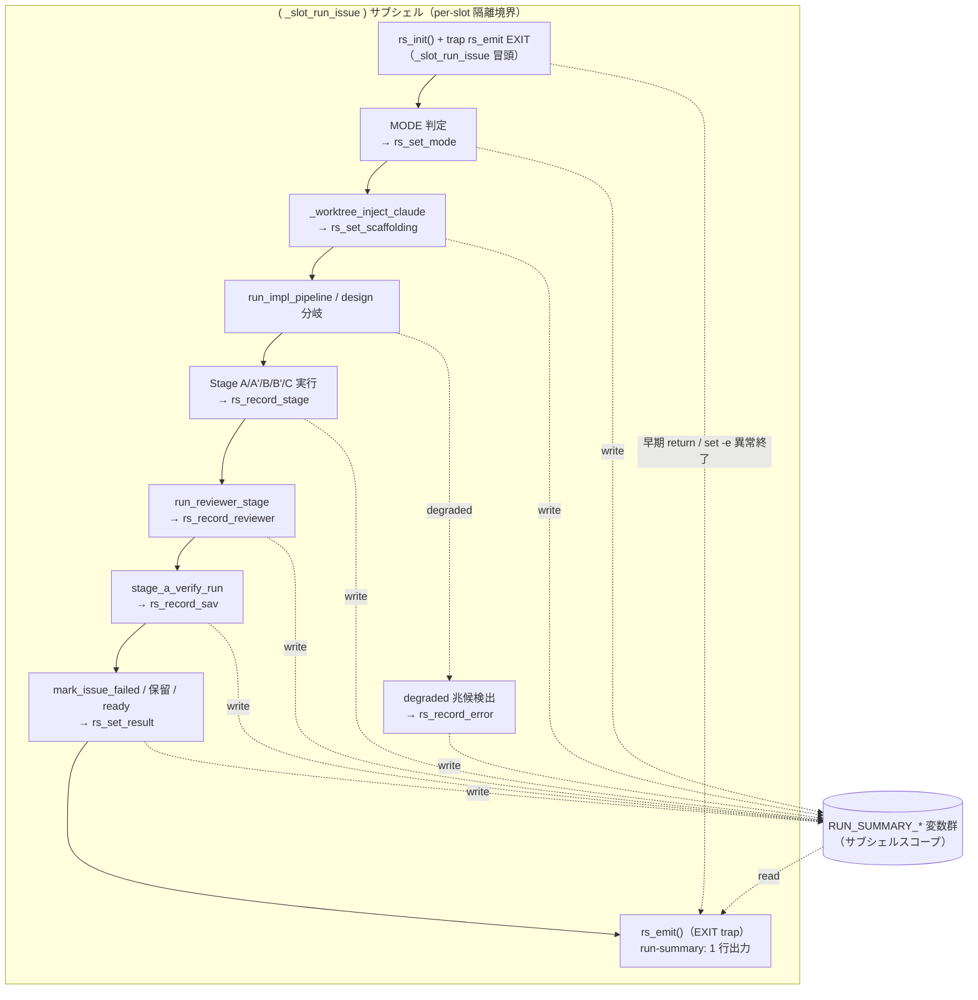

# Design Document

## Overview

**Purpose**: 本機能は「1 サイクルで実際にどの stage / gate が走り、どう判定されたか」を
機械可読な 1 行 run サマリとして既存ログ（`cron.log` / Issue ログ）に追記する observability を、
idd-claude watcher の運用者に提供する。現状は成果物（`impl-notes.md` / `review-notes.md` /
PR）の有無からしか実行実態を事後推定できず、独立 Reviewer ゲートが degraded して効いて
いなかった実行（#238 背景）や、stage-a-verify が SKIP された実行、scaffolding
（`.claude/agents` / `.claude/rules`）欠落による degraded 実行を外形検出できない。

**Users**: watcher の運用者が `grep 'run-summary:' cron.log` でサイクルの実行実態を 1 行で
俯瞰し、degraded 兆候（`reviewer=degraded` / `scaffolding=missing` / `errors=yes`）を
横断検出する workflow で利用する。

**Impact**: 現在の `_slot_run_issue`（1 Issue = 1 サイクルを 1 サブシェルで処理する Slot
Worker）に、サイクル横断で実行実態を蓄積する per-slot のサブシェルスコープ変数群と、
サイクル終端で必ず 1 行を吐く EXIT trap emitter を追加する。既存ログ行は一切変更・削除せず、
新たに `run-summary:` prefix の 1 行を追記するのみ。stage 実行 / Reviewer 起動 /
stage-a-verify 結果 / scaffolding 検査 / degraded 兆候 / 最終遷移を観測する各既存関数に、
状態を記録する軽量な「記録呼び出し」を差し込む。

### Goals

- 各サイクル（impl / impl-resume / design）終了時に、実行実態を表す機械可読な run サマリを
  **1 行だけ** `cron.log` / Issue ログに追記する（Req 1, 8）
- 正常終了・失敗終了・保留のいずれの終端パスでも取りこぼさず 1 行を出力する（Req 1.5, NFR 4.1）
- 並列 slot 実行で各 slot の run サマリ状態が互いに混ざらないことを構造的に保証する
- 既存挙動（env var 名 / ラベル遷移契約 / exit code の意味 / 既存ログ行）を一切変えない
  後方互換を維持する（NFR 1.1, 1.2, 1.3）

### Non-Goals

- run サマリの集計・可視化・ダッシュボード・アラート連携（Out of Scope）
- 過去サイクルの run サマリ遡及生成（retrofit）
- degraded / scaffolding 欠落検出時の自動修復・自動再実行（本機能は記録のみ）
- 外部 observability SaaS / ログ転送基盤連携（NFR 3.1）
- `.claude/agents` / `.claude/rules` テンプレート自体の変更（本機能は `local-watcher/bin/` のみ）

## Architecture

### Existing Architecture Analysis

- **Slot Worker パターン (#16)**: 1 Issue は `( _slot_run_issue "$n" "$issue_json" ) &` の
  サブシェルで処理される。サブシェル内の `cd` / グローバル変数変更は親プロセスに伝播しない
  （Req 3.5 を構造的に保証）。この境界が **per-slot 状態隔離の天然の器**になる。
- **モジュール source モデル**: `issue-watcher.sh` 本体が `local-watcher/bin/modules/*.sh` を
  全件 source してから処理を始める。関数定義順は遅延束縛のため挙動に影響しない。
- **既存 logger 慣習 (#119)**: `qa_log` / `mq_log` / `sav_log` / `sc_log` 等が
  `[YYYY-MM-DD HH:MM:SS] [$REPO] <processor>:` の 3 段 prefix（一部は `[$REPO]` を持たない）で
  grep 抽出可能な行を吐く。run サマリの prefix もこの慣習に整合させる。
- **観測点が既に存在する**:
  - stage 実行: `run_impl_pipeline` 内の Stage A/A'/B/B'/C 各分岐、`START_STAGE` 値
  - Reviewer: `run_reviewer_stage`（常に `claude --print` で別プロセス起動 = 独立 context。
    return 0=approve / 1=reject / 2=異常）
  - stage-a-verify: `stage_a_verify_run`（`sav_log` で SUCCESS / SKIPPED / DISABLED /
    round=1 / round=2 を既に出力）
  - scaffolding: `_worktree_inject_claude`（worktree の `.claude/` 有無を auto-detect 済）
  - 最終遷移: `mark_issue_failed` / `_slot_mark_failed`（claude-failed）、stage-a-verify
    round=1 defer（保留）、Stage C 成功（PR 作成 → ready-for-review は PjM agent が付与）
- **尊重すべき制約**: 既存 env var / ラベル / exit code 意味を壊さない。`repo-template/` 配下の
  `.claude` には触れない見込み（本機能は `local-watcher/bin/` のみ）。

### Architecture Pattern & Boundary Map

**採用パターン**: **Collector + Terminal Emitter**（per-slot 状態コレクタ + 終端 1 行 emitter）。
サイクル横断で観測点が状態を「記録」し、サイクル終端の単一 emitter が 1 行に整形して出力する。



**Architecture Integration**:
- 採用パターン: Collector + Terminal Emitter。観測点（記録）と出力（emit）を分離し、
  どの終端パスからでも 1 行が必ず出る構造にする。
- ドメイン／機能境界: 状態コレクタと emitter を新規モジュール `run-summary.sh` に集約し、
  本体 `issue-watcher.sh` 側には軽量な記録呼び出し（`rs_*`）の差し込みのみを行う。
- 既存パターンの維持: logger 命名（`<prefix>:` 形式 / `[$REPO]` 挿入）、モジュール source
  モデル、Slot Worker サブシェル隔離。
- 新規コンポーネントの根拠: 横断状態蓄積と終端整形は単一責務として独立モジュール化する方が、
  7586 行の本体に分散させるよりレビュー容易・テスト容易（fixture スモークで関数単体検証可能）。

### Technology Stack

| Layer | Choice / Version | Role in Feature | Notes |
|-------|------------------|-----------------|-------|
| CLI / Runtime | bash 4+ | 状態蓄積（サブシェルスコープ変数）+ EXIT trap emitter | 既存 watcher と同一 |
| Backend / Services | `run-summary.sh` モジュール（新規） | `rs_*` 関数群を集約 | `local-watcher/bin/modules/` 配下 |
| Data / Storage | サブシェルスコープのグローバル変数 | per-slot run 状態 | 一時ファイル不要・slot 隔離は構造的保証 |
| Messaging / Events | なし | — | 外部呼び出し追加なし（NFR 3.1） |
| Infrastructure | install.sh（既存配置ロジック） | 新規モジュールを `$HOME/bin/modules/` に配置 | modules/ glob 配置に追従するなら変更不要、要確認 |

## File Structure Plan

### Directory Structure

```
local-watcher/bin/
├── issue-watcher.sh              # 本体: rs_* 記録呼び出しの差し込み + source 行追加（Modified）
└── modules/
    ├── run-summary.sh            # 新規: Per-Run Evidence Summary モジュール（rs_* 関数群）
    ├── core_utils.sh             # Modified: _worktree_inject_claude に rs_set_scaffolding 記録を 1 行追加
    └── stage-a-verify.sh         # 参照のみ（sav_log の出力フォーマットは変更しない）

docs/specs/239-feat-watcher-per-run-evidence-stage-gate/
└── test-fixtures/
    └── test-summary.sh           # 新規: fixture スモーク（gate 必須再実行対象 / tasks.md タスク 8）
```

### `run-summary.sh` に置く関数（新規）

| 関数 | 責務 |
|------|------|
| `rs_init` | run 状態変数群を既定値に初期化（サイクル冒頭で 1 回） |
| `rs_set_mode <mode>` | mode を記録（impl / impl-resume / design） |
| `rs_set_issue <number>` | 対象 Issue 番号を記録 |
| `rs_record_stage <stage>` | 実行された stage（A / A' / B / B' / C）を重複なく蓄積 |
| `rs_set_scaffolding <ok\|missing>` | scaffolding 有無を記録 |
| `rs_record_reviewer <state> [round]` | Reviewer の独立起動・verdict・round を記録 |
| `rs_record_sav <state> [round]` | stage-a-verify の結果・round を記録 |
| `rs_record_error <reason>` | degraded 兆候の検出を記録（errors=yes へ） |
| `rs_set_result <transition>` | 最終遷移を記録（ready / iteration / failed / hold） |
| `rs_scan_degraded_log <logfile>` | LOG から degraded 兆候（`No such file` / subagent 未定義等）を grep し errors を更新 |
| `rs_emit` | 蓄積した状態を `run-summary:` 1 行に整形して stdout 出力（EXIT trap から呼ぶ） |

### Modified Files

- `local-watcher/bin/issue-watcher.sh`
  - 冒頭の modules source ブロックに `source .../run-summary.sh` を追加（glob source なら不要、要確認）
  - `_slot_run_issue` 冒頭で `rs_init` + `trap 'rs_emit' EXIT` を仕込む（サブシェルスコープ。
    dispatcher の INT/TERM trap とは別境界）
  - MODE 確定後（L6900 付近 / L7038 / L7041）に `rs_set_mode` / Issue 抽出直後に `rs_set_issue`
  - `run_impl_pipeline` の Stage A/A'/B/B'/C 各実行直後に `rs_record_stage`
  - `run_reviewer_stage` の return 直前に `rs_record_reviewer`（approve / reject / error=degraded）
  - stage-a-verify call site（L5040 付近）の戻り値分岐に `rs_record_sav`
  - `mark_issue_failed` / `_slot_mark_failed` / round=1 defer / Stage C 成功に `rs_set_result`
  - 各 stage 終了時に `rs_scan_degraded_log "$LOG"` を呼び degraded 兆候を反映
- `local-watcher/bin/modules/core_utils.sh`
  - `_worktree_inject_claude` の冒頭 / 注入後に worktree の `.claude/agents` `.claude/rules`
    有無を判定して `rs_set_scaffolding ok|missing` を 1 行記録（既存 scaffolding 検査結果の流用 / Req 5.3）

### New Files

- `docs/specs/239-feat-watcher-per-run-evidence-stage-gate/test-fixtures/test-summary.sh`
  - `run-summary.sh` を source し `rs_*` 関数を直接呼んで `rs_emit` の出力 1 行を grep assert する
    fixture スモークスクリプト。**stage-a-verify gate の必須再実行対象**（`tasks.md` の
    `## Verify` 構造化ブロックが Stage A で `bash .../test-summary.sh` を再実行する）。
    よって本ファイルの作成（tasks.md タスク 8）は非 deferrable な必須タスク。

## Requirements Traceability

| Requirement | Summary | Components | Interfaces | Flows |
|-------------|---------|------------|------------|-------|
| 1.1 | サイクル終了で 1 件出力 | run-summary.sh / EXIT trap | `rs_emit` | 終端 emit |
| 1.2 | mode を含める | run-summary.sh | `rs_set_mode` | `mode=` value |
| 1.3 | Issue 番号を含める | run-summary.sh | `rs_set_issue` | `issue=` value |
| 1.4 | 1 行のみ | run-summary.sh | `rs_emit`（trap 1 回） | 単一行整形 |
| 1.5 | 正常/失敗/保留すべてで出力 | EXIT trap | `trap rs_emit EXIT` | 全終端パス |
| 2.1 | 実行 stage を列挙 | run_impl_pipeline 差込 | `rs_record_stage` | `stages=` value |
| 2.2 | stage 未実行を明示 | run-summary.sh | `rs_emit`（既定 `stages=none`） | enum |
| 2.3 | 複数 stage を判別可能列挙 | run-summary.sh | `rs_record_stage` 重複排除 | `stages=A,B,C` |
| 3.1 | Reviewer 独立起動有無を記録 | run_reviewer_stage 差込 | `rs_record_reviewer` | `reviewer=` value |
| 3.2 | verdict を記録 | run_reviewer_stage 差込 | `rs_record_reviewer approve\|reject` | enum |
| 3.3 | round を記録 | run_reviewer_stage 差込 | `rs_record_reviewer <v> <round>` | `:r1` 等 |
| 3.4 | degraded を明示 | run_reviewer_stage 差込 | `rs_record_reviewer degraded` | enum |
| 3.5 | Reviewer 非該当モードを記録 | run-summary.sh | `rs_emit`（design 既定 `reviewer=n/a`） | enum |
| 4.1 | stage-a-verify 結果記録 | stage-a-verify call site 差込 | `rs_record_sav` | `stage-a-verify=` value |
| 4.2 | SKIP / DISABLED 明示 | stage-a-verify call site 差込 | `rs_record_sav skip\|disabled` | enum |
| 4.3 | round 情報記録 | stage-a-verify call site 差込 | `rs_record_sav round1\|round2` | enum |
| 5.1 | scaffolding 有無記録 | core_utils.sh 差込 | `rs_set_scaffolding` | `scaffolding=` value |
| 5.2 | 欠落を明示 | core_utils.sh 差込 | `rs_set_scaffolding missing` | enum |
| 5.3 | 既存検査結果を流用 | core_utils.sh / `_worktree_inject_claude` | scaffolding 判定の再利用 | 注入処理 |
| 6.1 | error 有無記録 | run-summary.sh | `rs_record_error` / `rs_scan_degraded_log` | `errors=` value |
| 6.2 | degraded 兆候検出時 yes | run-summary.sh | `rs_scan_degraded_log` | `errors=yes` |
| 6.3 | 兆候なしで no | run-summary.sh | `rs_emit`（既定 `errors=no`） | enum |
| 7.1 | 最終遷移記録 | 終端各所差込 | `rs_set_result` | `result=` value |
| 7.2 | claude-failed を記録 | mark_issue_failed 差込 | `rs_set_result claude-failed` | enum |
| 8.1 | 固定 prefix 付与 | run-summary.sh | `rs_emit`（`run-summary:` prefix） | grep 互換 |
| 8.2 | key=value 形式 | run-summary.sh | `rs_emit` 整形 | 機械可読 |
| 8.3 | 1 行に収める | run-summary.sh | `rs_emit`（改行なし） | 単一行 |
| NFR 1.1 | 既存ログ不変・追記のみ | run-summary.sh | 新規行のみ追加 | 全体 |
| NFR 1.2 | env/ラベル/exit code 不変 | 全差込 | 記録は副作用なし | 全体 |
| NFR 1.3 | 無効化時に挙動同一 | run-summary.sh / env gate | `RUN_SUMMARY_ENABLED` | emit skip |
| NFR 2.1 | 1 サイクル 1 行 | EXIT trap | `rs_emit` 1 回 | 終端 |
| NFR 2.2 | 再実行でも追記のみ・一貫 | run-summary.sh | 変数初期化 + 追記 | resume |
| NFR 3.1 | 外部呼び出しなし | run-summary.sh | ローカル echo のみ | 全体 |
| NFR 4.1 | emit 失敗で本処理を倒さない | EXIT trap | `rs_emit`（fail-open / `\|\| true`） | フェイルセーフ |

## Components and Interfaces

### Per-Run Evidence Summary（新規モジュール）

#### run-summary.sh

| Field | Detail |
|-------|--------|
| Intent | サイクル横断で実行実態を per-slot 蓄積し、終端で 1 行 run サマリを出力する |
| Requirements | 1.x, 2.x, 3.x, 4.x, 5.x, 6.x, 7.x, 8.x, NFR 1.x, 2.x, 3.1, 4.1 |

**Responsibilities & Constraints**
- 状態は `_slot_run_issue` サブシェル内のグローバル変数（`RUN_SUMMARY_*` prefix）に持つ。
  サブシェル `( ... ) &` 単位で自動隔離されるため、**並列 slot で状態が混ざらない**（一時
  ファイル / sidecar を持たないことが slot 隔離の最も単純な担保になる）。
- `rs_*` 記録関数は副作用を**変数代入のみ**に限定し、ラベル遷移・exit code・既存ログ行に
  影響しない（NFR 1.2）。書き込み失敗を発生させない（`local` 変数代入のみ）。
- `rs_emit` は EXIT trap から呼ばれ、どの終端パス（正常 return / 早期 return / `set -e`
  異常終了 / quota 保留 / round=1 defer）でも必ず 1 回だけ発火する（Req 1.5, NFR 4.1）。
- `rs_emit` 内部は `|| true` で全ての処理を fail-open に包み、emit 自身の失敗で
  サブシェルの exit code を変えない（NFR 4.1）。

**Dependencies**
- Inbound: `_slot_run_issue`（init + trap + 最終的に emit）— サイクルの器 (Critical)
- Inbound: `run_impl_pipeline` / `run_reviewer_stage` / stage-a-verify call site /
  `mark_issue_failed` / `_worktree_inject_claude` — 各観測点からの記録呼び出し (Critical)
- Outbound: なし（ローカル echo のみ）
- External: なし（NFR 3.1）

**Contracts**: Service [x] / API [ ] / Event [ ] / Batch [ ] / State [x]

##### Service Interface（疑似シグネチャ）

```bash
# 状態初期化（サイクル冒頭で 1 回。前回サブシェル残値の混入を防ぐ）
rs_init() -> void   # RUN_SUMMARY_* を既定値にセット

# 記録系（副作用は変数代入のみ。戻り値は常に 0）
rs_set_mode(mode: "impl"|"impl-resume"|"design") -> void
rs_set_issue(number: string) -> void
rs_record_stage(stage: "A"|"A'"|"B"|"B'"|"C") -> void   # 重複排除して蓄積
rs_set_scaffolding(state: "ok"|"missing") -> void
rs_record_reviewer(state: "independent"|"degraded", verdict?: "approve"|"reject", round?: int) -> void
rs_record_sav(state: "success"|"round1"|"round2"|"skip"|"disabled") -> void
rs_record_error(reason: string) -> void                 # errors を yes に上げる
rs_scan_degraded_log(logfile: path) -> void             # LOG を grep し degraded 兆候があれば errors=yes
rs_set_result(transition: "ready-for-review"|"needs-iteration"|"claude-failed"|"hold") -> void

# 出力（EXIT trap 専用。1 行 echo。fail-open）
rs_emit() -> 0   # "[ts] [$REPO] run-summary: issue=#N mode=... stages=... reviewer=... ..." を 1 行出力
```

- Preconditions: `rs_init` がサイクル冒頭で呼ばれていること。未呼び出しでも `rs_emit` は
  既定値（`mode=unknown` 等）で 1 行を吐ける（フェイルセーフ）。
- Postconditions: `rs_emit` 呼び出し後、`run-summary:` prefix 行が標準出力に 1 行だけ現れる。
- Invariants: `rs_emit` は 1 サブシェルにつき 1 回だけ発火する（EXIT trap は 1 回）。出力は
  常に 1 行（key=value に改行を含めない）。

##### degraded 兆候のスキャン契約（Req 6.2）

`rs_scan_degraded_log` は `$LOG`（`claude --print` の stdout/stderr が append される Issue
ログ）を grep し、以下の固定パターンのいずれかが出現したら `errors=yes` に上げる:

- `No such file or directory`（必要ファイル欠落）
- `Agent type .* not found` / `subagent .* not found`（subagent 未定義の degraded 兆候）
- （拡張余地: パターン集合はモジュール内の定数配列として Single Source of Truth 化）

> **設計判断**: degraded 兆候は `claude --print` が別プロセスで `$LOG` に書く出力に現れるため、
> bash 変数では捕捉できない。よって LOG 走査（grep）で検出する。スキャンは各 stage 完了直後に
> 累積実行し、最終的に `errors=yes/no` を確定する。grep は ripgrep ではなく POSIX `grep -q` を
> 使い、依存 CLI を増やさない（NFR 3.1）。

### Reviewer 独立起動判定の意味づけ（Req 3）

現行 `run_reviewer_stage` は **常に `claude --print` を別プロセスで起動する** = 独立 context は
構造的に保証される。したがって:

- `run_reviewer_stage` が起動し return 0 → `reviewer=independent:approve:r<round>`
- return 1 → `reviewer=independent:reject:r<round>`
- return 2（claude crash / parse 失敗 / RESULT 欠落）→ `reviewer=degraded:r<round>`
  （独立 context で起動を試みたが verdict が取れなかった = 効いていなかった実行 / Req 3.4）
- return 99（quota）→ `reviewer=independent:quota:r<round>`（degraded とは区別。記録のみ）
- Reviewer ゲートを持たない design モード → 既定 `reviewer=n/a`（Req 3.5）

> **確認事項候補**: 「Reviewer が独立 context で起動できなかった degraded（Req 3.4）」を、
> 現状コードでは `run_reviewer_stage` の return 2（claude 異常終了 / parse 失敗）に対応づける。
> scaffolding 欠落（`reviewer.md` 不在）で claude が Reviewer subagent を読めず空転した場合も
> return 2 か LOG の degraded 兆候として現れるため、`reviewer=degraded` + `scaffolding=missing`
> + `errors=yes` の併記で外形検出できる。要件 3.1 の「独立 context で起動したか否か」は、
> 「`run_reviewer_stage` を起動し verdict を取得できたか」を独立起動成功の代理指標として扱う
> 設計とする（別プロセス起動そのものは常時行われるため）。

## Data Models

### Domain Model

run サマリは「1 サイクルの実行実態スナップショット」というアグリゲートで、トランザクション
境界はサブシェル 1 つ（= 1 Issue 処理）。所有権は per-slot のサブシェルスコープ変数群が持ち、
サイクル終端の emit で確定する。

### run サマリ フォーマット（語彙 enum 表）

**prefix（固定・grep 互換 / Req 8.1）**: 既存 logger 慣習に合わせて
`[YYYY-MM-DD HH:MM:SS] [$REPO] run-summary:` の 3 段 prefix とする。
`grep 'run-summary:' cron.log` で全件抽出可能。

**出力例（1 行 / Req 8.3）**:

```
[2026-05-26 12:00:00] [owner/repo] run-summary: issue=#239 mode=impl stages=A,B,C reviewer=independent:approve:r1 stage-a-verify=success scaffolding=ok errors=no result=ready-for-review
```

**key=value 語彙（Req 8.2）**:

| key | 取りうる value（enum） | 意味 | 対応 Req |
|-----|----------------------|------|---------|
| `issue` | `#<N>` / `#?`（未確定） | 対象 Issue 番号 | 1.3 |
| `mode` | `impl` / `impl-resume` / `design` / `unknown` | 実行モード | 1.2, 2.x |
| `stages` | `none` / `A` / `B` / `A,B,C` 等（実行順カンマ区切り。`A'` は `Ap`、`B'` は `Bp` と表記して区切り衝突を避ける） | 実行された stage 集合 | 2.1, 2.2, 2.3 |
| `reviewer` | `n/a` / `independent:approve:r<n>` / `independent:reject:r<n>` / `independent:quota:r<n>` / `degraded:r<n>` | Reviewer 起動・verdict・round | 3.1–3.5 |
| `stage-a-verify` | `success` / `round1` / `round2` / `skip` / `disabled` / `n/a` | gate 結果・round | 4.1, 4.2, 4.3 |
| `scaffolding` | `ok` / `missing` / `unknown` | `.claude/agents` `.claude/rules` 有無 | 5.1, 5.2 |
| `errors` | `no` / `yes` | degraded 兆候の検出有無 | 6.1, 6.2, 6.3 |
| `result` | `ready-for-review` / `needs-iteration` / `claude-failed` / `hold` / `unknown` | 最終遷移 | 7.1, 7.2 |

- value は ASCII（識別子）固定。空白を含めない（grep / awk 抽出の robustness）。
- key の出現順は固定（`issue mode stages reviewer stage-a-verify scaffolding errors result`）。
- `stages` の区切り文字はカンマ。`A'`（Stage A redo）は `Ap`、`B'`（round 2）は `Bp` と
  表記し、prime 記号やカンマ衝突を避ける。
- 未確定 value の既定: `mode=unknown` / `stages=none` / `reviewer=n/a`（impl 系で未起動なら
  上書きされる）/ `stage-a-verify=n/a` / `scaffolding=unknown` / `errors=no` / `result=unknown`。

### 状態蓄積方式の決定（横断状態のトレードオフ比較）

| 方式 | slot 隔離 | サブプロセス境界 | 冪等性 | 採否 |
|------|----------|------------------|--------|------|
| **サブシェルスコープ変数（採用）** | サブシェル `( ) &` で自動隔離 | bash 関数間は同一プロセスで共有。`claude --print` は別プロセスだが状態を書く側でなく LOG に書く側なので問題なし | `rs_init` で毎サイクル初期化。一時ファイル残骸なし | **採用** |
| 名前付き連想配列 | 同上 | 同上 | 同上 | 不採用（単純な scalar 変数群で足り、連想配列の bash 4 依存・参照記法の煩雑さを避ける） |
| per-run 一時ファイル / sidecar | `$REPO_DIR`（slot worktree）配下なら隔離可だが file I/O とクリーンアップ責務が増える | 別プロセスからも読めるが本機能では不要 | 残骸 / 競合リスク | 不採用（slot 隔離が変数で足りるため file は過剰。stage-a-verify の sidecar はサブシェル越え共有が必要だったが本機能は同一サブシェル内で完結） |
| env エクスポート | export すると `claude --print` 子プロセスにも漏れ、意図せぬ干渉 | 子プロセスへ伝播してしまう | — | 不採用（子プロセス汚染リスク） |

**採用理由**: 状態を記録・読み出すのはすべて `_slot_run_issue` サブシェル内の bash 関数で
あり、`claude --print`（別プロセス）は状態を**書かない**（LOG に書く degraded 兆候は
`rs_scan_degraded_log` が grep で別途回収する）。したがってサブシェルスコープの scalar 変数群が
最も単純で、slot 隔離・冪等性・サブプロセス非干渉をすべて満たす。stage-a-verify が sidecar を
使う理由（command substitution のサブシェル越え source 共有）は本機能には存在しない。

### 出力タイミングと取りこぼし防止（EXIT trap 設計）

- `_slot_run_issue` 冒頭（メタデータ抽出直後、`rs_init` → `rs_set_issue` の後）で
  `trap 'rs_emit' EXIT` を仕込む。これにより:
  - 通常 return（pipeline 0/1/3、design 0/1）
  - 早期 return（worktree-ensure 失敗 / triage 失敗 / 依存ブロック / quota / round=1 defer）
  - `set -e` による予期せぬ異常終了
  すべての終端で `rs_emit` が 1 回発火する（Req 1.5, NFR 4.1）。
- **dispatcher の INT/TERM trap との非干渉**: slot worker は `( _slot_run_issue ) &` の
  サブシェルで動き、trap はサブシェルでリセットされる（既存コメント L7277-7281 参照）。
  本 EXIT trap はサブシェル内ローカルであり、dispatcher トップレベルの INT/TERM trap や、
  rebase/revert/checkout の base branch 復帰用の既存サブシェル内 EXIT trap（別サブシェル）に
  影響しない。
- **既存 EXIT trap との共存確認（確認事項）**: `_slot_run_issue` サブシェル内で別途 EXIT trap を
  張る箇所が無いか実装時に grep 確認する。もし存在すれば trap を上書きせず chain する
  （`trap` は後勝ちで上書きされるため、emit を既存ハンドラ末尾に追加する形にする）。本調査では
  `_slot_run_issue` 直下に EXIT trap は見つかっていない（dispatcher の INT/TERM のみ）。

## Error Handling

### Error Strategy

本機能はフェイルセーフ最優先（NFR 4.1）。run サマリの生成・出力に失敗しても、当該サイクルの
本処理（stage 実行・ラベル遷移・exit code）を一切倒さない。

### Error Categories and Responses

- **記録呼び出しの失敗**: `rs_*` 記録関数は変数代入のみで失敗し得ないが、念のため戻り値を
  常に 0 とし、呼び出し側で `|| true` でも吸収できるようにする。記録呼び出しは observability の
  副次処理であり、本処理フローの条件分岐に影響させない。
- **emit の失敗（NFR 4.1）**: `rs_emit` 内部は `|| true` で全処理を包み、`echo` 失敗や変数
  未定義参照（`${VAR:-default}` で防御）が起きても EXIT trap が非 0 を返さないようにする。
  EXIT trap が exit code を書き換えないよう、trap 本体は `rs_emit || true` で呼ぶ。
- **degraded スキャンの失敗**: `rs_scan_degraded_log` で `$LOG` が不在 / 読めない場合は
  `errors` を変更せず（既定 `no` を維持）warn も出さない（observability の補助であり、
  LOG 不在自体は別経路で検出される）。
- **無効化（NFR 1.3）**: `RUN_SUMMARY_ENABLED=false` 明示時は `rs_emit` が即 return 0 し、
  `run-summary:` 行を一切出さない。この場合、本機能導入前と operator-observable に同一。

## Testing Strategy

本リポジトリは unit test フレームワーク無し。検証は shellcheck + 手動スモークテスト +
fixture スクリプトで行う（CLAUDE.md「テスト・検証」節準拠）。

> **fixture の位置づけ（gate 必須依存・推奨スモークではない）**: 下記 fixture スモーク
> スクリプト `test-summary.sh` は、本機能のコアロジック（`rs_emit` の 1 行整形・enum 語彙・
> フェイルセーフ・無効化）を自動検証する唯一の手段であり、`tasks.md` の `## Verify`
> 構造化ブロック（stage-a-verify gate の input 契約）が **Stage A 実装フェーズで再実行する
> 必須対象**である。したがって fixture の作成（`tasks.md` タスク 8）は **非 deferrable な必須
> タスク**として扱い、推奨スモークの位置づけにはしない。これにより gate 実行時点で verify
> ブロックが参照する全ファイル（`run-summary.sh` / `core_utils.sh` / `stage-a-verify.sh` /
> `issue-watcher.sh` / `test-summary.sh`）が必ず存在する状態を保つ（fixture を defer すると
> `bash .../test-summary.sh` が存在せず gate が round=1 差し戻し / round=2 で詰まる矛盾を回避）。

- **Static Analysis**
  - `shellcheck local-watcher/bin/modules/run-summary.sh local-watcher/bin/modules/core_utils.sh local-watcher/bin/issue-watcher.sh` — 警告ゼロ
  - cron-like 最小 PATH で source が解決すること: `env -i HOME=$HOME PATH=/usr/bin:/bin bash -c 'command -v claude gh jq flock git'`
- **Unit-ish（fixture スクリプト / `test-summary.sh` / gate 必須再実行対象）**: `run-summary.sh` を
  source し、`rs_*` 関数を直接呼んで `rs_emit` の出力 1 行を assert する fixture スクリプトを
  `docs/specs/239-feat-watcher-per-run-evidence-stage-gate/test-fixtures/` に置く（`## Verify`
  構造化ブロックが Stage A で再実行する）:
  - impl 正常: `rs_set_mode impl; rs_record_stage A; rs_record_stage B; rs_record_stage C;
    rs_record_reviewer independent approve 1; rs_record_sav success; rs_set_scaffolding ok;
    rs_set_result ready-for-review; rs_emit` → 期待 1 行を grep assert
  - degraded: `rs_record_reviewer degraded "" 1; rs_set_scaffolding missing;
    rs_record_error subagent-not-found; rs_set_result claude-failed; rs_emit` →
    `reviewer=degraded:r1 scaffolding=missing errors=yes result=claude-failed` を assert
  - design: `rs_set_mode design; rs_set_result ready-for-review; rs_emit` →
    `mode=design ... reviewer=n/a` を assert
  - 未初期化フェイルセーフ: `rs_init; rs_emit`（記録なし）→ 既定値 1 行が出る
  - 無効化: `RUN_SUMMARY_ENABLED=false rs_emit` → 出力が空であること
- **Integration（dry run）**: `REPO=owner/test REPO_DIR=/tmp/test-repo $HOME/bin/issue-watcher.sh`
  を対象なし状態で流し、`処理対象の Issue なし` で正常終了し、回帰（exit code / 既存ログ）が
  無いこと。`run-summary:` 行が増えても既存 grep 監視（`pr-iteration:` 等）が壊れないこと。
- **E2E（dogfooding）**: 本 repo に test issue を立て、watcher が impl / design サイクルを
  処理した後、`grep 'run-summary:' cron.log` で対応する 1 行が現れ、value enum が実態と
  一致すること（stages / reviewer / stage-a-verify / scaffolding / result）。
- **後方互換確認**: `RUN_SUMMARY_ENABLED=false` で 1 サイクル流し、`run-summary:` 行が
  一切出ず、既存ログ行が導入前と byte 一致すること（NFR 1.1, 1.3）。

## Security Considerations

- run サマリは Issue 番号 / mode / stage / verdict 等の非機密メタデータのみを出力し、API key /
  PR 本文 / コード内容を含めない。
- `rs_scan_degraded_log` は `$LOG` のパターン**有無**のみを反映し、LOG 内容を run サマリ行へ
  転記しない（機密漏洩面の最小化）。

## 後方互換性 / README 更新方針

- **既存ログ不変（NFR 1.1）**: 既存の `qa_log` / `sav_log` 等の行は一切変更しない。
  `run-summary:` は新規 prefix の追記のみ。
- **env var（NFR 1.3）**: 新規 `RUN_SUMMARY_ENABLED`（既定 `true`）を `"${RUN_SUMMARY_ENABLED:-true}"`
  で override 可能にする。**本機能はローカルログ追記のみで外部サービス呼び出しを伴わない**ため、
  CLAUDE.md「opt-in gate なしで新しい外部サービス呼び出しを有効化」禁止事項の対象外であり、
  既定 `true`（有効）で配置してよい。ただしログノイズを嫌う運用者向けに `=false` で完全無効化
  （導入前と同一挙動）できる off スイッチを設ける。この設計判断は `_worktree_inject_claude`
  （#237）が「ローカルファイルコピーは opt-in gate 不要」とした前例と整合する。
- **README 更新（同一 PR 必須）**:
  - 「複数リポ運用時の cron.log grep 例」節（README L653 付近）に `run-summary:` の grep 例と
    フォーマット表を追加する（`grep 'run-summary:' cron.log` / degraded 抽出
    `grep -E 'run-summary:.*(reviewer=degraded|scaffolding=missing|errors=yes)'`）。
  - 「オプション機能一覧」節に `RUN_SUMMARY_ENABLED`（既定 true / `=false` で無効化）を追加。
- **モジュール二重管理規約との整合**: 本機能は `local-watcher/bin/` のみを変更し、
  `.claude/agents` / `.claude/rules` には触れない。よって root↔repo-template の byte 一致
  diff 規約（`diff -r .claude/agents repo-template/.claude/agents` 等）の対象外であり、本 PR で
  `.claude` 配下を変更しないことを確認する（変更が混入したら byte 一致を取る）。
```
