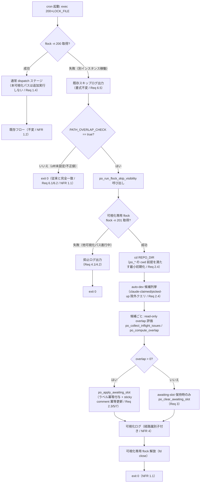

# Design Document

## Overview

cron 起動された watcher は repo 単位の単一実行ロック（`flock -n 200`）を取得できない場合、
`exec 200>"$LOCK_FILE"` 直後の `flock -n 200 || { echo "...スキップ"; exit 0 }`（`issue-watcher.sh:578-582`）で
dispatch ステージ全体を丸ごと skip して即時終了する。この skip 経路では `_dispatcher_run` が呼ばれず、
従って `po_check_dispatch_gate`（path-overlap 評価）も一切走らない。結果として、別インスタンスが
先行 Issue を長サイクル処理している間、後続の auto-dev 候補は `awaiting-slot` ラベルも見送り理由
コメントも付与されず、「なぜ動かないのか」が GitHub 上から判別できない死角となる。#228 / #229 の
可視化はいずれも「dispatcher が起動して slot 枯渇に至った場合」を前提とするため、dispatcher 自体が
起動しない本経路はカバーされていない。

**Purpose**: flock skip 経路に **dispatch を伴わない read＋label/comment のみ**の path-overlap
可視化パスを追加し、別インスタンス稼働中に待機している候補の見送り理由を GitHub 上に残す価値を
watcher 運用者に提供する。**Users**: idd-claude self-hosting および consumer repo の watcher 運用者が、
複数 cron インスタンス（または高頻度 cron）が競合する環境で「待機中候補がなぜ止まっているか」を
GitHub Issue 上で確認する workflow で利用する。**Impact**: 現在「flock skip = 完全な no-op で即 exit 0」
である状態を、「path-overlap 機能が有効（`PATH_OVERLAP_CHECK=true`）かつ可視化専用ロックを取得できた
場合に限り、claim/dispatch を伴わない可視化パスだけを実行してから exit 0 する」状態に変える。
path-overlap 機能が無効なら従来どおり完全 no-op を維持する。

本設計は既存の Phase E path-overlap 関数群（`po_collect_inflight_issues` / `po_compute_overlap` /
`po_resolve_overlap_holders` / `po_apply_awaiting_slot` / `po_clear_awaiting_slot` 等）を **シグネチャを
変更せず再利用**し、これらを flock skip コンテキストから呼ぶオーケストレータ関数 1 本
（`po_run_flock_skip_visibility`）と、可視化パス専用の短命・非ブロッキング flock を新設することで実現する。
評価ロジックの分岐や精度差を生まないため、overlap 判定規約・出力形式は通常 dispatch 経路と完全に共有する。

### Goals

- flock 取得失敗で dispatch を skip する場合でも、auto-dev 候補に path-overlap 可視化パス（in-flight 列挙 →
  overlap 計算 → `awaiting-slot`＋sticky comment）を read＋label/comment のみで実行する（Req 1）
- 可視化パスが claim / dispatch / worktree・slot・dispatch ロック取得を一切行わず、本サイクル処理中
  （`claude-claimed` / `claude-picked-up`）の Issue に構造的に触れないことを保証する（Req 2）
- 通常 dispatch 経路と同一の overlap 判定規約・`awaiting-slot`・sticky comment 出力形式を再利用し、
  解消時の自然回復（`po_clear_awaiting_slot`）を通常サイクルと共有する（Req 3 / Req 7）
- 可視化パスの多重起動を専用 flock で抑止し、抑止事実を識別可能なログに残す（Req 4）
- 既存 marker 方式（`awaiting-slot:v1`）による sticky comment の冪等更新で gh API ノイズを抑える（Req 5 / NFR 2）
- `PATH_OVERLAP_CHECK` opt-in gate 配下でのみ動作し、無効時は flock skip 挙動・exit code 0 を完全不変に保つ（Req 6 / NFR 1）

### 成功基準

- `PATH_OVERLAP_CHECK` 未設定 / `off` / 不正値の環境で、flock skip 時の出力・exit code が本機能導入前と byte 一致
- `PATH_OVERLAP_CHECK=true` かつ overlap 検出時、flock skip 経路で `awaiting-slot` 付与＋sticky comment post が発生
- 同一 overlap 状態の連続 tick で新規コメントが増えない（既存 sticky comment が PATCH 更新される）
- `shellcheck` 警告ゼロ

### Non-Goals

- flock skip 経路での claim / dispatch / worktree 操作の実行（本 Issue は read＋label/comment のみ。requirements Out of Scope）
- 空き slot への随時投入によるスループット改善 / 再スキャン型スケジューラ（別 Issue）
- Triage が推定する `edit_paths` の予測精度改善（評価精度そのものは扱わない。requirements Out of Scope）
- 既存 po_* 関数のシグネチャ変更（既存 dispatch 呼び出し元との両立を最優先）
- 多忙サイクル待ち（busy-wait / #228）の flock skip 経路への拡張（busy-wait は「dispatcher が起動して slot 枯渇」を前提とする別経路。本 Issue は path-overlap 由来の見送り可視化に限定）

## Architecture

### Existing Architecture Analysis

- **アーキテクチャパターン**: `issue-watcher.sh` 本体が `set -euo pipefail` 下で全 processor を直列実行し、
  低レベル関数群を `modules/*.sh`（`source` 同一プロセス読み込み）に分離する単一プロセス・モジュール構成。
- **尊重すべきドメイン境界**: path-overlap (po_*) 関数群は `modules/promote-pipeline.sh` に同居（#181 の境界マップ）。
  本設計でも新規オーケストレータ関数を同モジュールに追加し、新規モジュールは作らない（既存境界維持）。
- **維持すべき統合点**: `po_*` 関数群は global 変数（`$REPO` / `$LOG_DIR` / `$LABEL_AWAITING_SLOT` /
  `$PATH_OVERLAP_CHECK` / `$BASE_BRANCH` / `$PROMOTION_TARGET_BRANCH` / `$LABEL_*` 定数）に bash 遅延束縛で
  依存し、read＋label/comment のみで動作する（worktree / slot / dispatch ロック不要）。これは flock skip
  コンテキストでも同一に成立する（後述「po_* の新コンテキスト実行可否」で精査）。
- **解消する死角**: flock skip 経路（`issue-watcher.sh:578-582`）が完全 no-op であること自体は意図的だが、
  path-overlap 可視化の観点では death angle。介入は exit 0 の **直前** に限定し、dispatch ステージへは決して進ませない。

### po_* の新コンテキスト実行可否（精査）

既存 po_* を flock skip コンテキストから呼ぶ際の前提充足を精査した結果:

| 既存 po_* 関数 | 前提とする状態 | flock skip 文脈での充足 |
|---|---|---|
| `po_load_edit_paths` | `$REPO`（global）/ cwd 非依存 | Config ブロックで束縛済み = 充足 |
| `po_collect_inflight_issues` | `$REPO`（global）/ read-only `gh issue list` | 充足（worktree/slot 不要） |
| `po_resolve_holder_labels` | `$LABEL_*` / `$BASE_BRANCH` / `$PROMOTION_TARGET_BRANCH` | Config ブロックで束縛済み = 充足 |
| `po_compute_overlap` / `po_resolve_overlap_holders` | 引数のみ（global 非依存・純 jq） | 充足 |
| `po_apply_awaiting_slot` / `po_clear_awaiting_slot` | `$REPO` / `$LABEL_AWAITING_SLOT` | Config ブロックで束縛済み = 充足 |

充足のために必要な最小初期化は **`cd "$REPO_DIR"` のみ**（po_* 自体は cwd に依存しないが、flock skip ブロックは
`cd "$REPO_DIR"` 前に位置するため、`git`/相対参照を将来含めても安全なよう REPO_DIR へ移動しておく。失敗時は
warn して可視化を skip）。env の追加初期化は不要（全 global は本体 Config ブロックで定義済み）。po_* の
シグネチャ・契約は一切変更しない（既存 dispatch 呼び出し元との両立）。

### Architecture Pattern & Boundary Map

採用パターン: **早期介入フック（exit 直前の 1 関数呼び出し）+ 専用短命ロックによる多重起動抑止**。
flock skip の `exit 0` 直前に opt-in gate 配下の可視化オーケストレータ 1 本を挿入し、その内部で
read-only な候補列挙・overlap 計算・既存 apply/clear 関数を順に呼ぶ。dispatch ステージ（`cd "$REPO_DIR"`
以降の全 processor）には一切到達しない。



**Architecture Integration**:
- 採用パターン: 早期介入フック（既存の `process_*` 直列呼び出しパターンと整合する関数 1 本呼び出し）+
  専用ロック（既存 `LOCK_FILE`/fd 200 と独立した別ファイル・別 fd）
- ドメイン／機能境界: 可視化オーケストレータは path-overlap ドメインに属するため `modules/promote-pipeline.sh`
  へ追加（既存 po_* と同居）。本体 `issue-watcher.sh` には call site（フック）と config（env var / ロックファイルパス）のみ追加
- 既存パターンの維持: opt-in gate（`[ "$PATH_OVERLAP_CHECK" = "true" ] || return 0`）/ fail-open（gh 失敗で warn 継続）/
  marker 方式 sticky comment / `po_log`・`po_warn` ロガー prefix を踏襲
- 新規コンポーネントの根拠: flock skip コンテキストは `_dispatcher_run` の candidate ループとは別の入口であり、
  candidate 列挙クエリ（claim ラベル除外）と専用ロック取得を行うオーケストレータが必要。ただし overlap 評価
  本体は既存 po_* を再利用するため新規ロジックは最小化する

### Technology Stack

| Layer | Choice / Version | Role in Feature | Notes |
|-------|------------------|-----------------|-------|
| Frontend / CLI | - | 本機能に UI なし | 可視化は GitHub Issue ラベル / コメント経由 |
| Backend / Services | bash 4+ (`issue-watcher.sh` / `modules/promote-pipeline.sh`) | 介入フック + 可視化オーケストレータ + 専用ロック | `set -euo pipefail` は本体で宣言済み。モジュールは関数定義のみ |
| Data / Storage | ローカルファイル（専用 lock file） | 可視化パスの多重起動抑止 | `flock -n` 用の空ファイル。`$LOG_DIR` 配下に配置（repo ごと分離済み） |
| Messaging / Events | GitHub Issue ラベル（`awaiting-slot`）/ sticky comment（marker `awaiting-slot:v1`） | 見送り理由の可視化シグナル | 既存 marker 契約を変更しない（Req 6.4） |
| Infrastructure / Runtime | `flock`（Linux 標準 / macOS util-linux）, `gh`, `jq`, `git` | ロック取得・候補列挙・overlap 計算 | 既存依存コマンド（`issue-watcher.sh:494` の `for cmd in gh jq claude git flock`）の範囲内 = 新規依存なし |

## File Structure Plan

本機能は新規ファイル / 新規ディレクトリを作らず、既存 2 ファイルの修正 + README 更新 + スモークテスト
fixture/script の追加で構成する。

### Directory Structure（変更点のみ）

```
local-watcher/bin/
├── issue-watcher.sh                 # 本体: ① 可視化専用ロックファイルパスの config 追加
│                                    #       ② flock skip ブロック（578-582）に exit 0 直前フック追加
└── modules/
    └── promote-pipeline.sh          # po_run_flock_skip_visibility（新規オーケストレータ）+
                                     #   po__visibility_evaluate_candidate（新規内部ヘルパー）を
                                     #   既存 po_* 群（po_check_dispatch_gate 近傍）へ追加
docs/specs/243-feat-watcher-flock-dispatch-skip-path-ov/
└── test-fixtures/
    └── test-flock-skip-visibility.sh  # スモークテスト: opt-in gate / 専用ロック多重起動抑止 /
                                       #   候補クエリの claim 除外 の純ロジックを mock 環境で検証
README.md                            # Path Overlap Checker (Phase E) 節に flock skip 可視化サブ節を追加
```

### Modified Files

- `local-watcher/bin/issue-watcher.sh`
  - **config 追加**（`PATH_OVERLAP_CHECK` 定義近傍 = 336 行付近、ただし `LOG_DIR` 定義 370 行より後ろ）:
    可視化専用ロックファイルパス `PATH_OVERLAP_VISIBILITY_LOCK_FILE` を
    `${PATH_OVERLAP_VISIBILITY_LOCK_FILE:-$LOG_DIR/flock-skip-visibility.lock}` で定義（env override 可・既定無害値）。
  - **flock skip ブロック修正**（578-582 行）: `exit 0` の **直前** に opt-in gate 配下の
    `po_run_flock_skip_visibility` 呼び出しフックを挿入。既存スキップログ（`echo "...スキップ"`）は書式不変で残す。
- `local-watcher/bin/modules/promote-pipeline.sh`
  - **新規関数 `po_run_flock_skip_visibility`** と **新規内部ヘルパー `po__visibility_evaluate_candidate`** を
    `po_check_dispatch_gate`（801-879 行）近傍に追加。既存 po_* のシグネチャは変更しない。
- `README.md`
  - 「Path Overlap Checker (Phase E)」節（1681 行〜）に flock skip 経路の可視化サブ節を追加し、
    1801-1806 行の「別インスタンス稼働（flock skip）時の対象範囲」注記を本機能導入後の挙動へ更新。
  - オプション機能一覧 / env var 表（1710 行付近）に `PATH_OVERLAP_VISIBILITY_LOCK_FILE` を追記。

> **root↔repo-template 二重管理の影響なし**: 本 Issue は `local-watcher/bin/` と `README.md` の変更のみで
> `.claude/{agents,rules}/` を変更しないため、root↔repo-template の byte 一致 reconciliation 対象外。
> `local-watcher/` は root 専用（repo-template に複製されない）であり、二重管理規約の影響を受けない。

## Requirements Traceability

| Requirement | Summary | Components | Interfaces | Flows |
|-------------|---------|------------|------------|-------|
| 1.1 | flock skip 時に可視化パス実行 | flock skip フック / `po_run_flock_skip_visibility` | exit 0 直前フック | 図 B→D→E→F |
| 1.2 | overlap 検出時 `awaiting-slot` 付与 | `po_apply_awaiting_slot`（再利用） | ラベル冪等付与 | 図 L→M |
| 1.3 | overlap 検出時 sticky comment post | `po_apply_awaiting_slot`（再利用） | marker `awaiting-slot:v1` | 図 L→M |
| 1.4 | flock 成功時は本パスを追加実行しない | flock skip フック（else 分岐外） | フック配置位置 | 図 B→C（フック不通過） |
| 2.1 | claim / dispatch を行わない | `po_run_flock_skip_visibility` | read＋label/comment のみ | 図 K/M/N に claim なし |
| 2.2 | worktree / slot / dispatch ロックを取得しない | `po_run_flock_skip_visibility` | 専用 flock のみ取得 | 図 G（専用ロックのみ） |
| 2.3 | in-flight 列挙と overlap 計算を read 専用 | `po_collect_inflight_issues` / `po_compute_overlap`（再利用） | read-only gh / jq | 図 K |
| 2.4 | 処理中 Issue（claimed/picked-up）に触れない | 候補列挙クエリ（claim ラベル除外） | `gh issue list --search` 除外句 | 図 J |
| 3.1 | overlap 解消時に `awaiting-slot` 除去 | `po_clear_awaiting_slot`（再利用） / 通常サイクル | ラベル除去 | 図 N + 通常 dispatch |
| 3.2 | 付与した `awaiting-slot` を通常サイクルが除去できる状態に保つ | 共有 marker / 共有関数 | `awaiting-slot:v1` 共有 | 通常 `po_check_dispatch_gate` |
| 4.1 | 多重起動を 1 実行のみ許容 | 可視化専用 flock | `flock -n 201` | 図 G |
| 4.2 | 抑止事実を識別可能ログに出力 | `po_run_flock_skip_visibility` | `po_log`/`po_warn` 経路識別子 | 図 H |
| 5.1 | 同一 overlap 状態で sticky comment 更新（新規追加しない） | `po_apply_awaiting_slot`（再利用） | marker PATCH | 図 M |
| 5.2 | sticky comment を 1 件に保つ | `po_apply_awaiting_slot`（再利用） | marker 検索→PATCH/create | 図 M |
| 5.3 | `awaiting-slot` 重複付与しない | `po_apply_awaiting_slot`（`--add-label` 冪等） | gh edit 冪等 | 図 M |
| 6.1 | 機能無効時は可視化パスを実行しない | opt-in gate | `[ PATH_OVERLAP_CHECK = true ]` | 図 E→Z1 |
| 6.2 | 機能無効時 flock skip 挙動を導入前と同一に保つ | flock skip フック（gate 前で従来コード） | gate 前は不変 | 図 E→Z1 |
| 6.3 | 既存 `awaiting-slot` 付与・除去契約を変更しない | `po_apply/clear_awaiting_slot`（再利用） | シグネチャ不変 | 再利用 |
| 6.4 | 既存 sticky comment marker / 投稿契約を変更しない | `po_apply_awaiting_slot`（再利用） | marker `awaiting-slot:v1` 不変 | 再利用 |
| 6.5 | 既存 env var 名 / ラベル遷移 / exit code / ログ書式を変更しない | config（新規 env のみ追加）/ フック | 既存定数・書式不変 | 全体 |
| 7.1 | 通常経路と同一 overlap 判定規約 | `po_compute_overlap` / `po_collect_inflight_issues`（再利用） | 同一正規化規約 | 図 K |
| 7.2 | 通常経路と同一ラベル / sticky comment 出力形式 | `po_apply_awaiting_slot`（再利用） | 同一 marker / 表形式 | 図 M |
| NFR 1.1 | 無効時 flock skip exit code を 0 に保つ | opt-in gate / フック | exit 0 不変 | 図 E→Z1 |
| NFR 1.2 | flock 成功時の全ステージ挙動を不変に保つ | フック配置（else 分岐内のみ） | 通常経路非介入 | 図 B→C |
| NFR 2.1 | 状態不変候補で tick ごとに gh 呼び出しを増やさない | marker 冪等更新（`po_apply_awaiting_slot`） | sticky PATCH | 図 M |
| NFR 2.2 | overlap 状態不変候補に新規コメントを追加しない | marker 検索→PATCH（`po_apply_awaiting_slot`） | marker 既存時 PATCH | 図 M |
| NFR 3.1 | 同一状態連続実行で可視化シグナル集合を変えない | 冪等ラベル + 冪等 sticky | 冪等性 | 図 M/N |
| NFR 3.2 | 途中失敗で全体を異常終了させず継続 | fail-open（`|| po_warn`）/ `return 0` | エラー吸収 | Error Handling 参照 |
| NFR 4.1 | overlap 検出 + 付与時に候補番号・overlap をログ出力 | `po_collect`/`po_apply` 既存ログ + 経路識別子 | `po_log` | 図 O |
| NFR 4.2 | flock skip 経路を通常経路と区別可能な経路識別子でログ出力 | `po_run_flock_skip_visibility` 起動ログ | `route=flock-skip` 識別子 | 図 F/O |

## Components and Interfaces

### Path Overlap Domain（`modules/promote-pipeline.sh`）

#### po_run_flock_skip_visibility（新規）

| Field | Detail |
|-------|--------|
| Intent | flock skip コンテキストで dispatch を伴わない path-overlap 可視化パスを 1 サイクル実行する |
| Requirements | 1.1, 1.2, 1.3, 2.1, 2.2, 2.3, 2.4, 4.1, 4.2, NFR 2.1, NFR 2.2, NFR 3.2, NFR 4.1, NFR 4.2 |

**Responsibilities & Constraints**
- 主責務: 専用 flock 取得 → 候補列挙（claim 除外）→ 候補ごとに既存 po_* で overlap 評価 →
  `awaiting-slot`＋sticky comment 付与（overlap あり）/ `awaiting-slot` 除去（overlap なし & 既付与）
- 制約: claim / dispatch / worktree・slot・dispatch ロックを取得しない（Req 2.1 / 2.2）。
  状態変更操作はラベル付与・除去・sticky comment の post/update のみ（read＋label/comment）。
- データ所有権: 自身は状態を持たず、GitHub 上のラベル / sticky comment と専用 lock file のみを扱う。
- invariants: 必ず `return 0`（呼び出し側の `set -e` 下でも watcher を異常終了させない / NFR 3.2）。
  本サイクル処理中の `claude-claimed` / `claude-picked-up` Issue を候補集合に含めない（Req 2.4）。

**Dependencies**
- Inbound: flock skip フック（`issue-watcher.sh:578-582`） — opt-in gate 通過後に呼ぶ (Critical)
- Outbound: `po__visibility_evaluate_candidate` — 候補ごとの overlap 評価コア (Critical)
- Outbound: `po_collect_inflight_issues` / `po_compute_overlap` / `po_resolve_overlap_holders` / `po_apply_awaiting_slot` / `po_clear_awaiting_slot` / `po_load_edit_paths` / `po_resolve_holder_labels` — `po__visibility_evaluate_candidate` 経由で再利用 (Critical)
- External: `flock` — 専用 lock 取得 (Critical) / `gh` — 候補列挙・ラベル・コメント (Critical) / `jq` — JSON 整形 (Critical)

**Contracts**: Service [x] / API [ ] / Event [ ] / Batch [ ] / State [ ]

##### Service Interface

```bash
# 用途: flock skip 経路の path-overlap 可視化パスを 1 サイクル実行する。
# Args: なし（global $REPO / $REPO_DIR / $LOG_DIR / $PATH_OVERLAP_CHECK /
#       $PATH_OVERLAP_VISIBILITY_LOCK_FILE / $LABEL_* / $BASE_BRANCH /
#       $PROMOTION_TARGET_BRANCH に依存）。
# Stdout/Stderr: po_log / po_warn による 1 行ログ（経路識別子 route=flock-skip を含む）。
# Return: 0 always（NFR 3.2 / NFR 1.1 — 異常終了させない）。
po_run_flock_skip_visibility()
```
- Preconditions:
  - 呼び出し側が `[ "$PATH_OVERLAP_CHECK" = "true" ]` を確認済み（本関数冒頭でも二重に gate して fail-safe）。
  - `$REPO` / `$REPO_DIR` / `$LOG_DIR` / `$LABEL_AWAITING_SLOT` / `$LABEL_TRIGGER` 等が束縛済み（本体 Config ブロックで定義済み）。
- Postconditions:
  - 専用 flock を取得できた場合のみ候補評価を実施し、終了時に fd close で解放する。
  - overlap 検出候補に `awaiting-slot`＋sticky comment が冪等に付与され、解消候補から `awaiting-slot` が除去される。
  - 専用 flock を取得できなかった場合は抑止ログを出して候補評価を行わず即 `return 0`（Req 4.1 / 4.2）。
- Invariants:
  - claim / dispatch / worktree・slot・dispatch ロックを取得しない（Req 2.1 / 2.2）。
  - 候補集合に `claude-claimed` / `claude-picked-up`（および既存 dispatch クエリと同等の処理中ラベル）を含めない（Req 2.4）。

##### 内部フロー（疑似コード）

```bash
po_run_flock_skip_visibility() {
  # ① opt-in gate（二重防御 / Req 6.1）
  [ "${PATH_OVERLAP_CHECK:-off}" = "true" ] || return 0

  # ② 可視化専用 flock を別 fd（201）+ 別ファイルで非ブロッキング取得（Req 2.2 / 4.1）
  local lock_file="${PATH_OVERLAP_VISIBILITY_LOCK_FILE:-${LOG_DIR}/flock-skip-visibility.lock}"
  exec 201>"$lock_file" 2>/dev/null || { po_warn "route=flock-skip 専用ロックファイルを開けません lock=${lock_file}"; return 0; }
  if ! flock -n 201; then
    po_log "route=flock-skip visibility skipped (別の可視化パスが進行中 lock=${lock_file})"   # Req 4.2
    exec 201>&- 2>/dev/null || true
    return 0
  fi

  # ③ po_* の cwd 前提を満たす最小初期化（Req 2.4 / po_* 再利用）。失敗しても異常終了させない。
  cd "$REPO_DIR" 2>/dev/null || { po_warn "route=flock-skip REPO_DIR へ cd 失敗 dir=${REPO_DIR}"; exec 201>&- 2>/dev/null || true; return 0; }

  po_log "route=flock-skip path-overlap visibility 開始"   # NFR 4.2 経路識別子

  # ④ auto-dev 候補列挙（claim ラベル除外 = 本サイクル処理中 Issue を触らない / Req 2.4）
  #    重要: _dispatcher_run の search_filter / DISPATCH_LIMIT は同関数の local 変数で本関数からは
  #    見えない。よって本関数内で同等の除外句・limit を **自前で再構築**する（重複定義になるが、
  #    既存 search_filter に変更を加えず安全側）。除外ラベルは少なくとも処理中（claude-claimed /
  #    claude-picked-up）と既存 dispatcher の除外集合（claude-failed / needs-iteration / blocked 等）を含める。
  local vis_search_filter
  vis_search_filter="-label:\"$LABEL_NEEDS_DECISIONS\" -label:\"$LABEL_AWAITING_DESIGN\" -label:\"$LABEL_CLAIMED\" -label:\"$LABEL_PICKED\" -label:\"$LABEL_READY\" -label:\"$LABEL_FAILED\" -label:\"$LABEL_NEEDS_ITERATION\" -label:\"$LABEL_NEEDS_QUOTA_WAIT\" -label:\"$LABEL_STAGED_FOR_RELEASE\" -label:\"$LABEL_BLOCKED\""
  local vis_limit=5
  local candidates_json
  candidates_json=$(gh issue list --repo "$REPO" --label "$LABEL_TRIGGER" --state open \
    --search "$vis_search_filter sort:created-asc" \
    --json number,labels --limit "$vis_limit" 2>/dev/null) || {
      po_warn "route=flock-skip auto-dev 候補列挙に失敗（本サイクルの可視化を skip）"   # NFR 3.2
      exec 201>&- 2>/dev/null || true; return 0;
    }

  # ⑤ 候補ごとに既存 po_* で overlap 評価（通常経路と同一規約 / Req 7.1）
  local issue labels_json candidate
  while IFS= read -r issue; do
    [ -z "$issue" ] && continue
    candidate=$(echo "$issue" | jq -r '.number')
    labels_json=$(echo "$issue" | jq -c '.labels')
    po__visibility_evaluate_candidate "$candidate" "$labels_json" \
      || po_warn "route=flock-skip issue=#${candidate} 可視化評価で警告（後続候補は継続）"   # NFR 3.2
  done < <(echo "$candidates_json" | jq -c '.[]')

  # ⑥ 専用 flock 解放
  exec 201>&- 2>/dev/null || true
  return 0
}
```

> **設計判断（vis_search_filter の重複定義）**: `_dispatcher_run` の `search_filter` / `DISPATCH_LIMIT` は
> 同関数の `local` 変数のため本関数からは参照できない。代替案として ① 両者を本体 global 定数へ昇格させて
> 共有する案も検討したが、`_dispatcher_run` 側の既存挙動に手を入れるリスク（NFR 1.2 全ステージ不変違反の
> 可能性）を避けるため却下し、本関数内で同等の除外句を **自前再構築**する案を採用した。重複は許容するが、
> 除外集合に処理中ラベル（`claude-claimed` / `claude-picked-up`）を必ず含めることで Req 2.4 を構造的に保証する。
> tasks では「除外句に処理中ラベルを含むこと」をスモークで検証する（task 4.1）。

#### po__visibility_evaluate_candidate（新規・内部ヘルパー）

| Field | Detail |
|-------|--------|
| Intent | 1 候補について read-only overlap 評価を行い、検出時 apply / 解消時 clear を呼ぶ |
| Requirements | 1.2, 1.3, 2.3, 3.1, 5.1, 5.2, 5.3, 7.1, 7.2, NFR 2.1, NFR 2.2, NFR 4.1 |

**Responsibilities & Constraints**
- 主責務: `po_load_edit_paths` → `po_collect_inflight_issues`（`po_resolve_holder_labels` で holder 集合解決）→
  `po_compute_overlap` → overlap>0 かつ未付与なら `po_apply_awaiting_slot`、overlap=0 かつ既付与なら `po_clear_awaiting_slot`。
- 制約: `po_check_dispatch_gate` の overlap 判定部分（811-878 行）と **同一の関数・引数**を用い、評価規約の分岐を作らない（Req 7.1）。
- invariants: read＋label/comment のみ。dispatch 制御の return は持たない（戻り値は warn 判定にのみ使用）。

> **設計判断（po_check_dispatch_gate を直接呼ばずヘルパーへ切り出す理由）**: `po_check_dispatch_gate` は
> 戻り値で「0=claim 続行 / 1=dispatch skip」という dispatch 固有の制御を表す。flock skip 文脈ではこの戻り値が
> 無意味なため、そのままの呼び出しは責務が合わない。代替案として `po_check_dispatch_gate` に「可視化のみモード」
> 引数を足す案も検討したが、既存シグネチャ非変更（Non-Goals）を優先して却下。採用案は overlap 判定〜apply/clear の
> 共通コアを `po__visibility_evaluate_candidate` として切り出し、`po_check_dispatch_gate` 側はリファクタせず
> 現状維持する（最小変更 + 既存挙動完全保持）。

**Contracts**: Service [x]

```bash
# Args: $1 = candidate issue number, $2 = candidate labels JSON
# Return: 0 = 評価完了 / 1 = 評価中に警告（呼び出し側が warn ログ）
po__visibility_evaluate_candidate()
```
- Preconditions: `cd "$REPO_DIR"` 済み、専用 flock 保持中。
- Postconditions: overlap 状態に応じて `awaiting-slot` が冪等付与 / 除去され、sticky comment が冪等更新される。
- Invariants: 通常 dispatch 経路（`po_check_dispatch_gate`）と overlap 判定・出力形式を共有（Req 7.1 / 7.2）。

### Watcher 本体（`issue-watcher.sh`）

#### flock skip フック（修正）

| Field | Detail |
|-------|--------|
| Intent | flock skip の exit 0 直前に opt-in gate 配下で可視化オーケストレータを呼ぶ |
| Requirements | 1.1, 1.4, 6.1, 6.2, 6.5, NFR 1.1, NFR 1.2 |

**Responsibilities & Constraints**
- 主責務: `flock -n 200 ||` の失敗ブロック内、既存スキップログ出力後 / `exit 0` 直前に、
  `[ "${PATH_OVERLAP_CHECK:-off}" = "true" ]` の場合のみ `po_run_flock_skip_visibility || true` を呼ぶ。
- 制約: gate 前の既存コード（`echo "...スキップ"`）は書式不変（Req 6.5）。flock 成功時の通常分岐には一切介入しない（Req 1.4 / NFR 1.2）。
- invariants: `exit 0` の意味・値は不変（NFR 1.1）。

**Contracts**: State [x]（flock skip ブロックの制御フロー追加）

##### State transition（flock skip ブロック）

```bash
exec 200>"$LOCK_FILE"
flock -n 200 || {
  echo "[$(date '+%F %T')] 他のインスタンスが実行中のためスキップ"   # 既存・書式不変（Req 6.5）
  # ── #243: flock skip path-overlap 可視化フック ──
  # PATH_OVERLAP_CHECK=true のときのみ、dispatch を伴わない read+label/comment の
  # 可視化パスを 1 サイクル実行する。off/未設定/不正値では一切呼ばず従来と完全一致（Req 6.1/6.2 / NFR 1.1）。
  if [ "${PATH_OVERLAP_CHECK:-off}" = "true" ]; then
    po_run_flock_skip_visibility || true   # NFR 3.2: 失敗でも exit 0 を維持
  fi
  exit 0   # NFR 1.1: exit code 不変
}
```

> **配置の正確性（Req 1.4 / NFR 1.2）**: フックは `flock -n 200 || { ... }` の **失敗ブロック内**にのみ置く。
> flock 取得成功時はこのブロックに入らないため、通常 dispatch 経路では本可視化パスが追加実行されない
> ことが制御フローとして構造的に保証される。

#### Config 追加（`issue-watcher.sh`）

| Field | Detail |
|-------|--------|
| Intent | 可視化専用ロックファイルパスを env override 可能・既定無害値で定義 |
| Requirements | 4.1, 6.5, NFR 1.1 |

```bash
# ─── #243: flock skip 経路 path-overlap 可視化パスの専用ロック ───
# 可視化パスの多重起動を抑止する短命 flock 用ファイル。本サイクルの $LOCK_FILE（fd 200）とは
# 別ファイル・別 fd（201）で取得する（Req 2.2 / 4.1）。LOG_DIR は repo ごとに分離済みのため
# repo 間で衝突しない。env で override 可能・既定無害値（PATH_OVERLAP_CHECK=off 環境では未参照）。
PATH_OVERLAP_VISIBILITY_LOCK_FILE="${PATH_OVERLAP_VISIBILITY_LOCK_FILE:-${LOG_DIR}/flock-skip-visibility.lock}"
```

## Data Models

### Domain Model

本機能は新規の永続データモデルを導入しない（busy-wait のような tick state ファイルは使わない。
理由は後述「評価頻度の閾値」節）。扱う状態は以下のみ:

- **可視化シグナル（GitHub 上）**: `awaiting-slot` ラベル + marker `<!-- idd-claude:awaiting-slot:v1 -->` 付き
  sticky comment（1 Issue 1 件）。既存 path-overlap 経路と同一の値オブジェクトであり、所有権・契約を共有する（Req 3.2 / 6.3 / 6.4 / 7.2）。
- **可視化専用ロック（ローカル）**: `$PATH_OVERLAP_VISIBILITY_LOCK_FILE`（既定 `$LOG_DIR/flock-skip-visibility.lock`）。
  `flock -n` 用の空ファイル。内容は持たず、ファイルの存在と advisory lock のみが意味を持つ。冪等（既存でも再利用）。

### 評価頻度の閾値（採否と根拠）

**結論: 評価頻度の追加閾値（busy-wait の tick カウンタ相当）は設けない。**

判定材料と根拠:
- NFR 2 が要求するのは「**見送り状態が変化しない候補について cron tick ごとに gh API 呼び出しを
  増やさない**」ことであり、これは既存 `po_apply_awaiting_slot` の **marker 集約 + 冪等付与**で構造的に
  満たされる（同一 overlap 状態なら sticky comment は PATCH 更新で、新規コメントは増えない / Req 5.1 / NFR 2.2）。
- 候補列挙の gh 呼び出し（`gh issue list` 1 回 + 候補ごとの `po_load_edit_paths` / `po_collect_inflight_issues`）は
  通常 dispatch 経路と同一回数であり、flock skip 経路で新たに増えるのは「`gh issue list` 1 回 + 候補数 × 既存読み出し」。
  これは通常 cron tick が flock を取得していた場合に発生していた呼び出しと同等であり、**flock skip によって
  本来行われるはずだった評価が行われていなかった死角を埋めるもの**。tick 閾値で間引くと「待機理由が
  GitHub に出るまでのラグ」が伸び、Req 1（見送り理由を残す）の価値を損なう。
- busy-wait（#228）が tick 閾値を持つのは「transient な数 tick の待機をノイズとして抑制する」目的で、
  そのために**ローカル state ファイル**を導入していた。本 path-overlap 可視化は overlap という**観測可能な
  状態**に直接連動し、marker 冪等更新で連投が抑止されるため、transient 抑制のための追加 tick state は不要。
- 多重起動抑止（Req 4）は専用 flock で担保するため、複数 cron インスタンス同時起動時の API 多重消費も抑止される。

代替案（閾値を設ける案）の却下理由: tick state ファイル管理（busy-wait と別系統 or 共有）の複雑性と、
可視化ラグの増大が、得られる API 削減（marker 冪等更新で既に達成済み）に見合わない。本サイクルロックの
保持時間推定（別インスタンスの処理時間予測）は信頼性が低く、判定材料として採用しない。

## Error Handling

### Error Strategy

全エラーを **fail-open（後続継続・正常終了）** で扱う。可視化パスは付随機能であり、その失敗が
watcher 全体の exit code（flock skip 時は常に 0）や他の動作を妨げてはならない（NFR 3.2 / NFR 1.1）。
`po_run_flock_skip_visibility` は `set -e` 下でも必ず `return 0` し、呼び出し側も `|| true` で二重に吸収する。

### Error Categories and Responses

- **専用ロックファイルを開けない / flock 取得失敗（多重起動）**: `po_warn` / `po_log` で経路識別子付き
  ログを出し、候補評価を行わず `return 0`（Req 4.1 / 4.2）。多重起動はエラーではなく設計上の正常分岐。
- **`cd "$REPO_DIR"` 失敗**: `po_warn` で記録し可視化を skip して `return 0`（環境異常でも watcher を落とさない）。
- **`gh issue list`（候補列挙）失敗 / レート制限**: `po_warn` で記録し本サイクルの可視化を skip して `return 0`（NFR 3.2）。
- **候補ごとの in-flight 列挙失敗**: 既存 `po_collect_inflight_issues` が `return 1` → 当該候補のみ skip して
  次候補へ継続（既存 fail-open 挙動を再利用 / NFR 3.2）。
- **ラベル付与 / sticky comment 失敗**: 既存 `po_apply_awaiting_slot` が内部で `|| true` 吸収 + `po_warn`
  しつつコメント投稿を継続（既存挙動再利用 / Req 6.3 / 6.4）。
- **`awaiting-slot` 除去失敗**: 既存 `po_clear_awaiting_slot` が `return 1` → 当該候補は次サイクルで再試行
  （flock skip 経路 or 通常経路のどちらでも再評価される / Req 3.1）。

## Testing Strategy

idd-claude には unit test フレームワークがないため、検証は静的解析 + 純ロジックスモークスクリプト +
dogfooding E2E の組み合わせで行う（CLAUDE.md「テスト・検証」準拠）。

### Unit Tests（純ロジックスモーク / `test-fixtures/test-flock-skip-visibility.sh`）
1. opt-in gate: `PATH_OVERLAP_CHECK` が `off` / 未設定 / `True` / `1` / typo のとき `po_run_flock_skip_visibility` が
   候補列挙に進まず即 `return 0`（gh を 1 度も呼ばない mock で検証）
2. 専用ロックの多重起動抑止: 同一 lock file を別プロセスが保持中のとき `flock -n 201` が失敗し、
   抑止ログ（`route=flock-skip visibility skipped`）を出して `return 0` する
3. 候補列挙クエリの claim 除外: 構築する `gh issue list --search` 句に `claude-claimed` / `claude-picked-up` の
   除外（`-label:`）が含まれ、処理中 Issue が候補集合に入らない（Req 2.4）
4. exit code 不変: opt-in off の flock skip 経路が exit 0 / 出力 byte が本機能導入前と一致（差分等価）
5. fail-open: 候補列挙 mock を失敗させても `po_run_flock_skip_visibility` が `return 0` する（NFR 3.2）

### Integration Tests（mock gh による cross-component）
1. overlap 検出時に `po_apply_awaiting_slot` が呼ばれ `awaiting-slot` 付与 + marker `awaiting-slot:v1` sticky comment が生成される（Req 1.2 / 1.3 / 7.2）
2. 同一 overlap 状態の連続実行で sticky comment が PATCH 更新され新規コメントが増えない（Req 5.1 / NFR 2.2）
3. overlap 解消（既付与）候補で `po_clear_awaiting_slot` が呼ばれ `awaiting-slot` が除去される（Req 3.1）

### E2E Tests（dogfooding / 手動スモーク）
1. cron-like 最小 PATH での依存解決（`flock` が解決されること） + dry run（対象なしで正常終了）
2. `PATH_OVERLAP_CHECK=true` 環境で別インスタンスが flock 保持中の状態を作り、後続候補に `awaiting-slot` +
   sticky comment が付与されることを Issue 上で確認（README dogfood 手順に準拠）
3. 先行 Issue の PR merge 後、通常 dispatch サイクル（flock 取得成功）で `awaiting-slot` が自動除去されることを確認（Req 3.1 / 3.2）

### 静的解析
- `shellcheck local-watcher/bin/issue-watcher.sh local-watcher/bin/modules/promote-pipeline.sh`（警告ゼロ）
- `bash docs/specs/243-feat-watcher-flock-dispatch-skip-path-ov/test-fixtures/test-flock-skip-visibility.sh`（純ロジックスモーク）

## Security Considerations

- 本機能は read＋label/comment のみで、新たな外部サービス呼び出し・認証情報の取得を行わない（既存 `gh` 認証を再利用）。
- 専用 lock file は `$LOG_DIR` 配下（repo ごと分離・ユーザースコープ）に作成し、機密情報を含まない空ファイル。
- opt-in gate（`PATH_OVERLAP_CHECK=true`）配下でのみ動作するため、未 opt-in 環境では新規の副作用が一切発生しない。

## 確認事項（PM / 人間レビュー向け）

- requirements の全 numeric ID（Req 1〜7 の AC, NFR 1〜4 の AC）は本設計の Requirements Traceability で
  既存 po_* 再利用 + 新規オーケストレータ + 専用 flock に裏打ち済み。要件を発明・再解釈した箇所はない。
- 「評価頻度の閾値を設けない」判断（Issue 設計論点 3）は NFR 2 を marker 冪等更新で満たせるという解釈に
  基づく。tick 閾値による可視化ラグ抑制を運用上必須とみなす場合は要件側の追加判断が必要 → その場合は
  PM へ差し戻す（本設計では発明しない）。
- 専用ロックファイル既定パス（`$LOG_DIR/flock-skip-visibility.lock`）と env var 名
  （`PATH_OVERLAP_VISIBILITY_LOCK_FILE`）は新規導入。既存 env var・ラベル・exit code・ログ書式は不変。
- 候補列挙クエリの除外句は `_dispatcher_run` の `search_filter`（local 変数）を共有せず本関数で再構築する
  （理由は Components「設計判断（vis_search_filter の重複定義）」参照）。除外集合の重複定義が将来ドリフト
  しうる点はレビュー観点として明記する。
