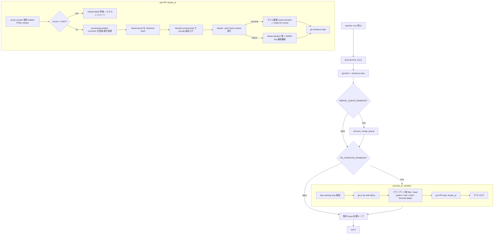
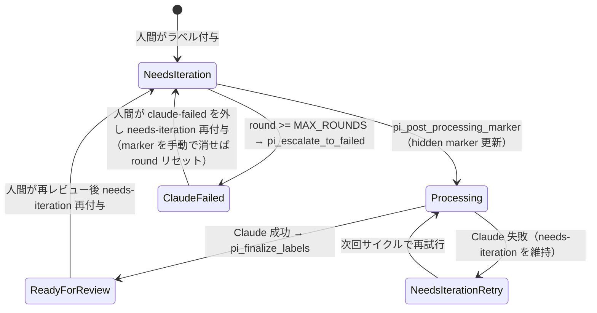
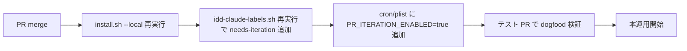

# Design Document

## Overview

**Purpose**: `needs-iteration` ラベルが付いた PR を watcher サイクル内で検知し、最新のレビューコメントを
fresh context の Claude に渡して「修正 commit + 各レビュースレッドへの返信」を自動で行う反復開発ループを
提供する。これにより、人間レビュワーは **ラベル 1 つ付けるだけ**で指摘の反映サイクルを回せるようになる。

**Users**: idd-claude の watcher 運用者（cron / launchd で `issue-watcher.sh` を回している個人 / 小規模チーム）と、
その watcher が作成した PR をレビューする人間。本機能は opt-in（`PR_ITERATION_ENABLED=true`）であり、
既存ユーザが明示的に有効化するまで一切の挙動変化が無いことを最優先する。

**Impact**: 現在は Issue → PR 作成までで自動化が途切れ、PR に line コメントが付くと人間が
ローカルで Claude Code を立ち上げ直す運用になっている。本機能の導入により、watcher サイクルが
「Phase A (merge queue) → 本機能 (PR iteration) → Issue 処理」という 3 段 pipeline に拡張される。
既存の `LOCK_FILE` flock 境界を共有するため、**同一 repo の同一 watcher プロセス内で直列実行**される
のが最大の整合ポイントとなる。

### Goals

- `needs-iteration` ラベル付きの idd-claude 管理下 PR（`claude/` 始まりの head branch）に対し、
  fresh context の Claude が (1) レビューコメント全件を読んで、(2) 必要な修正を通常 push（非 force）で積み、
  (3) 各レビュースレッドに返信し、(4) `ready-for-review` にラベルを戻す反復を自動化する
- 既存運用（cron / launchd / 環境変数名 / ラベル / lock / exit code）を**完全に壊さない**
  （`PR_ITERATION_ENABLED=false` で 100% 既存挙動）
- Phase A（`#14`、`process_merge_queue`）の merge queue 処理と同一 working copy 上で安全に共存する
- `PR_ITERATION_MAX_ROUNDS`（既定 3）で無限ループを閉じ、上限到達 PR は `claude-failed` に昇格

### Non-Goals

- 汎用 Reviewer サブエージェント（`#20` の範囲）
- タスク単位の per-task TDD 自走ループ（`#21` の範囲）
- `tasks.md` の自動更新、`requirements.md` / `design.md` の書き換え
- fork PR への対応（`headRepositoryOwner != base owner` は対象外）
- レビュースレッドの自動 resolve / unresolve（人間の運用判断を尊重）
- GitHub Actions 版ワークフロー（`.github/workflows/issue-to-pr.yml`）への組み込み
- iteration カウンタの外部ストア（DB / redis 等）化

---

## Architecture

### Existing Architecture Analysis

`local-watcher/bin/issue-watcher.sh` は現在以下の順序で動作する（1 サイクル = cron 1 発火）:

1. PATH 整備 → 依存 CLI の存在確認
2. `flock -n 200` で `$LOCK_FILE` を取得（多重起動防止。**同一 repo = 同一 lock**）
3. `cd "$REPO_DIR"` → `git fetch origin --prune` → `git checkout main` → `git pull --ff-only`
4. `process_merge_queue`（Phase A、`MERGE_QUEUE_ENABLED=true` の時のみ）
5. `gh issue list` で対象 Issue を取得し、1 件ずつ Triage → Dev プロンプト生成 → `claude --print` 実行
6. 各 Issue 処理の終端で `git checkout main` に戻る

尊重すべき制約:

- **単一 flock 境界**: 同一 repo への watcher 多重起動は既に防がれている。本機能も同じ境界に入れる
- **working tree クリーン前提**: Phase A はサブシェル + `trap EXIT` で必ず main に戻す。本機能も同じ規律を守る
- **ログ出力先統一**: すべての出力は `$LOG_DIR` 配下に集約（新規ディレクトリは作らない）
- **既存 label / env var / exit code の意味**: 一切変えない
- **cron-like 最小 PATH で動くこと**: `command -v` で全依存を事前検証

解消する technical debt: 無し（本機能は新規追加で、既存コードの変更は issue-watcher.sh への関数追加と
ラベルスクリプトへの 1 行追加のみ）。

### Architecture Pattern & Boundary Map

本機能は Phase A (`process_merge_queue`) と**同じパターン**を採用する:

- 同一 shell script 内に新規関数群として実装（`process_pr_iteration` とヘルパー）
- opt-in gate（`PR_ITERATION_ENABLED`）を先頭に置き、`false` の場合は即 return
- 既存の flock 内で直列実行される（Phase A → PR Iteration → Issue 処理）
- 独立した log prefix（`pr-iteration:`）で grep 集計を可能にする



**Architecture Integration**:

- 採用パターン: Phase A と同じ「watcher サイクル内の新規 Processor 関数 + opt-in env gate」
- ドメイン／機能境界: PR Iteration Processor は `needs-iteration` ラベル付き PR のみを扱う独立 Processor。
  Phase A（`needs-rebase` / approved PR）と対象 PR 集合が直交する
- 既存パターンの維持: flock 共有・log prefix 命名・サブシェル + trap による main checkout 復帰・
  timeout 規律・gh search クエリでのサーバ側フィルタ
- 新規コンポーネントの根拠: 新 prompt テンプレート（`iteration-prompt.tmpl`）は、
  既存 `triage-prompt.tmpl` と明確に責務が違う（Triage は Issue 文脈、Iteration は PR 文脈）ため分離

### Technology Stack

| Layer | Choice / Version | Role in Feature | Notes |
|-------|------------------|-----------------|-------|
| Shell | bash 4+ | `issue-watcher.sh` への関数追加 | 既存と同じ。新規依存なし |
| CLI: GitHub | `gh` CLI | PR list / review 取得 / コメント投稿 / ラベル操作 | 既存と同じ。`gh api` で Reviews REST API を利用 |
| CLI: JSON 処理 | `jq` | ラベル判定、hidden marker パース、review ソート | 既存と同じ |
| CLI: 並行制御 | `flock` | 単一 watcher 排他 | 既存と同じ lock file を共有 |
| CLI: 時間制御 | `timeout` | 各 `gh` / `git` / `claude` 呼び出しのハングガード | Phase A で既に依存。新規導入なし |
| CLI: Git | `git` | head branch checkout、通常 push（`--force` 禁止） | 既存と同じ。`--force-with-lease` は **使わない** |
| AI: Claude | `claude-opus-4-7` (default、env で override 可) | iteration 用の fresh context 実行 | `--session-id` や `--resume` を**使わず**、常に新規実行 |
| Prompt | `iteration-prompt.tmpl`（新規） | PR / review コメント / 修正ガイドの注入 | `triage-prompt.tmpl` と同じ `{{VAR}}` 置換方式 |
| Label | GitHub Labels | 状態遷移と重複抑止 | `needs-iteration` を新規追加（冪等） |

---

## File Structure Plan

本機能の追加・変更ファイル一覧（`_Boundary:_` アノテーションのドライバ）:

```
local-watcher/
└── bin/
    ├── issue-watcher.sh         # 変更: process_pr_iteration 関数群を追加、呼び出し箇所を Phase A 後に追加
    └── iteration-prompt.tmpl    # 新規: PR iteration 用の Claude prompt テンプレート（triage-prompt.tmpl と並列）

repo-template/
├── .claude/
│   └── agents/
│       └── developer.md         # 変更: "PR iteration モード" のガイダンスを追記
└── .github/
    └── scripts/
        └── idd-claude-labels.sh # 変更: needs-iteration ラベル定義を追加（冪等）

.github/
└── scripts/
    └── idd-claude-labels.sh     # 変更: needs-iteration ラベル定義を追加（self-host 側と同期）

docs/specs/
└── 26-feat-pr-needs-iteration/
    ├── requirements.md          # PM 作成済み
    ├── design.md                # 本ファイル
    ├── tasks.md                 # 本ファイルと同時に Architect が作成
    └── impl-notes.md            # Developer が実装完了後に追記

install.sh                       # 変更: iteration-prompt.tmpl を $HOME/bin へコピーする対象に追加
                                 # （triage-prompt.tmpl と同じ配置ロジックに足す）

README.md                        # 変更: PR Iteration Processor セクションを追加
                                 # - 機能概要 / 有効化方法 / env var 一覧
                                 # - needs-iteration ラベル説明 + 状態遷移表への追記
                                 # - Phase A との住み分け、両ラベル併存時の挙動
                                 # - Migration Note（既存ユーザは PR_ITERATION_ENABLED=false で完全無影響）
                                 # - watcher 再配置の案内（install.sh --local 再実行）
```

### Directory Structure（本機能の主要コンポーネントとファイル対応）

```
local-watcher/bin/
├── issue-watcher.sh             # Issue Watcher 本体（既存）
│   ├── process_merge_queue()    # Phase A（既存、変更なし）
│   └── process_pr_iteration()   # 本機能の新規エントリ関数
│       ├── pi_log / pi_warn / pi_error    # ロガー（Phase A の mq_* と同じパターン）
│       ├── pi_fetch_candidate_prs()       # PR 検出クエリ契約の実装
│       ├── pi_should_skip_pr()            # クライアント側フィルタ（draft/fork/head pattern/terminal labels）
│       ├── pi_read_round_counter()        # hidden HTML marker から round 数を読む
│       ├── pi_post_processing_marker()    # 着手表明 & round counter 書き込み
│       ├── pi_escalate_to_failed()        # 上限到達時の claude-failed 昇格
│       ├── pi_build_iteration_prompt()    # iteration-prompt.tmpl への変数注入
│       ├── pi_run_iteration() (alias iterate_pr_once)  # 1 PR 分の claude 実行（fresh context）
│       └── pi_finalize_labels()           # needs-iteration 除去 + ready-for-review 付与
└── iteration-prompt.tmpl        # 新規テンプレート（Claude に読ませる手順）
```

### Modified Files（詳細）

- **`local-watcher/bin/issue-watcher.sh`**:
  - Config ブロックに PR Iteration 用 env var のデフォルト（`PR_ITERATION_ENABLED` 等）と
    新規ラベル定数 `LABEL_NEEDS_ITERATION="needs-iteration"` を追加
  - `process_merge_queue` 呼び出し直後に `process_pr_iteration || pi_warn ...` を追加（Phase A と同じ防御パターン）
  - 依存 CLI チェックは既存のまま（新規依存なし）
- **`repo-template/.claude/agents/developer.md`**:
  - 末尾に「PR iteration モード（#26）」節を追加
  - iteration プロンプトで起動された場合の行動指針（修正範囲の限定、スレッド返信の粒度、
    `requirements.md` / `design.md` を書き換えない原則）を明記
- **`.github/scripts/idd-claude-labels.sh` / `repo-template/.github/scripts/idd-claude-labels.sh`**:
  - `LABELS` 配列に `"needs-iteration|d4c5f9|PR レビューコメントの反復対応待ち（#26 PR Iteration Processor が処理）"` を追加（色は Phase A の `needs-rebase` と視覚的に区別する紫系パステル）
  - 冪等処理は既存ロジックをそのまま使う（変更不要）
- **`install.sh`**:
  - `--local` で `$HOME/bin/` に `triage-prompt.tmpl` をコピーしている箇所の隣に `iteration-prompt.tmpl` を追加
- **`README.md`**:
  - 「Merge Queue Processor (Phase A)」セクションと同等の構造で「PR Iteration Processor (#26)」節を追加
  - ラベル一覧・状態遷移図に `needs-iteration` を追記
  - Migration Note に本機能のデフォルト無効と env 一覧、依存コマンドの追加なしを明記

---

## Requirements Traceability

requirements.md の全 numeric ID と設計要素の対応表。

| Req ID | Summary | Components / Files | Contracts / Flows |
|--------|---------|--------------------|-------------------|
| 1.1 | `needs-iteration` 付き open PR を検索 | `pi_fetch_candidate_prs()` / `process_pr_iteration()` | PR 検出クエリ契約（`gh pr list --search 'label:"needs-iteration" -label:"claude-failed" -draft:true'`） |
| 1.2 | head branch pattern 不一致は除外 | `pi_should_skip_pr()` | クライアント側 jq フィルタ（`PR_ITERATION_HEAD_PATTERN` 既定 `^claude/`） |
| 1.3 | fork PR（head owner ≠ base owner）除外 | `pi_should_skip_pr()` | `headRepositoryOwner.login == base_owner` 判定 |
| 1.4 | draft PR は除外 | `pi_should_skip_pr()` / server search `-draft:true` | サーバ側フィルタ + クライアント側 fail-safe |
| 1.5 | `claude-failed` 付き PR は除外 | サーバ側 search `-label:"claude-failed"` | Phase A と同じ防御 |
| 1.6 | 1 サイクル処理上限（既定 3） | `process_pr_iteration()` | `PR_ITERATION_MAX_PRS` で `.[0:N][]` truncate、overflow をサマリに出力 |
| 2.1 | `PR_ITERATION_ENABLED=true` でのみ起動 | `process_pr_iteration()` 先頭 gate | Phase A と同じ early return パターン |
| 2.2 | 無効化時は既存フローのみ実行 | `process_pr_iteration()` 早期 return + 既存 issue 処理未改変 | opt-in gate の不在シナリオ |
| 2.3 | 既存 env var 名・意味不変 | Config ブロック差分レビュー | 新規追加のみ、既存変数定義箇所は触らない |
| 2.4 | 新規 env var 群とデフォルト値 | `issue-watcher.sh` Config ブロック | `PR_ITERATION_ENABLED=false`, `PR_ITERATION_DEV_MODEL=claude-opus-4-7`, `PR_ITERATION_MAX_TURNS=60`, `PR_ITERATION_MAX_PRS=3`, `PR_ITERATION_MAX_ROUNDS=3`, `PR_ITERATION_HEAD_PATTERN=^claude/`, `PR_ITERATION_GIT_TIMEOUT=60` |
| 2.5 | 既存ラベル不変 | 既存 LABEL_* 定義は触らない | `grep -n 'LABEL_' issue-watcher.sh` で差分 0 |
| 2.6 | lock / log / exit code 不変 | 既存 flock / LOG_DIR / exit コードに介入しない | 新規 Processor は既存ブロック内に挿入、外側は触らない |
| 3.1 | 最新 review の line コメント全件を Claude へ | `pi_build_iteration_prompt()` | GitHub REST: `GET /repos/{O}/{R}/pulls/{N}/reviews` → 最新 review ID → `GET /reviews/{RID}/comments` で line comments 取得 |
| 3.2 | `@claude` mention 付き general コメント全件を Claude へ | `pi_build_iteration_prompt()` | `GET /repos/{O}/{R}/issues/{N}/comments` から `body` に `@claude` を含むものだけ jq 抽出 |
| 3.3 | コメント ID / 本文 / ファイル / 行番号を識別可能に含める | prompt テンプレの LINE_COMMENTS / GENERAL_COMMENTS 構造化セクション | JSON を prompt に埋め込み、Claude が ID を key に返信を組み立てる |
| 3.4 | 現在の diff を含める | `pi_build_iteration_prompt()` | `gh pr diff <N>` の出力をテンプレに注入 |
| 3.5 | 紐づく Issue の `requirements.md` を解決 | `pi_build_iteration_prompt()` | PR body から `#<N>` を正規表現抽出 → `docs/specs/<N>-*/requirements.md` の存在確認 → 含める |
| 3.6 | fresh context で毎回起動 | `pi_run_iteration()` | `claude --print` のみ使用、`--resume` / `--continue` / `--session-id` は**使わない** |
| 4.1 | 新 commit として push | iteration-prompt.tmpl / Developer subagent 指示 | 通常 `git commit` + `git push origin HEAD:<branch>` |
| 4.2 | `--force` / `--force-with-lease` 禁止 | iteration-prompt.tmpl の禁止事項明記 | Developer ドキュメント側にも明記 |
| 4.3 | push 失敗時は WARN + 後続継続 | `pi_run_iteration()` | Claude 側で push 失敗を検知 → exit 非 0 → watcher が WARN ログ + 次の PR |
| 4.4 | push 前に origin/head_ref に追従 | iteration-prompt.tmpl の手順 3 | `git fetch origin <head_ref>` → `git merge --ff-only` → 修正 → commit → push（fast-forward 失敗時は中断して WARN） |
| 4.5 | 修正不要時は返信のみ | iteration-prompt.tmpl | Claude が「全件返信のみで対応可能」と判断したら commit/push を skip |
| 5.1 | 各レビューコメントに「何をどう修正したか」を返信 | iteration-prompt.tmpl / Developer subagent 指示 | 1 line comment = 1 reply を原則。Claude が返信本文を組み立て |
| 5.2 | line コメントは同一 review thread に返信 | Claude が `gh api` 呼び出し | `POST /repos/{O}/{R}/pulls/{N}/comments/{CID}/replies` with `body` |
| 5.3 | `@claude` mention 含む general コメントは同一 PR の一般コメントとして返信 | Claude が `gh pr comment` | 引用 quoting で元コメント著者とリンクする |
| 5.4 | resolve / unresolve は変更しない | iteration-prompt.tmpl 禁止事項 | `gh api graphql` での `resolveReviewThread` 呼び出し禁止 |
| 5.5 | 返信 API エラー時は WARN + 後続継続 | iteration-prompt.tmpl / `pi_run_iteration()` | Claude が部分成功を許容、exit code は全件成功なら 0 |
| 6.1 | 処理開始時に着手表明（ラベル or コメント） | `pi_post_processing_marker()` | **採用: hidden HTML marker 付き processing コメント**（新規ラベル追加を回避、後述の論点 1） |
| 6.2 | iteration 成功時に needs-iteration 除去 + ready-for-review 付与 | `pi_finalize_labels()` | Claude が成功完了したら watcher が原子的に `gh pr edit --remove-label ... --add-label ...` |
| 6.3 | 失敗時は needs-iteration を残し WARN 記録 | `pi_run_iteration()` 非 0 終了パス | ラベル操作を行わず、次の PR へ |
| 6.4 | ready-for-review 付与前に needs-iteration 除去確認 | `pi_finalize_labels()` | `--remove-label` を先、`--add-label` を後の順で実行（1 コマンドで両方指定） |
| 6.5 | ラベル作成スクリプトに needs-iteration を追加 | `.github/scripts/idd-claude-labels.sh` × 2 | LABELS 配列に 1 行追加 |
| 7.1 | iteration 回数を観測可能な形式で記録 | `pi_read_round_counter()` / `pi_post_processing_marker()` | **採用: PR body 先頭の hidden HTML marker**（後述の論点 2） |
| 7.2 | 上限到達で `claude-failed` 昇格 | `pi_escalate_to_failed()` | `gh pr edit --add-label claude-failed --remove-label needs-iteration` + エスカレコメント |
| 7.3 | 上限到達時に人間エスカレコメント | `pi_escalate_to_failed()` | 定型文: 上限値・これまでの iteration 数・推奨アクション |
| 7.4 | 人間が claude-failed を外し needs-iteration を付け直した PR は再対象 | `pi_read_round_counter()` | hidden marker を人間が手動で消す or カウンタリセットの逃げ道として「本文の marker が消えていれば round=0」と解釈 |
| 8.1 | 同一 watcher 内で同一 PR の Phase A と並行起動しない | watcher 実行順序（Phase A → PR Iteration の直列） | 同じ flock 内での sequential 実行 |
| 8.2 | 既存 `LOCK_FILE` と同じ排他境界 | 既存 `exec 200>$LOCK_FILE; flock -n 200` を**共有**（新規 lock 追加なし） | 複数 watcher プロセス間の排他は既存通り |
| 8.3 | PR 処理終了時に main へ戻す | `pi_run_iteration()` のサブシェル + trap / 呼び出し元での `git checkout main` 保険 | Phase A と同じ三段構え |
| 8.4 | `needs-rebase` 付き PR は除外 | サーバ側 search `-label:"needs-rebase"` | Phase A に処理を委ねる |
| 8.5 | 実行中の dirty working tree は ERROR + 中止 | `process_pr_iteration()` 冒頭の `git status --porcelain` チェック | Phase A と同じ NFR 2.3 パターン |
| 9.1 | サイクル開始時に対象候補・処理件数をログ | `pi_log` | `pi_log "対象候補 N 件、処理対象 M 件"` |
| 9.2 | 各 PR の PR 番号・iteration 回数・アクションをログ | `pi_log` | `pi_log "PR #N: round=K, action={commit+push\|reply-only\|skip\|fail}"` |
| 9.3 | サマリ行（成功/失敗/スキップ/claude-failed 昇格） | `pi_log` | `pi_log "サマリ: success=N, fail=N, skip=N, escalated=N, overflow=N"` |
| 9.4 | `LOG_DIR` を流用、新規ディレクトリ作らず | 既存 LOG_DIR 利用 | mkdir は行わない |
| 9.5 | タイムスタンプ形式・プレフィックス統一 | `pi_log` / `pi_warn` / `pi_error` | `[%F %T] pr-iteration: ...` prefix |
| 10.1 | README に機能概要セクション追加 | `README.md` 新セクション | Phase A セクションと同構造で配置 |
| 10.2 | README に env var 名称・デフォルト・推奨を明記 | `README.md` 新セクションの env 表 | 7 個の `PR_ITERATION_*` 変数を表形式 |
| 10.3 | `needs-iteration` ラベルの意味・付与主体・解除タイミングをラベル一覧と状態遷移に追記 | `README.md` ラベル一覧表 + 状態遷移図 | Phase A `needs-rebase` の記述と並列 |
| 10.4 | Migration Note: 後方互換性保証（env / ラベル / lock / exit code 不変、`PR_ITERATION_ENABLED=false` で完全無影響） | `README.md` Migration Note 節 | install.sh 再実行手順も含める |
| 10.5 | Phase A (`needs-rebase`) と本機能 (`needs-iteration`) の住み分け記述 | `README.md` 新セクション | 両ラベル併存時は本機能 skip、Phase A が処理 |
| NFR 1.1 | 1 iteration に turn 数上限（既定 60） | `pi_run_iteration()` | `claude --max-turns "$PR_ITERATION_MAX_TURNS"` |
| NFR 1.2 | 1 サイクル処理上限（既定 3）持ち越し | `process_pr_iteration()` | AC 1.6 と同じ実装 |
| NFR 1.3 | 1 PR あたりタイムアウト | `pi_run_iteration()` | `timeout "$PR_ITERATION_GIT_TIMEOUT"` を各 gh / git 呼び出しに適用、claude 実行は `--max-turns` で制限 |
| NFR 2.1 | force push 禁止 | iteration-prompt.tmpl / Developer docs | 明示禁止事項 |
| NFR 2.2 | main 直接 push 禁止 | iteration-prompt.tmpl / Developer docs | 既存 CLAUDE.md の禁止事項を継承 |
| NFR 2.3 | dirty 検知で中止 + ERROR | AC 8.5 と同じ | 同上 |
| NFR 3.1 | タイムスタンプ書式 | `pi_log` | `[%F %T]` |
| NFR 3.2 | grep 用識別語 | `pi_log` | `pr-iteration:` prefix |

---

## Components and Interfaces

### PR Iteration Processor（`local-watcher/bin/issue-watcher.sh` 内）

#### `process_pr_iteration()`（エントリ関数）

| Field | Detail |
|-------|--------|
| Intent | 1 watcher サイクル内で `needs-iteration` PR を検出し、順次 iterate する |
| Requirements | 1.1, 1.6, 2.1, 2.2, 8.5, 9.1, 9.3, NFR 1.2, NFR 2.3 |

**Responsibilities & Constraints**

- `PR_ITERATION_ENABLED != "true"` なら即 `return 0`（Phase A と同じ opt-in gate）
- `git status --porcelain` で dirty を検知したら `pi_error` ログを出して `return 0`（後続 Issue 処理は継続）
- `pi_fetch_candidate_prs` で候補 PR リストを取得
- `PR_ITERATION_MAX_PRS` で先頭 N 件に truncate、超過は overflow としてサマリに記録
- 各 PR を `pi_run_iteration`（`iterate_pr_once`）に委譲
- 各 PR 処理後に `git checkout main` の保険実行
- サイクル終了時にサマリ行を `pi_log` で出す

**Dependencies**

- Inbound: `issue-watcher.sh` のメイン（Phase A 直後で呼び出し） — single call site (Critical)
- Outbound: `pi_fetch_candidate_prs`, `pi_run_iteration`, `pi_log` (Critical)
- External: `gh`, `jq`, `git` (Critical)

**Contracts**: Batch [x] / State [x]

**Preconditions**:
- `cd "$REPO_DIR"` 済み、`git checkout main` 済み（既存のサイクル冒頭処理が成立している）
- `flock` 取得済み

**Postconditions**:
- working tree が `main` ブランチで clean
- 処理した PR のラベル遷移が完了している（成功/失敗それぞれ）
- サマリ行が `$LOG_DIR` のログに出ている

**Invariants**:
- 失敗した PR があっても全体 exit は 0（後続 Issue 処理を止めない）
- 同一サイクル内で同じ PR を 2 回処理しない

---

#### `pi_fetch_candidate_prs()`（PR 検出クエリ契約）

| Field | Detail |
|-------|--------|
| Intent | 対象 PR を server 側 + client 側の二段フィルタで取得 |
| Requirements | 1.1, 1.2, 1.3, 1.4, 1.5, 8.4 |

**Server-side Query**（`gh pr list --search ...`）:

```
repo:<owner>/<repo>
state:open
label:"needs-iteration"
-label:"claude-failed"
-label:"needs-rebase"
-draft:true
```

`--json` 指定フィールド（NFR 1.2 の API call 予算内）:
`number, headRefName, baseRefName, isDraft, url, labels, headRepositoryOwner, body`

**Client-side Filter**（jq）:

```jq
[.[]
 | select(.isDraft == false)
 | select(.headRefName | test($head_pattern))
 | select((.headRepositoryOwner.login // "") == $base_owner)
]
```

- `$head_pattern = $PR_ITERATION_HEAD_PATTERN`（既定 `^claude/`）
- `$base_owner = ${REPO%%/*}`

**Contracts**: Service [x]

**返り値**: 空配列 or 候補 PR の JSON 配列（stdout に 1 行 JSON として返す）

---

#### `pi_run_iteration(pr_json)`（1 PR 分の iteration 実行 / alias: `iterate_pr_once`）

| Field | Detail |
|-------|--------|
| Intent | 1 PR に対し round counter 確認 → 着手表明 → Claude 実行 → ラベル遷移 |
| Requirements | 3.1, 3.2, 3.3, 3.4, 3.5, 3.6, 4.1, 4.2, 4.3, 4.4, 4.5, 5.1, 5.2, 5.3, 5.4, 5.5, 6.1, 6.2, 6.3, 6.4, 7.1, 7.2, 7.3, 7.4, 8.3, 9.2, NFR 1.1, NFR 1.3, NFR 2.2 |

**Responsibilities & Constraints**

1. `pi_read_round_counter <pr_number>` で現在の iteration round 数を読む（hidden marker 方式、後述）
2. `round >= PR_ITERATION_MAX_ROUNDS` なら `pi_escalate_to_failed` → return
3. `pi_post_processing_marker` で着手表明コメント投稿 + round counter を `round+1` に更新
4. サブシェルで head branch を checkout（`trap EXIT` で main に戻す保険）
5. `pi_build_iteration_prompt` で prompt を組み立てる
6. `claude --print "$PROMPT" --model "$PR_ITERATION_DEV_MODEL" --max-turns "$PR_ITERATION_MAX_TURNS" --permission-mode bypassPermissions` を実行
7. 成功 (exit 0) なら `pi_finalize_labels`、失敗なら `needs-iteration` を残し WARN ログ
8. 呼び出し元に成功/失敗を shell 戻り値で返す

**Dependencies**

- Inbound: `process_pr_iteration` の while ループ (Critical)
- Outbound: `pi_read_round_counter`, `pi_escalate_to_failed`, `pi_post_processing_marker`, `pi_build_iteration_prompt`, `pi_finalize_labels`, `claude`, `git`, `gh` (Critical)

**Contracts**: Service [x] / State [x]

**State transitions**（該当 PR のラベル観点）:



---

#### `pi_read_round_counter(pr_number)` / `pi_post_processing_marker(pr_number, round)`（iteration カウンタ）

| Field | Detail |
|-------|--------|
| Intent | PR body 内の hidden HTML marker に round 数を永続化する（論点 2 の決定事項） |
| Requirements | 6.1, 7.1, 7.4 |

**Design decision**: PR body の末尾に以下の hidden HTML comment を追記する（Claude でも人間でも読み書き可能）:

```
<!-- idd-claude:pr-iteration round=2 last-run=2026-04-24T14:32:00Z -->
```

**採用理由**（検討した 3 案とトレードオフ）:

| 案 | Pros | Cons | 判断 |
|----|------|------|------|
| A: PR body 内 hidden HTML marker | 既存 PR body を尊重（新規ラベル不要）、人間が手で消せる=リセット容易、`gh pr view --json body` だけで取得可能 | PR body 編集の権限が必要（本機能の watcher は元々 PR 作成者なので問題なし） | **採用** |
| B: 専用マーカーコメント（本文 `<!-- idd-claude:round=N -->` のみのコメント） | body を汚さない | コメント一覧を毎 round でパースする必要、リセット手順が非自明 | 不採用 |
| C: `impl-notes.md` / commit trailer に埋め込む | 永続化できる | 修正 commit しないケース（返信のみ）でも書き込む必要、PR branch の HEAD 書き換えを強要 | 不採用 |
| D: 新ラベル `iter-round-1` / `iter-round-2` ... を回すラベル | ラベル 1 目で分かる | ラベル爆発、ラベル追加時の冪等性管理、既存 label 契約の肥大化 | 不採用 |

**`pi_read_round_counter` Service Interface**:

```
入力: pr_number (int)
出力: current_round (int, 0 if marker not found)
副作用: なし
```

実装:

```bash
# 擬似コード
body=$(gh pr view "$pr_number" --repo "$REPO" --json body --jq '.body // ""')
round=$(echo "$body" | grep -oE 'idd-claude:pr-iteration round=[0-9]+' | grep -oE '[0-9]+$' | tail -1)
echo "${round:-0}"
```

**`pi_post_processing_marker` Service Interface**:

```
入力: pr_number (int), new_round (int)
出力: void（成功時 exit 0）
副作用:
  1. PR body の hidden marker を new_round で置換（marker が無ければ末尾に追記）
  2. 処理中であることを示すコメント 1 件を投稿（AC 6.1 の着手表明）
     本文: "🤖 PR Iteration Processor が処理を開始しました（round N/MAX）。"
```

**リセット手順**（requirements 7.4 対応）:

- 人間が `claude-failed` を外し `needs-iteration` を再付与する際、PR body の hidden marker を
  手動で削除すれば round = 0 から再開される
- 運用ドキュメント（README）でこの操作を明記

---

#### `pi_build_iteration_prompt(pr_number, round, max_rounds)`（prompt 組み立て）

| Field | Detail |
|-------|--------|
| Intent | fresh context の Claude 1 プロセスに、PR 番号・最新 review コメント・general コメント・diff・spec を注入した prompt を渡す |
| Requirements | 3.1, 3.2, 3.3, 3.4, 3.5, 3.6 |

**入力データ取得のための API 契約**:

| データ | API | Rationale |
|--------|-----|-----------|
| PR 基本情報 | `gh pr view <N> --json number,title,body,url,headRefName,baseRefName` | 1 call |
| PR diff | `gh pr diff <N>` | 1 call |
| Latest review の ID | `gh api "/repos/{O}/{R}/pulls/{N}/reviews" --jq 'last.id'` | `.[-1].id` は「時系列最後の review」を返す（AC 3.1 の「最新 review」の解釈） |
| Latest review の line comments | `gh api "/repos/{O}/{R}/pulls/{N}/reviews/{RID}/comments"` | Review 単位のコメント取得。 `path` / `line` / `id` / `body` / `user.login` を抽出 |
| General comments（@claude mention 付き） | `gh api "/repos/{O}/{R}/issues/{N}/comments"` + jq `select(.body \| test("@claude"))` | Issue comments endpoint が PR にも使える（GitHub 仕様） |
| Issue 番号解決 | PR body / title / head branch (`claude/issue-N-...`) 正規表現抽出 → `docs/specs/<N>-*/requirements.md` | ファイル存在時のみ注入 |

**REST vs GraphQL の選択**: REST を採用。理由:

- `isResolved` / 未解決スレッド追跡は範囲外（AC では「最新 review の line + @claude general」に絞っている）
- Phase A / Triage / Dev すべて `gh` CLI ベースで統一しており、GraphQL 導入は CLAUDE.md「silent fail を作らない」
  原則と照らして追加デバッグ負荷が割に合わない
- REST は `gh api` で直接叩け、`jq` との親和性が高い

**Prompt テンプレート**（`local-watcher/bin/iteration-prompt.tmpl`）の構造:

```
あなたは idd-claude の PR Iteration Mode で起動された Developer エージェントです。
以下の PR のレビューコメントに 1 round で対応し、修正 commit を積んで返信してください。

## 対象 PR
- Number: #{{PR_NUMBER}}
- Title : {{PR_TITLE}}
- URL   : {{PR_URL}}
- Head  : {{HEAD_REF}}  ← このブランチに checkout 済み、origin と同期済み
- Base  : {{BASE_REF}}
- Iteration: round {{ROUND}} / {{MAX_ROUNDS}}

## 関連 Issue（存在する場合）
- Issue #{{ISSUE_NUMBER}}
- Spec dir: {{SPEC_DIR}}
- requirements.md の内容は下に添付

## 最新 review の line コメント（JSON 配列）
{{LINE_COMMENTS_JSON}}

各要素: { id, path, line, user, body }

## @claude mention 付き general コメント（JSON 配列）
{{GENERAL_COMMENTS_JSON}}

各要素: { id, user, body, url }

## 現在の diff
{{PR_DIFF}}

## requirements.md（関連 Issue がある場合のみ）
{{REQUIREMENTS_MD}}

## あなたの責務（厳守）
1. 各コメントを精読し、妥当な指摘には修正 commit で応じる
2. 修正が不要 / 対応しない場合も、スレッドに「なぜ対応しないか」を返信する
3. 修正 commit は通常 commit + 通常 push のみ。force push 絶対禁止
4. push 前に git fetch origin {{HEAD_REF}} && git merge --ff-only origin/{{HEAD_REF}}
   ff-only が失敗した場合は作業を中止し、exit 1 する（後続 PR の処理を止めない）
5. line コメントへの返信は POST /repos/{O}/{R}/pulls/{N}/comments/{CID}/replies
6. general コメント（@claude mention）への返信は gh pr comment <N> --body "..." （引用を含める）
7. レビュースレッドの resolve / unresolve は絶対にしない（人間の運用を尊重）
8. requirements.md / design.md / tasks.md は書き換えない（矛盾は返信本文で提起）
9. すべての返信が成功し、必要ならば push も成功したら exit 0

## 禁止事項
- git push --force / --force-with-lease
- main ブランチへの push
- 新規ファイルの大幅追加（修正スコープを超える場合は返信で提案に留める）
- レビュースレッドの resolve
```

**Contracts**: Service [x]

**Preconditions**: head branch がローカルに checkout 済み

**Postconditions**: prompt が文字列として返される（stdout へ）

---

#### `pi_finalize_labels(pr_number)`（ラベル遷移）

| Field | Detail |
|-------|--------|
| Intent | 成功時のラベル遷移を 1 コマンドで原子的に実行 |
| Requirements | 6.2, 6.4 |

**Contracts**: API [x]

```bash
gh pr edit "$pr_number" --repo "$REPO" \
  --remove-label "$LABEL_NEEDS_ITERATION" \
  --add-label "$LABEL_READY"
```

`--remove-label` と `--add-label` を同一コマンドで指定することで、GitHub 側で atomic に処理される
（AC 6.4 の「ready-for-review 付与前に needs-iteration が残存しないことを確認」を満たす）。

---

#### `pi_escalate_to_failed(pr_number, round, max_rounds)`（上限到達処理）

| Field | Detail |
|-------|--------|
| Intent | round 上限に達した PR を `claude-failed` に昇格し、エスカレコメントを投稿 |
| Requirements | 7.2, 7.3 |

**Contracts**: API [x] / State [x]

フロー:
1. `gh pr edit <N> --remove-label needs-iteration --add-label claude-failed`
2. `gh pr comment <N> --body "<escalation template>"`
3. エスカレテンプレート本文:
   - 上限値（`MAX_ROUNDS`）
   - これまでの iteration round 数
   - 推奨アクション（手動で修正 → `claude-failed` を外す / iteration 継続するなら marker を消して `needs-iteration` を再付与）

---

### Developer Subagent (Documentation Component)

#### `repo-template/.claude/agents/developer.md` への追記

| Field | Detail |
|-------|--------|
| Intent | `iteration-prompt.tmpl` で起動された Developer が既存の自走フローと区別して動くためのガイド |
| Requirements | 4.1, 4.2, 4.3, 4.4, 4.5, 5.1, 5.2, 5.3, 5.4, 5.5 |

**追記内容**（新規節として追加）:

```markdown
# PR Iteration モード（#26）

`iteration-prompt.tmpl` から起動された場合の行動指針:

## 入力
- PR 番号、head branch、最新 review の line コメント、@claude mention 付き general コメント、現在 diff、関連 Issue の requirements.md

## 作業フロー
1. git fetch origin <head_ref> && git merge --ff-only（失敗時は exit 1）
2. line コメントを精読し、必要なら修正 commit を積む（**通常 push のみ**）
3. 各 line コメントに `gh api -X POST /repos/{O}/{R}/pulls/{N}/comments/{CID}/replies -f body="..."` で返信
4. general コメントに `gh pr comment <N> --body "..."` で引用返信
5. 成功したら exit 0

## 禁止事項
- git push --force / --force-with-lease
- requirements.md / design.md / tasks.md の書き換え
- レビュースレッドの resolve / unresolve
- main への直接 push

## 1:1 返信の原則（論点 3 の決定事項）
**採用**: 各 line コメントに 1:1 で返信する。複数コメントへの「まとめ返信」は**許可しない**。
理由:
- 人間が PR 画面のスレッド単位で取り込み状況を追跡するため（requirements 5.1 の UX 目的）
- Claude の prompt 内で「各コメントの扱いを明示」させることで、取りこぼしを prompt 設計で防げる
- まとめ返信を許すと責務スコープが不明確になりレビュー体験を損なう
```

---

### README Documentation Component

#### `README.md` の「PR Iteration Processor (#26)」新セクション

| Field | Detail |
|-------|--------|
| Intent | 運用者が opt-in 可否・挙動・ラベル契約を README のみで判断できるようにする |
| Requirements | 10.1, 10.2, 10.3, 10.4, 10.5 |

**節構成**（Phase A セクションと同構造）:

1. 機能概要（目的・対象・起動タイミング）— req 10.1
2. 対象 PR の判定（ラベル / head pattern / fork / draft / needs-rebase 除外）
3. 挙動表（成功 / 失敗 / 上限到達 / skip の遷移）
4. 環境変数表（7 変数 × 名称・デフォルト・推奨・用途）— req 10.2
5. `needs-iteration` ラベルの意味・付与主体・解除タイミング・重複抑止 — req 10.3
6. ラベル状態遷移図への追記 — req 10.3
7. Phase A との住み分け（`needs-rebase` / `needs-iteration` の対象直交、両ラベル併存時は本機能 skip）— req 10.5
8. Migration Note（`PR_ITERATION_ENABLED=false` で完全無影響、env / ラベル / lock / exit code 不変、install.sh 再実行手順）— req 10.4
9. hidden marker リセット手順
10. watcher 再配置の案内（Phase A の既存注意書きを再利用）

---

## Data Models

### Domain Model

本機能は新規データベース / スキーマを追加しない。状態は GitHub Labels と PR body の hidden marker のみ。

| エンティティ | 所在 | 識別子 | Invariant |
|--------------|------|--------|-----------|
| PR Iteration State | GitHub Label (`needs-iteration` / `ready-for-review` / `claude-failed`) | PR number | 同時付与は `needs-iteration` + `needs-rebase` の場合のみ（本機能は skip、Phase A に委譲） |
| Iteration Round Counter | PR body 内 hidden HTML marker | PR number + marker string | `round >= 0`、`round <= PR_ITERATION_MAX_ROUNDS` |
| Processing Claim | PR comment（処理中表明用） | comment body の識別語 `idd-claude:pr-iteration` | 同一 watcher プロセス内の flock で排他保証 |

### Hidden Marker Schema

```
<!-- idd-claude:pr-iteration round=<int> last-run=<ISO8601> -->
```

- regex: `idd-claude:pr-iteration round=([0-9]+)`
- marker は PR body の末尾に 1 つだけ存在する（複数検出時は最後の数値を採用 = fail-safe）
- 人間がこの行を手動で削除すれば counter は 0 にリセット（AC 7.4）

### Environment Variable Defaults

| env var | default | note |
|---------|---------|------|
| `PR_ITERATION_ENABLED` | `false` | opt-in gate（AC 2.1, 2.4） |
| `PR_ITERATION_DEV_MODEL` | `claude-opus-4-7` | 既存 `DEV_MODEL` とは独立。PR iteration 専用 |
| `PR_ITERATION_MAX_TURNS` | `60` | 既存 `DEV_MAX_TURNS` と同値（AC 2.4, NFR 1.1） |
| `PR_ITERATION_MAX_PRS` | `3` | 1 サイクル処理上限（AC 1.6, NFR 1.2） |
| `PR_ITERATION_MAX_ROUNDS` | `3` | 1 PR あたり上限（AC 7.2） |
| `PR_ITERATION_HEAD_PATTERN` | `^claude/` | Phase A の `MERGE_QUEUE_HEAD_PATTERN` と同じ規約（AC 1.2） |
| `PR_ITERATION_GIT_TIMEOUT` | `60`（秒） | 各 `gh` / `git` 呼び出しの individual timeout（NFR 1.3） |

---

## Error Handling

### Error Strategy

Phase A と同じ原則: **1 PR の失敗は後続 PR / Issue 処理を止めない**。すべての失敗は `pi_warn` / `pi_error`
ログに記録し、`process_pr_iteration` は常に exit 0 で返る。

### Error Categories and Responses

| カテゴリ | 具体例 | 応答 |
|----------|--------|------|
| **Precondition errors** | dirty working tree | `pi_error` ログ + `process_pr_iteration` 全体を skip（AC 8.5, NFR 2.3） |
| **Candidate fetch failure** | `gh pr list` タイムアウト / エラー | `pi_warn` ログ + PR 処理スキップ、後続 Issue 処理は継続 |
| **PR-level skip** | `needs-rebase` 付き / fork / draft / head pattern 不一致 | 静かに skip（debug ログのみ） |
| **Round limit exceeded** | `round >= MAX_ROUNDS` | `pi_escalate_to_failed` で `claude-failed` 昇格 + エスカレコメント（AC 7.2, 7.3） |
| **Claude 実行失敗** | exit 非 0、turn 数上限、タイムアウト | `needs-iteration` を残し `pi_warn` ログ、次 PR へ（AC 6.3） |
| **Push 失敗**（ff-only / 通常 push） | リモート先行 / 認証失敗 | Claude 側で中断 → exit 1 → watcher が WARN ログ（AC 4.3） |
| **返信 API 失敗** | `gh api replies` 4xx/5xx | Claude が個別に WARN ログ、残りのコメントは処理続行、全体 exit 0（AC 5.5） |
| **ラベル操作失敗** | `gh pr edit` エラー | `pi_warn` ログ、次 PR へ |
| **Rebase conflict** | `git merge --ff-only` 失敗 | Claude 側で exit 1 → needs-iteration 残存（人間が Phase A で rebase するか手動対応） |
| **部分成功** | N 件のコメントのうち一部だけ push / 返信成功 | **許容する**: 成功したコメントへの返信は確定、失敗分は次 round で再試行される |

### 論点 4: Phase A との排他制御の実装層

**採用**: 既存 `LOCK_FILE` flock の**直列実行で十分**。追加ロックは導入しない。

**根拠**:

- 同一 `REPO` = 同一 `LOCK_FILE` のため、同一 repo に対する watcher の多重起動は既に防がれている
- 同一 watcher プロセス内では Phase A → PR Iteration → Issue 処理が**直列**に走るため、
  同一ローカル working copy への同時アクセスは構造上発生し得ない
- ラベル側でも `needs-rebase` 付き PR は本機能で server side filter によって除外（AC 8.4）、
  `needs-iteration` 付き PR は Phase A の search クエリに引っかからない（Phase A は `review:approved` 必須、
  本機能は approve 要件なし）ため、**対象 PR 集合が直交**する
- 万一ラベルが両方付与された場合: 本機能は skip（AC 8.4）、Phase A は通常フロー続行、
  ラベル併存は人間の運用判断を尊重（README に明記）

これ以上の排他制御（例: 専用 lock file / 処理中ラベルによる相互排他）は YAGNI として導入しない。

---

## Testing Strategy

### Unit Tests（3-5 項目）

本リポジトリには unit test フレームワーク無し（bash + markdown プロジェクト）。以下の「関数単位の
dry-run harness」で代替する（Phase A の impl-notes.md で採った方式と同じ）:

1. `pi_fetch_candidate_prs` の jq client filter: mock JSON 配列（draft / fork / head pattern mismatch /
   claude-failed / needs-rebase 各 1 件） → 期待件数が残ることを確認
2. `pi_read_round_counter` の marker 解析: body に marker 無し / round=0 / round=3 / marker 複数 の 4 ケース
3. `pi_post_processing_marker` の PR body 書き換え: 既存 marker の置換 / marker 追記 の 2 ケース（mock body）
4. iteration prompt テンプレートの変数置換: `{{PR_NUMBER}}` / `{{LINE_COMMENTS_JSON}}` / `{{ISSUE_NUMBER}}`
   （spec 存在時 / 不存在時）が期待通り展開されるかを sed レベルで確認
5. `pi_finalize_labels` の `gh pr edit` 引数: `--remove-label` / `--add-label` が両方 1 コマンドに入っているか diff で確認

### Integration Tests（3-5 項目）

1. `shellcheck local-watcher/bin/issue-watcher.sh .github/scripts/idd-claude-labels.sh repo-template/.github/scripts/idd-claude-labels.sh install.sh` 警告ゼロ
2. `bash -n` syntax check（shellcheck が install できない環境のフォールバック）
3. `env -i HOME=$HOME PATH=/usr/bin:/bin bash -c '~/bin/issue-watcher.sh'` を cron-like 環境で流し、
   `PR_ITERATION_ENABLED=false` で旧挙動と完全一致すること（Phase A Test 1 と同形式）
4. `PR_ITERATION_ENABLED=true` で対象 PR 0 件状態の dry run: サマリログが `success=0, fail=0, skip=0, escalated=0, overflow=0` で出ること
5. dirty working tree 検知: 手で `$REPO_DIR` を汚した状態で実行 → `pr-iteration: ERROR: dirty working tree` が出て skip、exit 0（後続 Issue 処理は継続）

### E2E Tests（3-5 項目, 該当する場合）

**dogfood 前提**: self-hosting repo でテスト PR を立てて watcher を回す。

1. PR #24（merge 済み、ただし再 open 可）または新規テスト PR に対し:
   - line コメント 2 件 + general `@claude` コメント 1 件を人間が付け、`needs-iteration` を付与
   - watcher サイクルで: (a) hidden marker が PR body に付与される、(b) commit / push が head branch に積まれる、
     (c) 各 line コメントに返信が付く、(d) general コメントに引用返信が付く、(e) ラベルが `needs-iteration` → `ready-for-review` に切り替わる
2. 同一 PR で 2 回目・3 回目の iteration を実行し、hidden marker の round カウンタが 2 / 3 と進むこと
3. 4 回目のサイクル: `round >= MAX_ROUNDS=3` で `claude-failed` に昇格、エスカレコメント投稿を観測
4. 人間が PR body の marker を手動削除し `claude-failed` を外して `needs-iteration` を再付与 → 次サイクルで round=0 から再開
5. Phase A との併存: `needs-iteration` + `needs-rebase` の両ラベルが付いた PR は本機能は skip、
   Phase A は通常通り rebase を試行することをログで確認

### Performance / Load（3-4 項目）

1. 単一 PR の 1 iteration に費やす時間: Claude 実行（60 turn 上限）+ gh/git 操作（各 60s timeout × 4〜5 call）=
   最悪 ~10 分、通常 < 3 分。watcher 最短実行間隔 2 分を超える可能性があるため、**cron 発火ごとに
   次サイクルが前サイクルと重ならないように `flock -n` で即時スキップされる**ことを確認
2. `PR_ITERATION_MAX_PRS=3` 上限: 候補 5 件中 3 件を処理 → 残り 2 件が overflow に計上されること
3. `gh pr list` + 各 PR の `gh api` 呼び出し件数が 1 PR あたり 7 call 以内に収まること
   （list 1 + view body 1 + reviews 1 + review comments 1 + issue comments 1 + diff 1 + edit 1 = 7）
4. Phase A + PR Iteration の 2 段を有効化したサイクルが cron 2 分間隔内で完了するプロファイル
   （対象 PR 数を絞って計測、overflow を積極活用する運用を README に明記）

---

## Security Considerations

本機能は PR 作成者である watcher が自分の作った PR を iterate するため、権限境界は既存と同じ
（新規の外部呼び出しなし）。ただし以下の攻撃ベクトルに留意:

| ベクトル | 想定 | 対策 |
|----------|------|------|
| fork PR 経由の prompt injection | 外部コントリビュータが head を fork から作り、悪意のある `@claude` mention を仕込む | AC 1.3: fork PR を head owner 比較で server + client 両方から除外 |
| 悪意のある line コメント | repo write 権限を持たない人間が line コメント経由で prompt injection | 現状の idd-claude は自己ホスト前提（repo write = 信頼境界内）。コメント取得時に特殊 token の escape はしない。**README の運用前提に「本機能は private / 信頼できる collaborator のみがレビューする repo で使うこと」を明記** |
| `gh` トークン scope | 既存 `gh auth` の scope を利用 | 新規 scope 追加なし |
| PR body 改竄で round counter を偽装 | 人間が marker を書き換えて無限 round を回す | **受容リスク**: 自己ホスト前提なので repo 書き込み権限 = 信頼境界。ただし `PR_ITERATION_MAX_PRS` と `PR_ITERATION_MAX_TURNS` でリソース消費を封じる |
| Claude による意図しない force push | prompt 側で明示禁止、Developer docs でも禁止 | iteration-prompt.tmpl に hard-coded な禁止事項として埋め込み、Developer subagent 側でも重ねて禁止 |

---

## Migration Strategy

### 既存ユーザへの影響評価

- **`PR_ITERATION_ENABLED=false`（デフォルト）の場合**: コードパス完全スキップ。
  `cron` / `launchd` / `LOCK_FILE` / `LOG_DIR` / exit code / 既存ラベル / 既存 env var すべて不変
- **install.sh 再実行**: `iteration-prompt.tmpl` を `$HOME/bin/` に追加コピー。既存 `triage-prompt.tmpl` への影響なし
- **ラベル作成スクリプト再実行**: `needs-iteration` ラベルが冪等追加される

### opt-in 手順



### 破壊的変更の有無

**なし**。新規追加のみで、既存コードの修正は以下に限定:

- `issue-watcher.sh` の Config ブロックへの env var 追加（既存変数は不変）
- `issue-watcher.sh` の `process_merge_queue || ...` 呼び出し直後への `process_pr_iteration || ...` 追加
- ラベルスクリプトへの 1 行追加
- Developer subagent への節追加
- README への節追加

### self-hosting への影響（dogfooding）

本 repo 自身も consumer として `issue-watcher.sh` を回している。PR merge 後:

1. `install.sh --local` 再実行で `~/bin/issue-watcher.sh` と `~/bin/iteration-prompt.tmpl` を更新
2. cron に `PR_ITERATION_ENABLED=true` を追加
3. 次サイクルで hidden marker 未付与の既存 `needs-iteration` ラベル付き PR がある場合、round=0 から処理が始まる
   （既存 PR に対する後方互換: marker 無し = round=0 という fail-safe 解釈）

---

## Design Decisions Summary（PM Open Questions への回答）

PM が `Open Questions` に列挙した 4 件の決定事項と根拠:

| # | 論点 | 採用 | 根拠 |
|---|------|------|------|
| 1 | 着手中表明の手段（AC 6.1） | **hidden HTML marker 付き processing コメント**（新規ラベル不要） | Phase A の前例（コメントで着手表明しない方式）と異なるのは、round counter と同じ marker scheme を再利用できるため。専用ラベル `iterating` を新設するとラベル爆発 + install.sh の既存ラベル冪等性を崩す。コメント 1 件投稿で `gh api` 呼び出しも 1 回で済む |
| 2 | iteration カウンタの記録方法（AC 7.1 / 7.4） | **PR body の hidden HTML marker**（`<!-- idd-claude:pr-iteration round=N -->`） | 人間が手で消せば round=0 にリセット（AC 7.4）、`gh pr view --json body` 1 call で取得可能（NFR 1.2 の call 予算内）、専用コメント方式（案 B）よりも PR body 1 箇所で完結するため意図が読み取りやすい |
| 3 | レビュースレッド返信の粒度（AC 5.1） | **1 line comment = 1 reply の 1:1 返信を強制**（まとめ返信は禁止） | requirements 5.1 の「各指摘がどう扱われたか該当スレッドで確認したい」という UX 目的に直結。Developer subagent docs と iteration-prompt.tmpl の両方で明記 |
| 4 | Phase A との排他制御の実装層（AC 8.1 / 8.2） | **既存 `LOCK_FILE` 共有 flock のみ**（追加 lock なし） | 同一 watcher プロセス内で Phase A → PR Iteration が直列実行、対象 PR 集合も label クエリで直交。追加抽象化は YAGNI。併存時の挙動は README の住み分け記述でカバー |

---

## PM への質問（設計中に発生した疑問点）

本設計中に requirements.md との矛盾や不明点は見つかりませんでした。Open Questions はすべて設計側で
決着させています。下記は運用上の補足で、PM 判断は不要:

- requirements 3.5 の「Issue 番号から `docs/specs/<番号>-<slug>/requirements.md` を解決できる場合」の
  Issue 番号抽出ソースは、PR body / head branch / 先頭の commit message のいずれかで最初にマッチしたものを
  採用する（Phase A の既存 PR 命名規則 `claude/issue-<N>-<slug>` を第一 source とする）
