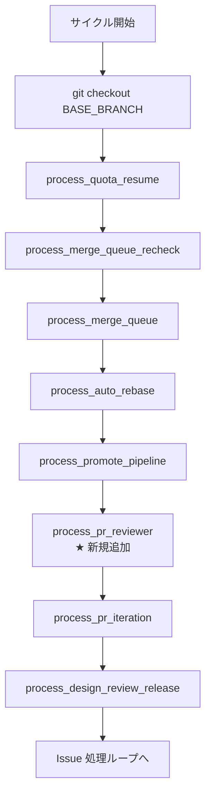

# Design Document

## Overview

**Purpose**: 本機能は外部 AI レビューツール（`codex` / `antigravity`）を用いた PR 自動レビュー工程を、既存パイプラインの「PR 作成・更新 → 人間レビュー」の手前に挿入する。レビュー結果は PR コメントとして残し、修正要求のキーワードを検出した場合に `needs-iteration` ラベルを付与することで、既存 PR Iteration Processor（#26）のループへシームレスに接続する。

**Users**: idd-claude を運用する idd-claude 運用者が対象。事前に `codex` または `antigravity` をローカル PATH 上にインストール・認証済みの状態で、watcher cron / launchd の env に `PR_REVIEWER_ENABLED=true` と `PR_REVIEWER_TOOL=codex|antigravity` を追加することで本機能が起動する。

**Impact**: 既存 watcher の Phase A / PR Iteration / Design Review Release プロセッサに新たに **PR Reviewer Processor** を追加する。本機能は **opt-in（既定 `PR_REVIEWER_ENABLED=false`）** とし、未設定 / `false` / `0` / `True` 等の typo を含むあらゆる状態で本機能導入前と完全に等価な挙動を維持する（NFR 1.1）。`PR_ITERATION_ENABLED` / `MERGE_QUEUE_ENABLED` 等の既存 env var 名・既定値・観測挙動は不変。

### Goals

- 既存 processor チェーンに **opt-in 1 段**だけを追加し、未有効化リポジトリでは挙動を変えない（後方互換性）
- `codex` / `antigravity` どちらか **排他的に 1 種**を選び、両方有効化時はエラーで止める（重複コメント防止）
- 同一コミット SHA に対する重複レビューを **hidden HTML marker (`<!-- idd-claude:pr-reviewer sha=... -->`)** で防止
- 修正要求キーワード検出時に `needs-iteration` ラベルを付与し、既存 PR Iteration Processor 起動条件と接続
- 未インストール／未認証／コマンド失敗を **PR コメント**で運用者に通知（silent fail を作らない）

### Non-Goals

- `codex` / `antigravity` 自体のインストール・認証フローの自動化（運用者が事前準備済み前提）
- PR 作成・更新以外のイベント（schedule trigger / 手動 dispatch）でのレビュー
- 第三の外部レビューサービスへの拡張
- レビュー結果の言語別分類・優先度付け・自動分割等の後処理
- 既存 PR Iteration Processor 本体の動作変更（本機能は `needs-iteration` 付与までを担当）

---

## Architecture

### Existing Architecture Analysis

idd-claude の watcher は、`issue-watcher.sh` 本体（dispatcher）と `local-watcher/bin/modules/*.sh` の per-processor モジュール（`source` で同一プロセスに同期ロード）で構成されている。既存の典型パターンは:

- **env var**: 本体冒頭の Config ブロックで `${VAR:-default}` 形式で既定値解決（`PR_ITERATION_ENABLED="${PR_ITERATION_ENABLED:-true}"` 等）
- **モジュール source**: `REQUIRED_MODULES` 配列に追加 → for ループで `. "$IDD_MODULE_DIR/$_idd_mod"` で読み込み（順序は機能的に任意・bash 遅延束縛）
- **dispatcher call site**: 本体の処理順序を温存する位置に `process_<name> || <ns>_warn "..."` 形式で 1 行配置（fail-continue）
- **logger**: `core_utils.sh` に `<ns>_log` / `<ns>_warn` / `<ns>_error` を集約（時刻 + `[$REPO]` + processor prefix 3 段）
- **opt-in gate**: `process_<name>()` 関数冒頭で `[ "$VAR" != "true" ] && return 0` の早期 return
- **重複防止 marker**: `pr-iteration.sh` が `<!-- idd-claude:pr-iteration round=N last-run=ISO8601 -->` 形式を確立済み（`gh pr view --json body` で検出）
- **flock 境界**: PR Iteration / Auto Rebase / Design Review Release 等の processor はすべて単一 flock 内で直列実行（`exec 200>"$LOCK_FILE"` 後）

本機能はこのパターンを **完全踏襲**し、新規規約・新ライブラリは導入しない。

**尊重すべきドメイン境界**:
- `needs-iteration` ラベル付与後の反復は **PR Iteration Processor (#26)** の責務であり、本 processor は付与までで停止（責務分離）
- `merge-queue` / `auto-rebase` / `design-review-release` は他の processor の責務領域でラベル操作するため触らない
- `core_utils.sh` の既存公開関数（worktree / slot / claude_log_detect_529 等）は変更しない

**維持すべき統合点**:
- `gh pr list` / `gh pr view` / `gh pr comment` / `gh pr edit --add-label` の既存利用パターン
- `LABEL_NEEDS_ITERATION="needs-iteration"` の既存定数（`issue-watcher.sh` で定義済み）
- `BASE_BRANCH` env var 解決の連鎖（既存 `PR_ITERATION_HEAD_PATTERN` 等と同じ default 解決順）

**解消・回避する technical debt**: なし（新規モジュール追加のため既存 debt に手を入れない）。

### Architecture Pattern & Boundary Map

**Architecture Integration**:
- **採用パターン**: 既存 per-processor module pattern（Modular Monolith / Pipes-and-Filters の cron tick 内サイクル）
- **ドメイン／機能境界**: PR Reviewer Processor は「外部レビューツール起動 → コメント投稿 → ラベル付与」までを **単一責務**として担当。`needs-iteration` 後の反復対応は既存 PR Iteration Processor へバトンを渡す
- **既存パターンの維持**: opt-in env gate / source 経由のモジュールロード / logger 3 段 prefix / hidden HTML marker / fail-continue dispatcher / flock 境界
- **新規コンポーネントの根拠**: 新規外部サービス（`codex` / `antigravity`）を呼び出すため、既存 processor のいずれにも組み込めない（責務分離原則）

**実行順序の配置（dispatcher 内）**:



**配置根拠**: `process_pr_iteration` の **直前** に置くことで、本サイクルで Reviewer が付与した `needs-iteration` を同一サイクル中の PR Iteration Processor が拾える（次サイクル待ちを 1 段削減）。`process_promote_pipeline` の **後** に置くことで、Promote 系で base が動いた直後にも整合が取れる。失敗時は `|| pr_warn "..."` で吸収し後続 processor を阻害しない。

### Technology Stack

| Layer | Choice / Version | Role in Feature | Notes |
|-------|------------------|-----------------|-------|
| Frontend / CLI | bash 4+ | watcher 本体 / モジュール実装 | 既存と同じ |
| Backend / Services | GitHub REST/CLI (`gh` 2.x) | PR 列挙 / コメント投稿 / ラベル付与 | 既存と同じ |
| Data / Storage | なし（state は PR コメントの hidden marker のみ） | SHA 単位の重複防止判定 | per-Issue 永続 state を持たない設計 |
| Messaging / Events | cron tick / flock 境界内の直列実行 | 既存 processor チェーンと同じ flock 境界 | 並列化なし |
| Infrastructure / Runtime | watcher host PATH 上に `codex` / `antigravity` 実行ファイル | 運用者が事前準備 | 未インストールは PR コメントで通知 |
| Tooling: jq | 1.6+ | gh JSON / コメント本文の HTML marker 検出 | 既存と同じ |
| Static Analysis | `shellcheck` | NFR 2 警告ゼロ | 既存 `.shellcheckrc` の info 級抑止を踏襲 |

---

## File Structure Plan

### Directory Structure（既存ツリーへの追加）

```
local-watcher/bin/
├── issue-watcher.sh                 # ★ 編集: Config ブロックに env 追記 + REQUIRED_MODULES に追記 + dispatcher call site 1 行追加
└── modules/
    ├── core_utils.sh                # 編集: pr_log / pr_warn / pr_error の 3 関数を追加（pi_log と同形式）
    ├── pr-iteration.sh              # 不変
    ├── pr-reviewer.sh               # ★ 新規: PR Reviewer Processor 本体（後述 Components 節）
    ├── merge-queue.sh               # 不変
    ├── auto-rebase.sh               # 不変
    ├── promote-pipeline.sh          # 不変
    ├── quota-aware.sh               # 不変
    ├── scaffolding-health.sh        # 不変
    ├── stage-a-verify.sh            # 不変
    └── run-summary.sh               # 不変

docs/specs/261-feat-pr-codex-antigravity/
├── requirements.md                  # PM 確定済み（変更なし）
├── design.md                        # ★ 本ファイル
└── tasks.md                         # ★ 同時生成

README.md                            # ★ 編集: 「オプション機能一覧（opt-in）」表に 1 行追加 + 新規「PR Reviewer Processor (#261)」節を追加
```

### Modified Files（詳細）

- `local-watcher/bin/modules/pr-reviewer.sh`（**新規**） — PR Reviewer Processor の関数群を集約。`issue-watcher.sh` から `source` される前提（単体起動しない）。`set -euo pipefail` は本体側で宣言済みのため宣言しない（既存モジュールと同じ）
- `local-watcher/bin/modules/core_utils.sh`（**編集**） — 既存 `pi_log` / `mq_log` 等と同形式で `pr_log` / `pr_warn` / `pr_error` の 3 関数を追加（既存関数群の末尾に追記、他関数は変更しない）
- `local-watcher/bin/issue-watcher.sh`（**編集**） — 以下 3 箇所のみ:
  1. **Config ブロック**（既存 `PR_ITERATION_ENABLED` 近傍の `# ─── PR Iteration Processor 設定 ───` 節の **後**に新規 `# ─── PR Reviewer Processor 設定 (#261) ───` 節を追加）に 9 個の env var を `${VAR:-default}` で解決
  2. **REQUIRED_MODULES 配列**に `"pr-reviewer.sh"` を追加（`"pr-iteration.sh"` の隣を推奨。順序は機能的任意）
  3. **dispatcher call site**: `process_pr_iteration` の **直前** に `process_pr_reviewer || pr_warn "process_pr_reviewer が想定外のエラーで終了しました（後続 Issue 処理は継続）"` を 1 行追加
- `README.md`（**編集**） — 以下 2 箇所:
  1. 「オプション機能一覧」§ の「opt-in（既定 OFF、明示的に有効化が必要）」表に **1 行追加**（`PR_REVIEWER_ENABLED` / 既定 `off` / 必須 `PR_REVIEWER_TOOL` / 詳細セクションへのリンク / 関連 `#261`）
  2. 新規 h2 セクション「PR Reviewer Processor (#261)」を `## PR Iteration Processor (#26)` の **前** または **後** に挿入。env var 一覧（既定値・正規化規則）/ 排他制御 / 重複防止 marker / 利用例 cron 行 / トラブルシュート FAQ を含める
- `repo-template/README.md` — **対象外**（idd-claude では root の README.md のみが README として配布される。`repo-template/README.md` は存在せず編集不要）
- `repo-template/.claude/agents/*.md` / `repo-template/.claude/rules/*.md` — **対象外**（本機能は watcher 側のみで完結し、agent / rule 規約は変更しない）

---

## Requirements Traceability

| Requirement | Summary | Components | Interfaces | Flows |
|-------------|---------|------------|------------|-------|
| 1.1 | `PR_REVIEWER_ENABLED!=true` で全スキップ | `process_pr_reviewer` 早期 return | `pr_log` の skip 行 | 1 |
| 1.2 | `=true` 時に後続を実行 | `process_pr_reviewer` 本体 | dispatcher 呼び出し | 1 |
| 1.3 | 他 processor に副作用なし | dispatcher fail-continue / `|| pr_warn` | 既存 || pi_warn 等と同型 | 1 |
| 2.1 | codex のみ → codex 採用 | `pr_resolve_tool` | env: `PR_REVIEWER_TOOL` | 2 |
| 2.2 | antigravity のみ → antigravity 採用 | `pr_resolve_tool` | 同上 | 2 |
| 2.3 | 両方有効化 → 排他エラー | `pr_resolve_tool` | エラー return code 2 | 2 |
| 2.4 | 排他エラー時 PR にコメント 1 回 | `pr_post_error_comment` + marker `kind=conflict-tool` | hidden marker | 2 |
| 2.5 | どちらも無効 → skip + ログ | `pr_resolve_tool` | log only | 2 |
| 3.1 | 未インストール検出 → PR コメント + 中止 | `pr_check_tool_installed` + `pr_post_error_comment` | hidden marker `kind=not-installed` | 3 |
| 3.2 | 未認証検出 → PR コメント + 中止 | `pr_check_tool_authenticated` + `pr_post_error_comment` | hidden marker `kind=not-authenticated` | 3 |
| 3.3 | 同種エラー marker 既存 → 再投稿しない | `pr_has_error_marker` | jq 検索 | 3 |
| 3.4 | エラーコメント冒頭に `## 自動レビューエラー` | `pr_post_error_comment` 本文 | コメント本文先頭 | 3 |
| 4.1 | head ブランチ checkout | `pr_run_review_for_pr` 内のサブシェル + trap | git checkout | 4 |
| 4.2 | env 実行コマンド呼び出し + stdout 収集 | `pr_execute_review_command` | stdout キャプチャ + `--output-format json` 等の final-message 抽出 | 4 |
| 4.3 | `{BASE}` / `{HEAD}` / `{PR}` / `{PROMPT_FILE}` プレースホルダ置換 | `pr_substitute_placeholders` | string 置換 | 4 |
| 4.4 | レビューテキストを PR に 1 回コメント | `pr_post_review_comment` + marker `kind=review` | hidden marker | 4 |
| 4.5 | 実行失敗 → エラーコメント + 中止 | `pr_execute_review_command` rc != 0 + `pr_post_error_comment` `kind=exec-failed` / `kind=workspace-modified` | hidden marker | 4 |
| 5.1 | 構造化 VERDICT 検出で `needs-iteration` 付与 | `pr_detect_iteration_keyword` + `pr_add_iteration_label` | `gh pr edit --add-label` | 5 |
| 5.2 | 既に付与済み → 冪等 | `gh pr edit --add-label` の冪等性 | 同上 | 5 |
| 5.3 | キーワード無し → ラベル付与しない | early return | log only | 5 |
| 5.4 | マッチ件数をログ記録 | `pr_log "iteration-keyword matched=N pattern=...` | log | 5 |
| 6.1 | コメント本文に `sha=<headRefOid>` marker | `pr_build_marker` | string 構築 | 6 |
| 6.2 | 既存マーカーあり → 当該 PR 全体 skip | `pr_already_processed` | jq 検索 | 6 |
| 6.3 | SHA 更新で新規実行 | marker は SHA 単位 | gh pr view --json headRefOid | 6 |
| 6.4 | hidden HTML コメント形式 | `pr_build_marker` 出力 | `<!-- idd-claude:pr-reviewer sha=... -->` | 6 |
| 7.1 | 評価対象 = open PR | `pr_fetch_candidate_prs` | `gh pr list --state open` | 7 |
| 7.2 | draft はスキップ（決定 5） | `gh pr list --search "-draft:true"` + クライアント側 fail-safe | 同上 | 7 |
| 7.3 | Issue 単体は対象外 | PR list のみ取得 | 同上 | 7 |
| NFR 1.1 | 未有効化時に既存挙動と等価 | `process_pr_reviewer` 早期 return | 全体 | — |
| NFR 1.2 | 既存 env var 名 / 既定値を変更しない | 既存 Config ブロックを編集しない | — | — |
| NFR 2.1 | shellcheck 警告ゼロ | 既存 `.shellcheckrc` 踏襲 | — | — |
| NFR 3.1 | 分岐点のログ記録 | `pr_log` / `pr_warn` の網羅 | log | — |
| NFR 4.1 | 同一 PR 同一 SHA は副作用 1 回のみ | hidden marker による idempotency | 6 と同じ | 6 |

**Flow 番号凡例**:
1. opt-in gate
2. tool 排他制御
3. 健全性チェック（インストール / 認証）
4. レビュー実行 → コメント投稿
5. キーワード検出 → ラベル付与
6. 重複防止判定
7. 候補 PR 取得

---

## Components and Interfaces

### Module: `pr-reviewer.sh`

#### Component: PR Reviewer Processor（モジュール全体）

| Field | Detail |
|-------|--------|
| Intent | `PR_REVIEWER_ENABLED=true` 時に open PR 集合に対し外部 AI レビューツールを実行しコメント + ラベル付与を行う |
| Requirements | 1.1, 1.2, 1.3, 2.1〜2.5, 3.1〜3.4, 4.1〜4.5, 5.1〜5.4, 6.1〜6.4, 7.1〜7.3, NFR 1.1〜4.1 |

**Responsibilities & Constraints**
- 主責務: 外部レビューツールの起動・結果コメント投稿・条件付きラベル付与
- ドメイン境界: `needs-iteration` 付与後の反復は **PR Iteration Processor の責務**であり本処理は不介入
- データ所有権: hidden HTML marker `<!-- idd-claude:pr-reviewer sha=<oid> kind=<review|conflict-tool|not-installed|not-authenticated|exec-failed> -->` のみが本 processor の永続 state
- invariants: 同一 PR + 同一 `headRefOid` + 同一 `kind` に対して副作用（コメント / ラベル）は **1 回のみ**

**Dependencies**
- Inbound: `issue-watcher.sh` dispatcher（`process_pr_reviewer` 呼び出し）— Criticality: high
- Outbound: `gh` CLI（PR 列挙 / コメント / ラベル / body 取得）— Criticality: high
- Outbound: `git` CLI（fetch / checkout）— Criticality: high
- Outbound: `jq`（JSON 整形 / コメント本文走査）— Criticality: high
- External: `codex` または `antigravity`（PATH 上の実行ファイル）— Criticality: medium（未インストール時は PR コメント投稿のみで処理中止）
- Internal: `core_utils.sh` の `pr_log` / `pr_warn` / `pr_error`（同 PR で新規追加）

**Contracts**: Service [x] / API [ ] / Event [ ] / Batch [x] / State [x]

##### Service Interface（公開関数）

```bash
# エントリ関数: dispatcher から呼ばれる
# 入力: なし（env var 群を読む）
# 出力: なし（log のみ）
# 戻り値: 0 固定（後続 processor を阻害しないため）
# AC 1.1, 1.2, 1.3, 2.5, 7.1, 7.3
process_pr_reviewer() {
  # ① opt-in gate（早期 return）
  # ② tool 解決 + 排他検証
  # ③ ツール健全性チェック（installed / authenticated）
  # ④ 候補 PR 列挙
  # ⑤ 各 PR ごとに pr_run_review_for_pr を実行
  # ⑥ サマリログ出力
}

# tool 解決 + 排他検証（純粋関数寄り）
# 出力: stdout に "codex" / "antigravity" / "none" / "conflict" のいずれか
# 戻り値: 0 = ok, 1 = conflict, 2 = none
# AC 2.1, 2.2, 2.3, 2.5
pr_resolve_tool()

# 指定ツールが PATH 上にあるか確認
# 入力: $1 = "codex" | "antigravity"
# 戻り値: 0 = ok, 1 = not-installed
# AC 3.1
pr_check_tool_installed()

# 指定ツールが認証済みか確認（auth status コマンドを env で override 可能）
# 入力: $1 = tool 名
# 戻り値: 0 = ok, 1 = not-authenticated, 2 = check 機構が無効（既定で skip）
# AC 3.2
pr_check_tool_authenticated()

# 候補 PR を JSON 配列で返す（open + 非 draft + head pattern 一致 + 非 fork）
# 出力: stdout に jq 配列 JSON 1 行
# AC 7.1, 7.2, 7.3
pr_fetch_candidate_prs()

# 1 PR 分のレビューを実行
# 入力: $1 = pr_json (gh pr list の単一要素)
#       $2 = tool ("codex"|"antigravity")
# 戻り値: 0 = success / 1 = failure / 2 = skip (重複検出) / 3 = exec-error
# AC 4.1, 4.2, 4.3, 4.4, 4.5, 5.1〜5.4, 6.1〜6.4
pr_run_review_for_pr()

# 重複防止 marker の既存判定
# 入力: $1 = pr_number, $2 = sha, $3 = kind
# 戻り値: 0 = 既存 (skip)、1 = 未存在 (continue)
# AC 3.3, 6.2
pr_already_processed()

# hidden HTML marker 構築
# 入力: $1 = sha, $2 = kind
# 出力: stdout に marker 文字列
# AC 6.1, 6.4
pr_build_marker()

# レビュー実行コマンドのプレースホルダ置換
# 入力: $1 = cmd_template, $2 = base_ref, $3 = head_ref, $4 = pr_number, $5 = prompt_file_path
# 出力: stdout に置換済みコマンド文字列
# 置換対象: {BASE} / {HEAD} / {PR} / {PROMPT_FILE}
# AC 4.3
pr_substitute_placeholders()

# レビュー prompt を解決し一時ファイルに書き出す
# 入力: $1 = pr_number, $2 = base_ref, $3 = head_ref
# 出力: stdout に一時ファイルパス（呼び出し元が trap で削除）
# 解決順序: PR_REVIEWER_<TOOL>_PROMPT が非空 → それ。次に PR_REVIEWER_PROMPT。最後に内蔵 default
# 解決済み prompt 中の {BASE} / {HEAD} / {PR} は文字列置換する
# 一時ファイル経由で argv に渡すことで、prompt 本文を bash -c の cmd 文字列に
# 注入しない（Security Considerations 参照）
pr_build_prompt_file()

# レビュー実行
# 入力: $1 = command_string, $2 = tool
# 出力: stdout に標準出力（review 結果テキスト）
# 戻り値: command の終了コードをそのまま返す
# 実装: eval ではなく `bash -c "$command_string"` で subshell に閉じ込める
# tool 別の最終メッセージ抽出: antigravity (agy) の場合は `--output-format json`
#   の出力から最終 message を jq で抽出。codex は素の stdout（必要なら -o
#   <file> 経由を運用者が env で選択）
# 実行後に `git status --porcelain` を確認し、ワークツリー変更を検出した場合は
# `git checkout -- .` で破棄して exec-failed (kind=workspace-modified) として扱う
# （read-only 安全性 invariant）
# AC 4.2, 4.5
pr_execute_review_command()

# レビュー結果コメント投稿
# 入力: $1 = pr_number, $2 = sha, $3 = review_text
# 戻り値: 0 = ok, 1 = 投稿失敗
# AC 4.4, 6.1, 6.4
pr_post_review_comment()

# エラーコメント投稿
# 入力: $1 = pr_number, $2 = sha, $3 = kind, $4 = detail message
# 戻り値: 0 = ok, 1 = 投稿失敗
# AC 2.4, 3.1, 3.2, 3.3, 3.4, 4.5, 6.1, 6.4
pr_post_error_comment()

# VERDICT 検出 → needs-iteration 付与
# 入力: $1 = pr_number, $2 = review_text
# 出力: stdout にマッチ件数（0 のとき "0"）
# 戻り値: 0 固定
# 既定パターンは PROMPT で要求する最終行 token `VERDICT: needs-iteration`
# を line-anchored で検出（env で override 可、後方互換で自由文 grep にも切替可能）
# AC 5.1, 5.2, 5.3, 5.4
pr_detect_iteration_keyword()
```

- **Preconditions**: 本モジュールは `issue-watcher.sh` 本体から `source` 済みで、`REPO` / `REPO_DIR` / `BASE_BRANCH` / `LABEL_NEEDS_ITERATION` / `PR_REVIEWER_*` env が解決済みであること
- **Postconditions**: `process_pr_reviewer` は **常に 0 を返す**（dispatcher fail-continue 慣行）。副作用は `gh pr comment` / `gh pr edit --add-label` のみで、PR の body 編集や branch 操作は副作用として残さない（head branch checkout はサブシェル内で行い `trap` で `BASE_BRANCH` に戻す。prompt tempfile も同 `trap` で削除）
- **Invariants**:
  - 同一 `(pr_number, sha, kind)` に対し marker が既存なら副作用ゼロ（NFR 4.1）
  - レビュー実行はワークツリーを書き換えない（read-only invariant、Decision 8）。`git status --porcelain` 検査で変更を検出した場合は `git checkout -- .` で破棄しつつ `kind=workspace-modified` で報告

##### State / Marker Contract（hidden HTML comment 形式）

```
<!-- idd-claude:pr-reviewer sha=<headRefOid> kind=<review|conflict-tool|not-installed|not-authenticated|exec-failed|workspace-modified> tool=<codex|antigravity|none> -->
```

- `sha=` は **PR head の commit SHA**（`gh pr view --json headRefOid` で取得）。SHA が変われば marker も別物として扱う（AC 6.3）
- `kind=` は state 種別:
  - `review` — 正常なレビュー結果コメント
  - `conflict-tool` — `codex` / `antigravity` 両方有効化エラー
  - `not-installed` — 実行ファイル不在
  - `not-authenticated` — 認証エラー
  - `exec-failed` — 実行コマンド非ゼロ終了
  - `workspace-modified` — 実行コマンドがワークツリーを書き換えた（read-only 安全性 invariant 違反、Decision 8 参照）
- `tool=` は使用したツール（`conflict-tool` の場合は `none`）
- 検出は `gh api /repos/.../issues/<pr>/comments` で jq 走査（`pr-iteration.sh` が既に同パターンで marker 検出を実装済み）

**設計判断: marker の粒度**: `kind=` を分離することで「`review` 済みだが SHA 更新で再レビュー対象」「`not-installed` が解消されて再評価対象」を独立判定可能。同一 `(sha, kind)` ペアの重複だけが skip 対象（Open Question 6 への回答）。

##### API Contract（外部呼び出し）

| Operation | External Command | Used For | Errors |
|-----------|------------------|----------|--------|
| PR 列挙 | `gh pr list --repo $REPO --state open --search "-draft:true" --json number,headRefName,headRefOid,baseRefName,isDraft,url,headRepositoryOwner` | 候補取得 | timeout / network → log + skip cycle |
| コメント既存判定 | `gh api /repos/$REPO/issues/<n>/comments` | hidden marker 走査 | 同上 |
| body / SHA 取得 | `gh pr view <n> --repo $REPO --json headRefOid,number` | SHA 確定 | 同上 |
| ラベル付与 | `gh pr edit <n> --repo $REPO --add-label "$LABEL_NEEDS_ITERATION"` | AC 5.1 | 既付与で冪等成功 |
| コメント投稿 | `gh pr comment <n> --repo $REPO --body "<body>"` | AC 4.4 / 2.4 / 3.x | timeout → WARN + continue |
| ツール check | `command -v $tool` / 認証は env で指定（codex 既定 `codex login status`、agy 既定 skip） | AC 3.1 / 3.2 | exit code を直接利用 |
| レビュー実行 | `bash -c "$resolved_cmd"`（**`eval` は使わない**、Decision 9）。`{PROMPT_FILE}` 経由で prompt 本文を tempfile 渡し（cmd 文字列に prompt を注入しない） | AC 4.2 | 非ゼロ → エラーコメント。実行後 `git status --porcelain` 検査で workspace 変更検出時は `kind=workspace-modified` |
| head 取得 | `git fetch origin <head_ref>` + `git checkout -B <head_ref> origin/<head_ref>` | AC 4.1 | サブシェル + trap で BASE_BRANCH 復帰、prompt tempfile も trap で削除 |

---

## Data Models

### Domain Model

- **Aggregate root**: `PR Review Cycle`（1 サイクル = 1 watcher tick × 1 PR ×（codex|antigravity））
- **Entity**: `Pull Request`（既存 GitHub PR、外部システムが state を所有）
- **Value Object**: `Review Marker`（`(sha, kind, tool)` の不変 triple）
- **Domain Event**: `Iteration Required Detected`（キーワード一致 → `needs-iteration` 付与）

### Environment Variable Catalog（運用者向け契約）

| env var | 既定値 | 用途 | 正規化規則 |
|---------|--------|------|------------|
| `PR_REVIEWER_ENABLED` | `false` | 本機能の opt-in gate（Req 1.1, 1.2） | `=true` 厳密一致のみ有効。それ以外（未設定 / 空 / `True` / `1` / typo）はすべて OFF |
| `PR_REVIEWER_TOOL` | `""`（未設定） | 使用するツール選択。`codex` / `antigravity` のいずれか | 排他制御は単一値ベース。`PR_REVIEWER_CODEX_ENABLED` / `PR_REVIEWER_ANTIGRAVITY_ENABLED` も併存サポート（後述 Decisions 参照） |
| `PR_REVIEWER_CODEX_ENABLED` | `false` | 代替指定（後方互換 / Issue 本文の併記表記）。`true` で codex 有効 | `=true` 厳密一致のみ |
| `PR_REVIEWER_ANTIGRAVITY_ENABLED` | `false` | 代替指定 | `=true` 厳密一致のみ |
| `PR_REVIEWER_CODEX_CMD` | `codex exec --sandbox read-only "$(cat '{PROMPT_FILE}')"` | codex 実行コマンドテンプレート（`codex` には `review` サブコマンドが**存在しない**ため `codex exec` を使用、Decision 2 参照） | 文字列。プレースホルダ `{BASE}` / `{HEAD}` / `{PR}` / `{PROMPT_FILE}` 置換可。`--sandbox read-only` を既定で焼き込みワークツリー書換を防止 |
| `PR_REVIEWER_ANTIGRAVITY_CMD` | `agy -p "$(cat '{PROMPT_FILE}')" --output-format json` | antigravity 実行コマンドテンプレート（実バイナリは `agy`、`-p`=`--print` で非対話。`--output-format json` で最終 message を抽出） | 同上。本文中の `agy` 出力 JSON から最終 message を `jq -r '.message'` 等で抽出（実装で確定） |
| `PR_REVIEWER_PROMPT` | 内蔵 default（後述「Default Review Prompt」節）。空文字なら内蔵 default を使用 | レビュー指示プロンプト本体。tool 共通 | 文字列。`{BASE}` / `{HEAD}` / `{PR}` を置換。`PR_REVIEWER_<TOOL>_PROMPT` で tool 別 override も可 |
| `PR_REVIEWER_CODEX_AUTH_CMD` | `codex login status` | codex 認証チェックコマンド（空文字なら check skip。`codex auth status` は**存在しない**ため正しくは `codex login status`） | 文字列。終了コード 0 で認証 OK 判定 |
| `PR_REVIEWER_ANTIGRAVITY_AUTH_CMD` | `""`（既定 skip） | agy には auth status 相当のコマンドが**存在しない**ため既定 skip。運用者が必要なら設定可 | 同上 |
| `PR_REVIEWER_ITERATION_PATTERN` | `^[[:space:]]*VERDICT:[[:space:]]*needs-iteration[[:space:]]*$` | 構造化 VERDICT token を line-anchored で検出する ERE（`grep -E`） | 既定は内蔵 prompt が最終行に `VERDICT: needs-iteration` / `VERDICT: approve` を出力する規約と対になっている。自由文 grep を希望する場合は env で override 可（後方互換） |
| `PR_REVIEWER_HEAD_PATTERN` | `^claude/` | 対象 head ブランチ pattern（既存 `MERGE_QUEUE_HEAD_PATTERN` の慣習に合わせる） | grep -E 互換 |
| `PR_REVIEWER_MAX_PRS` | `5` | 1 サイクルあたりの上限 | 整数 |
| `PR_REVIEWER_GIT_TIMEOUT` | `120` | git / gh 個別 timeout（秒）。レビュー実行自体は別 timeout | 整数（秒） |
| `PR_REVIEWER_EXEC_TIMEOUT` | `600` | レビュー実行コマンドの最大経過秒数 | 整数（秒） |

> **Migration Note**: 本機能は **完全な opt-in**（Req 1.1 / NFR 1.1）。`PR_REVIEWER_ENABLED` 未設定の運用環境では env var 一覧を読みもせず（`${...:-default}` 解決のみ。`process_pr_reviewer` で早期 return）、挙動は本機能導入前と等価。

### Default Review Prompt（`PR_REVIEWER_PROMPT` の内蔵 default）

`codex` / `agy` はいずれも「review 専用コマンド」ではなく**プロンプト駆動の汎用エージェント**であり、レビュー品質は渡すプロンプトで決まる。idd-claude 既存 Reviewer の判定軸（AC 未カバー / missing test / boundary 逸脱）と整合させ、最終行に **構造化 VERDICT token** を出力させることで、Req 5 のキーワード検出を脆い自由文 grep ではなく決定論的な token 検出に置換する（Decision 4 参照）。

`{BASE}` / `{HEAD}` / `{PR}` は `pr_build_prompt_file` 内で文字列置換する:

```text
あなたは熟練のソフトウェアレビュアーです。base ブランチ {BASE} と head ブランチ {HEAD}
の差分（git diff {BASE}...{HEAD}）を対象に PR #{PR} をレビューしてください。

# レビュー観点（優先度順）
1. 正確性のバグ: ロジック誤り・境界条件・null/空入力・競合・例外未処理
2. 受入基準の未カバー: docs/specs/ に requirements.md があれば AC と差分を突き合わせる
3. テスト不足: 変更された分岐に対応するテストの欠落
4. セキュリティ退行: 入力検証・認証・機密情報露出・コマンドインジェクション
5. 後方互換性の破壊: 既存 env var / 出力契約の変更

# 制約
- ファイルを編集しないこと。所見の報告のみ（read-only）。
- 差分に実在する file:line を根拠として必ず引用する。推測で書かない。
- スタイル / lint レベルの指摘は対象外。

# 出力（日本語・Markdown、この構造を厳守）
## 概要
<2〜3 文の総評>
## 指摘事項
- [high|medium|low] <file>:<line> — <内容と根拠>
（指摘が無ければ「指摘なし」）
## 結論
（本文の最終行に、次のいずれか 1 行だけを単独で出力すること）
VERDICT: needs-iteration
VERDICT: approve
```

**根拠**:
- 「読み取り専用」を `--sandbox read-only`（codex）とプロンプト制約（agy）の二重で要求し、加えて実行後 `git status --porcelain` で実害有無を invariant として検査（Decision 8）
- 最終行に `VERDICT:` token を出力させることで、`PR_REVIEWER_ITERATION_PATTERN` を `^[[:space:]]*VERDICT:[[:space:]]*needs-iteration[[:space:]]*$` という line-anchored の決定論パターンに固定でき、自由文中に `needs-iteration` 文字列が偶発的に出現したケースの誤発火を防ぐ
- idd-claude 既存 Reviewer の判定 3 カテゴリ（AC 未カバー / missing test / boundary 逸脱）と観点を揃え、人間レビュワーが既存 review-notes.md と同水準で読める出力を強制

### Logical Data Model（hidden marker）

```
<!-- idd-claude:pr-reviewer sha=abc123def kind=review tool=codex -->
```

GitHub の issue/PR コメント本文に埋め込まれ、HTML レンダリング時に非表示。`jq -e '.body | test("idd-claude:pr-reviewer sha=" + $sha + "[^>]*kind=" + $kind)')` で検索可能。

---

## Error Handling

### Error Strategy

3 層構造で扱う:

1. **opt-in skip**: `PR_REVIEWER_ENABLED!=true` → 早期 return（エラーではなく無効化）
2. **PR comment + label none**: ツール未インストール / 未認証 / 排他エラー / 実行コマンド失敗 → 該当 PR にエラーコメント（hidden marker 付き）を 1 回投稿し、当該 PR の Reviewer 処理を中止。後続 PR は継続（fail-continue per-PR）
3. **WARN + cycle continue**: `gh` API timeout / network 失敗 → `pr_warn` ログ出力 + 当該 PR を skip。後続 PR は継続。サイクル全体は成功扱い（`process_pr_reviewer` は 0 を返す）

### Error Categories and Responses

- **User Errors**:
  - 両ツール同時有効化（AC 2.3, 2.4） → 各 PR にエラーコメント `kind=conflict-tool`、`pr_error` ログ、当該サイクルでレビュー実行をスキップ（運用者の env 修正待ち）
  - どちらも無効（AC 2.5） → `pr_log` で skip 理由を残し、当該サイクル全体を skip（PR コメント不要 = 静かに無効化と等価）
- **System Errors**:
  - 未インストール（AC 3.1） → 該当 PR にエラーコメント `kind=not-installed`（重複防止 marker で 2 回目以降は静音、AC 3.3）。当該 PR の Reviewer 処理中止、後続 PR は継続
  - 未認証（AC 3.2） → `kind=not-authenticated` でコメント。同上
  - 実行コマンド非ゼロ（AC 4.5） → `kind=exec-failed` でコメント + stderr 抜粋を含める
  - `gh` API timeout / network → `pr_warn` のみ。コメント投稿不可 / SHA 取得不可 等の致命系では当該 PR を skip
- **Business Logic Errors**:
  - 同一 (SHA, kind) marker 既存（AC 6.2, 3.3, NFR 4.1） → 当該 (PR, SHA, kind) の処理を即 skip（既存挙動を変えない）

### エラー伝播の境界（dispatcher との契約）

- `process_pr_reviewer` は **常に 0 を返す**（既存 `process_pr_iteration` / `process_design_review_release` と同じ契約）
- 想定外 trap や `set -euo pipefail` 配下の伝播失敗は dispatcher 側で `|| pr_warn "..."` で吸収（Req 1.3 / NFR 1.1）

---

## Testing Strategy

### Unit Tests（純粋関数寄り、bash テストフレームワークは未導入のため fixture + 手動スモークで代替）

- `pr_resolve_tool` の 4 ケース: codex のみ / antigravity のみ / 両方 / どちらも無し
- `pr_build_marker` の出力文字列フォーマット検証（sha / kind / tool 全組合せ）
- `pr_substitute_placeholders` の `{BASE}` / `{HEAD}` / `{PR}` 置換結果検証
- `pr_already_processed` の marker 検出 jq クエリが SHA / kind 異なる場合に false を返すこと
- `pr_detect_iteration_keyword` の ERE が default pattern で `needs-iteration` 等を拾うこと

### Integration Tests（shellcheck + 手動スモーク）

- `shellcheck local-watcher/bin/modules/pr-reviewer.sh local-watcher/bin/modules/core_utils.sh local-watcher/bin/issue-watcher.sh` 警告ゼロ（NFR 2.1）
- `PR_REVIEWER_ENABLED=false` の dry-run で `process_pr_reviewer` が早期 return することを log で確認
- `PR_REVIEWER_ENABLED=true` + ツール未インストール状態で `kind=not-installed` コメントが 1 回投稿されること（重複防止確認）
- 2 サイクル連続実行で同一 SHA の重複コメント無し（NFR 4.1）
- README の env 表が実装と一致（`grep PR_REVIEWER_ README.md` と Config ブロックの cross check）

### E2E/UI Tests（dogfooding）

- 本 PR 自身を idd-claude self-hosting で auto-dev に流し、テスト用 dummy PR に対して watcher が次サイクルでレビューを実行・コメント投稿・ラベル付与まで通ることを観測
- `codex` / `antigravity` どちらか 1 つを実機にインストールした状態でレビュー成功フローを観測
- `PR_REVIEWER_TOOL=codex` + `PR_REVIEWER_ANTIGRAVITY_ENABLED=true` の **排他エラー条件**で `kind=conflict-tool` コメントを 1 回観測

### Performance / Load

- `PR_REVIEWER_MAX_PRS=5` × `PR_REVIEWER_EXEC_TIMEOUT=600` で 1 サイクルあたり最大 50 分の wall-clock を消費しうる。既存 `flock -n` の cron 2 分間隔と排他されるため、長時間サイクル中は他 tick が skip される（既存 `pr-iteration.sh` と同じ運用 trade-off）。本 NFR は要件に存在せず、運用者が `PR_REVIEWER_MAX_PRS` / `PR_REVIEWER_EXEC_TIMEOUT` で調整する設計とし、本書では数値目標を設定しない

---

## Security Considerations

- **`eval` は使わない**（Decision 9）。レビュー実行は `bash -c "$resolved_cmd"` で subshell に閉じ込め、prompt 本文（LLM 自由文 / 改行・記号を含みうる）は cmd 文字列に展開せず `{PROMPT_FILE}` 経由で argv に渡す。env var（cmd template）は cron / launchd / 運用者の shell rc 経由のみで設定される運用者入力であり信頼境界内とみなす
- `{BASE}` / `{HEAD}` / `{PR}` 置換の値側は GitHub branch 命名規約（`^[A-Za-z0-9._/-]+$` 相当）と整数 PR 番号に制限され shell metacharacter 注入は事実上発生しないが、防御的設計として `pr_substitute_placeholders` は置換結果に `;` `|` `&` `` ` `` `$(` などのメタ文字が混入していないかを scan し、混入を検出した場合は当該 PR を skip + WARN（GitHub 側仕様変更へのガード）
- **read-only invariant**（Decision 8）: `codex exec` は既定で `--sandbox read-only`、`agy` は PROMPT 制約 + 実行後 `git status --porcelain` で workspace 書換を抑止 / 検出。違反検出時は `git checkout -- .` で破棄し `kind=workspace-modified` で報告
- 機密情報のログ流出防止: `pr_execute_review_command` の stderr を `pr_post_error_comment` に含める際は 1KB に truncate し、`PR_REVIEWER_*_AUTH_CMD` の出力（auth token / API key を含む可能性）はコメントに**含めない**
- prompt tempfile は `mktemp -t idd-claude-pr-reviewer.XXXXXX` で生成し、呼び出し元 `trap '...' EXIT` で必ず削除する（プロセスクラッシュ時もシェル EXIT trap で回収）

## Migration Strategy

本機能は新規 opt-in 機能のためマイグレーションは **不要**（NFR 1.1）。未有効化リポジトリは導入前と完全に等価。既存 env var の変更・既存ラベル削除・既存 cron 文字列の互換性破壊はいずれも発生しない。

---

## Design Decisions（Open Questions への回答）

### Decision 1: tool 選択 env の体系（Open Question 1 への回答）

**採用**: `PR_REVIEWER_TOOL=codex|antigravity` を **canonical** とし、`PR_REVIEWER_CODEX_ENABLED` / `PR_REVIEWER_ANTIGRAVITY_ENABLED` を **alias** として併存サポートする。

**解決順序**:
1. `PR_REVIEWER_TOOL` が `codex` または `antigravity` に厳密一致 → 当該値を採用
2. 1 が `""`（未設定）の場合、`PR_REVIEWER_CODEX_ENABLED=true` / `PR_REVIEWER_ANTIGRAVITY_ENABLED=true` をそれぞれ独立評価
3. 評価結果が「片方のみ true」→ そちらを採用
4. 「両方 true」→ 排他エラー（AC 2.3）
5. 「両方 false」→ skip（AC 2.5）
6. `PR_REVIEWER_TOOL` が canonical 2 値以外 → WARN + ステップ 2 にフォールバック

**根拠**:
- 単一変数のほうが排他性が型として明示され、`PROMOTE_MODE` / `AUTO_REBASE_MODE` 等の既存先例と整合（運用者の学習コスト最小化）
- Issue 本文の AC 候補 2 で両表記が併記されていた事情を尊重し、alias を残すことで両 env を **同時** に設定した既存設定でも fail-safe に動作させる（運用ミス時 typo を排他エラーとして可視化）
- 代替案: 2 変数のみで TOOL を持たない案。却下理由 — 排他制御コードが「両方 true → エラー」のみで型的に弱く、運用者が「片方 true ＋他方 typo `enabled`」と書いたケースを silent fail させる
- 代替案: `TOOL` のみで alias を消す案。却下理由 — Issue 仮案との後方互換性を断つ

### Decision 2: 実行コマンド env var 名と既定値（Open Question 2 への回答）

**採用**: `PR_REVIEWER_<TOOL>_CMD` 形式（env var 名は Issue 仮案踏襲）。既定値は **公式ドキュメントベースで実在するサブコマンド / バイナリ名**に修正:
- `PR_REVIEWER_CODEX_CMD="codex exec --sandbox read-only \"\$(cat '{PROMPT_FILE}')\""`
- `PR_REVIEWER_ANTIGRAVITY_CMD="agy -p \"\$(cat '{PROMPT_FILE}')\" --output-format json"`

**重要な事実訂正**（PR #266 レビュー指摘により）:
- **codex CLI には `review` サブコマンドは存在しない**。`/review` は対話 TUI 内のスラッシュコマンド限定で `codex exec` からは起動できない。非対話実行は `codex exec "<プロンプト>"` が canonical（`--sandbox` / `--json` / `-o <file>` を備える）
- **antigravity の実バイナリ名は `agy`**（インストーラが `~/.local/bin/agy` に配置）。`review` サブコマンドは存在せず、非対話実行は `agy -p "<プロンプト>" --output-format json`（`-p` = `--print`）
- 旧既定値（`<tool> review --base {BASE}`）は実在しないコマンドであり、そのまま実装すると全 PR が `exec-failed` で停止する

**プレースホルダ**: `{BASE}` / `{HEAD}` / `{PR}` / `{PROMPT_FILE}` の 4 種をサポート。
- `{BASE}` / `{HEAD}` / `{PR}` は cmd 文字列中に直接展開する（GitHub branch 命名規約と整数で限定されており shell metacharacter 注入が事実上発生しない値）
- `{PROMPT_FILE}` は `pr_build_prompt_file` が書き出した一時ファイルのパスに展開。**prompt 本文そのものは cmd 文字列に展開しない**（Decision 9 / Security Considerations 参照）

**ツール選択値の表記**: `PR_REVIEWER_TOOL` の値は引き続き `codex` / `antigravity` を canonical とする（人間が読みやすい friendly name を維持し、実バイナリ名 `agy` は cmd template 側に閉じ込める）。

**根拠**:
- 旧既定値は致命的に誤っており、PR レビューで実機ドキュメントベースの訂正が入った（脚注: codex の実在サブコマンド = `codex` / `codex exec` / `codex resume` / `codex cloud` / `codex features` / `codex mcp` / `codex completion` / `codex app-server`、`review` は無い）
- `codex exec` には `--sandbox read-only` を既定で焼き込み、エージェントが作業ツリーを書き換える事故を防止（Decision 8 と対）
- `agy` には `--output-format json` を既定指定し、素の stdout に思考過程・進捗が混ざる問題を回避（実装で `jq` による最終 message 抽出を行う）
- 実機での `codex --help` / `codex exec --help` / `agy --help` 取得による flag 細部確定は Developer 段階で実施し、必要な差異は impl-notes.md に記録

### Decision 3: 認証状況確認コマンドの仕様（Open Question 3 への回答）

**採用**: env で override 可能なコマンド文字列 `PR_REVIEWER_<TOOL>_AUTH_CMD` を導入。既定値（実機ドキュメントに整合）:
- `PR_REVIEWER_CODEX_AUTH_CMD="codex login status"`（`codex auth status` は **存在しない**）
- `PR_REVIEWER_ANTIGRAVITY_AUTH_CMD=""`（agy には auth status 相当が **存在しない** ため既定 skip。認証は初回 OAuth または `ANTIGRAVITY_API_KEY` env による）

**仕様**:
- 空文字列なら認証チェックを **skip**（戻り値 2 = check 機構が無効）
- 非空なら当該コマンドを実行し、終了コード 0 で認証 OK 判定。stdout/stderr は破棄
- 結果出力（OAuth token などを含み得る）は PR コメントに残さない

**根拠**:
- 旧既定値（`<tool> auth status`）は両ツールとも実在せず、未認証検出としては必ず非ゼロ終了して `not-authenticated` を誤って発火させる
- codex は `codex login status` がログイン時に exit 0 を返す canonical な機構
- agy は status 相当を提供せず、運用者が `ANTIGRAVITY_API_KEY` env / 初回 OAuth で認証する設計のため、idd-claude 側で「実行時の `agy -p` 自体が認証エラーで非ゼロ終了する → `exec-failed` として PR にコメント」に倒すのが運用上素直（auth check を強要しない）

### Decision 4: `PR_REVIEWER_ITERATION_PATTERN` の既定値（Open Question 4 への回答）

**採用**: `^[[:space:]]*VERDICT:[[:space:]]*needs-iteration[[:space:]]*$` を grep -E 互換の ERE として既定（line-anchored）。`-i` で大文字小文字非区別を併用する。

**仕組み**:
- `PR_REVIEWER_PROMPT` の内蔵 default が最終行に `VERDICT: needs-iteration` または `VERDICT: approve` を **必ず 1 行だけ単独で**出力するよう指示する
- 検出は `grep -E -i "^[[:space:]]*VERDICT:[[:space:]]*needs-iteration[[:space:]]*$"` で line-anchored マッチ。match 数 > 0 → ラベル付与

**根拠**:
- 旧既定値 `(?i)(needs[- ]iteration|要修正|fix\s+required|...)` は自由文を grep する設計であり、エージェントが自由記述で `"needs-iteration" 検出を避けるため` のような文章を書いた瞬間に偶発発火する。逆に語彙ズレ（"requires changes" 等）で本当の指摘を取りこぼす
- プロンプト側に「最終行に構造化 token を出せ」と強制すれば、検出側は単一 token を line-anchored で見るだけで済み、誤判定面が劇的に縮小する
- 自由文 grep を必要とする運用者は `PR_REVIEWER_ITERATION_PATTERN` を env で override すれば旧挙動に切り替え可能（後方互換）
- `pr-iteration.sh` 既存実装は `needs-iteration` **ラベル**を起動条件とするため、本ラベル付与契約は無変更

### Decision 5: draft PR の扱い（Open Question 5 への回答）

**採用**: draft PR は **スキップ**（既存 PR Iteration Processor の方針に合わせる）。

**根拠**:
- 既存 `pi_fetch_candidate_prs` が `-draft:true` で draft を server-side excludes している。本 Processor を同じ規約に合わせることで、（同一サイクルで Reviewer → PR Iteration が連鎖した場合）draft PR が一方では拾われ他方では拾われない、という矛盾が生じない
- 実装は `gh pr list --search "-draft:true"` + クライアント側 fail-safe filter `select(.isDraft == false)`（既存 `pi_fetch_candidate_prs` と同じパターン）

### Decision 6: エラーコメント種別の粒度（Open Question 6 への回答）

**採用**: hidden marker の `kind=` 属性で **5 種に分離**:
- `review` / `conflict-tool` / `not-installed` / `not-authenticated` / `exec-failed`

**根拠**:
- 同一 SHA で「未インストールエラー → 運用者が修正 → exec-failed が出た」場合、両エラーコメントが独立に残ることで時系列が追跡可能
- 重複防止は `(sha, kind)` 単位なので、SHA 不変中はそれぞれ 1 回ずつコメントが残るのみ（PR 可読性を維持）
- 代替案: 1 種 `error` で統合。却下理由 — どのエラーで止まっているかが marker 名から読めず、PR コメント本文に毎回書く必要が出る（リクエスト「1 回投稿」の意図と矛盾する境界ケースが発生）

### Decision 7: per-cycle 上限（Open Question 7 への回答）

**採用**: `PR_REVIEWER_MAX_PRS=5` を既定。既存 `MERGE_QUEUE_MAX_PRS=5` / `PR_ITERATION_MAX_PRS=3` の慣習に追従。

**根拠**:
- 既存 processor と同水準の保守的な値で運用負荷を予測可能にする
- 外部 AI 呼び出しは PR Iteration（Claude）より wall-clock が短い想定だが、`codex` / `antigravity` の実機 throughput は未確定のため初期値は控えめ（運用者が `PR_REVIEWER_MAX_PRS` で増減）

### Decision 8: read-only 安全性 invariant（PR #266 レビュー指摘より追加）

**採用**: `codex` / `agy` はいずれも**ファイルを編集しうる汎用エージェント**であり、head checkout 後にエージェントが作業ツリーを汚す副作用が起こりうる。これを 2 段防御で抑止する:

1. **コマンド側で read-only を強制**: `PR_REVIEWER_CODEX_CMD` の既定に `--sandbox read-only` を焼き込む（codex はサンドボックスを CLI flag でサポート）。`agy` には等価 flag が無いため `PR_REVIEWER_PROMPT` の制約節（「ファイルを編集しないこと」）で要求
2. **実行後の invariant 検査**: `pr_execute_review_command` 実行直後に `git status --porcelain` を確認し、変更を検出した場合は `git checkout -- .` で破棄しつつ `kind=workspace-modified` のエラーコメントを PR に投稿。本検査は read-only flag を持たない `agy` 側の漏れと、運用者が cmd を override して read-only を外したケースの両方に効く

**根拠**:
- 旧設計 invariant は「branch 操作は副作用として残さない」のみ言及していたが、エージェントが head checkout 中にコード書換える事故をカバーしていなかった
- 2 段防御により「flag による事前抑止」と「事後検査による発覚」が独立し、片方が破られても他方で守られる

### Decision 9: `eval` 不採用と prompt の tempfile 経由渡し（PR #266 レビュー指摘より変更）

**採用**: レビュー実行は `eval` ではなく `bash -c "$resolved_cmd"` を使う。さらに **prompt 本文は cmd 文字列に展開せず、`pr_build_prompt_file` が一時ファイルに書き出して `{PROMPT_FILE}` プレースホルダ経由で argv に渡す**。

**仕組み**:
1. `pr_build_prompt_file` が `PR_REVIEWER_PROMPT`（または `PR_REVIEWER_<TOOL>_PROMPT`）を解決し、`{BASE}` / `{HEAD}` / `{PR}` を文字列置換した結果を `mktemp` で得た一時ファイルに書き込む
2. `pr_substitute_placeholders` が cmd template の `{PROMPT_FILE}` を上記ファイルパスに置換（`{BASE}` / `{HEAD}` / `{PR}` も同時に置換）
3. `pr_execute_review_command` が `bash -c "$resolved_cmd"` で実行。既定 cmd template は `"$(cat '{PROMPT_FILE}')"` で tempfile を読んで argv に渡す形（運用者は tool 固有の `--input-file` 系 flag や stdin パイプに切り替え可能）
4. 一時ファイルは呼び出し元の trap で実行後 / 異常終了時に確実に削除

**根拠**（PR #266 レビュー指摘）:
- 長文・改行・記号を含むレビュープロンプトを `eval` テンプレートに直接差し込むと、注入面が一気に広がる（プロンプト本文は LLM が解釈する自由文であり、shell metacharacter を含みうる）
- prompt を tempfile 経由で argv に渡せば、shell が解釈するのは「`$(cat '<固定パス>')`」のみで、prompt 本文の中身は shell の lexer に届かない
- `eval` ではなく `bash -c` を使うことで subshell に閉じ込め、親 shell 状態の汚染も防ぐ
- 旧設計は「prompt を cmd 文字列に直接含める」前提だったが、`PR_REVIEWER_PROMPT` を新設してプロンプトエンジニアリングを正面化したことで本問題が顕在化したため、本 iteration で同時に解決する

---

## 確認事項（人間レビュー観点 / 設計 PR で問う点）

設計確定前に、以下の判断を Issue / 設計 PR 上で **人間に確認**してください:

1. **PR #266 レビュー指摘の反映確認**: Decision 2 / 3 / 4 / 8 / 9 を本 iteration で公式ドキュメント整合に修正済み。Developer 段階で実機の `codex --help` / `codex exec --help` / `agy --help` を取得し、flag 名（`--sandbox` / `-o` / `--output-format` / `-p` / `login status` 等）の細部を impl-notes.md に記録すること
2. **`{HEAD}` / `{PR}` placeholder 追加の是非**: AC 4.3 は `{BASE}` のみ明示要求。`{PROMPT_FILE}` 追加は Security 必須として確定（Decision 9）。`{HEAD}` / `{PR}` は PROMPT 本文側で diff 範囲指定に必要なため維持（Decision 2）
3. **既定 PROMPT の言語・観点の妥当性**: 内蔵 default PROMPT が日本語であり、観点 5 つは idd-claude 既存 Reviewer に揃えた。チームの好みで英語 prompt に倒したい場合は `PR_REVIEWER_PROMPT` を env で override
4. **`PR_REVIEWER_<TOOL>_PROMPT` の必要性**: 現設計は tool 共通 `PR_REVIEWER_PROMPT` を canonical とし、tool 別 override も許容。tool ごとに大幅に異なる prompt を運用するユースケースが無ければ `PR_REVIEWER_<TOOL>_PROMPT` の実装優先度は低い（YAGNI 観点で削っても可）
5. **`agy` 認証チェックの skip 既定の許容**: agy には auth status 相当が無いため既定 skip。未認証時は `agy -p` 自体が非ゼロ終了 → `exec-failed` PR コメントとして可視化される設計でよいか
