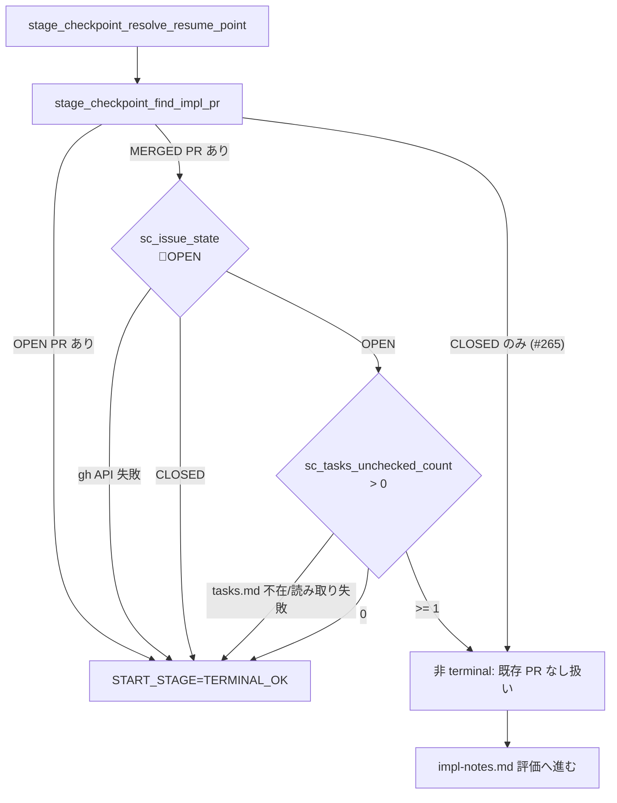

# Design Document

## Overview

**Purpose**: Issue #273 の事故（部分実装 PR を `Closes #N` で merge → Issue が auto-close →
人間が reopen → watcher が「MERGED PR あり」だけを根拠に `TERMINAL_OK` 判定 → 残タスクが
永久に着手不能）を、(1) PR 本文規約の明文化（PjM が `Refs` / `Closes` を使い分ける運用規約）
と (2) watcher 側のガード改善（MERGED PR + OPEN Issue + tasks.md 未チェック残存の組合せを
非 terminal 扱い）で恒久対策する。

**Users**: idd-claude self-hosting 上の運用者と、`install.sh --repo` で consumer repo を
セットアップして使う他リポジトリの運用者。両者ともに「部分実装 PR を merge した後に残タスクを
追加 PR で進める」ワークフローが対象。

**Impact**: 現在 `stage_checkpoint_find_impl_pr()` は同一 head ブランチに紐づく `MERGED` PR が
1 件でもあれば無条件で resume 地点判定を `TERMINAL_OK` で打ち切る。本変更で `MERGED` PR を
採用するか否かに **Issue state**（OPEN/CLOSED）と **`tasks.md` 未チェック残存件数**の 2 条件を
追加し、両方が「再開すべき」と示すケースのみ非 terminal として後段 checkpoint へ委譲する。

### Goals

- PjM が impl PR 本文の「対応 Issue」セクションで `Refs #N`（部分実装 PR）/ `Closes #N`
  （最終 PR or design-less 単一 PR）を機械的に判別して使い分けられること
- `STAGE_CHECKPOINT_ENABLED=true` 既定下で、reopen + 残タスクの組合せが観測されたとき watcher が
  Stage A から再開する経路に進めること
- 既存挙動の後方互換: CLOSED Issue / design-less impl / OPEN PR 優先 / API 失敗時の safe
  fallback / Issue #265 (CLOSED 除外) / Issue #212 (Stage C CLOSED ガード) / Issue #219
  (越境観測・spec 完全性) を 1 行も regression させない
- root `.claude/agents/project-manager.md` と `repo-template/.claude/agents/project-manager.md` を
  byte 一致で保ち、consumer repo にも同じ規約を配布する
- 観測性: 非 terminal 判定経路を既存 `stage-checkpoint:` prefix で grep 抽出できること

### Non-Goals

- 既 merge 済み impl PR 本文の遡及書き換え（retrofit）
- 既に auto-close されてしまった過去 Issue の自動 reopen
- MERGED PR の差分/コメントを resume 入力として利用する機構
- 「MERGED PR を常に terminal とする旧挙動」を opt-out で選べる env var の新設
- design-less impl（`tasks.md` 不在）ケースの判定変更
- per-task ループ (#21 / #251) の進捗追跡規約自体の変更
- `repo-template/CLAUDE.md` / consumer 配布 README の文言変更
- Issue #212 needs-decisions 経路・Issue #219 spec 完全性ガードの判定基準変更

## Architecture

### Existing Architecture Analysis

- 現行の Stage Checkpoint Module（`local-watcher/bin/issue-watcher.sh` L1060〜L1300 付近）は、
  Stage A/B/C 完了を観測して `START_STAGE` を 1 つに決定する純関数群。**外部副作用なしの
  read-only 観測**として設計されており、本変更でもこの方針を維持する
- `stage_checkpoint_find_impl_pr()` は `gh pr list --head <branch> --state all` の出力を `jq` で
  振り分け、OPEN > MERGED > (include_closed なら) CLOSED の優先順位で 1 件を返す。Issue #265
  の CLOSED 除外ガードは本関数内で完結している
- `stage_checkpoint_resolve_resume_point()` が pipeline 順位を司り、(1) 既存 impl PR → (2)
  impl-notes.md → (3) review-notes.md の順に判定して `START_STAGE` を決める
- PjM エージェント定義は root と `repo-template/` の二系統に **byte 一致で配置**する規約
  （CLAUDE.md）が既に確立されており、本変更でも同じ規約を踏襲する

### Architecture Pattern & Boundary Map

**Architecture Integration**:

- 採用パターン: 既存の Stage Checkpoint Module 内で `stage_checkpoint_find_impl_pr()` に
  「OPEN Issue + tasks.md 未チェック残存」判定を inject する **Composition**。新規モジュール
  ファイルは作らず、`issue-watcher.sh` 内に helper 関数を追加して責務分離する
- ドメイン境界:
  - **PjM 規約レイヤ**（`.claude/agents/project-manager.md`）= impl PR 本文の `Refs` / `Closes`
    判別ロジックを Claude エージェント側に持たせる。watcher 側は本判別の入出力に依存しない
  - **Stage Checkpoint レイヤ**（`issue-watcher.sh` L1060〜L1300）= watcher 側のガード強化。
    PjM が `Refs` 規約を遵守しなかった場合でも reopen + 残タスクで救済する第 2 防御線
- 既存パターンの維持: read-only 観測 / `stage-checkpoint:` prefix ログ / `gh ... 2>/dev/null` +
  rc 個別ハンドリング / safe fallback = TERMINAL_OK 採用
- 新規コンポーネントの根拠: helper 2 つ（Issue state 取得 / tasks.md 未チェック件数取得）は
  既存関数 `stage_checkpoint_has_impl_notes` と同形式の小さな関数として追加。新規 .sh モジュール
  は作らない（boundary を散らさず単一ファイルで完結）



### Technology Stack

| Layer | Choice / Version | Role in Feature | Notes |
|-------|------------------|-----------------|-------|
| Frontend / CLI | — | 該当なし | watcher は bash のみ |
| Backend / Services | bash 4+, `gh` CLI, `jq`, `git` | Issue state 取得 / tasks.md 解析 / `gh pr list` | 既存依存セットを踏襲 |
| Data / Storage | git working tree + `docs/specs/<N>-<slug>/tasks.md` | tasks.md の `- [ ]` 件数を `grep -cE` で抽出 | tracked か否かは問わない（branch HEAD では Architect 作の tasks.md が必ず存在する） |
| Messaging / Events | — | 該当なし | |
| Infrastructure / Runtime | local-watcher (cron / launchd) または GitHub Actions | 本ガード経路は両基盤で同一 | 既存と同じく `STAGE_CHECKPOINT_ENABLED=true` 既定 |

## File Structure Plan

### Directory Structure

```
local-watcher/bin/
├── issue-watcher.sh                      # 本変更の主対象
│   ├─ sc_issue_state()                   # 新規: gh issue view --json state を 1 行抽出
│   ├─ sc_tasks_unchecked_count()         # 新規: tasks.md の `- [ ]` 件数を抽出
│   ├─ stage_checkpoint_find_impl_pr()    # 改修: MERGED 採用前に上 2 関数で再判定
│   └─ stage_checkpoint_resolve_resume_point()  # ログ書式拡張（既存呼び出し経路は不変）
└── modules/                              # 本変更では新規モジュール追加なし

.claude/agents/
└── project-manager.md                    # 改修: implementation モードの Refs/Closes 規約節を追加

repo-template/.claude/agents/
└── project-manager.md                    # 改修: 上と byte 一致で配布

README.md                                 # 改修: 「使い方 > 基本フロー」節に Refs/Closes 使い分け規約を 1 ブロック追記

docs/specs/273--bug-pr-closes-n-merge-merged-pr/
├── requirements.md                       # PM 確定済み
├── design.md                             # 本ファイル
├── tasks.md                              # Architect 成果物
└── test-fixtures/
    ├── tasks-with-unchecked.md           # `- [ ]` 残存ありの fixture
    ├── tasks-all-checked.md              # 全 `- [x]` の fixture
    ├── tasks-empty.md                    # 空 tasks.md
    └── test-merged-guard.sh              # sc_tasks_unchecked_count + 判定マトリクス回帰スクリプト
```

### Modified Files

- `local-watcher/bin/issue-watcher.sh` —
  - `stage_checkpoint_find_impl_pr()` の MERGED 採用ブロック（L1176-1177 付近）で
    `sc_issue_state` / `sc_tasks_unchecked_count` を呼んで再判定。両方が「再開すべき」を
    返したときのみ MERGED を捨てて `found=""` に倒す。それ以外は従来通り `found="$merged_pr"`
  - 新規 helper `sc_issue_state()` / `sc_tasks_unchecked_count()` を Stage Checkpoint Module
    セクション末尾に追加
  - 判定根拠ログを `sc_log` で 1〜3 行追加（既存書式 `stage-checkpoint: ...` のまま）
- `.claude/agents/project-manager.md` — implementation モード節（L204 付近）の「実装 PR 本文
  テンプレート」直前に「部分実装 PR と最終 PR の Refs/Closes 使い分け」サブ節を追加し、
  テンプレ内の `Closes #<issue-number>` を判別ロジック付きの記述に書き換える
- `repo-template/.claude/agents/project-manager.md` — 上と byte 一致
- `README.md` — 「使い方 > 基本フロー」節（L877〜L889 付近）の 7 番目の項目（実装 PR レビュー）
  の直後に Refs/Closes 使い分け規約と本ガードの概要を 1 ブロック追記

## Requirements Traceability

| Requirement | Summary | Components | Interfaces | Flows |
|-------------|---------|------------|------------|-------|
| 1.1 | 部分実装 PR は `Refs #N` | PjM Agent (impl) | `.claude/agents/project-manager.md` 実装 PR 本文テンプレ | impl mode 起動 → tasks.md 残存判定 → 本文生成 |
| 1.2 | 最終/design-less impl は `Closes #N` | PjM Agent (impl) | 同上 | 同上 |
| 1.3 | 判定根拠を PR 本文/コメントに 1 行記載 | PjM Agent (impl) | 同上「確認事項」セクション | 同上 |
| 1.4 | root / repo-template 両系統で byte 一致 | リポジトリ二重管理規約 | `diff -r .claude/agents repo-template/.claude/agents` | CI/手動 diff 検証 |
| 1.5 | README ワークフロー節に明文化 | README | 「使い方 > 基本フロー」節 | — |
| 2.1 | OPEN Issue + 未チェック残存で MERGED 非 terminal | `stage_checkpoint_find_impl_pr` | bash 関数 | 上記 Mermaid 図 |
| 2.2 | 非 terminal 時は後段 checkpoint へ進む | `stage_checkpoint_resolve_resume_point` | `pr_rc=1` 経路に合流 | 同上 |
| 2.3 | CLOSED Issue は従来通り TERMINAL_OK | `sc_issue_state` | 戻り値 `CLOSED` → 即 MERGED 採用 | 同上 |
| 2.4 | tasks.md 不在 / 全 `- [x]` は TERMINAL_OK | `sc_tasks_unchecked_count` | 戻り値 0 = MERGED 採用 | 同上 |
| 2.5 | OPEN PR 最優先 | `stage_checkpoint_find_impl_pr` | OPEN > MERGED の既存順位 | 既存挙動維持 |
| 3.1 | Issue state 取得失敗 → TERMINAL_OK | `sc_issue_state` | rc != 0 で safe fallback | safe path |
| 3.2 | tasks.md I/O 失敗 → TERMINAL_OK | `sc_tasks_unchecked_count` | rc != 0 で safe fallback | safe path |
| 3.3 | spec dir 解決規約 | `SPEC_DIR_REL` 既存変数を再利用 | `docs/specs/<N>-<slug>/tasks.md` | _slot_run_issue で先に解決済 |
| 4.1 | 非 terminal 判定根拠ログ | `sc_log` 追加行 | `stage-checkpoint:` prefix | resolve_resume_point 内 |
| 4.2 | terminal 判定の既存ログ書式保持 | `sc_log` 既存 | `decision: START_STAGE=TERMINAL_OK reason=...` | 既存維持 |
| 4.3 | ログ書式整合 | `sc_log` ヘルパ | `[YYYY-MM-DD HH:MM:SS] stage-checkpoint:` | 既存維持 |
| 5.1 | #265 CLOSED 除外維持 | `stage_checkpoint_find_impl_pr` | 既存 excluded-closed ログ | 既存維持 |
| 5.2 | #219 越境観測 OPEN/MERGED 維持 | `stage_a_crossing_probe` | 既存 | 不変 |
| 5.3 | #219 spec 完全性 MERGED 維持 | spec completeness guard | 既存 | 不変 |
| 5.4 | `STAGE_CHECKPOINT_ENABLED=false` で全不発火 | 既存 module gate | 既存 if 文 | 不変 |
| NFR 1.1 | 新規 env var なし | — | — | — |
| NFR 1.2 | 既存ラベル/フィルタ不変 | — | — | — |
| NFR 1.3 | CLOSED Issue 不変 | `sc_issue_state` CLOSED 経路 | — | — |
| NFR 1.4 | PjM 既存テンプレ構造保持 | PjM Agent | テンプレ追加分のみ | — |
| NFR 2.1 | grep 抽出可能なログ | `sc_log` 既存形式踏襲 | — | — |
| NFR 3.1 | 冪等: 副作用なし | read-only 観測のみ | — | — |
| NFR 3.2 | 非 terminal 時も MERGED PR への副作用なし | `gh pr list` 観測のみ | — | — |
| NFR 4.1 | root/repo-template byte 一致 | `diff -r` | — | tasks 末尾 verify ブロック |

## Components and Interfaces

### Stage Checkpoint Module (`local-watcher/bin/issue-watcher.sh`)

#### `sc_issue_state()` (新規 helper)

| Field | Detail |
|-------|--------|
| Intent | 対象 Issue (`$NUMBER`) の state を 1 トークン (`OPEN` / `CLOSED`) で返す |
| Requirements | 2.1, 2.3, 3.1, 4.3 |

**Responsibilities & Constraints**

- `gh issue view "$NUMBER" --repo "$REPO" --json state --jq '.state'` を呼ぶ
- 戻り値: 0 = 取得成功（stdout = `OPEN` / `CLOSED`）/ 1 = API 失敗（stdout 空）
- read-only。コメント・ラベル付与・state 変更は一切行わない（NFR 3.2）
- 環境変数 `NUMBER` / `REPO` を前提（呼び出し元 `_slot_run_issue` で設定済み、既存パターン踏襲）

**Dependencies**

- Inbound: `stage_checkpoint_find_impl_pr` — MERGED 採用前の再判定 (Critical)
- Outbound: `gh` CLI — Issue state 取得 (Critical)

**Contracts**: Service [x]

```bash
sc_issue_state() {
  # stdout: "OPEN" / "CLOSED"  rc: 0=成功 / 1=失敗
}
```

- Preconditions: `NUMBER` / `REPO` 設定済み
- Postconditions: stdout は 1 トークンまたは空。stderr は `gh` の自然な出力を `2>/dev/null` で抑止
- Invariants: 副作用なし（read-only）

#### `sc_tasks_unchecked_count()` (新規 helper)

| Field | Detail |
|-------|--------|
| Intent | `tasks.md` の **最上位 numeric ID 未チェックタスク** 件数を整数で返す |
| Requirements | 2.1, 2.4, 3.2, 3.3 |

**Responsibilities & Constraints**

- 探索先パス: `$REPO_DIR/$SPEC_DIR_REL/tasks.md`（既存 `SPEC_DIR_REL=docs/specs/${NUMBER}-${SLUG}`
  規約を再利用 → Req 3.3）
- ファイル不在 → rc=2（stdout=0）。design-less impl 等価扱い（Req 2.4）
- ファイル存在かつ read 可 → `tasks-generation.md` および `design-review-gate.md` の Budget
  overflow check と **同じ判定パターン** `^- \[ \]\*? [0-9]+\. ` を `grep -cE` で件数化。
  rc=0、stdout=件数（最上位 numeric ID の未チェックタスクのみ。`- [x]` 完了済みは除外。
  子タスク `1.1` も除外。`- [ ]*` deferrable も除外）
- I/O 失敗（読み取り権限なし等の `[ -r "$path" ]` false）→ rc=1（stdout=0、safe fallback。
  Req 3.2）
- 環境変数 `REPO_DIR` / `SPEC_DIR_REL` 前提

**Dependencies**

- Inbound: `stage_checkpoint_find_impl_pr` — MERGED 採用前の再判定 (Critical)
- Outbound: `grep`（POSIX 互換 ERE） (Critical)

**Contracts**: Service [x]

```bash
sc_tasks_unchecked_count() {
  # stdout: 未チェック件数 (整数)
  # rc: 0=成功 / 1=I/O 失敗 / 2=ファイル不在 (design-less impl)
}
```

- 判定 regex 正本: `.claude/rules/tasks-generation.md` の「Checkbox 形式の必須化」節および
  `.claude/rules/design-review-gate.md` の Budget overflow count 抽出 regex（`^- \[ \]\*?
  [0-9]+\. `）と **完全一致**させる。両者は別実行基盤のため共有コードを持てず、同一 regex を
  明記してドリフトを防ぐ
- Preconditions: `REPO_DIR` / `SPEC_DIR_REL` 設定済み
- Postconditions: stdout は十進整数 1 トークン
- Invariants: read-only

#### `stage_checkpoint_find_impl_pr()` (改修)

| Field | Detail |
|-------|--------|
| Intent | 既存仕様 + MERGED 採用前の Issue state / tasks.md 未チェック残存ガード |
| Requirements | 2.1, 2.2, 2.3, 2.4, 2.5, 4.1, 5.1, 5.2, 5.5 |

**Responsibilities & Constraints**

- OPEN PR があれば従来通り即採用（Req 2.5、Req 5.5）
- MERGED PR が候補に上がったとき、以下の **両方** を満たすケースに限り `found=""` に倒し
  「既存 impl PR なし」と等価に扱う（後段 `pr_rc=1` 経路へ。Req 2.1, 2.2）:
  - `sc_issue_state` の戻り値が `OPEN`（rc=0 && stdout=OPEN）
  - `sc_tasks_unchecked_count` の戻り値が **1 以上**（rc=0 && stdout >= 1）
- 上記いずれかが false（CLOSED / API 失敗 / tasks.md 不在 / I/O 失敗 / 件数 0）なら従来通り
  `found="$merged_pr"`（Req 2.3, 2.4, 3.1, 3.2）
- 判定根拠ログ（Req 4.1）:
  - 非 terminal に倒したケース: `sc_log "find-impl-pr: merged-non-terminal pr=#${merged_num}
    issue=#${NUMBER} issue_state=OPEN unchecked=${count} reason=open-issue-with-unchecked-tasks
    branch=${BRANCH}"`
  - terminal を維持したケース（MERGED 採用時、判定根拠が **状態判別に関与した**ときのみ
    出力）: `sc_log "find-impl-pr: merged-terminal pr=#${merged_num} issue=#${NUMBER}
    issue_state=<state> unchecked=<count|na> reason=<closed-issue|no-tasks-file|all-checked|
    issue-api-failure|tasks-io-failure> branch=${BRANCH}"`
- CLOSED 除外ログ（Issue #265 由来、Req 5.1）は OPEN/MERGED 不在時の従来位置で不変

**Dependencies**

- Inbound: `stage_checkpoint_resolve_resume_point` (Critical)
- Outbound: `sc_issue_state` / `sc_tasks_unchecked_count` (Critical), `gh pr list` (Critical)

**Contracts**: Service [x]

```bash
stage_checkpoint_find_impl_pr() {
  # 既存シグネチャ・既存 rc 規約（0/1/2）を維持
  # 新規挙動: MERGED 採用前の再判定（上述）
}
```

- Preconditions: `REPO` / `BRANCH` / `NUMBER` / `LOG` / `REPO_DIR` / `SPEC_DIR_REL` 設定済み
- Postconditions: stdout は既存形式 `<pr_number>,<state>` または空。rc は 0/1/2 のいずれか
- Invariants: read-only。GitHub への書き込み一切なし

#### `stage_checkpoint_resolve_resume_point()` (改修なし、ログ追記のみ)

| Field | Detail |
|-------|--------|
| Intent | 既存契約を保ち、ガード経路で `find_impl_pr` が rc=1 を返した際の判定根拠を可観測化 |
| Requirements | 2.2, 4.1, 4.2, 5.4 |

**Responsibilities & Constraints**

- 既存の `case "$pr_rc" in` 構造は不変。`pr_rc=1` 分岐の `sc_log "input: existing-impl-pr=none"`
  はそのまま、後段の impl-notes 評価へ進む（Req 2.2）
- 追加ログ行は `find_impl_pr` 内で発火するため本関数の改修はゼロ（既存挙動の保持＝Req 5.4）

### PjM Agent Layer (`.claude/agents/project-manager.md` / `repo-template/.claude/agents/project-manager.md`)

#### implementation モード本文規約（追加サブ節）

| Field | Detail |
|-------|--------|
| Intent | impl PR 本文で `Refs #N` / `Closes #N` を機械判別可能なルールで使い分ける |
| Requirements | 1.1, 1.2, 1.3, 1.4 |

**Responsibilities & Constraints**

- 判定ロジック（疑似コード）:
  ```
  if exists("docs/specs/<N>-<slug>/tasks.md"):
      remaining = count_lines_matching("^- \[ \]\*? [0-9]+\. ", tasks.md)
      remaining_after_this_pr = remaining - (この PR で完了予定の最上位タスク数)
      if remaining_after_this_pr > 0:
          → 「対応 Issue」に `Refs #<N>` を採用
          → 「確認事項」に「部分実装 PR: 残 X 件のため Refs を採用」と 1 行記載
      else:
          → 「対応 Issue」に `Closes #<N>` を採用
          → 「確認事項」に「最終 PR: tasks.md 全完了のため Closes を採用」と 1 行記載
  else (design-less impl):
      → 「対応 Issue」に `Closes #<N>` を採用
      → 「確認事項」に「design-less impl: 単一 PR で完了のため Closes を採用」と 1 行記載
  ```
- 判定 regex は **設計 PR 本文の auto-close キーワード禁止規約と同居**（既存 L106-145 はそのまま）。
  本サブ節は implementation モード専用のため、design-review モードの「`Refs` 固定」規約と
  矛盾しない
- 「実装 PR 本文テンプレート」内の固定文字列 `Closes #<issue-number>` を、判定ロジックの出力で
  置換可能なプレースホルダ `<Refs|Closes #<issue-number>>` に変更し、判定例を併記

**Contracts**: Service [ ] / API [ ] / Event [ ] / Batch [ ] / State [ ]（エージェント定義は
規約記述のため契約表は不要）

#### root / repo-template 二系統 byte 一致 (Req 1.4 / NFR 4.1)

- root `.claude/agents/project-manager.md` と `repo-template/.claude/agents/project-manager.md`
  を本サブ節追記後も `diff -r .claude/agents repo-template/.claude/agents` が空のまま保つ
- tasks.md 末尾の verify ブロックで本 diff を回帰確認する

### README Workflow Section

#### 「使い方 > 基本フロー」節への追記 (Req 1.5)

| Field | Detail |
|-------|--------|
| Intent | 部分実装 PR と最終 PR の Refs/Closes 使い分け規約を運用者に明文化 |
| Requirements | 1.5 |

**Responsibilities & Constraints**

- 追記位置: 「7. 実装 PR が作成されたら人間がレビューして merge する」（L888 付近）の直後に
  新規ブロックを挿入する
- 内容: (a) Architect が tasks.md を分割した複数タスクのうち一部のみを 1 PR で完了させる
  「部分実装 PR」では PjM が PR 本文を `Refs #N` で記述する、(b) 残タスクは追加 impl PR で
  進める、(c) 最終 PR では `Closes #N` を使い Issue を auto-close させる、(d) 万一誤って
  `Closes` で部分 merge された場合は Issue を reopen すれば watcher 側のガード（本 spec で
  実装）が tasks.md の `- [ ]` を確認して残タスク再開を継続する
- consumer 配布版 README には触れない（Out of Scope の通り、self-hosting repo 内に限定）

## Data Models

### Domain Model

- **Issue**: numeric `NUMBER`、`state ∈ {OPEN, CLOSED}`（取得失敗時は unknown とみなして safe
  fallback）
- **impl PR set**: 同一 head ブランチ `BRANCH` に紐づく PR の集合。各 PR は `number` /
  `state ∈ {OPEN, MERGED, CLOSED}` を持つ
- **Tasks**: `docs/specs/<N>-<slug>/tasks.md` の最上位 numeric ID タスク行集合。各タスクは
  `checked ∈ {true, false}` と `numeric_id`（例: `1`, `2`）を持つ。Architect の規約で
  「全 checkbox 形式」が強制されている (`tasks-generation.md`)

### Tasks.md unchecked task 判定 regex（正本との同期）

- 本機能の判定 regex は **`.claude/rules/tasks-generation.md` の Budget overflow count 抽出 regex
  と完全一致**: `^- \[ \]\*? [0-9]+\. `
- これは最上位 numeric ID タスク（`- [ ] 1. <名前>` / `- [ ]* 3. <名前>` 等）の **未完了行のみ**に
  マッチする。`- [x] 1.` 完了済み、`- [ ] 1.1 ` 子タスク、`- [ ]* 1.` deferrable はマッチしない
- design-review-gate.md の Mechanical Check（Budget overflow check）と同じ regex を再利用する
  ことで「watcher 側で別 regex を持つ」事態（仕様乖離リスク）を回避する

## Error Handling

### Error Strategy

すべての追加判定経路は **safe fallback = TERMINAL_OK 採用**（既存挙動と同等）に倒す。
新規ガードが原因で resume を誤発火させる方向の regression を構造的にゼロにする。

### Error Categories and Responses

- **gh API 失敗** (`sc_issue_state` rc=1):
  - 既存挙動と同等の `found="$merged_pr"` で MERGED 採用
  - ログ: `sc_log "find-impl-pr: merged-terminal ... reason=issue-api-failure ..."`
  - rationale: Req 3.1（取得失敗時の安全側 = TERMINAL_OK）
- **tasks.md ファイル不在** (`sc_tasks_unchecked_count` rc=2):
  - `found="$merged_pr"` で MERGED 採用
  - ログ: `reason=no-tasks-file`
  - rationale: Req 2.4（design-less impl 等価）
- **tasks.md I/O 失敗** (`sc_tasks_unchecked_count` rc=1):
  - `found="$merged_pr"` で MERGED 採用
  - ログ: `reason=tasks-io-failure`
  - rationale: Req 3.2
- **すべて成功 + 件数 0** (`sc_tasks_unchecked_count` rc=0 stdout=0):
  - `found="$merged_pr"` で MERGED 採用
  - ログ: `reason=all-checked`
  - rationale: Req 2.4（全完了済み）
- **CLOSED Issue**:
  - `found="$merged_pr"` で MERGED 採用
  - ログ: `reason=closed-issue`
  - rationale: Req 2.3 / NFR 1.3
- **すべて成功 + 件数 >= 1**:
  - `found=""` に倒し非 terminal 化
  - ログ: `find-impl-pr: merged-non-terminal pr=#X issue=#Y issue_state=OPEN unchecked=Z ...`
  - rationale: Req 2.1, 4.1

## Testing Strategy

> 本リポジトリには unit test フレームワークがない（CLAUDE.md「テスト・検証」節）。
> 静的解析 + fixture スクリプト + 手動スモークテストで検証する。

### Unit-equivalent (fixture スクリプト)

- `test-merged-guard.sh`: `sc_tasks_unchecked_count` の判定 regex を 3 fixture
  （unchecked / all-checked / 空）で当てて期待値と一致するか
- 判定マトリクス（Issue state × tasks.md 状態）の入力組合せに対して `found` の決定を関数化
  して回帰確認（gh / git を呼ばないため fixture 化可能）
- 期待マトリクス（行=Issue state、列=tasks.md 状態）:

| | unchecked >=1 | all checked | tasks 不在 | I/O 失敗 | API 失敗 |
|---|---|---|---|---|---|
| **OPEN** | 非 terminal | TERMINAL_OK | TERMINAL_OK | TERMINAL_OK | TERMINAL_OK |
| **CLOSED** | TERMINAL_OK | TERMINAL_OK | TERMINAL_OK | TERMINAL_OK | TERMINAL_OK |
| **API 失敗** | TERMINAL_OK | TERMINAL_OK | TERMINAL_OK | TERMINAL_OK | TERMINAL_OK |

### Integration Tests（手動スモーク）

- (S1) `STAGE_CHECKPOINT_ENABLED=false` 環境で本変更が 1 行も発火しないこと
  （`grep -c 'find-impl-pr:' $LOG` が変更前と一致 → Req 5.4 / NFR 1.1）
- (S2) OPEN PR が存在する状態で本変更が `sc_issue_state` / `sc_tasks_unchecked_count` を呼ばない
  こと（`gh issue view` の追加コールが発生しない＝API quota 影響なし → Req 2.5）
- (S3) reopen + 残タスクシナリオで実 watcher を 1 cycle 回し、START_STAGE が `A` に倒れ既存
  impl PR への副作用が一切ないこと（PR コメント / ラベル / state 変化なし → NFR 3.2）

### E2E Tests

- (E1) Issue #273 自身に対する dogfooding: 本 PR を merge した直後の cron サイクルで、本ガード
  が発火する状態（reopen + 残タスク残存）を再現する fixture Issue を立てて挙動確認
- (E2) `diff -r .claude/agents repo-template/.claude/agents` が空であること（NFR 4.1）

### Performance/Load

- 追加 `gh issue view` 呼び出しは **MERGED PR が観測されたサイクル時のみ** 発生（OPEN PR 優先の
  ため通常 cycle は無影響）。API quota への影響は最大 1 cycle あたり +1 call で限定的

## Security Considerations

- 本変更は read-only 観測のみ。新規 secrets / 新規認証経路は導入しない
- `gh issue view --json state` は既存 `gh pr list` と同じ認証情報（既存 cron / launchd
  セットアップで設定済みの `gh auth`）を利用する。新規 scope 要求なし

## Migration Strategy

- **opt-in gate は新設しない**（要件 Out of Scope より、Option A の方針として人間が選択済み）
- 既定挙動の変更点は「OPEN Issue + tasks.md 未チェック残存 + MERGED PR」の組合せのみ。それ以外の
  経路は 100% 既存挙動と等価
- `STAGE_CHECKPOINT_ENABLED=false` 明示時は 1 行も発火しない（既存 gate を踏襲）
- 既 merge 済み過去 PR の遡及書き換えは不要（Out of Scope）

## Supporting References

- Issue #273 本文と関連コメント（事故発生コンテキスト）
- Issue #265 / `docs/specs/265--bug-impl-pr-closed-watcher/` — CLOSED 未マージ PR 除外ガードの
  先行実装（本変更で boundary・ログ書式・fixture スクリプト構造を踏襲）
- `.claude/rules/tasks-generation.md` の Budget overflow count 抽出 regex（本変更の判定 regex
  正本）
- `.claude/rules/design-review-gate.md` の Mechanical Check（同上の同期参照）
- CLAUDE.md「root と `repo-template/` の `.claude/{agents,rules}/` の二重管理」規約
