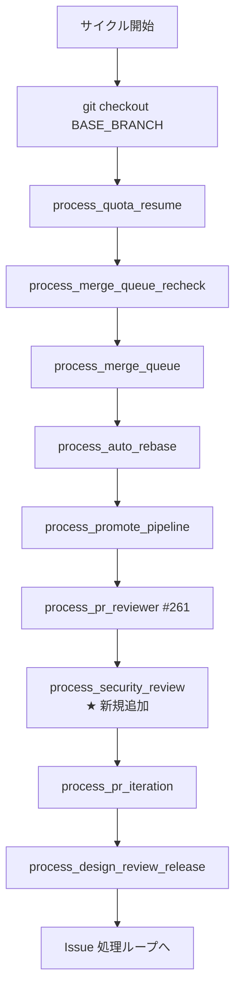
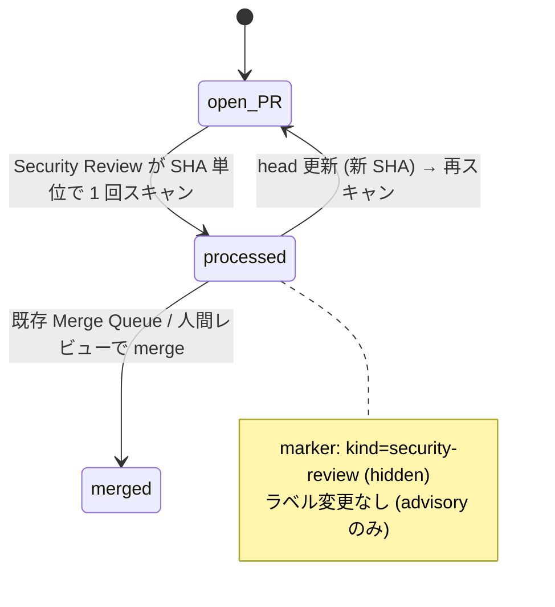

# Design Document

## Overview

**Purpose**: 本機能は Claude Code 公式の `/security-review` skill を用いた PR diff の
セキュリティ検査工程を、idd-claude の無人 auto-dev パイプライン内に挿入する。検査結果は
PR コメントとして残し、運用者が PR 上で目視確認できる形にすることで、現状 Reviewer が
構造上守備範囲外としている injection / secret leak / 認証認可不備 / XSS / 依存脆弱性
クラスの検出機会を補完する。

**Users**: idd-claude を運用する idd-claude 運用者が対象。事前に `claude` CLI が watcher
実行環境（cron / launchd ユーザー）の PATH 上にインストール・認証済みであることを前提とし、
watcher 起動 env に `SECURITY_REVIEW_ENABLED=true` を追加することで本機能が opt-in 起動する。

**Impact**: 既存 watcher の Phase A / PR Reviewer / PR Iteration / Design Review Release
プロセッサ群に **Security Review Processor** を新規追加する。本機能は **完全 opt-in
（既定 `SECURITY_REVIEW_ENABLED=false`）**とし、未設定 / `false` / `0` / `True` 等の
typo を含むあらゆる状態で本機能導入前と byte 等価な観測挙動を維持する（NFR 1.1）。既存
env var 名・既定値・ラベル遷移契約・exit code 意味・cron 登録文字列は一切変更しない。

### Goals

- 既存 processor チェーンに **opt-in 1 段** だけを追加し、未有効化リポジトリでは挙動を
  変えない（後方互換性 / NFR 1.1）
- Claude Code 公式の `/security-review` 機構を `claude` CLI headless 起動で呼び出し、
  PR diff を検査入力として 1 PR あたり 1 回スキャンする
- 検出結果を PR コメントとして残し、hidden HTML marker による同一 SHA 重複防止を担保する
- 初期は **advisory モード**のみを実装（マージブロック動作なし）。strict モードへの拡張
  余地は env var として予約するが本 spec では実装しない（後続 Issue へ分割）
- 既存 Reviewer 3 カテゴリ判定・PR Iteration ループ・Merge Queue・PR Reviewer Processor
  (#261) と完全独立で動作する（責務分離 / Requirement 4）

### Non-Goals

- 公式 `claude-code-security-review` GitHub Action 経路 (#279 Open Questions 経路 a) の
  採用 — local-watcher が idd-claude の主経路のため、watcher headless 経路に統一する
- strict モード（severity 閾値によるマージブロック）の実装 — env var 名のみ予約し、実装は
  後続 Issue (`SECURITY_REVIEW_MODE=strict` 追加) に分割する（advisory のみ初期実装）
- `security-notes.md` 等の構造化アーティファクトを PR ブランチに書き出す経路 — read-only
  invariant 違反のリスクと冪等性管理コストを避け、初期は PR コメント単独に集約する
- 新規ラベル追加 — advisory のみのため `needs-iteration` 等のマージブロック系ラベルは
  付与しない（既存 `.github/scripts/idd-claude-labels.sh` に変更を入れない）
- サードパーティ製スキャナ統合 / 検出脆弱性の auto-fix / テレメトリ自動収集 / 既存 PR
  への遡及スキャン（requirements.md Out of Scope と同一）
- 既存 Reviewer / PR Reviewer Processor (#261) / PR Iteration Processor (#26) の判定論理
  改変

---

## Architecture

### Existing Architecture Analysis

idd-claude の watcher は、`issue-watcher.sh` 本体（dispatcher）と `local-watcher/bin/modules/*.sh`
の per-processor モジュール（`source` で同一プロセスに同期ロード）で構成されている。
既存の典型パターンは以下:

- **env var**: 本体冒頭 Config ブロックで `${VAR:-default}` 形式で既定値解決
  （`PR_REVIEWER_ENABLED="${PR_REVIEWER_ENABLED:-false}"` 等。opt-in 機能は明示的に
  `:-false`、デフォルト有効機能は `:-true` + `_idd_flag` 正規化ループに参加）
- **モジュール source**: `REQUIRED_MODULES` 配列に追加 → for ループで読み込み（順序は機能的に
  任意・bash 遅延束縛）
- **dispatcher call site**: 本体の処理順序を温存する位置に
  `process_<name> || <ns>_warn "..."` 形式で 1 行配置（fail-continue）
- **logger**: `core_utils.sh` に `<ns>_log` / `<ns>_warn` / `<ns>_error` を集約
  （時刻 + `[$REPO]` + processor prefix 3 段）
- **opt-in gate**: `process_<name>()` 関数冒頭で `[ "$VAR" != "true" ] && return 0` 早期 return
- **重複防止 marker**: `pr-reviewer.sh` が
  `<!-- idd-claude:pr-reviewer sha=<sha> kind=<kind> tool=<tool> -->` 形式を確立済み
  （`gh api .../issues/<n>/comments` + `jq test()` で検出 / #261）
- **flock 境界**: PR Reviewer / PR Iteration / Design Review Release 等は単一 flock 内で
  直列実行（`exec 200>"$LOCK_FILE"` 後）

本機能はこのパターンを **完全踏襲** し、新規規約・新ライブラリは導入しない。

**尊重すべきドメイン境界**:

- 既存 Reviewer の 3 カテゴリ判定（missing AC / missing test / boundary 逸脱）・
  `review-notes.md` / `RESULT: approve|reject` 判定論理に介入しない（Requirement 4）
- PR Reviewer Processor (#261) の `needs-iteration` 付与 → PR Iteration Processor (#26) の
  反復対応経路に介入しない
- `merge-queue` / `auto-rebase` / `design-review-release` 等の他 processor のラベル操作
  領域に触らない
- `core_utils.sh` の既存公開関数・ロガー群は変更しない（新規 `sec_*` ロガー 3 関数のみ追加）

**維持すべき統合点**:

- `gh pr list` / `gh api /repos/.../issues/<n>/comments` / `gh pr comment` の既存利用パターン
- 既存定数（`BASE_BRANCH` / `REPO` / `LABEL_*` 群）の名前・意味・既定値
- `PR_REVIEWER_HEAD_PATTERN` の慣習（既定 `^claude/`）に準じた head ブランチ判定

**解消・回避する technical debt**: なし（新規モジュール追加のため既存 debt に手を入れない）。

### Architecture Pattern & Boundary Map

**Architecture Integration**:

- **採用パターン**: 既存 per-processor module pattern（Modular Monolith / Pipes-and-Filters
  の cron tick 内サイクル）
- **ドメイン／機能境界**: Security Review Processor は「`claude` CLI headless 起動による
  `/security-review` 実行 → 結果コメント投稿」までを **単一責務** として担当。マージ
  ブロックや反復対応は他 processor の責務領域として侵害しない
- **既存パターンの維持**: opt-in env gate / source 経由のモジュールロード / logger 3 段 prefix /
  hidden HTML marker / fail-continue dispatcher / flock 境界
- **新規コンポーネントの根拠**: 新規外部呼び出し（`claude -p '/security-review'`）と独立した
  state（`kind=security-review` marker）が必要なため、既存 processor のいずれにも組み込めない。
  特に PR Reviewer Processor (#261) は `codex` / `agy` を呼ぶ排他経路を持つため、内部分岐
  ではなく独立 processor として分離する

**実行順序の配置（dispatcher 内）**:



**配置根拠**:

- **PR Reviewer Processor (#261) の直後** に配置する。PR Reviewer は `needs-iteration`
  付与を行う場合があるが、Security Review は advisory（ラベル操作なし）のため両者は
  ラベル状態の競合を起こさない。実行順は「外部 AI コードレビュー → セキュリティレビュー
  → iteration 反復」となり、人間レビュアーが PR タイムライン上で同じ SHA に対する両所見を
  時系列順に確認できる
- **PR Iteration Processor (#26) の直前** に配置することで、本 processor の結果コメントを
  iteration ループへ持ち込まない（advisory モードのため iteration を起こすキーワードは
  発しない）が、将来 strict モードを追加した際の `needs-iteration` 接続点として位置を維持
  できる
- 失敗時は `|| sec_warn "..."` で吸収し後続 processor を阻害しない（既存 fail-continue 規約）

### ラベル状態機械上の位置づけ



advisory モードでは PR の `needs-iteration` / `needs-rebase` / `ready-for-review` 等の
**既存ラベル状態に一切介入しない**。`processed` は marker 由来の論理状態であり、ラベル
としては可視化しない（NFR 1.1 既存ラベル遷移契約の不変性）。

### Technology Stack

| Layer | Choice / Version | Role in Feature | Notes |
|-------|------------------|-----------------|-------|
| Frontend / CLI | bash 4+ | watcher 本体 / モジュール実装 | 既存と同じ |
| Backend / Services | GitHub REST/CLI (`gh` 2.x) | PR 列挙 / コメント投稿 / 既存コメント取得 | 既存と同じ |
| Data / Storage | なし（state は PR コメントの hidden marker のみ） | SHA 単位の重複防止判定 | per-Issue 永続 state を持たない |
| Messaging / Events | cron tick / flock 境界内の直列実行 | 既存 processor チェーンと同じ flock 境界 | 並列化なし |
| Infrastructure / Runtime | watcher host PATH 上の `claude` CLI (Claude Code) | 運用者が事前準備（既存前提ツール）| 既に必須ツール集合に含まれる |
| Security Skill | Claude Code `/security-review` skill | PR diff のセキュリティ検査本体 | `claude` CLI に内蔵 / 別ランタイム不要（NFR 2.1） |
| Tooling: jq | 1.6+ | gh JSON / コメント本文の HTML marker 検出 | 既存と同じ |
| Static Analysis | `shellcheck` | NFR 5.1 警告ゼロ | 既存 `.shellcheckrc` の info 級抑止を踏襲 |

---

## File Structure Plan

### Directory Structure（既存ツリーへの追加）

```
local-watcher/bin/
├── issue-watcher.sh                 # ★ 編集: Config ブロック追記 + REQUIRED_MODULES 追記 + dispatcher call site 1 行追加
└── modules/
    ├── core_utils.sh                # ★ 編集: sec_log / sec_warn / sec_error の 3 関数を追加（pr_log と同形式）
    ├── pr-reviewer.sh               # 不変
    ├── pr-iteration.sh              # 不変
    ├── merge-queue.sh               # 不変
    ├── auto-rebase.sh               # 不変
    ├── promote-pipeline.sh          # 不変
    ├── quota-aware.sh               # 不変
    ├── scaffolding-health.sh        # 不変
    ├── stage-a-verify.sh            # 不変
    ├── run-summary.sh               # 不変
    └── security-review.sh           # ★ 新規: Security Review Processor 本体

docs/specs/279-feat-watcher-security-review-opt-in-pr-d/
├── requirements.md                  # PM 確定済み（変更なし）
├── design.md                        # ★ 本ファイル
└── tasks.md                         # ★ 同時生成

README.md                            # ★ 編集: 「オプション機能一覧（opt-in）」表に 1 行追加 + 新規「Security Review Processor (#279)」節を追加
```

### Modified Files（詳細）

- `local-watcher/bin/modules/security-review.sh`（**新規**）— Security Review Processor の
  関数群を集約。`issue-watcher.sh` から `source` される前提（単体起動しない）。
  `set -euo pipefail` は本体側で宣言済みのため宣言しない（既存モジュールと同じ）
- `local-watcher/bin/modules/core_utils.sh`（**編集**）— 既存 `pr_log` / `pi_log` / `mq_log`
  等と同形式で `sec_log` / `sec_warn` / `sec_error` の 3 関数を末尾に追記（他関数は変更しない）
- `local-watcher/bin/issue-watcher.sh`（**編集**）— 以下 3 箇所のみ:
  1. **Config ブロック**: 既存 `# ─── PR Reviewer Processor 設定 (#261) ───` 節の **後** に
     新規 `# ─── Security Review Processor 設定 (#279) ───` 節を追加し、後述 env var 群を
     `${VAR:-default}` 形式で解決
  2. **REQUIRED_MODULES 配列**: `"security-review.sh"` を末尾に追加（順序は機能的任意）
  3. **dispatcher call site**: 既存
     `process_pr_reviewer || pr_warn "..."` の **直後** に
     `process_security_review || sec_warn "process_security_review が想定外のエラーで終了しました（後続 Issue 処理は継続）"`
     を 1 行追加
- `README.md`（**編集**）— 以下 2 箇所:
  1. 「オプション機能一覧」§ の opt-in 表に `SECURITY_REVIEW_ENABLED` 行を追加
  2. 新規 h2 セクション「Security Review Processor (#279)」を `## PR Reviewer Processor (#261)`
     の **後** に挿入。env var 一覧（既定値・正規化規則）/ 動作フロー / 重複防止 marker /
     利用例 cron 行 / 既知の制約（advisory のみ・strict 後続）を記載
- **編集対象外**:
  - `.github/scripts/idd-claude-labels.sh` — 新規ラベル追加なし（advisory モードのみのため）
  - `.claude/agents/*.md` / `.claude/rules/*.md` / `repo-template/.claude/{agents,rules}/*.md`
    — agent / rule 規約を変更しないため二重管理整合（NFR 7）は構造的に不要
  - `install.sh` — 新規モジュール追加は既存の `local-watcher/bin/modules/` 一括配置ロジックで
    自動的に拾われる（install.sh 本体への変更不要）
  - 既存 `pr-reviewer.sh` / `pr-iteration.sh` / その他 processor — 不変

---

## Requirements Traceability

| Requirement | Summary | Components | Interfaces | Flows |
|-------------|---------|------------|------------|-------|
| 1.1 | `SECURITY_REVIEW_ENABLED!=true` で全スキップ | `process_security_review` 早期 return | log のみ | 1 |
| 1.2 | `=true` 時に後続を実行 | `process_security_review` 本体 | dispatcher 呼び出し | 1 |
| 1.3 | 他 processor に副作用なし | dispatcher fail-continue + 独立 marker kind | 既存 \|\| pr_warn 等と同型 | 1 |
| 1.4 | 未設定時に 1 行のスキップ理由をログ | `process_security_review` 早期 return path で `sec_log` | log | 1 |
| 2.1 | 対象 = open + `^claude/issue-` 命名規約 + 非 fork | `sec_fetch_candidate_prs` | `gh pr list` + jq | 2 |
| 2.2 | PR diff を 1 回スキャン | `sec_run_review_for_pr` 内の `sec_execute_security_review` | `claude -p '/security-review'` headless | 3 |
| 2.3 | draft 除外 | `sec_fetch_candidate_prs` server + client 二重防御 | `--search "-draft:true"` + jq | 2 |
| 2.4 | 同一 SHA は冪等 skip | `sec_already_processed` + `kind=security-review` marker | jq 検索 | 4 |
| 2.5 | 上限件数で truncate + ログ | `process_security_review` MAX_PRS truncate ループ | log | 2 |
| 2.6 | スキャン失敗 → エラーコメント + 中止 | `sec_post_error_comment` `kind=scan-failed` | hidden marker | 3 |
| 3.1 | 検出 1 件以上で結果コメント投稿 | `sec_post_review_comment` `kind=security-review` | `gh pr comment` | 3 |
| 3.2 | 見出し + severity + 修正方針相当 | 内蔵 default prompt の出力規約 + `sec_post_review_comment` | コメント本文 | 3 |
| 3.3 | 検出 0 件は無コメント + ログ記録（安全側既定） | `sec_run_review_for_pr` 0 件分岐 | log only | 3 |
| 3.4 | コメント本文に SHA marker 埋め込み | `sec_build_marker` | `<!-- idd-claude:security-review sha=... -->` | 4 |
| 3.5 | 成果物保存は本 spec で **不採用**（Architect 確定） | — | — | — |
| 4.1 | Reviewer の判定対象カテゴリを追加・変更・削除しない | 本機能は Reviewer agent を起動しない / `review-notes.md` を読み書きしない | — | — |
| 4.2 | `review-notes.md` 内容・`RESULT:` 行に介入しない | Components の責務分離 / 編集対象に `review-notes.md` を含めない | — | — |
| 4.3 | 自身の結果のみでコメント / ラベル判断 | `process_security_review` の独立判定 | — | 3 |
| 4.4 | 自身の失敗を Reviewer 判定に反映しない | dispatcher fail-continue / Reviewer は別 stage で起動 | — | — |
| 5.1 | advisory（既定）でマージ阻害ラベル付与しない | `process_security_review` mode 判定 → advisory branch | コメント投稿のみ | 3 |
| 5.2 | strict のラベル付与は本 spec **未実装**（env 予約のみ） | `SECURITY_REVIEW_MODE` env 解決 → strict は WARN + advisory fallback | 後続 Issue へ分割 | — |
| 5.3 | strict + 検出 0 件のラベル付与しない動作 | 同上（未実装、advisory fallback） | — | — |
| 5.4 | mode 値・判定理由をログ記録 | `sec_log "mode=advisory ..."` 等 | log | 1 |
| 5.5 | mode 未設定 / 不正値は advisory 相当 | `sec_resolve_mode` 安全側 fallback | log | 1 |
| 6.1 | コメント本文に SHA marker 埋め込み | `sec_build_marker` | 3.4 と同じ | 4 |
| 6.2 | 既存マーカーあり → 同種コメント / スキャン skip | `sec_already_processed` | jq 検索 | 4 |
| 6.3 | SHA 更新で新規実行 | marker は SHA 単位 | gh pr list の headRefOid | 4 |
| 6.4 | hidden HTML コメント形式 | `sec_build_marker` 出力 | `<!-- idd-claude:security-review sha=... kind=... -->` | 4 |
| NFR 1.1 | 未有効化時に既存挙動と byte 等価 | `process_security_review` 早期 return + Config の `${VAR:-default}` | 全体 | — |
| NFR 1.2 | 既存 env var 名・既定値を変更しない | 既存 Config ブロック編集禁止（追加のみ） | — | — |
| NFR 1.3 | 既存 cron / launchd 登録文字列を変更しない | watcher CLI args / env 解決順を変更しない | — | — |
| NFR 2.1 | 新規ランタイム追加なし | `claude` CLI のみ使用（既存必須ツール） | — | — |
| NFR 2.2 | 既存 CLI 集合内で動作 | `gh` / `jq` / `git` / `claude` のみ | — | — |
| NFR 2.3 | 最小 PATH 解決で動作 | 既存 watcher の PATH prepend を踏襲 | — | — |
| NFR 3.1 | 分岐点のログ記録 | `sec_log` / `sec_warn` の網羅 | log | 全 |
| NFR 4.1 | 同一 PR 同一 SHA は副作用 1 回のみ | hidden marker による idempotency | 4 と同じ | 4 |
| NFR 5.1 | shellcheck 警告ゼロ | 既存 `.shellcheckrc` 踏襲 | — | — |
| NFR 6.1 | README に env var / 既定値 / 挙動を明記 | README 編集タスク | — | — |
| NFR 6.2 | 同一 PR 内で README / 該当 rule を同時更新 | tasks.md task 5 で同 PR 内に含める | — | — |
| NFR 7.1 | agents / rules を編集する場合に root と repo-template の両方を byte 一致更新 | 本機能では **編集しない設計**（NFR 7 適用回避） | — | — |
| NFR 7.2 | `diff -r` で空であることを確認 | 編集しないため自明に空（既存 diff 状態を破壊しない） | — | — |

**Flow 番号凡例**:

1. opt-in / mode 解決 gate
2. 候補 PR 列挙
3. スキャン実行 → 結果コメント投稿
4. 重複防止判定（marker）

---

## Components and Interfaces

### Module: `security-review.sh`

#### Component: Security Review Processor（モジュール全体）

| Field | Detail |
|-------|--------|
| Intent | `SECURITY_REVIEW_ENABLED=true` 時に open PR 集合に対し `claude -p '/security-review'` を実行し、検出結果を PR コメントとして投稿する |
| Requirements | 1.1〜1.4, 2.1〜2.6, 3.1〜3.5, 4.1〜4.4, 5.1〜5.5, 6.1〜6.4, NFR 1.1〜7.2 |

**Responsibilities & Constraints**

- 主責務: `claude` CLI による `/security-review` 起動・結果コメント投稿・SHA 単位の重複防止
- ドメイン境界: Reviewer 3 カテゴリ判定・PR Reviewer (#261) `needs-iteration` 付与・
  PR Iteration 反復経路・Merge Queue 操作に一切介入しない
- データ所有権: hidden HTML marker
  `<!-- idd-claude:security-review sha=<oid> kind=<security-review|scan-failed> -->` のみが
  本 processor の永続 state
- invariants:
  - 同一 PR + 同一 `headRefOid` + 同一 `kind` に対して副作用（PR コメント投稿）は **1 回のみ**
  - workspace を変更しない（subshell + EXIT trap で `BASE_BRANCH` 復帰 / `--allowedTools` で
    write 系を禁止 / 実行後 `git status --porcelain` 検査）
  - 既存 PR ラベルに一切触らない（advisory モードのため）

**Dependencies**

- Inbound: `issue-watcher.sh` dispatcher（`process_security_review` 呼び出し）— Criticality: high
- Outbound: `gh` CLI（PR 列挙 / コメント / コメント検索）— Criticality: high
- Outbound: `git` CLI（fetch / checkout）— Criticality: high
- Outbound: `jq`（JSON 整形 / コメント本文走査）— Criticality: high
- External: `claude` CLI（既存必須ツール、Security Review skill `/security-review` 内蔵）—
  Criticality: high（未インストール時は watcher 起動自体が既存 prerequisite check で失敗）
- Internal: `core_utils.sh` の `sec_log` / `sec_warn` / `sec_error`（同 PR で新規追加）

**Contracts**: Service [x] / API [ ] / Event [ ] / Batch [x] / State [x]

##### Service Interface（公開関数シグネチャ）

```bash
# エントリ関数: dispatcher から呼ばれる
# 入力: なし（env var 群を読む）
# 出力: なし（log のみ）
# 戻り値: 0 固定（後続 processor を阻害しないため / dispatcher fail-continue 契約）
# AC: 1.1, 1.2, 1.3, 1.4, 2.1, 2.5, 5.1, 5.5
process_security_review()

# mode 解決（advisory / strict / fallback）
# 入力: env $SECURITY_REVIEW_MODE
# 出力: stdout に "advisory" のみ（strict 値は WARN + advisory fallback、Architect 確定）
# 戻り値: 0 固定
# AC: 5.2, 5.5
sec_resolve_mode()

# 候補 PR を JSON 配列で返す（open + 非 draft + head pattern 一致 + 非 fork）
# 出力: stdout に jq 配列 JSON 1 行（候補なし / 失敗時は "[]"）
# 戻り値: 0 固定（失敗は degraded path = "[]" + WARN）
# AC: 2.1, 2.3, NFR 3.1
sec_fetch_candidate_prs()

# 1 PR 分のスキャンを統括
# 入力: $1 = pr_json (sec_fetch_candidate_prs の単一要素)
# 戻り値: 0 = success / 1 = failure (transient) / 2 = skip (重複) / 3 = scan-error
# AC: 2.2, 2.4, 2.6, 3.1, 3.2, 3.3, 3.4, 6.1〜6.4
sec_run_review_for_pr()

# 重複防止 marker の既存判定
# 入力: $1 = pr_number, $2 = sha, $3 = kind
# 戻り値: 0 = 既存 (skip) / 1 = 未存在 (continue)
# AC: 2.4, 6.2, 6.3, NFR 4.1
sec_already_processed()

# hidden HTML marker 構築
# 入力: $1 = sha, $2 = kind ("security-review" | "scan-failed")
# 出力: stdout に marker 文字列 (末尾改行なし)
# AC: 3.4, 6.1, 6.4
# 形式: <!-- idd-claude:security-review sha=<sha> kind=<kind> -->
sec_build_marker()

# `claude` headless 実行（PR head を checkout した状態で /security-review を起動）
# 入力: $1 = head_ref, $2 = base_ref, $3 = pr_number, $4 = out_file, $5 = err_file,
#       $6 = result_file
# 出力: out_file へ stdout / err_file へ stderr / result_file へ実行結果トークン
# 戻り値: 0 固定（結果判定は result_file 経由）
# AC: 2.2, 2.6
#
# result_file に書き出すトークン:
#   - fetch-fail        : git fetch 失敗（一時的、コメント投稿しない）
#   - checkout-fail     : git checkout 失敗（同上）
#   - ran:<rc>:clean    : 実行完了、ワークツリー変更なし
#   - ran:<rc>:modified : 実行完了したがワークツリー変更（read-only invariant 違反）
sec_execute_security_review()

# 結果コメントを投稿（hidden marker 付き）
# 入力: $1 = pr_number, $2 = sha, $3 = review_text
# 戻り値: 0 = ok / 1 = 投稿失敗
# AC: 3.1, 3.2, 3.4, 6.1, 6.4
sec_post_review_comment()

# エラーコメントを投稿（hidden marker 付き、重複判定 sec_already_processed 経由）
# 入力: $1 = pr_number, $2 = sha, $3 = kind, $4 = detail
# 戻り値: 0 = ok（重複 skip 含む）/ 1 = 投稿失敗
# AC: 2.6, 6.1, 6.2, 6.4
sec_post_error_comment()
```

##### CLI 起動契約（`/security-review` headless）

`claude` CLI の headless 起動として下記のテンプレートを採用する（env でテンプレート全体を
override 可能 / 既定はモジュールに焼き込み）:

```bash
# 既定値（issue-watcher.sh Config ブロック）
SECURITY_REVIEW_CLAUDE_CMD="${SECURITY_REVIEW_CLAUDE_CMD:-claude -p '/security-review' \
  --output-format text \
  --max-turns ${SECURITY_REVIEW_MAX_TURNS:-30} \
  --model ${SECURITY_REVIEW_MODEL:-claude-opus-4-7} \
  --permission-mode plan}"
```

設計上の不確実性（Architect が明示的に確定する範囲）:

- `/security-review` は Claude Code に組み込みの slash command として 2024-2025 年に
  公開された skill 名であり、`claude -p '<prompt>'` の prompt 内で `/security-review` を
  発するか、`--system-prompt-append '/security-review を実行せよ'` 相当のラッパー文字列で
  起動するかは公式仕様の細部に依存する。本 spec では **prompt 第一引数として
  `/security-review` を直接渡す方式**を初期実装とし、watcher 実行ログから
  `Unknown slash command` 相当のエラーが観測された場合は `SECURITY_REVIEW_CLAUDE_CMD`
  env で運用者が override する経路を残す（NFR 2.2 の既存 CLI 集合内で吸収）。実装時に
  `claude --help` で `-p` の挙動と slash command 起動の正確な引数形式を確認し
  `impl-notes.md` に記録する（design の責務は env による override 経路の保証まで）
- `--permission-mode plan` で read-only 動作を強制し、`--allowedTools` は明示指定せず
  Claude Code 既定の policy に委ねる（write 系の阻止は `permission-mode plan` で達成。
  実行後の `git status --porcelain` 検査で二重防御）

##### State / Marker Contract

```
<!-- idd-claude:security-review sha=<headRefOid> kind=<security-review|scan-failed> -->
```

- `sha`: PR の `headRefOid`（hex SHA-1 / SHA-256）
- `kind`: `security-review`（結果コメント）/ `scan-failed`（エラーコメント）
- 既存 `pr-reviewer` の marker (`idd-claude:pr-reviewer ...`) と prefix が異なるため
  名前空間が分離され、相互干渉しない（jq の test() pattern も独立）

---

## Data Models

### Domain Model

- **Aggregate boundary**: 1 PR + 1 SHA + 1 `kind` 単位で副作用を 1 回に保つ（NFR 4.1）
- **Entity**: PR (`pr_number`, `headRefOid`, `headRefName`, `baseRefName`, `isDraft`,
  `headRepositoryOwner.login`)。`gh pr list --json` から取得し本 processor では永続化しない
- **Value Object**: Marker (`sha`, `kind`)。HTML コメント文字列としてシリアライズ
- **Domain Event**: なし（cron tick 内サイクルで状態遷移を完結させ、event store を持たない）

### Logical Data Model

- **PR コメント**: GitHub 側に保管。本 processor は read（`gh api .../comments`）と
  append（`gh pr comment`）のみを行う。既存コメントの edit / delete は行わない
- **環境変数**: cron / launchd 由来。bash プロセス内のメモリのみで保持し永続化しない

### Physical Storage

- なし。本機能は PR コメントの hidden marker を唯一の永続 state として扱う（File Structure
  Plan で `security-notes.md` 等の成果物を非採択としたため）

---

## Error Handling

### Error Strategy

- **Layered approach**: (a) ツール健全性（`claude` CLI 存在）は既存 watcher 冒頭の
  prerequisite check に委譲、(b) サイクル単位の dispatcher fail-continue で後続 processor を
  阻害しない、(c) PR 単位のエラーは PR コメント (`kind=scan-failed`) で運用者に通知し
  silent fail を作らない
- **Idempotency**: エラーコメントも hidden marker (`kind=scan-failed`) で重複防止し、同一 SHA
  でリトライしてもコメントが累積しない。SHA が更新されれば marker 不一致で再実行される
- **Graceful degradation**: gh API / git 操作の一時的失敗は WARN + skip に倒し、次サイクルで
  再評価される（self-healing）

### Error Categories and Responses

| Category | Trigger | Response | Marker kind |
|---|---|---|---|
| Opt-in 未有効化 | `SECURITY_REVIEW_ENABLED != "true"` | 1 行ログ後 `return 0` 早期 return | — |
| 候補 PR ゼロ件 | `sec_fetch_candidate_prs` が `[]` 返却 | サマリログのみ | — |
| 候補取得失敗 | `gh pr list` timeout / エラー | WARN + degraded path `[]` 採用 | — |
| 重複 SHA | `sec_already_processed` が 0 返却 | サイクル skip ログ後 `return 2` | — |
| git fetch / checkout 失敗 | 一時的な git/gh 障害 | WARN + skip（コメント投稿しない） | — |
| スキャン非ゼロ終了 | `claude -p '/security-review'` 実行 rc != 0 | `kind=scan-failed` エラーコメント投稿 + 中止 | scan-failed |
| ワークツリー変更検出 | 実行後 `git status --porcelain` が非空 | `git checkout -- .` で破棄 + `kind=scan-failed` (理由: read-only invariant 違反) | scan-failed |
| スキャン出力空 | rc=0 だが stdout 空 | `kind=scan-failed`（空出力理由）+ 中止 | scan-failed |
| 上限件数超過 | `sec_total > SECURITY_REVIEW_MAX_PRS` | 上限まで処理 + 残件数をログ記録 | — |

### Logging Coverage（NFR 3.1）

下記分岐点を `sec_log` / `sec_warn` のいずれかで出力する:

- opt-in スキップ理由（未設定 / `=false` / typo）
- mode 解決結果（`advisory` / strict 未実装 fallback）
- サイクル開始時の 1 行サマリ（`mode=X max_prs=N git_timeout=Ns exec_timeout=Ns head_pattern=...`）
- 候補 PR 件数（total / target / overflow）
- 各 PR の処理開始（`pr=N head=... base=... sha=...`）
- draft 除外 / 重複 SHA 検出 / スキャン実行開始 / スキャン rc / コメント投稿 / エラー投稿
- サイクル終了時のサマリ（`reviewed=N skip=N fail=N errored=N overflow=N`）

---

## Security Considerations

- **Headless CLI 起動の防御的設計**:
  - `eval` を使わず `bash -c "$resolved_cmd"` で subshell に閉じ込める（既存 #261 の
    Decision 9 を踏襲）
  - GitHub 由来の値（branch 名 / PR 番号）に shell metacharacter
    （`;` `|` `&` `` ` `` `$(`）が混入していないか実行前に検査し、検出時は WARN + skip
    （`pr_substitute_placeholders` 同型の実装）
- **read-only invariant**:
  - `--permission-mode plan` で write 系ツールの実行を Claude 側でブロック
  - 実行後 `git status --porcelain` で workspace 変更を検査、検出時は `git checkout -- .` で
    tracked 変更を破棄（`git clean` は使わず `.antigravitycli/` 等の運用ツール生成物を
    巻き込まない）
  - subshell の EXIT trap で必ず `BASE_BRANCH` へ復帰
- **fork PR の除外**: `headRepositoryOwner.login == owner` を client-side でフィルタし、
  信頼境界外のコード（外部 contributor の fork）を `claude` CLI に渡さない（既存 #261
  `pr_fetch_candidate_prs` と同じ運用前提）
- **コメント本文の sanitize**: `claude` 出力は markdown としてそのまま PR コメントに投稿する。
  内部に `</details>` 等が含まれていても GitHub 側の markdown sanitization に委ね、本機能で
  特別な sanitize は行わない（既存 #261 と同じ運用）

---

## Performance & Scalability

- **1 PR あたりの実行コスト**: `claude` headless 起動 1 回 + 周辺 git/gh 数回。`SECURITY_REVIEW_EXEC_TIMEOUT`
  既定 600 秒で上限を設ける（既存 `PR_REVIEWER_EXEC_TIMEOUT` と同値）
- **1 サイクルあたりの上限**: `SECURITY_REVIEW_MAX_PRS` 既定 `5`（#261 と同値）。超過分は
  次サイクルへ持ち越す（cron 間隔 */2 分なら大半の repo で実用上問題なし）
- **並列化**: なし。同一 flock 境界内で直列実行（既存 processor チェーンの規約踏襲）
- **コスト管理**: `claude` の quota 消費は既存 Quota-Aware Watcher (#66) と独立に発生する
  （Security Review は別 stage として観測される）。quota 不足時は claude CLI 側で失敗し
  `scan-failed` コメントを投稿する degraded path に落ちる

---

## Testing Strategy

### Unit Tests（モジュール関数単位）

- `sec_build_marker` の出力形式（hex SHA / kind 2 種で正しい HTML コメント文字列を生成）
- `sec_resolve_mode` の値正規化（`advisory` / `strict` / 未設定 / 不正値 → advisory 採用）
- `sec_fetch_candidate_prs` の draft / fork / head pattern フィルタ（jq 単体での挙動）
- `sec_already_processed` の jq pattern が `sha` + `kind` の AND 一致のみ true を返す
- shell metacharacter 検査（`;` `|` `&` ` ``` ` `$(` を含む値で skip 判定）

### Integration Tests（モジュール間連携）

- opt-in OFF (`SECURITY_REVIEW_ENABLED` 未設定) → `process_security_review` が即 return 0
  し、watcher の他の処理が本機能導入前と byte 等価に動く（NFR 1.1）
- 候補 PR 0 件 → サマリログ 1 行のみで終了、コメント投稿なし
- 同一 SHA 2 回呼び出し → 2 回目は marker 検出で skip（NFR 4.1 idempotency）
- `claude` 実行 timeout → `kind=scan-failed` コメント投稿 + 後続 processor 続行
- ワークツリー変更検出 → `git checkout -- .` で破棄 + `kind=scan-failed` 投稿

### Static Analysis

- `shellcheck local-watcher/bin/modules/security-review.sh local-watcher/bin/modules/core_utils.sh local-watcher/bin/issue-watcher.sh`
  が警告ゼロで終了（既存 `.shellcheckrc` の `SC2317` / `SC2012` accepted baseline を踏襲、NFR 5.1）

### E2E（手動スモーク）

- 本リポジトリに test issue + 小さな PR を立て、watcher 起動 env に
  `SECURITY_REVIEW_ENABLED=true` を渡して `kind=security-review` コメントが 1 回投稿される
  ことを確認
- 同じ PR で `SECURITY_REVIEW_ENABLED` を外して watcher を再実行し、本機能由来の追加副作用
  （新規コメント / ラベル変化）が発生しないこと（後方互換性）
- README の cron 例をコピーして `claude` CLI 未認証環境で起動し、エラーコメント
  （`kind=scan-failed`）が PR に 1 回だけ投稿され重複しないこと（idempotency）

---

## Environment Variables（新規追加分）

| env var | 既定値 | 用途 |
|---|---|---|
| `SECURITY_REVIEW_ENABLED` | `false` | 本機能の opt-in gate。`=true` 厳密一致のみ有効 |
| `SECURITY_REVIEW_MODE` | `advisory` | ゲート厳格度。`advisory` のみ実装、`strict` は WARN + advisory fallback（後続 Issue で実装） |
| `SECURITY_REVIEW_CLAUDE_CMD` | `claude -p '/security-review' --output-format text --max-turns ${SECURITY_REVIEW_MAX_TURNS} --model ${SECURITY_REVIEW_MODEL} --permission-mode plan` | スキャン実行コマンドテンプレート（プレースホルダ展開後 `bash -c` で実行） |
| `SECURITY_REVIEW_MODEL` | `claude-opus-4-7` | `claude` CLI に渡す `--model` 値 |
| `SECURITY_REVIEW_MAX_TURNS` | `30` | `claude` CLI に渡す `--max-turns` 値 |
| `SECURITY_REVIEW_HEAD_PATTERN` | `^claude/issue-` | 対象 head ブランチ pattern (POSIX ERE) |
| `SECURITY_REVIEW_MAX_PRS` | `5` | 1 サイクルあたりの処理上限 |
| `SECURITY_REVIEW_GIT_TIMEOUT` | `120` | git / gh 各操作の個別 timeout（秒） |
| `SECURITY_REVIEW_EXEC_TIMEOUT` | `600` | スキャン実行コマンドの最大経過秒数 |

既存 env var (`REPO` / `REPO_DIR` / `BASE_BRANCH` / `PR_REVIEWER_*` / `PR_ITERATION_*` /
`MERGE_QUEUE_*` / `LABEL_*` / `TRIAGE_*` / `DEV_*` 等) は **一切変更しない**（NFR 1.2）。

---

## Supporting References

- 公式 Claude Code `/security-review` の存在: Anthropic Claude Code 公式ドキュメント
  (`https://docs.claude.com/`) および公式 GitHub Action
  `anthropics/claude-code-security-review`（本 spec では Action 経路を Non-Goals としつつ、
  skill の存在自体は前提として参照）
- `claude` CLI の headless 起動仕様（`-p` / `--output-format` / `--max-turns` /
  `--permission-mode`）: 既存 watcher の Triage / Developer 起動コードで実証済みの flag 集合と
  整合させる。詳細仕様の細部は実装時に `claude --help` の出力で確定し `impl-notes.md` に記録
- 既存 PR Reviewer Processor (#261): `docs/specs/261-feat-pr-codex-antigravity/design.md`
  の per-processor module pattern / hidden HTML marker 規約 / fail-continue dispatcher /
  read-only invariant 検査を本 spec が踏襲
