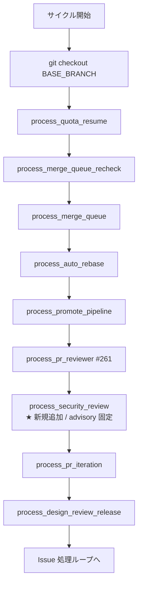
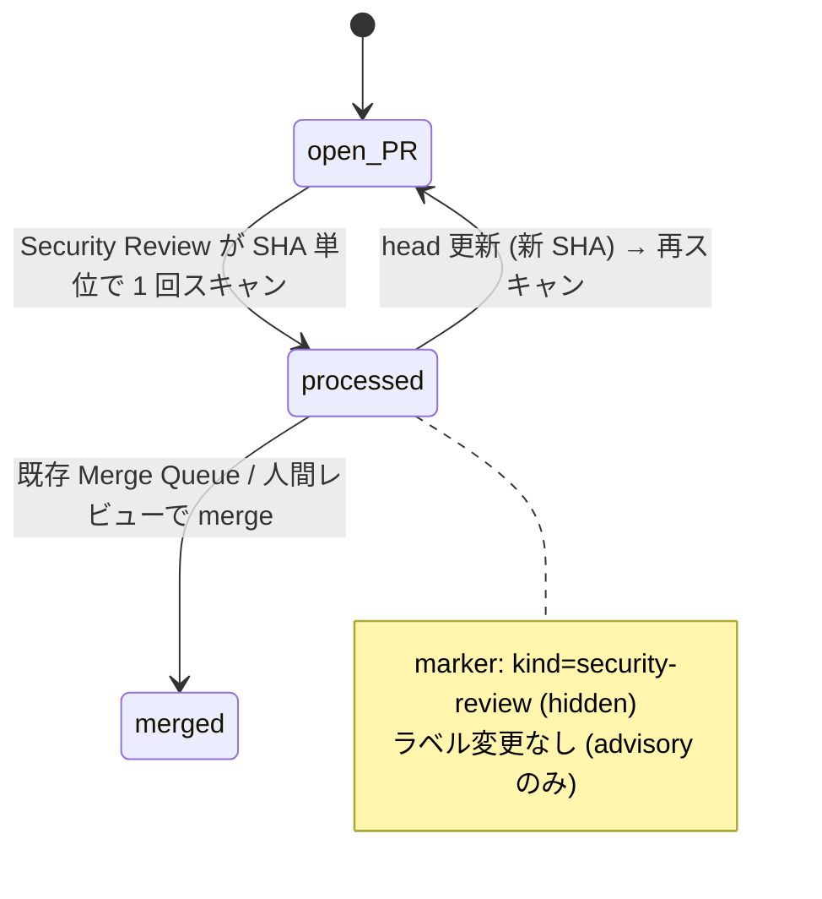

# Design Document

## Overview

**Purpose**: 本機能は Claude Code 公式の `/security-review` skill を用いた PR diff の
セキュリティ検査工程を、idd-claude の無人 auto-dev パイプライン内に挿入する。検査結果は
PR コメントとして残し、運用者が PR 上で目視確認できる形にすることで、現状 Reviewer が
構造上守備範囲外としている injection / secret leak / 認証認可不備 / XSS / 依存脆弱性
クラスの検出機会を補完する。

**Users**: idd-claude を運用する idd-claude 運用者が対象。事前に `claude` CLI が watcher
実行環境（cron / launchd ユーザー）の PATH 上にインストール・認証済みであることを前提とし、
watcher 起動 env に `SECURITY_REVIEW_ENABLED=true` を追加することで本機能が opt-in 起動する。

**Impact**: 既存 watcher の Phase A / PR Reviewer / PR Iteration / Design Review Release
プロセッサ群に **Security Review Processor** を新規追加する。本機能は **完全 opt-in
（既定 `SECURITY_REVIEW_ENABLED=false`）**とし、未設定 / `false` / `0` / `True` 等の
typo を含むあらゆる状態で本機能導入前と byte 等価な観測挙動を維持する（NFR 1.1）。既存
env var 名・既定値・ラベル遷移契約・exit code 意味・cron 登録文字列は一切変更しない。

### Goals

- 既存 processor チェーンに **opt-in 1 段** だけを追加し、未有効化リポジトリでは挙動を
  変えない（後方互換性 / NFR 1.1）
- Claude Code 公式の `/security-review` skill を `claude` CLI headless 起動で間接呼び出し、
  PR diff を検査入力として 1 PR あたり 1 回スキャンする（公式仕様上 `-p` モードでは slash
  command 直接実行は不可のため、**タスク記述 prompt + Skill tool 経由起動**の経路を採用する。
  詳細は後述「Components and Interfaces → CLI 起動契約」節を参照）
- スキャン実行モデル既定値を `claude-opus-4-8` とする（運用者が `SECURITY_REVIEW_MODEL` env
  で他モデルへ override 可能）
- 検出結果を PR コメントとして残し、hidden HTML marker による同一 SHA 重複防止を担保する
- **検出ゼロ件時もクリーンである旨を明示するコメントを 1 回投稿**する（Req 3.3 確定）
- 検出結果の構造化アーティファクト `security-notes.md` を、対応する spec ディレクトリ
  （`docs/specs/<番号>-<slug>/`）配下に書き出す（Req 3.5 確定）
- 本 spec では **advisory 固定**で実装（マージブロック動作なし）。strict 拡張は **別 Issue
  として分割**し、本 spec では env 予約も実装も行わない（PR レビュー #280 で確定）
- 既存 Reviewer 3 カテゴリ判定・PR Iteration ループ・Merge Queue・PR Reviewer Processor
  (#261) と完全独立で動作する（責務分離 / Requirement 4）

### Non-Goals

- 公式 `claude-code-security-review` GitHub Action 経路 (#279 Open Questions 経路 a) の
  採用 — local-watcher が idd-claude の主経路のため、watcher headless 経路に統一する
- strict モード（severity 閾値によるマージブロック）の実装 — 本 spec では env 予約も行わず、
  **別 Issue #281 として段階導入する**
- 新規ラベル追加 — advisory 固定のため `needs-iteration` 等のマージブロック系ラベルは
  付与しない（既存 `.github/scripts/idd-claude-labels.sh` に変更を入れない）
- サードパーティ製スキャナ統合 / 検出脆弱性の auto-fix / テレメトリ自動収集 / 既存 PR
  への遡及スキャン（requirements.md Out of Scope と同一）
- 既存 Reviewer / PR Reviewer Processor (#261) / PR Iteration Processor (#26) の判定論理
  改変

---

## Architecture

### Existing Architecture Analysis

idd-claude の watcher は、`issue-watcher.sh` 本体（dispatcher）と `local-watcher/bin/modules/*.sh`
の per-processor モジュール（`source` で同一プロセスに同期ロード）で構成されている。
既存の典型パターンは以下:

- **env var**: 本体冒頭 Config ブロックで `${VAR:-default}` 形式で既定値解決
  （`PR_REVIEWER_ENABLED="${PR_REVIEWER_ENABLED:-false}"` 等。opt-in 機能は明示的に
  `:-false`、デフォルト有効機能は `:-true` + `_idd_flag` 正規化ループに参加）
- **モジュール source**: `REQUIRED_MODULES` 配列に追加 → for ループで読み込み（順序は機能的に
  任意・bash 遅延束縛）
- **dispatcher call site**: 本体の処理順序を温存する位置に
  `process_<name> || <ns>_warn "..."` 形式で 1 行配置（fail-continue）
- **logger**: `core_utils.sh` に `<ns>_log` / `<ns>_warn` / `<ns>_error` を集約
  （時刻 + `[$REPO]` + processor prefix 3 段）
- **opt-in gate**: `process_<name>()` 関数冒頭で `[ "$VAR" != "true" ] && return 0` 早期 return
- **重複防止 marker**: `pr-reviewer.sh` が
  `<!-- idd-claude:pr-reviewer sha=<sha> kind=<kind> tool=<tool> -->` 形式を確立済み
  （`gh api .../issues/<n>/comments` + `jq test()` で検出 / #261）
- **flock 境界**: PR Reviewer / PR Iteration / Design Review Release 等は単一 flock 内で
  直列実行（`exec 200>"$LOCK_FILE"` 後）

本機能はこのパターンを **完全踏襲** し、新規規約・新ライブラリは導入しない。

**尊重すべきドメイン境界**:

- 既存 Reviewer の 3 カテゴリ判定（missing AC / missing test / boundary 逸脱）・
  `review-notes.md` / `RESULT: approve|reject` 判定論理に介入しない（Requirement 4）
- PR Reviewer Processor (#261) の `needs-iteration` 付与 → PR Iteration Processor (#26) の
  反復対応経路に介入しない
- `merge-queue` / `auto-rebase` / `design-review-release` 等の他 processor のラベル操作
  領域に触らない
- `core_utils.sh` の既存公開関数・ロガー群は変更しない（新規 `sec_*` ロガー 3 関数のみ追加）

**維持すべき統合点**:

- `gh pr list` / `gh api /repos/.../issues/<n>/comments` / `gh pr comment` の既存利用パターン
- 既存定数（`BASE_BRANCH` / `REPO` / `LABEL_*` 群）の名前・意味・既定値
- `PR_REVIEWER_HEAD_PATTERN` の慣習（既定 `^claude/`）に準じた head ブランチ判定

**解消・回避する technical debt**: なし（新規モジュール追加のため既存 debt に手を入れない）。

### Architecture Pattern & Boundary Map

**Architecture Integration**:

- **採用パターン**: 既存 per-processor module pattern（Modular Monolith / Pipes-and-Filters
  の cron tick 内サイクル）
- **ドメイン／機能境界**: Security Review Processor は「`claude` CLI headless 起動による
  `/security-review` 実行 → 結果コメント投稿」までを **単一責務** として担当。マージ
  ブロックや反復対応は他 processor の責務領域として侵害しない
- **既存パターンの維持**: opt-in env gate / source 経由のモジュールロード / logger 3 段 prefix /
  hidden HTML marker / fail-continue dispatcher / flock 境界
- **新規コンポーネントの根拠**: 新規外部呼び出し（`claude -p '/security-review'`）と独立した
  state（`kind=security-review` marker）が必要なため、既存 processor のいずれにも組み込めない。
  特に PR Reviewer Processor (#261) は `codex` / `agy` を呼ぶ排他経路を持つため、内部分岐
  ではなく独立 processor として分離する

**実行順序の配置（dispatcher 内）**:



**配置根拠**:

- **PR Reviewer Processor (#261) の直後** に配置する。PR Reviewer は `needs-iteration`
  付与を行う場合があるが、Security Review は advisory（ラベル操作なし）のため両者は
  ラベル状態の競合を起こさない。実行順は「外部 AI コードレビュー → セキュリティレビュー
  → iteration 反復」となり、人間レビュアーが PR タイムライン上で同じ SHA に対する両所見を
  時系列順に確認できる
- **PR Iteration Processor (#26) の直前** に配置することで、本 processor の結果コメントを
  iteration ループへ持ち込まない（advisory 固定のため iteration を起こすキーワードは
  発しない）。将来 strict 拡張を別 Issue で導入した際の `needs-iteration` 接続点としても
  本配置を維持する
- 失敗時は `|| sec_warn "..."` で吸収し後続 processor を阻害しない（既存 fail-continue 規約）

### ラベル状態機械上の位置づけ



advisory 固定動作では PR の `needs-iteration` / `needs-rebase` / `ready-for-review` 等の
**既存ラベル状態に一切介入しない**。`processed` は marker 由来の論理状態であり、ラベル
としては可視化しない（NFR 1.1 既存ラベル遷移契約の不変性）。strict 拡張（別 Issue）導入時
は本図に severity 閾値ベースのラベル付与遷移が追加される予定だが、本 spec のスコープでは
登場しない。

### Technology Stack

| Layer | Choice / Version | Role in Feature | Notes |
|-------|------------------|-----------------|-------|
| Frontend / CLI | bash 4+ | watcher 本体 / モジュール実装 | 既存と同じ |
| Backend / Services | GitHub REST/CLI (`gh` 2.x) | PR 列挙 / コメント投稿 / 既存コメント取得 | 既存と同じ |
| Data / Storage | なし（state は PR コメントの hidden marker のみ） | SHA 単位の重複防止判定 | per-Issue 永続 state を持たない |
| Messaging / Events | cron tick / flock 境界内の直列実行 | 既存 processor チェーンと同じ flock 境界 | 並列化なし |
| Infrastructure / Runtime | watcher host PATH 上の `claude` CLI (Claude Code) | 運用者が事前準備（既存前提ツール）| 既に必須ツール集合に含まれる |
| Security Skill | Claude Code `/security-review` skill | PR diff のセキュリティ検査本体 | `claude` CLI に内蔵 / 別ランタイム不要（NFR 2.1） |
| Tooling: jq | 1.6+ | gh JSON / コメント本文の HTML marker 検出 | 既存と同じ |
| Static Analysis | `shellcheck` | NFR 5.1 警告ゼロ | 既存 `.shellcheckrc` の info 級抑止を踏襲 |

---

## File Structure Plan

### Directory Structure（既存ツリーへの追加）

```
local-watcher/bin/
├── issue-watcher.sh                 # ★ 編集: Config ブロック追記 + REQUIRED_MODULES 追記 + dispatcher call site 1 行追加
└── modules/
    ├── core_utils.sh                # ★ 編集: sec_log / sec_warn / sec_error の 3 関数を追加（pr_log と同形式）
    ├── pr-reviewer.sh               # 不変
    ├── pr-iteration.sh              # 不変
    ├── merge-queue.sh               # 不変
    ├── auto-rebase.sh               # 不変
    ├── promote-pipeline.sh          # 不変
    ├── quota-aware.sh               # 不変
    ├── scaffolding-health.sh        # 不変
    ├── stage-a-verify.sh            # 不変
    ├── run-summary.sh               # 不変
    └── security-review.sh           # ★ 新規: Security Review Processor 本体

docs/specs/279-feat-watcher-security-review-opt-in-pr-d/
├── requirements.md                  # PM 確定済み（PR #280 round 1 で AC 更新）
├── design.md                        # ★ 本ファイル
└── tasks.md                         # ★ 同時生成

docs/specs/<対象 Issue 番号>-<slug>/
└── security-notes.md                # ★ 実行時生成: 本機能の runtime 成果物（Req 3.5）
                                     #    本 spec 自身のディレクトリには配置せず、各対象 PR の
                                     #    spec ディレクトリ配下に runtime で書き出す

README.md                            # ★ 編集: 「オプション機能一覧（opt-in）」表に 1 行追加 + 新規「Security Review Processor (#279)」節を追加
```

### Modified Files（詳細）

- `local-watcher/bin/modules/security-review.sh`（**新規**）— Security Review Processor の
  関数群を集約。`issue-watcher.sh` から `source` される前提（単体起動しない）。
  `set -euo pipefail` は本体側で宣言済みのため宣言しない（既存モジュールと同じ）
- `local-watcher/bin/modules/core_utils.sh`（**編集**）— 既存 `pr_log` / `pi_log` / `mq_log`
  等と同形式で `sec_log` / `sec_warn` / `sec_error` の 3 関数を末尾に追記（他関数は変更しない）
- `local-watcher/bin/issue-watcher.sh`（**編集**）— 以下 3 箇所のみ:
  1. **Config ブロック**: 既存 `# ─── PR Reviewer Processor 設定 (#261) ───` 節の **後** に
     新規 `# ─── Security Review Processor 設定 (#279) ───` 節を追加し、後述 env var 群を
     `${VAR:-default}` 形式で解決
  2. **REQUIRED_MODULES 配列**: `"security-review.sh"` を末尾に追加（順序は機能的任意）
  3. **dispatcher call site**: 既存
     `process_pr_reviewer || pr_warn "..."` の **直後** に
     `process_security_review || sec_warn "process_security_review が想定外のエラーで終了しました（後続 Issue 処理は継続）"`
     を 1 行追加
- `README.md`（**編集**）— 以下 2 箇所:
  1. 「オプション機能一覧」§ の opt-in 表に `SECURITY_REVIEW_ENABLED` 行を追加
  2. 新規 h2 セクション「Security Review Processor (#279)」を `## PR Reviewer Processor (#261)`
     の **後** に挿入。env var 一覧（既定値・正規化規則）/ 動作フロー / 重複防止 marker /
     利用例 cron 行 / 既知の制約（advisory のみ・strict 後続）を記載
- **編集対象外**:
  - `.github/scripts/idd-claude-labels.sh` — 新規ラベル追加なし（advisory モードのみのため）
  - `.claude/agents/*.md` / `.claude/rules/*.md` / `repo-template/.claude/{agents,rules}/*.md`
    — agent / rule 規約を変更しないため二重管理整合（NFR 7）は構造的に不要
  - `install.sh` — 新規モジュール追加は既存の `local-watcher/bin/modules/` 一括配置ロジックで
    自動的に拾われる（install.sh 本体への変更不要）
  - 既存 `pr-reviewer.sh` / `pr-iteration.sh` / その他 processor — 不変

---

## Requirements Traceability

| Requirement | Summary | Components | Interfaces | Flows |
|-------------|---------|------------|------------|-------|
| 1.1 | `SECURITY_REVIEW_ENABLED!=true` で全スキップ | `process_security_review` 早期 return | log のみ | 1 |
| 1.2 | `=true` 時に後続を実行 | `process_security_review` 本体 | dispatcher 呼び出し | 1 |
| 1.3 | 他 processor に副作用なし | dispatcher fail-continue + 独立 marker kind | 既存 \|\| pr_warn 等と同型 | 1 |
| 1.4 | 未設定時に 1 行のスキップ理由をログ | `process_security_review` 早期 return path で `sec_log` | log | 1 |
| 2.1 | 対象 = open + `^claude/issue-` 命名規約 + 非 fork | `sec_fetch_candidate_prs` | `gh pr list` + jq | 2 |
| 2.2 | PR diff を 1 回スキャン | `sec_run_review_for_pr` 内の `sec_execute_security_review` | `claude -p '/security-review'` headless | 3 |
| 2.3 | draft 除外 | `sec_fetch_candidate_prs` server + client 二重防御 | `--search "-draft:true"` + jq | 2 |
| 2.4 | 同一 SHA は冪等 skip | `sec_already_processed` + `kind=security-review` marker | jq 検索 | 4 |
| 2.5 | 上限件数で truncate + ログ | `process_security_review` MAX_PRS truncate ループ | log | 2 |
| 2.6 | スキャン失敗 → エラーコメント + 中止 | `sec_post_error_comment` `kind=scan-failed` | hidden marker | 3 |
| 3.1 | 検出 1 件以上で結果コメント投稿 | `sec_post_review_comment` `kind=security-review` | `gh pr comment` | 3 |
| 3.2 | 見出し + severity + 修正方針相当 | 内蔵 default prompt の出力規約 + `sec_post_review_comment` | コメント本文 | 3 |
| 3.3 | 検出 0 件は「クリーンである旨」コメントを 1 回投稿 | `sec_run_review_for_pr` 0 件分岐 → `sec_post_clean_comment` | hidden marker `kind=security-review-clean` | 3 |
| 3.4 | コメント本文に SHA marker 埋め込み | `sec_build_marker` | `<!-- idd-claude:security-review sha=... -->` | 4 |
| 3.5 | `security-notes.md` を spec ディレクトリ配下に書き出し | `sec_write_security_notes` + spec dir 解決 | ファイル書き出し `docs/specs/<番号>-<slug>/security-notes.md` | 3 |
| 4.1 | Reviewer の判定対象カテゴリを追加・変更・削除しない | 本機能は Reviewer agent を起動しない / `review-notes.md` を読み書きしない | — | — |
| 4.2 | `review-notes.md` 内容・`RESULT:` 行に介入しない | Components の責務分離 / 編集対象に `review-notes.md` を含めない | — | — |
| 4.3 | 自身の結果のみでコメント / ラベル判断 | `process_security_review` の独立判定 | — | 3 |
| 4.4 | 自身の失敗を Reviewer 判定に反映しない | dispatcher fail-continue / Reviewer は別 stage で起動 | — | — |
| 5.1 | advisory 固定でマージ阻害ラベル付与しない | `process_security_review` advisory 固定経路 | コメント投稿 + security-notes.md 書き出しのみ | 3 |
| 5.2 | advisory 固定 + strict 未実装をログ記録 | `sec_log "mode=advisory strict=not-implemented (#280-split)"` | log | 1 |
| 5.3 | strict 要求 env が来ても WARN + advisory fallback | `sec_check_strict_request` WARN ループ | log | 1 |
| 6.1 | コメント本文に SHA marker 埋め込み | `sec_build_marker` | 3.4 と同じ | 4 |
| 6.2 | 既存マーカーあり → 同種コメント / スキャン skip | `sec_already_processed` | jq 検索 | 4 |
| 6.3 | SHA 更新で新規実行 | marker は SHA 単位 | gh pr list の headRefOid | 4 |
| 6.4 | hidden HTML コメント形式 | `sec_build_marker` 出力 | `<!-- idd-claude:security-review sha=... kind=... -->` | 4 |
| NFR 1.1 | 未有効化時に既存挙動と byte 等価 | `process_security_review` 早期 return + Config の `${VAR:-default}` | 全体 | — |
| NFR 1.2 | 既存 env var 名・既定値を変更しない | 既存 Config ブロック編集禁止（追加のみ） | — | — |
| NFR 1.3 | 既存 cron / launchd 登録文字列を変更しない | watcher CLI args / env 解決順を変更しない | — | — |
| NFR 2.1 | 新規ランタイム追加なし | `claude` CLI のみ使用（既存必須ツール） | — | — |
| NFR 2.2 | 既存 CLI 集合内で動作 | `gh` / `jq` / `git` / `claude` のみ | — | — |
| NFR 2.3 | 最小 PATH 解決で動作 | 既存 watcher の PATH prepend を踏襲 | — | — |
| NFR 3.1 | 分岐点のログ記録 | `sec_log` / `sec_warn` の網羅 | log | 全 |
| NFR 4.1 | 同一 PR 同一 SHA は副作用 1 回のみ | hidden marker による idempotency | 4 と同じ | 4 |
| NFR 5.1 | shellcheck 警告ゼロ | 既存 `.shellcheckrc` 踏襲 | — | — |
| NFR 6.1 | README に env var / 既定値 / 挙動を明記 | README 編集タスク | — | — |
| NFR 6.2 | 同一 PR 内で README / 該当 rule を同時更新 | tasks.md task 5 で同 PR 内に含める | — | — |
| NFR 7.1 | agents / rules を編集する場合に root と repo-template の両方を byte 一致更新 | 本機能では **編集しない設計**（NFR 7 適用回避） | — | — |
| NFR 7.2 | `diff -r` で空であることを確認 | 編集しないため自明に空（既存 diff 状態を破壊しない） | — | — |

**Flow 番号凡例**:

1. opt-in / mode 解決 gate
2. 候補 PR 列挙
3. スキャン実行 → 結果コメント投稿
4. 重複防止判定（marker）

---

## Components and Interfaces

### Module: `security-review.sh`

#### Component: Security Review Processor（モジュール全体）

| Field | Detail |
|-------|--------|
| Intent | `SECURITY_REVIEW_ENABLED=true` 時に open PR 集合に対し `claude -p '/security-review'` を実行し、検出結果を PR コメントとして投稿する |
| Requirements | 1.1〜1.4, 2.1〜2.6, 3.1〜3.5, 4.1〜4.4, 5.1〜5.5, 6.1〜6.4, NFR 1.1〜7.2 |

**Responsibilities & Constraints**

- 主責務: `claude` CLI による `/security-review` 起動・結果コメント投稿・SHA 単位の重複防止
- ドメイン境界: Reviewer 3 カテゴリ判定・PR Reviewer (#261) `needs-iteration` 付与・
  PR Iteration 反復経路・Merge Queue 操作に一切介入しない
- データ所有権:
  - hidden HTML marker
    `<!-- idd-claude:security-review sha=<oid> kind=<security-review|security-review-clean|scan-failed> -->`
    が本 processor の PR 永続 state
  - `security-notes.md`（spec ディレクトリが特定できた PR で書き出し）が本 processor の
    repo 内永続成果物。同一 SHA の重複書き出しは header に SHA 行を含めて idempotent に判定
- invariants:
  - 同一 PR + 同一 `headRefOid` + 同一 `kind` に対して副作用（PR コメント投稿 /
    `security-notes.md` 書き出し）は **1 回のみ**
  - workspace の変更は `security-notes.md` の書き出しのみに限定し、その他のファイル変更は
    禁止する（subshell + EXIT trap で `BASE_BRANCH` 復帰 / `--permission-mode plan` で
    Claude 側 write 系を禁止 / 実行後 `git status --porcelain` 検査）
  - 既存 PR ラベルに一切触らない（advisory 固定）

**Dependencies**

- Inbound: `issue-watcher.sh` dispatcher（`process_security_review` 呼び出し）— Criticality: high
- Outbound: `gh` CLI（PR 列挙 / コメント / コメント検索）— Criticality: high
- Outbound: `git` CLI（fetch / checkout）— Criticality: high
- Outbound: `jq`（JSON 整形 / コメント本文走査）— Criticality: high
- External: `claude` CLI（既存必須ツール、Security Review skill `/security-review` 内蔵）—
  Criticality: high（未インストール時は watcher 起動自体が既存 prerequisite check で失敗）
- Internal: `core_utils.sh` の `sec_log` / `sec_warn` / `sec_error`（同 PR で新規追加）

**Contracts**: Service [x] / API [ ] / Event [ ] / Batch [x] / State [x]

##### Service Interface（公開関数シグネチャ）

```bash
# エントリ関数: dispatcher から呼ばれる
# 入力: なし（env var 群を読む）
# 出力: なし（log のみ）
# 戻り値: 0 固定（後続 processor を阻害しないため / dispatcher fail-continue 契約）
# AC: 1.1, 1.2, 1.3, 1.4, 2.1, 2.5, 5.1, 5.5
process_security_review()

# strict 要求 env の有無を確認し、WARN のみ出して advisory 固定で続行
# 入力: env $SECURITY_REVIEW_MODE / $SECURITY_REVIEW_STRICT 等の関連 env
# 出力: stdout に常に "advisory" を 1 行
# 戻り値: 0 固定
# AC: 5.1, 5.2, 5.3
# 備考: strict 拡張は別 Issue で実装するため、本関数は strict 値が来ても sec_warn で
#       「strict は本 spec 未実装 → 別 Issue #N へ」を 1 行出して advisory に倒す
sec_check_strict_request()

# 候補 PR を JSON 配列で返す（open + 非 draft + head pattern 一致 + 非 fork）
# 出力: stdout に jq 配列 JSON 1 行（候補なし / 失敗時は "[]"）
# 戻り値: 0 固定（失敗は degraded path = "[]" + WARN）
# AC: 2.1, 2.3, NFR 3.1
sec_fetch_candidate_prs()

# 1 PR 分のスキャンを統括
# 入力: $1 = pr_json (sec_fetch_candidate_prs の単一要素)
# 戻り値: 0 = success / 1 = failure (transient) / 2 = skip (重複) / 3 = scan-error
# AC: 2.2, 2.4, 2.6, 3.1, 3.2, 3.3, 3.4, 3.5, 6.1〜6.4
# 分岐:
#   - 検出 >= 1 件 → sec_post_review_comment + sec_write_security_notes
#   - 検出 0 件   → sec_post_clean_comment + sec_write_security_notes (件数 0 と記録)
#   - エラー系   → sec_post_error_comment
sec_run_review_for_pr()

# 重複防止 marker の既存判定
# 入力: $1 = pr_number, $2 = sha, $3 = kind
# 戻り値: 0 = 既存 (skip) / 1 = 未存在 (continue)
# AC: 2.4, 6.2, 6.3, NFR 4.1
sec_already_processed()

# hidden HTML marker 構築
# 入力: $1 = sha, $2 = kind ("security-review" | "security-review-clean" | "scan-failed")
# 出力: stdout に marker 文字列 (末尾改行なし)
# AC: 3.4, 6.1, 6.4
# 形式: <!-- idd-claude:security-review sha=<sha> kind=<kind> -->
sec_build_marker()

# `claude` headless 実行（PR head を checkout した状態で /security-review を起動）
# 入力: $1 = head_ref, $2 = base_ref, $3 = pr_number, $4 = out_file, $5 = err_file,
#       $6 = result_file
# 出力: out_file へ stdout / err_file へ stderr / result_file へ実行結果トークン
# 戻り値: 0 固定（結果判定は result_file 経由）
# AC: 2.2, 2.6
#
# result_file に書き出すトークン:
#   - fetch-fail        : git fetch 失敗（一時的、コメント投稿しない）
#   - checkout-fail     : git checkout 失敗（同上）
#   - ran:<rc>:clean    : 実行完了、ワークツリー変更なし
#   - ran:<rc>:modified : 実行完了したがワークツリー変更（read-only invariant 違反）
sec_execute_security_review()

# 結果コメントを投稿（hidden marker 付き、kind=security-review）
# 入力: $1 = pr_number, $2 = sha, $3 = review_text
# 戻り値: 0 = ok / 1 = 投稿失敗
# AC: 3.1, 3.2, 3.4, 6.1, 6.4
sec_post_review_comment()

# クリーンである旨のコメントを投稿（hidden marker 付き、kind=security-review-clean）
# 入力: $1 = pr_number, $2 = sha
# 戻り値: 0 = ok / 1 = 投稿失敗
# AC: 3.3, 3.4, 6.1, 6.4
# 投稿内容: 「## セキュリティレビュー結果: クリーン」見出し + 1〜2 行の本文
#           （検出 0 件・モデル名・skill 名）+ hidden marker
sec_post_clean_comment()

# エラーコメントを投稿（hidden marker 付き、重複判定 sec_already_processed 経由）
# 入力: $1 = pr_number, $2 = sha, $3 = kind, $4 = detail
# 戻り値: 0 = ok（重複 skip 含む）/ 1 = 投稿失敗
# AC: 2.6, 6.1, 6.2, 6.4
sec_post_error_comment()

# security-notes.md を spec ディレクトリ配下に書き出す
# 入力: $1 = pr_number, $2 = sha, $3 = spec_dir, $4 = finding_count, $5 = severity_summary,
#       $6 = review_text
# 戻り値: 0 = ok（spec_dir 不明時の skip 含む）/ 1 = 書き出し失敗
# AC: 3.5, NFR 4.1
# 仕様:
#   - $3 が空文字 / ディレクトリ不在 → WARN 1 行 + return 0（skip 安全側）
#   - 既存ファイルに同一 SHA の "Last SHA: <oid>" ヘッダー行があれば idempotent skip
#   - フォーマット: H1 タイトル + Last SHA / Last Run timestamp / Finding Count /
#     Severity Summary 表 / Findings 本文（review_text をそのまま貼り付け）
sec_write_security_notes()

# PR から spec ディレクトリを解決
# 入力: $1 = pr_branch (例: claude/issue-279-design-feat-watcher-security-review-opt-in-pr-d)
# 出力: stdout に spec ディレクトリ絶対パス、または空文字（特定不可時）
# 戻り値: 0 固定
# AC: 3.5
# 解決順序:
#   1. ブランチ名から issue 番号を抽出 (`^claude/issue-(\d+)-` の \1)
#   2. `docs/specs/<番号>-*/` を glob し、1 件に絞り込めれば採用
#   3. 2 件以上または 0 件 → 空文字（書き出し skip）
sec_resolve_spec_dir()
```

##### CLI 起動契約（`/security-review` を Skill tool 経由で起動）

**公式仕様の制約**: Claude Code の公式 headless ドキュメント
（<https://code.claude.com/docs/en/headless>）は明確に「user-invoked skills like
`/code-review` and built-in commands are only available in interactive mode. In `-p` mode,
describe the task you want to accomplish instead.」と記載しており、`claude -p
'/security-review'` のような **slash command 直接実行は `-p` モードでは無効**である。

一方、2026 年初の Claude Code 更新で「The model can now discover and invoke built-in
slash commands like `/init`, `/review`, and `/security-review` via the Skill tool」と
告知されており、**プロンプト本文でタスクを記述し Skill tool 経由で `/security-review`
を呼び出させる経路**は `-p` モードでも有効である。

本 spec はこの **タスク記述プロンプト経由経路**を primary 起動方式として採用する。

```bash
# 既定値（issue-watcher.sh Config ブロック）
SECURITY_REVIEW_PROMPT="${SECURITY_REVIEW_PROMPT:-Use the /security-review skill to analyze the PR diff between origin/${BASE_BRANCH:-main} and HEAD for security vulnerabilities (injection / secret leak / auth bypass / XSS / dependency CVE 等). Report findings as markdown with severity (critical/high/medium/low/info) and concrete remediation. If no issues are found, output exactly the line: SECURITY_REVIEW_CLEAN.}"

SECURITY_REVIEW_CLAUDE_CMD="${SECURITY_REVIEW_CLAUDE_CMD:-claude -p \"\$SECURITY_REVIEW_PROMPT\" \
  --output-format text \
  --max-turns ${SECURITY_REVIEW_MAX_TURNS:-30} \
  --model ${SECURITY_REVIEW_MODEL:-claude-opus-4-8} \
  --permission-mode plan}"
```

**起動経路の合理性**:

- `Use the /security-review skill` を prompt 本文に含めることで、Claude Code 内部の Skill
  tool による built-in slash command 起動が誘発され、`/security-review` の skill
  body（`docs.claude.com` の `claude-code-security-review` リポジトリ由来 prompt 本体）が
  実行される
- 検出 0 件時に `SECURITY_REVIEW_CLEAN` センチネル行を出力させる prompt 規約を組み込み、
  `sec_run_review_for_pr` がこの行の有無で clean / non-clean 分岐を行う（出力スキーマに
  依存しない単純判定 / Open Questions の `/security-review` 出力スキーマ依存問題を
  軽減）
- 公式仕様変更で Skill tool 経由起動が無効化された場合や、運用者が代替プロンプトを
  使いたい場合は `SECURITY_REVIEW_PROMPT` または `SECURITY_REVIEW_CLAUDE_CMD` env で
  override 可能（NFR 2.2 既存 CLI 集合内で吸収）

**実装時の補強事項**（Developer が `impl-notes.md` に記録する）:

- `claude --help` の実出力で `-p` / `--output-format text` / `--model claude-opus-4-8` /
  `--permission-mode plan` / `--max-turns` の引数形式と互換性を確認
- `--allowedTools` は明示指定せず Claude Code 既定 policy に委ねる（write 系の阻止は
  `--permission-mode plan` で達成。実行後の `git status --porcelain` 検査で二重防御）
- Skill tool が `/security-review` を発見できないケース（Claude Code バージョン古い /
  skill が未配布等）の判定: 出力中に `SECURITY_REVIEW_CLEAN` も検出項目見出しも一切
  現れない / 出力が短すぎる（< 100 文字）等のヒューリスティックで `kind=scan-failed`
  に倒す（`sec_run_review_for_pr` 内）

**モデル選択（`claude-opus-4-8` 既定）**:

- セキュリティ判断は false positive / false negative の境界が微妙で、reasoning 能力が
  検出品質に直結するため、Opus 系（`claude-opus-4-8` 既定）を採用する
- 運用者が cost を抑えたい場合は `SECURITY_REVIEW_MODEL=claude-sonnet-4-6` 等への override
  経路を残す（既存 Triage / Developer の env override パターンを踏襲）

##### State / Marker Contract

```
<!-- idd-claude:security-review sha=<headRefOid> kind=<security-review|security-review-clean|scan-failed> -->
```

- `sha`: PR の `headRefOid`（hex SHA-1 / SHA-256）
- `kind`: `security-review`（検出 ≥ 1 件の結果コメント）/ `security-review-clean`（検出 0 件
  クリーンコメント、Req 3.3）/ `scan-failed`（エラーコメント）
- 既存 `pr-reviewer` の marker (`idd-claude:pr-reviewer ...`) と prefix が異なるため
  名前空間が分離され、相互干渉しない（jq の test() pattern も独立）

---

## Data Models

### Domain Model

- **Aggregate boundary**: 1 PR + 1 SHA + 1 `kind` 単位で副作用を 1 回に保つ（NFR 4.1）
- **Entity**: PR (`pr_number`, `headRefOid`, `headRefName`, `baseRefName`, `isDraft`,
  `headRepositoryOwner.login`)。`gh pr list --json` から取得し本 processor では永続化しない
- **Value Object**: Marker (`sha`, `kind`)。HTML コメント文字列としてシリアライズ
- **Domain Event**: なし（cron tick 内サイクルで状態遷移を完結させ、event store を持たない）

### Logical Data Model

- **PR コメント**: GitHub 側に保管。本 processor は read（`gh api .../comments`）と
  append（`gh pr comment`）のみを行う。既存コメントの edit / delete は行わない
- **`security-notes.md`**: 対象 PR の spec ディレクトリ配下に書き出される markdown ファイル
  （`docs/specs/<番号>-<slug>/security-notes.md`）。本 processor が write 権限を持つ
  唯一のファイル。重複書き出し防止のため先頭付近の `Last SHA: <oid>` ヘッダー行で
  idempotent 判定する（同一 SHA なら overwrite skip）
- **環境変数**: cron / launchd 由来。bash プロセス内のメモリのみで保持し永続化しない

### Physical Storage

- **PR コメントの hidden marker**: 本機能の主たる永続 state（GitHub PR コメント）
- **`security-notes.md`**: 対象 PR ブランチの spec ディレクトリ配下（ローカル checkout
  対象内）。idd-claude が次回 PR push 時に commit に乗せて配信することを想定するが、本
  spec の Security Review Processor 自身は `git add` / `git commit` / `git push` を行わない
  （Developer / Iteration 等の既存フローによる commit 経路に委ねる）

### `security-notes.md` フォーマット

```markdown
# Security Review Notes

<!-- idd-claude:security-notes pr=<number> sha=<oid> -->

- Last SHA: <oid>
- Last Run: <ISO-8601 timestamp>
- Model: <claude-opus-4-8 等>
- Skill: /security-review
- Finding Count: <N>

## Severity Summary

| Severity | Count |
|---|---|
| Critical | <n> |
| High | <n> |
| Medium | <n> |
| Low | <n> |
| Info | <n> |

## Findings

<review_text 本体をそのまま貼り付け。0 件の場合は「クリーン」見出し + 1〜2 行>
```

- 既存 `Last SHA: <oid>` が同一であれば overwrite を skip（NFR 4.1 idempotency）
- 次回 SHA 更新で全体 overwrite（差分追記ではなく単一スナップショット運用）

---

## Error Handling

### Error Strategy

- **Layered approach**: (a) ツール健全性（`claude` CLI 存在）は既存 watcher 冒頭の
  prerequisite check に委譲、(b) サイクル単位の dispatcher fail-continue で後続 processor を
  阻害しない、(c) PR 単位のエラーは PR コメント (`kind=scan-failed`) で運用者に通知し
  silent fail を作らない
- **Idempotency**: エラーコメントも hidden marker (`kind=scan-failed`) で重複防止し、同一 SHA
  でリトライしてもコメントが累積しない。SHA が更新されれば marker 不一致で再実行される
- **Graceful degradation**: gh API / git 操作の一時的失敗は WARN + skip に倒し、次サイクルで
  再評価される（self-healing）

### Error Categories and Responses

| Category | Trigger | Response | Marker kind |
|---|---|---|---|
| Opt-in 未有効化 | `SECURITY_REVIEW_ENABLED != "true"` | 1 行ログ後 `return 0` 早期 return | — |
| 候補 PR ゼロ件 | `sec_fetch_candidate_prs` が `[]` 返却 | サマリログのみ | — |
| 候補取得失敗 | `gh pr list` timeout / エラー | WARN + degraded path `[]` 採用 | — |
| 重複 SHA | `sec_already_processed` が 0 返却 | サイクル skip ログ後 `return 2` | — |
| git fetch / checkout 失敗 | 一時的な git/gh 障害 | WARN + skip（コメント投稿しない） | — |
| スキャン非ゼロ終了 | `claude -p "..."` 実行 rc != 0 | `kind=scan-failed` エラーコメント投稿 + 中止 | scan-failed |
| ワークツリー変更検出 | 実行後 `git status --porcelain` が `security-notes.md` 以外の変更を検出 | `git checkout -- .` で破棄（`security-notes.md` 除く）+ `kind=scan-failed`（read-only invariant 違反） | scan-failed |
| スキャン出力空 | rc=0 だが stdout 空、もしくは Skill tool 経由起動が失敗したヒューリスティック判定 | `kind=scan-failed`（空出力 / skill 起動失敗）+ 中止 | scan-failed |
| 検出 0 件（クリーン） | 出力末尾に `SECURITY_REVIEW_CLEAN` センチネル行 / または検出見出し 0 件 | `sec_post_clean_comment` 投稿 + `sec_write_security_notes` を件数 0 で書き出し | security-review-clean |
| 上限件数超過 | `sec_total > SECURITY_REVIEW_MAX_PRS` | 上限まで処理 + 残件数をログ記録 | — |
| spec ディレクトリ特定不可 | ブランチ名から issue 番号抽出不可 / `docs/specs/<番号>-*/` が 0 件または 2 件以上 | `sec_write_security_notes` を skip + WARN 1 行（PR コメントには影響なし） | — |
| `security-notes.md` 書き出し失敗 | ファイル書き出しで write エラー | WARN 1 行 + コメント投稿は通常どおり実施（書き出し失敗は PR コメント側を阻害しない） | — |

### Logging Coverage（NFR 3.1）

下記分岐点を `sec_log` / `sec_warn` のいずれかで出力する:

- opt-in スキップ理由（未設定 / `=false` / typo）
- strict 要求検出時の WARN（`strict は本 spec 未実装、別 Issue 待ち`）
- サイクル開始時の 1 行サマリ（`mode=advisory max_prs=N git_timeout=Ns exec_timeout=Ns head_pattern=... model=claude-opus-4-8`）
- 候補 PR 件数（total / target / overflow）
- 各 PR の処理開始（`pr=N head=... base=... sha=...`）
- draft 除外 / 重複 SHA 検出 / スキャン実行開始 / スキャン rc / 検出件数 /
  クリーン判定（`SECURITY_REVIEW_CLEAN` センチネル検出有無）/ コメント投稿
  （`kind=security-review` または `kind=security-review-clean`）/ エラー投稿
- `security-notes.md` 書き出し結果（成功 / skip = spec dir 不明 / skip = idempotent /
  failure）
- サイクル終了時のサマリ（`reviewed=N clean=N skip=N fail=N errored=N overflow=N notes_written=N notes_skipped=N`）

---

## Security Considerations

- **Headless CLI 起動の防御的設計**:
  - `eval` を使わず `bash -c "$resolved_cmd"` で subshell に閉じ込める（既存 #261 の
    Decision 9 を踏襲）
  - GitHub 由来の値（branch 名 / PR 番号）に shell metacharacter
    （`;` `|` `&` `` ` `` `$(`）が混入していないか実行前に検査し、検出時は WARN + skip
    （`pr_substitute_placeholders` 同型の実装）
- **read-only invariant**:
  - `--permission-mode plan` で write 系ツールの実行を Claude 側でブロック
  - 実行後 `git status --porcelain` で workspace 変更を検査、検出時は `git checkout -- .` で
    tracked 変更を破棄（`git clean` は使わず `.antigravitycli/` 等の運用ツール生成物を
    巻き込まない）
  - subshell の EXIT trap で必ず `BASE_BRANCH` へ復帰
- **fork PR の除外**: `headRepositoryOwner.login == owner` を client-side でフィルタし、
  信頼境界外のコード（外部 contributor の fork）を `claude` CLI に渡さない（既存 #261
  `pr_fetch_candidate_prs` と同じ運用前提）
- **コメント本文の sanitize**: `claude` 出力は markdown としてそのまま PR コメントに投稿する。
  内部に `</details>` 等が含まれていても GitHub 側の markdown sanitization に委ね、本機能で
  特別な sanitize は行わない（既存 #261 と同じ運用）

---

## Performance & Scalability

- **1 PR あたりの実行コスト**: `claude` headless 起動 1 回 + 周辺 git/gh 数回。`SECURITY_REVIEW_EXEC_TIMEOUT`
  既定 600 秒で上限を設ける（既存 `PR_REVIEWER_EXEC_TIMEOUT` と同値）
- **1 サイクルあたりの上限**: `SECURITY_REVIEW_MAX_PRS` 既定 `5`（#261 と同値）。超過分は
  次サイクルへ持ち越す（cron 間隔 */2 分なら大半の repo で実用上問題なし）
- **並列化**: なし。同一 flock 境界内で直列実行（既存 processor チェーンの規約踏襲）
- **コスト管理**: `claude` の quota 消費は既存 Quota-Aware Watcher (#66) と独立に発生する
  （Security Review は別 stage として観測される）。quota 不足時は claude CLI 側で失敗し
  `scan-failed` コメントを投稿する degraded path に落ちる

---

## Testing Strategy

### Unit Tests（モジュール関数単位）

- `sec_build_marker` の出力形式（hex SHA / kind 3 種 [`security-review` /
  `security-review-clean` / `scan-failed`] で正しい HTML コメント文字列を生成）
- `sec_check_strict_request` の WARN 経路（`SECURITY_REVIEW_MODE=strict` / 未設定 / 不正値
  → 常に advisory を stdout 出力）
- `sec_fetch_candidate_prs` の draft / fork / head pattern フィルタ（jq 単体での挙動）
- `sec_already_processed` の jq pattern が `sha` + `kind` の AND 一致のみ true を返す（kind
  3 値すべて）
- `sec_resolve_spec_dir` のブランチ→ spec dir 解決（1 件マッチ / 0 件 / 2 件以上の境界）
- `sec_write_security_notes` の idempotency（`Last SHA: <oid>` 一致時 overwrite skip）
- shell metacharacter 検査（`;` `|` `&` ` ``` ` `$(` を含む値で skip 判定）

### Integration Tests（モジュール間連携）

- opt-in OFF (`SECURITY_REVIEW_ENABLED` 未設定) → `process_security_review` が即 return 0
  し、watcher の他の処理が本機能導入前と byte 等価に動く（NFR 1.1）
- 候補 PR 0 件 → サマリログ 1 行のみで終了、コメント投稿なし
- 検出 ≥ 1 件 → `kind=security-review` コメント + `security-notes.md` 書き出し
- 検出 0 件（`SECURITY_REVIEW_CLEAN` センチネル検出）→ `kind=security-review-clean`
  コメント + `security-notes.md` を Finding Count 0 で書き出し
- 同一 SHA 2 回呼び出し → 2 回目は marker 検出で skip（NFR 4.1 idempotency）。
  `security-notes.md` 側も `Last SHA:` ヘッダー一致で overwrite skip
- `claude` 実行 timeout → `kind=scan-failed` コメント投稿 + 後続 processor 続行
- ワークツリー変更検出（`security-notes.md` 以外）→ `git checkout -- .` で破棄 +
  `kind=scan-failed` 投稿
- spec ディレクトリ特定不可（ブランチ名から issue 番号抽出不可 / `docs/specs/<番号>-*/`
  が 0 件） → `security-notes.md` 書き出し skip + WARN、PR コメントは通常投稿

### Static Analysis

- `shellcheck local-watcher/bin/modules/security-review.sh local-watcher/bin/modules/core_utils.sh local-watcher/bin/issue-watcher.sh`
  が警告ゼロで終了（既存 `.shellcheckrc` の `SC2317` / `SC2012` accepted baseline を踏襲、NFR 5.1）

### E2E（手動スモーク）

- 本リポジトリに test issue + 小さな PR を立て、watcher 起動 env に
  `SECURITY_REVIEW_ENABLED=true` を渡して `kind=security-review` コメントが 1 回投稿される
  ことを確認
- 同じ PR で `SECURITY_REVIEW_ENABLED` を外して watcher を再実行し、本機能由来の追加副作用
  （新規コメント / ラベル変化）が発生しないこと（後方互換性）
- README の cron 例をコピーして `claude` CLI 未認証環境で起動し、エラーコメント
  （`kind=scan-failed`）が PR に 1 回だけ投稿され重複しないこと（idempotency）

---

## Environment Variables（新規追加分）

| env var | 既定値 | 用途 |
|---|---|---|
| `SECURITY_REVIEW_ENABLED` | `false` | 本機能の opt-in gate。`=true` 厳密一致のみ有効 |
| `SECURITY_REVIEW_PROMPT` | （前述「CLI 起動契約」節のタスク記述プロンプト本文） | `claude -p` に渡すプロンプト本文（Skill tool 経由 `/security-review` 起動を誘発する文字列） |
| `SECURITY_REVIEW_CLAUDE_CMD` | `claude -p "$SECURITY_REVIEW_PROMPT" --output-format text --max-turns ${SECURITY_REVIEW_MAX_TURNS} --model ${SECURITY_REVIEW_MODEL} --permission-mode plan` | スキャン実行コマンドテンプレート（プレースホルダ展開後 `bash -c` で実行） |
| `SECURITY_REVIEW_MODEL` | `claude-opus-4-8` | `claude` CLI に渡す `--model` 値（PR #280 round 1 で `claude-opus-4-7` から更新） |
| `SECURITY_REVIEW_MAX_TURNS` | `30` | `claude` CLI に渡す `--max-turns` 値 |
| `SECURITY_REVIEW_HEAD_PATTERN` | `^claude/issue-` | 対象 head ブランチ pattern (POSIX ERE) |
| `SECURITY_REVIEW_MAX_PRS` | `5` | 1 サイクルあたりの処理上限 |
| `SECURITY_REVIEW_GIT_TIMEOUT` | `120` | git / gh 各操作の個別 timeout（秒） |
| `SECURITY_REVIEW_EXEC_TIMEOUT` | `600` | スキャン実行コマンドの最大経過秒数 |

**strict 関連 env は本 spec では実装しない**: `SECURITY_REVIEW_MODE` / `SECURITY_REVIEW_BLOCK_SEVERITY` /
`SECURITY_REVIEW_BLOCK_LABEL` 等の env 名は **別 Issue（strict 拡張）で確定**。本 spec の
`sec_check_strict_request` は env 名のうち `SECURITY_REVIEW_MODE` / `SECURITY_REVIEW_STRICT` が
`advisory` 以外で渡された場合に WARN 1 行で「strict は別 Issue で実装予定」を記録した上で
advisory 固定の挙動を保つ（Req 5.3 確定）。

既存 env var (`REPO` / `REPO_DIR` / `BASE_BRANCH` / `PR_REVIEWER_*` / `PR_ITERATION_*` /
`MERGE_QUEUE_*` / `LABEL_*` / `TRIAGE_*` / `DEV_*` 等) は **一切変更しない**（NFR 1.2）。

---

## Supporting References

- **Claude Code 公式 headless ドキュメント**: <https://code.claude.com/docs/en/headless>
  「user-invoked skills like `/code-review` and built-in commands are only available in
  interactive mode. In `-p` mode, describe the task you want to accomplish instead.」
  → 本 spec の **タスク記述プロンプト + Skill tool 経由起動** 採用の根拠（PR #280 round 1
  で Web 検索により確認）
- **2026 年 Claude Code 更新**: 「The model can now discover and invoke built-in slash
  commands like `/init`, `/review`, and `/security-review` via the Skill tool.」
  → headless `-p` モードでも prompt 本文で `/security-review` を依頼すれば Skill tool 経由
  で起動できる根拠（PR #280 round 1 で Web 検索により確認）
- **公式 `claude-code-security-review` GitHub Action**:
  <https://github.com/anthropics/claude-code-security-review> — `/security-review` slash
  command と同等の解析能力を提供する公式実装。本 spec ではこの Action 経路を Non-Goals
  としつつ、`/security-review` skill が指す内部仕様の参考として参照
- `claude` CLI の headless 起動仕様（`-p` / `--output-format` / `--max-turns` /
  `--permission-mode` / `--model`）: 既存 watcher の Triage / Developer 起動コードで実証済みの
  flag 集合と整合させる。詳細仕様の細部は実装時に `claude --help` の出力で確定し
  `impl-notes.md` に記録
- 既存 PR Reviewer Processor (#261): `docs/specs/261-feat-pr-codex-antigravity/design.md`
  の per-processor module pattern / hidden HTML marker 規約 / fail-continue dispatcher /
  read-only invariant 検査を本 spec が踏襲
- **strict 拡張は別 Issue #281**: 本 PR #280 round 1 のレビューで strict モード
  （severity 閾値ベースのマージ阻害ラベル付与）の実装を別 Issue として分割することが確定。
  本 spec では strict 関連 env / 閾値 / ラベル名は規定せず、advisory 固定で実装する。
  Issue #281: <https://github.com/hitoshiichikawa/idd-claude/issues/281>
