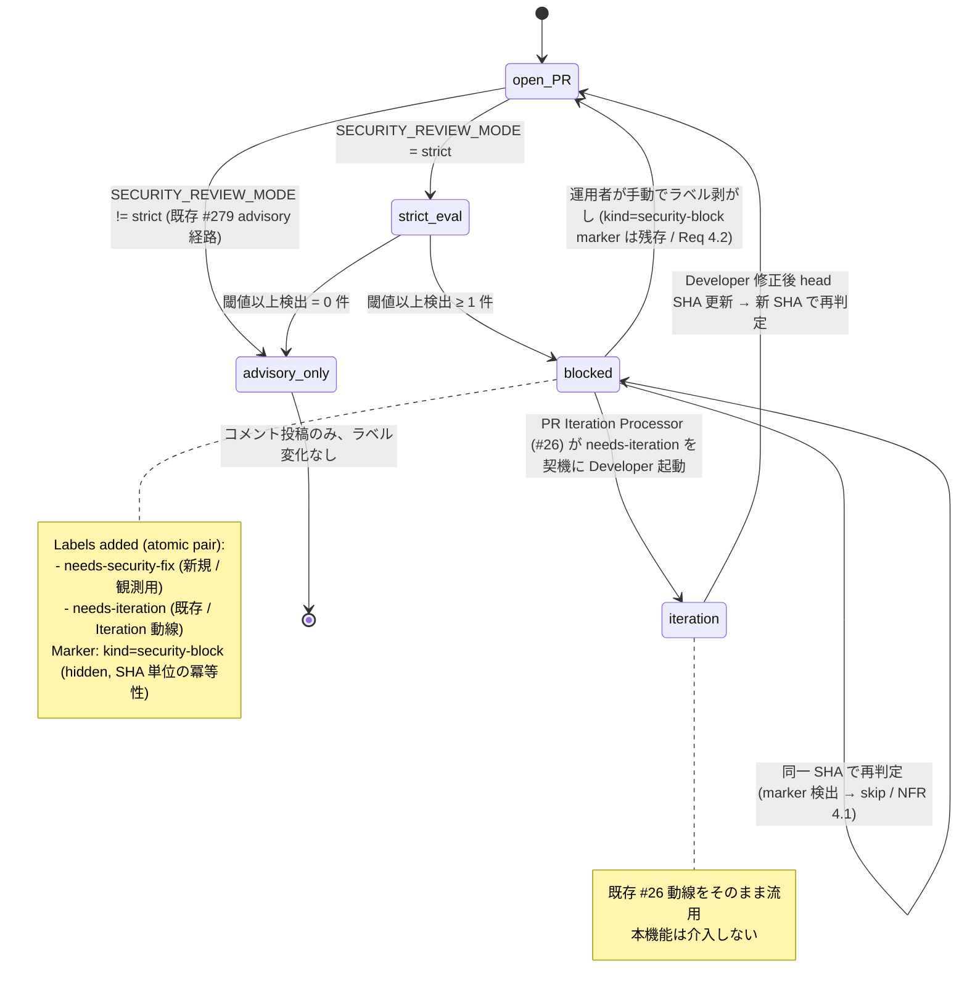

# Design Document

## Overview

**Purpose**: Issue #279 / PR #280 で導入された Security Review Processor は advisory 固定
（PR コメント投稿のみ・マージ阻害なし）として実装されている。本機能はその上に **strict
モード**を追加し、`/security-review` の出力から抽出した severity が運用者指定の閾値以上で
ある検出項目が 1 件以上見つかった PR に対し、**マージ阻害ラベル（`needs-security-fix`）と
PR Iteration 動線連携ラベル（`needs-iteration`）の 2 枚をペアで付与**することで、人間
レビュワー判断および既存 PR Iteration Processor (#26) 経由の自動反復対応に接続する。

**Users**: idd-claude を運用する idd-claude 運用者が対象。**完全 opt-in**（既定
`SECURITY_REVIEW_MODE=advisory`）で、未設定 / `advisory` / 不正値（typo を含む）では
#279 advisory 実装と byte 等価な観測挙動を維持する（NFR 1.1）。strict 化は cron / launchd
env に `SECURITY_REVIEW_MODE=strict` を追加するだけで段階導入できる。

**Impact**: 既存 #279 Security Review Processor モジュール内に **severity 閾値比較 →
ラベル付与判定 → 2 枚ペアのラベル付与**経路を 1 段追加する。新規モジュールは作らない。
新規ラベル `needs-security-fix` を `.github/scripts/idd-claude-labels.sh` に追加する
（既存ラベルは一切変更しない）。`needs-iteration` は既存ラベルをそのまま流用するため
PR Iteration Processor (#26) の候補抽出条件・処理ロジックは一切変更しない。既存
Reviewer 3 カテゴリ判定・PR Reviewer Processor (#261)・Merge Queue・既存 env var 名・
既定値・cron 登録文字列・exit code 意味は一切変更しない（NFR 1.2, 1.3）。

### Goals

- 既存 #279 advisory 動作を base case として保持し、`SECURITY_REVIEW_MODE=strict` 明示時
  のみ severity 閾値ベースのラベル付与を実行する（後方互換性 / NFR 1.1）
- severity 閾値の env 化（既定 `high`）により、リポジトリ特性に応じて検出感度を調整可能
  にする（Req 2）
- マージ阻害ラベル付与時のコメント本文に override 手順（手動でラベル剥がし）を明示し、
  false positive 時の運用者最終判断を尊重する（Req 4.5）
- 新規ラベル `needs-security-fix` で監査・観測可能性を担保しつつ、既存 `needs-iteration`
  ラベルをペア付与することで PR Iteration Processor (#26) の反復対応動線にそのまま流す
  （Req 4.4）
- severity 抽出は #279 で既に存在する `sec_count_severities` を再利用し、新規 parse
  ロジックを追加しない（実装コスト最小化 / Req 5.1）
- SHA 単位の冪等性（既存 #279 hidden marker 規約）を 2 枚ラベル付与にも適用（Req 4.2, NFR 4）

### Non-Goals

- 検出脆弱性に対する auto-fix コミット生成（#279 と同一）
- severity 閾値の動的調整・A/B テスト・ユーザー属性別出し分け
- サードパーティ製スキャナの統合 / `/security-review` 自体の差し替え
- 既存 Reviewer 3 カテゴリ判定（missing AC / missing test / boundary 逸脱）の拡張
- セキュリティ検出結果のテレメトリ自動収集・外部送信
- branch protection ルール経由のマージブロック強制（本機能はラベル付与までを責務とし、
  branch protection 設定は運用者領域）
- false positive の機械学習的抑止・自動 dismissal（運用者の手動ラベル剥がしのみ）
- PR Iteration Processor (#26) の処理ロジック・候補抽出条件の変更（既存 `needs-iteration`
  動線をそのまま流用するため、`pr-iteration.sh` には一切手を入れない）
- PR Reviewer Processor (#261) と Security Review Processor の判定統合（両者は独立 processor
  として残し、本機能では PR Reviewer 側に手を入れない）

---

## Architecture

### Existing Architecture Analysis

#279 で導入された `modules/security-review.sh` は以下の構造を持つ:

- `process_security_review` が dispatcher entrypoint。opt-in gate → strict 検出 →
  候補列挙 → 各 PR loop（`sec_run_review_for_pr`）→ サマリログという定型フロー
- `sec_run_review_for_pr` が 1 PR 単位のスキャン統括。重複判定 → prompt 生成 → 実行 →
  出力分岐（clean / non-clean / scan-error）→ コメント投稿 + `security-notes.md` 書き出し
- `sec_check_strict_request` は `SECURITY_REVIEW_MODE` を受け付けるインタフェースを既に
  持っているが、現実装は「strict 要求が来ても WARN + advisory 固定」の safe-fallback で
  ある（#279 で意図的な dead-code として配置）
- `sec_count_severities` は review_text から severity 別件数（critical/high/medium/low/info/total）
  を集計し、`severity-summary` 表に既に書き出している（#279 task 3 で実装済み）
- hidden HTML marker 規約 `<!-- idd-claude:security-review sha=<sha> kind=<kind> -->` で
  SHA 単位の重複判定を確立済み。kind は `security-review` / `security-review-clean` /
  `scan-failed` の 3 値を既に運用

本機能はこれらの既存資産を **再利用**し、新規モジュール / 新規 parse ロジック / 新規
規約を追加しない。

**尊重すべきドメイン境界**:

- PR Iteration Processor (#26) は `needs-iteration` ラベルを契機に Developer agent を fresh
  context で起動し、PR コメントを参照して反復対応する。本機能が `needs-iteration` を付与
  しても、Iteration 側は既存のとおり PR コメント（含む本機能の `kind=security-review`
  コメント）を読んで対応するため、Iteration 側の変更は不要。本機能は Iteration の挙動・
  候補抽出条件・処理ロジックに介入しない（Req 6.4, NFR 1.1）
- PR Reviewer Processor (#261) の `needs-iteration` 付与経路（VERDICT 検出由来）と本機能の
  `needs-iteration` 付与経路（severity 閾値超過由来）は **同一ラベルを共有**するが、PR
  Iteration Processor から見れば付与経路の区別は不要（どちらの由来でも Developer agent
  を起動して PR コメントを読ませる動線で対応可能）。観測可能性は本機能側の hidden marker
  `kind=security-block` で担保
- Reviewer agent の 3 カテゴリ判定・`review-notes.md` 内容・`RESULT: approve|reject` 判定
  ロジックには介入しない（Req 6.2, 6.3）

**維持すべき統合点**:

- `gh pr list` / `gh api .../comments` / `gh pr comment` / `gh pr edit --add-label` の既存
  利用パターン
- 既存定数（`BASE_BRANCH` / `REPO` / `LABEL_*` 群 / `SECURITY_REVIEW_*` 既存 env 群）の
  名前・意味・既定値（NFR 1.2）
- #279 で確立した hidden marker 名前空間（`idd-claude:security-review`）

**解消・回避する technical debt**: 

- `sec_check_strict_request` の dead-code 化（#279 で「strict 要求 env が来ても advisory
  fallback」と配置された関数）を本機能で活性化する。これは debt 解消というより **計画的な
  段階導入**（#280 round 1 で確定した「strict は別 Issue #281 で実装」方針）の完了段階。

### Architecture Pattern & Boundary Map

**Architecture Integration**:

- **採用パターン**: 既存 per-processor module pattern（`modules/security-review.sh` 単一
  モジュール内で完結）。新規モジュール / 新規 source 経路の追加なし
- **ドメイン境界**: Security Review Processor の責務領域内（severity 閾値判定 + ラベル
  付与）に限定。PR Iteration / PR Reviewer / Reviewer / Merge Queue の各 processor
  には一切介入しない
- **既存パターンの維持**:
  - opt-in env gate（`SECURITY_REVIEW_MODE != "strict"` で advisory base case）
  - source 経由のモジュールロード（既存）
  - logger 3 段 prefix（`sec_log` / `sec_warn` / `sec_error` 既存）
  - hidden HTML marker（`kind=security-block` を 4 つ目の kind として追加）
  - fail-continue dispatcher（既存 `process_security_review || sec_warn ...` をそのまま使用）
- **新規コンポーネントの根拠**: 既存モジュール内に **関数 4 つの追加**で完結する。新規
  モジュール作成・新規 source 経路は不要

### dispatcher 内の実行順序（変化なし）

#279 で確立した実行順序を維持する:

```
process_quota_resume
  → process_merge_queue_recheck
  → process_merge_queue
  → process_auto_rebase
  → process_promote_pipeline
  → process_pr_reviewer (#261)
  → process_security_review ← 本機能はこのモジュール内で 1 段追加（strict 経路）
  → process_pr_iteration (#26)
  → process_design_review_release
  → Issue 処理ループ
```

**配置根拠**:

- 本機能は `process_security_review` 内で完結するため dispatcher の配置順序は変えない
- `process_pr_iteration` の **前** に `process_security_review` が走るため、同一サイクル内
  で `needs-iteration` が付与されても **当該サイクルで Iteration が走る**ことになる。
  これは要件上望ましい動作（重大な脆弱性が検出されたら即座に修正動線へ）。ただし
  Iteration の round カウンタ管理（`pi_read_round_counter` 等）は PR Iteration Processor
  の既存仕様で扱われ、本機能は介入しない

### ラベル状態機械上の位置づけ



**境界の不変性**:

- `advisory_only` 経路は #279 と byte 等価（NFR 1.1）
- `iteration` への遷移は PR Iteration Processor (#26) の既存ロジックがそのまま処理する
- 運用者が `needs-security-fix` のみを剥がして `needs-iteration` を残した場合 → PR
  Iteration が起動するが本機能由来であることは marker から判別可能。逆も同様。両方剥がせば
  完全 override（Req 4.1）

### Technology Stack

| Layer | Choice / Version | Role in Feature | Notes |
|-------|------------------|-----------------|-------|
| Frontend / CLI | bash 4+ | watcher 本体 / モジュール実装 | 既存と同じ |
| Backend / Services | GitHub REST/CLI (`gh` 2.x) | PR 列挙 / コメント投稿 / **ラベル付与（新規 `--add-label` 使用）** | 既存と同じ CLI、`--add-label` flag は既存 `pr_add_iteration_label` で実証済み |
| Data / Storage | なし（state は PR コメントの hidden marker `kind=security-block`） | SHA 単位の重複防止判定 | per-Issue 永続 state を持たない |
| Messaging / Events | cron tick / flock 境界内の直列実行 | 既存 processor チェーンと同じ flock 境界 | 並列化なし |
| Infrastructure / Runtime | watcher host PATH 上の `claude` CLI | 既存 #279 と同じ前提 | 追加ランタイム不要（NFR 2.1） |
| Security Skill | Claude Code `/security-review` skill | #279 と同じ（severity 抽出は既存 `sec_count_severities` を流用） | 別ランタイム不要 |
| Tooling: jq | 1.6+ | gh JSON / コメント本文 marker 検出 / labels 配列走査 | 既存と同じ |
| GitHub Labels | `.github/scripts/idd-claude-labels.sh` | 新規ラベル `needs-security-fix` を追加 | 既存ラベルは変更しない |
| Static Analysis | `shellcheck` | NFR 5.1 警告ゼロ | 既存 `.shellcheckrc` ベースライン踏襲 |

---

## File Structure Plan

### Directory Structure（既存ツリーへの追加・編集）

```
local-watcher/bin/
├── issue-watcher.sh                 # ★ 編集: Config ブロックに SECURITY_REVIEW_BLOCK_SEVERITY / SECURITY_REVIEW_BLOCK_LABEL env 追加（dispatcher 配線・REQUIRED_MODULES は変更なし）
└── modules/
    ├── core_utils.sh                # 不変（既存 sec_log / sec_warn / sec_error を流用）
    ├── pr-reviewer.sh               # 不変
    ├── pr-iteration.sh              # 不変（既存 needs-iteration 動線をそのまま流用）
    ├── merge-queue.sh               # 不変
    ├── auto-rebase.sh               # 不変
    ├── promote-pipeline.sh          # 不変
    ├── quota-aware.sh               # 不変
    ├── scaffolding-health.sh        # 不変
    ├── stage-a-verify.sh            # 不変
    ├── run-summary.sh               # 不変
    └── security-review.sh           # ★ 編集: strict 経路 + severity 閾値判定 + ラベル付与関数群を追加
                                     #         （既存 advisory 経路 / 関数群は変更しない）

.github/scripts/
└── idd-claude-labels.sh             # ★ 編集: LABELS 配列末尾に "needs-security-fix" 行を追加

docs/specs/281-feat-watcher-security-review-processor-s/
├── requirements.md                  # PM 確定済み
├── design.md                        # ★ 本ファイル
└── tasks.md                         # ★ 同時生成

README.md                            # ★ 編集: 「Security Review Processor (#279)」節に strict モード説明を追加 + 「オプション機能一覧」表に SECURITY_REVIEW_MODE / SECURITY_REVIEW_BLOCK_SEVERITY 行を追加
```

### Modified Files（詳細）

- `local-watcher/bin/modules/security-review.sh`（**編集**）:
  - 既存 `sec_check_strict_request` の挙動を変更（advisory fallback → 実際の mode 解決）
  - 新規 `sec_resolve_block_severity` 関数を追加（severity 閾値 env の解決 + 不正値 fallback）
  - 新規 `sec_severity_at_or_above` 関数を追加（severity ordinal 比較ヘルパ）
  - 新規 `sec_count_blocking_findings` 関数を追加（既存 `sec_count_severities` 出力から閾値
    以上件数を合算）
  - 新規 `sec_apply_block_labels` 関数を追加（`--add-label` で 2 枚ペア付与 + override 手順
    コメント追記）
  - `sec_run_review_for_pr` の strict 経路に severity 判定 → ラベル付与の枝を追加
  - `process_security_review` 開始時のサマリログに mode / threshold を追記
  - 既存 advisory 経路（mode=advisory 時の動作）には一切手を入れない（NFR 1.1）

- `local-watcher/bin/issue-watcher.sh`（**編集**）:
  - 既存「`# ─── Security Review Processor 設定 (#279) ───`」節の **末尾**に env 変数 2 つを
    追加（`SECURITY_REVIEW_BLOCK_SEVERITY` / `SECURITY_REVIEW_BLOCK_LABEL`）
  - 既存 `SECURITY_REVIEW_MODE` env は **新規に Config ブロックへ宣言追加**する（#279 では
    Config ブロックに置かず関数内で直接読んでいたため、観測しやすさのために明示宣言）。
    既定値は `advisory`。これは #279 の挙動と byte 等価（未設定環境では `advisory` 解釈）
  - 既存 dispatcher call site / REQUIRED_MODULES / 他 Config 節は変更しない

- `.github/scripts/idd-claude-labels.sh`（**編集**）:
  - LABELS 配列末尾に
    `"needs-security-fix|d73a4a|【PR 用】 Security Review strict モード（#281）で severity 閾値以上の検出により付与される。手動剥がしで override 可"`
    を追加（color `d73a4a` は `st-failed` と同色の "critical red"、PR 用ラベルとして
    description に prefix を入れる既存規約踏襲）
  - 既存ラベル定義は一切変更しない（NFR 1.2）

- `README.md`（**編集**）:
  - 「Security Review Processor (#279)」節内の「既知の制約 - strict 拡張は別 Issue として
    分割済み」表記を撤去し、「strict モード（#281）」サブ節を追加
  - 「オプション機能一覧」§ に `SECURITY_REVIEW_MODE`（既定 `advisory`）/
    `SECURITY_REVIEW_BLOCK_SEVERITY`（既定 `high`）行を追加
  - 新規ラベル `needs-security-fix` の追加に伴う `bash .github/scripts/idd-claude-labels.sh
    --force` 再実行手順を migration note として追加

- **編集対象外**:
  - `local-watcher/bin/modules/pr-iteration.sh` — PR Iteration Processor は既存 `needs-iteration`
    動線をそのまま使うため不変（Req 6.4, NFR 1.1）
  - `local-watcher/bin/modules/pr-reviewer.sh` — #261 PR Reviewer Processor も不変
  - `local-watcher/bin/modules/core_utils.sh` — `sec_log` / `sec_warn` / `sec_error` は既存
    定義をそのまま使用
  - `.claude/agents/*.md` / `.claude/rules/*.md` / `repo-template/.claude/{agents,rules}/*.md`
    — agent / rule 規約を変更しないため二重管理整合（NFR 7）は構造的に不要
  - `install.sh` / `setup.sh` — モジュール / Config 追加のみで配置経路に変更なし

---

## Requirements Traceability

| Requirement | Summary | Components | Interfaces | Flows |
|-------------|---------|------------|------------|-------|
| 1.1 | `SECURITY_REVIEW_MODE != strict` で advisory 解釈 | `sec_check_strict_request` 戻り値判定 | env 読み出し | 1 |
| 1.2 | `=strict` 厳密一致で strict 解釈 + ラベル付与判定実行 | `sec_check_strict_request` + `sec_run_review_for_pr` strict 経路 | 関数返り値 | 1 |
| 1.3 | mode 解決値をサイクルサマリログに 1 行記録 | `process_security_review` cycle start ログ | `sec_log` | 1 |
| 1.4 | 不正値 → WARN + advisory fallback | `sec_check_strict_request` 不正値経路 | `sec_warn` + 戻り値 | 1 |
| 1.5 | 既定値 advisory、未設定で #279 と byte 等価 | Config ブロック `${VAR:-advisory}` 解決 | env 読み出し | 1 |
| 2.1 | 閾値 env を critical/high/medium/low/info の 5 値に限定 | `sec_resolve_block_severity` 許容値テーブル | 関数返り値 | 1 |
| 2.2 | 閾値 env の既定 `high` | Config `${SECURITY_REVIEW_BLOCK_SEVERITY:-high}` | env 読み出し | 1 |
| 2.3 | 閾値以上 = ordinal 比較（critical > high > ...） | `sec_severity_at_or_above` ordinal map | 関数返り値 | 2 |
| 2.4 | 不正値 → WARN + 既定 `high` fallback | `sec_resolve_block_severity` 不正値経路 | `sec_warn` + 戻り値 | 1 |
| 2.5 | 解決された閾値値をサマリログに記録 | `process_security_review` cycle start ログ | `sec_log` | 1 |
| 3.1 | strict + 閾値以上 ≥ 1 件 → マージ阻害ラベル付与 | `sec_apply_block_labels` | `gh pr edit --add-label` | 3 |
| 3.2 | strict + 閾値以上 = 0 件 → ラベル無し、advisory と同等コメントのみ | `sec_run_review_for_pr` strict 0 件分岐 | 既存 `sec_post_review_comment` / `sec_post_clean_comment` | 3 |
| 3.3 | advisory モード時はラベル付与一切なし | `sec_run_review_for_pr` mode 分岐の advisory 経路 | スキップ | 3 |
| 3.4 | ラベル付与時も既存 #279 同等コメント + `security-notes.md` を併せて投稿 | `sec_run_review_for_pr` strict 経路: コメント投稿 → ラベル付与の順 | 既存 + 新規 | 3 |
| 3.5 | 判定結果（付与有無 / 件数 / 閾値以上件数 / 閾値値）を 1 行ログ | `sec_apply_block_labels` 内 / `sec_run_review_for_pr` 判定後 | `sec_log` | 3 |
| 3.6 | 既にラベル付与済みの SHA は再判定しない | `sec_already_processed` kind=security-block 検出 | jq 検索 | 4 |
| 4.1 | 手動ラベル剥がしで処理経路を override 可能 | `gh pr edit --remove-label` を GitHub UI から実行可能 | 運用者操作 | 4 |
| 4.2 | 手動剥がし後の同一 SHA に再付与しない | hidden marker `kind=security-block` で SHA 単位の冪等性 | jq 検索 | 4 |
| 4.3 | 新 SHA では新規判定 | marker は SHA 単位（既存規約） | gh pr list の headRefOid | 4 |
| 4.4 | PR Iteration Processor (#26) の動線に流すラベル運用 | `needs-iteration` を同時付与 | `gh pr edit --add-label "needs-security-fix,needs-iteration"` | 3 |
| 4.5 | ラベル付与コメント本文に override 手順を 1 行以上明示 | `sec_post_review_comment` の strict 時 body に override note 追加 | コメント本文 | 3 |
| 5.1 | severity 抽出手段を備える | 既存 `sec_count_severities` を流用 | grep ベース近似集計 | 2 |
| 5.2 | 閾値以上合算件数をラベル付与判定の入力にする | `sec_count_blocking_findings` | 関数返り値 | 2 |
| 5.3 | 抽出失敗 → ラベル付与せず安全側 advisory + 既存 `kind=scan-failed` 経路 | 既存 `sec_run_review_for_pr` の scan-failed 分岐をそのまま流用 | 既存 | 3 |
| 5.4 | severity 抽出結果を `security-notes.md` の Severity Summary 表に記録 | 既存 `sec_write_security_notes` に「閾値以上件数」「閾値値」行を追記 | ファイル書き出し | 3 |
| 6.1 | `SECURITY_REVIEW_MODE != strict` で #279 advisory と byte 等価 | `sec_run_review_for_pr` の mode 分岐 | 既存経路をそのまま流用 | 1 |
| 6.2 | Reviewer 3 カテゴリ判定に介入しない | 本機能は Reviewer agent を起動しない / `review-notes.md` を読み書きしない | — | — |
| 6.3 | Reviewer の `review-notes.md` / `RESULT:` 判定論理に介入しない | Components 責務分離 | — | — |
| 6.4 | PR Reviewer (#261) needs-iteration 動線 / Merge Queue / Auto Rebase / Design Review Release のラベル操作領域に介入しない | `pr-reviewer.sh` / `pr-iteration.sh` / `merge-queue.sh` 等を編集しない（File Structure Plan「編集対象外」参照） | — | — |
| NFR 1.1 | `SECURITY_REVIEW_MODE != strict` で本機能導入前 + #279 と byte 等価 | Config の `${VAR:-advisory}` + mode 分岐 | 全体 | 1 |
| NFR 1.2 | 既存 env var 名・既定値を変更しない | Config の追加のみ | — | — |
| NFR 1.3 | 既存 cron / launchd 登録文字列を変更しない | watcher CLI args / env 解決順を変更しない | — | — |
| NFR 2.1 | 新規ランタイム追加なし | bash + gh + jq + claude のみ | — | — |
| NFR 2.2 | 既存 CLI 集合内で動作 | `gh` / `jq` / `git` / `claude` のみ | — | — |
| NFR 3.1 | 主要分岐点をログ記録 | `sec_log` / `sec_warn` の網羅（後述「Logging Coverage」） | log | 全 |
| NFR 4.1 | 同一 PR 同一 SHA で副作用 1 回のみ | hidden marker `kind=security-block` による idempotency | jq 検索 | 4 |
| NFR 4.2 | 手動剥がし後の同一 SHA に再付与しない | marker は SHA 単位で残り続ける | jq 検索 | 4 |
| NFR 5.1 | shellcheck 警告ゼロ | 既存 `.shellcheckrc` ベースライン踏襲 | — | — |
| NFR 6.1 | README に env var / 既定値 / 挙動 / override 手順を明記 | README 編集タスク | — | — |
| NFR 6.2 | 同一 PR 内で README / 該当 rule を同時更新 | tasks.md task で同 PR に含める | — | — |
| NFR 7.1, 7.2 | agents / rules 編集なしで二重管理整合は構造的に不要 | 本機能では編集しない設計 | — | — |

**Flow 番号凡例**:

1. mode / 閾値の解決 gate
2. severity 抽出と閾値以上件数の合算
3. 閾値超過時のラベル付与 + コメント + notes 書き出し
4. 重複防止判定（marker）と override 経路

---

## Components and Interfaces

### Module: `security-review.sh`（編集）

#### Component: Strict Mode 経路（既存モジュール内に追加）

| Field | Detail |
|-------|--------|
| Intent | `SECURITY_REVIEW_MODE=strict` 時に severity 閾値以上の検出件数を判定し、1 件以上なら対象 PR に `needs-security-fix` + `needs-iteration` をペア付与する |
| Requirements | 1.1〜1.5, 2.1〜2.5, 3.1〜3.6, 4.1〜4.5, 5.1〜5.4, 6.1, NFR 1.1〜4.2 |

**Responsibilities & Constraints**

- 主責務: severity 閾値の解決・閾値以上件数の合算・ラベル付与判定・ラベル付与 API 呼び出し
- ドメイン境界:
  - 既存 advisory 経路には一切手を入れない（Req 6.1, NFR 1.1）
  - PR Iteration Processor (#26) の候補抽出条件・処理ロジックには介入しない（既存
    `needs-iteration` を共有するのみ）
  - Reviewer 3 カテゴリ判定・`review-notes.md` には介入しない
- データ所有権:
  - hidden marker `kind=security-block` が strict 経路の SHA 単位永続 state（既存 marker
    名前空間 `idd-claude:security-review` の 4 つ目の kind）
  - 既存 `security-notes.md` の Severity Summary 表に「Threshold」「Blocking Count」行を
    追記する（Req 5.4）
- invariants:
  - 同一 PR 同一 SHA に対して `needs-security-fix` / `needs-iteration` のペア付与・コメント
    投稿・marker 書き込みは **1 回のみ**（NFR 4.1）
  - mode != strict 時は本コンポーネントの全分岐が no-op となり、観測挙動が #279 と byte
    等価（NFR 1.1）
  - severity 抽出失敗時はラベル付与を行わず既存 `kind=scan-failed` 経路に倒す（Req 5.3）

**Dependencies**

- Inbound: 既存 `sec_run_review_for_pr` から strict 経路として呼ばれる — Criticality: high
- Outbound: `gh pr edit --add-label "needs-security-fix,needs-iteration"`（既存
  `pr_add_iteration_label` と同パターン）— Criticality: high
- Outbound: `gh pr comment` / `gh api .../comments`（既存 `sec_post_*_comment` /
  `sec_already_processed` を流用）— Criticality: high
- Internal: 既存 `sec_count_severities` / `sec_build_marker` / `sec_already_processed` /
  `sec_post_review_comment` / `sec_write_security_notes` を流用

**Contracts**: Service [x] / API [ ] / Event [ ] / Batch [x] / State [x]

##### Service Interface（新規追加関数シグネチャ）

```bash
# severity 閾値 env を解決し、許容値（critical/high/medium/low/info）に正規化する
# 入力: env $SECURITY_REVIEW_BLOCK_SEVERITY（未設定 / 空 / 不正値はすべて "high" に倒す）
# 出力: stdout に 5 値のいずれか 1 行（小文字 token）
# 戻り値: 0 固定
# AC: 2.1, 2.2, 2.4
# 副作用: 不正値検出時に sec_warn 1 行を stderr に出す
sec_resolve_block_severity()

# severity ordinal 比較ヘルパ: $1 が $2 と同等以上か判定
# 入力: $1 = severity1, $2 = threshold (どちらも小文字 5 値のいずれか)
# 出力: なし
# 戻り値: 0 = $1 >= $2 / 1 = $1 < $2 / 2 = 入力値不正
# ordinal map: critical=5, high=4, medium=3, low=2, info=1
# AC: 2.3
sec_severity_at_or_above()

# 既存 sec_count_severities の出力から閾値以上件数を合算する
# 入力: $1 = severity_summary（"critical=N high=N medium=N low=N info=N total=N" 形式）
#       $2 = threshold（5 値のいずれか）
# 出力: stdout に整数 1 行（閾値以上件数の合算）
# 戻り値: 0 固定（合算失敗時は "0" を出力して安全側に倒す）
# AC: 5.1, 5.2
sec_count_blocking_findings()

# 対象 PR に needs-security-fix + needs-iteration の 2 枚をペア付与する
# 入力: $1 = pr_number, $2 = sha, $3 = blocking_count, $4 = threshold
# 戻り値: 0 = ok（重複 skip 含む）/ 1 = 付与失敗
# AC: 3.1, 3.4, 3.5, 3.6, 4.4, NFR 4.1
# 内部処理:
#   1. sec_already_processed "$pr_number" "$sha" "security-block" で重複判定（Req 3.6）
#   2. 重複なら sec_log で skip 通知して return 0
#   3. gh pr edit --add-label "$SECURITY_REVIEW_BLOCK_LABEL,needs-iteration" で 1 コマンド
#      原子付与（PR Iteration Processor 動線に流す / Req 4.4）
#   4. hidden marker kind=security-block のコメントを 1 件投稿（重複防止 + 監査）
#   5. ラベル付与結果（blocking_count / threshold / 付与成否）を sec_log で 1 行記録（Req 3.5）
sec_apply_block_labels()
```

##### 既存関数の挙動変更（最小差分）

```bash
# sec_check_strict_request: 既存挙動を変更（#279 advisory fallback → 実際の mode 解決）
# 入力: env $SECURITY_REVIEW_MODE / $SECURITY_REVIEW_STRICT（後者は #279 で導入された
#       defensive env、deprecated alias として扱う）
# 出力: stdout に "advisory" または "strict" を 1 行
# 戻り値: 0 固定
# AC: 1.1, 1.2, 1.4, 1.5
#
# 解決順序:
#   1. $SECURITY_REVIEW_MODE が "strict" と完全一致 → "strict" を返す（Req 1.2）
#   2. $SECURITY_REVIEW_MODE が "advisory" と完全一致 / 未設定 / 空 → "advisory" を返す（Req 1.1, 1.5）
#   3. $SECURITY_REVIEW_MODE が上記 2 値以外（typo / 大文字混在 / 空白混入等）
#      → sec_warn 1 行（Req 1.4 不正値 fallback）+ "advisory" を返す
#   4. $SECURITY_REVIEW_STRICT が非空 → sec_warn 1 行（deprecated alias 通知）+ 既に Mode が
#      strict と解決済みなら strict 維持 / そうでなければ advisory（後方互換: #279 の挙動は
#      WARN のみで advisory 固定だった。strict に flip させないことで #279 ユーザの
#      "STRICT env を誤って set した状態" を sudden break しない）
#
# 後方互換ポイント:
#   - $SECURITY_REVIEW_MODE 未設定環境 → "advisory"（#279 と byte 等価 / NFR 1.1）
#   - $SECURITY_REVIEW_MODE=advisory 環境 → "advisory"（#279 と byte 等価）
#   - $SECURITY_REVIEW_MODE=strict 環境 → "strict"（#279 では advisory + WARN だったが、
#     Req 1.2 で本機能の AC として strict 解釈が明示されているため切替）
#   - $SECURITY_REVIEW_STRICT=anything 環境 → 引き続き "advisory" + WARN（#279 と byte 等価）

# sec_run_review_for_pr: 既存関数に strict 経路の枝を 1 段追加
# 既存 advisory 経路（成功時の `sec_post_review_comment` + `sec_write_security_notes`）の
# **直前**に以下を挿入:
#
#   if [ "$mode" = "strict" ] && [ "$total_findings" -gt 0 ]; then
#     local threshold blocking_count
#     threshold=$(sec_resolve_block_severity)
#     blocking_count=$(sec_count_blocking_findings "$severity_summary" "$threshold")
#     if [ "$blocking_count" -gt 0 ]; then
#       sec_log "PR #${pr_number}: strict 判定 blocking=${blocking_count} threshold=${threshold}"
#       sec_apply_block_labels "$pr_number" "$sha" "$blocking_count" "$threshold" || true
#     else
#       sec_log "PR #${pr_number}: strict 判定 blocking=0 threshold=${threshold}（閾値以上検出なし、ラベル付与なし）"
#     fi
#   fi
#
# - mode は process_security_review から引数 / グローバル変数で渡される（実装時は
#   グローバル `_sec_resolved_mode` を `process_security_review` で設定し
#   `sec_run_review_for_pr` から参照する形を採る。これにより既存 `sec_run_review_for_pr`
#   のシグネチャを変えない）
# - mode != strict 時はこのブロック全体を no-op（NFR 1.1 byte 等価）
# - 既存 `sec_post_review_comment` には strict 時のみ override 手順を 1 行追加（Req 4.5）

# process_security_review: 既存サマリログに threshold を追記
# 既存:
#   sec_log "cycle start: mode=${mode} strict=not-implemented (split to #281) ..."
# 変更後:
#   threshold=$(sec_resolve_block_severity)
#   sec_log "cycle start: mode=${mode} threshold=${threshold} max_prs=... git_timeout=... ..."
# - mode / threshold をモジュール内グローバル _sec_resolved_mode / _sec_resolved_threshold に
#   退避し、ループ内の sec_run_review_for_pr から参照する
# - "strict=not-implemented (split to #281)" 表記は削除（本 spec で実装したため）
```

##### sec_post_review_comment の override note 追加（Req 4.5）

既存 `sec_post_review_comment` のコメント本文末尾に、strict 経路で呼ばれた場合のみ
override 手順を 1 行追加する。実装は呼び出し元（`sec_run_review_for_pr` の strict 経路）
で `review_text` の末尾に override note を append してから関数呼び出しする方式を採用
する（既存関数のシグネチャを変えない / 最小差分原則）:

```text
> このコメントは Security Review strict モード (#281) によりマージ阻害ラベル
> `needs-security-fix` / `needs-iteration` が付与されています。false positive と
> 判断する場合は GitHub UI から両ラベルを手動で剥がしてください（同一 SHA への再付与は
> 行われません）。
```

##### State / Marker Contract

既存 `<!-- idd-claude:security-review sha=<sha> kind=<kind> -->` に 4 つ目の kind を追加:

- `security-review`（既存 / 検出 ≥ 1 件の advisory コメント）
- `security-review-clean`（既存 / 検出 0 件のクリーンコメント）
- `scan-failed`（既存 / エラーコメント）
- **`security-block`（新規 / strict モードでラベル付与された SHA の冪等性 marker）**

`sec_already_processed "$pr_number" "$sha" "security-block"` が 0 を返したら同一 SHA で
既にラベル付与済みのため再付与しない（Req 3.6, 4.2, NFR 4.1, 4.2）。

---

## Data Models

### Domain Model

- **Aggregate boundary**: 既存 #279 と同じ「1 PR + 1 SHA + 1 `kind`」単位で副作用を 1 回に
  保つ。strict 経路では `kind=security-block` marker が追加される（NFR 4.1）
- **Value Object**: 既存 Marker(`sha`, `kind`) + 新規 BlockingDecision(`mode`, `threshold`,
  `blocking_count`)。BlockingDecision はメモリ内のみで永続化しない（ログ + コメント本文に
  記録）
- **Entity**: PR（既存と同じ。`gh pr list --json` から取得）

### `security-notes.md` フォーマット拡張（Req 5.4）

既存 Severity Summary 表の **下**に「Threshold Decision」セクションを 1 つ追加する:

```markdown
## Threshold Decision

- Mode: <advisory|strict>
- Threshold: <critical|high|medium|low|info>
- Blocking Count: <N>
- Decision: <label-applied|label-skipped|advisory-only|n/a>
```

- mode=advisory 時は `Decision: advisory-only` を記録（ラベル付与判定が走らない）
- mode=strict / blocking_count=0 時は `Decision: label-skipped`（閾値以下のみ検出）
- mode=strict / blocking_count>=1 時は `Decision: label-applied`
- scan-failed 時は本セクション全体を省略（既存 `kind=scan-failed` 経路で書き出し skip）
- 既存「Severity Summary」表・Findings 本文・先頭メタデータ（Last SHA / Last Run / Model /
  Skill / Finding Count）は変更しない（NFR 1.1）

### 環境変数（新規追加 + 既存挙動変更）

| env var | 既定値 | 用途 |
|---|---|---|
| `SECURITY_REVIEW_MODE` | `advisory` | mode 切替（`strict` 厳密一致のみ有効、それ以外は advisory）。**#279 では Config 未宣言だったため新規宣言**（既定 `advisory` は #279 動作と byte 等価） |
| `SECURITY_REVIEW_BLOCK_SEVERITY` | `high` | severity 閾値（`critical` / `high` / `medium` / `low` / `info` のいずれか） |
| `SECURITY_REVIEW_BLOCK_LABEL` | `needs-security-fix` | マージ阻害ラベル名。運用者が既存ラベルに振り替えたい場合の override 経路。**`needs-iteration` の同時付与は本 env で制御しない**（必須付与のためハードコード） |

**既存 env var は一切変更しない**（NFR 1.2）:

- `SECURITY_REVIEW_ENABLED` / `SECURITY_REVIEW_PROMPT` / `SECURITY_REVIEW_CLAUDE_CMD` /
  `SECURITY_REVIEW_MODEL` / `SECURITY_REVIEW_MAX_TURNS` / `SECURITY_REVIEW_HEAD_PATTERN` /
  `SECURITY_REVIEW_MAX_PRS` / `SECURITY_REVIEW_GIT_TIMEOUT` / `SECURITY_REVIEW_EXEC_TIMEOUT`
- `SECURITY_REVIEW_STRICT`（#279 で導入された defensive env）— deprecated alias として
  WARN のみ出して advisory 固定の挙動を維持（#279 と byte 等価）

---

## Error Handling

### Error Strategy

- **Layered approach**: (a) ツール健全性は既存 watcher prerequisite check に委譲、(b)
  サイクル単位の dispatcher fail-continue を踏襲、(c) PR 単位のエラーは既存 `kind=scan-failed`
  経路に倒し、ラベル付与は行わない（Req 5.3）
- **Idempotency**: 新規 marker `kind=security-block` で SHA 単位の重複防止。同一 SHA で
  watcher を複数回実行してもラベル付与は 1 回のみ（NFR 4.1）
- **Graceful degradation**: severity 抽出失敗 / `gh pr edit` 失敗時は WARN + ラベル付与
  skip。次サイクルで再評価される（self-healing）

### Error Categories and Responses

| Category | Trigger | Response | Marker kind |
|---|---|---|---|
| mode 不正値 | `SECURITY_REVIEW_MODE` が `strict` / `advisory` 以外 | WARN + advisory fallback（Req 1.4） | — |
| threshold 不正値 | `SECURITY_REVIEW_BLOCK_SEVERITY` が 5 値以外 | WARN + 既定 `high` fallback（Req 2.4） | — |
| `SECURITY_REVIEW_STRICT` 非空 | #279 deprecated alias 検出 | WARN 1 行 + 挙動変更なし（#279 と byte 等価） | — |
| severity 抽出失敗 | 既存 `kind=scan-failed` 経路（出力空 / 実行失敗 / workspace-modified） | 既存経路のまま処理（ラベル付与なし / Req 5.3） | scan-failed |
| 閾値以上 = 0 件 | strict + 検出はあるが閾値以下のみ | ラベル付与なし、既存 advisory コメント + notes 書き出しのみ（Req 3.2） | security-review |
| 閾値以上 >= 1 件 + 既存ラベル | 同一 SHA で既にラベル付与済み | sec_already_processed が 0 返却で skip（Req 3.6） | security-block |
| `gh pr edit` 失敗 | API 一時障害 | WARN + ラベル付与 skip / コメント投稿はそのまま | — |
| ラベル付与時 marker 投稿失敗 | gh pr comment 失敗 | WARN + 次サイクルで再試行（marker 不一致で再判定） | — |

### Logging Coverage（NFR 3.1）

下記分岐点を `sec_log` / `sec_warn` のいずれかで出力する（既存 #279 の logging に追加）:

- mode 解決値（`mode=advisory` / `mode=strict`）
- threshold 解決値（`threshold=high` 等）
- mode 不正値 / threshold 不正値 WARN
- `SECURITY_REVIEW_STRICT` deprecated alias 検出 WARN
- 各 PR の severity 集計結果（既存）+ 閾値以上件数（`blocking=N threshold=high`）
- strict 判定結果（`strict 判定 blocking=N threshold=high label-applied=yes|no|skipped`）
- ラベル付与成否（`needs-security-fix + needs-iteration 付与成功 / 失敗 / 重複 skip`）
- サイクル終了サマリ（既存）+ 新規カウンタ（`blocked=N skipped_blocked=N`）

---

## Testing Strategy

### Unit Tests（モジュール関数単位）

- `sec_check_strict_request` の戻り値: `MODE=strict` → strict / `MODE=advisory` → advisory /
  未設定 → advisory / 不正値 → advisory + WARN / `SECURITY_REVIEW_STRICT=foo` → advisory + WARN
- `sec_resolve_block_severity` の戻り値: 5 値 / 未設定 → high / 大文字混在 / typo / 空白混入
  → high + WARN
- `sec_severity_at_or_above` の ordinal 比較: 全 5×5 マトリクス（25 通り）
- `sec_count_blocking_findings`: 既存 `sec_count_severities` 出力からの合算（境界: 閾値
  critical で high のみ 1 件 → 0 件、閾値 medium で critical=1 high=2 medium=3 → 6 件 等）
- `sec_apply_block_labels` の冪等性: 既存 `kind=security-block` marker 検出時に skip
  （sec_already_processed が 0 返却）

### Integration Tests（モジュール間連携）

- `SECURITY_REVIEW_MODE` 未設定 / `advisory` で `process_security_review` 全体が #279 と
  byte 等価（既存 fixture 流用、新規ラベルが付与されないこと / NFR 1.1）
- `SECURITY_REVIEW_MODE=strict` + 閾値以上 0 件 → ラベル付与なし、既存 advisory コメント
  + notes 書き出しのみ（Req 3.2）
- `SECURITY_REVIEW_MODE=strict` + 閾値以上 ≥ 1 件 → 2 枚ペア付与 + コメント + notes、SHA
  marker（kind=security-block）が 1 件投稿される
- 同一 SHA で 2 回呼び出し → 2 回目は marker 検出で skip（NFR 4.1, 4.2）
- head 更新（新 SHA）→ 新 SHA で再判定が走る（Req 4.3）
- `SECURITY_REVIEW_BLOCK_SEVERITY=critical` + critical=0 high=2 → ラベル付与なし
- `SECURITY_REVIEW_BLOCK_SEVERITY=low` + low=1 → ラベル付与あり
- `kind=scan-failed`（既存）経路でラベル付与が走らないこと（Req 5.3）

### Static Analysis

- `shellcheck local-watcher/bin/modules/security-review.sh local-watcher/bin/issue-watcher.sh
  install.sh setup.sh .github/scripts/*.sh` が警告ゼロ（NFR 5.1）
- `actionlint .github/workflows/*.yml` が警告ゼロ（本機能で workflow 変更なし、非回帰確認）

### E2E（手動スモーク）

- 本リポジトリの test issue + 小さな PR（intentional に SQL injection-like パターンを 1 つ
  含めた fixture）で watcher 起動 env に `SECURITY_REVIEW_ENABLED=true
  SECURITY_REVIEW_MODE=strict` を渡し、`needs-security-fix` + `needs-iteration` ラベルが
  ペア付与されることを確認
- 同じ PR でラベルを手動で剥がして watcher を再実行し、再付与されないこと（NFR 4.2）
- `SECURITY_REVIEW_MODE` を外して watcher を再実行し、本機能由来の追加副作用が発生しない
  こと（後方互換性 / NFR 1.1）
- 新規ラベル `needs-security-fix` が `.github/scripts/idd-claude-labels.sh` 実行後に作成
  されること

---

## Security Considerations

- **ラベル付与権限**: `gh pr edit --add-label` は GitHub Token の `pull_requests: write`
  権限が必要。既存 watcher が `pr_add_iteration_label` で同 API を呼んでおり、新規権限要件
  なし
- **fork PR**: 既存 `sec_fetch_candidate_prs` で `headRepositoryOwner.login == owner`
  フィルタにより fork PR は除外済み。strict モードでも本フィルタはそのまま有効（信頼境界
  外のコードへのラベル付与は発生しない）
- **threshold env のシェル展開**: `SECURITY_REVIEW_BLOCK_SEVERITY` は `sec_resolve_block_severity`
  内で 5 値ホワイトリストに照合してから使うため、shell metacharacter / コマンドインジェク
  ションは構造的に発生しない
- **deprecated alias の取り扱い**: `SECURITY_REVIEW_STRICT` を strict 解釈に変更しない
  ことで、#279 環境で誤って set した状態が sudden break を起こさない設計（NFR 1.1
  後方互換性）

---

## Performance & Scalability

- **1 PR あたりの追加コスト**: severity 集計（既存 `sec_count_severities`）+ ordinal 比較
  + `gh pr edit` 1 回 + `gh pr comment` 1 回 = 数百 ms 以内。既存 advisory 経路に対する
  オーバヘッドは無視できる
- **1 サイクルあたりの上限**: 既存 `SECURITY_REVIEW_MAX_PRS=5` をそのまま使用（変更なし）
- **並列化**: なし。既存 flock 境界内で直列実行

---

## Migration Strategy

```mermaid
flowchart TD
    A[既存 #279 配置済み環境<br/>SECURITY_REVIEW_ENABLED=true] --> B[本 PR merge]
    B --> C[bash .github/scripts/idd-claude-labels.sh --force<br/>新規ラベル needs-security-fix を作成]
    C --> D{strict 化するか?}
    D -->|No| E[何もせず<br/>#279 advisory のまま継続<br/>NFR 1.1 byte 等価]
    D -->|Yes / 段階導入| F[cron / launchd env に<br/>SECURITY_REVIEW_MODE=strict 追加]
    F --> G[threshold 調整<br/>SECURITY_REVIEW_BLOCK_SEVERITY=critical|high|medium|low|info]
    G --> H[本格運用]
    E --> I[将来 strict 化する場合は F〜G を実行]
```

- **既存運用への影響**: 本 PR merge 直後は `SECURITY_REVIEW_MODE` が未設定 →
  `sec_check_strict_request` が `advisory` を返す → 既存 advisory 動作のまま（NFR 1.1）
- **必須セットアップ**: 既存 #279 配置済み環境では `idd-claude-labels.sh --force` の再実行
  のみ必要（新規ラベル `needs-security-fix` を GitHub 側に登録）。実行を忘れても `gh pr
  edit --add-label` が失敗するだけで他処理を阻害しない（degraded path）
- **段階導入**: `SECURITY_REVIEW_MODE=strict` を 1 つ追加するだけで有効化。threshold は
  `high`（既定）から始めて低 severity 向けに段階的に下げる運用が推奨

---

## Supporting References

- 依存元 #279 設計: `docs/specs/279-feat-watcher-security-review-opt-in-pr-d/design.md`
- 既存 marker 規約: 同 design.md「State / Marker Contract」節
- PR Iteration Processor (#26) 候補抽出仕様: `local-watcher/bin/modules/pr-iteration.sh`
  の `pi_fetch_candidate_prs`（`needs-iteration` を server-side filter で拾う）
- PR Reviewer Processor (#261) の `needs-iteration` 付与経路（参考）:
  `local-watcher/bin/modules/pr-reviewer.sh` の `pr_add_iteration_label`
- 既存ラベル定義: `.github/scripts/idd-claude-labels.sh` LABELS 配列
