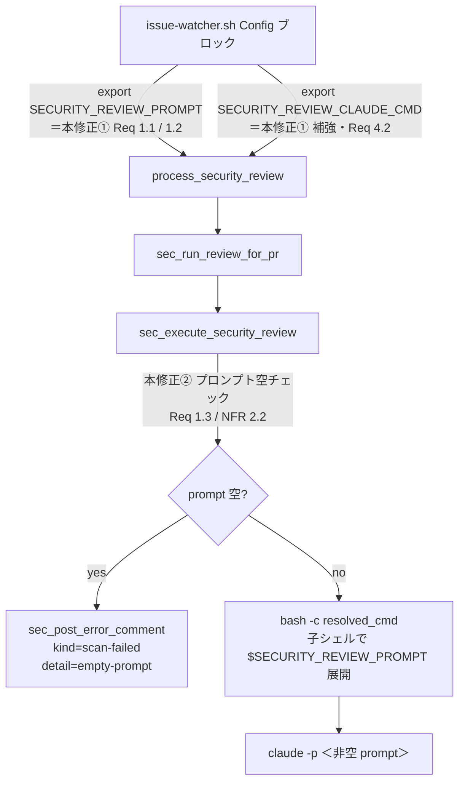

# Design Document

## Overview

**Purpose**: spec #279 で導入された Security Review Processor は、`SECURITY_REVIEW_ENABLED=true`
で opt-in した環境において **default 構成のままで全 PR が `scan-failed` を返す** 既知の
regression を抱えている。原因は `issue-watcher.sh` の Config ブロックで `SECURITY_REVIEW_PROMPT`
が `export` されておらず、`sec_execute_security_review` が `bash -c "$resolved_cmd"` で起動する
子シェルが parent shell の env を継承できず、`$SECURITY_REVIEW_PROMPT` が空文字に展開される
点にある。本 spec は、**既存 #279 design.md「CLI 起動契約」節（`claude -p "$SECURITY_REVIEW_PROMPT"`
形式）と既定値の意味的内容を温存したまま** prompt 文字列を `claude` CLI に届く状態へ復旧する。

**Users**: idd-claude を運用する idd-claude 運用者。**観測される影響**は「opt-in 環境で全 PR に
scan-failed コメントが投稿される」現象が止まり、本来の `/security-review` スキャン結果コメント
（検出 ≥ 1 件）またはクリーン通知コメント（検出 0 件）が PR 上に投稿される状態へ復旧する点。
**opt-out（既定 `SECURITY_REVIEW_ENABLED=false`）環境では本修正導入前後で観測挙動は一切変化
しない**（Req 3.1 / NFR 1.1）。

**Impact**: 変更対象は `local-watcher/bin/issue-watcher.sh` Config ブロック内の
`SECURITY_REVIEW_PROMPT` 宣言 1 行（`export` 化）と、`local-watcher/bin/modules/security-review.sh`
の `sec_execute_security_review`（`bash -c` 直前の空プロンプト・フェイルセーフ追加）の 2 ファイル
極小変更。spec #279 / #281 で確定済みの opt-out 既定・read-only invariant・SHA marker 冪等性・
Reviewer 独立性・advisory 固定など、観測可能挙動の不変条件は一切変更しない（Req 3.1〜3.6）。

### Goals

- default 構成（運用者が `SECURITY_REVIEW_PROMPT` / `SECURITY_REVIEW_CLAUDE_CMD` を override
  していない状態）で、`claude` CLI に到達する prompt 引数が **非空文字列**となることを保証
  する（Req 1.1）
- watcher プロセスが解決した `SECURITY_REVIEW_PROMPT` の文字列内容と、子プロセスで実際に
  `claude` CLI に到達した文字列内容を **同一**にする（Req 1.2）
- 空プロンプト解決を watcher プロセス内で **検知時点で**早期 short-circuit し、`claude` CLI を
  起動せずに「空プロンプト解決」識別可能なエラーコメントを 1 件投稿する（Req 1.3 / NFR 2.2）
- spec #279 / #281 の不変条件（opt-out 既定・read-only invariant・SHA marker 冪等性・Reviewer
  独立性・advisory 固定）と運用者 override 経路を一切変更しない（Req 3.1〜3.6 / Req 4.1〜4.3）
- 修正後の変更ファイル群が `shellcheck` 警告ゼロを維持する（NFR 3.1）

### Non-Goals

- 既定 `SECURITY_REVIEW_CLAUDE_CMD` の起動経路（`claude -p "$VAR"` 形式）の全面差し替え
  （`{PROMPT_FILE}` 経由へのデフォルト切替）— Req 4.3 が「既定コマンドが `claude -p` 経路で
  advisory スキャンを実行する形であること」を変更不可と規定するため。既存
  `{PROMPT_FILE}` placeholder 経路は **運用者 override 用に温存**するが、既定値は変更しない
- strict モード関連 env / 挙動の変更（spec #281 領域）
- `/security-review` skill 自体の検出品質改善 / 検出ルール改変
- `claude` CLI 起動経路の根本差し替え（公式 GitHub Action 経路への切替 等）
- 既存リポジトリの過去 PR への遡及スキャン / 自動リトライ / auto-fix / テレメトリ
- 既存 Reviewer 判定対象カテゴリ拡張

---

## Architecture

### Existing Architecture Analysis

idd-claude watcher の Security Review Processor (#279 / #281) は以下の構成で稼働している:

- **dispatcher**: `local-watcher/bin/issue-watcher.sh`（本体）
  - Config ブロック（おおよそ L301-L362）で `SECURITY_REVIEW_*` env を `${VAR:-default}`
    形式で宣言（**現状すべて非 export**）
  - dispatcher ループから `process_security_review || sec_warn "..."` で fail-continue 呼び出し
- **モジュール**: `local-watcher/bin/modules/security-review.sh`（`source` 経由でロード）
  - `process_security_review` → `sec_run_review_for_pr` → `sec_execute_security_review`
    （`bash -c "$resolved_cmd"` で claude CLI 起動）
  - prompt 解決経路:
    - 既定: `SECURITY_REVIEW_CLAUDE_CMD` 内のリテラル `"\$SECURITY_REVIEW_PROMPT"` が
      `bash -c` 子シェルの env 展開で解決される設計 (#279 design.md L450-468、
      `security-review.sh` L555-557 のコメント)
    - 代替: `sec_build_prompt_file` が一時ファイルを生成し `{PROMPT_FILE}` placeholder を
      `sec_substitute_placeholders` で置換する経路（運用者 override 用に既に実装済み、
      `security-review.sh` L466-489 / L499 / L507-532）

**現状の不具合構造**:

`issue-watcher.sh` L316 / L329 で `SECURITY_REVIEW_PROMPT="${SECURITY_REVIEW_PROMPT:-...}"` と
`SECURITY_REVIEW_CLAUDE_CMD="${SECURITY_REVIEW_CLAUDE_CMD:-...}"` を **非 export なシェル変数**
として定義している。`sec_execute_security_review` (L589) の
`bash -c "$resolved_cmd"` は新しい子シェル（subshell ではなく完全新規プロセス）を生成し、
parent shell の **export されていない変数は継承されない**。そのため子シェル内で
`"$SECURITY_REVIEW_PROMPT"` は空文字に展開され、`claude -p ""` 相当が実行され、空出力 →
`sec_run_review_for_pr` L950-955 の「空出力なら scan-failed」分岐で全 PR が scan-failed となる。

**尊重すべきドメイン境界**:

- #279 design.md「CLI 起動契約」節（`claude -p "$VAR"` で prompt 本文を argv で受ける既定値）
  の **意味的内容**は変更不可（Req 4.3）
- 既存 Reviewer / PR Iteration / Merge Queue / PR Reviewer Processor (#261) のラベル操作・
  判定論理への介入禁止（Req 3.5 / Req 3.6）
- read-only invariant（`git status --porcelain` 検査 + `git checkout -- .` 復旧）と SHA marker
  冪等性（`sec_already_processed` + `sec_build_marker`）の挙動温存（Req 3.2 / 3.3 / 3.4）

**維持すべき統合点**:

- `bash -c "$resolved_cmd"` 経路（eval 不使用 / Security Considerations）
- `sec_post_error_comment` の `kind=scan-failed` marker による重複防止（Req 1.3 で投稿する
  エラーコメントもこの経路を踏襲）
- `_sec_resolved_mode` / `_sec_resolved_threshold` グローバル経由の advisory/strict 切替
  （Req 3.6 / #281 経路）

**解消する technical debt**: 上記「export 漏れ」のみ。新規規約・新ライブラリは導入しない。

### Architecture Pattern & Boundary Map

採用パターン: **既存 Config ブロックの最小修正（`export` 追加）** + **モジュール側のフェイル
セーフ追加（空プロンプト検知時の早期 short-circuit）** の 2 点だけで、既存
processor チェーン構造には一切手を入れない。



**Architecture Integration**:

- 採用パターン: **既存 export 規約への適合 + defense-in-depth フェイルセーフ**
  （Config ブロックの export 化と子シェルへの env 継承確立を主とし、モジュール側で空プロンプト
  解決を二重防御）
- ドメイン／機能境界: Config ブロック（env 宣言）と Processor モジュール（実行）の責務分離を
  保持。env 解決経路の保証は dispatcher 側（Config ブロック）、空プロンプト時の安全側挙動は
  モジュール側（`sec_execute_security_review`）に持たせる
- 既存パターンの維持:
  - opt-in gate (`process_security_review` 早期 return)
  - SHA marker 冪等性 (`sec_already_processed` + `sec_build_marker`)
  - read-only invariant (`git status --porcelain` 検査)
  - fail-continue ログ (`sec_log` / `sec_warn` / `sec_error`)
  - dispatcher 呼び出し位置（変更しない）
- 新規コンポーネントの根拠: なし。**新規関数・新規 env var・新規ラベル・新規モジュールは一切
  追加しない**

### Technology Stack

| Layer | Choice / Version | Role in Feature | Notes |
|-------|------------------|-----------------|-------|
| Shell | bash 4+（既存と同じ） | Config ブロック / モジュール関数 | `set -euo pipefail` は本体側既存宣言を踏襲 |
| External CLI | `claude` / `gh` / `git` / `jq`（既存と同じ） | スキャン実行 / PR コメント投稿 / 候補 PR 列挙 | 既存依存集合内に閉じる（NFR 1.2） |
| Static Analysis | `shellcheck`（既存運用と同じ） | 変更ファイル品質保証 | 警告ゼロ要件（NFR 3.1） |
| Test Fixture | bash smoke スクリプト（既存 #279 / #281 fixture 慣習を踏襲） | export 継承 / 空プロンプト分岐の回帰確認 | 単体テストフレームワーク不採用方針を踏襲 |

---

## File Structure Plan

### Modified Files

```
local-watcher/bin/
├── issue-watcher.sh               # Config ブロック（L301-L362 周辺）2 行を export 化
└── modules/
    └── security-review.sh         # sec_execute_security_review 内に空プロンプト・フェイルセーフを追加
```

#### `local-watcher/bin/issue-watcher.sh`

**変更箇所**: Config ブロックの Security Review Processor 設定（おおよそ L301-L337）。

- L316（`SECURITY_REVIEW_PROMPT="${SECURITY_REVIEW_PROMPT:-...}"`）の **次行**または同行を
  `export SECURITY_REVIEW_PROMPT` に対応する形へ変更（具体的には宣言行を
  `export SECURITY_REVIEW_PROMPT="${SECURITY_REVIEW_PROMPT:-...}"` 形式へ）
- L329（`SECURITY_REVIEW_CLAUDE_CMD="${SECURITY_REVIEW_CLAUDE_CMD:-...}"`）も同様に
  `export SECURITY_REVIEW_CLAUDE_CMD="${SECURITY_REVIEW_CLAUDE_CMD:-...}"` 形式へ変更
- 他の `SECURITY_REVIEW_*` env（`_ENABLED` / `_MODEL` / `_MAX_TURNS` / `_MAX_PRS` /
  `_HEAD_PATTERN` / `_GIT_TIMEOUT` / `_EXEC_TIMEOUT` / `_MODE` / `_BLOCK_SEVERITY` /
  `_BLOCK_LABEL` 等）の export 化は本 spec のスコープ **外**（理由は後述「設計判断と代替案」
  節の「補強範囲を 2 変数に限定する理由」を参照）。`SECURITY_REVIEW_MODEL` /
  `SECURITY_REVIEW_MAX_TURNS` は既定 `SECURITY_REVIEW_CLAUDE_CMD` の文字列リテラルとして
  Config ブロック解決時に展開済みであり、子シェル env 継承を必要としない。
- 変更コメント: 既存コメント L323-L328 の「既定値中の `\$SECURITY_REVIEW_PROMPT` はリテラル
  保持し、bash -c subshell が env から展開する」表現はそのまま温存し、export が必要な理由を
  1〜2 行追記する（NFR 4.1 ドキュメント整合）

#### `local-watcher/bin/modules/security-review.sh`

**変更箇所**: `sec_execute_security_review`（L559-L603）の `bash -c "$resolved_cmd"` 実行直前
（L588 周辺）に、`SECURITY_REVIEW_PROMPT` が空である場合の **早期 short-circuit** ガードを追加。

- 配置: subshell `(...)` 内、`git fetch` / `git checkout` 成功後、`timeout ... bash -c ...`
  起動の **直前**（result_file への `empty-prompt:0:clean` 相当ではなく、新しい token
  `empty-prompt` を 1 行書き出して `exit 0`）
- 新規 result_file token: `empty-prompt`（既存 token `fetch-fail` / `checkout-fail` /
  `ran:<rc>:<clean|modified>` に並ぶ identifier。NFR 2.2 の「他のスキャン失敗原因と運用者が
  区別可能な形」を満たす）
- `sec_run_review_for_pr` 側の case 分岐（L910-L915）に `empty-prompt` 分岐を追加し、
  `sec_post_error_comment "$pr_number" "$sha" "scan-failed" "<empty-prompt detail>"` を呼び
  `return 3`（既存 scan-error 集計に流す）。これにより既存 case `fetch-fail|checkout-fail`
  と区別された WARN 1 行（NFR 2.2）+ scan-failed コメント 1 件（Req 1.3）+ 重複防止 SHA
  marker（Req 3.3）が同時に成立する

> **配置位置の選択根拠**: フェイルセーフを `sec_execute_security_review` 開始時に置く案も
> 検討したが、(1) git fetch / checkout の副作用前に判定する優位性は薄く、(2) 既存 result_file
> token プロトコルに揃えることで `sec_run_review_for_pr` 側のフロー解析が局所化される、
> (3) read-only invariant 検査と同層に並べることで「subshell 内で副作用を完結させて trap で
> base へ戻す」既存契約が崩れない、ため `bash -c` 直前を採用する。
> `sec_substitute_placeholders` 直後配置案は、置換済み cmd 文字列を検査して `$SECURITY_REVIEW_PROMPT`
> リテラル残存を検出する形になり、運用者 override（`claude -p '<literal>'` 等）の偽陽性を
> 起こすため不採用。

---

## Requirements Traceability

| Requirement | Summary | Components | Interfaces / Files |
|-------------|---------|------------|--------------------|
| 1.1 | 非空プロンプト保証 | Config ブロック（issue-watcher.sh） | `export SECURITY_REVIEW_PROMPT="${SECURITY_REVIEW_PROMPT:-...}"` |
| 1.2 | parent / child 同一性 | Config ブロック（issue-watcher.sh） | `export` 経由で env 継承確立。`bash -c` 子シェルが `$SECURITY_REVIEW_PROMPT` を parent 同値で展開 |
| 1.3 | 空プロンプト検知時の早期 short-circuit + scan-failed コメント | `sec_execute_security_review` / `sec_run_review_for_pr` | result_file token `empty-prompt` + 新 case 分岐 + `sec_post_error_comment kind=scan-failed` |
| 1.4 | opt-out 時の完全 no-op | `process_security_review` 既存 opt-in gate | 変更なし（既存 L1073 `[ ... != "true" ] && return 0` を温存） |
| 2.1 | 検出 ≥ 1 件時のコメント投稿 | `sec_post_review_comment` | 既存実装変更なし（本修正により本来挙動が復旧） |
| 2.2 | 検出 0 件時のクリーン通知 | `sec_post_clean_comment` | 既存実装変更なし（本修正により本来挙動が復旧） |
| 2.3 | scan-failed と別種別の本文 | `sec_post_error_comment` / `sec_post_review_comment` / `sec_post_clean_comment` | 既存実装変更なし（kind=`security-review` / `security-review-clean` / `scan-failed` の 3 値で marker 区別） |
| 3.1 | opt-out 時の挙動完全温存 | Config ブロック / モジュール | export 追加は env 継承挙動を変えるが、`SECURITY_REVIEW_ENABLED != "true"` 時は `process_security_review` が早期 return するため observable behavior は不変 |
| 3.2 | read-only invariant | `sec_execute_security_review` の `git status --porcelain` 検査 | 既存実装変更なし |
| 3.3 | SHA marker 冪等性 | `sec_build_marker` / `sec_already_processed` | 既存実装変更なし。新規エラー経路も `kind=scan-failed` で同一 SHA 重複投稿を防止 |
| 3.4 | 同一 head コミットの重複スキャン回避 | `sec_run_review_for_pr` 先頭の `sec_already_processed` 判定 | 既存実装変更なし |
| 3.5 | Reviewer 独立性 | dispatcher 呼び出し位置 / `review-notes.md` 経路 | 変更なし |
| 3.6 | advisory 固定（マージブロックなし） | `sec_check_strict_request` / `_sec_resolved_mode` | 変更なし（#281 既存実装温存） |
| 4.1 | `SECURITY_REVIEW_PROMPT` override 経路 | Config ブロック `${VAR:-default}` 形式 | `export VAR="${VAR:-default}"` に変更しても override 経路は不変（env 設定済みなら設定値、未設定なら default を export） |
| 4.2 | `SECURITY_REVIEW_CLAUDE_CMD` override 経路 | Config ブロック `${VAR:-default}` 形式 | 同上 |
| 4.3 | env var 名・既定値の意味的内容温存 | Config ブロック既定値 | 既定値の文字列リテラル（`claude -p "$SECURITY_REVIEW_PROMPT" ...` 形式）は変更しない |
| NFR 1.1 | opt-out 完全後方互換 | Config ブロック / `process_security_review` | export 追加は SECURITY_REVIEW_ENABLED=true 時のみ意味を持つ。opt-out 時 observable behavior 完全不変 |
| NFR 1.2 | 既存 env var 名・既定値・意味不変 | Config ブロック | 名前・既定値・意味のいずれも変更しない |
| NFR 1.3 | cron / launchd 登録文字列不変 | watcher 起動経路 | 変更なし |
| NFR 2.1 | 観測可能性（既存ログ分岐温存） | `sec_log` / `sec_warn` / `sec_error` の既存呼び出し | 変更なし |
| NFR 2.2 | 空プロンプト検知の独自識別ログ | `sec_execute_security_review` 新規ガード | `sec_warn` で `empty-prompt` 識別語を含む WARN 1 行を出す（他失敗原因と区別可能） |
| NFR 3.1 | shellcheck 警告ゼロ | 変更ファイル | `local-watcher/bin/issue-watcher.sh` / `local-watcher/bin/modules/security-review.sh` |
| NFR 4.1 | ドキュメント整合性 | README / spec #279 design.md 該当節 | 本 PR で README「オプション機能一覧」相当節と spec #279 design.md L555-557 のコメント記述を確認し、必要箇所のみ追記 |

---

## Components and Interfaces

### Config ブロック（`local-watcher/bin/issue-watcher.sh`）

#### Security Review env 宣言の export 化

| Field | Detail |
|-------|--------|
| Intent | `SECURITY_REVIEW_PROMPT` と `SECURITY_REVIEW_CLAUDE_CMD` を parent shell の env として確立し、`sec_execute_security_review` の `bash -c` 子シェルが両変数を継承できる状態にする |
| Requirements | 1.1, 1.2, 4.1, 4.2, 4.3, NFR 1.1, NFR 1.2 |

**Responsibilities & Constraints**

- 主責務: Security Review Processor が依存する env 変数の宣言と export
- 制約:
  - **既存 env var 名・既定値の文字列リテラル**を変更しない（NFR 1.2 / Req 4.3）
  - `${VAR:-default}` 形式の override 経路を破壊しない（運用者が watcher 起動 env で
    `SECURITY_REVIEW_PROMPT=...` を export 設定していれば設定値が継承される）
  - 他 `SECURITY_REVIEW_*` env の export 化は **本 spec スコープ外**（後述「設計判断と代替案」
    節を参照）

**Dependencies**

- Inbound: dispatcher ループ / `process_security_review` — env 値参照（Criticality: high）
- Outbound: `sec_execute_security_review` の `bash -c` 子シェル — env 継承（Criticality: high）
- External: なし（bash 組み込み `export` のみ）

**Contracts**: State [x]

##### State Contract

- **変更前**: `VAR="${VAR:-default}"` は parent shell scope のシェル変数。child process には
  継承されない
- **変更後**: `export VAR="${VAR:-default}"` は parent shell scope の env 変数となり、child
  process（`bash -c "$resolved_cmd"` 含む）に継承される
- **境界条件 1（env 未設定）**: 変更前後ともに既定値が解決される。変更後は default 値が
  child process にも継承される
- **境界条件 2（env 設定済み）**: 変更前後ともに `${VAR:-default}` で設定値が採用される。
  変更後は設定値が child process にも継承される
- **境界条件 3（opt-out 時）**: `SECURITY_REVIEW_ENABLED != "true"` 時は `process_security_review`
  が早期 return するため、export の有無は observable behavior に影響しない（NFR 1.1）

### `sec_execute_security_review`（`local-watcher/bin/modules/security-review.sh`）

#### 空プロンプト・フェイルセーフ追加

| Field | Detail |
|-------|--------|
| Intent | `bash -c "$resolved_cmd"` 起動直前に `SECURITY_REVIEW_PROMPT` が空文字列に解決される事態を watcher プロセス内で検知し、`claude` CLI を起動せず result_file へ `empty-prompt` token を書き出して安全側に倒す |
| Requirements | 1.3, NFR 2.2 |

**Responsibilities & Constraints**

- 主責務: defense-in-depth として、Config ブロック側の export 修正が将来再退行した場合や
  運用者 override で空 prompt が指定された場合を防御し、CLI を空 prompt で起動しない
- 制約:
  - subshell `(...)` 内 / `git fetch` / `git checkout` 完了後の位置に配置（既存 result_file
    プロトコル整合性）
  - 既存 token (`fetch-fail` / `checkout-fail` / `ran:<rc>:<state>`) と名前空間衝突しない
    新規 token `empty-prompt` を使用
  - `sec_warn` で「空プロンプト解決」識別語を含むログ 1 行を stderr に出す（NFR 2.2）
  - read-only invariant（`git status --porcelain` 検査）は **本ガード経路では走らせない**
    （CLI 未起動のためワークツリー変更は構造的に発生しない）

**Dependencies**

- Inbound: `sec_run_review_for_pr` の case 分岐（result_file token を読む）（Criticality: high）
- Outbound: `result_file` への token 書き出し（Criticality: high）
- External: `sec_warn`（既存 logger）

**Contracts**: Service [x] / State [x]

##### Service Interface

```bash
sec_execute_security_review() {
  # 既存シグネチャ変更なし
  # $1 = head_ref, $2 = resolved_cmd, $3 = out_file, $4 = err_file, $5 = result_file
  # subshell 内、git fetch / checkout 成功後、bash -c "$resolved_cmd" 直前に以下を追加:
  #   if [ -z "${SECURITY_REVIEW_PROMPT:-}" ]; then
  #     sec_warn "SECURITY_REVIEW_PROMPT が空文字列です（empty-prompt）。claude CLI を起動せず scan-failed として早期報告します"
  #     printf 'empty-prompt\n' > "$result_file"
  #     exit 0
  #   fi
}
```

- Preconditions: subshell 内、git fetch / checkout 成功直後
- Postconditions: `SECURITY_REVIEW_PROMPT` 空時は result_file に `empty-prompt` 1 行を書き出し
  `exit 0`。非空時は既存ロジック（`timeout ... bash -c "$resolved_cmd"`）へ進む
- Invariants: ワークツリー変更なし（CLI 未起動）。base branch 復帰は既存 EXIT trap で担保

##### result_file token プロトコル拡張

| token | Trigger | 後続処理（`sec_run_review_for_pr`） |
|-------|---------|-------------------------------------|
| `fetch-fail`（既存） | `git fetch` 失敗 | WARN + return 1（コメント投稿しない） |
| `checkout-fail`（既存） | `git checkout` 失敗 | WARN + return 1（コメント投稿しない） |
| `ran:<rc>:clean`（既存） | コマンド完了 + tracked 変更なし | rc 値で成功 / 非ゼロ終了分岐 |
| `ran:<rc>:modified`（既存） | コマンド完了 + tracked 変更あり | scan-failed コメント + return 3 |
| `empty-prompt`（**新規**） | `SECURITY_REVIEW_PROMPT` 空検知 | scan-failed コメント（detail=empty-prompt 識別）+ return 3 |

##### `sec_run_review_for_pr` の case 分岐拡張

```bash
case "$result" in
  fetch-fail|checkout-fail)
    sec_warn "PR #${pr_number}: head '${head_ref}' の取得に失敗 (${result})、当該 PR を skip"
    return 1
    ;;
  empty-prompt)
    sec_error "PR #${pr_number}: SECURITY_REVIEW_PROMPT が空のため claude CLI を起動せず scan-failed として報告 (empty-prompt)"
    sec_post_error_comment "$pr_number" "$sha" "scan-failed" \
      "セキュリティレビューのプロンプトが空に解決されました（empty-prompt）。\`SECURITY_REVIEW_PROMPT\` env が watcher 親プロセスから子シェルへ継承されていない可能性があります。watcher 起動環境または \`SECURITY_REVIEW_CLAUDE_CMD\` の \`{PROMPT_FILE}\` 経路への切替を確認してください。"
    return 3
    ;;
esac
```

- 既存の `ran:*` 分岐（`exec_rc` / `wsmod` 解析）は **追加した case の後ろ**に温存
- `sec_error` を使用することで既存 ログ重大度カテゴリ（log / warn / error）の慣習に整合

---

## Data Models

### Domain Model

本 spec は **新規ドメインモデル / 永続データを追加しない**。既存:

- PR (`pr_number`, `headRefOid`, `headRefName`, `baseRefName`, `isDraft`,
  `headRepositoryOwner.login`) — 変更なし
- Marker (`sha`, `kind`) — 変更なし（`kind=scan-failed` を本 spec の新規エラー経路でも使う）
- result_file token — 新規 token `empty-prompt` を追加（CLI 内部プロトコル / 永続化なし）

### Logical / Physical Data Model

該当なし（永続データ追加なし）。

---

## Error Handling

### Error Strategy

本 spec の Error Handling は 2 層構成:

1. **Config ブロック層（root cause 修正）**: `export` 化により、空プロンプト解決を構造的に
   発生させない正常系を確立
2. **モジュール層（defense-in-depth）**: 万が一空プロンプト解決が発生した場合に CLI を起動
   せず安全側に倒す `empty-prompt` ガード

### Error Categories and Responses

| カテゴリ | Trigger | Response | 識別ログ |
|---------|---------|----------|---------|
| User Errors | 運用者が `SECURITY_REVIEW_PROMPT=""` を意図的 / 誤って設定 | `empty-prompt` ガードが検知 → scan-failed コメント | `sec_warn` / `sec_error` で `empty-prompt` 識別語含む 1 行（NFR 2.2） |
| System Errors（git fetch / checkout 失敗 / 既存） | git 操作タイムアウト等 | 既存 `fetch-fail` / `checkout-fail` 分岐（変更なし） | 既存 `sec_warn` |
| System Errors（read-only 違反 / 既存） | スキャン実行がワークツリー変更 | 既存 `ran:*:modified` 分岐（変更なし） | 既存 `sec_error` |
| Business Logic Errors（CLI 非ゼロ終了 / 既存） | `claude -p` 実行 rc != 0 | 既存 `ran:<rc!=0>:clean` 分岐（変更なし） | 既存 `sec_error` |
| Business Logic Errors（空出力 / 既存） | 出力 0 byte | 既存「空出力なら scan-failed」分岐（**本修正後も温存**）| 既存 `sec_warn` |

**重要**: 既存「空出力 → scan-failed」分岐（`sec_run_review_for_pr` L950-955）は **本修正後も
温存**する。`empty-prompt` ガードは CLI 起動前の input 側チェックで、既存「空出力」分岐は
CLI 起動後の output 側チェック。両者は独立した defense-in-depth として共存する。

### 既存マーカー識別子（`kind`）の継続使用

| `kind` | 使用箇所 | 本 spec での扱い |
|--------|----------|------------------|
| `security-review` | 検出 ≥ 1 件の結果コメント | 変更なし（本来挙動が復旧して使われるようになる） |
| `security-review-clean` | 検出 0 件のクリーン通知 | 変更なし（本来挙動が復旧して使われるようになる） |
| `scan-failed` | エラーコメント | 変更なし（`empty-prompt` 経路も `kind=scan-failed` を使う） |
| `security-block` | strict 検出時のラベル付与マーカー（#281） | 変更なし |

> Note: `empty-prompt` は **result_file token** の識別子であり、PR コメントの hidden marker
> `kind` ではない。`kind` は既存 `scan-failed` を踏襲することで、同一 SHA に対する空プロンプト
> エラー → 後続サイクルでの正常スキャンへの遷移を SHA marker 冪等性で正しく扱える
> （SHA が変わるまでは再投稿されない / Req 3.3）。

---

## Testing Strategy

### Unit Tests（bash smoke）

idd-claude には unit test フレームワークが存在しないため、`docs/specs/286-fix-watcher-security-review-processor-sc/test-fixtures/`
配下に bash スモークスクリプトを配置し、変更ファイルの個別ロジックを再現確認する。

1. **export 継承確認 (Req 1.1, 1.2)**: scratch スクリプトで `issue-watcher.sh` の Config
   ブロックのみを source し、`bash -c 'echo "$SECURITY_REVIEW_PROMPT"'` 子シェル出力が
   非空 default 値と一致することを確認
2. **空プロンプト・フェイルセーフ (Req 1.3)**: `SECURITY_REVIEW_PROMPT=""` 状態で
   `sec_execute_security_review` を直接呼び、result_file が `empty-prompt\n` 1 行であることを
   確認 + ワークツリー変更が発生しないことを `git status --porcelain` で確認
3. **既存 token 不変 (Req 3.1 / NFR 1.1)**: 非空 `SECURITY_REVIEW_PROMPT` 状態で同関数を
   呼び、result_file が `ran:*:clean` または `ran:*:modified` 形式である（`empty-prompt` で
   ない）ことを確認

### Integration Tests（bash smoke）

4. **opt-out 完全 no-op (Req 3.1 / NFR 1.1)**: `SECURITY_REVIEW_ENABLED=false` 状態で
   `process_security_review` を呼び、戻り値 0 / 標準出力空 / 状態変化なしを確認
5. **env-PATH 最小再現 (NFR 1.3)**: `env -i HOME=$HOME PATH=/usr/bin:/bin` で minimal env を
   構築し、`SECURITY_REVIEW_ENABLED=true SECURITY_REVIEW_PROMPT=test-prompt bash -c '...'`
   経由で子シェルへの export 継承が成立することを確認
6. **scan-failed 重複防止 (Req 3.3)**: `empty-prompt` 経路で `sec_post_error_comment` が同一
   SHA に対して 2 回目を投稿しない（`sec_already_processed` で skip される）ことを確認
   （PR コメント API は mock で代替）

### E2E / Manual Smoke

7. **dry-run スモーク (NFR 1.3)**: dogfooding 環境で `REPO=owner/test REPO_DIR=/tmp/test-repo`
   状態で watcher を起動し、Security Review Processor が opt-out 既定で起動しないこと、
   `SECURITY_REVIEW_ENABLED=true` 設定時に Config ブロック解決後の子シェル env が想定値である
   ことを確認

### Static Analysis（NFR 3.1）

- `shellcheck local-watcher/bin/issue-watcher.sh local-watcher/bin/modules/security-review.sh` の警告ゼロ
  （既存 `.shellcheckrc` で抑止された info 級は許容）

### Performance / Load

本 spec は **既存実装の env 継承経路を是正する最小修正**であり、追加で発生するコストは
Config ブロック実行時の `export` 命令 2 回（実行コスト 0 に近い）と、`sec_execute_security_review`
内の `[ -z ... ]` 判定 1 回（同上）のみ。新規ループ・新規 API 呼び出し・新規ファイル I/O
を追加しない。

---

## 設計判断と代替案

### 採用方針: (A) 最小修正（`export` 化）+ フェイルセーフ強化

**判断根拠**:

1. **Req 4.3 制約との整合**: 「既定コマンドが `claude -p` 経路で advisory スキャンを実行する形
   であること」の意味的内容を変えない要求があり、既定 `SECURITY_REVIEW_CLAUDE_CMD` を
   `{PROMPT_FILE}` 経路へ全面切替する案 (B) は意味的内容の変更境界に踏み込む
2. **#279 design.md「CLI 起動契約」節との整合**: 既存設計が `bash -c subshell が env から
   展開する` 経路を **明示的に契約**しており、本来 export されているべきだった env が漏れて
   いただけ。export 化は契約の明文化に等しく、設計思想の連続性が保たれる
3. **変更行数の最小性**: `export` 追加 2 行 + フェイルセーフ 5〜10 行で完結し、レビュー負荷
   と回帰リスクを最小化できる
4. **既存テスト fixture / smoke スクリプトとの整合**: spec #279 / #281 が確立した test fixture
   と smoke スクリプトを変更せず通せる（`{PROMPT_FILE}` 既定化は cmd template の test
   expectation を全て更新する必要が出る）
5. **`{PROMPT_FILE}` 経路の温存**: `sec_build_prompt_file` / `sec_substitute_placeholders` /
   `{PROMPT_FILE}` placeholder は既に実装済みで本修正後も動作する。運用者が `claude` CLI の
   将来仕様変更や独自ニーズで `{PROMPT_FILE}` 経路を使いたい場合、`SECURITY_REVIEW_CLAUDE_CMD`
   の override で B 相当を選択できる柔軟性は維持される

### 代替案 (B): 既定 `SECURITY_REVIEW_CLAUDE_CMD` を `{PROMPT_FILE}` 経路へ全面切替

**不採用理由**:

- 既定値の意味的内容を変える境界（Req 4.3）に抵触する余地が大きい
- 既存 #279 / #281 の design.md 記述・README オプション機能一覧・既存 smoke fixture と
  expectation がすべて `claude -p "$SECURITY_REVIEW_PROMPT"` 形式に揃っており、デフォルトを
  全面切替すると整合維持コストが大きい
- claude CLI の `--print` モードで stdin / `--prompt-file` 相当の argv 形式が `-p` 引数と
  完全等価である保証が不確実（本 spec での Web 検索ベースの追加調査でも、`-p` 引数を持つ
  prompt 渡し方が依然 primary パスとして文書化されているため、既定値を変える積極的根拠を
  得られない）

### 代替案 (C): 両方適用（export 化 + 既定 `{PROMPT_FILE}` 経路切替）

**不採用理由**:

- 修正範囲が広がるが、本不具合の解消には (A) で十分。`export` 化だけで子シェル env 継承が
  成立し、空プロンプト・フェイルセーフが追加防御となる
- 1 PR = 1 Issue / 1 PR = 最小限の変更 原則（CLAUDE.md）に照らして本 spec のスコープを膨らま
  せない

### 補強範囲を 2 変数に限定する理由

`SECURITY_REVIEW_*` env 群のうち、export 必須なのは **`bash -c "$resolved_cmd"` の子シェル
内で `$VAR` として参照される変数** に限られる:

- `SECURITY_REVIEW_PROMPT`: 既定 `SECURITY_REVIEW_CLAUDE_CMD` のリテラル `\"\$SECURITY_REVIEW_PROMPT\"`
  として子シェルが参照 → **export 必須**
- `SECURITY_REVIEW_CLAUDE_CMD`: parent shell で `$resolved_cmd` に展開済みのため厳密には不要
  だが、運用者が独自モジュールから直接参照する将来性 / 一貫性のため **本 spec でも export
  化に揃える**（NFR 1.1 観測挙動に変化なし）
- `SECURITY_REVIEW_MODEL` / `SECURITY_REVIEW_MAX_TURNS`: Config ブロック解決時に default
  値の中で `${SECURITY_REVIEW_MODEL}` / `${SECURITY_REVIEW_MAX_TURNS}` として
  parent shell で文字列展開済み（issue-watcher.sh L329 の `--max-turns ${SECURITY_REVIEW_MAX_TURNS}`
  / `--model ${SECURITY_REVIEW_MODEL}` は **既定値文字列に直接埋め込まれた値**）→ 子シェルは
  これらを env として読まない → export 不要
- `SECURITY_REVIEW_ENABLED` / `_HEAD_PATTERN` / `_MAX_PRS` / `_GIT_TIMEOUT` / `_EXEC_TIMEOUT`
  / `_MODE` / `_BLOCK_SEVERITY` / `_BLOCK_LABEL`: parent shell の関数内でのみ参照 → 子シェル
  継承不要 → export 不要

将来、これら env のいずれかを `bash -c` 子シェル内で参照する設計変更を行う場合は、その時点で
追加 export を検討する。

---

## Migration Strategy

本 spec は **既定値の文字列リテラル・env var 名・cron 登録文字列・ラベル名・exit code を
一切変更しない**ため、明示的なマイグレーション手順は不要。

- **opt-out 環境（既定）**: 本修正導入前後で observable behavior は完全不変
  （`SECURITY_REVIEW_ENABLED != "true"` で `process_security_review` が早期 return するため、
  export の有無は副作用に影響しない）
- **opt-in 環境**: 本修正導入後の最初の watcher サイクルから default 構成で
  `/security-review` skill が正常起動するようになる。スキャン中の SHA に対する `kind=scan-failed`
  marker は既に投稿済みのため、同一 SHA への再スキャンは自動では走らない（Req 3.3 / 3.4
  冪等性挙動の継続）。運用者が再スキャンを希望する場合は、対象 PR に新 commit を push して
  SHA を変えるか、既存 `kind=scan-failed` コメントを手動削除する（既存 #279 運用と同一）
- **`SECURITY_REVIEW_PROMPT` / `SECURITY_REVIEW_CLAUDE_CMD` を override 設定済みの運用者**:
  override 経路は `${VAR:-default}` 形式を温存するため、設定値が引き続き採用される。export
  化により設定値が子シェルへも継承されるようになる（本修正導入前から override 値が PR の
  scan-failed を救えていた運用者は、本修正導入後も同様に動作する）

### README / spec #279 design.md の同期

NFR 4.1 に従い、本 PR で以下を確認・必要箇所のみ更新する:

- `README.md` の「オプション機能一覧」相当節 — Security Review Processor の env 表記に
  export の言及を追加（変更例: `export SECURITY_REVIEW_ENABLED=true` 等、運用者向けの
  set 手順としては既に export 前提で書かれている場合は変更不要）
- `local-watcher/bin/modules/security-review.sh` L555-557 のコメント — 「parent env に解決済み
  であるため」の説明を「Config ブロックで export 済みであるため」に近い表現へ更新（NFR 4.1）
- `docs/specs/279-feat-watcher-security-review-opt-in-pr-d/design.md` の「CLI 起動契約」節へ
  retroactive な修正は **行わない**（本 spec で別途 #286 の文脈として記録する）
