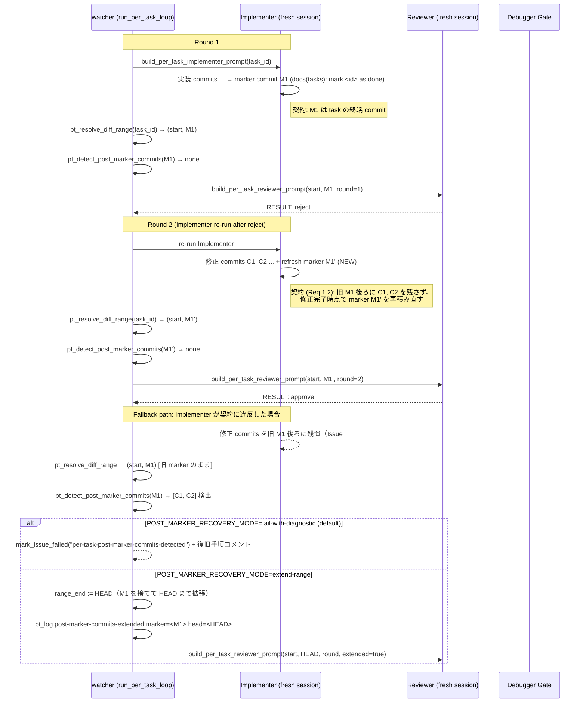

# Design Document

## Overview

**Purpose**: per-task Implementer ループにおいて、Reviewer reject / Debugger guidance 後の
Implementer 再実行で修正 commit が古い `docs(tasks): mark <id> as done` marker より後ろに
積まれた場合に、watcher の review range 解決が marker で止まり修正 commit が Reviewer の
判定対象から漏れる **silent range truncation** を防止する。

**Users**: per-task ループ運用者（idd-claude self-hosting と consumer repo の双方）。
Implementer / Reviewer は本変更により marker contract が明文化され、watcher は marker 後の
未レビュー commit を fail-safe に検出する。

**Impact**: 現在の `pt_resolve_diff_range` は最後にヒットした marker commit を range_end として
固定するだけで、その後ろに積まれた修正 commit を検出する safety net を持たない。本変更で
(a) Implementer prompt に「marker は task の終端 commit」契約を明文化し、(b) watcher に
post-marker commit 検出 hook を追加して silent truncation を防ぎ、(c) Reviewer prompt に
判定対象 SHA range と range 外警告を明示する。

### Goals

- per-task Implementer が Reviewer reject / Debugger guidance 後の修正 commit を marker より
  後ろに残さないよう、Implementer prompt と developer.md / repo-template ミラーに marker
  contract を明文化する（Req 1.1–1.3, 4.1, 4.2）
- watcher が marker 後の未レビュー commit を検出した際、silent に通さず「range extension」または
  「abort + diagnostic」のいずれか決定論的な経路を取る（Req 2.1–2.3, NFR 2.1）
- per-task Reviewer prompt に reviewed SHA range と range 外警告を機械パース可能な形で含める
  （Req 3.1–3.3）
- idd-codex #14 と同型 commit shape（marker + 後続修正 commit）の回帰テスト fixture を導入
  （Req 5.1–5.3）
- root `.claude/{agents,rules}` と `repo-template/.claude/{agents,rules}` を byte 一致で更新
  （Req 4.1, 4.2）
- 既存 env var / exit code 意味 / marker subject 形式を温存（NFR 1.1–1.3）

### Non-Goals

- idd-codex #14 本体の修正（別 repo / Out of Scope）
- Reviewer の 3 カテゴリ判定軸（AC / missing test / boundary）の変更
- per-task loop 全体の構造変更（marker contract 周辺以外）
- Stage A 一括 reviewer や通常 impl mode の range 解決変更
- hitoshiichikawa/idd-claude#303 の test 期待値ずれ（別 Issue）
- marker subject 形式 `docs(tasks): mark <id> as done` の変更（NFR 1.2）

## Architecture

### Existing Architecture Analysis

現状の per-task ループは以下のコンポーネントで構成される（`local-watcher/bin/issue-watcher.sh`
2470–3960 行付近）:

- **`pt_resolve_diff_range <task_id>`**（2638–2718）: `${BASE_BRANCH}..HEAD` 上の
  `docs(tasks): mark ... as done` commit を時系列昇順で全列挙し、当該 task_id にマッチする
  最新 marker を `range_end` として、その直前要素を `range_start` として返す
- **`build_per_task_implementer_prompt <task_id>`**（2934–3046）: 進捗マーカー更新と
  marker commit 規約（1 commit = 1 task ID）を明示
- **`build_per_task_reviewer_prompt <task_id> <range_start> <range_end> <round> <prev_result>`**
  （3060–3143）: range_start / range_end を prompt に埋め込み、Reviewer に当該範囲のみの
  判定を指示
- **`run_per_task_reviewer <task_id> <round>`**（3226 以降）: `pt_resolve_diff_range` を呼び
  失敗時 rc=3 を返して `pt_mark_diff_range_resolve_failed` 経由で `diff-range-resolve-failed`
  カテゴリの claude-failed を付与
- **`run_per_task_loop`**（3558 以降）: Implementer → Reviewer round 1 → Implementer 再実行 →
  Reviewer round 2 → Debugger Gate → Implementer round 3 → Reviewer round 3 のループを駆動

**尊重すべき境界**:

- `pt_resolve_diff_range` の戻り値プロトコル（`<range_start_sha>\t<range_end_sha>` / rc=0/1）
  と既存テスト fixture（#164 `test-pt-resolve.sh`）は外部観測可能契約として温存する
- `diff-range-resolve-failed` カテゴリ（marker 不在）と本 Issue で新設する
  `per-task-post-marker-commits-detected` カテゴリは **別カテゴリ** として並列で扱う
  （前者は marker そのものが無い場合、後者は marker はあるが後続に未レビュー commit がある場合）
- root と `repo-template/` の `.claude/{agents,rules}` byte 一致性（CLAUDE.md「二重管理規約」）

**Technical debt の解消**:

- 現状 `pt_resolve_diff_range` は marker 後の未レビュー commit に対する safety net を持たず、
  Implementer の prompt 上の口約束に頼っている。本変更で watcher 側に強制 hook を入れる

### Architecture Pattern & Boundary Map



**Architecture Integration**:

- 採用パターン: **Range Resolution + Safety Net Hook**（既存 `pt_resolve_diff_range` の前後に
  検出関数を挟む defense-in-depth）
- ドメイン／機能境界:
  - **Range Resolution**: `pt_resolve_diff_range`（既存契約温存）
  - **Post-Marker Safety Net**: `pt_detect_post_marker_commits`（**新規**）
  - **Recovery Dispatch**: `pt_handle_post_marker_commits`（**新規**、env で extend / abort 切替）
  - **Reviewer Prompt**: `build_per_task_reviewer_prompt`（extended range 状態を反映）
  - **Failure Reporting**: `pt_mark_post_marker_commits_detected`（**新規**、専用カテゴリ）
- 既存パターンの維持: marker subject 形式 / `pt_log` 書式 / `mark_issue_failed` 経路 / fresh session 起動
- 新規コンポーネントの根拠: marker contract の prompt 明文化だけでは再発余地が残るため
  （Open Question への回答 = 両面実装が必要）watcher 側に強制 hook を追加する

### Recovery action の決定（Open Question への回答）

requirements.md の Open Question で「range 拡張 / abort+diagnostic のどちらを default にするか」
を design 側で確定するよう求められている。本 design では **`fail-with-diagnostic` を default**
として採用する。根拠:

| 観点 | extend-range | fail-with-diagnostic（採用） |
|---|---|---|
| 安全性 | Implementer 契約違反を黙って吸収するため再発抑止が弱い | 違反を顕在化させ Implementer 側の修正を促せる |
| 観測可能性 | log 1 行のみで Issue / PR からは見えにくい | claude-failed + 復旧手順コメントで運用者が即座に把握 |
| 後方互換性 | range が変わるため Reviewer 判定対象が変化 | marker 不変のまま停止するため挙動の予測性が高い |
| データ損失リスク | range 拡張により Reviewer は新 commit を見るが marker 自体は古いまま残る | 既存 `diff-range-resolve-failed` と同じ復旧手順（reflog + manual rescue）が使える |
| Req 5.3 適合 | 検出結果はログのみで、test の expectation 強度が弱い | claude-failed への遷移で test の expectation が決定論的になる |

env var `POST_MARKER_RECOVERY_MODE`（default=`fail-with-diagnostic`、`extend-range` で opt-in
切替）を導入し、運用者が将来必要に応じて切替できる余地を残す（既存 env var override パターンに
準拠）。default 値での挙動は Req 2.2 の「abort with diagnostic」を満たす（Req 2.2 はどちらか
一方を要求しており、本 design では abort を採用）。

### Technology Stack

| Layer | Choice / Version | Role in Feature | Notes |
|-------|------------------|-----------------|-------|
| Frontend / CLI | — | — | 対象外（bash + markdown のみ） |
| Backend / Services | bash 4+ + git 2.x | watcher 内 commit 走査 / marker / post-marker 検出 | 既存 `local-watcher/bin/issue-watcher.sh` 流用 |
| Data / Storage | git log（`${BASE_BRANCH}..HEAD`） | marker / post-marker commit の source of truth | 既存 `pt_resolve_diff_range` の git log と同じ source |
| Messaging / Events | `gh issue edit` / `gh issue comment` | claude-failed 付与と復旧手順コメント | 既存 `mark_issue_failed` / `pt_mark_diff_range_resolve_failed` 経路を踏襲 |
| Infrastructure / Runtime | Linux/macOS cron + ローカル watcher / Claude CLI fresh session | per-task ループ全体 | 既存運用と同じ |

## File Structure Plan

### Modified Files

- `local-watcher/bin/issue-watcher.sh`
  - 新規関数 `pt_detect_post_marker_commits <marker_sha>` を `pt_resolve_diff_range` 直後に追加
  - 新規関数 `pt_handle_post_marker_commits <task_id> <round> <marker_sha> <post_marker_list>` を追加
  - 新規関数 `pt_mark_post_marker_commits_detected <task_id> <round> <marker_sha> <post_marker_list>` を追加
    （`pt_mark_diff_range_resolve_failed` と同パターン）
  - `run_per_task_reviewer` 内で `pt_resolve_diff_range` 成功後に
    `pt_detect_post_marker_commits` を呼び、検出時は `pt_handle_post_marker_commits` で
    extend-range / fail-with-diagnostic に分岐
  - `build_per_task_reviewer_prompt` に `extended` フラグを追加し、extend-range 経路で
    prompt 上の説明文と SHA range を切り替え（Req 3.3）
  - env var `POST_MARKER_RECOVERY_MODE`（default=`fail-with-diagnostic`）の宣言
    （既存 `PER_TASK_LOOP_ENABLED` / `PER_TASK_MAX_TASKS` 宣言箇所の近傍）
  - `run_per_task_reviewer` から `pt_handle_post_marker_commits` 経由で fail-with-diagnostic を
    返す経路に対応した新 exit code（rc=5）を追加し、`run_per_task_loop` の各 round 分岐で
    `per-task-post-marker-commits-detected` カテゴリの claude-failed を付与
  - `build_per_task_reviewer_prompt` の prompt 文中に「reviewed SHA range は本 range のみで
    range 外 commit は判定対象外」の警告を明示（Req 3.1, 3.2）
  - **配置場所**: `pt_resolve_diff_range`（2638–2718 行）直後に新規関数群を配置し、
    `pt_mark_diff_range_resolve_failed`（3374 行付近）と同セクション内に
    `pt_mark_post_marker_commits_detected` を追加

- `.claude/agents/developer.md` / `repo-template/.claude/agents/developer.md`
  - 「per-task ループ下での Implementer の責務」節（369 行以降）に「marker contract: marker は
    task の終端 commit」「retry 時の marker refresh 規約」を追記（Req 1.2, 1.3, 4.1, 4.2）
  - 既存「1 commit = 1 task ID」記述の直後に新たな subsection として配置
  - 両系統 byte 一致を維持

- `.claude/agents/reviewer.md` / `repo-template/.claude/agents/reviewer.md`
  - 「per-task ループ下での Reviewer の責務」節（275 行以降）の「判定対象 diff range の限定」
    subsection に、range 外 commit の判定対象外性を **explicit warning** として強化
    （Req 3.2）
  - 「extended range」シグナル（`extended=true` フラグが prompt にある場合の解釈）を追記
    （Req 3.3）

### New Files

- `docs/specs/304--bug-per-task-commit-task-marker-review/test-fixtures/test-post-marker-detect.sh`
  - idd-codex #14 と同型 commit shape を再現する一時 git repo を作成し、`pt_detect_post_marker_commits`
    と `pt_handle_post_marker_commits` の挙動（extend-range / fail-with-diagnostic 双方）を
    検証する smoke script（Req 5.1, 5.2, 5.3）
  - 既存 `docs/specs/164-bug-watcher-per-task-reviewer-task-id-ma/test-pt-resolve.sh` と
    同形式（参照実装の関数を本 script に複製、test harness で assert）

- `docs/specs/304--bug-per-task-commit-task-marker-review/test-fixtures/README.md`
  - fixture の用途・実行手順・対応 requirement 番号の対応表（簡潔）

### Directory Structure（変更後）

```
local-watcher/bin/issue-watcher.sh           # pt_detect_post_marker_commits 他を追加
.claude/agents/
├── developer.md                              # marker contract 節を追記
└── reviewer.md                               # extended range / range 外警告を追記
repo-template/.claude/agents/
├── developer.md                              # 上記と byte 一致
└── reviewer.md                               # 上記と byte 一致
docs/specs/304--bug-per-task-commit-task-marker-review/
├── requirements.md                           # 既存（変更しない）
├── design.md                                 # 本ファイル
├── tasks.md                                  # tasks.md
├── impl-notes.md                             # Developer が記録（実装時に生成）
└── test-fixtures/
    ├── README.md                             # fixture 説明（新規）
    └── test-post-marker-detect.sh            # 回帰テスト fixture（新規）
```

## Requirements Traceability

| Requirement | Summary | Components | Interfaces | Flows |
|-------------|---------|------------|------------|-------|
| 1.1 | Marker は task 終端 commit | `build_per_task_implementer_prompt`, `developer.md` | prompt 文言, agent 規約節 | Implementer 進捗マーカー更新フロー |
| 1.2 | retry 時に marker 後ろに修正を残さない | `developer.md`, `build_per_task_implementer_prompt` | agent 規約節 | Implementer 再実行フロー |
| 1.3 | prompt に marker contract を明示 | `build_per_task_implementer_prompt`, `developer.md` | prompt 文言 | Implementer 起動シーケンス |
| 2.1 | watcher は marker 後の未レビュー commit を silent に通さない | `pt_detect_post_marker_commits`, `run_per_task_reviewer` | shell 関数 contract, exit code | per-task Reviewer 起動シーケンス |
| 2.2 | 検出時に range extension または abort | `pt_handle_post_marker_commits` | env `POST_MARKER_RECOVERY_MODE` | Recovery dispatch |
| 2.3 | abort 時は既存 failure path で surface | `pt_mark_post_marker_commits_detected`, `mark_issue_failed` | claude-failed カテゴリ | 失敗報告フロー |
| 3.1 | Reviewer prompt に range を明示 | `build_per_task_reviewer_prompt` | prompt の SHA pair 出力 | Reviewer 起動シーケンス |
| 3.2 | range 外 commit を判定対象外と警告 | `build_per_task_reviewer_prompt`, `reviewer.md` | prompt 文言, agent 規約節 | Reviewer 判定フロー |
| 3.3 | extended range 時は extended range を反映 | `build_per_task_reviewer_prompt`, `reviewer.md` | prompt `extended` フラグ | Recovery dispatch |
| 4.1 | root と repo-template/ の byte 一致 | `.claude/agents/{developer,reviewer}.md` 両系統 | ファイル一致 | dogfooding 規約 |
| 4.2 | 変更時に両系統同期 | 同上 | `diff -r` で空 | dogfooding 規約 |
| 5.1 | idd-codex #14 同型 commit shape の fixture | `test-post-marker-detect.sh` | smoke script | 回帰テスト |
| 5.2 | watcher 挙動を検証 | 同上 | extend-range / fail-with-diagnostic 双方の assertion | 回帰テスト |
| 5.3 | silent truncate を許容しない test | 同上 | assertion で fail にする expectation | 回帰テスト |
| NFR 1.1 | env var / exit code / log 後方互換 | 全モジュール | 既存名称温存 | 全フロー |
| NFR 1.2 | marker subject 形式不変 | `pt_resolve_diff_range`, marker 規約 | regex 不変 | Implementer 進捗マーカー更新 |
| NFR 1.3 | post-marker commit 無い場合は挙動不変 | `pt_detect_post_marker_commits` | rc=1 で no-op | per-task Reviewer 起動 |
| NFR 2.1 | post-marker 検出時にログ出力 | `pt_handle_post_marker_commits` | stderr ログ | 観測可能性 |

## Components and Interfaces

### Watcher Range Resolution Layer

#### `pt_detect_post_marker_commits`

| Field | Detail |
|-------|--------|
| Intent | 指定 marker SHA より後ろ（marker..HEAD）に存在する commit を列挙する safety net |
| Requirements | 2.1, NFR 1.3, NFR 2.1 |

**Responsibilities & Constraints**

- 指定 marker SHA から HEAD までの commit を SHA リスト（改行区切り）として stdout に出力する
- post-marker commit が 0 件の場合は rc=1 を返し、stdout を空にする（NFR 1.3: 既存挙動温存）
- post-marker commit が 1 件以上の場合は rc=0 を返し、stdout に SHA リストを出力する
- git エラー時は rc=2 を返す（fail-safe; 呼び出し側は 1 と同様に扱える）

**Dependencies**
- Inbound: `run_per_task_reviewer` — post-marker detection の呼び出し (Critical)
- Outbound: `git log` — commit 列挙 (Critical)
- External: なし

**Contracts**: Service [x] / API [ ] / Event [ ] / Batch [ ] / State [ ]

##### Service Interface（疑似シグネチャ）

```bash
# pt_detect_post_marker_commits <marker_sha>
# stdout: post-marker SHA list（newline 区切り、空の場合は出力なし）
# stderr: 警告ログ（NFR 2.1）
# rc=0: 1 件以上検出
# rc=1: 0 件（fall-through OK）
# rc=2: git エラー（fail-safe）
pt_detect_post_marker_commits() { ... }
```

- Preconditions: `BASE_BRANCH` env が設定済み、`marker_sha` は valid な commit SHA
- Postconditions: stdout 出力と rc は決定論的
- Invariants: marker_sha 自体は post-marker リストに含めない（exclusive 範囲）

#### `pt_handle_post_marker_commits`

| Field | Detail |
|-------|--------|
| Intent | post-marker commit 検出後の recovery action を env で決定し実行する dispatcher |
| Requirements | 2.2, 2.3, 3.3, NFR 2.1 |

**Responsibilities & Constraints**

- env `POST_MARKER_RECOVERY_MODE` を読み取る（default=`fail-with-diagnostic`）
- `extend-range` の場合: stdout に新しい `<range_start>\t<range_end>` pair（range_end=HEAD）を出力、
  rc=0 を返す。呼び出し側は extended=true で prompt を組み立てる
- `fail-with-diagnostic` の場合: `pt_mark_post_marker_commits_detected` を呼び、rc=5 を返す
  （`run_per_task_reviewer` の新 exit code）
- 不正値 / 未設定の場合: default の `fail-with-diagnostic` にフォールバック
- いずれのモードでも stderr に NFR 2.1 準拠の単一行ログを出力する:
  - `[YYYY-MM-DD HH:MM:SS] per-task: post-marker-commits-detected task_id=<id> marker=<sha> post_marker_shas=<csv> recovery=<mode>`

**Dependencies**
- Inbound: `run_per_task_reviewer` (Critical)
- Outbound: `pt_mark_post_marker_commits_detected`（fail-with-diagnostic 時）/ `git rev-parse HEAD`（extend-range 時）
- External: なし

**Contracts**: Service [x] / API [ ] / Event [ ] / Batch [ ] / State [ ]

##### Service Interface

```bash
# pt_handle_post_marker_commits <task_id> <round> <range_start> <marker_sha> <post_marker_list>
# stdout: extend-range 時のみ <new_range_start>\t<new_range_end>（HEAD まで拡張済み）
# stderr: NFR 2.1 ログ
# rc=0: extend-range で続行（呼び出し側は新しい range で Reviewer 起動）
# rc=5: fail-with-diagnostic で停止（claude-failed 付与済み）
pt_handle_post_marker_commits() { ... }
```

#### `pt_mark_post_marker_commits_detected`

| Field | Detail |
|-------|--------|
| Intent | `per-task-post-marker-commits-detected` カテゴリで claude-failed を付与し、復旧手順コメントを投稿する |
| Requirements | 2.3, NFR 2.1 |

**Responsibilities & Constraints**

- `pt_mark_diff_range_resolve_failed` と同パターン（HTML marker による重複コメント抑制、
  `LABEL_CLAIMED` / `LABEL_PICKED` 除去 + `LABEL_FAILED` 付与）
- HTML marker: `<!-- idd-claude:per-task-post-marker-commits-detected:#<issue>:<task> -->`
- 復旧手順本文:
  - 失敗カテゴリ名 / task ID / round / marker SHA / post-marker SHA リスト / ログパスを列挙
  - 復旧手順: (a) `git reflog` で push 前 commit の確認、(b) marker commit を HEAD まで refresh
    （`git commit --amend` または marker 削除 + 新 marker 追加）、(c) `claude-failed` 解除で resume
  - marker contract の再周知（marker は task 終端 commit / retry 時に refresh）

**Dependencies**
- Inbound: `pt_handle_post_marker_commits` (Critical)
- Outbound: `gh issue edit` / `gh issue comment` (Critical)

**Contracts**: Service [x]

#### `run_per_task_reviewer` の変更

| Field | Detail |
|-------|--------|
| Intent | 既存 Reviewer 起動シーケンスに post-marker 検出 hook を組み込む |
| Requirements | 2.1, 2.2, 2.3, 3.3 |

**Responsibilities & Constraints**

- 既存 `pt_resolve_diff_range` 成功後に `pt_detect_post_marker_commits "$range_end"` を呼ぶ
- 検出 0 件（rc=1）: 既存ルートで Reviewer 起動（NFR 1.3）
- 検出 1 件以上（rc=0）: `pt_handle_post_marker_commits` を呼び、rc に応じて分岐:
  - rc=0（extend-range）: 新しい `range_end`（HEAD）で `build_per_task_reviewer_prompt` を
    `extended=true` で呼ぶ
  - rc=5（fail-with-diagnostic）: `run_per_task_reviewer` 自身も rc=5 を返し、`run_per_task_loop`
    側で `per-task-post-marker-commits-detected` カテゴリの claude-failed として停止
- git エラー（rc=2）: fail-safe で既存ルート fall-through（NFR 1.3 と同方針）

**Contracts**: Service [x]

### Watcher Prompt Layer

#### `build_per_task_reviewer_prompt` の変更

| Field | Detail |
|-------|--------|
| Intent | 既存 prompt に range 明示と range 外警告を追加し、extended range 状態を反映する |
| Requirements | 3.1, 3.2, 3.3 |

**Responsibilities & Constraints**

- 既存の 5 引数 signature に `extended` フラグ（"true" / "false" / 省略 = "false"）を追加
  （第 6 引数、後方互換は default 値で維持）
- prompt 中に **機械パース可能**な range 表記を含める。既存の `range_start_sha:` /
  `range_end_sha:` ラベル行を踏襲し、`extended=true` の場合は追加で:

  ```
  ## 判定対象 SHA range（machine-parseable）
  range_start_sha: <sha>
  range_end_sha:   <sha>
  range_extended:  true|false
  ```

- 範囲外警告（Req 3.2）を新規 subsection として追加:

  > **Warning**: 上記 `range_start_sha..range_end_sha` の **外側** にある commit（HEAD が
  > range_end より後ろにある場合等）は本 Reviewer の判定対象外です。HEAD 全体のレビューは
  > Stage B Reviewer が担当します。本 Reviewer は range 内 commit のみを判定根拠としてください。

- `extended=true` の場合は追加で「watcher が marker 後の post-marker commit を検出したため
  HEAD ベースに range を拡張しました」旨を明示（Req 3.3）

**Contracts**: Service [x]

### Agent Prompt Documents（root & repo-template ミラー）

#### `developer.md` — Marker Contract 節（新規 subsection）

| Field | Detail |
|-------|--------|
| Intent | per-task Implementer に marker contract（終端 commit 性 / refresh 規約）を周知する |
| Requirements | 1.1, 1.2, 1.3, 4.1, 4.2 |

**Responsibilities & Constraints**

- 配置場所: 「per-task ループ下での Implementer の責務」節（369 行以降）の「1 commit = 1 task
  ID」記述直後に subsection `## Marker contract（marker は task の終端 commit）` を追加
- 記述内容:
  - marker は当該 task の **終端 commit**。実装・テスト・learning 追記が完了した時点でのみ作成
  - Reviewer reject / Debugger guidance 後の再実行では、修正 commit を旧 marker より後ろに
    残してはならない
  - 推奨 refresh 手順（順序付き）:
    1. 直前の marker commit を `git log --oneline ${BASE_BRANCH}..HEAD | grep "docs(tasks): mark"`
       で特定
    2. 修正 commit を積む（実装 / テスト / learning 追記）
    3. 旧 marker を `git reset --soft <marker^>` で剥がして、新 marker を末尾に作り直す
       （または `git rebase -i` で marker を tip に移動）
    4. push して watcher の次サイクルへ
  - 禁止例: 旧 marker をそのままに修正 commit を marker 後ろに積む → silent range truncation の原因
- root と repo-template/ で byte 一致（Req 4.1, 4.2）

#### `reviewer.md` — Range 外警告と Extended Range の追記

| Field | Detail |
|-------|--------|
| Intent | per-task Reviewer に range 限定の意味と extended range 状態の解釈を明示する |
| Requirements | 3.2, 3.3, 4.1, 4.2 |

**Responsibilities & Constraints**

- 配置場所: 「per-task ループ下での Reviewer の責務」 → 「判定対象 diff range の限定」
  subsection（283 行以降）に以下を追記:
  - **range 外 commit の取扱い（Req 3.2）**: prompt の `range_start_sha..range_end_sha` 外の
    commit は判定対象外。HEAD 全体観点は Stage B Reviewer が担当する。Reviewer は range 外
    commit を理由とした approve / reject を出さない
  - **extended range シグナル（Req 3.3）**: prompt に `range_extended: true` が含まれる場合、
    watcher が marker 後の post-marker commit を検出して HEAD まで range を拡張している。
    extended 状態でも判定基準は変わらない（range 内 commit のみを判定）
- root と repo-template/ で byte 一致（Req 4.1, 4.2）

## Data Models

### Commit Range State Model

per-task Reviewer 起動時の commit range は以下の 3 状態のいずれかを取る:

| 状態 | 条件 | range_start | range_end | 採用 prompt |
|------|------|-------------|-----------|-------------|
| normal | post-marker commit が 0 件 | 直前 marker または BASE_BRANCH | 当該 task の marker | `extended=false` |
| extended | post-marker commit が 1 件以上 + `POST_MARKER_RECOVERY_MODE=extend-range` | 同上 | HEAD（marker を捨てる） | `extended=true` |
| failed | post-marker commit が 1 件以上 + `POST_MARKER_RECOVERY_MODE=fail-with-diagnostic`（default） | — | — | （Reviewer 起動せず claude-failed） |

### Failure Category Model

| カテゴリ名 | トリガ条件 | 既存 / 新規 |
|---|---|---|
| `diff-range-resolve-failed` | marker commit が単記 / 連記いずれも見つからない | 既存（#164） |
| `per-task-post-marker-commits-detected` | marker は見つかったが後続に post-marker commit | **新規（本 Issue）** |

両カテゴリは並列で、Issue label / log の grep で識別可能。

## Error Handling

### Error Strategy

post-marker commit 検出は **defense-in-depth** として位置付け、Implementer prompt の口約束
（Req 1.1–1.3）と watcher の hook（Req 2.1–2.3）を両面実装する。watcher hook は default で
fail-with-diagnostic に倒し、silent な range truncation を防ぐ。

### Error Categories and Responses

- **Implementer 規約違反（marker 後ろに修正 commit）**:
  - 検出: `pt_detect_post_marker_commits` rc=0
  - 対応 (default): `pt_mark_post_marker_commits_detected` → claude-failed + 復旧手順コメント
  - 対応 (`extend-range` opt-in): range を HEAD まで拡張、prompt に extended フラグを反映
  - 観測: stderr に `post-marker-commits-detected` ログ 1 行（NFR 2.1）

- **git エラー（rc=2）**:
  - `pt_detect_post_marker_commits` が git log 失敗時に rc=2 を返す
  - 対応: `run_per_task_reviewer` は fail-safe で既存ルート fall-through（NFR 1.3 と同方針）
  - 観測: stderr に warning ログ

- **不正な env 値**:
  - `POST_MARKER_RECOVERY_MODE` が `extend-range` / `fail-with-diagnostic` 以外の場合
  - 対応: default `fail-with-diagnostic` にフォールバック
  - 観測: stderr に warning ログ

### Exit Code Model（`run_per_task_reviewer`）

既存 rc は温存し、本 Issue で rc=5 を新規追加する:

| rc | 既存/新規 | 意味 | run_per_task_loop の対応 |
|---|---|---|---|
| 0 | 既存 | Reviewer approve | 既存ルート |
| 1 | 既存 | Reviewer reject | 既存ルート（再実行 / Debugger Gate） |
| 2 | 既存 | claude crash / parse 失敗 | `per-task-reviewer-error` |
| 3 | 既存 | diff range 解決失敗（marker 不在） | `diff-range-resolve-failed` |
| 4 | 既存 | review-notes.md ファイル不在 | `per-task-reviewer-missing-file` |
| **5** | **新規** | post-marker commit 検出 + fail-with-diagnostic | `per-task-post-marker-commits-detected` |
| 99 | 既存 | quota 超過 | `needs-quota-wait` |

NFR 1.1 後方互換: 既存 rc の意味は変更しない。新 rc=5 は既存値に未使用だったため割当て可能
（既存 case 文を確認した上で衝突しないことを実装時に再確認）。

## Testing Strategy

### Unit-equivalent Smoke Tests（`test-post-marker-detect.sh`）

`pt_detect_post_marker_commits` / `pt_handle_post_marker_commits` の挙動を一時 git repo
fixture で検証（Req 5.1, 5.2, 5.3）:

1. **case-1 normal**: marker 後に commit 無し → `pt_detect_post_marker_commits` rc=1（NFR 1.3）
2. **case-2 idd-codex #14 同型**: marker + 修正 commit 2 件 → rc=0 + SHA list 出力（Req 5.1）
3. **case-3 fail-with-diagnostic**: `POST_MARKER_RECOVERY_MODE=fail-with-diagnostic` で
   `pt_handle_post_marker_commits` が rc=5 を返す（Req 5.2 abort 経路）
4. **case-4 extend-range**: `POST_MARKER_RECOVERY_MODE=extend-range` で rc=0 + 新 range pair
   出力（Req 5.2 extension 経路）
5. **case-5 silent truncate 不許容**: `pt_resolve_diff_range` のみで stop した場合に
   post-marker commit がレビュー範囲から漏れることを assert で fail として扱う（Req 5.3）

### Integration Tests（既存 `test-pt-resolve.sh` の non-regression）

- 既存 #164 fixture（`test-pt-resolve.sh`）が引き続き pass することを確認（NFR 1.1, 1.3）
- post-marker commit が 0 件のシナリオでは `run_per_task_reviewer` の rc / log / prompt が
  本変更前と差異ないこと

### Static Analysis

- `shellcheck local-watcher/bin/issue-watcher.sh local-watcher/bin/modules/*.sh install.sh setup.sh .github/scripts/*.sh` で
  警告ゼロ（accepted baseline は root の `.shellcheckrc` で抑止済み）
- `diff -r .claude/agents repo-template/.claude/agents` が空（Req 4.1, 4.2）
- `diff -r .claude/rules repo-template/.claude/rules` が空（CLAUDE.md 二重管理規約）

### E2E（推奨・必須ではない）

- idd-claude self-hosting 環境で `auto-dev` test issue を起票し、per-task ループの 1 サイクルを
  通して post-marker 検出 hook が log を出すこと、および marker 1 件 + post-marker 0 件の
  典型シナリオで挙動が変わらないことを確認

## Migration Strategy

本変更は **既存挙動の上位互換**（NFR 1.3）として導入する:

- post-marker commit 0 件のケース（典型シナリオ）では既存挙動と完全に同一（NFR 1.3）
- 既存 marker subject 形式 `docs(tasks): mark <id> as done` は不変（NFR 1.2）
- 既存 env var（`PER_TASK_LOOP_ENABLED`, `PER_TASK_MAX_TASKS`, `BASE_BRANCH` 等）は不変
- 新規 env `POST_MARKER_RECOVERY_MODE` は default で `fail-with-diagnostic`。明示的に
  `extend-range` を設定した運用者のみ extension モードに opt-in
- 既存 consumer repo（既に `repo-template/.claude/agents/{developer,reviewer}.md` を install 済み）
  は、`install.sh` 再実行で marker contract 節と range 外警告節が追記される。spec 書き換えは
  ないため、`.bak` バックアップで上書き安全

## Supporting References

- Issue #304 本文 / idd-codex #14 の post-mortem（commit shape 同型確認元）
- 既存実装: `local-watcher/bin/issue-watcher.sh` `pt_resolve_diff_range`（2638–2718）/
  `pt_mark_diff_range_resolve_failed`（3374–3470）/ `run_per_task_loop`（3558–）
- 既存 fixture: `docs/specs/164-bug-watcher-per-task-reviewer-task-id-ma/test-pt-resolve.sh`
- 既存 agent 規約: `.claude/agents/developer.md`（369 行以降）/ `.claude/agents/reviewer.md`
  （275 行以降）
- 二重管理規約: ルート `CLAUDE.md`「root `.claude/{agents,rules}/` と `repo-template/.claude/
  {agents,rules}/` の二重管理」節
