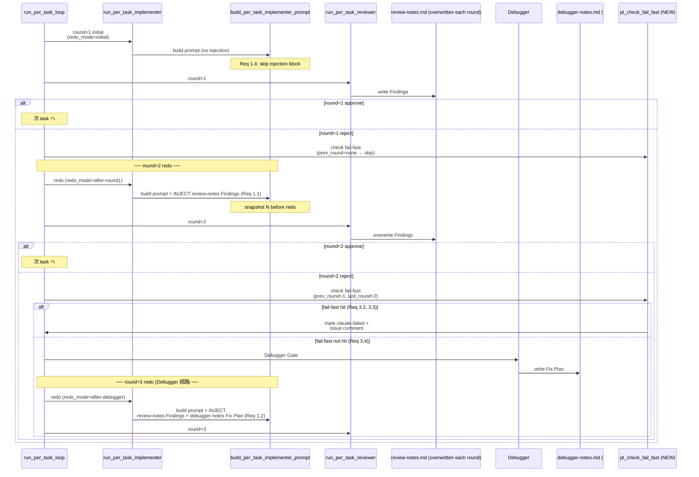

# Design Document

## Overview

**Purpose**: `PER_TASK_LOOP_ENABLED=true` の per-task ループにおいて、Reviewer reject 後の Developer
再実行 prompt に **直前 round の Reviewer Findings**（および Debugger Gate 経由 round=3 では Debugger
Fix Plan も）を **inline で強く注入**し、Developer 側に **Finding Closure Matrix の記録義務**を課す。
さらに、同一 task で同じ Finding が連続 round で reject されつつテストファイルに有意な差分が積まれない
状態を watcher が機械的に検出して `claude-failed` 化する fail-fast 経路を追加する。これにより
「同じ AC・同じ missing test が round=1/2/3 で繰り返し reject される」事象を構造的に防止する。

**Users**: idd-claude self-hosting で per-task ループを利用している運用者と、`PER_TASK_LOOP_ENABLED=true`
を設定した consumer repo の開発者。具体的な workflow は「Reviewer reject 経由の Developer 再実行」
（既存 per-task ループの round=2 / round=3 経路）。

**Impact**: 現在 `build_per_task_implementer_prompt` は task_id 1 引数のみを受け取り、Reviewer Findings
/ Debugger Fix Plan を inline 注入しない。本変更により redo 経路で同関数の呼び出し側が round 情報を
渡し、prompt builder が `review-notes.md` の `## Findings` セクション（および Debugger Gate 経由では
`debugger-notes.md` の `## Task <id>` セクション）を inline 埋め込みするようになる。同時に
`pt_check_fail_fast`（新規）が連続 reject + テスト差分なしを検出して停止する。初回 Implementer 起動・
`PER_TASK_LOOP_ENABLED=false` 経路・Reviewer round=1 で approve した経路は本機能導入前と完全に同一の
挙動を保つ（NFR 1.1, 1.2 / Req 1.4, 5.4）。

### Goals

- per-task retry 時に Developer prompt に直前 round の Reviewer Findings を inline 注入する（Req 1.1, 1.3）
- Debugger Gate 経由 round=3 では Reviewer Findings + Debugger Fix Plan を **双方とも** inline 注入する（Req 1.2）
- Developer に Finding Closure Matrix の記録規約を課し、`.claude/agents/developer.md` および
  `repo-template/.claude/agents/developer.md` に byte 一致で反映する（Req 2.1〜2.5, 4.1, 4.4, NFR 2.1）
- 連続 reject + テスト差分なしの fail-fast 検出を watcher 内に実装し、`claude-failed` で停止 +
  Issue コメントで運用者向け診断情報を残す（Req 3.1〜3.4, NFR 3.2）
- 既存 per-task ループ規約・既存 `claude-failed` 分類カテゴリ・既存 env var 名・既存 prompt builder の
  public 呼び出し箇所（`pt_extract_pending_tasks` 経由の初回起動・Stage Checkpoint 経由の per-task
  resume 起動など）を温存する（NFR 1.1〜1.3, Req 4.3）

### Non-Goals

- Reviewer reject カテゴリ（AC 未カバー / missing test / boundary 逸脱）の追加・変更・削除
  → 既存 reviewer.md の出力契約を変更しない（Req 4.2）
- Debugger 権限境界の変更（Debugger に code 修正権を与えない）
- per-task ループの round 数上限変更（round=1 / round=2 / Debugger Gate + round=3 を維持）
- 既存 spec の `impl-notes.md` への Finding Closure Matrix 遡及追記
- `PER_TASK_LOOP_ENABLED=false` 経路 / Stage A / Stage B Reviewer / Stage A Verify Gate の挙動変更
- `review-notes.md` / `debugger-notes.md` のファイル名・必須セクション名・格納場所の変更

## Architecture

### Existing Architecture Analysis

- `local-watcher/bin/issue-watcher.sh` 単一ファイルの per-task ループブロック（行 2470〜3927 周辺）に
  `pt_*` ヘルパー群 と `build_per_task_implementer_prompt` / `build_per_task_reviewer_prompt` /
  `run_per_task_implementer` / `run_per_task_reviewer` / `run_per_task_loop` が同居している。既存の
  Debugger Gate 経路は `build_dev_prompt_redo_with_fix_plan`（行 4595）で **Stage A''（単発 Implementer）**
  経路のみ Fix Plan を inline 注入しており、per-task ループ内の Debugger 経由 Implementer 再起動
  （行 3776: `run_per_task_implementer "$task_id"`）は同 prompt builder を経由しないため、Fix Plan も
  Reviewer Findings も Developer prompt には現状渡っていない（既知の課題コメントが行 3773-3774 に存在）。
- ドメイン境界は per-task ループ内 `pt_*` 関数群が「per-task 専用 namespace」、Debugger 周りは `dbg_*` /
  `build_dev_prompt_redo_with_fix_plan` が「単発 Stage A'' 用」と既に分離されている。本機能は前者の
  namespace 内に閉じて拡張する。
- Reviewer の `review-notes.md` は **round 毎に上書き**される契約（reviewer.md 行 122）のため、round=2
  起動直前に読める `review-notes.md` の `## Findings` セクションは round=1 reject 時の Findings であり、
  round=3 起動直前に読める `review-notes.md` は round=2 reject 時の Findings である（= 「直前 round」が
  自然に取得できる）。本設計はこの上書き契約を保つことで Reviewer 側の挙動を変えない（Req 4.2）。
- Debugger は round=2 reject 後に 1 task あたり 1 回だけ起動され、`debugger-notes.md` の
  `## Task <id>` セクションに Fix Plan を出力する（既存 detect_debugger_already_invoked / 行 4033 で
  task 単位 sentinel として観測される）。本機能は既存 `## Task <id>` セクション規約を再利用する。

### Architecture Pattern & Boundary Map



**Architecture Integration**:
- 採用パターン: 既存 per-task ループの **prompt builder 拡張 + namespace 内ヘルパー追加**。
  `build_per_task_implementer_prompt` の signature 拡張（既存 1 引数 → 2 引数の optional redo_mode 追加）と、
  新規 `pt_*` ヘルパー（`pt_extract_findings_block` / `pt_extract_debugger_section` /
  `pt_snapshot_review_notes` / `pt_check_fail_fast` / `pt_mark_fail_fast_failed`）の追加で実現。
  独立モジュール `local-watcher/bin/modules/per-task-retry.sh` への切り出しは行わず、既存 per-task
  ブロック（行 2468〜3927）末尾の `pt_*` ヘルパー群と同居させる（既存 `pt_*` の関数群がすべて単一
  ファイル内に集まっており、modules/ 分離は本 spec のスコープ外。Issue #181 の段階分割が完了するまで
  既存配置を踏襲する）。
- ドメイン／機能境界:
  - `pt_extract_findings_block` / `pt_extract_debugger_section` / `pt_snapshot_review_notes` /
    `build_per_task_implementer_prompt` 拡張部 = **prompt 注入ドメイン**
  - `pt_check_fail_fast` / `pt_mark_fail_fast_failed` = **fail-fast 検出ドメイン**
  - `.claude/agents/developer.md` / `repo-template/.claude/agents/developer.md` の Finding Closure Matrix
    規約 = **Developer 規約ドメイン**（byte 一致で同期）
- 既存パターンの維持:
  - `pt_log` / `pt_warn` ロガー、`qa_run_claude_stage` 経由の claude 起動、`mark_issue_failed`
    経由の `claude-failed` 化、heredoc 形式 prompt の組み立て規約
  - `build_dev_prompt_redo_with_fix_plan`（Stage A'' 単発経路）は **変更しない**。per-task 経路は
    `build_per_task_implementer_prompt` 拡張で対応する。
- 新規コンポーネントの根拠:
  - `pt_extract_findings_block` — review-notes.md の `## Findings` セクションを切り出す責務を
    `build_per_task_implementer_prompt` から分離（テスト容易性）
  - `pt_extract_debugger_section` — debugger-notes.md の `## Task <id>` セクションを切り出す（同上）
  - `pt_snapshot_review_notes` — redo 前に review-notes.md を一時退避し、redo 後の Reviewer が同名
    ファイルを上書きしても fail-fast inspector が **直前 round の Findings** を参照できるようにする
  - `pt_check_fail_fast` — 連続 reject + テスト差分なしの判定を 1 関数に集約（テスト容易性）
  - `pt_mark_fail_fast_failed` — `claude-failed` 付与 + Issue コメントの専用ヘルパー
    （既存 `pt_mark_no_progress_failed` / `pt_mark_diff_range_resolve_failed` と同パターン）

### Technology Stack

| Layer | Choice / Version | Role in Feature | Notes |
|-------|------------------|-----------------|-------|
| Scripting | bash 4+ | watcher 拡張本体 | `set -euo pipefail` 配下、配列クォート、`command -v` |
| Markdown 抽出 | awk / grep -E / sed -E | review-notes.md / debugger-notes.md セクション抽出 | 既存 `pt_extract_learnings` / `detect_blocked_marker` と同方針 |
| Git | git 2.x+ | テスト差分検出（`git diff --name-only <prev>..<curr>`） | 既存 `pt_resolve_diff_range` と同方針 |
| GitHub CLI | gh | `claude-failed` 化 + Issue コメント投稿 | 既存 `mark_issue_failed` 流用 |
| Claude CLI | claude | prompt 渡しと起動 | 既存 `qa_run_claude_stage` 経由 |
| 規約 markdown | `.claude/agents/*.md` | Developer 規約改訂（Finding Closure Matrix） | root と `repo-template/` の 2 系統 byte 一致 |
| 検証 | bash スモーク + shellcheck + diff -r | 関数単位テストと二重管理検証 | 既存 `local-watcher/test/` のスクリプト形式を踏襲 |

## File Structure Plan

### Directory Structure

```
local-watcher/
├── bin/
│   └── issue-watcher.sh                        # 既存ファイル。以下を拡張:
│                                               #   - pt_extract_findings_block (新規)
│                                               #   - pt_extract_debugger_section (新規)
│                                               #   - pt_snapshot_review_notes (新規)
│                                               #   - pt_check_fail_fast (新規)
│                                               #   - pt_mark_fail_fast_failed (新規)
│                                               #   - build_per_task_implementer_prompt signature 拡張
│                                               #   - run_per_task_loop の round=2/round=3 redo 呼び出し点改修
└── test/
    ├── pt_extract_findings_block_test.sh       # 新規: ## Findings 抽出の境界テスト
    ├── pt_extract_debugger_section_test.sh     # 新規: ## Task <id> 抽出の境界テスト
    ├── pt_check_fail_fast_test.sh              # 新規: 連続 reject + テスト差分の判定境界
    └── fixtures/
        ├── pt_extract_findings_block/
        │   ├── normal-2-findings.md
        │   ├── no-findings-section.md
        │   └── findings-with-nested-headers.md
        ├── pt_extract_debugger_section/
        │   ├── task-1-2-present.md
        │   ├── task-1-2-absent.md
        │   └── multi-task-sections.md
        └── pt_check_fail_fast/
            ├── same-category-same-target-no-test-diff.tsv
            ├── same-category-different-target.tsv
            └── different-category-with-test-diff.tsv

.claude/
└── agents/
    └── developer.md                            # Finding Closure Matrix 規約節を追記

repo-template/
└── .claude/
    └── agents/
        └── developer.md                        # 上記 root と byte 一致で同期

docs/specs/305--enhancement-per-task-retry-reviewer-deb/
├── requirements.md                             # PM 確定済（既存）
├── design.md                                   # 本ファイル（新規）
└── tasks.md                                    # 新規
```

### Modified Files

- `local-watcher/bin/issue-watcher.sh`
  - `build_per_task_implementer_prompt` の signature を `(task_id [, redo_mode])` に拡張。
    `redo_mode` のドメイン値は `initial` / `after-round1` / `after-debugger` の 3 値（既定値
    `initial` で **既存 1 引数呼び出しの後方互換**を維持）。
  - `run_per_task_loop` の round=2 redo（行 3717 付近）と Debugger 経由 round=3 redo（行 3776 付近）の
    `run_per_task_implementer "$task_id"` 呼び出しを、新規 `run_per_task_implementer_redo` 経由で
    `redo_mode` を伝搬する形に変更（後述「Components and Interfaces」参照）。
  - `run_per_task_loop` の round=2 reject 直後（Debugger Gate 判定の前）に `pt_check_fail_fast` を呼ぶ。
  - 既存 `pt_*` ヘルパー群と同じ namespace に新規ヘルパー（前述 5 関数）を追加。
- `.claude/agents/developer.md` / `repo-template/.claude/agents/developer.md`
  - 既存「per-task ループ下での Implementer の責務」節（行 369 周辺）の **直後**に
    「per-task retry 時の Finding Closure Matrix 記録義務」節を追加（Req 2.1〜2.5, 4.1, 4.4 / NFR 2.1）
  - root → repo-template に `cp` または同一文字列を貼って byte 一致を保証

## Requirements Traceability

| Requirement | Summary | Components | Interfaces | Flows |
|-------------|---------|------------|------------|-------|
| 1.1 | round=2 redo prompt に Findings inline 注入 | `build_per_task_implementer_prompt`, `pt_extract_findings_block` | prompt heredoc 内 `## 直前 round の Reviewer Findings` ブロック | round=1 reject → redo |
| 1.2 | round=3 redo prompt に Findings + Fix Plan 双方 inline 注入 | `build_per_task_implementer_prompt`, `pt_extract_findings_block`, `pt_extract_debugger_section` | prompt heredoc 内 2 ブロック | Debugger Gate → round=3 redo |
| 1.3 | 注入時に target requirement ID + カテゴリを可読保持 | `pt_extract_findings_block` | `## Findings` セクションを **そのまま埋め込む**（Target / Category 行を持つ） | 全 redo 経路 |
| 1.4 | 初回起動では注入ブロック追加しない | `build_per_task_implementer_prompt`（`redo_mode=initial`） | heredoc 分岐 | 初回 round=1 |
| 1.5 | review-notes.md 不在/抽出失敗時は注入を諦め 1 行明示 | `pt_extract_findings_block`, `build_per_task_implementer_prompt` | "(review-notes.md が見つかりません / 抽出失敗)" 1 行 + pt_log | 全 redo 経路 |
| 2.1 | Developer は impl-notes.md に Finding Closure Matrix を追記 | `developer.md` 規約節 | markdown 表テンプレ | 全 redo 経路 |
| 2.2 | Matrix は 4 項目（Target / Fix commit / Added/Updated Test / Verification） | `developer.md` 規約節 | 表ヘッダ規約 | 同上 |
| 2.3 | fix commit なしの場合「未対応」「対応不可」「持ち越し」を明示 | `developer.md` 規約節 | 表セルの enum 値 | 同上 |
| 2.4 | 先行 task / 先行 round の既存 Matrix を改変・削除・並び替えしない | `developer.md` 規約節 | 改変禁止規約 | 同上 |
| 2.5 | Debugger Fix Plan 注入時は各行に Fix Plan ステップ参照を併記 | `developer.md` 規約節 | 表に 5 列目「Fix Plan Step」追加（Debugger 経路のみ） | round=3 |
| 3.1 | 連続 2 round reject で Findings カテゴリ + target を抽出 | `pt_check_fail_fast`, `pt_snapshot_review_notes` | 関数 signature `(task_id, prev_snapshot, curr_review_notes, last_redo_sha_before, last_redo_sha_after)` | round=2 reject 直後 |
| 3.2 | 同一カテゴリ + 同一 target を 1 件以上共有 かつ テスト差分なしで watcher ログに fail-fast 検出理由を出力 | `pt_check_fail_fast`, `pt_log` | grep 可能な 1 行 `task=... fail-fast match=...` | round=2 reject 直後 |
| 3.3 | fail-fast 成立時 claude-failed 化 + Issue コメント | `pt_mark_fail_fast_failed` | `mark_issue_failed` 流用 + コメント本文テンプレ | round=2 reject 直後 |
| 3.4 | 連続 reject が共有 0 件なら fail-fast 発火せず継続 | `pt_check_fail_fast` | return 1（fail-fast 不成立）→ 既存 Debugger Gate 経路へ進む | round=2 reject 直後 |
| 3.5 | テストファイル判定基準を design.md で明示 | 後述「テストファイル判定基準」節 | 拡張子 / ディレクトリ 2 軸 | — |
| 4.1 | Developer 規約に Finding Closure Matrix 責務明示 | `developer.md` | markdown 節追加 | — |
| 4.2 | Reviewer 規約変更しない | `reviewer.md`（変更なし） | — | — |
| 4.3 | 既存 per-task Implementer prompt 制約を温存 | `build_per_task_implementer_prompt` | 既存制約節は全て維持 | 全 redo 経路 |
| 4.4 | developer.md は root + repo-template の byte 一致 | tasks.md の verify ブロックで `diff -r` 強制 | — | — |
| 5.1 | round=1 reject → round=2 経路の注入を回帰検証 | テストスクリプト | `pt_extract_findings_block_test.sh` | — |
| 5.2 | round=3 経路で review-notes + debugger-notes 双方注入を検証 | テストスクリプト | `pt_extract_findings_block_test.sh` + `pt_extract_debugger_section_test.sh` | — |
| 5.3 | fail-fast 検出条件 成立 / 不成立双方を fixture で検証 | テストスクリプト | `pt_check_fail_fast_test.sh` | — |
| 5.4 | `PER_TASK_LOOP_ENABLED=false` 経路 / 対象外 Issue で注入ブロックを構造的に skip | `build_per_task_implementer_prompt`（`redo_mode=initial` 既定） | 既存ループ非起動経路で関数自体が呼ばれない構造 | — |
| 5.5 | round=1 approve 経路で注入ブロックが prompt に追加されないことを検証 | テストスクリプト + 構造的に呼ばれない経路 | `pt_extract_findings_block_test.sh` の 1 ケース | — |
| NFR 1.1 | `PER_TASK_LOOP_ENABLED=false` で prompt / env var / label / exit code 不変 | `build_per_task_implementer_prompt`（既定 `initial` で旧 prompt と等価） | — | — |
| NFR 1.2 | round=1 approve で Implementer 起動回数不変 | `run_per_task_loop` の round=1 approve 分岐は無改変 | — | — |
| NFR 1.3 | `claude-failed` 分類カテゴリの意味不変 | 既存カテゴリ温存 + 新規 `per-task-implementer-fail-fast-loop` カテゴリのみ追加 | — | — |
| NFR 2.1 | root + repo-template の `diff -r .claude/agents` 出力空 | tasks.md verify ブロックで強制 | — | — |
| NFR 3.1 | 注入実施の事実を watcher ログに 1 行で出力 | `pt_log` 1 行 | `task=... redo_mode=... inject=review-notes,debugger-notes round=N` | redo 起動時 |
| NFR 3.2 | fail-fast 検出時 5 分以内に状況把握できる Issue コメント | `pt_mark_fail_fast_failed` | コメント本文テンプレ | fail-fast 発火時 |
| NFR 4.1 | 直近 1 round 分の Findings のみ注入 | `pt_extract_findings_block`（current review-notes.md のみ参照） | — | — |
| NFR 4.2 | Debugger Fix Plan は当該 task の `## Task <id>` のみ注入 | `pt_extract_debugger_section` | awk で当該見出しから次の `## ` まで | — |

## Components and Interfaces

### per-task retry prompt injection ドメイン

#### `pt_extract_findings_block`

| Field | Detail |
|-------|--------|
| Intent | review-notes.md から `## Findings` セクション（次の `## ` 見出し直前まで）を切り出し stdout 出力する |
| Requirements | 1.1, 1.3, 1.5, NFR 4.1 |

**Responsibilities & Constraints**
- 主責務: `## Findings` 見出し以降、次の `## ` 見出しまでの本文を **そのまま** print する
  （Target / Category / Detail / Required Action の行をそのまま運ぶ = Req 1.3 を構造的に保証）
- 既存 `pt_extract_learnings`（行 2591）の awk パターンと同方針で実装し、テスト容易性を揃える
- ファイル不在 / `## Findings` 見出し不在の場合は **空文字** を stdout、return 1 を返す（呼び出し側が
  "review-notes.md が見つかりません / 抽出失敗" 1 行を prompt に残せるようにする / Req 1.5）

**Dependencies**
- Inbound: `build_per_task_implementer_prompt` — review-notes Findings 注入ブロックの素材取得 (Critical)
- Outbound: なし（awk のみ）
- External: なし

**Contracts**: Service [x] / API [ ] / Event [ ] / Batch [ ] / State [ ]

##### Service Interface

```bash
# 戻り値: 0 = 正常抽出（stdout に Findings セクション本文） / 1 = ファイル不在 or 見出し不在
pt_extract_findings_block <review_notes_path>
```
- Preconditions: なし（ファイル不在も正常な戻り値 1 として扱う）
- Postconditions: stdout に `## Findings` 見出し含む本文を出力（return 0 時）または空文字（return 1 時）
- Invariants: `## Findings` 以外のセクションには触れない / RESULT 行（最終行）も取り込まない（次 `## ` で停止）

#### `pt_extract_debugger_section`

| Field | Detail |
|-------|--------|
| Intent | debugger-notes.md から `## Task <id>` セクション（次の `## Task ` または `## ` 見出し直前まで）を切り出し stdout 出力する |
| Requirements | 1.2, 1.5, NFR 4.2 |

**Responsibilities & Constraints**
- 主責務: 当該 task_id の `## Task <id>` 見出しから次の `## ` 見出しまでの本文を print
- 既存 `detect_debugger_already_invoked`（行 4049 周辺）の `^## Task <id>$` 行頭マッチ regex と整合
- task_id は `1.2` のような numeric 階層 ID。awk pattern では `.` をエスケープ
- 当該 `## Task <id>` 見出しが見つからない場合は空文字 + return 1

**Service Interface**

```bash
pt_extract_debugger_section <debugger_notes_path> <task_id>
```
- Preconditions: なし
- Postconditions: stdout に当該 task セクション本文 / return 1 で空文字
- Invariants: 他 task の `## Task <other_id>` セクションには触れない（NFR 4.2 を構造保証）

#### `pt_snapshot_review_notes`

| Field | Detail |
|-------|--------|
| Intent | round=2 redo / Debugger 経路 redo 起動の **直前** に現在の review-notes.md を一時ファイルに退避し、redo 後の Reviewer 上書きから「直前 round の Findings」を守る |
| Requirements | 3.1 |

**Responsibilities & Constraints**
- 退避先: `/tmp/idd-claude-${REPO_SLUG}-${NUMBER}-pt-snapshot-${task_id}-round${round}-${ts}.md`
- 退避元が存在しない場合は退避しない（空文字を stdout で返し return 0）。これは fail-fast 判定側で
  prev snapshot 不在を非マッチとして扱う（共有 Finding なし → 既存経路継続 / Req 3.4）
- 既存ファイル群（`/tmp/qa-reset-...`）と同名規約で REPO_SLUG / NUMBER / ts を埋めて衝突回避
- stdout に退避先 path を出力（呼び出し側が `pt_check_fail_fast` に渡す）

**Service Interface**

```bash
pt_snapshot_review_notes <task_id> <round>
# stdout: 退避先 path（空文字なら退避なし）
# return: 0
```

#### `build_per_task_implementer_prompt` (signature 拡張)

| Field | Detail |
|-------|--------|
| Intent | 既存の per-task Implementer prompt 組み立てに加えて、redo_mode に応じた Reviewer Findings / Debugger Fix Plan の inline 注入ブロックを heredoc 内で追加する |
| Requirements | 1.1, 1.2, 1.3, 1.4, 1.5, 4.3, NFR 3.1, NFR 4.1, NFR 4.2 |

**Responsibilities & Constraints**
- signature: `build_per_task_implementer_prompt <task_id> [<redo_mode>]`
  - `redo_mode` ∈ { `initial`（既定）, `after-round1`, `after-debugger` }
  - 既定値 `initial` で従来 1 引数呼び出しと **完全に同一の prompt を生成**する（NFR 1.1 を構造保証）
  - 新規 wrapper `run_per_task_implementer_redo` は内部で `redo_mode` を受け取り
    `build_per_task_implementer_prompt "$task_id" "$redo_mode"` を呼ぶ。既存
    `run_per_task_implementer` は変更しない（NFR 1.1）
- 注入ブロックは heredoc 内で `## 直前 round の Reviewer Findings` / `## Debugger の Fix Plan`
  の 2 種類を `redo_mode` の値に応じて条件分岐で追加する
- Finding Closure Matrix 記録規約への参照を redo 経路 prompt のみに追加（`developer.md` の規約節を
  参照する形式 / Req 2.1, 2.5）
- 既存制約節（PR 作成禁止 / spec 書き換え禁止 / 対象 task 以外への着手禁止 / 進捗マーカー更新規約 /
  `### Task <id>` 追記規約）は **全て温存** / Req 4.3
- 抽出失敗時の 1 行明示（Req 1.5）: `pt_extract_findings_block` / `pt_extract_debugger_section` の
  return 1 を吸収して prompt 本文に「(review-notes.md が見つかりません / 抽出失敗のため Findings の
  inline 注入を諦めました)」等のヒアドキュメントを残す
- 注入実施時に `pt_log "task=... redo_mode=... inject=... round=..."` を 1 行出力（NFR 3.1）

**Service Interface**

```bash
build_per_task_implementer_prompt <task_id> [<redo_mode>]
# redo_mode 既定値: "initial"
# stdout: 組み立て済み prompt 全文
# return: 0（heredoc は失敗しない / set -e で吸収）
```

##### Prompt structure（redo_mode 別）

| Section | initial | after-round1 | after-debugger |
|---------|:-------:|:------------:|:--------------:|
| 対象 Issue / 作業ブランチ / 対象 task / 進め方 / learnings / 制約 / 既存 commit 温存 | ○ | ○ | ○ |
| **新規: ## 直前 round の Reviewer Findings**（`pt_extract_findings_block` 出力 inline） | — | ○ | ○ |
| **新規: ## Debugger の Fix Plan**（`pt_extract_debugger_section` 出力 inline） | — | — | ○ |
| **新規: ## Finding Closure Matrix の記録義務**（developer.md の規約参照） | — | ○ | ○ |

### fail-fast 検出ドメイン

#### `pt_check_fail_fast`

| Field | Detail |
|-------|--------|
| Intent | 連続 2 round（round=1 reject + round=2 reject）の Findings が「同一カテゴリ かつ 同一 numeric requirement ID」を 1 件以上共有 かつ 直近 round の Developer 再実行で **テストファイル**に差分が積まれていないことを検出する |
| Requirements | 3.1, 3.2, 3.4, 3.5 |

**Responsibilities & Constraints**
- 入力:
  - `task_id`: 対象 task
  - `prev_snapshot_path`: round=1 直後に取得した review-notes.md スナップショット（空文字なら未取得 → 不成立）
  - `curr_review_notes_path`: round=2 reject 直後の review-notes.md
  - `last_redo_sha_before`: round=2 redo Developer 起動 **直前**の HEAD SHA
  - `last_redo_sha_after`: round=2 reject **時点**の HEAD SHA（= 現在の HEAD）
- 判定アルゴリズム:
  1. 両 review-notes.md から `### Finding <n>` ブロックを抽出し、各 Finding の `Target` 行 +
     `Category` 行を `<category>\t<target>` の tuple set として取得（既存
     `parse_review_result` 出力の `categories` / `targets` は **task 単位での集約**であり
     Finding ごとの組み合わせを保持しないため、本機能専用に独自抽出を行う）
  2. 両 set の積集合が空ならば return 1（fail-fast 不成立 / Req 3.4）
  3. `git diff --name-only "$last_redo_sha_before".."$last_redo_sha_after"` で変更ファイル一覧を取得
  4. 変更ファイル一覧に「テストファイル」（後述判定基準）が **1 件も含まれない** ならば return 0
     （fail-fast 成立 / Req 3.2）。1 件以上含まれるなら return 1（不成立）
- 出力:
  - return 0 (fail-fast 成立): stdout に 1 行 `task=<id> fail-fast match category=<cat> target=<tgt>
    test-diff-empty range=<before>..<after>` を出力（呼び出し側が `pt_log` 経由で記録 / Req 3.2）
  - return 1 (不成立): 何も stdout に出力しない

**テストファイル判定基準** (Req 3.5):
- **採用基準: 拡張子 + ディレクトリの 2 軸 OR 結合**
  - 拡張子: `_test.sh` / `.test.ts` / `.test.tsx` / `.test.js` / `.test.jsx` / `.spec.ts` /
    `.spec.tsx` / `.spec.js` / `.spec.jsx` / `_test.go` / `_test.py` / `test_*.py` のいずれか
  - ディレクトリ: パスに `/test/` / `/tests/` / `/__tests__/` / `/spec/` のいずれかが含まれる
  - markdown fixture（`local-watcher/test/fixtures/**`）も「テスト関連差分」として **テストファイル扱い**
- 上記の OR を満たすファイルが 1 件でも `git diff --name-only` 出力に含まれれば「テスト差分あり」と判定
- **代替案として「拡張子のみ」も検討したが**、idd-claude の watcher テスト群（`local-watcher/test/*_test.sh`）は
  ディレクトリと拡張子の両方で識別される慣習があり、両軸併用が運用直感と合致するため OR 結合を採用
- consumer repo の言語慣習による false positive / false negative は許容（fail-fast は安全装置であり、
  fail-fast に当たらず Debugger Gate に進むのは元々の経路に戻るだけ / Req 3.4）

#### `pt_mark_fail_fast_failed`

| Field | Detail |
|-------|--------|
| Intent | fail-fast 検出時に `claude-failed` 化 + 運用者向け診断 Issue コメントを投稿する |
| Requirements | 3.3, NFR 1.3, NFR 3.2 |

**Responsibilities & Constraints**
- 既存 `pt_mark_no_progress_failed` / `pt_mark_diff_range_resolve_failed` と同パターンで
  `mark_issue_failed` に `per-task-implementer-fail-fast-loop` カテゴリで委譲する
- カテゴリ名は既存カテゴリ群（`per-task-implementer-failed` /
  `per-task-implementer-redo-failed` / `per-task-implementer-pp-failed` /
  `per-task-implementer-no-progress` 等）と並ぶ **新規追加**であり、既存カテゴリの意味は変更しない
  （NFR 1.3）
- Issue コメント本文（Req 3.3 / NFR 3.2）:
  - 検出条件: 連続 2 round（round=1 + round=2）の Findings で共有された Finding（category + target）
  - 対象 `task_id`
  - 連続 reject 対象の Finding 概要（Target / Category）
  - 運用者向け判断材料へのパス: `${SPEC_DIR_REL}/review-notes.md` / `${SPEC_DIR_REL}/debugger-notes.md`
    (Debugger Gate 経由 round=3 を経た場合のみ存在) / `${SPEC_DIR_REL}/impl-notes.md` / `$LOG`
  - 次の手順: 「review-notes.md / impl-notes.md を読み Finding の妥当性を確認」「妥当なら手動修正 +
    claude-failed 解除」「妥当でなければ Architect 差し戻し」

**Service Interface**

```bash
pt_mark_fail_fast_failed <task_id> <category> <target>
# 副作用: claude-failed 付与 + Issue コメント
# return: 0（mark_issue_failed の return をそのまま伝搬）
```

### Developer 規約ドメイン

#### `.claude/agents/developer.md` の追記節

| Field | Detail |
|-------|--------|
| Intent | per-task retry 経路で Developer に Finding Closure Matrix の記録義務を課す |
| Requirements | 2.1, 2.2, 2.3, 2.4, 2.5, 4.1, 4.4, NFR 2.1 |

**追記節の構成**:
- 配置: 既存「per-task ループ下での Implementer の責務」節 → 「learning 追記の責務」節の **直後**
- 適用範囲: `PER_TASK_LOOP_ENABLED=true` かつ prompt 本文に「## 直前 round の Reviewer Findings」
  注入ブロックが含まれる redo 経路のみ。初回起動 / `PER_TASK_LOOP_ENABLED=false` では本節を適用しない
  （Developer は prompt から本節該当の指示が無いことを観察して skip する。Req 1.4 / 5.5 / NFR 1.1）
- Matrix の構造（規約テンプレ）:

```markdown
### Task <id> — Finding Closure Matrix (round=<N>)

| Finding | Target | Fix Commit | Added/Updated Test | Verification |
|---------|--------|------------|--------------------|--------------|
| Finding 1 | 1.1 (AC 未カバー) | <短縮 SHA> docs/specs 反映 | `local-watcher/test/foo_test.sh` 追加 | `bash foo_test.sh` 全 pass |
| Finding 2 | boundary:Watcher | 未対応（理由: 仕様確認待ち、次 round へ持ち越し） | — | — |
```

- 5 列目「Fix Plan Step」は **Debugger Gate 経由 round=3 でのみ追記**（Req 2.5）:

```markdown
| Finding | Target | Fix Commit | Added/Updated Test | Verification | Fix Plan Step |
|---------|--------|------------|--------------------|--------------|---------------|
| Finding 1 | 1.1 (missing test) | <SHA> | `foo_test.sh` 追加 | 全 pass | Fix Plan 修正手順 (2) |
```

- 改変・削除・並び替え禁止規約（Req 2.4）:
  - 「先行 task の `### Task <id> — Finding Closure Matrix (round=<N>)` 見出し および本文は
    改変・削除・並び替えしない」
  - 「先行 round の既存 Matrix 行は改変・削除・並び替えしない（新規 round の Matrix は新規見出しで
    追加する）」
- 「未対応」「対応不可」「次 round へ持ち越し」の enum 値を `Fix Commit` 列で明示する規約（Req 2.3）
- 二重管理規約遵守（NFR 2.1, Req 4.4）: 同一文字列を root と `repo-template/` の両系統に貼り、
  tasks.md 末尾の構造化 verify ブロックで `diff -r .claude/agents repo-template/.claude/agents` を強制

## Data Models

### Domain Model

- **Finding**: review-notes.md の `### Finding <n>` ブロックに対応するドメインエンティティ。
  属性は `category`（AC 未カバー / missing test / boundary 逸脱）と `target`（numeric requirement ID
  または `boundary:<component>`）。同一 Finding の同一性判定は `(category, target)` の組で行う
  （fail-fast 判定 / Req 3.2）。
- **Finding Closure Matrix**: Developer が impl-notes.md に追記する markdown 表。各行が 1 つの
  Finding と fix commit / 追加テスト / 検証結果 / （Debugger 経路のみ）Fix Plan ステップ参照を
  紐付ける。round 単位で追記され、先行 round の行は不変。
- **Redo Mode**: per-task Implementer 起動時の redo フェーズを表す enum。`initial` / `after-round1` /
  `after-debugger` の 3 値。`build_per_task_implementer_prompt` の prompt 構造分岐の鍵。

### Logical Data Model

- `review-notes.md` のセクション構造（既存 reviewer.md 出力契約 / 不変）:
  - `# Review Notes` (h1)
  - `<!-- idd-claude:review round=N model=... timestamp=... -->`
  - `## Reviewed Scope` / `## Verified Requirements` / `## Findings` / `## Summary`
  - 最終行: `RESULT: approve` または `RESULT: reject`
- `debugger-notes.md` のセクション構造（既存 / 不変）:
  - `# Debugger Notes` (h1)
  - `## Task <id>` (per-task の Fix Plan セクション)
  - 配下に `### 根本原因` / `### 修正手順` / `### 検証方法` / `### 残存リスク` の h3 群
- `impl-notes.md` の Finding Closure Matrix の配置:
  - 既存 `## Implementation Notes` h2 セクション配下の `### Task <id>` h3 セクション末尾に追記
  - Matrix の見出しは `### Task <id> — Finding Closure Matrix (round=<N>)`
  - **複数 round 分の Matrix が並ぶ可能性あり**（round=2 の追記 + round=3 の追記）

### Physical Data Model

- `pt_snapshot_review_notes` の退避先: `/tmp/idd-claude-${REPO_SLUG}-${NUMBER}-pt-snapshot-${task_id}-round${round}-${ts}.md`
- `pt_log` ログ行（grep 可能 1 行）:
  - 注入時: `task=<id> redo_mode=<mode> inject=<comma-sep-files> round=<N>`
  - fail-fast 成立: `task=<id> fail-fast match category=<cat> target=<tgt> test-diff-empty range=<before>..<after>`
  - fail-fast 不成立: `task=<id> fail-fast skip reason=<no-shared-finding|test-diff-present|prev-snapshot-missing>`

## Error Handling

### Error Strategy

- **Best-effort 注入**: review-notes.md / debugger-notes.md の読み込み失敗時は注入を **諦め**、
  prompt 本文に明示 1 行を残して Developer 起動を継続する（Req 1.5）。Developer 起動を止めない
  ことで「ファイル取り扱いの不確実性が Issue を停止させる」事故を避ける。
- **fail-fast の安全側設計**: 判定不能（prev_snapshot_path 空 / 抽出失敗）の場合は fail-fast を
  発火させず既存経路を継続する（Req 3.4）。誤検出による不要 `claude-failed` を抑える方向に倒す。
- **既存 `mark_issue_failed` 流用**: `pt_mark_fail_fast_failed` は既存
  `pt_mark_no_progress_failed` / `pt_mark_diff_range_resolve_failed` と同じ
  `mark_issue_failed <category> <extra_body>` 経路に乗せ、ラベル付け替え + Issue コメントの
  実装を新規追加しない（既存規約温存 / NFR 1.3）。

### Error Categories and Responses

- **User Errors (該当なし)**: 本機能は内部処理であり HTTP 4xx 相当のユーザー入力エラーは存在しない
- **System Errors（注入失敗）**:
  - `pt_extract_findings_block` return 1 → prompt 本文に 1 行明示 + `pt_log "... inject=skipped reason=findings-extract-failed"`
  - `pt_extract_debugger_section` return 1 → 同上（`inject=skipped reason=debugger-section-not-found`）
  - `pt_snapshot_review_notes` の `/tmp` 書き込み失敗 → snapshot path 空文字 → fail-fast 不成立扱い
- **Business Logic Errors（fail-fast 検出）**:
  - 検出成立 → `claude-failed` + Issue コメント（運用者判断待ち）
  - 検出不成立 → 既存 Debugger Gate 経路へ進む（既存挙動温存 / Req 3.4）

## Testing Strategy

- **Unit Tests (shell function 単位)**:
  1. `pt_extract_findings_block` — `## Findings` が存在する正常系で本文を返す
  2. `pt_extract_findings_block` — `## Findings` 不在で空文字 + return 1
  3. `pt_extract_debugger_section` — 当該 `## Task <id>` 存在で本文を返す（他 task は混入しない）
  4. `pt_extract_debugger_section` — 当該 task 不在で空文字 + return 1
  5. `pt_check_fail_fast` — 同一カテゴリ + 同一 target + テスト差分なし → return 0
  6. `pt_check_fail_fast` — 同一カテゴリ + 同一 target だが テスト差分あり → return 1
  7. `pt_check_fail_fast` — カテゴリ違い or target 違いで共有なし → return 1

- **Integration Tests (フロー横断)**:
  1. `build_per_task_implementer_prompt <task_id> initial` の出力が既存 1 引数呼び出しと **同一**
     （既存 prompt diff 0 行で NFR 1.1 を保証）
  2. `build_per_task_implementer_prompt <task_id> after-round1` の出力に
     `## 直前 round の Reviewer Findings` ブロックと Finding Closure Matrix 規約参照が含まれる
  3. `build_per_task_implementer_prompt <task_id> after-debugger` の出力に
     `## 直前 round の Reviewer Findings` と `## Debugger の Fix Plan` の **両方**のブロックと
     5 列 Matrix 規約参照が含まれる

- **E2E Tests**: idd-claude self-hosting で本 spec の実装後に test Issue を立て、watcher が
  per-task ループの round=2 redo で Findings 注入を実施し、Developer agent が Finding Closure
  Matrix を impl-notes.md に追記することを目視確認（dogfooding）。

- **Regression Tests（既存挙動温存）**:
  1. `PER_TASK_LOOP_ENABLED=false` 経路の prompt diff が 0 行（NFR 1.1）
  2. round=1 approve 経路で `run_per_task_implementer` の起動回数が task あたり 1 回（NFR 1.2）
  3. `diff -r .claude/agents repo-template/.claude/agents` 出力空（NFR 2.1）
  4. `shellcheck local-watcher/bin/issue-watcher.sh` 警告ゼロ
  5. 既存 `pt_*` テストスクリプト群（`stage_a_verify_round1_defer_test.sh` 等）が 1 件も壊れない

## Security Considerations

- prompt 本文に inline 注入される `review-notes.md` / `debugger-notes.md` の本文は **既に同一 repo の
  Reviewer / Debugger サブエージェントが生成したもの**であり、外部入力の取り込みではない。注入経路で
  新たな信頼境界を跨がないため、追加のサニタイズは不要。
- `pt_snapshot_review_notes` の `/tmp` 退避ファイルは `${REPO_SLUG}-${NUMBER}-pt-snapshot-...` の
  命名で衝突回避され、レース condition でも誤った task の snapshot を読まないように REPO_SLUG +
  NUMBER + task_id + round + ts の 5 要素で隔離する（既存 `/tmp/qa-reset-...` と同方針）。
- `gh issue comment` の本文は `mark_issue_failed` 経由で投稿され、既存の Issue コメント投稿経路の
  信頼境界を継承する（新規追加なし / NFR 1.3）。

## Supporting References

- 既存 per-task ループの設計: `docs/specs/21-phase-2-per-task-tdd-implementation-loop/design.md`
- Debugger Gate の設計: `docs/specs/22-phase-3-debugger-subagent-blocked-2-reje/design.md`
- 既存 `build_dev_prompt_redo_with_fix_plan`（単発 Stage A'' 経路 / 行 4595）: 本 spec は
  per-task 経路に閉じて拡張するため、Stage A'' 経路の同関数は **変更しない**
- 既存 `pt_extract_learnings`（行 2591）: awk によるセクション抽出パターンを `pt_extract_findings_block`
  / `pt_extract_debugger_section` に踏襲
