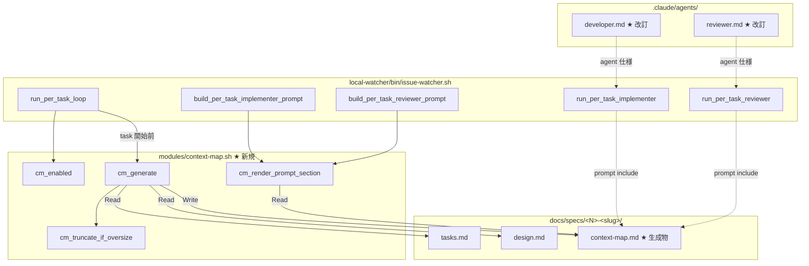

# Design Document

## Overview

**Purpose**: per-task Implementer ループ（`PER_TASK_LOOP_ENABLED=true`）で task 件数が
増えるほど反復される広域 grep / glob を抑止するため、watcher 側で `_Boundary:_` / design.md の
File Structure Plan / 関連 spec から短い構造化 context metadata（`context-map.md`）を
**決定論的に**生成し、後段の per-task Developer / Reviewer prompt に注入する仕組みを追加する。

**Users**: idd-claude 運用者（opt-in 試験導入する人）と、その配下で稼働する per-task Developer /
per-task Reviewer agent。生成された context-map.md は agent の「広域探索を行う前にまず参照する
一次情報」として機能し、token 消費の山を平らにする。

**Impact**: 既存 watcher 本体 `local-watcher/bin/issue-watcher.sh` に **新規 env flag
`CONTEXT_MAP_ENABLED` の解釈**と **per-task Developer / Reviewer 起動直前の context-map.md
生成 hook**を追加する。生成ロジック自体は新規モジュール
`local-watcher/bin/modules/context-map.sh` に集約し、本体は call site のみを持つ（既存
modules 分割方針 #181 Part 3 に準拠）。`CONTEXT_MAP_ENABLED` 未設定では既存挙動と差分等価
（NFR 1.1）。

### Goals

- per-task Developer / per-task Reviewer の **広域探索を抑止**できるだけの最小限な構造化
  metadata を決定論的に生成する
- `CONTEXT_MAP_ENABLED=true` でのみ動作し、未設定では既存挙動を **差分等価**で保つ
- 生成ロジックは独立モジュール `modules/context-map.sh` に集約し、`shellcheck` 警告ゼロで通過
- `.claude/agents/developer.md` / `.claude/agents/reviewer.md` の改訂を **root と
  `repo-template/` の byte 一致**で行う
- 生成 / 注入の有無を bash テスト（fixture + スモークスクリプト）で検証できる

### Non-Goals

- reasoning effort / model default の変更
- per-task ループの並列度 default 変更
- LLM scout agent の新規起動（決定論的生成のみ）
- 完全な repo-wide index の導入（context-map.md は 1 task 局所の指示書に留める）
- `PER_TASK_LOOP_ENABLED=true` 以外の単一実装パス（既存 Stage A 一括 Developer フロー）への
  注入
- CLAUDE.md / README 以外の consumer 固有ドキュメントの自動配布
- 過去 spec の context-map.md retrofit 生成
- Debugger agent prompt への注入（Open Question として残置。本 spec では Developer /
  Reviewer のみ）

## Architecture

### Existing Architecture Analysis

per-task ループは `local-watcher/bin/issue-watcher.sh` 内の
`run_per_task_loop` （行 4130〜）を dispatcher として持ち、task 1 件ごとに以下の関数群を呼ぶ:

- `build_per_task_implementer_prompt <task_id> [<redo_mode>]`（行 3290〜）—— Implementer 用
  prompt 組み立て（heredoc）
- `run_per_task_implementer <task_id>`（行 3655〜）—— fresh Claude session で Implementer 起動
- `run_per_task_implementer_redo <task_id> <redo_mode>`（行 3726〜）—— round=2 / round=3 redo
- `build_per_task_reviewer_prompt <task_id> <range_start> <range_end> <round> <prev_result>`
  （行 3560〜）—— Reviewer 用 prompt 組み立て
- `run_per_task_reviewer <task_id> <round>`（行 3798〜）—— fresh Claude session で Reviewer 起動

prompt 組み立ては bash heredoc で行い、`${SPEC_DIR_REL}` / `${task_id}` / `${REPO_DIR}` 等の
グローバル変数を遅延展開する。既存 modules（`stage-a-verify.sh` 等）は本体冒頭の
`REQUIRED_MODULES` 配列で source される。

### Architecture Pattern & Boundary Map



**Architecture Integration**:

- **採用パターン**: 既存 `modules/<name>.sh` 切り出しパターン（#181 Part 3）に準拠。
  context-map 専用ロジックを新規モジュール `modules/context-map.sh` として独立分離し、
  本体は (1) env flag 解釈、(2) call site の 2 点のみを持つ
- **ドメイン境界**: 「context map の生成 + 注入文字列生成」と「per-task ループの dispatcher / prompt
  組み立て」を分離する。本体は call site / モジュールは純粋な input → output 変換
- **既存パターンの維持**: heredoc 内のグローバル変数展開（`${SPEC_DIR_REL}` 等）、`pt_log` /
  `pt_warn` ロガー形式、`REQUIRED_MODULES` source 機構を踏襲
- **新規コンポーネントの根拠**: 既存 module は粒度が大きすぎ、また `stage-a-verify.sh` 等とは
  起動タイミングと依存が異なるため独立モジュール化する方が責務が明瞭。本体内 inline 化は
  本体 6000 行超に行を追加することで可読性を低下させるため不採用

### Technology Stack

| Layer | Choice / Version | Role in Feature | Notes |
|-------|------------------|-----------------|-------|
| Frontend / CLI | n/a | — | 本機能は CLI / UI を持たない |
| Backend / Services | bash 4+ | watcher / module の実装言語 | 既存運用と同等 |
| Data / Storage | markdown file (`context-map.md`) | 生成物の永続化 | spec ディレクトリ配下に保存 |
| Messaging / Events | n/a | — | 同期呼び出しのみ |
| Infrastructure / Runtime | cron / launchd | watcher 起動基盤 | 既存運用と同等 |

## File Structure Plan

### Directory Structure

```
local-watcher/bin/
├── issue-watcher.sh                # 改訂: CONTEXT_MAP_ENABLED 解釈 / REQUIRED_MODULES 追加 /
│                                   #       per-task 起動直前の cm_generate 呼出 /
│                                   #       prompt builder 内で cm_render_prompt_section 呼出
└── modules/
    └── context-map.sh              # 新規: 以下の関数を提供
                                    #   - cm_log / cm_warn / cm_error (logger)
                                    #   - cm_enabled                  (env flag 厳密判定)
                                    #   - cm_resolve_boundary          (tasks.md から _Boundary:_ 抽出)
                                    #   - cm_resolve_candidate_files   (design.md File Structure Plan 解析)
                                    #   - cm_resolve_candidate_tests   (test/spec ファイル候補抽出)
                                    #   - cm_resolve_candidate_docs    (docs ファイル候補抽出)
                                    #   - cm_compose                   (context-map.md 本文生成)
                                    #   - cm_truncate_if_oversize      (上限超過時の要約)
                                    #   - cm_generate                  (entry point: 全工程の取りまとめ)
                                    #   - cm_render_prompt_section     (prompt 注入用文字列を stdout)

docs/specs/313-feat-watcher-context-map-per-task-agent/
├── requirements.md                 # 既存（PM 確定済）
├── design.md                       # 新規（本ファイル）
├── tasks.md                        # 新規
└── test-fixtures/                  # 新規（Task 5 のスモークテスト用）
    ├── tasks-sample.md             # _Boundary:_ を含む擬似 tasks.md
    ├── design-sample.md            # File Structure Plan を含む擬似 design.md
    ├── test-cm-generate.sh         # context-map.md 生成検証スクリプト
    ├── test-cm-disabled.sh         # CONTEXT_MAP_ENABLED 未設定時に生成しないことの検証
    └── test-cm-inject.sh           # prompt builder への注入文字列が含まれることの検証

.claude/agents/                     # root 系統（idd-claude self-hosting 用）
├── developer.md                    # 改訂: 「広域 grep / glob の前に context-map.md を参照」追記
└── reviewer.md                     # 改訂: 「diff range 評価時の探索起点として context-map.md を参照」追記

repo-template/.claude/agents/       # repo-template 系統（consumer 配布用）
├── developer.md                    # 改訂: root と byte 一致
└── reviewer.md                     # 改訂: root と byte 一致

README.md                           # 改訂: CONTEXT_MAP_ENABLED の意味 / 既定値 / 動作前提 / 生成パス /
                                    #       スコープ外項目を追記
```

### Modified Files

- `local-watcher/bin/issue-watcher.sh` —— (1) Config ブロック（行 460 付近）に
  `CONTEXT_MAP_ENABLED="${CONTEXT_MAP_ENABLED:-false}"` を追加、(2) `REQUIRED_MODULES`
  （行 685）に `"context-map.sh"` を追加、(3) `run_per_task_loop` 内の各 task 開始処理
  （Implementer / Reviewer 起動前）で `cm_enabled && cm_generate "$task_id"` を呼ぶ、
  (4) `build_per_task_implementer_prompt` / `build_per_task_reviewer_prompt` の heredoc 末尾
  直前で `cm_enabled && cm_render_prompt_section "$task_id"` の出力を embed する
- `local-watcher/bin/modules/context-map.sh` —— 新規モジュール（前節 Directory Structure 参照）
- `.claude/agents/developer.md` / `repo-template/.claude/agents/developer.md` —— 「実装ルール」節と
  「実装フロー」節に、`CONTEXT_MAP_ENABLED=true` 環境下では `docs/specs/<N>-<slug>/context-map.md`
  を **広域 grep / glob より先に必読**として加える旨を追記（両系統 byte 一致）
- `.claude/agents/reviewer.md` / `repo-template/.claude/agents/reviewer.md` —— 「必ず先に読むルール」
  節に context-map.md を必読ファイル一覧に加え、diff range 評価時の探索起点として参照する
  指示を追記（両系統 byte 一致）
- `README.md` —— `CONTEXT_MAP_ENABLED` env var / 動作前提（`PER_TASK_LOOP_ENABLED=true`
  必須）/ 生成パス / スコープ外項目を「オプション機能一覧」の節に追記

## Requirements Traceability

| Requirement | Summary | Components | Interfaces | Flows |
|-------------|---------|------------|------------|-------|
| 1.1 | `=true` で有効化 | `issue-watcher.sh` Config / `modules/context-map.sh` | `cm_enabled` | Config 解釈 → call site 分岐 |
| 1.2 | `=true` 以外で無効・差分等価 | `cm_enabled` | 厳密一致判定 | gate 不通過時の no-op |
| 1.3 | `True`/`1`/`yes` は無効 | `cm_enabled` | `[ "$CONTEXT_MAP_ENABLED" = "true" ]` | string 一致 |
| 1.4 | `PER_TASK_LOOP_ENABLED=true` でなければ動かない | `run_per_task_loop` のみが call site | call site 配置 | per-task ループ外では cm_generate 呼出なし |
| 2.1 | task 実行開始前に生成 | `run_per_task_loop` / `cm_generate` | call site | task ループ冒頭 |
| 2.2 | task ID / task 名を記録 | `cm_compose` | markdown section | 出力本文 |
| 2.3 | `_Boundary:_` を記録 | `cm_resolve_boundary` / `cm_compose` | grep tasks.md | 出力本文 |
| 2.4 | File Structure Plan から候補ファイル | `cm_resolve_candidate_files` | design.md パース | 出力本文 |
| 2.5 | 候補テスト | `cm_resolve_candidate_tests` | 命名規約 + design.md | 出力本文 |
| 2.6 | 候補 docs | `cm_resolve_candidate_docs` | spec ディレクトリ走査 | 出力本文 |
| 2.7 | 探索制約を記録 | `cm_compose` | 固定 boilerplate + 動的補完 | 出力本文 |
| 2.8 | reasoning を含めない | `cm_compose` | 決定論的 bash 生成のみ | LLM を経由しない |
| 2.9 | `_Boundary:_` 解決不能でも生成完了 | `cm_resolve_boundary` / `cm_compose` | fallback テンプレ | 「解決不能」明示で生成完遂 |
| 2.10 | 出力サイズ上限 | `cm_truncate_if_oversize` | 行数 / バイト上限 | 超過時に要約 |
| 3.1 | Developer prompt に context map | `build_per_task_implementer_prompt` / `cm_render_prompt_section` | heredoc embed | prompt 末尾 |
| 3.2 | Reviewer prompt に context map | `build_per_task_reviewer_prompt` / `cm_render_prompt_section` | heredoc embed | prompt 末尾 |
| 3.3 | Developer は広域 grep より先に参照 | `.claude/agents/developer.md` | 散文指示 | agent 仕様 |
| 3.4 | Reviewer は diff range 評価起点 | `.claude/agents/reviewer.md` | 散文指示 | agent 仕様 |
| 3.5 | 未設定では prompt 不変 | `cm_enabled` ガード | 短絡評価 | 既存 prompt と byte 一致 |
| 4.1 | developer.md の両系統反映 | root / `repo-template/` | 同一バイナリ | `diff -r` 空 |
| 4.2 | reviewer.md の両系統反映 | root / `repo-template/` | 同一バイナリ | `diff -r` 空 |
| 4.3 | `diff -r .claude/agents repo-template/.claude/agents` 空 | 検証手順 | `diff -r` コマンド | スモーク |
| 5.1〜5.4 | README 更新 | `README.md` | 散文 | オプション機能一覧節 |
| 6.1〜6.3 | bash テストで検証 | `test-fixtures/` 配下 | shell script | スモークスクリプト |
| NFR 1.1〜1.4 | 後方互換性 | call site gate | 短絡評価 | 設定無効時 no-op |
| NFR 2.1 | 冪等性 | `cm_generate` | 決定論的入力→出力 | 同一入力で同一出力 |
| NFR 2.2 | sudo 不要 | bash 標準コマンドのみ | shellcheck 通過 | — |
| NFR 2.3 | 生成エラー時 fallback | `cm_generate` の `|| true` ガード | 例外 → 警告ログ | watcher は継続 |
| NFR 3.1 | shellcheck ゼロ | `modules/context-map.sh` | `set -euo pipefail` なし（本体側宣言） | CI 手動チェック |
| NFR 3.2 | 既存規約 | 全体 | `set -euo pipefail` 本体側 | — |
| NFR 4.1 | サイズ上限具体値 | `cm_truncate_if_oversize` | 200 行 / 8 KB | 後述 |

## Components and Interfaces

### Module: `local-watcher/bin/modules/context-map.sh`

#### `cm_enabled`

| Field | Detail |
|-------|--------|
| Intent | `CONTEXT_MAP_ENABLED` が **厳密に** `"true"` のときのみ rc=0 を返す gate |
| Requirements | 1.1, 1.2, 1.3, 1.4, 3.5, NFR 1.1 |

**Responsibilities & Constraints**

- 主責務: env flag の正規化判定。`true` lowercase 厳密一致のみ rc=0、それ以外（未設定 / 空文字 /
  `True` / `1` / `yes` / 任意の値）は rc=1
- 追加条件: `PER_TASK_LOOP_ENABLED` も `true` 厳密一致でなければ rc=1（Req 1.4）
- 副作用なし。冪等

**Dependencies**

- Inbound: `run_per_task_loop` / `build_per_task_implementer_prompt` /
  `build_per_task_reviewer_prompt` — gate 判定 (Critical)
- Outbound: なし
- External: 環境変数 `CONTEXT_MAP_ENABLED`, `PER_TASK_LOOP_ENABLED`

**Contracts**: Service [x] / API [ ] / Event [ ] / Batch [ ] / State [ ]

##### Service Interface

```bash
# cm_enabled
# Returns: 0 if context map feature is active in current run, 1 otherwise.
# Side effects: none.
cm_enabled() { ... }
```

- Preconditions: 環境変数が読み取り可能
- Postconditions: 戻り値のみ、stdout/stderr に出力しない
- Invariants: 同一入力（env）に対し常に同一戻り値

#### `cm_generate <task_id>`

| Field | Detail |
|-------|--------|
| Intent | 当該 task 用の `context-map.md` を `$REPO_DIR/$SPEC_DIR_REL/context-map.md` に生成 / 更新 |
| Requirements | 2.1〜2.10, NFR 2.1, NFR 2.3 |

**Responsibilities & Constraints**

- 主責務: 入力（tasks.md / design.md / spec ディレクトリ）から構造化 metadata を組み立て、
  決定論的に context-map.md を出力する
- LLM を一切呼ばない（決定論的）。前段 agent の reasoning は含めない（Req 2.8）
- 生成失敗（read 失敗 / 解析失敗）時は warn ログを残し rc=0 で抜ける（per-task ループを止めない /
  NFR 2.3）。`set -e` の影響で abort しないよう、内部の失敗候補は `|| true` でガード

**Dependencies**

- Inbound: `run_per_task_loop` (Critical)
- Outbound: `cm_resolve_boundary` / `cm_resolve_candidate_files` / `cm_resolve_candidate_tests` /
  `cm_resolve_candidate_docs` / `cm_compose` / `cm_truncate_if_oversize`
- External: `grep` / `awk` / `sed` / 標準 file I/O

**Contracts**: Service [x] / API [ ] / Event [ ] / Batch [ ] / State [ ]

##### Service Interface

```bash
# cm_generate <task_id>
# Writes/overwrites: $REPO_DIR/$SPEC_DIR_REL/context-map.md
# Returns: always 0 (errors are logged via cm_warn; per-task loop must not be aborted)
cm_generate() {
  local task_id="$1"
  ...
}
```

- Preconditions: `$REPO_DIR` / `$SPEC_DIR_REL` がグローバル変数として解決済み、tasks.md が存在
- Postconditions: context-map.md が存在し、Req 2.2〜2.7 の各セクションを含む
- Invariants: 同一 (tasks.md, design.md, task_id) 入力に対し同一 output（NFR 2.1）

#### `cm_resolve_boundary <tasks_md_path> <task_id>`

| Field | Detail |
|-------|--------|
| Intent | tasks.md から当該 task の `_Boundary:_` 行を抽出し、カンマ区切りコンポーネント名を返す |
| Requirements | 2.3, 2.9 |

**Responsibilities & Constraints**

- 主責務: 行頭 `- [ ]` または `- [x]` の task 行を起点に、次の task 行 / `_Boundary:_` 出現までの
  範囲をスキャンし `_Boundary:_` の値を 1 行で返す
- 値が空 or 行が無い場合は **空文字を返し rc=1**（呼び出し側で「解決不能」分岐 / Req 2.9）

##### Service Interface

```bash
# cm_resolve_boundary <tasks_md_path> <task_id>
# Stdout: comma-separated component names (e.g., "ContextMap, Watcher")
# Returns: 0 if _Boundary:_ resolved (non-empty), 1 otherwise
cm_resolve_boundary() { ... }
```

#### `cm_resolve_candidate_files <design_md_path> <boundary_csv>`

| Field | Detail |
|-------|--------|
| Intent | design.md の `## File Structure Plan` セクション（または `### Directory Structure` 等の慣用見出し）から、`boundary_csv` のコンポーネント名にマッチするファイルパスを抽出 |
| Requirements | 2.4, 2.9 |

**Responsibilities & Constraints**

- 主責務: design.md の fenced code block （` ``` ` で囲まれたディレクトリ構造）内から、
  boundary に列挙されたコンポーネント名を **substring match** で含む行をピックアップ
- File Structure Plan が「TBD」/ プレースホルダしか含まない場合は空リストを返す
- ヒューリスティック失敗は許容（fallback の責任は `cm_compose` の「解決不能」明示）

##### Service Interface

```bash
# cm_resolve_candidate_files <design_md_path> <boundary_csv>
# Stdout: newline-separated file paths (relative to repo root)
# Returns: 0 (empty stdout on no match)
cm_resolve_candidate_files() { ... }
```

#### `cm_resolve_candidate_tests` / `cm_resolve_candidate_docs`

| Field | Detail |
|-------|--------|
| Intent | 候補テスト / docs ファイルの抽出。design.md の File Structure Plan + spec ディレクトリ走査 |
| Requirements | 2.5, 2.6 |

- 単純化のため、design.md の File Structure Plan 内に `test` / `spec` / `docs/` を含むパスを
  filter する簡易ルールから開始する。Open Question 残置（プロジェクト固有のテスト命名規約は
  各 repo の規約に従って micro-adjust 可能だが、本 spec では idd-claude 自身を初期対象とし
  `docs/specs/<N>-<slug>/test-fixtures/` 配下を docs と test の両側として抽出する）

#### `cm_compose <task_id> <task_name> <boundary> <files> <tests> <docs>`

| Field | Detail |
|-------|--------|
| Intent | 構造化 markdown 本文を組み立てて stdout に出力 |
| Requirements | 2.2, 2.3, 2.4, 2.5, 2.6, 2.7, 2.8, 2.9 |

**Output Schema (markdown)**:

```markdown
<!-- generated by context-map.sh: deterministic, do not edit -->
# Context Map for task <task_id>

## Task
- ID: <task_id>
- Name: <task_name>

## Boundary (from tasks.md `_Boundary:_`)
- <component-1>
- <component-2>
- (resolution: none — task has no `_Boundary:_` or empty value)  ← fallback

## Candidate files (from design.md File Structure Plan)
- path/a.sh
- path/b.md
- (none resolved — design.md File Structure Plan unavailable or no match)

## Candidate tests
- ...

## Candidate docs
- ...

## Search constraints
- READ FIRST: the files listed above. Do NOT run a repo-wide grep / glob unless they are insufficient.
- AVOID: editing files outside the `_Boundary:_` listed above.
- NOTE: this map is generated deterministically from tasks.md and design.md. If it conflicts with the actual codebase, treat tasks.md and design.md as the authoritative source and record the discrepancy in impl-notes.md.
```

#### `cm_truncate_if_oversize <path>`

| Field | Detail |
|-------|--------|
| Intent | サイズ上限超過時に末尾を要約行で置換 |
| Requirements | 2.10, NFR 4.1 |

**閾値の確定（NFR 4.1）**:

- **行数上限**: 200 行
- **バイト上限**: 8 KB（8192 バイト）
- **超過時の挙動**: 上限以内の行のみを残し、末尾に
  `> (truncated by cm_truncate_if_oversize: original N lines / M bytes exceeded limit)` を追記
- **根拠**: per-task prompt 全体は既存実装で数千トークン規模であり、文脈の数 % 程度を context-map に
  割く設計とする。200 行 / 8 KB は実 spec の File Structure Plan + 候補ファイル列挙が 10〜30
  項目程度に収まる想定で、prompt の 5〜10 % を超えない範囲。これは Open Question (b) への
  確定回答であり、運用後に観測データを得たら見直す（README に明記）

#### `cm_render_prompt_section <task_id>`

| Field | Detail |
|-------|--------|
| Intent | per-task Developer / Reviewer prompt に **embed する markdown 文字列**を stdout |
| Requirements | 3.1, 3.2, 3.5 |

**Responsibilities & Constraints**

- 主責務: context-map.md が存在すれば、その内容を heredoc で運ぶ markdown ブロックを出力。
  存在しない / `cm_enabled` 不通過なら **空文字**を出力（heredoc 上で空展開 → 既存 prompt と
  差分等価 / Req 3.5）
- 注入方式は **内容を inline embed**（パス参照のみではない）: per-task agent が context-map.md
  を改めて Read する余分な turn を避ける（本機能の目的が turn 効率改善のため）。一方で
  パスも同時に明記し、agent が必要なら直接 Read もできるようにする

##### Service Interface

```bash
# cm_render_prompt_section <task_id>
# Stdout: markdown block ("## Context Map (auto-generated) ... ") or empty string
# Returns: 0
cm_render_prompt_section() { ... }
```

**注入される markdown 構造例**:

```markdown
## Context Map（auto-generated / `CONTEXT_MAP_ENABLED=true`）

本起動では watcher が当該 task の `_Boundary:_` と design.md の File Structure Plan を元に
**広域 grep / glob を行う前にまず参照すべき一次情報**として以下を生成しました
（パス: `<SPEC_DIR_REL>/context-map.md`）。

```markdown
<context-map.md の内容を inline embed>
```

上記の候補ファイル列挙で不足する場合のみ広域 grep / glob を行ってください。
```

### Watcher 本体改訂: `local-watcher/bin/issue-watcher.sh`

#### Config ブロック追記

```bash
# ─── #313: Context Map for per-task agents（新規 opt-in 機能） ───
# `=true` 厳密一致のときだけ per-task Implementer / Reviewer 起動直前に
# context-map.md を生成し、prompt 末尾に inline embed する。`PER_TASK_LOOP_ENABLED=true`
# でない実行では gate 内で短絡 return するため挙動不変。詳細は
# docs/specs/313-feat-watcher-context-map-per-task-agent/design.md を参照。
CONTEXT_MAP_ENABLED="${CONTEXT_MAP_ENABLED:-false}"
```

#### `REQUIRED_MODULES` 追記

```bash
REQUIRED_MODULES=( ... "context-map.sh" )
```

#### Call site 1: `run_per_task_loop` 内（task 開始前）

```bash
while IFS= read -r task_id; do
  [ -n "$task_id" ] || continue
  # ★ 新規 (Req 2.1 / 1.4): context map 生成
  if cm_enabled; then
    cm_generate "$task_id" || cm_warn "task=$task_id context-map.md 生成で警告（per-task ループは継続）"
  fi
  ...
done
```

#### Call site 2: `build_per_task_implementer_prompt` heredoc 末尾

heredoc 末尾の `${findings_block_section}${debugger_block_section}${closure_matrix_section}` に
続けて `${context_map_block_section}` を追加。関数冒頭で以下を組み立てる:

```bash
local context_map_block_section=""
if cm_enabled; then
  context_map_block_section=$(cm_render_prompt_section "$task_id")
fi
```

#### Call site 3: `build_per_task_reviewer_prompt` heredoc 末尾

同様に `${context_map_block_section}` を末尾に追加。

### Agent 仕様改訂

#### `.claude/agents/developer.md` / `repo-template/.claude/agents/developer.md`

「実装ルール」節 `変更前に grep / glob で既存実装・影響範囲を必ず把握する` の **直後**に以下を
追加（両系統 byte 一致 / Req 4.1）:

```markdown
- **`CONTEXT_MAP_ENABLED=true` 環境下では**、watcher が `docs/specs/<番号>-<slug>/context-map.md`
  を per-task 起動直前に生成し、prompt に inline embed します。広域 grep / glob を行う**前に**
  本 context map を参照して候補ファイル列挙を消化してください（広域探索は候補で不足した
  場合の **fallback** です）。`CONTEXT_MAP_ENABLED` 未設定 / `=false` の通常運用では本節は
  適用されません（既存挙動と差分等価 / Req 3.5, NFR 1.1）。
```

#### `.claude/agents/reviewer.md` / `repo-template/.claude/agents/reviewer.md`

「必ず先に読むルール」節の必読ファイル列挙のうしろに、両系統 byte 一致で追記:

```markdown
- `docs/specs/<番号>-<slug>/context-map.md`（`CONTEXT_MAP_ENABLED=true` 環境下でのみ生成される
  auto-generated metadata。diff range 評価時の **探索起点**として利用する）
```

## Data Models

### Domain Model

- **ContextMap** (アグリゲート): 1 つの task に対応する構造化 metadata。永続化は
  markdown file 1 件
- **エンティティ**:
  - `TaskRef`: numeric ID + task 名
  - `BoundarySet`: コンポーネント名の集合
  - `CandidateFiles` / `CandidateTests` / `CandidateDocs`: ファイルパスのリスト
  - `SearchConstraints`: 探索範囲 / 非範囲の指示文（固定 boilerplate）
- **invariant**: 同一 (tasks.md, design.md, task_id) 入力 → 同一 output（NFR 2.1）

### Logical / Physical Data Model

- 物理: `docs/specs/<番号>-<slug>/context-map.md` （UTF-8 plain markdown）
- 上限: 200 行 / 8 KB（NFR 4.1, Req 2.10）
- 生成タイミング: per-task ループの **各 task 開始直前**（Open Question (a) への確定回答。
  task 局所性が高く Implementer / Reviewer の即時必要度に合致するため per-task 再生成を採用。
  生成コストは決定論的 bash 処理のため極小で、Issue 単位生成 + 行差替えの複雑性を回避する）

## Error Handling

### Error Strategy

`cm_generate` / 内部関数の失敗はすべて **warn 止まり**で per-task ループを **絶対に停止させない**
（NFR 2.3）。watcher の本流は per-task Implementer / Reviewer の挙動であり、context map は
あくまで turn 効率を改善する補助情報のため、生成失敗時は context-map.md 不在のまま
fallback して既存挙動に戻る（`cm_render_prompt_section` も空文字を返すため、prompt は注入
ブロックなしで構成される）。

### Error Categories and Responses

- **入力ファイル不在（tasks.md / design.md）**: `cm_warn` で 1 行ログを残し rc=0。`cm_compose`
  は「解決不能」明示の最小限の context-map.md を出力（Req 2.9）
- **`_Boundary:_` 解析失敗 / 値空**: 「解決不能」セクションを出力し生成は完遂（Req 2.9）
- **書き込み失敗（permission 等）**: `cm_warn` でログを残し rc=0、prompt 注入はスキップ
  （`cm_render_prompt_section` がファイル存在チェック後に空文字を返す）
- **サイズ超過**: `cm_truncate_if_oversize` が末尾を要約行で置換（Req 2.10）

## Testing Strategy

### Unit / Integration Tests (bash, fixture-based)

- **test-cm-generate.sh**: 擬似 tasks.md / design.md を入力に `cm_generate` を呼び、生成された
  context-map.md が Req 2.2〜2.7 の各セクションを含むことを `grep` で確認（Req 6.1）
- **test-cm-disabled.sh**: `CONTEXT_MAP_ENABLED` 未設定（または `=false` / `=True` / `=1` / `=yes`）
  で `cm_enabled` が rc=1、`cm_generate` 呼出経路に入っても出力ファイルが生成されないことを
  検証（Req 6.3, 1.2, 1.3）
- **test-cm-inject.sh**: `build_per_task_implementer_prompt` / `build_per_task_reviewer_prompt`
  の関数定義を source して flag on/off で stdout を diff し、on 時のみ "## Context Map" 見出しが
  含まれることを `grep` で確認（Req 6.2）
- **境界値テスト**: tasks.md に `_Boundary:_` が無いタスクで「解決不能」明示が出力されること
  （Req 2.9）
- **冪等性テスト**: 同一入力で `cm_generate` を 2 回呼んだ際の output が byte 一致すること
  （NFR 2.1）

### E2E / UI Tests

- 該当なし（CLI / UI を持たない）

### Performance / Load

- 該当なし（生成は 1 task あたり数十 ms 規模の bash 処理）。仮に context-map.md 自体が 8 KB を
  超えても prompt 全体は数十 KB 規模に収まり、Opus 4.7 (1M context) では問題にならない

### shellcheck / actionlint

- 変更後の `local-watcher/bin/issue-watcher.sh` および新規 `modules/context-map.sh` は
  `shellcheck` 警告ゼロで通過する（NFR 3.1）。stage-a-verify ブロックで自動検証

### byte 一致検証

- `diff -r .claude/agents repo-template/.claude/agents` が空（Req 4.3）。stage-a-verify ブロックで
  自動検証

## Security Considerations

- 新規外部サービス呼び出しなし。新規 secret なし
- context-map.md は spec ディレクトリ配下に保存され、PR / commit 経由で main に入る場合は
  通常の OSS 公開範囲（既存運用と等価）

## Performance & Scalability

- context-map.md は 1 task あたり 1 回生成（per-task）。生成コストは bash の `grep` / `awk`
  パイプラインで数十 ms 規模
- prompt サイズへの影響は 200 行 / 8 KB 以下に上限化（NFR 4.1）

## Migration Strategy

- 既存 spec への retrofit は **不要**（Out of Scope: 「過去 spec の context-map.md retrofit
  生成」）。新規 spec で `CONTEXT_MAP_ENABLED=true` を試した運用者から順次採用される
- 既存 cron / launchd 登録文字列は変更不要（既存 env var 名を保ち、新規 env var を opt-in
  で追加するのみ / NFR 1.4）

## Supporting References

- 既存 modules 切り出しパターン: `local-watcher/bin/modules/stage-a-verify.sh`（#181 Part 3）
- per-task ループの構造: `docs/specs/21-phase-2-per-task-tdd-implementation-loop/design.md`
- per-task Reviewer redo 経路: `docs/specs/305-per-task-retry-reviewer-debugger/design.md`
- 関連 spec: idd-codex#34（前段 LLM scout の検討）
