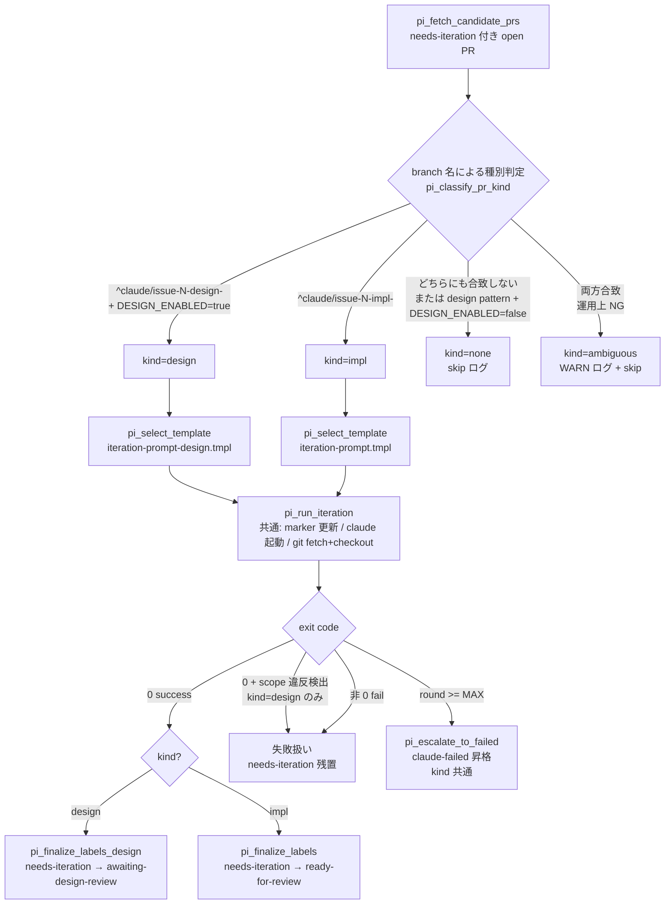
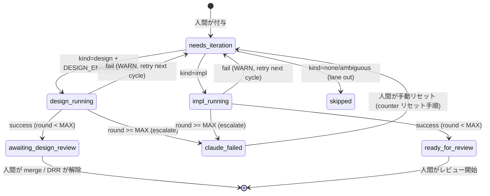
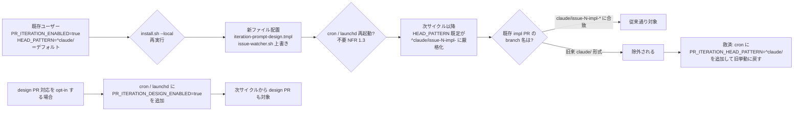

# Design Document

## Overview

**Purpose**: 既存の PR Iteration Processor (#26) を **設計 PR にも対応** させ、`needs-iteration`
ラベル 1 つで設計 PR の反復ループ（spec 書き換え許容）を回せるようにする。同時に head branch
pattern の既定値を `^claude/` から `^claude/issue-[0-9]+-impl-` に厳格化し、idd-claude 規約外の
ブランチを誤検知する余地を排除する。

**Users**: idd-claude を self-host する watcher 運用者と、設計 PR レビュワー。実装 PR でしか回せ
なかった「ラベル 1 つ反復」運用が、設計 PR にも適用できるようになる。

**Impact**: 現行の PR Iteration Processor は「spec 書き換え禁止」を前提に Developer prompt しか
持たない。本変更は branch 名で **design / impl 種別を判定** し、種別ごとに別 prompt template を
読み込み、別ラベルへ遷移させる分岐を追加する。`PR_ITERATION_DESIGN_ENABLED=false`（既定）かつ
`PR_ITERATION_HEAD_PATTERN` を override しない既存ユーザーは、impl PR の検知範囲・ラベル遷移・
ログ書式が `#26` 導入時と同一に保たれる。

### Goals

- `needs-iteration` ラベル 1 つで設計 PR を反復対応できる（成功時 `awaiting-design-review`、
  上限到達時 `claude-failed` へ自動遷移）
- 設計 PR では `docs/specs/<N>-<slug>/` 配下を Architect 役割で書き換え可能、実装 PR では従来通り
  spec 書き換え禁止
- `PR_ITERATION_HEAD_PATTERN` の既定厳格化（`^claude/` → `^claude/issue-[0-9]+-impl-`）で誤検知を
  排除しつつ、override で旧挙動に戻せる経路を残す
- `PR_ITERATION_DESIGN_ENABLED=false`（既定）なら本機能導入前と完全同一の挙動（impl PR の検知・
  ラベル遷移・ログ書式・round counter が不変）

### Non-Goals

- 同一 PR への design + impl 混在運用（branch 名で排他、AC 1.4 で対象外）
- design / impl で round counter を別離する仕組み（Req 6.5 で共有のまま）
- `requirements.md` の遡及的大規模修正（軽微整合修正は許容、scope 境界は本 design で明示）
- review-notes.md (#20) との連携（Reviewer は impl 系のみが現状の前提、本 Issue では据え置き）
- commit メッセージ規約のテンプレート強制
- GitHub Actions 版ワークフロー（`.github/workflows/issue-to-pr.yml`）への組み込み

---

## Architecture

### Existing Architecture Analysis

PR Iteration Processor (#26) の現行構造（`local-watcher/bin/issue-watcher.sh` 1054〜1117 行付近）:

- **検知層** (`pi_fetch_candidate_prs`): server-side `gh pr list` クエリ + client-side jq filter で
  候補 PR を絞り込む。head pattern と fork 除外も client-side で実施
- **ラウンド管理層** (`pi_read_round_counter` / `pi_post_processing_marker`): PR body の hidden
  HTML marker `<!-- idd-claude:pr-iteration round=N last-run=... -->` で round 数を永続化
- **prompt 組み立て層** (`pi_build_iteration_prompt`): `iteration-prompt.tmpl` に awk で変数注入
- **実行層** (`pi_run_iteration`): サブシェル + trap で main checkout に戻す保証付きで `claude` を
  fresh context 起動。head ブランチを `git checkout -B` で fresh 化
- **遷移層** (`pi_finalize_labels` / `pi_escalate_to_failed`): 成功時 `needs-iteration` →
  `ready-for-review`、上限到達時 `claude-failed` 昇格 + エスカレコメント

すべての関数が `pi_` prefix で同居し、ラベル定数 (`LABEL_NEEDS_ITERATION` / `LABEL_READY` /
`LABEL_FAILED`) は冒頭 Config で集約定義済み。`LABEL_AWAITING_DESIGN` は既に存在
（Design Review Release Processor #40 が利用）。

**尊重すべき制約**:

- 既存 env var 名（`PR_ITERATION_*` 7 個）と既定値の意味を変更しない（Req 4.6 / NFR 1.1〜1.3）
- 既存 lock / log / exit code の契約を変更しない
- 既存 `#26` の AC 1.x〜9.x は本変更で再評価しない（impl パスとして温存）
- `iteration-prompt.tmpl` は **書き換えない**（impl 用として現役、共有しない）

**解消する technical debt**:

- `PR_ITERATION_HEAD_PATTERN=^claude/` の緩さ（NFR 4.2 の override 経路を残しつつ既定を厳格化）

### Architecture Pattern & Boundary Map

**採用パターン**: 既存 `pi_run_iteration` を **kind-aware dispatcher** にリファクタし、種別判定
（design / impl / none）で template 選択 + 成功時遷移先ラベルを切り替える。状態遷移本体（round
counter / 着手表明 / 失敗時残置）は kind 非依存で共有する。



**Architecture Integration**:

- 採用パターン: **kind-aware dispatcher**（既存単一フロー → 種別ごとの template / ラベル切替）
  - 根拠: 状態機械（round counter / lock / 着手表明 / claude 起動 / failure 残置）は kind 非依存
    のため共有が自然。差分は「prompt template path」と「成功時遷移ラベル」の 2 点だけ
  - 代替案: design / impl で関数を完全二系統化（`pi_run_iteration_design` / `pi_run_iteration_impl`）
    も検討。共通コードの重複が約 80 行発生し、今後の bug fix が二重メンテナンスになるため不採用
- ドメイン／機能境界:
  - **Kind Classifier**: branch 名 + env vars → kind enum
  - **Template Selector**: kind → template ファイルパス
  - **Label Transitioner**: kind → 成功時遷移先ラベル
  - **Iteration Runner**: kind 非依存。template path と finalize 関数を引数で受け取る
- 既存パターンの維持:
  - `pi_log` / `pi_warn` / `pi_error` の prefix（`pr-iteration:`）と timestamp 書式（Req 6.2）
  - hidden marker による round counter（kind 共有、Req 6.5）
  - 着手表明コメント書式（Req 6.1）
  - エスカレコメント書式（Req 3.4 / 6.4）
- 新規コンポーネントの根拠:
  - `iteration-prompt-design.tmpl`: Architect 役割 + spec 書き換え許容 + design-review-gate 自己
    レビューを設計 PR では明示する必要があり、impl 用 prompt との混在は避ける（prompt の自己
    完結性を優先）
  - `pi_classify_pr_kind`: branch 名 → kind の判定責務を 1 関数に集約することで、テスト・障害
    解析時の grep ターゲットを 1 箇所にする

### Technology Stack

| Layer | Choice / Version | Role in Feature | Notes |
|-------|------------------|-----------------|-------|
| CLI / Runtime | bash 4+ (`set -euo pipefail`) | watcher の状態遷移 / 種別判定 | 既存スタックの再利用 |
| External CLI | `gh` / `jq` / `git` / `flock` / `timeout` / `claude` | PR 一覧取得 / ラベル操作 / branch 操作 / 排他 / Claude 起動 | 追加依存なし |
| Templates | markdown プレースホルダ + awk 変数注入 | design / impl 用 prompt の自己完結記述 | 既存 `iteration-prompt.tmpl` と同形式（同一 awk 処理を再利用） |
| Installer | bash (`install.sh` / `setup.sh`) | `iteration-prompt-design.tmpl` の `$HOME/bin/` 配置 | 既存の `copy_glob_to_homebin "*.tmpl"` で自動拾われる |
| Documentation | markdown (README.md / CLAUDE.md / project-manager.md) | 運用ルール明文化、env var 表、migration note | 二重管理の同期は PR 必須 |

---

## File Structure Plan

### New Files

```
local-watcher/
└── bin/
    └── iteration-prompt-design.tmpl   # 設計 PR 用 Architect prompt（新規、Req 2.1〜2.7）
```

### Modified Files

| File | Change Summary |
|------|---------------|
| `local-watcher/bin/issue-watcher.sh` | Config 追加（`PR_ITERATION_DESIGN_ENABLED` / `PR_ITERATION_DESIGN_HEAD_PATTERN` / `PR_ITERATION_HEAD_PATTERN` 既定値変更 / `ITERATION_TEMPLATE_DESIGN`）、`pi_classify_pr_kind` 新設、`pi_select_template` 新設、`pi_finalize_labels_design` 新設、`pi_run_iteration` を kind 引数で分岐するようリファクタ、`process_pr_iteration` のサマリ行に design/impl 内訳を追加（Req 1.1〜1.5 / 3.1〜3.4 / 4.1〜4.6 / 6.1〜6.5 / NFR 3.1 / 3.2） |
| `install.sh` | 既存の `copy_glob_to_homebin "*.tmpl"` で `iteration-prompt-design.tmpl` が自動配置されるため、`copy_glob` 経路の動作確認のみ。明示的な変更行はゼロでもよいが、ファイル冒頭コメントに「`iteration-prompt-design.tmpl` も配置される」旨を追記する（Req 2.2 / NFR 2.1） |
| `setup.sh` | `setup.sh` は `install.sh` を `exec` するブートストラッパで、設計 PR template の配置経路は `install.sh` 経由のため変更不要。冒頭コメントの整合性確認のみ（Req 2.2） |
| `repo-template/CLAUDE.md` | エージェント連携ルール節に「設計 PR iteration の挙動と、Architect / Developer エージェントの責務境界（実装 PR では spec 書き換え禁止 / 設計 PR では `docs/specs/` 配下の書き換え許容）」を追記（Req 5.7） |
| `repo-template/.claude/agents/project-manager.md` | design-review モードの実施事項に「設計 PR iteration（`needs-iteration`）の説明」を追記。「1 PR = design or impl のどちらか（混在禁止）」の運用ルールを明示（Req 5.4） |
| `README.md` | `## PR Iteration Processor (#26)` 節に **設計 PR 拡張** サブ節を追加。env var 表に `PR_ITERATION_DESIGN_ENABLED` / `PR_ITERATION_DESIGN_HEAD_PATTERN` を追加し、`PR_ITERATION_HEAD_PATTERN` の既定値変更を強調。Migration Note に旧 `^claude/` から override で戻す手順を追記。Phase A との住み分け表に design 種別の行を追加（Req 5.4 / 5.5 / 5.6） |
| `repo-template/CLAUDE.md`（再掲なし） | 上記と同一 |

### Why no change to `idd-claude-labels.sh`

`needs-iteration` / `awaiting-design-review` / `ready-for-review` / `claude-failed` の 4 ラベルは
すべて既存の `idd-claude-labels.sh` で冪等に作成・維持されている（Req 3.5 を満たす現状）。本 Issue
では新規ラベル追加なし。

### File Structure Plan の充足

- 新規 1 ファイル: `local-watcher/bin/iteration-prompt-design.tmpl`
- 変更 6 ファイル: `local-watcher/bin/issue-watcher.sh` / `install.sh` / `setup.sh` /
  `repo-template/CLAUDE.md` / `repo-template/.claude/agents/project-manager.md` / `README.md`
- すべての Components（後述）が上記いずれかのファイルに対応する

---

## Requirements Traceability

| Requirement | Summary | Components | Files |
|-------------|---------|------------|-------|
| 1.1 | design head pattern 合致 → design 種別 | Kind Classifier | `issue-watcher.sh` |
| 1.2 | impl head pattern 合致 → impl 種別 | Kind Classifier | `issue-watcher.sh` |
| 1.3 | どちらにも合致しない → 除外 + skip ログ | Kind Classifier | `issue-watcher.sh` |
| 1.4 | 両方合致 → 除外 + ambiguous WARN | Kind Classifier | `issue-watcher.sh` |
| 1.5 | 既存除外フィルタ（fork / draft / failed / rebase）を kind 非依存で適用 | Candidate Fetcher | `issue-watcher.sh` |
| 2.1 | design 用 template ソース同梱 | Design Iteration Template | `iteration-prompt-design.tmpl` |
| 2.2 | install.sh / setup.sh が `$HOME/bin/` に冪等配置 | Installer | `install.sh` / `setup.sh` |
| 2.3 | template が Architect 役割 + 編集スコープ明示 | Design Iteration Template | `iteration-prompt-design.tmpl` |
| 2.4 | template が design-review-gate 自己レビュー指示を含む | Design Iteration Template | `iteration-prompt-design.tmpl` |
| 2.5 | template が「spec 書き換え禁止」条項を **持たない**（許容） | Design Iteration Template | `iteration-prompt-design.tmpl` |
| 2.6 | scope 外編集を失敗扱い（needs-iteration 残置） | Design Iteration Template + Iteration Runner | `iteration-prompt-design.tmpl` / `issue-watcher.sh` |
| 2.7 | force push 禁止 / main 直 push 禁止 / resolve 禁止 / --resume 禁止を明記 | Design Iteration Template | `iteration-prompt-design.tmpl` |
| 3.1 | design 成功 → `needs-iteration` 除去 + `awaiting-design-review` 付与 | Label Transitioner (design) | `issue-watcher.sh` |
| 3.2 | impl 成功 → `needs-iteration` 除去 + `ready-for-review` 付与（既存維持） | Label Transitioner (impl) | `issue-watcher.sh` |
| 3.3 | design 失敗 → `needs-iteration` 残置 + WARN | Iteration Runner | `issue-watcher.sh` |
| 3.4 | design 上限到達 → `claude-failed` 昇格（kind 共通） | Iteration Runner | `issue-watcher.sh` |
| 3.5 | ラベル一覧管理スクリプトが必要ラベルを冪等維持（現状で満たす） | （変更なし） | `idd-claude-labels.sh` |
| 4.1 | `PR_ITERATION_DESIGN_ENABLED` 既定 false | Config | `issue-watcher.sh` |
| 4.2 | `PR_ITERATION_DESIGN_HEAD_PATTERN` 既定 `^claude/issue-[0-9]+-design-` | Config | `issue-watcher.sh` |
| 4.3 | `PR_ITERATION_HEAD_PATTERN` 既定厳格化 `^claude/issue-[0-9]+-impl-` | Config | `issue-watcher.sh` |
| 4.4 | `PR_ITERATION_DESIGN_ENABLED` ≠ true → 設計 PR を起動しない | Kind Classifier | `issue-watcher.sh` |
| 4.5 | `PR_ITERATION_ENABLED` ≠ true → 全体無効化 | `process_pr_iteration` 既存 gate | `issue-watcher.sh` |
| 4.6 | 既存 env var 名・意味・既定値を変更しない | Config | `issue-watcher.sh` |
| 5.1 | `PR_ITERATION_DESIGN_ENABLED=false` で `#26` 同一挙動 | Kind Classifier + Iteration Runner | `issue-watcher.sh` |
| 5.2 | `PR_ITERATION_HEAD_PATTERN` 厳格化後も既存 impl PR が対象 | Kind Classifier | `issue-watcher.sh` |
| 5.3 | 旧来 branch 命名は除外、override で救済可能（README に明記） | Documentation | `README.md` |
| 5.4 | README に「1 PR = design or impl のどちらか」を記述 | Documentation | `README.md` / `project-manager.md` |
| 5.5 | README に migration note 記述 | Documentation | `README.md` |
| 5.6 | README に新 env var 表を記述 | Documentation | `README.md` |
| 5.7 | CLAUDE.md にエージェント責務境界を記述 | Documentation | `repo-template/CLAUDE.md` |
| 6.1 | 着手表明（marker 更新 + 着手コメント）を kind 非依存で実施 | Iteration Runner | `issue-watcher.sh` |
| 6.2 | ログ prefix `pr-iteration:` と timestamp 書式を維持 | Iteration Runner | `issue-watcher.sh` |
| 6.3 | ログに「PR 番号 / 種別 / round / アクション」を識別可能に出力 | Iteration Runner | `issue-watcher.sh` |
| 6.4 | 上限超過エスカレコメントを kind 共通で投稿 | Iteration Runner | `issue-watcher.sh` |
| 6.5 | round counter を kind 共有（別離しない） | Round Counter | `issue-watcher.sh` |
| 7.1〜7.5 | DoD スモークテスト 4 シナリオ実施 + Test plan 記録 | Test Plan | `tasks.md` |
| NFR 1.1 | 既存ラベルの名前・意味・付与契約を変更しない | Label Transitioner | `issue-watcher.sh` |
| NFR 1.2 | lock / log / exit code を変更しない | Iteration Runner | `issue-watcher.sh` |
| NFR 1.3 | cron / launchd 登録文字列を再起動なしで動作させる | Config | `issue-watcher.sh` |
| NFR 2.1 | install.sh / setup.sh の冪等性（同一 SKIP / 差分 OVERWRITE） | Installer | `install.sh`（既存 `copy_glob_to_homebin` が満たす） |
| NFR 2.2 | 同一入力 → 同一ラベル / round 結果 | Iteration Runner | `issue-watcher.sh` |
| NFR 3.1 | grep で起動・成功・失敗・上限超過を識別可能 | Iteration Runner | `issue-watcher.sh` |
| NFR 3.2 | サイクル開始時に件数を design / impl 別に記録 | Candidate Fetcher | `issue-watcher.sh` |
| NFR 4.1 | 新 env var を cron / launchd / shell で override 可能 | Config | `issue-watcher.sh` |
| NFR 4.2 | `PR_ITERATION_HEAD_PATTERN` を override で旧 pattern に戻せる | Config | `issue-watcher.sh` |

---

## Components and Interfaces

### Watcher Layer

#### Kind Classifier (`pi_classify_pr_kind`)

| Field | Detail |
|-------|--------|
| Intent | branch 名 + env vars から PR の iteration 種別（design / impl / none / ambiguous）を判定 |
| Requirements | 1.1, 1.2, 1.3, 1.4, 4.4, 5.1, 5.2 |

**Responsibilities & Constraints**

- 入力 `head_ref` に対し以下の優先順で判定:
  1. impl pattern（`PR_ITERATION_HEAD_PATTERN`）と design pattern（`PR_ITERATION_DESIGN_HEAD_PATTERN`）
     の **両方に合致** → `ambiguous`（AC 1.4）
  2. design pattern のみ合致 + `PR_ITERATION_DESIGN_ENABLED=true` → `design`（AC 1.1 / 4.4）
  3. design pattern のみ合致 + `PR_ITERATION_DESIGN_ENABLED≠true` → `none`（AC 4.4）
  4. impl pattern のみ合致 → `impl`（AC 1.2）
  5. どちらにも合致しない → `none`（AC 1.3）
- 副作用なし（純粋関数）
- 既存除外フィルタ（fork / draft / claude-failed / needs-rebase）は呼び出し元（`pi_fetch_candidate_prs`）
  に残す（AC 1.5）

**Dependencies**

- Inbound: `pi_run_iteration` / `process_pr_iteration` — 種別判定の単一窓口 (Critical)
- Outbound: なし
- External: `PR_ITERATION_HEAD_PATTERN` / `PR_ITERATION_DESIGN_HEAD_PATTERN` / `PR_ITERATION_DESIGN_ENABLED`
  env vars (Critical)

**Contracts**: Service [x] / API [ ] / Event [ ] / Batch [ ] / State [ ]

##### Service Interface（疑似 bash シグネチャ）

```bash
# pi_classify_pr_kind <head_ref>
# stdout: "design" | "impl" | "none" | "ambiguous"
# return: 0
pi_classify_pr_kind() { ... }
```

- Preconditions: `PR_ITERATION_HEAD_PATTERN` / `PR_ITERATION_DESIGN_HEAD_PATTERN` /
  `PR_ITERATION_DESIGN_ENABLED` が初期化済み
- Postconditions: 4 値のいずれかを stdout に出力
- Invariants: 同一入力に対して同一結果（純粋関数）

#### Template Selector (`pi_select_template`)

| Field | Detail |
|-------|--------|
| Intent | kind から prompt template ファイルパスを返す |
| Requirements | 2.1, 2.2, 2.3〜2.7 |

**Responsibilities & Constraints**

- 入力 kind に応じて template パスを返す:
  - `design` → `$ITERATION_TEMPLATE_DESIGN`（既定 `$HOME/bin/iteration-prompt-design.tmpl`）
  - `impl` → `$ITERATION_TEMPLATE`（既定 `$HOME/bin/iteration-prompt.tmpl`、既存）
- ファイル存在チェック: `[ -f "$path" ]` を保証し、不在なら non-zero return + WARN
- env var override 可能: `ITERATION_TEMPLATE_DESIGN` を新設

**Dependencies**

- Inbound: `pi_run_iteration` — kind ごとに template path を取得 (Critical)
- Outbound: なし
- External: なし

##### Service Interface

```bash
# pi_select_template <kind>
# stdout: template ファイルパス
# return: 0=ok, 1=template 未配置（呼び出し元で iteration を中断）
pi_select_template() { ... }
```

#### Label Transitioner (Design / Impl)

| Field | Detail |
|-------|--------|
| Intent | iteration 成功時の `needs-iteration` 除去 + 種別別ラベル付与 |
| Requirements | 3.1, 3.2, 6.5 (kind 共有 round) |

**Responsibilities & Constraints**

- impl は既存 `pi_finalize_labels`（needs-iteration → ready-for-review）を温存
- design は新設 `pi_finalize_labels_design`（needs-iteration → awaiting-design-review）
- いずれも `gh pr edit --remove-label X --add-label Y` を 1 コマンドで原子的に発行
- 失敗時は WARN ログ + needs-iteration 残置（呼び出し元 `pi_run_iteration` の戻り値で fail 化）

**Dependencies**

- Inbound: `pi_run_iteration` — kind 分岐後の終端処理 (Critical)
- Outbound: `gh pr edit` (Critical)
- External: GitHub Labels API

##### Service Interface

```bash
# pi_finalize_labels <pr_number>
#   needs-iteration → ready-for-review（既存、impl 用、変更なし）
# pi_finalize_labels_design <pr_number>
#   needs-iteration → awaiting-design-review（新設、design 用）
# return: 0=success, 1=fail（呼び出し元で WARN 化）
```

#### Iteration Runner (`pi_run_iteration`, refactored)

| Field | Detail |
|-------|--------|
| Intent | 1 PR 分の iteration を kind 引数で分岐実行（template / 成功時遷移ラベル） |
| Requirements | 3.1, 3.2, 3.3, 3.4, 6.1, 6.2, 6.3, 6.4, 6.5, NFR 1.2, NFR 2.2, NFR 3.1 |

**Responsibilities & Constraints**

- 入力 `pr_json` から `head_ref` を抽出 → `pi_classify_pr_kind` で kind 判定
- kind=`none` / `ambiguous` → skip ログを出して return 0（成功扱いではなく skip サマリでカウント）
- kind=`design` / `impl` → 共通処理:
  1. round counter 読み取り → 上限なら `pi_escalate_to_failed`（kind 共通）して return 2
  2. `pi_post_processing_marker` で marker 更新 + 着手表明（kind 共通）
  3. `pi_select_template` で template path 取得
  4. サブシェル + trap で main 復帰保証付きで `git fetch` + `git checkout -B` + `claude` 起動
  5. exit 0 なら kind に応じた finalize 関数を呼ぶ
  6. exit 非 0 なら needs-iteration 残置 + WARN ログ
- ログ書式: `pi_log "PR #${pr_number}: kind=${kind} round=${next_round}/${MAX} action=success|fail|skip|escalated"`
  形式で grep 可能に統一（Req 6.3 / NFR 3.1）
- AC 2.6（design PR の scope 違反）: **template 内で Claude に「`docs/specs/<N>-<slug>/` 外を編集
  したら自身で git restore して exit 1 する」よう明示**。watcher 側で `git diff --name-only` を
  ハードに enforce する追加実装は本 Issue では行わない（後述「確認事項」参照）

**Dependencies**

- Inbound: `process_pr_iteration` の per-PR ループ (Critical)
- Outbound: `pi_classify_pr_kind` / `pi_select_template` / `pi_post_processing_marker` /
  `pi_finalize_labels` / `pi_finalize_labels_design` / `pi_escalate_to_failed` / `claude` CLI
- External: GitHub API (gh) / git

##### Service Interface

```bash
# pi_run_iteration <pr_json>
#   kind は内部で分類、外部からは透過
# return: 0=success, 1=fail, 2=escalated, 3=skip(none/ambiguous)
```

#### Candidate Fetcher (`pi_fetch_candidate_prs`, minor change)

| Field | Detail |
|-------|--------|
| Intent | needs-iteration ラベル付き open PR を取得（既存ロジック）+ design/impl 内訳ログ |
| Requirements | 1.5, NFR 3.2 |

**Responsibilities & Constraints**

- 既存の server-side `gh pr list --search "label:needs-iteration ..."` クエリは変更しない
- client-side jq filter の **head pattern 判定を `PR_ITERATION_HEAD_PATTERN` か
  `PR_ITERATION_DESIGN_HEAD_PATTERN` のいずれかに合致** に変更（design pattern は
  `PR_ITERATION_DESIGN_ENABLED=true` 時のみ OR 条件に含める）
- `process_pr_iteration` のサマリ行で design / impl 内訳をカウント（NFR 3.2）

##### jq filter の擬似コード

```jq
[.[]
  | select(.isDraft == false)
  | select((.headRepositoryOwner.login // "") == $owner)
  | select(
      (.headRefName | test($impl_pattern))
      or
      ($design_enabled == "true" and (.headRefName | test($design_pattern)))
    )
]
```

これにより `PR_ITERATION_DESIGN_ENABLED=false` のときは design pattern の PR が candidate 段階で
完全に除外される（AC 4.4 / 5.1 を満たす）。

#### Config Block (Modified)

| Field | Detail |
|-------|--------|
| Intent | 新 env var 追加と既存 `PR_ITERATION_HEAD_PATTERN` の既定値変更 |
| Requirements | 4.1, 4.2, 4.3, 4.6, NFR 4.1, NFR 4.2 |

**変更箇所**（既存 `# ─── PR Iteration Processor 設定 (#26) ───` ブロック内、L89〜L104 付近）:

```bash
# 既存（変更）: 既定値を厳格化（NFR 4.2 で override 経路は維持）
PR_ITERATION_HEAD_PATTERN="${PR_ITERATION_HEAD_PATTERN:-^claude/issue-[0-9]+-impl-}"

# 新規（AC 4.1）: design 系 opt-in gate
PR_ITERATION_DESIGN_ENABLED="${PR_ITERATION_DESIGN_ENABLED:-false}"

# 新規（AC 4.2）: design head pattern
PR_ITERATION_DESIGN_HEAD_PATTERN="${PR_ITERATION_DESIGN_HEAD_PATTERN:-^claude/issue-[0-9]+-design-}"

# 新規: design 用 template 配置先
ITERATION_TEMPLATE_DESIGN="${ITERATION_TEMPLATE_DESIGN:-$HOME/bin/iteration-prompt-design.tmpl}"
```

**前提ツールチェック拡張**（L156〜L162 付近）:

```bash
# 既存: PR_ITERATION_ENABLED=true 時に impl 用 template 必須
# 追加: PR_ITERATION_DESIGN_ENABLED=true 時に design 用 template 必須
if [ "$PR_ITERATION_ENABLED" = "true" ] \
   && [ "$PR_ITERATION_DESIGN_ENABLED" = "true" ] \
   && [ ! -f "$ITERATION_TEMPLATE_DESIGN" ]; then
  echo "Error: design 用 Iteration テンプレートが見つかりません: $ITERATION_TEMPLATE_DESIGN" >&2
  echo "  install.sh --local 再実行で配置されます。" >&2
  exit 1
fi
```

### Template Layer

#### Design Iteration Template (`iteration-prompt-design.tmpl`)

| Field | Detail |
|-------|--------|
| Intent | 設計 PR の iteration を Architect 役割で実行する prompt（spec 書き換え許容） |
| Requirements | 2.1, 2.3, 2.4, 2.5, 2.6, 2.7 |

**Responsibilities & Constraints**

- 必須プレースホルダ（impl 用と同じ awk 注入経路を再利用するため互換）:
  - 単一行: `{{REPO}}` `{{PR_NUMBER}}` `{{PR_TITLE}}` `{{PR_URL}}` `{{HEAD_REF}}` `{{BASE_REF}}`
    `{{ROUND}}` `{{MAX_ROUNDS}}` `{{ISSUE_NUMBER}}` `{{SPEC_DIR}}`
  - 複数行: `{{LINE_COMMENTS_JSON}}` `{{GENERAL_COMMENTS_JSON}}` `{{PR_DIFF}}`
    `{{REQUIREMENTS_MD}}`
- 役割宣言:「あなたは idd-claude の **PR Iteration Mode (design)** で起動された Architect エージェント
  です」(Req 2.3)
- **Architect 役割の表現方針 ［設計判断］**: **inline 展開** を採用。理由:
  - prompt の自己完結性を優先（テンプレ単体読みで responsibilities が把握可能）
  - `Read .claude/agents/architect.md` 参照方式は対象 repo 配下にファイルが無い場合に失敗する
    リスクがあり、impl 用 prompt も inline 展開しているため一貫性を保つ
  - 代替案（外部参照）は将来 architect.md が肥大化したら再評価する
- 編集許容スコープ: **`docs/specs/<N>-<slug>/` 配下のみ** を編集可能と明記（Req 2.3 / 2.6）
  - `{{SPEC_DIR}}` プレースホルダで具体パスを差し込み、Claude に「このディレクトリ内のみ書き換えよ」
    と命令
  - scope 外の変更が必要と判断した場合は、commit せず返信本文で「scope 外のため別 Issue 化を推奨」
    と説明させる（Req 2.6）
- 自己レビュー指示: 修正確定前に `.claude/rules/design-review-gate.md` の Mechanical Checks
  （requirements traceability / File Structure Plan 充填 / orphan component 検出）を最大 2 パスで
  実行する旨を明記（Req 2.4）
- spec 書き換えの **許容**:「`requirements.md` / `design.md` / `tasks.md` の書き換え禁止」条項を
  **書かない**（Req 2.5）。代わりに「設計指摘の反映で必要なら spec 群を更新してよい」を明示
- `requirements.md` の整合修正の境界 ［設計判断］: 軽微な整合修正（typo / 文言整合 /
  AC 1 つの言い換え）は許容、大規模再編は scope 外として別 PR 提案を推奨。template 内に明示
- **commit メッセージ規約 ［設計判断］**: `docs(specs): ...` を **強制ではなく推奨** とする。
  Conventional Commits 一般遵守を満たせばよい旨を明記（Out of Scope の Req 2.5 が
  「commit メッセージ規約のテンプレート強制」を除外しているため）
- **review-notes.md (#20) との関係 ［設計判断］**: 設計 PR では Reviewer エージェントは現状
  起動しない（impl 系限定）。design template 内では言及せず、将来拡張の余地として README の
  Migration Note にだけ「design PR 対応 Reviewer は本 Issue 範囲外」と明記
- 共通禁止事項（Req 2.7、impl 用と同一基準）:
  - force push 全般（`--force` / `--force-with-lease`）
  - main 直接 push
  - レビュースレッドの resolve / unresolve
  - `--resume` / `--continue` / `--session-id` の使用

##### Template Skeleton（疑似マークダウン）

```markdown
# idd-claude PR Iteration Mode (design) prompt template
# 配置先: ~/bin/iteration-prompt-design.tmpl
# プレースホルダ: {{REPO}} {{PR_NUMBER}} ... {{REQUIREMENTS_MD}}（impl 用と互換）

あなたは idd-claude の PR Iteration Mode (design) で起動された Architect エージェントです。

## 対象 PR
- Repo  : {{REPO}}
- Number: #{{PR_NUMBER}}
- ...
- Iteration: round {{ROUND}} / {{MAX_ROUNDS}}
- 関連 Issue: #{{ISSUE_NUMBER}} / Spec dir: {{SPEC_DIR}}

## レビューコメント / diff / requirements.md
（impl 用と同一の {{LINE_COMMENTS_JSON}} {{GENERAL_COMMENTS_JSON}} {{PR_DIFF}} {{REQUIREMENTS_MD}} ブロック）

## あなたの責務（Architect 役割、design PR 用）
1. head branch を origin と同期（fast-forward 失敗で exit 1）
2. レビューコメントを精読し、設計に取り込む価値のある指摘は spec 群を更新する
   - 編集許容スコープ: {{SPEC_DIR}} 配下のみ
   - scope 外への変更が必要なら commit せず返信で別 Issue 化を提案
3. 修正確定前に design-review-gate の自己レビュー（traceability / File Structure Plan 充填 /
   orphan component 検出）を最大 2 パスで実行
4. 通常 commit + 通常 push（force push 禁止）
5. 各 line コメントへの 1:1 返信、@claude general へのコメント返信

## 禁止事項
- force push（--force / --force-with-lease）
- main への直接 push
- レビュースレッドの resolve / unresolve
- --resume / --continue / --session-id
- {{SPEC_DIR}} 配下の **外側** のファイル変更
  （変更が必要なら commit せず返信で別 Issue 化を推奨）

## 補足
- 軽微な requirements.md 整合修正は許容、大規模再編は scope 外
- commit メッセージは Conventional Commits（`docs(specs): ...` を推奨）に従う
- review-notes.md (#20) との連携は本 PR 種別では未実装
```

**Dependencies**

- Inbound: `pi_build_iteration_prompt` (Critical) — awk 注入で読み込まれる
- External: `gh` / `git` (Critical) — Claude が実行時に呼ぶ

### Documentation Layer

#### README.md（修正）

| Field | Detail |
|-------|--------|
| Intent | 運用者向けに新 env var 表 / migration note / 1 PR = design or impl の運用ルールを提示 |
| Requirements | 5.3, 5.4, 5.5, 5.6 |

**Responsibilities & Constraints**

- 既存 `## PR Iteration Processor (#26)` 節に「**設計 PR 拡張 (#35)**」サブ節を追加
- env var 表に 2 行追加（`PR_ITERATION_DESIGN_ENABLED` / `PR_ITERATION_DESIGN_HEAD_PATTERN`）し、
  `PR_ITERATION_HEAD_PATTERN` の既定値表記を更新
- Migration Note に新ブロック「`PR_ITERATION_HEAD_PATTERN` 既定値変更（旧 `^claude/` → 新
  `^claude/issue-[0-9]+-impl-`）」を追加。override で旧挙動に戻す cron 例を併記
- 「1 PR = design or impl のどちらか（混在禁止）」を独立した節として記述

#### CLAUDE.md（repo-template、修正）

| Field | Detail |
|-------|--------|
| Intent | エージェント連携ルール節に責務境界（impl で spec 禁止 / design で `docs/specs/` 許容）を追記 |
| Requirements | 5.7 |

#### project-manager.md（修正）

| Field | Detail |
|-------|--------|
| Intent | design-review モード本文に「設計 PR iteration（`needs-iteration`）は次サイクルで反復対応される」旨を追記、混在禁止運用ルールを明示 |
| Requirements | 5.4, 5.7 |

---

## Data Models

### State / Label Transition



**Invariants**:

- `needs-iteration` と `claude-failed` は同時に存在しない（escalate で原子的にスワップ）
- `needs-iteration` と `awaiting-design-review` / `ready-for-review` も同時に存在しない（成功時の
  finalize で原子的にスワップ）
- round counter は kind を問わず単一の hidden marker に集約（Req 6.5）

### PR Body Hidden Marker（既存、変更なし）

```
<!-- idd-claude:pr-iteration round=N last-run=YYYY-MM-DDTHH:MM:SSZ -->
```

設計 PR / 実装 PR で共有。kind は marker に書き込まない（Req 6.5）。

---

## Error Handling

### Error Strategy

既存の **WARN / ERROR + cron ログ** 戦略を踏襲。新規エラーケースは以下:

### Error Categories and Responses

| カテゴリ | エラーケース | 応答 |
|---------|-------------|------|
| Configuration | `PR_ITERATION_DESIGN_ENABLED=true` だが `iteration-prompt-design.tmpl` 未配置 | watcher 起動時の前提ツールチェックで `exit 1` + stderr に対応手順（`install.sh --local` 再実行）（Req 2.2） |
| Configuration | `PR_ITERATION_HEAD_PATTERN` 既定厳格化により旧 PR が拾われなくなる | watcher は黙って skip（design でも impl でも non-match）。README Migration Note で override 手順を案内（Req 5.3） |
| Branch Classification | branch が design / impl 両 pattern に合致 | `pi_log` で `WARN: PR #N: ambiguous branch (matches both design and impl pattern), skip` を記録、当該 PR を skip（Req 1.4） |
| Branch Classification | branch がどちらにも合致しない | `pi_log` で `INFO: PR #N: head=X does not match design/impl pattern, skip` を記録（Req 1.3） |
| Iteration Execution | design PR で claude が exit 1（template の指示で scope 外編集を拒否した場合含む） | needs-iteration 残置 + `pi_warn` で WARN ログ（Req 3.3 / 2.6） |
| Iteration Execution | design PR で round >= MAX | `pi_escalate_to_failed`（kind 共通）で `claude-failed` 昇格 + エスカレコメント（Req 3.4） |
| Label Transition | `pi_finalize_labels_design` の `gh pr edit` 失敗 | needs-iteration 残置 + WARN（既存 `pi_finalize_labels` と同等）（Req 3.3） |
| Documentation | README / CLAUDE.md の更新漏れ | PR レビュー時に reviewer が指摘（design-review-gate / PR 品質チェックで検出） |

---

## Testing Strategy

本リポジトリには unit test フレームワークが無いため、**static analysis + manual smoke test +
dogfooding** の三段で検証する（CLAUDE.md「テスト・検証」節準拠）。

### Static Analysis (Unit-equivalent)

1. `shellcheck local-watcher/bin/issue-watcher.sh install.sh setup.sh` — 警告ゼロ
2. `actionlint .github/workflows/*.yml` — 既存 workflow に意図しない参照変更が無いこと
3. `bash -n local-watcher/bin/issue-watcher.sh` — 構文エラーなし
4. `pi_classify_pr_kind` の境界値 grep（design pattern + impl pattern + 両方 + どちらでもない）
   が source 上で網羅されているかコードレビュー時に確認

### Integration Tests (Dry Run)

5. cron-like 最小 PATH での依存解決確認:
   `env -i HOME=$HOME PATH=/usr/bin:/bin bash -c 'command -v claude gh jq flock git'`
6. 候補 PR ゼロ状態での dry run:
   `PR_ITERATION_ENABLED=true PR_ITERATION_DESIGN_ENABLED=true REPO=owner/test REPO_DIR=/tmp/test-repo $HOME/bin/issue-watcher.sh`
   が `pr-iteration: 対象候補 0 件` で正常終了
7. `install.sh --dry-run --local` で `iteration-prompt-design.tmpl` が NEW として列挙される

### E2E / Dogfooding（DoD 4 シナリオ、Req 7.1〜7.5）

各シナリオは本 repo の test branch + 仕掛け PR で実施し、結果を PR 本文「Test plan」セクションに記録する。

8. **設計 PR 成功シナリオ（Req 7.1）**: `claude/issue-<N>-design-<slug>` ブランチで設計 PR を立て、
   `needs-iteration` を付与。`PR_ITERATION_ENABLED=true PR_ITERATION_DESIGN_ENABLED=true` で watcher を
   1 サイクル流し、(a) commit push もしくは (b) 返信のみで正常完了し、最終ラベルが
   `awaiting-design-review` に遷移することを確認
9. **設計 PR 失敗（上限到達）シナリオ（Req 7.2）**: 同 PR の round counter を `MAX_ROUNDS - 1` に
   ピン留めし、再度 `needs-iteration` を付与 → 上限到達で `claude-failed` 昇格 + エスカレコメント
   を確認
10. **実装 PR リグレッションシナリオ（Req 7.3）**: 既存 `claude/issue-<N>-impl-<slug>` ブランチに
    `needs-iteration` を付与し、本変更導入前と同一の挙動（成功時 `ready-for-review` 遷移、上限
    到達時 `claude-failed` 昇格）が再現されることを確認
11. **完全 opt-out シナリオ（Req 7.4）**: `PR_ITERATION_DESIGN_ENABLED=false`（既定）かつ
    `PR_ITERATION_HEAD_PATTERN` を override しない既存設定で、設計 PR の `needs-iteration` ラベル
    に対して PR Iteration Processor が起動しないこと、impl PR の挙動とログ書式が `#26` 導入時と
    一致することを確認

### Performance / Load

本機能は新規外部呼び出しを追加せず、`gh pr list` のクエリも server-side filter を流用するため
追加負荷はゼロ。性能テストは不要。

---

## Optional Sections

### Security Considerations

- **Prompt 注入リスク**: 設計 PR の line コメント / general コメント本文をそのまま prompt に
  注入する方針は impl と同一（既存 README L816〜L821 の警告に従い、信頼境界内 collaborator のみ
  運用）
- **Write scope 限定**: `iteration-prompt-design.tmpl` 内で「`docs/specs/<N>-<slug>/` 配下のみ
  編集可」を Claude に明示することで、誤って `local-watcher/bin/issue-watcher.sh` 等を書き換え
  られるリスクを軽減（Req 2.6）。ただし enforcement は Claude 側の指示遵守に依存（後述「確認事項」）

### Migration Strategy



**Migration Note の README 反映方針**:

1. `## PR Iteration Processor (#26)` 節の Migration Note ブロックに新項目を追加:
   - 「`PR_ITERATION_HEAD_PATTERN` 既定値変更（旧 `^claude/` → 新 `^claude/issue-[0-9]+-impl-`）」
   - 「旧来 branch 命名（`claude/<slug>` 等）の救済方法: cron に `PR_ITERATION_HEAD_PATTERN=^claude/` を追加」
   - 「設計 PR 対応の opt-in 方法: cron に `PR_ITERATION_DESIGN_ENABLED=true` を追加」
2. 既存ユーザーへの影響評価: 旧既定値 `^claude/` で運用していた利用者がいる場合、cron 行 1 行
   追加で旧挙動に戻せる。**deprecation 期間は設けない**（README note のみで十分という判断 ［確認事項］）

### Supporting References

- 親仕様 PR Iteration Processor: #26 (`docs/specs/26-feat-pr-needs-iteration/`)
- 関連: #28 (PR Iteration の round counter / 上限) / #29 (Phase B Merge Queue) / #20 (Phase 1 Reviewer)
- 関連: #31 (Design Review Release Processor、`awaiting-design-review` ラベル除去自動化)
- 関連: 本 Issue 親 #35

---

## 確認事項（人間レビュー必要 / 設計フェーズで Architect が決定したもの）

PM の requirements.md「確認事項」に対する Architect の決定:

- **Architect 役割の prompt 内表現方針**: **inline 展開** を採用（理由は Components Layer の
  Design Iteration Template 節を参照）
- **review-notes.md (#20) との関係**: 設計 PR では Reviewer エージェントを起動しない（impl 系
  限定の現状仕様を据え置く）。design template / README ともに「対象外」と明記し、将来拡張余地
  として残す
- **commit メッセージ規約のテンプレート化**: `docs(specs):` scope を **推奨** に留め、
  Conventional Commits 一般遵守を満たせばよい（強制しない）
- **`PR_ITERATION_HEAD_PATTERN` 既定厳格化の影響範囲評価**: README Migration Note のみで
  十分とする（deprecation 期間なし）。override 経路（NFR 4.2）が残っているため、影響を受ける
  ユーザーは cron 行 1 行追加で旧挙動に戻せる
- **AC 2.6 の検出粒度**: **Claude 側の指示遵守に任せる**（template に明示）。watcher 側で
  `git diff --name-only` で hard-enforce する追加実装は本 Issue では行わない（理由: 設計 PR の
  iteration round は人間レビュー前提のセーフティネットがあり、scope 違反 commit はレビュー時に
  発見・取り戻しが可能。watcher 側の自動 revert は技術的複雑度が高く、誤検知時の復旧コストが
  template 警告のみより大きい）。将来 hard-enforce が必要なら別 Issue で扱う
- **`requirements.md` 整合修正の境界**: 軽微な整合修正（typo / 文言整合 / AC 1 つの言い換え）は
  template で許容、大規模再編は scope 外として別 PR 提案を推奨。境界の判断は Architect 側の常識
  に委ね、template 内に「迷ったら別 Issue 化」と明記

## Open Questions（人間レビューで判断してほしい）

- 上記「AC 2.6 の検出粒度」: watcher 側で `git diff --name-only` による hard-enforce を追加
  すべきか？ 本 design では「Claude の指示遵守に任せる」を採用したが、reviewer が hard-enforce を
  必要とする場合は別 Issue として切り直す
- README 側の Migration Note を **新節で独立**させるか、既存 PR Iteration Processor 節に併記
  するか。本 design では「PR Iteration Processor (#26) 節に併記」を推奨（散らばり防止）が、
  reviewer 判断で独立節に分けてもよい
