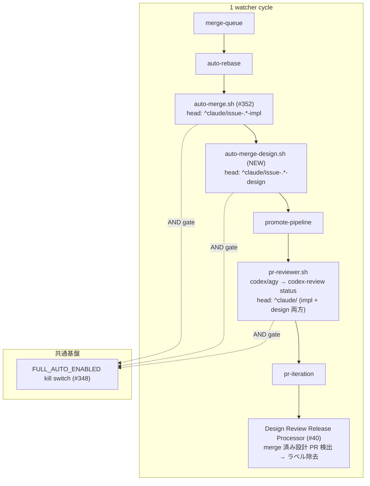

# Design Document

## Overview

**Purpose**: idd-claude の auto-dev パイプラインで PM → Architect → PjM が生成する **設計 PR**
（head が `^claude/issue-.*-design` パターン、対応 Issue に `awaiting-design-review` ラベル）に
対し、`gh pr merge --auto --squash --delete-branch` 経路で **GitHub ネイティブの auto-merge** を
有効化する Design Auto-Merge Processor を導入する。これにより、必須 status checks（CI +
`codex-review` + `claude-review`）が全 green に到達した時点で GitHub が自動的に squash merge +
branch 削除を実行し、設計 PR の最終 merge から人手 approve / merge ボタン操作を取り除く。

**Users**: idd-claude を運用するメンテナ。`AUTO_MERGE_DESIGN_ENABLED=true` AND
`FULL_AUTO_ENABLED=true` の AND 二重 opt-in を cron / launchd に明示した運用者のみが本機能の
影響を受ける。既存運用（既定 `AUTO_MERGE_DESIGN_ENABLED=false`）の consumer repo / 個人開発者
には gh API 呼び出しゼロで完全 no-op となる。

**Impact**: 既存 Auto-Merge Processor (#352) が **実装 PR 専用**（head `^claude/issue-.*-impl`）
だったところに、**設計 PR 専用 processor を追加**する。両者は head pattern による server-side
filter で対象が分離されるため、同じ PR を奪い合うことはない。Design Review Release Processor
(#40) は merge **後**のラベル後始末を担っており、本 processor とは独立に共存する（auto-merge
完了後の `awaiting-design-review` 除去は既存経路がそのまま担当）。設計レビュー結果の commit
status 化（`codex-review` / `claude-review`）は #349 で既に design PR を含む `^claude/` パターン
で publish される実装が稼働しており、本 spec では「設計 PR でも publish が走るための AND gate
解釈」を確認・配線するのみで、新規 context 名は導入しない。

### Goals

- 設計 PR に対し `gh pr merge --auto --squash --delete-branch` を AND 二重 opt-in 配下で発火する
- 既存 Auto-Merge Processor (#352, 実装 PR 専用) と完全に分離して非干渉に共存する
- 設計レビュー結果（codex / Claude Reviewer）が design PR head sha に対して `codex-review` /
  `claude-review` の安定 context 名で publish され、auto-merge ゲートを成立させる
- Design Review Release Processor (#40) との独立共存（auto-merge 完了 → 次 cycle で
  `awaiting-design-review` 自動除去）

### Non-Goals

- 実装 PR に対する auto-merge 適用（#352 で完了済み / Out of Scope）
- `mergeable=CONFLICTING` の設計 PR の conflict 解決（既存 merge-queue / auto-rebase に委譲）
- branch protection 設定そのもの（required status checks 必須化等は人間運用者が事前設定）
- 設計レビュー判定ロジック自体の変更（codex VERDICT / Claude Reviewer RESULT 既存契約踏襲）
- `awaiting-design-review` 自動除去ロジック変更（#40 Design Review Release Processor が継続担当）
- 新規 context 名（`design-codex-review` 等）の導入（既存 `codex-review` / `claude-review` を共有）
- 設計 PR に対する Claude Reviewer stage 自体の新設（現状の design pipeline は
  PM→Architect→PjM の単一 Claude セッションで完結し、`review-notes.md` を生成しない。本 spec
  は publish 経路が「もし将来 design 用 Claude Reviewer が動く場合」にも整合することを確認する）
- merge 方式の選択肢追加（squash 固定）
- 既に auto-merge enable 済みの設計 PR に対する disable / 取り下げ

## Architecture

### Existing Architecture Analysis

idd-claude の watcher は単一 bash プロセス（`issue-watcher.sh`）で複数 processor を順次起動する
**module loader pattern** を採用している。各 processor は `local-watcher/bin/modules/<name>.sh`
に切り出され、`REQUIRED_MODULES` 配列で source 順を制御する。関連先行機能:

| 既存機能 | モジュール | gate | 役割 |
|---|---|---|---|
| Auto-Merge Processor (#352) | `modules/auto-merge.sh` | `AUTO_MERGE_ENABLED && FULL_AUTO_ENABLED` | 実装 PR（`^claude/issue-.*-impl`）に `gh pr merge --auto --squash --delete-branch` |
| PR Reviewer Processor (#261, #349) | `modules/pr-reviewer.sh` | `PR_REVIEWER_ENABLED` / `PR_REVIEWER_STATUS_CHECK_ENABLED && FULL_AUTO_ENABLED` | codex/agy レビュー → コメント投稿 + `codex-review` commit status publish。head pattern 既定 `^claude/`（design PR 含む） |
| Claude Reviewer status publish (#349) | `issue-watcher.sh` 本体 `publish_claude_review_status` | `PR_REVIEWER_STATUS_CHECK_ENABLED && FULL_AUTO_ENABLED` | impl pipeline の `run_reviewer_stage` 完了後に `review-notes.md` 由来の `RESULT` を `claude-review` commit status publish |
| Design Review Release Processor (#40) | `issue-watcher.sh` 本体 `process_design_review_release` | `DESIGN_REVIEW_RELEASE_ENABLED`（既定 true） | merge 済み設計 PR を検出し Issue から `awaiting-design-review` を自動除去 + ステータスコメント |
| FULL_AUTO Kill Switch (#348) | `issue-watcher.sh` 本体 `full_auto_enabled` | `FULL_AUTO_ENABLED` | full-auto 系全 processor の AND ゲート |

**尊重すべきドメイン境界**:

- **head pattern による processor 分離**: 実装 PR と設計 PR の processor は head pattern
  （`^claude/issue-.*-impl` / `^claude/issue-.*-design`）で server-side filter する規約。
- **Design Review Release Processor の責務**: merge 検知 → ラベル除去はこの processor が独占
  （新 processor はラベルに触らない / Req 5.1〜5.4）。
- **#352 Auto-Merge との非干渉**: 実装 PR 経路は #352 が担当し、本 processor は head pattern で
  排他確保（Req 6.7）。

**維持すべき統合点**:

- `REQUIRED_MODULES` 動的ローダ経由の module 配置（NFR 6.2）
- `am_log` / `am_warn` / `am_error` と同じ `[YYYY-MM-DD HH:MM:SS] [$REPO] <prefix>:` ログ形式
- `gh pr merge --auto --squash --delete-branch` の 1 サイクル 1 PR 1 API 呼び出し契約（NFR 3.1）
- `pr_publish_codex_status` / `pr_publish_claude_status` の context 名共有（`codex-review` /
  `claude-review`）と AND 二重 opt-in 解釈

**解消・回避する technical debt**: 設計上、debt は新規に発生しない（既存 #352 / #349 の対称
拡張として最小コードで構築可能）。

### Architecture Pattern & Boundary Map

**採用パターン**: 既存 `modules/auto-merge.sh` (#352) と**対称の新規モジュール**として
`modules/auto-merge-design.sh` を追加する（**分離案**を採用）。

**判断根拠（重要な設計判断）**:

| 候補 | 採用？ | 根拠 |
|---|---|---|
| (A) `modules/auto-merge.sh` に design 用ロジックを追加（共通基盤化） | ✗ | (1) #352 の `am_*` 関数群（`am_should_enable_for_pr` / `am_enable_auto_merge_for_pr` / `process_auto_merge`）は impl 用の env var (`AUTO_MERGE_ENABLED` / `AUTO_MERGE_HEAD_PATTERN`) と直接結合しており、共通化のために if 分岐を増やすと既存テストの mental model が崩れる。(2) AND 二重 opt-in の gate が impl と design で **独立に倒せる**ことが運用者の knob 価値（impl だけ有効 / design だけ有効 / 両方有効 / 両方無効）であり、env 命名・正規化箇所を分離した方が表現が直截。(3) 同一サイクル内で impl + design の両方を処理する設定でも、log 出力を `auto-merge:` と `auto-merge-design:` で分離した方が運用観測が明瞭。 |
| (B) `modules/auto-merge.sh` をリネーム + 共通化 | ✗ | 既存 `AUTO_MERGE_ENABLED` env 名・既存テスト・既存 README 構造との後方互換破壊リスク。CLAUDE.md「禁止事項」「破壊的変更は migration note 必須」に抵触。 |
| (C) **新規 `modules/auto-merge-design.sh` に分離** | ✓ | #352 と対称設計（コピー + 命名置換のみで構築可能）。`amd_*` 関数 prefix で namespace 分離（未使用 prefix）。gate 名・head pattern・log prefix が明確に分離され、impl と design を独立に opt-in / opt-out できる。テストも独立に `auto-merge-design_test.sh` として近接配置可能。CLAUDE.md「機能追加ガイドライン §1（module 切り出し）/§2（namespace prefix）」に厳密準拠。 |

**design レビュー status 化の配置（重要な設計判断）**:

| 候補 | 採用？ | 根拠 |
|---|---|---|
| (A) **既存 `pr-reviewer.sh` に同居（追加実装なし）** | ✓ | #349 で導入した `pr_publish_codex_status` は `pr_run_review_for_pr` の末尾で呼ばれており、`pr_fetch_candidate_prs` の head pattern 既定 `^claude/` は design PR を **既にカバー**している。`pr_publish_commit_status` の AND 二重 opt-in（`PR_REVIEWER_STATUS_CHECK_ENABLED && FULL_AUTO_ENABLED`）は head pattern を区別しないため、design PR についても **既に `codex-review` status が publish される**。impl pipeline の `publish_claude_review_status` も `SPEC_DIR_REL` を介して `review-notes.md` を参照しており、design pipeline で `review-notes.md` が生成された場合（将来拡張時）も透過的に動く。**本 spec で追加実装は不要**で、Req 4 は既存実装の整合確認とテスト追加・ドキュメント明示で satisfy する。 |
| (B) 新規 `pr-reviewer-design.sh` に分離 | ✗ | 既存 `pr_publish_codex_status` / `pr_publish_claude_status` の責務を二重化し、context 名共有のメリット（運用者の branch protection 設定が 1 セットで済む）を失う。head pattern による分岐は branch protection 設定で行えば足り、watcher 側に分岐ロジックを持つ必要はない。YAGNI。 |
| (C) 既存 `pr-reviewer.sh` に design 専用ブランチ判定を足す | ✗ | (A) と同等の効果を「既存挙動の確認 + 設定明示」で達成できるため不要。design PR / impl PR 区別を新規導入する必要なし。 |

**結論（採用案）**:

- **design 用 auto-merge processor**: 新規 `modules/auto-merge-design.sh` に分離（関数 prefix `amd_`）
- **design レビュー status 化**: 既存 `pr-reviewer.sh` の `pr_publish_codex_status` を共有
  （design PR も `^claude/` head pattern で `codex-review` が publish される既存挙動を確認・
  明示文書化し、本 spec ではコード変更しない）
- **Claude Reviewer status の design PR 対応**: 現状の design pipeline は `run_reviewer_stage`
  を呼ばないため `publish_claude_review_status` 経路は **発火しない**。Req 4.2 は「将来 design
  pipeline に Claude Reviewer stage が追加された場合に publish 経路が透過的に動く」ことを
  確認するレベルで satisfy する（本 spec では新規 design Reviewer stage を追加しない）

**境界マップ（Mermaid）**:



**Architecture Integration**:

- **採用パターン**: 既存 module loader pattern + #352 と対称な独立 module 分離
- **ドメイン境界**: head pattern (`^claude/issue-.*-design`) による server-side filter で
  実装 PR / 人間 PR / 他用途 branch と非干渉
- **既存パターンの維持**: `am_resolve_gate_enabled` / `am_should_enable_for_pr` /
  `am_enable_auto_merge_for_pr` / `process_auto_merge` と同形の関数群を `amd_*` prefix で複製
- **新規コンポーネントの根拠**: impl 用 #352 と design 用は env var / head pattern / log prefix
  が独立に倒せる必要があり、独立 module が最小コードかつ最も誤読されにくい

### Technology Stack

| Layer | Choice / Version | Role in Feature | Notes |
|-------|------------------|-----------------|-------|
| Frontend / CLI | — | — | 該当なし |
| Backend / Services | bash 4+ | watcher プロセス | `set -euo pipefail` は本体側宣言済 |
| Data / Storage | — | — | 永続状態なし（API 呼び出しのみ） |
| Messaging / Events | `gh pr merge --auto --squash --delete-branch` | GitHub auto-merge state machine への enable 指示 | `gh` CLI 経由 |
| Infrastructure / Runtime | cron / launchd | watcher 起動基盤 | 既存 cron 登録文字列を変更しない（NFR 2.2） |
| 外部 CLI | `gh` / `jq` / `timeout` | gh pr list / merge / jq フィルタ / API timeout | 既存依存と同一（追加なし） |

## File Structure Plan

### Directory Structure

```
local-watcher/bin/
├── issue-watcher.sh              # 編集: Config 追加 / REQUIRED_MODULES / call site / cycle log
└── modules/
    ├── auto-merge.sh             # 編集なし（#352 実装 PR 用、既存維持）
    ├── auto-merge-design.sh      # 新規: 設計 PR 用 auto-merge processor (amd_* prefix)
    ├── pr-reviewer.sh            # 編集なし（既存 head pattern `^claude/` が design PR を既にカバー）
    └── ...                       # その他既存 module は変更なし

local-watcher/test/
└── auto-merge-design_test.sh     # 新規: extract_function イディオムで amd_* を fixture テスト

docs/specs/354-feat-watcher-pr-auto-merge-awaiting-desi/
├── requirements.md               # PM 作成済み
├── design.md                     # 本ファイル
└── tasks.md                      # 同期作成

README.md                         # 編集: Auto-Merge Processor 節隣に Design Auto-Merge Processor 節を追記
                                  #       オプション機能一覧表 / DESIGN_REVIEW_RELEASE_ENABLED 共存記述
```

### Modified Files

- `local-watcher/bin/modules/auto-merge-design.sh`（新規）— 設計 PR 用 auto-merge processor。
  関数 prefix `amd_` で namespace 分離。#352 `auto-merge.sh` と対称設計
- `local-watcher/bin/issue-watcher.sh`（編集）—
  - Config ブロックに `AUTO_MERGE_DESIGN_ENABLED` / `AUTO_MERGE_DESIGN_MAX_PRS` /
    `AUTO_MERGE_DESIGN_GIT_TIMEOUT` / `AUTO_MERGE_DESIGN_HEAD_PATTERN` の 4 env を追加
  - `REQUIRED_MODULES` 配列に `auto-merge-design.sh` を追加
  - cycle startup ログ（line 882 付近）に `auto-merge-design=${AUTO_MERGE_DESIGN_ENABLED}` を追加
    （Req 9.4）
  - main loop の `process_auto_merge` 呼び出し直後に `process_auto_merge_design` 呼び出しを
    追加（Phase D auto-rebase の直後 / #352 の直後）
- `local-watcher/test/auto-merge-design_test.sh`（新規）— extract_function イディオムで `amd_*`
  関数群を fixture + gh stub テスト
- `README.md`（編集）—
  - 「オプション機能一覧（opt-in）」表に `AUTO_MERGE_DESIGN_ENABLED` 行を追加（既定 false、
    AND 二重 opt-in 注記、対象 PR 条件、運用設定）
  - 「Auto-Merge Processor (#352)」節の隣に「Design Auto-Merge Processor (#354)」節を追加
    （対象 PR 条件 / 前提 repo 設定 / 有効化方法 / 観測ログ / 異常系 / 後方互換）
  - `DESIGN_REVIEW_RELEASE_ENABLED` との共存記述（NFR 4.3）
- `repo-template/`（**変更なし**）— watcher 本体・modules は `repo-template/` に配布されておらず
  `install.sh` 経由でユーザースコープ配置されるため、dual-management 対象外。
  `.claude/agents` / `.claude/rules` / `.github/workflows` / `.github/scripts` への変更は
  本 spec では発生しない（NFR 4.4 byte-equivalent は維持される）

## Requirements Traceability

| Requirement | Summary | Components | Interfaces | Flows |
|-------------|---------|------------|------------|-------|
| 1.1 | `AUTO_MERGE_DESIGN_ENABLED` 既定 `false` 宣言 | `issue-watcher.sh` Config | env 宣言 | Config ブロック |
| 1.2 | AND gate ON 時のみ評価 | `process_auto_merge_design` / `full_auto_enabled` | `amd_resolve_gate_enabled` + AND | gate 評価 |
| 1.3 | `=true` 厳密一致以外は OFF | `amd_resolve_gate_enabled` | case文 | gate 正規化 |
| 1.4 | `FULL_AUTO_ENABLED=false` で停止 | `process_auto_merge_design` 先頭 | `full_auto_enabled` 呼び出し | 早期 return |
| 1.5 | gate OFF 時の副作用ゼロ | `process_auto_merge_design` 早期 return | gh API 呼び出し 0 | 外部副作用ゼロ |
| 2.1 | head pattern `^claude/issue-.*-design` | `amd_should_enable_for_pr` + `gh pr list --search` | head pattern filter | 候補選定 |
| 2.2 | `isDraft=true` 除外 | `amd_should_enable_for_pr` | jq filter | 候補選定 |
| 2.3 | `mergeable=MERGEABLE` のみ | `amd_should_enable_for_pr` | jq filter | 候補選定 |
| 2.4 | `CONFLICTING` 除外 | `amd_should_enable_for_pr` | jq filter | 候補選定 |
| 2.5 | `UNKNOWN` 除外（次サイクル再評価） | `amd_should_enable_for_pr` | jq filter | 候補選定 |
| 2.6 | impl PR head pattern との非干渉 | `amd_should_enable_for_pr` + head pattern 厳密化 | head pattern filter | 候補選定 |
| 3.1 | `gh pr merge --auto --squash --delete-branch` | `amd_enable_auto_merge_for_pr` | gh CLI 呼び出し | enable 実行 |
| 3.2 | 直接 branch merge / push 禁止 | `amd_enable_auto_merge_for_pr` | `--auto` フラグ依存 | enable 実行 |
| 3.3 | watcher 側で待ち合わせ・polling しない | `process_auto_merge_design` | 1 サイクル 1 PR 1 enable | enable 実行 |
| 3.4 | `--delete-branch` フラグで branch 削除 | `amd_enable_auto_merge_for_pr` | gh CLI フラグ | enable 実行 |
| 4.1 | design PR head sha に `codex-review` publish | 既存 `pr_publish_codex_status` (#349) | head pattern `^claude/` 既存 | レビュー status |
| 4.2 | design PR head sha に `claude-review` publish | 既存 `pr_publish_claude_status` (#349) | `publish_claude_review_status` 既存経路 | レビュー status |
| 4.3 | approve → `success` | 既存 `pr_publish_codex_status` / `pr_publish_claude_status` (#349) | 既存 state 解決 | publish state |
| 4.4 | needs-iteration / reject → `failure` | 既存 `pr_publish_codex_status` / `pr_publish_claude_status` (#349) | 既存 state 解決 | publish state |
| 4.5 | head sha 変更時に新 sha へ publish | 既存 #349 Req 4 既存挙動 | latest-wins | publish state |
| 4.6 | gate OFF 時 publish なし | 既存 `pr_status_check_enabled` (#349) | AND gate 既存 | publish gate |
| 5.1 | `awaiting-design-review` ラベルに触れない | `amd_should_enable_for_pr` / `amd_enable_auto_merge_for_pr` | gh API 呼び出しに `--add-label` / `--remove-label` なし | ラベル不可侵 |
| 5.2 | Design Review Release Processor entry を直接呼ばない | `process_auto_merge_design` | 独立 processor | 独立共存 |
| 5.3 | merge 完了後 #40 が次サイクルで自動除去 | 既存 `process_design_review_release` | 既存挙動温存 | 順序保証 |
| 5.4 | `DESIGN_REVIEW_RELEASE_ENABLED` 挙動不変 | 設定変更なし | env 操作なし | 挙動温存 |
| 6.1 | `needs-rebase` 不可侵 | `amd_*` | gh API 呼び出しに label 操作なし | ラベル不可侵 |
| 6.2 | `claude-failed` 除外 | `amd_should_enable_for_pr` + `gh pr list --search "-label:..."` | server-side + client-side filter | 候補選定 |
| 6.3 | `needs-decisions` 除外 | `amd_should_enable_for_pr` + `gh pr list --search "-label:..."` | server-side + client-side filter | 候補選定 |
| 6.4 | `needs-iteration` 除外 | `amd_should_enable_for_pr` + `gh pr list --search "-label:..."` | server-side + client-side filter | 候補選定 |
| 6.5 | approving review 取り下げ禁止 | `amd_enable_auto_merge_for_pr` | gh コマンドに review 操作なし | 不可侵 |
| 6.6 | 既に auto-merge enabled の重複 enable 抑止 | `amd_should_enable_for_pr` | `autoMergeRequest` フィールドで冪等 skip | 候補選定 |
| 6.7 | #352 Auto-Merge 挙動不変 | head pattern 排他確保 | 独立 module | 非干渉 |
| 7.1 | enable 失敗時 PR 番号 / head sha / branch / category を warn log | `amd_enable_auto_merge_for_pr` | stderr 内容で 3 分類（`am_*` と同形） | 異常系 |
| 7.2 | network / transport error 識別 | `amd_enable_auto_merge_for_pr` | stderr pattern match | 異常系 |
| 7.3 | パイプライン継続 | `process_auto_merge_design` | 戻り値 0 固定 + `\|\| amd_warn` | 異常系 |
| 7.4 | silent fail 禁止 | `amd_enable_auto_merge_for_pr` | warn log 必須 | 異常系 |
| 7.5 | branch protection 設定不備の識別 | `amd_enable_auto_merge_for_pr` | stderr pattern match（`am_*` と同形） | 異常系 |
| 8.1 | AND gate OFF 時 `gh pr merge` 呼ばない | `process_auto_merge_design` 早期 return | gate 評価 | 後方互換 |
| 8.2 | gate OFF 時に他 processor の挙動不変 | 早期 return | 副作用ゼロ | 後方互換 |
| 8.3 | head pattern 不一致時 touch しない | `amd_should_enable_for_pr` | head pattern filter | 後方互換 |
| 8.4 | 既存 processor 挙動を gate / 変更しない | 独立 module / 独立 env | 共有 env 操作なし | 後方互換 |
| 9.1 | 成功時 1 行 log（PR # / head sha / branch / action） | `amd_log` | 既存 `am_log` と同形ログ | 観測性 |
| 9.2 | gate OFF 時 cycle あたり最大 1 行 informational | `process_auto_merge_design` | suppression log 1 行 | 観測性 |
| 9.3 | `FULL_AUTO_ENABLED` OFF 時は #348 既存ログに委譲 | `process_auto_merge_design` | full_auto_enabled 早期 return（無 log） | 観測性 |
| 9.4 | cycle startup 出力に `auto-merge-design=` を含める | `issue-watcher.sh` line 882 付近 | echo 行修正 | 観測性 |
| NFR 1.1 | jq に `--arg` / `--argjson`（PR 番号 / sha） | `amd_should_enable_for_pr` / `amd_enable_auto_merge_for_pr` | jq 安全展開 | セキュリティ |
| NFR 1.2 | `gh` 引数に `--` で option 解釈打ち切り | `amd_enable_auto_merge_for_pr` | gh CLI 規約 | セキュリティ |
| NFR 1.3 | PR 番号を `^[0-9]+$` で検証 | `amd_enable_auto_merge_for_pr` | grep -qE 検証 | セキュリティ |
| NFR 1.4 | head branch 名を head pattern で検証 | `amd_should_enable_for_pr` | grep -qE 検証（fail-safe） | セキュリティ |
| NFR 2.1 | unset 時の挙動不変 | Config 既定値 `false` | 既定 OFF | 後方互換 |
| NFR 2.2 | 既存 env var / ラベル / exit code / cron 文字列維持 | コード変更なし | 既存値温存 | 後方互換 |
| NFR 2.3 | 既存 processor 関数契約維持 | 既存 module 変更なし | signature 不変 | 後方互換 |
| NFR 3.1 | 1 design PR 1 サイクル 1 `gh pr merge` API call | `process_auto_merge_design` ループ | 冪等 skip 経路 | 性能 |
| NFR 3.2 | polling loop / sleep / background 禁止 | `process_auto_merge_design` | 単一 enable 呼び出しのみ | 性能 |
| NFR 4.1 | README に `AUTO_MERGE_DESIGN_ENABLED` 一覧記載 | README オプション機能一覧表 | 表追記 | ドキュメント |
| NFR 4.2 | README に repo 設定（auto-merge 許可 / required checks）記述 | README Design Auto-Merge Processor 節 | 散文追記 | ドキュメント |
| NFR 4.3 | `AUTO_MERGE_DESIGN_ENABLED` と `DESIGN_REVIEW_RELEASE_ENABLED` 共存記述 | README Design Auto-Merge Processor 節 | 散文追記 | ドキュメント |
| NFR 4.4 | `local-watcher/` ↔ `repo-template/` byte-equivalent 維持 | dual-management 対象外（watcher は user-scope 配布） | コード変更で `repo-template/` を触らない | 配布 |
| NFR 5.1 | `shellcheck` / `bash -n` クリーン | `auto-merge-design.sh` + 本体 | 静的解析 | 静的解析 |
| NFR 5.2 | unit tests: 全条件満たす / CONFLICTING / draft / pattern mismatch / gate OFF / 失敗 | `auto-merge-design_test.sh` | extract_function イディオム | テスト |
| NFR 5.3 | design PR head sha に対する commit status publish のテスト | 既存 `pr_publish_commit_status_test.sh` の拡張 + design head fixture | 既存 #349 テストと同形 | テスト |
| NFR 6.1 | install.sh が新 module を `$HOME/bin/modules/` に配布 | `install.sh` 既存 `copy_glob_to_homebin` で自動配布 | 既存 glob | 配布 |
| NFR 6.2 | `REQUIRED_MODULES` ローダで先行 source | `issue-watcher.sh` `REQUIRED_MODULES` 配列追記 | 既存 loader | 配布 |

## Components and Interfaces

### Watcher Core / Configuration

#### `issue-watcher.sh` Config 拡張

| Field | Detail |
|-------|--------|
| Intent | `AUTO_MERGE_DESIGN_ENABLED` 系 env を Config ブロックで宣言し、既定 OFF を保証する |
| Requirements | 1.1, 1.3, NFR 2.1, NFR 2.2 |

**Responsibilities & Constraints**

- 既定値 `false` を宣言（Req 1.1）
- 既存 `AUTO_MERGE_ENABLED` の宣言ブロック直後に追加配置（読みやすさ）
- `=true` 厳密一致以外は OFF として `amd_resolve_gate_enabled` 側で正規化（既存 #352 と同形 / NFR 1.1）
- 既存 env var 名・既存ラベル名・既存 exit code / cron 文字列を変更しない（NFR 2.2）

**Dependencies**

- Inbound: cron / launchd（env injection）— 起動経路（Critical）
- Outbound: `process_auto_merge_design` — 遅延束縛で参照（Critical）

**Contracts**: Service [ ] / API [ ] / Event [ ] / Batch [ ] / State [x] env var bind

##### Service Interface（追加 env 一覧）

```bash
# 既定 false、=true 厳密一致のみ有効。それ以外（未設定 / 空 / `True` / `0` / typo 等）は OFF（Req 1.3）。
AUTO_MERGE_DESIGN_ENABLED="${AUTO_MERGE_DESIGN_ENABLED:-false}"
# 1 サイクルあたりの最大処理 PR 数。残りは次回持ち越し。
AUTO_MERGE_DESIGN_MAX_PRS="${AUTO_MERGE_DESIGN_MAX_PRS:-10}"
# gh / git 個別タイムアウト（秒）。既存 AUTO_MERGE_GIT_TIMEOUT と同既定。
AUTO_MERGE_DESIGN_GIT_TIMEOUT="${AUTO_MERGE_DESIGN_GIT_TIMEOUT:-60}"
# 設計 PR head pattern（要件で規定）。AUTO_MERGE_HEAD_PATTERN（impl 用）と独立に override 可能。
AUTO_MERGE_DESIGN_HEAD_PATTERN="${AUTO_MERGE_DESIGN_HEAD_PATTERN:-^claude/issue-.*-design}"
```

- **Preconditions**: cron / launchd 環境変数（運用者設定）
- **Postconditions**: 既存 env を破壊しない
- **Invariants**: 既定で gh API 呼び出しゼロ

##### Cycle Startup Log 拡張

既存（line 882 付近）:

```bash
echo "[$(date '+%F %T')] base-branch=... auto-rebase=... auto-merge=${AUTO_MERGE_ENABLED} full-auto=${FULL_AUTO_ENABLED}"
```

修正後（Req 9.4）:

```bash
echo "[$(date '+%F %T')] base-branch=... auto-rebase=... auto-merge=${AUTO_MERGE_ENABLED} auto-merge-design=${AUTO_MERGE_DESIGN_ENABLED} full-auto=${FULL_AUTO_ENABLED}"
```

##### Module Loader 拡張

```bash
REQUIRED_MODULES=( "core_utils.sh" "quota-aware.sh" "merge-queue.sh" "auto-rebase.sh" \
  "auto-merge.sh" "auto-merge-design.sh" "promote-pipeline.sh" "pr-iteration.sh" \
  "pr-reviewer.sh" ... )
```

挿入位置: 既存 `auto-merge.sh` の直後（読みやすさと #352 との対称性）。

##### Main Loop Call Site

既存（line 999 付近）:

```bash
process_auto_merge || am_warn "process_auto_merge が想定外のエラーで終了しました（後続 Issue 処理は継続）"
```

直後に追加:

```bash
# Design Auto-Merge Processor (#354) — modules/auto-merge-design.sh が定義
process_auto_merge_design || amd_warn "process_auto_merge_design が想定外のエラーで終了しました（後続 Issue 処理は継続）"
```

**順序根拠**:

- Phase A merge-queue / Phase D auto-rebase の **後** に置くことで CONFLICTING PR が
  rebase 経路で先に処理される（Req 6.1: needs-rebase を触らない）
- #352 `process_auto_merge` の **直後** に置く（impl と design を対称配置、Req 5.4 / 6.7）
- Promote Pipeline の **前** に置く（promote は merged PR を扱うため auto-merge 完了後に観測する）
- Design Review Release Processor (#40) は同サイクル後段で実行されるが、本 processor が merge を
  **直接実行しない**ため、同サイクル内で auto-merge 完了 → ラベル除去まで到達することは保証
  されない（実際は次サイクル以降の検出が標準。Req 5.3 既存仕様）

### Design Auto-Merge Domain (`auto-merge-design.sh`)

#### `amd_log` / `amd_warn` / `amd_error` ロガー

| Field | Detail |
|-------|--------|
| Intent | `auto-merge-design:` プレフィックス付き構造化ログを出力 |
| Requirements | 9.1, 9.2, 9.3 |

**Responsibilities & Constraints**

- 既存 `am_log` / `am_warn` / `am_error` と同形（log prefix のみ `auto-merge-design:` に差し替え）
- `auto-merge:` と `auto-merge-design:` で運用者が grep 分離可能（観測性）

**Contracts**: Service [ ] / API [ ] / Event [ ] / Batch [ ] / State [ ] / Logger [x]

##### Service Interface

```bash
amd_log()   { echo "[$(date '+%F %T')] [$REPO] auto-merge-design: $*"; }
amd_warn()  { echo "[$(date '+%F %T')] [$REPO] auto-merge-design: WARN: $*" >&2; }
amd_error() { echo "[$(date '+%F %T')] [$REPO] auto-merge-design: ERROR: $*" >&2; }
```

#### `amd_resolve_gate_enabled` — gate 正規化

| Field | Detail |
|-------|--------|
| Intent | `AUTO_MERGE_DESIGN_ENABLED` を `=true` 厳密一致で判定（typo / 大文字違い / `1` / `on` 等は OFF） |
| Requirements | 1.2, 1.3, 8.1, NFR 1.1 |

**Contracts**: Service [x] / 純粋関数

##### Service Interface

```bash
amd_resolve_gate_enabled() {
  case "${AUTO_MERGE_DESIGN_ENABLED:-false}" in
    true) return 0 ;;
    *)    return 1 ;;
  esac
}
```

- **Preconditions**: env 経由で `AUTO_MERGE_DESIGN_ENABLED` が読める
- **Postconditions**: rc=0 (ON) / rc=1 (OFF) のいずれか
- **Invariants**: 副作用なし（純粋関数）

#### `amd_should_enable_for_pr` — 対象 PR 判定

| Field | Detail |
|-------|--------|
| Intent | 1 PR が design auto-merge の対象か判定（head pattern / draft / mergeable / ラベル / 既 enabled） |
| Requirements | 2.1〜2.6, 6.2〜6.4, 6.6, 8.3, NFR 1.4 |

**Contracts**: Service [x] / 純粋関数

##### Service Interface

```bash
# 入力: $1 = pr_json（gh pr list 1 要素）
# 戻り値: 0 = 全条件満たす / 1 = 対象外 / 2 = 既に auto-merge enabled（冪等 skip）
amd_should_enable_for_pr() {
  local pr_json="$1"
  # head pattern 最終確認（server-side filter の保険、NFR 1.4 / Req 2.1, 2.6, 8.3）
  # impl pattern との非干渉: head が `-design` を含み `-impl` を含まないこと
  # draft 除外、mergeable=MERGEABLE のみ、claude-failed / needs-decisions /
  # needs-iteration 除外、autoMergeRequest 既存なら rc=2
  ...
}
```

- **Preconditions**: pr_json は `.headRefName / .isDraft / .mergeable / .labels / .autoMergeRequest`
  フィールドを含む
- **Postconditions**: 戻り値で次の動作を表現
- **Invariants**: 副作用なし

#### `amd_enable_auto_merge_for_pr` — auto-merge 有効化呼び出し

| Field | Detail |
|-------|--------|
| Intent | `gh pr merge --auto --squash --delete-branch -- <pr_number>` を 1 回実行し、失敗種別を 3 分類 |
| Requirements | 3.1〜3.4, 7.1〜7.5, NFR 1.1, NFR 1.2, NFR 1.3 |

**Contracts**: Service [x] / 副作用あり（gh API）

##### Service Interface

```bash
# 入力: $1 = pr_number（数値）, $2 = head_ref, $3 = head_sha, $4 = pr_url
# 戻り値: 0 = enable 呼び出し成功 / 1 = 失敗（warn log）
amd_enable_auto_merge_for_pr() {
  # NFR 1.3: PR 番号を ^[0-9]+$ で検証
  # NFR 1.2: gh pr merge --repo "$REPO" --auto --squash --delete-branch -- "$pr_number"
  # 失敗時 stderr 内容で 3 分類:
  #   - transport-error (network / timeout / connection)
  #   - repo-config-rejected (branch protection / not permitted / auto merge disabled)
  #   - api-error (上記以外)
  ...
}
```

#### `process_auto_merge_design` — entry point

| Field | Detail |
|-------|--------|
| Intent | サイクルあたりの entry。AND gate 判定 → 候補列挙 → 各 PR について判定・enable → サマリ |
| Requirements | 1.2, 1.4, 1.5, 5.2, 7.3, 8.1, 9.1〜9.3, NFR 3.1 |

**Contracts**: Service [x] / 副作用あり（gh API list + merge）

##### Service Interface

```bash
process_auto_merge_design() {
  # Req 1.4: FULL_AUTO_ENABLED OFF → 早期 return（#348 既存 suppression ログに委ねる / Req 9.3）
  full_auto_enabled || return 0

  # Req 1.3, 8.1, 9.2: AUTO_MERGE_DESIGN_ENABLED OFF → 早期 return + 1 行 informational log
  if ! amd_resolve_gate_enabled; then
    amd_log "suppressed by AUTO_MERGE_DESIGN_ENABLED gate (no-op)"
    return 0
  fi

  amd_log "サイクル開始 (max=..., head_pattern=..., timeout=...s)"

  # 候補 PR 取得（server-side: head pattern + label 除外 + draft 除外 + fork 除外）
  # 各 PR について amd_should_enable_for_pr → amd_enable_auto_merge_for_pr
  # 戻り値 0 固定（パイプライン継続 / Req 7.3）
}
```

- **Preconditions**: `REPO` / `BASE_BRANCH` / `AUTO_MERGE_DESIGN_*` env が解決済み
- **Postconditions**: gate ON 時のみ gh API 呼び出し。enable 成功 / 失敗をサマリログに記録
- **Invariants**: gate OFF 時に外部副作用ゼロ（NFR 1.1）

### 既存 PR Reviewer Domain（変更なし、確認のみ）

#### `pr_publish_codex_status` — design PR への適用

| Field | Detail |
|-------|--------|
| Intent | `pr_run_review_for_pr` 末尾で VERDICT 由来の `codex-review` commit status を publish |
| Requirements | 4.1, 4.3, 4.4, 4.5, 4.6 |

**設計判断**: 既存実装をそのまま流用する。`PR_REVIEWER_HEAD_PATTERN` 既定 `^claude/` が
design PR を **すでにカバー**しており、`pr_status_check_enabled` の AND gate 解釈
（`PR_REVIEWER_STATUS_CHECK_ENABLED && FULL_AUTO_ENABLED`）は head pattern を区別しない。
本 spec ではコード変更を行わず、**design head pattern を含む fixture テスト追加**で挙動を
確認・固定化する（NFR 5.3）。

#### `publish_claude_review_status` — design PR への適用（将来拡張に備えた整合確認）

| Field | Detail |
|-------|--------|
| Intent | impl pipeline の Reviewer stage 完了直後に `review-notes.md` から `RESULT` を抽出し `claude-review` publish |
| Requirements | 4.2, 4.3, 4.4, 4.5, 4.6 |

**現状の挙動**: 現在の design pipeline は `PM → Architect → PjM` の単一 Claude セッションで
完結し、独立 Reviewer stage を持たないため `publish_claude_review_status` は design 経路で
発火しない。**本 spec では追加実装を行わない**。`review-notes.md` が design 経路で生成される
ようになった場合（将来拡張）、既存 `publish_claude_review_status` は `SPEC_DIR_REL` 経由で
review-notes.md を参照する設計のため、透過的に design PR に対しても claude-review を publish
できる（仕組み上の対応は完了済み）。本 spec の Req 4.2 はこの仕組みの存在確認で satisfy する。

## Data Models

### Env Variables（新規）

| Name | Default | Allowed Values | Description |
|------|---------|---------------|-------------|
| `AUTO_MERGE_DESIGN_ENABLED` | `false` | `true` 厳密一致のみ ON、それ以外 OFF | 本機能の opt-in gate |
| `AUTO_MERGE_DESIGN_MAX_PRS` | `10` | 正の整数 | 1 サイクルでの処理 PR 上限 |
| `AUTO_MERGE_DESIGN_GIT_TIMEOUT` | `60` | 正の整数（秒） | gh 個別 timeout |
| `AUTO_MERGE_DESIGN_HEAD_PATTERN` | `^claude/issue-.*-design` | POSIX ERE | 対象 head pattern |

### Labels

**新規ラベル追加なし**（NFR 2.2）。既存 `awaiting-design-review` / `needs-rebase` /
`claude-failed` / `needs-decisions` / `needs-iteration` を参照のみ。

### GitHub Commit Status Contexts

**新規 context 名追加なし**。既存 `codex-review` / `claude-review`（#349）を共有
（Open Question に対する設計判断 / 上述 §「design レビュー status 化の配置」）。

### Persistent State

**永続状態なし**。サイクルごとに gh API から re-fetch（NFR 3.2）。

## Error Handling

### Error Strategy

`#352` の `am_*` と完全に対称な失敗ハンドリングを採用する:

1. **gh API 呼び出し失敗** → `amd_warn` で WARN log を残し、戻り値 1 を返す
2. **process_auto_merge_design entry** は戻り値 0 固定（呼び出し元の `|| amd_warn` でログを残す）
3. **silent fail 禁止** — 失敗時は必ず log に残す（Req 7.4）

### Error Categories and Responses

| カテゴリ | 検出方法 | 応答 |
|---|---|---|
| **transport-error**（network / timeout / connection） | stderr に `could not resolve host` / `network` / `timeout` / `connection` を含む | WARN log（PR # / head / stderr 抜粋） / category=transport-error（Req 7.2） |
| **repo-config-rejected**（branch protection 不備 / auto-merge 禁止） | stderr に `branch protection` / `not allowed` / `not permitted` / `auto merge`+`disable` を含む | WARN log（PR # / head sha / category=repo-config-rejected）/ 運用者に repo 設定不備を可視化（Req 7.5） |
| **api-error**（上記以外の HTTP 4xx/5xx） | gh exit code != 0 かつ上記 pattern に該当しない | WARN log（PR # / head sha / stderr 抜粋 / category=api-error）（Req 7.1） |
| **無効 PR 番号** | `^[0-9]+$` 不一致 | skip + WARN log（NFR 1.3） |
| **無効 head ref** | head pattern 不一致 | skip（log なし、server-side filter の保険）（NFR 1.4） |

ログ抜粋の最大長は 500 文字（`am_*` と同じ規約）。

## Testing Strategy

### Unit Tests（新規 `auto-merge-design_test.sh`、extract_function イディオム）

| # | テスト項目 | 検証 AC |
|---|----------|-------|
| 1 | `amd_resolve_gate_enabled`: `true`/`false`/`True`/`1`/`on`/`yes`/未設定/空文字 の各値で OFF と ON が安全側に正規化される | Req 1.3, NFR 2.1 |
| 2 | `amd_should_enable_for_pr`: head pattern 不一致 (impl PR / 手書き PR) → rc=1 | Req 2.1, 2.6, 6.7, 8.3 |
| 3 | `amd_should_enable_for_pr`: draft → rc=1 / `claude-failed` / `needs-decisions` / `needs-iteration` 各除外 → rc=1 | Req 2.2, 6.2, 6.3, 6.4 |
| 4 | `amd_should_enable_for_pr`: `mergeable=MERGEABLE` → rc=0 / `CONFLICTING` → rc=1 / `UNKNOWN` → rc=1 | Req 2.3, 2.4, 2.5 |
| 5 | `amd_should_enable_for_pr`: `autoMergeRequest` 既存 → rc=2（冪等 skip） | Req 6.6 |
| 6 | `amd_enable_auto_merge_for_pr`: 全条件満たした design PR → `gh pr merge --auto --squash --delete-branch -- <N>` が exactly once 呼ばれる（gh stub で argv 記録） | Req 3.1, 3.4 |
| 7 | `amd_enable_auto_merge_for_pr`: gh stub が non-zero + transport / repo-config / api stderr → WARN log の category 分類が一致 | Req 7.1, 7.2, 7.5 |
| 8 | `process_auto_merge_design`: AND gate OFF (`AUTO_MERGE_DESIGN_ENABLED=false`) → gh stub 呼び出し回数 0 + suppression log 1 行 | Req 1.5, 8.1, 9.2 |
| 9 | `process_auto_merge_design`: `FULL_AUTO_ENABLED=false` → gh stub 呼び出し回数 0 + suppression log なし（#348 既存ログに委譲） | Req 1.4, 9.3 |
| 10 | `process_auto_merge_design`: enable 失敗時にもパイプラインは継続（rc=0 を返す） | Req 7.3 |

### Integration Tests（既存 `pr_publish_commit_status_test.sh` 拡張、design head fixture 追加）

| # | テスト項目 | 検証 AC |
|---|----------|-------|
| 1 | `pr_publish_codex_status`: head が `claude/issue-N-design-foo` の PR JSON で AND gate ON → `codex-review` context で gh stub が呼ばれる | Req 4.1, 4.3, 4.4 |
| 2 | `pr_publish_codex_status`: 同上、AND gate OFF → 呼び出しゼロ + suppression log 1 行 | Req 4.6 |
| 3 | `pr_publish_claude_status`: design PR head sha 入力 + AND gate ON → `claude-review` context で publish | Req 4.2, 4.3, 4.4 |

### E2E / Manual Smoke Tests

| # | テスト項目 | 検証 AC |
|---|----------|-------|
| 1 | `shellcheck local-watcher/bin/modules/*.sh local-watcher/bin/issue-watcher.sh` → 警告ゼロ | NFR 5.1 |
| 2 | `bash -n local-watcher/bin/modules/auto-merge-design.sh && bash -n local-watcher/bin/issue-watcher.sh` → 構文 OK | NFR 5.1 |
| 3 | dry run: `REPO=owner/test REPO_DIR=/tmp/test-repo bash $HOME/bin/issue-watcher.sh` を対象なし状態で実行し、cycle 開始ログに `auto-merge-design=false` が含まれ正常終了する | Req 9.4, NFR 2.1 |
| 4 | install scratch test: 使い捨て scratch repo で `./install.sh --repo /tmp/scratch` を実行し `$HOME/bin/modules/auto-merge-design.sh` が配置される（実行ビット付き） | NFR 6.1 |

### Performance / Load Tests

性能要件は 1 design PR 1 サイクル 1 `gh pr merge` API call の上限のみ（NFR 3.1）。
ロードテストは行わない（既存 #352 と同じ前提）。

## Security Considerations

CLAUDE.md「機能追加ガイドライン §5（未信頼 GitHub 入力の取り扱い）」に従う:

- **jq への展開**: PR head sha / PR 番号は `--arg` で渡し inline 展開しない（NFR 1.1）
- **gh / git の `--`**: PR 番号引数で `--` を必ず付けて option 解釈を打ち切る（NFR 1.2）
- **PR 番号検証**: 使用直前に `^[0-9]+$` で検証（NFR 1.3）
- **head branch 検証**: server-side filter（`gh pr list --search`）に加え client-side で
  head pattern を再評価し、不一致なら早期 skip（NFR 1.4）
- **状態ファイル**: 永続状態なし。一時ファイルは `mktemp` を使い `/tmp` の予測可能名を避ける
  （既存 `am_*` パターン踏襲）
- **untrusted shell metachar 防御**: head branch 名・PR URL を log 出力するが、外部 shell に
  そのまま渡さない（gh CLI のみ経由 / `bash -c` を使わない）

## Migration Strategy

新規 opt-in 機能のため migration は不要:

- 既定 `AUTO_MERGE_DESIGN_ENABLED=false` で未設定環境は完全 no-op（NFR 2.1）
- 既存 env / ラベル / cron / exit code は変更なし（NFR 2.2）
- consumer repo（既 installed）は `cd ~/.idd-claude && git pull && ./install.sh --local` 再実行で
  `$HOME/bin/modules/auto-merge-design.sh` が新規配置される（NFR 6.1）
- `REQUIRED_MODULES` ローダが起動時に `auto-merge-design.sh` を必須 source するため、
  module 未配置時は watcher 起動エラーで停止する（既存 #261 / #352 と同じ挙動）。README に
  「merge 後の再配置が必要」注記を追加する（既存 #261 注記と同形 / NFR 4.1）

## Supporting References

- 既存 spec: `docs/specs/352-feat-watcher-auto-merge-sh-pr-checks-gre/requirements.md`
  （実装 PR auto-merge processor の AC / 対称設計の参照元）
- 既存 spec: `docs/specs/349-feat-pr-reviewer-codex-claude-github-sta/requirements.md`
  （`codex-review` / `claude-review` commit status 命名と publish 経路）
- 既存 spec: `docs/specs/348-feat-watcher-full-auto-enabled-kill-swit/`（FULL_AUTO kill switch）
- 既存実装: `local-watcher/bin/modules/auto-merge.sh`（#352 / 設計参照元）
- 既存実装: `local-watcher/bin/modules/pr-reviewer.sh`（#261 / #349 / `pr_publish_codex_status`
  / `pr_publish_claude_status` / `pr_status_check_enabled`）
- 既存実装: `local-watcher/bin/issue-watcher.sh` の Design Review Release Processor (#40,
  `process_design_review_release`)
- 既存テスト: `local-watcher/test/auto-merge_test.sh` / `local-watcher/test/pr_publish_commit_status_test.sh`
  （extract_function イディオム + gh stub の参照実装）
- README: 「Auto-Merge Processor (#352)」節 / 「PR Reviewer Commit Status Publishing (#349)」節 /
  「Design Review Release Processor (#40)」節（追記位置の参照）
- 設計憲章: `CLAUDE.md`「機能追加ガイドライン」§1〜§8（module 配置・namespace prefix・
  opt-in gate・dual-management・未信頼入力）
