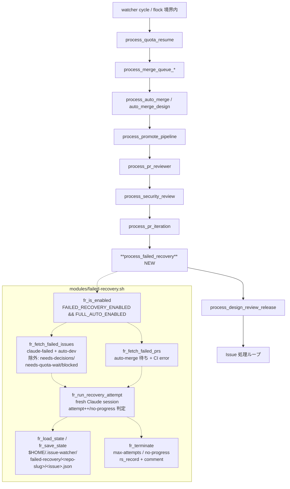
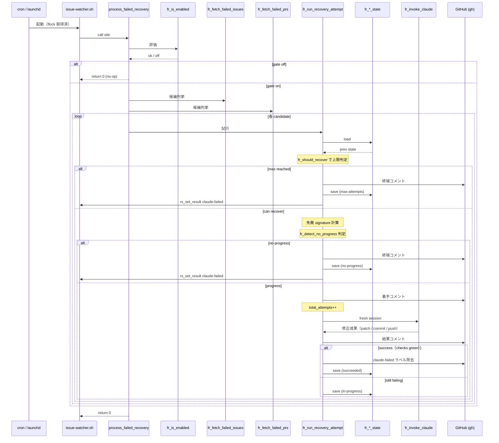
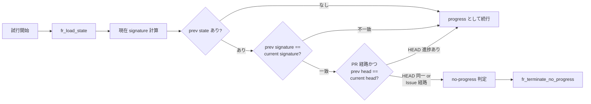

# Design Document

## Overview

**Purpose**: `claude-failed` ラベル付き Issue と auto-merge 待ち PR の CI 失敗を、
人手介入なしで自動解析・修正・再開させる Failed Recovery Processor を idd-claude watcher
に追加する。Issue 単位 **通算 4 回** の唯一 attempt budget と no-progress ガードによって
quota 燃焼と多重ループを構造的に終端させる（D-19）。

**Users**: idd-claude を `FULL_AUTO_ENABLED=true` で運用する idd-claude 運用者。本機能は
`FAILED_RECOVERY_ENABLED=true` を追加して明示的に opt-in する場合のみ起動し、それ以外の
環境では既存の手動復旧運用（`ready-for-review` 先付与 → `claude-failed` 除去）と
完全に等価な挙動を保つ。

**Impact**: 既存 watcher サイクルに `process_failed_recovery` 1 関数の call site を 1 箇所
追加するのみで、既存 processor（quota-aware / merge-queue / auto-rebase / auto-merge /
pr-iteration / pr-reviewer / security-review 等）の挙動は一切変えない。Reviewer 内部 2/2 /
pr-iteration 3R の上限値も touch しない（D-19b: 通算カウンタの唯一 source として上に立つ）。

### Goals

- `claude-failed` Issue（reviewer-reject 由来を含む）と auto-merge 待ち PR の CI 失敗を
  fresh Claude session に投げて修正試行 → 成功時は `claude-failed` 除去で通常フローへ復帰
- Issue 単位の **通算 attempt カウンタ**（既定 4 / `FAILED_RECOVERY_MAX_ATTEMPTS`）で
  終端を構造的に保証（Reviewer 2/2 / pr-iteration 3R と掛け算しない / D-19b）
- 同一失敗理由 × 無進捗差分の連続を検出する **no-progress ガード**で更に早期終端
- `$HOME/.issue-watcher/failed-recovery/` 配下に attempt カウンタと前回試行情報を
  symlink TOCTOU 安全に永続化、cron サイクル跨ぎでも継承
- `FAILED_RECOVERY_ENABLED!=true` または `FULL_AUTO_ENABLED!=true` のときは外部副作用ゼロ

### Non-Goals

- `needs-decisions` 状態の Issue を自動継続させる挙動（別 Issue 06 の責務）
- semantic conflict（意味論的衝突）の解析と解消（別 Issue 07 の責務）
- Reviewer 内部 2/2 試行や pr-iteration 3R の上限値そのものの変更
- `auto-dev` 未付与の Issue / 手動運用 Issue への自動復旧適用
- Triage / Architect / Developer / Reviewer 各エージェント自体の起動制御変更

## Architecture

### Existing Architecture Analysis

- **Watcher 本体**（`local-watcher/bin/issue-watcher.sh`）は flock 境界内で processor 群を
  直列実行する architecture。新規 processor は `modules/<name>.sh` に切り出し、本体に
  call site を 1 行追加する既存パターン（quota-aware / merge-queue / auto-rebase /
  auto-merge / promote-pipeline / pr-iteration / pr-reviewer / security-review）に倣う
- **既存 `claude-failed` 経路**: `mark_issue_failed` / `pi_escalate_to_failed` /
  `_slot_mark_failed` / 各 fail-fast 経路がラベルを付与する。すべて `build_recovery_hint`
  が説く「`ready-for-review` 先付与 → `claude-failed` 除去」の手動復旧手順を Issue/PR
  コメントに残す。本機能はこの「人間が手動で外す」工程を opt-in で自動化する
- **既存永続化規約**: `$LOG_DIR=$HOME/.issue-watcher/logs/$REPO_SLUG`、
  `$SLOT_LOCK_DIR=$HOME/.issue-watcher` がベース。新規ファイルは `$HOME/.issue-watcher/`
  配下に repo-slug 分離した sub-directory を切る（quota-aware の `qa_persist_reset_time`
  と同パターン）
- **既存 run-summary**: `rs_set_result` で per-cycle 終端を記録、`rs_emit` が EXIT trap で
  1 行 emit。本機能は新規 `rs_record_recovery` 等は追加せず、既存 `rs_*` API のみを使う

### Architecture Pattern & Boundary Map

採用パターン: **既存 processor module パターン**（pr-iteration.sh / quota-aware.sh と同形）。
本体 inline 拡張ではなく `modules/failed-recovery.sh` を新規ファイルとして追加し、
function 定義のみを置き、call site は本体に 1 行残す。関数 prefix namespace は **`fr_`** を
採用（既存 module の prefix と衝突しないことを確認 — pr=pr-reviewer / pi=pr-iteration /
pp=promote-pipeline / po=path-overlap / pt=per-task / mq=merge-queue / qa=quota-aware /
ar=auto-rebase / am=auto-merge / amd=auto-merge-design / sc=stage-checkpoint / sav=stage-a-verify /
sec=security-review / cm=context-map / gh=guard-hook / sh=scaffolding-health / rs=run-summary /
tc=tasks-count / dr=dependency-resolver / drr=design-review-release / tu=token-usage。
`fr_` は未使用）。



**Architecture Integration**:
- 採用パターン: **module + call site 1 行**（既存 8 processor の踏襲）
- ドメイン／機能境界: 本機能は `claude-failed` Issue + auto-merge 待ち PR CI error の
  「復旧専属」responsibility に閉じる。`needs-iteration` PR は pr-iteration の責務、
  `needs-rebase` PR は auto-rebase の責務、quota は quota-aware の責務であり、それらの
  ラベル空間に手出ししない（候補選定で除外フィルタを掛ける）
- 既存パターンの維持: opt-in gate 二重化（`FAILED_RECOVERY_ENABLED` × `FULL_AUTO_ENABLED`、
  `=true` 厳密一致で正規化、それ以外は安全側 false）/ `fr_warn` で例外吸収 (`||`) /
  REQUIRED_MODULES ローダ追加 / install.sh の modules ワイルドカード配置を流用
- 新規コンポーネントの根拠: 既存 module どれにも復旧責務は無い（pr-iteration は
  `needs-iteration` 専用、quota-aware は quota reset 専用）。掛け算しない通算カウンタも
  既存 marker（PR body の `idd-claude:pr-iteration round=N`）と衝突するため独立永続化が必要

### Technology Stack

| Layer | Choice / Version | Role in Feature | Notes |
|-------|------------------|-----------------|-------|
| Frontend / CLI | bash 4+ / `gh` / `jq` / `git` / `flock` / `claude` | Recovery 試行・状態永続化 | 既存依存と同一。新規依存なし |
| Backend / Services | `claude` CLI (`DEV_MODEL`, `FAILED_RECOVERY_MAX_TURNS`) | fresh session で 修正試行 | `--permission-mode bypassPermissions` は既存 Developer 起動と同条件 |
| Data / Storage | JSON ファイル群（`$HOME/.issue-watcher/failed-recovery/<repo-slug>/<issue>.json`） | attempt カウンタ + 直前試行情報 | quota-aware の `qa_persist_reset_time` と同方式（repo-slug 分離） |
| Messaging / Events | GitHub Issue / PR コメント API、ラベル API | 試行結果 / 終端通知 / `claude-failed` 除去 | 既存 `gh` 利用パターンと同一 |
| Infrastructure / Runtime | cron / launchd → `issue-watcher.sh` | 既存サイクル内で直列実行 | flock 境界 / log dir を共有 |

## File Structure Plan

### Directory Structure

```
local-watcher/
├── bin/
│   ├── issue-watcher.sh             # Modified: Config ブロック追加 / REQUIRED_MODULES 追記 / call site 追加
│   └── modules/
│       ├── core_utils.sh            # Modified: fr_log / fr_warn / fr_error ロガー追加
│       └── failed-recovery.sh       # NEW: Failed Recovery Processor 関数群
└── test/
    ├── fr_is_enabled_test.sh        # NEW: gate 評価 / 正規化のユニットテスト
    ├── fr_state_test.sh             # NEW: load / save / atomic write / TOCTOU 安全性
    ├── fr_no_progress_test.sh       # NEW: 同一失敗 + 無進捗の判定
    └── fr_terminate_test.sh         # NEW: max-attempts / no-progress 終端時の rs_record / comment

repo-template/
└── local-watcher/                   # NEW: root local-watcher/ と byte 一致同期（既存運用は
                                     #      install.sh が root local-watcher/ から配布する形のみで、
                                     #      repo-template/local-watcher/ は未配置のためここでは同期不要 — 後述）

.github/
└── workflows/
    └── issue-to-pr.yml              # 変更なし（本機能は GitHub Actions 経路では opt-in 未公開）

README.md                            # Modified: 「Failed Recovery Processor (#359)」節追加
docs/specs/359-feat-watcher-failed-recovery-sh-claude-f/
├── requirements.md                  # 既存（PM 成果物）
├── design.md                        # NEW: 本ファイル
└── tasks.md                         # NEW: 実装タスク分割
```

**設計上の注記**: 本リポジトリの既存実態として `repo-template/local-watcher/` ディレクトリは
存在しない（watcher 本体は root `local-watcher/` のみで管理し、`install.sh` がそこから
`$HOME/bin/` に配布する単一系統）。CLAUDE.md「二重管理の鉄則」の対象は
`repo-template/.claude/{agents,rules}` および `repo-template/.github/{workflows,scripts}` に
限定される。Failed Recovery は agent / rules / workflow / labels には新規追加・変更を伴わない
（既存 `claude-failed` ラベルを再利用、Architect / Developer 等の agent 定義に影響しない）ため、
**`diff -r` 検査の追加対象とはならない**。これは要件 NFR 6 の「機能等価で同期」を充足する解釈
（root のみで一元管理、consumer は install.sh 経由で受け取る）。

### Modified Files

- `local-watcher/bin/issue-watcher.sh` — 以下 3 箇所を最小編集:
  1. Config ブロック（行 200 番台付近、PR Iteration / Auto-Merge 等の隣）に
     `FAILED_RECOVERY_ENABLED` / `FAILED_RECOVERY_MAX_ATTEMPTS` / `FAILED_RECOVERY_MAX_TURNS` /
     `FAILED_RECOVERY_DEV_MODEL` / `FAILED_RECOVERY_GIT_TIMEOUT` / `FAILED_RECOVERY_MAX_PRS` /
     `FAILED_RECOVERY_STATE_DIR` の env 受け取りと値正規化 case を追加
  2. `REQUIRED_MODULES`（行 846 付近）に `"failed-recovery.sh"` を追記
  3. Call site（行 1358 の `process_pr_iteration` 直後、`process_design_review_release` の前）に
     `process_failed_recovery || fr_warn "..."` を 1 行追加
- `local-watcher/bin/modules/core_utils.sh` — 既存 `pi_log` / `pr_log` 等と同パターンで
  `fr_log` / `fr_warn` / `fr_error` を追加（prefix `failed-recovery:`、warn/error は stderr）
- `README.md` — 「Failed Recovery Processor (#359)」節を「PR Iteration Processor」/「PR Reviewer
  Processor」と同じ階層に追加し、env var 一覧・opt-in 手順・通算カウンタの説明・既存
  Reviewer 2/2 / pr-iteration 3R との独立性（D-19b）を記述
- `local-watcher/test/*` — 上記 4 つの近接テストを追加（`extract_function` イディオム踏襲）

## Requirements Traceability

| Requirement | Summary | Components | Interfaces |
|-------------|---------|------------|------------|
| 1.1 | 二重 opt-in で起動 | Config (issue-watcher.sh) / `fr_is_enabled` | env case 正規化 |
| 1.2 | `FAILED_RECOVERY_ENABLED!=true` で副作用ゼロ | `fr_is_enabled` 早期 return | — |
| 1.3 | `FULL_AUTO_ENABLED!=true` で副作用ゼロ | `fr_is_enabled` 早期 return | — |
| 1.4 | gate off で既存手動運用と等価 | `process_failed_recovery` 早期 return | — |
| 1.5 | 不正値は安全側 false | Config 正規化 case | — |
| 2.1 | `claude-failed` Issue 走査 | `fr_fetch_failed_issues` | gh issue list `--search` |
| 2.2 | reviewer-reject 由来も含む | `fr_fetch_failed_issues`（ラベル付与経緯非依存） | — |
| 2.3 | auto-merge 待ち PR CI error 走査 | `fr_fetch_failed_prs` | gh pr list / gh pr checks |
| 2.4 | 人間判断待ちラベルで除外 | `fr_fetch_*` server-side filter | `-label:"needs-decisions"` 等 |
| 2.5 | `auto-dev` 未付与は除外 | `fr_fetch_failed_issues` filter | `label:"auto-dev"` |
| 3.1 | Issue 失敗解析 → 修正試行 | `fr_collect_issue_context` / `fr_run_recovery_attempt` | claude fresh session |
| 3.2 | PR CI ログ解析 → 修正コミット → 再実行 | `fr_collect_pr_ci_context` / `fr_run_recovery_attempt` | `gh run view` / push |
| 3.3 | 対応内容コメントを 1 件残す | `fr_post_attempt_comment` | gh issue/pr comment |
| 3.4 | green 復帰時に `claude-failed` 除去 | `fr_finalize_success` | gh issue edit `--remove-label` |
| 3.5 | 未信頼入力 sanitize | `fr_run_recovery_attempt` / `fr_invoke_claude` | `jq --arg` / `--` / ID regex |
| 4.1 | 通算カウンタ上限管理 | `fr_load_state` / `fr_save_state` | JSON `total_attempts` フィールド |
| 4.2 | 1 試行で +1 加算 | `fr_run_recovery_attempt`（試行**開始**時加算） | atomic write |
| 4.3 | Reviewer / pr-iteration と掛け算しない唯一カウンタ | `fr_load_state` は独自 JSON（D-19b） | 既存 marker を読まない |
| 4.4 | 上限未満なら次の試行可 | `fr_should_recover` | total < MAX 比較 |
| 4.5 | 上限到達で停止＋ラベル据え置き | `fr_terminate_max_attempts` | コメントのみ |
| 4.6 | 上限到達時 run-summary 通知 | `fr_terminate_max_attempts` | `rs_set_result` |
| 4.7 | `$HOME/.issue-watcher/` 配下永続化 | `fr_state_path` | `FAILED_RECOVERY_STATE_DIR` |
| 4.8 | 不正 `MAX_ATTEMPTS` で既定 4 | Config 正規化 | 整数判定 + 0 以下 fallback |
| 5.1 | 直前試行と比較 | `fr_detect_no_progress` | `fr_load_state` の `last_failure_*` |
| 5.2 | 同原因 + 無進捗で no-progress 判定 | `fr_detect_no_progress` | reason hash + diff SHA 比較 |
| 5.3 | no-progress 終端時ラベル据え置き + コメント | `fr_terminate_no_progress` | gh issue/pr comment |
| 5.4 | no-progress 時 run-summary 通知 | `fr_terminate_no_progress` | `rs_set_result` |
| 5.5 | 前回試行情報を永続化 | `fr_save_state` | JSON `last_failure_signature` |
| 6.1 | 復旧成功後は同サイクル内追加試行なし | `fr_finalize_success` / 同サイクル内 cache | in-memory set |
| 6.2 | 復旧成功後の通算カウンタ取り扱いを識別可 | JSON schema `last_status` フィールド | succeeded/failed/no-progress 区別 |
| NFR 1.1 | 既存 env var 名・意味不変 | 新規 env のみ追加 | — |
| NFR 1.2 | 既存ラベル名・付与契約不変 | 新規ラベル追加なし | — |
| NFR 1.3 | gate off で完全等価 | 二重 opt-in 早期 return | — |
| NFR 2.1 | 同一サイクル重複起動防止 | in-memory set + flock 境界 | — |
| NFR 2.2 | プロセス再起動でカウンタ継承 | JSON 永続化 | — |
| NFR 2.3 | TOCTOU 安全 read/write | `mktemp` + `mv -f` atomic rename + `flock` | — |
| NFR 3.1 | 未信頼入力 sanitize | `jq --arg` / `--` / ID `^[0-9]+$` / SHA `^[0-9a-f]{40}$` | — |
| NFR 3.2 | secrets を出力しない | `fr_post_attempt_comment` で env 値を出さない | — |
| NFR 4.1 | イベント種別 + 番号を `$LOG_DIR` に記録 | `fr_log` / `fr_warn` | `failed-recovery:` prefix |
| NFR 4.2 | 終端で run-summary 1 件 | `fr_terminate_*` → `rs_set_result` | — |
| NFR 5.1 | shellcheck warning ゼロ | `modules/failed-recovery.sh` | — |
| NFR 5.2 | 3 経路の近接テスト | `local-watcher/test/fr_*_test.sh` | — |
| NFR 6 | テンプレ同期 | 本機能は repo-template 同期対象外（前述設計上の注記参照） | README 反映 |

## Components and Interfaces

### Config Layer

#### `FAILED_RECOVERY_*` env block (in `issue-watcher.sh`)

| Field | Detail |
|-------|--------|
| Intent | Failed Recovery 起動 gate と運用パラメータの env 受け取り + 値正規化 |
| Requirements | 1.1, 1.5, 4.1, 4.8, NFR 1.1 |

**Responsibilities & Constraints**
- `FAILED_RECOVERY_ENABLED` を `=true` 厳密一致で正規化（既定 false）。それ以外は false に倒す
- `FAILED_RECOVERY_MAX_ATTEMPTS` を整数化、未設定 / 非整数 / 0 以下なら 4 を採用（Req 4.8）
- `FAILED_RECOVERY_STATE_DIR`、`FAILED_RECOVERY_MAX_TURNS`、`FAILED_RECOVERY_DEV_MODEL`、
  `FAILED_RECOVERY_GIT_TIMEOUT`、`FAILED_RECOVERY_MAX_PRS` の既定値を Config ブロックで宣言
- 既存「デフォルト有効化フラグの値正規化」ループには加えない（既定 OFF の opt-in 制 / NFR 1.1）

**Dependencies**
- Inbound: cron / launchd 環境変数
- Outbound: `fr_is_enabled` / `process_failed_recovery`

**Contracts**: State [x]

```bash
# Config ブロック（新規追加）
FAILED_RECOVERY_ENABLED="${FAILED_RECOVERY_ENABLED:-false}"
case "$FAILED_RECOVERY_ENABLED" in
  true) : ;;
  *)    FAILED_RECOVERY_ENABLED="false" ;;
esac
FAILED_RECOVERY_MAX_ATTEMPTS="${FAILED_RECOVERY_MAX_ATTEMPTS:-4}"
# 整数 + 正の値以外は既定 4 に正規化
case "$FAILED_RECOVERY_MAX_ATTEMPTS" in
  ''|*[!0-9]*) FAILED_RECOVERY_MAX_ATTEMPTS=4 ;;
  *) [ "$FAILED_RECOVERY_MAX_ATTEMPTS" -le 0 ] && FAILED_RECOVERY_MAX_ATTEMPTS=4 ;;
esac
FAILED_RECOVERY_MAX_TURNS="${FAILED_RECOVERY_MAX_TURNS:-60}"
FAILED_RECOVERY_DEV_MODEL="${FAILED_RECOVERY_DEV_MODEL:-${DEV_MODEL:-claude-opus-4-7}}"
FAILED_RECOVERY_GIT_TIMEOUT="${FAILED_RECOVERY_GIT_TIMEOUT:-60}"
FAILED_RECOVERY_MAX_PRS="${FAILED_RECOVERY_MAX_PRS:-3}"
FAILED_RECOVERY_STATE_DIR="${FAILED_RECOVERY_STATE_DIR:-$HOME/.issue-watcher/failed-recovery/$REPO_SLUG}"
```

### Logger Layer

#### `fr_log` / `fr_warn` / `fr_error` (in `core_utils.sh`)

| Field | Detail |
|-------|--------|
| Intent | `failed-recovery:` prefix で grep 抽出可能なログ出力 |
| Requirements | NFR 4.1 |

**Contracts**: Service [x]

```bash
fr_log()   { echo "[$(date '+%F %T')] failed-recovery: $*"; }
fr_warn()  { echo "[$(date '+%F %T')] failed-recovery: WARN: $*" >&2; }
fr_error() { echo "[$(date '+%F %T')] failed-recovery: ERROR: $*" >&2; }
```

### Gate Layer

#### `fr_is_enabled`

| Field | Detail |
|-------|--------|
| Intent | 二重 opt-in 評価。`FAILED_RECOVERY_ENABLED=true` AND `FULL_AUTO_ENABLED=true` のみ true |
| Requirements | 1.1, 1.2, 1.3, 1.4, 1.5, NFR 1.3 |

**Responsibilities & Constraints**
- 副作用なし（純粋関数）
- 正規化済み env を `=true` 厳密一致で判定。それ以外（typo / 空 / `1` / `True` 等）は false

```bash
# fr_is_enabled() -> 0(enabled) / 1(disabled)
fr_is_enabled() {
  [ "${FAILED_RECOVERY_ENABLED:-false}" = "true" ] || return 1
  [ "${FULL_AUTO_ENABLED:-false}" = "true" ] || return 1
  return 0
}
```

### Candidate Selection Layer

#### `fr_fetch_failed_issues`

| Field | Detail |
|-------|--------|
| Intent | 復旧対象の `claude-failed` Issue を server-side filter で列挙 |
| Requirements | 2.1, 2.2, 2.4, 2.5 |

**Responsibilities & Constraints**
- `gh issue list --search 'label:"claude-failed" label:"auto-dev" -label:"needs-decisions" -label:"needs-quota-wait" -label:"blocked" -label:"awaiting-slot"' --json number,labels,body,title,url --limit "$FAILED_RECOVERY_MAX_PRS"`
- 取得失敗時は空 JSON 配列を返し、`fr_warn` で警告（fail-open / 既存 module と同パターン）
- "hold" は idd-claude のラベルセットに **存在しないため除外フィルタ対象に含めない**
  （Req 2.4 が言及するが、現状の `idd-claude-labels.sh` には未定義。本機能で新規ラベルを
  追加しない方針のため、運用上「hold 相当」は `needs-decisions` 等が代替する。
  PR 本文の確認事項に記載する）

**Contracts**: Service [x]

```bash
# stdout: JSON 配列文字列 / 戻り値: 0 固定
fr_fetch_failed_issues()
```

#### `fr_fetch_failed_prs`

| Field | Detail |
|-------|--------|
| Intent | auto-merge 待ち（`ready-for-review` ラベル + auto-merge enabled）かつ CI error の PR を列挙 |
| Requirements | 2.3, 2.4 |

**Responsibilities & Constraints**
- `gh pr list --search 'label:"ready-for-review" -label:"needs-iteration" -label:"needs-rebase" -draft:true' --json number,headRefName,labels,url,body,statusCheckRollup`
- `statusCheckRollup` に `state=FAILURE` または `conclusion=FAILURE/TIMED_OUT` を含む PR のみ
  client-side filter で残す（`jq` で射影）。`PENDING` は対象外（CI 完了待ち）
- head pattern は `^claude/` で fork 由来 PR を除外（既存 module と同方針）
- `auto-merge` が enabled の PR のみが対象（`auto-merge waiting` 状態 = `mergeStateStatus` を
  `gh pr view --json mergeStateStatus,autoMergeRequest` で確認）

### State Persistence Layer

#### `fr_state_path` / `fr_load_state` / `fr_save_state`

| Field | Detail |
|-------|--------|
| Intent | Issue 単位の通算カウンタ + 直前試行情報を atomic に永続化 |
| Requirements | 4.1, 4.2, 4.3, 4.7, 5.5, 6.2, NFR 2.2, NFR 2.3 |

**Responsibilities & Constraints**
- 配置: `$FAILED_RECOVERY_STATE_DIR/<issue_number>.json`（既定
  `$HOME/.issue-watcher/failed-recovery/<repo-slug>/<N>.json`）
- 初期化: `mkdir -p` を冪等に。所有者は cron 実行ユーザー（root 化禁止）
- 読み出し: `jq -r` で各フィールド抽出。ファイル不在は schema 既定値で扱う（fail-open）
- 書き込み: `mktemp` で同一 dir に temp file → `jq` で組み立て → `mv -f` で atomic rename。
  これにより read-modify-write 中の中断でも壊れたファイルが残らない（quota-aware が
  `qa_persist_reset_time` で採用しているのと同方式）。symlink TOCTOU は `mktemp -p
  "$FAILED_RECOVERY_STATE_DIR"` で同一ファイルシステム上に作成して回避
- 並列実行下では同一 Issue が同サイクル内で 2 度走らないことを `process_failed_recovery`
  内の in-memory set で保証する（NFR 2.1）。異なる slot から同一 Issue を触る事象は
  `_slot_run_issue` 経路 / 本機能経路ともに `flock` で直列化されるため発生しない

**Contracts**: State [x], Service [x]

```bash
# fr_state_path <issue_number> -> stdout: 絶対パス
# fr_load_state <issue_number> -> stdout: JSON（不在時は {}）
# fr_save_state <issue_number> <total_attempts> <last_status> <last_signature> <last_head_sha>
#   - last_status: "succeeded" | "max-attempts" | "no-progress" | "in-progress"
#   - last_signature: 直前失敗理由の正規化 hash（SHA-1 hex）
#   - last_head_sha: 直前修正試行後の HEAD SHA（PR 経路時のみ非空）
fr_state_path()  { echo "$FAILED_RECOVERY_STATE_DIR/$1.json"; }
fr_load_state()  { ... }
fr_save_state()  { ... }
```

**JSON schema** (Data Model 節参照):
```json
{
  "issue": 359,
  "total_attempts": 2,
  "last_status": "in-progress",
  "last_failure_signature": "f3a1...",
  "last_head_sha": "abc1234567890abcdef1234567890abcdef12345",
  "last_attempt_at": "2026-06-22T10:34:56Z",
  "history": [
    {"attempt": 1, "at": "...", "signature": "...", "head_sha": "...", "outcome": "failed"},
    {"attempt": 2, "at": "...", "signature": "...", "head_sha": "...", "outcome": "no-progress-candidate"}
  ]
}
```

### Recovery Decision Layer

#### `fr_should_recover`

| Field | Detail |
|-------|--------|
| Intent | 通算 attempt が上限未満なら true。pre-attempt 評価で副作用なし |
| Requirements | 4.1, 4.4, 4.5 |

```bash
# fr_should_recover <total_attempts> -> 0 (can recover) / 1 (max reached)
fr_should_recover() {
  local total="$1"
  [ "$total" -lt "$FAILED_RECOVERY_MAX_ATTEMPTS" ] || return 1
  return 0
}
```

#### `fr_compute_failure_signature`

| Field | Detail |
|-------|--------|
| Intent | 失敗ログから正規化 hash（reason key）を生成。no-progress 判定の比較 key |
| Requirements | 5.1, 5.2, 5.5 |

**Responsibilities & Constraints**
- 入力: Issue 経路 → `claude-failed` 直前の Issue コメント（`mark_issue_failed` /
  `pi_escalate_to_failed` 等が投稿した本文）。PR 経路 → `gh pr checks --json` で得た
  failing check の `output.title` / `output.summary` 上位行
- 正規化: 行頭タイムスタンプ・SHA・URL・行番号・絶対パス・GitHub Actions の `Run #` 等の
  揮発要素を `sed -E` で除去してから `sha1sum` で hash 化
- 出力: SHA-1 hex 文字列。同原因の再発を同一 signature として認識する

```bash
# stdin: 正規化対象の文字列 / stdout: SHA-1 hex
fr_compute_failure_signature() {
  sed -E '
    s|[0-9]{4}-[0-9]{2}-[0-9]{2}T[0-9:]+Z||g;
    s|[0-9a-f]{40}|<sha>|g;
    s|/[A-Za-z0-9._/-]+:[0-9]+||g;
    s|https?://[^[:space:]]+|<url>|g;
    s|Run #[0-9]+||g
  ' | sha1sum | cut -d' ' -f1
}
```

#### `fr_detect_no_progress`

| Field | Detail |
|-------|--------|
| Intent | 直前 signature と一致 + diff 無進捗で no-progress 判定 |
| Requirements | 5.1, 5.2 |

**Responsibilities & Constraints**
- 入力: 現在の `failure_signature` + 現在の `head_sha`（PR 経路のみ）、直前 state
- Issue 経路: 直前 signature と現在 signature が一致したら no-progress 候補。Issue 経路は
  branch HEAD を持たないため、`signature` 一致のみで判定する（PR 経路と比べて厳しめ）
- PR 経路: signature 一致 **かつ** `last_head_sha == current_head_sha`（直前試行から HEAD が
  進んでいない）の AND で判定する。修正 commit が積まれていれば異 signature でなくても
  進捗扱いとする

```bash
# fr_detect_no_progress <current_signature> <current_head_sha> <prev_state_json>
#   -> 0 (no-progress) / 1 (progress detected or no prev)
```

### Context Collection Layer

#### `fr_collect_issue_context`

| Field | Detail |
|-------|--------|
| Intent | `claude-failed` Issue の最新コメント（自動投稿された escalation コメント）と
       関連ログを集約し、claude session に渡す context 文字列を作る |
| Requirements | 3.1, 3.5 |

**Responsibilities & Constraints**
- `gh issue view "$N" --json comments,body,title,labels --jq '.comments[-5:]'` で直近 5 件
  だけ取得（context 長制御）。`auto-dev` / `claude-failed` 等の経緯がわかる粒度
- spec dir（`docs/specs/<N>-<slug>/`）配下の `requirements.md` / `design.md` /
  `impl-notes.md` / `review-notes.md` を branch HEAD から `git show` で取得（ローカル
  worktree の汚染なし）
- すべての値を `jq --arg` 経由で template に注入（直接展開禁止 / NFR 3.1）

#### `fr_collect_pr_ci_context`

| Field | Detail |
|-------|--------|
| Intent | auto-merge 待ち PR の failing checks ログを `gh run view --log-failed` で取得 |
| Requirements | 3.2, 3.5 |

**Responsibilities & Constraints**
- `gh pr checks "$PR" --json name,state,conclusion,detailsUrl` で failing check を特定
- 各 failing check の `detailsUrl` から `gh run view <run-id> --log-failed --job <job-id>` で
  ログ末尾（既定 200 行）を取得
- PR 番号 / run id は `^[0-9]+$` で使用直前検証（NFR 3.1）

### Recovery Execution Layer

#### `fr_invoke_claude` (内部 helper)

| Field | Detail |
|-------|--------|
| Intent | fresh Claude session 起動。既存 `qa_run_claude_stage` と同パターンで quota 検出を経由 |
| Requirements | 3.1, 3.2, 3.5 |

**Responsibilities & Constraints**
- 起動: `claude -p "$prompt" --model "$FAILED_RECOVERY_DEV_MODEL" --max-turns "$FAILED_RECOVERY_MAX_TURNS"
  --permission-mode bypassPermissions --output-format stream-json`
- stream-json を `qa_detect_rate_limit` でフィルタし quota 検出時は exit 99 sentinel に
  従って `qa_handle_quota_exceeded` 経路に流す（quota-aware と同じ wrapper 利用）
- prompt 内に secret 値（GH_TOKEN 等）を埋め込まない（NFR 3.2）。env としては
  `bypassPermissions` で子プロセスに環境変数が継承されるため、prompt 文中に値を書かない

#### `fr_run_recovery_attempt`

| Field | Detail |
|-------|--------|
| Intent | 1 Issue / PR に対する 1 試行を実施。attempt 加算 → 試行 → 結果反映 |
| Requirements | 3.1, 3.2, 3.3, 4.2, 5.1, 5.2, 5.5 |

**Responsibilities & Constraints**
- **試行開始時に attempt++** （Req 4.2）。途中で失敗しても加算は確定（quota 燃焼の
  上界保証）
- no-progress 検出は **試行前**に行う（Req 5.1 「修正試行を実行しようとしている」）。
  no-progress と判定した場合は claude session を起動せずに `fr_terminate_no_progress` へ
- attempt 開始時に 1 件のコメントを Issue / PR に投稿（着手表明）
- 試行終了後に結果コメントを投稿（解析した失敗原因の概要・適用した修正の概要・attempt 回数 /
  Req 3.3）
- state 保存は試行終了時に 1 回（`fr_save_state`）
- 戻り値: 0=success（claude-failed 除去まで完了）/ 1=failed（attempt 余裕あり、次サイクル
  待ち）/ 2=terminated（max-attempts / no-progress）

```bash
# fr_run_recovery_attempt <kind:issue|pr> <number>
#   依存: $FAILED_RECOVERY_MAX_ATTEMPTS, $FAILED_RECOVERY_GIT_TIMEOUT, $FAILED_RECOVERY_DEV_MODEL
```

#### `fr_finalize_success`

| Field | Detail |
|-------|--------|
| Intent | 修正 → checks green 復帰時に `claude-failed` を除去して通常フローに戻す |
| Requirements | 3.4, 6.1, 6.2 |

**Responsibilities & Constraints**
- Issue 経路: `gh issue edit "$N" --remove-label "$LABEL_FAILED"`。`mark_issue_failed` が
  除去していた `claude-claimed` / `claude-picked-up` は付け直さず、watcher 次サイクルで
  Triage 経路から再 pickup させる（既存手動運用と同じ動線 / Req 1.4）
- PR 経路: `gh pr edit "$PR" --remove-label "$LABEL_FAILED"`（auto-merge 設定は GitHub 側
  でそのまま生きている前提）
- 同サイクル内の追加試行抑止: in-memory set `FR_PROCESSED_THIS_CYCLE` に番号を記録（Req 6.1）
- state JSON の `last_status="succeeded"` を残す（Req 6.2）

### Termination Layer

#### `fr_terminate_max_attempts`

| Field | Detail |
|-------|--------|
| Intent | 通算 attempt 上限到達時の終端処理 |
| Requirements | 4.5, 4.6, NFR 4.2 |

**Responsibilities & Constraints**
- `claude-failed` ラベルは **据え置く**（Req 4.5。手動介入待ち）
- 終端理由（通算試行回数 + 上限値）を含むコメント 1 件を Issue / PR に投稿（Req 3.3 と
  同形式）
- `rs_set_result claude-failed` で run-summary に記録（Req 4.6 / NFR 4.2）
- `fr_log "issue=#N terminated reason=max-attempts total=$total"` をログ出力（NFR 4.1）

#### `fr_terminate_no_progress`

| Field | Detail |
|-------|--------|
| Intent | no-progress 判定時の終端処理 |
| Requirements | 5.3, 5.4, NFR 4.2 |

**Responsibilities & Constraints**
- `claude-failed` ラベルは **据え置く**（Req 5.3）
- 終端理由（no-progress + 直前 signature 一致）を含むコメント 1 件を投稿（Req 5.3）
- `rs_set_result claude-failed` で run-summary に記録（Req 5.4）

### Orchestrator Layer

#### `process_failed_recovery` (entry point)

| Field | Detail |
|-------|--------|
| Intent | watcher サイクルからの単一エントリ。gate → 候補列挙 → 各 candidate に試行 → 状態反映 |
| Requirements | 1.1, 1.4, 2.1, 2.3, NFR 1.3, NFR 2.1 |

**Responsibilities & Constraints**
- 冒頭で `fr_is_enabled || return 0`（gate off / 不正値は no-op）
- Issue 候補と PR 候補をそれぞれ列挙 → 件数上限 `FAILED_RECOVERY_MAX_PRS` で truncate
- 各 candidate に対して `fr_run_recovery_attempt` を直列実行
- 例外（claude session failure / gh API failure）は `fr_warn` で警告して次の候補へ進む
- in-memory set `FR_PROCESSED_THIS_CYCLE` で重複起動防止（NFR 2.1）

```bash
# process_failed_recovery -> 0 (常に)
```

## Data Models

### Domain Model

**Aggregate**: 1 Issue（または 1 PR）に対する Recovery State。Issue 番号が identity。
Trans 境界は「1 試行 = 1 atomic write」。試行中の中断でも次サイクルから resume 可能。

### Logical Data Model

| Entity | Fields | Notes |
|--------|--------|-------|
| RecoveryState | issue (int), total_attempts (int), last_status (enum), last_failure_signature (hex), last_head_sha (string?), last_attempt_at (ISO8601), history (array) | 1 ファイル = 1 Issue |
| HistoryEntry | attempt (int), at (ISO8601), signature (hex), head_sha (string?), outcome (enum) | history は append-only。古いものから 8 件で truncate（hot-spot 防止） |

`last_status` enum:
- `in-progress` — 試行中（中断時にこの値が残る）
- `succeeded` — 復旧成功で `claude-failed` 除去済み（Req 6.2 識別用）
- `max-attempts` — 通算上限到達で終端
- `no-progress` — no-progress 判定で終端

### Physical Data Model

- ファイル形式: JSON（`jq` で生成・読み出し可能）
- 配置: `$FAILED_RECOVERY_STATE_DIR/<issue>.json`
- 権限: 0644（cron 実行ユーザー所有）
- atomicity: `mktemp -p "$FAILED_RECOVERY_STATE_DIR"` で同一 dir に temp file → `mv -f`
  → atomic rename（同一 filesystem 内）
- TOCTOU 安全: read は `jq -r '.field // <default>'` で fail-safe、write は temp + rename。
  symlink 攻撃は `$HOME/.issue-watcher/` 配下のため信頼境界内（既存 quota-aware と同条件）

## 処理フロー

### Cycle 全体



### claude-failed Issue 経路

1. `fr_fetch_failed_issues` で `auto-dev + claude-failed - 除外ラベル群` の Issue 列挙
2. 各 Issue について `fr_load_state` → `fr_should_recover` → 上限到達なら
   `fr_terminate_max_attempts`
3. `fr_collect_issue_context` で直近コメント + spec 配下を集約
4. `fr_compute_failure_signature` で signature 計算 → `fr_detect_no_progress` 判定
5. no-progress なら `fr_terminate_no_progress`、進捗ありなら attempt++ → `fr_invoke_claude`
6. 修正後、 `claude-failed` ラベルが Issue 側で外せる状態（PR が作成済みでマージ可能 / または
   Triage 再 pickup 可能な前提が整った）なら `fr_finalize_success` → `claude-failed` 除去
7. 状態保存（`fr_save_state`）してループ次へ

### PR CI 失敗経路（auto-merge 待ち）

1. `fr_fetch_failed_prs` で `ready-for-review + auto-merge enabled + CI error` の PR 列挙
2. 各 PR について `fr_load_state` → `fr_should_recover` → 上限到達なら
   `fr_terminate_max_attempts`
3. `fr_collect_pr_ci_context` で failing check のログ tail を集約
4. `fr_compute_failure_signature` + `fr_detect_no_progress`（head_sha 比較あり）
5. attempt++ → `fr_invoke_claude` で修正 commit → push
6. push 後 `gh pr checks --watch` で checks 待ち（最大 `FAILED_RECOVERY_GIT_TIMEOUT * 5` 秒、
   実装は polling）→ green なら `claude-failed` ラベルが付いていれば除去
7. 状態保存してループ次へ

### no-progress 検出フロー



### budget 超過時の終端

`total_attempts >= FAILED_RECOVERY_MAX_ATTEMPTS` で `fr_terminate_max_attempts`:
- attempt 試行を実行しない（quota 燃焼の上界保証）
- `claude-failed` ラベル据え置き（手動介入の入り口を保つ）
- Issue / PR コメントに「通算 N 回試行で上限到達、手動レビューへ移行」を投稿
- `rs_set_result claude-failed` で run-summary に記録

## Configuration

| Env Var | Default | Role | Validation |
|---------|---------|------|------------|
| `FAILED_RECOVERY_ENABLED` | `false` | 個別 opt-in gate | `=true` 厳密一致以外は `false` に正規化 |
| `FULL_AUTO_ENABLED` | `false` | 全 full-auto 系共通 kill switch（既存 #348） | 既存正規化を使用 |
| `FAILED_RECOVERY_MAX_ATTEMPTS` | `4` | 通算 attempt 上限 | 非整数 / `<=0` は `4` に正規化（Req 4.8） |
| `FAILED_RECOVERY_MAX_TURNS` | `60` | claude `--max-turns` | 既存 `PR_ITERATION_MAX_TURNS` と同既定 |
| `FAILED_RECOVERY_DEV_MODEL` | `${DEV_MODEL:-claude-opus-4-7}` | claude model | 既存 DEV_MODEL 連鎖 |
| `FAILED_RECOVERY_GIT_TIMEOUT` | `60` | git / gh 個別 timeout（秒） | 既存パターン |
| `FAILED_RECOVERY_MAX_PRS` | `3` | 1 サイクル候補件数上限 | 既存パターン |
| `FAILED_RECOVERY_STATE_DIR` | `$HOME/.issue-watcher/failed-recovery/$REPO_SLUG` | 状態ファイル配置先 | 既存 LOG_DIR と同分離方針 |

## Error Handling

### Error Strategy

- **gate off / 不正値**: 副作用ゼロで早期 return（Req 1.2, 1.3, 1.5, NFR 1.3）
- **gh API 失敗**: `fr_warn` で警告 + 当該候補を skip。サイクル全体を落とさない（fail-continue）
- **claude session 失敗**: attempt は加算済み（試行開始時に加算）。`last_status="in-progress"`
  を残して次サイクルに resume
- **state ファイル破損**: `jq` parse error は警告 + `{}` 既定値で扱う（fail-open）
- **quota soft-fail / hard-fail**: 既存 `qa_run_claude_stage` の exit 99 sentinel 経路に
  委ね、`needs-quota-wait` 付与 + reset 待ち。Failed Recovery 側は当該 cycle で当該 Issue を
  skip し、attempt は加算しない（quota 起因の燃焼回避）

### Error Categories and Responses

- **User Errors (n/a)**: 本機能は内部 processor のため UI エラーは無し
- **System Errors**: gh / git timeout → 当該候補 skip。再試行は次サイクル
- **Business Logic Errors**:
  - 通算上限到達 → `fr_terminate_max_attempts`（コメント 1 件 + ラベル据え置き）
  - no-progress → `fr_terminate_no_progress`（同上）
  - claude session が修正できず checks も赤いまま → attempt 加算して `in-progress` 残置

## Testing Strategy

### Unit Tests（近接配置 / NFR 5.2）

1. `fr_is_enabled_test.sh` — 二重 opt-in 評価 / 不正値正規化（typo / 空 / `1` / `True`）/
   片方 only / 両方 OFF / 両方 ON のマトリクス（Req 1.1, 1.2, 1.3, 1.5）
2. `fr_state_test.sh` — `fr_load_state` / `fr_save_state` の atomic write / 既存 schema /
   存在しないファイルの fail-open / `last_status` enum 値 / `MAX_ATTEMPTS` 不正値での
   既定 4 fallback（Req 4.1, 4.2, 4.7, 4.8, 6.2, NFR 2.2, NFR 2.3）
3. `fr_no_progress_test.sh` — signature 一致 + head sha 同一 → no-progress 判定 /
   signature 異 → progress / Issue 経路（head_sha なし）の判定 / prev state なし → progress
   （Req 5.1, 5.2, 5.5）
4. `fr_terminate_test.sh` — `fr_terminate_max_attempts` / `fr_terminate_no_progress` が
   `rs_set_result claude-failed` を呼び、`gh issue comment` / `gh pr comment` が 1 件発火し、
   `claude-failed` を除去**しない**ことを stub で検証（Req 4.5, 4.6, 5.3, 5.4, NFR 4.2）

各テストは `extract_function` で対象関数を抽出 → `gh` / `git` / `claude` を stub
（trace ファイルに引数を append）→ assertion を bash で確認する既存パターンに従う。

### Integration Tests

1. `fr_fetch_failed_issues` の `gh issue list --search` query が `claude-failed + auto-dev -
   needs-decisions - needs-quota-wait - blocked - awaiting-slot` を正しく構築すること
   （stub `gh` で引数を verify）
2. PR 経路の `gh pr list` / `gh pr checks` 連鎖が failing check 1 件で対象選定すること
3. 通算カウンタが Reviewer 内部 marker / pr-iteration 3R marker（`idd-claude:pr-iteration
   round=N`）と **独立**に動くこと（D-19b）— PR body の既存 marker を読まないことを stub で検証

### E2E (dogfooding)

1. テスト Issue を `claude-failed + auto-dev` で作成し、`FAILED_RECOVERY_ENABLED=true
   FULL_AUTO_ENABLED=true` で watcher 1 サイクル実行 → 通算 attempt 1、コメント 1 件、
   `claude-failed` 据え置き（claude が修正できない前提のため）
2. 同 Issue に対して 4 サイクル繰り返し → 通算 attempt 4 で `fr_terminate_max_attempts`、
   run-summary 1 件、5 サイクル目以降は試行されないこと
3. `FAILED_RECOVERY_ENABLED=false` のとき（既定）副作用ゼロ → JSON ファイル不生成、
   コメント不投稿、`gh issue list` 呼び出しゼロ

### Performance/Load

- 1 サイクルあたり `FAILED_RECOVERY_MAX_PRS=3` を既定とし、`claude` セッション 3 件 + gh
  API 計 〜 20 件で完了。既存 PR Iteration の負荷プロファイルと同等
- 状態ファイルは Issue 単位 1 ファイル。100 Issue でも合計サイズ 〜 数百 KB（無視できる）

## Security Considerations

- **未信頼入力 sanitize（NFR 3.1）**: Issue 本文・PR 本文・branch 名・コメント・CI ログを
  `jq --arg`（フィルタ文字列に inline 展開しない）、`gh --` / `git --` でフラグ注入打ち切り、
  Issue / PR 番号は `^[0-9]+$`、SHA は `^[0-9a-f]{40}$` で使用直前検証
- **secrets 不出力（NFR 3.2）**: `fr_post_attempt_comment` / 終端コメントは fixed template
  に値を `printf '%s'` で埋め込み、`$GH_TOKEN` 等 env 値を本文に出さない
- **claude bypassPermissions の信頼境界**: idd-claude 既存の信頼モデル（`auto-dev` 付与は
  メンテナのみ）の延長で運用。本機能で信頼境界を広げない（既存 `pr-iteration` /
  `auto-rebase` と同条件）
- **state ファイルの所有者**: `$HOME/.issue-watcher/` 配下のため、cron 実行ユーザー以外が
  TOCTOU で介入できる経路は無い（既存 quota-aware の前提と同じ）

## Risk Assessment / 後方互換

### 主要リスク

1. **既存 `pr-iteration` 3R との掛け算回避**: `pr-iteration` は PR body marker `idd-claude:
   pr-iteration round=N` を読み書きする。本機能は別ファイル系統（`failed-recovery/<N>.json`）
   かつ別ラベル空間（`needs-iteration` ではなく `claude-failed`）で動作するため、構造的に
   分離されている。`fr_fetch_failed_prs` で `-label:"needs-iteration"` を除外条件に入れて
   ダブル防御
2. **Reviewer 内部 2/2 試行との掛け算回避**: Reviewer は per-task / per-cycle のローカル
   counter（review-notes.md 等）。本機能の通算 counter とは別 storage、別タイミング
   （Reviewer は impl 時、本機能は claude-failed 後）で動くため独立。`fr_load_state` は
   review-notes.md / PR marker を読まない（Req 4.3）
3. **claude-failed 自動除去で人間運用が損なわれる**: gate off（既定）では完全に既存挙動
   （Req 1.4, NFR 1.3）。`FAILED_RECOVERY_ENABLED=true` を明示する運用者だけが影響を受ける
4. **state ファイル累積**: 1 Issue 1 ファイル × `last_status="succeeded"` のまま残る。
   削除 GC は本 spec では実装しない（運用者が手動で `rm -rf $HOME/.issue-watcher/failed-recovery`
   できる）。将来の GC 機能は別 Issue で

### 後方互換保証

- gate off 時の挙動は本機能導入前と byte 等価（NFR 1.3）。`gh` API 呼び出しゼロ、ファイル
  生成ゼロ、コメント投稿ゼロ
- 既存 env var 名 / ラベル名 / exit code 意味 / cron 登録文字列を変更しない（NFR 1.1, 1.2）
- 既存ラベル `claude-failed` の付与契約（`mark_issue_failed` / `pi_escalate_to_failed` /
  `_slot_mark_failed`）には touch しない。除去側だけを opt-in で自動化する

## Supporting References

- 既存類似 module:
  - `local-watcher/bin/modules/pr-iteration.sh:43-808` — `needs-iteration` 反復対応の典型
  - `local-watcher/bin/modules/quota-aware.sh:1-180` — 状態永続化 + reset 待ちの典型
  - `local-watcher/bin/modules/auto-rebase.sh` — `claude-failed` escalate の対称ケース
- 既存 call site パターン:
  - `local-watcher/bin/issue-watcher.sh:1348-1358` — `process_pr_reviewer` /
    `process_security_review` / `process_pr_iteration` の連続配置
- 既存 run-summary API: `local-watcher/bin/modules/run-summary.sh:225-269`

## 未解決の確認事項（PR 本文への記載候補）

- 要件 Req 2.4 が言及する `hold` ラベルは idd-claude のラベルセット
  （`repo-template/.github/scripts/idd-claude-labels.sh`）に **未定義**。本設計では除外
  フィルタ対象に含めず、`needs-decisions` で代替される運用解釈を採用したが、PM 側で
  `hold` ラベルの新規追加が必要かどうかの判断を仰ぐ
- 要件 NFR 6（テンプレ同期）について、`repo-template/local-watcher/` が現状未配置である
  ため、本機能の module は root `local-watcher/` のみで管理し、consumer は install.sh
  経由で受け取る単一系統とした。CLAUDE.md「二重管理の鉄則」の対象外として PM に確認したい
