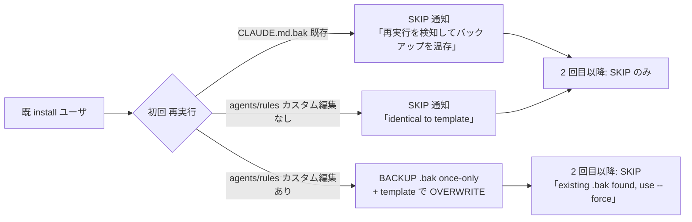

# Design Document

## Overview

**Purpose**: `install.sh` の冪等性バグ（`CLAUDE.md.bak` の上書き）と、新規ファイル追加時の配置漏れ
リスク（個別 `cp` の列挙）、`.claude/agents/` および `.claude/rules/` 配下のカスタム編集が無告知で
上書きされる挙動を、**ユーザー観測可能な振る舞いレベル**で除去する。あわせて、副作用なしに予定操作を
確認できる `--dry-run` モードを追加し、再 install と将来の機能追加（新 `*.tmpl` 追加、新 agent / rule
追加など）に対する堅牢性を高める。

**Users**: 既存の idd-claude 利用者（`install.sh` を 2 回以上再実行する運用者）と、idd-claude メンテナ
（`local-watcher/bin/` や `repo-template/` に新規ファイルを追加する役割）。前者は再実行時に自分の
バックアップ・カスタム編集を失わない安心感を得て、後者は新規ファイル追加のたびに `install.sh` を
書き換えなくて済む。

**Impact**: 現在の `install.sh` は (1) `cp -v` で `CLAUDE.md.bak` を毎回上書きする、
(2) `local-watcher/bin/` 配下を個別 `cp` で 3 ファイル列挙している（`iteration-prompt.tmpl` のように
**条件付きガード**で配置漏れに対応した経緯あり、PR #29 参照）、(3) `.claude/agents/`・`.claude/rules/`
配下を `cp -v ...*.md` で無条件上書きしている。本設計はこれら 3 点を **(a) ワイルドカード化 +
(b) `.bak` once-only 保護 + (c) ハイブリッド上書き安全弁 + (d) `--dry-run`** という最小差分の組み合わせで
解消する。`repo-template/` の構造、`setup.sh` の clone 戦略、cron / launchd 登録文字列、env var 名は
**一切変更しない**。

### Goals

- `local-watcher/bin/` 配下の `*.sh` / `*.tmpl` を**宣言的（ワイルドカード）に配置**し、新規ファイル
  追加時に `install.sh` の修正を不要にする
- `install.sh --repo` を何度再実行しても、**初回実行時に保存された `CLAUDE.md.bak` の内容が変わらない**
- `.claude/agents/` / `.claude/rules/` 配下の既存ファイルを**無条件で上書きしない**安全弁を導入し、
  `--force` opt-in と diff-aware バックアップで「カスタム編集喪失」を防ぐ
- `--dry-run` フラグで**ファイルシステムを変更せずに**予定操作（NEW / OVERWRITE / SKIP / BACKUP）を
  確認できる
- 既存の起動形式・env var 名・cron / launchd 登録文字列・ラベル・配置先パスを**完全に維持**する
- README に冪等性ポリシー節と `--dry-run` の使い方を追記し、利用者が再実行の安全性を理解できる

### Non-Goals

- `repo-template/` のテンプレート構造そのものの変更（`.github/scripts/` を統合する等）
- `setup.sh` の clone 戦略変更（`$HOME/.idd-claude` への shallow clone は維持）
- カスタム編集と template の自動 3-way merge（`git merge-file` 等の高度な統合）
- `.claude/agents/` / `.claude/rules/` のスキーマバージョニング（template 進化への自動追従機構）
- `local-watcher/bin/` 配下のファイル種別追加・削除（本要件は宣言的配置のみ扱う）
- ローカル watcher 配置先の `*.sh` を**個別**にスキップ／上書き判定する仕組み（後述「Decision
  Records」で対象外と判断）

---

## Architecture

### Existing Architecture Analysis

`install.sh` は現在以下の構造で動作する（1 ファイル、`bash 4+`、依存は coreutils のみ）:

1. sudo 警告 → 引数パース（`--repo` / `--local` / `--all` / `-h`）→ 対話モード
2. **`$INSTALL_REPO=true` ブロック**: CLAUDE.md.bak バックアップ → `repo-template/` 配下を個別 `cp -v`
3. **`$INSTALL_LOCAL=true` ブロック**: `local-watcher/bin/` 配下を個別 `cp -v`、launchd / cron 案内、
   前提ツール存在チェック

尊重すべき制約・後方互換性ポイント:

- **既存起動形式**: `./install.sh` 対話 / `--repo [path]` / `--local` / `--all` / `-h` / `--help`
- **既存 env var 名**: `REPO`、`REPO_DIR`、`LOG_DIR`、`LOCK_FILE`、`TRIAGE_MODEL`、`DEV_MODEL` 等は本
  install.sh が触らない（参照は watcher 側のみ）。本設計でも一切干渉しない
- **配置先パス・ファイル名・実行権限**: `~/bin/issue-watcher.sh` は `chmod +x`、`~/bin/*.tmpl` は
  デフォルト権限、`.github/scripts/idd-claude-labels.sh` は `chmod +x`
- **`setup.sh` 経由**: `exec bash "$IDD_CLAUDE_DIR/install.sh" "$@"` で**全引数を透過**しているため、
  `--dry-run` を install.sh に追加するだけで `curl | bash -s -- --all --dry-run` が成立する（修正不要）
- **sudo 検知**: `id -u` == 0 で停止する分岐は維持

解消する technical debt:

- `cp -v "$REPO_PATH/CLAUDE.md" "$REPO_PATH/CLAUDE.md.bak"` の**無条件上書き**（PM 要件 Req2）
- `local-watcher/bin/` 配下の**個別 `cp -v` 列挙**（PR #29 で `iteration-prompt.tmpl` 追加時に
  `if [ -f ... ]` ガードを足した経緯あり、これが対症療法だったことを宣言的配置で根治）
- `.claude/agents/`・`.claude/rules/` の**無条件 `cp -v ...*.md`**（PM 要件 Req3）

### Architecture Pattern & Boundary Map

**採用パターン**: 単一ファイル `install.sh` 内に**ヘルパー関数群**を追加し、既存の手続き的な `cp` 呼び出し
箇所をそれらヘルパーに置き換える。新規ファイル・ディレクトリは**作らない**（テスト用の独立スクリプト
分割や bash library 化は投機的抽象化として却下）。

```mermaid
flowchart TD
  Start[install.sh 起動] --> Parse[引数パース<br/>--dry-run / --force / --repo / --local]
  Parse --> Sudo{sudo?}
  Sudo -- yes --> Warn[警告 → y/N]
  Sudo -- no --> Mode{INSTALL_REPO / INSTALL_LOCAL}

  Mode -- INSTALL_REPO --> RepoBlock[setup_repo]
  Mode -- INSTALL_LOCAL --> LocalBlock[setup_local_watcher]

  RepoBlock --> ClaudeMd[backup_claude_md_once<br/>--repo path]
  RepoBlock --> CopyTemplate[copy_template_file<br/>各個別ファイル]
  RepoBlock --> CopyAgents[copy_agents_rules<br/>safe-overwrite policy]

  LocalBlock --> CopyGlob[copy_glob_to_homebin<br/>local-watcher/bin/*.sh, *.tmpl]
  LocalBlock --> CopyPlist[copy_template_file<br/>plist (macOS only)]

  CopyGlob -.->|each file| Classify[classify_action<br/>NEW/OVERWRITE/SKIP]
  CopyTemplate -.-> Classify
  CopyAgents -.-> Classify
  Classify --> Log[log_action<br/>標準出力にプレフィクス付きで出力]
  Classify --> Apply{DRY_RUN?}
  Apply -- false --> RealCp[cp + chmod]
  Apply -- true --> NoOp[副作用なし]
```

**ドメイン／機能境界**:

| 境界 | 責務 |
|---|---|
| 引数パース層 | `--dry-run` / `--force` / 既存フラグの解釈、グローバル `DRY_RUN` / `FORCE` の確定 |
| 出力／分類層（小型ヘルパー） | `log_action` / `classify_action` / `files_equal` / `dry_run_or` |
| ファイル操作層（小型ヘルパー） | `copy_template_file` / `copy_glob_to_homebin` / `backup_claude_md_once` / `copy_agents_rules` |
| 既存メイン処理層 | `setup_repo` / `setup_local_watcher` 相当のブロック（既存構造を保ったまま、`cp` 呼び出しをヘルパーに置換） |

**parallel-safe な境界**: ファイル操作層のヘルパーは互いに副作用を共有しない（共通変数は `DRY_RUN` /
`FORCE` のみ参照）。`setup_repo` と `setup_local_watcher` は対象ディレクトリが完全に分離されている
（`$REPO_PATH` vs `$HOME/bin`）ため、tasks 上で並列化してもファイル衝突は発生しない。

**新規コンポーネントの根拠**: ヘルパーを 1 個 1 個追加するのは「既存の手続き型コードに最小差分で
冪等性ガードを差し込むため」。bash function は依存も追加せず、shellcheck で検証可能。投機的抽象化の
排除のため、**plugin 機構や config-driven 配置 manifest は導入しない**（要件にない）。

### Technology Stack

| Layer | Choice / Version | Role in Feature | Notes |
|-------|------------------|-----------------|-------|
| Script runtime | bash 4+（Linux / macOS / WSL） | install.sh 全体 | 既存と同じ。新規依存なし |
| File comparison | `cmp -s` (POSIX) | 同一性判定（diff-aware overwrite） | `cmp` は coreutils 標準。`sha256sum` は GNU と macOS の `shasum -a 256` で挙動が分かれるため使わない |
| Glob 展開 | bash glob + `nullglob` | `local-watcher/bin/*.sh` の漏れない列挙 | `shopt -s nullglob` を該当箇所のみで一時的に有効化 |
| Static analysis | shellcheck（CI 不要、開発時手動） | 警告ゼロを目指す | 既存ポリシーを継続 |
| 出力フォーマット | プレーンテキスト（プレフィクス付き） | `--dry-run` / 通常実行両方 | JSON は採用しない（Decision Records 参照） |
| 引数透過 | 既存 `setup.sh` の `exec ... "$@"` | `setup.sh --dry-run` 透過 | setup.sh 修正不要（Decision Records 参照） |

---

## File Structure Plan

新規ディレクトリ・新規ファイルは作らない。**既存 4 ファイルの改修と新規ヘルパー関数追加のみ**。

### Modified Files

```
install.sh                              # 全改修の集約点（ヘルパー関数追加 + 既存 cp 呼び出しの置換）
setup.sh                                # 修正なし（既に exec ... "$@" で全引数透過済み。本設計で確認のみ）
README.md                               # 「冪等性ポリシー」節を追加（CLAUDE.md.bak / agents・rules / --dry-run）
local-watcher/bin/                      # 観測対象（ファイル変更なし、ワイルドカード配置の範囲）
  ├── issue-watcher.sh                  # 既存
  ├── triage-prompt.tmpl                # 既存
  └── iteration-prompt.tmpl             # 既存（PR #29 で追加）
repo-template/                          # 観測対象（ファイル変更なし、ワイルドカード化判断対象）
  ├── CLAUDE.md                         # 個別 cp 維持（.bak 連動の特殊ファイル）
  ├── .claude/
  │   ├── agents/*.md                   # ハイブリッド safe-overwrite 適用範囲
  │   └── rules/*.md                    # ハイブリッド safe-overwrite 適用範囲
  └── .github/
      ├── ISSUE_TEMPLATE/feature.yml    # 個別 cp 維持（単一ファイル）
      ├── workflows/issue-to-pr.yml     # 個別 cp 維持（単一ファイル）
      └── scripts/idd-claude-labels.sh  # 個別 cp 維持（単一ファイル + chmod +x）
```

### install.sh の構造変更（追加・改修箇所）

```
install.sh
├── (既存) sudo 警告
├── (既存) SCRIPT_DIR / REPO_TEMPLATE_DIR / LOCAL_WATCHER_DIR
├── (新設) DRY_RUN=false / FORCE=false の初期化
├── (改修) 引数パース: --dry-run / --force を追加。-h ヘルプ本文を更新
├── (新設) ヘルパー関数群（後述「Components and Interfaces」）
│   ├── log_action()             # NEW/OVERWRITE/SKIP/BACKUP の統一ログ
│   ├── files_equal()            # cmp -s の薄いラッパ
│   ├── classify_action()        # 既存有無 + 内容比較 → NEW/OVERWRITE/SKIP を返す
│   ├── ensure_dir()             # mkdir -p の dry-run 対応版
│   ├── copy_template_file()    # 単一ファイル配置（NEW/SKIP/OVERWRITE/BACKUP に分岐）
│   ├── copy_glob_to_homebin()   # ワイルドカード列挙 + nullglob 安全網
│   ├── backup_claude_md_once()  # CLAUDE.md.bak の once-only 保護
│   └── copy_agents_rules()      # ハイブリッド: 新規=配置 / 同一=SKIP / 差分あり=.bak退避+OVERWRITE / --force 必須なし
├── (改修) setup_repo 相当ブロック: 上記ヘルパーを呼ぶ形に置換
├── (改修) setup_local_watcher 相当ブロック: copy_glob_to_homebin で *.sh / *.tmpl 一括配置
└── (既存) 完了メッセージ
```

---

## Decision Records

PM の Open Questions 4 件と、レビュー観点になりやすい付随論点を Architect 判断として記録する。

### DR-1: agents / rules 上書きポリシー → **(b) `--force` opt-in + (c) diff-aware `.bak` のハイブリッド**

**採用**:

- ファイルが**存在しない** → そのまま配置（NEW、ログに記録）
- ファイルが**存在し、内容が template と完全一致**（`cmp -s` で同一） → スキップ（SKIP、`.bak` 作らない）
- ファイルが**存在し、内容が template と異なる**:
  - **既定挙動（`--force` なし）**: `<file>.bak` が**存在しない**なら現ファイルを `.bak` に退避してから
    template で上書き（BACKUP + OVERWRITE）。`<file>.bak` が**既にある**ならスキップ（SKIP、警告ログ：
    「既存 .bak を尊重して上書きを抑止しました。最新版を当てるには --force を付けて再実行」）
  - **`--force`**: `.bak` 存在に関わらず、`<file>.bak` を一度退避して上書き（BACKUP + OVERWRITE）

**理由**:

| 候補 | 採否 | 理由 |
|---|---|---|
| (a) 警告強化のみ | 却下 | 「予告なく失われる」は防げるが、依然として上書きは無条件で起こる。Req 3.1 の精神に反する |
| (b) `--force` opt-in 単独 | 部分採用 | 安全だが、template 進化（reviewer.md のような新規追加）が「既定で配置されない」のはユーザー体験劣化。idd-claude は dogfood で agents / rules が頻繁に進化する前提のため、新規は無条件配置がよい |
| (c) diff-aware `.bak` 単独 | 部分採用 | カスタム編集の保護には十分だが、`<file>.bak` がディレクトリ全体に量産されうる懸念がある。**初回 1 回のみ `.bak` を作る** once-only 規律と組み合わせれば抑制可能 |
| **(b) + (c) ハイブリッド** | **採用** | 新規は無条件配置（template 進化に追従）+ 内容同一は SKIP（無駄な `.bak` を作らない）+ 差分ありは `.bak` once-only 退避（カスタム編集を 1 世代分保護）+ `--force` で template 強制適用（最新追従したい上級者向け） |

**ヘルプとの整合**: `install.sh --help` に挙動概要を 4 行で記述（Req 3.6）。

**`.bak` の量産抑制**: `<file>.bak` が**既に存在する場合は再退避しない**（`backup_claude_md_once` と
同じ once-only 規律）。これにより、3 回以上再実行しても `.bak` ファイル数は最大 1 ファイル / template
ファイルに収まる。

**移行影響**: 既存 install ユーザは初回再実行で `.bak` が 1 世代作られる可能性がある（カスタム編集が
あれば）。これは README の Migration Note で明示する。

### DR-2: `repo-template/` 側のワイルドカード化範囲 → **agents/ と rules/ のみ**

| 対象 | 判断 | 理由 |
|---|---|---|
| `repo-template/.claude/agents/*.md` | **ワイルドカード化** | ファイル数増減が頻繁（reviewer.md / qa.md などが追加されてきた経緯）。DR-1 のハイブリッド safe-overwrite との整合 |
| `repo-template/.claude/rules/*.md` | **ワイルドカード化** | 同上。template 進化が活発 |
| `repo-template/CLAUDE.md` | 個別 `cp` 維持 | `.bak` 連動の特殊ファイル（DR-3 の once-only 保護対象）。ワイルドカード化と相性が悪い |
| `repo-template/.github/ISSUE_TEMPLATE/feature.yml` | 個別 `cp` 維持 | 単一ファイル。当面増える計画なし |
| `repo-template/.github/workflows/issue-to-pr.yml` | 個別 `cp` 維持 | 単一ファイル。`*.yml` ワイルドカードにすると将来の意図しない workflow 追加で全部配置されてしまう |
| `repo-template/.github/scripts/idd-claude-labels.sh` | 個別 `cp` 維持 | 単一ファイル + `chmod +x` 必須。glob で配ると chmod 対象判定が面倒 |
| `local-watcher/bin/*.sh` | **ワイルドカード化**（PM 要件） | Req 1.1, 1.4。`chmod +x` をループで一括付与 |
| `local-watcher/bin/*.tmpl` | **ワイルドカード化**（PM 要件） | Req 1.2。chmod 不要 |
| `local-watcher/LaunchAgents/com.local.issue-watcher.plist` | 個別 `cp` 維持 | macOS 限定 + 単一ファイル + 配置先別 |

**根拠の総括**: ワイルドカード化は「ファイル増減が活発」かつ「全ファイル同一の処理（全部 chmod なし or
全部 chmod +x）」に限る。1 個でも特殊扱いが混じる場合は個別 `cp` のままにすると、shellcheck で検査
しやすく、レビュー時の意図も明確。

### DR-3: `--dry-run` 出力フォーマット → **プレーンテキスト + アクション prefix**

**採用フォーマット**（標準出力に出力。ログとの統合を意識し、stderr ではなく stdout）:

```
[DRY-RUN] NEW       /home/u/bin/issue-watcher.sh           (chmod +x)
[DRY-RUN] OVERWRITE /home/u/bin/triage-prompt.tmpl
[DRY-RUN] SKIP      /home/u/bin/iteration-prompt.tmpl       (identical to template)
[DRY-RUN] BACKUP    /tmp/proj/.claude/agents/developer.md → developer.md.bak  (custom edits detected)
```

**通常実行時のフォーマット**（`[DRY-RUN] ` プレフィクスを `[INSTALL] ` に変える以外は同形式）:

```
[INSTALL] NEW       /home/u/bin/issue-watcher.sh           (chmod +x)
[INSTALL] BACKUP    /tmp/proj/.claude/agents/developer.md → developer.md.bak
[INSTALL] OVERWRITE /tmp/proj/.claude/agents/developer.md
[INSTALL] SKIP      /home/u/bin/iteration-prompt.tmpl       (identical to template)
```

**prefix 規約**:

| Prefix | 意味 |
|---|---|
| `NEW` | 配置先にファイルが存在しない。新規作成（mkdir + cp） |
| `OVERWRITE` | 既存ファイルを template 内容で上書き（差分あり、または `--force` 指定時） |
| `SKIP` | 既存ファイルが template と同一、もしくは `.bak` 既存で上書き抑止 |
| `BACKUP` | `<file>.bak` を作成（`OVERWRITE` 直前にのみ発生） |

**理由**:

| 候補 | 採否 | 理由 |
|---|---|---|
| プレーンテキスト | **採用** | 既存 `cp -v` のログと視覚的に近い。grep 集計が容易（`grep '^\[INSTALL\] OVERWRITE'`）。bash で生成コストゼロ。`jq` / Node 等の追加依存不要 |
| JSON 単独 | 却下 | 利用者が目視で確認するシナリオが主。JSON だと `jq` が前提になり、cron-like 最小 PATH の世界観と合わない |
| 両対応（`--dry-run --json`） | 却下 | YAGNI。要件にない上、テスト負担が倍増 |

**stdout vs stderr**: dry-run の操作列挙は `stdout`、エラー（前提ツール不足等）は `stderr`。NFR 2.2 と
整合（dry-run は正常系出力扱い）。

**`--dry-run` と通常実行の出力一致**: 両者の prefix を揃えることで、Req 4.5「dry-run で NEW と
OVERWRITE に分類されたファイルが実際の実行で配置される」を grep diff で検証可能にする。

### DR-4: `setup.sh` 経由（`curl | bash`）での `--dry-run` 透過 → **追加実装不要**

**判断**: `setup.sh` の最終行は `exec bash "$IDD_CLAUDE_DIR/install.sh" "$@"` であり、**全引数を
位置引数として透過**している。`--dry-run` は install.sh 側で受理するように追加するだけで、

```bash
curl -fsSL <setup.sh URL> | bash -s -- --all --dry-run
bash <(curl -fsSL <setup.sh URL>) --all --dry-run
```

の両方が成立する。setup.sh 自体の修正・テストは**不要**（PM 要件 Req 4 は install.sh 単体動作のみを
必須化しているが、本判断で setup.sh 経由でも自動的に成立する）。

**確認タスクのみ tasks.md に追加**（diff-by-diff で `setup.sh` に変更が発生しないことを保証する）。

### DR-5: 内容比較に `cmp -s` を採用、`sha256sum` を採用しない

`sha256sum` は GNU 環境では `sha256sum`、macOS では `shasum -a 256` と**コマンド名が分岐**する。
切り替え分岐を入れるとテストパスが倍増する。`cmp -s` は POSIX 標準で挙動も「同一なら exit 0」と単純。
本要件は「内容差分の有無」しか必要としないため、ハッシュ計算は YAGNI。

### DR-6: `--force` フラグの追加範囲

`--force` は「`.bak` 存在に関わらず再 `.bak` 退避して上書き」する**最新追従モード**として、agents /
rules / CLAUDE.md（DR-1 適用範囲）にのみ作用させる。`local-watcher/bin/` 配下は元々ユーザーが直接編集
することが想定されていない（`REPO` / `REPO_DIR` は env var で渡す設計）ため、`--force` の影響範囲外
とする（常に上書きで OK）。

---

## Components and Interfaces

新規はすべて `install.sh` 内の bash 関数。**外部公開 API はない**ため、関数シグネチャと終了コード規約
のみを契約として定義する。

### Layer: 出力／分類層

#### log_action

| Field | Detail |
|-------|--------|
| Intent | 統一フォーマットでアクションを stdout に出力する（dry-run / 通常を切替） |
| Requirements | 1.6, 2.3, 3.3, 4.2, 4.3, NFR 2.1 |

**Signature**:

```bash
log_action <action> <path> [<note>]
# action: NEW | OVERWRITE | SKIP | BACKUP
# path:   絶対パス推奨（ログから操作対象が一意に特定できる粒度）
# note:   optional の補足情報（"(chmod +x)" や "(identical to template)" 等）
```

**Behavior**:
- `DRY_RUN=true` → `[DRY-RUN] <ACTION> <path> <note>` を stdout へ
- `DRY_RUN=false` → `[INSTALL] <ACTION> <path> <note>` を stdout へ
- 戻り値は常に 0

#### files_equal

| Field | Detail |
|-------|--------|
| Intent | 2 ファイルの内容同一性を真偽値で返す |
| Requirements | 3.1, NFR 1.1 |

**Signature**:

```bash
files_equal <path_a> <path_b>
# return: 0=同一 / 1=差分あり / 2=どちらかが存在しない or 比較不能
```

**Behavior**: `cmp -s "$a" "$b"`。両方が regular file である前提。比較不能（権限・存在等）は exit 2。

#### classify_action

| Field | Detail |
|-------|--------|
| Intent | source と dest を比較して NEW/OVERWRITE/SKIP のいずれかを判定 |
| Requirements | 1.6, 3.1, 3.3, 4.3, NFR 1.1 |

**Signature**:

```bash
classify_action <src> <dest>
# stdout: "NEW" | "OVERWRITE" | "SKIP"
# return: 0
```

**Decision Table**:

| dest の状態 | src vs dest | 出力 |
|---|---|---|
| 存在しない | — | NEW |
| 存在 | 同一 | SKIP |
| 存在 | 差分あり | OVERWRITE |

`SKIP` の場合の補足情報（`identical to template` / `existing .bak protected, use --force`）は呼び出し側で
log_action に付加。

### Layer: ファイル操作層

#### ensure_dir

| Field | Detail |
|-------|--------|
| Intent | mkdir -p の dry-run 対応版（dry-run 時はディレクトリも作らない） |
| Requirements | 4.1 |

**Signature**:

```bash
ensure_dir <path>
# return: 0 (常に成功扱い、dry-run 時は noop)
```

#### copy_template_file

| Field | Detail |
|-------|--------|
| Intent | 単一ファイルの NEW/SKIP 配置（既存があれば SKIP、無ければコピー） |
| Requirements | 1.4, 1.5, 5.4 |

**Signature**:

```bash
copy_template_file <src> <dest> [--executable]
# --executable: chmod +x を実行（dry-run 時は note に "(chmod +x)" を付加）
# return: 0
```

**Behavior**: 単純配置用。`feature.yml` / `issue-to-pr.yml` / `idd-claude-labels.sh` /
`com.local.issue-watcher.plist` 等、**「既存があってもユーザーが手で編集する想定がない」ファイル**で
利用。常に `OVERWRITE`（既存 == 同一なら SKIP）。`.bak` は作らない。

> **設計判断**: `repo-template/` 側のこれらは「meta」ファイル（workflow YAML、ラベル定義スクリプト）
> であり、利用者が編集する典型的シナリオではない。CLAUDE.md / agents / rules とは扱いを分ける。

#### copy_glob_to_homebin

| Field | Detail |
|-------|--------|
| Intent | `local-watcher/bin/*.sh` および `*.tmpl` の宣言的（ワイルドカード）配置 |
| Requirements | 1.1, 1.2, 1.3, 1.4, 1.5, 1.6, 5.4 |

**Signature**:

```bash
copy_glob_to_homebin <src_dir> <pattern> <dest_dir> [--executable]
# 例: copy_glob_to_homebin "$LOCAL_WATCHER_DIR/bin" "*.sh" "$HOME/bin" --executable
#     copy_glob_to_homebin "$LOCAL_WATCHER_DIR/bin" "*.tmpl" "$HOME/bin"
# return: 0
```

**Behavior**:
1. `shopt -s nullglob` を一時的に有効化（マッチ 0 件で空配列になるよう）
2. `for src in "$src_dir"/$pattern` でループ
3. 各 src について `classify_action` → `log_action` → 実コピー（dry-run でなければ）
4. `--executable` 指定時は `chmod +x` を 1 ファイルずつ
5. マッチ 0 件なら `log_action SKIP "$src_dir/$pattern" "(no files matched)"` を出力（Req 1.6 異常終了させない）
6. `shopt -u nullglob` で元に戻す

#### backup_claude_md_once

| Field | Detail |
|-------|--------|
| Intent | CLAUDE.md.bak を**初回 1 回のみ**作成し、再実行で内容を変えない |
| Requirements | 2.1, 2.2, 2.3, 2.4, 2.5, NFR 1.1 |

**Signature**:

```bash
backup_claude_md_once <repo_path>
# return: 0
```

**Behavior**:

```
if CLAUDE.md 不在 → 何もしない（return 0）
elif CLAUDE.md.bak 不在 → CLAUDE.md を CLAUDE.md.bak にコピー（log_action BACKUP）
else → SKIP ログ "(existing .bak preserved)"（Req 2.3）
```

**禁止**: 既存 `.bak` の上書き（テンプレ由来 CLAUDE.md を `.bak` にすることが現行バグ）。

#### copy_agents_rules

| Field | Detail |
|-------|--------|
| Intent | `.claude/agents/*.md` および `.claude/rules/*.md` のハイブリッド safe-overwrite 配置 |
| Requirements | 3.1, 3.2, 3.3, 3.4, 3.5, 3.6, 5.4, NFR 1.1 |

**Signature**:

```bash
copy_agents_rules <src_dir> <dest_dir>
# 例: copy_agents_rules "$REPO_TEMPLATE_DIR/.claude/agents" "$REPO_PATH/.claude/agents"
# return: 0
```

**Behavior**（DR-1 のハイブリッドポリシーを実装）:

```
shopt -s nullglob
for src in "$src_dir"/*.md:
  dest = "$dest_dir/$(basename "$src")"
  case classify_action "$src" "$dest":
    NEW       → log_action NEW; cp（dry-run でなければ）
    SKIP      → log_action SKIP "$dest" "(identical to template)"
    OVERWRITE →
      if FORCE=true:
        # 既存 .bak も含め退避（once-only は後続再実行時の規律で守る）
        if [ ! -f "$dest.bak" ]:
          log_action BACKUP "$dest" "→ $(basename "$dest").bak (--force)"
          cp "$dest" "$dest.bak" (dry-run でなければ)
        else:
          log_action SKIP "$dest.bak" "(existing .bak preserved even with --force)"
        log_action OVERWRITE "$dest"
        cp (dry-run でなければ)
      else:  # FORCE=false（既定）
        if [ ! -f "$dest.bak" ]:
          log_action BACKUP "$dest" "→ $(basename "$dest").bak (custom edits detected)"
          cp "$dest" "$dest.bak"
          log_action OVERWRITE "$dest"
          cp
        else:
          log_action SKIP "$dest" "(existing .bak found, use --force to overwrite)"
shopt -u nullglob
```

**設計上の重要点**:
- **NEW は無条件配置**（template 進化に追従、Req 3.2）
- **`<file>.bak` がすでにある場合は再退避しない**（once-only 規律、`.bak` 量産抑制）
- **`--force` は既存 `.bak` を尊重する**（once-only を貫徹）。これは「カスタム編集の最初のスナップショットを
  最も貴重なものとして保護する」という設計意図

### Layer: 引数パース層（既存改修）

`install.sh` の引数パースに `--dry-run` と `--force` を追加。`-h` / `--help` 出力にも追記。

```bash
# 追加箇所
--dry-run)
  DRY_RUN=true
  shift
  ;;
--force)
  FORCE=true
  shift
  ;;
```

`-h` / `--help` 本文（`sed -n '3,14p'` で表示している部分）に以下を追記:

```
オプション:
  --dry-run        実コピーせず、予定操作を [DRY-RUN] プレフィクスで列挙
  --force          .claude/agents/ および .claude/rules/、CLAUDE.md について、
                   既存ファイルが template と異なる場合に再 .bak 退避して強制上書き
                   （既存 *.bak は once-only 規律で保護される）
```

### Layer: 既存メイン処理層（改修）

#### setup_repo ブロック（line 99-165）

改修内容:
- `if [ -f "$REPO_PATH/CLAUDE.md" ]; then cp ...` → `backup_claude_md_once "$REPO_PATH"`
- `cp -v "$REPO_TEMPLATE_DIR/CLAUDE.md" "$REPO_PATH/CLAUDE.md"` → `copy_template_file ... ...` ブロック化
  + DR-1 ポリシー（CLAUDE.md も agents/rules と同じ「ユーザーが編集する」想定なので、本ブロックの
  CLAUDE.md 配置自体も `copy_agents_rules` と同じハイブリッドポリシーで処理する関数を呼ぶ）

> **設計判断**: CLAUDE.md は agents/rules と同じく利用者がカスタマイズする前提のファイル。
> `backup_claude_md_once` は「初回 install.sh 実行時に user 由来の CLAUDE.md を保護する」という
> 元ロジックの保存（後方互換）であり、後段の `copy_agents_rules` 相当処理（diff-aware）とは目的が
> 異なる。両者を併用する:
>
> 1. `backup_claude_md_once` で **once-only の保険**（CLAUDE.md.bak がなければ作る、あれば触らない）
> 2. その後 `copy_agents_rules` 相当の per-file ハイブリッドで CLAUDE.md を上書き判定
>    （`<repo>/CLAUDE.md.bak` が既にあるので、ハイブリッド側は `.bak` 退避をスキップしてそのまま
>    OVERWRITE / SKIP のみを行う）

- `cp -v ... .claude/agents/*.md` → `copy_agents_rules "$REPO_TEMPLATE_DIR/.claude/agents" "$REPO_PATH/.claude/agents"`
- `cp -v ... .claude/rules/*.md` → `copy_agents_rules "$REPO_TEMPLATE_DIR/.claude/rules" "$REPO_PATH/.claude/rules"`
- 既存 `cp -v ... feature.yml / issue-to-pr.yml / idd-claude-labels.sh` → `copy_template_file ... [--executable]`

**ヒントメッセージ**（`<<REPO_HINT`）は無変更で維持。

#### setup_local_watcher ブロック（line 170-262）

改修内容:
- `cp -v "$LOCAL_WATCHER_DIR/bin/issue-watcher.sh" "$HOME/bin/"` ＋ `cp -v ...triage-prompt.tmpl ...` ＋
  `if [ -f ... iteration-prompt.tmpl ]; then cp -v ...` の 3 行を、

  ```bash
  copy_glob_to_homebin "$LOCAL_WATCHER_DIR/bin" "*.sh"   "$HOME/bin" --executable
  copy_glob_to_homebin "$LOCAL_WATCHER_DIR/bin" "*.tmpl" "$HOME/bin"
  ```

  の 2 行に置換する（Req 1.1, 1.2, 1.3, 1.4）。

- `chmod +x "$HOME/bin/issue-watcher.sh"` は `copy_glob_to_homebin --executable` 内で全 `*.sh` に
  対して実行されるため**削除**（後方互換: `issue-watcher.sh` を含む全 `*.sh` が +x になる、現行と同じ
  または上位互換）

- macOS 限定の plist コピー: `copy_template_file "$LOCAL_WATCHER_DIR/LaunchAgents/com.local.issue-watcher.plist" "$HOME/Library/LaunchAgents/com.local.issue-watcher.plist"`

- launchd / cron ヒントメッセージは無変更で維持

- 末尾の前提ツールチェック（`gh`/`jq`/`claude`/`git`/`flock`）は dry-run でも実行する（情報提供目的、
  副作用なし）

---

## Data Models

### Action Record（概念モデル）

`log_action` が出力する 1 行の構造:

```
<bracket-prefix> <action> <space-padded path> [<note>]
bracket-prefix : "[DRY-RUN]" | "[INSTALL]"
action         : "NEW" | "OVERWRITE" | "SKIP" | "BACKUP"
path           : 絶対パス（操作対象が一意に特定できる粒度）
note           : optional 補足情報、括弧で囲む
```

**永続化先**: なし（標準出力のみ）。利用者が `tee` などでファイル化する想定。

**理由**: NFR 2.1 は「標準出力に出力」のみを要求。状態を保持する必要なし。

---

## Error Handling

### Error Strategy

`install.sh` は `set -euo pipefail` 下で動作する。本改修で発生し得る新規エラーパスは以下:

| エラー | カテゴリ | 対応 |
|---|---|---|
| `cmp` コマンド不在 | System Error | sudo 警告と同パターンで stderr に「cmp が見つかりません。coreutils を確認してください」と出して exit 1 |
| `--dry-run` 中に dest ディレクトリの read 権限がない | User Error | classify_action が既存ファイルを読めず exit 2。log_action に `SKIP <path> "(unreadable, treated as new)"` で継続。実行時には `cp` が permission denied で正常な失敗 |
| 既に `.bak` がある状態で `--force` を付けて上書きしたい | User-induced Behavior | DR-1 仕様通り、`.bak` は再退避しない（once-only）が `OVERWRITE` は実行する。利用者には note で `(existing .bak preserved even with --force)` と通知 |
| ワイルドカードがマッチ 0 件 | Domain | Req 1.6 に従って `SKIP <pattern> "(no files matched)"` を log_action し、exit 0 で継続 |
| 引数パース時に未知オプション | User Error | 既存と同じく stderr に「未知のオプション: $1」を出して exit 1 |

### Error Categories and Responses

- **User Errors (引数誤り、未知オプション)**: stderr + exit 1（既存挙動踏襲、NFR 2.2）
- **System Errors (cmp 不在、ディスクフル)**: stderr + exit 1。`set -e` で停止
- **Domain (マッチ 0 件、 .bak 既存)**: ログに記録して exit 0 で継続（運用ノイズを上げない）

### `--dry-run` 中のエラー検出

`--dry-run` でも以下は実行する（副作用なし）:

- 引数パース・整合性チェック（`--repo` の path が存在しない → exit 1）
- 前提ツール存在確認（`gh` / `jq` / `claude` / `git` / `flock`）
- ワイルドカード列挙（read のみ）
- `cmp` による内容比較（read のみ）

これにより、dry-run の出力が「実際に install したらこうなる」のシミュレーションとして信頼できる。
**dry-run で SKIP / OVERWRITE / NEW と判定されたファイルが、`--dry-run` を外して再実行したときに
同じ分類で処理される**ことが Req 4.5 の本質的保証となる。

---

## Migration Strategy

本改修は**既存の起動形式・env var 名・cron / launchd 登録文字列・ラベル名・配置先パス**を一切変えない。
利用者が再実行するだけで自動的に新しい冪等性ガードが適用される。

### 既 install ユーザへの影響と対処



**Migration Note（README に記載予定）**:

- **後方互換性**: 既存の `install.sh --repo` / `--local` / `--all` 起動はそのまま動く
- **CLAUDE.md.bak バグ修正**: 過去に再実行で `.bak` がテンプレ由来内容に書き換わったユーザは、初回の
  カスタム CLAUDE.md を取り戻せない可能性がある（git history から復元してください）。本改修以降は
  発生しない
- **agents / rules の挙動変化**: 過去に再実行で意図せず上書きされていたカスタム編集は、本改修以降は
  `<file>.bak` に退避される。**初回再実行で多数の BACKUP ログが出る可能性がある**が想定挙動
- **`.bak` 量産対策**: 本実装は once-only。1 ファイルにつき最大 1 個の `.bak` まで。最新 template を
  強制適用したい場合は `--force` を付けるが、`.bak` は更新されない（最初のスナップショットが最重要）

### Rollout

- 単一 PR で完結（install.sh の関数追加 + 既存ブロック改修 + README 1 節追加）
- 設計 PR ゲートを通って merge → main の install.sh が改修版に切り替わる
- dogfood: 本 repo 自身に対して `install.sh --repo .` を実行して挙動確認

---

## Testing Strategy

本リポジトリには unit test フレームワークがないため、**静的解析 + 手動スモークテスト + dogfood E2E** で
検証する（CLAUDE.md ポリシー踏襲）。

### Unit Tests（bash 関数単位、手動）

1. `files_equal /etc/hostname /etc/hostname` → exit 0、`files_equal /etc/hostname /etc/hosts` → exit 1
2. `classify_action src dest`: dest 不在 / 同一 / 差分の 3 パスで `NEW` / `SKIP` / `OVERWRITE` を返すこと
3. `backup_claude_md_once`: (a) CLAUDE.md.bak 不在で初回 BACKUP、(b) 既存 .bak で SKIP、(c) CLAUDE.md
   不在で何もしない（exit 0）
4. `copy_glob_to_homebin`: マッチ 0 件で SKIP ログ + exit 0
5. `copy_agents_rules`: NEW / SKIP（同一）/ OVERWRITE+BACKUP / SKIP（既存 .bak）の 4 パスを順に再現

### Integration Tests（install.sh 全体、`/tmp/scratch` 使い捨て）

1. `/tmp/scratch-repo` を作成 → `./install.sh --repo /tmp/scratch-repo` 実行 → 全ファイル NEW で配置
2. 同コマンドを 2 回目実行 → CLAUDE.md.bak が温存され、agents / rules の SKIP（identical）が出る
3. `/tmp/scratch-repo/.claude/agents/developer.md` をエディットして再実行 → BACKUP `.bak` 作成 + OVERWRITE
4. 3 の状態で再々実行 → SKIP（existing .bak found, use --force）。`.bak` 内容変化なし
5. `--force` を付けて再実行 → OVERWRITE のみ実行、`.bak` は once-only で温存
6. `local-watcher/bin/` に新規 `*.tmpl`（テスト用 dummy）を追加して `./install.sh --local --dry-run`
   実行 → DRY-RUN NEW として列挙されること（Req 1.3 の核）

### Dry-run Tests（副作用なし）

1. `./install.sh --repo /tmp/scratch-repo --dry-run` 実行 → 全ファイル NEW、ファイルシステム未変更
2. 1 の出力を保存し、`--dry-run` を外して再実行 → 1 と同じ分類で実際に配置されることを diff で確認
   （Req 4.5）
3. `./install.sh --repo /tmp/scratch-repo --dry-run` を 2 回目実行（実 install 後）→ SKIP のみ
4. setup.sh 経由: `bash setup.sh --all --dry-run` で install.sh まで `--dry-run` が透過すること
   （DR-4 の検証）

### Static Analysis

- `shellcheck install.sh` → 警告ゼロを目指す（既存指摘の流用は OK）
- `bash -n install.sh` → syntax error 無し
- 既存 `actionlint` 対象（`.github/workflows/*.yml`）は本改修で変更なし

### Dogfood E2E

- 本 repo 自身に対して `./install.sh --repo .` 実行 → 自分自身の `repo-template/` を自分自身に
  再配置（self-hosting）。CLAUDE.md.bak が一度だけ作られ、再実行で温存されることを確認
- 本 repo 自身に対して `./install.sh --local` 実行 → `~/bin/` の watcher 配置を更新

---

## Requirements Traceability

| Requirement | Summary | Components | Decision Records |
|---|---|---|---|
| 1.1 | `*.sh` の宣言的配置 | copy_glob_to_homebin、setup_local_watcher | DR-2 |
| 1.2 | `*.tmpl` の宣言的配置 | copy_glob_to_homebin、setup_local_watcher | DR-2 |
| 1.3 | 新規ファイル追加で install.sh 修正不要 | copy_glob_to_homebin（nullglob + glob 展開） | DR-2 |
| 1.4 | `*.sh` への chmod +x 一括付与 | copy_glob_to_homebin --executable | — |
| 1.5 | 既存ファイル集合の同等性（欠落なし） | copy_glob_to_homebin、setup_local_watcher 改修内容 | — |
| 1.6 | マッチ 0 件で正常終了 | copy_glob_to_homebin（nullglob + log SKIP） | — |
| 2.1 | CLAUDE.md.bak 不在時に初回バックアップ | backup_claude_md_once | — |
| 2.2 | 既存 .bak は上書きしない | backup_claude_md_once | — |
| 2.3 | 保持を標準出力に記録 | backup_claude_md_once → log_action | DR-3 |
| 2.4 | 連続再実行で .bak 内容不変 | backup_claude_md_once（once-only） | — |
| 2.5 | CLAUDE.md 不在時はバックアップしない | backup_claude_md_once（条件分岐） | — |
| 3.1 | 無条件・無告知の上書きをしない | copy_agents_rules（diff-aware + .bak 退避） | DR-1 |
| 3.2 | 不在ファイルは新規配置 | copy_agents_rules（NEW パス） | DR-1 |
| 3.3 | NEW/OVERWRITE/SKIP のファイル単位ログ | log_action + classify_action | DR-3 |
| 3.4 | --force opt-in で上書き許可 | --force パース + copy_agents_rules（FORCE 分岐） | DR-1, DR-6 |
| 3.5 | 上書き時の事後復元手段（.bak） | copy_agents_rules（BACKUP → OVERWRITE） | DR-1 |
| 3.6 | --help でポリシー文書化 | -h / --help 本文の改修 | DR-1 |
| 4.1 | --dry-run でファイルシステム不変 | DRY_RUN フラグ + 各ヘルパーの dry-run 分岐 + ensure_dir | — |
| 4.2 | 各ファイルパスを stdout に列挙 | log_action（[DRY-RUN] prefix） | DR-3 |
| 4.3 | NEW/OVERWRITE/SKIP の判別可能な形式 | log_action + classify_action | DR-3 |
| 4.4 | dry-run で exit 0 | DRY_RUN 分岐は副作用なし、`set -e` でも止まらない | — |
| 4.5 | dry-run の分類と実実行の分類が一致 | classify_action を両モードで共有 | DR-3 |
| 4.6 | --help に --dry-run 記載 | -h / --help 本文の改修 | — |
| 5.1 | 既存起動形式の維持 | 引数パース改修（追加のみ、既存分岐は無変更） | — |
| 5.2 | 既存 env var 名・意味・既定値を変えない | install.sh は env var を新設しない（DRY_RUN/FORCE はフラグから） | — |
| 5.3 | cron / launchd 登録文字列の書き換え不要 | watcher 側ファイルパス・ファイル名は不変 | — |
| 5.4 | 配置ファイル群は従来と同じ | copy_glob_to_homebin、setup_repo の維持されるファイルセット | DR-2 |
| 5.5 | ラベル定義の名前変更なし | idd-claude-labels.sh は本改修で触らない | — |
| 5.6 | sudo 警告の維持 | 既存 sudo 検知ブロック無変更 | — |
| 6.1 | README に CLAUDE.md.bak 仕様記載 | README.md「冪等性ポリシー」節 | — |
| 6.2 | README に agents / rules 上書き挙動記載 | README.md「冪等性ポリシー」節 | DR-1 |
| 6.3 | README に --dry-run 使い方記載 | README.md「冪等性ポリシー」節 | DR-3 |
| 6.4 | 既存利用者の追加手順がない／最小である旨 | README.md Migration Note | — |
| NFR 1.1 | 連続再実行で .bak / カスタム編集に差分なし | backup_claude_md_once + copy_agents_rules（once-only） | DR-1 |
| NFR 1.2 | --dry-run のみで副作用切替 | DRY_RUN フラグの一元化 | — |
| NFR 2.1 | 各操作の path と分類を stdout 出力 | log_action | DR-3 |
| NFR 2.2 | エラーは stderr + 非ゼロ exit | 既存ポリシー踏襲、新規エラーも同様 | — |
| NFR 3.1 | $HOME 配下のみで完結、新規 sudo 不要 | 配置先は $HOME/bin・$HOME/Library・$REPO_PATH のみ | — |

---

## Risks & Open Questions

### 実装上のリスク

- **`cmp` の挙動差異**: BSD cmp と GNU cmp で `-s` の意味は同じ（silent）だが、Linux/macOS いずれでも
  動作確認をスモークテストで取る
- **bash の `nullglob` スコープ**: 関数内で `shopt -s nullglob` した場合、関数 return 後にグローバルに
  漏れる。関数末尾で必ず `shopt -u nullglob` する規律を `shellcheck` で担保
- **`--force` の意図が利用者に伝わるか**: ヘルプ文 4 行で説明しているが、README の Migration Note でも
  「最新 template を強制適用したい場合のみ使う」「既存 `.bak` は守られる」を強調する

### Open Questions（実装着手前に Reviewer に確認したい論点）

なし。PM Open Questions 4 件は本 design.md の Decision Records で解決済み（DR-1〜DR-4）。
