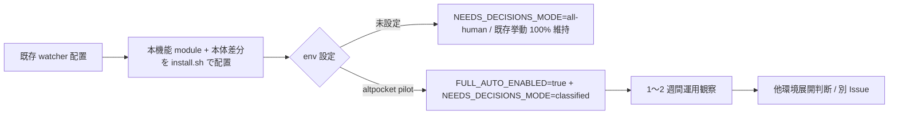

# Design Document

## Overview

**Purpose**: 本機能は `needs-decisions` 状態の Issue のうち、Triage / PM が **明確な推奨デフォルトを持ち
機密・コンプラ・不可逆・外部影響のいずれにも該当しない** と分類した `safe` ケースを、watcher が PM の
第一推奨で自動続行できるようにする。`human-only`（機密 / コンプラ / 不可逆 / 外部影響）は **モードに
よらず絶対停止**を保ち、機密情報の自動続行リスクをゼロに保つ。

**Users**: idd-claude self-hosting 運用者および pilot 運用先 altpocket-server の保守担当。env
`NEEDS_DECISIONS_MODE` で「全人間判断 / 分類別 / 全自動」の 3 段階の自動化レベルを選択できる。

**Impact**: 現状すべての `needs-decisions` Issue は人間ラベル除去まで自動進行が停止する。本機能導入後、
`FULL_AUTO_ENABLED=true` AND `NEEDS_DECISIONS_MODE in (classified, all-auto)` の **AND 二重 opt-in** 下に
限り、`safe` 分類の Issue は watcher 自身が `needs-decisions` ラベル除去 + 自動続行コメント投稿により
次サイクルでの再 Triage に復帰する。既定モード（`all-human`）および kill switch OFF では gh API 呼び出し
ゼロで本機能導入前と完全等価。

### Goals

- env `NEEDS_DECISIONS_MODE` を 3 値正規化（`all-human` / `classified` / `all-auto`、既定 `all-human`）し、
  不正値はすべて安全側 `all-human` に倒す（Req 1）
- Triage 出力 JSON の `decisions[]` に `classification: "safe" | "human-only"` フィールドを追加し、Triage
  agent / PM agent が **再起動なしに同サイクル内で読める機械可読な根拠**を残す（Req 2）
- `FULL_AUTO_ENABLED` kill switch との **AND 二重 opt-in** 配下で、`safe` のみを **PM 第一推奨**
  （`decisions[0].recommendation`）で自動続行する（Req 3, 5）
- `human-only` / 分類欠落 / `safe` + `human-only` 混在は **どのモードでも絶対停止**（Req 4, NFR 4）
- 既定値 + kill switch OFF で gh API 呼び出しゼロ + 既存 `needs-decisions` 付与経路の挙動完全保持
  （Req 5, NFR 1）
- 観測可能性: cycle startup ログに `needs-decisions-mode=<mode>` を追記し、判定結果 / 抑止原因を
  grep 可能な形で残す（Req 6）

### Non-Goals

- 分類精度向上のための Triage / PM プロンプト改善（要件 Out of Scope / 別 Issue 領分）
- 既存 `needs-decisions` 付与経路（Partial Status Gate #148 / Spec Completeness #219 / Tasks Count
  #131 等）の挙動変更（新たな付与・除去経路を作らない）
- 既存個別 gate（auto-merge / failed-recovery / merge-queue 等）の値・名前・既定値の変更
- 分類タグの後付け retrofit（本機能導入前の既付与 `needs-decisions` Issue は対象外）
- 自動続行後の不採用 recommendation 候補の永続化（採用したものは Issue コメントで残すのみ）
- `NEEDS_DECISIONS_MODE` 設定変更の hot reload（cron 次サイクル反映で十分）
- 分類タグ細分化（`safe-low` / `safe-medium` 等）
- altpocket-server 以外への展開判断（運用ロールアウト計画）

## Architecture

### Existing Architecture Analysis

- **kill switch との関係**: `FULL_AUTO_ENABLED` (#348) は既に「full-auto 系 processor の単一 kill
  switch」として確立済み（`full_auto_enabled` 関数 / `local-watcher/bin/issue-watcher.sh:9843`）。
  本機能は同 kill switch 配下に **AND 二重 opt-in** で配線し、kill switch OFF / 個別 gate OFF / 不正値
  はすべて安全側に正規化する既存パターン（`auto-merge.sh`, `failed-recovery.sh`, `auto-merge-design.sh`）
  を踏襲する
- **Triage / PM 経路**: Triage prompt は `local-watcher/bin/triage-prompt.tmpl` が canonical で、JSON
  スキーマの 5 keys（`status` / `needs_architect` / `architect_reason` / `rationale` / `decisions`） +
  `edit_paths` を確立済み。本機能は **既存 keys の位置・型・意味を変更せず**、`decisions[].classification`
  を新規追加する形で拡張する（#18 の `edit_paths` 拡張と同じ後方互換パターン）
- **needs-decisions 付与経路**: 既存付与は (a) Triage が `status=needs-decisions` で 0〜N 件の
  `decisions` を起票して付与する経路（`local-watcher/bin/issue-watcher.sh:10506-10538`）、(b) Partial
  Status Gate / Spec Completeness / Tasks Count / Slug Mismatch 等の watcher 内部ガード経路、の 2 系統
  ある。本機能は **(a) の Triage 出力 JSON にのみ干渉**し、(b) の watcher 内部ガード経路は touch しない
  （retrofit 対象外 / NFR 1.3）。
- **dispatcher pickup 候補抽出**: 既存 `_dispatcher_run` は `gh issue list` の server-side filter で
  `-label:"$LABEL_NEEDS_DECISIONS"` を指定しており、`needs-decisions` ラベル付き Issue は再 pickup
  されない（`local-watcher/bin/issue-watcher.sh:10908`）。本機能は **ラベルを自動除去する**ことで
  既存 pickup 経路に再合流させる（新規 pickup 経路を作らない / NFR 1.2）。

### Architecture Pattern & Boundary Map

```mermaid
flowchart TD
    A[Triage agent / triage-prompt.tmpl] -->|JSON: decisions[].classification| B[Triage result JSON]
    B --> C{status == needs-decisions?}
    C -->|No| Z1[Existing path - 変更なし]
    C -->|Yes| D[nda_evaluate_auto_continue]
    D --> E1{full_auto_enabled?}
    E1 -->|OFF| F1[halt: 既存付与経路 - log: suppressed by FULL_AUTO_ENABLED]
    E1 -->|ON| E2{NEEDS_DECISIONS_MODE}
    E2 -->|all-human| F2[halt: 既存付与経路 - log: mode=all-human]
    E2 -->|classified or all-auto| E3{classification}
    E3 -->|human-only| F3[halt: 既存付与経路 - log: classification=human-only]
    E3 -->|safe + recommendation 存在| G[nda_auto_continue]
    E3 -->|missing/unknown/混在| F4[halt: 既存付与経路 - log: classification=missing fail-safe]
    G --> H1[Issue コメント: 採用 recommendation を記録]
    G --> H2[gh issue edit - remove needs-decisions]
    H1 --> I[次サイクルで dispatcher が再 pickup]
    H2 --> I
```

**Architecture Integration**:

- 採用パターン: **既存 Triage JSON 拡張 + 単独 module（`needs-decisions-auto.sh`）切り出し**。Triage 出力
  JSON に `decisions[].classification` を追加する最小拡張で「watcher が同サイクル内に再起動なしに
  読める機械可読な根拠」（Req 2.5）を実現し、watcher 側の判定 + 自動続行ロジックを単独 module に集約
- ドメイン／機能境界: **本機能の判定 / 自動続行は新 module（`needs-decisions-auto.sh`）に集約**し、本体
  `issue-watcher.sh` には call site（Triage 結果ハンドラの分岐 1 箇所 + cycle startup ログの追加 1 行 +
  env Config block）のみを追加する。既存付与経路（Partial Status / Spec Completeness / Tasks Count /
  Slug Mismatch）には触らない
- 既存パターンの維持: (a) `=true` / 正規値 厳密一致以外は安全側に倒す env 正規化、(b) `FULL_AUTO_ENABLED`
  との AND 二重 opt-in、(c) `<prefix>_log` / `<prefix>_warn` の `[YYYY-MM-DD HH:MM:SS] [$REPO] <name>:`
  ロガー、(d) gate OFF 時の早期 return + サイクル 1 行 suppression ログ、(e) 既存 `LABEL_NEEDS_DECISIONS`
  env var の再利用（新ラベル新設しない）
- 新規コンポーネントの根拠: 判定ロジック（mode × classification × kill switch）と自動続行（ラベル除去 +
  コメント投稿）はサイズが小さい（≤ 250 行見込み）が独立性が高く、後続の retrofit や移植が想定される
  ため、`auto-merge.sh` / `failed-recovery.sh` と同じ「独立 module + 関数 prefix namespace」パターンを
  選択する（CLAUDE.md「機能追加ガイドライン § 1 配置」準拠）

### Technology Stack

| Layer | Choice / Version | Role in Feature | Notes |
|-------|------------------|-----------------|-------|
| Frontend / CLI | bash 4+ | watcher 本体 + module 実装 | 既存スタックそのまま |
| Backend / Services | gh CLI / jq | Triage JSON 読取・ラベル付け替え・Issue コメント投稿 | 既存依存。新規依存追加なし |
| Data / Storage | Triage JSON `$TRIAGE_FILE`（cron 1 サイクル限定の tmp file） | 分類タグの格納先 | 同サイクル内のみで完結 / 永続化なし |
| Messaging / Events | GitHub Issue コメント | 採用 recommendation の運用監査用ログ | 既存 `gh issue comment` 経路を流用 |
| Infrastructure / Runtime | crontab + watcher cycle | 評価タイミング | hot reload なし（cron 次サイクル反映） |

## File Structure Plan

### Directory Structure

```
local-watcher/
├── bin/
│   ├── issue-watcher.sh                       # 編集: Config block / Triage 結果分岐 / cycle startup log
│   ├── triage-prompt.tmpl                     # 編集: classification フィールドの記述指示を追加
│   └── modules/
│       └── needs-decisions-auto.sh            # 新規: 本機能の判定 + 自動続行ロジック
└── test/
    └── needs_decisions_auto_test.sh           # 新規: 近接テスト (extract_function イディオム)

.claude/
└── agents/
    └── product-manager.md                     # 編集: Triage モード時の classification 判定基準を追記

repo-template/
├── .claude/
│   └── agents/
│       └── product-manager.md                 # 同期: .claude/agents/ と byte 一致
├── local-watcher/bin/
│   ├── issue-watcher.sh                       # 同期
│   ├── triage-prompt.tmpl                     # 同期
│   └── modules/
│       └── needs-decisions-auto.sh            # 同期
└── local-watcher/test/
    └── needs_decisions_auto_test.sh           # 同期（test も repo-template 配下が canonical 同期対象）

README.md                                      # 編集: オプション機能 opt-in 表に 1 行追加 + 詳細節
```

### Modified Files

- `local-watcher/bin/issue-watcher.sh`
  - **Config block 追加**（行 ~120-135 近辺、`FULL_AUTO_ENABLED` 正規化直後）: `NEEDS_DECISIONS_MODE`
    宣言 + 3 値正規化（`all-human` / `classified` / `all-auto` 以外はすべて `all-human`）
  - **cycle startup log 拡張**（`local-watcher/bin/issue-watcher.sh:968` 既存 echo 行）: 末尾に
    ` needs-decisions-mode=${NEEDS_DECISIONS_MODE}` を追記（Req 6.4）
  - **Triage 結果分岐の差し替え**（`local-watcher/bin/issue-watcher.sh:10506-10542`、`if [ "$STATUS" =
    "needs-decisions" ] && [ "$DECISION_COUNT" -gt 0 ]; then` ブロック内）: 既存のコメント投稿 + ラベル
    付け替え + return 0 の **前段**に `nda_evaluate_auto_continue "$TRIAGE_FILE"` を挿入。auto-continue
    成功時は `LABEL_NEEDS_DECISIONS` を付与せず（あるいは付与後に nda_auto_continue が除去）、return 0 で
    既存 fallback フローを維持する設計（後述「処理フロー」節）
  - **REQUIRED_MODULES 配列に追加**（`local-watcher/bin/issue-watcher.sh:889`）: `needs-decisions-auto.sh`
    を末尾近辺に追加（順序は機能的に任意）

- `local-watcher/bin/triage-prompt.tmpl`
  - JSON スキーマ節（行 78-101）の `decisions[]` 要素定義に `classification` field を追加
  - 「`status` 判定基準」節（行 23-36）と並列に、`classification` の判定基準節を追加（`human-only` の
    定義 = 機密 / コンプラ / 不可逆 / 外部影響 / 不明時の fail-safe = `human-only`）
  - 既存 6 keys（`status` / `needs_architect` / `architect_reason` / `rationale` / `decisions` /
    `edit_paths`）の位置・型・意味は維持（NFR 1.2）

- `.claude/agents/product-manager.md`
  - 「Triage モードで呼ばれた場合」節（行 120-124）に classification 判定基準への参照を追記
  - `safe` / `human-only` 判定根拠の summary を 5-8 行で記述（詳細は triage-prompt.tmpl 側に置く）

- `repo-template/.claude/agents/product-manager.md` — `.claude/agents/` と byte 一致同期
- `repo-template/local-watcher/bin/issue-watcher.sh` — `local-watcher/bin/` と byte 一致同期
- `repo-template/local-watcher/bin/triage-prompt.tmpl` — `local-watcher/bin/` と byte 一致同期
- `repo-template/local-watcher/bin/modules/needs-decisions-auto.sh` — 新規同期
- `repo-template/local-watcher/test/needs_decisions_auto_test.sh` — 新規同期
- `README.md`
  - 「オプション機能（opt-in）」表（行 1349 近辺）に `NEEDS_DECISIONS_MODE` を 1 行追加
  - 「Full-Auto Kill Switch」節（行 1367 近辺）の「配線対象は Dependency Auto-Unblock Sweep のみ」記述を
    更新し、`needs-decisions auto` を配線対象に追加
  - 詳細節を新設: 3 値正規化規則 / kill switch との AND セマンティクス / `all-human` 既定での
    pre-introduction 等価保証 / human-only 絶対停止 / fail-safe / 観測ログ grep 例 / cron 設定例
    （NFR 2.1）

## Requirements Traceability

| Requirement | Summary | Components | Interfaces | Flows |
|-------------|---------|------------|------------|-------|
| 1.1 | `NEEDS_DECISIONS_MODE` 既定値 `all-human` | issue-watcher.sh Config block | env declaration | Config 初期化 |
| 1.2 | `=all-human` 厳密一致 | issue-watcher.sh Config block 正規化 case | normalize | Config 初期化 |
| 1.3 | `=classified` 厳密一致 | 同上 | 同上 | 同上 |
| 1.4 | `=all-auto` 厳密一致 | 同上 | 同上 | 同上 |
| 1.5 | 未設定 / 空 / 不正値は `all-human` | 同上（case `*) ;;`） | safe-side normalize | 同上 |
| 1.6 | needs-decisions 判定より前に正規化完了 | Config block は本体先頭で実行 | 配置順 | 起動時 |
| 2.1 | `needs-decisions` 時 exactly one classification 付与 | triage-prompt.tmpl JSON schema | JSON contract | Triage 出力 |
| 2.2 | `human-only` 定義（機密 / コンプラ / 不可逆 / 外部影響） | triage-prompt.tmpl 判定基準 | 文書化 | Triage 判定 |
| 2.3 | `safe` 条件（PM 第一推奨あり + 2.2 不該当） | 同上 | 同上 | 同上 |
| 2.4 | 不確実なら `human-only` fail-safe | 同上 + nda_extract_classification（不明時 `human-only` 扱い） | 文書化 + 安全側 default | Triage 判定 + watcher 評価 |
| 2.5 | watcher が同サイクル内で機械可読 | Triage JSON `$TRIAGE_FILE` から jq 抽出 | JSON field | nda_extract_classification |
| 3.1 | `classified` + `safe` → 自動続行（第一推奨） | nda_evaluate_auto_continue + nda_auto_continue | 関数 | 処理フロー |
| 3.2 | `all-auto` + `safe` → 自動続行（第一推奨） | 同上 | 同上 | 同上 |
| 3.3 | 自動続行時 `needs-decisions` ラベル除去 | nda_auto_continue（gh issue edit --remove-label） | gh CLI | 同上 |
| 3.4 | 自動続行時 採用 recommendation を Issue に記録 | nda_auto_continue（gh issue comment） | gh CLI | 同上 |
| 4.1 | `human-only` はモードによらず停止 | nda_evaluate_auto_continue の分岐 | 関数 | 処理フロー |
| 4.2 | `classified` + `human-only` 停止 | 同上 | 同上 | 同上 |
| 4.3 | `all-auto` + `human-only` 停止 | 同上 | 同上 | 同上 |
| 4.4 | 分類欠落 / 不明は `human-only` 扱い | nda_extract_classification（既定 `human-only`） | 関数 | 同上 |
| 4.5 | `safe` + `human-only` 同居は `human-only` 扱い | nda_extract_classification（混在検出） | 関数 | 同上 |
| 5.1 | `all-human` で導入前と外部等価 | nda_evaluate_auto_continue 早期 return | 関数 | 起動時 + 評価時 |
| 5.2 | `FULL_AUTO_ENABLED=false` でも自動続行しない | full_auto_enabled 既存関数 AND 評価 | 関数 | 評価時 |
| 5.3 | kill ON + mode=all-human で自動続行しない | nda_evaluate_auto_continue 分岐 | 関数 | 評価時 |
| 5.4 | AND 二重 opt-in（kill ON AND mode != all-human） | nda_evaluate_auto_continue 分岐 | 関数 | 評価時 |
| 5.5 | 既存 non-full-auto 機能は本 mode に依存しない | mode は nda_* 内のみ参照 | 関数境界 | アーキ境界 |
| 6.1 | mode + classification + action のログ | nda_log（1 行） | logger | 評価時 |
| 6.2 | kill switch OFF 起因の suppression ログ | nda_evaluate_auto_continue（既存 #348 ログに委譲 + nda 側 1 行） | logger | 評価時 |
| 6.3 | `human-only` 起因の suppression ログ | nda_log | logger | 評価時 |
| 6.4 | cycle startup に mode 値を出力 | issue-watcher.sh 既存 startup echo 行を拡張 | log line | 起動時 |
| NFR 1.1 | 既定 mode で byte-equivalent side effects | nda_evaluate_auto_continue の早期 return | 関数 | 評価時 |
| NFR 1.2 | 既存 env / label / exit code 不変 | 新 env のみ追加・既存名変更なし | 配置 | 全体 |
| NFR 1.3 | 既存 needs-decisions 付与経路の挙動不変 | 本機能は (a) Triage 出力のみ touch | アーキ境界 | アーキ |
| NFR 2.1 | README opt-in 表に追加 | README.md | docs | docs |
| NFR 2.2 | root ↔ repo-template byte 一致 | repo-template/ 配下を全同期 | 同期 | リリース |
| NFR 2.3 | Triage / PM agent 定義に分類タグ意味記載 | triage-prompt.tmpl + product-manager.md | docs | docs |
| NFR 3.1 | shellcheck / bash -n pass | needs-decisions-auto.sh + 本体差分 | 静的解析 | CI |
| NFR 3.2 | 近接 test 5 ケース | needs_decisions_auto_test.sh | extract_function | テスト |
| NFR 3.3 | env 不正値 → all-human の test | 同上 | 同上 | テスト |
| NFR 4.1 | 機密 / API key / 個人情報 / コンプラ / 契約 / 不可逆は human-only | triage-prompt.tmpl 判定基準 | 文書化 | Triage 判定 |
| NFR 4.2 | `all-auto` でも human-only halt は hard boundary | nda_evaluate_auto_continue の分岐順序 | 関数 | 評価時 |

## Components and Interfaces

### needs-decisions-auto Module

#### `needs-decisions-auto.sh`（新規 module）

| Field | Detail |
|-------|--------|
| Intent | `needs-decisions` 状態の Issue について、mode × classification × kill switch を評価し、`safe` のみを PM 第一推奨で自動続行する |
| Requirements | 2.5, 3.1, 3.2, 3.3, 3.4, 4.1, 4.2, 4.3, 4.4, 4.5, 5.2, 5.3, 5.4, 6.1, 6.2, 6.3 |

**Responsibilities & Constraints**

- 主責務: Triage 結果 JSON から `decisions[].classification` を読み、AND 二重 opt-in 配下で `safe` のみ
  ラベル除去 + コメント投稿で自動続行させる
- ドメイン境界・トランザクションスコープ: cron 1 サイクル内・1 Issue 単位で完結。状態ファイルなし。
  失敗時は best-effort（既存 `mark_issue_needs_decisions` と同方針）
- データ所有権・invariants:
  - 新ラベルを生成しない（既存 `LABEL_NEEDS_DECISIONS` を再利用 / NFR 1.2）
  - `human-only` / 混在 / 欠落は **必ず** halt 側に倒す（NFR 4.2 hard safety boundary）
  - gate OFF / mode=all-human では gh API 呼び出しゼロ（NFR 1.1）

**Dependencies**

- Inbound: `_slot_run_issue`（issue-watcher.sh）— Triage 結果ハンドラから 1 回 call (Critical)
- Outbound:
  - `gh issue edit` / `gh issue comment` — ラベル除去 + コメント投稿 (Critical)
  - `jq` — Triage JSON フィールド抽出 (Critical)
- External:
  - `full_auto_enabled`（本体 `issue-watcher.sh:9843`） — kill switch AND 評価 (Critical)
  - `$LABEL_NEEDS_DECISIONS` / `$LABEL_CLAIMED` / `$REPO` / `$NUMBER` / `$TRIAGE_FILE` / `$LOG` — 本体
    遅延束縛グローバル (Critical)

**Contracts**: Service [x] / API [ ] / Event [ ] / Batch [ ] / State [ ]

##### Service Interface

```bash
# nda_log / nda_warn / nda_error — `needs-decisions-auto:` 3 段 prefix logger
nda_log()   # stdout
nda_warn()  # stderr
nda_error() # stderr

# nda_resolve_mode_enabled
#   入力: env NEEDS_DECISIONS_MODE（本体 Config で正規化済）
#   戻り値: 0 = mode in (classified, all-auto) / 1 = mode == all-human
#   副作用: なし
nda_resolve_mode_enabled() -> 0|1

# nda_extract_classification
#   入力: $1 = triage_json_path
#   stdout: "safe" | "human-only"（fail-safe で常に 2 値のいずれかを返す）
#   戻り値: 0 (常)
#   契約:
#     - decisions[].classification に `safe` のみが存在 → "safe"
#     - decisions[].classification に `human-only` が 1 件でも含まれる → "human-only"（Req 4.5 混在）
#     - decisions[].classification が欠落 / 不明値 / null / 空 → "human-only"（Req 4.4 fail-safe）
#     - decisions が空配列 → "human-only"（fail-safe）
#     - jq 失敗 / ファイル不在 → "human-only"（fail-safe / NFR 4.2）
nda_extract_classification(triage_json_path) -> stdout: "safe"|"human-only"

# nda_extract_first_recommendation
#   入力: $1 = triage_json_path
#   stdout: decisions[0].recommendation 本文 (空文字許容)
#   戻り値: 0 = 抽出成功 / 1 = recommendation 欠落 (空文字 / null)
#   契約: 抽出失敗時は呼出側で halt 側 (Open Question 解消: safe 判定の前提に
#         recommendation 存在が含まれる / requirements.md Open Questions 節)
nda_extract_first_recommendation(triage_json_path) -> stdout, 0|1

# nda_evaluate_auto_continue
#   入力: $1 = triage_json_path（環境変数 NUMBER / REPO / LABEL_NEEDS_DECISIONS / LOG 経由で
#         他コンテキストを取得）
#   戻り値:
#     0  = auto-continue 実行済（呼出側は needs-decisions ラベル付与を skip / コメント投稿も skip
#          → 既存「needs-decisions として halt + コメント投稿 + claude-claimed 除去」フローを丸ごと
#          スキップして return 0 すること）
#     1  = halt（呼出側は既存「needs-decisions コメント投稿 + ラベル付け替え」フローへ続行）
#   副作用:
#     - 0 を返す場合: gh issue comment（採用 recommendation 記録）+ gh issue edit（claude-claimed 除去
#       のみ。LABEL_NEEDS_DECISIONS は付与しない / Req 3.3） + nda_log 1 行
#     - 1 を返す場合: 副作用なし（呼出側既存フローに任せる） + nda_log 1 行（halt 原因明記）
#   判定順序（Req 4.x / 5.x / NFR 4.2）:
#     1. full_auto_enabled が false → halt（log: suppressed by FULL_AUTO_ENABLED / Req 5.2, 6.2）
#     2. nda_resolve_mode_enabled が false（mode=all-human）→ halt（log: mode=all-human / Req 5.3, 6.1）
#     3. nda_extract_classification が "human-only" → halt（log: classification=human-only / Req 4.x, 6.3）
#     4. nda_extract_first_recommendation が rc=1 → halt（log: recommendation=missing / Open Question (b)）
#     5. 上記すべて pass → nda_auto_continue（log: action=auto-continue / Req 3.1, 3.2, 6.1）
nda_evaluate_auto_continue(triage_json_path) -> 0|1

# nda_auto_continue
#   入力: $1 = triage_json_path / $2 = first_recommendation_body
#   戻り値: 0 = 成功 / 1 = best-effort 失敗（呼出側は halt fallback / Open Question (c)）
#   副作用:
#     - gh issue comment 1 件: 採用 recommendation + mode + classification + 監査用 fingerprint
#     - gh issue edit --remove-label LABEL_CLAIMED（既存 Triage 後ラベル除去と同方針）
#       ※ LABEL_NEEDS_DECISIONS は **そもそも付与しない**ことで「除去」概念を不要にする（Req 3.3）
#     - nda_log 1 行
nda_auto_continue(triage_json_path, first_recommendation_body) -> 0|1
```

- Preconditions:
  - `$TRIAGE_FILE` が存在し JSON parse 可能
  - 本体 Config block で `NEEDS_DECISIONS_MODE` が 3 値のいずれかに正規化済（Req 1.6）
  - `$NUMBER` / `$REPO` / `$LABEL_NEEDS_DECISIONS` / `$LOG` がグローバルに設定済
- Postconditions:
  - auto-continue 成功: `LABEL_NEEDS_DECISIONS` 不付与 + `LABEL_CLAIMED` 除去 + 採用 recommendation の
    Issue コメント 1 件投稿 + `nda_log` 1 行
  - halt: 既存 `needs-decisions` 付与経路に処理を委ねる（本機能は副作用ゼロ）
- Invariants:
  - `human-only` / 混在 / 欠落は **必ず** halt（NFR 4.2）
  - mode=all-human / kill switch OFF では gh API 呼び出しゼロ（NFR 1.1）
  - 新ラベル / 新 env var / 新 exit code を導入しない（NFR 1.2）

### Watcher Body Call Site

#### `issue-watcher.sh` Config Block 追加

| Field | Detail |
|-------|--------|
| Intent | `NEEDS_DECISIONS_MODE` env 宣言と 3 値正規化を起動時に完了させる |
| Requirements | 1.1, 1.2, 1.3, 1.4, 1.5, 1.6 |

**正規化規則**（`auto-rebase.sh` `AUTO_REBASE_MODE` の `case ... esac` パターン踏襲）:

```bash
# 配置先: local-watcher/bin/issue-watcher.sh の FULL_AUTO_ENABLED 正規化直後（行 ~133 近辺）
NEEDS_DECISIONS_MODE="${NEEDS_DECISIONS_MODE:-all-human}"
case "$NEEDS_DECISIONS_MODE" in
  all-human|classified|all-auto) : ;;
  *) NEEDS_DECISIONS_MODE="all-human" ;;
esac
```

#### `issue-watcher.sh` cycle startup ログ拡張

- 既存行: `[$(date '+%F %T')] base-branch=... full-auto=${FULL_AUTO_ENABLED}`（行 968）
- 拡張後: 末尾に ` needs-decisions-mode=${NEEDS_DECISIONS_MODE}` を追加（Req 6.4 / NFR 1.1 を破らないため
  既存 env grep 監視を維持）

#### `issue-watcher.sh` Triage 結果ハンドラの分岐

- 既存 (`local-watcher/bin/issue-watcher.sh:10506-10542`): `if [ "$STATUS" = "needs-decisions" ] &&
  [ "$DECISION_COUNT" -gt 0 ]; then` ブロックの **冒頭**で `nda_evaluate_auto_continue "$TRIAGE_FILE"`
  を呼ぶ
- nda 関数が **0 を返した場合** = 自動続行成功 → 既存の `COMMENT` 組み立て / `gh issue comment` / ラベル
  付け替え / `return 0` を **すべて skip** して直接 `return 0`（Issue は `needs-decisions` ラベル不付与 +
  `claude-claimed` 除去済の状態で次サイクル待機 → 次サイクルで dispatcher が再 pickup → 新規 Triage と
  なる）
- nda 関数が **1 を返した場合** = halt → 既存処理（needs-decisions 付与 + コメント投稿 + return 0）に
  そのまま流す（本機能導入前と等価）

### Triage Prompt 拡張

#### `triage-prompt.tmpl` JSON schema 拡張

| Field | Detail |
|-------|--------|
| Intent | `decisions[].classification` field を新規追加し、Triage agent / PM agent が `safe` / `human-only` を機械可読に出力できるようにする |
| Requirements | 2.1, 2.2, 2.3, 2.4, 2.5, NFR 2.3, NFR 4.1 |

**Contracts**: Service [ ] / API [ ] / Event [ ] / Batch [ ] / State [x] (JSON schema)

##### JSON Contract

```jsonc
{
  "status": "ready" | "needs-decisions",
  "needs_architect": true | false,
  "architect_reason": "...",
  "rationale": "...",
  "decisions": [
    {
      "topic": "...",
      "question": "...",
      "options": ["..."],
      "impact": "...",
      "recommendation": "...",
      "classification": "safe" | "human-only"   // ← 新規追加
    }
  ],
  "edit_paths": ["..."]
}
```

- `status = "needs-decisions"` の場合、各 `decisions[]` 要素に `classification` を **必須**で含める
  （Req 2.1 / exactly one tag）
- `status = "ready"` の場合は `decisions` 空配列のため `classification` 出現の余地なし
- 既存 6 keys（`status` / `needs_architect` / `architect_reason` / `rationale` / `decisions` /
  `edit_paths`）の位置・型・意味は不変（NFR 1.2）
- 後方互換: 過去サイクルで Triage 完了済の Issue に対しては本フィールドは付与されない。watcher 側は
  `nda_extract_classification` で欠落 = `human-only` fail-safe（Req 4.4）として扱うため安全

##### 判定基準（triage-prompt.tmpl への追記内容）

- `human-only`: 以下のいずれかに該当
  - 機密情報 / API key / OAuth token / 個人情報 / 認証情報
  - コンプライアンス / 法務 / 契約 / ライセンス
  - 不可逆な変更（schema migration / data delete / branch protection 緩和 / 公開済み API の互換性破壊）
  - 外部影響（本番環境 / 課金 / 外部サービスへの新規依存）
- `safe`: 上記すべてに該当せず、かつ PM が `recommendation` で明確な第一推奨を提示できる
- fail-safe: 上記の判定に確信が持てない場合は **必ず** `human-only`（NFR 4.1 / Req 2.4）

### PM agent 定義の拡張

#### `.claude/agents/product-manager.md` Triage モード節

| Field | Detail |
|-------|--------|
| Intent | PM agent の Triage モード呼出時に `classification` 出力責務を明文化する |
| Requirements | NFR 2.3 |

**追記内容**: 「Triage モードで呼ばれた場合」節（行 120-124）の末尾に 5-8 行で以下を追記:

- `status = "needs-decisions"` の各 decisions について `classification: "safe" | "human-only"` を出力
- `human-only` の定義（機密 / コンプラ / 不可逆 / 外部影響）と詳細基準は `triage-prompt.tmpl` 側参照
- 確信が持てない場合は必ず `human-only`（fail-safe）

## Data Models

### Domain Model

- アグリゲート: 「needs-decisions 状態の Issue」+ 同サイクル内の Triage 結果 JSON
- エンティティ:
  - Issue（既存 GitHub Issue）
  - Triage Result（`$TRIAGE_FILE` JSON、cron 1 サイクル限定の tmp file）
- 値オブジェクト:
  - `NeedsDecisionsMode` = `all-human` | `classified` | `all-auto`
  - `Classification` = `safe` | `human-only`
- ドメインイベント:
  - `NeedsDecisionsAutoContinued`: Issue コメント + nda_log 1 行で観測可能
  - `NeedsDecisionsHalted`: 既存 `needs-decisions` 付与経路 + nda_log 1 行で観測可能

### Logical / Physical Data Model

永続化は **なし**。Triage Result は cron 1 サイクル限定の tmp file。本機能では新規 state ファイル
（`$HOME/.issue-watcher/` 配下）を作らない（hot reload なし / `cron 次サイクル反映` で十分という要件
NFR 1.1 / Out of Scope）。

## Error Handling

### Error Strategy

- **fail-safe to human-only**: 分類欠落 / 不明 / parse 失敗 / jq 失敗 / Triage JSON ファイル不在 →
  すべて `human-only` 扱いで halt（NFR 4.2 hard safety boundary）
- **best-effort gh CLI**: ラベル除去 / コメント投稿の失敗は WARN ログ + return 1 で呼出側に halt fallback
  を委ねる（既存 `mark_issue_needs_decisions` と同方針 / `local-watcher/bin/issue-watcher.sh:7371-7383`）
- **partial atomic write**: 自動続行はラベル付与しないことで原子性を確保（gh issue comment 失敗時は
  ラベル除去が走らないため、次サイクルで再 Triage されない事故を避ける。後述「Halt fallback の順序」
  参照）

### Halt fallback の順序（nda_auto_continue 失敗時）

`nda_auto_continue` 内部の最小限の安全な順序:

1. **コメント投稿を先**に試行（`gh issue comment`）
2. **成功した場合のみ** `gh issue edit --remove-label LABEL_CLAIMED` を実行
3. コメント投稿が失敗した場合は claude-claimed 除去を skip して `nda_warn` + return 1
4. 呼出側 (`_slot_run_issue`) は return 1 を受けて halt fallback（既存 needs-decisions 付与経路に流す）

これにより「コメント不在 + claude-claimed 除去済」というオーファン状態（次サイクルで再 pickup されるが
監査ログなし）を防ぐ。

### Error Categories and Responses

- **User Errors (env 不正値)**: Config block で安全側 `all-human` に正規化、起動時ログで明示せず
  （既存 `AUTO_REBASE_MODE` 同方針 / 不正値は単に既定動作）
- **System Errors (gh CLI 失敗 / jq 失敗)**: best-effort で WARN ログを残し、呼出側に halt fallback を
  委ねる（fail-open ではなく fail-safe / 機密情報自動続行のリスクをゼロに保つ）
- **Business Logic Errors (classification 欠落 / 不明 / 混在)**: `human-only` 扱いで halt（Req 4.4, 4.5）

## Testing Strategy

### Unit Tests（`needs_decisions_auto_test.sh`、`extract_function` イディオム / NFR 3.2, 3.3）

1. `nda_resolve_mode_enabled` の正規化 / 判定: `all-human` → rc=1 / `classified` → rc=0 / `all-auto` →
   rc=0 / 未設定・空・典型 typo (`Classified` / `auto` / 空文字列) → rc=1（all-human fallback / NFR 3.3）
2. `nda_extract_classification`: `safe` のみ → "safe" / `human-only` 単独 → "human-only" / 混在 →
   "human-only"（Req 4.5）/ 欠落 → "human-only"（Req 4.4）/ jq 失敗 → "human-only"（fail-safe）
3. `nda_extract_first_recommendation`: 正常抽出 / 空文字 → rc=1 / null → rc=1 / decisions[] 空配列 → rc=1
4. `nda_evaluate_auto_continue` の判定順序: kill OFF + mode=classified + safe → halt（gh ゼロ呼び出し +
   suppression ログ / NFR 1.1）
5. `nda_evaluate_auto_continue` AND 二重 opt-in: kill ON + mode=classified + safe → auto-continue（gh
   issue comment + edit が呼ばれる、stub で観測）

### Integration Tests（手動スモーク）

1. `safe` 自動続行 E2E: idd-claude 本 repo 上で test Issue を立て、`FULL_AUTO_ENABLED=true
   NEEDS_DECISIONS_MODE=classified` で watcher を 2 サイクル回し、1 サイクル目で auto-continue コメント +
   ラベル除去、2 サイクル目で再 Triage が走ることを確認
2. `human-only` 絶対停止: 同上で classification=`human-only` を Triage 出力した場合、`all-auto` モードでも
   ラベル除去されないことを確認
3. mode=`all-human` の pre-introduction 等価性: 既定モードで watcher を回し、本機能導入前と byte-equivalent
   な log / 副作用になることを確認（NFR 1.1）

### Static Analysis / Compatibility

1. `shellcheck local-watcher/bin/modules/needs-decisions-auto.sh local-watcher/bin/issue-watcher.sh` で
   警告ゼロ（accepted な info 級は `.shellcheckrc` で抑止済 / NFR 3.1）
2. `bash -n local-watcher/bin/modules/needs-decisions-auto.sh` で syntax check pass
3. `diff -r .claude/agents repo-template/.claude/agents` および `diff -r local-watcher repo-template/local-watcher`
   が空（差分なし / NFR 2.2）

## Security Considerations

- **機密情報誤分類の予防**: Triage / PM agent が `safe` と誤分類しても、本機能の自動続行は **PM の第一
  推奨で次サイクルの再 Triage に戻すだけ**であり、PR 作成 / 外部 push / merge を直接トリガーしない
  （二重三重の safety net の第 1 層: 自動続行先も Triage 再評価が走る）
- **fail-safe to human-only**: 分類欠落 / 不明 / 混在 / parse 失敗はすべて `human-only` 扱いで halt
  （第 2 層: watcher 側の hard safety boundary / NFR 4.2）
- **AND 二重 opt-in**: `FULL_AUTO_ENABLED` と `NEEDS_DECISIONS_MODE` の双方が明示的に有効化されないと
  発火しない（第 3 層: 運用 knob による広範囲停止が常に可能）
- **未信頼入力の取り扱い**（CLAUDE.md「機能追加ガイドライン § 5」準拠）:
  - Triage JSON から jq で抽出する文字列（`recommendation` / `classification` / `topic` 等）は
    `gh issue comment --body "$var"` に引数として渡すのみで、`bash -c` / `eval` には流さない
  - Issue 番号は本体既存の `$NUMBER` を再利用（既に検証済）
  - `jq` への classification 値の絞り込みは `--arg` で安全側に渡す（フィルタ文字列への inline 展開
    なし / SQL/コマンドインジェクション類比の予防）
- **既存「機密情報の扱い」との整合**: CLAUDE.md の機密情報 Issue 本文混入時の `needs-decisions` +
  人間エスカレーション規約は本機能の `human-only` 経路と直結し、強化される（弱体化しない）

## Migration Strategy

- **既存 Issue retrofit なし**: 本機能導入前に付与された `needs-decisions` Issue は対象外（Out of Scope）。
  watcher は新規 Triage 出力（`classification` field を含む JSON）のみを対象に判定する
- **既存 cron 設定の互換性**: 本機能関連 env を未設定のまま本機能配置後の watcher が動作しても、`Config
  block` で `NEEDS_DECISIONS_MODE=all-human` に正規化されるため、本機能導入前と完全等価（NFR 1.1）
- **ロールアウト**: pilot = altpocket-server で 1〜2 週間運用観察した後、本 repo を含む他環境への展開を
  検討（運用ロールアウト計画は Out of Scope）



## Supporting References

- Issue #348 `FULL_AUTO_ENABLED` 既存正規化 / 関数: `local-watcher/bin/issue-watcher.sh:9843`
- Issue #359 Failed Recovery 同パターンの 2 重 opt-in: `local-watcher/bin/modules/failed-recovery.sh:58-62`
- Issue #352 Auto-Merge 同パターンの module 切り出し: `local-watcher/bin/modules/auto-merge.sh:218-240`
- 既存 Triage 結果ハンドラ: `local-watcher/bin/issue-watcher.sh:10506-10542`
- 既存 needs-decisions 付与経路: `local-watcher/bin/issue-watcher.sh:7364-7384`
  （`mark_issue_needs_decisions`）
- Triage プロンプト canonical: `local-watcher/bin/triage-prompt.tmpl`
- ラベル定義: `.github/scripts/idd-claude-labels.sh`（新規ラベル追加なし、`needs-decisions` 既存定義を
  そのまま再利用）
