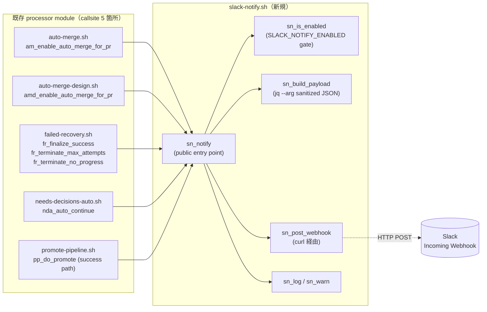

# Design Document

## Overview

**Purpose**: 自動 merge / failed-recovery 終端 / needs-decisions 自動続行 / promote 完了といった
**人間が能動的に把握すべき重要イベント**を、Slack Incoming Webhook 経由で push 通知する補助的な
観測チャネルを追加する（D-18・低優先）。通常運用は引き続き `run-summary` + watcher ログで完結し、
本機能は「Slack を見ていれば異常終端・自動マージ完了に気付ける」程度の補助的可視化を担う。

**Users**: idd-claude を運用する個人 / 小チームのメンテナが、cron で常時 watcher を回しつつ
GitHub UI を常時監視できない環境で、Slack を介して watcher の重要イベントを能動的に検知する。

**Impact**: 既存 watcher の cron tick 挙動・gh / git API 呼び出し・ラベル遷移・ログ出力・exit code
は **本機能の env opt-in (`SLACK_NOTIFY_ENABLED=true`) を明示しない限り完全に不変**。opt-in 時のみ
5 callsite から `sn_notify` 経由で 1 通の HTTP POST を発行する。新規外部 CLI 依存は **`curl` のみ**
（GitHub Actions / Linux / macOS のいずれにも標準搭載）。通知失敗はパイプライン本体に伝播せず
警告ログのみを残す（fail-open）。

### Goals

- 5 callsite（auto-merge enable 成功 / auto-merge-design enable 成功 / failed-recovery 終端 3 種 /
  needs-decisions auto-continue 成功 / promote 成功）から「event 種別 + repo + Issue/PR 番号 +
  URL + 結果ステータス」を含む payload を Slack に push する
- `SLACK_NOTIFY_ENABLED=false` / 未設定時は本機能導入前と完全に同一の watcher 挙動を保つ
- webhook URL は env からのみ取得し、コードベース・ログ・payload・テストフィクスチャに実値を残さない
- 通知失敗は警告ログ 1 行のみ残し、パイプライン本体・exit code・ラベル遷移を変えない
- 関数 prefix `sn_` で namespace を統一し、新規 module `slack-notify.sh` 1 つにロジックを集約する

### Non-Goals

- 双方向 Slack 操作（承認ボタン / Slack コマンド経由の Issue 操作）— Out of Scope（requirements.md）
- Slack 以外の通知先（Discord / Teams / メール / PagerDuty 等）— Out of Scope
- routine な段階遷移通知（Triage / PM / Architect / Developer / Reviewer 等）— Out of Scope
- 通知の rate limit / throttling / batching — Out of Scope（同一 tick 内のイベント単位で 1 通発行）
- 通知文面のテンプレートカスタマイズ / i18n — Out of Scope（payload 形式は固定）
- 通知失敗時の自動再試行 / 履歴永続化 / 過去イベントの retrofit — Out of Scope

## Architecture

### Existing Architecture Analysis

- **既存の processor module 群**（`local-watcher/bin/modules/`）は `<prefix>_<verb>` の関数命名と
  `*_ENABLED` env 厳密一致 opt-in、二重 opt-in（`FULL_AUTO_ENABLED` AND 個別 gate）の pattern を
  踏襲している。新 module は本 pattern に従う（CLAUDE.md「機能追加ガイドライン」§1, §2, §3）
- **通知元候補のイベント発火点はいずれも module の特定関数内に局所化済み**:
  - `auto-merge.sh:am_enable_auto_merge_for_pr` (rc=0 成功時)
  - `auto-merge-design.sh:amd_enable_auto_merge_for_pr` (rc=0 成功時)
  - `failed-recovery.sh:fr_finalize_success` / `fr_terminate_max_attempts` / `fr_terminate_no_progress`
  - `needs-decisions-auto.sh:nda_auto_continue` (rc=0 成功時)
  - `promote-pipeline.sh:pp_do_promote` (`promote-success` ログ直後)
- **`run-summary.sh` は構造化 1 行ログを既存ログに追記する独立観測チャネル**。本機能は run-summary を
  変更せず、独立した emitter チャネルとして追加する（NFR 1.3）
- **`install.sh` は `local-watcher/bin/modules/` 配下の `*.sh` を glob で配布**するため、新 module を
  追加するだけで配布が成立（`copy_glob_to_homebin` ロジック）。install.sh の改修は不要
- `repo-template/` 配下に `local-watcher/` は **存在しない**。watcher 本体・modules は ローカル install
  のみで配布され、consumer repo にコピーされない（NFR 1.2 / Req 6.4 は agents / rules / workflows /
  labels のみが byte 一致対象）

### Architecture Pattern & Boundary Map



**Architecture Integration**:
- 採用パターン: 既存 module 群と同じ「**関数 prefix namespace + 二段 opt-in gate + fail-open emitter**」
- ドメイン境界: callsite 側は「通知を依頼するだけ」（`sn_notify` 呼び出し）。payload 構築・HTTP POST・
  ログ・失敗ハンドリングはすべて `slack-notify.sh` 内に閉じる
- 既存パターンの維持: `am_log` / `fr_log` 等と同形式の 3 段 prefix ロガー (`sn_log` / `sn_warn`)、
  `*_is_enabled` 純粋関数による gate 評価、jq `--arg` による未信頼入力 sanitize（CLAUDE.md §5）
- 新規コンポーネントの根拠: 5 callsite が異なる module に分散しているため、共通 emitter を 1 module に
  集約しないと payload 整形・gate 評価・curl 呼び出しが各 module に重複する。新 module 1 つ + 既存 5
  module への 1 行 hook 追加が最小変更（Req 6.1）

### Technology Stack

| Layer | Choice / Version | Role in Feature | Notes |
|-------|------------------|-----------------|-------|
| Frontend / CLI | — | — | watcher は CLI のみ。本機能に UI 層なし |
| Backend / Services | bash 4+ | sn_notify emitter、5 callsite 統合 | 既存 watcher と同じランタイム |
| Data / Storage | env var (`SLACK_WEBHOOK_URL`) | webhook URL の secret 保持 | コミットしない（NFR 3.1） |
| Messaging / Events | Slack Incoming Webhook (HTTP POST application/json) | 1 イベント = 1 POST | 公式仕様 <https://api.slack.com/messaging/webhooks> |
| Infrastructure / Runtime | `curl` (existing) / `jq` (existing) | payload 構築 + HTTP POST | NFR 2.3 で新規 CLI 依存禁止 |

## File Structure Plan

### Directory Structure

```
local-watcher/
├── bin/
│   ├── issue-watcher.sh           # 本体: Config ブロックに SLACK_* env を追加（既存挙動不変）
│   └── modules/
│       ├── slack-notify.sh        # 【新規】sn_* 関数群（emitter / gate / payload / curl）
│       ├── auto-merge.sh          # 1 行 hook 追加（am_enable_auto_merge_for_pr 成功直後）
│       ├── auto-merge-design.sh   # 1 行 hook 追加（amd_enable_auto_merge_for_pr 成功直後）
│       ├── failed-recovery.sh     # 3 callsite に hook 追加（success / max-attempts / no-progress）
│       ├── needs-decisions-auto.sh # 1 行 hook 追加（nda_auto_continue 成功直後）
│       └── promote-pipeline.sh    # 1 行 hook 追加（pp_do_promote 成功 path）
└── test/
    ├── sn_is_enabled_test.sh      # 【新規】gate 正規化テスト（NFR 4.3）
    ├── sn_build_payload_test.sh   # 【新規】payload 整形 + secret 検出テスト（NFR 4.2 / 4.4）
    └── sn_notify_test.sh          # 【新規】curl stub による POST 呼び出し / fail-open テスト（NFR 4.2 / 4.4）

repo-template/
└── (本機能は触らない)             # watcher / modules は repo-template に配布されない（NFR 1.2 / Req 6.4）

install.sh                         # 改修不要（既存 copy_glob_to_homebin が新 module を自動配布）
README.md                          # オプション機能一覧表に SLACK_NOTIFY_ENABLED 行を追加（Req 6.2）
```

### Modified Files

- `local-watcher/bin/issue-watcher.sh` — Config ブロックに以下 2 行追加（既存 env と同形式）:
  ```bash
  SLACK_NOTIFY_ENABLED="${SLACK_NOTIFY_ENABLED:-false}"
  SLACK_WEBHOOK_URL="${SLACK_WEBHOOK_URL:-}"
  SLACK_NOTIFY_TIMEOUT="${SLACK_NOTIFY_TIMEOUT:-5}"  # 秒、有限値（Req 4.5 / NFR 2.2）
  ```
  `REQUIRED_MODULES` 配列に `slack-notify.sh` を追加。cycle startup ログに `slack-notify=<on|off>`
  解決値を追加（既存 `auto-merge=` / `full-auto=` と同列）
- `local-watcher/bin/modules/auto-merge.sh` — `am_enable_auto_merge_for_pr` の rc=0 path 末尾に
  `sn_notify auto-merge "$pr_number" "$pr_url" success "$head_ref" || true` を 1 行追加
- `local-watcher/bin/modules/auto-merge-design.sh` — 同上を `amd_*` 関数の rc=0 path に追加
- `local-watcher/bin/modules/failed-recovery.sh` — 3 関数の各 path で対応する result status
  （`recovered` / `max-attempts` / `no-progress`）で `sn_notify failed-recovery ...` を呼ぶ
- `local-watcher/bin/modules/needs-decisions-auto.sh` — `nda_auto_continue` の `return 0` 直前
- `local-watcher/bin/modules/promote-pipeline.sh` — `pp_do_promote` のサブシェル外 `rc=0` 分岐
- `README.md` — `### opt-in（既定 OFF、明示的に有効化が必要）` 表に Slack Notify 行を追加（Req 6.2）

## Requirements Traceability

| Requirement | Summary | Components | Interfaces | Flows |
|-------------|---------|------------|------------|-------|
| 1.1 | `SLACK_NOTIFY_ENABLED=false` の Config 既定 | issue-watcher.sh Config | env default | gate evaluation |
| 1.2 | `=true` 厳密一致で emitter 起動可能化 | sn_is_enabled | pure function | gate path |
| 1.3 | typo / 大小文字 / 空 / 不正値は OFF 正規化 | sn_is_enabled | pure function | gate path (case 文) |
| 1.4 | URL 未設定なら no-op + 1 行 WARN 例外 | sn_notify | preflight check | sn_notify entry |
| 1.5 | gate OFF 時の cron tick 完全互換 | sn_notify (early return) | pure function | gate path |
| 1.6 | 既存 env / label / exit code 不変 | issue-watcher.sh Config | additive only | （新 env 追加のみ） |
| 2.1 | auto-merge enable 成功で 1 通発行 | auto-merge.sh hook | callsite integration | flow A |
| 2.2 | failed-recovery 終端 3 種で 1 通発行 | failed-recovery.sh hook | callsite integration | flow C |
| 2.3 | needs-decisions auto-continue で 1 通発行 | needs-decisions-auto.sh hook | callsite integration | flow D |
| 2.4 | promote 完了で 1 通発行 | promote-pipeline.sh hook | callsite integration | flow E |
| 2.5 | routine 段階遷移では発火しない | 5 callsite 限定 | hook 位置の限定 | （追加 callsite なし） |
| 2.6 | 同一 tick 内複数発火は各 1 通 | sn_notify (stateless) | no dedup | （冪等化責務外） |
| 3.1 | payload に event 種別 | sn_build_payload | JSON schema | payload assembly |
| 3.2 | payload に repo 識別子 | sn_build_payload | `$REPO` 経由 | payload assembly |
| 3.3 | payload に Issue/PR 番号 | sn_build_payload | 引数経由 | payload assembly |
| 3.4 | payload に GitHub URL | sn_build_payload | 引数経由 | payload assembly |
| 3.5 | 終端遷移には result status | sn_build_payload | result 引数 | payload assembly |
| 3.6 | payload に secrets を含めない | sn_build_payload | `--arg` + secret scrub | payload assembly |
| 4.1 | HTTP 4xx/5xx で fail-open + WARN | sn_post_webhook | rc 判定 | post-error path |
| 4.2 | network 障害で fail-open + WARN | sn_post_webhook | curl exit code | post-error path |
| 4.3 | payload 整形失敗で fail-open + WARN | sn_build_payload / sn_notify | jq rc 判定 | build-error path |
| 4.4 | 通知可否を理由に exit / label を変えない | sn_notify (常に rc=0) | contract | flow A〜E |
| 4.5 | HTTP POST に有限タイムアウト | sn_post_webhook | `curl --max-time` | post path |
| 5.1 | 成功時 1 行構造化ログ | sn_log | structured 1-liner | post-success |
| 5.2 | gate OFF 時は追加ログなし | sn_notify (early return) | silent | gate path |
| 5.3 | URL 未設定時 1 行 WARN | sn_notify (preflight) | sn_warn | preflight path |
| 5.4 | 失敗時 1 行 WARN | sn_post_webhook | sn_warn | post-error path |
| 5.5 | URL 全体をログに含めない | sn_log / sn_warn | URL マスキング | log emission |
| 6.1 | 変更範囲を local-watcher に限定 | File Structure Plan | scope | （上記 Modified Files に閉じる） |
| 6.2 | README 同一 PR 更新 | README.md オプション機能一覧 | docs | flow F |
| 6.3 | URL 実値を任意成果物に含めない | sn_module 全般 | secret hygiene | （NFR 3.1） |
| 6.4 | byte 一致対象成果物はドリフトさせない | （触らないことの確認） | non-touch | flow F |
| NFR 1.1 | gate OFF で副作用 byte 一致 | sn_notify early return | pure no-op | gate path |
| NFR 1.2 | 既存 env / label / cron 文字列不変 | additive only | contract | （追加のみ） |
| NFR 1.3 | run-summary 形式不変 | （run-summary.sh は touch しない） | non-touch | flow F |
| NFR 2.1 | gate OFF で payload 構築・curl ゼロ | sn_notify early return | branch order | gate path |
| NFR 2.2 | 有限 timeout で打ち切り | SLACK_NOTIFY_TIMEOUT env | `curl --max-time` | post path |
| NFR 2.3 | 新規 CLI 依存追加なし | curl / jq 既存 | dependency | （前提検証） |
| NFR 3.1 | URL は env のみ取得 | env 経由のみ | secret hygiene | flow A〜E |
| NFR 3.2 | 未信頼入力を安全展開 | sn_build_payload | `jq --arg`、curl `--`、ID 検証 | payload assembly |
| NFR 3.3 | secret 候補値を payload に含めない | sn_build_payload | 本文の生 echo 禁止 | payload assembly |
| NFR 3.4 | 失敗 WARN に URL 全体を含めない | sn_warn | URL マスキング | log emission |
| NFR 4.1 | shellcheck / bash -n クリーン | コード品質 | static analysis | flow F |
| NFR 4.2 | 近接テスト 4 種カバー | local-watcher/test/sn_*_test.sh | test fixtures | flow F |
| NFR 4.3 | env 正規化テスト | sn_is_enabled_test.sh | fixture | flow F |
| NFR 4.4 | curl stub による外部依存ゼロ | sn_notify_test.sh | stub harness | flow F |
| NFR 5.1 | 構造化ログ 1 行で grep 抽出可能 | sn_log | structured key=value | post-success |

## Components and Interfaces

### slack-notify module（新規 / `local-watcher/bin/modules/slack-notify.sh`）

#### Component: sn_log / sn_warn / sn_error（logger）

| Field | Detail |
|-------|--------|
| Intent | 既存 `am_log` / `fr_log` 等と同形式の 3 段 prefix ロガー |
| Requirements | 5.1, 5.5 / NFR 3.4 |

**Responsibilities & Constraints**
- 出力形式: `[YYYY-MM-DD HH:MM:SS] [$REPO] slack-notify: <message>`（`sn_warn` / `sn_error` は WARN: / ERROR: を挿入し `>&2` に出力）
- webhook URL 全体は引数として渡されない / 渡されても出力しない（呼出側で URL は **ホスト部のみ**
  または **マスキング済み prefix** で渡す）
- 副作用: stdout / stderr への 1 行出力のみ

**Dependencies**
- Inbound: sn_notify / sn_post_webhook / sn_build_payload — 観測ログ出力 (Critical)
- Outbound: — （標準出力のみ）
- External: `date` (existing CLI)

**Contracts**: Service [x] / API [ ] / Event [ ] / Batch [ ] / State [ ]

##### Service Interface

```bash
sn_log()   { echo "[$(date '+%F %T')] [$REPO] slack-notify: $*"; }
sn_warn()  { echo "[$(date '+%F %T')] [$REPO] slack-notify: WARN: $*" >&2; }
sn_error() { echo "[$(date '+%F %T')] [$REPO] slack-notify: ERROR: $*" >&2; }
```
- Preconditions: `$REPO` が定義済み（本体 Config ブロックで初期化済み）
- Postconditions: 1 行出力 / 戻り値常に 0
- Invariants: webhook URL 全体を含まない

---

#### Component: sn_is_enabled（純粋関数 / gate）

| Field | Detail |
|-------|--------|
| Intent | `SLACK_NOTIFY_ENABLED` の opt-in gate を厳密一致で判定 |
| Requirements | 1.1, 1.2, 1.3, 1.5 / NFR 1.1, 2.1 |

**Responsibilities & Constraints**
- `=true` の **lowercase 厳密一致**のみ rc=0、それ以外（未設定 / 空 / `True` / `TRUE` / `1` / `on` /
  `yes` / typo / 前後空白）はすべて rc=1（安全側）
- 副作用なし（純粋関数）
- 既存 `fr_is_enabled` / `am_resolve_gate_enabled` と同じ正規化規約

**Dependencies**
- Inbound: sn_notify — 早期 gate (Critical)
- Outbound: — （pure function）
- External: — （bash builtin のみ）

**Contracts**: Service [x] / API [ ] / Event [ ] / Batch [ ] / State [ ]

##### Service Interface

```bash
# Returns:
#   0 = SLACK_NOTIFY_ENABLED が "true" の厳密一致
#   1 = それ以外（OFF として扱う）
sn_is_enabled() {
  [ "${SLACK_NOTIFY_ENABLED:-false}" = "true" ] || return 1
  return 0
}
```
- Preconditions: なし（env 未設定でも `:-false` で fallback）
- Postconditions: rc 0/1 / 副作用ゼロ
- Invariants: 不正値は必ず OFF 側へ畳む

---

#### Component: sn_build_payload（payload 構築）

| Field | Detail |
|-------|--------|
| Intent | event_type / repo / number / url / result から JSON payload を構築（jq `--arg` で sanitize） |
| Requirements | 3.1〜3.6 / NFR 3.2, 3.3 |

**Responsibilities & Constraints**
- payload の生成は **必ず `jq --arg` 経由**で行う（CLAUDE.md §5 / NFR 3.2）。フィルタ文字列に未信頼値を
  inline 展開しない
- secret 候補値の検出: 引数として渡された result_detail / extra_context は **以下のパターンを含む場合**
  Slack 通知から **置換または truncate** する（NFR 3.3）:
  - GitHub token prefix: `ghp_` / `gho_` / `ghu_` / `ghs_` / `ghr_` 始まり 36 文字以上
  - 一般 API key 候補: 32 桁以上の連続英数字（best-effort、過剰検出は許容）
  - webhook URL 自体: `hooks.slack.com/services/` を含む文字列
  検出時は当該箇所を `[REDACTED]` に置換する
- payload schema は固定（後述 Data Models 節）
- jq 実行失敗時は rc=1 を返し、呼出側は sn_warn + fail-open（Req 4.3）

**Dependencies**
- Inbound: sn_notify — 構築依頼 (Critical)
- Outbound: sn_warn — 整形失敗時 (Important)
- External: `jq` (existing CLI)

**Contracts**: Service [x] / API [ ] / Event [ ] / Batch [ ] / State [ ]

##### Service Interface

```bash
# Args:
#   $1 event_type    : "auto-merge" | "auto-merge-design" | "failed-recovery" |
#                      "needs-decisions-auto-continue" | "promote"
#   $2 number        : Issue / PR 番号（数値検証済の前提だが本関数でも ^[0-9]+$ を再検証）
#   $3 url           : GitHub URL（呼出側で `https://github.com/...` を組み立て済）
#   $4 result        : "success" | "recovered" | "max-attempts" | "no-progress" |
#                      "auto-continued" | "promote-success"
#   $5 detail        : 任意の追加文脈（head_ref / branch 等。secret scrub 対象）
# Stdout: JSON 1 行 / Returns: 0 = success, 1 = jq 失敗
sn_build_payload() {
  # event_type の enum 検証 → secret scrub → jq --arg で sanitize JSON 構築
  ...
}
```
- Preconditions: `$REPO` が定義済み
- Postconditions: stdout に well-formed JSON 1 行を出力（rc=0 時のみ）
- Invariants: 出力に secret prefix / webhook URL を含まない

---

#### Component: sn_post_webhook（HTTP POST）

| Field | Detail |
|-------|--------|
| Intent | `curl` 経由で Slack Incoming Webhook に payload を POST し、有限 timeout で打ち切る |
| Requirements | 4.1, 4.2, 4.5 / NFR 2.2, 3.4 |

**Responsibilities & Constraints**
- `curl -X POST -H 'Content-Type: application/json' --max-time $SLACK_NOTIFY_TIMEOUT --silent --show-error -d @<(echo "$payload") -- "$SLACK_WEBHOOK_URL"` 相当の呼び出し
  （webhook URL は **`--` 後の最後の引数として渡す**。`-` 始まりの URL 偽装は env 由来のため通常想定しない
  が、defense-in-depth として `--` を付ける / CLAUDE.md §5）
- payload はファイル経由ではなく **stdin / `-d @-` で渡す**（コマンドライン引数化を避けて process listing
  から payload を見えなくする / NFR 3.3 副次効果）
- 戻り値の解釈:
  - curl exit code 0 + HTTP 2xx → rc=0
  - curl exit code 0 + HTTP 4xx/5xx → rc=1（Req 4.1）
  - curl exit code 非 0（タイムアウト / 接続失敗）→ rc=2（Req 4.2 / 4.5）
- HTTP status / curl exit code はログに残すが URL は **ホスト部のみ**を含める（Req 5.5 / NFR 3.4）
- timeout 既定値: `SLACK_NOTIFY_TIMEOUT=5` 秒（要件 4.5 / NFR 2.2 の「有限値」「主処理を遅延させない」
  根拠: Slack 公式の rate limit は 1 通/秒程度で平均応答時間 < 1 秒。5 秒は cron tick 全体時間に対して
  顕著な遅延にならず、かつ一時的なネットワーク揺らぎを吸収する妥当な値。env で override 可能）

**Dependencies**
- Inbound: sn_notify — POST 依頼 (Critical)
- Outbound: sn_warn — 失敗時 (Important)
- External: `curl` (existing CLI / NFR 2.3)、Slack Incoming Webhook (external service)

**Contracts**: Service [x] / API [ ] / Event [x] / Batch [ ] / State [ ]

##### Service Interface

```bash
# Args:
#   $1 payload : JSON 1 行（sn_build_payload の出力）
# Returns:
#   0 = HTTP 2xx
#   1 = HTTP 4xx/5xx
#   2 = curl 非ゼロ exit（タイムアウト / 接続失敗）
sn_post_webhook() { ... }
```

##### API Contract（Slack Incoming Webhook）

| Method | Endpoint | Request | Response | Errors |
|--------|----------|---------|----------|--------|
| POST | `$SLACK_WEBHOOK_URL` | application/json (payload) | 200 OK + body `ok` | 400 invalid_payload / 403 action_prohibited / 404 channel_not_found / 410 channel_is_archived / 500 rollup_error。詳細: <https://api.slack.com/messaging/webhooks#handling_errors> |

---

#### Component: sn_notify（public entry point）

| Field | Detail |
|-------|--------|
| Intent | callsite 側が呼ぶ唯一の入口。gate 評価 → preflight → payload 構築 → POST → ログを一括 |
| Requirements | 1.4, 2.1〜2.6, 4.4 / NFR 1.1 |

**Responsibilities & Constraints**
- 戻り値は **常に rc=0**（fail-open / Req 4.4）。呼出側は戻り値を見ない（`|| true` も併用）
- 評価順序:
  1. `sn_is_enabled` rc=1 → 即 return 0（silent / Req 1.5 / 5.2 / NFR 2.1）
  2. `SLACK_WEBHOOK_URL` 未設定 / 空 → sn_warn 1 行 + return 0（Req 1.4 / 5.3）
  3. number / event_type の引数検証（^[0-9]+$、enum 一致）に失敗 → sn_warn + return 0（NFR 3.2）
  4. `sn_build_payload` 呼び出し（rc=1 → sn_warn + return 0 / Req 4.3）
  5. `sn_post_webhook` 呼び出し（rc=1 → sn_warn (status) / rc=2 → sn_warn (network) / Req 4.1 / 4.2 / 5.4）
  6. 成功時 sn_log で構造化 1 行（Req 5.1 / NFR 5.1）

**Dependencies**
- Inbound: 5 callsite module
- Outbound: sn_is_enabled / sn_build_payload / sn_post_webhook / sn_log / sn_warn
- External: — （上記モジュール経由）

**Contracts**: Service [x] / API [ ] / Event [x] / Batch [ ] / State [ ]

##### Service Interface

```bash
# Args:
#   $1 event_type : enum（前述 sn_build_payload と同じ 5 値）
#   $2 number     : Issue / PR 番号
#   $3 url        : GitHub URL
#   $4 result     : enum（前述 sn_build_payload と同じ 6 値）
#   $5 detail     : 任意（head_ref / branch / signature の先頭等）
# Returns: 常に 0
sn_notify() { ... }
```
- Preconditions: `$REPO` が定義済み
- Postconditions: 副作用は「sn_log / sn_warn 1 行」+「curl 1 回（成功時）」のみ
- Invariants: gate OFF / URL 未設定時に外部 HTTP 呼び出しが発生しない（NFR 2.1）

### Callsite Integration（既存 module への hook 追加）

#### auto-merge.sh / auto-merge-design.sh

`am_enable_auto_merge_for_pr` / `amd_enable_auto_merge_for_pr` の rc=0 path（既存 `am_log` 成功行の直後）に
1 行追加:

```bash
sn_notify auto-merge "$pr_number" "$pr_url" success "head=$head_ref sha=$head_sha" || true
```

- `auto-merge-design.sh` 側は event_type を `auto-merge-design` に切替
- Req 2.1 の解釈: **「auto-merge enable 成功時点」を merge 完了通知のトリガーとする**（Open Questions
  項目で後述）

#### failed-recovery.sh

3 callsite それぞれの最終遷移確定後（既存 `fr_log` / `rs_set_result` の直後）:

```bash
# fr_finalize_success 内（return "$rc" の直前）
sn_notify failed-recovery "$number" "https://github.com/$REPO/${kind}s/$number" recovered "kind=$kind attempts=$total_attempts" || true

# fr_terminate_max_attempts 内（return 0 の直前）
sn_notify failed-recovery "$number" "https://github.com/$REPO/${kind}s/$number" max-attempts "kind=$kind attempts=$total_attempts max=$FAILED_RECOVERY_MAX_ATTEMPTS" || true

# fr_terminate_no_progress 内（return 0 の直前）
sn_notify failed-recovery "$number" "https://github.com/$REPO/${kind}s/$number" no-progress "kind=$kind attempts=$total_attempts" || true
```

- Req 2.2 の「終端遷移」範囲は **success / max-attempts / no-progress の 3 種全て**（Open Question 解消）
- signature 値は payload に含めない（NFR 3.3 / 監査ログ側 fr_log では先頭 8 桁を残す既存規約を維持）

#### needs-decisions-auto.sh

`nda_auto_continue` の `return 0` 直前（既存 `nda_log "action=auto-continue"` の直後）:

```bash
sn_notify needs-decisions-auto-continue "$NUMBER" "https://github.com/$REPO/issues/$NUMBER" auto-continued "mode=$mode classification=$classification" || true
```

- Req 2.3: `safe` 分類のみが auto-continue 経路を通る既存設計を維持。`human-only` 分類で halt した
  ケースには通知を発火しない（routine な段階遷移ではないが、本機能のスコープ外 / Out of Scope）

#### promote-pipeline.sh

`pp_do_promote` の親シェル側 rc=0 分岐（既存 `PP_PROMOTE_SUCCESS_COUNT` インクリメント直後）:

```bash
sn_notify promote "0" "https://github.com/$REPO" promote-success "base=$BASE_BRANCH target=$PROMOTION_TARGET_BRANCH candidates=${#PROMOTE_CANDIDATES[@]}" || true
```

- promote イベントは「Issue 単体ではなく branch promotion」のため number=0 を sentinel として使う
  （payload 上は `"number": 0` / Slack 表示時は number を suppress する設計）
- promote 失敗は本機能のスコープ外（既存 `pp_notify_promote_failure` の Issue コメント経路に任せる
  / Open Question 解消: 「promote 完了」のみを通知対象とする）

## Data Models

### Domain Model

本機能はステートレス（state ファイルなし）。通知単位は「1 イベント発火 = 1 HTTP POST」。
冪等化は責務外（Req 2.6）。

### Slack Payload Schema（固定 JSON）

```json
{
  "text": "[idd-claude] <event_type> on <repo> #<number>: <result>",
  "blocks": [
    {
      "type": "section",
      "text": {
        "type": "mrkdwn",
        "text": "*[idd-claude]* `<event_type>` on `<repo>`\n• Issue/PR: <<url>|#<number>>\n• Result: `<result>`\n• Detail: `<detail (secret-scrubbed)>`"
      }
    }
  ]
}
```

- 採用形式: Slack Block Kit `section` 1 ブロック + フォールバック用 `text` フィールド
  （Open Question 解消: Block Kit を採用。`text` フィールド単独は通知本文として貧弱、attachments は
  legacy 推奨非推奨のため。<https://api.slack.com/messaging/composing/layouts>）
- payload は 1 行 JSON（改行なし）として curl に渡す
- `<detail>` は secret scrub 後の値（前述 sn_build_payload § 参照）

### Event Type Enum

| Event Type | Trigger Callsite | Default Result |
|-----------|------------------|----------------|
| `auto-merge` | am_enable_auto_merge_for_pr rc=0 | `success` |
| `auto-merge-design` | amd_enable_auto_merge_for_pr rc=0 | `success` |
| `failed-recovery` | fr_finalize_success / fr_terminate_max_attempts / fr_terminate_no_progress | `recovered` / `max-attempts` / `no-progress` |
| `needs-decisions-auto-continue` | nda_auto_continue rc=0 | `auto-continued` |
| `promote` | pp_do_promote success path | `promote-success` |

### Structured Log Fields（sn_log 成功時）

```
[YYYY-MM-DD HH:MM:SS] [$REPO] slack-notify: event=<event_type> number=<n> result=<r> http_status=<200|...> host=hooks.slack.com
```

- `host=` は webhook URL のホスト部のみ（URL 全体は出さない / Req 5.5 / NFR 3.4）
- WARN ログは `WARN:` prefix + reason（`reason=url-unset` / `reason=http-4xx status=400` /
  `reason=transport-error curl_exit=28` / `reason=payload-build-failed`）

## Error Handling

### Error Strategy

すべての異常系は **fail-open**（パイプライン本体への伝播ゼロ）+ **WARN 1 行ログ**で処理する。
通知失敗を理由に既存 processor の exit code / ラベル遷移 / gh API 呼び出しを変えない（Req 4.4）。

### Error Categories and Responses

- **User / Operator Errors (gate / config)**:
  - `SLACK_NOTIFY_ENABLED=true` だが `SLACK_WEBHOOK_URL` 未設定 → WARN 1 行（`reason=url-unset`） +
    no-op。運用者が typo に気付ける（Req 5.3）
  - `SLACK_NOTIFY_TIMEOUT` が非数値 / 負数 → 既定 5 秒に正規化 + WARN 1 行
- **System Errors (HTTP / Network)**:
  - HTTP 4xx → WARN 1 行（`reason=http-4xx status=<code>`）。webhook URL 失効 / payload invalid
    の運用者通知を兼ねる（Req 4.1 / 5.4）
  - HTTP 5xx → WARN 1 行（`reason=http-5xx status=<code>`）。Slack 側障害（Req 4.1 / 5.4）
  - curl 非ゼロ exit（タイムアウト / DNS 失敗 / 接続拒否）→ WARN 1 行
    （`reason=transport-error curl_exit=<code>`）（Req 4.2 / 5.4）
- **Internal Errors**:
  - sn_build_payload の jq 失敗 → WARN 1 行（`reason=payload-build-failed`）+ no-op（Req 4.3）
  - 引数検証失敗（number 非数値 / event_type enum 外）→ WARN 1 行（`reason=invalid-args`）+ no-op
    （NFR 3.2 / fail-safe）

## Testing Strategy

- **Unit Tests**:
  - `sn_is_enabled_test.sh`: env 正規化（未設定 / 空 / `true` / `True` / `TRUE` / `1` / `on` / `false`
    / typo / 前後空白）で **rc=0 は `true` 厳密一致のみ**を検証（NFR 4.3）
  - `sn_build_payload_test.sh`: payload JSON の well-formed 性 (`jq -e .`)、必須フィールド
    （event_type / repo / number / url / result）の存在、secret 候補値（`ghp_xxx` /
    `hooks.slack.com/services/T00/B00/secret`）が `[REDACTED]` に置換されること
  - `sn_notify_test.sh` (gate / URL unset 分岐): `SLACK_NOTIFY_ENABLED=false` で curl stub が
    1 度も呼ばれない / `=true` + URL 未設定で WARN 1 行 + curl stub 不呼出を検証（NFR 4.2 / 4.4）
- **Integration Tests**:
  - `sn_notify_test.sh` (success path): curl stub が HTTP 200 を返したとき sn_log 成功行が出る
  - `sn_notify_test.sh` (fail-open): curl stub が HTTP 500 / 非ゼロ exit を返したとき WARN ログが
    出るが sn_notify 自体は rc=0 を返す（NFR 4.2 / Req 4.4）
  - 5 callsite に対し、既存テストへの追加または新規 hook テスト 1 件で「sn_notify が呼ばれること」
    を curl stub 経由で観測（Req 2.1〜2.4）
- **E2E Tests**:
  - 本機能の E2E は **手動スモークテスト**で代替（NFR 4.4 で外部依存ゼロのテストのみ要求）:
    1. `SLACK_NOTIFY_ENABLED=true SLACK_WEBHOOK_URL=<test-channel> ~/bin/issue-watcher.sh` を
       failed-recovery 終端を含む状況で実行し、Slack 受信側で 1 通受信を確認
- **Performance Tests**: 該当なし（HTTP POST 1 通 / イベント。NFR 2.2 で有限 timeout 保証）

## Security Considerations

- **Webhook URL の取り扱い**（NFR 3.1 / Req 6.3）:
  - env からのみ取得。コード・README・log・コメント・テストフィクスチャに実値を含めない
  - ログには URL のホスト部（`hooks.slack.com`）のみを残し、path 部分（secret token）は出さない
  - テストでは `SLACK_WEBHOOK_URL=https://hooks.slack.com/services/TEST/TEST/TEST` のような明らかな
    placeholder のみを使う
- **未信頼入力の安全展開**（NFR 3.2 / CLAUDE.md §5）:
  - 全 payload は `jq --arg` 経由（フィルタ文字列に未信頼値を inline 展開しない）
  - curl 引数は `--` でオプション解釈を打ち切る（URL が `-` 始まりの場合の defense-in-depth）
  - 数値 ID は `^[0-9]+$` で使用直前に検証
- **secret scrub**（NFR 3.3）:
  - payload 構築前に `ghp_` / `gho_` / `ghu_` / `ghs_` / `ghr_` 始まり 36 文字以上、
    `hooks.slack.com/services/`、32 桁以上連続英数字を `[REDACTED]` に置換
  - Issue 本文全体を生で payload に貼らない（detail 引数は callsite 側で head_ref / attempts 等の
    短い既知メタデータに限定）
- **プロンプトインジェクション境界**: 本機能は `claude` CLI を呼ばない。Slack payload は人間が読むだけ
  であり、Slack 経由で watcher へコマンド注入される経路はない（双方向 Slack 操作は Out of Scope）

## Risks

| Risk | Likelihood | Impact | Mitigation |
|------|-----------|--------|-----------|
| Slack 側 rate limit（高頻度 cron + 大量 PR 並列で 1 秒/通超過）| 低 | 通知 drop（パイプラインは影響なし） | fail-open で本体継続。将来 batching が必要なら別 Issue で対応（Out of Scope） |
| webhook URL の誤った値（typo / 旧 URL 残置）| 中 | 通知 drop + WARN 蓄積 | 5.3 で WARN ログを残し運用者が grep で気付ける |
| jq / curl の挙動差（GNU vs BSD / macOS）| 低 | payload 整形失敗 / timeout 動作差 | 既存 watcher と同じ前提（既存ツール限定 / NFR 2.3） |
| 通知失敗連鎖（Slack 側障害で全 cron tick が WARN 大量）| 中 | ログノイズ増 | 既存 WARN ログ運用と同じ。将来 backoff / suppression が必要なら別 Issue |
| event 増加要望（routine 段階遷移も通知したい）| 中 | スコープ拡大 | requirements で Out of Scope 明示済。将来追加時に payload の event_type enum を拡張 |
| 後方互換性違反（既存 env / label / cron に副作用）| 低 | 既存 consumer 動作不能 | gate OFF で副作用ゼロ（NFR 1.1）+ tests で検証 |

## Open Questions（設計で確定したもの / 未確定のもの）

requirements.md の Open Questions のうち、本 design で **確定したもの**と **継続検討としたもの**を
区別して列挙する。

### 設計で確定（Architect 判断）

1. **Slack payload 形式**: Block Kit `section` 1 ブロック + `text` フォールバックフィールドを採用
   （Data Models § 参照）。Attachments は legacy 非推奨、`text` 単独は通知本文として貧弱なため
2. **HTTP POST timeout 具体値**: 既定 5 秒（`SLACK_NOTIFY_TIMEOUT` で env override 可能）。Slack 公式の
   平均応答時間は < 1 秒で、5 秒は cron tick 全体時間に対し顕著な遅延にならない（Req 4.5 / NFR 2.2）
3. **failed-recovery 終端範囲**: 「最終遷移」は **success / max-attempts / no-progress の 3 種全て**
   （`fr_finalize_success` / `fr_terminate_max_attempts` / `fr_terminate_no_progress` の 3 callsite）
4. **auto-merge 通知トリガー**: **「`am_enable_auto_merge_for_pr` rc=0 成功時点」を通知トリガーとする**
   （= GitHub の auto-merge state machine に enable 指示が受理された瞬間）。実 merge 完了の polling は
   採用しない（watcher 自体が polling せず enable のみという既存設計 #352 と整合）。Slack 通知文面上は
   `result=success` で「auto-merge enabled」相当の意味を明示する
5. **secret 検出パターン**: GitHub token prefix（`ghp_` / `gho_` / `ghu_` / `ghs_` / `ghr_` + 36 文字
   以上） + Slack webhook prefix（`hooks.slack.com/services/`） + 32 桁以上連続英数字を best-effort で
   検出し `[REDACTED]` 置換。Issue 本文全体は payload に含めない設計で副次的に防御
6. **promote 通知範囲**: **promote 完了のみ**（`pp_do_promote` success path）。promote 失敗は既存
   `pp_notify_promote_failure` の Issue コメント経路に任せる
7. **needs-decisions 通知範囲**: **auto-continue 成功時のみ**（`nda_auto_continue` rc=0）。halt
   （human-only 分類）は routine な扱いとし通知しない

### 継続検討（将来の拡張余地）

- **channel route by event type**: 本機能では単一 webhook URL のみ。将来 event 種別ごとに別 channel に
  振り分けたいニーズが出たら、env を `SLACK_WEBHOOK_URL_<EVENT>` で拡張可能（payload に event_type を
  含めることで Slack 側 route も可能）
- **batching / rate limit 対応**: 同一 tick 内で大量発火するケースが観測されたら別 Issue で対応
- **retry-with-backoff**: 現状 fail-open のみ。Slack 側障害で取りこぼしが続く場合は別 Issue

## Supporting References

- Slack Incoming Webhooks 公式: <https://api.slack.com/messaging/webhooks>
- Slack 通知 payload composition: <https://api.slack.com/messaging/composing/layouts>
- 既存 module pattern: `local-watcher/bin/modules/failed-recovery.sh`（fr_is_enabled / fr_log の構造）
- 既存 env 正規化 pattern: README オプション機能一覧（`AUTO_MERGE_ENABLED` 等の `=true` 厳密一致規約）
- 関連 Issue: #352（Auto-Merge）/ #354（Design Auto-Merge）/ #359（Failed Recovery）/
  #362（needs-decisions Auto-Continue）/ #15（Promote Pipeline）
