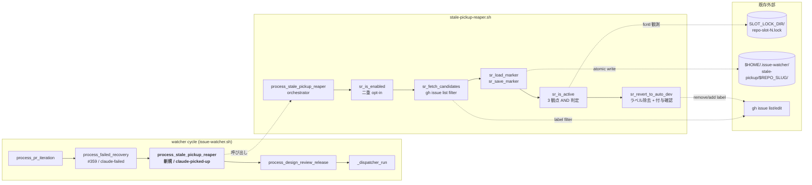

# Design Document

## Overview

**Purpose**: idd-claude watcher セッションがクラッシュ / OOM / マシン再起動などで
異常終了したとき、`claude-picked-up` / `claude-claimed` ラベルが Issue に残り続け、
dispatcher が当該 Issue を「処理中」とみなして候補から永久除外する停止状態を、
自動回復させる Stale Pickup Reaper（以下 SPR）を新規モジュール
`local-watcher/bin/modules/stale-pickup-reaper.sh` として導入する。

**Users**: idd-claude self-hosting 環境および consumer repo の運用者。watcher の cron
サイクルが SPR を呼び出し、運用者は `STALE_PICKUP_REAPER_ENABLED=true` の opt-in 1 つで
本機能を有効化する。

**Impact**: 既存 `failed-recovery.sh`（#359）が `claude-failed` ラベル付き Issue のみを
担う構造の **gap を埋める**。`claude-failed` には到達しない「セッション喪失で
pickup ラベルだけ残った Issue」を SPR が拾い、3 観点アクティブ判定（タイムスタンプ
marker / slot ロック / セッション存在）を **AND** で評価して非アクティブと確定した
ものだけを `auto-dev` 状態へ戻す。誤検出による進行中作業の喪失を構造的に防ぐため、
**判定根拠取得失敗時は「アクティブの可能性あり」へ倒す**保守的 fallback を採る。

### Goals

- `claude-picked-up` / `claude-claimed` 滞留 Issue を opt-in 下で自動復帰させ、
  人間によるラベル手動除去を不要にする
- アクティブセッション判定を 3 観点 AND に限定し、**正当な処理中 Issue を絶対に
  revert しない**（誤検出ゼロを最重要 KPI とする）
- failed-recovery / impl-resume / dispatcher など既存 processor の領分と衝突しない
- `STALE_PICKUP_REAPER_ENABLED=false` / 未設定で本機能導入前と完全に同一の外部挙動
  （Issue / PR / branch / ログへの副作用ゼロ）を保つ

### Non-Goals

- `claude-failed` ラベル付き Issue の復旧（#359 failed-recovery の責務）
- auto-merge 待ち PR の CI 解析（#359 の責務）
- watcher プロセス監視 / 自動再起動 / ヘルスチェック（OS 層の話）
- impl branch の自動削除 / rebase / push（branch は触らず温存し impl-resume に委ねる）
- 通算 attempt budget による終端管理（SPR は冪等な状態復帰のみ担い attempt カウンタを
  持たない）

## Architecture

### Existing Architecture Analysis

watcher 本体 `local-watcher/bin/issue-watcher.sh`（約 11,000 行）は、Config ブロック /
module loader / Phase A〜E processor 群 / Dispatcher のレイヤで構成され、processor は
`local-watcher/bin/modules/<name>.sh` への切り出しが #177 以降の標準パターンになっている
（`failed-recovery.sh` / `auto-merge.sh` 等）。

尊重すべき制約:

- **ラベル契約**: `claude-claimed`（Dispatcher claim 直後）/ `claude-picked-up`
  （Triage 通過後の impl/impl-resume 着手）/ `claude-failed`（escalation 終端）/
  `auto-dev`（pickup 候補 trigger）の名前と意味（CLAUDE.md「禁止事項」）。本 spec
  ではラベル名を一切変更せず、SPR は除去・再付与のみを行う
- **dispatcher 候補クエリの除外条件**（`issue-watcher.sh:11043`）: `claude-picked-up`
  / `claude-claimed` を持つ Issue は永久除外。SPR が両ラベルを除去すれば次サイクルで
  再 pickup される（既存の round=1 defer `stage_a_verify_round1_defer` と同じ復帰
  パターン）
- **slot ロック契約**: `_slot_acquire` が `$SLOT_LOCK_DIR/${REPO_SLUG}-slot-N.lock`
  を `flock -n` で確保し、子サブシェル `_slot_run_issue` が fd を継承（`core_utils.sh:625`）。
  SPR はこの lock file の **read-only な保持状態**を観測対象とする
- **状態ファイル配置規約**: 永続状態は `$HOME/.issue-watcher/` 配下（CLAUDE.md 機能
  追加ガイドライン §6）。`failed-recovery/$REPO_SLUG/<issue>.json` パターンに倣う
- **opt-in gate と既定値**: 新規外部挙動は `*_ENABLED=true` 厳密一致でのみ ON
  （CLAUDE.md §3）。typo / 不正値は安全側（OFF）に正規化

解消する technical debt: なし（既存挙動を一切変更せず、新規 processor を追加する形）。

### Architecture Pattern & Boundary Map



**Architecture Integration**:

- **採用パターン**: 既存 processor 1 ファイル + 関数 prefix namespace パターン
  （`failed-recovery.sh` / `auto-merge.sh` 等と同型）
- **ドメイン／機能境界**:
  - SPR は `claude-picked-up` / `claude-claimed` のみを対象とし、`claude-failed` には
    触れない（failed-recovery の領分との完全分離）
  - SPR は branch を一切触らない（削除 / push なし。impl-resume の責務に委ねる）
- **既存パターンの維持**:
  - opt-in gate（`*_ENABLED=true` 厳密一致 / 安全側 fallback）
  - 関数 prefix namespace（`sr_` を新規割当。CLAUDE.md §2 の表に追記）
  - 状態ファイル配置（`$HOME/.issue-watcher/stale-pickup/$REPO_SLUG/<issue>.json`）
  - core_utils.sh の logger pattern（`sr_log` / `sr_warn` / `sr_error`）
  - fail-continue: API / state 失敗は WARN + 安全側に倒し watcher サイクルを落とさない
- **新規コンポーネントの根拠**:
  - failed-recovery を流用する案も検討したが、対象ラベル・判定ロジック・状態ファイル
    schema・state machine（attempt カウンタの有無）が異なるため、独立 module とした
    方が後方互換性と可読性の両面で勝る
  - module 切り出しは CLAUDE.md「機能追加ガイドライン §1」の **本体 inline 禁止**
    規約に直接対応

### Technology Stack

| Layer | Choice / Version | Role in Feature | Notes |
|-------|------------------|-----------------|-------|
| Frontend / CLI | — | （対象外） | バックグラウンド processor |
| Backend / Services | bash 4+ | SPR module 本体 | 関数 prefix `sr_` / トップレベル副作用なし |
| Data / Storage | JSON ファイル（jq） | タイムスタンプ marker 永続化 | `$HOME/.issue-watcher/stale-pickup/$REPO_SLUG/<issue>.json` |
| Messaging / Events | — | （対象外） | watcher cron tick 駆動 |
| Infrastructure / Runtime | `gh` / `jq` / `flock` / `fuser` / `date` | gh API / JSON 加工 / slot lock 観測 / タイムスタンプ | 既存依存と同一。`fuser` は Linux 標準（macOS は `lsof` で代替判定） |

**FULL_AUTO_ENABLED 配下に置くか単独 gate か**: 単独 gate `STALE_PICKUP_REAPER_ENABLED`
のみとする（要件 Req 1.1〜1.4）。理由:

1. failed-recovery (#359) は claude session を起動して**コードを変更する**ため
   `FULL_AUTO_ENABLED` の二重 opt-in を要した。SPR はラベル除去のみで claude 起動も
   コミットも push も行わない（impact 範囲が桁違いに小さい）
2. `FULL_AUTO_ENABLED=true` を要求すると、auto-merge やその他 full-auto 系を有効化
   していない運用者が SPR だけ単独利用できなくなり、stale-pickup の救済ニーズと
   ミスマッチ
3. 既定 OFF + 安全側 fallback で、誤起動による副作用リスクは構造的にゼロ

## File Structure Plan

### 新規ファイル

```
local-watcher/
├── bin/
│   ├── issue-watcher.sh                     # Config block + call site の追記のみ
│   └── modules/
│       ├── core_utils.sh                    # sr_log / sr_warn / sr_error を追加
│       └── stale-pickup-reaper.sh           # 新規モジュール (prefix `sr_`)
└── test/
    └── stale_pickup_reaper_test.sh          # 近接テスト (extract_function イディオム)
```

### 変更ファイル

- `local-watcher/bin/issue-watcher.sh`
  - Config ブロック追記: `STALE_PICKUP_REAPER_ENABLED` / `STALE_PICKUP_REAPER_THRESHOLD_MINUTES`
    / `STALE_PICKUP_REAPER_STATE_DIR` / `STALE_PICKUP_REAPER_MAX_ISSUES`
    / `STALE_PICKUP_REAPER_GH_TIMEOUT`（FAILED_RECOVERY の Config パターンに揃える）
  - `REQUIRED_MODULES` 配列に `stale-pickup-reaper.sh` を追加
  - call site: `process_failed_recovery || ...` の直後（`issue-watcher.sh:1528` 付近）に
    `process_stale_pickup_reaper || sr_warn ...` を 1 行追記
- `local-watcher/bin/modules/core_utils.sh`
  - logger 3 関数（`sr_log` / `sr_warn` / `sr_error`）を `fr_*` 直後に追加
- `install.sh` — 変更不要（`*.sh` glob で `stale-pickup-reaper.sh` も自動配布される）
- `README.md` — 「オプション機能（標準有効 / 常時有効）一覧」表に行を追加 + 専用節
  `## Stale Pickup Reaper (#379)` を `## Failed Recovery Processor (#359)` の直後に
  追加
- `CLAUDE.md` — 「機能追加ガイドライン §2」の prefix 表に `sr_` / stale-pickup-reaper
  の行を追加
- `repo-template/` 配下 — 同期対象なし（CLAUDE.md「機能追加ガイドライン §4」のとおり
  `repo-template/local-watcher/` は構造的に存在しない。README / CLAUDE.md は consumer
  固有で byte 一致対象外。`.claude/agents` / `.claude/rules` は本 spec で変更しない
  ため diff も発生しない）

## Requirements Traceability

| Requirement | Summary | Components / Functions | Data / Interfaces | Flow |
|-------------|---------|------------------------|-------------------|------|
| 1.1〜1.4 | opt-in gate と既定挙動 | `sr_is_enabled`, Config ブロック | `STALE_PICKUP_REAPER_ENABLED` env | Gate Layer |
| 2.1〜2.2 | claude-picked-up / claude-claimed 走査 | `sr_fetch_candidates` | `gh issue list --search "label:..."` | Candidate Selection |
| 2.3〜2.4 | 人間判断待ち / claude-failed 除外 | `sr_fetch_candidates` の `-label:...` フィルタ | server-side search filter | Candidate Selection |
| 2.5 | label 絞り込み走査 | `sr_fetch_candidates` | `gh --search` のみ | Candidate Selection |
| 3.1〜3.2 | 3 観点 AND 判定 | `sr_is_active`, `sr_check_marker_age`, `sr_check_slot_lock`, `sr_check_session` | marker JSON / lock file / process | Active Decision Layer |
| 3.3 | 判定中の副作用ゼロ | 全 `sr_check_*` 関数は read-only | — | Active Decision Layer |
| 3.4 | 根拠取得失敗 → 「アクティブ可能性あり」 | `sr_is_active` の安全側 return | fail-closed return code | Active Decision Layer |
| 3.5 | 判定根拠を 1 行ログ | `sr_log` 出力 | `[ts] [REPO] stale-pickup: ...` | Logging |
| 4.1〜4.4 | 閾値 env と既定 45 分 | Config 正規化 + `sr_check_marker_age` | `STALE_PICKUP_REAPER_THRESHOLD_MINUTES` | Threshold |
| 5.1〜5.2 | claude-picked-up / claude-claimed 除去 | `sr_revert_to_auto_dev` | `gh issue edit --remove-label` | Recovery Action |
| 5.3 | auto-dev 残存確認 / 欠落補完 | `sr_revert_to_auto_dev` の二段 edit | `gh issue edit --add-label` | Recovery Action |
| 5.4 | 終端理由 + 経過時間 1 行ログ | `sr_log` 出力 | grep 可能形式 | Logging |
| 5.5 | 冪等性 | `sr_save_marker` の "reverted" status + in-memory set | marker JSON `status` フィールド | Idempotency |
| 5.6 | 部分失敗のリカバリ可能性 | fail-continue 戦略 | next-cycle re-evaluation | Error Handling |
| 6.1 | branch 不在で復旧継続 | `sr_revert_to_auto_dev` は branch を見ない | — | Branch Handling |
| 6.2 | branch 温存 | SPR は `git` を呼ばない | — | Branch Handling |
| 6.3 | branch 状態を「アクティブ」根拠にしない | `sr_is_active` は branch をチェックしない | — | Branch Handling |
| NFR 1.1〜1.3 | 後方互換性 | Config の安全側 normalize / gate OFF で no-op | env / label / log への影響ゼロ | Gate Layer |
| NFR 2.1 | 同サイクル重複起動防止 | `SR_PROCESSED_THIS_CYCLE` in-memory set | bash global | Idempotency |
| NFR 2.2〜2.3 | 永続化 + TOCTOU 安全 | `sr_save_marker` atomic write (mktemp → mv -f) | `$HOME/.issue-watcher/stale-pickup/` | Persistence |
| NFR 3.1 | 未信頼入力 sanitize | jq `--arg`, gh `--`, Issue 番号 `^[0-9]+$` 検証 | 全関数で適用 | Security |
| NFR 3.2 | secrets 非出力 | コメント本文・ログに env var を埋め込まない | — | Security |
| NFR 4.1〜4.2 | 1 行ログ可観測性 | `sr_log` で event/issue/reason を記録 | grep 可能 prefix | Logging |
| NFR 5.1 | shellcheck / bash -n クリア | テスト task で検証 | static check | Testing |
| NFR 5.2 | 3 経路の近接テスト | `stale_pickup_reaper_test.sh` | extract_function イディオム | Testing |
| NFR 6.1 | テンプレート同期 | `.claude/agents` / `.claude/rules` 不変、`repo-template/local-watcher/` 非存在 | diff -r 対象なし | Sync |

## Components and Interfaces

### Gate Layer

#### sr_is_enabled

| Field | Detail |
|-------|--------|
| Intent | SPR 起動の唯一の opt-in gate（単独 gate / FULL_AUTO 配下に置かない判定根拠は Technology Stack 節） |
| Requirements | 1.1, 1.2, 1.3, 1.4, NFR 1.1, NFR 1.3 |

**Responsibilities & Constraints**
- 副作用なしの純粋関数
- `STALE_PICKUP_REAPER_ENABLED=true` 厳密一致のみ 0 を返す（lowercase, 完全一致）
- それ以外（未設定 / 空 / `false` / `True` / `1` / `on` / `yes` / typo）はすべて 1
- Config ブロックでも `case` 正規化されるため二重防御

**Dependencies**: なし（env var のみ参照）

**Contracts**: Service [x]

##### Service Interface

```bash
# Returns: 0 = enabled, 1 = disabled
sr_is_enabled()
```

### Candidate Selection Layer

#### sr_fetch_candidates

| Field | Detail |
|-------|--------|
| Intent | `claude-picked-up` または `claude-claimed` 付きでかつ人間判断待ち / claude-failed を持たない Issue を gh API で列挙 |
| Requirements | 2.1, 2.2, 2.3, 2.4, 2.5, NFR 3.1, NFR 5.2 |

**Responsibilities & Constraints**
- server-side filter で完結（gh `--search` の AND / `-label:...` で除外）
- 2 ラベルそれぞれを 1 クエリずつ取得し jq で結合・dedup
- `--limit "$STALE_PICKUP_REAPER_MAX_ISSUES"`（既定 20）で truncate
- 取得失敗時は WARN + 空配列 `[]` で fail-continue
- gh `--` でオプション解釈打ち切り、jq は `--arg` で sanitize（NFR 3.1）

**Dependencies**
- Outbound: `gh issue list --search` (Critical)
- Outbound: `jq` (Critical)

**Contracts**: Service [x], API [x]

##### Service Interface

```bash
# Stdout: JSON array of candidate issues (or "[]" on failure)
# Returns: 0 (常に / fail-continue)
sr_fetch_candidates()
```

##### API Contract

| Method | Endpoint | Filter | Response | Errors |
|--------|----------|--------|----------|--------|
| GET | `gh issue list --search` | `label:"<picked\|claimed>" -label:"claude-failed" -label:"needs-decisions" -label:"awaiting-design-review" -label:"needs-quota-wait" -label:"blocked" -label:"hold" -label:"staged-for-release"` | `[{number,labels,title,url,updatedAt}, ...]` | timeout → `[]` + WARN |

> 除外対象ラベルは要件 Req 2.3 列挙の人間判断待ち系 + Req 2.4 の claude-failed +
> 既存 dispatcher 除外条件で実績のある `staged-for-release`。`auto-dev` の有無は
> SPR の判断基準にしない（pickup ラベルが立っていれば watcher が触ったことの証）。

### Persistence Layer

#### Marker State Model

各 candidate Issue ごとに 1 ファイルの marker JSON を `$STALE_PICKUP_REAPER_STATE_DIR/<issue>.json`
へ保存する。failed-recovery (#359) の state schema と同じ atomic write + repo-slug 分離。

JSON schema:

```json
{
  "issue": 123,
  "first_seen_at": "2026-06-22T10:34:56Z",
  "last_seen_at":  "2026-06-22T11:04:56Z",
  "last_known_labels": ["claude-picked-up", "auto-dev"],
  "status": "observing" | "reverted",
  "revert_at": "2026-06-22T11:34:56Z"
}
```

- `first_seen_at`: SPR が当該 Issue の pickup ラベル滞留を最初に観測した時刻
  （= タイムスタンプ marker の起算点）
- `last_seen_at`: 直近の観測時刻（毎サイクル更新）
- `status`: `observing`（観測中）/ `reverted`（既に SPR が auto-dev へ戻した）
- `revert_at`: revert 実施時刻（status=reverted のときのみ非空）

「ラベル付与時刻」を GitHub Timeline API（`gh api repos/:repo/issues/:n/timeline` で
`LabeledEvent.created_at`）から取る代替案も検討したが:

- pagination + 追加 API 呼び出しが必要で複雑度が増す
- 「watcher が観測した」時刻の方が SPR の責務（再 pickup 漏れの救済）と意味的に整合
- 状態ファイル方式は failed-recovery と同パターンで再利用性が高い

ため、**watcher 側で marker を書く方式を採用**。Issue 復旧後に SPR がラベルを除去
すれば、次サイクルで候補から外れ marker は古いまま残るだけで害がない（手動再付与
された場合のみ `first_seen_at` を新規記録し直す）。

#### sr_marker_path / sr_load_marker / sr_save_marker

| Field | Detail |
|-------|--------|
| Intent | marker JSON の path 算出 / fail-open read / atomic write |
| Requirements | 5.5, NFR 2.2, NFR 2.3, NFR 3.1 |

**Responsibilities & Constraints**
- `sr_marker_path`: `$STALE_PICKUP_REAPER_STATE_DIR/<issue>.json` を stdout
- `sr_load_marker`: 不在 / parse 失敗で `{}` を返す fail-open
- `sr_save_marker`: `mkdir -p` → mktemp → `mv -f` で TOCTOU 安全、jq `--arg` /
  `--argjson` で値 sanitize
- `$HOME/.issue-watcher/stale-pickup/$REPO_SLUG/` 配下へ集約（NFR 2.3）

**Dependencies**: `jq` (Critical), `mktemp` (Critical)

**Contracts**: Service [x], State [x]

##### Service Interface

```bash
# $1=issue_number, stdout=絶対パス
sr_marker_path()

# $1=issue_number, stdout=JSON ("{}" on miss/parse-fail), rc=0 always
sr_load_marker()

# $1=issue_number $2=first_seen_at $3=last_seen_at $4=labels_json
# $5=status ("observing"|"reverted") $6=revert_at (空文字可)
# Returns: 0 = persisted, 1 = save failed (WARN + caller-continue)
sr_save_marker()
```

### Active Decision Layer

#### sr_check_marker_age

| Field | Detail |
|-------|--------|
| Intent | marker の `first_seen_at` から現在までの経過時間が閾値超かを判定 |
| Requirements | 3.1（観点 1）, 4.1〜4.4 |

**Responsibilities & Constraints**
- 純粋関数（marker JSON を引数で受け取る）
- ISO 8601 (`%Y-%m-%dT%H:%M:%SZ`) を `date -d` (Linux) / `date -j -f` (macOS 互換) で
  epoch 化
- 閾値分は `STALE_PICKUP_REAPER_THRESHOLD_MINUTES`（Config で正規化済み）
- marker JSON が `{}` または `first_seen_at` 不在 → 「閾値未満」扱い（= 観測初回。
  当該サイクルでは復旧候補にしない）
- date parse 失敗 → 「閾値未満」扱い（保守的 fallback）

**Dependencies**: `date`, `jq` (Critical)

**Contracts**: Service [x]

##### Service Interface

```bash
# $1=marker_json (string)
# Returns: 0 = aged (閾値超), 1 = fresh (閾値未満 / 不明)
sr_check_marker_age()
```

#### sr_check_slot_lock

| Field | Detail |
|-------|--------|
| Intent | 当該 Issue を処理中の slot ロックが保持されているかを判定 |
| Requirements | 3.1（観点 2）, 3.4 |

**Responsibilities & Constraints**
- 判定方法（複数案を検討した結論）:
  - **採用**: 全 slot lock file（`$SLOT_LOCK_DIR/${REPO_SLUG}-slot-*.lock`）に
    対して `flock -n -x <lockfile> true` を試行し、**1 つでも取得失敗 = ロック保持中の
    slot が存在する**。さらに Issue 単位の絞り込みは「ピックアップコメントの最新
    `slot=N` パースまたは marker.last_known_labels 単独では困難」なため、
    **「いずれかの slot が busy」かつ「marker_age が閾値超」**を条件にする保守的判定を
    採る（誤検出ゼロ最優先 / Req 3.4 の安全側 fallback と整合）
  - 代替案 A（slot↔issue を IDD_SLOT_NUMBER 状態ファイルで明示紐付け）: 別 issue で
    検討。本 spec のスコープ外（実装コスト + 既存 _slot_run_issue への侵襲が大）
  - 代替案 B（pid 取得）: `fuser -s <lockfile>` で保持 pid 取得 → `ps` 検査も可能だが
    OS 差（macOS は `lsof` 必要）が大きく、本 spec では fallback 観測としてのみ採用
- lock file 不在 → 「ロック非保持」（Req 6.1 の branch 不在と同型の安全な判定）
- `flock` / `fuser` の失敗（権限エラー等）→ 「保持されている可能性あり」（Req 3.4）

**Dependencies**: `flock` (Critical), `fuser` (Optional / Linux), `lsof` (Optional / macOS)

**Contracts**: Service [x]

##### Service Interface

```bash
# $1=marker_json (current candidate の last_known slot 推測に利用、空可)
# Returns: 0 = no slot lock held (非アクティブ寄り)
#         1 = some slot lock held (アクティブの可能性あり)
#         2 = 判定不能（権限エラー等 / Req 3.4 で 1 と同等に扱う）
sr_check_slot_lock()
```

#### sr_check_session

| Field | Detail |
|-------|--------|
| Intent | watcher プロセス / claude セッションが当該 Issue を処理中かを判定 |
| Requirements | 3.1（観点 3）, 3.4 |

**Responsibilities & Constraints**
- 判定方法:
  - 主シグナル: 上述 `sr_check_slot_lock` で握っている pid を `fuser` / `lsof` で
    取得できれば、その pid が現存（`kill -0 <pid>` 成功）かを確認
  - 補助シグナル: marker の `last_seen_at` 更新がここ N サイクル分（例: 直近 3 cron
    tick）で観測されていれば watcher 本体は生存中
  - pid 取得不能 / OS 差で `fuser` 不在 → 「セッション存在の可能性あり」（Req 3.4 の
    保守的 fallback）
- 単体で「セッションあり」を断定する強さは持たせず、3 観点 AND の 1 票として扱う

**Dependencies**: `kill -0`, optionally `fuser` / `lsof`

**Contracts**: Service [x]

##### Service Interface

```bash
# $1=marker_json
# Returns: 0 = no session detected
#         1 = session may be alive (アクティブの可能性あり / 安全側 fallback 含む)
sr_check_session()
```

#### sr_is_active

| Field | Detail |
|-------|--------|
| Intent | 3 観点 AND で「非アクティブ」確定。1 つでも「アクティブの可能性あり」なら非アクティブと判定しない |
| Requirements | 3.1, 3.2, 3.3, 3.4, 3.5 |

**Responsibilities & Constraints**
- 判定ロジック（疑似コード）:
  ```
  age = sr_check_marker_age(marker)            # 0=aged / 1=fresh
  lock = sr_check_slot_lock(marker)            # 0=no-lock / 1 or 2=may-have-lock
  sess = sr_check_session(marker)              # 0=no-session / 1=may-have-session
  if age == 0 and lock == 0 and sess == 0:
    sr_log "issue=#N inactive (age>threshold, no slot lock, no session)"
    return 1   # 非アクティブ確定 → revert へ進む
  else:
    sr_log "issue=#N keep (age=$age lock=$lock sess=$sess)"
    return 0   # アクティブの可能性あり → revert しない
  ```
- 戻り値の語義は「アクティブと判定したか」（0=アクティブ寄り / 1=非アクティブ確定）
  で揃え、`if sr_is_active`（= 何もしない）/ `else`（= revert）の自然な構文を実現
- 全観点で読み取り専用、副作用なし（Req 3.3）
- 判定根拠を 1 行ログで `sr_log` する（Req 3.5）

**Dependencies**: 上記 3 観点関数

**Contracts**: Service [x]

##### Service Interface

```bash
# $1=marker_json
# Returns: 0 = active or unknown (keep), 1 = inactive (proceed to revert)
sr_is_active()
```

### Recovery Action Layer

#### sr_revert_to_auto_dev

| Field | Detail |
|-------|--------|
| Intent | 非アクティブ確定 Issue から claude-picked-up / claude-claimed を除去し、auto-dev の残存を確認・補完 |
| Requirements | 5.1, 5.2, 5.3, 5.4, 5.5, 5.6, 6.1, 6.2, 6.3 |

**Responsibilities & Constraints**
- 単一 PATCH で `--remove-label claude-picked-up --remove-label claude-claimed` を発行
  （既存 `stage_a_verify_round1_defer` と同型）
- 戻り値 0 のあと、`labels` を再取得して `auto-dev` が含まれない場合のみ `--add-label
  auto-dev` を 2 回目の PATCH で付与（NFR 1.2 のラベル契約温存）
- branch は触らない（`git` を呼ばない / Req 6.2）
- 成功時 marker を `status=reverted`, `revert_at=<now>` で更新（Req 5.5 の冪等性）
- 重複起動防止: `SR_PROCESSED_THIS_CYCLE` in-memory set に `"<issue>"` を idempotent
  に append（NFR 2.1。同サイクル内に再走しても no-op）
- gh API 失敗時は WARN + return 1（次サイクルで再評価 / Req 5.6）
- 1 行ログ: `sr_log "issue=#N reverted reason=stale-pickup orphan age=<分>m
  prev_labels=<csv>"`（Req 5.4 / NFR 4.1）

**Dependencies**: `gh issue edit` (Critical), `gh issue view --json labels` (Critical)

**Contracts**: Service [x], API [x]

##### Service Interface

```bash
# $1=issue_number $2=marker_json
# Returns: 0 = reverted, 1 = failed (caller WARN + 次サイクル再評価)
sr_revert_to_auto_dev()
```

##### API Contract

| Method | Endpoint | Request | Response | Errors |
|--------|----------|---------|----------|--------|
| PATCH | `gh issue edit <n> --remove-label A --remove-label B` | — | rc=0 | timeout / 権限 → WARN + return 1 |
| GET | `gh issue view <n> --json labels` | — | `{labels:[{name:...}]}` | timeout → WARN + skip add-label |
| PATCH | `gh issue edit <n> --add-label auto-dev`（必要時のみ） | — | rc=0 | timeout → WARN + return 1 |

### Orchestrator Layer

#### process_stale_pickup_reaper

| Field | Detail |
|-------|--------|
| Intent | 1 watcher サイクルの SPR エントリ。Gate → Candidate → Marker update → Active 判定 → Revert を直列実行 |
| Requirements | 全要件（call site の単一エントリ） |

**Responsibilities & Constraints**
- 二段ガード:
  1. `sr_is_enabled` で gate OFF なら即 `return 0`（gh API ゼロ呼び出し / NFR 1.1）
  2. `SR_PROCESSED_THIS_CYCLE` global set で同サイクル内重複起動防止
- メインループ:
  ```
  for issue in sr_fetch_candidates:
    marker = sr_load_marker(issue.number)
    marker = update_first_seen_and_last_seen(marker, issue, now)
    sr_save_marker(issue.number, ..., status="observing")
    if sr_is_active(marker):  # = アクティブの可能性あり
      continue                # 何もしない
    if sr_revert_to_auto_dev(issue.number, marker) == 0:
      sr_save_marker(issue.number, ..., status="reverted", revert_at=now)
  ```
- 失敗（API timeout / state IO）は全て `sr_warn` + continue（fail-continue / NFR 5.2）
- watcher サイクル全体を絶対に落とさない（caller の `|| sr_warn ...` で二重防御）

**Dependencies**: 上記すべて

**Contracts**: Service [x]

##### Service Interface

```bash
# Returns: 0 (常に / 全失敗は内部 WARN で吸収)
process_stale_pickup_reaper()
```

## Data Models

### env vars（Config ブロック）

| Name | Default | Domain | Notes |
|------|---------|--------|-------|
| `STALE_PICKUP_REAPER_ENABLED` | `false` | `true` 厳密一致のみ ON | 不正値は安全側 `false` に正規化（Req 1.3） |
| `STALE_PICKUP_REAPER_THRESHOLD_MINUTES` | `45` | 正の整数（分） | 未設定 / 非整数 / 0 以下 → 既定 45（Req 4.3） |
| `STALE_PICKUP_REAPER_STATE_DIR` | `$HOME/.issue-watcher/stale-pickup/$REPO_SLUG` | 絶対パス | NFR 2.3 |
| `STALE_PICKUP_REAPER_MAX_ISSUES` | `20` | 正の整数 | 1 サイクルの候補上限 |
| `STALE_PICKUP_REAPER_GH_TIMEOUT` | `60` | 秒 | `gh` 個別 timeout |

### Marker JSON

設計の Persistence Layer 節を参照。schema 全フィールドは `jq --arg` / `--argjson` で
sanitize して書き込み、`fr_save_state` と同型の TOCTOU 安全な atomic write を使う。

### In-memory State

```bash
# 同サイクル内重複起動防止（NFR 2.1）
SR_PROCESSED_THIS_CYCLE=""   # space-separated "<issue_number>" tokens
```

## Error Handling

### Error Strategy

SPR は **fail-continue（fail-open）** を全関数で徹底する。watcher サイクルを 1 ミリ秒も
止めないことを最優先とし、判定根拠が取れない場合は「アクティブの可能性あり」へ倒す
保守的 fallback を採る。

### Error Categories and Responses

| Category | Trigger | Response |
|----------|---------|----------|
| API timeout / gh エラー | `gh issue list/view/edit` 失敗 | `sr_warn` 1 行 + 当該 Issue skip + 次サイクル再評価 |
| Marker JSON 破損 | `jq -e` parse 失敗 | `sr_load_marker` が `{}` を返す fail-open（破損後の save で救済） |
| 状態 dir 作成失敗 | `mkdir -p` 失敗 | `sr_save_marker` rc=1 + WARN。当該 Issue は revert せず継続 |
| ラベル除去 / 付与失敗 | `gh issue edit` 失敗 | WARN + return 1。marker は `observing` のまま温存し次サイクルで再試行（Req 5.6） |
| 判定根拠不明（lock 観測失敗等） | OS 差 / 権限エラー | 「アクティブの可能性あり」として revert 見送り（Req 3.4） |
| gate OFF / 不正値 | env 未設定 / typo | 全関数を呼ばず即 return 0（NFR 1.1） |

## Testing Strategy

### Unit Tests（`local-watcher/test/stale_pickup_reaper_test.sh`）

既存 `fr_state_test.sh` の **`extract_function` イディオム**を踏襲し、1 関数ずつ awk
切り出し → `eval` → stub 環境で観測する。

1. **Section: `sr_is_enabled` の二重 opt-in 判定**
   - `=true` / `=false` / 未設定 / `=True` / `=1` / `=on` / typo について return code を assert
   - `STALE_PICKUP_REAPER_ENABLED=true` 厳密一致のみ rc=0
2. **Section: `sr_marker_path` / `sr_load_marker` / `sr_save_marker` の往復**
   - schema 全フィールドの atomic write / 不在 fail-open / 破損 fail-open
   - tricky 値（jq インジェクション誘発文字列）を `--arg` で literal 保持
3. **Section: `sr_check_marker_age` の閾値判定**
   - 閾値未満 / 閾値超 / first_seen_at 不在 / date parse 失敗の 4 経路
4. **Section: `sr_check_slot_lock` の flock 観測**
   - 一時 lock file を `mktemp` で作り flock を握って sr の判定を assert
   - lock file 不在ケース
5. **Section: `sr_is_active` の AND 結合**
   - 3 観点関数を stub し全 8 通り（2^3）の組み合わせで return 値を assert
6. **Section: `sr_revert_to_auto_dev` の冪等性（gh stub）**
   - `gh` を stub に差し替えてコール引数を trace ファイルに記録
   - `--remove-label` 2 種を含むこと / auto-dev 残存時は二段目 add-label を呼ばないこと
   - 同サイクル内 2 回目呼び出しが no-op（in-memory set）であること

### Integration Tests

7. **End-to-end smoke**: `STALE_PICKUP_REAPER_ENABLED=false` で
   `process_stale_pickup_reaper` を呼び、`gh` stub が **1 回も呼ばれない**ことを assert
   （NFR 1.1 の構造的検証）
8. **call site の配線**: `issue-watcher.sh` を `bash -n` で構文チェック後、
   `REQUIRED_MODULES` 順 source で `sr_*` が定義されることを assert

### E2E / Smoke

9. **dry-run（必要時、運用者向け）**: 実 repo に対して `STALE_PICKUP_REAPER_ENABLED=true`
   + 短閾値（例 1 分）で実 Issue を 1 つ手動で `claude-picked-up` ラベル付けし、SPR が
   ラベル除去 → 次サイクル再 pickup できることを確認する手順を README に記載

### Performance/Load

- スコープ外（1 サイクルで最大 `MAX_ISSUES=20` 件、各 Issue あたり最大 3 gh 呼び出し
  なので 60 call 上限。既存 failed-recovery と同オーダー）

## Security Considerations

- **未信頼入力**:
  - Issue 本文 / ラベル名 / branch 名等は SPR の判定経路に流れない（label 名は
    `--search` の固定文字列、Issue 番号は `^[0-9]+$` 検証後に `gh issue edit` に渡す）
  - jq へ渡す未信頼値は `--arg` / `--argjson` 経由のみ（既存 `fr_save_state` と同方針）
  - `gh` / `grep` / `git` 系コマンドは `--` でオプション解釈を打ち切る
- **secrets**: SPR は `GH_TOKEN` を `printenv` / コメント本文に出力しない（NFR 3.2）
- **状態ファイル**: `$HOME/.issue-watcher/stale-pickup/$REPO_SLUG/` 配下に repo 分離して
  配置（`/tmp` 配下の予測可能名は使用しない / CLAUDE.md 機能追加ガイドライン §6）
- **TOCTOU**: atomic write（mktemp → `mv -f`）で read-modify-write 中の中断時も破損
  ファイルを残さない（NFR 2.3）

## Migration Strategy

本 spec はゼロ・マイグレーション。

- `STALE_PICKUP_REAPER_ENABLED=false`（既定）の運用者は何もする必要がない
- 有効化したい運用者は cron 行に `STALE_PICKUP_REAPER_ENABLED=true` を追加し、必要なら
  `STALE_PICKUP_REAPER_THRESHOLD_MINUTES=<min>` で閾値調整
- 状態ディレクトリは初回 SPR 起動時に `mkdir -p` で自動作成
- 既存 stale pickup Issue（本機能導入前から残っているもの）は、有効化後最初のサイクル
  で `first_seen_at = now` として観測開始し、閾値経過後の次サイクルで revert される
  （= 即時 revert ではなく必ず閾値分の観測期間を経る安全側挙動）

## Risk Register

| Risk | Likelihood | Impact | Mitigation |
|------|------------|--------|------------|
| 進行中 Issue を誤って revert → 二重処理 / branch 競合 | Low | High | 3 観点 AND 判定 + 不明時は「アクティブ寄り」 fallback（Req 3.1, 3.4）。閾値 45 分既定で短時間 stale を救わない保守側 |
| slot lock 観測の OS 差（macOS の `fuser` 不在） | Medium | Low | `fuser` 不在時は `lsof` fallback、両方不在なら「ロック保持の可能性あり」で安全側へ。Linux 主流の cron 環境で第 1 級サポート |
| marker file 配置先の競合（同一 repo を複数 watcher が走らせる稀ケース） | Low | Medium | `$HOME/.issue-watcher/stale-pickup/$REPO_SLUG/` で repo 分離。Issue 単位は flock せずに atomic mv で TOCTOU 防御（同時編集確率は分単位サイクルで実質ゼロ） |
| API rate limit 圧迫 | Low | Low | `MAX_ISSUES=20` 上限 + server-side filter で gh 呼び出しを最小化。failed-recovery と並列でも合計 60〜100 call/サイクル想定 |
| 閾値の不適切設定で stale pickup 救済漏れ | Low | Low | 既定 45 分は典型的 impl 時間 + 30 分マージンで余裕。README に「最短 cron 間隔 × 数倍以上」を推奨記載 |
| 復旧後の `auto-dev` 欠落 | Low | Medium | sr_revert_to_auto_dev が auto-dev 再確認 + 必要時付与（Req 5.3）。失敗時は WARN + 次サイクル再試行 |

## レビュー結果

- Mechanical Checks:
  - Requirements traceability: 全 numeric ID（1.1〜6.3, NFR 1.1〜6.1）が
    Requirements Traceability 表で参照されている ✓
  - File Structure Plan の充填: 新規 / 変更ファイル全てに具体パス記載、"TBD" なし ✓
  - orphan component なし: 全 Components（sr_is_enabled / sr_fetch_candidates /
    sr_marker_path / sr_load_marker / sr_save_marker / sr_check_marker_age /
    sr_check_slot_lock / sr_check_session / sr_is_active / sr_revert_to_auto_dev /
    process_stale_pickup_reaper）は `stale-pickup-reaper.sh` に集約され File Structure
    Plan に対応 ✓
  - Budget overflow check: tasks.md 最上位タスク件数 7 件で ≤10 pass ✓
  - tasks.md checkbox enforcement: 全タスク行が `- [ ]` 形式 ✓
  - verify block well-formed check: tasks.md 末尾 `## Verify` 配下に well-formed な
    structured block を配置 ✓
- 判断レビュー:
  - スコープ境界（failed-recovery / impl-resume / watcher セッション監視）を Goals /
    Non-Goals で明示
  - 誤検出回避（Req 3.1〜3.4）を最重要 KPI として Active Decision Layer に集約
  - 後方互換（NFR 1.1〜1.3）は単独 gate + 安全側 normalize で構造的に保証
  - 1 パスで確定
