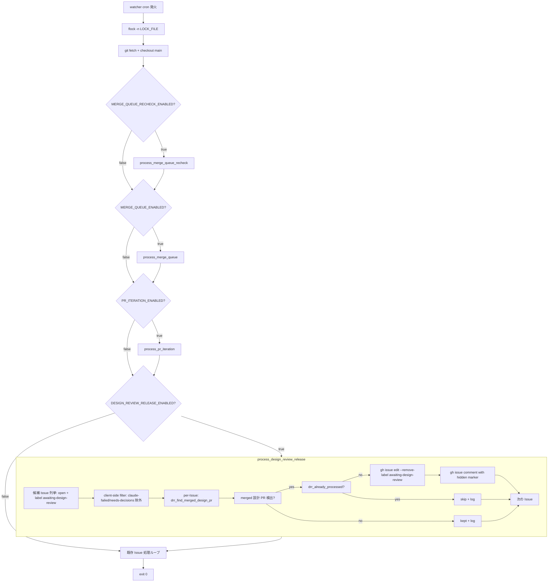
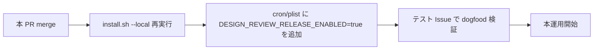

# Design Document

## Overview

**Purpose**: 設計 PR が merge された後に Issue から `awaiting-design-review` ラベルを手動で除去
する運用ステップを自動化する。これにより人間が忘却しても、次回 cron tick で Developer が
impl-resume モードで自動再開される。

**Users**: idd-claude の watcher 運用者（cron / launchd で `issue-watcher.sh` を回している個人 /
小規模チーム）と、PR をレビューする人間。Issue / PR の状態遷移を観測する operator も含む。

**Impact**: `local-watcher/bin/issue-watcher.sh` の cron tick 冒頭（既存 Phase A Merge Queue /
Re-check / PR Iteration の前段）に **Design Review Release Processor** を追加する。既存の
flock 境界を共有し、対象 PR / 対象 Issue の集合は他 Processor と直交する。本機能は opt-in
（`DESIGN_REVIEW_RELEASE_ENABLED=false` がデフォルト）であり、無効化時は本機能導入前と
完全に一致する挙動で動作する。

### Goals

- `awaiting-design-review` ラベル付きの open Issue について、idd-claude が作った設計 PR
  （head branch `^claude/issue-N-design-`）が merge 済みなら、ラベル除去 + ステータスコメント
  投稿を 1 回ずつ実行する
- 既存 env / ラベル / cron 登録文字列 / lock / exit code の契約を一切変更しない
- 既存 Phase A 系 Processor（Merge Queue / Re-check / PR Iteration）と同じ flock 境界・
  ログ書式・直列実行パターンを踏襲する
- 二重投稿（同一 Issue への複数回ステータスコメント）を hidden HTML マーカーで防ぐ
- README / PjM agent template を本機能の挙動と整合させる

### Non-Goals

- 設計 PR が close（merge せず却下）された場合の Issue ラベル処理
- 設計 PR 以外の PR と Issue ラベルの自動連動
- ラベル除去後の Developer 即時起動（次回 cron tick の通常 pickup フローに委ねる）
- リンクされた PR が複数あった場合の優先度ロジック（1 件以上 merged で除去対象とする）
- GitHub Actions 版ワークフロー（`.github/workflows/issue-to-pr.yml`）への組み込み
- `DESIGN_REVIEW_RELEASE_MAX_ISSUES` 上限超過時の優先度付け
- Reviewer サブエージェントが出した review コメントへの自動対応

---

## Architecture

### Existing Architecture Analysis

`local-watcher/bin/issue-watcher.sh` の現在の cron tick 構造（issue-watcher.sh:154-1105 抜粋）:

1. PATH 整備 → 依存 CLI の存在確認（`gh` / `jq` / `claude` / `git` / `flock` / `timeout`）
2. `flock -n 200` で `$LOCK_FILE` を取得（多重起動防止）
3. `cd "$REPO_DIR"` → `git fetch origin --prune` → `git checkout main` → `git pull --ff-only`
4. `process_merge_queue_recheck`（`#27` Re-check, opt-in）
5. `process_merge_queue`（`#14` Phase A 本体, opt-in）
6. `process_pr_iteration`（`#26` PR Iteration, opt-in）
7. Issue 処理ループ（`auto-dev` ラベル付きで停止系ラベル無しの open Issue を処理）

尊重すべき制約:

- **同一 flock 境界の共有**: 既存 4 本の Processor はすべて `flock -n 200` 取得後に直列実行
- **opt-in gate の早期 return**: 各 Processor は `*_ENABLED != "true"` なら即 `return 0`
- **ログ prefix 命名規則**: 各 Processor が独自 prefix を持つ（`merge-queue:` / `merge-queue-recheck:`
  / `pr-iteration:`）。grep で集計可能
- **timestamp 書式**: `[%F %T]`（= `[YYYY-MM-DD HH:MM:SS]`）で全 Processor 統一
- **server-side filter で API call 削減**: `gh` の `--search` クエリで `label:`/`-label:` を
  徹底し、client-side では fail-safe + 細粒度フィルタ
- **後方互換性**: 既存 env var 名 / 既存ラベル / lock / exit code は不変

解消する technical debt: 無し。本機能は新規追加で、既存コードの変更は issue-watcher.sh への
関数追加と呼び出し 1 行追加、README / PjM template の文言追記のみ。

### PjM が作る設計 PR の前提（検出方式の根拠）

`repo-template/.claude/agents/project-manager.md:48` より、設計 PR 本文は **`Refs #<issue-number>`**
で記述される（`Closes #` ではない）。

これは GitHub の auto-close 構文に該当しないため:

- GitHub は **`closingIssuesReferences` を空集合**として解釈する
- GraphQL `closingIssuesReferences`（案 a）では設計 PR を取得できない

一方、設計 PR の head branch は `claude/issue-<N>-design-<slug>` 規約で固定されており、
`PR_ITERATION_HEAD_PATTERN` / `MERGE_QUEUE_HEAD_PATTERN` と同じパターン照合が利用できる。

→ 採用: **(b) REST API で head pattern + body Refs を引く方式**。

詳細は「Components and Interfaces / drr_find_merged_design_pr」を参照。

### Architecture Pattern & Boundary Map

本機能は既存 Processor と**同じパターン**を採用する:

- 同一 shell script 内に新規関数群として実装（`process_design_review_release` とヘルパー）
- opt-in gate（`DESIGN_REVIEW_RELEASE_ENABLED`）を先頭に置き、`false` の場合は即 return
- 既存 flock 内で直列実行（**Re-check → Phase A → PR Iteration → Design Review Release →
  Issue 処理ループ**）
- 独立した log prefix（`design-review-release:`）で grep 集計を可能にする



**Architecture Integration**:

- 採用パターン: 既存 Processor と同じ「watcher サイクル内の新規 Processor 関数 + opt-in env gate」
- ドメイン／機能境界: **対象集合の直交性**を保つ
  - 本機能: open Issue + `awaiting-design-review` ラベル + リンクされた `claude/issue-N-design-`
    PR が merged 状態のもの
  - Phase A / Re-check / PR Iteration: open PR が対象（Issue は触らない）
  - 既存 Issue 処理ループ: 本機能でラベル除去された Issue は次回サイクルで `awaiting-design-review`
    が無くなった状態で picker に拾われる（impl-resume モード）
- 既存パターンの維持: flock 共有・log prefix 命名・timeout 規律・gh search クエリでのサーバ側
  フィルタ・各 Processor の `*_log` / `*_warn` / `*_error` 関数 3 セット
- 新規コンポーネントの根拠: 設計 PR merge 後の Issue ラベル除去は既存 Processor のいずれの責務にも
  該当しない（Phase A は PR ラベル、PR Iteration は PR コメント、本機能は Issue ラベル）

### Technology Stack

| Layer | Choice / Version | Role in Feature | Notes |
|-------|------------------|-----------------|-------|
| Shell | bash 4+ | `issue-watcher.sh` への関数追加 | 既存と同じ。**新規依存なし** |
| CLI: GitHub | `gh` CLI | Issue list / PR list / ラベル除去 / コメント投稿 | 既存と同じ。`gh issue list` `gh pr list --search` `gh issue edit` `gh issue comment` を使用 |
| CLI: JSON 処理 | `jq` | client-side filter / 既処理判定 marker 検査 | 既存と同じ |
| CLI: 並行制御 | `flock` | 単一 watcher 排他 | 既存と同じ lock file を共有（追加 lock なし） |
| CLI: 時間制御 | `timeout` | 各 `gh` 呼び出しのハングガード | 既存依存（Phase A / PR Iteration が利用中）。新規導入なし |
| External Service | GitHub REST API（`gh` 経由） | PR 一覧 / Issue 一覧の取得 | GraphQL は使わない（採用根拠は上記 PjM 前提節を参照） |
| Documentation | Markdown | README + PjM template の文言更新 | 新規ファイルは作らない（追記のみ） |

GraphQL を使わない理由:

- 設計 PR は body に `Refs #<N>` を持つだけで `closingIssuesReferences` には現れない
  （GitHub の auto-close キーワードは `Closes / Fixes / Resolves` のみ）
- REST + jq の方が既存 Processor と統一できる（`gh api graphql` は現行 watcher で未使用）
- Phase A / PR Iteration の AC 1.x で確立した head pattern 照合と同じ手法が再利用可能

---

## File Structure Plan

本機能の追加・変更ファイル一覧（`_Boundary:_` アノテーションのドライバ）:

```
local-watcher/
└── bin/
    └── issue-watcher.sh             # 変更: process_design_review_release 関数群を追加、
                                     #       cron tick 冒頭の既存 Processor 直列ブロックに呼び出し追加
                                     #       Config ブロックに DESIGN_REVIEW_RELEASE_* 3 変数を追加

repo-template/
└── .claude/
    └── agents/
        └── project-manager.md       # 変更: design-review モードの案内文（行 34）に
                                     #       本機能有効時は手動ラベル除去が不要である旨の注記を追加

docs/specs/
└── 40-feat-watcher-pr-merge-awaiting-design-re/
    ├── requirements.md              # PM 作成済み
    ├── design.md                    # 本ファイル
    ├── tasks.md                     # 本ファイルと同時に Architect が作成
    └── impl-notes.md                # Developer が実装完了後に追記

README.md                            # 変更:
                                     #   1. 設計 PR ゲート節（既存 1089 行付近）に
                                     #      本機能導入後の状態遷移を追記
                                     #   2. 「Design Review Release Processor」新規節を追加
                                     #      （Phase A / Re-check / PR Iteration 節と同構造）
                                     #      - 機能概要 / 有効化方法 / env var 表
                                     #      - 既存手動運用との並存
                                     #      - Migration Note（後方互換性保証）
```

### 関数の配置（`local-watcher/bin/issue-watcher.sh` 内の責務分割）

```
issue-watcher.sh
├── Config ブロック（既存）
│   └── DESIGN_REVIEW_RELEASE_ENABLED / _MAX_ISSUES / _HEAD_PATTERN を追加
├── 既存依存ツール checks（変更なし）
├── flock 取得 / git fetch / checkout main（変更なし）
├── process_merge_queue_recheck（既存）
├── process_merge_queue（既存）
├── process_pr_iteration（既存）
├── Design Review Release Processor（新規）
│   ├── drr_log / drr_warn / drr_error                # ロガー（mq_*/pi_* と同パターン）
│   ├── drr_already_processed(issue_number, body)     # 既処理判定 marker チェック
│   ├── drr_find_merged_design_pr(issue_number)       # head pattern + Refs body で merged PR を引く
│   ├── drr_remove_label_and_comment(issue, pr_num)   # ラベル除去 + ステータスコメント投稿
│   └── process_design_review_release()               # エントリ関数（候補 Issue 列挙 + per-Issue loop）
├── process_design_review_release || drr_warn ...     # 既存 Processor 直列ブロックの末尾に追加
└── Issue 処理ループ（既存、変更なし）
```

### Modified Files（詳細）

- **`local-watcher/bin/issue-watcher.sh`**:
  - Config ブロックに新規 env var 3 個と デフォルト値を追加（既存 LABEL_AWAITING_DESIGN は再利用）
  - `process_pr_iteration || pi_warn ...` の直後（issue-watcher.sh:1105 直後）に
    `process_design_review_release || drr_warn ...` を追加
  - 関数群は `process_pr_iteration` の閉じ波括弧の後に追加（既存 Processor と同じ配置パターン）
  - 既存 env var / 既存関数 / 既存 if 文への変更は無し

- **`repo-template/.claude/agents/project-manager.md`**:
  - 行 34 のコメント（merge 後に手動でラベル除去する案内）の直後に注記行を追加:
    > _watcher で `DESIGN_REVIEW_RELEASE_ENABLED=true` を有効化している場合、
    > 設計 PR merge 後数分以内に Issue から `awaiting-design-review` が自動除去され、
    > 状況コメントが投稿されます。手動でのラベル除去は不要です。_

- **`README.md`**:
  - 既存「設計 PR ゲート（2 PR フロー）」節（行 1089 付近）の「フェーズ 2: 実装 PR 作成」の前に、
    自動ラベル除去の状態遷移を追記
  - Phase A / Re-check / PR Iteration 節と同形式で **「Design Review Release Processor」**
    新規節を追加し、env var 表・有効化手順・Migration Note を記述

---

## Requirements Traceability

requirements.md の全 numeric ID と設計要素の対応表。

| Req ID | Summary | Components / Files | Contracts / Flows |
|--------|---------|--------------------|-------------------|
| 1.1 | `DESIGN_REVIEW_RELEASE_ENABLED!=true` で起動しない | `process_design_review_release()` 先頭 gate | early return パターン（mq_*/pi_* と同形式） |
| 1.2 | デフォルト値 `false` | `issue-watcher.sh` Config ブロック | `DESIGN_REVIEW_RELEASE_ENABLED="${DESIGN_REVIEW_RELEASE_ENABLED:-false}"` |
| 1.3 | リポジトリ最新化後・Issue 処理ループ前に 1 回起動 | 既存 Processor 直列ブロックの末尾（`process_pr_iteration` の直後） | `process_design_review_release || drr_warn ...` |
| 1.4 | 無効化時は導入前と完全一致するフローのみ | early return + 既存呼び出し未改変 | opt-in gate の不在シナリオ |
| 1.5 | 既存 `LOCK_FILE` 排他境界内で他 Processor と直列実行 | 既存 `exec 200>$LOCK_FILE; flock -n 200` を共有 | 追加 lock 無し |
| 2.1 | open + `awaiting-design-review` 付き Issue を列挙 | `process_design_review_release()` の `gh issue list` | `--search "label:\"awaiting-design-review\""` |
| 2.2 | 各候補 Issue にリンクされた PR を取得 | `drr_find_merged_design_pr(issue_number)` | `gh pr list --search "head:claude/issue-<N>-design- repo:..."` + body の `Refs #<N>` 確認 |
| 2.3 | head branch pattern (`DESIGN_REVIEW_RELEASE_HEAD_PATTERN`) で評価対象 PR を絞る | `drr_find_merged_design_pr` の jq filter | `select(.headRefName \| test($pattern))` |
| 2.4 | 評価対象 PR の中に merged 状態が 1 件以上 → ラベル除去対象 | `drr_find_merged_design_pr` の戻り値 | `state:merged` の PR の最初の番号を返す |
| 2.5 | リンク PR が 1 件も取得できなければ除外 | `drr_find_merged_design_pr` の空配列 → caller 側 skip | drr_log で `merged-pr=none` を記録 |
| 2.6 | 評価対象 PR に merged が無ければラベル変更しない | 同上 | drr_log で `merged-pr=none, action=kept` |
| 2.7 | 候補 Issue に `claude-failed`/`needs-decisions` 併存 → 除外 | `process_design_review_release` の client-side jq フィルタ | `gh issue list --search "-label:\"claude-failed\" -label:\"needs-decisions\""` + jq fail-safe |
| 3.1 | ラベル除去対象 Issue から `awaiting-design-review` 除去 | `drr_remove_label_and_comment()` | `gh issue edit <N> --remove-label awaiting-design-review` |
| 3.2 | 除去成功時にステータスコメント 1 件投稿 | `drr_remove_label_and_comment()` | `gh issue comment <N> --body "<template with marker>"` |
| 3.3 | コメントに merged 設計 PR 番号と impl-resume 起動の旨を含む | コメント本文テンプレート | "設計 PR #<PR> が merged。次回 cron tick で Developer が impl-resume モードで自動起動します" |
| 3.4 | ラベル除去 API エラー → WARN + コメント skip + 後続継続 | `drr_remove_label_and_comment()` の return code 分岐 | timeout/4xx/5xx → `drr_warn` + return 1 |
| 3.5 | コメント投稿 API エラー → WARN + 後続継続 | 同上 | timeout/4xx/5xx → `drr_warn` + return 1（ラベルは除去済み） |
| 3.6 | ラベル除去とコメント投稿以外の副作用無し | `drr_remove_label_and_comment` のスコープ制限 | PR 側操作・push・close を行わない |
| 4.1 | ラベルが既に外れていたら API 呼ばずスキップ | `process_design_review_release` の候補列挙時の server-side filter | server で `label:"awaiting-design-review"` を必須にしているため、外れていれば候補に上がらない |
| 4.2 | 既処理ステータスコメントが既存なら再投稿しない | `drr_already_processed(issue_number)` の事前チェック | hidden HTML marker `<!-- idd-claude:design-review-release issue=<N> pr=<P> -->` を Issue コメント全件から検索 |
| 4.3 | 既処理判定 marker を備える | コメント本文末尾の hidden HTML comment | `<!-- idd-claude:design-review-release issue=<N> pr=<P> -->`（regex: `idd-claude:design-review-release issue=([0-9]+)`） |
| 4.4 | 同一サイクル内で同一 Issue を 2 回処理しない | `gh issue list` の結果は一意（同 Issue 番号は 1 件）+ 早期処理済み判定 | jq の `.[]` は重複排除されるが、念のため処理済み Issue 番号を associative array で記録 |
| 4.5 | 人間の手動除去 Issue に追加操作しない | server-side filter が `label:"awaiting-design-review"` 必須 | 4.1 と同根（手動除去後はそもそも候補に上がらない） |
| 5.1 | `DESIGN_REVIEW_RELEASE_MAX_ISSUES` で上限上書き、デフォルト 10 | Config ブロック | `DESIGN_REVIEW_RELEASE_MAX_ISSUES="${DESIGN_REVIEW_RELEASE_MAX_ISSUES:-10}"` |
| 5.2 | 上限超過分は次回持ち越し + overflow ログ | `process_design_review_release` の `.[0:N][]` truncate | drr_log で `overflow=N` を記録 |
| 5.3 | 1 Issue あたり API 呼び出しを 5 回以内（PR 取得 + ラベル除去 + コメント） | per-Issue 呼び出し上限の設計 | `drr_find_merged_design_pr` で 1〜2 call、`drr_already_processed` で 1 call、ラベル除去 1 call、コメント投稿 1 call、計 4〜5 call |
| 5.4 | 各 API 呼び出しにタイムアウトを適用 | 全 `gh` 呼び出しを `timeout "$DRR_GH_TIMEOUT"` で wrap（Phase A の規律を継承） | デフォルト値は `MERGE_QUEUE_GIT_TIMEOUT` と同じ 60 秒（個別 env var は導入しない=既存 timeout 慣習を踏襲） |
| 5.5 | タイムアウト到達時は中断 + WARN + 次 Issue へ | 各 `timeout` ラッパの非 0 終了 → drr_warn + continue | per-Issue 部分失敗で全体 abort しない |
| 6.1 | サイクル開始時に候補件数 / 処理件数 / overflow をログ | `process_design_review_release` 冒頭 | `drr_log "対象候補 N 件、処理対象 M 件（overflow=K 件は次回持ち越し）"` |
| 6.2 | 各 Issue ごとに番号 / merged 設計 PR 番号 / アクションをログ | per-Issue ログ | `drr_log "Issue #<N>: merged-design-pr=#<P>, action={label removed + commented \| kept \| skip}"` |
| 6.3 | サイクル終了時にサマリ（成功 / kept / skip / fail）をログ | `process_design_review_release` 末尾 | `drr_log "サマリ: removed=N, kept=N, skip=N, fail=N, overflow=N"` |
| 6.4 | すべてのログ行に `design-review-release:` プレフィックス | `drr_log` / `drr_warn` / `drr_error` 関数 | `[%F %T] design-review-release: ...` |
| 6.5 | タイムスタンプ書式 `[%F %T]` で既存 Watcher と統一 | `drr_log` 内の `date '+%F %T'` | 既存 mq_log と完全同形 |
| 6.6 | ログ出力先は既存 `LOG_DIR` を流用 | mkdir 追加なし、既存 stdout/stderr 経由 | LOG_DIR は cron リダイレクトで使われる前提（既存通り） |
| 6.7 | 標準エラーには WARN/ERROR のみ、標準出力は機械可読 | `drr_warn` / `drr_error` は `>&2`、`drr_log` は stdout | mq_*/pi_* と同パターン |
| 7.1 | 既存 env var の意味とデフォルト挙動を変更しない | 既存 Config ブロックは触らない | grep diff 0 で確認 |
| 7.2 | 既存ラベルの名前・意味・付与契約を変更しない | LABEL_AWAITING_DESIGN は既存定数の再利用のみ | 新規ラベル追加なし |
| 7.3 | lock ファイルパス / ログ出力先 / exit code 変更なし | 既存 LOCK_FILE / LOG_DIR / 既存 exit パスへの介入なし | 新規 Processor は既存ブロック内に挿入 |
| 7.4 | cron / launchd 登録文字列が書き換え不要 | `$HOME/bin/issue-watcher.sh` の起動行は不変、env var は cron 側で追加するだけ | 既存ユーザは何もしなくても従来挙動 |
| 7.5 | `DESIGN_REVIEW_RELEASE_ENABLED=false` で完全に従来挙動 | early return + 既存コードパス未改変 | 1.1 と同根 |
| 7.6 | ラベル除去のみ。`awaiting-design-review` 付与は行わない | `drr_remove_label_and_comment` のスコープ | `--add-label` 系操作は本機能では一切呼ばない |
| 8.1 | README に概要セクション | README.md 新規節 | Phase A / PR Iteration 節と同構造 |
| 8.2 | env var 3 個（ENABLED / MAX_ISSUES / HEAD_PATTERN）の名称・デフォルト・推奨を README に明記 | README.md env 表 | 表形式で 3 行 |
| 8.3 | Migration note に後方互換性方針を明記 | README.md Migration Note 節 | env / ラベル / lock / exit code 不変、`ENABLED=false` で完全無影響 |
| 8.4 | PjM agent template に「自動除去時は手動不要」の注記を追加 | `repo-template/.claude/agents/project-manager.md` | design-review モードのコメントテンプレートに 1 文追記 |
| 8.5 | README 設計 PR ゲート節に状態遷移（merge → 自動除去 → 次回 cron で impl-resume）を反映 | README.md 既存節（行 1089 付近）を更新 | 既存記述「人間が手動でラベルを外す」を「自動 or 手動」に書き換え |
| NFR 1.1 | 通常ケース（候補 0〜3 件）30 秒以内 | per-Issue API call 上限 5 + timeout 60s 設計 | 候補 3 件 × 5 call × 数秒で 30s 以内が現実的 |
| NFR 1.2 | 上限値（10 件）でも 60 秒以内 | API call 予算: 10 × 5 = 50 call、timeout 60s/各 | 通常 GitHub API レイテンシは < 500ms なので 50 call × 0.5s = 25s |
| NFR 2.1 | 破壊的操作禁止（PR ラベル変更 / commit / push / close 全禁止） | `drr_remove_label_and_comment` のスコープ制限 | Issue ラベル除去とコメント投稿のみ |
| NFR 2.2 | merge 状態判定不確定 → ラベル除去せず次回持ち越し | `drr_find_merged_design_pr` が空文字を返す → caller 側で skip | API エラー時も同様 |
| NFR 2.3 | main / 任意 branch への push なし | `drr_*` 関数は `git push` を一切呼ばない | 関数定義レビューで保証 |
| NFR 3.1 | grep 集計用 prefix `design-review-release:` | `drr_log` の prefix | NFR 3.2 と同根 |
| NFR 3.2 | 他 Processor と異なる識別子 | `merge-queue:` / `merge-queue-recheck:` / `pr-iteration:` と被らない `design-review-release:` を採用 | grep -E `'^[^:]+:[^:]+: design-review-release:'` で抽出可能 |

---

## Components and Interfaces

### Design Review Release Processor（`local-watcher/bin/issue-watcher.sh` 内）

#### `process_design_review_release()`（エントリ関数）

| Field | Detail |
|-------|--------|
| Intent | 1 watcher サイクル内で `awaiting-design-review` 付き Issue を検出し、設計 PR が merged なら ラベル除去 + コメント投稿を順次実行 |
| Requirements | 1.1, 1.3, 1.4, 1.5, 2.1, 2.7, 4.4, 5.1, 5.2, 5.5, 6.1, 6.3, 6.4, 6.6, 6.7, NFR 1.1, NFR 1.2 |

**Responsibilities & Constraints**

- `DESIGN_REVIEW_RELEASE_ENABLED != "true"` なら即 `return 0`（既存 mq_*/pi_* と同パターン）
- `gh issue list --repo "$REPO" --state open --search "label:\"$LABEL_AWAITING_DESIGN\"
  -label:\"$LABEL_FAILED\" -label:\"$LABEL_NEEDS_DECISIONS\"" --json number,title,url,labels
  --limit 100` で候補 Issue を取得（server-side filter）
- jq client-side filter で fail-safe 確認（label 配列の二重チェック）
- `DESIGN_REVIEW_RELEASE_MAX_ISSUES` で先頭 N 件に truncate、超過は overflow としてサマリに記録
- 各 Issue を順次 per-Issue 処理:
  1. `drr_already_processed` で既処理判定（true なら skip）
  2. `drr_find_merged_design_pr` で merged 設計 PR を引く（無ければ kept）
  3. 取得できれば `drr_remove_label_and_comment` でラベル除去 + コメント投稿
- サイクル終了時にサマリ行を `drr_log` で出力

**Dependencies**

- Inbound: `issue-watcher.sh` のメイン（既存 Processor 直列ブロックの末尾） — single call site (Critical)
- Outbound: `drr_already_processed`, `drr_find_merged_design_pr`, `drr_remove_label_and_comment`,
  `drr_log` (Critical)
- External: `gh`, `jq` (Critical)

**Contracts**: Service [x] / Batch [x] / State [x]

**Preconditions**:
- `cd "$REPO_DIR"` 済み、`flock` 取得済み、`git checkout main` 済み
- 既存 Processor （`process_merge_queue_recheck` / `process_merge_queue` / `process_pr_iteration`）
  の実行が完了している（直列実行）

**Postconditions**:
- 候補 Issue のうち、merged 設計 PR がある Issue のラベルが除去され、ステータスコメントが
  1 件投稿されている
- サマリ行が `$LOG_DIR` のログに出ている

**Invariants**:
- 失敗した Issue があっても全体 exit は 0（後続 Issue 処理ループを止めない）
- 同一サイクル内で同じ Issue を 2 回処理しない（`gh issue list` の結果は一意）
- `awaiting-design-review` ラベルの**付与**は一切行わない（除去主体、Req 7.6）

---

#### `drr_find_merged_design_pr(issue_number)`（リンク済 設計 PR の検出）

| Field | Detail |
|-------|--------|
| Intent | 与えられた Issue 番号にリンクされた `claude/issue-<N>-design-` パターンの merged PR が存在するなら、その PR 番号を返す |
| Requirements | 2.2, 2.3, 2.4, 2.5, 2.6, 5.3, 5.4, 5.5, NFR 2.2 |

**設計判断**: GraphQL `closingIssuesReferences` を使わず、REST + head pattern + body Refs で検出する。

**根拠**:

| 案 | Pros | Cons | 判断 |
|----|------|------|------|
| (a) GraphQL `closingIssuesReferences` | 1 query で完結 | **PjM が `Refs #N` を使うため空集合になる**（GitHub auto-close キーワードに該当しない） | 不採用 |
| (b) REST + head pattern + body Refs | head pattern で head branch を一次フィルタ、body の `Refs #<N>` で二次確認 | 2 段の照合が必要 | **採用** |
| (c) ハイブリッド（GraphQL + head pattern fallback） | 将来 PjM が `Closes #N` に切り替えたら高速化 | 現時点で過剰、両系統の保守 | YAGNI で不採用 |

**Service Interface**:

```
入力: issue_number (int)
出力: stdout に merged 設計 PR 番号（複数件マッチ時は最大の PR 番号 = 最新）
      該当無しなら空文字を出力
副作用: なし（読み取り専用 API）
返り値: 0 = 検出 or 該当無し（共に正常）
        1 = API エラー / タイムアウト
```

**Implementation pseudocode**:

```bash
drr_find_merged_design_pr() {
  local issue_number="$1"
  # AC 2.2 / 2.3 / 5.3: head pattern + state:merged で server-side フィルタ
  # gh search クエリは "head:" を直接サポートしないため、merged PR を head で
  # 引くのは pattern では不可。代わりに pattern prefix を利用して branch 名で照合する。
  #
  # 実装方針:
  #   1. gh pr list --search "is:pr is:merged in:title issue-<N>" --state merged で当たりをつけ
  #   2. head branch が "$DESIGN_REVIEW_RELEASE_HEAD_PATTERN" にマッチし、
  #      かつ body に "Refs #<issue_number>" を含む PR を採用
  #
  # AC 5.4: timeout を全 API 呼び出しに適用
  local prs_json
  if ! prs_json=$(timeout "$DRR_GH_TIMEOUT" gh pr list \
      --repo "$REPO" \
      --state merged \
      --search "is:pr is:merged claude/issue-${issue_number}-design- in:head" \
      --json number,headRefName,body,mergedAt \
      --limit 20 2>/dev/null); then
    return 1   # AC 5.5 / NFR 2.2: タイムアウト or API エラー
  fi

  # クライアント側で head pattern + body Refs を確認
  local pattern="$DESIGN_REVIEW_RELEASE_HEAD_PATTERN"
  local refs_pattern="(Refs|refs|Ref|ref) #${issue_number}([^0-9]|$)"
  local pr_number
  pr_number=$(echo "$prs_json" | jq -r \
    --arg pattern "$pattern" \
    --arg refs_re "$refs_pattern" \
    '[.[]
      | select(.headRefName | test($pattern))
      | select(.body // "" | test($refs_re))
      | .number
    ] | sort | last // ""')
  echo "$pr_number"
  return 0
}
```

**注意事項**:

- head pattern は `^claude/issue-[0-9]+-design-` をデフォルトとし、Issue 番号と一致する PR のみを
  対象とするため、`gh pr list` の `--search` で `claude/issue-<N>-design-` を含む head を一次絞り込み
- `is:merged` と head pattern の組み合わせで API 呼び出しは 1 回（Req 5.3）
- 複数の設計 PR がある場合（やり直しで複数 PR が merged された等）、最大番号 = 最新を採用

---

#### `drr_already_processed(issue_number)`（既処理判定）

| Field | Detail |
|-------|--------|
| Intent | 同一 Issue へのステータスコメント二重投稿を防ぐため、過去サイクルで本機能が投稿した hidden marker の存在を確認 |
| Requirements | 4.2, 4.3, 4.4, 5.3 |

**設計判断**: ステータスコメント本文の末尾に hidden HTML マーカーを埋め込み、次回以降の判定で
`gh issue view --comments` から検出する。

**根拠**（PR Iteration の round counter 方式と同パターン採用）:

| 案 | Pros | Cons | 判断 |
|----|------|------|------|
| 1. コメント本文中の hidden HTML marker | 既存 PR Iteration round counter と同パターン、人間が手で消せる、`gh api` 1 call で取得可能 | コメント取得 API call が 1 回追加 | **採用** |
| 2. Issue body への marker 埋め込み | body 1 call で済む | Issue body は人間 / PM の領分なので watcher が編集すべきでない | 不採用 |
| 3. 専用ラベル（`design-review-released`） | ラベル一発で判定可能 | 新規ラベル追加で `idd-claude-labels.sh` の冪等契約に影響、ラベル除去契約の複雑化 | 不採用 |

**Marker schema**:

```
<!-- idd-claude:design-review-release issue=<issue_number> pr=<merged_pr_number> -->
```

- regex: `idd-claude:design-review-release issue=([0-9]+)`
- 同一 Issue にこの marker を持つコメントが存在すれば既処理（issue_number 一致が条件、PR 番号は記録のみ）

**Service Interface**:

```
入力: issue_number (int)
出力: stdout に "true" or "false"
返り値: 0 = 判定成功
        1 = API エラー / タイムアウト（fail-safe で false 扱い、呼び出し元で WARN）
```

**Implementation pseudocode**:

```bash
drr_already_processed() {
  local issue_number="$1"
  local comments_json
  # AC 5.3 / 5.4: timeout 適用、1 API call
  if ! comments_json=$(timeout "$DRR_GH_TIMEOUT" \
      gh issue view "$issue_number" --repo "$REPO" --json comments 2>/dev/null); then
    return 1
  fi
  local marker_re="idd-claude:design-review-release issue=${issue_number}"
  if echo "$comments_json" | jq -e --arg re "$marker_re" \
      '.comments // [] | map(.body) | any(. // ""; test($re))' >/dev/null 2>&1; then
    echo "true"
  else
    echo "false"
  fi
  return 0
}
```

---

#### `drr_remove_label_and_comment(issue_number, merged_pr_number)`（ラベル除去 + コメント投稿）

| Field | Detail |
|-------|--------|
| Intent | 確定したラベル除去対象 Issue に対し、ラベル除去とステータスコメント投稿を順次実行 |
| Requirements | 3.1, 3.2, 3.3, 3.4, 3.5, 3.6, 5.3, 5.4, 5.5, 6.7, 7.6, NFR 2.1, NFR 2.3 |

**Contracts**: API [x] / State [x]

**Implementation flow**:

1. AC 3.1: `timeout "$DRR_GH_TIMEOUT" gh issue edit "$issue_number" --repo "$REPO"
   --remove-label "$LABEL_AWAITING_DESIGN"`
   - 失敗時 → `drr_warn` + return 1（AC 3.4: コメントは投稿しない）
2. AC 3.2 / 3.3: ステータスコメント投稿
   - 本文テンプレート（後述）を `gh issue comment` に渡す
   - 失敗時 → `drr_warn` + return 1（AC 3.5: ラベルは除去済みなので Issue は次サイクルで impl-resume へ進める）
3. AC 3.6 / 7.6 / NFR 2.1: ラベル除去とコメント投稿以外の操作（PR 側操作・push・close 等）は一切行わない

**ステータスコメント本文テンプレート**:

```markdown
## 自動: 設計 PR merge を検出

設計 PR #<merged_pr_number> が merged されました。
本 Issue から `awaiting-design-review` ラベルを自動除去しました。

次回 cron tick で Developer が **impl-resume モード**で自動起動し、
`docs/specs/<N>-<slug>/` 配下の design.md / tasks.md に従って実装 PR を作成します。

---

_本コメントは `local-watcher/bin/issue-watcher.sh` の Design Review Release Processor が
投稿しました。`DESIGN_REVIEW_RELEASE_ENABLED=true` で有効化されています。_

<!-- idd-claude:design-review-release issue=<issue_number> pr=<merged_pr_number> -->
```

末尾の hidden HTML marker は `drr_already_processed` の検出キー。

---

#### `drr_log` / `drr_warn` / `drr_error`（ロガー）

| Field | Detail |
|-------|--------|
| Intent | mq_*/pi_* と同形のロガー 3 セット。stdout/stderr 振り分けと grep prefix を統一 |
| Requirements | 6.4, 6.5, 6.7, NFR 3.1, NFR 3.2 |

**Implementation**:

```bash
drr_log()   { echo "[$(date '+%F %T')] design-review-release: $*"; }
drr_warn()  { echo "[$(date '+%F %T')] design-review-release: WARN: $*" >&2; }
drr_error() { echo "[$(date '+%F %T')] design-review-release: ERROR: $*" >&2; }
```

既存 `mq_log` / `mqr_log` / `pi_log` と完全同形。

---

### Documentation Components

#### `repo-template/.claude/agents/project-manager.md` への注記追加

| Field | Detail |
|-------|--------|
| Intent | design-review モードの案内文に、本機能有効時は手動ラベル除去が不要である旨を明記 |
| Requirements | 8.4 |

**追記箇所**: 行 34（Issue へのコメントテンプレート内）の直後、行 36（やり直し案内）の直前。
既存の `awaiting-design-review` 除去案内は残し、注記行を追加することで以下のいずれの運用にも対応:

- watcher で自動除去機能を有効化していない（既存運用） → 案内通り手動除去
- 自動除去機能を有効化 → 注記により手動不要を伝達

**追記文案**:

```markdown
   > _注: watcher で `DESIGN_REVIEW_RELEASE_ENABLED=true` を有効化している場合、
   > 設計 PR merge 後数分以内に Issue から `awaiting-design-review` が自動除去され、
   > ステータスコメントが投稿されます。手動でのラベル除去は不要です。_
```

---

#### `README.md` への新規節追加

| Field | Detail |
|-------|--------|
| Intent | 運用者が opt-in 可否・挙動・既存手動運用との関係を README のみで判断できるようにする |
| Requirements | 8.1, 8.2, 8.3, 8.5 |

**節構成**（Phase A / Re-check / PR Iteration 節と同構造）:

1. 機能概要（目的・対象・起動タイミング）— Req 8.1
2. 対象 Issue の判定（label / merged design PR の検出）
3. 挙動表（label 除去 + comment / kept / skip / fail）
4. 環境変数表（3 変数 × 名称・デフォルト・推奨・用途）— Req 8.2
   - `DESIGN_REVIEW_RELEASE_ENABLED` — `false`（推奨: dogfood で確認後 `true`）
   - `DESIGN_REVIEW_RELEASE_MAX_ISSUES` — `10`
   - `DESIGN_REVIEW_RELEASE_HEAD_PATTERN` — `^claude/issue-[0-9]+-design-`
5. 既存手動運用との並存（人間が先に外した Issue は対象外、二重投稿は marker で防止）
6. Migration Note（後方互換性保証）— Req 8.3
7. 既存「設計 PR ゲート（2 PR フロー）」節の状態遷移を更新 — Req 8.5
   - 「人間が手動でラベルを外す」→「自動除去 or 手動除去」

---

## Data Models

### Domain Model

本機能は新規データベース / スキーマを追加しない。状態は既存 GitHub Labels + Issue コメント
（hidden HTML marker）のみ。

| エンティティ | 所在 | 識別子 | Invariant |
|--------------|------|--------|-----------|
| Issue Pickup State | GitHub Label (`awaiting-design-review`) | Issue number | 本機能はラベル**除去**のみ。**付与は行わない**（Req 7.6） |
| Processed Marker | Issue コメント本文末尾の hidden HTML comment | `idd-claude:design-review-release issue=<N>` | 同一 Issue に複数存在しても fail-safe（regex match 1 件以上で既処理判定） |
| Linked Design PR | GitHub PR (state=merged, head branch matches pattern, body contains `Refs #<N>`) | PR number | merged_at は降順で最大番号を採用 |

### Hidden Marker Schema

**Issue コメント末尾**:

```
<!-- idd-claude:design-review-release issue=<issue_number> pr=<merged_pr_number> -->
```

- regex: `idd-claude:design-review-release issue=([0-9]+)`
- マーカーは `drr_remove_label_and_comment` が投稿するコメントの末尾に必ず 1 つ存在
- 同一 Issue に複数のコメントがあっても、issue_number でマッチすれば既処理扱い
- 人間がコメントを delete すれば再処理可能（運用上は通常起こらないが復旧経路として保証）

### Environment Variable Defaults

| env var | default | note |
|---------|---------|------|
| `DESIGN_REVIEW_RELEASE_ENABLED` | `false` | opt-in gate（Req 1.1, 1.2） |
| `DESIGN_REVIEW_RELEASE_MAX_ISSUES` | `10` | 1 サイクル処理上限（Req 5.1, 5.2） |
| `DESIGN_REVIEW_RELEASE_HEAD_PATTERN` | `^claude/issue-[0-9]+-design-` | 設計 PR の head branch 規約（Req 2.3） |

**timeout の扱い**: 個別 env var は導入しない。既存 `MERGE_QUEUE_GIT_TIMEOUT`（デフォルト 60 秒）
を本機能内で参照するエイリアス変数 `DRR_GH_TIMEOUT="${DRR_GH_TIMEOUT:-${MERGE_QUEUE_GIT_TIMEOUT:-60}}"`
を Config ブロックに置く。Req 5.4 を満たしつつ、既存 timeout 慣習との整合性を保つ。

---

## Error Handling

### Error Strategy

既存 Processor と同じ原則: **1 Issue の失敗は後続 Issue / Issue 処理ループを止めない**。
すべての失敗は `drr_warn` / `drr_error` ログに記録し、`process_design_review_release` は
常に exit 0 で返る。

### Error Categories and Responses

| カテゴリ | 具体例 | 応答 | Req 対応 |
|----------|--------|------|----------|
| **Opt-in 無効** | `DESIGN_REVIEW_RELEASE_ENABLED=false`（デフォルト） | 即 return 0、コードパス skip | 1.1, 1.4, 7.5 |
| **候補 Issue 取得失敗** | `gh issue list` タイムアウト / 4xx / 5xx | `drr_warn` + サイクル全体 skip + return 0 | 5.5 |
| **PR 検出 API エラー** | `drr_find_merged_design_pr` の `gh pr list` がタイムアウト | `drr_warn` + 当該 Issue を skip + 次 Issue へ | 5.5, NFR 2.2 |
| **PR 未検出（merged 無し）** | リンク PR 0 件 or merged 0 件 | `drr_log` で `kept` と記録 + ラベル変更なし + 次 Issue | 2.5, 2.6 |
| **既処理 Issue** | hidden marker 検出 | `drr_log` で `skip (already processed)` と記録 + 次 Issue | 4.2, 4.4 |
| **terminal label 併存** | `claude-failed` / `needs-decisions` あり | server-side filter で除外、client-side jq で fail-safe | 2.7 |
| **ラベル除去 API 失敗** | `gh issue edit` 4xx/5xx | `drr_warn` + コメント投稿 skip + 次 Issue（ラベルは残るので次回再試行） | 3.4 |
| **コメント投稿 API 失敗** | `gh issue comment` 4xx/5xx | `drr_warn` + 次 Issue（ラベルは除去済み、marker 無しのため次回再投稿される可能性 = 受容） | 3.5 |
| **upper bound 超過** | 候補 11 件 / max 10 件 | 先頭 10 件を処理、`drr_log "overflow=1"` を記録、次 Issue は次サイクル | 5.2 |
| **merge 状態不確定** | `gh pr list` が空配列を返した（API 不安定 etc.） | `drr_find_merged_design_pr` が空文字 → caller が kept 扱い + 次サイクル再試行 | NFR 2.2 |

### 部分失敗の許容

- ラベル除去成功 + コメント投稿失敗 → ラベルは外れたまま、次サイクルで Issue は impl-resume に進む。
  二重コメント投稿は marker で防がれるが、コメント投稿失敗時は marker 不在のため次サイクルで
  再試行が走る → 結果として 2 件投稿の可能性が極小だが残る。**運用上の補償**: cron 間隔（2 分）内に
  GitHub API が回復しない確率は低く、Req 4.2 の「同等内容のステータスコメントを再投稿しない」を
  best-effort で達成する設計とする（README に記載）。

### dirty working tree 検知の不要性

Phase A / PR Iteration は `git checkout` を伴うため dirty 検知が必須だったが、本機能は
**git 操作を一切行わない**（Issue ラベル除去 + コメント投稿のみ）。よって dirty チェックは不要。
ただし NFR 2.3（main / 任意 branch への push 禁止）を関数定義レベルで保証するため、
コードレビューで `git push` / `git commit` / `git checkout` の不在を機械チェックする。

---

## Testing Strategy

### Unit Tests（3-5 項目）

本リポジトリには unit test フレームワーク無し（bash + markdown プロジェクト）。以下の「関数単位の
dry-run harness」で代替する（Phase A / PR Iteration の impl-notes と同方式）:

1. `drr_find_merged_design_pr` の jq filter: mock JSON 配列に以下を含めて期待件数を確認
   - merged + head pattern match + body Refs match → 採用
   - merged + head pattern mismatch → 除外
   - merged + head pattern match + body に Refs 異番号 → 除外
   - open + head pattern match + body Refs match → 除外（state:merged で先にフィルタ済み想定）
2. `drr_already_processed` の marker 検出: mock comments JSON で
   - marker 無し → false
   - marker あり（issue_number 一致） → true
   - marker あり（issue_number 不一致） → false
   - 複数コメントの中に 1 件 marker あり → true
3. ステータスコメント本文テンプレートの変数置換: PR 番号と Issue 番号が正しく埋め込まれ、
   marker 行が末尾にあること
4. `process_design_review_release` の opt-in gate: `DESIGN_REVIEW_RELEASE_ENABLED=false` で
   関数が即 return 0 する（`gh` を呼ばない、stdout に何も出さない）こと
5. server-side `gh issue list --search` クエリ文字列が以下を含むこと:
   `state:open label:"awaiting-design-review" -label:"claude-failed" -label:"needs-decisions"`

### Integration Tests（3-5 項目）

1. **静的解析**: `shellcheck local-watcher/bin/issue-watcher.sh` 警告ゼロ（既存と同レベル）
2. **bash 構文 check**: `bash -n local-watcher/bin/issue-watcher.sh`（shellcheck が無い環境のフォールバック）
3. **cron-like 最小 PATH での起動**:
   `env -i HOME=$HOME PATH=/usr/bin:/bin DESIGN_REVIEW_RELEASE_ENABLED=false bash -c '~/bin/issue-watcher.sh'`
   で本機能スキップ + 既存挙動を確認
4. **対象 Issue 0 件状態の dry run**: `DESIGN_REVIEW_RELEASE_ENABLED=true` + 候補 0 件で
   サマリログが `removed=0, kept=0, skip=0, fail=0, overflow=0` で出ること
5. **既存 env var との非干渉**: `MERGE_QUEUE_ENABLED=false PR_ITERATION_ENABLED=false
   DESIGN_REVIEW_RELEASE_ENABLED=false` で全 opt-in が無効な状態の挙動が、本機能導入前と
   bit-perfect に一致すること（diff 観点で Phase A 系・PR Iteration 系・Issue 処理ループの
   ログ差分が 0 行）

### E2E Tests（3-5 項目, 該当する場合）

**dogfood 前提**: self-hosting repo (`hitoshiichikawa/idd-claude-watcher`) でテスト Issue / PR を
立てて watcher を回す。

1. テスト Issue を立て、Architect 経由で設計 PR を作る → 人間が merge → 次回 cron tick で:
   - (a) 候補 Issue として列挙される
   - (b) `drr_find_merged_design_pr` が PR 番号を返す
   - (c) `awaiting-design-review` ラベルが除去される
   - (d) ステータスコメントが 1 件投稿され、本文に PR 番号と marker が含まれる
2. 同 Issue の次サイクル: `drr_already_processed` で skip され、ログに
   `skip (already processed)` が出ること（コメント二重投稿が起きない）
3. 人間が先に手動でラベルを外した Issue: 候補に上がらないこと（server-side filter）
4. terminal label（`claude-failed`）が併存する Issue: 候補に上がらないこと
5. 上限超過: 候補 11 件 / `MAX_ISSUES=10` で先頭 10 件処理 + `overflow=1` ログ +
   11 件目は次サイクルで処理されること

### Performance / Load（3-4 項目, 該当する場合）

1. **NFR 1.1 単一 Issue 処理時間計測**: 候補 1 件で開始 → 終了の wall clock を計測し、
   30 秒以内（Req NFR 1.1 通常 30s 目安）であること
2. **NFR 1.2 上限 10 件時の処理時間計測**: `MAX_ISSUES=10` で 10 件すべて処理した場合の
   wall clock が 60 秒以内であること
3. **API call 件数**: 1 Issue あたりの `gh` 呼び出し回数が以下になっていることを `--debug` 等で確認
   - PR 検出 1 call（`gh pr list --search ...`）
   - 既処理判定 1 call（`gh issue view --json comments`）
   - ラベル除去 1 call（`gh issue edit --remove-label`）
   - コメント投稿 1 call（`gh issue comment`）
   - 計 4 call（候補列挙の 1 call はサイクル全体で 1 回 = per-Issue では 0 と数える）
   - **Req 5.3 の 5 回以内に収まる**

---

## Security Considerations

本機能は OSS 公開ツールである idd-claude の watcher に追加される。**新規 secrets を扱わず、
新規外部サービス呼び出しも追加しない**。GitHub 認証は既存の `gh auth login` で取得した
トークンに完全に委譲する。

| ベクトル | 想定 | 対策 |
|----------|------|------|
| **GitHub トークン scope** | 既存 `gh auth` の scope を利用 | 新規 scope 追加なし。`repo` スコープがあれば動作 |
| **Issue 本文の prompt injection** | 本機能は Issue / PR の **メタデータ**（ラベル / 番号 / head branch）のみ参照し、本文を Claude に渡さない | 設計上 Claude を呼び出さない（ラベル操作 + コメント投稿のみ）。prompt injection の攻撃面は無し |
| **悪意のある PR head 名** | `claude/issue-N-design-evil` のような branch を第三者が作成 | head pattern 自体は信頼境界ではない（fork PR は GitHub の merged 判定で別個に扱われる）。`is:merged` を server-side で必須にしているため、merged 状態は repo write 権限を持つ人間がレビューして merge した結果を反映する。**信頼境界 = repo write 権限**（self-host 前提） |
| **ステータスコメント本文の改竄** | 人間が hidden marker を含むコメントを偽装 | self-host 前提なので repo write = 信頼境界。偽装で「既処理」扱いになっても、人間が手動でラベルを外せば次回 cron で impl-resume に進める（運用で補償可能） |
| **secrets の取り扱い** | 本機能は環境変数で何の secrets も受け取らない | env var 3 個（ENABLED / MAX_ISSUES / HEAD_PATTERN）はすべて非機密 |
| **API rate limit 枯渇** | 100 件 Issue × 5 call = 500 call/cycle | `MAX_ISSUES=10` で per-cycle 上限を制御。GitHub REST API rate limit (5000/hr authenticated) に対し十分なマージン |

OSS 公開リポジトリとして以下の運用前提も明記:

- 本機能は **private / 信頼できる collaborator のみがレビュー権を持つ repo** で使うこと（既存 idd-claude
  の運用前提と同じ）
- token を Issue / PR / コメント本文に echo しない（既存 watcher の規律を継承、本機能でも逸脱なし）

---

## Migration Strategy

### 既存ユーザへの影響評価

- **`DESIGN_REVIEW_RELEASE_ENABLED=false`（デフォルト）の場合**: コードパス完全スキップ。
  `cron` / `launchd` / `LOCK_FILE` / `LOG_DIR` / exit code / 既存ラベル / 既存 env var すべて不変。
  `DESIGN_REVIEW_RELEASE_ENABLED` 自体を未設定にしたまま既存 cron entry を更新せずに watcher を
  最新版に置き換えても一切の挙動変化なし
- **`install.sh` 再実行**: 既存 `install.sh --local` で `~/bin/issue-watcher.sh` が更新される。
  新規 prompt template や設定ファイルの追加配置は不要（本機能は単一ファイル変更で完結）
- **ラベル作成スクリプト再実行**: 不要（既存 `awaiting-design-review` ラベルを再利用、新規ラベル無し）

### opt-in 手順



具体的な cron 例:

```
*/2 * * * * REPO=owner/repo REPO_DIR=$HOME/work/repo \
  DESIGN_REVIEW_RELEASE_ENABLED=true \
  $HOME/bin/issue-watcher.sh
```

### 破壊的変更の有無

**なし**。新規追加のみで、既存コードの修正は以下に限定:

- `issue-watcher.sh` の Config ブロックへの env var 追加（既存変数は不変）
- `issue-watcher.sh` の `process_pr_iteration || pi_warn ...` 直後への
  `process_design_review_release || drr_warn ...` 1 行追加
- `process_pr_iteration` 関数定義の後に `drr_*` 関数群を追加（既存関数定義への影響なし）
- `repo-template/.claude/agents/project-manager.md` の design-review モード案内文への 1 段落追記
- README への新規節追加 + 既存「設計 PR ゲート」節の状態遷移更新

### self-hosting への影響（dogfooding）

本 repo 自身も consumer として `issue-watcher.sh` を回している。本 PR merge 後:

1. `install.sh --local` 再実行で `~/bin/issue-watcher.sh` が更新される
2. cron / launchd 側で `DESIGN_REVIEW_RELEASE_ENABLED=true` を追加すると、本機能が有効化
3. 既存の `awaiting-design-review` 付き Issue（dogfood 用テスト Issue 等）に対し、
   marker 未付与なので次サイクルで処理対象になる（既存 PR の状態に依存）

### 後方互換性のチェックリスト

- [x] 既存 env var 名（`REPO` / `REPO_DIR` / `LOG_DIR` / `LOCK_FILE` / `TRIAGE_MODEL` / `DEV_MODEL` /
      `MERGE_QUEUE_*` / `PR_ITERATION_*`）の意味とデフォルト挙動を変更しない
- [x] 既存ラベル（`auto-dev` / `claude-picked-up` / `awaiting-design-review` / `ready-for-review` /
      `claude-failed` / `needs-decisions` / `skip-triage` / `needs-rebase` / `needs-iteration`）の
      名前・意味・付与契約を変更しない
- [x] 既存 lock ファイルパス / ログ出力先 / exit code の意味を変更しない
- [x] 既存 cron / launchd 登録文字列が書き換え不要
- [x] `DESIGN_REVIEW_RELEASE_ENABLED=false` で完全に従来挙動

---

## Design Decisions Summary（PM Open Questions と Architect 判断）

PM の Open Questions は「なし」だったが、Issue 本文に列挙された 5 点の設計判断について
本書での結論を以下にまとめる:

| # | 論点 | 採用 | 根拠 |
|---|------|------|------|
| 1 | リンク済 PR の検出方式（a/b/c） | **(b) REST + head pattern + body Refs** | PjM template が `Refs #N` を使うため `closingIssuesReferences` は空集合（既存 `repo-template/.claude/agents/project-manager.md:48` 確認済み）。GraphQL を使う合理的根拠が無い |
| 2 | 既処理判定マーカー | **コメント末尾の hidden HTML marker** `<!-- idd-claude:design-review-release issue=<N> pr=<P> -->` | PR Iteration の round counter と同方式。新規ラベル不要、人間が手で消せる、`gh issue view --json comments` 1 call で取得可能 |
| 3 | flock 内での実行順序 | **既存 Re-check / Phase A / PR Iteration の直後**（Issue 処理ループの直前） | Issue 処理ループに入る前にラベル除去を完了させる必要がある（次回サイクルでなく**当該サイクル内で** impl-resume を回せるかは要件外、Req 1.3 の「Issue 処理ループに入る前」を満たす最も近い位置）。既存 PR 系 Processor との対象集合直交を維持 |
| 4 | opt-in env と head pattern | デフォルト `false`、head pattern は **bash regex 式** `[[ "$head" =~ $pattern ]]` 相当を jq の `test()` で実装 | jq の `test()` は POSIX ERE 互換。既存 PR Iteration `PR_ITERATION_HEAD_PATTERN` と同じ規約 |
| 5 | GitHub API 選択とタイムアウト | `gh pr list --search` + `gh issue view --json comments` + `gh issue edit` + `gh issue comment` を **timeout コマンドでラップ**。専用 env var は導入せず `DRR_GH_TIMEOUT="${DRR_GH_TIMEOUT:-${MERGE_QUEUE_GIT_TIMEOUT:-60}}"` で既存 60 秒を流用 | Phase A / PR Iteration が確立した timeout 規律を継承。新規 env var の表面積を最小化 |

---

## PM への質問（設計中に発生した疑問点）

本設計中に requirements.md との矛盾や不明点は見つかりませんでした。Open Questions はすべて
設計側で決着させています。

下記は運用上の補足で、PM 判断は不要:

- requirements 4.2 の「同等内容のステータスコメントを再投稿しない」を best-effort で扱う件
  （ラベル除去成功 + コメント投稿失敗のレアケースで二重投稿が起きうる）は、Error Handling 節で
  受容リスクとして文書化済み。コメント投稿失敗時に marker を別 API（Issue body 等）に書き込む
  代替策は、Issue body を watcher が編集する責務拡大になるため不採用とした
- Req 5.3 の「PR 取得・ラベル除去・コメント投稿の合計で 5 回以内」に既処理判定 1 call を追加して
  4 call ベース（or 設計 PR 未検出時は 1 call で済む）に抑える設計は要件範囲内
