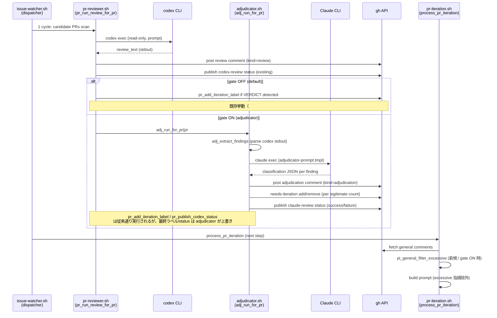

# Design Document

## Overview

**Purpose**: 本機能は idd-claude の PR Reviewer (`local-watcher/bin/modules/pr-reviewer.sh`) で
codex 由来のレビュー指摘を **Claude adjudicator** が「legitimate（実害）」と「excessive（過剰）」に
裁定し、(1) `needs-iteration` 反復を legitimate のみで駆動し、(2) merge ゲートを `codex-review`
（advisory）から `claude-review`（必須相当）へシフトする。codex の過剰指摘 / nitpick /
exec-failed が merge を永久 block する事象（ae-mdm ドッグフーディングで観測）を解消する。

**Users**: idd-claude を運用する `auto-dev` ワークフロー利用者。watcher cron / launchd の env で
新規 opt-in gate `PR_REVIEWER_ADJUDICATOR_ENABLED=true` を明示した repo のみで動作する。既定 OFF
で完全 no-op（NFR 1.1 / 2.1）。

**Impact**: 既存 `pr-reviewer.sh` の `pr_run_review_for_pr` フロー末尾（codex 実行 → コメント投稿 →
VERDICT 検出 → `needs-iteration` 付与 → `codex-review` status publish）の **直後**に Claude
adjudicator ステップを挿入する。ラベル付与・status publish の主体は **adjudicator 側に移譲**
（gate ON 時）するが、`codex-review` status と codex コメントは従来どおり publish して可視性を
維持する。新規モジュール `local-watcher/bin/modules/adjudicator.sh`（関数 prefix `adj_`）を導入。

### Goals

- codex 指摘を legitimate / excessive に分類する Claude adjudicator を opt-in で追加
- `needs-iteration` ラベルと `claude-review` commit status の付与/解消を adjudicator 判定に従わせる
- merge ゲートを `claude-review`（必須相当）にシフトできる土台を提供（consumer の branch
  protection 設定は別途運用判断）
- 既定 OFF で完全 no-op、未設定 / typo / 不正値は安全側（無効）に正規化
- adjudicator 裁定根拠の観測可能性（PR コメント + watcher ログ）を担保

### Non-Goals

- codex の rate-limit / exec-failed 修正（別 Issue）
- consumer repo の branch protection 自動切替（運用者判断 / Req 3.6）
- 設計 PR (`claude/issue-<N>-design-*`) への `claude-review` publish 経路追加（後述 Open Questions
  で別 Issue 起票案内）
- adjudicator 判定 100% 精度の達成（Req 6.3）
- 既存 codex VERDICT regex / コメント書式 / `codex-review` context 名の互換破壊

---

## Architecture

### Existing Architecture Analysis

`pr-reviewer.sh` (1381 行) は `process_pr_reviewer` → `pr_run_review_for_pr` の経路で
1 PR ごとに codex を実行し、結果を以下の順で確定する:

1. `pr_post_review_comment` — codex stdout を PR コメントに投稿（hidden marker `kind=review`）
2. `pr_detect_iteration_keyword` — `VERDICT: needs-iteration` を grep
3. `pr_add_iteration_label` — マッチ件数 > 0 で `needs-iteration` ラベル付与
4. `pr_publish_codex_status` — VERDICT 由来で `codex-review` commit status を success/failure 投稿

並行して `process_claude_review_status_catchup` が open PR を scan し、`docs/specs/<N>-*/review-notes.md`
を読んで `claude-review` status を publish する（#374 catch-up 経路）。これは impl 段階の独立
Reviewer サブエージェント由来であり、本 Issue の adjudicator とは **別経路** で並走する。

**尊重すべきドメイン境界**:
- `pr-reviewer.sh` (`pr_*`): codex 起動 / コメント投稿 / status publish
- `pr-iteration.sh` (`pi_*`): `needs-iteration` PR を Developer サブエージェントで反復
- impl 段階の独立 Reviewer サブエージェント (`review-notes.md` 生成): 本 Issue では触らない
- `process_claude_review_status_catchup`: impl PR の `claude-review` publish 経路（既存）

**維持すべき統合点**:
- 既存 env var (`PR_REVIEWER_PROMPT` / `PR_REVIEWER_ITERATION_PATTERN` / `PR_REVIEWER_GIT_TIMEOUT`
  等) の名前 / 既定値 / 意味
- 既存ラベル名 (`needs-iteration` / `ready-for-review` / `claude-failed`) と既存 status context
  (`codex-review` / `claude-review`)
- 既存の `pr_*` 関数群（無変更で再利用、adjudicator は wrapping ではなく chaining）

**解消・回避する technical debt**: なし（新規 opt-in モジュール追加）。

### Architecture Decision: adjudicator 統合方式

Issue Open Question で示された 2 案を以下の通り比較した:

| 観点 | 案 A: 独立 Reviewer 統合 | 案 B: 専用 adjudicator step（採用） |
|---|---|---|
| 統合先 | impl 段階の独立 Reviewer サブエージェント | `pr-reviewer.sh` と `pr-iteration.sh` の中間に新規 step |
| 起動契機 | impl 完了直後（PR 作成後のラベル遷移時） | 各 cron tick の `pr_run_review_for_pr` 末尾（codex 実行直後） |
| codex 指摘との結合 | review-notes.md に統合判定を書き込む | codex stdout を入力に専用 Claude 呼び出し、各指摘を分類 |
| 粒度 | PR 単位の verdict のみ | 各指摘単位の legitimate/excessive 分類 |
| 既存挙動への影響 | Reviewer の判断責任を膨張させる（codex 裁定が混入） | 新規 module で隔離、独立 Reviewer は無変更 |
| 観測可能性 | review-notes.md に統合（散在） | adjudicator 専用コメント + 専用ログで粒度高 |
| 失敗時の安全側 | Reviewer reject に codex 由来要因が混ざる | adjudicator 失敗 = 旧挙動（codex VERDICT そのまま）へ fallback 可能 |
| Req 2.4 / 2.5 (legitimate/excessive を iteration 入力で分別) | 不可（PR 単位 verdict のみ） | 可（指摘単位の分類を pr-iteration の入力フィルタへ渡せる） |

**採用案**: **案 B（専用 adjudicator step）**。理由:

1. Req 2.4 / 2.5「excessive と判定された指摘は iteration agent 入力から除外」は **指摘単位の
   分類粒度**を要求する。案 A の PR 単位 verdict ではこれを満たせない
2. 案 A は impl 段階の独立 Reviewer サブエージェントに codex 裁定責任を寄せるため、ドメイン
   境界が拡張され「Reviewer は AC 未カバー / missing test / boundary 逸脱の 3 カテゴリに限定」
   という既存規約（CLAUDE.md エージェント連携ルール）と整合しない
3. adjudicator 失敗時 / 未認証時に「codex VERDICT そのまま」への安全 fallback を持たせやすい
4. 観測ログを `adj_*` prefix で隔離でき、debug / 後追い監査が容易

trade-off として案 B は (i) 新規 Claude 呼び出し 1 回分の rate-limit / コスト消費、(ii)
adjudicator 自身の誤判定リスクを抱える。(i) は opt-in gate と `PR_REVIEWER_MAX_PRS` で抑制、
(ii) は Req 1.4「迷ったら legitimate」の保守的判定で緩和する。

### Architecture Pattern & Boundary Map

採用パターンは既存 per-processor module pattern（Modular Monolith / Pipes-and-Filters）の
**踏襲**。新規外部呼び出しは Claude CLI (`claude --output-format json`) 1 回のみ。



**配置根拠**:
- adjudicator 呼び出しは `pr_run_review_for_pr` 末尾（codex 結果が確定した直後）に hook する
- adjudicator の出力（excessive 指摘リスト）は次の `process_pr_iteration` が PR コメント走査で
  読み取り、iteration agent 入力からフィルタする（hidden marker `idd-claude:pr-adjudicator`
  経由で受け渡し、ファイル間状態を持たない）
- `claude-review` status の publish 経路は (a) 既存 catch-up 経路（impl PR の review-notes.md
  由来）と (b) 新規 adjudicator 経路（codex 裁定由来）の **2 系統が併存**。GitHub の commit
  status は latest-wins 仕様のため、最新 publish が勝つ。ae-mdm の impl PR シナリオでは
  adjudicator が catch-up より後に走る（adjudicator は cycle 内同 sha に 1 回、catch-up は
  cycle ごとに全 open PR）ため、両者の publish state が一致しない場合は **後発（adjudicator）
  が確定**する。これは Req 3.4「legitimate ゼロで success」要件と整合する

### Technology Stack

| Layer | Choice / Version | Role in Feature | Notes |
|-------|------------------|-----------------|-------|
| Frontend / CLI | bash 4+ | watcher 本体 / モジュール実装 | 既存と同じ |
| Backend / Services | Claude CLI (`claude`) | adjudicator 実行（`--output-format json`） | 既存 `claude` 利用と同じ呼び出しパターン |
| Backend / Services | GitHub CLI (`gh` 2.x) | コメント投稿 / ラベル付与 / status publish | 既存 `pr_*` 関数を再利用 |
| Data / Storage | hidden HTML marker | adjudicator 判定結果の PR 上保存 / pi 側 self-filter キー | `<!-- idd-claude:pr-adjudicator ... -->` |
| Messaging / Events | cron tick / flock 境界内の直列実行 | 既存 processor チェーンと同じ | 並列化なし |
| Infrastructure / Runtime | watcher host PATH 上に `claude` | 既存 Developer / Reviewer と同じ前提 | 追加インストール不要 |
| Tooling: jq | 1.6+ | Claude JSON 出力 / 指摘パース | 既存と同じ |
| Static Analysis | `shellcheck` / `bash -n` | NFR 2 退行禁止 | 既存 `.shellcheckrc` 踏襲 |

---

## File Structure Plan

### Directory Structure

```
local-watcher/bin/
├── issue-watcher.sh              # 編集: Config ブロックに adjudicator env 追記 + REQUIRED_MODULES 追記
├── adjudicator-prompt.tmpl       # 新規: adjudicator プロンプトテンプレ（install.sh が *.tmpl glob で配布）
└── modules/
    ├── pr-reviewer.sh            # 編集: pr_run_review_for_pr 末尾に adj_run_for_pr フックを 1 行追加
    ├── pr-iteration.sh           # 編集: pi_collect_general_comments に pi_general_filter_excessive を 1 段追加
    ├── adjudicator.sh            # 新規: Claude adjudicator 本体（prefix adj_）
    ├── core_utils.sh             # 編集: adj_log / adj_warn / adj_error の 3 関数を追加
    └── (他は不変)

local-watcher/test/
├── adj_resolve_gate_test.sh                  # 新規: opt-in gate 正規化検証
├── adj_extract_findings_test.sh              # 新規: codex 指摘 parse 検証
├── adj_classify_test.sh                      # 新規: stub claude で legitimate/excessive 分類検証
├── adj_publish_decision_test.sh              # 新規: ラベル付与/解消 + claude-review status publish 検証
├── adj_integration_no_op_test.sh             # 新規: gate OFF 時の no-op 完全等価性検証（NFR 1.1 / 2.1）
└── pi_general_filter_excessive_test.sh       # 新規: pr-iteration 側 self-filter 拡張検証

docs/specs/404-feat-pr-reviewer-codex-advisory-claude-a/
├── requirements.md               # PM 確定済み（変更なし）
├── design.md                     # 本ファイル
└── tasks.md                      # 同時生成

README.md                         # 編集: 「オプション機能一覧」表に 1 行 + 新規節「PR Reviewer Adjudicator (#404)」
```

### Modified Files（詳細）

- `local-watcher/bin/modules/adjudicator.sh`（**新規**） — 関数 prefix `adj_`、トップレベル副作用
  なし、`issue-watcher.sh` から `source` 前提。後述 Components 節
- `local-watcher/bin/adjudicator-prompt.tmpl`（**新規**） — Claude に渡す裁定指示テンプレ。`{PR}` /
  `{SHA}` / `{REVIEW_TEXT}` / `{SPEC_DIR}` プレースホルダ
- `local-watcher/bin/modules/pr-reviewer.sh`（**編集**） — `pr_run_review_for_pr` の末尾、
  `pr_publish_codex_status` 直後に `adj_run_for_pr "$pr_number" "$sha" "$review_text" "$pr_url" "$head_ref" || adj_warn ...` を **1 行**追加。既存ラベル付与・status publish ロジックは**残置**
  （gate OFF 時の完全 no-op 保証 / NFR 1.1）。gate ON 時は adjudicator が上書き publish する
- `local-watcher/bin/modules/pr-iteration.sh`（**編集**） — `pi_collect_general_comments` に
  新規フィルタ段 `pi_general_filter_excessive` を 1 段追加（gate ON 時のみ動作 / NFR 1.1）。
  既存 self / resolved / event_style フィルタの **間に挿入**（resolved の直後 / event_style の前）
- `local-watcher/bin/modules/core_utils.sh`（**編集**） — 既存 `pr_log` 等と同形式で `adj_log` /
  `adj_warn` / `adj_error` の 3 関数を末尾追記。他関数は変更しない
- `local-watcher/bin/issue-watcher.sh`（**編集**） — 2 箇所のみ:
  1. Config ブロックに新規 `# ─── PR Reviewer Adjudicator 設定 (#404) ───` 節を追加。env var
     9 種を `${VAR:-default}` 解決 + opt-in gate の安全側正規化（`case` で `true` 厳密一致
     以外を `false` 化）
  2. `REQUIRED_MODULES` 配列に `"adjudicator.sh"` を追加（`"pr-reviewer.sh"` の隣を推奨）
- `README.md`（**編集**） — 2 箇所:
  1. 「オプション機能一覧（opt-in、既定 OFF）」表に 1 行追加（`PR_REVIEWER_ADJUDICATOR_ENABLED` /
     関連 `#404`）
  2. 新規節「PR Reviewer Adjudicator (#404)」を `## PR Reviewer Processor (#261)` の **後**に
     挿入。env var 一覧 / 動作概要 / `claude-review` シフト手順 / トレードオフ（独立性希薄化・
     誤 bypass）/ Req 6.x のドキュメント要件を満たす
- `install.sh` — **無変更**（既存 `copy_glob_to_homebin "*.tmpl"` / `"*.sh"` glob で新規ファイル
  も自動配布される）
- `repo-template/**` — **対象外**（CLAUDE.md §4 の byte 一致同期対象は `.claude/{agents,rules}`
  のみ。本 Issue は `local-watcher/` の追加・変更のみで、`repo-template/` 側に同期対象なし）
- `.github/scripts/idd-claude-labels.sh` — **無変更**（既存ラベル `needs-iteration` / `ready-for-review`
  / `claude-failed` のみ使用、新規ラベル追加なし）

---

## Requirements Traceability

| Req | Summary | Components | Interfaces | Flows |
|---|---|---|---|---|
| 1.1 | 各指摘を legitimate/excessive に分類 | `adj_classify_findings` | claude JSON 出力 | A |
| 1.2 | AC 直結 / 後方互換破壊 / security 退行は legitimate | adjudicator-prompt.tmpl 指示 | prompt 本文 | A |
| 1.3 | AC 非紐付け / 重複 / 主観的は excessive 候補 | adjudicator-prompt.tmpl 指示 | prompt 本文 | A |
| 1.4 | 迷ったら legitimate（保守的判定） | adjudicator-prompt.tmpl 指示 + adj_parse_classification fallback | prompt 本文 / parse 失敗時 default | A |
| 1.5 | 全指摘に分類 + 根拠を 1:1 対応 | adjudicator-prompt.tmpl 出力契約 + `adj_validate_decisions` | JSON schema 検証 | A |
| 2.1 | legitimate ≥1 で needs-iteration 付与/維持 | `adj_apply_label_decision` | `gh pr edit --add-label` | B |
| 2.2 | legitimate ゼロかつ excessive のみで needs-iteration 解消 | `adj_apply_label_decision` | `gh pr edit --remove-label` | B |
| 2.3 | codex 失敗で needs-iteration 付与しない | `adj_run_for_pr` early return（review_text 空時 skip） | flow guard | B |
| 2.4 | iteration agent 入力から excessive を除外 | `pi_general_filter_excessive`（新規） | jq filter | C |
| 2.5 | iteration agent 入力に legitimate を含める | `pi_general_filter_excessive` keep 側 | jq filter | C |
| 2.6 | 既存 codex 出力契約を破壊しない | adjudicator は read-only chain（既存関数を呼ばない） | 非干渉 | A |
| 3.1 | codex-review status は従来どおり publish（advisory） | 既存 `pr_publish_codex_status` 残置 | 既存 | (既存) |
| 3.2 | adjudicator が claude-review を publish | `adj_publish_claude_status` | 既存 `pr_publish_claude_status` を再利用 | B |
| 3.3 | legitimate ゼロ → claude-review = success | `adj_apply_status_decision` | state="success" | B |
| 3.4 | legitimate ≥1 → claude-review = failure | `adj_apply_status_decision` | state="failure" | B |
| 3.5 | codex exec-failed でも legitimate ゼロなら success | adj_run_for_pr の空 review_text 処理 | flow branch | B |
| 3.6 | watcher は codex-review 必須化判定を持たない | 既存 `pr_publish_codex_status` のまま | 非干渉 | (既存) |
| 4.1 | 裁定根拠を PR コメント or ログで観測可能化 | `adj_post_decision_comment` + adj_log サマリ | hidden marker + log | D |
| 4.2 | 裁定サマリ 1 行以上を watcher ログに出力 | `adj_log_summary` | log | D |
| 4.3 | hidden marker key は pi self-filter で誤除外されない | `<!-- idd-claude:pr-adjudicator ... -->` を採用 | marker 設計 | D |
| 4.4 | ログ prefix / timestamp 書式を既存規約に整合 | `adj_log` / `adj_warn` / `adj_error`（core_utils 配置） | logger 関数 | D |
| 5.1 | opt-in gate（既定 OFF / 安全側正規化） | issue-watcher.sh Config + `adj_gate_enabled` | env case 正規化 | E |
| 5.2 | gate 無効時は本変更前と完全同一フロー | `adj_run_for_pr` 早期 return | flow guard | E |
| 5.3 | 既存 env var 名 / 既定値 / 意味を変更しない | adjudicator は新規 env のみ追加 | 非干渉 | E |
| 5.4 | 既存ラベル名 / context 名を変更しない | adj は既存 `LABEL_NEEDS_ITERATION` / `claude-review` を流用 | 非干渉 | E |
| 5.5 | 既存 exit code / ログ stderr/stdout 契約を変更しない | adj_* は `pr_*` と同形式 | logger 規約 | E |
| 5.6 | root と repo-template の byte 一致同期 | 本 Issue は対象ファイルなし（agents/rules 不変） | 非干渉 | (対象外) |
| 6.1 | 独立性希薄化リスクを README に明示 | README 新規節「PR Reviewer Adjudicator (#404)」 | docs | (docs) |
| 6.2 | 誤 bypass 緩和策（Req 1.4 / 4.1）をドキュメント参照 | 同上 README 節 | docs | (docs) |
| 6.3 | 100% 精度を目標としない旨を明示 | 同上 README 節 | docs | (docs) |
| NFR 1.1 | 観測ログ増加を既存 + 10 行以内に収める | `adj_run_for_pr` の log 行制限 | log 設計 | D |
| NFR 1.2 | adj コメント marker key は pi self-filter 非衝突 | Req 4.3 と同 | marker 設計 | D |
| NFR 2.1 | gate OFF 時の log diff ゼロ | `adj_run_for_pr` 早期 return（log 行ゼロ） | flow guard | E |
| NFR 2.2 | 既存テスト退行禁止 | 既存テスト無変更 + 新規テスト追加 | test 設計 | F |
| NFR 3.1 | 観測可能な近接テスト 4 種を追加 | local-watcher/test/adj_*_test.sh | test 設計 | F |

**Flow 番号凡例**:
- A: codex 指摘の adjudicator 分類
- B: legitimate / excessive 駆動のラベル + status 制御
- C: pr-iteration への excessive 除外フィルタ伝搬
- D: 観測可能性（PR コメント + watcher ログ）
- E: opt-in gate と後方互換
- F: テスト整備

---

## Components and Interfaces

### Module: `adjudicator.sh`（新規）

#### Component: PR Reviewer Adjudicator（モジュール全体）

| Field | Detail |
|---|---|
| Intent | codex stdout の各指摘を Claude が legitimate/excessive に分類し、needs-iteration ラベル + claude-review status の最終確定を行う |
| Requirements | 1.1〜1.5, 2.1〜2.3, 3.2〜3.5, 4.1〜4.4, 5.1〜5.5, 6.1〜6.3, NFR 1.1〜3.1 |

**Responsibilities & Constraints**

- 主責務: codex 指摘の分類 / needs-iteration 制御権の引き受け / claude-review status の publish
- ドメイン境界: codex 起動・コメント投稿は `pr_*` の領分のまま、adjudicator は **入力として
  codex stdout を受け取り**、出力として「ラベル状態」「status state」「pi 側 self-filter
  入力」を確定する
- データ所有権: hidden marker `<!-- idd-claude:pr-adjudicator sha=... -->` の本文（PR コメント）
- 不変条件: gate OFF 時は外部副作用ゼロ・log 行ゼロ（NFR 2.1）
- read-only invariant: adjudicator はワークツリーを変更しない（Claude プロンプトで明示 +
  実行後 `git status --porcelain` 確認、`pr_execute_review_command` と同方針 / Decision 8 流用）

**Dependencies**
- Inbound: `pr_run_review_for_pr`（codex 結果確定直後にフック） — Critical
- Outbound: Claude CLI (`claude --output-format json`) — Critical
- Outbound: `gh pr comment` / `gh pr edit --add-label` / `gh pr edit --remove-label` — Critical
- Outbound: `pr_publish_claude_status`（既存関数を流用） — Critical
- External: codex stdout の指摘形式（`[high|medium|low] <file>:<line> — <内容>`） — Important
  （contract 流用、独自 parse はしない）

**Contracts**: Service [x] / API [ ] / Event [ ] / Batch [ ] / State [x]（PR コメントの hidden marker）

##### Function Interfaces

```bash
# opt-in gate 評価（正規化済み env を読む）
# 戻り値: 0=ON / 1=OFF
adj_gate_enabled()

# codex stdout から指摘行を抽出して JSON 配列化
# 入力: $1=review_text
# 出力: stdout に [{"severity":"high|medium|low","file":"...","line":N,"message":"..."}, ...]
# 戻り値: 0 固定（指摘ゼロでも "[]" を返す）
adj_extract_findings()

# Claude adjudicator を 1 回呼び出し、各指摘に classification を付与
# 入力: $1=pr_number $2=sha $3=findings_json $4=spec_dir_hint
# 出力: stdout に [{"id":N,"verdict":"legitimate|excessive","reason":"..."}, ...]
# 戻り値: 0=ok / 1=claude exec 失敗 / 2=JSON parse 失敗 / 3=workspace-modified 検出
adj_classify_findings()

# 分類 JSON の妥当性を検証（全 finding に対応する verdict / reason が揃っているか）
# 入力: $1=findings_json $2=decisions_json
# 戻り値: 0=valid / 1=invalid（呼び出し元で fail-safe = 全件 legitimate に倒す / Req 1.4）
adj_validate_decisions()

# 裁定結果に基づき needs-iteration ラベルを add/remove
# 入力: $1=pr_number $2=legitimate_count
# 戻り値: 0=ok / 1=ラベル操作失敗
adj_apply_label_decision()

# 裁定結果に基づき claude-review commit status を publish（既存 pr_publish_claude_status を呼ぶ）
# 入力: $1=pr_number $2=sha $3=legitimate_count $4=pr_url
# 戻り値: pr_publish_claude_status の戻り値
adj_apply_status_decision()

# 裁定結果サマリを PR コメントに投稿（hidden marker kind=adjudication）
# 入力: $1=pr_number $2=sha $3=findings_json $4=decisions_json
# 戻り値: 0=ok / 1=投稿失敗
adj_post_decision_comment()

# 1 PR 分の adjudicator フローをオーケストレート
# 入力: $1=pr_number $2=sha $3=review_text $4=pr_url $5=head_ref
# 戻り値: 0=ok / 1=skip（gate OFF / review_text 空）/ 2=claude 失敗（fallback 適用）
adj_run_for_pr()
```

**Preconditions**:
- `adj_run_for_pr` は `pr_run_review_for_pr` 末尾で呼ばれ、cwd は REPO_DIR 且つ HEAD は head_ref
  に checkout 済み（codex 実行直後の状態。sub-shell 内のため adj 戻り時には BASE に復帰する想定
  だが、adj 自身は read-only / cwd 非依存で動作する）

**Postconditions**:
- gate ON 時: needs-iteration ラベル状態 + claude-review status state が adjudicator 判定に
  一致している
- gate OFF 時: 副作用ゼロ・log 行ゼロ

**Invariants**:
- adj_run_for_pr は失敗時も非ゼロ exit を上流に伝搬しない（呼び出し元は `|| adj_warn ...` で
  吸収するが、本関数自体も内部で fail-safe）

---

### Module: `pr-iteration.sh`（既存、追加関数 1 つ）

#### Component: `pi_general_filter_excessive`（新規）

| Field | Detail |
|---|---|
| Intent | adjudicator が excessive と判定した指摘を含む PR コメントを iteration agent 入力から除外する |
| Requirements | 2.4, 2.5, 4.3 |

**Responsibilities & Constraints**

- 主責務: gate ON 時のみ動作。adjudicator が投稿した `<!-- idd-claude:pr-adjudicator-excessive ... -->`
  marker を持つコメントを除外する
- gate OFF 時: jq pass-through（no-op）
- 既存 `pi_general_filter_self` / `pi_general_filter_resolved` / `pi_general_filter_event_style`
  と同形式（stdin: JSON 配列、stdout: フィルタ後 JSON 配列）

**Contracts**: Service [x]

##### Function Interface

```bash
# 入力: stdin に一般コメント JSON 配列
# 出力: stdout にフィルタ後 JSON 配列
# 副作用: なし（pi_general_filter_self と同形式）
pi_general_filter_excessive()
```

**注**: 本フィルタは既存 `pi_collect_general_comments` の filter chain に **`pi_general_filter_resolved`
の直後 / `pi_general_filter_event_style` の前**に挿入する。gate OFF 時は内部で jq pass-through
（`jq '.'`）するため、既存フィルタ件数の挙動は変化しない（NFR 1.1）。

---

### Module: `pr-reviewer.sh`（既存、変更最小）

#### Component: `pr_run_review_for_pr` への adjudicator hook

| Field | Detail |
|---|---|
| Intent | codex 実行確定直後に adjudicator を chain する（既存ロジックは無変更で残置） |
| Requirements | 2.6, 5.2, 5.5 |

**変更内容**: 既存 `pr_run_review_for_pr` の末尾（`pr_publish_codex_status` 行の直後）に以下 1 行
を追加する:

```bash
adj_run_for_pr "$pr_number" "$sha" "$review_text" "$pr_url" "$head_ref" || adj_warn "adj_run_for_pr 想定外の失敗 (pr=#${pr_number} sha=${sha})"
```

既存 `pr_add_iteration_label` / `pr_publish_codex_status` 呼び出しは**残置**（gate OFF 時の
完全 no-op 保証 / NFR 1.1）。gate ON 時は adjudicator が後発で同 (sha, context) に対して
publish を上書きする（GitHub の latest-wins 仕様で吸収）。ラベルも `gh pr edit` の冪等性で
吸収される（既付与の `--add-label` は no-op、未付与の `--remove-label` も no-op）。

---

## Data Models

### adjudicator-prompt.tmpl の入出力契約

**入力プレースホルダ**:
- `{PR}` — PR 番号
- `{SHA}` — head sha
- `{REVIEW_TEXT}` — codex stdout 全文（PR コメントに投稿された review 本文）
- `{SPEC_DIR}` — `docs/specs/<N>-<slug>/` パス（解決不能なら `(none)`）
- `{BASE}` / `{HEAD}` — base / head ref

**Claude 期待出力契約**（adjudicator-prompt.tmpl 末尾で明示）:

```json
{
  "decisions": [
    {
      "id": 1,
      "severity": "high|medium|low",
      "file": "path/to/file.ext",
      "line": 42,
      "verdict": "legitimate" | "excessive",
      "reason": "<日本語の自然言語、200 文字以内>"
    }
  ],
  "summary": {
    "total": <整数>,
    "legitimate": <整数>,
    "excessive": <整数>
  }
}
```

**parse 失敗時の fallback**: `adj_validate_decisions` が JSON schema 不整合 / 不足 / 不明 verdict
を検出した場合、**全 finding を legitimate に倒す**（Req 1.4「迷ったら legitimate」の徹底）。

### Hidden Marker 形式

| Marker | 用途 | self-filter 衝突 |
|---|---|---|
| `<!-- idd-claude:pr-adjudicator sha=<sha> kind=decision -->` | adjudicator 裁定サマリコメント（Req 4.1） | `pr-iteration` self-filter は `idd-claude:pr-iteration` prefix のみ除外（#400）のため衝突しない |
| `<!-- idd-claude:pr-adjudicator-excessive id=<N> sha=<sha> -->` | excessive と判定された指摘の PR コメント内マーカー（pi_general_filter_excessive がキーとして使う） | 同上 |

prefix `pr-adjudicator` は既存 `pr-reviewer` / `pr-iteration` のいずれとも前方一致しないため、
#400 で確立した「`idd-claude:pr-iteration` prefix 限定 self-filter」と非衝突（Req 4.3 / NFR 1.2）。

### env var 仕様

| env var | 既定値 | 役割 | 正規化 |
|---|---|---|---|
| `PR_REVIEWER_ADJUDICATOR_ENABLED` | `false` | opt-in gate（厳密 `=true` のみ ON） | `case` で `true` 以外を `false` に倒す |
| `PR_REVIEWER_ADJUDICATOR_MODEL` | `claude-sonnet-4-5` | adjudicator 呼び出しモデル | 既存 `TRIAGE_MODEL` 命名規約踏襲。空文字なら既定 |
| `PR_REVIEWER_ADJUDICATOR_EXEC_TIMEOUT` | `300` | claude 実行 timeout 秒 | 非数値は既定 |
| `PR_REVIEWER_ADJUDICATOR_PROMPT` | （空） | テンプレ override（空なら内蔵 default） | 空 = 内蔵 |
| `PR_REVIEWER_ADJUDICATOR_FALLBACK_ON_FAIL` | `legitimate` | claude 失敗時 fallback verdict | `legitimate` / `passthrough` の 2 値、それ以外は `legitimate` |
| `PR_REVIEWER_ADJUDICATOR_MAX_FINDINGS` | `50` | 1 PR あたり処理する指摘数上限（コスト抑制） | 非数値は既定 |

`PR_REVIEWER_ADJUDICATOR_FALLBACK_ON_FAIL` の意味:
- `legitimate`（既定）: claude 失敗時は全 finding を legitimate 扱い（needs-iteration を維持する
  安全側）
- `passthrough`: claude 失敗時は **adjudicator 自体を実行しなかった**かのように扱い、既存
  `pr_add_iteration_label` / `pr_publish_codex_status` の結果をそのまま残す（旧挙動への退避）

---

## Error Handling

### Error Strategy

adjudicator は **fail-safe で legitimate に倒す**戦略を取る。claude exec 失敗 / JSON parse 失敗 /
workspace 変更検出いずれの場合も、`PR_REVIEWER_ADJUDICATOR_FALLBACK_ON_FAIL` 設定に従って以下を選択:

1. `legitimate` 既定: 全 finding を legitimate と扱い、needs-iteration 維持 + claude-review = failure
2. `passthrough`: adjudicator の publish / label 操作を skip し、既存 `pr_*` の結果を温存

両モードとも adjudicator は **非ゼロ exit を上流に伝搬しない**（呼び出し元 `pr_run_review_for_pr`
は `|| adj_warn` で吸収）。

### Error Categories and Responses

- **claude exec 失敗 (rc != 0 / timeout)**: WARN ログ + fallback モード適用 + decision コメント
  投稿（`## 自動裁定エラー` 見出し + 原因 stderr 末尾 512B）
- **JSON parse 失敗**: WARN ログ + fallback モード適用 + decision コメント投稿（`## 自動裁定エラー`
  + `## 取得した raw 出力` 抜粋）
- **workspace 変更検出**: ERROR ログ + tracked 変更 `git checkout -- .` で破棄 + fallback モード適用
- **指摘ゼロ（findings = []）**: adjudicator skip（codex の VERDICT そのまま、status は既存
  `pr_publish_codex_status` の結果を温存）。これは Req 2.3「codex 失敗で needs-iteration 付与しない」
  と Req 3.5「codex exec-failed でも legitimate ゼロなら success」の両方を満たす経路
- **review_text 空（codex exec-failed）**: adjudicator は legitimate ゼロと判定し、`needs-iteration`
  を解消 + `claude-review = success` を publish（Req 3.5）
- **PR 番号 / sha の検証失敗**: 既存 `pr_publish_commit_status` の検証に委譲（NFR 1.3, 1.4 流用）

---

## Testing Strategy

### Unit Tests（近接配置: `local-watcher/test/adj_*_test.sh`）

1. `adj_resolve_gate_test.sh` — `adj_gate_enabled` の安全側正規化（`=true` 厳密 / `True` /
   `1` / 空 / unset / typo の各ケースで OFF=既定に倒れる / Req 5.1）
2. `adj_extract_findings_test.sh` — codex 形式 `[high|medium|low] <file>:<line> — <内容>` の parse
   と空 / 多重指摘 / 不正行混在の各ケース（Req 1.1）
3. `adj_classify_test.sh` — stub claude で legitimate-only / excessive-only / mixed / JSON
   parse 失敗の 4 ケースを検証。fallback モードが期待どおり選択されること（Req 1.4 / 1.5）
4. `adj_publish_decision_test.sh` — stub gh で `needs-iteration` add / remove + claude-review
   status publish の各 4 ケース（legit ≥1 / legit ゼロ / codex 失敗 / claude 失敗）が
   期待 state を産むこと（Req 2.1〜2.3 / 3.2〜3.5）
5. `adj_integration_no_op_test.sh` — gate OFF 時に `adj_run_for_pr` を呼んでも gh / claude が
   1 度も発火せず、log 行ゼロであること（NFR 2.1）
6. `pi_general_filter_excessive_test.sh` — gate ON 時の excessive marker 除外と gate OFF 時の
   pass-through（Req 2.4 / 2.5 / NFR 1.1）

### Integration Tests（手動スモーク）

1. ローカル scratch PR（dummy review_text 既知の指摘 3 件 / legitimate 1 + excessive 2）に
   対し watcher を `PR_REVIEWER_ADJUDICATOR_ENABLED=true` で実行し、`needs-iteration` 付与 +
   `claude-review = failure` + adjudication コメント投稿を確認
2. excessive only の dummy review_text で `needs-iteration` 解消 + `claude-review = success` を確認
3. codex exec-failed シナリオ（dummy で空 review_text）で `claude-review = success` 確認（Req 3.5）

### Compliance Tests（既存テストの退行禁止）

- `bash local-watcher/test/pr_publish_commit_status_test.sh` — 既存テスト退行ゼロ（NFR 2.2）
- `bash local-watcher/test/pr_publish_claude_status_from_branch_test.sh` — 同上
- `shellcheck local-watcher/bin/modules/*.sh install.sh setup.sh` — 警告ゼロ
- `diff -r .claude/agents repo-template/.claude/agents` / `diff -r .claude/rules
  repo-template/.claude/rules` — 差分ゼロ（本 Issue は agents/rules 不変だが回帰確認）

### E2E（dogfooding）

- 本 repo 自身に対し `PR_REVIEWER_ADJUDICATOR_ENABLED=true` 環境で 1 PR を流し、ae-mdm で
  観測された「過剰指摘で merge block」事象が解消されることを確認

---

## Security Considerations

### 未信頼入力の取り扱い（CLAUDE.md §5）

codex stdout は PR コメント由来であり、PR 本文 / Issue 本文と同じく **未信頼入力**として扱う。
adjudicator プロンプトに流す際は以下を守る:

1. **プロンプト注入のサニタイズ**: codex stdout を `{REVIEW_TEXT}` プレースホルダに埋め込む際、
   bash パラメータ展開 `${cmd_template//\{REVIEW_TEXT\}/$review_text}` で文字列置換するが、
   review_text 中の `\n` / `\t` 等は保持する（既存 `pr_substitute_placeholders` 流用）
2. **shell metacharacter 検査**: `pr_substitute_placeholders` と同様に PR 番号 / sha に対する
   metachar 検査を行う（review_text は claude プロンプト本文に渡るのみで shell コマンドに
   展開されないため、review_text 自体の metachar 検査は不要）
3. **jq 経由の安全な引数渡し**: hidden marker 抽出時は `--arg` でクエリパラメータを渡し、
   filter 文字列への inline 展開を禁止（既存 `pr_already_processed` 流用）
4. **bypassPermissions**: adjudicator は **`--permission-mode bypassPermissions` を使わない**
   （Read-only / `--output-format json` のみ）。codex / claude プロンプトインジェクションが
   bypassPermissions agent に伝搬するリスクを構造的に防ぐ
5. **`--` でオプション解釈打ち切り**: `gh` / `git` 引数で未信頼値（head_ref 等）を渡す箇所は
   既存 `pr_*` 関数を流用するため、流用元の hardening を継承する

### claude プロンプトの read-only 制約

adjudicator-prompt.tmpl 本文で以下を明示する:
- 「ファイルを編集しないこと（read-only）」
- 「Bash / Edit / Write ツールを使わないこと」
- 「JSON 出力以外を末尾に付けないこと」

実行後に `git status --porcelain` を確認し、変更があれば tracked 変更を破棄して
`workspace-modified` 扱いで fallback モード適用（既存 `pr_execute_review_command` Decision 8 流用）。

---

## Open Questions（人間判断待ち）

### Q1. 設計 PR ゲートの併発課題

requirements.md の Out of Scope / Open Questions で言及されたとおり、`claude/issue-<N>-design-*`
PR は `review-notes.md` を持たないため、`claude-review` 必須化すると設計 PR が永久 BLOCKED に
なる事象がある（ae-mdm で観測）。本 Issue では impl PR の adjudicator 化のみをスコープとし、
設計 PR ゲートは **別 Issue として切り出す**ことを推奨する。

別 Issue 化する場合の論点メモ（後続 Issue 起票者の参考）:

- **案 A**: 設計 PR にも `claude-review` 相当の status publish 経路を追加。Architect レビュー
  の代わりに「PM 確認・人間スポットチェック」相当の軽量 gate を `claude-review` context で publish
- **案 B**: 設計 PR は人間 admin merge として運用（ae-mdm の現行暫定）。watcher は
  `claude-review` publish を試みず、consumer 側 branch protection で `claude-review` を
  設計 PR に対して required から除外する設定運用

本 PR では当該課題に手を入れない（Out of Scope 明示）。

### Q2. adjudicator が判定する codex 指摘の重複圧縮

codex は同一観点の重複指摘を drip-feed することがある（#399 で確認済み）。adjudicator が
「重複した excessive」を 1 件にまとめるか、各重複を独立に excessive 判定するかは
adjudicator-prompt.tmpl の指示で確定する。本設計では **「重複は別 finding として excessive
判定」**を default とする（観測ログで重複の存在自体を可視化するため）。将来的に圧縮要件が
出れば prompt 改修で対応する。

### Q3. adjudicator コメント投稿の上限

adjudicator が cron tick ごとに毎 PR にコメントを投稿すると PR タイムラインが肥大化する。
既存 `pr_post_review_comment` と同様に `(sha, kind=adjudication)` 重複チェック
（`pr_already_processed` 流用）で sha 不変なら再投稿を抑止する。sha 更新で新規実行される
（既存 `pr-reviewer.sh` Req 6.3 と同じ semantics）。

---

## Supporting References

- 既存 PR Reviewer 設計: `docs/specs/261-feat-pr-codex-antigravity/design.md`
- `claude-review` catch-up 経路: `local-watcher/bin/modules/pr-reviewer.sh:1336-1380`
  （`process_claude_review_status_catchup`、#374 由来）
- PR Iteration self-filter 規約: `local-watcher/bin/modules/pr-iteration.sh:230-248`
  （`pi_general_filter_self`、#400 由来）
- codex 出力契約: `local-watcher/bin/modules/pr-reviewer.sh:312-364`（`pr_default_prompt`、
  `## 指摘事項` / `VERDICT: ...` 行の書式）
- README: `## PR Reviewer Processor (#261)` 節（本 Issue で同位置の新規節を追加）
