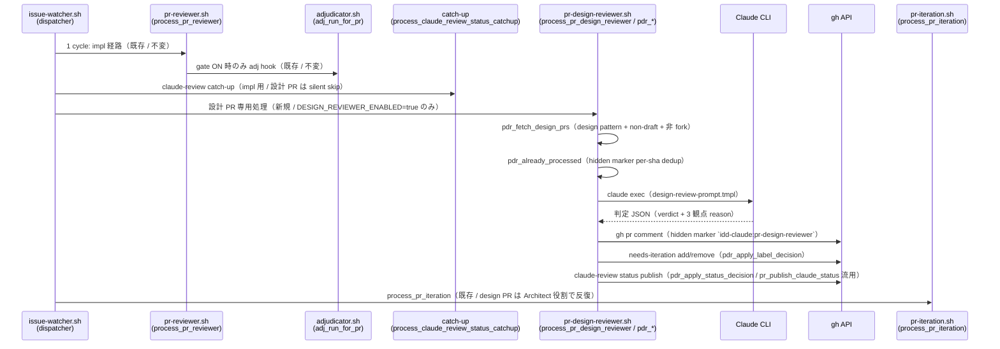

# Design Document

## Overview

**Purpose**: 本機能は idd-claude の設計 PR（`claude/issue-<N>-design-<slug>`）に対しても
`claude-review` commit status を publish する独立 Claude 設計レビュアを追加し、`claude-review`
を branch protection の必須 status check として要求する consumer repo で発生する「設計 PR が
永久 BLOCKED」事象を解消する。これは #404（impl PR の adjudicator）merge 後に残された設計 PR
側の対称課題（#404 design.md `## Open Questions Q1` で別 Issue 化が明示済み）への対応である。

**Users**: idd-claude watcher 運用者（特に `claude-review` を必須 status check 化している
consumer repo、ae-mdm 含む）。watcher cron / launchd の env で新規 opt-in gate
`DESIGN_REVIEWER_ENABLED=true` を明示した repo のみで動作する。既定 OFF（NFR 1.1, 2.1, 2.2 /
Req 6.1, 6.2）で完全 no-op。

**Impact**: 既存 PR Reviewer 経路（`pr-reviewer.sh` の codex / adjudicator + impl 用
`process_claude_review_status_catchup`）と **完全に独立した処理経路**として新規モジュール
`local-watcher/bin/modules/pr-design-reviewer.sh`（関数 prefix `pdr_`）を導入する。impl PR 用
Reviewer / #404 adjudicator のコード・env var・ラベル運用・status publish 経路には一切
触らない（Req 7.1〜7.4）。設計 PR を独立 context で評価する Claude エージェント定義
`.claude/agents/design-reviewer.md` を root と `repo-template/` の両系統に byte 一致で配置する
（Req 5.6 / CLAUDE.md §4）。

> **分量バジェット超過の根拠（design-principles.md §「分量バジェット」）**: 本 design は約
> 830 行で「複雑 ≤600 行」の目安をやや超過する。理由: (1) `claude-review` publisher contention
> の解析が #404 既存実装（catch-up / adjudicator）との相互作用を網羅する必要があり、設計 PR
> での silent-skip 経路の根拠を spec 化する分量が増えた、(2) 独立コンポーネント要件
> （Req 7.1〜7.4）を担保する独立 agent 定義（`design-reviewer.md`）の出力契約 / 禁止節を
> impl 用 `reviewer.md` と差別化して明文化する必要があった、(3) Traceability マトリクスに
> 40 AC を 1 行ずつ展開している。1000 行未満であり複数 spec への split は不要。

### Goals

- 設計 PR (`claude/issue-<N>-design-<slug>`) に対する独立 Claude 設計レビュアの追加
- 判定軸を **AC カバレッジ / design⇄tasks 整合 / traceability** の 3 観点に限定（Req 2.1）
- `claude-review` commit status を `success` / `failure` で publish し、人間の
  `awaiting-design-review` ラベルゲートと OR 条件で merge 経路を成立させる（Req 3.1, 3.2, 3.5）
- reject 時は `needs-iteration` を付与し、既存 PR Iteration Processor（design 用、#112 以降
  デフォルト有効）が Architect 役割で反復改稿する経路に接続（Req 4.1〜4.4）
- opt-in gate（既定 OFF / Req 6.1〜6.5）と #404 adjudicator・impl 用 Reviewer への副作用ゼロ
  （Req 7.1〜7.4 / NFR 2.1）

### Non-Goals

- impl PR 用 Reviewer（`.claude/agents/reviewer.md`）の変更
- #404 adjudicator（`adjudicator.sh` / `PR_REVIEWER_ADJUDICATOR_*` env / impl 用 `claude-review`
  publish 経路）の変更
- codex advisory レビューの設計 PR への適用
- 人間 `awaiting-design-review` ラベルゲートの自動化・置換（OR 条件で併存維持）
- consumer repo branch protection 設定（`claude-review` 必須化等）の自動化
- 設計 Reviewer の判定精度 100% 達成（LLM 判定の本質的限界を受容、保守的判定で false-reject 抑制）
- impl PR / 非 idd-claude PR への本機能適用

---

## Architecture

### Existing Architecture Analysis

watcher の PR 系処理は cron tick の 1 サイクル内で以下の順に直列実行される（`issue-watcher.sh`
:1848-1869 / flock 排他下）:

1. `process_pr_reviewer`（`pr-reviewer.sh` / codex 実行 + adjudicator + `codex-review` /
   `claude-review` publish。head pattern 既定 `^claude/`、両 kind を 1 経路で扱う）
2. `process_claude_review_status_catchup`（`pr-reviewer.sh` / impl 用 `review-notes.md` を読み
   `claude-review` を catch-up publish。#374 由来。AND 二重 opt-in
   `PR_REVIEWER_STATUS_CHECK_ENABLED=true` + `FULL_AUTO_ENABLED=true`）
3. `process_security_review`（`security-review.sh` / `/security-review` Skill）
4. `process_pr_iteration`（`pr-iteration.sh` / `needs-iteration` PR を Developer / Architect で反復）

設計 PR の判別は既存 `pi_classify_pr_kind`（`pr-iteration.sh:626-656`）が確立しており、
`PR_ITERATION_DESIGN_HEAD_PATTERN`（既定 `^claude/issue-[0-9]+-design-`）と
`PR_ITERATION_HEAD_PATTERN`（既定 `^claude/issue-[0-9]+-impl-`）の 2 ERE pattern で
`design` / `impl` / `ambiguous` / `none` を返す。

**尊重すべきドメイン境界**:
- `pr-reviewer.sh` (`pr_*`): codex / adjudicator 経路（impl PR が主対象、本 Issue で触らない）
- `adjudicator.sh` (`adj_*`): #404 で導入された codex 指摘の Claude 裁定経路（本 Issue で触らない）
- `pr-iteration.sh` (`pi_*`): `needs-iteration` PR の Architect / Developer 反復経路（既存
  PR_ITERATION_DESIGN_ENABLED 経路を流用する。本 Issue で触らない）
- 新規 `pr-design-reviewer.sh` (`pdr_*`): 本 Issue で追加。設計 PR 専用の独立処理経路

**維持すべき統合点**:
- 既存 env var（`PR_REVIEWER_*` / `PR_REVIEWER_ADJUDICATOR_*` / `PR_ITERATION_DESIGN_*` /
  `AUTO_MERGE_DESIGN_*` / `DESIGN_REVIEW_RELEASE_*` / `LABEL_AWAITING_DESIGN` 等）の名前・既定値・
  意味（Req 6.3）
- 既存ラベル名（`needs-iteration` / `awaiting-design-review` / `ready-for-review` /
  `claude-failed` 等）と既存 status context（`codex-review` / `claude-review`）の名前・意味
  （Req 6.4）
- 既存の exit code 意味・ログ出力先（stderr / stdout 分離契約）・cron 登録文字列（Req 6.5）
- 既存 `pr_publish_commit_status` / `pr_publish_claude_status` を再利用（context 名統一 /
  Req 3.4）

**解消・回避する technical debt**: 設計 PR 永久 BLOCKED 問題（admin-bypass merge への恒常的
依存）を解消する。新規 module 追加のみで既存 module の責務分離を維持する。

### Architecture Decision: 独立コンポーネントとしての配置

人間確定済み Q2「設計 PR 専用の独立 Reviewer / 独立 agent prompt として追加し、既存の impl
PR 用 adjudicator（#404）には触らない」に基づき、以下 2 案を比較した:

| 観点 | 案 A: `pr-reviewer.sh` 拡張で design kind を分岐 | 案 B: 新規 module `pr-design-reviewer.sh`（採用） |
|---|---|---|
| Req 7.1〜7.4 独立性 | impl と design の判定パスが同 module 内で交錯（テスト隔離が困難） | 完全独立（impl 経路無変更を構造的に保証） |
| #404 adjudicator との非干渉 | 同 module 内に複数 gate / 複数 publish 経路が並存（誤発火リスク） | 別 module（dispatcher 配線のみ追加） |
| CLAUDE.md §1「配置ガイドライン」整合 | 既存 module 肥大化（pr-reviewer.sh は既に 1900 行超） | 「新しい processor は modules/<name>.sh に新規ファイル」に整合 |
| dispatcher 配線変更点数 | 0（pr_run_review_for_pr の内部分岐追加） | 1（`process_pr_design_reviewer` の call site 1 行） |
| 観測ログ隔離 | `pr_*` / `pdr_*` 混在 | `pdr_*` 専用 prefix で grep 容易 |
| opt-in gate 衝突 | `PR_REVIEWER_ENABLED` と新 gate の AND/OR で複雑化 | 完全独立 gate（既存 env 不変） |

**採用案**: **案 B（新規 module `pr-design-reviewer.sh`）**。理由:

1. Req 7.1〜7.4 が「impl PR 用 Reviewer / #404 adjudicator から独立」を明示しており、案 A の
   同 module 内分岐では「触らない」を保証しづらい
2. CLAUDE.md §1 配置ガイドラインの「新しい processor / まとまった機能は
   `local-watcher/bin/modules/<name>.sh` に新規ファイルとして足す」原則に整合
3. dispatcher の call site は 1 行追加（`process_pr_design_reviewer || pdr_warn ...`）で済み、
   impl 経路の既存 call site（`process_pr_reviewer` / `process_claude_review_status_catchup`）
   は無変更

trade-off として案 B は (i) module 数 1 追加によるロード時間微増（実測無視可）、(ii)
`pr_publish_claude_status` / `pr_fetch_candidate_prs` 相当の helper の重複実装回避のため
**既存 `pr_*` helper を read-only 流用**（同一 source プロセスに load 済みのため呼び出し可能）。
重複ロジックは作らない。

### Architecture Decision: `claude-review` publisher contention（impl との衝突回避）

`claude-review` commit status の publisher は本機能導入後に以下の系統が並存する:

- **impl 系**: `process_claude_review_status_catchup`（catch-up 経路、#374 / #349） +
  `adjudicator.sh adj_apply_status_decision`（#404 + suppression hook）
- **design 系（本 Issue 新規）**: `pdr_apply_status_decision`

#### 衝突の有無

- catch-up 経路は **`head_ref` から issue 番号を抽出後、`origin/${head_ref}` の
  `docs/specs/<N>-*/review-notes.md` を読む**（`pr-reviewer.sh:1307-1340`）。`review-notes.md`
  は impl PR の Reviewer サブエージェント成果物であり、**設計 PR の head には存在しない**
  （Architect は generate しない）。したがって catch-up は設計 PR では silent skip（WARN +
  return 0 / `:1338`）となり、設計 PR の `claude-review` を書き換えない
- #404 adjudicator は `pr_fetch_candidate_prs` 経由で候補 PR を取得し、その中で
  `pr_run_review_for_pr` を実行する。`pr_fetch_candidate_prs` の head pattern は
  `PR_REVIEWER_HEAD_PATTERN`（既定 `^claude/`）であり、設計 PR も候補に含まれる **可能性**が
  ある。ただし #404 adjudicator は codex stdout を入力とし、設計 PR では codex の指摘が
  AC 紐付けでないため adjudicator が `excessive`/`legitimate` 判定で legitimate を出すかは
  状況依存。本 Issue では **設計 PR を `process_pr_reviewer` の対象から除外する設計判断は
  取らない**（Req 7.3「#404 adjudicator のコード・env var・ラベル運用に変更を加えない」と
  整合）

#### 採用方針: design 系を後発実行 + 同一 context への latest-wins を許容

設計 PR の `claude-review` 確定権は **本機能の `pdr_apply_status_decision`** が握る。
dispatcher 配線で `process_pr_design_reviewer` を **`process_pr_reviewer`(adjudicator 経路を
含む) と `process_claude_review_status_catchup` の後**に実行することで、同一サイクル内では
design 系が latest publisher になる。impl 系経路は設計 PR では catch-up が silent skip、
adjudicator は `PR_REVIEWER_ENABLED=true` の運用でのみ動くため、設計 PR 専用の opt-in gate
`DESIGN_REVIEWER_ENABLED=true` のみが ON な運用では design 系のみが publish する純粋構造に
なる。

サイクル間（次 tick）の冪等性は per-sha dedup（hidden marker `<!-- idd-claude:pr-design-reviewer
sha=<sha> -->`）で担保（Req 1.4）。sha 不変なら再起動しない。

### Architecture Decision: 設計 Reviewer の起動契機

requirements.md の未確定事項 (c) で 3 案が示されていた:

| 案 | 起動契機 | 採否 |
|---|---|---|
| (a) | 設計 PR が open / non-draft になった時点で即起動 | **採用** |
| (b) | `awaiting-design-review` ラベル付与契機で起動 | 不採用 |
| (c) | Architect commit push 契機で起動 | 不採用 |

**採用案**: **(a) open / non-draft で即起動**。理由:

1. Req 1.1 が「open かつ non-draft の設計 PR」を起動条件として明示
2. ラベル `awaiting-design-review` は設計 PR `merge` 後に Issue 側へ付与される運用シグナル
   （`issue-watcher.sh:1591-1716` の Design Review Release Processor）。**PR 側には付与されない**
   ため (b) は不適合（誤読を招く）
3. Architect commit push 検知は GitHub Actions / webhook 経路が前提となり cron polling 構造を
   崩す（本機能は cron tick 内処理の原則を維持）

per-sha 冪等性は hidden marker で担保するため、open 状態が継続している間に毎 tick 再判定
しても外部副作用は起きない（Req 1.4）。

### Architecture Pattern & Boundary Map

採用パターンは既存 per-processor module pattern（Modular Monolith / Pipes-and-Filters）の
**踏襲**。新規外部呼び出しは Claude CLI (`claude --output-format json` または text mode、
adjudicator と同方針) 1 回のみ。



**配置根拠**:
- `process_pr_design_reviewer` は dispatcher の `process_claude_review_status_catchup` 直後に
  call site を追加する（impl 経路の処理が一巡してから design 経路に入ることで、設計 PR が
  万一 impl 経路から `claude-review` を書かれても本 processor が後発で確定する）
- 既存 `pr_publish_claude_status`（`pr-reviewer.sh:1240-1264`）を流用し、context 名
  `claude-review` を統一する（Req 3.4）。流用は read-only で `pr-reviewer.sh` を変更しない
- per-sha dedup は hidden marker（adjudicator と同じ手法）。`pi_general_filter_self` の
  self-filter 規約（#400 / `idd-claude:pr-iteration` prefix のみ）と非衝突 prefix を採用
  （NFR 1.2）

### Technology Stack

| Layer | Choice / Version | Role in Feature | Notes |
|-------|------------------|-----------------|-------|
| Frontend / CLI | bash 4+ | watcher 本体 / モジュール実装 | 既存と同じ |
| Backend / Services | Claude CLI (`claude`) | 設計 Reviewer 実行（`--output-format json` または text） | adjudicator と同じ呼び出しパターン |
| Backend / Services | GitHub CLI (`gh` 2.x) | PR コメント投稿 / ラベル付与 / status publish | 既存 `pr_publish_claude_status` 等を read-only 流用 |
| Data / Storage | hidden HTML marker | 判定結果の PR 上保存 / per-sha dedup キー | `<!-- idd-claude:pr-design-reviewer sha=<sha> kind=decision -->` |
| Messaging / Events | cron tick / flock 境界内の直列実行 | 既存 processor チェーンと同じ | 並列化なし |
| Infrastructure / Runtime | watcher host PATH 上に `claude` | 既存 Developer / Reviewer / adjudicator と同じ前提 | 追加インストール不要 |
| Tooling: jq | 1.6+ | 候補 PR fetch / JSON parse | 既存と同じ |
| Static Analysis | `shellcheck` / `bash -n` | Req 6.x 退行禁止 | 既存 `.shellcheckrc` 踏襲 |
| Agent prompt template | bash heredoc + `*.tmpl` | `.claude/agents/design-reviewer.md` + `design-review-prompt.tmpl` | 既存 `iteration-prompt-design.tmpl` / `adjudicator-prompt.tmpl` と同形式 |

---

## File Structure Plan

### Directory Structure

```
local-watcher/bin/
├── issue-watcher.sh                # 編集: Config に DESIGN_REVIEWER_* 7 env 追記
│                                   #       + REQUIRED_MODULES に pr-design-reviewer.sh 追記
│                                   #       + dispatcher に process_pr_design_reviewer call site 1 行
├── design-review-prompt.tmpl       # 新規: 設計 Reviewer プロンプト template
│                                   #       （install.sh の既存 *.tmpl glob で配布）
└── modules/
    ├── pr-design-reviewer.sh       # 新規: 設計 PR 専用 Reviewer 本体（prefix pdr_）
    ├── core_utils.sh               # 編集: pdr_log / pdr_warn / pdr_error の 3 関数を末尾追記
    ├── pr-reviewer.sh              # 無変更（read-only 流用のみ / Req 7.2）
    ├── adjudicator.sh              # 無変更（read-only 流用なし / Req 7.3）
    └── pr-iteration.sh             # 無変更（既存 design 反復経路を流用 / Req 4.3）

local-watcher/test/
├── pdr_resolve_gate_test.sh             # 新規: opt-in gate 正規化検証
├── pdr_classify_design_pr_test.sh       # 新規: head pattern マッチング検証
├── pdr_already_processed_test.sh        # 新規: hidden marker per-sha dedup 検証
├── pdr_parse_verdict_test.sh            # 新規: Claude 出力 parse（approve/reject 抽出）
├── pdr_apply_decision_test.sh           # 新規: ラベル + status publish 反映（stub gh）
└── pdr_no_op_test.sh                    # 新規: gate OFF 完全等価性検証（NFR 1.1 / 2.1）

.claude/agents/
└── design-reviewer.md              # 新規: 設計 Reviewer エージェント定義（独立判定軸）

repo-template/.claude/agents/
└── design-reviewer.md              # 新規: 上記の byte 一致コピー（Req 6.6 / CLAUDE.md §4）

docs/specs/407-feat-pr-reviewer-pr-claude-review-claude/
├── requirements.md                 # PM 確定済み（変更なし）
├── design.md                       # 本ファイル
└── tasks.md                        # 同時生成

README.md                           # 編集: 「オプション機能一覧」表に 1 行
                                    #       + 新規節「Design PR Reviewer (#407)」
```

### Modified Files（詳細）

- `local-watcher/bin/modules/pr-design-reviewer.sh`（**新規**） — 関数 prefix `pdr_`、
  トップレベル副作用なし、`issue-watcher.sh` から `source` 前提。後述 Components 節
- `local-watcher/bin/design-review-prompt.tmpl`（**新規**） — Claude に渡す判定指示テンプレ。
  プレースホルダ: `{PR}` / `{SHA}` / `{BASE}` / `{HEAD}` / `{ISSUE_NUMBER}` / `{SPEC_DIR}` /
  `{REQUIREMENTS_MD}` / `{DESIGN_MD}` / `{TASKS_MD}`。判定軸 3 観点限定（Req 2.1）、保守的判定
  指示（Req 2.4）、read-only 制約（Bash / Edit / Write 不使用）を明記
- `local-watcher/bin/modules/core_utils.sh`（**編集**） — 既存 `adj_log` / `adj_warn` /
  `adj_error` と同形式で `pdr_log` / `pdr_warn` / `pdr_error` を末尾追記。他関数は変更しない
- `local-watcher/bin/issue-watcher.sh`（**編集**） — 3 箇所のみ:
  1. Config ブロックに新規 `# ─── Design PR Reviewer 設定 (#407) ───` 節を追加。env var
     7 種を `${VAR:-default}` 解決 + opt-in gate の安全側正規化（`case` で `true` 厳密一致
     以外を `false` 化、`AUTO_REBASE_MODE`/`PR_REVIEWER_ADJUDICATOR_ENABLED` 既存規範踏襲）
  2. `REQUIRED_MODULES` 配列に `"pr-design-reviewer.sh"` を追加（`"adjudicator.sh"` の隣を推奨）
  3. dispatcher の `process_claude_review_status_catchup` call site 直後（line 1859 相当の
     **直後**）に `process_pr_design_reviewer || pdr_warn "process_pr_design_reviewer が想定外
     のエラーで終了しました（後続 Issue 処理は継続）"` を 1 行追加（後続 `process_security_review`
     や `process_pr_iteration` への副作用なし）
- `.claude/agents/design-reviewer.md`（**新規**） — frontmatter (`name: design-reviewer` /
  `description: ...` / `tools: Read, Grep, Glob, Bash, Write`) + 本文（判定基準 3 観点 /
  出力契約 / 装飾禁止規律 / read-only 規約）。impl 用 reviewer.md と **判定軸を共有しない
  独立定義**（Req 7.1）
- `repo-template/.claude/agents/design-reviewer.md`（**新規**） — 上記の byte 一致コピー
  （`diff -r .claude/agents repo-template/.claude/agents` が差分ゼロを担保 / Req 6.6 /
  CLAUDE.md §4 鉄則）
- `README.md`（**編集**） — 2 箇所:
  1. 「オプション機能一覧（opt-in、既定 OFF）」表に 1 行追加（`DESIGN_REVIEWER_ENABLED` /
     関連 `#407`）
  2. 新規節「Design PR Reviewer (#407)」を `## PR Reviewer Adjudicator (#404)` の **後**に
     挿入。env var 一覧 / 動作概要 / `claude-review` OR 条件 merge 経路の consumer 手順 /
     `awaiting-design-review` 人間ラベルとの併存説明 / トレードオフ / Req 6.x のドキュメント
     要件を満たす
- `install.sh` — **無変更**（既存 `copy_glob_to_homebin "*.tmpl"` / `"*.sh"` glob で新規
  template / module が自動配布される）
- `.github/scripts/idd-claude-labels.sh` — **無変更**（既存ラベル `needs-iteration` /
  `awaiting-design-review` / `claude-failed` のみ使用、新規ラベル追加なし）
- root `.claude/rules/*.md` / `repo-template/.claude/rules/*.md` — **無変更**（agents 同期は
  必要、rules への追加なし）

---

## Requirements Traceability

| Req | Summary | Components | Interfaces | Flows |
|---|---|---|---|---|
| 1.1 | open + non-draft 設計 PR で起動 | `process_pr_design_reviewer` + `pdr_fetch_design_prs` | gh pr list + jq filter | A |
| 1.2 | requirements/design/tasks を独立 context で読む | `design-reviewer.md` agent + `design-review-prompt.tmpl` | Read tool（cwd は head checkout） | A |
| 1.3 | impl PR / 非対応 head は除外 | `pdr_classify_design_pr` + `pdr_fetch_design_prs` の head pattern | ERE: `^claude/issue-[0-9]+-design-` | A |
| 1.4 | 同一 sha への重複起動回避 | `pdr_already_processed`（hidden marker per-sha dedup） | jq `--arg sha` で marker scan | A |
| 1.5 | 判定のみ（spec 書き換えない） | `design-reviewer.md` agent の禁止節 + `pdr_run_review_for_pr` の read-only invariant 検査 | git status --porcelain | A |
| 2.1 | 判定軸を 3 観点に限定 | `design-review-prompt.tmpl` 指示本文 | prompt 本文 | B |
| 2.2 | 3 観点いずれか違反で reject | `pdr_parse_verdict`（verdict=`reject` 検出） | JSON / text parse | B |
| 2.3 | 違反なしで approve | `pdr_parse_verdict`（verdict=`approve` 検出） | JSON / text parse | B |
| 2.4 | 判定に確信なければ approve（保守的） | `design-review-prompt.tmpl` 指示 + `pdr_parse_verdict` の fallback | prompt 本文 / parse 失敗時 default | B |
| 2.5 | verdict と各観点根拠を 1:1 で出力 | `design-review-prompt.tmpl` 出力契約 + `pdr_validate_verdict` | JSON schema / セクション検証 | B |
| 2.6 | スタイル違反 / typo 等は reject 理由にしない | `design-review-prompt.tmpl` 指示 + `design-reviewer.md` 禁止節 | prompt 本文 | B |
| 3.1 | approve で claude-review=success publish | `pdr_apply_status_decision`（既存 `pr_publish_claude_status` 流用） | state="success" | C |
| 3.2 | reject で claude-review=failure publish | `pdr_apply_status_decision` | state="failure" | C |
| 3.3 | exec-failed / timeout で pending 据え置き | `pdr_run_review_for_pr` の早期 return（publish 呼ばない） | flow guard | C |
| 3.4 | context 名を `claude-review` に統一 | `pdr_apply_status_decision`（既存 `pr_publish_claude_status` 流用） | 既存 context 名 | C |
| 3.5 | OR 条件で `awaiting-design-review` と併存 | `pdr_apply_status_decision`（status のみ操作、ラベル `awaiting-design-review` には触れない） | 非干渉 | C |
| 4.1 | reject で needs-iteration 付与 | `pdr_apply_label_decision`（gh pr edit --add-label） | gh API | D |
| 4.2 | approve で needs-iteration 解消 | `pdr_apply_label_decision`（gh pr edit --remove-label / 冪等） | gh API | D |
| 4.3 | needs-iteration が PR Iteration Processor を駆動 | 既存 `process_pr_iteration` / `pi_classify_pr_kind=design` 経路 | 既存（無変更） | D |
| 4.4 | 既存 design iteration 経路の挙動を変えない | dispatcher 配線で本 processor を `process_pr_iteration` の **前**に置く | 非干渉 | D |
| 5.1 | 判定結果を PR コメント or ログで観測可能 | `pdr_post_decision_comment` + `pdr_log_summary` | hidden marker + log | E |
| 5.2 | 判定サマリ 1 行以上を watcher ログに出力 | `pdr_log_summary` | log | E |
| 5.3 | hidden marker が PI self-filter で誤除外されない | marker key `idd-claude:pr-design-reviewer`（`pr-iteration` prefix と非衝突 / #400 規約） | marker 設計 | E |
| 5.4 | ログ prefix / timestamp 書式を既存規約に整合 | `pdr_log` / `pdr_warn` / `pdr_error`（core_utils 配置） | logger 関数 | E |
| 6.1 | opt-in gate（既定 OFF / 安全側正規化） | issue-watcher.sh Config + `pdr_gate_enabled` | env case 正規化 | F |
| 6.2 | gate 無効時は導入前と完全同一フロー | `process_pr_design_reviewer` 早期 return | flow guard | F |
| 6.3 | 既存 env var 名 / 既定値 / 意味を変更しない | 新規 env のみ追加（`DESIGN_REVIEWER_*`） | 非干渉 | F |
| 6.4 | 既存ラベル名 / context 名を変更しない | 本 processor は既存 `LABEL_NEEDS_ITERATION` / `claude-review` を流用 | 非干渉 | F |
| 6.5 | 既存 exit code / cron 文字列を変更しない | dispatcher 配線 1 行追加のみ、戻り値 0 固定（先行例 `process_pr_reviewer` 同形式） | logger 規約 | F |
| 6.6 | root と repo-template の byte 一致同期 | `.claude/agents/design-reviewer.md` を両系統に同一内容で配置 | `diff -r` 空 | F |
| 7.1 | impl PR Reviewer 定義と独立 agent file | 新規 `design-reviewer.md`（impl 用 `reviewer.md` 不変） | 別ファイル | G |
| 7.2 | impl 用 `claude-review` publish 経路と独立処理経路 | 新規 `process_pr_design_reviewer`（`process_pr_reviewer` / catch-up 不変） | 別 call site | G |
| 7.3 | #404 adjudicator のコード・env・ラベル不変 | `adjudicator.sh` / `PR_REVIEWER_ADJUDICATOR_*` 全て不変 | 非干渉 | G |
| 7.4 | impl + design 同時 open 時、impl 経路に介入しない | `pdr_fetch_design_prs` の head pattern を design に厳格化 | head pattern 厳格化 | G |
| NFR 1.1 | 観測ログ増加を + 10 行以内に収める | `pdr_run_review_for_pr` の log 行制限（gate OFF=0 行 / ON=サマリ 1 行 + 判定 1 行） | log 設計 | E |
| NFR 1.2 | hidden marker key は PI self-filter 非衝突 | Req 5.3 と同 | marker 設計 | E |
| NFR 2.1 | gate OFF 時の log diff ゼロ | `process_pr_design_reviewer` 早期 return（log 行ゼロ） | flow guard | F |
| NFR 2.2 | 既存テスト退行禁止 | 既存テスト無変更 + 新規テスト追加 | test 設計 | H |
| NFR 3.1 | 観測可能な近接テスト 5 ケースを追加 | local-watcher/test/pdr_*_test.sh | test 設計 | H |
| NFR 4.1 | 判定時間 5 分以内 + env override 可能 | `DESIGN_REVIEWER_EXEC_TIMEOUT` 既定 300（adjudicator と同等オーダー） | timeout コマンド | C |

**Flow 番号凡例**:
- A: 起動契機 / 候補 PR 検出 / 重複排除
- B: 判定軸 3 観点（AC カバレッジ / design⇄tasks / traceability）
- C: `claude-review` status publish
- D: `needs-iteration` ラベル + 反復経路接続
- E: 観測可能性（PR コメント + watcher ログ）
- F: opt-in gate と後方互換
- G: 独立コンポーネントとしての分離
- H: テスト整備

---

## Components and Interfaces

### Module: `pr-design-reviewer.sh`（新規）

#### Component: Design PR Reviewer Processor（モジュール全体）

| Field | Detail |
|---|---|
| Intent | 設計 PR の `requirements.md` / `design.md` / `tasks.md` を独立 Claude context で評価し、3 観点（AC カバレッジ / design⇄tasks / traceability）の判定結果に基づき `claude-review` status と `needs-iteration` ラベルを確定する |
| Requirements | 1.1〜1.5, 2.1〜2.6, 3.1〜3.5, 4.1〜4.2, 5.1〜5.4, 6.1〜6.6, 7.1〜7.4, NFR 1.1〜4.1 |

**Responsibilities & Constraints**

- 主責務: 設計 PR の検出 / 独立 context 判定 / `claude-review` publish / `needs-iteration` 制御
- ドメイン境界: impl PR / #404 adjudicator のコード経路に介入しない。既存 `pr_publish_claude_status`
  は read-only 流用のみ（呼び出しのみ、`pr-reviewer.sh` は無変更）
- データ所有権: hidden marker `<!-- idd-claude:pr-design-reviewer sha=... -->` を含む PR コメント本文
- 不変条件: gate OFF 時は外部副作用ゼロ・log 行ゼロ（NFR 2.1）
- read-only invariant: 本 processor はワークツリーを変更しない（Claude プロンプトで明示 +
  実行後 `git status --porcelain` 確認、`pr_execute_review_command` / `adjudicator.sh` と同方針）

**Dependencies**
- Inbound: dispatcher の `process_claude_review_status_catchup` call site 直後 — Critical
- Outbound: Claude CLI (`claude --output-format json` または text) — Critical
- Outbound: `gh pr list` / `gh pr view --json comments` / `gh pr comment` / `gh pr edit
  --add-label` / `--remove-label` — Critical
- Outbound: `pr_publish_claude_status`（既存関数を read-only 流用） — Critical
- External: 設計 PR head ブランチ上の `docs/specs/<N>-<slug>/{requirements.md, design.md,
  tasks.md}`（contract 入力、Architect 生成物） — Important

**Contracts**: Service [x] / API [ ] / Event [ ] / Batch [ ] / State [x]（PR コメントの hidden marker）

##### Function Interfaces

```bash
# opt-in gate 評価（正規化済み env を読む）
# 戻り値: 0=ON / 1=OFF
pdr_gate_enabled()

# 設計 PR head pattern マッチング（pi_classify_pr_kind と同方針、ただし design のみを採用）
# 入力: $1=head_ref
# 戻り値: 0=design / 1=design 以外
pdr_classify_design_pr()

# 設計 PR の候補を JSON 配列で返す（pr_fetch_candidate_prs と同形式 / head pattern 厳格化）
# 出力: stdout に jq 配列 JSON（候補なし時は "[]"）
# 戻り値: 0 固定（失敗は degraded path = "[]" + WARN）
pdr_fetch_design_prs()

# 同一 (pr, sha) で本 processor が既に判定済みかを hidden marker scan で判定
# 入力: $1=pr_number $2=sha
# 戻り値: 0=処理済み（skip）/ 1=未処理（実行）
pdr_already_processed()

# 設計 Reviewer agent を 1 回呼び出し、判定 JSON / text を取得
# 入力: $1=pr_number $2=sha $3=head_ref $4=base_ref $5=spec_dir_rel
# 出力: stdout に raw 判定本文（text / JSON）
# 戻り値: 0=ok / 1=claude exec 失敗 / 2=timeout / 3=workspace-modified 検出
pdr_invoke_reviewer()

# 判定本文から verdict（approve / reject）と 3 観点の reason を抽出
# 入力: stdin に raw 本文 / $1=形式ヒント（json | text）
# 出力: stdout に TSV 1 行（verdict\tac_reason\tdt_reason\ttr_reason）
# 戻り値: 0=ok / 1=parse 失敗（呼び出し元で保守的 approve に倒す / Req 2.4）
pdr_parse_verdict()

# verdict / reason の妥当性を schema 検証（3 観点 reason 揃い / verdict 値）
# 入力: $1=verdict $2=ac_reason $3=dt_reason $4=tr_reason
# 戻り値: 0=valid / 1=invalid（呼び出し元で fail-safe = approve に倒す）
pdr_validate_verdict()

# 判定結果に基づき needs-iteration ラベルを add/remove
# 入力: $1=pr_number $2=verdict
# 戻り値: 0=ok / 1=ラベル操作失敗
pdr_apply_label_decision()

# 判定結果に基づき claude-review commit status を publish（既存 pr_publish_claude_status を呼ぶ）
# 入力: $1=pr_number $2=sha $3=verdict $4=pr_url
# 戻り値: pr_publish_claude_status の戻り値
pdr_apply_status_decision()

# 判定結果サマリを PR コメントに投稿（hidden marker kind=decision）
# 入力: $1=pr_number $2=sha $3=verdict $4=ac_reason $5=dt_reason $6=tr_reason
# 戻り値: 0=ok / 1=投稿失敗
pdr_post_decision_comment()

# 1 サイクル / 1 PR 分の判定をオーケストレート
# 入力: $1=pr_json（pdr_fetch_design_prs の単一要素）
# 戻り値: 0=ok / 1=skip（gate OFF / dedup hit / pattern mismatch）/ 2=claude 失敗（pending 据え置き）
pdr_run_review_for_pr()

# dispatcher エントリ（候補 PR を列挙してループ）
# 戻り値: 0 固定（後続 processor を阻害しない / dispatcher fail-continue 契約）
process_pr_design_reviewer()
```

**Preconditions**:
- `process_pr_design_reviewer` は dispatcher の cron tick 中、`process_claude_review_status_catchup`
  完了後に呼ばれる。cwd は REPO_DIR（既存 dispatcher 慣習）
- 設計 PR 候補は `pdr_fetch_design_prs` が独立に gh API で取得（impl 経路の候補リストを共有
  しない / 隔離）

**Postconditions**:
- gate ON 時: 候補 1 件あたり最大 1 回の Claude 呼び出し + `claude-review` status + `needs-iteration`
  ラベル状態が判定に一致
- gate OFF 時: 副作用ゼロ・log 行ゼロ

**Invariants**:
- `pdr_run_review_for_pr` は失敗時も非ゼロ exit を上流に伝搬しない（呼び出し元 dispatcher は
  `|| pdr_warn ...` で吸収するが、本関数自体も内部で fail-safe）
- per-sha 冪等性: hidden marker が当該 sha に対して既に存在すれば再起動しない（Req 1.4）

---

### Component: `.claude/agents/design-reviewer.md`（新規 agent 定義）

| Field | Detail |
|---|---|
| Intent | 設計 PR の `docs/specs/<N>-<slug>/` 配下 3 ファイルを独立 context で評価し、3 観点（AC カバレッジ / design⇄tasks / traceability）のみで approve / reject を判定する独立サブエージェント |
| Requirements | 1.2, 1.5, 2.1, 2.4, 2.5, 2.6, 7.1 |

**Responsibilities & Constraints**

- 主責務: 設計成果物の judgmental review。`requirements.md` / `design.md` / `tasks.md` の
  整合性のみを判定対象とし、実装コード（src/ 等）は判定しない
- ドメイン境界: impl 用 `reviewer.md`（AC 未カバー / missing test / boundary 逸脱の 3 カテゴリ）
  とは **判定軸を共有しない独立定義**（Req 7.1）
- 出力契約: PR コメント本文または stdout に以下構造を出力（Verdict + 3 観点 reason）:
  ```
  ## Design Review

  ### AC カバレッジ
  - 該当: <approve | reject>
  - 根拠: <自然言語 1〜3 行 / 該当 numeric ID と参照箇所を明示>

  ### design⇄tasks 整合
  - 該当: <approve | reject>
  - 根拠: <design.md の Components が tasks.md の _Boundary:_ に反映されているかの判定>

  ### Traceability
  - 該当: <approve | reject>
  - 根拠: <tasks.md の _Requirements:_ が requirements.md の AC ID に正しくリンクしているか>

  ## Verdict
  VERDICT: <approve | reject>
  ```
- **VERDICT 行は最終行に standalone で 1 行のみ**。`approve` / `reject` の lowercase 完全一致
  のみ受理（impl 用 `reviewer.md` の RESULT 行規律と同方針 / parse 簡略化のため
  context 名は `VERDICT:` を用いる。impl 用 `RESULT:` と区別）
- スタイル違反 / 命名 / typo / フォーマット を理由とする reject は **絶対禁止**（Req 2.6）
- 判定に確信が持てない場合（requirements.md の文意が曖昧で AC カバレッジを判定できない等）は
  **保守的に approve に倒す**（Req 2.4）

**禁止事項**（agent 本文に明記）:
- `requirements.md` / `design.md` / `tasks.md` / 任意のコード / テスト の書き換え（Read のみ）
- `git add` / `git commit` / `git push` / `gh pr create` / `gh issue edit` 等の副作用操作
- 3 観点以外の理由での reject（スタイル / lint / 個人の好み / バグ予測）

---

### Modified Component: `core_utils.sh` 末尾追記（logger 3 関数）

| Field | Detail |
|---|---|
| Intent | `pdr_*` 専用ロガーを既存 `adj_*` / `pr_*` 等と同形式で追加し、観測ログ規約（Req 5.4 / NFR 1.1）に整合させる |
| Requirements | 5.4, 6.5, NFR 1.1 |

```bash
# Design PR Reviewer 専用ロガー（既存 adj_log と同形式）
pdr_log()   { echo "[$(date '+%F %T')] [$REPO] pr-design-reviewer: $*"; }
pdr_warn()  { echo "[$(date '+%F %T')] [$REPO] pr-design-reviewer: WARN: $*" >&2; }
pdr_error() { echo "[$(date '+%F %T')] [$REPO] pr-design-reviewer: ERROR: $*" >&2; }
```

---

### Modified Component: `issue-watcher.sh` の Config / REQUIRED_MODULES / dispatcher 配線

| Field | Detail |
|---|---|
| Intent | 新規 module を load し、設計 PR 専用 processor を dispatcher に配線する。impl 経路には触らない |
| Requirements | 6.1, 6.2, 6.5, 7.2 |

**変更内容**:

1. Config ブロックに新規節を追加（`# ─── Design PR Reviewer 設定 (#407) ───`）。env var
   7 種を `${VAR:-default}` 解決 + 安全側正規化（Data Models 節参照）
2. `REQUIRED_MODULES` 配列に `"pr-design-reviewer.sh"` を追加（`"adjudicator.sh"` の隣を推奨）
3. dispatcher の `process_claude_review_status_catchup || pr_warn ...` call site
   （`issue-watcher.sh:1859`）の **直後**に以下 1 行を追加:

```bash
# Issue #407: Design PR Reviewer Processor。設計 PR 専用の独立 Claude レビュアを起動し、
# claude-review status を publish する（DESIGN_REVIEWER_ENABLED!=true なら即 return 0 で
# 本機能導入前と等価、NFR 1.1）。impl 経路（process_pr_reviewer / catch-up）は不変。
process_pr_design_reviewer || pdr_warn "process_pr_design_reviewer が想定外のエラーで終了しました（後続 Issue 処理は継続）"
```

既存 `process_pr_reviewer` / `process_claude_review_status_catchup` / `process_security_review` /
`process_pr_iteration` の各 call site は **無変更**（Req 7.2, 7.3）。

---

## Data Models

### design-review-prompt.tmpl の入出力契約

**入力プレースホルダ**:
- `{PR}` — PR 番号
- `{SHA}` — head sha
- `{BASE}` / `{HEAD}` — base / head ref
- `{ISSUE_NUMBER}` — Issue 番号（head_ref から抽出）
- `{SPEC_DIR}` — `docs/specs/<N>-<slug>/` パス（解決不能なら `(none)`）
- `{REQUIREMENTS_MD}` / `{DESIGN_MD}` / `{TASKS_MD}` — 各 spec ファイルへのパス（同上）

**Claude 期待出力契約**（template 末尾で明示）:

text 形式（既定）:
```
## Design Review

### AC カバレッジ
- 該当: approve | reject
- 根拠: <自然言語 1〜3 行>

### design⇄tasks 整合
- 該当: approve | reject
- 根拠: <自然言語 1〜3 行>

### Traceability
- 該当: approve | reject
- 根拠: <自然言語 1〜3 行>

## Verdict
VERDICT: approve | reject
```

JSON 形式（`DESIGN_REVIEWER_OUTPUT_FORMAT=json` 時、optional）:
```json
{
  "verdict": "approve" | "reject",
  "ac_coverage": { "result": "approve|reject", "reason": "..." },
  "design_tasks_alignment": { "result": "approve|reject", "reason": "..." },
  "traceability": { "result": "approve|reject", "reason": "..." }
}
```

**parse 失敗時の fallback**: `pdr_parse_verdict` が VERDICT 行抽出に失敗、または
`pdr_validate_verdict` が 3 観点 reason 不足を検出した場合、**保守的に approve に倒す**
（Req 2.4「迷ったら approve」/ false-reject による永久 BLOCKED を回避）。

### Hidden Marker 形式

| Marker | 用途 | self-filter 衝突 |
|---|---|---|
| `<!-- idd-claude:pr-design-reviewer sha=<sha> kind=decision -->` | 判定サマリコメント / per-sha dedup キー（Req 1.4, 5.1, 5.3） | `pr-iteration` self-filter は `idd-claude:pr-iteration` prefix のみ除外（#400）のため衝突しない |

prefix `pr-design-reviewer` は既存 `pr-reviewer` / `pr-iteration` / `pr-adjudicator` のいずれ
とも前方一致しない。安全性確認のため substring scan で `idd-claude:pr-iteration` を含まない
ことをテストで確認する（NFR 1.2 / Req 5.3）。

### env var 仕様

| env var | 既定値 | 役割 | 正規化 |
|---|---|---|---|
| `DESIGN_REVIEWER_ENABLED` | `false` | opt-in gate（厳密 `=true` のみ ON） | `case` で `true` 以外を `false` に倒す |
| `DESIGN_REVIEWER_MODEL` | `claude-sonnet-4-5` | 設計 Reviewer 呼び出しモデル | 既存 `PR_REVIEWER_ADJUDICATOR_MODEL` 命名規約踏襲。空文字なら既定 |
| `DESIGN_REVIEWER_EXEC_TIMEOUT` | `300` | claude 実行 timeout 秒（NFR 4.1 既定 5 分） | 非数値 / 0 以下は既定 |
| `DESIGN_REVIEWER_PROMPT` | （空） | テンプレ override（空なら内蔵 default = `design-review-prompt.tmpl`） | 空 = 内蔵 |
| `DESIGN_REVIEWER_HEAD_PATTERN` | `^claude/issue-[0-9]+-design-` | 候補 head 判定 ERE（既存 `PR_ITERATION_DESIGN_HEAD_PATTERN` と既定値を共有） | 空 = 既定 |
| `DESIGN_REVIEWER_MAX_PRS` | `5` | 1 サイクルあたり処理する設計 PR 数上限（コスト抑制） | 非数値 / 0 以下は既定 |
| `DESIGN_REVIEWER_OUTPUT_FORMAT` | `text` | 期待出力形式（`text` または `json`） | `text` / `json` 以外は `text` に倒す |

**`DESIGN_REVIEWER_HEAD_PATTERN` の既定値根拠**: 既存 `PR_ITERATION_DESIGN_HEAD_PATTERN`
（`pi_classify_pr_kind` で使われる ERE）と同一にすることで、本 processor で判定された設計 PR
は確実に `process_pr_iteration` の design 経路でも処理されるという対称性を担保する（Req 4.3）。
ただし両 env は **独立**で、本 processor の env を変更しても `pi_*` は影響を受けない（Req 6.3
の env 名不変原則と整合）。

---

## Error Handling

### Error Strategy

設計 Reviewer のエラー戦略は **`claude-review` を `pending` のまま据え置く保守的アプローチ**を
採用する（Req 3.3）。Claude exec 失敗 / timeout / JSON parse 失敗 / workspace 変更検出のいずれの
場合も以下を共通動作とする:

1. `pdr_warn` ログを stderr に 1 行出力（cause 識別文字列付き）
2. `claude-review` status を **publish しない**（`pending` のまま据え置き、次サイクルで再試行
   される）
3. `needs-iteration` ラベルも **操作しない**（既存状態を温存）
4. hidden marker（per-sha dedup キー）も **投稿しない**（次サイクルで再起動を可能に）
5. 上流（dispatcher）には非ゼロ exit を伝搬しない（`|| pdr_warn ...` で吸収するが、本関数
   自体も内部で fail-safe）

### Error Categories and Responses

- **claude exec 失敗 (rc != 0 / timeout)**: WARN ログ + 当該 PR を skip + 次サイクルで再試行
- **JSON / text parse 失敗（VERDICT 行抽出不能）**: WARN ログ + **保守的に approve として
  処理を続行**（Req 2.4 / 永久 BLOCKED 回避）。raw 出力末尾 512B を PR コメントに decision
  marker 付きで投稿（観測可能性）
- **3 観点 reason 不足（`pdr_validate_verdict` rc=1）**: 同上、保守的 approve
- **workspace 変更検出**: ERROR ログ + tracked 変更 `git checkout -- .` で破棄 + 当該 PR を skip
  （次サイクルで再試行）
- **head_ref から Issue 番号抽出失敗**: WARN ログ + 当該 PR を skip（pattern マッチング上は
  起きないが防御）
- **spec dir 不在 / 3 ファイルいずれか不在**: WARN ログ + 保守的 approve（Architect が
  生成途中の可能性 / 設計 PR として merge 不可な状態は別経路で人間判断）
- **`gh pr edit --add-label` / `--remove-label` 失敗**: WARN ログのみ（status publish は試行）
- **`pr_publish_claude_status` 失敗**: 既存 `pr_publish_commit_status` のエラー処理に委譲

---

## Testing Strategy

### Unit Tests（近接配置: `local-watcher/test/pdr_*_test.sh`）

1. `pdr_resolve_gate_test.sh` — `pdr_gate_enabled` の安全側正規化（`=true` 厳密 / `True` /
   `1` / 空 / unset / typo の各ケースで OFF=既定に倒れる / Req 6.1）
2. `pdr_classify_design_pr_test.sh` — head pattern マッチング（`claude/issue-1-design-foo` →
   design / `claude/issue-1-impl-foo` → 非 design / `claude/something-else` → 非 design / Req 1.3, 7.4）
3. `pdr_already_processed_test.sh` — stub gh で hidden marker per-sha dedup（同 sha で marker 存在
   → skip / sha 異なる marker → 実行 / marker 不在 → 実行 / Req 1.4）
4. `pdr_parse_verdict_test.sh` — text / JSON 両形式で verdict 抽出（approve / reject / parse 失敗
   時の保守的 approve fallback / 3 観点 reason 抽出 / Req 2.4, 2.5）
5. `pdr_apply_decision_test.sh` — stub gh で needs-iteration add/remove + claude-review status
   publish の 4 ケース（approve / reject / parse 失敗 fallback / status publish 失敗時の WARN）
   が期待 state を産むこと（Req 3.1, 3.2, 4.1, 4.2）
6. `pdr_no_op_test.sh` — gate OFF 時に `process_pr_design_reviewer` を呼んでも gh / claude が
   1 度も発火せず、log 行ゼロであること（NFR 1.1 / 2.1）

### Integration Tests（手動スモーク）

1. ローカル scratch design PR（head: `claude/issue-999-design-test` / dummy spec 3 ファイル）に
   対し watcher を `DESIGN_REVIEWER_ENABLED=true` で実行し、approve 判定 → `claude-review =
   success` publish + `needs-iteration` 解消を確認
2. 同 PR の design.md を意図的に AC ID 欠落させて再実行し、reject 判定 → `claude-review =
   failure` + `needs-iteration` 付与を確認
3. impl PR（`claude/issue-999-impl-test`）に対しては起動しないこと（pattern 不一致でスキップ）

### Compliance Tests（既存テストの退行禁止）

- `shellcheck local-watcher/bin/*.sh local-watcher/bin/modules/*.sh install.sh setup.sh
  .github/scripts/*.sh` — 警告ゼロ
- `actionlint .github/workflows/*.yml` — クリーン
- 既存 PR Reviewer / adjudicator / iteration テスト退行ゼロ:
  - `bash local-watcher/test/pr_publish_commit_status_test.sh`
  - `bash local-watcher/test/pr_publish_claude_status_from_branch_test.sh`
  - `bash local-watcher/test/adj_resolve_gate_test.sh`
  - `bash local-watcher/test/adj_publish_decision_test.sh`
  - `bash local-watcher/test/pi_general_filter_excessive_test.sh`
- `diff -r .claude/agents repo-template/.claude/agents` — 差分ゼロ（Req 6.6）
- `diff -r .claude/rules repo-template/.claude/rules` — 差分ゼロ（本 Issue は rules 不変だが回帰確認）

### E2E（dogfooding）

- 本 repo 自身に対し `DESIGN_REVIEWER_ENABLED=true` 環境で 1 設計 PR を流し、
  ae-mdm で観測された「設計 PR の `claude-review` 永久 BLOCKED」が解消されることを確認
  （pdr が `success` を publish → branch protection 充足 → merge 可能）

---

## Security Considerations

### 未信頼入力の取り扱い（CLAUDE.md §5）

設計 PR の head_ref / PR コメント / spec ファイル本文は **未信頼入力**として扱う
（Architect サブエージェントは bypassPermissions で動くため、悪意ある Issue 起票者が PM
phase で spec を改ざんさせる経路が理論上存在する）:

1. **プロンプト注入のサニタイズ**: spec ファイル本文を Claude プロンプトに渡す経路では
   bash パラメータ展開で文字列置換するが、本文中の `\n` / `\t` は保持する
   （既存 `pr_substitute_placeholders` / `adj_*` 流用）
2. **shell metacharacter 検査**: PR 番号は `^[0-9]+$`、commit SHA は `^[0-9a-f]{40}$` で
   使用直前に検証してからパス・URL・git revision に使う（既存 `pr_*` 検査流用）
3. **`jq --arg` で安全な引数渡し**: hidden marker 抽出時は `--arg` でクエリパラメータを
   渡し、filter 文字列への inline 展開を禁止（既存 `pr_already_processed` 流用）
4. **`--` でオプション解釈打ち切り**: `gh` / `git` 引数で未信頼値（head_ref 等）を渡す箇所は
   `--` を付与し、`-` 始まり branch 名によるフラグ注入を防ぐ
5. **bypassPermissions 不使用**: 設計 Reviewer は `--permission-mode bypassPermissions` を
   使わない（Read-only 用途のため `--permission-mode plan` または `--output-format json` のみ）。
   プロンプトインジェクションが bypassPermissions agent に伝搬するリスクを構造的に防ぐ
6. **agent 定義の write 系ツール禁止**: `.claude/agents/design-reviewer.md` の `tools:` 行は
   `Read, Grep, Glob, Bash, Write` とするが、本文の禁止節で `Write` 用途を「judgment 出力の
   標準出力に限定」し、ファイル書き換えを禁止する（impl 用 reviewer.md は `review-notes.md`
   への Write を許可しているが、本 agent は **コメント本文を stdout に出すのみ**で
   `review-notes.md` 相当ファイルは作らない）

### read-only 制約

`design-review-prompt.tmpl` 本文で以下を明示する:
- 「ファイルを編集しないこと（read-only）」
- 「`Bash` ツールでの `git commit` / `git push` / `gh pr edit` / `gh pr comment` を使わないこと」
- 「judgment 出力（VERDICT 行を含む構造化本文）以外を末尾に付けないこと」

実行後に `git status --porcelain` を確認し、変更があれば tracked 変更を破棄して
`workspace-modified` 扱いで skip（既存 `pr_execute_review_command` Decision 8 / adjudicator
Decision 流用）。

---

## Open Questions（人間判断待ち）

### Q1. 設計 Reviewer が判定した PR コメントを Architect 反復が読むか

本 processor は判定結果を hidden marker 付き PR コメントで投稿する（Req 5.1）。Architect 反復
（`process_pr_iteration` の design 経路 + `iteration-prompt-design.tmpl`）は PR コメントを
入力に含める運用のため、本 processor が投稿した reject 理由が Architect の改稿入力になる
ことが期待される。

**設計判断**: 本 Issue では Architect 反復 prompt template（`iteration-prompt-design.tmpl`）を
**変更しない**（Req 7.2「impl PR 用 Reviewer の既存 publish 経路と独立処理経路として実装」と
整合的に design 側も既存 prompt を温存）。本 processor が投稿するコメントは hidden marker
`idd-claude:pr-design-reviewer` を持ち、既存 `pi_general_filter_self`（`idd-claude:pr-iteration`
prefix のみ除外）からは **filter されない**ため、自然に Architect 反復の入力に含まれる。

別 Issue として「Architect が本 processor の reject 理由を構造化された形で読めるよう
prompt template を拡張する」可能性は残るが、本 Issue scope 外とする。

### Q2. 設計 PR の `awaiting-design-review` ラベル付与契機との重複

`awaiting-design-review` ラベルは現状、設計 PR が merge された Issue 側に付与される運用
（`issue-watcher.sh:1591-1716` の Design Review Release Processor）。PR 側には付与されない。
本機能は PR 側の status のみを操作し、Issue 側ラベルには触れない（Req 3.5 / 4.4）。

ただし将来「設計 PR 側にも `awaiting-design-review` ラベルを付与する」運用変更が入った場合の
干渉懸念は残る。本 Issue では現状仕様を前提に設計し、ラベル運用変更時は別途整合を取る。

### Q3. 同一 PR に対する複数 Architect 反復後の per-sha dedup

Architect が `needs-iteration` に応えて新規 commit を push すると sha が更新され、本 processor
は新 sha に対して再起動する（per-sha dedup の sha 不変条件が崩れるため）。これは正常動作で
あり、reviewing → reject → 反復 → reviewing のループが Req 4 で要求された経路。

ただし short-burst で複数 commit が push された場合、watcher cron tick の間に sha が複数回
更新されることがある。本 processor は **最新 sha のみ判定**し、中間 sha への状態は publish
しない（gh pr list が `headRefOid` で最新を返す前提 / 既存 pr_fetch_candidate_prs と同方針）。

---

## Supporting References

- 依存元 #404 設計: `docs/specs/404-feat-pr-reviewer-codex-advisory-claude-a/design.md`
  （特に `## Architecture Decision: claude-review publisher contention` 節）
- impl 用 Reviewer agent: `repo-template/.claude/agents/reviewer.md`
  （判定軸 3 カテゴリと RESULT 行規律を本 design-reviewer.md は **共有しない独立定義**として
  踏襲構造のみ参考にする）
- 既存 `pi_classify_pr_kind`: `local-watcher/bin/modules/pr-iteration.sh:626-656`
  （head pattern マッチング規約の参考）
- 既存 `pr_publish_claude_status`: `local-watcher/bin/modules/pr-reviewer.sh:1240-1264`
  （流用元 helper）
- 既存 catch-up 経路: `local-watcher/bin/modules/pr-reviewer.sh:1294-1389`
  （`pr_publish_claude_status_from_branch` / `process_claude_review_status_catchup`。
  設計 PR では silent skip する経路を本 design で検証）
- 既存 adjudicator 設計: `local-watcher/bin/modules/adjudicator.sh`
  （prefix namespace / Logger / gate 正規化の参考実装）
- CLAUDE.md「機能追加ガイドライン」§1〜§7（配置 / 命名 / opt-in gate / 二重管理 / 未信頼入力 /
  状態ファイル配置 / テスト近接配置の正本）
