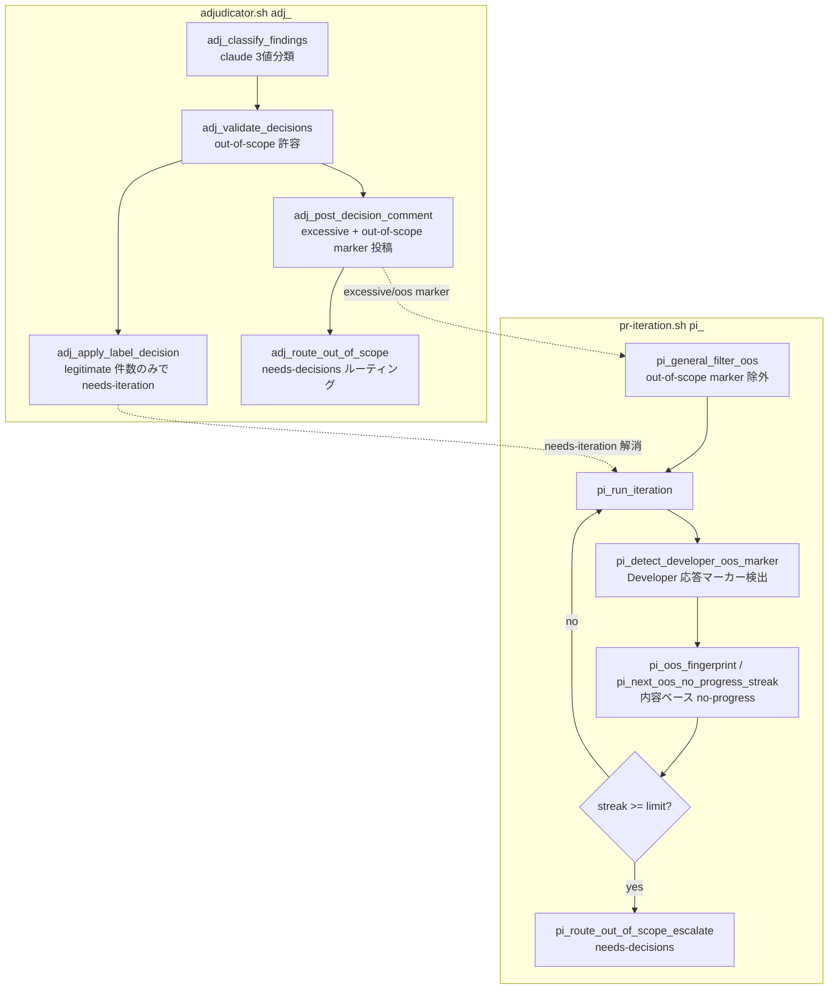

# Design Document

## Overview

**Purpose**: PR Iteration / Adjudicator が「正当だが当該 PR スコープ外（design.md / spec の変更を
要求しており impl PR では規約上書き換え不可）」な指摘で収束できず、`max_rounds` 消尽でしか
終われず `claude-failed` に落ちる構造問題を解消する。実装が scope 完結している PR を堂々巡りで
失敗扱いにせず、設計変更が必要な正当指摘を `needs-decisions` 経路へ還流させる。

**Users**: idd-claude self-hosting および consumer repo の watcher 運用者。`needs-iteration`
ラベル付き PR が PR Iteration Processor で反復対応される workflow で利用する。

**Impact**: 現在の adjudicator は finding を `legitimate` / `excessive` の二値で裁定し、
`legitimate` 件数で `needs-iteration` ラベル付与を確定する。本変更は (1) 第 3 判定
`out-of-scope` を後方互換に追加し、(2) out-of-scope を `legitimate` にカウントしないことで
iteration round を消費させず、(3) out-of-scope 指摘を既存 excessive marker と同形の hidden
marker でルーティングし、(4) Developer の構造化マーカー検出と (5) 指摘内容ベース no-progress
早期打ち切りを加える。全体を 1 つの opt-in gate（既定 OFF / no-op）で囲う。

> **分量バジェット注記**: 本機能は adjudicator.sh / pr-iteration.sh の 2 module 横断 + プロンプト
> 2 種 + agents 2 種 + 状態機械（marker フィールド追加）変更のため複雑度「複雑」（目安 ≤600 行）に
> 該当する。既存コードは `file:line` 参照に留め、契約（関数名・引数・戻り値）までで実装本文は
> Developer に委ねることで分量を抑える。

### Goals

- Adjudicator が「正当だがスコープ外」を独立カテゴリ `out-of-scope` で分類できる（Req 1）
- out-of-scope のみが残る PR で iteration round / `needs-iteration` を起動しない（Req 2）
- out-of-scope 指摘を `needs-decisions` 既定経路へ追跡可能な形でルーティングする（Req 3）
- Developer の out-of-scope 宣言を構造化マーカーで watcher が機械検出し打ち切る（Req 4）
- 同一指摘の連続 out-of-scope を `max_rounds` 到達前に早期打ち切りする（Req 5）
- Reviewer / Adjudicator プロンプトを明文化し design-level 指摘の impl reject 誤用を防ぐ（Req 6）
- 全挙動を opt-in gate（既定 OFF）で囲い、無効時は導入前と完全に同一の no-op（NFR 1）

### Non-Goals

- adjudicator / Developer の具体モジュール分割の確定以外（codex Reviewer 自体の指摘生成ロジック変更）
- フォローアップ Issue 自動起票（`spawn-issue` ルート）の本実装（env 値だけ予約し本 spec では未実装）
- 既存 `PR_ITERATION_NO_PROGRESS_LIMIT`（既定 3 / SHA ベース）の数値・挙動変更
- 既存 `legitimate` / `excessive` 二値経路の挙動変更（後方互換に保つ）
- design / spec 還流先 Issue の自動本文生成テンプレート設計

## Architecture

### Existing Architecture Analysis

- **adjudicator.sh（`adj_` prefix, 1216 行）**: codex 由来 finding を 1 PR 単位で裁定する。
  `adj_classify_findings`（claude 呼び出し）→ `adj_validate_decisions`（schema 検証）→
  `adj_apply_label_decision`（`legitimate` 件数で `needs-iteration` add/remove）→
  `adj_apply_status_decision`（`claude-review` publish）→ `adj_post_decision_comment`
  （summary + `excessive` 個別 marker 投稿）。`adj_run_for_pr` がオーケストレート。
  出力 JSON schema は `{"decisions":[{verdict:"legitimate"|"excessive"},...],"summary":{total,legitimate,excessive}}`。
- **pr-iteration.sh（`pi_` prefix, 1776 行）**: `needs-iteration` 付き PR を round 単位で再実装する。
  finding 単位の追跡は持たず、**PR 単位の round / no-progress-streak（PR body hidden marker
  `<!-- idd-claude:pr-iteration round=N last-run=... no-progress-streak=K -->` / SHA ベース）**で
  制御する。adjudicator が投稿した `excessive` marker は `pi_general_filter_excessive`
  （`local-watcher/bin/modules/pr-iteration.sh:293`）で iteration prompt から除外される。
- **統合点**: adjudicator は pr-reviewer.sh の `pr_run_review_for_pr`
  （`local-watcher/bin/modules/pr-reviewer.sh:1633`）から hook される。catch-up 経路は
  `pr_catchup_should_defer_for_adjudicator`（同 :1909）で adjudicator 管轄を defer する。
- **尊重すべき制約**: 既存 env var 名 / ラベル名 / commit status context 名 / exit code /
  ログ書式を不変に保つ（CLAUDE.md 禁止事項）。`legitimate` / `excessive` consumer は壊さない。
- **解消する technical debt**: 「正当だがスコープ外」が `legitimate` に丸められ round を空回り
  させる構造（adjudicator の二値裁定 + pr-iteration の SHA-only no-progress 判定の組み合わせ）。

### Architecture Pattern & Boundary Map

**採用パターン**: 既存 marker-based filter pattern の踏襲（excessive marker → 第 2 marker
out-of-scope）。新コンポーネントは投機的に作らず、責務が最も近い既存 module
（adjudicator.sh / pr-iteration.sh）に同居させる（CLAUDE.md「機能追加ガイドライン §1」）。



**Architecture Integration**:
- 採用パターン: marker-based finding routing（既存 `pr-adjudicator-excessive` marker の隣に
  `pr-adjudicator-out-of-scope` marker を追加。理由: pr-iteration が finding 単位の状態を
  持たないため、marker を介した PR コメント = 状態保存先という既存設計を再利用するのが最小変更）。
- ドメイン／機能境界: 裁定（adjudicator.sh）と反復制御（pr-iteration.sh）の責務分離を維持。
  ルーティング（`needs-decisions` 付与）は両 module に重複させず、共通ヘルパとして
  pr-iteration.sh 側に集約し adjudicator.sh から呼ぶ。
- 既存パターンの維持: opt-in gate / 値正規化 case / marker prefix self-filter / fail-safe
  （取得失敗は安全側）/ 観測ログ 1 行サマリ。
- 新規コンポーネントの根拠: 新 module は作らない（投機的抽象化の排除 / 設計レビューゲート）。

### Technology Stack

| Layer | Choice / Version | Role in Feature | Notes |
|-------|------------------|-----------------|-------|
| CLI / Runtime | bash 4+ | watcher 本体・module | `set -euo pipefail` は本体側宣言 |
| Backend / Services | claude CLI（adjudicator）| 3 値分類 prompt | `--permission-mode plan` 既存踏襲 |
| Data / Storage | PR body hidden marker / PR コメント marker | round / streak / out-of-scope 状態 | 新規状態ファイルは作らず既存 marker を拡張 |
| Messaging / Events | gh CLI（PR コメント / ラベル）| ルーティング・観測 | 既存 `needs-decisions` ラベル再利用 |
| 外部 CLI | jq | finding JSON / fingerprint 算出 | 未信頼値は `--arg` / `--argjson` |

## File Structure Plan

### 変更ファイル（idd-claude 本体 / `local-watcher/` は repo-template にミラーされない）

```
local-watcher/bin/
├── modules/
│   ├── adjudicator.sh          # adj_: 3値分類対応 + out-of-scope marker 投稿 + ルーティング委譲
│   └── pr-iteration.sh         # pi_: oos filter / Developer marker 検出 / 内容ベース no-progress / ルーティング
├── adjudicator-prompt.tmpl     # 3値判定指針（out-of-scope 分類基準）を追記
├── iteration-prompt.tmpl       # Developer 構造化マーカー出力指示を追記（impl 用）
├── iteration-prompt-design.tmpl # 同上（design 用 / 整合のため）
└── issue-watcher.sh            # 新 env gate の Config ブロック追加 + 正規化 + 起動ログ
local-watcher/test/
├── adjudicator_out_of_scope_test.sh        # 3値分類 / schema 検証 / marker 投稿
├── pr_iteration_oos_routing_test.sh        # oos filter / round 非消費 / ルーティング / gate no-op
└── pr_iteration_oos_no_progress_test.sh    # Developer marker 検出 / 内容ベース no-progress / fingerprint
```

### 変更ファイル（root ↔ repo-template byte 一致同期対象 / `.claude/{agents,rules}` のみ）

```
.claude/agents/reviewer.md       ↔ repo-template/.claude/agents/reviewer.md   # design-level 指摘を impl reject 理由にしない明文化
.claude/agents/developer.md      ↔ repo-template/.claude/agents/developer.md  # out-of-scope 構造化マーカー宣言規約
```

### 同期対象外（明示）

- `adjudicator-prompt.tmpl` / `iteration-prompt.tmpl` / `iteration-prompt-design.tmpl` は
  `install.sh` 経由で `$HOME/bin/` へ配布される系統であり、**`repo-template/local-watcher/` という
  パスは存在しない**（tasks-generation.md「idd-claude 特有の注意」）。byte 一致 diff 対象外。
- `issue-watcher.sh` / `modules/*.sh` も同様に repo-template にミラーされない。
- ラベル script（`idd-claude-labels.sh`）は `needs-decisions` を既に定義済み（行 66）のため変更不要。
  新ラベルは新設しない（既存ラベル再利用）。
- README.md は consumer 固有で byte 一致対象外だが、挙動変更の反映先として同一 PR で更新する。

### Modified Files（要点）

- `adjudicator.sh` — `verdict` enum に `out-of-scope` 追加。`adj_validate_decisions` / `summary`
  集計 / `adj_apply_label_decision`（legitimate のみカウント）/ `adj_post_decision_comment`
  （out-of-scope marker 投稿）/ `adj_run_for_pr`（gate 連動）を改修。新規 `adj_route_out_of_scope`。
- `pr-iteration.sh` — 新規 `pi_general_filter_oos` / `pi_detect_developer_oos_marker` /
  `pi_oos_fingerprint` / `pi_read_oos_no_progress_streak` / `pi_next_oos_no_progress_streak` /
  `pi_route_out_of_scope_escalate`。`pi_write_marker` に `oos-no-progress-streak` フィールド追加。
  `pi_collect_general_comments` の filter chain に oos 段を追加。`pi_run_iteration` に
  Developer marker 検出 → 内容ベース no-progress 判定 → 早期打ち切りを配線。
- `issue-watcher.sh` — `PR_ITERATION_OOS_ENABLED` / `PR_ITERATION_OOS_ROUTE` /
  `PR_ITERATION_OOS_NO_PROGRESS_LIMIT` の Config + 正規化。起動ログへの追記。

## Requirements Traceability

| Requirement | Summary | Components | Tasks |
|-------------|---------|------------|-------|
| 1.1 | 3 値分類 | adjudicator-prompt.tmpl / adj_validate_decisions | 2, 3 |
| 1.2 | spec 矛盾 → out-of-scope | adjudicator-prompt.tmpl | 2 |
| 1.3 | 迷ったら legitimate | adjudicator-prompt.tmpl | 2 |
| 1.4 | 分類根拠 reason | adjudicator-prompt.tmpl / adj_validate_decisions | 2, 3 |
| 1.5 | out-of-scope 件数集計 | adj_validate_decisions / summary | 3 |
| 2.1 | out-of-scope のみで round 起動しない | adj_apply_label_decision / pi_general_filter_oos | 3, 4 |
| 2.2 | legitimate 残存で従来通り起動 | adj_apply_label_decision | 3 |
| 2.3 | legitimate 件数に oos を含めない | adj_apply_label_decision / summary | 3 |
| 2.4 | oos のみで needs-iteration 付与しない | adj_apply_label_decision | 3 |
| 3.1 | 既定経路へルーティング | adj_route_out_of_scope / pi_route_out_of_scope_escalate | 5 |
| 3.2 | needs-decisions エスカレート | pi_route_out_of_scope_escalate | 5 |
| 3.3 | 内容・根拠を追跡可能に記録 | adj_post_decision_comment / pi_route_out_of_scope_escalate | 3, 5 |
| 3.4 | ルーティング失敗で WARN（silent fail なし）| pi_route_out_of_scope_escalate | 5 |
| 3.5 | 同一 PR・同一 SHA 重複ルーティングしない | pi_route_out_of_scope_escalate（marker 冪等）| 5 |
| 4.1 | Developer 構造化マーカー出力 | iteration-prompt.tmpl / developer.md | 6, 7 |
| 4.2 | watcher がマーカー検出 | pi_detect_developer_oos_marker | 7 |
| 4.3 | マーカー検出で iteration 打ち切り + ルーティング | pi_run_iteration / pi_route_out_of_scope_escalate | 7 |
| 4.4 | マーカーに矛盾根拠を併記 | iteration-prompt.tmpl / developer.md | 6 |
| 4.5 | マーカー不在で従来通り進行 | pi_detect_developer_oos_marker / pi_run_iteration | 7 |
| 5.1 | 連続 oos 回数を計数 | pi_oos_fingerprint / pi_next_oos_no_progress_streak | 8 |
| 5.2 | 閾値到達で max_rounds 前に打ち切り | pi_run_iteration / pi_route_out_of_scope_escalate | 8 |
| 5.3 | SHA 変化のみではリセットしない | pi_next_oos_no_progress_streak（fingerprint ベース）| 8 |
| 5.4 | 早期打ち切り理由をログ記録 | pi_run_iteration（観測ログ）| 8 |
| 5.5 | 指摘内容変化でリセット | pi_oos_fingerprint / pi_next_oos_no_progress_streak | 8 |
| 6.1 | Adjudicator プロンプト明文化 | adjudicator-prompt.tmpl | 2 |
| 6.2 | impl Reviewer 判定指針明文化 | reviewer.md | 9 |
| 6.3 | 設計レベル指摘を 3 カテゴリ外として reject しない | reviewer.md | 9 |
| 6.4 | root ↔ repo-template byte 一致反映 | reviewer.md / developer.md 両系統 | 9, 10 |
| NFR 1.1 | gate 無効時 no-op | PR_ITERATION_OOS_ENABLED / 全関数 gate 連動 | 1, 全 |
| NFR 1.2 | gate 不正値を安全側正規化 | issue-watcher.sh 正規化 case | 1 |
| NFR 1.3 | 既存 env / ラベル / status / exit code / ログ / cron 不変 | 全 module | 1, 3 |
| NFR 1.4 | legitimate/excessive 既存 schema 後方互換 | adj_validate_decisions | 3 |
| NFR 2.1 | プロンプト / agents / rules を root↔repo-template byte 一致 | reviewer.md / developer.md | 9, 10 |
| NFR 2.2 | 新挙動前提（ラベル等）を両系統反映 | 既存 needs-decisions 再利用（新ラベルなし）| 9, 10 |
| NFR 3.1 | 未信頼値を quote / jq `--arg` | pi_* / adj_* 全関数 | 3, 7, 8 |
| NFR 3.2 | 未信頼値に grep/git/gh `--` | pi_detect_developer_oos_marker 等 | 7 |
| NFR 3.3 | PR番号 `^[0-9]+$` / SHA `^[0-9a-f]{7,40}$` 検証 | 全関数（既存踏襲）| 3, 5, 7, 8 |
| NFR 4.1 | 早期打ち切り / ルーティングを 1 行機械抽出可能ログ | pi_run_iteration / adj_log | 5, 8 |

## Components and Interfaces

### Adjudicator Layer（adjudicator.sh / `adj_`）

#### adj_validate_decisions（改修）

| Field | Detail |
|-------|--------|
| Intent | 分類 JSON の schema 検証に `out-of-scope` verdict と summary 集計を後方互換に追加 |
| Requirements | 1.1, 1.4, 1.5, 2.3, NFR 1.4 |

**Responsibilities & Constraints**
- gate ON 時のみ `verdict` enum を `{legitimate, excessive, out-of-scope}` の 3 値許容に拡張。
  gate OFF 時は既存 2 値（`legitimate` / `excessive`）厳密一致を維持（`out-of-scope` を invalid
  扱い → fallback で legitimate に倒れる / NFR 1.4）。
- `summary` 検証式を `legitimate + excessive + out_of_scope == total` に拡張。gate OFF 時は
  既存式 `legitimate + excessive == total` を維持。
- データ所有権: 入力 JSON の妥当性のみを判定。値の生成は claude prompt 側。

**Contracts**: Service [x]

```text
adj_validate_decisions(findings_json, decisions_json) -> rc
  - Preconditions: findings_json は valid JSON 配列
  - Postconditions: gate ON 時、out-of-scope を含む decisions も valid と判定可能
  - Invariants: invalid 時は rc=1（呼び出し元が legitimate fallback に倒す / Req 1.3 徹底）
```

#### adj_apply_label_decision（改修）

| Field | Detail |
|-------|--------|
| Intent | `legitimate` 件数のみで `needs-iteration` を add/remove（out-of-scope を数えない）|
| Requirements | 2.1, 2.2, 2.3, 2.4 |

**Responsibilities & Constraints**
- 既存シグネチャ `adj_apply_label_decision(pr_number, legitimate_count)` を**変更しない**。
  呼び出し元 `adj_run_for_pr` が `summary.legitimate`（out-of-scope を除外済みの値）を渡すため、
  本関数は無改修で Req 2.3 / 2.4 を満たす。
- out-of-scope のみ（legitimate=0）の PR では `--remove-label needs-iteration`（冪等）→ round
  非消費（Req 2.1 / 2.4）。

**Contracts**: Service [x]（既存契約維持）

#### adj_post_decision_comment（改修）

| Field | Detail |
|-------|--------|
| Intent | summary に out-of-scope 件数を追加し、out-of-scope finding 個別 marker を投稿 |
| Requirements | 3.3, NFR 3.1 |

**Responsibilities & Constraints**
- gate ON かつ out-of-scope finding 存在時、`excessive` marker 投稿の隣で out-of-scope 個別
  marker を投稿: `<!-- idd-claude:pr-adjudicator-out-of-scope id=<N> sha=<sha> -->`。
- prefix `pr-adjudicator-out-of-scope` は既存 `pr-adjudicator-excessive` / `pr-iteration` の
  いずれとも前方一致しない（self-filter 非衝突 / NFR 1.3 / 既存設計と整合）。
- 未信頼値（reason / file / message）は jq `--arg` / `--argjson` でリテラル渡し。
- summary コメント本文に `out-of-scope: <N>` 行を追加（gate OFF 時は従来通り 3 行 total/legit/excess）。

**Contracts**: Service [x] / Event [x]（PR コメント marker 発行）

#### adj_route_out_of_scope（新規）

| Field | Detail |
|-------|--------|
| Intent | adjudicator 確定直後の out-of-scope finding を共通ルーティングヘルパへ委譲 |
| Requirements | 3.1, 3.3 |

**Dependencies**
- Outbound: `pi_route_out_of_scope_escalate` — 実ルーティング処理（Criticality: High）
- External: gh CLI — ラベル / コメント（Criticality: Medium）

**Responsibilities & Constraints**
- gate OFF / out-of-scope finding ゼロ時は即 return 0（no-op / NFR 1.1）。
- ルーティングロジック本体は pr-iteration.sh の `pi_route_out_of_scope_escalate` に集約し、
  adjudicator.sh からはそれを呼ぶ（重複実装回避 / 両 module が source 済み前提）。

**Contracts**: Service [x]

### PR Iteration Layer（pr-iteration.sh / `pi_`）

#### pi_general_filter_oos（新規）

| Field | Detail |
|-------|--------|
| Intent | adjudicator が out-of-scope と判定した指摘コメントを iteration prompt から除外 |
| Requirements | 2.1, NFR 1.1 |

**Responsibilities & Constraints**
- 既存 `pi_general_filter_excessive`（:293）と同パターン。gate ON
  （`PR_ITERATION_OOS_ENABLED=true`）時のみ comment.body 中の
  `idd-claude:pr-adjudicator-out-of-scope` を含むコメントを除外、OFF 時は jq `.` で pass-through。
- `pi_collect_general_comments` の filter chain を
  `self → resolved → excessive → out-of-scope → event_style → truncate` の 6 段に拡張。
  サマリログに `filtered_oos=<N>` を追加（観測可能性 / NFR 4.1）。

**Contracts**: Service [x]

#### pi_detect_developer_oos_marker（新規）

| Field | Detail |
|-------|--------|
| Intent | Developer iteration 応答ログ本文から out-of-scope 構造化マーカーを機械検出 |
| Requirements | 4.2, 4.5, NFR 3.1, NFR 3.2 |

**Responsibilities & Constraints**
- 入力: Developer 応答ログファイルパス（`$pi_log_file`）。marker 厳密書式（後述 Data Models）に
  一致する行を `grep -E` で検出。未信頼入力（ログ本文）は変数 quote / `grep --` でオプション
  打ち切り。検出したマーカーの種別語彙（`design` / `spec-stale`）を stdout に出力（不在なら空）。
- 検出は読み取り専用・副作用なし。gate OFF 時は呼び出し元で skip（本関数自体も空返しで安全）。

**Contracts**: Service [x]

```text
pi_detect_developer_oos_marker(log_file) -> stdout: "design"|"spec-stale"|""  (rc=0 固定)
  - Preconditions: log_file は読み取り可能なテキスト（不在/不能は空返し fail-safe）
  - Postconditions: 厳密書式に一致した最初のマーカー種別を返す
  - Invariants: 許容語彙集合外のサフィックスは未検出扱い（空返し / 安全側）
```

#### pi_oos_fingerprint（新規 / 純粋関数）

| Field | Detail |
|-------|--------|
| Intent | 指摘内容の同一性判定キー（fingerprint）を算出する |
| Requirements | 5.1, 5.3, 5.5, NFR 3.1 |

**Responsibilities & Constraints**
- 入力: out-of-scope finding 群の JSON（adjudicator marker 由来 / general comments 由来の
  集約）。各 finding の `severity` / `file` / `message` を正規化連結し sha256（または
  `cksum` 等 watcher 環境で利用可能なハッシュ）で fingerprint 文字列を生成。
- 「同じ design-level 矛盾を指している限り同一」を意図（requirements Open Question）。
  SHA（head commit）には依存しない（Req 5.3）。内容が実質変化すれば fingerprint も変わる（Req 5.5）。
- 純粋関数（副作用なし / グローバル参照なし）→ `extract_function` テストで隔離検証可能。

**Contracts**: Service [x]

#### pi_read_oos_no_progress_streak / pi_next_oos_no_progress_streak（新規）

| Field | Detail |
|-------|--------|
| Intent | 内容ベース no-progress 連続カウンタの読み取り / 次値算出 |
| Requirements | 5.1, 5.3, 5.5 |

**Responsibilities & Constraints**
- 既存 `pi_read_no_progress_streak`（:182, SHA ベース）/ `pi_next_no_progress_streak`（:1208）と
  **独立**。状態は PR body marker の新フィールド `oos-no-progress-streak=K` + `oos-fingerprint=<H>`
  に保存（後述 Data Models）。
- `pi_next_oos_no_progress_streak(prev_fingerprint, current_fingerprint, prev_streak)`:
  fingerprint 同一なら `prev_streak + 1`、異なれば `0`（Req 5.5 リセット / 純粋関数）。
- 既存 SHA ベース streak は不変（数値・挙動変更しない / Non-Goal）。

**Contracts**: Service [x]

#### pi_route_out_of_scope_escalate（新規 / 共通ルーティングヘルパ）

| Field | Detail |
|-------|--------|
| Intent | out-of-scope 指摘を `PR_ITERATION_OOS_ROUTE` 既定経路へルーティングする |
| Requirements | 3.1, 3.2, 3.3, 3.4, 3.5, 5.2, NFR 3.3, NFR 4.1 |

**Dependencies**
- Inbound: `adj_route_out_of_scope`（adjudicator 経路）/ `pi_run_iteration`（Developer marker /
  内容ベース no-progress 経路）— 2 経路から共通呼び出し
- External: gh CLI — ラベル付与 / コメント投稿（Criticality: High）

**Responsibilities & Constraints**
- ルート解決: `PR_ITERATION_OOS_ROUTE` が `needs-decisions`（既定）→ `needs-iteration` 除去 +
  `needs-decisions` 付与 + 追跡コメント投稿。`design-reflow` / `spawn-issue` は**未知値として
  扱い `needs-decisions` に正規化**（本 spec では needs-decisions のみ実装。env 値は将来予約）。
- 冪等性（Req 3.5）: 投稿コメントに hidden marker
  `<!-- idd-claude:pr-iteration-oos-routed sha=<sha> -->` を付与し、同一 PR・同一 SHA で既存
  marker 検出時は再ルーティングを skip。PR 番号 `^[0-9]+$` / SHA `^[0-9a-f]{7,40}$` を使用直前検証。
- 失敗時（コメント / ラベル）は WARN を 1 行ログに残し silent fail しない（Req 3.4）。
- 観測ログ: `PR #<n>: kind=<k> round=<r> reason=out-of-scope route=needs-decisions` を 1 行
  機械抽出可能形式で出力（NFR 4.1）。

**Contracts**: Service [x] / Event [x] / State [x]（needs-iteration → needs-decisions 遷移）

#### pi_run_iteration（改修配線）

| Field | Detail |
|-------|--------|
| Intent | Developer marker 検出 → 内容ベース no-progress 判定 → 早期打ち切りを round に配線 |
| Requirements | 4.3, 5.2, 5.4 |

**Responsibilities & Constraints**
- gate OFF 時は本改修分を skip（既存 round フロー完全維持 / NFR 1.1）。
- claude 実行後、`pi_detect_developer_oos_marker "$pi_log_file"` でマーカー検出 →
  検出時は当該 round を finalize せず `pi_route_out_of_scope_escalate` へ引き渡し（Req 4.3）。
- 同一 fingerprint の out-of-scope 回答が連続したら `oos-no-progress-streak` を加算し、
  `>= PR_ITERATION_OOS_NO_PROGRESS_LIMIT`（既定 2）で `max_rounds` 到達前に早期打ち切り
  （Req 5.2）。打ち切り理由（指摘内容ベース no-progress / 連続回数 / 閾値）を 1 行ログに記録（Req 5.4）。

**Contracts**: State [x]（round outcome に out-of-scope-routed を追加）

### Configuration（issue-watcher.sh Config ブロック）

| env var | 既定値 | 正規化 | 役割 |
|---------|--------|--------|------|
| `PR_ITERATION_OOS_ENABLED` | `false` | `case true) :;; *) false`（厳密 `=true` のみ ON / 安全側 OFF）| 本機能全体の opt-in gate（NFR 1.1, 1.2）|
| `PR_ITERATION_OOS_ROUTE` | `needs-decisions` | `case needs-decisions\|design-reflow\|spawn-issue) :;; *) needs-decisions`。本 spec では `design-reflow`/`spawn-issue` も実処理は `needs-decisions` に丸める | out-of-scope ルーティング先（Req 3.1, 3.2）|
| `PR_ITERATION_OOS_NO_PROGRESS_LIMIT` | `2` | `case ''\|*[!0-9]*) 2`、`-lt 1` も `2` に正規化 | 内容ベース no-progress 閾値（Req 5.2）|

**gate 関係（既存 gate との従属/独立）**:
- `PR_ITERATION_OOS_ENABLED` は `PR_REVIEWER_ADJUDICATOR_ENABLED`（adjudicator 起動）/
  `PR_ITERATION_ENABLED`（iteration 起動）とは**独立な追加 gate**。3 値分類・marker 投稿・
  filter・ルーティング・Developer marker 検出・内容ベース no-progress の**全新挙動**を 1 つで囲う。
- 実効動作には adjudicator 経路（out-of-scope marker 投稿）も iteration 経路（filter / 打ち切り）も
  必要なため、`PR_ITERATION_OOS_ENABLED=true` でも `PR_REVIEWER_ADJUDICATOR_ENABLED=false`（既定 ON）/
  `PR_ITERATION_ENABLED=false` の場合は当該経路の新挙動が部分的に no-op になる（既存 gate を
  尊重し、本 gate が既存 gate を override しない / 後方互換）。design.md「確認事項」参照。
- 既定 OFF（`false`）は CLAUDE.md「opt-in gate 鉄則」に従う。既存の `PR_REVIEWER_ADJUDICATOR_ENABLED`
  / `DESIGN_REVIEWER_ENABLED` は既定 ON（opt-out）だが、それらは「既に main で稼働しデフォルト
  false で配置された機能のデフォルト反転」（#112 / #412 / #432）であり、本機能は**新規導入**の
  ため CLAUDE.md 禁止事項通り既定 OFF で導入する。

## Data Models

### 裁定 JSON スキーマの後方互換拡張

gate ON 時、adjudicator-prompt.tmpl の出力契約 / `adj_validate_decisions` の検証を以下に拡張:

```json
{
  "decisions": [
    { "id": 1, "severity": "high|medium|low", "file": "...", "line": 42,
      "verdict": "legitimate | excessive | out-of-scope",
      "reason": "<日本語 200 字以内 / out-of-scope は矛盾する確定事項・AC・境界を明記>" }
  ],
  "summary": { "total": N, "legitimate": L, "excessive": E, "out_of_scope": O }
}
```

- **後方互換**: gate OFF 時は `verdict` を 2 値（`legitimate`/`excessive`）厳密一致で検証し、
  `summary` は既存 3 フィールド（total/legitimate/excessive）+ `legitimate+excessive==total`。
  `out_of_scope` フィールドは gate OFF では出力させず・無視する（NFR 1.4）。
- gate ON でも claude が `out-of-scope` を出さなければ既存 2 値経路と同一（safe degrade）。
- fallback（`adj_synthesize_all_legitimate_decisions`）は全件 legitimate に倒すため
  out-of-scope を生成しない（Req 1.3「迷ったら legitimate」と整合 / 既存挙動維持）。

### PR body hidden marker（状態永続化先）

CLAUDE.md §6（状態は `$HOME/.issue-watcher/` か既存 marker）に従い、**新規状態ファイルは
作らず既存 PR body marker を後方互換に拡張**する。既存:

```
<!-- idd-claude:pr-iteration round=N last-run=ISO8601 no-progress-streak=K -->
```

拡張後（gate ON 時のみ追記。OFF 時は既存 4 フィールドのまま）:

```
<!-- idd-claude:pr-iteration round=N last-run=ISO8601 no-progress-streak=K oos-no-progress-streak=J oos-fingerprint=<H> -->
```

- `pi_write_marker`（:486）の sed 置換正規表現を `[^>]*` で末尾まで貪欲に食う既存方式のまま
  拡張（旧フォーマット marker も同一 regex で吸収 / 既存 no-progress-streak 追加時と同手法）。
- `oos-fingerprint=<H>`: 直前 round の out-of-scope 指摘 fingerprint。次 round で同一性を比較。
- gate OFF の PR では本 2 フィールドを書き込まない（既存 marker と byte 互換 / NFR 1.3）。

### PR コメント hidden marker（ルーティング・filter キー）

| marker | 発行者 | 用途 |
|--------|--------|------|
| `<!-- idd-claude:pr-adjudicator-out-of-scope id=<N> sha=<sha> -->` | adj_post_decision_comment | out-of-scope finding 個別 marker（filter / fingerprint キー）|
| `<!-- idd-claude:pr-iteration-oos-routed sha=<sha> -->` | pi_route_out_of_scope_escalate | ルーティング冪等性（Req 3.5）|

### Developer 構造化マーカー書式

- **厳密書式（正規表現）**: `^OUT-OF-SCOPE:[[:space:]]+(design|spec-stale)[[:space:]]*$`
  （行頭一致 / 許容語彙集合 `{design, spec-stale}` のみ / 前後空白許容）。
- 許容語彙集合外（例: `OUT-OF-SCOPE: foo`）は未検出扱い（安全側 = 従来 round 進行 / Req 4.5）。
- iteration-prompt.tmpl / developer.md で「マーカー出力時はどの確定事項・どの AC と矛盾するかを
  同じ応答本文に併記」を指示（Req 4.4）。
- watcher 側パーサ（`pi_detect_developer_oos_marker`）は未信頼入力（Developer 応答ログ）を
  変数 quote + `grep -E --` で処理（NFR 3.1 / 3.2）。

## Error Handling

### Error Strategy

全新挙動は fail-safe（情報取得不能・処理失敗時は安全側 = 既存挙動 or no-op に倒す）を貫く。
gate OFF / 不正値は最初に正規化で OFF へ丸める（NFR 1.1 / 1.2）。

### Error Categories and Responses

- **User Errors（運用設定）**: env gate の不正値・typo・空 → 正規化 case で安全側（OFF / 既定
  ルート / 既定閾値）に丸める（NFR 1.2）。
- **System Errors（外部 CLI 失敗）**:
  - adjudicator claude 失敗 → 既存 fallback（`passthrough` / `legitimate`）に倒す。out-of-scope は
    生成されない（既存挙動維持）。
  - ルーティング（gh コメント / ラベル）失敗 → WARN 1 行 + silent fail なし（Req 3.4）。
  - PR body / コメント取得失敗 → out-of-scope 状態を 0 扱い（誤った早期打ち切りを防ぐ安全側）。
- **Business Logic Errors（schema 不整合）**: `adj_validate_decisions` invalid → 全件 legitimate
  fallback（Req 1.3 徹底 / 既存経路）。

## Testing Strategy

- **Unit Tests（純粋関数 / `extract_function` 隔離）**:
  1. `pi_oos_fingerprint`: 同一 severity/file/message で同一 fingerprint、message 変化で別 fingerprint
  2. `pi_next_oos_no_progress_streak`: fingerprint 同一で +1、変化で 0 リセット（Req 5.3 / 5.5）
  3. `pi_detect_developer_oos_marker`: `design` / `spec-stale` 検出、語彙外は空、マーカー不在は空（Req 4.2 / 4.5）
  4. `adj_validate_decisions`: gate ON で out-of-scope verdict + `legit+excess+oos==total` を valid
  5. gate OFF で `out-of-scope` verdict を invalid 判定（→ legitimate fallback / NFR 1.4）
- **Integration Tests（gh / git stub + 呼び出しトレース）**:
  1. out-of-scope のみの PR で `needs-iteration` が付与されない（Req 2.1 / 2.4 / `adj_apply_label_decision`）
  2. `pi_general_filter_oos`: gate ON で oos marker 除外、OFF で pass-through（Req 2.1 / NFR 1.1）
  3. `pi_route_out_of_scope_escalate`: 同一 sha 2 回呼び出しで 2 回目 skip（冪等 / Req 3.5）
  4. ルーティング gh 失敗で WARN ログ出力 + 非 silent（Req 3.4）
  5. Developer marker 検出 → round finalize せずルーティング（Req 4.3）
- **後方互換 Tests（gate no-op）**:
  1. `PR_ITERATION_OOS_ENABLED` 未設定/空/`True`/`1`/typo がすべて `false` に正規化（NFR 1.2）
  2. gate OFF で marker 拡張なし・filter chain pass-through・既存 marker byte 互換（NFR 1.1 / 1.3）
  3. `PR_ITERATION_OOS_ROUTE` 未知値が `needs-decisions` に正規化、`PR_ITERATION_OOS_NO_PROGRESS_LIMIT`
     非数値が `2` に正規化

## Security Considerations

- **未信頼入力（NFR 3）**: Developer 応答ログ・PR コメント本文・finding message は未信頼 GitHub
  入力。変数は常時 quote、`jq` へは `--arg` / `--argjson` でリテラル渡し（filter inline 展開禁止）、
  `grep` / `git` / `gh` へは `--` でオプション解釈打ち切り。
- **ID 検証（NFR 3.3）**: PR 番号 `^[0-9]+$`、SHA `^[0-9a-f]{7,40}$` を path / URL / git revision
  使用直前に検証（既存 adj_* / pi_* の hardening 踏襲）。
- **read-only invariant**: adjudicator claude は `--permission-mode plan`（既存）。本変更は
  read-only 検査経路を変更しない。

## リスクと緩和

| リスク | 緩和 |
|--------|------|
| 既存 legitimate/excessive consumer の破壊 | gate OFF で schema・marker・filter を完全 byte 互換に保つ。gate ON でも claude が oos を出さなければ既存経路と同一 |
| out-of-scope 誤分類で正当指摘を取りこぼし | adjudicator-prompt の「迷ったら legitimate」原則を out-of-scope にも適用（Req 1.3）。out-of-scope は破棄せず needs-decisions へ追跡（Req 3） |
| 内容ベース no-progress の fingerprint 衝突 | severity/file/message 連結ハッシュで粒度確保。誤って同一視しても max_rounds で最終的に救済（既存 fallback 残存）|
| 2 経路（adjudicator / Developer marker）の二重ルーティング | 同一 sha marker `pr-iteration-oos-routed` で冪等化（Req 3.5）|
| adjudicator / iteration gate 不一致での部分 no-op | 「確認事項」に明記。既存 gate を override しない設計（後方互換優先）|

## 確認事項（requirements 確定事項との関係 / 独自解釈を避けるための明示）

1. **gate 構成（独立追加 gate）**: 本設計は `PR_ITERATION_OOS_ENABLED`（既定 OFF）を
   `PR_REVIEWER_ADJUDICATOR_ENABLED` / `PR_ITERATION_ENABLED` から**独立**な追加 gate とした
   （NFR 1.1 後方互換最優先）。実効動作には adjudicator（marker 投稿）と iteration（filter /
   打ち切り）の両経路が必要なため、片方の既存 gate が OFF の環境では新挙動が部分 no-op になる。
   要件は「1 つ（または最小数）の env gate」を求めており（Issue 論点 2）、本設計は 1 gate で
   全新挙動を囲う一方、既存 gate の上書きはしない解釈を採った。運用者が両既存 gate を維持
   （既定 ON / opt-out）している限り問題は生じないが、明示確認を要する。
2. **ルーティング先の段階導入**: requirements 推奨 `needs-decisions` を既定とし、`spawn-issue`
   （Issue 自動起票 = 外部副作用）は env 値だけ予約して本 spec では未実装（`needs-decisions` に
   丸める）とした（Issue 論点 1 / Non-Goal）。`design-reflow`（設計フェーズ還流）も同様に
   本 spec では `needs-decisions` 扱い。将来別 opt-in で段階導入する想定。
3. **fingerprint ハッシュ手段**: watcher 環境で確実に利用可能なハッシュ（`sha256sum` /
   `cksum` 等）を Developer が選定する。一次情報確認不要（idd-claude 内部完結 / 標準 coreutils）。
