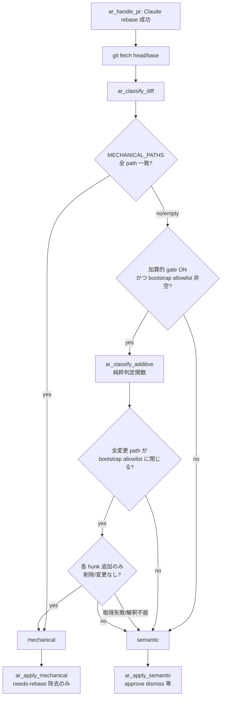

# Design Document

## Overview

**Purpose**: この機能は「並行 Issue が単一 bootstrap（`cmd/api/main.go` 等の DI 配線 + Mount スロット）を編集して必然的に起きる merge conflict のうち、import 和集合 + 各 Mount 併記で解消できる **加算的（両 side 追加のみ）** な衝突」を、人手に落とさず `auto-rebase`（Phase D）の `mechanical` 経路で自動完結させる緩和を、watcher 運用者へ提供する。

**Users**: idd-claude を self-hosting / consumer で運用する **watcher 運用者**が、`AUTO_REBASE_MODE=claude` を有効化した repo で、bootstrap path に閉じた追加のみの衝突 PR を `ready-for-review` 出戻りなしで auto-merge へ流す workflow で利用する。加えて **Architect**（idd-claude が生成する設計の作成者）が、`design-principles.md` に追記される self-register 指針を、bootstrap 一極集中編集を回避する設計判断材料として参照する。

**Impact**: 現在の `ar_classify_diff()` は「変更 path が `MECHANICAL_PATHS` allowlist に閉じているか」だけを見て path 単位で `mechanical` / `semantic` を判定し、hunk 内容（追加のみ / 削除・変更を含む）を一切見ない。本変更は、新 opt-in env gate が有効かつ専用の bootstrap path allowlist が宣言されている場合に限り、`ar_classify_diff` が path allowlist 照合で落ちた時の **二次判定**として「全変更 path が bootstrap allowlist に閉じ、かつ rebase 後累積 diff の各 hunk が両 side 追加のみ」を満たすなら `mechanical` へ昇格させる経路を追加する。既定（gate 未設定）では完全 no-op で導入前と外形等価。提案2 はコード挙動を変えず `design-principles.md`（root + repo-template の 2 系統 byte 一致）へ設計指針を追記する。

> 本 design は複数モジュール（`auto-rebase.sh` の判定ロジック変更 + `issue-watcher.sh` の config + rules の文書追記 + README）に跨るが、コード変更の中核は単一純粋関数の追加と既存 classify への 1 分岐挿入に収まるため標準複雑度（≤300 行目安）として記述する。

### Goals
- 新 opt-in env gate（既定 OFF / 不正値は安全側正規化）で、bootstrap path の追加のみ衝突を `mechanical` 昇格させる二次判定経路を導入する（Req 1, 2）
- 加算的判定を **構文的判定**（rebase 後累積 diff の hunk が両 side 追加のみ・削除/変更なし）に限定し、削除/変更を含む hunk は決して `mechanical` にしない安全側設計とする（Req 2, NFR 2）
- 加算的 `mechanical` 判定後の副作用を既存 `ar_apply_mechanical` と同一に保ち、検証ゲートを迂回しない（Req 3）
- self-register（registry）パターン指針を `design-principles.md` に **推奨レベル**で追記し、root↔repo-template を byte 一致同期する（Req 4, 5）

### Non-Goals
- AST diff / 言語パーサによる意味的差分判定（Out of Scope。提案1 は構文的判定に限定）
- bootstrap 以外の任意ソースファイルの加算的衝突の一般 mechanical 化（対象は運用者宣言の bootstrap path に限定）
- merge-queue（Phase A）の conflict 経路への加算的緩和の適用（後述「merge-queue scope 判断」参照。本 spec は Phase D のみ）
- self-register パターンの自動適用・強制機構、特定言語の registry 実装テンプレート提供
- 和集合解決そのもののアルゴリズム新規実装（既存 Claude rebase 経路が解決を担い、本機能は **解決後の分類**のみを変える）

## Architecture

### Existing Architecture Analysis

- **責務分離（尊重すべき境界）**: Phase D は `ar_run_claude_rebase`（Claude が rebase + conflict 解消 + working tree clean 化を担う）と `ar_classify_diff`（rebase **完了後**の `origin/base..origin/head` 累積 diff を見て分類）が明確に分かれている。**和集合解決（import 和集合 / Mount 併記）は既に Claude rebase 経路が行っており**（`auto-rebase-prompt.tmpl` の「両方の変更意図を保持するよう手動で解消」指示）、本機能は新規の機械解決を追加しない。変えるのは「解決済み結果の分類」だけ。
- **conflict marker 非依存**: rebase 完了後の working tree は clean で conflict marker は残らない。したがって Req 2.1 の「conflict hunk」は実装上 **rebase 後累積 diff（`base..head`）の各 hunk** にマップする（後述「設計判断: 判定単位」）。
- **MECHANICAL_PATHS の意味**: `MECHANICAL_PATHS` は lockfile 等の「**無条件** mechanical」path（中身を問わず path 一致だけで mechanical）。bootstrap path は「**追加のみなら** mechanical」という条件付きで意味が異なるため、`MECHANICAL_PATHS` を流用せず**専用 env var を新設**する（後述「設計判断: path 宣言」）。
- **opt-in 規約**: 既存 `AUTO_REBASE_MODE` / `AUTO_REBASE_SEMANTIC` の正規化パターン（`case` で許可値以外を安全側へ丸める）を踏襲し、config ブロックは issue-watcher.sh の Phase D 近傍に置く。
- **解消すべき technical debt なし**: 既存 classify は壊さず、path allowlist で `semantic` に落ちる手前に二次判定をフックする加算的拡張に留める。

### Architecture Pattern & Boundary Map



**Architecture Integration**:
- 採用パターン: 既存 `ar_classify_diff` の **path allowlist 照合の後段に二次判定をフック**するパターン。新規 module は作らず `auto-rebase.sh`（`ar_` prefix）に純粋判定関数を追加する（責務が auto-rebase 分類に密着し、独立 module 化は投機的抽象になるため）。
- ドメイン／機能境界: 「分類（classify）」と「副作用適用（apply）」の既存境界を維持。加算的判定は分類側にのみ追加し、apply 側は既存 `ar_apply_mechanical` を再利用（Req 3.1 / 副作用同一性）。
- 既存パターンの維持: opt-in env gate + 安全側正規化 / 純粋関数 + 遅延束縛 env / `extract_function` テストイディオム。
- 新規コンポーネントの根拠: `ar_classify_additive`（純粋判定関数）は、hunk 解析ロジックを `extract_function` で隔離抽出してテスト可能にするため分離する。

### Technology Stack

| Layer | Choice / Version | Role in Feature | Notes |
|-------|------------------|-----------------|-------|
| Frontend / CLI | bash 4+ | watcher processor / 純粋判定関数 | `set -euo pipefail` は本体側宣言 |
| Backend / Services | git / gh / jq | rebase 後 diff 取得・hunk 解析 | `git diff` unified hunk を parse |
| Data / Storage | env var（config ブロック） | gate / bootstrap path allowlist 宣言 | `$HOME/.issue-watcher/` 等の永続状態は不要 |
| Messaging / Events | （なし） | — | 副作用は既存 label 操作のみ |
| Infrastructure / Runtime | cron / launchd 上の watcher | 既存 Phase D 起動経路を共有 | exit code / log 出力先不変 |

## File Structure Plan

### Directory Structure（変更箇所のみ）

```
local-watcher/bin/
├── issue-watcher.sh                # Phase D config ブロックに新 env gate 2 種を追加 + 正規化
└── modules/
    └── auto-rebase.sh              # ar_classify_additive 新設 / ar_classify_diff に二次判定フック
local-watcher/test/
└── ar_additive_test.sh            # 新規: 加算的判定の純粋関数テスト（安全側フォールバック境界重視）
.claude/rules/
└── design-principles.md            # self-register 指針節を追記（canonical）
repo-template/.claude/rules/
└── design-principles.md            # 上記の byte 一致同期先
README.md                           # 「Auto Rebase Processor (Phase D)」節へ新 env gate / 分類表 / migration note 追記
docs/specs/438--bootstrap-cmd-main-di-issue-merge-confl/
└── test-fixtures/                  # 新規: diff fixture（追加のみ / 削除含む / path 逸脱）
```

### Modified Files
- `local-watcher/bin/issue-watcher.sh` — Phase D config 近傍（L374〜407 付近）に新 env gate `AUTO_REBASE_ADDITIVE`（既定 `off`、`case` で `claude` 以外 / 不正値を `off` 正規化）と `AUTO_REBASE_ADDITIVE_PATHS`（既定空、カンマ区切り bash glob）を追加。`process_auto_rebase` のサイクル開始ログ（L1289）に解決値を併記。
- `local-watcher/bin/modules/auto-rebase.sh` — `ar_classify_additive`（純粋判定関数）新設。`ar_classify_diff` の「最初の unmatched path 検出 → semantic 確定」分岐（L350〜356）の手前に gate 判定 + 二次判定フックを挿入。ファイル冒頭の関数一覧コメント（L13〜15）へ追記。
- `.claude/rules/design-principles.md` — self-register 指針節を追記（追記位置・内容は後述）。
- `repo-template/.claude/rules/design-principles.md` — 上記と byte 一致。
- `README.md` — env 変数表・動作フロー表・migration note を追記。

## Requirements Traceability

| Requirement | Summary | Components | Interfaces / Flows |
|-------------|---------|------------|---------------------|
| 1.1 | gate 未設定/無効値で導入前と同一判定 | issue-watcher.sh config / ar_classify_diff | gate OFF で二次判定を一切起動しない |
| 1.2 | gate 有効値で緩和経路起動 | issue-watcher.sh config / ar_classify_additive | gate ON 分岐へ進入 |
| 1.3 | 不正値は無効同等（安全側） | issue-watcher.sh config | `case` 正規化で `off` 化 |
| 1.4 | gate 有効でも宣言 path が空なら従来判定 | ar_classify_additive | `AUTO_REBASE_ADDITIVE_PATHS` 空で二次判定 skip |
| 2.1 | 全 path 閉 + 各 hunk 両 side 追加のみ → mechanical | ar_classify_additive | hunk 解析 + path 照合 |
| 2.2 | 削除/変更 hunk を含むと semantic | ar_classify_additive | hunk に `-` 行検出で fallback |
| 2.3 | path が allowlist 外なら semantic | ar_classify_additive | path 不一致で fallback |
| 2.4 | diff/hunk 取得失敗で semantic（保守的） | ar_classify_additive | `git diff` 非0 / 空で fallback |
| 2.5 | mechanical 判定根拠をログ記録 | ar_classify_additive / ar_classify_diff | `ar_log` に path + 理由 |
| 3.1 | mechanical 副作用は既存と同一 | ar_apply_mechanical（再利用） | needs-rebase 除去のみ |
| 3.2 | 必須 status check を迂回しない | ar_handle_pr（既存フロー） | apply 後の auto-merge 経路不変 |
| 3.3 | approve dismiss/ready 復帰/コメントしない | ar_apply_mechanical（再利用） | semantic 副作用を起動しない |
| 4.1 | bootstrap 集中の課題と回避指針を記述 | design-principles.md | 新節 |
| 4.2 | 加算的追記検討時に self-register を提示 | design-principles.md | 新節 |
| 4.3 | 強制レベル（推奨）を明示 | design-principles.md | 新節 |
| 5.1 | root↔repo-template 同一内容反映 | 両 design-principles.md | byte 一致追記 |
| 5.2 | `diff` で差分ゼロ | 両 design-principles.md | `diff -r .claude/rules repo-template/.claude/rules` |
| NFR1.1 | gate 未設定で完全外形等価 | issue-watcher.sh / ar_classify_diff | OFF で no-op |
| NFR1.2 | 既存 env/label/exit/cron/log 不変 | issue-watcher.sh / auto-rebase.sh | 新 env は追加のみ |
| NFR1.3 | MECHANICAL_PATHS のみ設定時は従来照合 | ar_classify_diff | 加算 gate OFF で従来分岐 |
| NFR2.1 | 情報不完全は semantic 側へ | ar_classify_additive | 全失敗系を fallback |
| NFR2.2 | 削除/変更 hunk を mechanical にしない | ar_classify_additive | `-` 行検出で除外 |
| NFR3.1 | 判定結果と理由をログ出力 | ar_classify_additive | `ar_log` 出力 |
| NFR4.1 | README 同一変更で反映 | README.md | env gate + migration note |

## Components and Interfaces

### Auto Rebase / 判定層

#### ar_classify_additive（新設・純粋判定関数）

| Field | Detail |
|-------|--------|
| Intent | gate ON 時、全変更 path が bootstrap allowlist に閉じ各 hunk が両 side 追加のみなら `additive`(=mechanical) を返す |
| Requirements | 1.4, 2.1, 2.2, 2.3, 2.4, 2.5, NFR2.1, NFR2.2, NFR3.1 |

**Responsibilities & Constraints**
- 主責務: 加算的判定の機械的成立可否のみを返す（副作用適用は呼び出し側に委ねる）。
- 純粋性: トップレベル副作用なし。env（`AUTO_REBASE_ADDITIVE` / `AUTO_REBASE_ADDITIVE_PATHS` / `AUTO_REBASE_GIT_TIMEOUT` / `BASE_BRANCH`）は遅延束縛参照で `extract_function` 抽出可能に保つ。
- 安全側 invariant: 判定材料の取得失敗・解釈不能・削除/変更 hunk 検出・path 逸脱のいずれも **semantic 側（= 非加算的）** へ倒す（NFR2.1/2.2）。
- 出力契約: stdout 1 行目に `additive` または `not-additive`、`not-additive` 時は 2 行目に理由トークン（`path-out` / `non-additive-hunk` / `diff-failed` / `gate-off` / `paths-empty`）。ログは `ar_log` を呼ぶ（gate ON 判定時のみ）。

**Dependencies**
- Inbound: `ar_classify_diff` — path allowlist 照合で落ちた時の二次判定として呼ぶ (Critical)
- Outbound: `git diff`（hunk 取得）/ `ar_log`（NFR3.1 ログ） (Critical)
- External: git CLI — unified diff hunk フォーマット (Critical)

**Contracts**: Service [x]

##### Service Interface

```bash
# ar_classify_additive: gate ON 時の加算的二次判定（純粋・副作用なし）
#   入力: $1=pr_number, $2=base_ref, $3=head_ref
#   出力(stdout): 1 行目 additive|not-additive / not-additive 時 2 行目に理由トークン
#   戻り値: 0=判定完了（additive/not-additive いずれも 0）, 1=git diff 取得失敗（呼び出し側は not-additive 扱い）
ar_classify_additive() {
  # 1. gate OFF（AUTO_REBASE_ADDITIVE != "claude"）→ not-additive / gate-off（Req 1.1）
  # 2. AUTO_REBASE_ADDITIVE_PATHS 空 → not-additive / paths-empty（Req 1.4）
  # 3. git diff --name-only base..head: 全 path が allowlist glob に閉じるか（Req 2.3）
  #    1 件でも逸脱 → not-additive / path-out
  # 4. git diff (unified) で各 hunk を走査し削除/変更行（^-）の有無を判定（Req 2.1, 2.2, NFR2.2）
  #    1 hunk でも削除/変更を含む → not-additive / non-additive-hunk
  #    diff 取得失敗 → not-additive / diff-failed（Req 2.4, NFR2.1, return 1）
  # 5. 全 path 閉 + 全 hunk 追加のみ → additive、ar_log で根拠記録（Req 2.5, NFR3.1）
}
```
- Preconditions: rebase が成功し `origin/head` が push 済み（呼び出し側 `ar_handle_pr` が保証）。
- Postconditions: stdout が決定論的（同一 diff に同一結果）。working tree を変更しない。
- Invariants: 削除/変更 hunk を 1 つでも含む diff は決して `additive` を返さない（NFR2.2）。

##### hunk 追加のみ判定アルゴリズム（設計確定）

`git diff <base>..<head> -- <path>` の unified hunk を行頭文字で機械判定する:

- `@@ -l,s +l,s @@` ヘッダ行: 削除側 span `s`（`-l,s` の `s`）が `0` でない hunk は削除/変更を含み得る → 行レベルでも確認。
- hunk 本体: 行頭が `-`（かつ `---` ファイルヘッダ除外）の行が 1 つでも存在すれば **削除/変更を含む** → `non-additive-hunk`。`+` と context（先頭スペース）のみなら追加のみ。
- ファイルヘッダ（`diff --git` / `index` / `--- a/` / `+++ b/`）・rename / mode change / binary は加算的とみなさず `not-additive` に倒す（構文的に追加のみと断定できないため安全側 / NFR2.1）。

> 補足: rebase 完了後の working tree は clean で conflict marker は残らないため、判定対象は累積 diff（`base..head`）の hunk であり、conflict marker の解析ではない（既存 `ar_classify_diff` と同じ diff source を使う）。Open Question「conflict マーカー間に空行のみ・コメントのみのケース」は、本設計では空行/コメントも `+` 追加行として扱われ追加のみ判定に含まれる（削除/変更を伴わない限り additive）。

#### ar_classify_diff（既存・二次判定フック挿入）

| Field | Detail |
|-------|--------|
| Intent | path allowlist 照合で `semantic` 確定する手前に、gate ON 時のみ `ar_classify_additive` を呼び `additive` なら `mechanical` 昇格 |
| Requirements | 1.1, 1.2, 1.3, 2.5, NFR1.1, NFR1.3 |

**Responsibilities & Constraints**
- 既存の `MECHANICAL_PATHS` 全一致 → `mechanical` 経路は不変（NFR1.3）。
- gate OFF（既定）では二次判定を一切呼ばず、出力・ログとも導入前と同一（NFR1.1）。
- 挿入点: `first_unmatched` が立った後（L350 付近）で `echo "semantic"` する前に gate 判定を挟む。`additive` なら `echo "mechanical"` + 根拠ログ、それ以外は従来通り `semantic`。

**Contracts**: Service [x]（既存 stdout 契約「1 行目 mechanical|semantic / 2 行目 unmatched」を維持。additive 昇格時は 1 行目 `mechanical`）

#### ar_apply_mechanical（既存・再利用）

| Field | Detail |
|-------|--------|
| Intent | 加算的 mechanical 判定後も既存と同一副作用（needs-rebase 除去のみ・approve 維持・コメントなし） |
| Requirements | 3.1, 3.2, 3.3 |

**Responsibilities & Constraints**
- 変更なし。`ar_handle_pr` の `classification == "mechanical"` 分岐（L1200）が加算的昇格後も同経路を通るため、副作用同一性・status check 迂回なし・semantic 副作用不起動が構造的に保証される（Req 3.1/3.2/3.3）。

### Documentation / Rules 層

#### design-principles.md self-register 指針節（提案2）

| Field | Detail |
|-------|--------|
| Intent | 単一 bootstrap 一極集中の merge conflict ホットスポット課題と self-register 回避指針を **推奨レベル**で記述 |
| Requirements | 4.1, 4.2, 4.3, 5.1, 5.2 |

**Responsibilities & Constraints**
- 追記位置: `design-principles.md` の「File Structure Plan の書き方」節と「参考」節の間に、新節 `## bootstrap 一極集中の回避（self-register パターン）` を追加（File Structure Plan が DI 配線/Mount スロットの設計に直結するため、その直後が文脈的に自然）。
- 内容（散文 + 箇条書き、コードテンプレートは置かない / Out of Scope）:
  - 課題: 並行 Issue が単一 bootstrap の DI 配線/Mount スロットを編集すると merge conflict ホットスポットになる（Req 4.1）。
  - 回避指針: ドメインごとに init/registry で router へ自己登録する self-register パターンを提示し、加算的追記を分散する（Req 4.1, 4.2）。
  - 適用条件: 複数ドメインが同一 bootstrap の配線スロットへ加算的追記する設計を検討している場合に評価対象として提示（Req 4.2、EARS `Where` に対応）。
  - 強制レベル: 本節は **推奨（指針）であり必須ではない**ことを誤読されない形で明示（Req 4.3）。冒頭 1 文で「これは推奨であり、Architect の判断で採否を決める」と宣言する。
- byte 一致: root へ確定後、`repo-template/.claude/rules/design-principles.md` に同一内容を反映し `diff` 差分ゼロ（Req 5.1, 5.2）。

> **確認事項（人間判断ポイント）**: Open Question より、self-register 指針の強制レベルは要件本文・Out of Scope（「指針追記に留め Architect の判断材料を増やす」）から **推奨が妥当**と判断し推奨で確定した。必須化を望む場合は要件フェーズへ差し戻しが必要（design 側で要件を発明しない）。

## Data Models

### env gate / path 宣言の状態

| env var | 既定 | 受理値 / 正規化 | 役割 |
|---------|------|------------------|------|
| `AUTO_REBASE_ADDITIVE` | `off` | `claude` のみ通し、それ以外（未設定/空/`on`/`true`/`CLAUDE`/typo）は `case` で `off` 化（Req 1.3） | 加算的緩和の opt-in gate |
| `AUTO_REBASE_ADDITIVE_PATHS` | （空） | カンマ区切り bash glob（`MECHANICAL_PATHS` と同構文）。空なら二次判定 skip（Req 1.4） | 加算的判定を許す bootstrap path allowlist |

> **設計判断: 専用 env gate 名**: `AUTO_REBASE_*` namespace + 既存 `AUTO_REBASE_MODE` / `AUTO_REBASE_SEMANTIC` の `=claude` 有効化規約に整合させ `AUTO_REBASE_ADDITIVE`（既定 `off`）とする。`*_ENABLED`（既定 false）案も検討したが、同 namespace の有効値が `claude` で統一されている既存 2 gate との一貫性を優先した。既定は完全 no-op（Req 1.1 / NFR1.1）。

> **設計判断: 専用 path allowlist の分離**: `MECHANICAL_PATHS` は無条件 mechanical（中身不問）、bootstrap path は条件付き（追加のみ）で安全意味が異なるため流用せず `AUTO_REBASE_ADDITIVE_PATHS` を新設する。これにより lockfile（無条件）と bootstrap（追加のみ）が混線せず、`MECHANICAL_PATHS` のみ設定時は従来照合のみ（NFR1.3）が保たれる。

### 判定結果の状態遷移

| 入力状態 | 判定 | 後処理 |
|----------|------|--------|
| 全 path が `MECHANICAL_PATHS` 一致 | mechanical（従来） | ar_apply_mechanical |
| path 逸脱 + gate OFF | semantic（従来） | ar_apply_semantic |
| path 逸脱 + gate ON + 全 path bootstrap allowlist 閉 + 全 hunk 追加のみ | mechanical（加算的昇格） | ar_apply_mechanical（同一副作用 / Req 3） |
| path 逸脱 + gate ON + 削除/変更 hunk or path 逸脱 or 取得失敗 | semantic | ar_apply_semantic |

## Error Handling

### Error Strategy
全エラー・不確実状態を `semantic` 側（人間レビュー gate を保護する側）へ倒すフェイルセーフ設計（NFR2.1）。加算的判定は「成立を積極的に証明できた時だけ mechanical」へ昇格する allowlist 型ロジックで、疑わしきは semantic。

### Error Categories and Responses
- **取得失敗系（System）**: `git diff` 非0 exit / timeout / 空出力 → `not-additive` + `diff-failed`、`ar_classify_additive` は return 1。呼び出し側は従来 semantic 経路（Req 2.4, NFR2.1）。
- **解釈不能系（System）**: rename / mode change / binary / `@@` 解析不能 → `not-additive`（構文的に追加のみと断定不能なため安全側）。
- **削除/変更検出（Business Logic）**: hunk に `-` 行 → `non-additive-hunk` で semantic。誤って機械解決しコード破壊するのを防ぐ核心ガード（NFR2.2）。
- **path 逸脱（Business Logic）**: bootstrap allowlist 外 path → `path-out` で semantic（Req 2.3）。
- **gate 無効化（User config）**: gate OFF / paths 空 → 二次判定を呼ばず従来分岐（Req 1.1, 1.4）。不正値は config 正規化で OFF 同等（Req 1.3）。

## Testing Strategy

- **Unit Tests**（`ar_additive_test.sh`、`extract_function` で `ar_classify_additive` を隔離抽出 + `git`/`ar_log` stub + diff fixture）:
  1. gate OFF（`AUTO_REBASE_ADDITIVE` 未設定/`on`/typo）→ `not-additive`/`gate-off`、ログ未発火（Req 1.1, 1.3, NFR1.1）
  2. gate ON + `AUTO_REBASE_ADDITIVE_PATHS` 空 → `not-additive`/`paths-empty`（Req 1.4）
  3. gate ON + 全 path 閉 + 追加のみ fixture → `additive` + 根拠ログ（Req 2.1, 2.5, NFR3.1）
  4. 削除行を含む hunk fixture → `not-additive`/`non-additive-hunk`（Req 2.2, NFR2.2）
  5. allowlist 外 path 混在 fixture → `not-additive`/`path-out`（Req 2.3）
  6. `git diff` stub を非0 exit にして取得失敗 → `not-additive`/`diff-failed` + return 1（Req 2.4, NFR2.1）
- **Integration Tests**（issue-watcher.sh config 抽出 + `ar_classify_diff` 抽出での結線確認）:
  1. gate OFF で `ar_classify_diff` が二次判定を呼ばず従来 semantic を返す（NFR1.1, NFR1.3）
  2. `MECHANICAL_PATHS` 全一致は gate ON でも従来 mechanical 経路（NFR1.3）
  3. gate ON + 加算的成立で `ar_classify_diff` が `mechanical` を 1 行目に返す（Req 1.2, 2.1）
- **E2E/Smoke**:
  1. `shellcheck` / `bash -n` クリーン（auto-rebase.sh / issue-watcher.sh）
  2. `diff -r .claude/rules repo-template/.claude/rules` 差分ゼロ（Req 5.1, 5.2）

## Risks & Mitigations

| リスク | 影響 | 緩和 |
|--------|------|------|
| 加算的誤判定でコード破壊 | 削除/変更を mechanical 化し auto-merge | hunk に `-` 行 1 つでも検出したら semantic（NFR2.2）。証明できた時だけ昇格する allowlist 型 |
| 後方互換崩れ | 既存運用の判定変化 | 既定 OFF 完全 no-op / 専用 env 新設で既存 env 不変（NFR1.1, NFR1.2） |
| 二重管理ドリフト | rules の root↔repo-template 乖離 | 同一 PR で byte 一致反映 + `diff -r` 検証をタスク化（Req 5.2） |
| merge-queue 未対応 | Phase A の conflict は緩和されない | 本 spec は Phase D のみ（Out of Scope）。後述「merge-queue scope 判断」で切り分け明示 |
| 和集合の正しさ未検証 | 構文加算的でも意味的に誤った和集合 | 解決自体は既存 Claude rebase が担当。Req 3.2 で必須 status check（CI/レビュー）を迂回せず検証は既存ゲートに委ねる |

### merge-queue scope 判断（Open Question 回答）
提案1 の加算的緩和は **Phase D（auto-rebase）優先**で導入し、merge-queue（Phase A）は本 spec の scope 外とする。根拠: (1) 要件 Out of Scope が merge-queue の conflict 解消ロジック変更を除外、(2) Phase D は rebase 後 clean な累積 diff という単一の判定 source を既に持ち二次判定を最小差分で挿入できる、(3) Phase A の conflict 経路は構造が異なり別途要件化が妥当。将来 merge-queue にも入れる場合は `ar_classify_additive` を共有可能な形で残す（純粋関数のため再利用しやすい）。

### 和集合解決の責務（Open Question 回答）
import 和集合 + Mount 併記の **解決は既存 Claude rebase 経路（`ar_run_claude_rebase` + `auto-rebase-prompt.tmpl`）が担い**、本機能は解決済み結果の分類のみを変える。`go build`/`vet`/`test` の green 検証は緩和経路内では行わず、Req 3.2 の通り **既存の必須 status check（CI / レビューゲート）に委ねる**（検証ゲート迂回禁止）。

## Supporting References
- 既存 Phase D 実装: `local-watcher/bin/modules/auto-rebase.sh:287`（`ar_classify_diff`）/ `:374`（`ar_apply_mechanical`）/ `:1040`（`ar_handle_pr`）
- config: `local-watcher/bin/issue-watcher.sh:374`（Phase D 設定ブロック）
- 既存テストイディオム: `local-watcher/test/ar_semantic_test.sh`（`extract_function` 隔離抽出 + env 遅延束縛）
