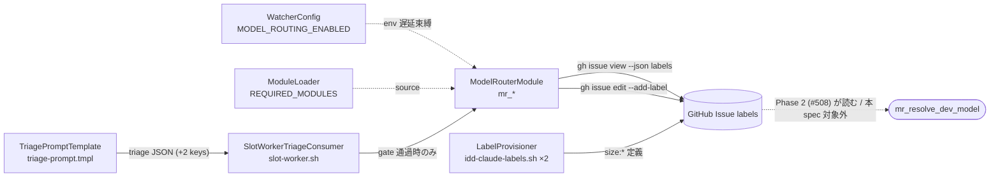
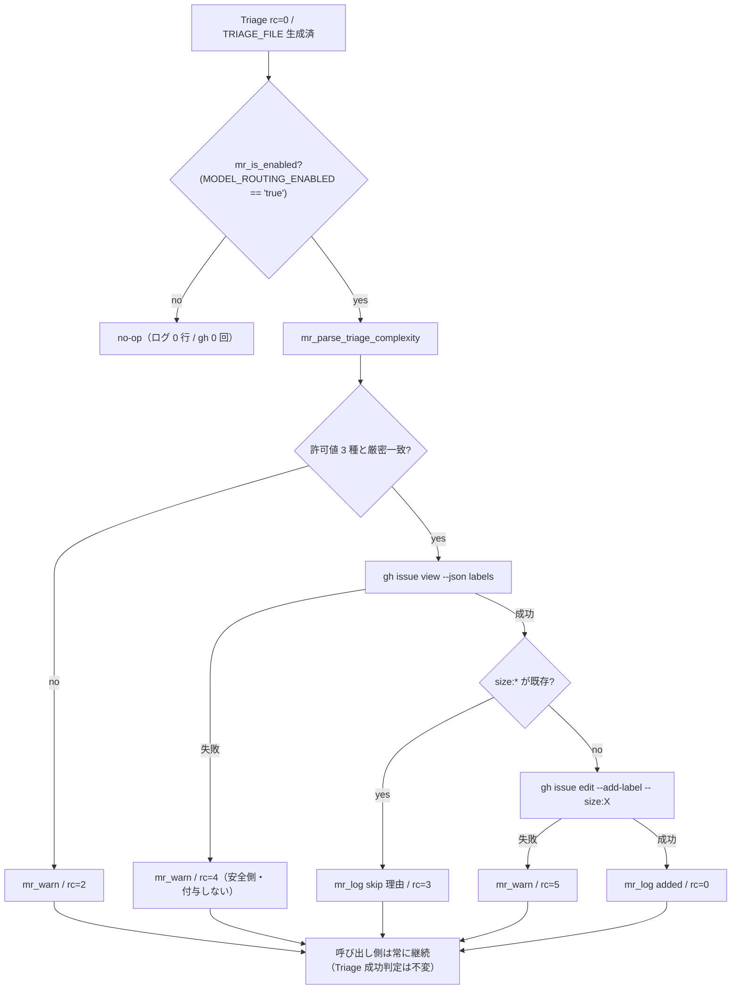

# Design Document

## Overview

**Purpose**: Triage が既に Issue 全文を読んでいる事実を利用して「変更規模（`complexity`）」を additive
フィールド 1 つで取得し、`size:small` / `size:medium` / `size:large` ラベルとして Issue に永続化する。
これにより Triage を再実行しないサイクル（impl-resume / PR Iteration / Failed Recovery）でも判定結果を
sticky に参照でき、人間が事前にラベルを貼ることで判定を override できる運用ゲートが生まれる。

**Users**: watcher 運用者（cron / launchd で idd-claude を回す人）と、Issue にラベルを貼って
モデル選択を制御したいメンテナ。実装フェーズの自動起動フローには本 Phase では一切介入しない。

**Impact**: 現在 Triage 出力は 6 keys で、サイズに関する情報を持たない。本設計は (a) Triage prompt に
2 keys を additive 追加し、(b) 新規 module `model-router.sh`（prefix `mr_`）で値の parse と
ラベル永続化を行い、(c) `MODEL_ROUTING_ENABLED=true` の opt-in gate 配下でのみ GitHub 状態を変更する。
gate 未設定環境では GitHub API 呼び出し 0 回・ログ差分 0 の完全 no-op となる。

**#18（Phase E）との対応関係**: 本機能は #18 と **同型・同位置**の構造を取る。Triage 出力への additive
拡張 → 純粋 parse 関数（fail-safe）→ 永続化関数（fail-open）→ opt-in gate で囲んだ Triage 直後の
call site、という 4 点が一致する。差分は永続化先が sticky comment ではなく **ラベル**（Phase 2 が
Triage 非実行経路から低コストに読めるため）である点のみ。

> **分量バジェット超過の理由**: 「標準（≤300 行）」目安を超えている。本 spec は module 1 本の追加だが、
> 変更面が 5 境界（Triage prompt / module / 本体配線 / labels script 2 系統 / 運用ドキュメント）に
> またがり、requirements の AC 数が 63 件あるため、AC 単位の error 対応表と Traceability 表で
> 行数が伸びている。逐語コード転載は行わず、契約（シグネチャ・rc・ログ）と表・図のみに絞っている。

### Goals

- Triage 出力へ `complexity` / `complexity_reason` を additive 追加し、既存 6 keys を不変に保つ
- `MODEL_ROUTING_ENABLED=true` 時のみ `size:*` ラベルを冪等に 1 つだけ付与する
- 既存 `size:*` ラベル（人間 override / 過去 Triage 由来）が 1 つでもあれば一切触らない
- 不正値・API 失敗のいずれでも Triage / dispatch を止めない（fail-safe / fail-open）
- consumer repo でも同一手順で 3 ラベルを揃えられる（labels script 2 系統への **additive parity**）

### Non-Goals

- Phase 2（#508）のモデル ID 解決と slot 実行経路への差し込み / Phase 3（#509）の分割案コメント
- `complexity_reason` の Issue 上への永続化（ログ出力に留める）
- 既存 Issue への遡及付与（retrofit）、人間の付け替えに対する再判定
- slot 外 processor（PR Iteration / Failed Recovery 等）のモデル選択
- **#54 由来の labels script 既存ドリフト**（repo-template 側の旧エントリ 11 件に `【Issue 用】` /
  `【PR 用】` prefix が無い等）の是正 — Req 6.2 と衝突するため別 Issue の領分（Req 7.2）

## Architecture

### Existing Architecture Analysis

| 観点 | 現状 | 本設計での扱い |
|---|---|---|
| Triage 出力契約 | `triage-prompt.tmpl` が 6 keys の JSON を `$TRIAGE_FILE` へ書く | additive 拡張のみ。既存 key の抽出式（`jq -r '.status'` 等）を触らない |
| Triage 消費部 | `slot-worker.sh:492-511`（既存 key 抽出 → Phase E edit_paths 永続化） | 511 行直後に同型 gate ブロックを 1 つ追加 |
| Triage 非実行経路 | `slot-worker.sh:389-397` の `HAS_EXISTING_SPEC` / `skip-triage` 分岐が Triage ブロック全体を迂回 | call site をこの `else` 枝の内側に置くことで Req 4.5 / 4.6 を**構造的に**満たす（追加判定を書かない） |
| opt-in gate 慣習 | `PATH_OVERLAP_CHECK="${PATH_OVERLAP_CHECK:-off}"` + call site の `= "true"` 厳密一致 | 同じ 2 段構え（config で既定値、gate 関数で厳密一致）を踏襲 |
| ロガー | 新規 module は自 module 内で定義（`tc_log` / `dbg_log` / `dr_log` / `po_log`）、旧 module 由来は `core_utils.sh` に同居 | 新規のため `model-router.sh` 内に `mr_log` / `mr_warn` を定義 |
| module 配布 | `install-lib.sh:1311-1318` が `local-watcher/bin/modules/*.sh` を glob 配布 | **installer 変更不要**（裏取り済み） |
| ラベル定義 | `idd-claude-labels.sh` の `LABELS=()` 配列（縦棒区切りの name / color / description）を冪等プロビジョニング。**root と repo-template は着手前から byte 一致していない**（#54 の積み残し） | 配列末尾に 3 行追加。両系統とも既存行は不変（additive parity / Req 7.1, 7.2） |

尊重すべき境界: Triage Agent（LLM 側の判定責務）と watcher（永続化の責務）を分離し、gate は
watcher 側の永続化のみを制御する（Req 3.5）。既存 technical debt（#54 ドリフト）は本 spec では
解消せず、**触らない**ことで Req 6.2 との衝突を避ける。

### Architecture Pattern & Boundary Map



**Architecture Integration**:

- 採用パターン: 既存 module + 関数 prefix namespace（`mr_`。repo 内未使用を確認済み）。純粋関数
  （parse / 判定）と副作用関数（永続化）を分離し、前者を unit test の主対象にする
- ドメイン境界: 「Triage 出力の解釈」= `mr_parse_triage_complexity` /「ラベル状態遷移」=
  `mr_persist_size_label` /「gate 判定」= `mr_is_enabled` の 3 責務
- 既存パターンの維持: gate の厳密一致正規化、fail-open な永続化、`[ts] [$REPO] <prefix>:` の 3 段ログ
  prefix、`extract_function` による単一関数隔離テスト
- 新規 module の根拠: Phase 2 / Phase 3 が同 family に載るため、path-overlap.sh 等へ同居させない
  （CLAUDE.md 機能追加ガイドライン §1）

### Technology Stack

| Layer | Choice / Version | Role in Feature | Notes |
|---|---|---|---|
| CLI / Runtime | bash 4+ | module 実装 | `set -euo pipefail` は本体宣言。module は関数定義のみ |
| LLM | Triage（既定 `claude-sonnet-4-6`） | `complexity` 判定 | 追加 LLM 実行なし（NFR 3.3）。turn 上限 15 は不変（NFR 3.4） |
| Data / Storage | GitHub Issue labels | 判定結果の永続化 | sticky comment より読み出しコストが低い |
| External CLI | `gh` / `jq` | ラベル読み書き / JSON 解析 | 1 Issue あたり最大 2 呼び出し（NFR 3.1） |
| Provisioning | `idd-claude-labels.sh` | `size:*` 定義の冪等作成 | root / repo-template の 2 系統へ additive parity で反映 |

## File Structure Plan

### New Files

```
local-watcher/bin/modules/
└── model-router.sh          # 新規 module（prefix mr_ / family なし / 関数定義のみ）
local-watcher/test/
└── model_router_test.sh     # 近接テスト（extract_function + gh stub + wiring grep）
```

### Modified Files

| ファイル | 変更内容 |
|---|---|
| `local-watcher/bin/triage-prompt.tmpl` | 出力 JSON スキーマ例に `complexity` / `complexity_reason` を additive 追加し、判定基準節（Req 1.3〜1.8）を末尾に追記 |
| `local-watcher/bin/watcher-config.sh` | Phase E gate 群（`PATH_OVERLAP_CHECK` 付近）の直後に `MODEL_ROUTING_ENABLED="${MODEL_ROUTING_ENABLED:-false}"` を宣言（#112 の既定 true 正規化ループには**含めない**） |
| `local-watcher/bin/issue-watcher.sh` | `REQUIRED_MODULES` 配列（L259）へ `"model-router.sh"` を `"path-overlap.sh"` の直後に追加 |
| `local-watcher/bin/modules/slot-worker.sh` | Phase E edit_paths 永続化ブロック（L498-511）の直後に、同型の gate ブロック 1 つを挿入 |
| `.github/scripts/idd-claude-labels.sh` | `LABELS=()` 末尾に `size:small` / `size:medium` / `size:large` の 3 行追加 |
| `repo-template/.github/scripts/idd-claude-labels.sh` | 上記 **3 行のみ**を同一文字列・同一相対位置（配列末尾）で追加する（additive parity / Req 7.1）。既存行の差分（#54 ドリフト）は触らない（Req 7.2） |
| `README.md` | ①「ディレクトリ構成」ツリーに `model-router.sh` 行、②「opt-in（既定 OFF）」表に `MODEL_ROUTING_ENABLED` 行、③ 新規節「Model Routing Phase 1（#507）」（size ラベルの意味 / 人間 override / 誤付与時の訂正手順 / migration note） |
| `CLAUDE.md` | 機能追加ガイドライン §2 の prefix 表に `mr_` 行を追加 |

### 変更不要（裏取り済み）

- `install.sh` / `install-lib.sh` — `copy_glob_to_homebin "$LOCAL_WATCHER_DIR/bin/modules" "*.sh"`
  （`install-lib.sh:1311-1318`）で新 module を自動配布するため改修不要
- `repo-template/local-watcher/` — 構造的に存在しない（`triage-prompt.tmpl` は `local-watcher/bin/` のみ）
- `.github/workflows/issue-to-pr.yml` — Actions 版に Triage 相当処理がないため対象外（Out of Scope）
- `.claude/agents` / `.claude/rules`（root ↔ repo-template）— 本 spec では変更しない。両系統は
  byte 一致が維持されている（実測でドリフトなし）ため、verify の `diff -r` 2 本はそのまま通る

## Components and Interfaces

### Model Routing / ModelRouterModule

新規 module `local-watcher/bin/modules/model-router.sh`。全関数が `mr_` prefix を持ち、
トップレベル副作用を持たない。

| Field | Detail |
|---|---|
| Intent | Triage の `complexity` を安全に解釈し、`size:*` ラベルとして冪等・fail-open に永続化する |
| Requirements | 2.3, 2.4, 3.1, 3.2, 3.3, 3.4, 4.1, 4.2, 4.3, 4.4, 4.7, 5.1, 5.2, 5.3, 5.4, 5.6, NFR 2.1, NFR 2.2, NFR 3.1, NFR 3.2, NFR 4.1, NFR 4.2, NFR 4.3 |

**Responsibilities & Constraints**

- gate 判定・値検証・ラベル状態遷移のみを担い、Triage の成否判定・mode 判定に触れない（Req 2.4 / 2.5）
- 未信頼値（LLM 出力）はラベル名構成の**直前**に許可値集合と厳密一致で検証する（Req 5.2 / NFR 4.1）
- `gh` 呼び出しは 1 Issue あたり最大 2 回、gate 無効時は 0 回（NFR 3.1 / 3.2）
- silent fail を作らず、全分岐で `mr_log` / `mr_warn` を 1 行残す（Req 5.6 / NFR 2.2）

**Dependencies**

- Inbound: `SlotWorkerTriageConsumer`（Triage 直後の 1 箇所のみ / Critical）
- Outbound: `gh`（labels の read / add）、`jq`（JSON 解析）（Critical）
- Global（遅延束縛）: `$REPO` / `$MODEL_ROUTING_ENABLED`（`WatcherConfig` が定義）

**Contracts**: Service [x] / API [ ] / Event [ ] / Batch [ ] / State [x]

#### Service Interface

```bash
mr_log   "<msg>"                                  # stdout: "[ts] [$REPO] model-router: <msg>"
mr_warn  "<msg>"                                  # stderr: "[ts] [$REPO] model-router: WARN: <msg>"

mr_is_enabled                                     # rc 0 = 有効 / 1 = 無効（"true" 厳密一致のみ 0）
mr_parse_triage_complexity <triage_json_path>     # stdout: small|medium|large|""   rc: 0 always
mr_has_size_label <labels_json> [<prefix>]        # rc 0 = 既存あり / 1 = なし / 2 = 判定不能
mr_persist_size_label <issue_number> <complexity> # rc: 下表   副作用: gh issue edit --add-label
```

- **Preconditions**: `$REPO` が束縛済み。`mr_persist_size_label` は Triage 実行経路からのみ呼ばれる
- **Postconditions**: rc=0 のとき当該 Issue に `size:<complexity>` が 1 つだけ存在する
- **Invariants**: 既存 `size:*` が 1 つ以上あるときラベル集合を変更しない（Req 4.2 / 4.3 / 4.4）。
  `complexity_reason` はラベル名構成に使わない（NFR 4.3）

#### `mr_persist_size_label` の戻り値契約

| rc | 条件 | 挙動 | AC |
|---|---|---|---|
| 0 | 付与成功 | `mr_log` に issue 番号 + complexity + label 名を出力 | 4.1, NFR 2.1 |
| 1 | gate 無効（defense-in-depth） | 即 return。ログ・API ともゼロ | 3.4, NFR 1.1 |
| 2 | `complexity` が欠落 / 不正値 | `mr_warn`。API 呼び出しゼロ | 5.1, 5.2 |
| 3 | 既存 `size:*` あり | `mr_log`（skip 理由を明示）。付与しない | 4.2, 4.3, 4.4, 4.7 |
| 4 | labels 取得失敗 / JSON 解析不能 | `mr_warn`。付与しない（安全側） | 5.4 |
| 5 | `gh issue edit --add-label` 失敗 | `mr_warn`。呼び出し側は継続 | 5.3 |

呼び出し側は rc を分岐に使わず無条件に吸収する（ログは関数側が完結して出す）。

#### 実装方針メモ（逐語コードは書かない）

- `mr_parse_triage_complexity`: `jq -r` で `.complexity` の `type == "string"` を確認してから値を取り、
  それ以外は空文字へ倒す。`2>/dev/null` + 失敗時 `echo ""` で jq 失敗も吸収（`po_parse_triage_edit_paths`
  と同型）。取得後に `case ... in small|medium|large) ;; *) 空文字 ;; esac` で正規化する
- `mr_has_size_label`: `jq -r --arg p "$prefix" '[.labels[]?.name // empty] | map(select(startswith($p))) | length'`
  で件数を取り、jq 失敗 / 非数値は rc=2（判定不能）へ倒す
- `mr_persist_size_label`: `gh issue view "$n" --repo "$REPO" --json labels` → `mr_has_size_label` →
  `gh issue edit "$n" --repo "$REPO" --add-label -- "size:${complexity}"`。ラベル prefix リテラル
  `size:` は本 module 内 2 箇所（`mr_has_size_label` の既定引数 / `mr_persist_size_label` の構成部）に
  のみ出現させ、命名変更時の変更点を局所化する

### Triage / TriagePromptTemplate

| Field | Detail |
|---|---|
| Intent | Triage Agent に `complexity` / `complexity_reason` を出力させる（gate と無関係に常時出力 / Req 3.5） |
| Requirements | 1.1, 1.2, 1.3, 1.4, 1.5, 1.6, 1.7, 1.8, 2.1, 2.2, NFR 3.3, NFR 3.4 |

- 出力 JSON 例に 2 keys を **末尾追加**（`edit_paths` の後）。既存 6 keys の位置・型・意味は不変
- 判定基準は `## complexity の出力指示（モデルルーティング Phase 1）` 節に集約し、既存の
  `needs_architect` 判定基準節には一切手を入れない（Req 1.8）
- `needs_architect: true` → `complexity: "large"` 固定（Req 1.6）、境界時は大きい側（Req 1.7）を明記
- 追加は指示文のみで tool 実行を伴わないため turn 上限 15 に影響しない（NFR 3.4）

### Wiring / WatcherConfig・ModuleLoader・SlotWorkerTriageConsumer

| Field | Detail |
|---|---|
| Intent | gate 変数の宣言、module の source 登録、Triage 直後の call site 接続 |
| Requirements | 2.5, 3.1, 3.2, 3.3, 3.6, 4.5, 4.6, NFR 1.1, NFR 1.2, NFR 1.3, NFR 2.3 |

call site（`slot-worker.sh` の Phase E ブロック直後）の擬似構造:

```bash
# ── Model Routing Phase 1: size ラベル永続化 (#507) ──
if mr_is_enabled; then
  _mr_complexity=$(mr_parse_triage_complexity "$TRIAGE_FILE")
  mr_persist_size_label "$NUMBER" "$_mr_complexity" || true   # rc は吸収（関数側がログ完結）
fi
```

- 配置は `needs-decisions` 分岐（L513）より **前**。Phase E と同じく Triage 結果取得直後に 1 回だけ
  実行し、needs-decisions で早期 return する Issue にもラベルが残る
- 本ブロックは `$STATUS` / `$NEEDS_ARCHITECT` / `$MODE` を読み書きしないため、mode 判定と
  needs-decisions 経路は構造的に不変（Req 2.5）
- `skip-triage` / `impl-resume` 経路は Triage ブロックごと迂回されるため付与されない（Req 4.5 / 4.6）
- 出力先は既存 `po_log` と同一の slot stdout（cron ログ経路）（NFR 2.3）
- gate は Phase 1 / Phase 2 共通の単一変数 `MODEL_ROUTING_ENABLED` とし Phase 別 gate を設けない（Req 3.6）

### Provisioning / LabelProvisioner

| Field | Detail |
|---|---|
| Intent | `size:*` 3 ラベルを consumer repo でも冪等に作成できるようにする |
| Requirements | 6.1, 6.2, 6.3, 6.4, 6.5, 7.1, 7.2 |

- 既存 `LABELS=()` 配列の末尾に 3 行追加するのみ。既存行の name / color / description は不変（Req 6.2）
- 冪等性はスクリプト側の既存ロジック（存在チェック → skip / `--force` 時のみ更新）で担保（Req 6.3）
- **既存ドリフトの前提（重要 / 実測）**: 本 Issue 着手時点で root と repo-template のラベル定義
  スクリプトは **byte 一致していない**。#54（description への `【Issue 用】` / `【PR 用】` prefix 付与）
  が root 側にしか反映されておらず、repo-template 側は旧エントリ 11 件に prefix が無く、root にのみ
  存在するコメント 4 行もある（実測 diff hunk: `60,63d59` / `65,74c61,70` / `80c76`）
- **同期方針 = additive parity（Req 7.1）**: 本 Issue の同期義務は「追加 3 エントリを両系統へ
  同一文字列・同一相対位置（配列末尾）で追加する」ことに限定する。repo-template 側でも
  `【Issue 用】` prefix 付きで追加し、周辺の旧エントリと prefix の有無が揃わない内部不整合は
  そのまま残す（**parity 優先**）
- **既存ドリフトは是正しない（Req 7.2 / Out of Scope）**: 是正には既存 description の書き換えが
  必要で Req 6.2 と正面衝突し、1 PR = 1 Issue 原則にも反する。別 Issue の領分とする
- **検証は whole-file diff ではなく `size:` 行の抽出比較**（Req 8.5 / 後述 Testing Strategy）。
  whole-file diff を検証に用いると、正しい実装でも既存ドリフトにより必ず非 0 exit となり、
  Stage A が false-fail する（#364 と同根）

## Data Models

### Triage 出力 JSON（before / after）

| key | before | after | 備考 |
|---|---|---|---|
| `status` / `needs_architect` / `architect_reason` / `rationale` / `decisions` / `edit_paths` | 6 keys | **不変** | 位置・型・意味を変更しない（Req 2.1） |
| `complexity` | — | `"small"` / `"medium"` / `"large"` のいずれか | 追加（Req 1.1） |
| `complexity_reason` | — | `string`（1〜2 行） | 追加（Req 1.2）。ログのみで消費、永続化しない |

旧テンプレートで生成された結果（2 keys 欠落）は `mr_parse_triage_complexity` が空文字を返し、
`mr_persist_size_label` が rc=2 で WARN を残して継続する（Req 2.3 / 2.4）。

### `size:*` ラベル定義案

| name | color | description（`【Issue 用】` prefix・100 文字以内 / Req 6.4, 6.5） |
|---|---|---|
| `size:small` | `c2e0c6` | `【Issue 用】 Triage 判定の変更規模: 小（単一〜少数ファイルの軽微な変更）` |
| `size:medium` | `fef2c0` | `【Issue 用】 Triage 判定の変更規模: 中（数ファイル横断・設計判断は自明）` |
| `size:large` | `f7c6c7` | `【Issue 用】 Triage 判定の変更規模: 大（複数モジュール横断・新規連携・永続構造変更）` |

色は GitHub 標準パレット由来の 6 桁小文字 hex で、既存 18 ラベルのいずれとも重複しない
（緑 → 黄 → 赤の規模ランプ）。上記 3 行は **root / repo-template の双方へ同一文字列**で追加する。

## 処理フロー



## Error Handling

### Error Strategy

補助機能であるため **一切のエラーで既存パイプラインを止めない**。値の不正は fail-safe（空文字へ倒す）、
GitHub 操作の失敗は fail-open（WARN + 継続）。判定不能は「付与しない」側へ倒す（誤上書き回避）。

### Error Categories and Responses（Requirement 5 の AC 単位）

| AC | 事象 | 応答 | 実装位置 |
|---|---|---|---|
| 5.1 | `complexity` 欠落 / `null` / 非文字列 / 許可値外 | ラベル付与せず WARN のみ、処理継続 | `mr_parse_triage_complexity` → rc=2 |
| 5.2 | LLM 出力をラベル名へ使用 | 使用直前に `case` で許可値 3 種と厳密一致検証 | `mr_persist_size_label` 冒頭 |
| 5.3 | `gh issue edit` 失敗（API 不達 / rate limit / 権限 / ラベル未定義） | WARN + rc=5、サイクル継続 | `mr_persist_size_label` |
| 5.4 | `gh issue view --json labels` 失敗 / JSON 解析不能 | 付与せず WARN + rc=4（安全側） | `mr_has_size_label` rc=2 経由 |
| 5.5 | 既存ラベル遷移契約 | `claude-claimed` 等に一切触れない（`--add-label` のみ使用し `--remove-label` を持たない） | 設計上の不変条件 |
| 5.6 | silent fail 禁止 | 全 rc 分岐で `mr_log` / `mr_warn` を 1 行出力 | `mr_persist_size_label` |

**gate 無効時のログ**: Req 4.7 の「スキップ理由ログ」は gate 通過後の skip 事象を対象とする。
gate 無効時は NFR 1.1（導入前と同一のログ出力）を優先し、**ログも API も出さない完全 no-op** とする。

## Testing Strategy

近接テスト `local-watcher/test/model_router_test.sh`。既存イディオム（`lib/test-helpers.sh` を source
→ `extract_function` で単一関数を隔離抽出 → `gh` を stub して呼び出しトレースを観測）を踏襲する。

### Unit Tests（`mr_parse_triage_complexity` / `mr_has_size_label` / `mr_is_enabled`）

1. 許可値 3 種（`small` / `medium` / `large`）がそのまま返る
2. key 欠落 / `null` / 数値 / 配列 / object → 空文字（Req 2.3 / 5.1）
3. 不正値（`huge` / `SMALL` / 前後空白付き / 注入を狙った文字列）→ 空文字（Req 5.2 / NFR 4.1）
4. ファイル不在 / 不正 JSON → 空文字（fail-safe / Req 2.4）
5. `mr_is_enabled`: `true` のみ rc=0。未設定 / 空 / `false` / `off` / `True` / `1` は rc=1（Req 3.1〜3.3）
6. `mr_has_size_label`: `size:medium` あり=0 / 無関係ラベルのみ=1 / 空配列=1 / 不正 JSON=2（Req 4.2 / 5.4）

### Integration Tests（`mr_persist_size_label` + `gh` stub）— Req 8.4 の 5 ケース対応

| # | ケース | 期待 | Req 8.4 対応 |
|---|---|---|---|
| I1 | 許可値 3 種の正常付与 | `gh issue edit --add-label size:X` が各 1 回、rc=0、ログに issue 番号 + complexity | 「許可値 3 種の正常付与」 |
| I2 | `complexity` 空文字（欠落相当） | gh 呼び出し 0 回、WARN 1 行、rc=2 | 「`complexity` 欠落」 |
| I3 | 不正値 | gh 呼び出し 0 回、WARN 1 行、rc=2 | 「不正値」 |
| I4 | 既存 `size:large` あり | add-label 0 回、skip ログ、rc=3 | 「既存 `size:*` ラベルあり」 |
| I5 | `MODEL_ROUTING_ENABLED` 未設定 / `True` / `1` | gh 呼び出し 0 回、出力 0 行、rc=1 | 「gate 無効」 |
| I6 | labels 取得失敗 / add-label 失敗 | それぞれ WARN + rc=4 / rc=5、呼び出し側継続 | Req 5.3 / 5.4（追加） |
| I7 | 正常経路の gh 呼び出し総数 | 2 回以下 | NFR 3.1 / 3.2 |

### Wiring Tests（grep ベース / 実行なし）

1. `issue-watcher.sh` の `REQUIRED_MODULES` に `model-router.sh` が含まれる
2. `watcher-config.sh` に `MODEL_ROUTING_ENABLED` の既定値宣言が存在する
3. `slot-worker.sh` の Phase E ブロック**後**に gate ブロックがあり、gate 外に
   `mr_persist_size_label` 呼び出しが存在しない

### Static / Manual

- `shellcheck` 警告ゼロ（Req 8.1）、`bash -n` 通過（Req 8.2）
- **labels script parity（Req 7.1 / 8.5）**: 両系統から `size:` エントリ行のみを抽出して比較し、
  双方が同一の 3 行になることを確認する。**whole-file diff は検証条件としない**（既存ドリフトに
  より正しい実装でも必ず非 0 exit になるため / #364 と同根の false-fail 予防）:

  ```sh
  diff <(grep -E '^[[:space:]]*"size:(small|medium|large)\|' .github/scripts/idd-claude-labels.sh) \
       <(grep -E '^[[:space:]]*"size:(small|medium|large)\|' repo-template/.github/scripts/idd-claude-labels.sh)
  ```

  プロセス置換は stage-a-verify が `bash -c "cd \"$REPO_DIR\" && <cmd>"`（`stage-a-verify.sh:989`）で
  実行するため利用可能（`sh` ではなく `bash` で評価される。裏取り済み）
- **同期 diff（byte 一致対象）**: `.claude/agents` / `.claude/rules` の 2 系統のみ `diff -r` で確認する
  （実測でドリフトなし。labels script は byte 一致対象に含めない）
- 手動スモーク（Req 8.6）: gate 有効かつ `size:*` 未作成の repo で auto-dev Issue を 1 件流し、
  「add-label 失敗 → WARN 1 行 → Triage 継続 → 通常どおり impl/design へ遷移」を cron ログで確認する

## Security Considerations（NFR 4）

- `complexity` は LLM 出力（未信頼）。`case` による許可値厳密一致を通過した値のみラベル名に使う（NFR 4.1）
- `gh` へ渡す全変数はクォートし、`--add-label -- "size:${complexity}"` と `--` でオプション解釈を打ち切る。
  `jq` へ渡す未信頼値は `--arg` で束縛し、フィルタ文字列へ inline 展開しない（NFR 4.2 / CLAUDE.md §5）
- Issue 番号は既存 dispatcher が確定した値をそのまま使い、`complexity_reason` は**ログ出力のみ**で
  ラベル名・コマンド引数の構成に使わない（NFR 4.3）

## Phase 2（#508）の拡張点 — 本 spec では実装しない

Phase 2 は本 module に `mr_resolve_dev_model <issue_number>`（`size:*` ラベル → モデル ID を返す関数）を
追加し、`impl-pipeline.sh` の Stage A claude 起動直前で `DEV_MODEL` を差し替える形で載る。gate は
本 Phase と同じ `MODEL_ROUTING_ENABLED` を共有し（Req 3.6）、ラベル不在時は既定 `DEV_MODEL` へ fallback
する。**本 spec では当該関数・call site・モデル ID マッピング env を一切追加しない**（投機的抽象化の排除）。

## リスクと緩和策

| リスク | 影響 | 緩和策 |
|---|---|---|
| **既存ドリフトを whole-file diff で検証すると Stage A が false-fail する**（#54 の積み残しにより root ↔ repo-template の labels script は着手前から不一致） | 正しい実装でも非 0 exit → `claude-failed` まで escalate（#364 と同根） | 検証を `size:` エントリ行の**抽出比較**に限定し、verify ブロックから whole-file labels diff を排除する（Req 8.5 / Testing Strategy「Static / Manual」節） |
| repo-template 側で「旧エントリのみ prefix なし」の内部不整合が残る | consumer 配布物の description が root と部分的に異なる | Req 7.2 に従い本 Issue では触らず、別 Issue 起票を「確認事項」に明記して引き継ぐ |
| `size:*` ラベル未作成の repo で付与が毎回失敗 | ログノイズ | Req 5.3 の fail-open + README に labels script 再実行手順を明記（Req 8.6 の検証項目に含める） |
| Triage が `complexity` を出さない（旧テンプレ / 出力ゆれ） | ラベルが付かない | fail-safe で空文字 → WARN 継続。次回 Triage で再付与される |
| 人間の誤付与ラベルが Triage 判定を恒久的に上書き | 誤ったサイズが固定化 | Req 4.2 どおり「先に存在するラベル優先」を維持し、訂正手順（剥がす → 次回 Triage で再付与）を README に記載 |
| call site 追加による Triage 経路の regression | Issue 処理全体の停止 | gate 内に閉じ込め、戻り値を吸収して後続へ伝播させない。gate 無効時の no-op を wiring test + I5 で固定 |

## Requirements Traceability

| Requirement | Summary | Components | Task |
|---|---|---|---|
| 1.1, 1.2, 1.3, 1.4, 1.5, 1.6, 1.7, 1.8 | Triage による 3 段階サイズ判定と根拠出力 | TriagePromptTemplate | 2 |
| 2.1, 2.2 | additive 拡張（既存 6 keys 不変 / 追加は 2 keys のみ） | TriagePromptTemplate | 2 |
| 2.3, 2.4 | 欠落・parse 失敗の graceful degrade | ModelRouterModule (`mr_parse_triage_complexity`) | 3 |
| 2.5 | mode 判定・needs-decisions 経路を変えない | SlotWorkerTriageConsumer | 5 |
| 3.1, 3.2, 3.3 | gate 既定無効と `true` 厳密一致正規化 | WatcherConfig, ModelRouterModule (`mr_is_enabled`) | 3, 4 |
| 3.4 | gate 無効時は API・ラベル操作ゼロ | ModelRouterModule, SlotWorkerTriageConsumer | 3, 5 |
| 3.5 | gate 無効でも Triage は `complexity` を出力 | TriagePromptTemplate | 2 |
| 3.6 | Phase 共通の単一 gate | WatcherConfig | 4 |
| 4.1, 4.2, 4.3, 4.4, 4.7 | size ラベル付与・既存優先・冪等・skip ログ | ModelRouterModule (`mr_has_size_label` / `mr_persist_size_label`) | 3 |
| 4.5, 4.6 | `skip-triage` / resume 経路で付与しない | SlotWorkerTriageConsumer（call site 位置で構造保証） | 5 |
| 5.1, 5.2, 5.3, 5.4, 5.5, 5.6 | fail-safe / fail-open / 検証 / silent fail 禁止 | ModelRouterModule | 3 |
| 6.1, 6.2, 6.3, 6.4, 6.5 | size ラベル 3 種のプロビジョニング（既存行は不変） | LabelProvisioner | 1 |
| 7.1, 7.2 | 追加 3 エントリの additive parity / 既存ドリフトは変更しない | LabelProvisioner | 1 |
| 7.3, 7.4, 7.5, 7.6, 7.7 | README（gate / size ラベル / module 一覧）+ CLAUDE.md prefix 表、同一 PR | OperatorDocs | 6 |
| 8.1, 8.2, 8.5, 8.6 | shellcheck / bash -n / `size:` 行抽出比較 / 手動確認 | 全体（verify ブロック） | 7 |
| 8.3, 8.4 | 近接テストと 5 ケース検証 | ModelRouterTest | 3, 5 |
| NFR 1.1, NFR 1.2, NFR 1.3 | 後方互換（no-op / 既存 env・ラベル不変） | WatcherConfig, SlotWorkerTriageConsumer | 4, 5 |
| NFR 2.1, NFR 2.2, NFR 2.3 | 可観測性（1 行ログ / WARN / 出力先） | ModelRouterModule, SlotWorkerTriageConsumer | 3, 5 |
| NFR 3.1, NFR 3.2 | API 呼び出し 2 回以下 / 0 回 | ModelRouterModule | 3 |
| NFR 3.3, NFR 3.4 | 追加 LLM 実行なし / turn 上限不変 | TriagePromptTemplate | 2 |
| NFR 4.1, NFR 4.2, NFR 4.3 | 未信頼入力の検証・クォート・`--` 打ち切り | ModelRouterModule | 3 |

orphan component チェック: Components に挙げた 7 コンポーネント（TriagePromptTemplate /
ModelRouterModule / WatcherConfig / ModuleLoader / SlotWorkerTriageConsumer / LabelProvisioner /
OperatorDocs）+ ModelRouterTest はすべて File Structure Plan に対応ファイルを持つ。

## Open Questions への設計上の立場

| 論点 | 本設計の立場 |
|---|---|
| ラベル命名 `size:small` | requirements の暫定採用（コロン namespace）をそのまま採る。GitHub のラベル名はコロンを許容し、`--` 打ち切りで安全に扱える。`size-small` 系へ変える場合の変更点は labels script ×2 と module 内 prefix リテラル 2 箇所のみで、AC・フローは不変 |
| gate 1 本化 | Req 3.6 どおり `MODEL_ROUTING_ENABLED` 単一 gate を採る。「ラベルだけ運用」ニーズは、Phase 2 未実装の現時点では gate を有効にしてもラベル永続化しか起きないため実質同義 |
| 境界判定の丸め方向 | Req 1.7（大きい側）を prompt に明記する。Phase 2 のコスト方針で逆転する場合は prompt 1 節の差し替えで済む |
| `needs_architect: true` → `large` 固定 | Req 1.6 を prompt の固定ルールとして記述し、検証可能性を優先する |
| 誤付与時の運用手順 | README の新規節に「誤ったラベルを剥がす → 次回 Triage で再付与される」を 1〜2 行で明記する（Req 7.4 の範囲内） |

## 確認事項（requirements への差し戻し候補 / 設計側では発明しない）

1. **Req 4.7 と NFR 1.1 の緊張**: gate 無効時をスキップ扱いにするとログが出て NFR 1.1（導入前と同一の
   ログ出力）に反する。本設計は「gate 通過後の skip のみを Req 4.7 の対象」と解釈した。PM 側で
   AC 文言を補強する余地がある
2. **Req 8.4「gate 無効ケース」の検証層**: 関数単位（`mr_persist_size_label` の rc=1 / API 0 回）+
   wiring grep で担保する設計とした。watcher 全体を起動する E2E は本 spec のテスト戦略に含めない
3. **#54 由来の repo-template labels script ドリフトは別 Issue での是正が必要**: 本 Issue は
   additive parity（Req 7.1 / 7.2）に限定するため、repo-template 側の旧エントリ 11 件に
   `【Issue 用】` / `【PR 用】` prefix が無い状態と、root にのみ存在するコメント 4 行の差分は残る。
   consumer repo へ配布される description が root と異なるままになるため、**別 Issue を起票して
   #54 を repo-template へ反映する**ことを推奨する（本 spec では Out of Scope）
4. **byte 一致同期の対象は `.claude/agents` / `.claude/rules` の 2 系統のみ**（実測でドリフトなし）。
   labels script は本 Issue 以降も whole-file 一致を前提にしないため、将来 spec の verify で
   whole-file diff を復活させないこと
