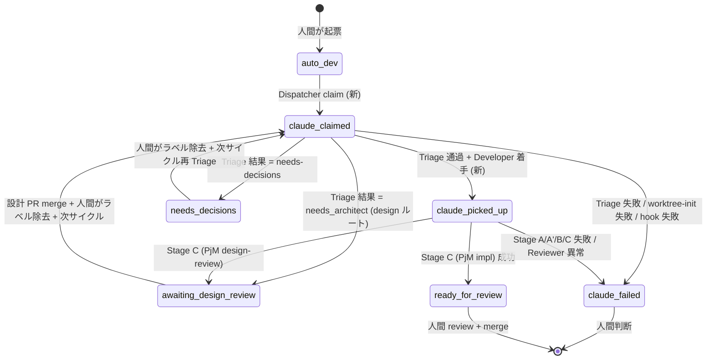

# Design Document

## Overview

**Purpose**: 本機能は **claim/Triage フェーズ専用ラベル `claude-claimed` の新設**と、**Triage 完了後に `claude-claimed` → `claude-picked-up` へ付け替えるフェーズ遷移**を Issue Watcher に追加することで、PR #51（Phase C 並列化）の atomic claim 導入で失われた「1 ラベル = 1 状態」semantic を復元することを、idd-claude を本番運用する**運用者・将来の Phase E 集計ジョブ・Dashboard / SLA 計測の実装者**に提供する。

**Users**: 既存 install 済みリポジトリの運用者（cron で `issue-watcher.sh` を回している人）と、本リポジトリ自身（dogfooding）の Issue 起票者・レビュワー。彼らは「ラベルを 1 つ見れば Issue がワークフローのどの段階にいるか即座に判別したい」という workflow を持つ。

**Impact**: 現在 `claude-picked-up` が「claim 完了」「Triage 実行中」「実装中」を区別できず混在している状態を、`claude-claimed`（claim〜Triage 完了直前）と `claude-picked-up`（Triage 通過後の Developer 実行中）の 2 ラベルに分離する。**watcher の状態機械の各遷移点を 1 個ずつ書き換える局所的リファクタ**であり、ラベル追加 1 + 既存ラベル意味の精緻化のみで、既存環境変数・cron 登録文字列・Issue ラベルの集合（最終終端ラベル）は不変。

### Goals

- `claude-claimed` ラベルを idd-claude 本体（`local-watcher/bin/issue-watcher.sh`）と Label Setup Script（`.github/scripts/idd-claude-labels.sh` および `repo-template/` 同等品）に追加する
- Dispatcher の atomic claim ラベルを `claude-picked-up` から `claude-claimed` に切り替える
- Triage 完了かつ Developer 着手判定時に `claude-claimed` → `claude-picked-up` の atomic 付け替えを行う
- 終端遷移（needs-decisions / awaiting-design-review / claude-failed / ready-for-review）すべての経路で `claude-claimed` を残置しない
- ピックアップ exclusion query に `claude-claimed` を追加し、二重 claim を防ぐ
- 既存進行中 Issue（旧 `claude-picked-up` のみ付き）が新版 watcher 起動後も誤遷移なく完走する

### Non-Goals

- ラベル名の rename / 既存ラベルの廃止（後方互換性最優先、Req 5.4 / NFR 2.2）
- GitHub Actions 版ワークフロー（`.github/workflows/issue-to-pr.yml` および `repo-template/` 同等品）への `claude-claimed` 導入（Out of Scope）
- PR #51 の Dispatcher / slot manager / worktree manager の構造変更
- Reviewer Gate 内部のステージ遷移（Stage A / A' / B / B' / C）でのラベル細分化
- Dashboard / SLA 集計ロジックの更新
- `claude-claimed` 起点の追加自動化（claim 後 timeout 解除等）
- 設計 PR ルートにおける `claude-picked-up` 経由の復活（`claude-claimed → awaiting-design-review` 直行を採用）

## Architecture

### Existing Architecture Analysis

`local-watcher/bin/issue-watcher.sh` は約 3160 行の単一 bash スクリプトで、以下のレイヤを持つ:

- **Dispatcher**（L3055-3154）: 1 サイクルで Issue 候補を取得し、空き slot を flock で確保、`claude-picked-up` ラベルを付与（claim）してから Slot Worker を fork する。**ラベル付与の atomicity を Dispatcher の単一プロセス性で構造的に保証している**（PR #51 Phase C で導入）
- **Slot Runner `_slot_run_issue`**（L2719-2999）: per-slot 永続 worktree で Triage → mode 判定 → claude（PM / Architect / Developer / PjM）起動を実行する。Triage 結果 `needs-decisions` で Issue にコメント + ラベル付け替えして return、Triage 通過後は design / impl 系へ分岐
- **Stage 状態機械 `run_impl_pipeline`**（L2243-2353）: Stage A / A' / B / B' / C を駆動。失敗時は `mark_issue_failed` で `LABEL_PICKED → LABEL_FAILED` 遷移
- **PjM サブエージェント `.claude/agents/project-manager.md` / `repo-template/.claude/agents/project-manager.md`**: claude が PR を作るとき、Issue ラベルを `claude-picked-up → ready-for-review|awaiting-design-review` に付け替える指示が prompt に直書きされている

**尊重すべきドメイン境界**:

- Dispatcher は **claim atomicity を握る唯一のプロセス** という不変条件を維持する
- Slot Runner サブシェルから親プロセスへ環境変数は伝播しない設計（Req 3.5 構造的保証）を維持する
- PjM の prompt 文字列内ラベル名は **watcher 側の `LABEL_*` 変数とは別** 系統（claude へ自然言語で指示するため hardcode）で、両者を二重に更新する必要がある

**解消する technical debt**: PR #51 後に `claude-picked-up` が 3 状態を兼任する semantic 混乱。

### Architecture Pattern & Boundary Map



**Architecture Integration**:

- 採用パターン: **State Refinement**（既存単一状態の細分化）。新規コンポーネントは導入せず、既存 Dispatcher / Slot Runner / PjM agent の各遷移点を 1 個ずつ書き換える
- ドメイン／機能境界:
  - **Label Setup Script** が `claude-claimed` の存在を保証
  - **Dispatcher** が claim 時に `claude-claimed` を付与し、ピックアップ query で `claude-claimed` を除外
  - **Slot Runner** が Triage 完了後 / 終端遷移時にラベル付け替え（`_slot_run_issue` 内 + `_slot_mark_failed`）
  - **`run_impl_pipeline` 内 `mark_issue_failed`** は impl 系の Stage A 以降の失敗用で、ここでの除去対象は引き続き `claude-picked-up`（Stage A 開始＝Triage 通過後＝既に付け替え済みのため）
  - **PjM agent template** は impl 系で `claude-picked-up → ready-for-review` のまま、design-review モードでは prompt のラベル指示を変更しない（既に `claude-picked-up` から付け替え後＝design ルートでは `claude-picked-up` 経由しない設計に変える、後述）
- 既存パターンの維持: claim atomicity の構造保証、サブシェル隔離、`mark_issue_failed` の責務分離
- 新規コンポーネントの根拠: 無し（既存コンポーネントの責務に追加）

### Technology Stack

| Layer | Choice / Version | Role in Feature | Notes |
|-------|------------------|-----------------|-------|
| Runtime | bash 4+ | Dispatcher / Slot Runner / Label Setup を実装 | 既存スクリプト |
| GitHub I/O | `gh` CLI | ラベル付与・除去・listing | `gh issue edit --remove-label X --add-label Y` で原子的付け替え |
| JSON parsing | `jq` | Triage 結果 / `gh label list` 結果の処理 | 既存依存 |
| Static analysis | `shellcheck` / `actionlint` | 警告 0 件維持（NFR 3.1 / 3.2） | 既存 CI 規約 |

## File Structure Plan

本機能はリファクタであり、新規ファイル・新規ディレクトリの作成は無い。**変更対象ファイルのみ列挙する**。

### Modified Files

```
local-watcher/bin/issue-watcher.sh    # Dispatcher / Slot Runner / mark_issue_failed の遷移書き換え + LABEL_CLAIMED 追加 + exclusion query 拡張 + design ルート分岐
.github/scripts/idd-claude-labels.sh  # LABELS 配列に "claude-claimed|...|【Issue 用】 ..." を 1 行追加
repo-template/.github/scripts/idd-claude-labels.sh  # 同上（idd-claude 自身は consumer 側スクリプトを持たないが、template は consumer repo 配布用なので同期）
.claude/agents/project-manager.md     # design-review モードで claude-picked-up → claude-claimed に書き換え（design ルートは claude-picked-up を経由しない）
repo-template/.claude/agents/project-manager.md  # 同上
README.md                              # ラベル一覧 + 状態遷移図 + Migration Note + Phase C 「claim タイミングの挙動変更」節を更新
QUICK-HOWTO.md                         # ラベル一覧 + 簡易遷移図に claude-claimed を追加
```

### 既存ファイル: 各変更箇所の責務マッピング

`local-watcher/bin/issue-watcher.sh` の改修ポイント（行番号は現状時点）:

| 行範囲 | 関数 / セクション | 既存挙動 | 改修内容 |
|---|---|---|---|
| L52 | LABEL 定数定義 | `LABEL_PICKED="claude-picked-up"` のみ | `LABEL_CLAIMED="claude-claimed"` を追加（`LABEL_PICKED` は不変） |
| L14 | ファイル冒頭ヘッダコメント | 状態遷移を `auto-dev → Triage → ...` で記述 | `claude-claimed` を遷移経路に挿入 |
| L3069 | Dispatcher exclusion query | `-label:claude-picked-up` を含む | `-label:claude-claimed` を追加 |
| L3120-3126 | Dispatcher claim 付与 | `--add-label "$LABEL_PICKED"` | `--add-label "$LABEL_CLAIMED"` に変更 + WARN メッセージ更新 |
| L2685 | `_slot_mark_failed` | `--remove-label "$LABEL_PICKED" --add-label "$LABEL_FAILED"` | `--remove-label "$LABEL_CLAIMED" --remove-label "$LABEL_PICKED" --add-label "$LABEL_FAILED"`（両方除去で post-Triage 失敗にも対応・後述「両系統除去の根拠」参照） |
| L2878-2882 | `_slot_run_issue` Triage `needs-decisions` 分岐 | `--remove-label "$LABEL_PICKED" --add-label "$LABEL_NEEDS_DECISIONS"` | `--remove-label "$LABEL_CLAIMED" --add-label "$LABEL_NEEDS_DECISIONS"` |
| L2886-2891 | `_slot_run_issue` Triage 通過後 mode 判定 | mode を design/impl 設定するのみ | **新規挿入**: mode 判定後・branch 切る前に `--remove-label "$LABEL_CLAIMED" --add-label "$LABEL_PICKED"` を atomic 実行（Req 2.1 / 2.3 / NFR 1.2） |
| L2204-2206 | `mark_issue_failed`（impl pipeline 用） | `--remove-label "$LABEL_PICKED" --add-label "$LABEL_FAILED"` | 不変（Stage A 開始時点で既に `claude-picked-up` に付け替え済みのため） |
| L2935 | design ルートの prompt 内 `STEPS` | `"Issue ラベル: claude-picked-up → awaiting-design-review に付け替え"` | `"Issue ラベル: claude-claimed → awaiting-design-review に付け替え"`（design ルートでは `claude-picked-up` を経由しない、Req 8.3） |
| L2061 | impl ルートの prompt 内 `STEPS` | `"Issue ラベル: claude-picked-up → ready-for-review に付け替え"` | 不変（impl ルートは引き続き `claude-picked-up` 経由） |

`.claude/agents/project-manager.md` / `repo-template/.claude/agents/project-manager.md` の改修ポイント:

| 箇所 | 既存挙動 | 改修内容 |
|---|---|---|
| design-review モード「実施事項」3 番 | `削除: claude-picked-up / 追加: awaiting-design-review` | `削除: claude-claimed / 追加: awaiting-design-review` |
| design-review モード Issue コメント本文 | （ラベル名の記載なし） | 不変 |
| 「失敗時の挙動」 | `claude-picked-up を外し claude-failed を付与` | `claude-claimed または claude-picked-up を外し claude-failed を付与`（design / impl 双方を許容） |
| implementation モード「実施事項」3 番 | `削除: claude-picked-up / 追加: ready-for-review` | 不変 |

## Requirements Traceability

| Req ID | Summary | Components | Files | Notes |
|---|---|---|---|---|
| 1.1 | Dispatcher claim 時に `claude-claimed` 付与 | Dispatcher | `issue-watcher.sh` L3120-3126 | `LABEL_CLAIMED` 定数経由 |
| 1.2 | claim 時に `claude-picked-up` を付与しない | Dispatcher | `issue-watcher.sh` L3120-3126 | 既存 `LABEL_PICKED` 行を `LABEL_CLAIMED` に置換 |
| 1.3 | `claude-claimed` 付与中＝claim/Triage 状態 | State semantics | README ラベル一覧、QUICK-HOWTO 簡易遷移 | ドキュメント整合 |
| 1.4 | `claude-claimed` 付与失敗時 slot 解放 | Dispatcher | `issue-watcher.sh` L3122-3125 | `_slot_release` 既存呼び出しを維持 |
| 2.1 | Triage 完了 → Developer 進む判定で `claude-claimed` 除去 + `claude-picked-up` 付与 | Slot Runner | `issue-watcher.sh` L2886-2891（新規挿入） | mode = "impl" / "design" 確定後、branch 切る前 |
| 2.2 | impl 進行中は `claude-picked-up` のみ保持 | Slot Runner / `run_impl_pipeline` | `issue-watcher.sh` L2886-L2999, L2243-2353 | post-付け替えで `claude-claimed` 不在を保証 |
| 2.3 | 同時 2 ラベル状態を継続させない | Slot Runner | `gh issue edit --remove-label X --add-label Y` 1 コール（NFR 1.2 の 5 秒以内） | 単一 API call の atomicity に依拠 |
| 3.1 | Triage 結果 `needs-decisions` で `claude-claimed` 除去 + `needs-decisions` 付与 | Slot Runner | `issue-watcher.sh` L2878-2882（書き換え） | `LABEL_PICKED` を `LABEL_CLAIMED` に置換 |
| 3.2 | Triage 結果 architect 起動で `claude-claimed` 除去 + `awaiting-design-review` 付与（design ルートも `claude-claimed` 経由前提） | PjM agent (design-review) + Slot Runner prompt | `project-manager.md` design-review 節、`issue-watcher.sh` L2935 prompt | design ルートでは Triage 後に `claude-picked-up` 付け替えを skip し、Stage C で PjM が `claude-claimed → awaiting-design-review` に直接付け替える（後述「未解決の設計論点」結論 4 参照） |
| 3.3 | Triage 自体失敗で `claude-claimed` 除去 + `claude-failed` 付与 | Slot Runner | `_slot_mark_failed` (L2681-2703) | 「両系統除去」で対応 |
| 3.4 | `claude-claimed` を Triage 終了時に残置しない | Slot Runner / PjM agent | 上記 3.1 / 3.2 / 3.3 の 3 経路すべてで除去 | 漏れチェックは Testing Strategy で網羅 |
| 4.1 | `claude-claimed` 付与中の Issue を新規 pickup から除外 | Dispatcher | `issue-watcher.sh` L3069 exclusion query | `-label:"$LABEL_CLAIMED"` 追加 |
| 4.2 | exclusion query が claude-claimed を含む全終端を排除 | Dispatcher | `issue-watcher.sh` L3069 | 既存集合 + `claude-claimed` |
| 4.3 | 同一サイクル多 slot で同 Issue 二重 claim 不可 | Dispatcher | `_dispatcher_run` の単一プロセス性 + atomic API call | 既存設計を継承（PR #51 Phase C 不変） |
| 5.1 | 旧 `claude-picked-up` のみの進行中 Issue を中断・再 claim せず完走 | Dispatcher / Migration design | exclusion query が `claude-picked-up` も引き続き除外 / Slot Runner は再起動しない | 後方互換 |
| 5.2 | 既存 env var 不変 | All | 変更なし | 確認: `REPO`/`REPO_DIR`/`LOG_DIR`/`LOCK_FILE`/`TRIAGE_MODEL`/`DEV_MODEL` 等を grep して未変更を保証 |
| 5.3 | cron / launchd 登録文字列不変 | Bootstrap | 変更なし | `$HOME/bin/issue-watcher.sh` 起動行を改変しない |
| 5.4 | 既存ラベル名・意味不変 | Label Setup Script | `idd-claude-labels.sh` LABELS 配列の他行を不変 | claude-picked-up 等の name / color / description 不変 |
| 5.5 | `claude-claimed` 未存在で起動 → ラベル付与失敗を slot 解放扱い | Dispatcher | L3122-3125 既存挙動を継承 | `gh issue edit --add-label` 失敗時 = slot 解放 + 次 Issue（Req 1.4 と同一経路） |
| 6.1 | `idd-claude-labels.sh` で `claude-claimed` 追加 | Label Setup Script | `.github/scripts/idd-claude-labels.sh` LABELS 配列 + `repo-template/` 同等 | 1 行追加 |
| 6.2 | 既存時は冪等スキップ | Label Setup Script | 既存 EXISTS 分岐を継承 | 変更なし |
| 6.3 | `--force` で上書き更新 | Label Setup Script | 既存 UPDATED 分岐を継承 | 変更なし |
| 6.4 | 既存ラベル群の name / color / description 不変 | Label Setup Script | LABELS 配列の他行を不変 | shellcheck で diff 確認 |
| 6.5 | description に【Issue 用】prefix（Issue #54 規約） | Label Setup Script | `"claude-claimed\|<color>\|【Issue 用】 ..."` | 後述「ラベル定義案」参照 |
| 7.1 | README 状態遷移セクションが両ルートを図示 | Documentation | `README.md` L557-575 状態遷移図 | mermaid または ASCII 図を更新 |
| 7.2 | README ラベル一覧に `claude-claimed` 追加 + 付与/除去タイミング記載 | Documentation | `README.md` L298-302（ラベル定義表）、L529-539（適用先表） | 2 箇所更新 |
| 7.3 | README に Migration Note を含める | Documentation | `README.md` 既存 Migration Note セクションのいずれかに追記、または #52 専用 Migration Note 節を新設 | 「在進行中 Issue は旧ラベルのまま完走」「`idd-claude-labels.sh` 再実行」を明記 |
| 7.4 | PjM impl 系では `claude-picked-up` のみ指定 | PjM agent | `project-manager.md` L111-113 | 既存挙動維持 |
| 8.1 | dogfood: `auto-dev → claude-claimed → claude-picked-up → ready-for-review` 遷移成立 | E2E test | dogfooding | 検証手段は Testing Strategy 参照 |
| 8.2 | dogfood: `auto-dev → claude-claimed → needs-decisions` で `claude-picked-up` 不経由 | E2E test | dogfooding | 同上 |
| 8.3 | dogfood: `auto-dev → claude-claimed → awaiting-design-review` で `claude-picked-up` 不経由 | E2E test | dogfooding | 同上 |
| NFR 1.1 | ラベル付与/除去をログ出力 | Slot Runner / Dispatcher | `dispatcher_log` / `slot_log` | 既存ログ機構に gh コマンド成否を append |
| NFR 1.2 | 同時 2 ラベル状態を 5 秒以上継続させない | Slot Runner | 単一 `gh issue edit --remove-label A --add-label B` API call | atomic API（GitHub 側保証）+ network round-trip 数秒以内 |
| NFR 2.1 | `idd-claude-labels.sh` 再実行のみで導入完了 | Label Setup Script | LABELS 配列追加のみ | 既存運用フロー継承 |
| NFR 2.2 | 旧 watcher 由来の進行中 Issue で誤遷移なし | Backward compat | exclusion query が両ラベルを除外 / 旧 Issue は処理対象外 | Migration analysis 参照 |
| NFR 3.1 | shellcheck 警告 0 | Static analysis | 既存 disable 規約に従う | `shellcheck local-watcher/bin/*.sh .github/scripts/*.sh` |
| NFR 3.2 | actionlint 警告 0 | Static analysis | 本機能は YAML 不変だが diff スコープに actionlint も流す | `actionlint .github/workflows/*.yml` |

## Components and Interfaces

### Label Layer

#### `LABEL_CLAIMED` 定数

| Field | Detail |
|-------|--------|
| Intent | claim 完了〜Triage 実行中の状態を表すラベル名定数 |
| Requirements | 1.1, 1.2, 5.4 |

**Responsibilities & Constraints**

- 値は固定文字列 `claude-claimed`
- 既存 `LABEL_PICKED="claude-picked-up"` と同じ場所（`issue-watcher.sh` L52 周辺）に配置
- 大文字／lower hyphen-case の慣習を守る

**Dependencies**

- Inbound: Dispatcher / Slot Runner / `_slot_mark_failed`
- Outbound: なし（定数）

**Contracts**: State [x]

##### State Contract

| State | Holder | Allowed transitions |
|---|---|---|
| `claude-claimed` 付与 | Dispatcher | → `claude-picked-up`（Triage 通過 / Slot Runner）<br>→ `needs-decisions`（Triage 結果）<br>→ `awaiting-design-review`（Triage = needs_architect / Stage C PjM）<br>→ `claude-failed`（Triage 失敗 / worktree-init 失敗 / hook 失敗） |

#### Label Setup Script

| Field | Detail |
|-------|--------|
| Intent | `claude-claimed` ラベルを GitHub 側に冪等にプロビジョニング |
| Requirements | 6.1, 6.2, 6.3, 6.4, 6.5 |

**Responsibilities & Constraints**

- LABELS 配列に新規 1 行を追加するのみ
- 配列内位置は `claude-picked-up` の直前に置き、ラベル一覧の閲覧順がワークフロー順になるようにする（重要: 機能的影響なし、可読性のみ）
- description は **【Issue 用】 prefix（Issue #54 規約・Req 6.5）+ ワークフロー段階の 1 行説明** とし、GitHub の 100 文字制限に収まる範囲（既存最長は needs-rebase = 80 文字）

**Dependencies**

- Inbound: 運用者（手動実行）／install.sh
- Outbound: GitHub Labels API（`gh label create`）

**Contracts**: API [x]

##### Label Definition（決定済み・未解決論点 1 / 3 への結論）

```
claude-claimed|c39bd3|【Issue 用】 Claude Code が claim 済（Triage 実行中）
```

- **color = `c39bd3`**: 既存 `claude-picked-up = #9b59b6`（紫）の同系統で 1 トーン淡い紫。視覚的に「picked-up に進む前のフェーズ」を示唆する
- **description**: 既存 `claude-picked-up = "【Issue 用】 Claude Code 実行中"` と文体を揃え、claim 段階＝Triage 実行中を 1 行で表現
- 文字数: `【Issue 用】 Claude Code が claim 済（Triage 実行中）` = 約 35 文字（バイト数 100 内）

### Dispatcher Layer

#### Dispatcher

| Field | Detail |
|-------|--------|
| Intent | Issue 候補を取得し、空き slot に atomic claim する単一プロセス |
| Requirements | 1.1, 1.2, 1.4, 4.1, 4.2, 4.3, 5.1, 5.5 |

**Responsibilities & Constraints**

- 1 サイクル 1 回起動（既存 `LOCK_FILE` flock で multi 起動を抑止）
- claim atomicity を**単一プロセス + 単一 API call** の二重で構造的に保証
- exclusion query に `claude-claimed` と `claude-picked-up` の **両方** を含める（後方互換のため `claude-picked-up` も継続除外）
- ラベル付与失敗 = slot 解放 + 次 Issue（既存挙動継承、Req 1.4 / 5.5）

**Dependencies**

- Inbound: cron / launchd
- Outbound: GitHub Issues API、`_slot_acquire`、`_slot_release`、`_slot_run_issue`（fork）

**Contracts**: Service [x] / API [x] / State [x]

##### Service Interface（既存 `_dispatcher_run` の挙動差分）

```
変更前: gh issue list ... --search "-label:NEEDS_DECISIONS -label:AWAITING_DESIGN -label:PICKED -label:READY -label:FAILED -label:NEEDS_ITERATION"
変更後: gh issue list ... --search "-label:NEEDS_DECISIONS -label:AWAITING_DESIGN -label:CLAIMED -label:PICKED -label:READY -label:FAILED -label:NEEDS_ITERATION"

変更前 (claim): gh issue edit "$issue_number" --repo "$REPO" --add-label "$LABEL_PICKED"
変更後 (claim): gh issue edit "$issue_number" --repo "$REPO" --add-label "$LABEL_CLAIMED"
```

- Preconditions: PARALLEL_SLOTS 検証通過、空き slot あり、Issue が exclusion query を pass
- Postconditions: 成功時 = Issue に `claude-claimed` 付与済み + Slot Runner fork 済み / 失敗時 = slot 解放 + 次 Issue へ
- Invariants: 同一サイクル内で同 Issue 番号を 2 slot に投入しない（既存 `_dispatcher_find_free_slot` の逐次性で保証）

### Slot Runner Layer

#### Slot Runner `_slot_run_issue`

| Field | Detail |
|-------|--------|
| Intent | per-slot worktree で Triage → mode 判定 → Developer 起動。Triage 完了時に `claude-claimed` を `claude-picked-up` に付け替える |
| Requirements | 2.1, 2.2, 2.3, 3.1, 3.2, 3.3, 3.4, NFR 1.1, NFR 1.2 |

**Responsibilities & Constraints**

- サブシェル内で動作し親プロセスへ環境変数伝播しない（Req 3.5 構造保証、PR #51 Phase C 由来）
- Triage 通過 → mode 確定後、**branch 作成より前**で `claude-claimed → claude-picked-up` 原子付け替え
- Triage `needs-decisions` 分岐で `claude-claimed → needs-decisions` 原子付け替え
- design ルートは Triage 通過後に `claude-picked-up` への付け替えを **skip** し、`claude-claimed` を保持したまま Stage C（PjM design-review）に渡す（Req 8.3 / 「未解決設計論点 4」結論）
- impl ルートでは Triage 後に `claude-picked-up` に付け替え、その後 `run_impl_pipeline` の Stage A〜C で `claude-picked-up` を維持する（既存挙動）

**Dependencies**

- Inbound: Dispatcher (`( _slot_run_issue n issue_json ) &`)
- Outbound: GitHub Issues API、`run_impl_pipeline`、claude（Triage / Architect / Developer / PjM）、`_slot_mark_failed`

**Contracts**: Service [x] / State [x]

##### Service Interface（疑似コード）

```bash
_slot_run_issue() {
  # ... 既存 worktree 初期化 / Triage まで省略 ...

  if [ "$STATUS" = "needs-decisions" ] && [ "$DECISION_COUNT" -gt 0 ]; then
    # 旧: --remove-label "$LABEL_PICKED" --add-label "$LABEL_NEEDS_DECISIONS"
    # 新:
    gh issue edit "$NUMBER" --repo "$REPO" \
      --remove-label "$LABEL_CLAIMED" \
      --add-label "$LABEL_NEEDS_DECISIONS" >/dev/null 2>&1 || true
    slot_log "Triage 結果: needs-decisions（claude-claimed 取り消し済）"
    return 0
  fi

  # mode 判定（design / impl）
  if [ "$NEEDS_ARCHITECT" = "true" ]; then
    MODE="design"
    # design ルート: claude-claimed を保持したまま PjM が awaiting-design-review に付け替える
    # （Req 8.3 / 設計論点 4: design ルートは claude-picked-up を経由しない）
  else
    MODE="impl"
    # impl ルート: ここで claude-claimed → claude-picked-up に付け替える（Req 2.1 / 2.3 / NFR 1.2）
    if ! gh issue edit "$NUMBER" --repo "$REPO" \
        --remove-label "$LABEL_CLAIMED" \
        --add-label "$LABEL_PICKED" >/dev/null 2>&1; then
      slot_warn "Triage 通過後のラベル付け替え失敗（claude-claimed → claude-picked-up）"
      _slot_mark_failed "label-handover" "Triage 通過後のラベル付け替え (claude-claimed → claude-picked-up) に失敗しました。"
      return 1
    fi
    slot_log "ラベル付け替え: claude-claimed → claude-picked-up（impl 着手）"
  fi

  # ... 以降の branch 作成・claude 起動は既存ロジック ...
}
```

- Preconditions: Dispatcher が claim 済み（Issue に `claude-claimed` 付与済）、worktree 初期化成功
- Postconditions:
  - impl ルート成功 → Issue に `claude-picked-up` のみ付与（`claude-claimed` 不在）
  - design ルート成功 → Issue に `claude-claimed` 付与のまま PjM へ（PjM が `awaiting-design-review` に付け替え）
  - needs-decisions → Issue に `needs-decisions` のみ付与（`claude-claimed` 不在）
  - 失敗 → `claude-failed` 付与（`claude-claimed` / `claude-picked-up` 共に不在）
- Invariants: NFR 1.2（同時 2 ラベル状態が 5 秒超続かない）を `gh issue edit` 1 コールの atomicity で満たす

#### `_slot_mark_failed`（Slot Runner 失敗ヘルパ）

| Field | Detail |
|-------|--------|
| Intent | worktree-ensure / hook / Triage 失敗時に Issue を claude-failed 化 |
| Requirements | 3.3, 3.4 |

**Responsibilities & Constraints**

- **両系統除去**: Triage 失敗時点では Issue が `claude-claimed` のみ持っているが、将来的に Triage 後の付け替え失敗で本関数に流れ込むケースもあり得るため、安全側に倒し `--remove-label CLAIMED` と `--remove-label PICKED` の **両方** を付ける（gh CLI は両方指定可、未付与ラベルの除去はエラーにならない）
- 既存 `mark_issue_failed`（impl pipeline 用）とは別関数のまま（責務分離）

**Dependencies**

- Inbound: `_slot_run_issue` の各エラー分岐
- Outbound: GitHub Issues API

**Contracts**: Service [x]

##### Service Interface

```bash
_slot_mark_failed() {
  local stage="$1"
  local extra="$2"
  # 旧: --remove-label "$LABEL_PICKED" --add-label "$LABEL_FAILED"
  # 新: 両系統除去で post-Triage / pre-Triage どちらの失敗にも対応
  gh issue edit "$NUMBER" --repo "$REPO" \
    --remove-label "$LABEL_CLAIMED" \
    --remove-label "$LABEL_PICKED" \
    --add-label "$LABEL_FAILED" >/dev/null 2>&1 || true
  # ... 既存コメント投稿ロジック ...
}
```

- Preconditions: NUMBER / REPO 環境変数設定済み
- Postconditions: Issue に `claude-failed` のみ付与（`claude-claimed` / `claude-picked-up` 不在）

#### `mark_issue_failed`（impl pipeline 失敗ヘルパ・既存）

| Field | Detail |
|-------|--------|
| Intent | Stage A / A' / B / C 失敗時に claude-failed 化 |
| Requirements | 3.4 |

**Responsibilities & Constraints**

- Stage A は Triage 通過後にのみ起動するため、本関数到達時点で Issue は **`claude-picked-up` のみ**保持している
- 念のため `--remove-label "$LABEL_CLAIMED"` も付加して、想定外シーケンス（design ルート Stage C 失敗）でも残置を防ぐ

**Dependencies**

- Inbound: `run_impl_pipeline`
- Outbound: GitHub Issues API

**Contracts**: Service [x]

##### Service Interface

```bash
mark_issue_failed() {
  local stage="$1"
  local extra_body="$2"
  gh issue edit "$NUMBER" --repo "$REPO" \
    --remove-label "$LABEL_CLAIMED" \
    --remove-label "$LABEL_PICKED" \
    --add-label "$LABEL_FAILED" || true
  # ... 既存コメント投稿ロジック（不変）...
}
```

### PjM Agent Layer

#### `project-manager.md`（design-review モード）

| Field | Detail |
|-------|--------|
| Intent | 設計 PR を作成し、Issue ラベルを `claude-claimed → awaiting-design-review` に付け替える |
| Requirements | 3.2, 3.4, 7.4, 8.3 |

**Responsibilities & Constraints**

- design-review モードでは Issue が `claude-claimed` を保持している前提で動く（Slot Runner が Triage 後に付け替えしないため）
- prompt 内記述の「削除: claude-picked-up」を「削除: claude-claimed」に書き換える
- impl 系 prompt（implementation モード）は不変（Stage A 開始時点で `claude-picked-up` 持ち）

**Dependencies**

- Inbound: Slot Runner（design ルート Stage C）
- Outbound: GitHub Issues API（`gh issue edit`）

**Contracts**: State [x]

##### State Contract

| Mode | Pre-state | Post-state |
|---|---|---|
| design-review | `claude-claimed` のみ | `awaiting-design-review` のみ |
| implementation | `claude-picked-up` のみ | `ready-for-review` のみ |
| failure (どちらのモードでも) | `claude-claimed` または `claude-picked-up` | `claude-failed` のみ |

## Data Models

該当なし（GitHub 側 Issue ラベルが唯一の永続データ。本機能はラベル文字列 1 個追加と既存ラベルの遷移点書き換えのみ）。

## Error Handling

### Error Strategy

GitHub API 呼び出し（`gh issue edit`）の失敗は、既存設計と同じく **best-effort + ログ警告** で扱う:

- claim 失敗 → slot 解放 + 次 Issue（既存・Req 1.4 / 5.5）
- Triage 後の付け替え失敗 → `_slot_mark_failed` 経由で `claude-failed` 化（**新規追加経路**: 「label-handover」 stage）
- 終端遷移時の付け替え失敗 → 既存挙動（`>/dev/null 2>&1 || true`）を継承し、ラベル不整合は次サイクルの exclusion query で抑止される

### Error Categories and Responses

- **User Errors (人間 / 運用者起因)**:
  - `claude-claimed` ラベルがリポジトリ未作成: `idd-claude-labels.sh` 再実行を促す（Req 5.5 / NFR 2.1）
  - 人間が手動で `claude-claimed` を貼った: exclusion query が pickup を抑止するだけで、誤 trigger は発生しない
- **System Errors**:
  - GitHub API rate limit / network error: 既存 `>/dev/null 2>&1 || true` で吸収、次サイクルで再試行
  - claim ラベル付与失敗: WARN ログ + slot 解放（既存挙動）
- **Business Logic Errors**:
  - Triage 後の `claude-claimed → claude-picked-up` 付け替えで API 失敗 → `_slot_mark_failed` で `claude-failed` 化（新規追加 stage `label-handover`）。Issue は `claude-claimed` を保持したままなので、人間が `claude-failed` を外しても **`claude-claimed` も同時除去** しないと exclusion query で再 pickup 不可になる点を Migration Note に注記する

## Testing Strategy

本リポジトリは unit test framework を持たないため、`shellcheck` / `actionlint` + 手動スモーク + dogfooding E2E で代替（CLAUDE.md「テスト・検証」節準拠）。

### Static Analysis（必須）

- `shellcheck local-watcher/bin/issue-watcher.sh .github/scripts/idd-claude-labels.sh repo-template/.github/scripts/idd-claude-labels.sh` を警告 0 件で通す
- `actionlint .github/workflows/*.yml repo-template/.github/workflows/*.yml` を警告 0 件で通す（YAML 不変だが diff 全体で確認）

### 手動スモークテスト（変更ファイルごと）

- **`idd-claude-labels.sh` 変更時**:
  1. 使い捨て scratch repo に対して `bash .github/scripts/idd-claude-labels.sh --repo owner/scratch` を実行 → `claude-claimed` が新規 created
  2. 同コマンドを再実行 → `claude-claimed` が `already exists (skipped)` で冪等
  3. `--force` 付きで再実行 → `created/updated`
- **`issue-watcher.sh` 変更時**:
  1. cron-like 最小 PATH での依存解決確認（既存 NFR）: `env -i HOME=$HOME PATH=/usr/bin:/bin bash -c 'command -v claude gh jq flock git'`
  2. dry-run（対象なし）: `REPO=owner/empty REPO_DIR=/tmp/empty $HOME/bin/issue-watcher.sh` → exclusion query に `-label:claude-claimed` が含まれることを `--debug` または `set -x` 一時挿入で確認、`処理対象の Issue なし` で正常終了

### Dogfooding E2E（Req 8.x 検証の主体）

本リポジトリ自身に以下 3 種の test issue を立て、watcher が期待通り遷移させることを観測する:

1. **impl ルート** (Req 8.1): trivial 修正の test issue を `auto-dev` ラベル付きで作成 → cron 1〜2 サイクル後に `auto-dev → claude-claimed → claude-picked-up → ready-for-review` の Activity log を確認
2. **needs-decisions ルート** (Req 8.2): 意図的に曖昧な要件の test issue を作成（PM が確認事項を起票するように仕向ける） → `auto-dev → claude-claimed → needs-decisions` を確認、間に `claude-picked-up` が現れないことを Issue Activity の event 順で目視
3. **awaiting-design-review ルート** (Req 8.3): 新規 API / スキーマ変更を含むサイズの test issue を作成（needs_architect=true 相当） → `auto-dev → claude-claimed → awaiting-design-review` を確認、`claude-picked-up` が現れないこと

### Migration テスト

- 旧 `claude-picked-up` のみ付与 + Stage A 進行中の状態を模擬し、新版 watcher が次サイクルで該 Issue を **再 pickup しない** ことを確認（exclusion query が `claude-picked-up` も引き続き除外しているため理論上自明だが、scratch repo で 1 回確認）

## Migration Strategy

```mermaid
flowchart TB
    A[旧 watcher 稼働中] -->|cron tick| B[新 watcher デプロイ + idd-claude-labels.sh 再実行]
    B --> C{進行中 Issue の状態}
    C -->|claude-picked-up のみ\n(impl 進行中)| D[新版 exclusion query が排除\n→ pickup されず完走を待つ]
    C -->|auto-dev のみ\n(未着手)| E[新版 Dispatcher が claude-claimed で claim\n→ 新フロー開始]
    C -->|needs-decisions / awaiting-design-review\n(終端)| F[新版でも変化なし\n→ 人間がラベル外せば次サイクルで claude-claimed]
    D --> G[Stage C で PjM が claude-picked-up → ready-for-review に付け替え\n→ 終了]
    E --> G
```

### 移行ステップ

1. **`idd-claude-labels.sh` 再実行**: `claude-claimed` ラベルを GitHub 側に作成（NFR 2.1）。再実行のみで完了し、追加手作業なし
2. **新版 `issue-watcher.sh` を `~/bin/issue-watcher.sh` にデプロイ**: cron tick の境目で旧→新が切り替わる
3. **進行中 Issue の自然消化**:
   - 旧 `claude-picked-up` のみの Issue は exclusion query が引き続き除外するため、新版 watcher は触らない（Req 5.1 / NFR 2.2）
   - 該当 Issue は最終的に PjM Stage C で `claude-picked-up → ready-for-review` に付け替えられて終了する（PjM agent が動くのは新版 watcher 配下だが、prompt の impl 系は `claude-picked-up` を扱うので互換性 OK）
4. **新規 Issue は新フロー**: Dispatcher が `claude-claimed` で claim → 期待挙動

### cron tick 境目の混在分析

| シナリオ | 旧 watcher tick | 新 watcher tick (直後) | リスク |
|---|---|---|---|
| Issue A: 旧 watcher が claim 直後 (`claude-picked-up`) | `claude-picked-up` | exclusion で除外（旧ラベル名も継続除外） | なし |
| Issue B: 旧 watcher が Stage A 実行中 | `claude-picked-up` | 同上 | なし（旧 worktree のサブシェルが完走） |
| Issue C: 旧 watcher が Triage 後 needs-decisions | `needs-decisions` | exclusion で除外 | なし |
| Issue D: 新 watcher 起動後の新規 auto-dev | n/a | `claude-claimed` で claim | 想定通り |

**結論**: 旧→新の cron tick 境目で誤遷移・誤 fail は発生しない。

### 既存 install 済み consumer repo への展開

`repo-template/` 配下の更新は **install.sh 再実行で consumer repo に反映される**設計を踏襲（既存パターン）:

1. consumer repo オーナーが `./install.sh --repo /path/to/consumer` を再実行
2. `repo-template/.github/scripts/idd-claude-labels.sh` が consumer の `.github/scripts/idd-claude-labels.sh` に上書きコピーされる（既存 install.sh 挙動）
3. consumer オーナーが `bash .github/scripts/idd-claude-labels.sh` を実行 → `claude-claimed` ラベルが consumer repo に作成される
4. README / QUICK-HOWTO の Migration Note に「**自分の repo にも `claude-claimed` ラベルを追加するため、`bash .github/scripts/idd-claude-labels.sh` を再実行してください**」を 1 行明記

### 後方互換性ガード

- **既存 env var 不変** (Req 5.2): `LABEL_*` 系は `LABEL_CLAIMED` 追加のみ、既存定数値は不変
- **cron 登録文字列不変** (Req 5.3): `~/bin/issue-watcher.sh` の起動行は変更不要
- **既存 9 ラベルの name / color / description 不変** (Req 5.4 / 6.4): LABELS 配列の他 9 行は touch しない
- **GitHub Actions 版**: `repo-template/.github/workflows/issue-to-pr.yml` および `.github/workflows/issue-to-pr.yml` は **本機能で変更しない**（Out of Scope）。Actions 版は claim atomicity 機構を持たないため `claude-picked-up` 1 ラベル運用のままで semantic 不整合を起こさない

## 未解決の設計論点（Issue 本文 §未解決論点）への結論

| # | 論点 | 採用結論 | 根拠 |
|---|---|---|---|
| 1 | ラベル色 | `claude-claimed` の color = `c39bd3`（既存 `claude-picked-up = #9b59b6` と同系統紫の 1 トーン淡い色） | フェーズ的に「picked-up に進む前段」を視覚で表現。GitHub のラベル色慣習に従い 6 桁 hex |
| 2 | PR #51 干渉 | **干渉なし**。Dispatcher の単一プロセス性 + 単一 API call の atomicity は維持され、ラベル名のみ差し替わる。slot release / abort パスは `_slot_mark_failed` の両系統除去（CLAIMED + PICKED）で `claude-claimed` 残置を防ぐ。`_slot_release` は flock fd 解放のみで、Issue ラベルには触らないため挙動不変 | `_slot_mark_failed` / `mark_issue_failed` を本機能で両系統除去化、`_slot_release` は不変 |
| 3 | description 文言 | `【Issue 用】 Claude Code が claim 済（Triage 実行中）` | Issue #54 規約準拠の 【Issue 用】 prefix + 既存 `claude-picked-up = "Claude Code 実行中"` と語彙統一 + claim フェーズ＝Triage 実行中の 2 状態を 1 行で説明 |
| 4 | design-review ルートも `claude-claimed` を経由するか | **採用**: Triage 後の `needs_architect=true` 時に `claude-claimed → claude-picked-up` 付け替えを skip し、`claude-claimed` を保持したまま PjM design-review モードに渡す。PjM が PR 作成と同時に `claude-claimed → awaiting-design-review` に直接付け替える | Req 8.3 で「`claude-picked-up` を経由しない」を要件化済み。実装簡潔性（Slot Runner の mode 分岐 1 箇所で対応可）と semantic 純度（design ルートで実装フェーズを示す `claude-picked-up` を一瞬でも付与しない）の両立 |

## Optional Sections

### Performance & Scalability

- 影響なし。本機能は既存 `gh issue edit` 1 コール追加（Triage 後の付け替え）と exclusion query に label 1 個追加するのみ。
- NFR 1.2 の「同時 2 ラベル 5 秒以上禁止」は GitHub Labels API の atomicity（`--remove-label A --add-label B` を同一 PATCH /issues/{n} に集約）+ 通常数百 ms の round-trip で構造的に満たす。

### Security Considerations

- 新規 secret 不要。GitHub の既存 `gh auth login` 権限で完結。
- ラベル名の文字列はハードコード（外部入力非依存）のため、shell injection リスクなし。
