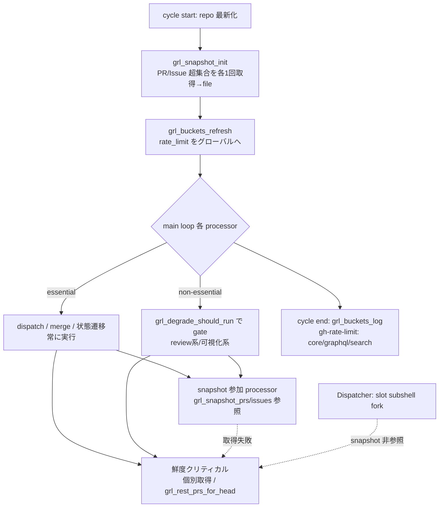

# Design Document

## Overview

**Purpose**: この機能は watcher の 1 cron tick（サイクル）における **GitHub API rate limit**
（core / graphql / search バケット）の消費削減と枯渇耐性を、運用者に提供する。
**Users**: idd-claude を self-hosting する運用者が、既存の cron / launchd 運用のまま、
必要な機能を env で明示 opt-in して利用する。
**Impact**: 現在は各プロセッサが独立に PR 一覧 / Issue 一覧を取得し GraphQL バケットを重複消費
している。本機能は (1) サイクル内スナップショット共有、(2) バケット別残量の可視化、(3) 残量閾値
割れ時の WARN と非必須プロセッサ縮退、(4) 状態遷移系ラベル操作の限定リトライ、(5) hot path の
一部の REST（core バケット）への負荷分散、の 5 点を **すべて opt-in / 既定安全側 no-op** で導入し、
未設定環境の挙動を一切変えずに rate limit 耐性を高める。

用語の分離（要件 Note）: 本 Issue が扱うのは **GitHub API rate limit** であり、Claude Max quota
（`rate_limit_event` / #66・#104 の領分・既存 `quota-aware.sh` / `qa_`）とは別物である。混同を避けるため、
本機能のログ prefix は `gh-rate-limit:`、env prefix は `GH_API_`、module prefix は `grl_` に統一する。

> **分量について**: 本設計は 5 つの半独立機能を 1 module に束ね、9 個の一覧取得プロセッサへ横断
> 配線するため複雑度が高い。標準（≤300 行）を超え複雑バジェット（≤600 行）内に収める。行数抑制の
> ため、既存コードは `file:line` 参照で指し、consumer 差し替えは「同パターン」参照と等価性表で圧縮する。

### Goals
- 5 機能すべてを独立 env gate で opt-in 化し、未設定時は導入前と byte 等価な挙動を保つ（Req 1 / NFR 1）
- スナップショット共有で「参加プロセッサ全体の PR 一覧 / Issue 一覧取得」を各 1 回/サイクルへ集約（NFR 3.1）
- 取得・残量取得・負荷分散のいずれの失敗も個別取得へ fail-safe フォールバックしサイクルを継続（NFR 2.1）
- 状態遷移系ラベル操作を有限回リトライし孤児化を防ぐ（Req 5 / NFR 2.3）
- 成功基準: `shellcheck` 新規警告 0、fixture テストが live API 呼び出しなしで判定を検証（NFR 6）

### Non-Goals
- GitHub App token 化による上限引き上げ（別 Issue / Out of Scope）
- stale-pickup-reaper の sess 判定修正（#520）
- webhook / イベント駆動への移行、GitHub Actions 版への同等導入（Out of Scope）
- 縮退の soft/hard 2 段階化（本設計は単一閾値。将来拡張余地として非対象化。後述 Decisions 参照）
- Claude Max quota（`rate_limit_event`）の検知・resume（`quota-aware.sh` の領分）

## Architecture

### Existing Architecture Analysis
- **サイクル骨格**: `local-watcher/bin/issue-watcher.sh`（約 888 行）は config source → module loader
  → guard hook → repo 最新化 → main loop（各 `process_*` の直列 call site）→ Phase C Dispatcher。
  各プロセッサは `X_ENABLED != true` で早期 return する opt-in パターンを共有する。
- **一覧取得の重複**: 9 個の「open PR scan」/「open Issue scan」プロセッサがそれぞれ独立に
  `gh pr list` / `gh issue list`（内部 GraphQL）を発行する（後述 List Fetch Inventory）。
- **Dispatcher の並列**: slot worker は `( _slot_run_issue "$slot" "$issue" ) &`（`issue-watcher.sh:855`）で
  **subshell fork** される。subshell は親の環境・fd・グローバル変数を継承し、同一 `REPO_DIR` 上で動く。
  ただし slot worker が行う PR 参照は per-branch / per-issue の **鮮度クリティカル**な個別取得であり、
  main-loop の共有スナップショットは読まない（後述 Decision 1）。
- **module 化規約**: 新機能は `modules/<name>.sh`（関数定義のみ・トップレベル副作用なし）へ切り出し、
  `REQUIRED_MODULES` へ登録、install.sh の `modules/*.sh` glob で配布（installer 変更不要）。
  `local-watcher/` は `repo-template/` にミラーされないため repo-template 同期対象外（README のみ更新）。
- **既存 rate limit 検出は Claude quota 用**（`qa_detect_rate_limit` / `slot-worker-resume.sh:151` の
  `grep -qiE 'rate.?limit|RATE_LIMITED|HTTP 429'`）。GitHub API rate limit の可視化・閾値制御は未実装。

### Key Decisions（設計判断・Open Questions 確定）
- **Decision 1（Open Q1 スナップショット実現方式）**: **一時ファイル方式**を採る。`$HOME/.issue-watcher/api-snapshot/$REPO_SLUG/`
  配下へ main プロセスがサイクル冒頭 1 回だけ `mktemp`→`mv` で atomic 書き込みし、main-loop の逐次 processor が
  read-only 参照する。flock で単一インスタンスが保証されるため **単一 writer**、slot subshell は snapshot を
  参照しない（鮮度クリティカルは個別取得）ため **並行読取競合が発生しない**。有効性は main プロセスグローバル
  変数 `GRL_SNAPSHOT_STATUS` が保持し、ライフサイクルは「毎サイクル冒頭上書き」（前サイクル残骸は上書きと
  active フラグで無効化）。env / メモリ共有案は subshell 跨ぎ or 揮発性の点で不採用。
- **Decision 2（Open Q2/Q3 縮退の分類と閾値段階）**: **単一閾値**（soft/hard 2 段階を設けない）。graphql 残量が
  `GH_API_DEGRADE_GRAPHQL_THRESHOLD` を下回ったら WARN と非必須 skip を同時に発火する。2 段化は複雑度に見合う
  便益が小さく、必須処理保護は essential 分類で担保済みのため単純化を優先（Non-Goal）。
- **Decision 3（Open Q4 REST 逃がし対象）**: **per-branch PR 存在確認**（`gh pr list --head <branch> --state all`）を
  `gh api repos/{owner}/{repo}/pulls?head=` へ逃がす。`gh pr list` は GraphQL search、REST pulls は core バケット
  であり、head 指定 PR 列挙という等価結果が得られる（closedByPullRequestsReferences 等の GraphQL 固有参照は
  REST 等価がなく対象外）。
- **Decision 4（Open Q5 gate 粒度）**: **機能別 5 gate**（単一マスタ gate にしない）。機能ごとに独立 opt-in でき
  README で一覧化しやすく、既存 opt-in（8 種）と同形式。命名は `GH_API_<機能>_ENABLED`（英語固定・既定 false）。

### Architecture Pattern & Boundary Map

採用パターン: 単一新規 module `api-rate-guard.sh`（prefix `grl_`）に 5 機能を **cohesive に集約**する
（全機能が「GitHub API rate limit の削減・耐性」という単一テーマを共有し、env prefix・ログ prefix も
共有するため、3 つに分割するより 1 module の方が概念の散逸を防げる。CLAUDE.md「機能追加ガイドライン §1」）。
`quota-aware.sh` への同居は用語混同を招くため採らない。



**Architecture Integration**:
- 採用パターン: opt-in gate + fail-safe fallback（既存 8 種の opt-in と同形式）
- 機能境界: fetch 経路（Req 2 snapshot / Req 6 REST offload）と budget 経路（Req 3 可視化 / Req 4 縮退）と
  mutation 経路（Req 5 label retry）の 3 系統を 1 module 内の別関数群として分離
- 既存パターン維持: `X_ENABLED != true` 早期 return、`|| xxx_warn` fail-continue、`[$REPO]` prefix ロガー
- 新規コンポーネント根拠: 横断的な「サイクル 1 回取得」の集約点は既存 module のどれにも属さないため新設

### Technology Stack

| Layer | Choice / Version | Role in Feature | Notes |
|-------|------------------|-----------------|-------|
| Frontend / CLI | bash 4+ | 全ロジック | `set -euo pipefail` は本体側宣言 |
| Backend / Services | `gh` CLI（`gh pr list` / `gh issue list` / `gh api rate_limit` / `gh api repos/.../pulls`） | 一覧取得・残量取得・REST 逃がし | `rate_limit` 参照は非消費（下記 References） |
| Data / Storage | JSON ファイル（`$HOME/.issue-watcher/api-snapshot/$REPO_SLUG/`） | サイクル内スナップショット | atomic mv 書き込み・単一 writer |
| Messaging / Events | なし | — | ポーリング構造維持 |
| Infrastructure / Runtime | cron / launchd | 既存起動経路 | flock 単一インスタンス前提 |

## File Structure Plan

### 新規ファイル

```
local-watcher/bin/modules/
└── api-rate-guard.sh          # 新規 module / prefix grl_ / 5 機能を集約
                               #   Req2 snapshot: grl_snapshot_init/_prs/_issues/_active/_pr_snapshot_or_live/_issue_snapshot_or_live
                               #   Req3 bucket   : grl_buckets_log
                               #   Req4 degrade  : grl_buckets_refresh / grl_degrade_should_run
                               #   Req5 retry    : grl_retry_label_op
                               #   Req6 REST     : grl_rest_prs_for_head
local-watcher/test/
├── api_rate_guard_snapshot_test.sh   # 超集合取得・accessor・active 判定・fallback（fixture）
├── api_rate_guard_degrade_test.sh    # bucket parse・閾値判定・essential/non-essential skip
├── api_rate_guard_retry_test.sh      # rate-limit 検出リトライ・有限打ち切り・安全側
└── api_rate_guard_rest_test.sh       # REST→JSON 正規化（state MERGED 変換）・fallback
```

### 変更ファイル
- `local-watcher/bin/modules/core_utils.sh` — `grl_log` / `grl_warn` / `grl_error` を追加（既存 `qa_log` と同形式・prefix `gh-rate-limit:`）
- `local-watcher/bin/watcher-config.sh` — 新規 env 12 個の定義・正規化ブロックを追加（後述 env 表）
- `local-watcher/bin/issue-watcher.sh` — (a) `REQUIRED_MODULES` へ `"api-rate-guard.sh"` を追加（`env-loader.sh` の直後）、(b) repo 最新化直後に `grl_snapshot_init` / `grl_buckets_refresh` を配線、(c) 非必須 7 プロセッサの call site を `grl_degrade_should_run` で gate、(d) cycle 終端（`echo 完了` 直前）に `grl_buckets_log` を配線
- **PR snapshot 参加 9 module**: `merge-queue.sh` / `auto-rebase.sh` / `auto-merge.sh` / `auto-merge-design.sh` / `auto-merge-disarm.sh` / `pr-iteration.sh` / `pr-reviewer.sh` / `pr-design-reviewer.sh` / `security-review.sh` — 各 fetch を `grl_pr_snapshot_or_live` 経由へ差し替え、snapshot 参照時の client jq を現行 `--search` 全条件に拡張（等価性表）
- **Issue snapshot 参加 4 module**: `dependency-resolver.sh` / `path-overlap.sh` / `stale-pickup-reaper.sh` / `quota-aware.sh` — 各 fetch を `grl_issue_snapshot_or_live` 経由へ差し替え
- **REST offload 対象**: `slot-worker-resume.sh`（`gh pr list --head` 2 箇所）/ `stage-checkpoint.sh`（同 2 箇所）— `grl_rest_prs_for_head` 経由へ差し替え
- **state retry 対象**: `impl-pipeline.sh`（resumable-return の `claude-picked-up` 除去 / 例 `impl-pipeline.sh:273-281`）/ `slot-worker.sh:386-387` — `grl_retry_label_op` 経由へ差し替え
- `README.md` — 「オプション機能一覧」へ 5 機能の opt-in 手順・env 表・バケットログの読み方・縮退優先順を追記

## List Fetch Inventory（差し替え対象の棚卸し）

| # | プロセッサ / 関数 | ファイル:行 | 種別 | 現行 server `--search` 骨子 | snapshot 参加 | 根拠 |
|---|---|---|---|---|---|---|
| 1 | merge-queue | `merge-queue.sh:205` | PR open | `review:approved -label:needs-rebase -label:failed -draft:true` | ✅ PR | open PR scan |
| 2 | merge-queue-recheck | `merge-queue.sh:352` | PR open | 同上系 | ✅ PR | open PR scan |
| 3 | auto-rebase | `auto-rebase.sh:62` | PR open | `review:approved label:needs-rebase -label:failed -draft:true` | ✅ PR | open PR scan |
| 4 | auto-merge | `auto-merge.sh:260` | PR open | `label:ready-for-review -label:failed -label:needs-decisions -draft:true` | ✅ PR | open PR scan |
| 5 | auto-merge-design | `auto-merge-design.sh:275` | PR open | `-draft:true`（head design パターン） | ✅ PR | open PR scan |
| 6 | auto-merge-disarm | `auto-merge-disarm.sh:230` | PR open | armed PR 走査 | ✅ PR | open PR scan |
| 7 | pr-iteration | `pr-iteration.sh:82` | PR open | needs-iteration 系 | ✅ PR | open PR scan |
| 8 | pr-reviewer | `pr-reviewer.sh:243` | PR open | `-draft:true` | ✅ PR | open PR scan |
| 9 | pr-design-reviewer | `pr-design-reviewer.sh:162` | PR open | `-draft:true` | ✅ PR | open PR scan |
| 10 | security-review | `security-review.sh:333` | PR open | `-draft:true` | ✅ PR | open PR scan |
| 11 | dependency-resolver sweep | `dependency-resolver.sh:798` | Issue open | `label:auto-dev` 系 | ✅ Issue | auto-dev ⊆ snapshot |
| 12 | path-overlap holder 列挙 | `path-overlap.sh:405` | Issue open | in-flight ラベル群 | ✅ Issue | auto-dev ⊆ snapshot |
| 13 | stale-pickup-reaper | `stale-pickup-reaper.sh:262,283` | Issue open | `label:claude-picked-up` / `claude-claimed` | ✅ Issue | picked/claimed は auto-dev 保持 |
| 14 | quota-resume | `quota-aware.sh:682` | Issue open | `label:needs-quota-wait` | ✅ Issue | auto-dev 保持 |
| 15 | Dispatcher 候補クエリ | `issue-watcher.sh:699,708` | Issue open | 多数 `-label:` + hotfix tier + sort | ❌ 除外 | 鮮度クリティカル（claim 公平性 / Req 2.4） |
| 16 | failed-recovery | `failed-recovery.sh:127,182` | Issue+PR | `label:claude-failed` 系 | ❌ 除外 | 別 state / claude 起動重・保守的に個別維持 |
| 17 | design-review-release / promote | `design-review-release.sh:71` 他 | PR **merged** | `--state merged` | ❌ 除外 | open 超集合に含まれない state |
| 18 | check_existing_impl_pr | `slot-worker-resume.sh:143`（GraphQL） | per-issue | closedByPullRequestsReferences | ❌ 除外 | claim 鮮度クリティカル / Req 2.4 |
| 19 | per-branch PR 存在 | `slot-worker-resume.sh:318,1017` / `stage-checkpoint.sh:192,694` | per-branch | `--head <branch> --state all` | ❌ 除外（→ REST 対象） | 鮮度クリティカル / Req 6 REST 逃がし |

> **NFR 3.1 の充足**: 「参加プロセッサ」= #1〜#14。有効時これらは snapshot（PR 1 file / Issue 1 file）を
> 参照し、参加プロセッサ全体の open PR 一覧取得・open Issue 一覧取得はそれぞれ 1 回/サイクルへ集約される。
> #15〜#19 は鮮度クリティカル / 別 state のため Req 2.4 に基づき個別取得を維持する（非参加）。

## Requirements Traceability

（NFR は N.M 形式 ID を持たないため、対応する機能 AC 行内に併記する。functional AC は各 ID を literal 列挙する。）

| Requirement | Summary | Components | Flows |
|---|---|---|---|
| 1.1, 1.2, 1.3 | opt-in / 既定安全側 no-op / 不正値正規化（NFR1.1） | watcher-config.sh 正規化ブロック / 各 gate 早期 return | 未設定→全 no-op |
| 1.4, 1.5, 1.6 | 既存 env 名・ラベル・exit code・cron・ログ先不変 / 新規ラベル不導入（NFR1.2） | 新規 `GH_API_*` 名のみ追加・既存識別子非変更 | — |
| 2.1, 2.2 | サイクル冒頭 1 回取得・再取得しない（NFR3.1） | `grl_snapshot_init` / `_prs` / `_issues` | cycle start fetch → 参加 processor 参照 |
| 2.3 | 個別取得と等価判定 | `grl_pr_snapshot_or_live` / `grl_issue_snapshot_or_live` + 等価性表 | client jq が server search を完全再現 |
| 2.4 | 鮮度クリティカルは個別取得 | Inventory #15,#18,#19 非参加 | 個別 fetch 維持 |
| 2.5, 2.6 | 取得失敗は個別取得へ fallback + warn（NFR2.1） | `grl_snapshot_active` false 時 or-live 分岐 / `grl_warn` | fetch fail → active=off |
| 3.1, 3.2 | 終端バケット 1 行ログ / `/rate_limit` 非消費経路（NFR4.1） | `grl_buckets_log` | cycle end fetch + log |
| 3.3, 3.4 | grep 可能固定書式 / 取得失敗は継続 + warn | `grl_buckets_log` 書式 `gh-rate-limit:` | — |
| 4.1, 4.2 | 閾値割れ WARN / 非必須 skip（NFR4.2 bucket・残量・閾値含む） | `grl_buckets_refresh` / `grl_degrade_should_run` | start fetch → 分類表で gate |
| 4.3, 4.6 | dispatch・状態遷移は不 skip / 縮退無効時は不 skip（NFR2.2） | essential 分類（無 gate） / gate off で常に run | — |
| 4.4, 4.5 | 閾値 env 調整・保守的既定 / skip 根拠ログ | `GH_API_DEGRADE_GRAPHQL_THRESHOLD` / skip ログ | — |
| 5.1, 5.2, 5.3 | resumable-return label 操作リトライ / rate-limit 起因 / 上限 env（NFR2.3 有限） | `grl_retry_label_op` | resumable-return 除去箇所 |
| 5.4, 5.5, 5.6 | 未完遂は孤児化しない / 安全側維持 / 試行ログ（NFR2.4） | `grl_retry_label_op`（label 残置で次 tick 再評価） | — |
| 6.1, 6.2 | hot path REST 逃がし / GraphQL と等価判定 | `grl_rest_prs_for_head`（state 正規化） | per-branch 存在確認 |
| 6.3, 6.4 | REST 失敗は従来経路 fallback / 無効時は GraphQL 維持（NFR2.1） | `grl_rest_prs_for_head` fallback | — |
| 7.1, 7.2, 7.3 | opt-in 手順 / env 一覧 / ログ読み方・縮退優先順を README 記載 | README.md「オプション機能一覧」 | ドキュメント |
| NFR5.1 | 未信頼入力の quote / `--arg` / ID 検証維持 | 全 jq は `--arg`、`gh` は `--` / 数値検証 | — |
| NFR6.1, 6.2 | shellcheck 0 / fixture テスト（live API なし） | 4 test ファイル | — |

## Components and Interfaces

### api-rate-guard.sh（新規 module / prefix `grl_`）

| Field | Detail |
|-------|--------|
| Intent | GitHub API rate limit の削減・可視化・縮退・リトライ・負荷分散を集約する単一 module |
| Requirements | 2.1, 2.2, 2.3, 2.5, 2.6, 3.1, 3.4, 4.1, 4.2, 4.5, 5.1, 5.6, 6.1, 6.3 |

**Responsibilities & Constraints**
- 関数定義のみ（トップレベル副作用なし）。source 時に代入・実行を行わない
- snapshot / bucket 状態はモジュールグローバル変数 + JSON ファイルで保持（main プロセス単一 writer）
- すべての新挙動は対応 gate（`GH_API_*_ENABLED`）が `true` 厳密一致のときのみ発火。それ以外は no-op
- データ所有権: snapshot file は本 module のみが書き、参加 processor は読むのみ（read-only 共有）
- invariant: gate off / 取得失敗のいずれでも、呼び出し側は従来の個別取得へ透過フォールバックできる

**Dependencies**
- Inbound: main loop（`issue-watcher.sh`）— snapshot/bucket init・degrade gate・bucket log (Critical)
- Inbound: 参加 processor 13 module — `grl_*_snapshot_or_live` 経由取得 (Critical)
- Inbound: resume/checkpoint/impl-pipeline — `grl_rest_prs_for_head` / `grl_retry_label_op` (High)
- Outbound: `gh` CLI（list / api rate_limit / api repos pulls）(Critical)
- External: `jq`（`--arg` / `--argjson` で未信頼値注入）/ `date` / `mktemp` / `mv` (High)

**Contracts**: Service [x] / API [ ] / Event [ ] / Batch [ ] / State [x]

##### Service Interface（シグネチャ・疑似コード。実装本文は Developer）

```bash
# ── Req 2: snapshot ──────────────────────────────────────────
# サイクル冒頭で PR/Issue 超集合を各1回取得し file へ atomic 書き込み。成功で active=on。
# gate off なら即 return 0（no-op / active=off のまま）。取得失敗は warn + active=off で継続。
grl_snapshot_init()            # rc: 0 常時（失敗も 0 = fail-safe）; 副作用: file 書込 + GRL_SNAPSHOT_STATUS
grl_snapshot_active()          # rc: 0=当サイクル有効 / 1=無効（gate off or 取得失敗）
grl_snapshot_prs()             # stdout: PR 超集合 JSON 配列（file cat）
grl_snapshot_issues()          # stdout: Issue 超集合 JSON 配列
# 参加 processor 用ラッパ: active なら超集合を返し、caller が client jq で絞る。
# 非 active なら live 引数で従来 gh を実行（byte 等価）。
grl_pr_snapshot_or_live()      # $1=timeout $2=search $3=jsonfields $4=limit → stdout PR JSON
grl_issue_snapshot_or_live()   # $1=timeout $2=search $3=jsonfields $4=limit → stdout Issue JSON

# ── Req 3/4: bucket 可視化・縮退 ─────────────────────────────
grl_buckets_refresh()          # gh api rate_limit → グローバル remaining/limit（degrade 用）; 失敗 warn+継続
grl_buckets_log()              # cycle 終端に固定書式 1 行ログ; gate off or 失敗は warn/no-op
grl_degrade_should_run()       # $1=processor名 → rc 0=実行 / 1=skip(+skip ログ); gate off は常に 0

# ── Req 5: 状態遷移 label 操作リトライ ───────────────────────
# $1=issue番号 $@(2..)=gh issue edit 引数。rate-limit 失敗のみ上限まで再試行。
grl_retry_label_op()           # rc: 最終 gh の rc; gate off は 1 回のみ実行(=従来挙動)

# ── Req 6: REST 逃がし ───────────────────────────────────────
# $1=branch $2=state(all|open) → stdout: gh pr list --head 互換 JSON（number/state/headRefName/url）
grl_rest_prs_for_head()        # offload on: gh api repos/.../pulls?head=; off/失敗: gh pr list --head
```

- **Preconditions**: `$REPO` / `$REPO_SLUG` / `GH_API_*` 正規化済み（config source 済み）
- **Postconditions**: `grl_snapshot_active`=on のとき `grl_snapshot_prs/issues` は当サイクルの超集合を返す
- **Invariants**: gate off → 全関数が従来経路と等価な出力を返す（snapshot_or_live は live へ、retry は 1 回、rest は gh pr list へ）

##### snapshot 参照時の等価性ルール（Req 2.3 の要）

参加 processor は snapshot（超集合）を参照する際、**現行 `--search` の全条件を client jq で再現**する。
変換規則（Developer が各 consumer へ適用）:

| server `--search` 条件 | 等価 client jq select |
|---|---|
| `review:approved` | `select(.reviewDecision == "APPROVED")` |
| `-draft:true` | `select(.isDraft == false)` |
| `label:"X"` | `select((.labels // [] \| map(.name) \| index("X")) != null)` |
| `-label:"X"` | `select((.labels // [] \| map(.name) \| index("X")) == null)` |

例（merge-queue）: 現行 client jq は `isDraft==false / reviewDecision==APPROVED / head pattern / owner` のみで
`-label:needs-rebase` `-label:failed` を再現しないため、snapshot 参照時に上記 2 つの `index==null` select を
**追加**して等価にする。既存の live 経路（`--search` そのまま）は変更しないため gate off 時は byte 等価。

超集合 `--json` フィールド union:
- PR: `number,title,headRefName,headRefOid,baseRefName,isDraft,mergeable,mergeStateStatus,reviewDecision,labels,url,headRepositoryOwner,autoMergeRequest`
- Issue: `number,title,body,url,labels,author`

### issue-watcher.sh 配線（call site 変更のみ）

- repo 最新化直後（`process_quota_resume` の直前）: `grl_snapshot_init || grl_warn ...` → `grl_buckets_refresh || true`
- 非必須 7 プロセッサ call site: `grl_degrade_should_run "<name>" && { process_X || xxx_warn ...; }` 形へ包む
- cycle 終端（`echo 完了` 直前）: `grl_buckets_log || true`

### プロセッサ essential / non-essential 分類（Req 4.2 / 4.3 / NFR 2.2）

| プロセッサ | 分類 | 縮退時 | 根拠 |
|---|---|---|---|
| quota-resume / merge-queue(-recheck) / auto-rebase / auto-merge(-design/-disarm/-merged) / promote-pipeline | **essential** | 実行 | dispatch/merge/promote の前進・状態遷移 |
| stale-pickup-reaper / design-review-release | **essential** | 実行 | 状態遷移（un-orphan / release ラベル後始末）— NFR 2.2 |
| Dispatcher | **essential** | 実行 | dispatch 本体 |
| pr-reviewer / claude-review-catchup / claude-review-merge-gate-visibility | non-essential | skip | レビュー・可視化系 |
| pr-design-reviewer / security-review | non-essential | skip | レビュー系 |
| pr-iteration / failed-recovery | non-essential | skip | claude 起動を伴う反復・回復（次 tick 再試行で安全） |

縮退判定: `grl_buckets_refresh` が取得した **graphql バケット残量 < `GH_API_DEGRADE_GRAPHQL_THRESHOLD`** で
degrade active。graphql（5,000/h 共有）が枯渇動機のため主対象とする。active 時、非必須 call site の
`grl_degrade_should_run` が 1（skip）を返し、`gh-rate-limit: skip processor=<name> reason=degrade bucket=graphql remaining=<r> threshold=<t>` を出力（Req 4.5）。

### 新規 env var 一覧（watcher-config.sh へ追加）

| env | 既定 | 正規化 | 対応 |
|---|---|---|---|
| `GH_API_SNAPSHOT_ENABLED` | `false` | `true` 厳密一致のみ ON、他は false | Req 2 |
| `GH_API_SNAPSHOT_PR_LIMIT` | `100` | 非整数 / ≤0 → 100 | Req 2 |
| `GH_API_SNAPSHOT_ISSUE_LIMIT` | `100` | 非整数 / ≤0 → 100 | Req 2 |
| `GH_API_SNAPSHOT_DIR` | `$HOME/.issue-watcher/api-snapshot/$REPO_SLUG` | — | Req 2 |
| `GH_API_SNAPSHOT_GH_TIMEOUT` | `60` | 非整数 / ≤0 → 60 | Req 2 |
| `GH_API_BUCKET_LOG_ENABLED` | `false` | `true` のみ ON | Req 3 |
| `GH_API_DEGRADE_ENABLED` | `false` | `true` のみ ON | Req 4 |
| `GH_API_DEGRADE_GRAPHQL_THRESHOLD` | `500` | 非整数 / <0 → 500 | Req 4.4（保守的既定） |
| `GH_API_STATE_RETRY_ENABLED` | `false` | `true` のみ ON | Req 5 |
| `GH_API_STATE_RETRY_MAX_ATTEMPTS` | `3` | 非整数 / ≤0 → 3 | Req 5.3（有限 / NFR2.3） |
| `GH_API_STATE_RETRY_SLEEP` | `2` | 非整数 / <0 → 2 | Req 5（試行間 backoff 秒） |
| `GH_API_REST_OFFLOAD_ENABLED` | `false` | `true` のみ ON | Req 6 |

## Data Models

### Snapshot ファイル
- 配置: `$GH_API_SNAPSHOT_DIR/prs.json` / `issues.json`（既定 `$HOME/.issue-watcher/api-snapshot/$REPO_SLUG/`）
- 書き込み: `mktemp` → 書込 → `mv`（atomic）。単一 writer（flock 済み main プロセス・サイクル冒頭 1 回）
- 内容: `gh pr/issue list` の JSON 配列そのまま（超集合フィールド）
- ライフサイクル: 毎サイクル冒頭で上書き（前サイクル残骸は上書きで無効化）。`GRL_SNAPSHOT_STATUS` グローバルが
  当サイクルの有効性を持つため、古い file が残っても `active=off` なら参照されない
- 未信頼入力: file には Issue/PR 本文・ラベル・branch 名が含まれる。参照側は既存同様 `jq --arg` で扱い、
  `gh` / `git` へ渡す branch 名・番号は使用直前に `--` / `^[0-9]+$` 検証を維持（NFR 5.1）

### バケット状態（グローバル）
- `GRL_BUCKET_GRAPHQL_REMAINING` / `_LIMIT`、core / search 同様。`grl_buckets_refresh` が代入、degrade 判定が参照

## Error Handling

### Error Strategy
すべての新経路は **fail-safe（失敗しても従来経路へ倒す）** を原則とする。gate off・取得失敗・
parse 失敗・REST 失敗のいずれでも、呼び出し側は個別取得 / 従来 mutation / 従来 GraphQL へフォールバックし、
サイクルを中断しない（NFR 2.1）。

### Error Categories and Responses
- **取得失敗（snapshot / bucket / REST）**: warn ログ（`grl_warn`）+ フォールバック。`grl_snapshot_active`=off、
  `grl_rest_prs_for_head` は `gh pr list --head` へ、`grl_buckets_log` は取得失敗を warn（Req 2.5/2.6, 3.4, 6.3）
- **rate-limit 起因 mutation 失敗（Req 5）**: `grl_retry_label_op` が `rate.?limit|RATE_LIMITED|HTTP 429|too many requests`
  を検出したときのみ `GH_API_STATE_RETRY_MAX_ATTEMPTS` まで sleep 付き再試行。非 rate-limit 失敗は再試行せず即返す
  （不要な二次消費回避）。上限到達でも Issue は `claude-picked-up` を保持したまま次 tick 再評価（孤児化しない / Req 5.4）
- **不正 env**: config で安全側正規化（gate は false、数値は既定へ）。typo で機能が誤有効化されない（Req 1.3）
- **安全側原則（NFR 2.4）**: リトライ・縮退・snapshot のいずれも holder からのラベル誤除去等を発生させない
  （retry は既存 label 操作の rc を変えず回数のみ増やす。degrade は essential を skip しない）

## Testing Strategy

- **Unit Tests**（`extract_function` + fixture / live API なし / NFR 6.2）:
  1. `grl_pr_snapshot_or_live`: active 時に超集合 fixture を返し、非 active 時に live 引数へ委譲（stub `gh`）
  2. 等価性: merge-queue 相当 client jq が `-label:needs-rebase/-label:failed` を除外することを fixture で確認
  3. `grl_degrade_should_run`: graphql 残量 < 閾値で non-essential=skip / essential 名は常に run
  4. `grl_retry_label_op`: rate-limit stderr fixture で N 回試行・非 rate-limit は 1 回・上限打ち切り
  5. `grl_rest_prs_for_head`: REST JSON（`state:closed`+`merged_at`）→ `MERGED` 正規化、失敗時 `gh pr list` fallback
- **Integration Tests**:
  1. `grl_snapshot_init` 失敗 → `grl_snapshot_active`=off → 参加 processor が live 取得へフォールバック
  2. gate 全 off（既定）で main loop の一覧取得回数・ログが導入前と一致（no-op）
  3. degrade active 時に非必須 call site が skip され essential が実行される
- **E2E/Smoke**:
  1. `env -i` 最小 PATH + dry-run（対象なし）で `処理対象の Issue なし` 正常終了（gate 全 off）
  2. `GH_API_BUCKET_LOG_ENABLED=true` で cycle 終端に `gh-rate-limit: core=.. graphql=.. search=..` 1 行出力
  3. `shellcheck local-watcher/bin/modules/*.sh` 新規警告 0（NFR 6.1）

## Security Considerations（NFR 5.1）
- snapshot file は `$HOME/.issue-watcher/` 配下（user-owned・単一 writer・flock 保護）で symlink TOCTOU を回避（CLAUDE.md §6）
- 参照側の未信頼値（本文・ラベル・branch 名）は `jq --arg` 注入、`gh`/`git` へは `--` でオプション打ち切り、
  Issue 番号は `^[0-9]+$`、`head=` へ渡す branch 名はクォート維持（既存原則を崩さない）
- REST offload の URL 組み立ては `gh api "repos/$REPO/pulls" -f head="$owner:$branch" -f state="$state"`（`-f` 経由で
  値注入。URL へ未信頼値を inline 展開しない）

## Supporting References
- GitHub REST `GET /rate_limit` はプライマリ rate limit を消費しない（Req 3.2 と整合）: <https://docs.github.com/en/rest/rate-limit/rate-limit>
- `gh pr list` は GraphQL search 経由、`gh api repos/{owner}/{repo}/pulls` は REST core バケット経由（Req 6 の逃がし根拠）
